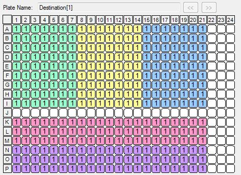

```{r set-options, echo=FALSE, cache=FALSE}
options(width = 100)
```

Load scripts and libraries.

```{r}
library("magrittr")   # For its diamond pipe operators
library("ggplot2")    # For plotting
library("platetools") # For defining and manipulating 384-well plates
library("plyr")
library("tibble")     # For comfortable command-line operations

# The set_block function that will become part of platetools
source("https://raw.githubusercontent.com/charles-plessy/platetools/76213accb1704d11a2d96fb1f6284d0b46117778/R/set_block.R")

# Do not load the whole smallCAGEqc package, just get the barcode data.
data("nanoCAGE2017barcodes", package = "smallCAGEqc")
```


Plate layout
============

Create a data frame representing the contents of each well.

```{r make_plate_df}
plate           <- tibble(well = platetools::num_to_well(1:384, plate = "384"))
plate$row       <- sub("..$", "", plate$well) %>% factor
plate$col       <- sub("^.",  "", plate$well) %>% as.numeric %>% factor
```

MASTER_MIX
==========

Master mix volume 
------------------

350 nL of mastermix added to each well

```{r MASTER_MIX_vol}
plate %<>%
  set_block("A01~P21", "MASTER_MIX_vol", 350) %>%
  set_block("K22~L24", "MASTER_MIX_vol", 350) %>%
  set_block("M23",     "MASTER_MIX_vol", 350) %>%
  set_block("N22~O24", "MASTER_MIX_vol", 350) %>%
  set_block("P23",     "MASTER_MIX_vol", 350)
```

TSO
===

TSO concentration
------------------

 - 80 μM (  +100 nL of 400 μM A1-A7 source wells) in A1-A7, A8-A14, A15-A21, K1-K7, N1-N7 
 - 40 μM ( +50 nL of 400 μM A1-A7 source wells) in B1-B7, B8-B14, B15-B21, L1-L7, O1-O7
 - 20 μM ( +25 nL of 400 μM A1-A7 source wells) in C1-C7, C8-C14, C15-C21, M1-M7, P1-P7
 - 10 μM ( +100 nL of 50 μM source wells) in D1-D7, D8-D14, D15-D21, K8-K14, N8-N14 + J1-J7, J8-J14, J15-J21, K22-K24, L22-L24, M23, N22-N24, O22-O24, P23
 - 5 μM ( +50 nL of 50 μM source wells) in E1-E7, E8-E14, E15-E21, L8-L14, O8-O14
 - 2,5 μM (+25 nL of 50 μM source wells) in F1-F7, F8-F14, F15-F21, M8-M14, P8-P14
 - 1,25 μM (+100 nL of 6,25 μM source wells) in G1-G7, G8-G14, G15-G21, K15-K21, N15-N21
 - 0,625 μM (+50 nL of 6,25 μM source wells) in H1-H7, H8-H14, H15-H21, L15-L21, O15-O21
 - 0,3125 μM (+25 nL of 6,25 μM source wells) in I1-I7, I8-I14, I15-I21, M15-M21, P15-P21
 

```{r TSO_concentration}
plate %<>%
  set_block("A01~A21", "TSO", 80) %>%
  set_block("K01~K07", "TSO", 80) %>%
  set_block("N01~N07", "TSO", 80) %>%
  set_block("B01~B21", "TSO", 40) %>%
  set_block("L01~L07", "TSO", 40) %>%
  set_block("O01~O07", "TSO", 40) %>%
  set_block("C01~C21", "TSO", 20) %>%
  set_block("M01~M07", "TSO", 20) %>%
  set_block("P01~P07", "TSO", 20) %>%
  set_block("D01~D21", "TSO", 10) %>%
  set_block("K08~K14", "TSO", 10) %>%
  set_block("N08~N14", "TSO", 10) %>%
  set_block("J01~J21", "TSO", 10) %>%
  set_block("K22~K24", "TSO", 10) %>%
  set_block("L22~L24", "TSO", 10) %>%
  set_block("M23",     "TSO", 10) %>%
  set_block("N22~N24", "TSO", 10) %>%
  set_block("O22~O24", "TSO", 10) %>%
  set_block("P23",     "TSO", 10) %>% 
  set_block("E01~E21", "TSO", 5)  %>%
  set_block("L08~L14", "TSO", 5)  %>%
  set_block("O08~O14", "TSO", 5)  %>%
  set_block("F01~F21", "TSO", 2.5) %>%
  set_block("M08~M14", "TSO", 2.5) %>%
  set_block("P08~P14", "TSO", 2.5) %>%
  set_block("G01~G21", "TSO", 1.25) %>%
  set_block("K15~K21", "TSO", 1.25) %>%
  set_block("N15~N21", "TSO", 1.25) %>%
  set_block("H01~H21", "TSO", 0.625) %>%
  set_block("L15~L21", "TSO", 0.625) %>%
  set_block("O15~O21", "TSO", 0.625) %>%
  set_block("I01~I21", "TSO", 0.3125) %>%
  set_block("M15~M21", "TSO", 0.3125) %>%
  set_block("P15~P21", "TSO", 0.3125)
```

TSO volume
-----------

25 (1-drop), 50 (2-drops) or 100 nL (4-drops) of TSO added, depending on the final concentration

```{r TSO_volume}
plate %<>%
  set_block("A01~A21", "TSO_vol", 100) %>%
  set_block("K01~K07", "TSO_vol", 100) %>%
  set_block("N01~N07", "TSO_vol", 100) %>%
  set_block("B01~B21", "TSO_vol", 50)  %>%
  set_block("L01~L07", "TSO_vol", 50)  %>%
  set_block("O01~O07", "TSO_vol", 50)  %>%
  set_block("C01~C21", "TSO_vol", 25)  %>%
  set_block("M01~M07", "TSO_vol", 25)  %>%
  set_block("P01~P07", "TSO_vol", 25)  %>%
  set_block("D01~D21", "TSO_vol", 100) %>%
  set_block("K08~K14", "TSO_vol", 100) %>%
  set_block("N08~N14", "TSO_vol", 100) %>%
  set_block("J01~J21", "TSO_vol", 100) %>%
  set_block("K22~K24", "TSO_vol", 100) %>%
  set_block("L22~L24", "TSO_vol", 100) %>%
  set_block("M23",     "TSO_vol", 100) %>%
  set_block("N22~N24", "TSO_vol", 100) %>%
  set_block("O22~O24", "TSO_vol", 100) %>%
  set_block("P23",     "TSO_vol", 100) %>% 
  set_block("E01~E21", "TSO_vol", 50)  %>%
  set_block("L08~L14", "TSO_vol", 50)  %>%
  set_block("O08~O14", "TSO_vol", 50)  %>%
  set_block("F01~F21", "TSO_vol", 25)  %>%
  set_block("M08~M14", "TSO_vol", 25)  %>%
  set_block("P08~P14", "TSO_vol", 25)  %>%
  set_block("G01~G21", "TSO_vol", 100) %>%
  set_block("K15~K21", "TSO_vol", 100) %>%
  set_block("N15~N21", "TSO_vol", 100) %>%
  set_block("H01~H21", "TSO_vol", 50)  %>%
  set_block("L15~L21", "TSO_vol", 50)  %>%
  set_block("O15~O21", "TSO_vol", 50)  %>%
  set_block("I01~I21", "TSO_vol", 25)  %>%
  set_block("M15~M21", "TSO_vol", 25)  %>%
  set_block("P15~P21", "TSO_vol", 25) 
```

Barcode ID
-----------

70 barcodes used for each RNA concentration tested

```{r BARCODE_ID}
plate %<>%
  set_block("A01~J07", "BARCODE_ID", 01:70) %>%
  set_block("A08~J14", "BARCODE_ID", 01:70) %>%
  set_block("A15~J21", "BARCODE_ID", 01:70) %>%
  set_block("K01~M07", "BARCODE_ID", 01:21) %>%
  set_block("K08~M14", "BARCODE_ID", 22:42) %>%
  set_block("K15~M21", "BARCODE_ID", 43:63) %>%
  set_block("N01~P07", "BARCODE_ID", 01:21) %>%
  set_block("N08~P14", "BARCODE_ID", 22:42) %>%
  set_block("N15~P21", "BARCODE_ID", 43:63) %>%
  set_block("M23",     "BARCODE_ID", 64) %>%
  set_block("K22",     "BARCODE_ID", 65) %>%
  set_block("K23",     "BARCODE_ID", 66) %>%
  set_block("K24",     "BARCODE_ID", 67) %>%
  set_block("L22",     "BARCODE_ID", 68) %>%
  set_block("L23",     "BARCODE_ID", 69) %>%
  set_block("L24",     "BARCODE_ID", 70) %>%  
  set_block("P23",     "BARCODE_ID", 64) %>%
  set_block("N22",     "BARCODE_ID", 65) %>%
  set_block("N23",     "BARCODE_ID", 66) %>%
  set_block("N24",     "BARCODE_ID", 67) %>%
  set_block("O22",     "BARCODE_ID", 68) %>%
  set_block("O23",     "BARCODE_ID", 69) %>%
  set_block("O24",     "BARCODE_ID", 70)

plate$BARCODE_SEQ <- nanoCAGE2017barcodes[plate$BARCODE_ID,1]
```

RT_PRIMERS
===========

RT primers concentration
-------------------------

 - 0 μM (controls, + 0 nL) in Col 1, 8 and 15 + M23 + P23
 - 0.125 μM (+ 25 nL from source well K1 2.5 μM) in Col 2, 9 and 16 + K22 + N22
 - 0.25 μM (+ 25 nL from source well K2 5 μM) in Col 3, 10 and 17 + K23 + N23
 - 0.5 μM (+ 25 nL from source well K3 10 μM) in Col 4, 11 and 18 + K24 + N24
 - 1 μM (+ 25 nL from source well K4 20 μM) in Col 5, 12 and 19 + L22 + O22
 - 2 μM (+ 25 nL from source well K5 40 μM) in Col 6, 13 and 20 + L23 + O23
 - 4 μM (+ 25 nL from source well K6 80 μM) in Col 7, 14 and 21 + L24 + O24

```{r RT_PRIMERS}
plate %<>%
  set_block("A01~P01",   "RT_PRIMERS", 0) %>%
  set_block("A08~P08",   "RT_PRIMERS", 0) %>%
  set_block("A15~P15",   "RT_PRIMERS", 0) %>%
  set_block("M23",       "RT_PRIMERS", 0) %>%
  set_block("P23",       "RT_PRIMERS", 0) %>%
  set_block("A02~P02",   "RT_PRIMERS", 0.125) %>%
  set_block("A09~P09",   "RT_PRIMERS", 0.125) %>%
  set_block("A16~P16",   "RT_PRIMERS", 0.125) %>%
  set_block("K22",       "RT_PRIMERS", 0.125) %>%
  set_block("N22",       "RT_PRIMERS", 0.125) %>%
  set_block("A03~P03",   "RT_PRIMERS", 0.25) %>%
  set_block("A10~P10",   "RT_PRIMERS", 0.25) %>%
  set_block("A17~P17",   "RT_PRIMERS", 0.25) %>%
  set_block("K23",       "RT_PRIMERS", 0.25) %>%
  set_block("N23",       "RT_PRIMERS", 0.25) %>%
  set_block("A04~P04",   "RT_PRIMERS", 0.5) %>%
  set_block("A11~P11",   "RT_PRIMERS", 0.5) %>%
  set_block("A18~P18",   "RT_PRIMERS", 0.5) %>%
  set_block("K24",       "RT_PRIMERS", 0.5) %>%
  set_block("N24",       "RT_PRIMERS", 0.5) %>%
  set_block("A05~P05",   "RT_PRIMERS", 1) %>%
  set_block("A12~P12",   "RT_PRIMERS", 1) %>%
  set_block("A19~P19",   "RT_PRIMERS", 1) %>%
  set_block("L22",       "RT_PRIMERS", 1) %>%
  set_block("O22",       "RT_PRIMERS", 1) %>%
  set_block("A06~P06",   "RT_PRIMERS", 2) %>%
  set_block("A13~P13",   "RT_PRIMERS", 2) %>%
  set_block("A20~P20",   "RT_PRIMERS", 2) %>%
  set_block("L23",       "RT_PRIMERS", 2) %>%
  set_block("O23",       "RT_PRIMERS", 2) %>%
  set_block("A07~P07",   "RT_PRIMERS", 4) %>%
  set_block("A14~P14",   "RT_PRIMERS", 4) %>%
  set_block("A21~P21",   "RT_PRIMERS", 4) %>%
  set_block("L24",       "RT_PRIMERS", 4) %>%
  set_block("O24",       "RT_PRIMERS", 4) 
```

RT primer volume 
------------------

25 nl of RT_PRIMERS added in each well, except the negative controls 

```{r RT_PRIMERS_vol}
plate %<>%
  set_block("A01~P01",   "RT_PRIMERS_vol", 0) %>%
  set_block("A08~P08",   "RT_PRIMERS_vol", 0) %>%
  set_block("A15~P15",   "RT_PRIMERS_vol", 0) %>%
  set_block("M23",       "RT_PRIMERS_vol", 0) %>%
  set_block("P23",       "RT_PRIMERS_vol", 0) %>%
  set_block("A02~P02",   "RT_PRIMERS_vol", 25) %>%
  set_block("A09~P09",   "RT_PRIMERS_vol", 25) %>%
  set_block("A16~P16",   "RT_PRIMERS_vol", 25) %>%
  set_block("K22",       "RT_PRIMERS_vol", 25) %>%
  set_block("N22",       "RT_PRIMERS_vol", 25) %>%
  set_block("A03~P03",   "RT_PRIMERS_vol", 25) %>%
  set_block("A10~P10",   "RT_PRIMERS_vol", 25) %>%
  set_block("A17~P17",   "RT_PRIMERS_vol", 25) %>%
  set_block("K23",       "RT_PRIMERS_vol", 25) %>%
  set_block("N23",       "RT_PRIMERS_vol", 25) %>%
  set_block("A04~P04",   "RT_PRIMERS_vol", 25) %>%
  set_block("A11~P11",   "RT_PRIMERS_vol", 25) %>%
  set_block("A18~P18",   "RT_PRIMERS_vol", 25) %>%
  set_block("K24",       "RT_PRIMERS_vol", 25) %>%
  set_block("N24",       "RT_PRIMERS_vol", 25) %>%
  set_block("A05~P05",   "RT_PRIMERS_vol", 25) %>%
  set_block("A12~P12",   "RT_PRIMERS_vol", 25) %>%
  set_block("A19~P19",   "RT_PRIMERS_vol", 25) %>%
  set_block("L22",       "RT_PRIMERS_vol", 25) %>%
  set_block("O22",       "RT_PRIMERS_vol", 25) %>%
  set_block("A06~P06",   "RT_PRIMERS_vol", 25) %>%
  set_block("A13~P13",   "RT_PRIMERS_vol", 25) %>%
  set_block("A20~P20",   "RT_PRIMERS_vol", 25) %>%
  set_block("L23",       "RT_PRIMERS_vol", 25) %>%
  set_block("O23",       "RT_PRIMERS_vol", 25) %>%
  set_block("A07~P07",   "RT_PRIMERS_vol", 25) %>%
  set_block("A14~P14",   "RT_PRIMERS_vol", 25) %>%
  set_block("A21~P21",   "RT_PRIMERS_vol", 25) %>%
  set_block("L24",       "RT_PRIMERS_vol", 25) %>%
  set_block("O24",       "RT_PRIMERS_vol", 25) 
```

RNA
====

RNA concentration
------------------

 - 0 (controls, + 0 nL) in J01-J21 + K22-K24 + L22-L24 + M23 + N22-N24 + O22-O24 + P23
 - 100 ng (+ 25 nL from source well L1 4 ug/uL) in A01-I07
 - 10 ng (+ 25 nL from source well L2 400 ng/uL) in A08-I14
 - 1 ng (+ 25 nL from source well L3 40 ng/uL) in A15-I21
 - 100 pg (+ 25 nL from source well L4 4 ng/uL) in K01-M21
 - 10 pg (+ 25 nL from source well L5 0.4 ng/uL) in N01-P21

```{r RNA}
plate %<>%
  set_block("J01~J21", "RNA", 0)   %>%
  set_block("K22~L24", "RNA", 0)   %>%
  set_block("M23",     "RNA", 0)   %>%
  set_block("N22~O24", "RNA", 0)   %>%
  set_block("P23",     "RNA", 0)   %>%
  set_block("A01~I07", "RNA", 100) %>%
  set_block("A08~I14", "RNA", 10)  %>%
  set_block("A15~I21", "RNA", 1)   %>%
  set_block("K01~M21", "RNA", 0.1) %>%
  set_block("N01~P21", "RNA", 0.01)
```

RNA volume
-----------

25 nL of RNA added to each well, except the negative controls

```{r RNA_vol}
plate %<>%
  set_block("J01~J21", "RNA_vol", 0)  %>%
  set_block("K22~L24", "RNA_vol", 0)  %>%
  set_block("M23",     "RNA_vol", 0)  %>%
  set_block("N22~O24", "RNA_vol", 0)  %>%
  set_block("P23",     "RNA_vol", 0)  %>%
  set_block("A01~I07", "RNA_vol", 25) %>%
  set_block("A08~I14", "RNA_vol", 25) %>%
  set_block("A15~I21", "RNA_vol", 25) %>%
  set_block("K01~M21", "RNA_vol", 25) %>%
  set_block("N01~P21", "RNA_vol", 25)
```

RNA group
---------

Wells that will be indexed together, including negative controls with no RNA.

```{r RNA_group}
plate %<>%
  set_block("A01~J07", "RNA_group", "100ng") %>%
  set_block("A08~J14", "RNA_group",  "10ng") %>%
  set_block("A15~J21", "RNA_group",   "1ng") %>%
  set_block("K01~L24", "RNA_group", "100pg") %>%
  set_block("M01~M21", "RNA_group", "100pg") %>%
  set_block("M23",     "RNA_group", "100pg") %>%
  set_block("N01~O24", "RNA_group",  "10pg") %>%
  set_block("P01~P21", "RNA_group",  "10pg") %>%
  set_block("P23",     "RNA_group",  "10pg")
plate$RNA_group %<>% factor(levels=c("100ng", "10ng", "1ng", "100pg", "10pg"))
```

H2O
====

H2O volume
-----------

0, 25, 50, 75 or 100 nL H2O added to complete RT reaction volume up to 500 nL

```{r H2O_vol}
plate %<>%
  set_block("A02~A07", "H2O_vol", 0) %>%
  set_block("A09~A14", "H2O_vol", 0) %>%
  set_block("A16~A21", "H2O_vol", 0) %>%
  set_block("D02~D07", "H2O_vol", 0) %>%
  set_block("D09~D14", "H2O_vol", 0) %>%
  set_block("D16~D21", "H2O_vol", 0) %>%
  set_block("G02~G07", "H2O_vol", 0) %>%
  set_block("G09~G14", "H2O_vol", 0) %>%
  set_block("G16~G21", "H2O_vol", 0) %>%
  set_block("K02~K07", "H2O_vol", 0) %>%
  set_block("K09~K14", "H2O_vol", 0) %>%
  set_block("K16~K21", "H2O_vol", 0) %>%
  set_block("N02~N07", "H2O_vol", 0) %>%
  set_block("N09~N14", "H2O_vol", 0) %>%
  set_block("N16~N21", "H2O_vol", 0) %>%
  set_block("J02~J07", "H2O_vol", 25) %>%
  set_block("J09~J14", "H2O_vol", 25) %>%
  set_block("J16~J21", "H2O_vol", 25) %>%
  set_block("J02~J07", "H2O_vol", 25) %>%
  set_block("K22~K24", "H2O_vol", 25) %>%
  set_block("L22~L24", "H2O_vol", 25) %>%
  set_block("N22~N24", "H2O_vol", 25) %>%
  set_block("O22~O24", "H2O_vol", 25) %>%
  set_block("K22~K24", "H2O_vol", 25) %>%
  set_block("A01",     "H2O_vol", 25) %>%
  set_block("A08",     "H2O_vol", 25) %>%
  set_block("A15",     "H2O_vol", 25) %>%
  set_block("D01",     "H2O_vol", 25) %>%
  set_block("D08",     "H2O_vol", 25) %>%
  set_block("D15",     "H2O_vol", 25) %>%
  set_block("G01",     "H2O_vol", 25) %>%
  set_block("G08",     "H2O_vol", 25) %>%
  set_block("G15",     "H2O_vol", 25) %>%
  set_block("K01",     "H2O_vol", 25) %>%
  set_block("K08",     "H2O_vol", 25) %>%
  set_block("K15",     "H2O_vol", 25) %>%
  set_block("N01",     "H2O_vol", 25) %>%
  set_block("N08",     "H2O_vol", 25) %>%
  set_block("N15",     "H2O_vol", 25) %>%
  set_block("B02~B07", "H2O_vol", 50) %>%
  set_block("B09~B14", "H2O_vol", 50) %>%
  set_block("B16~B21", "H2O_vol", 50) %>%
  set_block("E02~E07", "H2O_vol", 50) %>%
  set_block("E09~E14", "H2O_vol", 50) %>%
  set_block("E16~E21", "H2O_vol", 50) %>%
  set_block("H02~H07", "H2O_vol", 50) %>%
  set_block("H09~H14", "H2O_vol", 50) %>%
  set_block("H16~H21", "H2O_vol", 50) %>%
  set_block("L02~L07", "H2O_vol", 50) %>%
  set_block("L09~L14", "H2O_vol", 50) %>%
  set_block("L16~L21", "H2O_vol", 50) %>%
  set_block("O02~O07", "H2O_vol", 50) %>%
  set_block("O09~O14", "H2O_vol", 50) %>%
  set_block("O16~O21", "H2O_vol", 50) %>%
  set_block("M23",     "H2O_vol", 50) %>%
  set_block("P23",     "H2O_vol", 50) %>%
  set_block("J01",     "H2O_vol", 50) %>%
  set_block("J08",     "H2O_vol", 50) %>%
  set_block("J15",     "H2O_vol", 50) %>%
  set_block("C02~C07", "H2O_vol", 75) %>%
  set_block("C09~C14", "H2O_vol", 75) %>%
  set_block("C16~C21", "H2O_vol", 75) %>%
  set_block("F02~F07", "H2O_vol", 75) %>%
  set_block("F09~F14", "H2O_vol", 75) %>%
  set_block("F16~F21", "H2O_vol", 75) %>%
  set_block("I02~I07", "H2O_vol", 75) %>%
  set_block("I09~I14", "H2O_vol", 75) %>%
  set_block("I16~I21", "H2O_vol", 75) %>%
  set_block("M02~M07", "H2O_vol", 75) %>%
  set_block("M09~M14", "H2O_vol", 75) %>%
  set_block("M16~M21", "H2O_vol", 75) %>%
  set_block("P02~P07", "H2O_vol", 75) %>%
  set_block("P09~P14", "H2O_vol", 75) %>%
  set_block("P16~P21", "H2O_vol", 75) %>%
  set_block("B01",     "H2O_vol", 75) %>%
  set_block("B08",     "H2O_vol", 75) %>%
  set_block("B15",     "H2O_vol", 75) %>%
  set_block("E01",     "H2O_vol", 75) %>%
  set_block("E08",     "H2O_vol", 75) %>%
  set_block("E15",     "H2O_vol", 75) %>%
  set_block("H01",     "H2O_vol", 75) %>%
  set_block("H08",     "H2O_vol", 75) %>%
  set_block("H15",     "H2O_vol", 75) %>%
  set_block("L01",     "H2O_vol", 75) %>%
  set_block("L08",     "H2O_vol", 75) %>%
  set_block("L15",     "H2O_vol", 75) %>%
  set_block("O01",     "H2O_vol", 75) %>%
  set_block("O08",     "H2O_vol", 75) %>%
  set_block("O15",     "H2O_vol", 75) %>%
  set_block("C01",     "H2O_vol", 100) %>%
  set_block("C08",     "H2O_vol", 100) %>%
  set_block("C15",     "H2O_vol", 100) %>%
  set_block("F01",     "H2O_vol", 100) %>%
  set_block("F08",     "H2O_vol", 100) %>%
  set_block("F15",     "H2O_vol", 100) %>%
  set_block("I01",     "H2O_vol", 100) %>%
  set_block("I08",     "H2O_vol", 100) %>%
  set_block("I15",     "H2O_vol", 100) %>%
  set_block("M01",     "H2O_vol", 100) %>%
  set_block("M08",     "H2O_vol", 100) %>%
  set_block("M15",     "H2O_vol", 100) %>%
  set_block("P01",     "H2O_vol", 100) %>%
  set_block("P08",     "H2O_vol", 100) %>%
  set_block("P15",     "H2O_vol", 100)
```

Total volume
============

```{r total_volume}
plate$total_volume <- ""
plate$total_volume <- rowSums(plate[, c("MASTER_MIX_vol", "TSO_vol", "RT_PRIMERS_vol", "RNA_vol", "H2O_vol")])
```

RATIO TSO/RT_PRIMERS
=====================

Different ratio of TSO/RT_PRIMERS tested

```{r ratio_TSO_RT_PRIMERS}
plate$PRIMERS_RATIO <- ""
plate$PRIMERS_RATIO <- c(plate$TSO/plate$RT_PRIMERS)
plate$PRIMERS_RATIO <- sub("Inf", "no_RT_PRIMERS", plate$PRIMERS_RATIO)
```

Summary
=======

```{r plate_summary}
plate 
summary(plate)
length(which(plate$total_volume != "NA")) 
sum(is.na(plate$total_volume))
count(plate$BARCODE_ID)
plate$PRIMERS_RATIO
write.table(plate, "plate.txt", sep = "\t", quote = FALSE, row.names = FALSE)
```

Plate maps
==========

```{r}
plateMap <- function(x, title) {
  platetools::raw_map(plate[[x]], well=plate$well, plate="384") +
  ggtitle(title) +
  viridis::scale_fill_viridis(breaks = unique(plate[[x]]))
}

plateMapLog <- function(x, title) {
  platetools::raw_map(plate[[x]], well=plate$well, plate="384") +
  ggtitle(title) +
  viridis::scale_fill_viridis(breaks = unique(plate[[x]]), trans = "log")
}
```

TSO
---

```{r plot_TSO_concentration}
(plot_TSO <- plateMapLog("TSO", "TSO concentration"))
```

```{r plot_TSO_volume}
(plot_TSO_vol <- plateMap("TSO_vol", "TSO volume"))
```

```{r plot_barcode_IDs}
(plot_BARCODES <- plateMap("BARCODE_ID", "Barcode ID"))
```


H2O
---

```{r plot_H2O_vol}
(plot_H2O_vol <- plateMapLog("H2O_vol", "H2O volume"))
```

RT primers
----------

```{r plot_RT_concentration}
(plot_RT <- plateMapLog("RT_PRIMERS", "RT primer concentration"))
```

```{r plot_RT_volume}
(plot_RT_vol <- plateMap("RT_PRIMERS_vol", "RT primer volume"))
```


Ratio TSO / RT
--------------

```{r plot_TSO_RT_ratio}
(plot_TSO_RT_ratio <- platetools::raw_map(plate$TSO / plate$RT_PRIMERS, well=plate$well, plate="384") +
  ggtitle("TSO / RT primer concentration") +
  viridis::scale_fill_viridis(breaks = unique(plate$TSO / plate$RT_PRIMERS), trans = "log"))
```

RNA mass
--------

```{r plot_RNA_mass}
(plot_RNA <- plateMapLog("RNA", "RNA mass (ng)"))
```

```{r plot_RNA_vol}
(plot_RNA_vol <- plateMap("RNA_vol", "RNA volume"))
```

```{r plot_RNA_group}
(plot_RNA_group <- platetools::raw_map(plate[["RNA_group"]], well=plate$well, plate="384") +
  ggtitle("RNA group"))
```




Grand summary plots
-------------------

Concentrations
--------------

```{r plate_all_concentrations, fig.height=10, fig.width=10}
ggpubr::ggarrange(ncol = 2, nrow = 2, plot_TSO, plot_RT, plot_RNA, plot_TSO_RT_ratio)
```

Volumes
-------

```{r plate_all_volumes, fig.height=10, fig.width=10}
ggpubr::ggarrange( ncol = 2, nrow = 2
                 , plot_TSO_vol, plot_RT_vol, plot_RNA_vol, plot_H2O_vol)
```

Session information
===================

```{r sesion_info}
sessionInfo()
```
