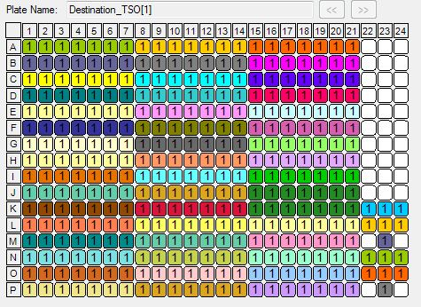

# RT optimisation with the Labcyte Echo 525 (December 2017)


Load scripts and libraries.


```r
# We use the R library called "magrittr", to build the data frame describing the
#384-well plate.
library(magrittr)

library(ggplot2)
library(plyr)

# The "setBlock" function to update values in the data frame is shared by multiple
# Rmarkdown files, so it is stored in a separate source file.
setBlock <- smallCAGEqc:::setBlock

# The "makePlate384" function outputs a data frame representing a 384-well plate
# (one well per row).
source('makePlate384.R')
```

## Plate layout

Create a data frame representing the contents of each well.


```r
plate           <- data.frame(Well = platetools::num_to_well(1:384, plate = "384"))
rownames(plate) <- plate$Well
plate$Row       <- sub("..$", "", plate$Well) %>% factor
plate$Col       <- sub("^.",  "", plate$Well) %>% as.numeric %>% factor
```

MASTER_MIX
==========

Master mix volume 
------------------

350 nL of mastermix added to each well


```r
plate %<>%
  setBlock("A01~P21", "MASTER_MIX_vol", 350) %>%
  setBlock("K22~L24", "MASTER_MIX_vol", 350) %>%
  setBlock("M23", "MASTER_MIX_vol", 350) %>%
  setBlock("N22~O24", "MASTER_MIX_vol", 350) %>%
  setBlock("P23", "MASTER_MIX_vol", 350)
```

TSO
===

TSO concentration
------------------

 - 80 μM (  +100 nL of 400 μM A1-A7 source wells) in A1-A7, A8-A14, A15-A21, K1-K7, N1-N7 
 - 40 μM ( +50 nL of 400 μM A1-A7 source wells) in B1-B7, B8-B14, B15-B21, L1-L7, O1-O7
 - 20 μM ( +25 nL of 400 μM A1-A7 source wells) in C1-C7, C8-C14, C15-C21, M1-M7, P1-P7
 - 10 μM ( +100 nL of 50 μM source wells) in D1-D7, D8-D14, D15-D21, K8-K14, N8-N14 + J1-J7, J8-J14, J15-J21, K22-K24, L22-L24, M23, N22-N24, O22-O24, P23
 - 5 μM ( +50 nL of 50 μM source wells) in E1-E7, E8-E14, E15-E21, L8-L14, O8-O14
 - 2,5 μM (+25 nL of 50 μM source wells) in F1-F7, F8-F14, F15-F21, M8-M14, P8-P14
 - 1,25 μM (+100 nL of 6,25 μM source wells) in G1-G7, G8-G14, G15-G21, K15-K21, N15-N21
 - 0,625 μM (+50 nL of 6,25 μM source wells) in H1-H7, H8-H14, H15-H21, L15-L21, O15-O21
 - 0,3125 μM (+25 nL of 6,25 μM source wells) in I1-I7, I8-I14, I15-I21, M15-M21, P15-P21
 


```r
plate %<>%
  setBlock("A01~A21", "TSO", 80) %>%
  setBlock("K01~K07", "TSO", 80) %>%
  setBlock("N01~N07", "TSO", 80) %>%
  setBlock("B01~B21", "TSO", 40) %>%
  setBlock("L01~L07", "TSO", 40) %>%
  setBlock("O01~O07", "TSO", 40) %>%
  setBlock("C01~C21", "TSO", 20) %>%
  setBlock("M01~M07", "TSO", 20) %>%
  setBlock("P01~P07", "TSO", 20) %>%
  setBlock("D01~D21", "TSO", 10) %>%
  setBlock("K08~K14", "TSO", 10) %>%
  setBlock("N08~N14", "TSO", 10) %>%
  setBlock("J01~J21", "TSO", 10) %>%
  setBlock("K22~K24", "TSO", 10) %>%
  setBlock("L22~L24", "TSO", 10) %>%
  setBlock("M23", "TSO", 10) %>%
  setBlock("N22~N24", "TSO", 10) %>%
  setBlock("O22~O24", "TSO", 10) %>%
  setBlock("P23", "TSO", 10) %>% 
  setBlock("E01~E21", "TSO", 5) %>%
  setBlock("L08~L14", "TSO", 5) %>%
  setBlock("O08~O14", "TSO", 5) %>%
  setBlock("F01~F21", "TSO", 2.5) %>%
  setBlock("M08~M14", "TSO", 2.5) %>%
  setBlock("P08~P14", "TSO", 2.5) %>%
  setBlock("G01~G21", "TSO", 1.25) %>%
  setBlock("K15~K21", "TSO", 1.25) %>%
  setBlock("N15~N21", "TSO", 1.25) %>%
  setBlock("H01~H21", "TSO", 0.625) %>%
  setBlock("L15~L21", "TSO", 0.625) %>%
  setBlock("O15~O21", "TSO", 0.625) %>%
  setBlock("I01~I21", "TSO", 0.3125) %>%
  setBlock("M15~M21", "TSO", 0.3125) %>%
  setBlock("P15~P21", "TSO", 0.3125)
```

TSO volume
-----------

25 (1-drop), 50 (2-drops) or 100 nL (4-drops) of TSO added, depending on the final concentration


```r
plate %<>%
  setBlock("A01~A21", "TSO_vol", 100) %>%
  setBlock("K01~K07", "TSO_vol", 100) %>%
  setBlock("N01~N07", "TSO_vol", 100) %>%
  setBlock("B01~B21", "TSO_vol", 50) %>%
  setBlock("L01~L07", "TSO_vol", 50) %>%
  setBlock("O01~O07", "TSO_vol", 50) %>%
  setBlock("C01~C21", "TSO_vol", 25) %>%
  setBlock("M01~M07", "TSO_vol", 25) %>%
  setBlock("P01~P07", "TSO_vol", 25) %>%
  setBlock("D01~D21", "TSO_vol", 100) %>%
  setBlock("K08~K14", "TSO_vol", 100) %>%
  setBlock("N08~N14", "TSO_vol", 100) %>%
  setBlock("J01~J21", "TSO_vol", 100) %>%
  setBlock("K22~K24", "TSO_vol", 100) %>%
  setBlock("L22~L24", "TSO_vol", 100) %>%
  setBlock("M23", "TSO_vol", 100) %>%
  setBlock("N22~N24", "TSO_vol", 100) %>%
  setBlock("O22~O24", "TSO_vol", 100) %>%
  setBlock("P23", "TSO_vol", 100) %>% 
  setBlock("E01~E21", "TSO_vol", 50) %>%
  setBlock("L08~L14", "TSO_vol", 50) %>%
  setBlock("O08~O14", "TSO_vol", 50) %>%
  setBlock("F01~F21", "TSO_vol", 25) %>%
  setBlock("M08~M14", "TSO_vol", 25) %>%
  setBlock("P08~P14", "TSO_vol", 25) %>%
  setBlock("G01~G21", "TSO_vol", 100) %>%
  setBlock("K15~K21", "TSO_vol", 100) %>%
  setBlock("N15~N21", "TSO_vol", 100) %>%
  setBlock("H01~H21", "TSO_vol", 50) %>%
  setBlock("L15~L21", "TSO_vol", 50) %>%
  setBlock("O15~O21", "TSO_vol", 50) %>%
  setBlock("I01~I21", "TSO_vol", 25) %>%
  setBlock("M15~M21", "TSO_vol", 25) %>%
  setBlock("P15~P21", "TSO_vol", 25) 
```

Barcode ID
-----------

70 barcodes used for each RNA concentration tested


```r
plate %<>%
  setBlock("A01", "BARCODE_ID", 01) %>%
  setBlock("A02", "BARCODE_ID", 02) %>%
  setBlock("A03", "BARCODE_ID", 03) %>%
  setBlock("A04", "BARCODE_ID", 04) %>%
  setBlock("A05", "BARCODE_ID", 05) %>%
  setBlock("A06", "BARCODE_ID", 06) %>%
  setBlock("A07", "BARCODE_ID", 07) %>%  
  setBlock("A08", "BARCODE_ID", 01) %>%
  setBlock("A09", "BARCODE_ID", 02) %>%
  setBlock("A10", "BARCODE_ID", 03) %>%
  setBlock("A11", "BARCODE_ID", 04) %>%
  setBlock("A12", "BARCODE_ID", 05) %>%
  setBlock("A13", "BARCODE_ID", 06) %>%
  setBlock("A14", "BARCODE_ID", 07) %>%  
  setBlock("A15", "BARCODE_ID", 01) %>%
  setBlock("A16", "BARCODE_ID", 02) %>%
  setBlock("A17", "BARCODE_ID", 03) %>%
  setBlock("A18", "BARCODE_ID", 04) %>%
  setBlock("A19", "BARCODE_ID", 05) %>%
  setBlock("A20", "BARCODE_ID", 06) %>%
  setBlock("A21", "BARCODE_ID", 07) %>%  
  setBlock("K01", "BARCODE_ID", 01) %>%
  setBlock("K02", "BARCODE_ID", 02) %>%
  setBlock("K03", "BARCODE_ID", 03) %>%
  setBlock("K04", "BARCODE_ID", 04) %>%
  setBlock("K05", "BARCODE_ID", 05) %>%
  setBlock("K06", "BARCODE_ID", 06) %>%
  setBlock("K07", "BARCODE_ID", 07) %>%    
  setBlock("N01", "BARCODE_ID", 01) %>%
  setBlock("N02", "BARCODE_ID", 02) %>%
  setBlock("N03", "BARCODE_ID", 03) %>%
  setBlock("N04", "BARCODE_ID", 04) %>%
  setBlock("N05", "BARCODE_ID", 05) %>%
  setBlock("N06", "BARCODE_ID", 06) %>%
  setBlock("N07", "BARCODE_ID", 07) %>%  
  setBlock("B01", "BARCODE_ID", 08) %>%
  setBlock("B02", "BARCODE_ID", 09) %>%
  setBlock("B03", "BARCODE_ID", 10) %>%
  setBlock("B04", "BARCODE_ID", 11) %>%
  setBlock("B05", "BARCODE_ID", 12) %>%
  setBlock("B06", "BARCODE_ID", 13) %>%
  setBlock("B07", "BARCODE_ID", 14) %>%  
  setBlock("B08", "BARCODE_ID", 08) %>%
  setBlock("B09", "BARCODE_ID", 09) %>%
  setBlock("B10", "BARCODE_ID", 10) %>%
  setBlock("B11", "BARCODE_ID", 11) %>%
  setBlock("B12", "BARCODE_ID", 12) %>%
  setBlock("B13", "BARCODE_ID", 13) %>%
  setBlock("B14", "BARCODE_ID", 14) %>%  
  setBlock("B15", "BARCODE_ID", 08) %>%
  setBlock("B16", "BARCODE_ID", 09) %>%
  setBlock("B17", "BARCODE_ID", 10) %>%
  setBlock("B18", "BARCODE_ID", 11) %>%
  setBlock("B19", "BARCODE_ID", 12) %>%
  setBlock("B20", "BARCODE_ID", 13) %>%
  setBlock("B21", "BARCODE_ID", 14) %>% 
  setBlock("L01", "BARCODE_ID", 08) %>%
  setBlock("L02", "BARCODE_ID", 09) %>%
  setBlock("L03", "BARCODE_ID", 10) %>%
  setBlock("L04", "BARCODE_ID", 11) %>%
  setBlock("L05", "BARCODE_ID", 12) %>%
  setBlock("L06", "BARCODE_ID", 13) %>%
  setBlock("L07", "BARCODE_ID", 14) %>% 
  setBlock("O01", "BARCODE_ID", 08) %>%
  setBlock("O02", "BARCODE_ID", 09) %>%
  setBlock("O03", "BARCODE_ID", 10) %>%
  setBlock("O04", "BARCODE_ID", 11) %>%
  setBlock("O05", "BARCODE_ID", 12) %>%
  setBlock("O06", "BARCODE_ID", 13) %>%
  setBlock("O07", "BARCODE_ID", 14) %>% 
  setBlock("C01", "BARCODE_ID", 15) %>%
  setBlock("C02", "BARCODE_ID", 16) %>%
  setBlock("C03", "BARCODE_ID", 17) %>%
  setBlock("C04", "BARCODE_ID", 18) %>%
  setBlock("C05", "BARCODE_ID", 19) %>%
  setBlock("C06", "BARCODE_ID", 20) %>%
  setBlock("C07", "BARCODE_ID", 21) %>%   
  setBlock("C08", "BARCODE_ID", 15) %>%
  setBlock("C09", "BARCODE_ID", 16) %>%
  setBlock("C10", "BARCODE_ID", 17) %>%
  setBlock("C11", "BARCODE_ID", 18) %>%
  setBlock("C12", "BARCODE_ID", 19) %>%
  setBlock("C13", "BARCODE_ID", 20) %>%
  setBlock("C14", "BARCODE_ID", 21) %>%  
  setBlock("C15", "BARCODE_ID", 15) %>%
  setBlock("C16", "BARCODE_ID", 16) %>%
  setBlock("C17", "BARCODE_ID", 17) %>%
  setBlock("C18", "BARCODE_ID", 18) %>%
  setBlock("C19", "BARCODE_ID", 19) %>%
  setBlock("C20", "BARCODE_ID", 20) %>%
  setBlock("C21", "BARCODE_ID", 21) %>%
  setBlock("M01", "BARCODE_ID", 15) %>%
  setBlock("M02", "BARCODE_ID", 16) %>%
  setBlock("M03", "BARCODE_ID", 17) %>%
  setBlock("M04", "BARCODE_ID", 18) %>%
  setBlock("M05", "BARCODE_ID", 19) %>%
  setBlock("M06", "BARCODE_ID", 20) %>%
  setBlock("M07", "BARCODE_ID", 21) %>%
  setBlock("P01", "BARCODE_ID", 15) %>%
  setBlock("P02", "BARCODE_ID", 16) %>%
  setBlock("P03", "BARCODE_ID", 17) %>%
  setBlock("P04", "BARCODE_ID", 18) %>%
  setBlock("P05", "BARCODE_ID", 19) %>%
  setBlock("P06", "BARCODE_ID", 20) %>%
  setBlock("P07", "BARCODE_ID", 21) %>%
  setBlock("D01", "BARCODE_ID", 22) %>%
  setBlock("D02", "BARCODE_ID", 23) %>%
  setBlock("D03", "BARCODE_ID", 24) %>%
  setBlock("D04", "BARCODE_ID", 25) %>%
  setBlock("D05", "BARCODE_ID", 26) %>%
  setBlock("D06", "BARCODE_ID", 27) %>%
  setBlock("D07", "BARCODE_ID", 28) %>%   
  setBlock("D08", "BARCODE_ID", 22) %>%
  setBlock("D09", "BARCODE_ID", 23) %>%
  setBlock("D10", "BARCODE_ID", 24) %>%
  setBlock("D11", "BARCODE_ID", 25) %>%
  setBlock("D12", "BARCODE_ID", 26) %>%
  setBlock("D13", "BARCODE_ID", 27) %>%
  setBlock("D14", "BARCODE_ID", 28) %>% 
  setBlock("D15", "BARCODE_ID", 22) %>%
  setBlock("D16", "BARCODE_ID", 23) %>%
  setBlock("D17", "BARCODE_ID", 24) %>%
  setBlock("D18", "BARCODE_ID", 25) %>%
  setBlock("D19", "BARCODE_ID", 26) %>%
  setBlock("D20", "BARCODE_ID", 27) %>%
  setBlock("D21", "BARCODE_ID", 28) %>%
  setBlock("K08", "BARCODE_ID", 22) %>%
  setBlock("K09", "BARCODE_ID", 23) %>%
  setBlock("K10", "BARCODE_ID", 24) %>%
  setBlock("K11", "BARCODE_ID", 25) %>%
  setBlock("K12", "BARCODE_ID", 26) %>%
  setBlock("K13", "BARCODE_ID", 27) %>%
  setBlock("K14", "BARCODE_ID", 28) %>%  
  setBlock("N08", "BARCODE_ID", 22) %>%
  setBlock("N09", "BARCODE_ID", 23) %>%
  setBlock("N10", "BARCODE_ID", 24) %>%
  setBlock("N11", "BARCODE_ID", 25) %>%
  setBlock("N12", "BARCODE_ID", 26) %>%
  setBlock("N13", "BARCODE_ID", 27) %>%
  setBlock("N14", "BARCODE_ID", 28) %>% 
  setBlock("E01", "BARCODE_ID", 29) %>%
  setBlock("E02", "BARCODE_ID", 30) %>%
  setBlock("E03", "BARCODE_ID", 31) %>%
  setBlock("E04", "BARCODE_ID", 32) %>%
  setBlock("E05", "BARCODE_ID", 33) %>%
  setBlock("E06", "BARCODE_ID", 34) %>%
  setBlock("E07", "BARCODE_ID", 35) %>%
  setBlock("E08", "BARCODE_ID", 29) %>%
  setBlock("E09", "BARCODE_ID", 30) %>%
  setBlock("E10", "BARCODE_ID", 31) %>%
  setBlock("E11", "BARCODE_ID", 32) %>%
  setBlock("E12", "BARCODE_ID", 33) %>%
  setBlock("E13", "BARCODE_ID", 34) %>%
  setBlock("E14", "BARCODE_ID", 35) %>%  
  setBlock("E15", "BARCODE_ID", 29) %>%
  setBlock("E16", "BARCODE_ID", 30) %>%
  setBlock("E17", "BARCODE_ID", 31) %>%
  setBlock("E18", "BARCODE_ID", 32) %>%
  setBlock("E19", "BARCODE_ID", 33) %>%
  setBlock("E20", "BARCODE_ID", 34) %>%
  setBlock("E21", "BARCODE_ID", 35) %>%  
  setBlock("L08", "BARCODE_ID", 29) %>%
  setBlock("L09", "BARCODE_ID", 30) %>%
  setBlock("L10", "BARCODE_ID", 31) %>%
  setBlock("L11", "BARCODE_ID", 32) %>%
  setBlock("L12", "BARCODE_ID", 33) %>%
  setBlock("L13", "BARCODE_ID", 34) %>%
  setBlock("L14", "BARCODE_ID", 35) %>%  
  setBlock("O08", "BARCODE_ID", 29) %>%
  setBlock("O09", "BARCODE_ID", 30) %>%
  setBlock("O10", "BARCODE_ID", 31) %>%
  setBlock("O11", "BARCODE_ID", 32) %>%
  setBlock("O12", "BARCODE_ID", 33) %>%
  setBlock("O13", "BARCODE_ID", 34) %>%
  setBlock("O14", "BARCODE_ID", 35) %>%    
  setBlock("F01", "BARCODE_ID", 36) %>%
  setBlock("F02", "BARCODE_ID", 37) %>%
  setBlock("F03", "BARCODE_ID", 38) %>%
  setBlock("F04", "BARCODE_ID", 39) %>%
  setBlock("F05", "BARCODE_ID", 40) %>%
  setBlock("F06", "BARCODE_ID", 41) %>%
  setBlock("F07", "BARCODE_ID", 42) %>% 
  setBlock("F08", "BARCODE_ID", 36) %>%
  setBlock("F09", "BARCODE_ID", 37) %>%
  setBlock("F10", "BARCODE_ID", 38) %>%
  setBlock("F11", "BARCODE_ID", 39) %>%
  setBlock("F12", "BARCODE_ID", 40) %>%
  setBlock("F13", "BARCODE_ID", 41) %>%
  setBlock("F14", "BARCODE_ID", 42) %>%  
  setBlock("F15", "BARCODE_ID", 36) %>%
  setBlock("F16", "BARCODE_ID", 37) %>%
  setBlock("F17", "BARCODE_ID", 38) %>%
  setBlock("F18", "BARCODE_ID", 39) %>%
  setBlock("F19", "BARCODE_ID", 40) %>%
  setBlock("F20", "BARCODE_ID", 41) %>%
  setBlock("F21", "BARCODE_ID", 42) %>%
  setBlock("M08", "BARCODE_ID", 36) %>%
  setBlock("M09", "BARCODE_ID", 37) %>%
  setBlock("M10", "BARCODE_ID", 38) %>%
  setBlock("M11", "BARCODE_ID", 39) %>%
  setBlock("M12", "BARCODE_ID", 40) %>%
  setBlock("M13", "BARCODE_ID", 41) %>%
  setBlock("M14", "BARCODE_ID", 42) %>%   
  setBlock("P08", "BARCODE_ID", 36) %>%
  setBlock("P09", "BARCODE_ID", 37) %>%
  setBlock("P10", "BARCODE_ID", 38) %>%
  setBlock("P11", "BARCODE_ID", 39) %>%
  setBlock("P12", "BARCODE_ID", 40) %>%
  setBlock("P13", "BARCODE_ID", 41) %>%
  setBlock("P14", "BARCODE_ID", 42) %>%  
  setBlock("G01", "BARCODE_ID", 43) %>%
  setBlock("G02", "BARCODE_ID", 44) %>%
  setBlock("G03", "BARCODE_ID", 45) %>%
  setBlock("G04", "BARCODE_ID", 46) %>%
  setBlock("G05", "BARCODE_ID", 47) %>%
  setBlock("G06", "BARCODE_ID", 48) %>%
  setBlock("G07", "BARCODE_ID", 49) %>% 
  setBlock("G08", "BARCODE_ID", 43) %>%
  setBlock("G09", "BARCODE_ID", 44) %>%
  setBlock("G10", "BARCODE_ID", 45) %>%
  setBlock("G11", "BARCODE_ID", 46) %>%
  setBlock("G12", "BARCODE_ID", 47) %>%
  setBlock("G13", "BARCODE_ID", 48) %>%
  setBlock("G14", "BARCODE_ID", 49) %>%   
  setBlock("G15", "BARCODE_ID", 43) %>%
  setBlock("G16", "BARCODE_ID", 44) %>%
  setBlock("G17", "BARCODE_ID", 45) %>%
  setBlock("G18", "BARCODE_ID", 46) %>%
  setBlock("G19", "BARCODE_ID", 47) %>%
  setBlock("G20", "BARCODE_ID", 48) %>%
  setBlock("G21", "BARCODE_ID", 49) %>% 
  setBlock("K15", "BARCODE_ID", 43) %>%
  setBlock("K16", "BARCODE_ID", 44) %>%
  setBlock("K17", "BARCODE_ID", 45) %>%
  setBlock("K18", "BARCODE_ID", 46) %>%
  setBlock("K19", "BARCODE_ID", 47) %>%
  setBlock("K20", "BARCODE_ID", 48) %>%
  setBlock("K21", "BARCODE_ID", 49) %>%   
  setBlock("N15", "BARCODE_ID", 43) %>%
  setBlock("N16", "BARCODE_ID", 44) %>%
  setBlock("N17", "BARCODE_ID", 45) %>%
  setBlock("N18", "BARCODE_ID", 46) %>%
  setBlock("N19", "BARCODE_ID", 47) %>%
  setBlock("N20", "BARCODE_ID", 48) %>%
  setBlock("N21", "BARCODE_ID", 49) %>%  
  setBlock("H01", "BARCODE_ID", 50) %>%
  setBlock("H02", "BARCODE_ID", 51) %>%
  setBlock("H03", "BARCODE_ID", 52) %>%
  setBlock("H04", "BARCODE_ID", 53) %>%
  setBlock("H05", "BARCODE_ID", 54) %>%
  setBlock("H06", "BARCODE_ID", 55) %>%
  setBlock("H07", "BARCODE_ID", 56) %>%
  setBlock("H08", "BARCODE_ID", 50) %>%
  setBlock("H09", "BARCODE_ID", 51) %>%
  setBlock("H10", "BARCODE_ID", 52) %>%
  setBlock("H11", "BARCODE_ID", 53) %>%
  setBlock("H12", "BARCODE_ID", 54) %>%
  setBlock("H13", "BARCODE_ID", 55) %>%
  setBlock("H14", "BARCODE_ID", 56) %>%
  setBlock("H15", "BARCODE_ID", 50) %>%
  setBlock("H16", "BARCODE_ID", 51) %>%
  setBlock("H17", "BARCODE_ID", 52) %>%
  setBlock("H18", "BARCODE_ID", 53) %>%
  setBlock("H19", "BARCODE_ID", 54) %>%
  setBlock("H20", "BARCODE_ID", 55) %>%
  setBlock("H21", "BARCODE_ID", 56) %>%
  setBlock("L15", "BARCODE_ID", 50) %>%
  setBlock("L16", "BARCODE_ID", 51) %>%
  setBlock("L17", "BARCODE_ID", 52) %>%
  setBlock("L18", "BARCODE_ID", 53) %>%
  setBlock("L19", "BARCODE_ID", 54) %>%
  setBlock("L20", "BARCODE_ID", 55) %>%
  setBlock("L21", "BARCODE_ID", 56) %>%  
  setBlock("O15", "BARCODE_ID", 50) %>%
  setBlock("O16", "BARCODE_ID", 51) %>%
  setBlock("O17", "BARCODE_ID", 52) %>%
  setBlock("O18", "BARCODE_ID", 53) %>%
  setBlock("O19", "BARCODE_ID", 54) %>%
  setBlock("O20", "BARCODE_ID", 55) %>%
  setBlock("O21", "BARCODE_ID", 56) %>% 
  setBlock("I01", "BARCODE_ID", 57) %>%
  setBlock("I02", "BARCODE_ID", 58) %>%
  setBlock("I03", "BARCODE_ID", 59) %>%
  setBlock("I04", "BARCODE_ID", 60) %>%
  setBlock("I05", "BARCODE_ID", 61) %>%
  setBlock("I06", "BARCODE_ID", 62) %>%
  setBlock("I07", "BARCODE_ID", 63) %>%  
  setBlock("I08", "BARCODE_ID", 57) %>%
  setBlock("I09", "BARCODE_ID", 58) %>%
  setBlock("I10", "BARCODE_ID", 59) %>%
  setBlock("I11", "BARCODE_ID", 60) %>%
  setBlock("I12", "BARCODE_ID", 61) %>%
  setBlock("I13", "BARCODE_ID", 62) %>%
  setBlock("I14", "BARCODE_ID", 63) %>%    
  setBlock("I15", "BARCODE_ID", 57) %>%
  setBlock("I16", "BARCODE_ID", 58) %>%
  setBlock("I17", "BARCODE_ID", 59) %>%
  setBlock("I18", "BARCODE_ID", 60) %>%
  setBlock("I19", "BARCODE_ID", 61) %>%
  setBlock("I20", "BARCODE_ID", 62) %>%
  setBlock("I21", "BARCODE_ID", 63) %>%   
  setBlock("M15", "BARCODE_ID", 57) %>%
  setBlock("M16", "BARCODE_ID", 58) %>%
  setBlock("M17", "BARCODE_ID", 59) %>%
  setBlock("M18", "BARCODE_ID", 60) %>%
  setBlock("M19", "BARCODE_ID", 61) %>%
  setBlock("M20", "BARCODE_ID", 62) %>%
  setBlock("M21", "BARCODE_ID", 63) %>%  
  setBlock("P15", "BARCODE_ID", 57) %>%
  setBlock("P16", "BARCODE_ID", 58) %>%
  setBlock("P17", "BARCODE_ID", 59) %>%
  setBlock("P18", "BARCODE_ID", 60) %>%
  setBlock("P19", "BARCODE_ID", 61) %>%
  setBlock("P20", "BARCODE_ID", 62) %>%
  setBlock("P21", "BARCODE_ID", 63) %>%   
  setBlock("J01", "BARCODE_ID", 64) %>%
  setBlock("J02", "BARCODE_ID", 65) %>%
  setBlock("J03", "BARCODE_ID", 66) %>%
  setBlock("J04", "BARCODE_ID", 67) %>%
  setBlock("J05", "BARCODE_ID", 68) %>%
  setBlock("J06", "BARCODE_ID", 69) %>%
  setBlock("J07", "BARCODE_ID", 70) %>%   
  setBlock("J08", "BARCODE_ID", 64) %>%
  setBlock("J09", "BARCODE_ID", 65) %>%
  setBlock("J10", "BARCODE_ID", 66) %>%
  setBlock("J11", "BARCODE_ID", 67) %>%
  setBlock("J12", "BARCODE_ID", 68) %>%
  setBlock("J13", "BARCODE_ID", 69) %>%
  setBlock("J14", "BARCODE_ID", 70) %>%   
  setBlock("J15", "BARCODE_ID", 64) %>%
  setBlock("J16", "BARCODE_ID", 65) %>%
  setBlock("J17", "BARCODE_ID", 66) %>%
  setBlock("J18", "BARCODE_ID", 67) %>%
  setBlock("J19", "BARCODE_ID", 68) %>%
  setBlock("J20", "BARCODE_ID", 69) %>%
  setBlock("J21", "BARCODE_ID", 70) %>%  
  setBlock("M23", "BARCODE_ID", 64) %>%
  setBlock("K22", "BARCODE_ID", 65) %>%
  setBlock("K23", "BARCODE_ID", 66) %>%
  setBlock("K24", "BARCODE_ID", 67) %>%
  setBlock("L22", "BARCODE_ID", 68) %>%
  setBlock("L23", "BARCODE_ID", 69) %>%
  setBlock("L24", "BARCODE_ID", 70) %>%  
  setBlock("P23", "BARCODE_ID", 64) %>%
  setBlock("N22", "BARCODE_ID", 65) %>%
  setBlock("N23", "BARCODE_ID", 66) %>%
  setBlock("N24", "BARCODE_ID", 67) %>%
  setBlock("O22", "BARCODE_ID", 68) %>%
  setBlock("O23", "BARCODE_ID", 69) %>%
  setBlock("O24", "BARCODE_ID", 70)   
```

RT_PRIMERS
===========

RT primers concentration
-------------------------

 - 0 μM (controls, + 0 nL) in Col 1, 8 and 15 + M23 + P23
 - 0.125 μM (+ 25 nL from source well K1 2.5 μM) in Col 2, 9 and 16 + K22 + N22
 - 0.25 μM (+ 25 nL from source well K2 5 μM) in Col 3, 10 and 17 + K23 + N23
 - 0.5 μM (+ 25 nL from source well K3 10 μM) in Col 4, 11 and 18 + K24 + N24
 - 1 μM (+ 25 nL from source well K4 20 μM) in Col 5, 12 and 19 + L22 + O22
 - 2 μM (+ 25 nL from source well K5 40 μM) in Col 6, 13 and 20 + L23 + O23
 - 4 μM (+ 25 nL from source well K6 80 μM) in Col 7, 14 and 21 + L24 + O24


```r
plate %<>%
  setBlock("A01~P01",   "RT_PRIMERS", 0) %>%
  setBlock("A08~P08",   "RT_PRIMERS", 0) %>%
  setBlock("A15~P15",   "RT_PRIMERS", 0) %>%
  setBlock("M23",   "RT_PRIMERS", 0) %>%
  setBlock("P23",   "RT_PRIMERS", 0) %>%
  setBlock("A02~P02",   "RT_PRIMERS", 0.125) %>%
  setBlock("A09~P09",   "RT_PRIMERS", 0.125) %>%
  setBlock("A16~P16",   "RT_PRIMERS", 0.125) %>%
  setBlock("K22",   "RT_PRIMERS", 0.125) %>%
  setBlock("N22",   "RT_PRIMERS", 0.125) %>%
  setBlock("A03~P03",   "RT_PRIMERS", 0.25) %>%
  setBlock("A10~P10",   "RT_PRIMERS", 0.25) %>%
  setBlock("A17~P17",   "RT_PRIMERS", 0.25) %>%
  setBlock("K23",   "RT_PRIMERS", 0.25) %>%
  setBlock("N23",   "RT_PRIMERS", 0.25) %>%
  setBlock("A04~P04",   "RT_PRIMERS", 0.5) %>%
  setBlock("A11~P11",   "RT_PRIMERS", 0.5) %>%
  setBlock("A18~P18",   "RT_PRIMERS", 0.5) %>%
  setBlock("K24",   "RT_PRIMERS", 0.5) %>%
  setBlock("N24",   "RT_PRIMERS", 0.5) %>%
  setBlock("A05~P05",   "RT_PRIMERS", 1) %>%
  setBlock("A12~P12",   "RT_PRIMERS", 1) %>%
  setBlock("A19~P19",   "RT_PRIMERS", 1) %>%
  setBlock("L22",   "RT_PRIMERS", 1) %>%
  setBlock("O22",   "RT_PRIMERS", 1) %>%
  setBlock("A06~P06",   "RT_PRIMERS", 2) %>%
  setBlock("A13~P13",   "RT_PRIMERS", 2) %>%
  setBlock("A20~P20",   "RT_PRIMERS", 2) %>%
  setBlock("L23",   "RT_PRIMERS", 2) %>%
  setBlock("O23",   "RT_PRIMERS", 2) %>%
  setBlock("A07~P07",   "RT_PRIMERS", 4) %>%
  setBlock("A14~P14",   "RT_PRIMERS", 4) %>%
  setBlock("A21~P21",   "RT_PRIMERS", 4) %>%
  setBlock("L24",   "RT_PRIMERS", 4) %>%
  setBlock("O24",   "RT_PRIMERS", 4) 
```

RT primer volume 
------------------

25 nl of RT_PRIMERS added in each well, except the negative controls 


```r
plate %<>%
  setBlock("A01~P01",   "RT_PRIMERS_vol", 0) %>%
  setBlock("A08~P08",   "RT_PRIMERS_vol", 0) %>%
  setBlock("A15~P15",   "RT_PRIMERS_vol", 0) %>%
  setBlock("M23",   "RT_PRIMERS_vol", 0) %>%
  setBlock("P23",   "RT_PRIMERS_vol", 0) %>%
  setBlock("A02~P02",   "RT_PRIMERS_vol", 25) %>%
  setBlock("A09~P09",   "RT_PRIMERS_vol", 25) %>%
  setBlock("A16~P16",   "RT_PRIMERS_vol", 25) %>%
  setBlock("K22",   "RT_PRIMERS_vol", 25) %>%
  setBlock("N22",   "RT_PRIMERS_vol", 25) %>%
  setBlock("A03~P03",   "RT_PRIMERS_vol", 25) %>%
  setBlock("A10~P10",   "RT_PRIMERS_vol", 25) %>%
  setBlock("A17~P17",   "RT_PRIMERS_vol", 25) %>%
  setBlock("K23",   "RT_PRIMERS_vol", 25) %>%
  setBlock("N23",   "RT_PRIMERS_vol", 25) %>%
  setBlock("A04~P04",   "RT_PRIMERS_vol", 25) %>%
  setBlock("A11~P11",   "RT_PRIMERS_vol", 25) %>%
  setBlock("A18~P18",   "RT_PRIMERS_vol", 25) %>%
  setBlock("K24",   "RT_PRIMERS_vol", 25) %>%
  setBlock("N24",   "RT_PRIMERS_vol", 25) %>%
  setBlock("A05~P05",   "RT_PRIMERS_vol", 25) %>%
  setBlock("A12~P12",   "RT_PRIMERS_vol", 25) %>%
  setBlock("A19~P19",   "RT_PRIMERS_vol", 25) %>%
  setBlock("L22",   "RT_PRIMERS_vol", 25) %>%
  setBlock("O22",   "RT_PRIMERS_vol", 25) %>%
  setBlock("A06~P06",   "RT_PRIMERS_vol", 25) %>%
  setBlock("A13~P13",   "RT_PRIMERS_vol", 25) %>%
  setBlock("A20~P20",   "RT_PRIMERS_vol", 25) %>%
  setBlock("L23",   "RT_PRIMERS_vol", 25) %>%
  setBlock("O23",   "RT_PRIMERS_vol", 25) %>%
  setBlock("A07~P07",   "RT_PRIMERS_vol", 25) %>%
  setBlock("A14~P14",   "RT_PRIMERS_vol", 25) %>%
  setBlock("A21~P21",   "RT_PRIMERS_vol", 25) %>%
  setBlock("L24",   "RT_PRIMERS_vol", 25) %>%
  setBlock("O24",   "RT_PRIMERS_vol", 25) 
```

RNA
====

RNA concentration
------------------

 - 0 (controls, + 0 nL) in J01-J21 + K22-K24 + L22-L24 + M23 + N22-N24 + O22-O24 + P23
 - 100 ng (+ 25 nL from source well L1 4 ug/uL) in A01-I07
 - 10 ng (+ 25 nL from source well L2 400 ng/uL) in A08-I14
 - 1 ng (+ 25 nL from source well L3 40 ng/uL) in A15-I21
 - 100 pg (+ 25 nL from source well L4 4 ng/uL) in K01-M21
 - 10 pg (+ 25 nL from source well L5 0.4 ng/uL) in N01-P21


```r
plate %<>%
  setBlock("J01~J21", "RNA", 0) %>%
  setBlock("K22~L24", "RNA", 0) %>%
  setBlock("M23", "RNA", 0) %>%
  setBlock("N22~O24", "RNA", 0) %>%
  setBlock("P23", "RNA", 0) %>%
  setBlock("A01~I07", "RNA", 100) %>%
  setBlock("A08~I14", "RNA", 10) %>%
  setBlock("A15~I21", "RNA", 1) %>%
  setBlock("K01~M21", "RNA", 0.1) %>%
  setBlock("N01~P21", "RNA", 0.01)
```

RNA volume
-----------

25 nL of RNA added to each well, except the negative controls


```r
plate %<>%
  setBlock("J01~J21", "RNA_vol", 0) %>%
  setBlock("K22~L24", "RNA_vol", 0) %>%
  setBlock("M23", "RNA_vol", 0) %>%
  setBlock("N22~O24", "RNA_vol", 0) %>%
  setBlock("P23", "RNA_vol", 0) %>%
  setBlock("A01~I07", "RNA_vol", 25) %>%
  setBlock("A08~I14", "RNA_vol", 25) %>%
  setBlock("A15~I21", "RNA_vol", 25) %>%
  setBlock("K01~M21", "RNA_vol", 25) %>%
  setBlock("N01~P21", "RNA_vol", 25)
```

H2O
====

H2O volume
-----------

0, 25, 50, 75 or 100 nL H2O added to complete RT reaction volume up to 500 nL


```r
plate %<>%
  setBlock("A02~A07", "H2O_vol", 0) %>%
  setBlock("A09~A14", "H2O_vol", 0) %>%
  setBlock("A16~A21", "H2O_vol", 0) %>%
  setBlock("D02~D07", "H2O_vol", 0) %>%
  setBlock("D09~D14", "H2O_vol", 0) %>%
  setBlock("D16~D21", "H2O_vol", 0) %>%
  setBlock("G02~G07", "H2O_vol", 0) %>%
  setBlock("G09~G14", "H2O_vol", 0) %>%
  setBlock("G16~G21", "H2O_vol", 0) %>%
  setBlock("K02~K07", "H2O_vol", 0) %>%
  setBlock("K09~K14", "H2O_vol", 0) %>%
  setBlock("K16~K21", "H2O_vol", 0) %>%
  setBlock("N02~N07", "H2O_vol", 0) %>%
  setBlock("N09~N14", "H2O_vol", 0) %>%
  setBlock("N16~N21", "H2O_vol", 0) %>%
  setBlock("J02~J07", "H2O_vol", 25) %>%
  setBlock("J09~J14", "H2O_vol", 25) %>%
  setBlock("J16~J21", "H2O_vol", 25) %>%
  setBlock("J02~J07", "H2O_vol", 25) %>%
  setBlock("K22~K24", "H2O_vol", 25) %>%
  setBlock("L22~L24", "H2O_vol", 25) %>%
  setBlock("N22~N24", "H2O_vol", 25) %>%
  setBlock("O22~O24", "H2O_vol", 25) %>%
  setBlock("K22~K24", "H2O_vol", 25) %>%
  setBlock("A01", "H2O_vol", 25) %>%
  setBlock("A08", "H2O_vol", 25) %>%
  setBlock("A15", "H2O_vol", 25) %>%
  setBlock("D01", "H2O_vol", 25) %>%
  setBlock("D08", "H2O_vol", 25) %>%
  setBlock("D15", "H2O_vol", 25) %>%
  setBlock("G01", "H2O_vol", 25) %>%
  setBlock("G08", "H2O_vol", 25) %>%
  setBlock("G15", "H2O_vol", 25) %>%
  setBlock("K01", "H2O_vol", 25) %>%
  setBlock("K08", "H2O_vol", 25) %>%
  setBlock("K15", "H2O_vol", 25) %>%
  setBlock("N01", "H2O_vol", 25) %>%
  setBlock("N08", "H2O_vol", 25) %>%
  setBlock("N15", "H2O_vol", 25) %>%
  setBlock("B02~B07", "H2O_vol", 50) %>%
  setBlock("B09~B14", "H2O_vol", 50) %>%
  setBlock("B16~B21", "H2O_vol", 50) %>%
  setBlock("E02~E07", "H2O_vol", 50) %>%
  setBlock("E09~E14", "H2O_vol", 50) %>%
  setBlock("E16~E21", "H2O_vol", 50) %>%
  setBlock("H02~H07", "H2O_vol", 50) %>%
  setBlock("H09~H14", "H2O_vol", 50) %>%
  setBlock("H16~H21", "H2O_vol", 50) %>%
  setBlock("L02~L07", "H2O_vol", 50) %>%
  setBlock("L09~L14", "H2O_vol", 50) %>%
  setBlock("L16~L21", "H2O_vol", 50) %>%
  setBlock("O02~O07", "H2O_vol", 50) %>%
  setBlock("O09~O14", "H2O_vol", 50) %>%
  setBlock("O16~O21", "H2O_vol", 50) %>%
  setBlock("M23", "H2O_vol", 50) %>%
  setBlock("P23", "H2O_vol", 50) %>%
  setBlock("J01", "H2O_vol", 50) %>%
  setBlock("J08", "H2O_vol", 50) %>%
  setBlock("J15", "H2O_vol", 50) %>%
  setBlock("C02~C07", "H2O_vol", 75) %>%
  setBlock("C09~C14", "H2O_vol", 75) %>%
  setBlock("C16~C21", "H2O_vol", 75) %>%
  setBlock("F02~F07", "H2O_vol", 75) %>%
  setBlock("F09~F14", "H2O_vol", 75) %>%
  setBlock("F16~F21", "H2O_vol", 75) %>%
  setBlock("I02~I07", "H2O_vol", 75) %>%
  setBlock("I09~I14", "H2O_vol", 75) %>%
  setBlock("I16~I21", "H2O_vol", 75) %>%
  setBlock("M02~M07", "H2O_vol", 75) %>%
  setBlock("M09~M14", "H2O_vol", 75) %>%
  setBlock("M16~M21", "H2O_vol", 75) %>%
  setBlock("P02~P07", "H2O_vol", 75) %>%
  setBlock("P09~P14", "H2O_vol", 75) %>%
  setBlock("P16~P21", "H2O_vol", 75) %>%
  setBlock("B01", "H2O_vol", 75) %>%
  setBlock("B08", "H2O_vol", 75) %>%
  setBlock("B15", "H2O_vol", 75) %>%
  setBlock("E01", "H2O_vol", 75) %>%
  setBlock("E08", "H2O_vol", 75) %>%
  setBlock("E15", "H2O_vol", 75) %>%
  setBlock("H01", "H2O_vol", 75) %>%
  setBlock("H08", "H2O_vol", 75) %>%
  setBlock("H15", "H2O_vol", 75) %>%
  setBlock("L01", "H2O_vol", 75) %>%
  setBlock("L08", "H2O_vol", 75) %>%
  setBlock("L15", "H2O_vol", 75) %>%
  setBlock("O01", "H2O_vol", 75) %>%
  setBlock("O08", "H2O_vol", 75) %>%
  setBlock("O15", "H2O_vol", 75) %>%
  setBlock("C01", "H2O_vol", 100) %>%
  setBlock("C08", "H2O_vol", 100) %>%
  setBlock("C15", "H2O_vol", 100) %>%
  setBlock("F01", "H2O_vol", 100) %>%
  setBlock("F08", "H2O_vol", 100) %>%
  setBlock("F15", "H2O_vol", 100) %>%
  setBlock("I01", "H2O_vol", 100) %>%
  setBlock("I08", "H2O_vol", 100) %>%
  setBlock("I15", "H2O_vol", 100) %>%
  setBlock("M01", "H2O_vol", 100) %>%
  setBlock("M08", "H2O_vol", 100) %>%
  setBlock("M15", "H2O_vol", 100) %>%
  setBlock("P01", "H2O_vol", 100) %>%
  setBlock("P08", "H2O_vol", 100) %>%
  setBlock("P15", "H2O_vol", 100)
```

Total volume
============


```r
plate$total_volume <- ""
plate$total_volume <- rowSums(plate[, c("MASTER_MIX_vol", "TSO_vol", "RT_PRIMERS_vol", "RNA_vol", "H2O_vol")])
```

RATIO TSO/RT_PRIMERS
=====================

Different ratio of TSO/RT_PRIMERS tested


```r
plate$PRIMERS_RATIO <- ""
plate$PRIMERS_RATIO <- c(plate$TSO/plate$RT_PRIMERS)
plate$PRIMERS_RATIO <- sub("Inf", "no_RT_PRIMERS", plate$PRIMERS_RATIO)
```

Summary
=======


```r
plate 
```

```
##     Well Row Col MASTER_MIX_vol     TSO TSO_vol BARCODE_ID RT_PRIMERS RT_PRIMERS_vol   RNA RNA_vol H2O_vol total_volume
## A01  A01   A   1            350 80.0000     100          1      0.000              0 1e+02      25      25          500
## A02  A02   A   2            350 80.0000     100          2      0.125             25 1e+02      25       0          500
## A03  A03   A   3            350 80.0000     100          3      0.250             25 1e+02      25       0          500
## A04  A04   A   4            350 80.0000     100          4      0.500             25 1e+02      25       0          500
## A05  A05   A   5            350 80.0000     100          5      1.000             25 1e+02      25       0          500
## A06  A06   A   6            350 80.0000     100          6      2.000             25 1e+02      25       0          500
## A07  A07   A   7            350 80.0000     100          7      4.000             25 1e+02      25       0          500
## A08  A08   A   8            350 80.0000     100          1      0.000              0 1e+01      25      25          500
## A09  A09   A   9            350 80.0000     100          2      0.125             25 1e+01      25       0          500
## A10  A10   A  10            350 80.0000     100          3      0.250             25 1e+01      25       0          500
## A11  A11   A  11            350 80.0000     100          4      0.500             25 1e+01      25       0          500
## A12  A12   A  12            350 80.0000     100          5      1.000             25 1e+01      25       0          500
## A13  A13   A  13            350 80.0000     100          6      2.000             25 1e+01      25       0          500
## A14  A14   A  14            350 80.0000     100          7      4.000             25 1e+01      25       0          500
## A15  A15   A  15            350 80.0000     100          1      0.000              0 1e+00      25      25          500
## A16  A16   A  16            350 80.0000     100          2      0.125             25 1e+00      25       0          500
## A17  A17   A  17            350 80.0000     100          3      0.250             25 1e+00      25       0          500
## A18  A18   A  18            350 80.0000     100          4      0.500             25 1e+00      25       0          500
## A19  A19   A  19            350 80.0000     100          5      1.000             25 1e+00      25       0          500
## A20  A20   A  20            350 80.0000     100          6      2.000             25 1e+00      25       0          500
## A21  A21   A  21            350 80.0000     100          7      4.000             25 1e+00      25       0          500
## A22  A22   A  22             NA      NA      NA         NA         NA             NA    NA      NA      NA           NA
## A23  A23   A  23             NA      NA      NA         NA         NA             NA    NA      NA      NA           NA
## A24  A24   A  24             NA      NA      NA         NA         NA             NA    NA      NA      NA           NA
## B01  B01   B   1            350 40.0000      50          8      0.000              0 1e+02      25      75          500
## B02  B02   B   2            350 40.0000      50          9      0.125             25 1e+02      25      50          500
## B03  B03   B   3            350 40.0000      50         10      0.250             25 1e+02      25      50          500
## B04  B04   B   4            350 40.0000      50         11      0.500             25 1e+02      25      50          500
## B05  B05   B   5            350 40.0000      50         12      1.000             25 1e+02      25      50          500
## B06  B06   B   6            350 40.0000      50         13      2.000             25 1e+02      25      50          500
## B07  B07   B   7            350 40.0000      50         14      4.000             25 1e+02      25      50          500
## B08  B08   B   8            350 40.0000      50          8      0.000              0 1e+01      25      75          500
## B09  B09   B   9            350 40.0000      50          9      0.125             25 1e+01      25      50          500
## B10  B10   B  10            350 40.0000      50         10      0.250             25 1e+01      25      50          500
## B11  B11   B  11            350 40.0000      50         11      0.500             25 1e+01      25      50          500
## B12  B12   B  12            350 40.0000      50         12      1.000             25 1e+01      25      50          500
## B13  B13   B  13            350 40.0000      50         13      2.000             25 1e+01      25      50          500
## B14  B14   B  14            350 40.0000      50         14      4.000             25 1e+01      25      50          500
## B15  B15   B  15            350 40.0000      50          8      0.000              0 1e+00      25      75          500
## B16  B16   B  16            350 40.0000      50          9      0.125             25 1e+00      25      50          500
## B17  B17   B  17            350 40.0000      50         10      0.250             25 1e+00      25      50          500
## B18  B18   B  18            350 40.0000      50         11      0.500             25 1e+00      25      50          500
## B19  B19   B  19            350 40.0000      50         12      1.000             25 1e+00      25      50          500
## B20  B20   B  20            350 40.0000      50         13      2.000             25 1e+00      25      50          500
## B21  B21   B  21            350 40.0000      50         14      4.000             25 1e+00      25      50          500
## B22  B22   B  22             NA      NA      NA         NA         NA             NA    NA      NA      NA           NA
## B23  B23   B  23             NA      NA      NA         NA         NA             NA    NA      NA      NA           NA
## B24  B24   B  24             NA      NA      NA         NA         NA             NA    NA      NA      NA           NA
## C01  C01   C   1            350 20.0000      25         15      0.000              0 1e+02      25     100          500
## C02  C02   C   2            350 20.0000      25         16      0.125             25 1e+02      25      75          500
## C03  C03   C   3            350 20.0000      25         17      0.250             25 1e+02      25      75          500
## C04  C04   C   4            350 20.0000      25         18      0.500             25 1e+02      25      75          500
## C05  C05   C   5            350 20.0000      25         19      1.000             25 1e+02      25      75          500
## C06  C06   C   6            350 20.0000      25         20      2.000             25 1e+02      25      75          500
## C07  C07   C   7            350 20.0000      25         21      4.000             25 1e+02      25      75          500
## C08  C08   C   8            350 20.0000      25         15      0.000              0 1e+01      25     100          500
## C09  C09   C   9            350 20.0000      25         16      0.125             25 1e+01      25      75          500
## C10  C10   C  10            350 20.0000      25         17      0.250             25 1e+01      25      75          500
## C11  C11   C  11            350 20.0000      25         18      0.500             25 1e+01      25      75          500
## C12  C12   C  12            350 20.0000      25         19      1.000             25 1e+01      25      75          500
## C13  C13   C  13            350 20.0000      25         20      2.000             25 1e+01      25      75          500
## C14  C14   C  14            350 20.0000      25         21      4.000             25 1e+01      25      75          500
## C15  C15   C  15            350 20.0000      25         15      0.000              0 1e+00      25     100          500
## C16  C16   C  16            350 20.0000      25         16      0.125             25 1e+00      25      75          500
## C17  C17   C  17            350 20.0000      25         17      0.250             25 1e+00      25      75          500
## C18  C18   C  18            350 20.0000      25         18      0.500             25 1e+00      25      75          500
## C19  C19   C  19            350 20.0000      25         19      1.000             25 1e+00      25      75          500
## C20  C20   C  20            350 20.0000      25         20      2.000             25 1e+00      25      75          500
## C21  C21   C  21            350 20.0000      25         21      4.000             25 1e+00      25      75          500
## C22  C22   C  22             NA      NA      NA         NA         NA             NA    NA      NA      NA           NA
## C23  C23   C  23             NA      NA      NA         NA         NA             NA    NA      NA      NA           NA
## C24  C24   C  24             NA      NA      NA         NA         NA             NA    NA      NA      NA           NA
## D01  D01   D   1            350 10.0000     100         22      0.000              0 1e+02      25      25          500
## D02  D02   D   2            350 10.0000     100         23      0.125             25 1e+02      25       0          500
## D03  D03   D   3            350 10.0000     100         24      0.250             25 1e+02      25       0          500
## D04  D04   D   4            350 10.0000     100         25      0.500             25 1e+02      25       0          500
## D05  D05   D   5            350 10.0000     100         26      1.000             25 1e+02      25       0          500
## D06  D06   D   6            350 10.0000     100         27      2.000             25 1e+02      25       0          500
## D07  D07   D   7            350 10.0000     100         28      4.000             25 1e+02      25       0          500
## D08  D08   D   8            350 10.0000     100         22      0.000              0 1e+01      25      25          500
## D09  D09   D   9            350 10.0000     100         23      0.125             25 1e+01      25       0          500
## D10  D10   D  10            350 10.0000     100         24      0.250             25 1e+01      25       0          500
## D11  D11   D  11            350 10.0000     100         25      0.500             25 1e+01      25       0          500
## D12  D12   D  12            350 10.0000     100         26      1.000             25 1e+01      25       0          500
## D13  D13   D  13            350 10.0000     100         27      2.000             25 1e+01      25       0          500
## D14  D14   D  14            350 10.0000     100         28      4.000             25 1e+01      25       0          500
## D15  D15   D  15            350 10.0000     100         22      0.000              0 1e+00      25      25          500
## D16  D16   D  16            350 10.0000     100         23      0.125             25 1e+00      25       0          500
## D17  D17   D  17            350 10.0000     100         24      0.250             25 1e+00      25       0          500
## D18  D18   D  18            350 10.0000     100         25      0.500             25 1e+00      25       0          500
## D19  D19   D  19            350 10.0000     100         26      1.000             25 1e+00      25       0          500
## D20  D20   D  20            350 10.0000     100         27      2.000             25 1e+00      25       0          500
## D21  D21   D  21            350 10.0000     100         28      4.000             25 1e+00      25       0          500
## D22  D22   D  22             NA      NA      NA         NA         NA             NA    NA      NA      NA           NA
## D23  D23   D  23             NA      NA      NA         NA         NA             NA    NA      NA      NA           NA
## D24  D24   D  24             NA      NA      NA         NA         NA             NA    NA      NA      NA           NA
## E01  E01   E   1            350  5.0000      50         29      0.000              0 1e+02      25      75          500
## E02  E02   E   2            350  5.0000      50         30      0.125             25 1e+02      25      50          500
## E03  E03   E   3            350  5.0000      50         31      0.250             25 1e+02      25      50          500
## E04  E04   E   4            350  5.0000      50         32      0.500             25 1e+02      25      50          500
## E05  E05   E   5            350  5.0000      50         33      1.000             25 1e+02      25      50          500
## E06  E06   E   6            350  5.0000      50         34      2.000             25 1e+02      25      50          500
## E07  E07   E   7            350  5.0000      50         35      4.000             25 1e+02      25      50          500
## E08  E08   E   8            350  5.0000      50         29      0.000              0 1e+01      25      75          500
## E09  E09   E   9            350  5.0000      50         30      0.125             25 1e+01      25      50          500
## E10  E10   E  10            350  5.0000      50         31      0.250             25 1e+01      25      50          500
## E11  E11   E  11            350  5.0000      50         32      0.500             25 1e+01      25      50          500
## E12  E12   E  12            350  5.0000      50         33      1.000             25 1e+01      25      50          500
## E13  E13   E  13            350  5.0000      50         34      2.000             25 1e+01      25      50          500
## E14  E14   E  14            350  5.0000      50         35      4.000             25 1e+01      25      50          500
## E15  E15   E  15            350  5.0000      50         29      0.000              0 1e+00      25      75          500
## E16  E16   E  16            350  5.0000      50         30      0.125             25 1e+00      25      50          500
## E17  E17   E  17            350  5.0000      50         31      0.250             25 1e+00      25      50          500
## E18  E18   E  18            350  5.0000      50         32      0.500             25 1e+00      25      50          500
## E19  E19   E  19            350  5.0000      50         33      1.000             25 1e+00      25      50          500
## E20  E20   E  20            350  5.0000      50         34      2.000             25 1e+00      25      50          500
## E21  E21   E  21            350  5.0000      50         35      4.000             25 1e+00      25      50          500
## E22  E22   E  22             NA      NA      NA         NA         NA             NA    NA      NA      NA           NA
## E23  E23   E  23             NA      NA      NA         NA         NA             NA    NA      NA      NA           NA
## E24  E24   E  24             NA      NA      NA         NA         NA             NA    NA      NA      NA           NA
## F01  F01   F   1            350  2.5000      25         36      0.000              0 1e+02      25     100          500
## F02  F02   F   2            350  2.5000      25         37      0.125             25 1e+02      25      75          500
## F03  F03   F   3            350  2.5000      25         38      0.250             25 1e+02      25      75          500
## F04  F04   F   4            350  2.5000      25         39      0.500             25 1e+02      25      75          500
## F05  F05   F   5            350  2.5000      25         40      1.000             25 1e+02      25      75          500
## F06  F06   F   6            350  2.5000      25         41      2.000             25 1e+02      25      75          500
## F07  F07   F   7            350  2.5000      25         42      4.000             25 1e+02      25      75          500
## F08  F08   F   8            350  2.5000      25         36      0.000              0 1e+01      25     100          500
## F09  F09   F   9            350  2.5000      25         37      0.125             25 1e+01      25      75          500
## F10  F10   F  10            350  2.5000      25         38      0.250             25 1e+01      25      75          500
## F11  F11   F  11            350  2.5000      25         39      0.500             25 1e+01      25      75          500
## F12  F12   F  12            350  2.5000      25         40      1.000             25 1e+01      25      75          500
## F13  F13   F  13            350  2.5000      25         41      2.000             25 1e+01      25      75          500
## F14  F14   F  14            350  2.5000      25         42      4.000             25 1e+01      25      75          500
## F15  F15   F  15            350  2.5000      25         36      0.000              0 1e+00      25     100          500
## F16  F16   F  16            350  2.5000      25         37      0.125             25 1e+00      25      75          500
## F17  F17   F  17            350  2.5000      25         38      0.250             25 1e+00      25      75          500
## F18  F18   F  18            350  2.5000      25         39      0.500             25 1e+00      25      75          500
## F19  F19   F  19            350  2.5000      25         40      1.000             25 1e+00      25      75          500
## F20  F20   F  20            350  2.5000      25         41      2.000             25 1e+00      25      75          500
## F21  F21   F  21            350  2.5000      25         42      4.000             25 1e+00      25      75          500
## F22  F22   F  22             NA      NA      NA         NA         NA             NA    NA      NA      NA           NA
## F23  F23   F  23             NA      NA      NA         NA         NA             NA    NA      NA      NA           NA
## F24  F24   F  24             NA      NA      NA         NA         NA             NA    NA      NA      NA           NA
## G01  G01   G   1            350  1.2500     100         43      0.000              0 1e+02      25      25          500
## G02  G02   G   2            350  1.2500     100         44      0.125             25 1e+02      25       0          500
## G03  G03   G   3            350  1.2500     100         45      0.250             25 1e+02      25       0          500
## G04  G04   G   4            350  1.2500     100         46      0.500             25 1e+02      25       0          500
## G05  G05   G   5            350  1.2500     100         47      1.000             25 1e+02      25       0          500
## G06  G06   G   6            350  1.2500     100         48      2.000             25 1e+02      25       0          500
## G07  G07   G   7            350  1.2500     100         49      4.000             25 1e+02      25       0          500
## G08  G08   G   8            350  1.2500     100         43      0.000              0 1e+01      25      25          500
## G09  G09   G   9            350  1.2500     100         44      0.125             25 1e+01      25       0          500
## G10  G10   G  10            350  1.2500     100         45      0.250             25 1e+01      25       0          500
## G11  G11   G  11            350  1.2500     100         46      0.500             25 1e+01      25       0          500
## G12  G12   G  12            350  1.2500     100         47      1.000             25 1e+01      25       0          500
## G13  G13   G  13            350  1.2500     100         48      2.000             25 1e+01      25       0          500
## G14  G14   G  14            350  1.2500     100         49      4.000             25 1e+01      25       0          500
## G15  G15   G  15            350  1.2500     100         43      0.000              0 1e+00      25      25          500
## G16  G16   G  16            350  1.2500     100         44      0.125             25 1e+00      25       0          500
## G17  G17   G  17            350  1.2500     100         45      0.250             25 1e+00      25       0          500
## G18  G18   G  18            350  1.2500     100         46      0.500             25 1e+00      25       0          500
## G19  G19   G  19            350  1.2500     100         47      1.000             25 1e+00      25       0          500
## G20  G20   G  20            350  1.2500     100         48      2.000             25 1e+00      25       0          500
## G21  G21   G  21            350  1.2500     100         49      4.000             25 1e+00      25       0          500
## G22  G22   G  22             NA      NA      NA         NA         NA             NA    NA      NA      NA           NA
## G23  G23   G  23             NA      NA      NA         NA         NA             NA    NA      NA      NA           NA
## G24  G24   G  24             NA      NA      NA         NA         NA             NA    NA      NA      NA           NA
## H01  H01   H   1            350  0.6250      50         50      0.000              0 1e+02      25      75          500
## H02  H02   H   2            350  0.6250      50         51      0.125             25 1e+02      25      50          500
## H03  H03   H   3            350  0.6250      50         52      0.250             25 1e+02      25      50          500
## H04  H04   H   4            350  0.6250      50         53      0.500             25 1e+02      25      50          500
## H05  H05   H   5            350  0.6250      50         54      1.000             25 1e+02      25      50          500
## H06  H06   H   6            350  0.6250      50         55      2.000             25 1e+02      25      50          500
## H07  H07   H   7            350  0.6250      50         56      4.000             25 1e+02      25      50          500
## H08  H08   H   8            350  0.6250      50         50      0.000              0 1e+01      25      75          500
## H09  H09   H   9            350  0.6250      50         51      0.125             25 1e+01      25      50          500
## H10  H10   H  10            350  0.6250      50         52      0.250             25 1e+01      25      50          500
## H11  H11   H  11            350  0.6250      50         53      0.500             25 1e+01      25      50          500
## H12  H12   H  12            350  0.6250      50         54      1.000             25 1e+01      25      50          500
## H13  H13   H  13            350  0.6250      50         55      2.000             25 1e+01      25      50          500
## H14  H14   H  14            350  0.6250      50         56      4.000             25 1e+01      25      50          500
## H15  H15   H  15            350  0.6250      50         50      0.000              0 1e+00      25      75          500
## H16  H16   H  16            350  0.6250      50         51      0.125             25 1e+00      25      50          500
## H17  H17   H  17            350  0.6250      50         52      0.250             25 1e+00      25      50          500
## H18  H18   H  18            350  0.6250      50         53      0.500             25 1e+00      25      50          500
## H19  H19   H  19            350  0.6250      50         54      1.000             25 1e+00      25      50          500
## H20  H20   H  20            350  0.6250      50         55      2.000             25 1e+00      25      50          500
## H21  H21   H  21            350  0.6250      50         56      4.000             25 1e+00      25      50          500
## H22  H22   H  22             NA      NA      NA         NA         NA             NA    NA      NA      NA           NA
## H23  H23   H  23             NA      NA      NA         NA         NA             NA    NA      NA      NA           NA
## H24  H24   H  24             NA      NA      NA         NA         NA             NA    NA      NA      NA           NA
## I01  I01   I   1            350  0.3125      25         57      0.000              0 1e+02      25     100          500
## I02  I02   I   2            350  0.3125      25         58      0.125             25 1e+02      25      75          500
## I03  I03   I   3            350  0.3125      25         59      0.250             25 1e+02      25      75          500
## I04  I04   I   4            350  0.3125      25         60      0.500             25 1e+02      25      75          500
## I05  I05   I   5            350  0.3125      25         61      1.000             25 1e+02      25      75          500
## I06  I06   I   6            350  0.3125      25         62      2.000             25 1e+02      25      75          500
## I07  I07   I   7            350  0.3125      25         63      4.000             25 1e+02      25      75          500
## I08  I08   I   8            350  0.3125      25         57      0.000              0 1e+01      25     100          500
## I09  I09   I   9            350  0.3125      25         58      0.125             25 1e+01      25      75          500
## I10  I10   I  10            350  0.3125      25         59      0.250             25 1e+01      25      75          500
## I11  I11   I  11            350  0.3125      25         60      0.500             25 1e+01      25      75          500
## I12  I12   I  12            350  0.3125      25         61      1.000             25 1e+01      25      75          500
## I13  I13   I  13            350  0.3125      25         62      2.000             25 1e+01      25      75          500
## I14  I14   I  14            350  0.3125      25         63      4.000             25 1e+01      25      75          500
## I15  I15   I  15            350  0.3125      25         57      0.000              0 1e+00      25     100          500
## I16  I16   I  16            350  0.3125      25         58      0.125             25 1e+00      25      75          500
## I17  I17   I  17            350  0.3125      25         59      0.250             25 1e+00      25      75          500
## I18  I18   I  18            350  0.3125      25         60      0.500             25 1e+00      25      75          500
## I19  I19   I  19            350  0.3125      25         61      1.000             25 1e+00      25      75          500
## I20  I20   I  20            350  0.3125      25         62      2.000             25 1e+00      25      75          500
## I21  I21   I  21            350  0.3125      25         63      4.000             25 1e+00      25      75          500
## I22  I22   I  22             NA      NA      NA         NA         NA             NA    NA      NA      NA           NA
## I23  I23   I  23             NA      NA      NA         NA         NA             NA    NA      NA      NA           NA
## I24  I24   I  24             NA      NA      NA         NA         NA             NA    NA      NA      NA           NA
## J01  J01   J   1            350 10.0000     100         64      0.000              0 0e+00       0      50          500
## J02  J02   J   2            350 10.0000     100         65      0.125             25 0e+00       0      25          500
## J03  J03   J   3            350 10.0000     100         66      0.250             25 0e+00       0      25          500
## J04  J04   J   4            350 10.0000     100         67      0.500             25 0e+00       0      25          500
## J05  J05   J   5            350 10.0000     100         68      1.000             25 0e+00       0      25          500
## J06  J06   J   6            350 10.0000     100         69      2.000             25 0e+00       0      25          500
## J07  J07   J   7            350 10.0000     100         70      4.000             25 0e+00       0      25          500
## J08  J08   J   8            350 10.0000     100         64      0.000              0 0e+00       0      50          500
## J09  J09   J   9            350 10.0000     100         65      0.125             25 0e+00       0      25          500
## J10  J10   J  10            350 10.0000     100         66      0.250             25 0e+00       0      25          500
## J11  J11   J  11            350 10.0000     100         67      0.500             25 0e+00       0      25          500
## J12  J12   J  12            350 10.0000     100         68      1.000             25 0e+00       0      25          500
## J13  J13   J  13            350 10.0000     100         69      2.000             25 0e+00       0      25          500
## J14  J14   J  14            350 10.0000     100         70      4.000             25 0e+00       0      25          500
## J15  J15   J  15            350 10.0000     100         64      0.000              0 0e+00       0      50          500
## J16  J16   J  16            350 10.0000     100         65      0.125             25 0e+00       0      25          500
## J17  J17   J  17            350 10.0000     100         66      0.250             25 0e+00       0      25          500
## J18  J18   J  18            350 10.0000     100         67      0.500             25 0e+00       0      25          500
## J19  J19   J  19            350 10.0000     100         68      1.000             25 0e+00       0      25          500
## J20  J20   J  20            350 10.0000     100         69      2.000             25 0e+00       0      25          500
## J21  J21   J  21            350 10.0000     100         70      4.000             25 0e+00       0      25          500
## J22  J22   J  22             NA      NA      NA         NA         NA             NA    NA      NA      NA           NA
## J23  J23   J  23             NA      NA      NA         NA         NA             NA    NA      NA      NA           NA
## J24  J24   J  24             NA      NA      NA         NA         NA             NA    NA      NA      NA           NA
## K01  K01   K   1            350 80.0000     100          1      0.000              0 1e-01      25      25          500
## K02  K02   K   2            350 80.0000     100          2      0.125             25 1e-01      25       0          500
## K03  K03   K   3            350 80.0000     100          3      0.250             25 1e-01      25       0          500
## K04  K04   K   4            350 80.0000     100          4      0.500             25 1e-01      25       0          500
## K05  K05   K   5            350 80.0000     100          5      1.000             25 1e-01      25       0          500
## K06  K06   K   6            350 80.0000     100          6      2.000             25 1e-01      25       0          500
## K07  K07   K   7            350 80.0000     100          7      4.000             25 1e-01      25       0          500
## K08  K08   K   8            350 10.0000     100         22      0.000              0 1e-01      25      25          500
## K09  K09   K   9            350 10.0000     100         23      0.125             25 1e-01      25       0          500
## K10  K10   K  10            350 10.0000     100         24      0.250             25 1e-01      25       0          500
## K11  K11   K  11            350 10.0000     100         25      0.500             25 1e-01      25       0          500
## K12  K12   K  12            350 10.0000     100         26      1.000             25 1e-01      25       0          500
## K13  K13   K  13            350 10.0000     100         27      2.000             25 1e-01      25       0          500
## K14  K14   K  14            350 10.0000     100         28      4.000             25 1e-01      25       0          500
## K15  K15   K  15            350  1.2500     100         43      0.000              0 1e-01      25      25          500
## K16  K16   K  16            350  1.2500     100         44      0.125             25 1e-01      25       0          500
## K17  K17   K  17            350  1.2500     100         45      0.250             25 1e-01      25       0          500
## K18  K18   K  18            350  1.2500     100         46      0.500             25 1e-01      25       0          500
## K19  K19   K  19            350  1.2500     100         47      1.000             25 1e-01      25       0          500
## K20  K20   K  20            350  1.2500     100         48      2.000             25 1e-01      25       0          500
## K21  K21   K  21            350  1.2500     100         49      4.000             25 1e-01      25       0          500
## K22  K22   K  22            350 10.0000     100         65      0.125             25 0e+00       0      25          500
## K23  K23   K  23            350 10.0000     100         66      0.250             25 0e+00       0      25          500
## K24  K24   K  24            350 10.0000     100         67      0.500             25 0e+00       0      25          500
## L01  L01   L   1            350 40.0000      50          8      0.000              0 1e-01      25      75          500
## L02  L02   L   2            350 40.0000      50          9      0.125             25 1e-01      25      50          500
## L03  L03   L   3            350 40.0000      50         10      0.250             25 1e-01      25      50          500
## L04  L04   L   4            350 40.0000      50         11      0.500             25 1e-01      25      50          500
## L05  L05   L   5            350 40.0000      50         12      1.000             25 1e-01      25      50          500
## L06  L06   L   6            350 40.0000      50         13      2.000             25 1e-01      25      50          500
## L07  L07   L   7            350 40.0000      50         14      4.000             25 1e-01      25      50          500
## L08  L08   L   8            350  5.0000      50         29      0.000              0 1e-01      25      75          500
## L09  L09   L   9            350  5.0000      50         30      0.125             25 1e-01      25      50          500
## L10  L10   L  10            350  5.0000      50         31      0.250             25 1e-01      25      50          500
## L11  L11   L  11            350  5.0000      50         32      0.500             25 1e-01      25      50          500
## L12  L12   L  12            350  5.0000      50         33      1.000             25 1e-01      25      50          500
## L13  L13   L  13            350  5.0000      50         34      2.000             25 1e-01      25      50          500
## L14  L14   L  14            350  5.0000      50         35      4.000             25 1e-01      25      50          500
## L15  L15   L  15            350  0.6250      50         50      0.000              0 1e-01      25      75          500
## L16  L16   L  16            350  0.6250      50         51      0.125             25 1e-01      25      50          500
## L17  L17   L  17            350  0.6250      50         52      0.250             25 1e-01      25      50          500
## L18  L18   L  18            350  0.6250      50         53      0.500             25 1e-01      25      50          500
## L19  L19   L  19            350  0.6250      50         54      1.000             25 1e-01      25      50          500
## L20  L20   L  20            350  0.6250      50         55      2.000             25 1e-01      25      50          500
## L21  L21   L  21            350  0.6250      50         56      4.000             25 1e-01      25      50          500
## L22  L22   L  22            350 10.0000     100         68      1.000             25 0e+00       0      25          500
## L23  L23   L  23            350 10.0000     100         69      2.000             25 0e+00       0      25          500
## L24  L24   L  24            350 10.0000     100         70      4.000             25 0e+00       0      25          500
## M01  M01   M   1            350 20.0000      25         15      0.000              0 1e-01      25     100          500
## M02  M02   M   2            350 20.0000      25         16      0.125             25 1e-01      25      75          500
## M03  M03   M   3            350 20.0000      25         17      0.250             25 1e-01      25      75          500
## M04  M04   M   4            350 20.0000      25         18      0.500             25 1e-01      25      75          500
## M05  M05   M   5            350 20.0000      25         19      1.000             25 1e-01      25      75          500
## M06  M06   M   6            350 20.0000      25         20      2.000             25 1e-01      25      75          500
## M07  M07   M   7            350 20.0000      25         21      4.000             25 1e-01      25      75          500
## M08  M08   M   8            350  2.5000      25         36      0.000              0 1e-01      25     100          500
## M09  M09   M   9            350  2.5000      25         37      0.125             25 1e-01      25      75          500
## M10  M10   M  10            350  2.5000      25         38      0.250             25 1e-01      25      75          500
## M11  M11   M  11            350  2.5000      25         39      0.500             25 1e-01      25      75          500
## M12  M12   M  12            350  2.5000      25         40      1.000             25 1e-01      25      75          500
## M13  M13   M  13            350  2.5000      25         41      2.000             25 1e-01      25      75          500
## M14  M14   M  14            350  2.5000      25         42      4.000             25 1e-01      25      75          500
## M15  M15   M  15            350  0.3125      25         57      0.000              0 1e-01      25     100          500
## M16  M16   M  16            350  0.3125      25         58      0.125             25 1e-01      25      75          500
## M17  M17   M  17            350  0.3125      25         59      0.250             25 1e-01      25      75          500
## M18  M18   M  18            350  0.3125      25         60      0.500             25 1e-01      25      75          500
## M19  M19   M  19            350  0.3125      25         61      1.000             25 1e-01      25      75          500
## M20  M20   M  20            350  0.3125      25         62      2.000             25 1e-01      25      75          500
## M21  M21   M  21            350  0.3125      25         63      4.000             25 1e-01      25      75          500
## M22  M22   M  22             NA      NA      NA         NA         NA             NA    NA      NA      NA           NA
## M23  M23   M  23            350 10.0000     100         64      0.000              0 0e+00       0      50          500
## M24  M24   M  24             NA      NA      NA         NA         NA             NA    NA      NA      NA           NA
## N01  N01   N   1            350 80.0000     100          1      0.000              0 1e-02      25      25          500
## N02  N02   N   2            350 80.0000     100          2      0.125             25 1e-02      25       0          500
## N03  N03   N   3            350 80.0000     100          3      0.250             25 1e-02      25       0          500
## N04  N04   N   4            350 80.0000     100          4      0.500             25 1e-02      25       0          500
## N05  N05   N   5            350 80.0000     100          5      1.000             25 1e-02      25       0          500
## N06  N06   N   6            350 80.0000     100          6      2.000             25 1e-02      25       0          500
## N07  N07   N   7            350 80.0000     100          7      4.000             25 1e-02      25       0          500
## N08  N08   N   8            350 10.0000     100         22      0.000              0 1e-02      25      25          500
## N09  N09   N   9            350 10.0000     100         23      0.125             25 1e-02      25       0          500
## N10  N10   N  10            350 10.0000     100         24      0.250             25 1e-02      25       0          500
## N11  N11   N  11            350 10.0000     100         25      0.500             25 1e-02      25       0          500
## N12  N12   N  12            350 10.0000     100         26      1.000             25 1e-02      25       0          500
## N13  N13   N  13            350 10.0000     100         27      2.000             25 1e-02      25       0          500
## N14  N14   N  14            350 10.0000     100         28      4.000             25 1e-02      25       0          500
## N15  N15   N  15            350  1.2500     100         43      0.000              0 1e-02      25      25          500
## N16  N16   N  16            350  1.2500     100         44      0.125             25 1e-02      25       0          500
## N17  N17   N  17            350  1.2500     100         45      0.250             25 1e-02      25       0          500
## N18  N18   N  18            350  1.2500     100         46      0.500             25 1e-02      25       0          500
## N19  N19   N  19            350  1.2500     100         47      1.000             25 1e-02      25       0          500
## N20  N20   N  20            350  1.2500     100         48      2.000             25 1e-02      25       0          500
## N21  N21   N  21            350  1.2500     100         49      4.000             25 1e-02      25       0          500
## N22  N22   N  22            350 10.0000     100         65      0.125             25 0e+00       0      25          500
## N23  N23   N  23            350 10.0000     100         66      0.250             25 0e+00       0      25          500
## N24  N24   N  24            350 10.0000     100         67      0.500             25 0e+00       0      25          500
## O01  O01   O   1            350 40.0000      50          8      0.000              0 1e-02      25      75          500
## O02  O02   O   2            350 40.0000      50          9      0.125             25 1e-02      25      50          500
## O03  O03   O   3            350 40.0000      50         10      0.250             25 1e-02      25      50          500
## O04  O04   O   4            350 40.0000      50         11      0.500             25 1e-02      25      50          500
## O05  O05   O   5            350 40.0000      50         12      1.000             25 1e-02      25      50          500
## O06  O06   O   6            350 40.0000      50         13      2.000             25 1e-02      25      50          500
## O07  O07   O   7            350 40.0000      50         14      4.000             25 1e-02      25      50          500
## O08  O08   O   8            350  5.0000      50         29      0.000              0 1e-02      25      75          500
## O09  O09   O   9            350  5.0000      50         30      0.125             25 1e-02      25      50          500
## O10  O10   O  10            350  5.0000      50         31      0.250             25 1e-02      25      50          500
## O11  O11   O  11            350  5.0000      50         32      0.500             25 1e-02      25      50          500
## O12  O12   O  12            350  5.0000      50         33      1.000             25 1e-02      25      50          500
## O13  O13   O  13            350  5.0000      50         34      2.000             25 1e-02      25      50          500
## O14  O14   O  14            350  5.0000      50         35      4.000             25 1e-02      25      50          500
## O15  O15   O  15            350  0.6250      50         50      0.000              0 1e-02      25      75          500
## O16  O16   O  16            350  0.6250      50         51      0.125             25 1e-02      25      50          500
## O17  O17   O  17            350  0.6250      50         52      0.250             25 1e-02      25      50          500
## O18  O18   O  18            350  0.6250      50         53      0.500             25 1e-02      25      50          500
## O19  O19   O  19            350  0.6250      50         54      1.000             25 1e-02      25      50          500
## O20  O20   O  20            350  0.6250      50         55      2.000             25 1e-02      25      50          500
## O21  O21   O  21            350  0.6250      50         56      4.000             25 1e-02      25      50          500
## O22  O22   O  22            350 10.0000     100         68      1.000             25 0e+00       0      25          500
## O23  O23   O  23            350 10.0000     100         69      2.000             25 0e+00       0      25          500
## O24  O24   O  24            350 10.0000     100         70      4.000             25 0e+00       0      25          500
## P01  P01   P   1            350 20.0000      25         15      0.000              0 1e-02      25     100          500
## P02  P02   P   2            350 20.0000      25         16      0.125             25 1e-02      25      75          500
## P03  P03   P   3            350 20.0000      25         17      0.250             25 1e-02      25      75          500
## P04  P04   P   4            350 20.0000      25         18      0.500             25 1e-02      25      75          500
## P05  P05   P   5            350 20.0000      25         19      1.000             25 1e-02      25      75          500
## P06  P06   P   6            350 20.0000      25         20      2.000             25 1e-02      25      75          500
## P07  P07   P   7            350 20.0000      25         21      4.000             25 1e-02      25      75          500
## P08  P08   P   8            350  2.5000      25         36      0.000              0 1e-02      25     100          500
## P09  P09   P   9            350  2.5000      25         37      0.125             25 1e-02      25      75          500
## P10  P10   P  10            350  2.5000      25         38      0.250             25 1e-02      25      75          500
## P11  P11   P  11            350  2.5000      25         39      0.500             25 1e-02      25      75          500
## P12  P12   P  12            350  2.5000      25         40      1.000             25 1e-02      25      75          500
## P13  P13   P  13            350  2.5000      25         41      2.000             25 1e-02      25      75          500
## P14  P14   P  14            350  2.5000      25         42      4.000             25 1e-02      25      75          500
## P15  P15   P  15            350  0.3125      25         57      0.000              0 1e-02      25     100          500
## P16  P16   P  16            350  0.3125      25         58      0.125             25 1e-02      25      75          500
## P17  P17   P  17            350  0.3125      25         59      0.250             25 1e-02      25      75          500
## P18  P18   P  18            350  0.3125      25         60      0.500             25 1e-02      25      75          500
## P19  P19   P  19            350  0.3125      25         61      1.000             25 1e-02      25      75          500
## P20  P20   P  20            350  0.3125      25         62      2.000             25 1e-02      25      75          500
## P21  P21   P  21            350  0.3125      25         63      4.000             25 1e-02      25      75          500
## P22  P22   P  22             NA      NA      NA         NA         NA             NA    NA      NA      NA           NA
## P23  P23   P  23            350 10.0000     100         64      0.000              0 0e+00       0      50          500
## P24  P24   P  24             NA      NA      NA         NA         NA             NA    NA      NA      NA           NA
##     PRIMERS_RATIO
## A01 no_RT_PRIMERS
## A02           640
## A03           320
## A04           160
## A05            80
## A06            40
## A07            20
## A08 no_RT_PRIMERS
## A09           640
## A10           320
## A11           160
## A12            80
## A13            40
## A14            20
## A15 no_RT_PRIMERS
## A16           640
## A17           320
## A18           160
## A19            80
## A20            40
## A21            20
## A22          <NA>
## A23          <NA>
## A24          <NA>
## B01 no_RT_PRIMERS
## B02           320
## B03           160
## B04            80
## B05            40
## B06            20
## B07            10
## B08 no_RT_PRIMERS
## B09           320
## B10           160
## B11            80
## B12            40
## B13            20
## B14            10
## B15 no_RT_PRIMERS
## B16           320
## B17           160
## B18            80
## B19            40
## B20            20
## B21            10
## B22          <NA>
## B23          <NA>
## B24          <NA>
## C01 no_RT_PRIMERS
## C02           160
## C03            80
## C04            40
## C05            20
## C06            10
## C07             5
## C08 no_RT_PRIMERS
## C09           160
## C10            80
## C11            40
## C12            20
## C13            10
## C14             5
## C15 no_RT_PRIMERS
## C16           160
## C17            80
## C18            40
## C19            20
## C20            10
## C21             5
## C22          <NA>
## C23          <NA>
## C24          <NA>
## D01 no_RT_PRIMERS
## D02            80
## D03            40
## D04            20
## D05            10
## D06             5
## D07           2.5
## D08 no_RT_PRIMERS
## D09            80
## D10            40
## D11            20
## D12            10
## D13             5
## D14           2.5
## D15 no_RT_PRIMERS
## D16            80
## D17            40
## D18            20
## D19            10
## D20             5
## D21           2.5
## D22          <NA>
## D23          <NA>
## D24          <NA>
## E01 no_RT_PRIMERS
## E02            40
## E03            20
## E04            10
## E05             5
## E06           2.5
## E07          1.25
## E08 no_RT_PRIMERS
## E09            40
## E10            20
## E11            10
## E12             5
## E13           2.5
## E14          1.25
## E15 no_RT_PRIMERS
## E16            40
## E17            20
## E18            10
## E19             5
## E20           2.5
## E21          1.25
## E22          <NA>
## E23          <NA>
## E24          <NA>
## F01 no_RT_PRIMERS
## F02            20
## F03            10
## F04             5
## F05           2.5
## F06          1.25
## F07         0.625
## F08 no_RT_PRIMERS
## F09            20
## F10            10
## F11             5
## F12           2.5
## F13          1.25
## F14         0.625
## F15 no_RT_PRIMERS
## F16            20
## F17            10
## F18             5
## F19           2.5
## F20          1.25
## F21         0.625
## F22          <NA>
## F23          <NA>
## F24          <NA>
## G01 no_RT_PRIMERS
## G02            10
## G03             5
## G04           2.5
## G05          1.25
## G06         0.625
## G07        0.3125
## G08 no_RT_PRIMERS
## G09            10
## G10             5
## G11           2.5
## G12          1.25
## G13         0.625
## G14        0.3125
## G15 no_RT_PRIMERS
## G16            10
## G17             5
## G18           2.5
## G19          1.25
## G20         0.625
## G21        0.3125
## G22          <NA>
## G23          <NA>
## G24          <NA>
## H01 no_RT_PRIMERS
## H02             5
## H03           2.5
## H04          1.25
## H05         0.625
## H06        0.3125
## H07       0.15625
## H08 no_RT_PRIMERS
## H09             5
## H10           2.5
## H11          1.25
## H12         0.625
## H13        0.3125
## H14       0.15625
## H15 no_RT_PRIMERS
## H16             5
## H17           2.5
## H18          1.25
## H19         0.625
## H20        0.3125
## H21       0.15625
## H22          <NA>
## H23          <NA>
## H24          <NA>
## I01 no_RT_PRIMERS
## I02           2.5
## I03          1.25
## I04         0.625
## I05        0.3125
## I06       0.15625
## I07      0.078125
## I08 no_RT_PRIMERS
## I09           2.5
## I10          1.25
## I11         0.625
## I12        0.3125
## I13       0.15625
## I14      0.078125
## I15 no_RT_PRIMERS
## I16           2.5
## I17          1.25
## I18         0.625
## I19        0.3125
## I20       0.15625
## I21      0.078125
## I22          <NA>
## I23          <NA>
## I24          <NA>
## J01 no_RT_PRIMERS
## J02            80
## J03            40
## J04            20
## J05            10
## J06             5
## J07           2.5
## J08 no_RT_PRIMERS
## J09            80
## J10            40
## J11            20
## J12            10
## J13             5
## J14           2.5
## J15 no_RT_PRIMERS
## J16            80
## J17            40
## J18            20
## J19            10
## J20             5
## J21           2.5
## J22          <NA>
## J23          <NA>
## J24          <NA>
## K01 no_RT_PRIMERS
## K02           640
## K03           320
## K04           160
## K05            80
## K06            40
## K07            20
## K08 no_RT_PRIMERS
## K09            80
## K10            40
## K11            20
## K12            10
## K13             5
## K14           2.5
## K15 no_RT_PRIMERS
## K16            10
## K17             5
## K18           2.5
## K19          1.25
## K20         0.625
## K21        0.3125
## K22            80
## K23            40
## K24            20
## L01 no_RT_PRIMERS
## L02           320
## L03           160
## L04            80
## L05            40
## L06            20
## L07            10
## L08 no_RT_PRIMERS
## L09            40
## L10            20
## L11            10
## L12             5
## L13           2.5
## L14          1.25
## L15 no_RT_PRIMERS
## L16             5
## L17           2.5
## L18          1.25
## L19         0.625
## L20        0.3125
## L21       0.15625
## L22            10
## L23             5
## L24           2.5
## M01 no_RT_PRIMERS
## M02           160
## M03            80
## M04            40
## M05            20
## M06            10
## M07             5
## M08 no_RT_PRIMERS
## M09            20
## M10            10
## M11             5
## M12           2.5
## M13          1.25
## M14         0.625
## M15 no_RT_PRIMERS
## M16           2.5
## M17          1.25
## M18         0.625
## M19        0.3125
## M20       0.15625
## M21      0.078125
## M22          <NA>
## M23 no_RT_PRIMERS
## M24          <NA>
## N01 no_RT_PRIMERS
## N02           640
## N03           320
## N04           160
## N05            80
## N06            40
## N07            20
## N08 no_RT_PRIMERS
## N09            80
## N10            40
## N11            20
## N12            10
## N13             5
## N14           2.5
## N15 no_RT_PRIMERS
## N16            10
## N17             5
## N18           2.5
## N19          1.25
## N20         0.625
## N21        0.3125
## N22            80
## N23            40
## N24            20
## O01 no_RT_PRIMERS
## O02           320
## O03           160
## O04            80
## O05            40
## O06            20
## O07            10
## O08 no_RT_PRIMERS
## O09            40
## O10            20
## O11            10
## O12             5
## O13           2.5
## O14          1.25
## O15 no_RT_PRIMERS
## O16             5
## O17           2.5
## O18          1.25
## O19         0.625
## O20        0.3125
## O21       0.15625
## O22            10
## O23             5
## O24           2.5
## P01 no_RT_PRIMERS
## P02           160
## P03            80
## P04            40
## P05            20
## P06            10
## P07             5
## P08 no_RT_PRIMERS
## P09            20
## P10            10
## P11             5
## P12           2.5
## P13          1.25
## P14         0.625
## P15 no_RT_PRIMERS
## P16           2.5
## P17          1.25
## P18         0.625
## P19        0.3125
## P20       0.15625
## P21      0.078125
## P22          <NA>
## P23 no_RT_PRIMERS
## P24          <NA>
```

```r
summary(plate)
```

```
##       Well          Row           Col      MASTER_MIX_vol      TSO             TSO_vol        BARCODE_ID  
##  A01    :  1   A      : 24   1      : 16   Min.   :350    Min.   : 0.3125   Min.   : 25.0   Min.   : 1.0  
##  A02    :  1   B      : 24   2      : 16   1st Qu.:350    1st Qu.: 1.2500   1st Qu.: 25.0   1st Qu.:18.0  
##  A03    :  1   C      : 24   3      : 16   Median :350    Median : 7.5000   Median : 50.0   Median :35.5  
##  A04    :  1   D      : 24   4      : 16   Mean   :350    Mean   :16.9688   Mean   : 62.5   Mean   :35.5  
##  A05    :  1   E      : 24   5      : 16   3rd Qu.:350    3rd Qu.:20.0000   3rd Qu.:100.0   3rd Qu.:53.0  
##  A06    :  1   F      : 24   6      : 16   Max.   :350    Max.   :80.0000   Max.   :100.0   Max.   :70.0  
##  (Other):378   (Other):240   (Other):288   NA's   :34     NA's   :34        NA's   :34      NA's   :34    
##    RT_PRIMERS    RT_PRIMERS_vol       RNA           RNA_vol        H2O_vol        total_volume PRIMERS_RATIO     
##  Min.   :0.000   Min.   : 0.00   Min.   :0e+00   Min.   : 0.0   Min.   :  0.00   Min.   :500   Length:384        
##  1st Qu.:0.125   1st Qu.:25.00   1st Qu.:1e-02   1st Qu.:25.0   1st Qu.:  0.00   1st Qu.:500   Class :character  
##  Median :0.500   Median :25.00   Median :1e+00   Median :25.0   Median : 50.00   Median :500   Mode  :character  
##  Mean   :1.125   Mean   :21.43   Mean   :2e+01   Mean   :22.5   Mean   : 43.57   Mean   :500                     
##  3rd Qu.:2.000   3rd Qu.:25.00   3rd Qu.:1e+01   3rd Qu.:25.0   3rd Qu.: 75.00   3rd Qu.:500                     
##  Max.   :4.000   Max.   :25.00   Max.   :1e+02   Max.   :25.0   Max.   :100.00   Max.   :500                     
##  NA's   :34      NA's   :34      NA's   :34      NA's   :34     NA's   :34       NA's   :34
```

```r
plate$BARCODE_ID
```

```
##   [1]  1  2  3  4  5  6  7  1  2  3  4  5  6  7  1  2  3  4  5  6  7 NA NA NA  8  9 10 11 12 13 14  8  9 10 11 12 13 14
##  [39]  8  9 10 11 12 13 14 NA NA NA 15 16 17 18 19 20 21 15 16 17 18 19 20 21 15 16 17 18 19 20 21 NA NA NA 22 23 24 25
##  [77] 26 27 28 22 23 24 25 26 27 28 22 23 24 25 26 27 28 NA NA NA 29 30 31 32 33 34 35 29 30 31 32 33 34 35 29 30 31 32
## [115] 33 34 35 NA NA NA 36 37 38 39 40 41 42 36 37 38 39 40 41 42 36 37 38 39 40 41 42 NA NA NA 43 44 45 46 47 48 49 43
## [153] 44 45 46 47 48 49 43 44 45 46 47 48 49 NA NA NA 50 51 52 53 54 55 56 50 51 52 53 54 55 56 50 51 52 53 54 55 56 NA
## [191] NA NA 57 58 59 60 61 62 63 57 58 59 60 61 62 63 57 58 59 60 61 62 63 NA NA NA 64 65 66 67 68 69 70 64 65 66 67 68
## [229] 69 70 64 65 66 67 68 69 70 NA NA NA  1  2  3  4  5  6  7 22 23 24 25 26 27 28 43 44 45 46 47 48 49 65 66 67  8  9
## [267] 10 11 12 13 14 29 30 31 32 33 34 35 50 51 52 53 54 55 56 68 69 70 15 16 17 18 19 20 21 36 37 38 39 40 41 42 57 58
## [305] 59 60 61 62 63 NA 64 NA  1  2  3  4  5  6  7 22 23 24 25 26 27 28 43 44 45 46 47 48 49 65 66 67  8  9 10 11 12 13
## [343] 14 29 30 31 32 33 34 35 50 51 52 53 54 55 56 68 69 70 15 16 17 18 19 20 21 36 37 38 39 40 41 42 57 58 59 60 61 62
## [381] 63 NA 64 NA
```

```r
length(which(plate$total_volume != "NA")) 
```

```
## [1] 350
```

```r
sum(is.na(plate$total_volume))
```

```
## [1] 34
```

```r
count(plate$BARCODE_ID)
```

```
##     x freq
## 1   1    5
## 2   2    5
## 3   3    5
## 4   4    5
## 5   5    5
## 6   6    5
## 7   7    5
## 8   8    5
## 9   9    5
## 10 10    5
## 11 11    5
## 12 12    5
## 13 13    5
## 14 14    5
## 15 15    5
## 16 16    5
## 17 17    5
## 18 18    5
## 19 19    5
## 20 20    5
## 21 21    5
## 22 22    5
## 23 23    5
## 24 24    5
## 25 25    5
## 26 26    5
## 27 27    5
## 28 28    5
## 29 29    5
## 30 30    5
## 31 31    5
## 32 32    5
## 33 33    5
## 34 34    5
## 35 35    5
## 36 36    5
## 37 37    5
## 38 38    5
## 39 39    5
## 40 40    5
## 41 41    5
## 42 42    5
## 43 43    5
## 44 44    5
## 45 45    5
## 46 46    5
## 47 47    5
## 48 48    5
## 49 49    5
## 50 50    5
## 51 51    5
## 52 52    5
## 53 53    5
## 54 54    5
## 55 55    5
## 56 56    5
## 57 57    5
## 58 58    5
## 59 59    5
## 60 60    5
## 61 61    5
## 62 62    5
## 63 63    5
## 64 64    5
## 65 65    5
## 66 66    5
## 67 67    5
## 68 68    5
## 69 69    5
## 70 70    5
## 71 NA   34
```

```r
plate$PRIMERS_RATIO
```

```
##   [1] "no_RT_PRIMERS" "640"           "320"           "160"           "80"            "40"            "20"           
##   [8] "no_RT_PRIMERS" "640"           "320"           "160"           "80"            "40"            "20"           
##  [15] "no_RT_PRIMERS" "640"           "320"           "160"           "80"            "40"            "20"           
##  [22] NA              NA              NA              "no_RT_PRIMERS" "320"           "160"           "80"           
##  [29] "40"            "20"            "10"            "no_RT_PRIMERS" "320"           "160"           "80"           
##  [36] "40"            "20"            "10"            "no_RT_PRIMERS" "320"           "160"           "80"           
##  [43] "40"            "20"            "10"            NA              NA              NA              "no_RT_PRIMERS"
##  [50] "160"           "80"            "40"            "20"            "10"            "5"             "no_RT_PRIMERS"
##  [57] "160"           "80"            "40"            "20"            "10"            "5"             "no_RT_PRIMERS"
##  [64] "160"           "80"            "40"            "20"            "10"            "5"             NA             
##  [71] NA              NA              "no_RT_PRIMERS" "80"            "40"            "20"            "10"           
##  [78] "5"             "2.5"           "no_RT_PRIMERS" "80"            "40"            "20"            "10"           
##  [85] "5"             "2.5"           "no_RT_PRIMERS" "80"            "40"            "20"            "10"           
##  [92] "5"             "2.5"           NA              NA              NA              "no_RT_PRIMERS" "40"           
##  [99] "20"            "10"            "5"             "2.5"           "1.25"          "no_RT_PRIMERS" "40"           
## [106] "20"            "10"            "5"             "2.5"           "1.25"          "no_RT_PRIMERS" "40"           
## [113] "20"            "10"            "5"             "2.5"           "1.25"          NA              NA             
## [120] NA              "no_RT_PRIMERS" "20"            "10"            "5"             "2.5"           "1.25"         
## [127] "0.625"         "no_RT_PRIMERS" "20"            "10"            "5"             "2.5"           "1.25"         
## [134] "0.625"         "no_RT_PRIMERS" "20"            "10"            "5"             "2.5"           "1.25"         
## [141] "0.625"         NA              NA              NA              "no_RT_PRIMERS" "10"            "5"            
## [148] "2.5"           "1.25"          "0.625"         "0.3125"        "no_RT_PRIMERS" "10"            "5"            
## [155] "2.5"           "1.25"          "0.625"         "0.3125"        "no_RT_PRIMERS" "10"            "5"            
## [162] "2.5"           "1.25"          "0.625"         "0.3125"        NA              NA              NA             
## [169] "no_RT_PRIMERS" "5"             "2.5"           "1.25"          "0.625"         "0.3125"        "0.15625"      
## [176] "no_RT_PRIMERS" "5"             "2.5"           "1.25"          "0.625"         "0.3125"        "0.15625"      
## [183] "no_RT_PRIMERS" "5"             "2.5"           "1.25"          "0.625"         "0.3125"        "0.15625"      
## [190] NA              NA              NA              "no_RT_PRIMERS" "2.5"           "1.25"          "0.625"        
## [197] "0.3125"        "0.15625"       "0.078125"      "no_RT_PRIMERS" "2.5"           "1.25"          "0.625"        
## [204] "0.3125"        "0.15625"       "0.078125"      "no_RT_PRIMERS" "2.5"           "1.25"          "0.625"        
## [211] "0.3125"        "0.15625"       "0.078125"      NA              NA              NA              "no_RT_PRIMERS"
## [218] "80"            "40"            "20"            "10"            "5"             "2.5"           "no_RT_PRIMERS"
## [225] "80"            "40"            "20"            "10"            "5"             "2.5"           "no_RT_PRIMERS"
## [232] "80"            "40"            "20"            "10"            "5"             "2.5"           NA             
## [239] NA              NA              "no_RT_PRIMERS" "640"           "320"           "160"           "80"           
## [246] "40"            "20"            "no_RT_PRIMERS" "80"            "40"            "20"            "10"           
## [253] "5"             "2.5"           "no_RT_PRIMERS" "10"            "5"             "2.5"           "1.25"         
## [260] "0.625"         "0.3125"        "80"            "40"            "20"            "no_RT_PRIMERS" "320"          
## [267] "160"           "80"            "40"            "20"            "10"            "no_RT_PRIMERS" "40"           
## [274] "20"            "10"            "5"             "2.5"           "1.25"          "no_RT_PRIMERS" "5"            
## [281] "2.5"           "1.25"          "0.625"         "0.3125"        "0.15625"       "10"            "5"            
## [288] "2.5"           "no_RT_PRIMERS" "160"           "80"            "40"            "20"            "10"           
## [295] "5"             "no_RT_PRIMERS" "20"            "10"            "5"             "2.5"           "1.25"         
## [302] "0.625"         "no_RT_PRIMERS" "2.5"           "1.25"          "0.625"         "0.3125"        "0.15625"      
## [309] "0.078125"      NA              "no_RT_PRIMERS" NA              "no_RT_PRIMERS" "640"           "320"          
## [316] "160"           "80"            "40"            "20"            "no_RT_PRIMERS" "80"            "40"           
## [323] "20"            "10"            "5"             "2.5"           "no_RT_PRIMERS" "10"            "5"            
## [330] "2.5"           "1.25"          "0.625"         "0.3125"        "80"            "40"            "20"           
## [337] "no_RT_PRIMERS" "320"           "160"           "80"            "40"            "20"            "10"           
## [344] "no_RT_PRIMERS" "40"            "20"            "10"            "5"             "2.5"           "1.25"         
## [351] "no_RT_PRIMERS" "5"             "2.5"           "1.25"          "0.625"         "0.3125"        "0.15625"      
## [358] "10"            "5"             "2.5"           "no_RT_PRIMERS" "160"           "80"            "40"           
## [365] "20"            "10"            "5"             "no_RT_PRIMERS" "20"            "10"            "5"            
## [372] "2.5"           "1.25"          "0.625"         "no_RT_PRIMERS" "2.5"           "1.25"          "0.625"        
## [379] "0.3125"        "0.15625"       "0.078125"      NA              "no_RT_PRIMERS" NA
```

```r
write.table(plate, "plate.txt", sep = "\t", quote = FALSE, row.names = FALSE)
```

Plate maps
==========


```r
plateMap <- function(x, title) {
  platetools::raw_map(plate[[x]], well=plate$Well, plate="384") +
  ggtitle(title) +
  viridis::scale_fill_viridis(breaks = unique(plate[[x]]))
}

plateMapLog <- function(x, title) {
  platetools::raw_map(plate[[x]], well=plate$Well, plate="384") +
  ggtitle(title) +
  viridis::scale_fill_viridis(breaks = unique(plate[[x]]), trans = "log")
}
```

TSO
---


```r
(plot_TSO <- plateMapLog("TSO", "TSO concentration"))
```

<!-- -->


```r
(plot_TSO_vol <- plateMap("TSO_vol", "TSO volume"))
```

<!-- -->



H2O
---


```r
(plot_H2O_vol <- plateMapLog("H2O_vol", "H2O volume"))
```

```
## Warning: Transformation introduced infinite values in discrete y-axis
```

<!-- -->

RT primers
----------


```r
(plot_RT <- plateMapLog("RT_PRIMERS", "RT primer concentration"))
```

```
## Warning: Transformation introduced infinite values in discrete y-axis
```

<!-- -->


```r
(plot_RT_vol <- plateMap("RT_PRIMERS_vol", "RT primer volume"))
```

<!-- -->


Ratio TSO / RT
--------------


```r
(plot_TSO_RT_ratio <- platetools::raw_map(plate$TSO / plate$RT_PRIMERS, well=plate$Well, plate="384") +
  ggtitle("TSO / RT primer concentration") +
  viridis::scale_fill_viridis(breaks = unique(plate$TSO / plate$RT_PRIMERS), trans = "log"))
```

<!-- -->

RNA mass
--------


```r
(plot_RNA <- plateMapLog("RNA", "RNA mass (ng)"))
```

```
## Warning: Transformation introduced infinite values in discrete y-axis
```

<!-- -->


```r
(plot_RNA_vol <- plateMap("RNA_vol", "RNA volume"))
```

<!-- -->


Grand summary plots
-------------------

Concentrations
--------------


```r
ggpubr::ggarrange(ncol = 2, nrow = 2, plot_TSO, plot_RT, plot_RNA, plot_TSO_RT_ratio)
```

```
## Warning: Transformation introduced infinite values in discrete y-axis

## Warning: Transformation introduced infinite values in discrete y-axis
```

<!-- -->

Volumes
-------


```r
ggpubr::ggarrange( ncol = 2, nrow = 2
                 , plot_TSO_vol, plot_RT_vol, plot_RNA_vol, plot_H2O_vol)
```

```
## Warning: Transformation introduced infinite values in discrete y-axis
```

<!-- -->

Session information
===================


```r
sessionInfo()
```

```
## R version 3.4.0 (2017-04-21)
## Platform: x86_64-pc-linux-gnu (64-bit)
## Running under: Debian GNU/Linux 9 (stretch)
## 
## Matrix products: default
## BLAS: /usr/lib/libblas/libblas.so.3.7.0
## LAPACK: /usr/lib/lapack/liblapack.so.3.7.0
## 
## locale:
##  [1] LC_CTYPE=C.UTF-8       LC_NUMERIC=C           LC_TIME=C.UTF-8        LC_COLLATE=C.UTF-8     LC_MONETARY=C.UTF-8   
##  [6] LC_MESSAGES=C.UTF-8    LC_PAPER=C.UTF-8       LC_NAME=C              LC_ADDRESS=C           LC_TELEPHONE=C        
## [11] LC_MEASUREMENT=C.UTF-8 LC_IDENTIFICATION=C   
## 
## attached base packages:
## [1] stats     graphics  grDevices utils     datasets  methods   base     
## 
## other attached packages:
## [1] bindrcpp_0.2  plyr_1.8.4    ggplot2_2.2.1 magrittr_1.5 
## 
## loaded via a namespace (and not attached):
##  [1] gtools_3.5.0             purrr_0.2.3              lattice_0.20-35          colorspace_1.3-2        
##  [5] htmltools_0.3.6          stats4_3.4.0             viridisLite_0.2.0        yaml_2.1.14             
##  [9] mgcv_1.8-17              rlang_0.1.2              ggpubr_0.1.5             glue_1.1.1              
## [13] BiocGenerics_0.22.1      RColorBrewer_1.1-2       lambda.r_1.2             platetools_0.0.2        
## [17] GenomeInfoDbData_0.99.0  bindr_0.1                stringr_1.2.0            zlibbioc_1.22.0         
## [21] smallCAGEqc_0.12.2.99999 munsell_0.4.3            gtable_0.2.0             futile.logger_1.4.3     
## [25] evaluate_0.10.1          labeling_0.3             knitr_1.17               permute_0.9-4           
## [29] IRanges_2.10.3           GenomeInfoDb_1.12.3      parallel_3.4.0           Rcpp_0.12.12            
## [33] scales_0.5.0             backports_1.1.1          gdata_2.18.0             vegan_2.4-4             
## [37] S4Vectors_0.14.5         XVector_0.16.0           gridExtra_2.3            digest_0.6.12           
## [41] stringi_1.1.5            dplyr_0.7.4              cowplot_0.8.0            GenomicRanges_1.28.4    
## [45] grid_3.4.0               rprojroot_1.2            tools_3.4.0              bitops_1.0-6            
## [49] lazyeval_0.2.0           RCurl_1.95-4.8           tibble_1.3.4             cluster_2.0.6           
## [53] futile.options_1.0.0     pkgconfig_2.0.1          MASS_7.3-47              Matrix_1.2-10           
## [57] assertthat_0.2.0         rmarkdown_1.6.0.9001     reshape_0.8.7            viridis_0.4.0           
## [61] R6_2.2.2                 VennDiagram_1.6.17       nlme_3.1-131             compiler_3.4.0
```
