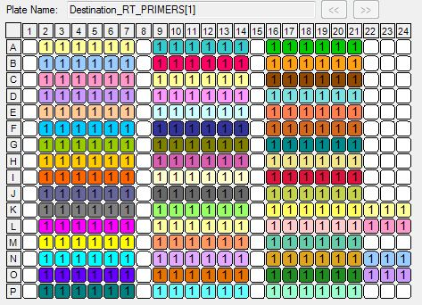

Differences with the previous design
====================================

For the experiment number 3, we changed the concentrations of TS oligos
and RT primers, in order to have a higher resolution near the values that
approached the optimum yields, and also to check if the outlier values were
caused by the oligonucleotide concentration or the oligonucleotide batch
(counfounded with the barcode sequence).

We kept the same transfer volumes, in order to keep the same Labcyte EPR
files for the transfer.

Load scripts and libraries
==========================


```r
# We use the R library called "magrittr", to build the data frame describing the
# 384-well plate.
library("magrittr")

library("ggplot2")
library("plyr")

library("platetools")
# The "set_block" function to update values in the data frame will be distributed
# in the platetools package.
# See https://github.com/Swarchal/platetools/pull/1
source("https://raw.githubusercontent.com/charles-plessy/platetools/setBlock/R/set_block.R")

# Do not load the whole smallCAGEqc package, just get the barcode data.
data("nanoCAGE2017barcodes", package = "smallCAGEqc")
```

Plate layout
============

Create a data frame representing the contents of each well.


```r
plate           <- data.frame(well = platetools::num_to_well(1:384, plate = "384"))
rownames(plate) <- plate$well
plate$row       <- sub("..$", "", plate$well) %>% factor
plate$col       <- sub("^.",  "", plate$well) %>% as.numeric %>% factor
```

MASTER_MIX
==========

Master mix volume 
------------------

350 nL of mastermix added to each well


```r
plate %<>%
  set_block("A01~P21", "MASTER_MIX_vol", 350) %>%
  set_block("K22~L24", "MASTER_MIX_vol", 350) %>%
  set_block("M23",     "MASTER_MIX_vol", 350) %>%
  set_block("N22~O24", "MASTER_MIX_vol", 350) %>%
  set_block("P23",     "MASTER_MIX_vol", 350)
```

TSO
===

TSO concentration
------------------

 - 120.0 μM ( +100 nL of 600 μM A1-A7 source wells) in A1-A7, A8-A14, A15-A21, K1-K7, N1-N7 
 -  60.0 μM (  +50 nL of 600 μM B1-B7 source wells) in B1-B7, B8-B14, B15-B21, L1-L7, O1-O7
 -  30.0 μM (  +25 nL of 600 μM C1-C7 source wells) in C1-C7, C8-C14, C15-C21, M1-M7, P1-P7
 -  80.0 μM ( +100 nL of 400 μM D1-D7 source wells) in D1-D7, D8-D14, D15-D21, K8-K14, N8-N14 + J1-J7, J8-J14, J15-J21, K22-K24, L22-L24, M23, N22-N24, O22-O24, P23
 -  40.0 μM (  +50 nL of 400 μM E1-E7 source wells) in E1-E7, E8-E14, E15-E21, L8-L14, O8-O14
 -  20.0 μM (  +25 nL of 400 μM F1-F7 source wells) in F1-F7, F8-F14, F15-F21, M8-M14, P8-P14
 -  10.0 μM ( +100 nL of  50 μM G1-G7 source wells) in G1-G7, G8-G14, G15-G21, K15-K21, N15-N21
 -   5.0 μM (  +50 nL of  50 μM H1-H7 source wells) in H1-H7, H8-H14, H15-H21, L15-L21, O15-O21
 -   2.5 μM (  +25 nL of  50 μM I1-I7 source wells) in I1-I7, I8-I14, I15-I21, M15-M21, P15-P21
 


```r
plate %<>%
  set_block("A01~A21", "TSO", 120.0) %>%
  set_block("K01~K07", "TSO", 120.0) %>%
  set_block("N01~N07", "TSO", 120.0) %>%
  set_block("B01~B21", "TSO",  60.0) %>%
  set_block("L01~L07", "TSO",  60.0) %>%
  set_block("O01~O07", "TSO",  60.0) %>%
  set_block("C01~C21", "TSO",  30.0) %>%
  set_block("M01~M07", "TSO",  30.0) %>%
  set_block("P01~P07", "TSO",  30.0) %>%
  set_block("D01~D21", "TSO",  80.0) %>%
  set_block("K08~K14", "TSO",  80.0) %>%
  set_block("N08~N14", "TSO",  80.0) %>%
  set_block("J01~J21", "TSO",  80.0) %>%
  set_block("K22~K24", "TSO",  80.0) %>%
  set_block("L22~L24", "TSO",  80.0) %>%
  set_block("M23",     "TSO",  80.0) %>%
  set_block("N22~N24", "TSO",  80.0) %>%
  set_block("O22~O24", "TSO",  80.0) %>%
  set_block("P23",     "TSO",  80.0) %>% 
  set_block("E01~E21", "TSO",  40.0) %>%
  set_block("L08~L14", "TSO",  40.0) %>%
  set_block("O08~O14", "TSO",  40.0) %>%
  set_block("F01~F21", "TSO",  20.0) %>%
  set_block("M08~M14", "TSO",  20.0) %>%
  set_block("P08~P14", "TSO",  20.0) %>%
  set_block("G01~G21", "TSO",  10.0) %>%
  set_block("K15~K21", "TSO",  10.0) %>%
  set_block("N15~N21", "TSO",  10.0) %>%
  set_block("H01~H21", "TSO",   5.0) %>%
  set_block("L15~L21", "TSO",   5.0) %>%
  set_block("O15~O21", "TSO",   5.0) %>%
  set_block("I01~I21", "TSO",   2.5) %>%
  set_block("M15~M21", "TSO",   2.5) %>%
  set_block("P15~P21", "TSO",   2.5)
```

TSO volume
-----------

25 (1-drop), 50 (2-drops) or 100 nL (4-drops) of TSO added, depending on the final concentration


```r
plate %<>%
  set_block("A01~A21", "TSO_vol", 100) %>%
  set_block("K01~K07", "TSO_vol", 100) %>%
  set_block("N01~N07", "TSO_vol", 100) %>%
  set_block("B01~B21", "TSO_vol", 50)  %>%
  set_block("L01~L07", "TSO_vol", 50)  %>%
  set_block("O01~O07", "TSO_vol", 50)  %>%
  set_block("C01~C21", "TSO_vol", 25)  %>%
  set_block("M01~M07", "TSO_vol", 25)  %>%
  set_block("P01~P07", "TSO_vol", 25)  %>%
  set_block("D01~D21", "TSO_vol", 100) %>%
  set_block("K08~K14", "TSO_vol", 100) %>%
  set_block("N08~N14", "TSO_vol", 100) %>%
  set_block("J01~J21", "TSO_vol", 100) %>%
  set_block("K22~K24", "TSO_vol", 100) %>%
  set_block("L22~L24", "TSO_vol", 100) %>%
  set_block("M23",     "TSO_vol", 100) %>%
  set_block("N22~N24", "TSO_vol", 100) %>%
  set_block("O22~O24", "TSO_vol", 100) %>%
  set_block("P23",     "TSO_vol", 100) %>% 
  set_block("E01~E21", "TSO_vol", 50)  %>%
  set_block("L08~L14", "TSO_vol", 50)  %>%
  set_block("O08~O14", "TSO_vol", 50)  %>%
  set_block("F01~F21", "TSO_vol", 25)  %>%
  set_block("M08~M14", "TSO_vol", 25)  %>%
  set_block("P08~P14", "TSO_vol", 25)  %>%
  set_block("G01~G21", "TSO_vol", 100) %>%
  set_block("K15~K21", "TSO_vol", 100) %>%
  set_block("N15~N21", "TSO_vol", 100) %>%
  set_block("H01~H21", "TSO_vol", 50)  %>%
  set_block("L15~L21", "TSO_vol", 50)  %>%
  set_block("O15~O21", "TSO_vol", 50)  %>%
  set_block("I01~I21", "TSO_vol", 25)  %>%
  set_block("M15~M21", "TSO_vol", 25)  %>%
  set_block("P15~P21", "TSO_vol", 25) 
```

Barcode ID
-----------

70 barcodes used for each RNA concentration tested


```r
plate %<>%
  set_block("A01", "BARCODE_ID", 01) %>%
  set_block("A02", "BARCODE_ID", 02) %>%
  set_block("A03", "BARCODE_ID", 03) %>%
  set_block("A04", "BARCODE_ID", 04) %>%
  set_block("A05", "BARCODE_ID", 05) %>%
  set_block("A06", "BARCODE_ID", 06) %>%
  set_block("A07", "BARCODE_ID", 07) %>%  
  set_block("A08", "BARCODE_ID", 01) %>%
  set_block("A09", "BARCODE_ID", 02) %>%
  set_block("A10", "BARCODE_ID", 03) %>%
  set_block("A11", "BARCODE_ID", 04) %>%
  set_block("A12", "BARCODE_ID", 05) %>%
  set_block("A13", "BARCODE_ID", 06) %>%
  set_block("A14", "BARCODE_ID", 07) %>%  
  set_block("A15", "BARCODE_ID", 01) %>%
  set_block("A16", "BARCODE_ID", 02) %>%
  set_block("A17", "BARCODE_ID", 03) %>%
  set_block("A18", "BARCODE_ID", 04) %>%
  set_block("A19", "BARCODE_ID", 05) %>%
  set_block("A20", "BARCODE_ID", 06) %>%
  set_block("A21", "BARCODE_ID", 07) %>%  
  set_block("K01", "BARCODE_ID", 01) %>%
  set_block("K02", "BARCODE_ID", 02) %>%
  set_block("K03", "BARCODE_ID", 03) %>%
  set_block("K04", "BARCODE_ID", 04) %>%
  set_block("K05", "BARCODE_ID", 05) %>%
  set_block("K06", "BARCODE_ID", 06) %>%
  set_block("K07", "BARCODE_ID", 07) %>%    
  set_block("N01", "BARCODE_ID", 01) %>%
  set_block("N02", "BARCODE_ID", 02) %>%
  set_block("N03", "BARCODE_ID", 03) %>%
  set_block("N04", "BARCODE_ID", 04) %>%
  set_block("N05", "BARCODE_ID", 05) %>%
  set_block("N06", "BARCODE_ID", 06) %>%
  set_block("N07", "BARCODE_ID", 07) %>%  
  set_block("B01", "BARCODE_ID", 08) %>%
  set_block("B02", "BARCODE_ID", 09) %>%
  set_block("B03", "BARCODE_ID", 10) %>%
  set_block("B04", "BARCODE_ID", 11) %>%
  set_block("B05", "BARCODE_ID", 12) %>%
  set_block("B06", "BARCODE_ID", 13) %>%
  set_block("B07", "BARCODE_ID", 14) %>%  
  set_block("B08", "BARCODE_ID", 08) %>%
  set_block("B09", "BARCODE_ID", 09) %>%
  set_block("B10", "BARCODE_ID", 10) %>%
  set_block("B11", "BARCODE_ID", 11) %>%
  set_block("B12", "BARCODE_ID", 12) %>%
  set_block("B13", "BARCODE_ID", 13) %>%
  set_block("B14", "BARCODE_ID", 14) %>%  
  set_block("B15", "BARCODE_ID", 08) %>%
  set_block("B16", "BARCODE_ID", 09) %>%
  set_block("B17", "BARCODE_ID", 10) %>%
  set_block("B18", "BARCODE_ID", 11) %>%
  set_block("B19", "BARCODE_ID", 12) %>%
  set_block("B20", "BARCODE_ID", 13) %>%
  set_block("B21", "BARCODE_ID", 14) %>% 
  set_block("L01", "BARCODE_ID", 08) %>%
  set_block("L02", "BARCODE_ID", 09) %>%
  set_block("L03", "BARCODE_ID", 10) %>%
  set_block("L04", "BARCODE_ID", 11) %>%
  set_block("L05", "BARCODE_ID", 12) %>%
  set_block("L06", "BARCODE_ID", 13) %>%
  set_block("L07", "BARCODE_ID", 14) %>% 
  set_block("O01", "BARCODE_ID", 08) %>%
  set_block("O02", "BARCODE_ID", 09) %>%
  set_block("O03", "BARCODE_ID", 10) %>%
  set_block("O04", "BARCODE_ID", 11) %>%
  set_block("O05", "BARCODE_ID", 12) %>%
  set_block("O06", "BARCODE_ID", 13) %>%
  set_block("O07", "BARCODE_ID", 14) %>% 
  set_block("C01", "BARCODE_ID", 15) %>%
  set_block("C02", "BARCODE_ID", 16) %>%
  set_block("C03", "BARCODE_ID", 17) %>%
  set_block("C04", "BARCODE_ID", 18) %>%
  set_block("C05", "BARCODE_ID", 19) %>%
  set_block("C06", "BARCODE_ID", 20) %>%
  set_block("C07", "BARCODE_ID", 21) %>%   
  set_block("C08", "BARCODE_ID", 15) %>%
  set_block("C09", "BARCODE_ID", 16) %>%
  set_block("C10", "BARCODE_ID", 17) %>%
  set_block("C11", "BARCODE_ID", 18) %>%
  set_block("C12", "BARCODE_ID", 19) %>%
  set_block("C13", "BARCODE_ID", 20) %>%
  set_block("C14", "BARCODE_ID", 21) %>%  
  set_block("C15", "BARCODE_ID", 15) %>%
  set_block("C16", "BARCODE_ID", 16) %>%
  set_block("C17", "BARCODE_ID", 17) %>%
  set_block("C18", "BARCODE_ID", 18) %>%
  set_block("C19", "BARCODE_ID", 19) %>%
  set_block("C20", "BARCODE_ID", 20) %>%
  set_block("C21", "BARCODE_ID", 21) %>%
  set_block("M01", "BARCODE_ID", 15) %>%
  set_block("M02", "BARCODE_ID", 16) %>%
  set_block("M03", "BARCODE_ID", 17) %>%
  set_block("M04", "BARCODE_ID", 18) %>%
  set_block("M05", "BARCODE_ID", 19) %>%
  set_block("M06", "BARCODE_ID", 20) %>%
  set_block("M07", "BARCODE_ID", 21) %>%
  set_block("P01", "BARCODE_ID", 15) %>%
  set_block("P02", "BARCODE_ID", 16) %>%
  set_block("P03", "BARCODE_ID", 17) %>%
  set_block("P04", "BARCODE_ID", 18) %>%
  set_block("P05", "BARCODE_ID", 19) %>%
  set_block("P06", "BARCODE_ID", 20) %>%
  set_block("P07", "BARCODE_ID", 21) %>%
  set_block("D01", "BARCODE_ID", 22) %>%
  set_block("D02", "BARCODE_ID", 23) %>%
  set_block("D03", "BARCODE_ID", 24) %>%
  set_block("D04", "BARCODE_ID", 25) %>%
  set_block("D05", "BARCODE_ID", 26) %>%
  set_block("D06", "BARCODE_ID", 27) %>%
  set_block("D07", "BARCODE_ID", 28) %>%   
  set_block("D08", "BARCODE_ID", 22) %>%
  set_block("D09", "BARCODE_ID", 23) %>%
  set_block("D10", "BARCODE_ID", 24) %>%
  set_block("D11", "BARCODE_ID", 25) %>%
  set_block("D12", "BARCODE_ID", 26) %>%
  set_block("D13", "BARCODE_ID", 27) %>%
  set_block("D14", "BARCODE_ID", 28) %>% 
  set_block("D15", "BARCODE_ID", 22) %>%
  set_block("D16", "BARCODE_ID", 23) %>%
  set_block("D17", "BARCODE_ID", 24) %>%
  set_block("D18", "BARCODE_ID", 25) %>%
  set_block("D19", "BARCODE_ID", 26) %>%
  set_block("D20", "BARCODE_ID", 27) %>%
  set_block("D21", "BARCODE_ID", 28) %>%
  set_block("K08", "BARCODE_ID", 22) %>%
  set_block("K09", "BARCODE_ID", 23) %>%
  set_block("K10", "BARCODE_ID", 24) %>%
  set_block("K11", "BARCODE_ID", 25) %>%
  set_block("K12", "BARCODE_ID", 26) %>%
  set_block("K13", "BARCODE_ID", 27) %>%
  set_block("K14", "BARCODE_ID", 28) %>%  
  set_block("N08", "BARCODE_ID", 22) %>%
  set_block("N09", "BARCODE_ID", 23) %>%
  set_block("N10", "BARCODE_ID", 24) %>%
  set_block("N11", "BARCODE_ID", 25) %>%
  set_block("N12", "BARCODE_ID", 26) %>%
  set_block("N13", "BARCODE_ID", 27) %>%
  set_block("N14", "BARCODE_ID", 28) %>% 
  set_block("E01", "BARCODE_ID", 29) %>%
  set_block("E02", "BARCODE_ID", 30) %>%
  set_block("E03", "BARCODE_ID", 31) %>%
  set_block("E04", "BARCODE_ID", 32) %>%
  set_block("E05", "BARCODE_ID", 33) %>%
  set_block("E06", "BARCODE_ID", 34) %>%
  set_block("E07", "BARCODE_ID", 35) %>%
  set_block("E08", "BARCODE_ID", 29) %>%
  set_block("E09", "BARCODE_ID", 30) %>%
  set_block("E10", "BARCODE_ID", 31) %>%
  set_block("E11", "BARCODE_ID", 32) %>%
  set_block("E12", "BARCODE_ID", 33) %>%
  set_block("E13", "BARCODE_ID", 34) %>%
  set_block("E14", "BARCODE_ID", 35) %>%  
  set_block("E15", "BARCODE_ID", 29) %>%
  set_block("E16", "BARCODE_ID", 30) %>%
  set_block("E17", "BARCODE_ID", 31) %>%
  set_block("E18", "BARCODE_ID", 32) %>%
  set_block("E19", "BARCODE_ID", 33) %>%
  set_block("E20", "BARCODE_ID", 34) %>%
  set_block("E21", "BARCODE_ID", 35) %>%  
  set_block("L08", "BARCODE_ID", 29) %>%
  set_block("L09", "BARCODE_ID", 30) %>%
  set_block("L10", "BARCODE_ID", 31) %>%
  set_block("L11", "BARCODE_ID", 32) %>%
  set_block("L12", "BARCODE_ID", 33) %>%
  set_block("L13", "BARCODE_ID", 34) %>%
  set_block("L14", "BARCODE_ID", 35) %>%  
  set_block("O08", "BARCODE_ID", 29) %>%
  set_block("O09", "BARCODE_ID", 30) %>%
  set_block("O10", "BARCODE_ID", 31) %>%
  set_block("O11", "BARCODE_ID", 32) %>%
  set_block("O12", "BARCODE_ID", 33) %>%
  set_block("O13", "BARCODE_ID", 34) %>%
  set_block("O14", "BARCODE_ID", 35) %>%    
  set_block("F01", "BARCODE_ID", 36) %>%
  set_block("F02", "BARCODE_ID", 37) %>%
  set_block("F03", "BARCODE_ID", 38) %>%
  set_block("F04", "BARCODE_ID", 39) %>%
  set_block("F05", "BARCODE_ID", 40) %>%
  set_block("F06", "BARCODE_ID", 41) %>%
  set_block("F07", "BARCODE_ID", 42) %>% 
  set_block("F08", "BARCODE_ID", 36) %>%
  set_block("F09", "BARCODE_ID", 37) %>%
  set_block("F10", "BARCODE_ID", 38) %>%
  set_block("F11", "BARCODE_ID", 39) %>%
  set_block("F12", "BARCODE_ID", 40) %>%
  set_block("F13", "BARCODE_ID", 41) %>%
  set_block("F14", "BARCODE_ID", 42) %>%  
  set_block("F15", "BARCODE_ID", 36) %>%
  set_block("F16", "BARCODE_ID", 37) %>%
  set_block("F17", "BARCODE_ID", 38) %>%
  set_block("F18", "BARCODE_ID", 39) %>%
  set_block("F19", "BARCODE_ID", 40) %>%
  set_block("F20", "BARCODE_ID", 41) %>%
  set_block("F21", "BARCODE_ID", 42) %>%
  set_block("M08", "BARCODE_ID", 36) %>%
  set_block("M09", "BARCODE_ID", 37) %>%
  set_block("M10", "BARCODE_ID", 38) %>%
  set_block("M11", "BARCODE_ID", 39) %>%
  set_block("M12", "BARCODE_ID", 40) %>%
  set_block("M13", "BARCODE_ID", 41) %>%
  set_block("M14", "BARCODE_ID", 42) %>%   
  set_block("P08", "BARCODE_ID", 36) %>%
  set_block("P09", "BARCODE_ID", 37) %>%
  set_block("P10", "BARCODE_ID", 38) %>%
  set_block("P11", "BARCODE_ID", 39) %>%
  set_block("P12", "BARCODE_ID", 40) %>%
  set_block("P13", "BARCODE_ID", 41) %>%
  set_block("P14", "BARCODE_ID", 42) %>%  
  set_block("G01", "BARCODE_ID", 43) %>%
  set_block("G02", "BARCODE_ID", 44) %>%
  set_block("G03", "BARCODE_ID", 45) %>%
  set_block("G04", "BARCODE_ID", 46) %>%
  set_block("G05", "BARCODE_ID", 47) %>%
  set_block("G06", "BARCODE_ID", 48) %>%
  set_block("G07", "BARCODE_ID", 49) %>% 
  set_block("G08", "BARCODE_ID", 43) %>%
  set_block("G09", "BARCODE_ID", 44) %>%
  set_block("G10", "BARCODE_ID", 45) %>%
  set_block("G11", "BARCODE_ID", 46) %>%
  set_block("G12", "BARCODE_ID", 47) %>%
  set_block("G13", "BARCODE_ID", 48) %>%
  set_block("G14", "BARCODE_ID", 49) %>%   
  set_block("G15", "BARCODE_ID", 43) %>%
  set_block("G16", "BARCODE_ID", 44) %>%
  set_block("G17", "BARCODE_ID", 45) %>%
  set_block("G18", "BARCODE_ID", 46) %>%
  set_block("G19", "BARCODE_ID", 47) %>%
  set_block("G20", "BARCODE_ID", 48) %>%
  set_block("G21", "BARCODE_ID", 49) %>% 
  set_block("K15", "BARCODE_ID", 43) %>%
  set_block("K16", "BARCODE_ID", 44) %>%
  set_block("K17", "BARCODE_ID", 45) %>%
  set_block("K18", "BARCODE_ID", 46) %>%
  set_block("K19", "BARCODE_ID", 47) %>%
  set_block("K20", "BARCODE_ID", 48) %>%
  set_block("K21", "BARCODE_ID", 49) %>%   
  set_block("N15", "BARCODE_ID", 43) %>%
  set_block("N16", "BARCODE_ID", 44) %>%
  set_block("N17", "BARCODE_ID", 45) %>%
  set_block("N18", "BARCODE_ID", 46) %>%
  set_block("N19", "BARCODE_ID", 47) %>%
  set_block("N20", "BARCODE_ID", 48) %>%
  set_block("N21", "BARCODE_ID", 49) %>%  
  set_block("H01", "BARCODE_ID", 50) %>%
  set_block("H02", "BARCODE_ID", 51) %>%
  set_block("H03", "BARCODE_ID", 52) %>%
  set_block("H04", "BARCODE_ID", 53) %>%
  set_block("H05", "BARCODE_ID", 54) %>%
  set_block("H06", "BARCODE_ID", 55) %>%
  set_block("H07", "BARCODE_ID", 56) %>%
  set_block("H08", "BARCODE_ID", 50) %>%
  set_block("H09", "BARCODE_ID", 51) %>%
  set_block("H10", "BARCODE_ID", 52) %>%
  set_block("H11", "BARCODE_ID", 53) %>%
  set_block("H12", "BARCODE_ID", 54) %>%
  set_block("H13", "BARCODE_ID", 55) %>%
  set_block("H14", "BARCODE_ID", 56) %>%
  set_block("H15", "BARCODE_ID", 50) %>%
  set_block("H16", "BARCODE_ID", 51) %>%
  set_block("H17", "BARCODE_ID", 52) %>%
  set_block("H18", "BARCODE_ID", 53) %>%
  set_block("H19", "BARCODE_ID", 54) %>%
  set_block("H20", "BARCODE_ID", 55) %>%
  set_block("H21", "BARCODE_ID", 56) %>%
  set_block("L15", "BARCODE_ID", 50) %>%
  set_block("L16", "BARCODE_ID", 51) %>%
  set_block("L17", "BARCODE_ID", 52) %>%
  set_block("L18", "BARCODE_ID", 53) %>%
  set_block("L19", "BARCODE_ID", 54) %>%
  set_block("L20", "BARCODE_ID", 55) %>%
  set_block("L21", "BARCODE_ID", 56) %>%  
  set_block("O15", "BARCODE_ID", 50) %>%
  set_block("O16", "BARCODE_ID", 51) %>%
  set_block("O17", "BARCODE_ID", 52) %>%
  set_block("O18", "BARCODE_ID", 53) %>%
  set_block("O19", "BARCODE_ID", 54) %>%
  set_block("O20", "BARCODE_ID", 55) %>%
  set_block("O21", "BARCODE_ID", 56) %>% 
  set_block("I01", "BARCODE_ID", 57) %>%
  set_block("I02", "BARCODE_ID", 58) %>%
  set_block("I03", "BARCODE_ID", 59) %>%
  set_block("I04", "BARCODE_ID", 60) %>%
  set_block("I05", "BARCODE_ID", 61) %>%
  set_block("I06", "BARCODE_ID", 62) %>%
  set_block("I07", "BARCODE_ID", 63) %>%  
  set_block("I08", "BARCODE_ID", 57) %>%
  set_block("I09", "BARCODE_ID", 58) %>%
  set_block("I10", "BARCODE_ID", 59) %>%
  set_block("I11", "BARCODE_ID", 60) %>%
  set_block("I12", "BARCODE_ID", 61) %>%
  set_block("I13", "BARCODE_ID", 62) %>%
  set_block("I14", "BARCODE_ID", 63) %>%    
  set_block("I15", "BARCODE_ID", 57) %>%
  set_block("I16", "BARCODE_ID", 58) %>%
  set_block("I17", "BARCODE_ID", 59) %>%
  set_block("I18", "BARCODE_ID", 60) %>%
  set_block("I19", "BARCODE_ID", 61) %>%
  set_block("I20", "BARCODE_ID", 62) %>%
  set_block("I21", "BARCODE_ID", 63) %>%   
  set_block("M15", "BARCODE_ID", 57) %>%
  set_block("M16", "BARCODE_ID", 58) %>%
  set_block("M17", "BARCODE_ID", 59) %>%
  set_block("M18", "BARCODE_ID", 60) %>%
  set_block("M19", "BARCODE_ID", 61) %>%
  set_block("M20", "BARCODE_ID", 62) %>%
  set_block("M21", "BARCODE_ID", 63) %>%  
  set_block("P15", "BARCODE_ID", 57) %>%
  set_block("P16", "BARCODE_ID", 58) %>%
  set_block("P17", "BARCODE_ID", 59) %>%
  set_block("P18", "BARCODE_ID", 60) %>%
  set_block("P19", "BARCODE_ID", 61) %>%
  set_block("P20", "BARCODE_ID", 62) %>%
  set_block("P21", "BARCODE_ID", 63) %>%   
  set_block("J01", "BARCODE_ID", 64) %>%
  set_block("J02", "BARCODE_ID", 65) %>%
  set_block("J03", "BARCODE_ID", 66) %>%
  set_block("J04", "BARCODE_ID", 67) %>%
  set_block("J05", "BARCODE_ID", 68) %>%
  set_block("J06", "BARCODE_ID", 69) %>%
  set_block("J07", "BARCODE_ID", 70) %>%   
  set_block("J08", "BARCODE_ID", 64) %>%
  set_block("J09", "BARCODE_ID", 65) %>%
  set_block("J10", "BARCODE_ID", 66) %>%
  set_block("J11", "BARCODE_ID", 67) %>%
  set_block("J12", "BARCODE_ID", 68) %>%
  set_block("J13", "BARCODE_ID", 69) %>%
  set_block("J14", "BARCODE_ID", 70) %>%   
  set_block("J15", "BARCODE_ID", 64) %>%
  set_block("J16", "BARCODE_ID", 65) %>%
  set_block("J17", "BARCODE_ID", 66) %>%
  set_block("J18", "BARCODE_ID", 67) %>%
  set_block("J19", "BARCODE_ID", 68) %>%
  set_block("J20", "BARCODE_ID", 69) %>%
  set_block("J21", "BARCODE_ID", 70) %>%  
  set_block("M23", "BARCODE_ID", 64) %>%
  set_block("K22", "BARCODE_ID", 65) %>%
  set_block("K23", "BARCODE_ID", 66) %>%
  set_block("K24", "BARCODE_ID", 67) %>%
  set_block("L22", "BARCODE_ID", 68) %>%
  set_block("L23", "BARCODE_ID", 69) %>%
  set_block("L24", "BARCODE_ID", 70) %>%  
  set_block("P23", "BARCODE_ID", 64) %>%
  set_block("N22", "BARCODE_ID", 65) %>%
  set_block("N23", "BARCODE_ID", 66) %>%
  set_block("N24", "BARCODE_ID", 67) %>%
  set_block("O22", "BARCODE_ID", 68) %>%
  set_block("O23", "BARCODE_ID", 69) %>%
  set_block("O24", "BARCODE_ID", 70)

plate$BARCODE_SEQ <- nanoCAGE2017barcodes[plate$BARCODE_ID,1]
```

RT_PRIMERS
===========

RT primers concentration
-------------------------

 -  0.0 μM (controls, + 0 nL) in Col 1, 8 and 15 + M23 + P23
 -  0.5 μM (+ 25 nL from source well K1 2.5 μM) in Col 2, 9 and 16 + K22 + N22
 -  1.0 μM (+ 25 nL from source well K2 5 μM) in Col 3, 10 and 17 + K23 + N23
 -  2.0 μM (+ 25 nL from source well K3 10 μM) in Col 4, 11 and 18 + K24 + N24
 -  4.0 μM (+ 25 nL from source well K4 20 μM) in Col 5, 12 and 19 + L22 + O22
 -  8.0 μM (+ 25 nL from source well K5 40 μM) in Col 6, 13 and 20 + L23 + O23
 - 12.0 μM (+ 25 nL from source well K6 80 μM) in Col 7, 14 and 21 + L24 + O24


```r
plate %<>%
  set_block("A01~P01",   "RT_PRIMERS",  0.0) %>%
  set_block("A08~P08",   "RT_PRIMERS",  0.0) %>%
  set_block("A15~P15",   "RT_PRIMERS",  0.0) %>%
  set_block("M23",       "RT_PRIMERS",  0.0) %>%
  set_block("P23",       "RT_PRIMERS",  0.0) %>%
  set_block("A02~P02",   "RT_PRIMERS",  0.5) %>%
  set_block("A09~P09",   "RT_PRIMERS",  0.5) %>%
  set_block("A16~P16",   "RT_PRIMERS",  0.5) %>%
  set_block("K22",       "RT_PRIMERS",  0.5) %>%
  set_block("N22",       "RT_PRIMERS",  0.5) %>%
  set_block("A03~P03",   "RT_PRIMERS",  1.0) %>%
  set_block("A10~P10",   "RT_PRIMERS",  1.0) %>%
  set_block("A17~P17",   "RT_PRIMERS",  1.0) %>%
  set_block("K23",       "RT_PRIMERS",  1.0) %>%
  set_block("N23",       "RT_PRIMERS",  1.0) %>%
  set_block("A04~P04",   "RT_PRIMERS",  2.0) %>%
  set_block("A11~P11",   "RT_PRIMERS",  2.0) %>%
  set_block("A18~P18",   "RT_PRIMERS",  2.0) %>%
  set_block("K24",       "RT_PRIMERS",  2.0) %>%
  set_block("N24",       "RT_PRIMERS",  2.0) %>%
  set_block("A05~P05",   "RT_PRIMERS",  4.0) %>%
  set_block("A12~P12",   "RT_PRIMERS",  4.0) %>%
  set_block("A19~P19",   "RT_PRIMERS",  4.0) %>%
  set_block("L22",       "RT_PRIMERS",  4.0) %>%
  set_block("O22",       "RT_PRIMERS",  4.0) %>%
  set_block("A06~P06",   "RT_PRIMERS",  8.0) %>%
  set_block("A13~P13",   "RT_PRIMERS",  8.0) %>%
  set_block("A20~P20",   "RT_PRIMERS",  8.0) %>%
  set_block("L23",       "RT_PRIMERS",  8.0) %>%
  set_block("O23",       "RT_PRIMERS",  8.0) %>%
  set_block("A07~P07",   "RT_PRIMERS", 12.0) %>%
  set_block("A14~P14",   "RT_PRIMERS", 12.0) %>%
  set_block("A21~P21",   "RT_PRIMERS", 12.0) %>%
  set_block("L24",       "RT_PRIMERS", 12.0) %>%
  set_block("O24",       "RT_PRIMERS", 12.0) 
```

RT primer volume 
------------------

25 nl of RT_PRIMERS added in each well, except the negative controls 


```r
plate %<>%
  set_block("A01~P01",   "RT_PRIMERS_vol", 0) %>%
  set_block("A08~P08",   "RT_PRIMERS_vol", 0) %>%
  set_block("A15~P15",   "RT_PRIMERS_vol", 0) %>%
  set_block("M23",       "RT_PRIMERS_vol", 0) %>%
  set_block("P23",       "RT_PRIMERS_vol", 0) %>%
  set_block("A02~P02",   "RT_PRIMERS_vol", 25) %>%
  set_block("A09~P09",   "RT_PRIMERS_vol", 25) %>%
  set_block("A16~P16",   "RT_PRIMERS_vol", 25) %>%
  set_block("K22",       "RT_PRIMERS_vol", 25) %>%
  set_block("N22",       "RT_PRIMERS_vol", 25) %>%
  set_block("A03~P03",   "RT_PRIMERS_vol", 25) %>%
  set_block("A10~P10",   "RT_PRIMERS_vol", 25) %>%
  set_block("A17~P17",   "RT_PRIMERS_vol", 25) %>%
  set_block("K23",       "RT_PRIMERS_vol", 25) %>%
  set_block("N23",       "RT_PRIMERS_vol", 25) %>%
  set_block("A04~P04",   "RT_PRIMERS_vol", 25) %>%
  set_block("A11~P11",   "RT_PRIMERS_vol", 25) %>%
  set_block("A18~P18",   "RT_PRIMERS_vol", 25) %>%
  set_block("K24",       "RT_PRIMERS_vol", 25) %>%
  set_block("N24",       "RT_PRIMERS_vol", 25) %>%
  set_block("A05~P05",   "RT_PRIMERS_vol", 25) %>%
  set_block("A12~P12",   "RT_PRIMERS_vol", 25) %>%
  set_block("A19~P19",   "RT_PRIMERS_vol", 25) %>%
  set_block("L22",       "RT_PRIMERS_vol", 25) %>%
  set_block("O22",       "RT_PRIMERS_vol", 25) %>%
  set_block("A06~P06",   "RT_PRIMERS_vol", 25) %>%
  set_block("A13~P13",   "RT_PRIMERS_vol", 25) %>%
  set_block("A20~P20",   "RT_PRIMERS_vol", 25) %>%
  set_block("L23",       "RT_PRIMERS_vol", 25) %>%
  set_block("O23",       "RT_PRIMERS_vol", 25) %>%
  set_block("A07~P07",   "RT_PRIMERS_vol", 25) %>%
  set_block("A14~P14",   "RT_PRIMERS_vol", 25) %>%
  set_block("A21~P21",   "RT_PRIMERS_vol", 25) %>%
  set_block("L24",       "RT_PRIMERS_vol", 25) %>%
  set_block("O24",       "RT_PRIMERS_vol", 25) 
```

RNA
====

RNA concentration
------------------

 - 0 (controls, + 0 nL) in J01-J21 + K22-K24 + L22-L24 + M23 + N22-N24 + O22-O24 + P23
 - 100 ng (+ 25 nL from source well L1 4 ug/uL) in A01-I07
 - 10 ng (+ 25 nL from source well L2 400 ng/uL) in A08-I14
 - 1 ng (+ 25 nL from source well L3 40 ng/uL) in A15-I21
 - 100 pg (+ 25 nL from source well L4 4 ng/uL) in K01-M21
 - 10 pg (+ 25 nL from source well L5 0.4 ng/uL) in N01-P21


```r
plate %<>%
  set_block("J01~J21", "RNA", 0)   %>%
  set_block("K22~L24", "RNA", 0)   %>%
  set_block("M23",     "RNA", 0)   %>%
  set_block("N22~O24", "RNA", 0)   %>%
  set_block("P23",     "RNA", 0)   %>%
  set_block("A01~I07", "RNA", 100) %>%
  set_block("A08~I14", "RNA", 10)  %>%
  set_block("A15~I21", "RNA", 1)   %>%
  set_block("K01~M21", "RNA", 0.1) %>%
  set_block("N01~P21", "RNA", 0.01)
```

RNA volume
-----------

25 nL of RNA added to each well, except the negative controls


```r
plate %<>%
  set_block("J01~J21", "RNA_vol", 0)  %>%
  set_block("K22~L24", "RNA_vol", 0)  %>%
  set_block("M23",     "RNA_vol", 0)  %>%
  set_block("N22~O24", "RNA_vol", 0)  %>%
  set_block("P23",     "RNA_vol", 0)  %>%
  set_block("A01~I07", "RNA_vol", 25) %>%
  set_block("A08~I14", "RNA_vol", 25) %>%
  set_block("A15~I21", "RNA_vol", 25) %>%
  set_block("K01~M21", "RNA_vol", 25) %>%
  set_block("N01~P21", "RNA_vol", 25)
```

RNA group
---------

Wells that will be indexed together, including negative controls with no RNA.


```r
plate %<>%
  set_block("A01~J07", "RNA_group", "100ng") %>%
  set_block("A08~J14", "RNA_group",  "10ng") %>%
  set_block("A15~J21", "RNA_group",   "1ng") %>%
  set_block("K01~L24", "RNA_group", "100pg") %>%
  set_block("M01~M21", "RNA_group", "100pg") %>%
  set_block("M23",     "RNA_group", "100pg") %>%
  set_block("N01~O24", "RNA_group",  "10pg") %>%
  set_block("P01~P21", "RNA_group",  "10pg") %>%
  set_block("P23",     "RNA_group",  "10pg")
plate$RNA_group %<>% factor(levels=c("100ng", "10ng", "1ng", "100pg", "10pg"))
```

H2O
====

H2O volume
-----------

0, 25, 50, 75 or 100 nL H2O added to complete RT reaction volume up to 500 nL


```r
plate %<>%
  set_block("A02~A07", "H2O_vol", 0) %>%
  set_block("A09~A14", "H2O_vol", 0) %>%
  set_block("A16~A21", "H2O_vol", 0) %>%
  set_block("D02~D07", "H2O_vol", 0) %>%
  set_block("D09~D14", "H2O_vol", 0) %>%
  set_block("D16~D21", "H2O_vol", 0) %>%
  set_block("G02~G07", "H2O_vol", 0) %>%
  set_block("G09~G14", "H2O_vol", 0) %>%
  set_block("G16~G21", "H2O_vol", 0) %>%
  set_block("K02~K07", "H2O_vol", 0) %>%
  set_block("K09~K14", "H2O_vol", 0) %>%
  set_block("K16~K21", "H2O_vol", 0) %>%
  set_block("N02~N07", "H2O_vol", 0) %>%
  set_block("N09~N14", "H2O_vol", 0) %>%
  set_block("N16~N21", "H2O_vol", 0) %>%
  set_block("J02~J07", "H2O_vol", 25) %>%
  set_block("J09~J14", "H2O_vol", 25) %>%
  set_block("J16~J21", "H2O_vol", 25) %>%
  set_block("J02~J07", "H2O_vol", 25) %>%
  set_block("K22~K24", "H2O_vol", 25) %>%
  set_block("L22~L24", "H2O_vol", 25) %>%
  set_block("N22~N24", "H2O_vol", 25) %>%
  set_block("O22~O24", "H2O_vol", 25) %>%
  set_block("K22~K24", "H2O_vol", 25) %>%
  set_block("A01",     "H2O_vol", 25) %>%
  set_block("A08",     "H2O_vol", 25) %>%
  set_block("A15",     "H2O_vol", 25) %>%
  set_block("D01",     "H2O_vol", 25) %>%
  set_block("D08",     "H2O_vol", 25) %>%
  set_block("D15",     "H2O_vol", 25) %>%
  set_block("G01",     "H2O_vol", 25) %>%
  set_block("G08",     "H2O_vol", 25) %>%
  set_block("G15",     "H2O_vol", 25) %>%
  set_block("K01",     "H2O_vol", 25) %>%
  set_block("K08",     "H2O_vol", 25) %>%
  set_block("K15",     "H2O_vol", 25) %>%
  set_block("N01",     "H2O_vol", 25) %>%
  set_block("N08",     "H2O_vol", 25) %>%
  set_block("N15",     "H2O_vol", 25) %>%
  set_block("B02~B07", "H2O_vol", 50) %>%
  set_block("B09~B14", "H2O_vol", 50) %>%
  set_block("B16~B21", "H2O_vol", 50) %>%
  set_block("E02~E07", "H2O_vol", 50) %>%
  set_block("E09~E14", "H2O_vol", 50) %>%
  set_block("E16~E21", "H2O_vol", 50) %>%
  set_block("H02~H07", "H2O_vol", 50) %>%
  set_block("H09~H14", "H2O_vol", 50) %>%
  set_block("H16~H21", "H2O_vol", 50) %>%
  set_block("L02~L07", "H2O_vol", 50) %>%
  set_block("L09~L14", "H2O_vol", 50) %>%
  set_block("L16~L21", "H2O_vol", 50) %>%
  set_block("O02~O07", "H2O_vol", 50) %>%
  set_block("O09~O14", "H2O_vol", 50) %>%
  set_block("O16~O21", "H2O_vol", 50) %>%
  set_block("M23",     "H2O_vol", 50) %>%
  set_block("P23",     "H2O_vol", 50) %>%
  set_block("J01",     "H2O_vol", 50) %>%
  set_block("J08",     "H2O_vol", 50) %>%
  set_block("J15",     "H2O_vol", 50) %>%
  set_block("C02~C07", "H2O_vol", 75) %>%
  set_block("C09~C14", "H2O_vol", 75) %>%
  set_block("C16~C21", "H2O_vol", 75) %>%
  set_block("F02~F07", "H2O_vol", 75) %>%
  set_block("F09~F14", "H2O_vol", 75) %>%
  set_block("F16~F21", "H2O_vol", 75) %>%
  set_block("I02~I07", "H2O_vol", 75) %>%
  set_block("I09~I14", "H2O_vol", 75) %>%
  set_block("I16~I21", "H2O_vol", 75) %>%
  set_block("M02~M07", "H2O_vol", 75) %>%
  set_block("M09~M14", "H2O_vol", 75) %>%
  set_block("M16~M21", "H2O_vol", 75) %>%
  set_block("P02~P07", "H2O_vol", 75) %>%
  set_block("P09~P14", "H2O_vol", 75) %>%
  set_block("P16~P21", "H2O_vol", 75) %>%
  set_block("B01",     "H2O_vol", 75) %>%
  set_block("B08",     "H2O_vol", 75) %>%
  set_block("B15",     "H2O_vol", 75) %>%
  set_block("E01",     "H2O_vol", 75) %>%
  set_block("E08",     "H2O_vol", 75) %>%
  set_block("E15",     "H2O_vol", 75) %>%
  set_block("H01",     "H2O_vol", 75) %>%
  set_block("H08",     "H2O_vol", 75) %>%
  set_block("H15",     "H2O_vol", 75) %>%
  set_block("L01",     "H2O_vol", 75) %>%
  set_block("L08",     "H2O_vol", 75) %>%
  set_block("L15",     "H2O_vol", 75) %>%
  set_block("O01",     "H2O_vol", 75) %>%
  set_block("O08",     "H2O_vol", 75) %>%
  set_block("O15",     "H2O_vol", 75) %>%
  set_block("C01",     "H2O_vol", 100) %>%
  set_block("C08",     "H2O_vol", 100) %>%
  set_block("C15",     "H2O_vol", 100) %>%
  set_block("F01",     "H2O_vol", 100) %>%
  set_block("F08",     "H2O_vol", 100) %>%
  set_block("F15",     "H2O_vol", 100) %>%
  set_block("I01",     "H2O_vol", 100) %>%
  set_block("I08",     "H2O_vol", 100) %>%
  set_block("I15",     "H2O_vol", 100) %>%
  set_block("M01",     "H2O_vol", 100) %>%
  set_block("M08",     "H2O_vol", 100) %>%
  set_block("M15",     "H2O_vol", 100) %>%
  set_block("P01",     "H2O_vol", 100) %>%
  set_block("P08",     "H2O_vol", 100) %>%
  set_block("P15",     "H2O_vol", 100)
```

Total volume
============


```r
plate$total_volume <- ""
plate$total_volume <- rowSums(plate[, c("MASTER_MIX_vol", "TSO_vol", "RT_PRIMERS_vol", "RNA_vol", "H2O_vol")])
```

RATIO TSO/RT_PRIMERS
=====================

Different ratio of TSO/RT_PRIMERS tested


```r
plate$PRIMERS_RATIO <- ""
plate$PRIMERS_RATIO <- c(plate$TSO/plate$RT_PRIMERS)
plate$PRIMERS_RATIO <- sub("Inf", "no_RT_PRIMERS", plate$PRIMERS_RATIO)
```

Summary
=======


```r
plate 
```

```
##     well row col MASTER_MIX_vol   TSO TSO_vol BARCODE_ID BARCODE_SEQ RT_PRIMERS RT_PRIMERS_vol
## A01  A01   A   1            350 120.0     100          1      ACACAG        0.0              0
## A02  A02   A   2            350 120.0     100          2      ACACGT        0.5             25
## A03  A03   A   3            350 120.0     100          3      ACACTC        1.0             25
## A04  A04   A   4            350 120.0     100          4      ACAGAT        2.0             25
## A05  A05   A   5            350 120.0     100          5      ACAGCA        4.0             25
## A06  A06   A   6            350 120.0     100          6      ACAGTG        8.0             25
## A07  A07   A   7            350 120.0     100          7      ACATAC       12.0             25
## A08  A08   A   8            350 120.0     100          1      ACACAG        0.0              0
## A09  A09   A   9            350 120.0     100          2      ACACGT        0.5             25
## A10  A10   A  10            350 120.0     100          3      ACACTC        1.0             25
## A11  A11   A  11            350 120.0     100          4      ACAGAT        2.0             25
## A12  A12   A  12            350 120.0     100          5      ACAGCA        4.0             25
## A13  A13   A  13            350 120.0     100          6      ACAGTG        8.0             25
## A14  A14   A  14            350 120.0     100          7      ACATAC       12.0             25
## A15  A15   A  15            350 120.0     100          1      ACACAG        0.0              0
## A16  A16   A  16            350 120.0     100          2      ACACGT        0.5             25
## A17  A17   A  17            350 120.0     100          3      ACACTC        1.0             25
## A18  A18   A  18            350 120.0     100          4      ACAGAT        2.0             25
## A19  A19   A  19            350 120.0     100          5      ACAGCA        4.0             25
## A20  A20   A  20            350 120.0     100          6      ACAGTG        8.0             25
## A21  A21   A  21            350 120.0     100          7      ACATAC       12.0             25
## A22  A22   A  22             NA    NA      NA         NA        <NA>         NA             NA
## A23  A23   A  23             NA    NA      NA         NA        <NA>         NA             NA
## A24  A24   A  24             NA    NA      NA         NA        <NA>         NA             NA
## B01  B01   B   1            350  60.0      50          8      ACATCT        0.0              0
## B02  B02   B   2            350  60.0      50          9      ACATGA        0.5             25
## B03  B03   B   3            350  60.0      50         10      AGTACG        1.0             25
## B04  B04   B   4            350  60.0      50         11      AGTAGC        2.0             25
## B05  B05   B   5            350  60.0      50         12      AGTATA        4.0             25
## B06  B06   B   6            350  60.0      50         13      AGTCAG        8.0             25
## B07  B07   B   7            350  60.0      50         14      AGTCGT       12.0             25
## B08  B08   B   8            350  60.0      50          8      ACATCT        0.0              0
## B09  B09   B   9            350  60.0      50          9      ACATGA        0.5             25
## B10  B10   B  10            350  60.0      50         10      AGTACG        1.0             25
## B11  B11   B  11            350  60.0      50         11      AGTAGC        2.0             25
## B12  B12   B  12            350  60.0      50         12      AGTATA        4.0             25
## B13  B13   B  13            350  60.0      50         13      AGTCAG        8.0             25
## B14  B14   B  14            350  60.0      50         14      AGTCGT       12.0             25
## B15  B15   B  15            350  60.0      50          8      ACATCT        0.0              0
## B16  B16   B  16            350  60.0      50          9      ACATGA        0.5             25
## B17  B17   B  17            350  60.0      50         10      AGTACG        1.0             25
## B18  B18   B  18            350  60.0      50         11      AGTAGC        2.0             25
## B19  B19   B  19            350  60.0      50         12      AGTATA        4.0             25
## B20  B20   B  20            350  60.0      50         13      AGTCAG        8.0             25
## B21  B21   B  21            350  60.0      50         14      AGTCGT       12.0             25
## B22  B22   B  22             NA    NA      NA         NA        <NA>         NA             NA
## B23  B23   B  23             NA    NA      NA         NA        <NA>         NA             NA
## B24  B24   B  24             NA    NA      NA         NA        <NA>         NA             NA
## C01  C01   C   1            350  30.0      25         15      AGTCTC        0.0              0
## C02  C02   C   2            350  30.0      25         16      AGTGAT        0.5             25
## C03  C03   C   3            350  30.0      25         17      AGTGCA        1.0             25
## C04  C04   C   4            350  30.0      25         18      AGTGTG        2.0             25
## C05  C05   C   5            350  30.0      25         19      ATCACG        4.0             25
## C06  C06   C   6            350  30.0      25         20      ATCAGC        8.0             25
## C07  C07   C   7            350  30.0      25         21      ATCATA       12.0             25
## C08  C08   C   8            350  30.0      25         15      AGTCTC        0.0              0
## C09  C09   C   9            350  30.0      25         16      AGTGAT        0.5             25
## C10  C10   C  10            350  30.0      25         17      AGTGCA        1.0             25
## C11  C11   C  11            350  30.0      25         18      AGTGTG        2.0             25
## C12  C12   C  12            350  30.0      25         19      ATCACG        4.0             25
## C13  C13   C  13            350  30.0      25         20      ATCAGC        8.0             25
## C14  C14   C  14            350  30.0      25         21      ATCATA       12.0             25
## C15  C15   C  15            350  30.0      25         15      AGTCTC        0.0              0
## C16  C16   C  16            350  30.0      25         16      AGTGAT        0.5             25
## C17  C17   C  17            350  30.0      25         17      AGTGCA        1.0             25
## C18  C18   C  18            350  30.0      25         18      AGTGTG        2.0             25
## C19  C19   C  19            350  30.0      25         19      ATCACG        4.0             25
## C20  C20   C  20            350  30.0      25         20      ATCAGC        8.0             25
## C21  C21   C  21            350  30.0      25         21      ATCATA       12.0             25
## C22  C22   C  22             NA    NA      NA         NA        <NA>         NA             NA
## C23  C23   C  23             NA    NA      NA         NA        <NA>         NA             NA
## C24  C24   C  24             NA    NA      NA         NA        <NA>         NA             NA
## D01  D01   D   1            350  80.0     100         22      ATCGAT        0.0              0
## D02  D02   D   2            350  80.0     100         23      ATCGCA        0.5             25
## D03  D03   D   3            350  80.0     100         24      ATCGTG        1.0             25
## D04  D04   D   4            350  80.0     100         25      ATCTAC        2.0             25
## D05  D05   D   5            350  80.0     100         26      ATCTCT        4.0             25
## D06  D06   D   6            350  80.0     100         27      ATCTGA        8.0             25
## D07  D07   D   7            350  80.0     100         28      CACACG       12.0             25
## D08  D08   D   8            350  80.0     100         22      ATCGAT        0.0              0
## D09  D09   D   9            350  80.0     100         23      ATCGCA        0.5             25
## D10  D10   D  10            350  80.0     100         24      ATCGTG        1.0             25
## D11  D11   D  11            350  80.0     100         25      ATCTAC        2.0             25
## D12  D12   D  12            350  80.0     100         26      ATCTCT        4.0             25
## D13  D13   D  13            350  80.0     100         27      ATCTGA        8.0             25
## D14  D14   D  14            350  80.0     100         28      CACACG       12.0             25
## D15  D15   D  15            350  80.0     100         22      ATCGAT        0.0              0
## D16  D16   D  16            350  80.0     100         23      ATCGCA        0.5             25
## D17  D17   D  17            350  80.0     100         24      ATCGTG        1.0             25
## D18  D18   D  18            350  80.0     100         25      ATCTAC        2.0             25
## D19  D19   D  19            350  80.0     100         26      ATCTCT        4.0             25
## D20  D20   D  20            350  80.0     100         27      ATCTGA        8.0             25
## D21  D21   D  21            350  80.0     100         28      CACACG       12.0             25
## D22  D22   D  22             NA    NA      NA         NA        <NA>         NA             NA
## D23  D23   D  23             NA    NA      NA         NA        <NA>         NA             NA
## D24  D24   D  24             NA    NA      NA         NA        <NA>         NA             NA
## E01  E01   E   1            350  40.0      50         29      CACAGC        0.0              0
## E02  E02   E   2            350  40.0      50         30      CACATA        0.5             25
## E03  E03   E   3            350  40.0      50         31      CACGAT        1.0             25
## E04  E04   E   4            350  40.0      50         32      CACGCA        2.0             25
## E05  E05   E   5            350  40.0      50         33      CACGTG        4.0             25
## E06  E06   E   6            350  40.0      50         34      CACTAC        8.0             25
## E07  E07   E   7            350  40.0      50         35      CACTCT       12.0             25
## E08  E08   E   8            350  40.0      50         29      CACAGC        0.0              0
## E09  E09   E   9            350  40.0      50         30      CACATA        0.5             25
## E10  E10   E  10            350  40.0      50         31      CACGAT        1.0             25
## E11  E11   E  11            350  40.0      50         32      CACGCA        2.0             25
## E12  E12   E  12            350  40.0      50         33      CACGTG        4.0             25
## E13  E13   E  13            350  40.0      50         34      CACTAC        8.0             25
## E14  E14   E  14            350  40.0      50         35      CACTCT       12.0             25
## E15  E15   E  15            350  40.0      50         29      CACAGC        0.0              0
## E16  E16   E  16            350  40.0      50         30      CACATA        0.5             25
## E17  E17   E  17            350  40.0      50         31      CACGAT        1.0             25
## E18  E18   E  18            350  40.0      50         32      CACGCA        2.0             25
## E19  E19   E  19            350  40.0      50         33      CACGTG        4.0             25
## E20  E20   E  20            350  40.0      50         34      CACTAC        8.0             25
## E21  E21   E  21            350  40.0      50         35      CACTCT       12.0             25
## E22  E22   E  22             NA    NA      NA         NA        <NA>         NA             NA
## E23  E23   E  23             NA    NA      NA         NA        <NA>         NA             NA
## E24  E24   E  24             NA    NA      NA         NA        <NA>         NA             NA
## F01  F01   F   1            350  20.0      25         36      CACTGA        0.0              0
## F02  F02   F   2            350  20.0      25         37      CGACAG        0.5             25
## F03  F03   F   3            350  20.0      25         38      CGACGT        1.0             25
## F04  F04   F   4            350  20.0      25         39      CGACTC        2.0             25
## F05  F05   F   5            350  20.0      25         40      CGAGAT        4.0             25
## F06  F06   F   6            350  20.0      25         41      CGAGCA        8.0             25
## F07  F07   F   7            350  20.0      25         42      CGAGTG       12.0             25
## F08  F08   F   8            350  20.0      25         36      CACTGA        0.0              0
## F09  F09   F   9            350  20.0      25         37      CGACAG        0.5             25
## F10  F10   F  10            350  20.0      25         38      CGACGT        1.0             25
## F11  F11   F  11            350  20.0      25         39      CGACTC        2.0             25
## F12  F12   F  12            350  20.0      25         40      CGAGAT        4.0             25
## F13  F13   F  13            350  20.0      25         41      CGAGCA        8.0             25
## F14  F14   F  14            350  20.0      25         42      CGAGTG       12.0             25
## F15  F15   F  15            350  20.0      25         36      CACTGA        0.0              0
## F16  F16   F  16            350  20.0      25         37      CGACAG        0.5             25
## F17  F17   F  17            350  20.0      25         38      CGACGT        1.0             25
## F18  F18   F  18            350  20.0      25         39      CGACTC        2.0             25
## F19  F19   F  19            350  20.0      25         40      CGAGAT        4.0             25
## F20  F20   F  20            350  20.0      25         41      CGAGCA        8.0             25
## F21  F21   F  21            350  20.0      25         42      CGAGTG       12.0             25
## F22  F22   F  22             NA    NA      NA         NA        <NA>         NA             NA
## F23  F23   F  23             NA    NA      NA         NA        <NA>         NA             NA
## F24  F24   F  24             NA    NA      NA         NA        <NA>         NA             NA
## G01  G01   G   1            350  10.0     100         43      CGATAC        0.0              0
## G02  G02   G   2            350  10.0     100         44      CGATCT        0.5             25
## G03  G03   G   3            350  10.0     100         45      CGATGA        1.0             25
## G04  G04   G   4            350  10.0     100         46      CTGACG        2.0             25
## G05  G05   G   5            350  10.0     100         47      CTGAGC        4.0             25
## G06  G06   G   6            350  10.0     100         48      CTGATA        8.0             25
## G07  G07   G   7            350  10.0     100         49      CTGCAG       12.0             25
## G08  G08   G   8            350  10.0     100         43      CGATAC        0.0              0
## G09  G09   G   9            350  10.0     100         44      CGATCT        0.5             25
## G10  G10   G  10            350  10.0     100         45      CGATGA        1.0             25
## G11  G11   G  11            350  10.0     100         46      CTGACG        2.0             25
## G12  G12   G  12            350  10.0     100         47      CTGAGC        4.0             25
## G13  G13   G  13            350  10.0     100         48      CTGATA        8.0             25
## G14  G14   G  14            350  10.0     100         49      CTGCAG       12.0             25
## G15  G15   G  15            350  10.0     100         43      CGATAC        0.0              0
## G16  G16   G  16            350  10.0     100         44      CGATCT        0.5             25
## G17  G17   G  17            350  10.0     100         45      CGATGA        1.0             25
## G18  G18   G  18            350  10.0     100         46      CTGACG        2.0             25
## G19  G19   G  19            350  10.0     100         47      CTGAGC        4.0             25
## G20  G20   G  20            350  10.0     100         48      CTGATA        8.0             25
## G21  G21   G  21            350  10.0     100         49      CTGCAG       12.0             25
## G22  G22   G  22             NA    NA      NA         NA        <NA>         NA             NA
## G23  G23   G  23             NA    NA      NA         NA        <NA>         NA             NA
## G24  G24   G  24             NA    NA      NA         NA        <NA>         NA             NA
## H01  H01   H   1            350   5.0      50         50      CTGCGT        0.0              0
## H02  H02   H   2            350   5.0      50         51      CTGCTC        0.5             25
## H03  H03   H   3            350   5.0      50         52      CTGTAC        1.0             25
## H04  H04   H   4            350   5.0      50         53      CTGTCT        2.0             25
## H05  H05   H   5            350   5.0      50         54      CTGTGA        4.0             25
## H06  H06   H   6            350   5.0      50         55      GAGACG        8.0             25
## H07  H07   H   7            350   5.0      50         56      GAGAGC       12.0             25
## H08  H08   H   8            350   5.0      50         50      CTGCGT        0.0              0
## H09  H09   H   9            350   5.0      50         51      CTGCTC        0.5             25
## H10  H10   H  10            350   5.0      50         52      CTGTAC        1.0             25
## H11  H11   H  11            350   5.0      50         53      CTGTCT        2.0             25
## H12  H12   H  12            350   5.0      50         54      CTGTGA        4.0             25
## H13  H13   H  13            350   5.0      50         55      GAGACG        8.0             25
## H14  H14   H  14            350   5.0      50         56      GAGAGC       12.0             25
## H15  H15   H  15            350   5.0      50         50      CTGCGT        0.0              0
## H16  H16   H  16            350   5.0      50         51      CTGCTC        0.5             25
## H17  H17   H  17            350   5.0      50         52      CTGTAC        1.0             25
## H18  H18   H  18            350   5.0      50         53      CTGTCT        2.0             25
## H19  H19   H  19            350   5.0      50         54      CTGTGA        4.0             25
## H20  H20   H  20            350   5.0      50         55      GAGACG        8.0             25
## H21  H21   H  21            350   5.0      50         56      GAGAGC       12.0             25
## H22  H22   H  22             NA    NA      NA         NA        <NA>         NA             NA
## H23  H23   H  23             NA    NA      NA         NA        <NA>         NA             NA
## H24  H24   H  24             NA    NA      NA         NA        <NA>         NA             NA
## I01  I01   I   1            350   2.5      25         57      GAGATA        0.0              0
## I02  I02   I   2            350   2.5      25         58      GAGCAG        0.5             25
## I03  I03   I   3            350   2.5      25         59      GAGCGT        1.0             25
## I04  I04   I   4            350   2.5      25         60      GAGCTC        2.0             25
## I05  I05   I   5            350   2.5      25         61      GAGTAC        4.0             25
## I06  I06   I   6            350   2.5      25         62      GAGTCT        8.0             25
## I07  I07   I   7            350   2.5      25         63      GAGTGA       12.0             25
## I08  I08   I   8            350   2.5      25         57      GAGATA        0.0              0
## I09  I09   I   9            350   2.5      25         58      GAGCAG        0.5             25
## I10  I10   I  10            350   2.5      25         59      GAGCGT        1.0             25
## I11  I11   I  11            350   2.5      25         60      GAGCTC        2.0             25
## I12  I12   I  12            350   2.5      25         61      GAGTAC        4.0             25
## I13  I13   I  13            350   2.5      25         62      GAGTCT        8.0             25
## I14  I14   I  14            350   2.5      25         63      GAGTGA       12.0             25
## I15  I15   I  15            350   2.5      25         57      GAGATA        0.0              0
## I16  I16   I  16            350   2.5      25         58      GAGCAG        0.5             25
## I17  I17   I  17            350   2.5      25         59      GAGCGT        1.0             25
## I18  I18   I  18            350   2.5      25         60      GAGCTC        2.0             25
## I19  I19   I  19            350   2.5      25         61      GAGTAC        4.0             25
## I20  I20   I  20            350   2.5      25         62      GAGTCT        8.0             25
## I21  I21   I  21            350   2.5      25         63      GAGTGA       12.0             25
## I22  I22   I  22             NA    NA      NA         NA        <NA>         NA             NA
## I23  I23   I  23             NA    NA      NA         NA        <NA>         NA             NA
## I24  I24   I  24             NA    NA      NA         NA        <NA>         NA             NA
## J01  J01   J   1            350  80.0     100         64      GCTACG        0.0              0
## J02  J02   J   2            350  80.0     100         65      GCTAGC        0.5             25
## J03  J03   J   3            350  80.0     100         66      GCTATA        1.0             25
## J04  J04   J   4            350  80.0     100         67      GCTCAG        2.0             25
## J05  J05   J   5            350  80.0     100         68      GCTCGT        4.0             25
## J06  J06   J   6            350  80.0     100         69      GCTCTC        8.0             25
## J07  J07   J   7            350  80.0     100         70      GCTGAT       12.0             25
## J08  J08   J   8            350  80.0     100         64      GCTACG        0.0              0
## J09  J09   J   9            350  80.0     100         65      GCTAGC        0.5             25
## J10  J10   J  10            350  80.0     100         66      GCTATA        1.0             25
## J11  J11   J  11            350  80.0     100         67      GCTCAG        2.0             25
## J12  J12   J  12            350  80.0     100         68      GCTCGT        4.0             25
## J13  J13   J  13            350  80.0     100         69      GCTCTC        8.0             25
## J14  J14   J  14            350  80.0     100         70      GCTGAT       12.0             25
## J15  J15   J  15            350  80.0     100         64      GCTACG        0.0              0
## J16  J16   J  16            350  80.0     100         65      GCTAGC        0.5             25
## J17  J17   J  17            350  80.0     100         66      GCTATA        1.0             25
## J18  J18   J  18            350  80.0     100         67      GCTCAG        2.0             25
## J19  J19   J  19            350  80.0     100         68      GCTCGT        4.0             25
## J20  J20   J  20            350  80.0     100         69      GCTCTC        8.0             25
## J21  J21   J  21            350  80.0     100         70      GCTGAT       12.0             25
## J22  J22   J  22             NA    NA      NA         NA        <NA>         NA             NA
## J23  J23   J  23             NA    NA      NA         NA        <NA>         NA             NA
## J24  J24   J  24             NA    NA      NA         NA        <NA>         NA             NA
## K01  K01   K   1            350 120.0     100          1      ACACAG        0.0              0
## K02  K02   K   2            350 120.0     100          2      ACACGT        0.5             25
## K03  K03   K   3            350 120.0     100          3      ACACTC        1.0             25
## K04  K04   K   4            350 120.0     100          4      ACAGAT        2.0             25
## K05  K05   K   5            350 120.0     100          5      ACAGCA        4.0             25
## K06  K06   K   6            350 120.0     100          6      ACAGTG        8.0             25
## K07  K07   K   7            350 120.0     100          7      ACATAC       12.0             25
## K08  K08   K   8            350  80.0     100         22      ATCGAT        0.0              0
## K09  K09   K   9            350  80.0     100         23      ATCGCA        0.5             25
## K10  K10   K  10            350  80.0     100         24      ATCGTG        1.0             25
## K11  K11   K  11            350  80.0     100         25      ATCTAC        2.0             25
## K12  K12   K  12            350  80.0     100         26      ATCTCT        4.0             25
## K13  K13   K  13            350  80.0     100         27      ATCTGA        8.0             25
## K14  K14   K  14            350  80.0     100         28      CACACG       12.0             25
## K15  K15   K  15            350  10.0     100         43      CGATAC        0.0              0
## K16  K16   K  16            350  10.0     100         44      CGATCT        0.5             25
## K17  K17   K  17            350  10.0     100         45      CGATGA        1.0             25
## K18  K18   K  18            350  10.0     100         46      CTGACG        2.0             25
## K19  K19   K  19            350  10.0     100         47      CTGAGC        4.0             25
## K20  K20   K  20            350  10.0     100         48      CTGATA        8.0             25
## K21  K21   K  21            350  10.0     100         49      CTGCAG       12.0             25
## K22  K22   K  22            350  80.0     100         65      GCTAGC        0.5             25
## K23  K23   K  23            350  80.0     100         66      GCTATA        1.0             25
## K24  K24   K  24            350  80.0     100         67      GCTCAG        2.0             25
## L01  L01   L   1            350  60.0      50          8      ACATCT        0.0              0
## L02  L02   L   2            350  60.0      50          9      ACATGA        0.5             25
## L03  L03   L   3            350  60.0      50         10      AGTACG        1.0             25
## L04  L04   L   4            350  60.0      50         11      AGTAGC        2.0             25
## L05  L05   L   5            350  60.0      50         12      AGTATA        4.0             25
## L06  L06   L   6            350  60.0      50         13      AGTCAG        8.0             25
## L07  L07   L   7            350  60.0      50         14      AGTCGT       12.0             25
## L08  L08   L   8            350  40.0      50         29      CACAGC        0.0              0
## L09  L09   L   9            350  40.0      50         30      CACATA        0.5             25
## L10  L10   L  10            350  40.0      50         31      CACGAT        1.0             25
## L11  L11   L  11            350  40.0      50         32      CACGCA        2.0             25
## L12  L12   L  12            350  40.0      50         33      CACGTG        4.0             25
## L13  L13   L  13            350  40.0      50         34      CACTAC        8.0             25
## L14  L14   L  14            350  40.0      50         35      CACTCT       12.0             25
## L15  L15   L  15            350   5.0      50         50      CTGCGT        0.0              0
## L16  L16   L  16            350   5.0      50         51      CTGCTC        0.5             25
## L17  L17   L  17            350   5.0      50         52      CTGTAC        1.0             25
## L18  L18   L  18            350   5.0      50         53      CTGTCT        2.0             25
## L19  L19   L  19            350   5.0      50         54      CTGTGA        4.0             25
## L20  L20   L  20            350   5.0      50         55      GAGACG        8.0             25
## L21  L21   L  21            350   5.0      50         56      GAGAGC       12.0             25
## L22  L22   L  22            350  80.0     100         68      GCTCGT        4.0             25
## L23  L23   L  23            350  80.0     100         69      GCTCTC        8.0             25
## L24  L24   L  24            350  80.0     100         70      GCTGAT       12.0             25
## M01  M01   M   1            350  30.0      25         15      AGTCTC        0.0              0
## M02  M02   M   2            350  30.0      25         16      AGTGAT        0.5             25
## M03  M03   M   3            350  30.0      25         17      AGTGCA        1.0             25
## M04  M04   M   4            350  30.0      25         18      AGTGTG        2.0             25
## M05  M05   M   5            350  30.0      25         19      ATCACG        4.0             25
## M06  M06   M   6            350  30.0      25         20      ATCAGC        8.0             25
## M07  M07   M   7            350  30.0      25         21      ATCATA       12.0             25
## M08  M08   M   8            350  20.0      25         36      CACTGA        0.0              0
## M09  M09   M   9            350  20.0      25         37      CGACAG        0.5             25
## M10  M10   M  10            350  20.0      25         38      CGACGT        1.0             25
## M11  M11   M  11            350  20.0      25         39      CGACTC        2.0             25
## M12  M12   M  12            350  20.0      25         40      CGAGAT        4.0             25
## M13  M13   M  13            350  20.0      25         41      CGAGCA        8.0             25
## M14  M14   M  14            350  20.0      25         42      CGAGTG       12.0             25
## M15  M15   M  15            350   2.5      25         57      GAGATA        0.0              0
## M16  M16   M  16            350   2.5      25         58      GAGCAG        0.5             25
## M17  M17   M  17            350   2.5      25         59      GAGCGT        1.0             25
## M18  M18   M  18            350   2.5      25         60      GAGCTC        2.0             25
## M19  M19   M  19            350   2.5      25         61      GAGTAC        4.0             25
## M20  M20   M  20            350   2.5      25         62      GAGTCT        8.0             25
## M21  M21   M  21            350   2.5      25         63      GAGTGA       12.0             25
## M22  M22   M  22             NA    NA      NA         NA        <NA>         NA             NA
## M23  M23   M  23            350  80.0     100         64      GCTACG        0.0              0
## M24  M24   M  24             NA    NA      NA         NA        <NA>         NA             NA
## N01  N01   N   1            350 120.0     100          1      ACACAG        0.0              0
## N02  N02   N   2            350 120.0     100          2      ACACGT        0.5             25
## N03  N03   N   3            350 120.0     100          3      ACACTC        1.0             25
## N04  N04   N   4            350 120.0     100          4      ACAGAT        2.0             25
## N05  N05   N   5            350 120.0     100          5      ACAGCA        4.0             25
## N06  N06   N   6            350 120.0     100          6      ACAGTG        8.0             25
## N07  N07   N   7            350 120.0     100          7      ACATAC       12.0             25
## N08  N08   N   8            350  80.0     100         22      ATCGAT        0.0              0
## N09  N09   N   9            350  80.0     100         23      ATCGCA        0.5             25
## N10  N10   N  10            350  80.0     100         24      ATCGTG        1.0             25
## N11  N11   N  11            350  80.0     100         25      ATCTAC        2.0             25
## N12  N12   N  12            350  80.0     100         26      ATCTCT        4.0             25
## N13  N13   N  13            350  80.0     100         27      ATCTGA        8.0             25
## N14  N14   N  14            350  80.0     100         28      CACACG       12.0             25
## N15  N15   N  15            350  10.0     100         43      CGATAC        0.0              0
## N16  N16   N  16            350  10.0     100         44      CGATCT        0.5             25
## N17  N17   N  17            350  10.0     100         45      CGATGA        1.0             25
## N18  N18   N  18            350  10.0     100         46      CTGACG        2.0             25
## N19  N19   N  19            350  10.0     100         47      CTGAGC        4.0             25
## N20  N20   N  20            350  10.0     100         48      CTGATA        8.0             25
## N21  N21   N  21            350  10.0     100         49      CTGCAG       12.0             25
## N22  N22   N  22            350  80.0     100         65      GCTAGC        0.5             25
## N23  N23   N  23            350  80.0     100         66      GCTATA        1.0             25
## N24  N24   N  24            350  80.0     100         67      GCTCAG        2.0             25
## O01  O01   O   1            350  60.0      50          8      ACATCT        0.0              0
## O02  O02   O   2            350  60.0      50          9      ACATGA        0.5             25
## O03  O03   O   3            350  60.0      50         10      AGTACG        1.0             25
## O04  O04   O   4            350  60.0      50         11      AGTAGC        2.0             25
## O05  O05   O   5            350  60.0      50         12      AGTATA        4.0             25
## O06  O06   O   6            350  60.0      50         13      AGTCAG        8.0             25
## O07  O07   O   7            350  60.0      50         14      AGTCGT       12.0             25
## O08  O08   O   8            350  40.0      50         29      CACAGC        0.0              0
## O09  O09   O   9            350  40.0      50         30      CACATA        0.5             25
## O10  O10   O  10            350  40.0      50         31      CACGAT        1.0             25
## O11  O11   O  11            350  40.0      50         32      CACGCA        2.0             25
## O12  O12   O  12            350  40.0      50         33      CACGTG        4.0             25
## O13  O13   O  13            350  40.0      50         34      CACTAC        8.0             25
## O14  O14   O  14            350  40.0      50         35      CACTCT       12.0             25
## O15  O15   O  15            350   5.0      50         50      CTGCGT        0.0              0
## O16  O16   O  16            350   5.0      50         51      CTGCTC        0.5             25
## O17  O17   O  17            350   5.0      50         52      CTGTAC        1.0             25
## O18  O18   O  18            350   5.0      50         53      CTGTCT        2.0             25
## O19  O19   O  19            350   5.0      50         54      CTGTGA        4.0             25
## O20  O20   O  20            350   5.0      50         55      GAGACG        8.0             25
## O21  O21   O  21            350   5.0      50         56      GAGAGC       12.0             25
## O22  O22   O  22            350  80.0     100         68      GCTCGT        4.0             25
## O23  O23   O  23            350  80.0     100         69      GCTCTC        8.0             25
## O24  O24   O  24            350  80.0     100         70      GCTGAT       12.0             25
## P01  P01   P   1            350  30.0      25         15      AGTCTC        0.0              0
## P02  P02   P   2            350  30.0      25         16      AGTGAT        0.5             25
## P03  P03   P   3            350  30.0      25         17      AGTGCA        1.0             25
## P04  P04   P   4            350  30.0      25         18      AGTGTG        2.0             25
## P05  P05   P   5            350  30.0      25         19      ATCACG        4.0             25
## P06  P06   P   6            350  30.0      25         20      ATCAGC        8.0             25
## P07  P07   P   7            350  30.0      25         21      ATCATA       12.0             25
## P08  P08   P   8            350  20.0      25         36      CACTGA        0.0              0
## P09  P09   P   9            350  20.0      25         37      CGACAG        0.5             25
## P10  P10   P  10            350  20.0      25         38      CGACGT        1.0             25
## P11  P11   P  11            350  20.0      25         39      CGACTC        2.0             25
## P12  P12   P  12            350  20.0      25         40      CGAGAT        4.0             25
## P13  P13   P  13            350  20.0      25         41      CGAGCA        8.0             25
## P14  P14   P  14            350  20.0      25         42      CGAGTG       12.0             25
## P15  P15   P  15            350   2.5      25         57      GAGATA        0.0              0
## P16  P16   P  16            350   2.5      25         58      GAGCAG        0.5             25
## P17  P17   P  17            350   2.5      25         59      GAGCGT        1.0             25
## P18  P18   P  18            350   2.5      25         60      GAGCTC        2.0             25
## P19  P19   P  19            350   2.5      25         61      GAGTAC        4.0             25
## P20  P20   P  20            350   2.5      25         62      GAGTCT        8.0             25
## P21  P21   P  21            350   2.5      25         63      GAGTGA       12.0             25
## P22  P22   P  22             NA    NA      NA         NA        <NA>         NA             NA
## P23  P23   P  23            350  80.0     100         64      GCTACG        0.0              0
## P24  P24   P  24             NA    NA      NA         NA        <NA>         NA             NA
##       RNA RNA_vol RNA_group H2O_vol total_volume     PRIMERS_RATIO
## A01 1e+02      25     100ng      25          500     no_RT_PRIMERS
## A02 1e+02      25     100ng       0          500               240
## A03 1e+02      25     100ng       0          500               120
## A04 1e+02      25     100ng       0          500                60
## A05 1e+02      25     100ng       0          500                30
## A06 1e+02      25     100ng       0          500                15
## A07 1e+02      25     100ng       0          500                10
## A08 1e+01      25      10ng      25          500     no_RT_PRIMERS
## A09 1e+01      25      10ng       0          500               240
## A10 1e+01      25      10ng       0          500               120
## A11 1e+01      25      10ng       0          500                60
## A12 1e+01      25      10ng       0          500                30
## A13 1e+01      25      10ng       0          500                15
## A14 1e+01      25      10ng       0          500                10
## A15 1e+00      25       1ng      25          500     no_RT_PRIMERS
## A16 1e+00      25       1ng       0          500               240
## A17 1e+00      25       1ng       0          500               120
## A18 1e+00      25       1ng       0          500                60
## A19 1e+00      25       1ng       0          500                30
## A20 1e+00      25       1ng       0          500                15
## A21 1e+00      25       1ng       0          500                10
## A22    NA      NA      <NA>      NA           NA              <NA>
## A23    NA      NA      <NA>      NA           NA              <NA>
## A24    NA      NA      <NA>      NA           NA              <NA>
## B01 1e+02      25     100ng      75          500     no_RT_PRIMERS
## B02 1e+02      25     100ng      50          500               120
## B03 1e+02      25     100ng      50          500                60
## B04 1e+02      25     100ng      50          500                30
## B05 1e+02      25     100ng      50          500                15
## B06 1e+02      25     100ng      50          500               7.5
## B07 1e+02      25     100ng      50          500                 5
## B08 1e+01      25      10ng      75          500     no_RT_PRIMERS
## B09 1e+01      25      10ng      50          500               120
## B10 1e+01      25      10ng      50          500                60
## B11 1e+01      25      10ng      50          500                30
## B12 1e+01      25      10ng      50          500                15
## B13 1e+01      25      10ng      50          500               7.5
## B14 1e+01      25      10ng      50          500                 5
## B15 1e+00      25       1ng      75          500     no_RT_PRIMERS
## B16 1e+00      25       1ng      50          500               120
## B17 1e+00      25       1ng      50          500                60
## B18 1e+00      25       1ng      50          500                30
## B19 1e+00      25       1ng      50          500                15
## B20 1e+00      25       1ng      50          500               7.5
## B21 1e+00      25       1ng      50          500                 5
## B22    NA      NA      <NA>      NA           NA              <NA>
## B23    NA      NA      <NA>      NA           NA              <NA>
## B24    NA      NA      <NA>      NA           NA              <NA>
## C01 1e+02      25     100ng     100          500     no_RT_PRIMERS
## C02 1e+02      25     100ng      75          500                60
## C03 1e+02      25     100ng      75          500                30
## C04 1e+02      25     100ng      75          500                15
## C05 1e+02      25     100ng      75          500               7.5
## C06 1e+02      25     100ng      75          500              3.75
## C07 1e+02      25     100ng      75          500               2.5
## C08 1e+01      25      10ng     100          500     no_RT_PRIMERS
## C09 1e+01      25      10ng      75          500                60
## C10 1e+01      25      10ng      75          500                30
## C11 1e+01      25      10ng      75          500                15
## C12 1e+01      25      10ng      75          500               7.5
## C13 1e+01      25      10ng      75          500              3.75
## C14 1e+01      25      10ng      75          500               2.5
## C15 1e+00      25       1ng     100          500     no_RT_PRIMERS
## C16 1e+00      25       1ng      75          500                60
## C17 1e+00      25       1ng      75          500                30
## C18 1e+00      25       1ng      75          500                15
## C19 1e+00      25       1ng      75          500               7.5
## C20 1e+00      25       1ng      75          500              3.75
## C21 1e+00      25       1ng      75          500               2.5
## C22    NA      NA      <NA>      NA           NA              <NA>
## C23    NA      NA      <NA>      NA           NA              <NA>
## C24    NA      NA      <NA>      NA           NA              <NA>
## D01 1e+02      25     100ng      25          500     no_RT_PRIMERS
## D02 1e+02      25     100ng       0          500               160
## D03 1e+02      25     100ng       0          500                80
## D04 1e+02      25     100ng       0          500                40
## D05 1e+02      25     100ng       0          500                20
## D06 1e+02      25     100ng       0          500                10
## D07 1e+02      25     100ng       0          500  6.66666666666667
## D08 1e+01      25      10ng      25          500     no_RT_PRIMERS
## D09 1e+01      25      10ng       0          500               160
## D10 1e+01      25      10ng       0          500                80
## D11 1e+01      25      10ng       0          500                40
## D12 1e+01      25      10ng       0          500                20
## D13 1e+01      25      10ng       0          500                10
## D14 1e+01      25      10ng       0          500  6.66666666666667
## D15 1e+00      25       1ng      25          500     no_RT_PRIMERS
## D16 1e+00      25       1ng       0          500               160
## D17 1e+00      25       1ng       0          500                80
## D18 1e+00      25       1ng       0          500                40
## D19 1e+00      25       1ng       0          500                20
## D20 1e+00      25       1ng       0          500                10
## D21 1e+00      25       1ng       0          500  6.66666666666667
## D22    NA      NA      <NA>      NA           NA              <NA>
## D23    NA      NA      <NA>      NA           NA              <NA>
## D24    NA      NA      <NA>      NA           NA              <NA>
## E01 1e+02      25     100ng      75          500     no_RT_PRIMERS
## E02 1e+02      25     100ng      50          500                80
## E03 1e+02      25     100ng      50          500                40
## E04 1e+02      25     100ng      50          500                20
## E05 1e+02      25     100ng      50          500                10
## E06 1e+02      25     100ng      50          500                 5
## E07 1e+02      25     100ng      50          500  3.33333333333333
## E08 1e+01      25      10ng      75          500     no_RT_PRIMERS
## E09 1e+01      25      10ng      50          500                80
## E10 1e+01      25      10ng      50          500                40
## E11 1e+01      25      10ng      50          500                20
## E12 1e+01      25      10ng      50          500                10
## E13 1e+01      25      10ng      50          500                 5
## E14 1e+01      25      10ng      50          500  3.33333333333333
## E15 1e+00      25       1ng      75          500     no_RT_PRIMERS
## E16 1e+00      25       1ng      50          500                80
## E17 1e+00      25       1ng      50          500                40
## E18 1e+00      25       1ng      50          500                20
## E19 1e+00      25       1ng      50          500                10
## E20 1e+00      25       1ng      50          500                 5
## E21 1e+00      25       1ng      50          500  3.33333333333333
## E22    NA      NA      <NA>      NA           NA              <NA>
## E23    NA      NA      <NA>      NA           NA              <NA>
## E24    NA      NA      <NA>      NA           NA              <NA>
## F01 1e+02      25     100ng     100          500     no_RT_PRIMERS
## F02 1e+02      25     100ng      75          500                40
## F03 1e+02      25     100ng      75          500                20
## F04 1e+02      25     100ng      75          500                10
## F05 1e+02      25     100ng      75          500                 5
## F06 1e+02      25     100ng      75          500               2.5
## F07 1e+02      25     100ng      75          500  1.66666666666667
## F08 1e+01      25      10ng     100          500     no_RT_PRIMERS
## F09 1e+01      25      10ng      75          500                40
## F10 1e+01      25      10ng      75          500                20
## F11 1e+01      25      10ng      75          500                10
## F12 1e+01      25      10ng      75          500                 5
## F13 1e+01      25      10ng      75          500               2.5
## F14 1e+01      25      10ng      75          500  1.66666666666667
## F15 1e+00      25       1ng     100          500     no_RT_PRIMERS
## F16 1e+00      25       1ng      75          500                40
## F17 1e+00      25       1ng      75          500                20
## F18 1e+00      25       1ng      75          500                10
## F19 1e+00      25       1ng      75          500                 5
## F20 1e+00      25       1ng      75          500               2.5
## F21 1e+00      25       1ng      75          500  1.66666666666667
## F22    NA      NA      <NA>      NA           NA              <NA>
## F23    NA      NA      <NA>      NA           NA              <NA>
## F24    NA      NA      <NA>      NA           NA              <NA>
## G01 1e+02      25     100ng      25          500     no_RT_PRIMERS
## G02 1e+02      25     100ng       0          500                20
## G03 1e+02      25     100ng       0          500                10
## G04 1e+02      25     100ng       0          500                 5
## G05 1e+02      25     100ng       0          500               2.5
## G06 1e+02      25     100ng       0          500              1.25
## G07 1e+02      25     100ng       0          500 0.833333333333333
## G08 1e+01      25      10ng      25          500     no_RT_PRIMERS
## G09 1e+01      25      10ng       0          500                20
## G10 1e+01      25      10ng       0          500                10
## G11 1e+01      25      10ng       0          500                 5
## G12 1e+01      25      10ng       0          500               2.5
## G13 1e+01      25      10ng       0          500              1.25
## G14 1e+01      25      10ng       0          500 0.833333333333333
## G15 1e+00      25       1ng      25          500     no_RT_PRIMERS
## G16 1e+00      25       1ng       0          500                20
## G17 1e+00      25       1ng       0          500                10
## G18 1e+00      25       1ng       0          500                 5
## G19 1e+00      25       1ng       0          500               2.5
## G20 1e+00      25       1ng       0          500              1.25
## G21 1e+00      25       1ng       0          500 0.833333333333333
## G22    NA      NA      <NA>      NA           NA              <NA>
## G23    NA      NA      <NA>      NA           NA              <NA>
## G24    NA      NA      <NA>      NA           NA              <NA>
## H01 1e+02      25     100ng      75          500     no_RT_PRIMERS
## H02 1e+02      25     100ng      50          500                10
## H03 1e+02      25     100ng      50          500                 5
## H04 1e+02      25     100ng      50          500               2.5
## H05 1e+02      25     100ng      50          500              1.25
## H06 1e+02      25     100ng      50          500             0.625
## H07 1e+02      25     100ng      50          500 0.416666666666667
## H08 1e+01      25      10ng      75          500     no_RT_PRIMERS
## H09 1e+01      25      10ng      50          500                10
## H10 1e+01      25      10ng      50          500                 5
## H11 1e+01      25      10ng      50          500               2.5
## H12 1e+01      25      10ng      50          500              1.25
## H13 1e+01      25      10ng      50          500             0.625
## H14 1e+01      25      10ng      50          500 0.416666666666667
## H15 1e+00      25       1ng      75          500     no_RT_PRIMERS
## H16 1e+00      25       1ng      50          500                10
## H17 1e+00      25       1ng      50          500                 5
## H18 1e+00      25       1ng      50          500               2.5
## H19 1e+00      25       1ng      50          500              1.25
## H20 1e+00      25       1ng      50          500             0.625
## H21 1e+00      25       1ng      50          500 0.416666666666667
## H22    NA      NA      <NA>      NA           NA              <NA>
## H23    NA      NA      <NA>      NA           NA              <NA>
## H24    NA      NA      <NA>      NA           NA              <NA>
## I01 1e+02      25     100ng     100          500     no_RT_PRIMERS
## I02 1e+02      25     100ng      75          500                 5
## I03 1e+02      25     100ng      75          500               2.5
## I04 1e+02      25     100ng      75          500              1.25
## I05 1e+02      25     100ng      75          500             0.625
## I06 1e+02      25     100ng      75          500            0.3125
## I07 1e+02      25     100ng      75          500 0.208333333333333
## I08 1e+01      25      10ng     100          500     no_RT_PRIMERS
## I09 1e+01      25      10ng      75          500                 5
## I10 1e+01      25      10ng      75          500               2.5
## I11 1e+01      25      10ng      75          500              1.25
## I12 1e+01      25      10ng      75          500             0.625
## I13 1e+01      25      10ng      75          500            0.3125
## I14 1e+01      25      10ng      75          500 0.208333333333333
## I15 1e+00      25       1ng     100          500     no_RT_PRIMERS
## I16 1e+00      25       1ng      75          500                 5
## I17 1e+00      25       1ng      75          500               2.5
## I18 1e+00      25       1ng      75          500              1.25
## I19 1e+00      25       1ng      75          500             0.625
## I20 1e+00      25       1ng      75          500            0.3125
## I21 1e+00      25       1ng      75          500 0.208333333333333
## I22    NA      NA      <NA>      NA           NA              <NA>
## I23    NA      NA      <NA>      NA           NA              <NA>
## I24    NA      NA      <NA>      NA           NA              <NA>
## J01 0e+00       0     100ng      50          500     no_RT_PRIMERS
## J02 0e+00       0     100ng      25          500               160
## J03 0e+00       0     100ng      25          500                80
## J04 0e+00       0     100ng      25          500                40
## J05 0e+00       0     100ng      25          500                20
## J06 0e+00       0     100ng      25          500                10
## J07 0e+00       0     100ng      25          500  6.66666666666667
## J08 0e+00       0      10ng      50          500     no_RT_PRIMERS
## J09 0e+00       0      10ng      25          500               160
## J10 0e+00       0      10ng      25          500                80
## J11 0e+00       0      10ng      25          500                40
## J12 0e+00       0      10ng      25          500                20
## J13 0e+00       0      10ng      25          500                10
## J14 0e+00       0      10ng      25          500  6.66666666666667
## J15 0e+00       0       1ng      50          500     no_RT_PRIMERS
## J16 0e+00       0       1ng      25          500               160
## J17 0e+00       0       1ng      25          500                80
## J18 0e+00       0       1ng      25          500                40
## J19 0e+00       0       1ng      25          500                20
## J20 0e+00       0       1ng      25          500                10
## J21 0e+00       0       1ng      25          500  6.66666666666667
## J22    NA      NA      <NA>      NA           NA              <NA>
## J23    NA      NA      <NA>      NA           NA              <NA>
## J24    NA      NA      <NA>      NA           NA              <NA>
## K01 1e-01      25     100pg      25          500     no_RT_PRIMERS
## K02 1e-01      25     100pg       0          500               240
## K03 1e-01      25     100pg       0          500               120
## K04 1e-01      25     100pg       0          500                60
## K05 1e-01      25     100pg       0          500                30
## K06 1e-01      25     100pg       0          500                15
## K07 1e-01      25     100pg       0          500                10
## K08 1e-01      25     100pg      25          500     no_RT_PRIMERS
## K09 1e-01      25     100pg       0          500               160
## K10 1e-01      25     100pg       0          500                80
## K11 1e-01      25     100pg       0          500                40
## K12 1e-01      25     100pg       0          500                20
## K13 1e-01      25     100pg       0          500                10
## K14 1e-01      25     100pg       0          500  6.66666666666667
## K15 1e-01      25     100pg      25          500     no_RT_PRIMERS
## K16 1e-01      25     100pg       0          500                20
## K17 1e-01      25     100pg       0          500                10
## K18 1e-01      25     100pg       0          500                 5
## K19 1e-01      25     100pg       0          500               2.5
## K20 1e-01      25     100pg       0          500              1.25
## K21 1e-01      25     100pg       0          500 0.833333333333333
## K22 0e+00       0     100pg      25          500               160
## K23 0e+00       0     100pg      25          500                80
## K24 0e+00       0     100pg      25          500                40
## L01 1e-01      25     100pg      75          500     no_RT_PRIMERS
## L02 1e-01      25     100pg      50          500               120
## L03 1e-01      25     100pg      50          500                60
## L04 1e-01      25     100pg      50          500                30
## L05 1e-01      25     100pg      50          500                15
## L06 1e-01      25     100pg      50          500               7.5
## L07 1e-01      25     100pg      50          500                 5
## L08 1e-01      25     100pg      75          500     no_RT_PRIMERS
## L09 1e-01      25     100pg      50          500                80
## L10 1e-01      25     100pg      50          500                40
## L11 1e-01      25     100pg      50          500                20
## L12 1e-01      25     100pg      50          500                10
## L13 1e-01      25     100pg      50          500                 5
## L14 1e-01      25     100pg      50          500  3.33333333333333
## L15 1e-01      25     100pg      75          500     no_RT_PRIMERS
## L16 1e-01      25     100pg      50          500                10
## L17 1e-01      25     100pg      50          500                 5
## L18 1e-01      25     100pg      50          500               2.5
## L19 1e-01      25     100pg      50          500              1.25
## L20 1e-01      25     100pg      50          500             0.625
## L21 1e-01      25     100pg      50          500 0.416666666666667
## L22 0e+00       0     100pg      25          500                20
## L23 0e+00       0     100pg      25          500                10
## L24 0e+00       0     100pg      25          500  6.66666666666667
## M01 1e-01      25     100pg     100          500     no_RT_PRIMERS
## M02 1e-01      25     100pg      75          500                60
## M03 1e-01      25     100pg      75          500                30
## M04 1e-01      25     100pg      75          500                15
## M05 1e-01      25     100pg      75          500               7.5
## M06 1e-01      25     100pg      75          500              3.75
## M07 1e-01      25     100pg      75          500               2.5
## M08 1e-01      25     100pg     100          500     no_RT_PRIMERS
## M09 1e-01      25     100pg      75          500                40
## M10 1e-01      25     100pg      75          500                20
## M11 1e-01      25     100pg      75          500                10
## M12 1e-01      25     100pg      75          500                 5
## M13 1e-01      25     100pg      75          500               2.5
## M14 1e-01      25     100pg      75          500  1.66666666666667
## M15 1e-01      25     100pg     100          500     no_RT_PRIMERS
## M16 1e-01      25     100pg      75          500                 5
## M17 1e-01      25     100pg      75          500               2.5
## M18 1e-01      25     100pg      75          500              1.25
## M19 1e-01      25     100pg      75          500             0.625
## M20 1e-01      25     100pg      75          500            0.3125
## M21 1e-01      25     100pg      75          500 0.208333333333333
## M22    NA      NA      <NA>      NA           NA              <NA>
## M23 0e+00       0     100pg      50          500     no_RT_PRIMERS
## M24    NA      NA      <NA>      NA           NA              <NA>
## N01 1e-02      25      10pg      25          500     no_RT_PRIMERS
## N02 1e-02      25      10pg       0          500               240
## N03 1e-02      25      10pg       0          500               120
## N04 1e-02      25      10pg       0          500                60
## N05 1e-02      25      10pg       0          500                30
## N06 1e-02      25      10pg       0          500                15
## N07 1e-02      25      10pg       0          500                10
## N08 1e-02      25      10pg      25          500     no_RT_PRIMERS
## N09 1e-02      25      10pg       0          500               160
## N10 1e-02      25      10pg       0          500                80
## N11 1e-02      25      10pg       0          500                40
## N12 1e-02      25      10pg       0          500                20
## N13 1e-02      25      10pg       0          500                10
## N14 1e-02      25      10pg       0          500  6.66666666666667
## N15 1e-02      25      10pg      25          500     no_RT_PRIMERS
## N16 1e-02      25      10pg       0          500                20
## N17 1e-02      25      10pg       0          500                10
## N18 1e-02      25      10pg       0          500                 5
## N19 1e-02      25      10pg       0          500               2.5
## N20 1e-02      25      10pg       0          500              1.25
## N21 1e-02      25      10pg       0          500 0.833333333333333
## N22 0e+00       0      10pg      25          500               160
## N23 0e+00       0      10pg      25          500                80
## N24 0e+00       0      10pg      25          500                40
## O01 1e-02      25      10pg      75          500     no_RT_PRIMERS
## O02 1e-02      25      10pg      50          500               120
## O03 1e-02      25      10pg      50          500                60
## O04 1e-02      25      10pg      50          500                30
## O05 1e-02      25      10pg      50          500                15
## O06 1e-02      25      10pg      50          500               7.5
## O07 1e-02      25      10pg      50          500                 5
## O08 1e-02      25      10pg      75          500     no_RT_PRIMERS
## O09 1e-02      25      10pg      50          500                80
## O10 1e-02      25      10pg      50          500                40
## O11 1e-02      25      10pg      50          500                20
## O12 1e-02      25      10pg      50          500                10
## O13 1e-02      25      10pg      50          500                 5
## O14 1e-02      25      10pg      50          500  3.33333333333333
## O15 1e-02      25      10pg      75          500     no_RT_PRIMERS
## O16 1e-02      25      10pg      50          500                10
## O17 1e-02      25      10pg      50          500                 5
## O18 1e-02      25      10pg      50          500               2.5
## O19 1e-02      25      10pg      50          500              1.25
## O20 1e-02      25      10pg      50          500             0.625
## O21 1e-02      25      10pg      50          500 0.416666666666667
## O22 0e+00       0      10pg      25          500                20
## O23 0e+00       0      10pg      25          500                10
## O24 0e+00       0      10pg      25          500  6.66666666666667
## P01 1e-02      25      10pg     100          500     no_RT_PRIMERS
## P02 1e-02      25      10pg      75          500                60
## P03 1e-02      25      10pg      75          500                30
## P04 1e-02      25      10pg      75          500                15
## P05 1e-02      25      10pg      75          500               7.5
## P06 1e-02      25      10pg      75          500              3.75
## P07 1e-02      25      10pg      75          500               2.5
## P08 1e-02      25      10pg     100          500     no_RT_PRIMERS
## P09 1e-02      25      10pg      75          500                40
## P10 1e-02      25      10pg      75          500                20
## P11 1e-02      25      10pg      75          500                10
## P12 1e-02      25      10pg      75          500                 5
## P13 1e-02      25      10pg      75          500               2.5
## P14 1e-02      25      10pg      75          500  1.66666666666667
## P15 1e-02      25      10pg     100          500     no_RT_PRIMERS
## P16 1e-02      25      10pg      75          500                 5
## P17 1e-02      25      10pg      75          500               2.5
## P18 1e-02      25      10pg      75          500              1.25
## P19 1e-02      25      10pg      75          500             0.625
## P20 1e-02      25      10pg      75          500            0.3125
## P21 1e-02      25      10pg      75          500 0.208333333333333
## P22    NA      NA      <NA>      NA           NA              <NA>
## P23 0e+00       0      10pg      50          500     no_RT_PRIMERS
## P24    NA      NA      <NA>      NA           NA              <NA>
```

```r
summary(plate)
```

```
##       well          row           col      MASTER_MIX_vol      TSO            TSO_vol     
##  A01    :  1   A      : 24   1      : 16   Min.   :350    Min.   :  2.50   Min.   : 25.0  
##  A02    :  1   B      : 24   2      : 16   1st Qu.:350    1st Qu.: 10.00   1st Qu.: 25.0  
##  A03    :  1   C      : 24   3      : 16   Median :350    Median : 35.00   Median : 50.0  
##  A04    :  1   D      : 24   4      : 16   Mean   :350    Mean   : 44.75   Mean   : 62.5  
##  A05    :  1   E      : 24   5      : 16   3rd Qu.:350    3rd Qu.: 80.00   3rd Qu.:100.0  
##  A06    :  1   F      : 24   6      : 16   Max.   :350    Max.   :120.00   Max.   :100.0  
##  (Other):378   (Other):240   (Other):288   NA's   :34     NA's   :34       NA's   :34     
##    BARCODE_ID   BARCODE_SEQ          RT_PRIMERS     RT_PRIMERS_vol       RNA           RNA_vol    
##  Min.   : 1.0   Length:384         Min.   : 0.000   Min.   : 0.00   Min.   :0e+00   Min.   : 0.0  
##  1st Qu.:18.0   Class :character   1st Qu.: 0.500   1st Qu.:25.00   1st Qu.:1e-02   1st Qu.:25.0  
##  Median :35.5   Mode  :character   Median : 2.000   Median :25.00   Median :1e+00   Median :25.0  
##  Mean   :35.5                      Mean   : 3.929   Mean   :21.43   Mean   :2e+01   Mean   :22.5  
##  3rd Qu.:53.0                      3rd Qu.: 8.000   3rd Qu.:25.00   3rd Qu.:1e+01   3rd Qu.:25.0  
##  Max.   :70.0                      Max.   :12.000   Max.   :25.00   Max.   :1e+02   Max.   :25.0  
##  NA's   :34                        NA's   :34       NA's   :34      NA's   :34      NA's   :34    
##  RNA_group     H2O_vol        total_volume PRIMERS_RATIO     
##  100ng:70   Min.   :  0.00   Min.   :500   Length:384        
##  10ng :70   1st Qu.:  0.00   1st Qu.:500   Class :character  
##  1ng  :70   Median : 50.00   Median :500   Mode  :character  
##  100pg:70   Mean   : 43.57   Mean   :500                     
##  10pg :70   3rd Qu.: 75.00   3rd Qu.:500                     
##  NA's :34   Max.   :100.00   Max.   :500                     
##             NA's   :34       NA's   :34
```

```r
length(which(plate$total_volume != "NA")) 
```

```
## [1] 350
```

```r
sum(is.na(plate$total_volume))
```

```
## [1] 34
```

```r
count(plate$BARCODE_ID)
```

```
##     x freq
## 1   1    5
## 2   2    5
## 3   3    5
## 4   4    5
## 5   5    5
## 6   6    5
## 7   7    5
## 8   8    5
## 9   9    5
## 10 10    5
## 11 11    5
## 12 12    5
## 13 13    5
## 14 14    5
## 15 15    5
## 16 16    5
## 17 17    5
## 18 18    5
## 19 19    5
## 20 20    5
## 21 21    5
## 22 22    5
## 23 23    5
## 24 24    5
## 25 25    5
## 26 26    5
## 27 27    5
## 28 28    5
## 29 29    5
## 30 30    5
## 31 31    5
## 32 32    5
## 33 33    5
## 34 34    5
## 35 35    5
## 36 36    5
## 37 37    5
## 38 38    5
## 39 39    5
## 40 40    5
## 41 41    5
## 42 42    5
## 43 43    5
## 44 44    5
## 45 45    5
## 46 46    5
## 47 47    5
## 48 48    5
## 49 49    5
## 50 50    5
## 51 51    5
## 52 52    5
## 53 53    5
## 54 54    5
## 55 55    5
## 56 56    5
## 57 57    5
## 58 58    5
## 59 59    5
## 60 60    5
## 61 61    5
## 62 62    5
## 63 63    5
## 64 64    5
## 65 65    5
## 66 66    5
## 67 67    5
## 68 68    5
## 69 69    5
## 70 70    5
## 71 NA   34
```

```r
plate$PRIMERS_RATIO
```

```
##   [1] "no_RT_PRIMERS"     "240"               "120"               "60"               
##   [5] "30"                "15"                "10"                "no_RT_PRIMERS"    
##   [9] "240"               "120"               "60"                "30"               
##  [13] "15"                "10"                "no_RT_PRIMERS"     "240"              
##  [17] "120"               "60"                "30"                "15"               
##  [21] "10"                NA                  NA                  NA                 
##  [25] "no_RT_PRIMERS"     "120"               "60"                "30"               
##  [29] "15"                "7.5"               "5"                 "no_RT_PRIMERS"    
##  [33] "120"               "60"                "30"                "15"               
##  [37] "7.5"               "5"                 "no_RT_PRIMERS"     "120"              
##  [41] "60"                "30"                "15"                "7.5"              
##  [45] "5"                 NA                  NA                  NA                 
##  [49] "no_RT_PRIMERS"     "60"                "30"                "15"               
##  [53] "7.5"               "3.75"              "2.5"               "no_RT_PRIMERS"    
##  [57] "60"                "30"                "15"                "7.5"              
##  [61] "3.75"              "2.5"               "no_RT_PRIMERS"     "60"               
##  [65] "30"                "15"                "7.5"               "3.75"             
##  [69] "2.5"               NA                  NA                  NA                 
##  [73] "no_RT_PRIMERS"     "160"               "80"                "40"               
##  [77] "20"                "10"                "6.66666666666667"  "no_RT_PRIMERS"    
##  [81] "160"               "80"                "40"                "20"               
##  [85] "10"                "6.66666666666667"  "no_RT_PRIMERS"     "160"              
##  [89] "80"                "40"                "20"                "10"               
##  [93] "6.66666666666667"  NA                  NA                  NA                 
##  [97] "no_RT_PRIMERS"     "80"                "40"                "20"               
## [101] "10"                "5"                 "3.33333333333333"  "no_RT_PRIMERS"    
## [105] "80"                "40"                "20"                "10"               
## [109] "5"                 "3.33333333333333"  "no_RT_PRIMERS"     "80"               
## [113] "40"                "20"                "10"                "5"                
## [117] "3.33333333333333"  NA                  NA                  NA                 
## [121] "no_RT_PRIMERS"     "40"                "20"                "10"               
## [125] "5"                 "2.5"               "1.66666666666667"  "no_RT_PRIMERS"    
## [129] "40"                "20"                "10"                "5"                
## [133] "2.5"               "1.66666666666667"  "no_RT_PRIMERS"     "40"               
## [137] "20"                "10"                "5"                 "2.5"              
## [141] "1.66666666666667"  NA                  NA                  NA                 
## [145] "no_RT_PRIMERS"     "20"                "10"                "5"                
## [149] "2.5"               "1.25"              "0.833333333333333" "no_RT_PRIMERS"    
## [153] "20"                "10"                "5"                 "2.5"              
## [157] "1.25"              "0.833333333333333" "no_RT_PRIMERS"     "20"               
## [161] "10"                "5"                 "2.5"               "1.25"             
## [165] "0.833333333333333" NA                  NA                  NA                 
## [169] "no_RT_PRIMERS"     "10"                "5"                 "2.5"              
## [173] "1.25"              "0.625"             "0.416666666666667" "no_RT_PRIMERS"    
## [177] "10"                "5"                 "2.5"               "1.25"             
## [181] "0.625"             "0.416666666666667" "no_RT_PRIMERS"     "10"               
## [185] "5"                 "2.5"               "1.25"              "0.625"            
## [189] "0.416666666666667" NA                  NA                  NA                 
## [193] "no_RT_PRIMERS"     "5"                 "2.5"               "1.25"             
## [197] "0.625"             "0.3125"            "0.208333333333333" "no_RT_PRIMERS"    
## [201] "5"                 "2.5"               "1.25"              "0.625"            
## [205] "0.3125"            "0.208333333333333" "no_RT_PRIMERS"     "5"                
## [209] "2.5"               "1.25"              "0.625"             "0.3125"           
## [213] "0.208333333333333" NA                  NA                  NA                 
## [217] "no_RT_PRIMERS"     "160"               "80"                "40"               
## [221] "20"                "10"                "6.66666666666667"  "no_RT_PRIMERS"    
## [225] "160"               "80"                "40"                "20"               
## [229] "10"                "6.66666666666667"  "no_RT_PRIMERS"     "160"              
## [233] "80"                "40"                "20"                "10"               
## [237] "6.66666666666667"  NA                  NA                  NA                 
## [241] "no_RT_PRIMERS"     "240"               "120"               "60"               
## [245] "30"                "15"                "10"                "no_RT_PRIMERS"    
## [249] "160"               "80"                "40"                "20"               
## [253] "10"                "6.66666666666667"  "no_RT_PRIMERS"     "20"               
## [257] "10"                "5"                 "2.5"               "1.25"             
## [261] "0.833333333333333" "160"               "80"                "40"               
## [265] "no_RT_PRIMERS"     "120"               "60"                "30"               
## [269] "15"                "7.5"               "5"                 "no_RT_PRIMERS"    
## [273] "80"                "40"                "20"                "10"               
## [277] "5"                 "3.33333333333333"  "no_RT_PRIMERS"     "10"               
## [281] "5"                 "2.5"               "1.25"              "0.625"            
## [285] "0.416666666666667" "20"                "10"                "6.66666666666667" 
## [289] "no_RT_PRIMERS"     "60"                "30"                "15"               
## [293] "7.5"               "3.75"              "2.5"               "no_RT_PRIMERS"    
## [297] "40"                "20"                "10"                "5"                
## [301] "2.5"               "1.66666666666667"  "no_RT_PRIMERS"     "5"                
## [305] "2.5"               "1.25"              "0.625"             "0.3125"           
## [309] "0.208333333333333" NA                  "no_RT_PRIMERS"     NA                 
## [313] "no_RT_PRIMERS"     "240"               "120"               "60"               
## [317] "30"                "15"                "10"                "no_RT_PRIMERS"    
## [321] "160"               "80"                "40"                "20"               
## [325] "10"                "6.66666666666667"  "no_RT_PRIMERS"     "20"               
## [329] "10"                "5"                 "2.5"               "1.25"             
## [333] "0.833333333333333" "160"               "80"                "40"               
## [337] "no_RT_PRIMERS"     "120"               "60"                "30"               
## [341] "15"                "7.5"               "5"                 "no_RT_PRIMERS"    
## [345] "80"                "40"                "20"                "10"               
## [349] "5"                 "3.33333333333333"  "no_RT_PRIMERS"     "10"               
## [353] "5"                 "2.5"               "1.25"              "0.625"            
## [357] "0.416666666666667" "20"                "10"                "6.66666666666667" 
## [361] "no_RT_PRIMERS"     "60"                "30"                "15"               
## [365] "7.5"               "3.75"              "2.5"               "no_RT_PRIMERS"    
## [369] "40"                "20"                "10"                "5"                
## [373] "2.5"               "1.66666666666667"  "no_RT_PRIMERS"     "5"                
## [377] "2.5"               "1.25"              "0.625"             "0.3125"           
## [381] "0.208333333333333" NA                  "no_RT_PRIMERS"     NA
```

```r
write.table(plate, "plate2.txt", sep = "\t", quote = FALSE, row.names = FALSE)
```

Plate maps
==========


```r
plateMap <- function(x, title) {
  platetools::raw_map(plate[[x]], well=plate$well, plate="384") +
  ggtitle(title) +
  viridis::scale_fill_viridis(breaks = unique(plate[[x]]))
}

plateMapLog <- function(x, title) {
  platetools::raw_map(plate[[x]], well=plate$well, plate="384") +
  ggtitle(title) +
  viridis::scale_fill_viridis(breaks = unique(plate[[x]]), trans = "log")
}
```

TSO
---


```r
(plot_TSO <- plateMapLog("TSO", "TSO concentration"))
```

<!-- -->


```r
(plot_TSO_vol <- plateMap("TSO_vol", "TSO volume"))
```

<!-- -->


```r
(plot_BARCODES <- plateMap("BARCODE_ID", "Barcode ID"))
```

<!-- -->


H2O
---


```r
(plot_H2O_vol <- plateMapLog("H2O_vol", "H2O volume"))
```

```
## Warning: Transformation introduced infinite values in discrete y-axis
```

<!-- -->

RT primers
----------


```r
(plot_RT <- plateMapLog("RT_PRIMERS", "RT primer concentration"))
```

```
## Warning: Transformation introduced infinite values in discrete y-axis
```

<!-- -->


```r
(plot_RT_vol <- plateMap("RT_PRIMERS_vol", "RT primer volume"))
```

<!-- -->



Ratio TSO / RT
--------------


```r
(plot_TSO_RT_ratio <- platetools::raw_map(plate$TSO / plate$RT_PRIMERS, well=plate$well, plate="384") +
  ggtitle("TSO / RT primer concentration") +
  viridis::scale_fill_viridis(breaks = unique(plate$TSO / plate$RT_PRIMERS), trans = "log"))
```

<!-- -->

RNA mass
--------


```r
(plot_RNA <- plateMapLog("RNA", "RNA mass (ng)"))
```

```
## Warning: Transformation introduced infinite values in discrete y-axis
```

<!-- -->


```r
(plot_RNA_vol <- plateMap("RNA_vol", "RNA volume"))
```

<!-- -->


```r
(plot_RNA_group <- platetools::raw_map(plate[["RNA_group"]], well=plate$well, plate="384") +
  ggtitle("RNA group"))
```

<!-- -->


Grand summary plots
-------------------

Concentrations
--------------


```r
ggpubr::ggarrange(ncol = 2, nrow = 2, plot_TSO, plot_RT, plot_RNA, plot_TSO_RT_ratio)
```

```
## Warning: Transformation introduced infinite values in discrete y-axis

## Warning: Transformation introduced infinite values in discrete y-axis
```

<!-- -->

Volumes
-------


```r
ggpubr::ggarrange( ncol = 2, nrow = 2
                 , plot_TSO_vol, plot_RT_vol, plot_RNA_vol, plot_H2O_vol)
```

```
## Warning: Transformation introduced infinite values in discrete y-axis
```

<!-- -->


Session information
===================


```r
sessionInfo()
```

```
## R version 3.4.3 (2017-11-30)
## Platform: x86_64-pc-linux-gnu (64-bit)
## Running under: Debian GNU/Linux 9 (stretch)
## 
## Matrix products: default
## BLAS: /usr/lib/libblas/libblas.so.3.7.0
## LAPACK: /usr/lib/lapack/liblapack.so.3.7.0
## 
## locale:
##  [1] LC_CTYPE=en_GB.UTF-8       LC_NUMERIC=C               LC_TIME=en_GB.UTF-8       
##  [4] LC_COLLATE=en_GB.UTF-8     LC_MONETARY=en_GB.UTF-8    LC_MESSAGES=en_GB.UTF-8   
##  [7] LC_PAPER=en_GB.UTF-8       LC_NAME=C                  LC_ADDRESS=C              
## [10] LC_TELEPHONE=C             LC_MEASUREMENT=en_GB.UTF-8 LC_IDENTIFICATION=C       
## 
## attached base packages:
## [1] stats     graphics  grDevices utils     datasets  methods   base     
## 
## other attached packages:
## [1] bindrcpp_0.2     platetools_0.0.2 plyr_1.8.4       ggplot2_2.2.1    magrittr_1.5    
## 
## loaded via a namespace (and not attached):
##  [1] Rcpp_0.12.16       ggpubr_0.1.6       bindr_0.1          knitr_1.20         cowplot_0.9.2     
##  [6] munsell_0.4.3      viridisLite_0.2.0  colorspace_1.3-2   R6_2.2.2           rlang_0.2.0       
## [11] stringr_1.3.0      dplyr_0.7.4        tools_3.4.3        grid_3.4.3         gtable_0.2.0      
## [16] htmltools_0.3.6    assertthat_0.2.0   yaml_2.1.18        lazyeval_0.2.1     rprojroot_1.3-2   
## [21] digest_0.6.15      tibble_1.4.2       gridExtra_2.3      purrr_0.2.4        RColorBrewer_1.1-2
## [26] viridis_0.4.0      glue_1.2.0         evaluate_0.10.1    rmarkdown_1.9      labeling_0.3      
## [31] stringi_1.1.7      compiler_3.4.3     pillar_1.2.1       scales_0.5.0       backports_1.1.2   
## [36] pkgconfig_2.0.1
```
