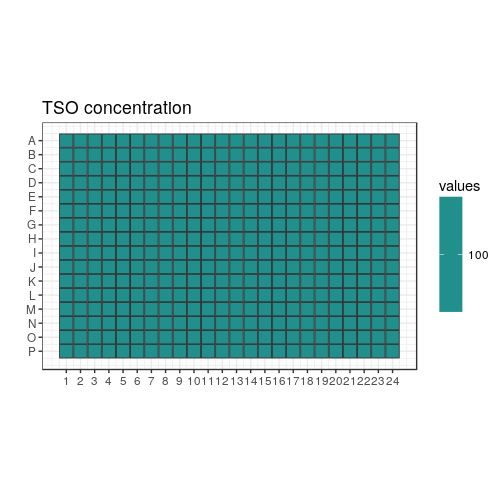
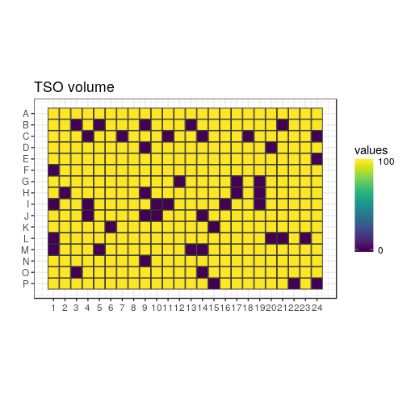
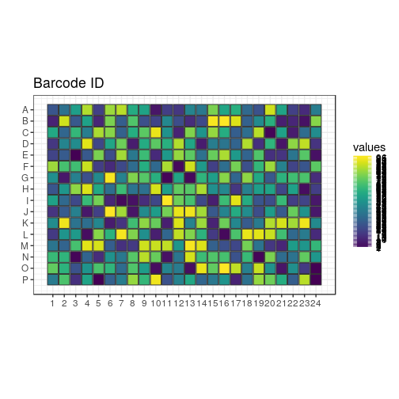
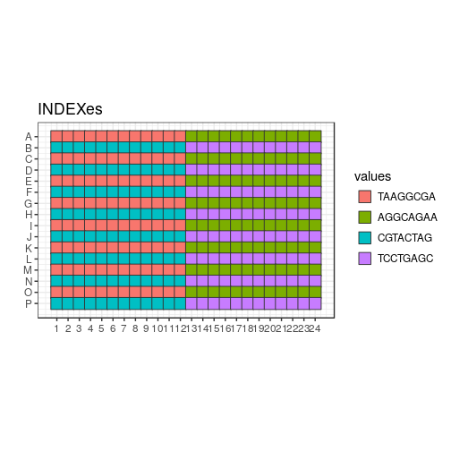
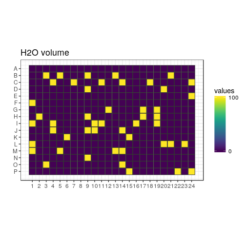
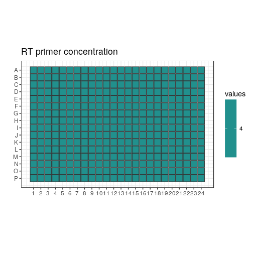
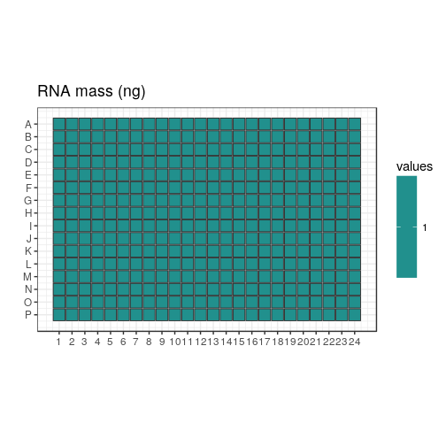
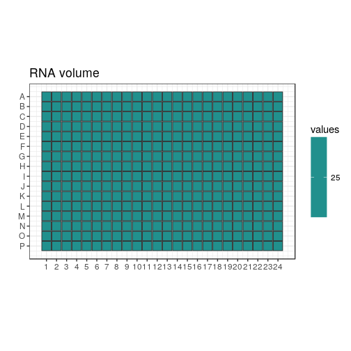
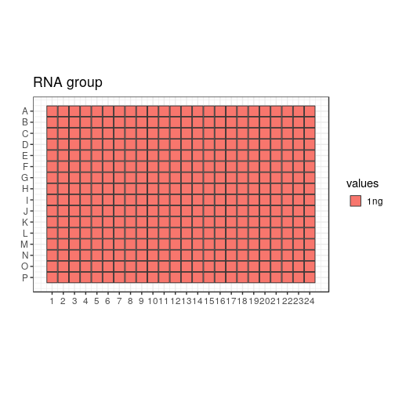

Differences with the previous design
====================================

In this plate design, all the concentrations are fixed; the only difference
is the TSO barcode.  The goal is to assess differences in efficiency of each
TSO.  This difference may be caused either by the barcode sequence or by
individual variatons of quality between the oligonucleotides during synthesis,
resuspension, etc.

## Load scripts and libraries.


```r
library("magrittr")   # For its diamond pipe operators
library("ggplot2")    # For plotting
library("platetools") # For defining and manipulating 384-well plates
library("plyr")
library("tibble")     # For comfortable command-line operations

# The set_block function that will become part of platetools
source("https://raw.githubusercontent.com/charles-plessy/platetools/76213accb1704d11a2d96fb1f6284d0b46117778/R/set_block.R")

# Do not load the whole smallCAGEqc package, just get the barcode data.
data("nanoCAGE2017barcodes", package = "smallCAGEqc")
```


Plate layout
============

Create a data frame representing the contents of each well.


```r
plate           <- tibble(well = platetools::num_to_well(1:384, plate = "384"))
plate$row       <- sub("..$", "", plate$well) %>% factor
plate$col       <- sub("^.",  "", plate$well) %>% as.numeric %>% factor
```

MASTER_MIX
==========

350 nL of mastermix added to each well


```r
plate %<>% set_block("A01~P24", "MASTER_MIX_vol", 350)
```


TSO
===

20.0 μM ( +100 nL of 100 μM )


```r
plate %<>% set_block("A01~P24", "TSO", 100.0)
plate %<>% set_block("A01~P24", "TSO_vol", 100.0)
```

Barcode ID
-----------

The 96 barcodes are tested.


```r
plate %<>%
  set_block("A01~B24", "BARCODE_ID_norandom", 01:12) %>%
  set_block("C01~D24", "BARCODE_ID_norandom", 13:24) %>%
  set_block("E01~F24", "BARCODE_ID_norandom", 25:36) %>%
  set_block("G01~H24", "BARCODE_ID_norandom", 37:48) %>%
  set_block("I01~J24", "BARCODE_ID_norandom", 49:60) %>%
  set_block("K01~L24", "BARCODE_ID_norandom", 61:72) %>%
  set_block("M01~N24", "BARCODE_ID_norandom", 73:84) %>%
  set_block("O01~P24", "BARCODE_ID_norandom", 85:96)
```

Index
-----

Each TSO will be dispensed 4 times, so 4 indexes will be used.  Tentatively,
they are named `indexA`, `indexB`, `indexC`, and `indexD`.


```r
plate %<>%
  arrange(BARCODE_ID_norandom) %>%
  set_block("A01~P24", "INDEX", c("indexA", "indexB", "indexC", "indexD")) %>%
  arrange(well)
```

Randomisation within indexes
----------------------------


```r
plate %<>% arrange(INDEX)
set.seed(1)
plate$BARCODE_ID <- c( sample(1:96)
                     , sample(1:96)
                     , sample(1:96)
                     , sample(1:96))
plate %<>% arrange(well)
plate$INDEX %<>% factor
```

Barcode sequences
-----------------


```r
plate$BARCODE_SEQ <- nanoCAGE2017barcodes[plate$BARCODE_ID,1]
plate$BARCODE_SEQ %<>% factor
```


H2O
====

H2O volume
-----------

0, 25, 50, 75 or 100 nL H2O added to complete RT reaction volume up to 500 nL


```r
plate %<>% set_block("A01~P24", "H2O_vol", 0)
```


Negative controls
=================

Let's remove each barcode exactly once.  12 barcodes per index.
The seed is different to the one above.  The plate here has 48 controls.
The seed is re-set so that a sister plate can be made, with 48 other
non-overlaping controls.


```r
set.seed(10)
neg_ctl <- sample(1:96)
neg_ctl <- tibble(id = neg_ctl, idx = unlist(lapply(paste0("index", LETTERS[1:8]), rep, 12)))
neg_ctl <- neg_ctl[1:48,]

nc <- match(paste(neg_ctl$id, neg_ctl$idx), paste(plate$BARCODE_ID, plate$INDEX))

plate[nc, "TSO_vol"] <- 0
plate[nc, "H2O_vol"] <- 100
```

RT_PRIMERS
===========

4.0 μM (+ 25 nL from source well at 20 μM)
 

```r
plate %<>% set_block("A01~P24", "RT_PRIMERS",  4.0)
plate %<>% set_block("A01~P24", "RT_PRIMERS_vol",  25)
```


RNA
====

RNA concentration
------------------

1 ng (+ 25 nL from source well at 40 ng/μL)


```r
plate %<>% set_block("A01~P24", "RNA",  1)
plate %<>% set_block("A01~P24", "RNA_vol",  25)
plate %<>% set_block("A01~P24", "RNA_group", "1ng")
```


Total volume
============


```r
plate$total_volume <- ""
plate$total_volume <- rowSums(plate[, c("MASTER_MIX_vol", "TSO_vol", "RT_PRIMERS_vol", "RNA_vol", "H2O_vol")])
```

RATIO TSO/RT_PRIMERS
=====================

Different ratio of TSO/RT_PRIMERS tested


```r
plate$PRIMERS_RATIO <- ""
plate$PRIMERS_RATIO <- c(plate$TSO/plate$RT_PRIMERS)
plate$PRIMERS_RATIO <- sub("Inf", "no_RT_PRIMERS", plate$PRIMERS_RATIO)
```

Assign index sequences
======================


```r
levels(plate$INDEX) <- c("TAAGGCGA", "CGTACTAG", "AGGCAGAA", "TCCTGAGC")
```

Summary
=======


```r
plate 
```

```
## # A tibble: 384 x 18
##    well  row   col   MASTER_MIX_vol   TSO TSO_vol BARCODE_ID_norand… INDEX   BARCODE_ID BARCODE_SEQ
##    <chr> <fct> <fct>          <dbl> <dbl>   <dbl>              <int> <fct>        <int> <fct>      
##  1 A01   A     1               350.  100.    100.                  1 TAAGGC…         26 ATCTCT     
##  2 A02   A     2               350.  100.    100.                  2 TAAGGC…         36 CACTGA     
##  3 A03   A     3               350.  100.    100.                  3 TAAGGC…         54 CTGTGA     
##  4 A04   A     4               350.  100.    100.                  4 TAAGGC…         85 TATCAG     
##  5 A05   A     5               350.  100.    100.                  5 TAAGGC…         19 ATCACG     
##  6 A06   A     6               350.  100.    100.                  6 TAAGGC…         82 TATACG     
##  7 A07   A     7               350.  100.    100.                  7 TAAGGC…         86 TATCGT     
##  8 A08   A     8               350.  100.    100.                  8 TAAGGC…         59 GAGCGT     
##  9 A09   A     9               350.  100.    100.                  9 TAAGGC…         56 GAGAGC     
## 10 A10   A     10              350.  100.    100.                 10 TAAGGC…          6 ACAGTG     
## # ... with 374 more rows, and 8 more variables: H2O_vol <dbl>, RT_PRIMERS <dbl>,
## #   RT_PRIMERS_vol <dbl>, RNA <dbl>, RNA_vol <dbl>, RNA_group <chr>, total_volume <dbl>,
## #   PRIMERS_RATIO <chr>
```

```r
summary(plate)
```

```
##      well                row           col      MASTER_MIX_vol      TSO         TSO_vol     
##  Length:384         A      : 24   1      : 16   Min.   :350    Min.   :100   Min.   :  0.0  
##  Class :character   B      : 24   2      : 16   1st Qu.:350    1st Qu.:100   1st Qu.:100.0  
##  Mode  :character   C      : 24   3      : 16   Median :350    Median :100   Median :100.0  
##                     D      : 24   4      : 16   Mean   :350    Mean   :100   Mean   : 87.5  
##                     E      : 24   5      : 16   3rd Qu.:350    3rd Qu.:100   3rd Qu.:100.0  
##                     F      : 24   6      : 16   Max.   :350    Max.   :100   Max.   :100.0  
##                     (Other):240   (Other):288                                               
##  BARCODE_ID_norandom      INDEX      BARCODE_ID     BARCODE_SEQ     H2O_vol        RT_PRIMERS
##  Min.   : 1.00       TAAGGCGA:96   Min.   : 1.00   ACACAG :  4   Min.   :  0.0   Min.   :4   
##  1st Qu.:24.75       CGTACTAG:96   1st Qu.:24.75   ACACGT :  4   1st Qu.:  0.0   1st Qu.:4   
##  Median :48.50       AGGCAGAA:96   Median :48.50   ACACTC :  4   Median :  0.0   Median :4   
##  Mean   :48.50       TCCTGAGC:96   Mean   :48.50   ACAGAT :  4   Mean   : 12.5   Mean   :4   
##  3rd Qu.:72.25                     3rd Qu.:72.25   ACAGCA :  4   3rd Qu.:  0.0   3rd Qu.:4   
##  Max.   :96.00                     Max.   :96.00   ACAGTG :  4   Max.   :100.0   Max.   :4   
##                                                    (Other):360                               
##  RT_PRIMERS_vol      RNA       RNA_vol    RNA_group          total_volume PRIMERS_RATIO     
##  Min.   :25     Min.   :1   Min.   :25   Length:384         Min.   :500   Length:384        
##  1st Qu.:25     1st Qu.:1   1st Qu.:25   Class :character   1st Qu.:500   Class :character  
##  Median :25     Median :1   Median :25   Mode  :character   Median :500   Mode  :character  
##  Mean   :25     Mean   :1   Mean   :25                      Mean   :500                     
##  3rd Qu.:25     3rd Qu.:1   3rd Qu.:25                      3rd Qu.:500                     
##  Max.   :25     Max.   :1   Max.   :25                      Max.   :500                     
## 
```

```r
length(which(plate$total_volume != "NA")) 
```

```
## [1] 384
```

```r
sum(is.na(plate$total_volume))
```

```
## [1] 0
```

```r
count(plate$BARCODE_ID)
```

```
##     x freq
## 1   1    4
## 2   2    4
## 3   3    4
## 4   4    4
## 5   5    4
## 6   6    4
## 7   7    4
## 8   8    4
## 9   9    4
## 10 10    4
## 11 11    4
## 12 12    4
## 13 13    4
## 14 14    4
## 15 15    4
## 16 16    4
## 17 17    4
## 18 18    4
## 19 19    4
## 20 20    4
## 21 21    4
## 22 22    4
## 23 23    4
## 24 24    4
## 25 25    4
## 26 26    4
## 27 27    4
## 28 28    4
## 29 29    4
## 30 30    4
## 31 31    4
## 32 32    4
## 33 33    4
## 34 34    4
## 35 35    4
## 36 36    4
## 37 37    4
## 38 38    4
## 39 39    4
## 40 40    4
## 41 41    4
## 42 42    4
## 43 43    4
## 44 44    4
## 45 45    4
## 46 46    4
## 47 47    4
## 48 48    4
## 49 49    4
## 50 50    4
## 51 51    4
## 52 52    4
## 53 53    4
## 54 54    4
## 55 55    4
## 56 56    4
## 57 57    4
## 58 58    4
## 59 59    4
## 60 60    4
## 61 61    4
## 62 62    4
## 63 63    4
## 64 64    4
## 65 65    4
## 66 66    4
## 67 67    4
## 68 68    4
## 69 69    4
## 70 70    4
## 71 71    4
## 72 72    4
## 73 73    4
## 74 74    4
## 75 75    4
## 76 76    4
## 77 77    4
## 78 78    4
## 79 79    4
## 80 80    4
## 81 81    4
## 82 82    4
## 83 83    4
## 84 84    4
## 85 85    4
## 86 86    4
## 87 87    4
## 88 88    4
## 89 89    4
## 90 90    4
## 91 91    4
## 92 92    4
## 93 93    4
## 94 94    4
## 95 95    4
## 96 96    4
```

```r
plate$PRIMERS_RATIO
```

```
##   [1] "25" "25" "25" "25" "25" "25" "25" "25" "25" "25" "25" "25" "25" "25" "25" "25" "25" "25" "25"
##  [20] "25" "25" "25" "25" "25" "25" "25" "25" "25" "25" "25" "25" "25" "25" "25" "25" "25" "25" "25"
##  [39] "25" "25" "25" "25" "25" "25" "25" "25" "25" "25" "25" "25" "25" "25" "25" "25" "25" "25" "25"
##  [58] "25" "25" "25" "25" "25" "25" "25" "25" "25" "25" "25" "25" "25" "25" "25" "25" "25" "25" "25"
##  [77] "25" "25" "25" "25" "25" "25" "25" "25" "25" "25" "25" "25" "25" "25" "25" "25" "25" "25" "25"
##  [96] "25" "25" "25" "25" "25" "25" "25" "25" "25" "25" "25" "25" "25" "25" "25" "25" "25" "25" "25"
## [115] "25" "25" "25" "25" "25" "25" "25" "25" "25" "25" "25" "25" "25" "25" "25" "25" "25" "25" "25"
## [134] "25" "25" "25" "25" "25" "25" "25" "25" "25" "25" "25" "25" "25" "25" "25" "25" "25" "25" "25"
## [153] "25" "25" "25" "25" "25" "25" "25" "25" "25" "25" "25" "25" "25" "25" "25" "25" "25" "25" "25"
## [172] "25" "25" "25" "25" "25" "25" "25" "25" "25" "25" "25" "25" "25" "25" "25" "25" "25" "25" "25"
## [191] "25" "25" "25" "25" "25" "25" "25" "25" "25" "25" "25" "25" "25" "25" "25" "25" "25" "25" "25"
## [210] "25" "25" "25" "25" "25" "25" "25" "25" "25" "25" "25" "25" "25" "25" "25" "25" "25" "25" "25"
## [229] "25" "25" "25" "25" "25" "25" "25" "25" "25" "25" "25" "25" "25" "25" "25" "25" "25" "25" "25"
## [248] "25" "25" "25" "25" "25" "25" "25" "25" "25" "25" "25" "25" "25" "25" "25" "25" "25" "25" "25"
## [267] "25" "25" "25" "25" "25" "25" "25" "25" "25" "25" "25" "25" "25" "25" "25" "25" "25" "25" "25"
## [286] "25" "25" "25" "25" "25" "25" "25" "25" "25" "25" "25" "25" "25" "25" "25" "25" "25" "25" "25"
## [305] "25" "25" "25" "25" "25" "25" "25" "25" "25" "25" "25" "25" "25" "25" "25" "25" "25" "25" "25"
## [324] "25" "25" "25" "25" "25" "25" "25" "25" "25" "25" "25" "25" "25" "25" "25" "25" "25" "25" "25"
## [343] "25" "25" "25" "25" "25" "25" "25" "25" "25" "25" "25" "25" "25" "25" "25" "25" "25" "25" "25"
## [362] "25" "25" "25" "25" "25" "25" "25" "25" "25" "25" "25" "25" "25" "25" "25" "25" "25" "25" "25"
## [381] "25" "25" "25" "25"
```

```r
write.table(plate, "plate4.txt", sep = "\t", quote = FALSE, row.names = FALSE)
```

Plate maps
==========


```r
plateMap <- function(x, title) {
  platetools::raw_map(plate[[x]], well=plate$well, plate="384") +
  ggtitle(title) +
  viridis::scale_fill_viridis(breaks = unique(plate[[x]]))
}

plateMapLog <- function(x, title) {
  platetools::raw_map(plate[[x]], well=plate$well, plate="384") +
  ggtitle(title) +
  viridis::scale_fill_viridis(breaks = unique(plate[[x]]), trans = "log")
}
```

TSO
---


```r
(plot_TSO <- plateMapLog("TSO", "TSO concentration"))
```

<!-- -->


```r
(plot_TSO_vol <- plateMap("TSO_vol", "TSO volume"))
```

<!-- -->


```r
(plot_BARCODES <- plateMap("BARCODE_ID", "Barcode ID"))
```

<!-- -->

Indexes
-------


```r
(plot_RNA_group <- platetools::raw_map(plate[["INDEX"]], well=plate$well, plate="384") +
  ggtitle("INDEXes"))
```

<!-- -->

H2O
---


```r
(plot_H2O_vol <- plateMap("H2O_vol", "H2O volume"))
```

<!-- -->

RT primers
----------


```r
(plot_RT <- plateMapLog("RT_PRIMERS", "RT primer concentration"))
```

<!-- -->


```r
(plot_RT_vol <- plateMap("RT_PRIMERS_vol", "RT primer volume"))
```

<!-- -->

RNA mass
--------


```r
(plot_RNA <- plateMapLog("RNA", "RNA mass (ng)"))
```

<!-- -->


```r
(plot_RNA_vol <- plateMap("RNA_vol", "RNA volume"))
```

<!-- -->


```r
(plot_RNA_group <- platetools::raw_map(plate[["RNA_group"]], well=plate$well, plate="384") +
  ggtitle("RNA group"))
```

<!-- -->


Transfer file for TSOs
======================

## Source plate layout


```r
nanoCAGE2017barcodes$well <- unlist(lapply(LETTERS[1:8], function(x) paste(x, sprintf("%02d", 1:12), sep = "")))

source <- tibble(well = platetools::num_to_well(1:384, plate = "384"))

for (n in 1:96)
  source %<>% set_block( nanoCAGE2017barcodes[n,"well"]
                       , nanoCAGE2017barcodes[n,"barcodes"]
                       , 30000)

source %<>% set_block("P24", "H2O", 30000)
```

## Plan plate


```r
planPlate <- tibble(well = platetools::num_to_well(1:384, plate = "384"))

for (n in 1:nrow(plate)) {
  planPlate %<>% set_block( plate[[n,"well"]]
                          , plate[[n,"BARCODE_SEQ"]] %>% as.character
                          , plate[[n,"TSO_vol"]])
  planPlate %<>% set_block( plate[[n,"well"]]
                          , "H2O"
                          , plate[[n,"H2O_vol"]])
}
planPlate %<>% replace( . == 0, NA)
```

## Plan transfer


```r
source("plates.R")
```

```
## Creating a generic function for 'colnames' from package 'base' in the global environment
```

```r
source("echo.R")

planPlate   <- Plate(plate = planPlate)
sourcePlate <- Plate(plate = source)
destPlate   <- Plate(plate = tibble::tibble(well = num_to_well(1:384, plate = "384")))

echo <- planTransfers(sourcePlate, destPlate, planPlate)
echo
```

```
## A 525 Echo machine:
##   Source plate:      A Plate with data about 384 wells (dead volume: 10000; max volume: 1e+05).
##   Destination plate: A Plate with data about 384 wells (dead volume: 10000; max volume: 1e+05).
## Transducer at the following coordinates:
##   Source:      B05 (384-well format)
##   Destination: O23 (384-well format)
## 384 elements in the log.
```

```r
transfers <- as.data.frame(echo %>% showLogs)
transfers <- transfers[order(transfers$from),]

colnames(transfers) <- c("Source well", "Destination well", "Transfer volume", "what")

transfers
```

```
##     Source well Destination well Transfer volume   what
## 289         A01              E03             100 ACACAG
## 290         A01              O24             100 ACACAG
## 291         A01              P05             100 ACACAG
## 234         A02              C20             100 ACACGT
## 235         A02              G11             100 ACACGT
## 236         A02              N03             100 ACACGT
## 237         A02              N19             100 ACACGT
## 320         A03              F12             100 ACACTC
## 321         A03              G13             100 ACACTC
## 322         A03              I07             100 ACACTC
## 323         A03              L16             100 ACACTC
## 365         A04              H23             100 ACAGAT
## 366         A04              L04             100 ACAGAT
## 367         A04              O10             100 ACAGAT
## 368         A04              O13             100 ACAGAT
## 185         A05              B23             100 ACAGCA
## 186         A05              I08             100 ACAGCA
## 187         A05              N11             100 ACAGCA
## 79          A06              A10             100 ACAGTG
## 80          A06              D21             100 ACAGTG
## 81          A06              J08             100 ACAGTG
## 82          A06              O21             100 ACAGTG
## 336         A07              G02             100 ACATAC
## 337         A07              I24             100 ACATAC
## 338         A07              J24             100 ACATAC
## 238         A08              C22             100 ACATCT
## 239         A08              D08             100 ACATCT
## 240         A08              D14             100 ACATCT
## 182         A09              I15             100 ACATGA
## 183         A09              K11             100 ACATGA
## 184         A09              L10             100 ACATGA
## 126         A10              B01             100 AGTACG
## 127         A10              C12             100 AGTACG
## 128         A10              P17             100 AGTACG
## 135         A11              B22             100 AGTAGC
## 136         A11              I06             100 AGTAGC
## 137         A11              M21             100 AGTAGC
## 119         A12              A23             100 AGTATA
## 120         A12              E10             100 AGTATA
## 121         A12              F06             100 AGTATA
## 122         A12              L24             100 AGTATA
## 160         B01              G24             100 AGTCAG
## 161         B01              I09             100 AGTCAG
## 162         B01              N05             100 AGTCAG
## 266         B02              D19             100 AGTCGT
## 267         B02              E20             100 AGTCGT
## 268         B02              M07             100 AGTCGT
## 269         B02              P03             100 AGTCGT
## 281         B03              D24             100 AGTCTC
## 282         B03              E21             100 AGTCTC
## 283         B03              J01             100 AGTCTC
## 284         B03              K07             100 AGTCTC
## 87          B04              A12             100 AGTGAT
## 88          B04              D01             100 AGTGAT
## 89          B04              M20             100 AGTGAT
## 382         B05              L15             100 AGTGCA
## 383         B05              M08             100 AGTGCA
## 384         B05              O23             100 AGTGCA
## 83          B06              A11             100 AGTGTG
## 84          B06              F05             100 AGTGTG
## 85          B06              H24             100 AGTGTG
## 86          B06              I22             100 AGTGTG
## 62          B07              A05             100 ATCACG
## 63          B07              A22             100 ATCACG
## 64          B07              F15             100 ATCACG
## 65          B07              J05             100 ATCACG
## 148         B08              B10             100 ATCAGC
## 149         B08              E01             100 ATCAGC
## 150         B08              F22             100 ATCAGC
## 151         B08              I23             100 ATCAGC
## 252         B09              D05             100 ATCATA
## 253         B09              H21             100 ATCATA
## 254         B09              M17             100 ATCATA
## 163         B10              B14             100 ATCGAT
## 164         B10              F07             100 ATCGAT
## 165         B10              I03             100 ATCGAT
## 166         B10              I14             100 ATCGAT
## 156         B11              B12             100 ATCGCA
## 157         B11              E06             100 ATCGCA
## 158         B11              I20             100 ATCGCA
## 159         B11              J19             100 ATCGCA
## 145         B12              F18             100 ATCGTG
## 146         B12              G04             100 ATCGTG
## 147         B12              M16             100 ATCGTG
## 112         C01              A19             100 ATCTAC
## 113         C01              N17             100 ATCTAC
## 114         C01              P11             100 ATCTAC
## 1           C02              A01             100 ATCTCT
## 2           C02              F23             100 ATCTCT
## 3           C02              H01             100 ATCTCT
## 129         C03              E04             100 ATCTGA
## 130         C03              G20             100 ATCTGA
## 131         C03              J15             100 ATCTGA
## 285         C04              E02             100 CACACG
## 286         C04              J02             100 CACACG
## 287         C04              J21             100 CACACG
## 288         C04              K18             100 CACACG
## 138         C05              B07             100 CACAGC
## 139         C05              C17             100 CACAGC
## 140         C05              M06             100 CACAGC
## 176         C06              B18             100 CACATA
## 177         C06              M15             100 CACATA
## 178         C06              P06             100 CACATA
## 262         C07              D17             100 CACGAT
## 263         C07              E18             100 CACGAT
## 264         C07              M02             100 CACGAT
## 265         C07              N04             100 CACGAT
## 195         C08              C02             100 CACGCA
## 196         C08              L11             100 CACGCA
## 197         C08              P14             100 CACGCA
## 108         C09              A18             100 CACGTG
## 109         C09              F10             100 CACGTG
## 110         C09              I02             100 CACGTG
## 111         C09              L22             100 CACGTG
## 241         C10              C23             100 CACTAC
## 242         C10              F08             100 CACTAC
## 243         C10              N21             100 CACTAC
## 244         C10              O07             100 CACTAC
## 231         C11              F16             100 CACTCT
## 232         C11              H06             100 CACTCT
## 233         C11              K04             100 CACTCT
## 52          C12              A02             100 CACTGA
## 53          C12              E14             100 CACTGA
## 54          C12              P18             100 CACTGA
## 354         D01              H08             100 CGACAG
## 355         D01              K03             100 CGACAG
## 356         D01              M19             100 CGACAG
## 357         D01              N22             100 CGACAG
## 259         D02              D16             100 CGACGT
## 260         D02              E22             100 CGACGT
## 261         D02              N12             100 CGACGT
## 94          D03              A14             100 CGACTC
## 95          D03              E08             100 CGACTC
## 96          D03              N07             100 CGACTC
## 379         D04              K19             100 CGAGAT
## 380         D04              O12             100 CGAGAT
## 381         D04              P01             100 CGAGAT
## 123         D05              A24             100 CGAGCA
## 124         D05              D15             100 CGAGCA
## 125         D05              P07             100 CGAGCA
## 339         D06              G03             100 CGAGTG
## 340         D06              H18             100 CGAGTG
## 341         D06              J03             100 CGAGTG
## 342         D06              O18             100 CGAGTG
## 328         D07              F21             100 CGATAC
## 329         D07              G07             100 CGATAC
## 330         D07              K13             100 CGATAC
## 331         D07              P12             100 CGATAC
## 90          D08              A13             100 CGATCT
## 91          D08              D02             100 CGATCT
## 92          D08              J16             100 CGATCT
## 93          D08              O11             100 CGATCT
## 152         D09              B11             100 CGATGA
## 153         D09              H16             100 CGATGA
## 154         D09              K05             100 CGATGA
## 155         D09              K17             100 CGATGA
## 179         D10              B19             100 CTGACG
## 180         D10              G05             100 CTGACG
## 181         D10              K24             100 CTGACG
## 245         D11              D03             100 CTGAGC
## 246         D11              J18             100 CTGAGC
## 247         D11              K01             100 CTGAGC
## 332         D12              G01             100 CTGATA
## 333         D12              H15             100 CTGATA
## 334         D12              L09             100 CTGATA
## 335         D12              O22             100 CTGATA
## 217         E01              J23             100 CTGCAG
## 218         E01              N06             100 CTGCAG
## 219         E01              O20             100 CTGCAG
## 224         E02              L02             100 CTGCGT
## 225         E02              O04             100 CTGCGT
## 226         E02              P16             100 CTGCGT
## 351         E03              M12             100 CTGCTC
## 352         E03              M23             100 CTGCTC
## 353         E03              N24             100 CTGCTC
## 298         E04              E11             100 CTGTAC
## 299         E04              E17             100 CTGTAC
## 300         E04              F14             100 CTGTAC
## 301         E04              L03             100 CTGTAC
## 372         E05              J20             100 CTGTCT
## 373         E05              M22             100 CTGTCT
## 374         E05              O09             100 CTGTCT
## 55          E06              A03             100 CTGTGA
## 56          E06              G15             100 CTGTGA
## 57          E06              H11             100 CTGTGA
## 132         E07              B04             100 GAGACG
## 133         E07              C21             100 GAGACG
## 134         E07              H22             100 GAGACG
## 75          E08              A09             100 GAGAGC
## 76          E08              A21             100 GAGAGC
## 77          E08              H20             100 GAGAGC
## 78          E08              P04             100 GAGAGC
## 101         E09              A16             100 GAGATA
## 102         E09              D06             100 GAGATA
## 103         E09              D13             100 GAGATA
## 192         E10              C01             100 GAGCAG
## 193         E10              H05             100 GAGCAG
## 194         E10              P13             100 GAGCAG
## 72          E11              A08             100 GAGCGT
## 73          E11              I18             100 GAGCGT
## 74          E11              J17             100 GAGCGT
## 206         E12              C08             100 GAGCTC
## 207         E12              C16             100 GAGCTC
## 208         E12              F09             100 GAGCTC
## 209         E12              P21             100 GAGCTC
## 104         F01              A17             100 GAGTAC
## 105         F01              B20             100 GAGTAC
## 106         F01              D11             100 GAGTAC
## 107         F01              G10             100 GAGTAC
## 343         F02              G21             100 GAGTCT
## 344         F02              L06             100 GAGTCT
## 345         F02              L14             100 GAGTCT
## 346         F02              O02             100 GAGTCT
## 270         F03              G14             100 GAGTGA
## 271         F03              N02             100 GAGTGA
## 272         F03              O06             100 GAGTGA
## 198         F04              C03             100 GCTACG
## 199         F04              F19             100 GCTACG
## 200         F04              M24             100 GCTACG
## 201         F04              P09             100 GCTACG
## 369         F05              I21             100 GCTAGC
## 370         F05              N01             100 GCTAGC
## 371         F05              N18             100 GCTAGC
## 295         F06              E09             100 GCTATA
## 296         F06              H07             100 GCTATA
## 297         F06              N14             100 GCTATA
## 314         F07              F03             100 GCTCAG
## 315         F07              G22             100 GCTCAG
## 316         F07              K08             100 GCTCAG
## 310         F08              F02             100 GCTCGT
## 311         F08              I13             100 GCTCGT
## 312         F08              M03             100 GCTCGT
## 313         F08              N16             100 GCTCGT
## 347         F09              G23             100 GCTCTC
## 348         F09              L17             100 GCTCTC
## 349         F09              O05             100 GCTCTC
## 350         F09              P02             100 GCTCTC
## 141         F10              B08             100 GCTGAT
## 142         F10              E19             100 GCTGAT
## 143         F10              N15             100 GCTGAT
## 144         F10              O08             100 GCTGAT
## 306         F11              E23             100 GCTGCA
## 307         F11              G09             100 GCTGCA
## 308         F11              H13             100 GCTGCA
## 309         F11              N08             100 GCTGCA
## 210         F12              C09             100 GCTGTG
## 211         F12              D10             100 GCTGTG
## 212         F12              E13             100 GCTGTG
## 213         F12              F24             100 GCTGTG
## 361         G01              H12             100 GTACAG
## 362         G01              N23             100 GTACAG
## 363         G01              O01             100 GTACAG
## 364         G01              O15             100 GTACAG
## 302         G02              E15             100 GTACGT
## 303         G02              J22             100 GTACGT
## 304         G02              K10             100 GTACGT
## 305         G02              N10             100 GTACGT
## 255         G03              D07             100 GTACTC
## 256         G03              I12             100 GTACTC
## 257         G03              K16             100 GTACTC
## 258         G03              P20             100 GTACTC
## 324         G04              F17             100 GTAGAT
## 325         G04              I05             100 GTAGAT
## 326         G04              J11             100 GTAGAT
## 327         G04              M18             100 GTAGAT
## 97          G05              A15             100 GTAGCA
## 98          G05              B06             100 GTAGCA
## 99          G05              E05             100 GTAGCA
## 100         G05              N20             100 GTAGCA
## 220         G06              C13             100 GTAGTG
## 221         G06              G08             100 GTAGTG
## 222         G06              L08             100 GTAGTG
## 223         G06              L13             100 GTAGTG
## 188         G07              B24             100 GTATAC
## 189         G07              C06             100 GTATAC
## 190         G07              G16             100 GTATAC
## 191         G07              L05             100 GTATAC
## 273         G08              D22             100 GTATCT
## 274         G08              G18             100 GTATCT
## 275         G08              H03             100 GTATCT
## 276         G08              K09             100 GTATCT
## 227         G09              C15             100 GTATGA
## 228         G09              E12             100 GTATGA
## 229         G09              P08             100 GTATGA
## 230         G09              P19             100 GTATGA
## 66          G10              A06             100 TATACG
## 67          G10              F20             100 TATACG
## 68          G10              K14             100 TATACG
## 292         G11              E07             100 TATAGC
## 293         G11              J07             100 TATAGC
## 294         G11              K22             100 TATAGC
## 202         G12              C05             100 TATATA
## 203         G12              E16             100 TATATA
## 204         G12              F11             100 TATATA
## 205         G12              H14             100 TATATA
## 58          H01              A04             100 TATCAG
## 59          H01              D12             100 TATCAG
## 60          H01              D18             100 TATCAG
## 61          H01              K20             100 TATCAG
## 69          H02              A07             100 TATCGT
## 70          H02              C19             100 TATCGT
## 71          H02              P23             100 TATCGT
## 277         H03              D23             100 TATCTC
## 278         H03              L12             100 TATCTC
## 279         H03              M11             100 TATCTC
## 280         H03              O17             100 TATCTC
## 317         H04              F04             100 TATGAT
## 318         H04              M10             100 TATGAT
## 319         H04              O19             100 TATGAT
## 115         H05              A20             100 TATGCA
## 116         H05              B02             100 TATGCA
## 117         H05              F13             100 TATGCA
## 118         H05              M09             100 TATGCA
## 358         H06              H10             100 TATGTG
## 359         H06              K21             100 TATGTG
## 360         H06              N13             100 TATGTG
## 173         H07              B17             100 TCGACG
## 174         H07              H04             100 TCGACG
## 175         H07              K12             100 TCGACG
## 248         H08              D04             100 TCGAGC
## 249         H08              I17             100 TCGAGC
## 250         H08              L19             100 TCGAGC
## 251         H08              M04             100 TCGAGC
## 214         H09              C10             100 TCGATA
## 215         H09              J12             100 TCGATA
## 216         H09              L18             100 TCGATA
## 375         H10              J13             100 TCGCAG
## 376         H10              K02             100 TCGCAG
## 377         H10              K23             100 TCGCAG
## 378         H10              P10             100 TCGCAG
## 167         H11              B15             100 TCGCGT
## 168         H11              G06             100 TCGCGT
## 169         H11              L07             100 TCGCGT
## 170         H12              B16             100 TCGCTC
## 171         H12              J06             100 TCGCTC
## 172         H12              O16             100 TCGCTC
## 4           P24              B03             100    H2O
## 5           P24              B05             100    H2O
## 6           P24              B09             100    H2O
## 7           P24              B13             100    H2O
## 8           P24              B21             100    H2O
## 9           P24              C04             100    H2O
## 10          P24              C07             100    H2O
## 11          P24              C11             100    H2O
## 12          P24              C14             100    H2O
## 13          P24              C18             100    H2O
## 14          P24              C24             100    H2O
## 15          P24              D09             100    H2O
## 16          P24              D20             100    H2O
## 17          P24              E24             100    H2O
## 18          P24              F01             100    H2O
## 19          P24              G12             100    H2O
## 20          P24              G17             100    H2O
## 21          P24              G19             100    H2O
## 22          P24              H02             100    H2O
## 23          P24              H09             100    H2O
## 24          P24              H17             100    H2O
## 25          P24              H19             100    H2O
## 26          P24              I01             100    H2O
## 27          P24              I04             100    H2O
## 28          P24              I10             100    H2O
## 29          P24              I11             100    H2O
## 30          P24              I16             100    H2O
## 31          P24              I19             100    H2O
## 32          P24              J04             100    H2O
## 33          P24              J09             100    H2O
## 34          P24              J10             100    H2O
## 35          P24              J14             100    H2O
## 36          P24              K06             100    H2O
## 37          P24              K15             100    H2O
## 38          P24              L01             100    H2O
## 39          P24              L20             100    H2O
## 40          P24              L21             100    H2O
## 41          P24              L23             100    H2O
## 42          P24              M01             100    H2O
## 43          P24              M05             100    H2O
## 44          P24              M13             100    H2O
## 45          P24              M14             100    H2O
## 46          P24              N09             100    H2O
## 47          P24              O03             100    H2O
## 48          P24              O14             100    H2O
## 49          P24              P15             100    H2O
## 50          P24              P22             100    H2O
## 51          P24              P24             100    H2O
```

```r
write.table( transfers[,1:3], file = "Exp5_plate1.csv"
           , quote = FALSE, row.names = FALSE, col.names = TRUE, sep = ",")
```

## Session information


```r
sessionInfo()
```

```
## R version 3.4.3 (2017-11-30)
## Platform: x86_64-pc-linux-gnu (64-bit)
## Running under: Debian GNU/Linux 9 (stretch)
## 
## Matrix products: default
## BLAS: /usr/lib/libblas/libblas.so.3.7.0
## LAPACK: /usr/lib/lapack/liblapack.so.3.7.0
## 
## locale:
##  [1] LC_CTYPE=en_GB.UTF-8       LC_NUMERIC=C               LC_TIME=en_GB.UTF-8       
##  [4] LC_COLLATE=en_GB.UTF-8     LC_MONETARY=en_GB.UTF-8    LC_MESSAGES=en_GB.UTF-8   
##  [7] LC_PAPER=en_GB.UTF-8       LC_NAME=C                  LC_ADDRESS=C              
## [10] LC_TELEPHONE=C             LC_MEASUREMENT=en_GB.UTF-8 LC_IDENTIFICATION=C       
## 
## attached base packages:
## [1] stats     graphics  grDevices utils     datasets  methods   base     
## 
## other attached packages:
## [1] bindrcpp_0.2     tibble_1.4.2     plyr_1.8.4       platetools_0.0.2 ggplot2_2.2.1   
## [6] magrittr_1.5    
## 
## loaded via a namespace (and not attached):
##  [1] Rcpp_0.12.16       bindr_0.1          knitr_1.20         munsell_0.4.3      viridisLite_0.2.0 
##  [6] colorspace_1.3-2   R6_2.2.2           rlang_0.2.0        stringr_1.3.0      dplyr_0.7.4       
## [11] tools_3.4.3        grid_3.4.3         gtable_0.2.0       utf8_1.1.3         cli_1.0.0         
## [16] htmltools_0.3.6    assertthat_0.2.0   yaml_2.1.18        lazyeval_0.2.1     rprojroot_1.3-2   
## [21] digest_0.6.15      crayon_1.3.4       gridExtra_2.3      RColorBrewer_1.1-2 codetools_0.2-15  
## [26] viridis_0.4.0      glue_1.2.0         evaluate_0.10.1    rmarkdown_1.9      stringi_1.1.7     
## [31] compiler_3.4.3     pillar_1.2.1       scales_0.5.0       backports_1.1.2    pkgconfig_2.0.1
```
