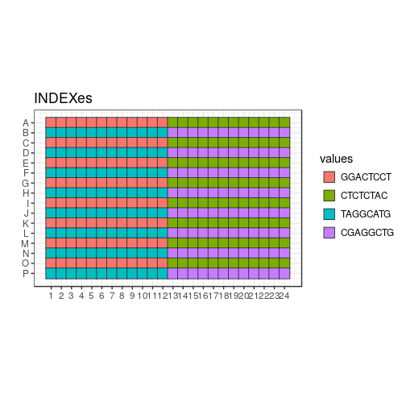

Differences with the previous design
====================================

Very similar to Design 4 (and to be used with).  The only differences are that

 1) the random seed is changed, so that the randomisation of the TSO positions
    is different.
    
 2) The second half of the negative controls is chosen (thus using the same
    random seed).

## Load scripts and libraries.


```r
library("magrittr")   # For its diamond pipe operators
library("ggplot2")    # For plotting
library("platetools") # For defining and manipulating 384-well plates
library("plyr")
library("tibble")     # For comfortable command-line operations

# The set_block function that will become part of platetools
source("https://raw.githubusercontent.com/charles-plessy/platetools/76213accb1704d11a2d96fb1f6284d0b46117778/R/set_block.R")

# Do not load the whole smallCAGEqc package, just get the barcode data.
data("nanoCAGE2017barcodes", package = "smallCAGEqc")
```


Plate layout
============

Create a data frame representing the contents of each well.


```r
plate           <- tibble(well = platetools::num_to_well(1:384, plate = "384"))
plate$row       <- sub("..$", "", plate$well) %>% factor
plate$col       <- sub("^.",  "", plate$well) %>% as.numeric %>% factor
```

MASTER_MIX
==========

350 nL of mastermix added to each well


```r
plate %<>% set_block("A01~P24", "MASTER_MIX_vol", 350)
```


TSO
===

20.0 μM ( +100 nL of 100 μM )


```r
plate %<>% set_block("A01~P24", "TSO", 100.0)
plate %<>% set_block("A01~P24", "TSO_vol", 100.0)
```

Barcode ID
-----------

The 96 barcodes are tested.


```r
plate %<>%
  set_block("A01~B24", "BARCODE_ID_norandom", 01:12) %>%
  set_block("C01~D24", "BARCODE_ID_norandom", 13:24) %>%
  set_block("E01~F24", "BARCODE_ID_norandom", 25:36) %>%
  set_block("G01~H24", "BARCODE_ID_norandom", 37:48) %>%
  set_block("I01~J24", "BARCODE_ID_norandom", 49:60) %>%
  set_block("K01~L24", "BARCODE_ID_norandom", 61:72) %>%
  set_block("M01~N24", "BARCODE_ID_norandom", 73:84) %>%
  set_block("O01~P24", "BARCODE_ID_norandom", 85:96)
```

Index
-----

Each TSO will be dispensed 4 times, so 4 indexes will be used.  Tentatively,
they are named `indexA`, `indexB`, `indexC`, and `indexD`.


```r
plate %<>%
  arrange(BARCODE_ID_norandom) %>%
  set_block("A01~P24", "INDEX", c("indexE", "indexF", "indexG", "indexH")) %>%
  arrange(well)
```

Randomisation within indexes
----------------------------


```r
plate %<>% arrange(INDEX)
set.seed(2)
plate$BARCODE_ID <- c( sample(1:96)
                     , sample(1:96)
                     , sample(1:96)
                     , sample(1:96))
plate %<>% arrange(well)
plate$INDEX %<>% factor
```

Barcode sequences
-----------------


```r
plate$BARCODE_SEQ <- nanoCAGE2017barcodes[plate$BARCODE_ID,1]
plate$BARCODE_SEQ %<>% factor
```


H2O
====

H2O volume
-----------

0, 25, 50, 75 or 100 nL H2O added to complete RT reaction volume up to 500 nL


```r
plate %<>% set_block("A01~P24", "H2O_vol", 0)
```


Negative controls
=================

Let's remove each barcode exactly once.  12 barcodes per index.
The seed is different to the one above.  The plate here has 48 controls.
The seed is re-set so that a sister plate can be made, with 48 other
non-overlaping controls.


```r
set.seed(10)
neg_ctl <- sample(1:96)
neg_ctl <- tibble(id = neg_ctl, idx = unlist(lapply(paste0("index", LETTERS[1:8]), rep, 12)))
neg_ctl <- neg_ctl[49:96,]

nc <- match(paste(neg_ctl$id, neg_ctl$idx), paste(plate$BARCODE_ID, plate$INDEX))

plate[nc, "TSO_vol"] <- 0
plate[nc, "H2O_vol"] <- 100
```

RT_PRIMERS
===========

4.0 μM (+ 25 nL from source well at 20 μM)
 

```r
plate %<>% set_block("A01~P24", "RT_PRIMERS",  4.0)
plate %<>% set_block("A01~P24", "RT_PRIMERS_vol",  25)
```


RNA
====

RNA concentration
------------------

1 ng (+ 25 nL from source well at 40 ng/μL)


```r
plate %<>% set_block("A01~P24", "RNA",  1)
plate %<>% set_block("A01~P24", "RNA_vol",  25)
plate %<>% set_block("A01~P24", "RNA_group", "1ng")
```


Total volume
============


```r
plate$total_volume <- ""
plate$total_volume <- rowSums(plate[, c("MASTER_MIX_vol", "TSO_vol", "RT_PRIMERS_vol", "RNA_vol", "H2O_vol")])
```

RATIO TSO/RT_PRIMERS
=====================

Different ratio of TSO/RT_PRIMERS tested


```r
plate$PRIMERS_RATIO <- ""
plate$PRIMERS_RATIO <- c(plate$TSO/plate$RT_PRIMERS)
plate$PRIMERS_RATIO <- sub("Inf", "no_RT_PRIMERS", plate$PRIMERS_RATIO)
```

Assign index sequences
======================


```r
levels(plate$INDEX) <- c("GGACTCCT", "CTCTCTAC", "TAGGCATG", "CGAGGCTG")
```

Summary
=======


```r
plate 
```

```
## # A tibble: 384 x 18
##    well  row   col   MASTER_MIX_vol   TSO TSO_vol BARCODE_ID_norand… INDEX   BARCODE_ID BARCODE_SEQ
##    <chr> <fct> <fct>          <dbl> <dbl>   <dbl>              <int> <fct>        <int> <fct>      
##  1 A01   A     1               350.  100.    100.                  1 GGACTC…         18 AGTGTG     
##  2 A02   A     2               350.  100.    100.                  2 GGACTC…         67 GCTCAG     
##  3 A03   A     3               350.  100.    100.                  3 GGACTC…         54 CTGTGA     
##  4 A04   A     4               350.  100.    100.                  4 GGACTC…         16 AGTGAT     
##  5 A05   A     5               350.  100.      0.                  5 GGACTC…         87 TATCTC     
##  6 A06   A     6               350.  100.    100.                  6 GGACTC…         86 TATCGT     
##  7 A07   A     7               350.  100.    100.                  7 GGACTC…         12 AGTATA     
##  8 A08   A     8               350.  100.    100.                  8 GGACTC…         75 GTACTC     
##  9 A09   A     9               350.  100.    100.                  9 GGACTC…         42 CGAGTG     
## 10 A10   A     10              350.  100.    100.                 10 GGACTC…         48 CTGATA     
## # ... with 374 more rows, and 8 more variables: H2O_vol <dbl>, RT_PRIMERS <dbl>,
## #   RT_PRIMERS_vol <dbl>, RNA <dbl>, RNA_vol <dbl>, RNA_group <chr>, total_volume <dbl>,
## #   PRIMERS_RATIO <chr>
```

```r
summary(plate)
```

```
##      well                row           col      MASTER_MIX_vol      TSO         TSO_vol     
##  Length:384         A      : 24   1      : 16   Min.   :350    Min.   :100   Min.   :  0.0  
##  Class :character   B      : 24   2      : 16   1st Qu.:350    1st Qu.:100   1st Qu.:100.0  
##  Mode  :character   C      : 24   3      : 16   Median :350    Median :100   Median :100.0  
##                     D      : 24   4      : 16   Mean   :350    Mean   :100   Mean   : 87.5  
##                     E      : 24   5      : 16   3rd Qu.:350    3rd Qu.:100   3rd Qu.:100.0  
##                     F      : 24   6      : 16   Max.   :350    Max.   :100   Max.   :100.0  
##                     (Other):240   (Other):288                                               
##  BARCODE_ID_norandom      INDEX      BARCODE_ID     BARCODE_SEQ     H2O_vol        RT_PRIMERS
##  Min.   : 1.00       GGACTCCT:96   Min.   : 1.00   ACACAG :  4   Min.   :  0.0   Min.   :4   
##  1st Qu.:24.75       CTCTCTAC:96   1st Qu.:24.75   ACACGT :  4   1st Qu.:  0.0   1st Qu.:4   
##  Median :48.50       TAGGCATG:96   Median :48.50   ACACTC :  4   Median :  0.0   Median :4   
##  Mean   :48.50       CGAGGCTG:96   Mean   :48.50   ACAGAT :  4   Mean   : 12.5   Mean   :4   
##  3rd Qu.:72.25                     3rd Qu.:72.25   ACAGCA :  4   3rd Qu.:  0.0   3rd Qu.:4   
##  Max.   :96.00                     Max.   :96.00   ACAGTG :  4   Max.   :100.0   Max.   :4   
##                                                    (Other):360                               
##  RT_PRIMERS_vol      RNA       RNA_vol    RNA_group          total_volume PRIMERS_RATIO     
##  Min.   :25     Min.   :1   Min.   :25   Length:384         Min.   :500   Length:384        
##  1st Qu.:25     1st Qu.:1   1st Qu.:25   Class :character   1st Qu.:500   Class :character  
##  Median :25     Median :1   Median :25   Mode  :character   Median :500   Mode  :character  
##  Mean   :25     Mean   :1   Mean   :25                      Mean   :500                     
##  3rd Qu.:25     3rd Qu.:1   3rd Qu.:25                      3rd Qu.:500                     
##  Max.   :25     Max.   :1   Max.   :25                      Max.   :500                     
## 
```

```r
length(which(plate$total_volume != "NA")) 
```

```
## [1] 384
```

```r
sum(is.na(plate$total_volume))
```

```
## [1] 0
```

```r
count(plate$BARCODE_ID)
```

```
##     x freq
## 1   1    4
## 2   2    4
## 3   3    4
## 4   4    4
## 5   5    4
## 6   6    4
## 7   7    4
## 8   8    4
## 9   9    4
## 10 10    4
## 11 11    4
## 12 12    4
## 13 13    4
## 14 14    4
## 15 15    4
## 16 16    4
## 17 17    4
## 18 18    4
## 19 19    4
## 20 20    4
## 21 21    4
## 22 22    4
## 23 23    4
## 24 24    4
## 25 25    4
## 26 26    4
## 27 27    4
## 28 28    4
## 29 29    4
## 30 30    4
## 31 31    4
## 32 32    4
## 33 33    4
## 34 34    4
## 35 35    4
## 36 36    4
## 37 37    4
## 38 38    4
## 39 39    4
## 40 40    4
## 41 41    4
## 42 42    4
## 43 43    4
## 44 44    4
## 45 45    4
## 46 46    4
## 47 47    4
## 48 48    4
## 49 49    4
## 50 50    4
## 51 51    4
## 52 52    4
## 53 53    4
## 54 54    4
## 55 55    4
## 56 56    4
## 57 57    4
## 58 58    4
## 59 59    4
## 60 60    4
## 61 61    4
## 62 62    4
## 63 63    4
## 64 64    4
## 65 65    4
## 66 66    4
## 67 67    4
## 68 68    4
## 69 69    4
## 70 70    4
## 71 71    4
## 72 72    4
## 73 73    4
## 74 74    4
## 75 75    4
## 76 76    4
## 77 77    4
## 78 78    4
## 79 79    4
## 80 80    4
## 81 81    4
## 82 82    4
## 83 83    4
## 84 84    4
## 85 85    4
## 86 86    4
## 87 87    4
## 88 88    4
## 89 89    4
## 90 90    4
## 91 91    4
## 92 92    4
## 93 93    4
## 94 94    4
## 95 95    4
## 96 96    4
```

```r
plate$PRIMERS_RATIO
```

```
##   [1] "25" "25" "25" "25" "25" "25" "25" "25" "25" "25" "25" "25" "25" "25" "25" "25" "25" "25" "25"
##  [20] "25" "25" "25" "25" "25" "25" "25" "25" "25" "25" "25" "25" "25" "25" "25" "25" "25" "25" "25"
##  [39] "25" "25" "25" "25" "25" "25" "25" "25" "25" "25" "25" "25" "25" "25" "25" "25" "25" "25" "25"
##  [58] "25" "25" "25" "25" "25" "25" "25" "25" "25" "25" "25" "25" "25" "25" "25" "25" "25" "25" "25"
##  [77] "25" "25" "25" "25" "25" "25" "25" "25" "25" "25" "25" "25" "25" "25" "25" "25" "25" "25" "25"
##  [96] "25" "25" "25" "25" "25" "25" "25" "25" "25" "25" "25" "25" "25" "25" "25" "25" "25" "25" "25"
## [115] "25" "25" "25" "25" "25" "25" "25" "25" "25" "25" "25" "25" "25" "25" "25" "25" "25" "25" "25"
## [134] "25" "25" "25" "25" "25" "25" "25" "25" "25" "25" "25" "25" "25" "25" "25" "25" "25" "25" "25"
## [153] "25" "25" "25" "25" "25" "25" "25" "25" "25" "25" "25" "25" "25" "25" "25" "25" "25" "25" "25"
## [172] "25" "25" "25" "25" "25" "25" "25" "25" "25" "25" "25" "25" "25" "25" "25" "25" "25" "25" "25"
## [191] "25" "25" "25" "25" "25" "25" "25" "25" "25" "25" "25" "25" "25" "25" "25" "25" "25" "25" "25"
## [210] "25" "25" "25" "25" "25" "25" "25" "25" "25" "25" "25" "25" "25" "25" "25" "25" "25" "25" "25"
## [229] "25" "25" "25" "25" "25" "25" "25" "25" "25" "25" "25" "25" "25" "25" "25" "25" "25" "25" "25"
## [248] "25" "25" "25" "25" "25" "25" "25" "25" "25" "25" "25" "25" "25" "25" "25" "25" "25" "25" "25"
## [267] "25" "25" "25" "25" "25" "25" "25" "25" "25" "25" "25" "25" "25" "25" "25" "25" "25" "25" "25"
## [286] "25" "25" "25" "25" "25" "25" "25" "25" "25" "25" "25" "25" "25" "25" "25" "25" "25" "25" "25"
## [305] "25" "25" "25" "25" "25" "25" "25" "25" "25" "25" "25" "25" "25" "25" "25" "25" "25" "25" "25"
## [324] "25" "25" "25" "25" "25" "25" "25" "25" "25" "25" "25" "25" "25" "25" "25" "25" "25" "25" "25"
## [343] "25" "25" "25" "25" "25" "25" "25" "25" "25" "25" "25" "25" "25" "25" "25" "25" "25" "25" "25"
## [362] "25" "25" "25" "25" "25" "25" "25" "25" "25" "25" "25" "25" "25" "25" "25" "25" "25" "25" "25"
## [381] "25" "25" "25" "25"
```

```r
write.table(plate, "plate5.txt", sep = "\t", quote = FALSE, row.names = FALSE)
```

Plate maps
==========


```r
plateMap <- function(x, title) {
  platetools::raw_map(plate[[x]], well=plate$well, plate="384") +
  ggtitle(title) +
  viridis::scale_fill_viridis(breaks = unique(plate[[x]]))
}

plateMapLog <- function(x, title) {
  platetools::raw_map(plate[[x]], well=plate$well, plate="384") +
  ggtitle(title) +
  viridis::scale_fill_viridis(breaks = unique(plate[[x]]), trans = "log")
}
```

TSO
---


```r
(plot_TSO <- plateMapLog("TSO", "TSO concentration"))
```

<!-- -->


```r
(plot_TSO_vol <- plateMap("TSO_vol", "TSO volume"))
```

<!-- -->


```r
(plot_BARCODES <- plateMap("BARCODE_ID", "Barcode ID"))
```

<!-- -->

Indexes
-------


```r
(plot_RNA_group <- platetools::raw_map(plate[["INDEX"]], well=plate$well, plate="384") +
  ggtitle("INDEXes"))
```

<!-- -->

H2O
---


```r
(plot_H2O_vol <- plateMap("H2O_vol", "H2O volume"))
```

<!-- -->

RT primers
----------


```r
(plot_RT <- plateMapLog("RT_PRIMERS", "RT primer concentration"))
```

<!-- -->


```r
(plot_RT_vol <- plateMap("RT_PRIMERS_vol", "RT primer volume"))
```

<!-- -->

RNA mass
--------


```r
(plot_RNA <- plateMapLog("RNA", "RNA mass (ng)"))
```

<!-- -->


```r
(plot_RNA_vol <- plateMap("RNA_vol", "RNA volume"))
```

<!-- -->


```r
(plot_RNA_group <- platetools::raw_map(plate[["RNA_group"]], well=plate$well, plate="384") +
  ggtitle("RNA group"))
```

<!-- -->


Transfer file for TSOs
======================

## Source plate layout


```r
nanoCAGE2017barcodes$well <- unlist(lapply(LETTERS[1:8], function(x) paste(x, sprintf("%02d", 1:12), sep = "")))

source <- tibble(well = platetools::num_to_well(1:384, plate = "384"))

for (n in 1:96)
  source %<>% set_block( nanoCAGE2017barcodes[n,"well"]
                       , nanoCAGE2017barcodes[n,"barcodes"]
                       , 30000)

source %<>% set_block("P24", "H2O", 30000)
```

## Plan plate


```r
planPlate <- tibble(well = platetools::num_to_well(1:384, plate = "384"))

for (n in 1:nrow(plate)) {
  planPlate %<>% set_block( plate[[n,"well"]]
                          , plate[[n,"BARCODE_SEQ"]] %>% as.character
                          , plate[[n,"TSO_vol"]])
  planPlate %<>% set_block( plate[[n,"well"]]
                          , "H2O"
                          , plate[[n,"H2O_vol"]])
}
planPlate %<>% replace( . == 0, NA)
```

## Plan transfer


```r
source("plates.R")
```

```
## Creating a generic function for 'colnames' from package 'base' in the global environment
```

```r
source("echo.R")

planPlate   <- Plate(plate = planPlate)
sourcePlate <- Plate(plate = source)
destPlate   <- Plate(plate = tibble::tibble(well = num_to_well(1:384, plate = "384")))

echo <- planTransfers(sourcePlate, destPlate, planPlate)
echo
```

```
## A 525 Echo machine:
##   Source plate:      A Plate with data about 384 wells (dead volume: 10000; max volume: 1e+05).
##   Destination plate: A Plate with data about 384 wells (dead volume: 10000; max volume: 1e+05).
## Transducer at the following coordinates:
##   Source:      B11 (384-well format)
##   Destination: O16 (384-well format)
## 384 elements in the log.
```

```r
transfers <- as.data.frame(echo %>% showLogs)
transfers <- transfers[order(transfers$from),]

colnames(transfers) <- c("Source well", "Destination well", "Transfer volume", "what")

transfers
```

```
##     Source well Destination well Transfer volume   what
## 279         A01              E07             100 ACACAG
## 280         A01              F02             100 ACACAG
## 281         A01              H23             100 ACACAG
## 282         A01              M13             100 ACACAG
## 350         A02              K10             100 ACACGT
## 351         A02              L02             100 ACACGT
## 352         A02              L23             100 ACACGT
## 213         A03              H24             100 ACACTC
## 214         A03              J12             100 ACACTC
## 215         A03              O01             100 ACACTC
## 265         A04              D22             100 ACAGAT
## 266         A04              O10             100 ACAGAT
## 267         A04              O20             100 ACAGAT
## 250         A05              D12             100 ACAGCA
## 251         A05              D18             100 ACAGCA
## 252         A05              M02             100 ACAGCA
## 253         A05              O22             100 ACAGCA
## 199         A06              C08             100 ACAGTG
## 200         A06              F24             100 ACAGTG
## 201         A06              J09             100 ACAGTG
## 268         A07              D23             100 ACATAC
## 269         A07              G07             100 ACATAC
## 270         A07              K14             100 ACATAC
## 271         A07              N12             100 ACATAC
## 179         A08              B22             100 ACATCT
## 180         A08              I19             100 ACATCT
## 181         A08              K11             100 ACATCT
## 182         A08              P10             100 ACATCT
## 94          A09              A14             100 ACATGA
## 95          A09              E06             100 ACATGA
## 96          A09              L06             100 ACATGA
## 97          A09              L15             100 ACATGA
## 325         A10              F14             100 AGTACG
## 326         A10              G21             100 AGTACG
## 327         A10              L01             100 AGTACG
## 328         A10              M08             100 AGTACG
## 98          A11              A15             100 AGTAGC
## 99          A11              C12             100 AGTAGC
## 100         A11              F05             100 AGTAGC
## 101         A11              F22             100 AGTAGC
## 71          A12              A07             100 AGTATA
## 72          A12              F20             100 AGTATA
## 73          A12              O13             100 AGTATA
## 209         B01              C13             100 AGTCAG
## 210         B01              H14             100 AGTCAG
## 211         B01              O05             100 AGTCAG
## 212         B01              P06             100 AGTCAG
## 183         B02              B23             100 AGTCGT
## 184         B02              H08             100 AGTCGT
## 185         B02              K06             100 AGTCGT
## 311         B03              F04             100 AGTCTC
## 312         B03              G22             100 AGTCTC
## 313         B03              O03             100 AGTCTC
## 60          B04              A04             100 AGTGAT
## 61          B04              B02             100 AGTGAT
## 62          B04              D19             100 AGTGAT
## 63          B04              I22             100 AGTGAT
## 140         B05              B06             100 AGTGCA
## 141         B05              E17             100 AGTGCA
## 142         B05              F23             100 AGTGCA
## 143         B05              G02             100 AGTGCA
## 1           B06              A01             100 AGTGTG
## 2           B06              L24             100 AGTGTG
## 3           B06              N05             100 AGTGTG
## 106         B07              A17             100 ATCACG
## 107         B07              B04             100 ATCACG
## 108         B07              B21             100 ATCACG
## 241         B08              D06             100 ATCAGC
## 242         B08              E20             100 ATCAGC
## 243         B08              M09             100 ATCAGC
## 86          B09              A12             100 ATCATA
## 87          B09              J21             100 ATCATA
## 88          B09              M22             100 ATCATA
## 89          B09              P12             100 ATCATA
## 301         B10              E22             100 ATCGAT
## 302         B10              J08             100 ATCGAT
## 303         B10              K03             100 ATCGAT
## 382         B11              M03             100 ATCGCA
## 383         B11              N07             100 ATCGCA
## 384         B11              O16             100 ATCGCA
## 364         B12              H12             100 ATCGTG
## 365         B12              H13             100 ATCGTG
## 366         B12              I11             100 ATCGTG
## 367         B12              O17             100 ATCGTG
## 144         C01              B07             100 ATCTAC
## 145         C01              B15             100 ATCTAC
## 146         C01              E04             100 ATCTAC
## 147         C01              K24             100 ATCTAC
## 119         C02              A21             100 ATCTCT
## 120         C02              E01             100 ATCTCT
## 121         C02              F03             100 ATCTCT
## 122         C02              P22             100 ATCTCT
## 318         C03              F07             100 ATCTGA
## 319         C03              I12             100 ATCTGA
## 320         C03              J14             100 ATCTGA
## 321         C03              K17             100 ATCTGA
## 379         C04              K01             100 CACACG
## 380         C04              O19             100 CACACG
## 381         C04              P03             100 CACACG
## 357         C05              H09             100 CACAGC
## 358         C05              M15             100 CACAGC
## 359         C05              O11             100 CACAGC
## 360         C05              P23             100 CACAGC
## 162         C06              B16             100 CACATA
## 163         C06              C10             100 CACATA
## 164         C06              C17             100 CACATA
## 165         C06              F12             100 CACATA
## 329         C07              I05             100 CACGAT
## 330         C07              I15             100 CACGAT
## 331         C07              L12             100 CACGAT
## 234         C08              D01             100 CACGCA
## 235         C08              E11             100 CACGCA
## 236         C08              G23             100 CACGCA
## 237         C08              N23             100 CACGCA
## 272         C09              D24             100 CACGTG
## 273         C09              N03             100 CACGTG
## 274         C09              O06             100 CACGTG
## 159         C10              B14             100 CACTAC
## 160         C10              C03             100 CACTAC
## 161         C10              K23             100 CACTAC
## 195         C11              C07             100 CACTCT
## 196         C11              I14             100 CACTCT
## 197         C11              L05             100 CACTCT
## 198         C11              P15             100 CACTCT
## 254         C12              D15             100 CACTGA
## 255         C12              K05             100 CACTGA
## 256         C12              O24             100 CACTGA
## 257         C12              P09             100 CACTGA
## 176         D01              B20             100 CGACAG
## 177         D01              I21             100 CGACAG
## 178         D01              M01             100 CGACAG
## 294         D02              E19             100 CGACGT
## 295         D02              H15             100 CGACGT
## 296         D02              O08             100 CGACGT
## 297         D02              P11             100 CGACGT
## 109         D03              A18             100 CGACTC
## 110         D03              E12             100 CGACTC
## 111         D03              J15             100 CGACTC
## 112         D03              N09             100 CGACTC
## 353         D04              H03             100 CGAGAT
## 354         D04              I06             100 CGAGAT
## 355         D04              N20             100 CGAGAT
## 356         D04              O21             100 CGAGAT
## 90          D05              A13             100 CGAGCA
## 91          D05              D08             100 CGAGCA
## 92          D05              D14             100 CGAGCA
## 93          D05              G10             100 CGAGCA
## 77          D06              A09             100 CGAGTG
## 78          D06              C24             100 CGAGTG
## 79          D06              F17             100 CGAGTG
## 186         D07              B24             100 CGATAC
## 187         D07              H01             100 CGATAC
## 188         D07              M14             100 CGATAC
## 322         D08              F09             100 CGATCT
## 323         D08              K08             100 CGATCT
## 324         D08              K20             100 CGATCT
## 298         D09              E21             100 CGATGA
## 299         D09              M11             100 CGATGA
## 300         D09              P04             100 CGATGA
## 169         D10              B18             100 CTGACG
## 170         D10              C18             100 CTGACG
## 171         D10              I04             100 CTGACG
## 172         D10              L03             100 CTGACG
## 368         D11              H20             100 CTGAGC
## 369         D11              I10             100 CTGAGC
## 370         D11              J07             100 CTGAGC
## 371         D11              M19             100 CTGAGC
## 80          D12              A10             100 CTGATA
## 81          D12              B03             100 CTGATA
## 82          D12              F15             100 CTGATA
## 343         E01              G11             100 CTGCAG
## 344         E01              H02             100 CTGCAG
## 345         E01              I16             100 CTGCAG
## 346         E01              N15             100 CTGCAG
## 332         E02              F19             100 CTGCGT
## 333         E02              G09             100 CTGCGT
## 334         E02              H05             100 CTGCGT
## 335         E02              M18             100 CTGCGT
## 202         E03              C09             100 CTGCTC
## 203         E03              D10             100 CTGCTC
## 204         E03              E18             100 CTGCTC
## 205         E03              L16             100 CTGCTC
## 123         E04              B11             100 CTGTAC
## 124         E04              E09             100 CTGTAC
## 125         E04              H21             100 CTGTAC
## 261         E05              D20             100 CTGTCT
## 262         E05              I13             100 CTGTCT
## 263         E05              J10             100 CTGTCT
## 264         E05              K04             100 CTGTCT
## 56          E06              A03             100 CTGTGA
## 57          E06              F10             100 CTGTGA
## 58          E06              I24             100 CTGTGA
## 59          E06              P24             100 CTGTGA
## 286         E07              E10             100 GAGACG
## 287         E07              I20             100 GAGACG
## 288         E07              L10             100 GAGACG
## 289         E07              N13             100 GAGACG
## 376         E08              I23             100 GAGAGC
## 377         E08              J13             100 GAGAGC
## 378         E08              N06             100 GAGAGC
## 151         E09              B10             100 GAGATA
## 152         E09              E24             100 GAGATA
## 153         E09              F13             100 GAGATA
## 154         E09              G08             100 GAGATA
## 372         E10              I02             100 GAGCAG
## 373         E10              J17             100 GAGCAG
## 374         E10              O14             100 GAGCAG
## 375         E10              P08             100 GAGCAG
## 339         E11              G06             100 GAGCGT
## 340         E11              K18             100 GAGCGT
## 341         E11              L17             100 GAGCGT
## 342         E11              N08             100 GAGCGT
## 216         E12              C16             100 GAGCTC
## 217         E12              J23             100 GAGCTC
## 218         E12              O09             100 GAGCTC
## 336         F01              G03             100 GAGTAC
## 337         F01              G14             100 GAGTAC
## 338         F01              H17             100 GAGTAC
## 206         F02              C11             100 GAGTCT
## 207         F02              D17             100 GAGTCT
## 208         F02              N01             100 GAGTCT
## 223         F03              C20             100 GAGTGA
## 224         F03              D09             100 GAGTGA
## 225         F03              G05             100 GAGTGA
## 226         F03              H19             100 GAGTGA
## 173         F04              B19             100 GCTACG
## 174         F04              G18             100 GCTACG
## 175         F04              N04             100 GCTACG
## 219         F05              C19             100 GCTAGC
## 220         F05              L07             100 GCTAGC
## 221         F05              M10             100 GCTAGC
## 222         F05              N21             100 GCTAGC
## 275         F06              E05             100 GCTATA
## 276         F06              G16             100 GCTATA
## 277         F06              J11             100 GCTATA
## 278         F06              J20             100 GCTATA
## 52          F07              A02             100 GCTCAG
## 53          F07              C21             100 GCTCAG
## 54          F07              J05             100 GCTCAG
## 55          F07              N18             100 GCTCAG
## 238         F08              D02             100 GCTCGT
## 239         F08              F21             100 GCTCGT
## 240         F08              O15             100 GCTCGT
## 166         F09              B17             100 GCTCTC
## 167         F09              E15             100 GCTCTC
## 168         F09              J02             100 GCTCTC
## 189         F10              C04             100 GCTGAT
## 190         F10              I18             100 GCTGAT
## 191         F10              L19             100 GCTGAT
## 231         F11              C23             100 GCTGCA
## 232         F11              D13             100 GCTGCA
## 233         F11              L04             100 GCTGCA
## 258         F12              K12             100 GCTGTG
## 259         F12              K15             100 GCTGTG
## 260         F12              P05             100 GCTGTG
## 247         G01              D11             100 GTACAG
## 248         G01              E03             100 GTACAG
## 249         G01              M24             100 GTACAG
## 116         G02              A20             100 GTACGT
## 117         G02              L13             100 GTACGT
## 118         G02              N10             100 GTACGT
## 74          G03              A08             100 GTACTC
## 75          G03              B13             100 GTACTC
## 76          G03              P01             100 GTACTC
## 148         G04              B09             100 GTAGAT
## 149         G04              G01             100 GTAGAT
## 150         G04              H18             100 GTAGAT
## 244         G05              G20             100 GTAGCA
## 245         G05              M05             100 GTAGCA
## 246         G05              N22             100 GTAGCA
## 126         G06              A23             100 GTAGTG
## 127         G06              E02             100 GTAGTG
## 128         G06              L09             100 GTAGTG
## 192         G07              H04             100 GTATAC
## 193         G07              K13             100 GTATAC
## 194         G07              N14             100 GTATAC
## 347         G08              G17             100 GTATCT
## 348         G08              L22             100 GTATCT
## 349         G08              N02             100 GTATCT
## 283         G09              E08             100 GTATGA
## 284         G09              J22             100 GTATGA
## 285         G09              K19             100 GTATGA
## 290         G10              E13             100 TATACG
## 291         G10              I08             100 TATACG
## 292         G10              L08             100 TATACG
## 293         G10              P13             100 TATACG
## 155         G11              B12             100 TATAGC
## 156         G11              G19             100 TATAGC
## 157         G11              M04             100 TATAGC
## 158         G11              N16             100 TATAGC
## 304         G12              E23             100 TATATA
## 305         G12              F08             100 TATATA
## 306         G12              O07             100 TATATA
## 361         H01              H11             100 TATCAG
## 362         H01              O18             100 TATCAG
## 363         H01              P21             100 TATCAG
## 67          H02              A06             100 TATCGT
## 68          H02              M21             100 TATCGT
## 69          H02              N11             100 TATCGT
## 70          H02              N17             100 TATCGT
## 64          H03              F11             100 TATCTC
## 65          H03              K16             100 TATCTC
## 66          H03              P14             100 TATCTC
## 314         H04              F06             100 TATGAT
## 315         H04              K07             100 TATGAT
## 316         H04              M16             100 TATGAT
## 317         H04              P19             100 TATGAT
## 113         H05              A19             100 TATGCA
## 114         H05              J16             100 TATGCA
## 115         H05              O04             100 TATGCA
## 307         H06              F01             100 TATGTG
## 308         H06              I07             100 TATGTG
## 309         H06              J24             100 TATGTG
## 310         H06              K22             100 TATGTG
## 129         H07              A24             100 TCGACG
## 130         H07              D04             100 TCGACG
## 131         H07              M07             100 TCGACG
## 132         H07              N24             100 TCGACG
## 83          H08              A11             100 TCGAGC
## 84          H08              D21             100 TCGAGC
## 85          H08              G15             100 TCGAGC
## 136         H09              B05             100 TCGATA
## 137         H09              C02             100 TCGATA
## 138         H09              O23             100 TCGATA
## 139         H09              P16             100 TCGATA
## 133         H10              B01             100 TCGCAG
## 134         H10              K09             100 TCGCAG
## 135         H10              P17             100 TCGCAG
## 227         H11              C22             100 TCGCGT
## 228         H11              D05             100 TCGCGT
## 229         H11              G04             100 TCGCGT
## 230         H11              J19             100 TCGCGT
## 102         H12              A16             100 TCGCTC
## 103         H12              C06             100 TCGCTC
## 104         H12              F16             100 TCGCTC
## 105         H12              H07             100 TCGCTC
## 4           P24              A05             100    H2O
## 5           P24              A22             100    H2O
## 6           P24              B08             100    H2O
## 7           P24              C01             100    H2O
## 8           P24              C05             100    H2O
## 9           P24              C14             100    H2O
## 10          P24              C15             100    H2O
## 11          P24              D03             100    H2O
## 12          P24              D07             100    H2O
## 13          P24              D16             100    H2O
## 14          P24              E14             100    H2O
## 15          P24              E16             100    H2O
## 16          P24              F18             100    H2O
## 17          P24              G12             100    H2O
## 18          P24              G13             100    H2O
## 19          P24              G24             100    H2O
## 20          P24              H06             100    H2O
## 21          P24              H10             100    H2O
## 22          P24              H16             100    H2O
## 23          P24              H22             100    H2O
## 24          P24              I01             100    H2O
## 25          P24              I03             100    H2O
## 26          P24              I09             100    H2O
## 27          P24              I17             100    H2O
## 28          P24              J01             100    H2O
## 29          P24              J03             100    H2O
## 30          P24              J04             100    H2O
## 31          P24              J06             100    H2O
## 32          P24              J18             100    H2O
## 33          P24              K02             100    H2O
## 34          P24              K21             100    H2O
## 35          P24              L11             100    H2O
## 36          P24              L14             100    H2O
## 37          P24              L18             100    H2O
## 38          P24              L20             100    H2O
## 39          P24              L21             100    H2O
## 40          P24              M06             100    H2O
## 41          P24              M12             100    H2O
## 42          P24              M17             100    H2O
## 43          P24              M20             100    H2O
## 44          P24              M23             100    H2O
## 45          P24              N19             100    H2O
## 46          P24              O02             100    H2O
## 47          P24              O12             100    H2O
## 48          P24              P02             100    H2O
## 49          P24              P07             100    H2O
## 50          P24              P18             100    H2O
## 51          P24              P20             100    H2O
```

```r
write.table( transfers[,1:3], file = "Exp5_plate2.csv"
           , quote = FALSE, row.names = FALSE, col.names = TRUE, sep = ",")
```

## Session information


```r
sessionInfo()
```

```
## R version 3.4.3 (2017-11-30)
## Platform: x86_64-pc-linux-gnu (64-bit)
## Running under: Debian GNU/Linux 9 (stretch)
## 
## Matrix products: default
## BLAS: /usr/lib/libblas/libblas.so.3.7.0
## LAPACK: /usr/lib/lapack/liblapack.so.3.7.0
## 
## locale:
##  [1] LC_CTYPE=en_GB.UTF-8       LC_NUMERIC=C               LC_TIME=en_GB.UTF-8       
##  [4] LC_COLLATE=en_GB.UTF-8     LC_MONETARY=en_GB.UTF-8    LC_MESSAGES=en_GB.UTF-8   
##  [7] LC_PAPER=en_GB.UTF-8       LC_NAME=C                  LC_ADDRESS=C              
## [10] LC_TELEPHONE=C             LC_MEASUREMENT=en_GB.UTF-8 LC_IDENTIFICATION=C       
## 
## attached base packages:
## [1] stats     graphics  grDevices utils     datasets  methods   base     
## 
## other attached packages:
## [1] bindrcpp_0.2     tibble_1.4.2     plyr_1.8.4       platetools_0.0.2 ggplot2_2.2.1   
## [6] magrittr_1.5    
## 
## loaded via a namespace (and not attached):
##  [1] Rcpp_0.12.16       bindr_0.1          knitr_1.20         munsell_0.4.3      viridisLite_0.2.0 
##  [6] colorspace_1.3-2   R6_2.2.2           rlang_0.2.0        stringr_1.3.0      dplyr_0.7.4       
## [11] tools_3.4.3        grid_3.4.3         gtable_0.2.0       utf8_1.1.3         cli_1.0.0         
## [16] htmltools_0.3.6    assertthat_0.2.0   yaml_2.1.18        lazyeval_0.2.1     rprojroot_1.3-2   
## [21] digest_0.6.15      crayon_1.3.4       gridExtra_2.3      RColorBrewer_1.1-2 codetools_0.2-15  
## [26] viridis_0.4.0      glue_1.2.0         evaluate_0.10.1    rmarkdown_1.9      stringi_1.1.7     
## [31] compiler_3.4.3     pillar_1.2.1       scales_0.5.0       backports_1.1.2    pkgconfig_2.0.1
```
