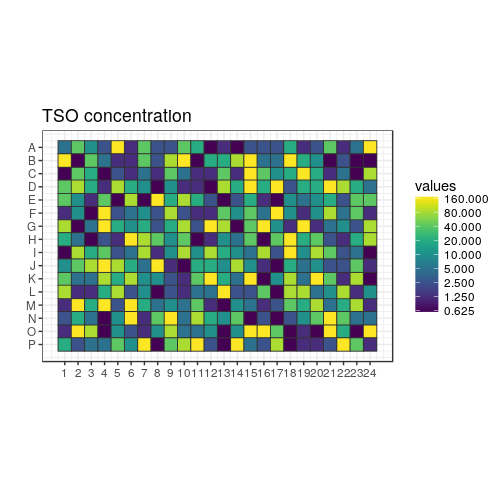
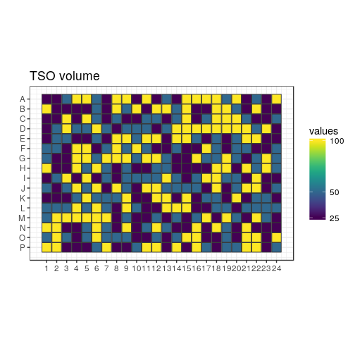
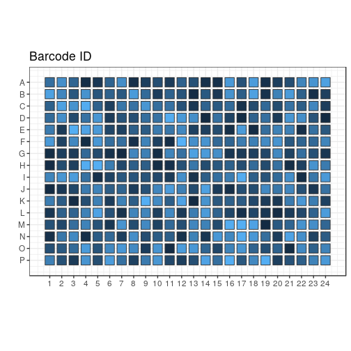
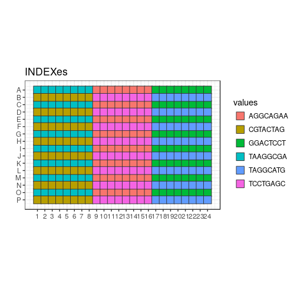
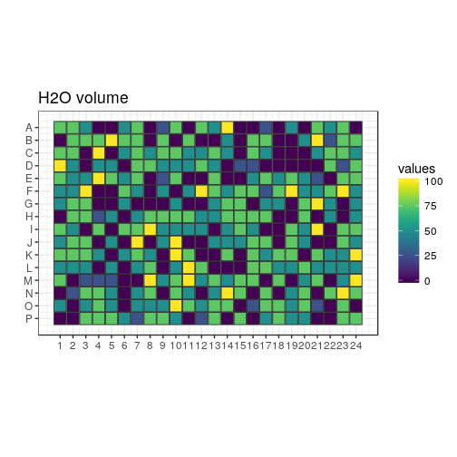
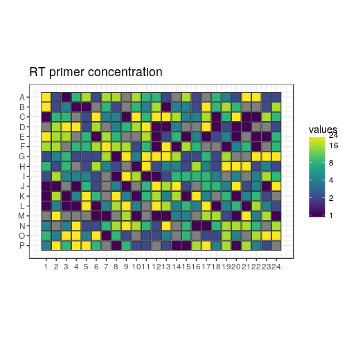
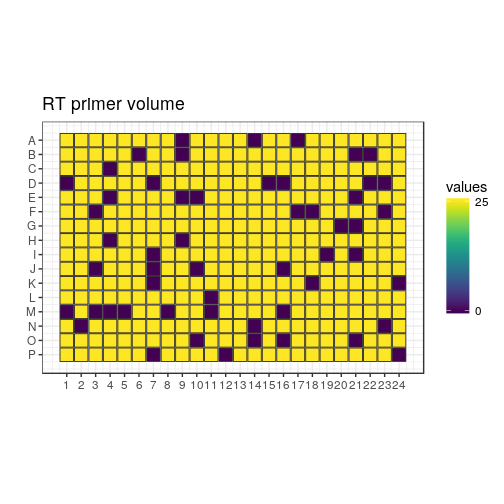
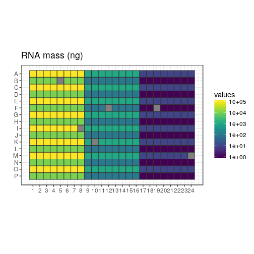
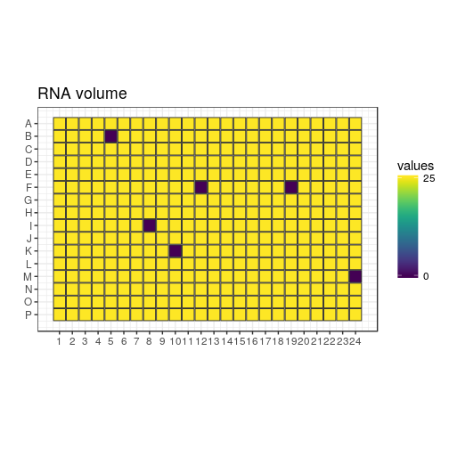

```r
variant <- "a"
newseed <- 1
indexes <- c("TAAGGCGA", "CGTACTAG", "AGGCAGAA", "TCCTGAGC", "GGACTCCT", "TAGGCATG")
```


New test of TSO, RT primer and RNA amounts
==========================================

In this design, the TSOs are randomised as much as possible (taking into
account that all do not have the same stock concentrations).

Each 384-well plate is divided in 6 "sextants", interleaved for easier
collection of the reaction products.  Each sextant has a different RNA amount,
and is indexed and amplified independently.  There are 9 × 7 combinations of TSO
and RT primer concentrations, plus one negative control with no RNA.  Each
reaction is assigned to a random well within the sextant.

For each plate replicate, a different random seed is used, to generate
different randomisations.

## Load scripts and libraries.


```r
library("magrittr")   # For its diamond pipe operators
library("ggplot2")    # For plotting
library("platetools") # For defining and manipulating 384-well plates
library("plyr")
library("tibble")     # For comfortable command-line operations

# The set_block function that will become part of platetools
source("https://raw.githubusercontent.com/charles-plessy/platetools/76213accb1704d11a2d96fb1f6284d0b46117778/R/set_block.R")

# Do not load the whole smallCAGEqc package, just get the barcode data.
data("nanoCAGE2017barcodes", package = "smallCAGEqc")
```


Selected TSOs
=============

TSOs are transferred as 1, 2 or 4 drops from 3 different starting
concentrations in the source plate.  Let's call each starting concentration
"Tier_A", "Tier_B" or "Tier_C".  Given constraints on remaining volume, some
TSOs can only be Tier_C, etc.  Let's refer to the TSOs by their numerical
identifier.  Tier_N is a set of barcodes that can be used for the negative
control.  See the file [Labcyte-RT6_TSO_stock_to_source.xls](Labcyte-RT6_TSO_stock_to_source.xls)
for details on the cherrypicking of the TSOs.


```r
Tier_A <- c(  3, 15, 27, 39, 51, 63, 75
           , 10, 22, 34, 46, 58, 70, 82
           , 11, 23, 35, 47, 59, 71, 83)

Tier_B <- c(  1, 13, 25, 37, 49, 61, 73
           ,  2, 14, 26, 38, 50, 62, 74
           ,  7, 19, 31, 43, 55, 67, 79)

Tier_C <- c(  4, 16, 28, 40, 52, 64, 76
           ,  5, 17, 29, 41, 65, 77, 89
           ,  6, 18, 30, 42, 66, 78, 90)

Tier_N <- c(  8, 20, 32, 44, 68, 80, 92)
```

Set Random seed
===============


```r
set.seed(newseed)
```

Creation of sextants
====================


```r
createRandomisedSextant <- function(index, rna) {
  df <- data.frame ( BARCODE_ID = c( sample(Tier_A, 21)
                                   , sample(Tier_B, 21)
                                   , sample(Tier_C, 21)
                                   , sample(Tier_N,  1)))
  tsoMaxConc <- 800
  df$TSO_source <- c( rep(tsoMaxConc /  1, 21)
                    , rep(tsoMaxConc /  8, 21)
                    , rep(tsoMaxConc /  64, 21)
                    , tsoMaxConc / 32)
  df$TSO_vol <- c(rep(c(rep(100,7), rep(50,7), rep(25,7)),3), 25)
  df$TSO <- df$TSO_source * df$TSO_vol / 500
  df$RT_PRIMERS <- c(rep(c(0, 1, 2, 4, 8, 16, 24), 9), 1)
  df$RT_PRIMERS_vol <- 25
  df[df$RT_PRIMERS == 0, "RT_PRIMERS_vol"] <- 0
  df$MASTER_MIX_vol <- 350
  df$INDEX <- index
  df$RNA <- rna
  df$RNA_vol <- 25
  df[64, "RNA_vol"] <- 0
  df$H2O_vol <- 500 - df$RNA_vol - df$RT_PRIMERS_vol - df$TSO_vol - df$MASTER_MIX_vol
  df[sample(nrow(df)),]
}
```


Sextants
========

Plate layout
------------

Create a data frame representing the contents of each well.


```r
plate           <- tibble(well = platetools::num_to_well(1:384, plate = "384"))
plate$row       <- sub("..$", "", plate$well) %>% factor
plate$col       <- sub("^.",  "", plate$well) %>% as.numeric %>% factor
```

Fill sextants
-------------


```r
plate$sxt <- paste0 (
  c(rep("A", 8), rep("B", 8), rep("C", 8)),
  ifelse (plate$row %in% LETTERS[1:8 * 2], 2, 1)
) %>% factor

plate %<>% arrange(sxt)

plate %<>% cbind( rbind( createRandomisedSextant(indexes[1], 1e5)
                       , createRandomisedSextant(indexes[2], 1e4)
                       , createRandomisedSextant(indexes[3], 1e3)
                       , createRandomisedSextant(indexes[4], 1e2)
                       , createRandomisedSextant(indexes[5], 1e1)
                       , createRandomisedSextant(indexes[6], 1e0))
      ) %>% as.tibble()

plate$BARCODE_ID
```

```
##   [1] 50 71 43  4 11 42 70  5 40 82 73 89 41 17 55 52 58 13 90 83 77 22 18 39  3 16 14 46 25  7  1
##  [32] 65 64 75 79 51  6 19 34 32 59 37  2 27 61 15 62 38 29 23 49 63 30 10 74 26 28 35 47 78 31 66
##  [63] 76 67 82 65 34 73 32 41 35 78 47 71 25 52 75 14 31 28 77 19 66  3 76 49 50  6  2 26 17 89 90
##  [94] 59 23 39  1 11 22 58 63 38 43 15 10 40 42 62 83 30  7 64  5 55 67  4 37 46 16 70 61 29 13 74
## [125] 27 79 51 18 16 27 14 41 29  6  5 77 75 49 52 30 11 42 35 47 37 58 55 66 18 17 26  4 61  3 64
## [156] 51 82 78 70 10 31 23 13 71  7 38 50 59 90 68 39 83  1 73 34 40 67 19 46 28 65 62 25 89 15 74
## [187]  2 79 76 43 22 63 47 15 41 31  2 35 11 73 49 52 89 77 70  1 51 19 63 18  4 92 71 74 46 43 38
## [218]  3  6 29 55 26 34 40 30 65 79 61 25 82 14  5 64 17 67 13 59 78 42 22 27 37 39  7 62 10 76 66
## [249] 58 75 23 16 28 83 50 90 30 79  6 16 27 64 74 82  7 25 46 26 52 38 65 15 78  2 49 62 61  5 51
## [280] 34 13 17 22 66 19 50 29 10 89 39 31 47 71  4 55 77 37 23 14 11 58 76 59 18 90 83  1 35 43 73
## [311] 70 44 75 42 28 41  3 67 40 63 38 82  7 62 78 40  5 17  3 41 50 13 75 70 31  1 59 61 68 74 35
## [342] 43 46 64 27 47 25 51  4 18 73 58 28 26 67 55 65 29 11 52  6 22 10  2 14 23 42 79 89 76 49 15
## [373] 83 71 19 37 34 66 90 16 30 39 63 77
```

```r
plate$INDEX %<>% factor
plate$BARCODE_SEQ <- nanoCAGE2017barcodes[plate$BARCODE_ID, "barcodes"]

plate$RNA_level <- plate$RNA %>% factor(labels = paste0("RNA_", LETTERS[1:6]))
plate$RTP_level <- plate$RT_PRIMERS %>% factor(labels = paste0("RTP_", LETTERS[1:7]))
```

Summary
=======


```r
plate 
```

```
## # A tibble: 384 x 18
##    well  row   col   sxt   BARCODE_ID TSO_source TSO_vol     TSO RT_PRIMERS RT_PRIMERS_vol
##  * <chr> <fct> <fct> <fct>      <dbl>      <dbl>   <dbl>   <dbl>      <dbl>          <dbl>
##  1 A01   A     1     A1           50.      100.      25.   5.00         24.            25.
##  2 A02   A     2     A1           71.      800.      25.  40.0           2.            25.
##  3 A03   A     3     A1           43.      100.      50.  10.0           1.            25.
##  4 A04   A     4     A1            4.       12.5    100.   2.50          8.            25.
##  5 A05   A     5     A1           11.      800.     100. 160.           16.            25.
##  6 A06   A     6     A1           42.       12.5     50.   1.25          2.            25.
##  7 A07   A     7     A1           70.      800.      25.  40.0          16.            25.
##  8 A08   A     8     A1            5.       12.5    100.   2.50         16.            25.
##  9 C01   C     1     A1           40.       12.5     25.   0.625         1.            25.
## 10 C02   C     2     A1           82.      800.      25.  40.0           8.            25.
## # ... with 374 more rows, and 8 more variables: MASTER_MIX_vol <dbl>, INDEX <fct>, RNA <dbl>,
## #   RNA_vol <dbl>, H2O_vol <dbl>, BARCODE_SEQ <chr>, RNA_level <fct>, RTP_level <fct>
```

```r
summary(plate)
```

```
##      well                row           col      sxt       BARCODE_ID      TSO_source   
##  Length:384         A      : 24   1      : 16   A1:64   Min.   : 1.00   Min.   : 12.5  
##  Class :character   B      : 24   2      : 16   A2:64   1st Qu.:21.25   1st Qu.: 12.5  
##  Mode  :character   C      : 24   3      : 16   B1:64   Median :41.00   Median :100.0  
##                     D      : 24   4      : 16   B2:64   Mean   :42.80   Mean   :299.8  
##                     E      : 24   5      : 16   C1:64   3rd Qu.:65.00   3rd Qu.:800.0  
##                     F      : 24   6      : 16   C2:64   Max.   :92.00   Max.   :800.0  
##                     (Other):240   (Other):288                                          
##     TSO_vol            TSO            RT_PRIMERS    RT_PRIMERS_vol  MASTER_MIX_vol      INDEX   
##  Min.   : 25.00   Min.   :  0.625   Min.   : 0.00   Min.   : 0.00   Min.   :350    AGGCAGAA:64  
##  1st Qu.: 25.00   1st Qu.:  2.500   1st Qu.: 1.00   1st Qu.:25.00   1st Qu.:350    CGTACTAG:64  
##  Median : 50.00   Median : 10.000   Median : 4.00   Median :25.00   Median :350    GGACTCCT:64  
##  Mean   : 57.81   Mean   : 34.951   Mean   : 7.75   Mean   :21.48   Mean   :350    TAAGGCGA:64  
##  3rd Qu.:100.00   3rd Qu.: 40.000   3rd Qu.:16.00   3rd Qu.:25.00   3rd Qu.:350    TAGGCATG:64  
##  Max.   :100.00   Max.   :160.000   Max.   :24.00   Max.   :25.00   Max.   :350    TCCTGAGC:64  
##                                                                                                 
##       RNA            RNA_vol         H2O_vol       BARCODE_SEQ        RNA_level  RTP_level 
##  Min.   :     1   Min.   : 0.00   Min.   :  0.00   Length:384         RNA_A:64   RTP_A:54  
##  1st Qu.:    10   1st Qu.:25.00   1st Qu.:  0.00   Class :character   RNA_B:64   RTP_B:60  
##  Median :   550   Median :25.00   Median : 50.00   Mode  :character   RNA_C:64   RTP_C:54  
##  Mean   : 18518   Mean   :24.61   Mean   : 46.09                      RNA_D:64   RTP_D:54  
##  3rd Qu.: 10000   3rd Qu.:25.00   3rd Qu.: 75.00                      RNA_E:64   RTP_E:54  
##  Max.   :100000   Max.   :25.00   Max.   :100.00                      RNA_F:64   RTP_F:54  
##                                                                                  RTP_G:54
```

```r
write.table(plate, paste0("plate6", variant, ".txt"), sep = "\t", quote = FALSE, row.names = FALSE)
```

Plate maps
==========


```r
plateMap <- function(x, title) {
  platetools::raw_map(plate[[x]], well=plate$well, plate="384") +
  ggtitle(title) +
  viridis::scale_fill_viridis(breaks = unique(plate[[x]]))
}

plateMapLog <- function(x, title) {
  platetools::raw_map(plate[[x]], well=plate$well, plate="384") +
  ggtitle(title) +
  viridis::scale_fill_viridis(breaks = unique(plate[[x]]), trans = "log")
}
```

TSO
---


```r
(plot_TSO <- plateMapLog("TSO", "TSO concentration"))
```

<!-- -->


```r
(plot_TSO_vol <- plateMap("TSO_vol", "TSO volume"))
```

<!-- -->


```r
(plot_BARCODES <- platetools::raw_map(plate[["BARCODE_ID"]], well=plate$well, plate="384") +
  ggtitle("Barcode ID")) + theme(legend.position="none")
```

<!-- -->

Indexes
-------


```r
(plot_indexes <- platetools::raw_map(plate[["INDEX"]], well=plate$well, plate="384") +
  ggtitle("INDEXes"))
```

<!-- -->

H2O
---


```r
(plot_H2O_vol <- plateMap("H2O_vol", "H2O volume"))
```

<!-- -->

RT primers
----------


```r
(plot_RT <- plateMapLog("RT_PRIMERS", "RT primer concentration"))
```

```
## Warning: Transformation introduced infinite values in discrete y-axis
```

<!-- -->


```r
(plot_RT_vol <- plateMap("RT_PRIMERS_vol", "RT primer volume"))
```

<!-- -->

RNA mass
--------


```r
(plot_RNA <- plateMapLog("RNA", "RNA mass (ng)"))
```

<!-- -->


```r
(plot_RNA_vol <- plateMap("RNA_vol", "RNA volume"))
```

<!-- -->


Transfer file
=============

## Source plate layout

### TSO


```r
nanoCAGE2017barcodes$well <- unlist(lapply(LETTERS[1:8], function(x) paste(x, sprintf("%02d", 1:12), sep = "")))

tso_block <- data.frame( id  = c(Tier_A, Tier_B, Tier_C, Tier_N)
                       , row = unlist(lapply(LETTERS[1:10], rep, 7))
                       , col = rep(1:7, 10))

tso_block$well <- paste0(tso_block$row, "0", tso_block$col)

tso_block$barcodes <- nanoCAGE2017barcodes[tso_block$id, "barcodes"]

source <- tibble(well = platetools::num_to_well(1:384, plate = "384"))

for (n in 1:nrow(tso_block))
  source %<>% set_block( tso_block[n,"well"]
                       , tso_block[n,"barcodes"]
                       , 20000)
```

### Water


```r
source %<>% set_block("M01~M06", "H2O", 20000)
```

### RNA


```r
levels(plate$RNA %>% factor)
```

```
## [1] "1"     "10"    "100"   "1000"  "10000" "1e+05"
```

```r
levels(plate$RNA_level)
```

```
## [1] "RNA_A" "RNA_B" "RNA_C" "RNA_D" "RNA_E" "RNA_F"
```

```r
source %<>% set_block("L01", "RNA_F", 20000)
source %<>% set_block("L02", "RNA_E", 20000)
source %<>% set_block("L03", "RNA_D", 20000)
source %<>% set_block("L04", "RNA_C", 20000)
source %<>% set_block("L05", "RNA_B", 20000)
source %<>% set_block("L06", "RNA_A", 20000)
```

### RNA


```r
levels(plate$RT_PRIMERS %>% factor)
```

```
## [1] "0"  "1"  "2"  "4"  "8"  "16" "24"
```

```r
levels(plate$RTP_level)
```

```
## [1] "RTP_A" "RTP_B" "RTP_C" "RTP_D" "RTP_E" "RTP_F" "RTP_G"
```

```r
source %<>% set_block("K01", "RTP_A", 20000)
source %<>% set_block("K02", "RTP_B", 20000)
source %<>% set_block("K03", "RTP_C", 20000)
source %<>% set_block("K04", "RTP_D", 20000)
source %<>% set_block("K05", "RTP_E", 20000)
source %<>% set_block("K06", "RTP_F", 20000)
source %<>% set_block("K07", "RTP_G", 20000)
```

## Plan plate


```r
planPlate <- tibble(well = platetools::num_to_well(1:384, plate = "384"))

for (n in 1:nrow(plate)) {
  planPlate %<>% set_block( plate[[n,"well"]]
                          , plate[[n,"BARCODE_SEQ"]] %>% as.character
                          , plate[[n,"TSO_vol"]])
  planPlate %<>% set_block( plate[[n,"well"]]
                          , "H2O"
                          , plate[[n,"H2O_vol"]])
  planPlate %<>% set_block( plate[[n,"well"]]
                          , plate[[n,"RTP_level"]] %>% as.character
                          , plate[[n,"RT_PRIMERS_vol"]])
  planPlate %<>% set_block( plate[[n,"well"]]
                          , plate[[n,"RNA_level"]] %>% as.character
                          , plate[[n,"RNA_vol"]])
}
planPlate %<>% replace( . == 0, NA)
```

## Plan transfer


```r
source("plates.R")
```

```
## Creating a generic function for 'colnames' from package 'base' in the global environment
```

```r
source("echo.R")

planPlate   <- Plate(plate = planPlate)
sourcePlate <- Plate(plate = source)
destPlate   <- Plate(plate = tibble::tibble(well = num_to_well(1:384, plate = "384")))

echo <- planTransfers(sourcePlate, destPlate, planPlate)
echo
```

```
## A 525 Echo machine:
##   Source plate:      A Plate with data about 384 wells (dead volume: 10000; max volume: 1e+05).
##   Destination plate: A Plate with data about 384 wells (dead volume: 10000; max volume: 1e+05).
## Transducer at the following coordinates:
##   Source:      L06 (384-well format)
##   Destination: P24 (384-well format)
## 1368 elements in the log.
```

```r
transfers <- as.data.frame(echo %>% showLogs)
transfers <- transfers[order(transfers$from),]

colnames(transfers) <- c("Source well", "Destination well", "Transfer volume", "what")

transfers
```

```
##      Source well Destination well Transfer volume   what
## 814          A01              D17             100 ACACTC
## 815          A01              F04             100 ACACTC
## 816          A01              G01              50 ACACTC
## 817          A01              G10              50 ACACTC
## 818          A01              H10              25 ACACTC
## 819          A01              O21             100 ACACTC
## 936          A02              B10             100 AGTCTC
## 937          A02              C24              50 AGTCTC
## 938          A02              J08             100 AGTCTC
## 939          A02              K06              50 AGTCTC
## 940          A02              N20              25 AGTCTC
## 941          A02              O09              50 AGTCTC
## 924          A03              A10              25 ATCTGA
## 925          A03              A21              25 ATCTGA
## 926          A03              H17              25 ATCTGA
## 927          A03              K04              50 ATCTGA
## 928          A03              N09             100 ATCTGA
## 929          A03              P05              25 ATCTGA
## 808          A04              E08             100 CGACTC
## 809          A04              H08              25 CGACTC
## 810          A04              I18             100 CGACTC
## 811          A04              K11              25 CGACTC
## 812          A04              N11              50 CGACTC
## 813          A04              P22             100 CGACTC
## 880          A05              D15             100 CTGCTC
## 881          A05              E23              25 CTGCTC
## 882          A05              G12             100 CTGCTC
## 883          A05              H20              25 CTGCTC
## 884          A05              I04              25 CTGCTC
## 885          A05              P07             100 CTGCTC
## 972          A06              F09              50 GAGTGA
## 973          A06              J05              50 GAGTGA
## 974          A06              M04             100 GAGTGA
## 975          A06              O16             100 GAGTGA
## 976          A06              O24             100 GAGTGA
## 977          A06              P23              25 GAGTGA
## 868          A07              C09              25 GTACTC
## 869          A07              D05              50 GTACTC
## 870          A07              D21             100 GTACTC
## 871          A07              I02              50 GTACTC
## 872          A07              O17              25 GTACTC
## 873          A07              P10              50 GTACTC
## 984          B01              G16             100 AGTACG
## 985          B01              G24              50 AGTACG
## 986          B01              L01              50 AGTACG
## 987          B01              L19              50 AGTACG
## 988          B01              M06             100 AGTACG
## 989          B01              N14              25 AGTACG
## 796          B02              E06              50 ATCGAT
## 797          B02              G19             100 ATCGAT
## 798          B02              J03              50 ATCGAT
## 799          B02              L16              25 ATCGAT
## 800          B02              L18              50 ATCGAT
## 801          B02              O15             100 ATCGAT
## 898          B03              B03              25 CACTAC
## 899          B03              E24              25 CACTAC
## 900          B03              H15              25 CACTAC
## 901          B03              I07              50 CACTAC
## 902          B03              K15             100 CACTAC
## 903          B03              P17              50 CACTAC
## 832          B04              C19             100 CTGACG
## 833          B04              F15              25 CTGACG
## 834          B04              F23              25 CTGACG
## 835          B04              G04             100 CTGACG
## 836          B04              M11              25 CTGACG
## 837          B04              N06             100 CTGACG
## 766          B05              E01              25 GAGCAG
## 767          B05              E10              50 GAGCAG
## 768          B05              H24              50 GAGCAG
## 769          B05              J04             100 GAGCAG
## 770          B05              K21              25 GAGCAG
## 771          B05              P09              25 GAGCAG
## 652          B06              A07              25 GCTGAT
## 653          B06              D13              50 GCTGAT
## 654          B06              D22              50 GCTGAT
## 655          B06              G15              25 GCTGAT
## 656          B06              M23              50 GCTGAT
## 657          B06              N08              25 GCTGAT
## 670          B07              A24             100 TATACG
## 671          B07              B01             100 TATACG
## 672          B07              B18             100 TATACG
## 673          B07              C02              25 TATACG
## 674          B07              G13              50 TATACG
## 675          B07              J14              50 TATACG
## 586          C01              A05             100 AGTAGC
## 587          C01              B15             100 AGTAGC
## 588          C01              C13              25 AGTAGC
## 589          C01              J02              25 AGTAGC
## 590          C01              J23              25 AGTAGC
## 591          C01              K20             100 AGTAGC
## 960          C02              H07              50 ATCGCA
## 961          C02              I10              50 ATCGCA
## 962          C02              K18              50 ATCGCA
## 963          C02              L22              50 ATCGCA
## 964          C02              M02             100 ATCGCA
## 965          C02              P11             100 ATCGCA
## 1008         C03              B07              25 CACTCT
## 1009         C03              B14              50 CACTCT
## 1010         C03              C15             100 CACTCT
## 1011         C03              F21              50 CACTCT
## 1012         C03              M20              50 CACTCT
## 1013         C03              O02             100 CACTCT
## 1014         C04              B09              50 CTGAGC
## 1015         C04              C16              25 CTGAGC
## 1016         C04              D01              25 CTGAGC
## 1017         C04              H18             100 CTGAGC
## 1018         C04              I20              50 CTGAGC
## 1019         C04              O03              50 CTGAGC
## 906          C05              F17             100 GAGCGT
## 907          C05              H06             100 GAGCGT
## 908          C05              I16              50 GAGCGT
## 909          C05              K01              25 GAGCGT
## 910          C05              K23              50 GAGCGT
## 911          C05              L13             100 GAGCGT
## 400          C06              A02              25 GCTGCA
## 401          C06              D02              50 GCTGCA
## 402          C06              F13              25 GCTGCA
## 403          C06              I12              50 GCTGCA
## 404          C06              I21              25 GCTGCA
## 405          C06              N22              25 GCTGCA
## 784          C07              E04              25 TATAGC
## 785          C07              K12             100 TATAGC
## 786          C07              L05              50 TATAGC
## 787          C07              M18              25 TATAGC
## 788          C07              N21             100 TATAGC
## 789          C07              P14             100 TATAGC
## 850          D01              D14             100 ACACAG
## 851          D01              D24              25 ACACAG
## 852          D01              G07             100 ACACAG
## 853          D01              J01              50 ACACAG
## 854          D01              K13             100 ACACAG
## 855          D01              M19             100 ACACAG
## 772          D02              D20             100 AGTCAG
## 773          D02              E02              50 AGTCAG
## 774          D02              G17              50 AGTCAG
## 775          D02              I11              50 AGTCAG
## 776          D02              L12              25 AGTCAG
## 777          D02              P03              25 AGTCAG
## 838          D03              C18             100 ATCTAC
## 839          D03              D03             100 ATCTAC
## 840          D03              G05             100 ATCTAC
## 841          D03              H19             100 ATCTAC
## 842          D03              J13              50 ATCTAC
## 843          D03              M15              25 ATCTAC
## 912          D04              E09             100 CGACAG
## 913          D04              K02              25 CGACAG
## 914          D04              K17              50 CGACAG
## 915          D04              N05              50 CGACAG
## 916          D04              N10              25 CGACAG
## 917          D04              N24              25 CGACAG
## 966          D05              C10              25 CTGCAG
## 967          D05              D09              50 CTGCAG
## 968          D05              E19              25 CTGCAG
## 969          D05              F06              25 CTGCAG
## 970          D05              M03             100 CTGCAG
## 971          D05              N19              50 CTGCAG
## 930          D06              E21             100 GAGTAC
## 931          D06              F18              50 GAGTAC
## 932          D06              G09             100 GAGTAC
## 933          D06              J12             100 GAGTAC
## 934          D06              K05             100 GAGTAC
## 935          D06              P01             100 GAGTAC
## 676          D07              B04              25 GTACAG
## 677          D07              B16              25 GTACAG
## 678          D07              C03             100 GTACAG
## 679          D07              H23             100 GTACAG
## 680          D07              K14              25 GTACAG
## 681          D07              M22             100 GTACAG
## 918          E01              B13             100 ACACGT
## 919          E01              E18              50 ACACGT
## 920          E01              H01             100 ACACGT
## 921          E01              K03              25 ACACGT
## 922          E01              L20              25 ACACGT
## 923          E01              O11              25 ACACGT
## 826          E02              A11             100 AGTCGT
## 827          E02              D06             100 AGTCGT
## 828          E02              G03              25 AGTCGT
## 829          E02              J15              50 AGTCGT
## 830          E02              K19              25 AGTCGT
## 831          E02              L21              50 AGTCGT
## 996          E03              C20             100 ATCTCT
## 997          E03              E15             100 ATCTCT
## 998          E03              H02              25 ATCTCT
## 999          E03              H14              25 ATCTCT
## 1000         E03              J18             100 ATCTCT
## 1001         E03              M08              25 ATCTCT
## 948          E04              B17              25 CGACGT
## 949          E04              C22              25 CGACGT
## 950          E04              H09              50 CGACGT
## 951          E04              I14              50 CGACGT
## 952          E04              J06             100 CGACGT
## 953          E04              K08              50 CGACGT
## 1            E05              A01              25 CTGCGT
## 2            E05              D19             100 CTGCGT
## 3            E05              F07              50 CTGCGT
## 4            E05              G22              50 CTGCGT
## 5            E05              I15              25 CTGCGT
## 6            E05              P15              25 CTGCGT
## 942          E06              B20              50 GAGTCT
## 943          E06              E20              50 GAGTCT
## 944          E06              K07              50 GAGTCT
## 945          E06              L04             100 GAGTCT
## 946          E06              M14              50 GAGTCT
## 947          E06              N13              50 GAGTCT
## 990          E07              A23              25 GTACGT
## 991          E07              F14              50 GTACGT
## 992          E07              F20              50 GTACGT
## 993          E07              M07             100 GTACGT
## 994          E07              O10              25 GTACGT
## 995          E07              P04              25 GTACGT
## 844          F01              B19             100 ACATAC
## 845          F01              C17              50 ACATAC
## 846          F01              G06              50 ACATAC
## 847          F01              I13             100 ACATAC
## 848          F01              L07              50 ACATAC
## 849          F01              N12             100 ACATAC
## 892          F02              D16             100 ATCACG
## 893          F02              F02              50 ATCACG
## 894          F02              G21              25 ATCACG
## 895          F02              I06              25 ATCACG
## 896          F02              M10              25 ATCACG
## 897          F02              N23              25 ATCACG
## 1026         F03              B12             100 CACGAT
## 1027         F03              D07              50 CACGAT
## 1028         F03              D23             100 CACGAT
## 1029         F03              I09              50 CACGAT
## 1030         F03              I19              50 CACGAT
## 1031         F03              O05              50 CACGAT
## 460          F04              A03              50 CGATAC
## 461          F04              F16              25 CGATAC
## 462          F04              F22              25 CGATAC
## 463          F04              J07              25 CGATAC
## 464          F04              M21              25 CGATAC
## 465          F04              O14              50 CGATAC
## 700          F05              C07              25 GAGACG
## 701          F05              E11             100 GAGACG
## 702          F05              H13              50 GAGACG
## 703          F05              I23              25 GAGACG
## 704          F05              J20              50 GAGACG
## 705          F05              N02             100 GAGACG
## 1044         F06              J19              25 GCTCAG
## 1045         F06              L11              25 GCTCAG
## 1046         F06              M09              50 GCTCAG
## 1047         F06              N03              25 GCTCAG
## 1048         F06              O08              50 GCTCAG
## 1049         F06              O22             100 GCTCAG
## 874          F07              A18             100 GTATAC
## 875          F07              I03             100 GTATAC
## 876          F07              J11             100 GTATAC
## 877          F07              L24              50 GTATAC
## 878          F07              O12              50 GTATAC
## 879          F07              P06              50 GTATAC
## 526          G01              A04             100 ACAGAT
## 527          G01              E16              50 ACAGAT
## 528          G01              F11              50 ACAGAT
## 529          G01              H21             100 ACAGAT
## 530          G01              I22             100 ACAGAT
## 531          G01              N04              25 ACAGAT
## 820          G02              A09             100 AGTGAT
## 821          G02              A20             100 AGTGAT
## 822          G02              G02              25 AGTGAT
## 823          G02              N07              50 AGTGAT
## 824          G02              P12             100 AGTGAT
## 825          G02              P20              50 AGTGAT
## 1002         G03              D08              25 CACACG
## 1003         G03              J17              25 CACACG
## 1004         G03              M12              50 CACACG
## 1005         G03              O01              50 CACACG
## 1006         G03              O19              50 CACACG
## 1007         G03              P13              25 CACACG
## 664          G04              B22             100 CGAGAT
## 665          G04              C01              25 CGAGAT
## 666          G04              H16              25 CGAGAT
## 667          G04              K16              25 CGAGAT
## 668          G04              L02              50 CGAGAT
## 669          G04              O23              25 CGAGAT
## 760          G05              C08              50 CTGTAC
## 761          G05              C11              50 CTGTAC
## 762          G05              C21              50 CTGTAC
## 763          G05              D04              50 CTGTAC
## 764          G05              D10              50 CTGTAC
## 765          G05              J24              50 CTGTAC
## 862          G06              A22              50 GCTACG
## 863          G06              F24              50 GCTACG
## 864          G06              G11             100 GCTACG
## 865          G06              I01              25 GCTACG
## 866          G06              L08              25 GCTACG
## 867          G06              L09             100 GCTACG
## 1038         G07              F05             100 GTAGAT
## 1039         G07              K22              50 GTAGAT
## 1040         G07              N15              25 GTAGAT
## 1041         G07              N18             100 GTAGAT
## 1042         G07              O07              50 GTAGAT
## 1043         G07              O13              25 GTAGAT
## 658          H01              A08             100 ACAGCA
## 659          H01              A15             100 ACAGCA
## 660          H01              B23              25 ACAGCA
## 661          H01              E22             100 ACAGCA
## 662          H01              J16              50 ACAGCA
## 663          H01              N01             100 ACAGCA
## 694          H02              B24              25 AGTGCA
## 695          H02              C06              50 AGTGCA
## 696          H02              E14             100 AGTGCA
## 697          H02              G18              50 AGTGCA
## 698          H02              H03              25 AGTGCA
## 699          H02              L10              50 AGTGCA
## 954          H03              A13              50 CACAGC
## 955          H03              G23             100 CACAGC
## 956          H03              H12              50 CACAGC
## 957          H03              J22             100 CACAGC
## 958          H03              M01              50 CACAGC
## 959          H03              P02             100 CACAGC
## 688          H04              A12              25 CGAGCA
## 689          H04              B06              50 CGAGCA
## 690          H04              B11              25 CGAGCA
## 691          H04              C05             100 CGAGCA
## 692          H04              D18             100 CGAGCA
## 693          H04              O20              25 CGAGCA
## 856          H05              B02              25 GCTAGC
## 857          H05              C23              25 GCTAGC
## 858          H05              G08             100 GCTAGC
## 859          H05              J10              25 GCTAGC
## 860          H05              J21             100 GCTAGC
## 861          H05              M13              25 GCTAGC
## 790          H06              A16             100 GTAGCA
## 791          H06              D12              25 GTAGCA
## 792          H06              E05              25 GTAGCA
## 793          H06              F01              50 GTAGCA
## 794          H06              I24              25 GTAGCA
## 795          H06              P24              50 GTAGCA
## 682          H07              C04              25 TATGCA
## 683          H07              D11              50 TATGCA
## 684          H07              H04             100 TATGCA
## 685          H07              I17             100 TATGCA
## 686          H07              M16              50 TATGCA
## 687          H07              N17              25 TATGCA
## 886          I01              A14              25 ACAGTG
## 887          I01              A19              50 ACAGTG
## 888          I01              F08             100 ACAGTG
## 889          I01              H11              25 ACAGTG
## 890          I01              I05             100 ACAGTG
## 891          I01              L17              25 ACAGTG
## 802          I02              E07              25 AGTGTG
## 803          I02              E13              25 AGTGTG
## 804          I02              F10             100 AGTGTG
## 805          I02              H22              50 AGTGTG
## 806          I02              K24              25 AGTGTG
## 807          I02              P08              25 AGTGTG
## 978          I03              A17             100 CACATA
## 979          I03              C12              50 CACATA
## 980          I03              J09              50 CACATA
## 981          I03              L06             100 CACATA
## 982          I03              M05             100 CACATA
## 983          I03              P21             100 CACATA
## 646          I04              A06              50 CGAGTG
## 647          I04              C14              50 CGAGTG
## 648          I04              L03              50 CGAGTG
## 649          I04              L15             100 CGAGTG
## 650          I04              L23              50 CGAGTG
## 651          I04              O18              25 CGAGTG
## 1032         I05              E12             100 GCTATA
## 1033         I05              F03              25 GCTATA
## 1034         I05              G20              50 GCTATA
## 1035         I05              N16             100 GCTATA
## 1036         I05              O06             100 GCTATA
## 1037         I05              P18              25 GCTATA
## 1020         I06              B08             100 GTAGTG
## 1021         I06              B21              25 GTAGTG
## 1022         I06              E17              25 GTAGTG
## 1023         I06              G14              25 GTAGTG
## 1024         I06              L14             100 GTAGTG
## 1025         I06              O04              25 GTAGTG
## 778          I07              E03              50 TATGTG
## 779          I07              H05              50 TATGTG
## 780          I07              K09             100 TATGTG
## 781          I07              M17             100 TATGTG
## 782          I07              P16             100 TATGTG
## 783          I07              P19              50 TATGTG
## 904          J03              B05              25 CACGCA
## 905          J03              I08              25 CACGCA
## 1305         J04              M24              25 CGATCT
## 1176         J05              F19              25 GCTCGT
## 1177         J05              K10              25 GCTCGT
## 1241         J07              F12              25 TCGAGC
## 466          K02              A03              25  RTP_B
## 467          K02              B04              25  RTP_B
## 468          K02              B05              25  RTP_B
## 469          K02              B13              25  RTP_B
## 470          K02              C01              25  RTP_B
## 471          K02              C09              25  RTP_B
## 472          K02              C18              25  RTP_B
## 473          K02              C21              25  RTP_B
## 474          K02              C22              25  RTP_B
## 475          K02              D12              25  RTP_B
## 476          K02              D13              25  RTP_B
## 477          K02              D18              25  RTP_B
## 478          K02              D20              25  RTP_B
## 479          K02              D21              25  RTP_B
## 480          K02              E06              25  RTP_B
## 481          K02              E12              25  RTP_B
## 482          K02              E15              25  RTP_B
## 483          K02              E17              25  RTP_B
## 484          K02              E20              25  RTP_B
## 485          K02              E22              25  RTP_B
## 486          K02              E23              25  RTP_B
## 487          K02              F12              25  RTP_B
## 488          K02              F14              25  RTP_B
## 489          K02              F19              25  RTP_B
## 490          K02              F22              25  RTP_B
## 491          K02              G08              25  RTP_B
## 492          K02              H10              25  RTP_B
## 493          K02              I08              25  RTP_B
## 494          K02              I11              25  RTP_B
## 495          K02              I12              25  RTP_B
## 496          K02              J01              25  RTP_B
## 497          K02              J02              25  RTP_B
## 498          K02              J04              25  RTP_B
## 499          K02              J09              25  RTP_B
## 500          K02              J23              25  RTP_B
## 501          K02              K01              25  RTP_B
## 502          K02              K03              25  RTP_B
## 503          K02              K10              25  RTP_B
## 504          K02              K15              25  RTP_B
## 505          K02              K20              25  RTP_B
## 506          K02              L01              25  RTP_B
## 507          K02              L03              25  RTP_B
## 508          K02              L04              25  RTP_B
## 509          K02              L06              25  RTP_B
## 510          K02              L18              25  RTP_B
## 511          K02              L21              25  RTP_B
## 512          K02              M06              25  RTP_B
## 513          K02              M07              25  RTP_B
## 514          K02              M10              25  RTP_B
## 515          K02              M12              25  RTP_B
## 516          K02              M13              25  RTP_B
## 517          K02              M20              25  RTP_B
## 518          K02              M24              25  RTP_B
## 519          K02              N16              25  RTP_B
## 520          K02              N17              25  RTP_B
## 521          K02              O07              25  RTP_B
## 522          K02              P08              25  RTP_B
## 523          K02              P14              25  RTP_B
## 524          K02              P15              25  RTP_B
## 525          K02              P20              25  RTP_B
## 406          K03              A02              25  RTP_C
## 407          K03              A06              25  RTP_C
## 408          K03              A13              25  RTP_C
## 409          K03              A16              25  RTP_C
## 410          K03              A20              25  RTP_C
## 411          K03              A23              25  RTP_C
## 412          K03              A24              25  RTP_C
## 413          K03              B02              25  RTP_C
## 414          K03              B08              25  RTP_C
## 415          K03              B16              25  RTP_C
## 416          K03              B23              25  RTP_C
## 417          K03              C05              25  RTP_C
## 418          K03              D05              25  RTP_C
## 419          K03              D19              25  RTP_C
## 420          K03              D24              25  RTP_C
## 421          K03              E13              25  RTP_C
## 422          K03              E18              25  RTP_C
## 423          K03              F10              25  RTP_C
## 424          K03              G01              25  RTP_C
## 425          K03              G04              25  RTP_C
## 426          K03              G05              25  RTP_C
## 427          K03              G06              25  RTP_C
## 428          K03              G15              25  RTP_C
## 429          K03              G16              25  RTP_C
## 430          K03              G18              25  RTP_C
## 431          K03              H02              25  RTP_C
## 432          K03              H05              25  RTP_C
## 433          K03              H08              25  RTP_C
## 434          K03              H12              25  RTP_C
## 435          K03              H15              25  RTP_C
## 436          K03              H18              25  RTP_C
## 437          K03              H22              25  RTP_C
## 438          K03              H24              25  RTP_C
## 439          K03              I01              25  RTP_C
## 440          K03              I06              25  RTP_C
## 441          K03              I13              25  RTP_C
## 442          K03              J06              25  RTP_C
## 443          K03              J15              25  RTP_C
## 444          K03              J21              25  RTP_C
## 445          K03              K23              25  RTP_C
## 446          K03              L24              25  RTP_C
## 447          K03              M19              25  RTP_C
## 448          K03              N05              25  RTP_C
## 449          K03              N06              25  RTP_C
## 450          K03              N12              25  RTP_C
## 451          K03              O09              25  RTP_C
## 452          K03              O11              25  RTP_C
## 453          K03              O12              25  RTP_C
## 454          K03              O17              25  RTP_C
## 455          K03              O18              25  RTP_C
## 456          K03              P10              25  RTP_C
## 457          K03              P11              25  RTP_C
## 458          K03              P13              25  RTP_C
## 459          K03              P23              25  RTP_C
## 706          K04              A19              25  RTP_D
## 707          K04              B03              25  RTP_D
## 708          K04              B11              25  RTP_D
## 709          K04              B14              25  RTP_D
## 710          K04              B15              25  RTP_D
## 711          K04              C07              25  RTP_D
## 712          K04              C08              25  RTP_D
## 713          K04              C15              25  RTP_D
## 714          K04              C16              25  RTP_D
## 715          K04              D08              25  RTP_D
## 716          K04              D14              25  RTP_D
## 717          K04              E16              25  RTP_D
## 718          K04              E19              25  RTP_D
## 719          K04              F20              25  RTP_D
## 720          K04              G02              25  RTP_D
## 721          K04              G10              25  RTP_D
## 722          K04              H07              25  RTP_D
## 723          K04              H13              25  RTP_D
## 724          K04              H14              25  RTP_D
## 725          K04              H17              25  RTP_D
## 726          K04              H23              25  RTP_D
## 727          K04              I03              25  RTP_D
## 728          K04              I04              25  RTP_D
## 729          K04              I05              25  RTP_D
## 730          K04              I18              25  RTP_D
## 731          K04              I20              25  RTP_D
## 732          K04              I22              25  RTP_D
## 733          K04              J08              25  RTP_D
## 734          K04              J19              25  RTP_D
## 735          K04              J22              25  RTP_D
## 736          K04              K04              25  RTP_D
## 737          K04              K09              25  RTP_D
## 738          K04              K13              25  RTP_D
## 739          K04              K17              25  RTP_D
## 740          K04              K21              25  RTP_D
## 741          K04              L02              25  RTP_D
## 742          K04              L07              25  RTP_D
## 743          K04              L10              25  RTP_D
## 744          K04              L14              25  RTP_D
## 745          K04              L16              25  RTP_D
## 746          K04              L19              25  RTP_D
## 747          K04              L23              25  RTP_D
## 748          K04              M14              25  RTP_D
## 749          K04              M15              25  RTP_D
## 750          K04              M22              25  RTP_D
## 751          K04              N01              25  RTP_D
## 752          K04              N03              25  RTP_D
## 753          K04              O02              25  RTP_D
## 754          K04              O05              25  RTP_D
## 755          K04              O13              25  RTP_D
## 756          K04              O20              25  RTP_D
## 757          K04              P01              25  RTP_D
## 758          K04              P18              25  RTP_D
## 759          K04              P22              25  RTP_D
## 532          K05              A04              25  RTP_E
## 533          K05              A11              25  RTP_E
## 534          K05              A12              25  RTP_E
## 535          K05              A18              25  RTP_E
## 536          K05              B07              25  RTP_E
## 537          K05              B10              25  RTP_E
## 538          K05              B18              25  RTP_E
## 539          K05              B20              25  RTP_E
## 540          K05              C02              25  RTP_E
## 541          K05              C03              25  RTP_E
## 542          K05              C11              25  RTP_E
## 543          K05              C19              25  RTP_E
## 544          K05              C24              25  RTP_E
## 545          K05              D09              25  RTP_E
## 546          K05              E05              25  RTP_E
## 547          K05              E08              25  RTP_E
## 548          K05              E14              25  RTP_E
## 549          K05              E24              25  RTP_E
## 550          K05              F04              25  RTP_E
## 551          K05              F05              25  RTP_E
## 552          K05              F11              25  RTP_E
## 553          K05              F16              25  RTP_E
## 554          K05              F21              25  RTP_E
## 555          K05              F24              25  RTP_E
## 556          K05              G03              25  RTP_E
## 557          K05              G17              25  RTP_E
## 558          K05              H01              25  RTP_E
## 559          K05              H03              25  RTP_E
## 560          K05              I14              25  RTP_E
## 561          K05              I15              25  RTP_E
## 562          K05              I16              25  RTP_E
## 563          K05              I17              25  RTP_E
## 564          K05              I24              25  RTP_E
## 565          K05              J05              25  RTP_E
## 566          K05              J11              25  RTP_E
## 567          K05              J17              25  RTP_E
## 568          K05              J18              25  RTP_E
## 569          K05              K06              25  RTP_E
## 570          K05              K11              25  RTP_E
## 571          K05              K19              25  RTP_E
## 572          K05              K22              25  RTP_E
## 573          K05              L15              25  RTP_E
## 574          K05              L20              25  RTP_E
## 575          K05              N07              25  RTP_E
## 576          K05              N11              25  RTP_E
## 577          K05              N15              25  RTP_E
## 578          K05              N18              25  RTP_E
## 579          K05              N22              25  RTP_E
## 580          K05              O01              25  RTP_E
## 581          K05              O08              25  RTP_E
## 582          K05              O15              25  RTP_E
## 583          K05              P03              25  RTP_E
## 584          K05              P06              25  RTP_E
## 585          K05              P09              25  RTP_E
## 592          K06              A05              25  RTP_F
## 593          K06              A07              25  RTP_F
## 594          K06              A08              25  RTP_F
## 595          K06              A10              25  RTP_F
## 596          K06              A15              25  RTP_F
## 597          K06              B12              25  RTP_F
## 598          K06              B19              25  RTP_F
## 599          K06              B24              25  RTP_F
## 600          K06              C14              25  RTP_F
## 601          K06              C17              25  RTP_F
## 602          K06              C23              25  RTP_F
## 603          K06              D02              25  RTP_F
## 604          K06              D06              25  RTP_F
## 605          K06              D10              25  RTP_F
## 606          K06              E02              25  RTP_F
## 607          K06              E03              25  RTP_F
## 608          K06              E07              25  RTP_F
## 609          K06              E11              25  RTP_F
## 610          K06              F01              25  RTP_F
## 611          K06              F02              25  RTP_F
## 612          K06              F06              25  RTP_F
## 613          K06              F08              25  RTP_F
## 614          K06              F09              25  RTP_F
## 615          K06              F15              25  RTP_F
## 616          K06              G07              25  RTP_F
## 617          K06              G14              25  RTP_F
## 618          K06              G19              25  RTP_F
## 619          K06              H06              25  RTP_F
## 620          K06              H16              25  RTP_F
## 621          K06              I02              25  RTP_F
## 622          K06              I10              25  RTP_F
## 623          K06              I23              25  RTP_F
## 624          K06              J13              25  RTP_F
## 625          K06              K02              25  RTP_F
## 626          K06              K12              25  RTP_F
## 627          K06              K14              25  RTP_F
## 628          K06              L08              25  RTP_F
## 629          K06              L13              25  RTP_F
## 630          K06              L22              25  RTP_F
## 631          K06              M09              25  RTP_F
## 632          K06              M17              25  RTP_F
## 633          K06              M18              25  RTP_F
## 634          K06              M23              25  RTP_F
## 635          K06              N08              25  RTP_F
## 636          K06              N10              25  RTP_F
## 637          K06              N19              25  RTP_F
## 638          K06              N20              25  RTP_F
## 639          K06              N21              25  RTP_F
## 640          K06              N24              25  RTP_F
## 641          K06              O19              25  RTP_F
## 642          K06              O22              25  RTP_F
## 643          K06              P16              25  RTP_F
## 644          K06              P19              25  RTP_F
## 645          K06              P21              25  RTP_F
## 283          K07              A01              25  RTP_G
## 284          K07              A21              25  RTP_G
## 285          K07              A22              25  RTP_G
## 286          K07              B01              25  RTP_G
## 287          K07              B17              25  RTP_G
## 288          K07              C06              25  RTP_G
## 289          K07              C10              25  RTP_G
## 290          K07              C12              25  RTP_G
## 291          K07              C13              25  RTP_G
## 292          K07              C20              25  RTP_G
## 293          K07              D03              25  RTP_G
## 294          K07              D04              25  RTP_G
## 295          K07              D11              25  RTP_G
## 296          K07              D17              25  RTP_G
## 297          K07              E01              25  RTP_G
## 298          K07              F07              25  RTP_G
## 299          K07              F13              25  RTP_G
## 300          K07              G09              25  RTP_G
## 301          K07              G11              25  RTP_G
## 302          K07              G12              25  RTP_G
## 303          K07              G13              25  RTP_G
## 304          K07              G22              25  RTP_G
## 305          K07              G23              25  RTP_G
## 306          K07              G24              25  RTP_G
## 307          K07              H11              25  RTP_G
## 308          K07              H19              25  RTP_G
## 309          K07              H20              25  RTP_G
## 310          K07              H21              25  RTP_G
## 311          K07              I09              25  RTP_G
## 312          K07              J12              25  RTP_G
## 313          K07              J14              25  RTP_G
## 314          K07              J20              25  RTP_G
## 315          K07              J24              25  RTP_G
## 316          K07              K05              25  RTP_G
## 317          K07              K08              25  RTP_G
## 318          K07              K16              25  RTP_G
## 319          K07              L05              25  RTP_G
## 320          K07              L09              25  RTP_G
## 321          K07              L12              25  RTP_G
## 322          K07              L17              25  RTP_G
## 323          K07              M02              25  RTP_G
## 324          K07              M21              25  RTP_G
## 325          K07              N04              25  RTP_G
## 326          K07              N09              25  RTP_G
## 327          K07              N13              25  RTP_G
## 328          K07              O03              25  RTP_G
## 329          K07              O04              25  RTP_G
## 330          K07              O06              25  RTP_G
## 331          K07              O23              25  RTP_G
## 332          K07              O24              25  RTP_G
## 333          K07              P02              25  RTP_G
## 334          K07              P04              25  RTP_G
## 335          K07              P05              25  RTP_G
## 336          K07              P17              25  RTP_G
## 337          L01              A01              25  RNA_F
## 338          L01              A02              25  RNA_F
## 339          L01              A03              25  RNA_F
## 340          L01              A04              25  RNA_F
## 341          L01              A05              25  RNA_F
## 342          L01              A06              25  RNA_F
## 343          L01              A07              25  RNA_F
## 344          L01              A08              25  RNA_F
## 345          L01              C01              25  RNA_F
## 346          L01              C02              25  RNA_F
## 347          L01              C03              25  RNA_F
## 348          L01              C04              25  RNA_F
## 349          L01              C05              25  RNA_F
## 350          L01              C06              25  RNA_F
## 351          L01              C07              25  RNA_F
## 352          L01              C08              25  RNA_F
## 353          L01              E01              25  RNA_F
## 354          L01              E02              25  RNA_F
## 355          L01              E03              25  RNA_F
## 356          L01              E04              25  RNA_F
## 357          L01              E05              25  RNA_F
## 358          L01              E06              25  RNA_F
## 359          L01              E07              25  RNA_F
## 360          L01              E08              25  RNA_F
## 361          L01              G01              25  RNA_F
## 362          L01              G02              25  RNA_F
## 363          L01              G03              25  RNA_F
## 364          L01              G04              25  RNA_F
## 365          L01              G05              25  RNA_F
## 366          L01              G06              25  RNA_F
## 367          L01              G07              25  RNA_F
## 368          L01              G08              25  RNA_F
## 369          L01              I01              25  RNA_F
## 370          L01              I02              25  RNA_F
## 371          L01              I03              25  RNA_F
## 372          L01              I04              25  RNA_F
## 373          L01              I05              25  RNA_F
## 374          L01              I06              25  RNA_F
## 375          L01              I07              25  RNA_F
## 376          L01              K01              25  RNA_F
## 377          L01              K02              25  RNA_F
## 378          L01              K03              25  RNA_F
## 379          L01              K04              25  RNA_F
## 380          L01              K05              25  RNA_F
## 381          L01              K06              25  RNA_F
## 382          L01              K07              25  RNA_F
## 383          L01              K08              25  RNA_F
## 384          L01              M01              25  RNA_F
## 385          L01              M02              25  RNA_F
## 386          L01              M03              25  RNA_F
## 387          L01              M04              25  RNA_F
## 388          L01              M05              25  RNA_F
## 389          L01              M06              25  RNA_F
## 390          L01              M07              25  RNA_F
## 391          L01              M08              25  RNA_F
## 392          L01              O01              25  RNA_F
## 393          L01              O02              25  RNA_F
## 394          L01              O03              25  RNA_F
## 395          L01              O04              25  RNA_F
## 396          L01              O05              25  RNA_F
## 397          L01              O06              25  RNA_F
## 398          L01              O07              25  RNA_F
## 399          L01              O08              25  RNA_F
## 1050         L02              B01              25  RNA_E
## 1051         L02              B02              25  RNA_E
## 1052         L02              B03              25  RNA_E
## 1053         L02              B04              25  RNA_E
## 1054         L02              B06              25  RNA_E
## 1055         L02              B07              25  RNA_E
## 1056         L02              B08              25  RNA_E
## 1057         L02              D01              25  RNA_E
## 1058         L02              D02              25  RNA_E
## 1059         L02              D03              25  RNA_E
## 1060         L02              D04              25  RNA_E
## 1061         L02              D05              25  RNA_E
## 1062         L02              D06              25  RNA_E
## 1063         L02              D07              25  RNA_E
## 1064         L02              D08              25  RNA_E
## 1065         L02              F01              25  RNA_E
## 1066         L02              F02              25  RNA_E
## 1067         L02              F03              25  RNA_E
## 1068         L02              F04              25  RNA_E
## 1069         L02              F05              25  RNA_E
## 1070         L02              F06              25  RNA_E
## 1071         L02              F07              25  RNA_E
## 1072         L02              F08              25  RNA_E
## 1073         L02              H01              25  RNA_E
## 1074         L02              H02              25  RNA_E
## 1075         L02              H03              25  RNA_E
## 1076         L02              H04              25  RNA_E
## 1077         L02              H05              25  RNA_E
## 1078         L02              H06              25  RNA_E
## 1079         L02              H07              25  RNA_E
## 1080         L02              H08              25  RNA_E
## 1081         L02              J01              25  RNA_E
## 1082         L02              J02              25  RNA_E
## 1083         L02              J03              25  RNA_E
## 1084         L02              J04              25  RNA_E
## 1085         L02              J05              25  RNA_E
## 1086         L02              J06              25  RNA_E
## 1087         L02              J07              25  RNA_E
## 1088         L02              J08              25  RNA_E
## 1089         L02              L01              25  RNA_E
## 1090         L02              L02              25  RNA_E
## 1091         L02              L03              25  RNA_E
## 1092         L02              L04              25  RNA_E
## 1093         L02              L05              25  RNA_E
## 1094         L02              L06              25  RNA_E
## 1095         L02              L07              25  RNA_E
## 1096         L02              L08              25  RNA_E
## 1097         L02              N01              25  RNA_E
## 1098         L02              N02              25  RNA_E
## 1099         L02              N03              25  RNA_E
## 1100         L02              N04              25  RNA_E
## 1101         L02              N05              25  RNA_E
## 1102         L02              N06              25  RNA_E
## 1103         L02              N07              25  RNA_E
## 1104         L02              N08              25  RNA_E
## 1105         L02              P01              25  RNA_E
## 1106         L02              P02              25  RNA_E
## 1107         L02              P03              25  RNA_E
## 1108         L02              P04              25  RNA_E
## 1109         L02              P05              25  RNA_E
## 1110         L02              P06              25  RNA_E
## 1111         L02              P07              25  RNA_E
## 1112         L02              P08              25  RNA_E
## 1113         L03              A09              25  RNA_D
## 1114         L03              A10              25  RNA_D
## 1115         L03              A11              25  RNA_D
## 1116         L03              A12              25  RNA_D
## 1117         L03              A13              25  RNA_D
## 1118         L03              A14              25  RNA_D
## 1119         L03              A15              25  RNA_D
## 1120         L03              A16              25  RNA_D
## 1121         L03              C09              25  RNA_D
## 1122         L03              C10              25  RNA_D
## 1123         L03              C11              25  RNA_D
## 1124         L03              C12              25  RNA_D
## 1125         L03              C13              25  RNA_D
## 1126         L03              C14              25  RNA_D
## 1127         L03              C15              25  RNA_D
## 1128         L03              C16              25  RNA_D
## 1129         L03              E09              25  RNA_D
## 1130         L03              E10              25  RNA_D
## 1131         L03              E11              25  RNA_D
## 1132         L03              E12              25  RNA_D
## 1133         L03              E13              25  RNA_D
## 1134         L03              E14              25  RNA_D
## 1135         L03              E15              25  RNA_D
## 1136         L03              E16              25  RNA_D
## 1137         L03              G09              25  RNA_D
## 1138         L03              G10              25  RNA_D
## 1139         L03              G11              25  RNA_D
## 1140         L03              G12              25  RNA_D
## 1141         L03              G13              25  RNA_D
## 1142         L03              G14              25  RNA_D
## 1143         L03              G15              25  RNA_D
## 1144         L03              G16              25  RNA_D
## 1145         L03              I09              25  RNA_D
## 1146         L03              I10              25  RNA_D
## 1147         L03              I11              25  RNA_D
## 1148         L03              I12              25  RNA_D
## 1149         L03              I13              25  RNA_D
## 1150         L03              I14              25  RNA_D
## 1151         L03              I15              25  RNA_D
## 1152         L03              I16              25  RNA_D
## 1153         L03              K09              25  RNA_D
## 1154         L03              K11              25  RNA_D
## 1155         L03              K12              25  RNA_D
## 1156         L03              K13              25  RNA_D
## 1157         L03              K14              25  RNA_D
## 1158         L03              K15              25  RNA_D
## 1159         L03              K16              25  RNA_D
## 1160         L03              M09              25  RNA_D
## 1161         L03              M10              25  RNA_D
## 1162         L03              M11              25  RNA_D
## 1163         L03              M12              25  RNA_D
## 1164         L03              M13              25  RNA_D
## 1165         L03              M14              25  RNA_D
## 1166         L03              M15              25  RNA_D
## 1167         L03              M16              25  RNA_D
## 1168         L03              O09              25  RNA_D
## 1169         L03              O10              25  RNA_D
## 1170         L03              O11              25  RNA_D
## 1171         L03              O12              25  RNA_D
## 1172         L03              O13              25  RNA_D
## 1173         L03              O14              25  RNA_D
## 1174         L03              O15              25  RNA_D
## 1175         L03              O16              25  RNA_D
## 1178         L04              B09              25  RNA_C
## 1179         L04              B10              25  RNA_C
## 1180         L04              B11              25  RNA_C
## 1181         L04              B12              25  RNA_C
## 1182         L04              B13              25  RNA_C
## 1183         L04              B14              25  RNA_C
## 1184         L04              B15              25  RNA_C
## 1185         L04              B16              25  RNA_C
## 1186         L04              D09              25  RNA_C
## 1187         L04              D10              25  RNA_C
## 1188         L04              D11              25  RNA_C
## 1189         L04              D12              25  RNA_C
## 1190         L04              D13              25  RNA_C
## 1191         L04              D14              25  RNA_C
## 1192         L04              D15              25  RNA_C
## 1193         L04              D16              25  RNA_C
## 1194         L04              F09              25  RNA_C
## 1195         L04              F10              25  RNA_C
## 1196         L04              F11              25  RNA_C
## 1197         L04              F13              25  RNA_C
## 1198         L04              F14              25  RNA_C
## 1199         L04              F15              25  RNA_C
## 1200         L04              F16              25  RNA_C
## 1201         L04              H09              25  RNA_C
## 1202         L04              H10              25  RNA_C
## 1203         L04              H11              25  RNA_C
## 1204         L04              H12              25  RNA_C
## 1205         L04              H13              25  RNA_C
## 1206         L04              H14              25  RNA_C
## 1207         L04              H15              25  RNA_C
## 1208         L04              H16              25  RNA_C
## 1209         L04              J09              25  RNA_C
## 1210         L04              J10              25  RNA_C
## 1211         L04              J11              25  RNA_C
## 1212         L04              J12              25  RNA_C
## 1213         L04              J13              25  RNA_C
## 1214         L04              J14              25  RNA_C
## 1215         L04              J15              25  RNA_C
## 1216         L04              J16              25  RNA_C
## 1217         L04              L09              25  RNA_C
## 1218         L04              L10              25  RNA_C
## 1219         L04              L11              25  RNA_C
## 1220         L04              L12              25  RNA_C
## 1221         L04              L13              25  RNA_C
## 1222         L04              L14              25  RNA_C
## 1223         L04              L15              25  RNA_C
## 1224         L04              L16              25  RNA_C
## 1225         L04              N09              25  RNA_C
## 1226         L04              N10              25  RNA_C
## 1227         L04              N11              25  RNA_C
## 1228         L04              N12              25  RNA_C
## 1229         L04              N13              25  RNA_C
## 1230         L04              N14              25  RNA_C
## 1231         L04              N15              25  RNA_C
## 1232         L04              N16              25  RNA_C
## 1233         L04              P09              25  RNA_C
## 1234         L04              P10              25  RNA_C
## 1235         L04              P11              25  RNA_C
## 1236         L04              P12              25  RNA_C
## 1237         L04              P13              25  RNA_C
## 1238         L04              P14              25  RNA_C
## 1239         L04              P15              25  RNA_C
## 1240         L04              P16              25  RNA_C
## 1242         L05              A17              25  RNA_B
## 1243         L05              A18              25  RNA_B
## 1244         L05              A19              25  RNA_B
## 1245         L05              A20              25  RNA_B
## 1246         L05              A21              25  RNA_B
## 1247         L05              A22              25  RNA_B
## 1248         L05              A23              25  RNA_B
## 1249         L05              A24              25  RNA_B
## 1250         L05              C17              25  RNA_B
## 1251         L05              C18              25  RNA_B
## 1252         L05              C19              25  RNA_B
## 1253         L05              C20              25  RNA_B
## 1254         L05              C21              25  RNA_B
## 1255         L05              C22              25  RNA_B
## 1256         L05              C23              25  RNA_B
## 1257         L05              C24              25  RNA_B
## 1258         L05              E17              25  RNA_B
## 1259         L05              E18              25  RNA_B
## 1260         L05              E19              25  RNA_B
## 1261         L05              E20              25  RNA_B
## 1262         L05              E21              25  RNA_B
## 1263         L05              E22              25  RNA_B
## 1264         L05              E23              25  RNA_B
## 1265         L05              E24              25  RNA_B
## 1266         L05              G17              25  RNA_B
## 1267         L05              G18              25  RNA_B
## 1268         L05              G19              25  RNA_B
## 1269         L05              G20              25  RNA_B
## 1270         L05              G21              25  RNA_B
## 1271         L05              G22              25  RNA_B
## 1272         L05              G23              25  RNA_B
## 1273         L05              G24              25  RNA_B
## 1274         L05              I17              25  RNA_B
## 1275         L05              I18              25  RNA_B
## 1276         L05              I19              25  RNA_B
## 1277         L05              I20              25  RNA_B
## 1278         L05              I21              25  RNA_B
## 1279         L05              I22              25  RNA_B
## 1280         L05              I23              25  RNA_B
## 1281         L05              I24              25  RNA_B
## 1282         L05              K17              25  RNA_B
## 1283         L05              K18              25  RNA_B
## 1284         L05              K19              25  RNA_B
## 1285         L05              K20              25  RNA_B
## 1286         L05              K21              25  RNA_B
## 1287         L05              K22              25  RNA_B
## 1288         L05              K23              25  RNA_B
## 1289         L05              K24              25  RNA_B
## 1290         L05              M17              25  RNA_B
## 1291         L05              M18              25  RNA_B
## 1292         L05              M19              25  RNA_B
## 1293         L05              M20              25  RNA_B
## 1294         L05              M21              25  RNA_B
## 1295         L05              M22              25  RNA_B
## 1296         L05              M23              25  RNA_B
## 1297         L05              O17              25  RNA_B
## 1298         L05              O18              25  RNA_B
## 1299         L05              O19              25  RNA_B
## 1300         L05              O20              25  RNA_B
## 1301         L05              O21              25  RNA_B
## 1302         L05              O22              25  RNA_B
## 1303         L05              O23              25  RNA_B
## 1304         L05              O24              25  RNA_B
## 1306         L06              B17              25  RNA_A
## 1307         L06              B18              25  RNA_A
## 1308         L06              B19              25  RNA_A
## 1309         L06              B20              25  RNA_A
## 1310         L06              B21              25  RNA_A
## 1311         L06              B22              25  RNA_A
## 1312         L06              B23              25  RNA_A
## 1313         L06              B24              25  RNA_A
## 1314         L06              D17              25  RNA_A
## 1315         L06              D18              25  RNA_A
## 1316         L06              D19              25  RNA_A
## 1317         L06              D20              25  RNA_A
## 1318         L06              D21              25  RNA_A
## 1319         L06              D22              25  RNA_A
## 1320         L06              D23              25  RNA_A
## 1321         L06              D24              25  RNA_A
## 1322         L06              F17              25  RNA_A
## 1323         L06              F18              25  RNA_A
## 1324         L06              F20              25  RNA_A
## 1325         L06              F21              25  RNA_A
## 1326         L06              F22              25  RNA_A
## 1327         L06              F23              25  RNA_A
## 1328         L06              F24              25  RNA_A
## 1329         L06              H17              25  RNA_A
## 1330         L06              H18              25  RNA_A
## 1331         L06              H19              25  RNA_A
## 1332         L06              H20              25  RNA_A
## 1333         L06              H21              25  RNA_A
## 1334         L06              H22              25  RNA_A
## 1335         L06              H23              25  RNA_A
## 1336         L06              H24              25  RNA_A
## 1337         L06              J17              25  RNA_A
## 1338         L06              J18              25  RNA_A
## 1339         L06              J19              25  RNA_A
## 1340         L06              J20              25  RNA_A
## 1341         L06              J21              25  RNA_A
## 1342         L06              J22              25  RNA_A
## 1343         L06              J23              25  RNA_A
## 1344         L06              J24              25  RNA_A
## 1345         L06              L17              25  RNA_A
## 1346         L06              L18              25  RNA_A
## 1347         L06              L19              25  RNA_A
## 1348         L06              L20              25  RNA_A
## 1349         L06              L21              25  RNA_A
## 1350         L06              L22              25  RNA_A
## 1351         L06              L23              25  RNA_A
## 1352         L06              L24              25  RNA_A
## 1353         L06              N17              25  RNA_A
## 1354         L06              N18              25  RNA_A
## 1355         L06              N19              25  RNA_A
## 1356         L06              N20              25  RNA_A
## 1357         L06              N21              25  RNA_A
## 1358         L06              N22              25  RNA_A
## 1359         L06              N23              25  RNA_A
## 1360         L06              N24              25  RNA_A
## 1361         L06              P17              25  RNA_A
## 1362         L06              P18              25  RNA_A
## 1363         L06              P19              25  RNA_A
## 1364         L06              P20              25  RNA_A
## 1365         L06              P21              25  RNA_A
## 1366         L06              P22              25  RNA_A
## 1367         L06              P23              25  RNA_A
## 1368         L06              P24              25  RNA_A
## 7            M01              A01              75    H2O
## 8            M01              A02              75    H2O
## 9            M01              A03              50    H2O
## 10           M01              A06              50    H2O
## 11           M01              A07              75    H2O
## 12           M01              A09              25    H2O
## 13           M01              A10              75    H2O
## 14           M01              A12              75    H2O
## 15           M01              A13              50    H2O
## 16           M01              A14             100    H2O
## 17           M01              A17              25    H2O
## 18           M01              A19              50    H2O
## 19           M01              A21              75    H2O
## 20           M01              A22              50    H2O
## 21           M01              A23              75    H2O
## 22           M01              B02              75    H2O
## 23           M01              B03              75    H2O
## 24           M01              B04              75    H2O
## 25           M01              B05             100    H2O
## 26           M01              B06              75    H2O
## 27           M01              B07              75    H2O
## 28           M01              B09              75    H2O
## 29           M01              B11              75    H2O
## 30           M01              B14              50    H2O
## 31           M01              B16              75    H2O
## 32           M01              B17              75    H2O
## 33           M01              B20              50    H2O
## 34           M01              B21             100    H2O
## 35           M01              B22              25    H2O
## 36           M01              B23              75    H2O
## 37           M01              B24              75    H2O
## 38           M01              C01              75    H2O
## 39           M01              C02              75    H2O
## 40           M01              C04             100    H2O
## 41           M01              C06              50    H2O
## 42           M01              C07              75    H2O
## 43           M01              C08              50    H2O
## 44           M01              C09              75    H2O
## 45           M01              C10              75    H2O
## 46           M01              C11              50    H2O
## 47           M01              C12              50    H2O
## 48           M01              C13              75    H2O
## 49           M01              C14              50    H2O
## 50           M01              C16              75    H2O
## 51           M01              C17              50    H2O
## 52           M01              C21              50    H2O
## 53           M01              C22              75    H2O
## 54           M01              C23              75    H2O
## 55           M01              C24              50    H2O
## 56           M01              D01             100    H2O
## 57           M01              D02              50    H2O
## 58           M01              D04              50    H2O
## 59           M01              D05              50    H2O
## 60           M01              D07              75    H2O
## 61           M01              D08              75    H2O
## 62           M01              D09              50    H2O
## 63           M01              D10              50    H2O
## 64           M01              D11              50    H2O
## 65           M01              D12              75    H2O
## 66           M01              D13              50    H2O
## 67           M01              D15              25    H2O
## 68           M01              D16              25    H2O
## 69           M01              D22              75    H2O
## 70           M01              D23              25    H2O
## 71           M01              D24              75    H2O
## 72           M01              E01              75    H2O
## 73           M01              E02              50    H2O
## 74           M01              E03              50    H2O
## 75           M01              E04             100    H2O
## 76           M01              E05              75    H2O
## 77           M01              E06              50    H2O
## 78           M01              E07              75    H2O
## 79           M01              E09              25    H2O
## 80           M01              E10              75    H2O
## 81           M01              E13              75    H2O
## 82           M01              E16              50    H2O
## 83           M01              E17              75    H2O
## 84           M01              E18              50    H2O
## 85           M01              E19              75    H2O
## 86           M01              E20              50    H2O
## 87           M01              E21              25    H2O
## 88           M01              E23              75    H2O
## 89           M01              E24              75    H2O
## 90           M01              F01              50    H2O
## 91           M01              F02              50    H2O
## 92           M01              F03             100    H2O
## 93           M01              F06              75    H2O
## 94           M01              F07              50    H2O
## 95           M01              F09              50    H2O
## 96           M01              F11              50    H2O
## 97           M01              F12             100    H2O
## 98           M01              F13              75    H2O
## 99           M01              F14              50    H2O
## 100          M01              F15              75    H2O
## 101          M01              F16              75    H2O
## 102          M01              F17              25    H2O
## 103          M01              F18              75    H2O
## 104          M01              F19             100    H2O
## 105          M01              F20              50    H2O
## 106          M01              F21              50    H2O
## 107          M01              F22              75    H2O
## 108          M01              F23             100    H2O
## 109          M01              F24              50    H2O
## 110          M01              G01              50    H2O
## 111          M01              G02              75    H2O
## 112          M01              G03              75    H2O
## 113          M01              G06              50    H2O
## 114          M01              G10              50    H2O
## 115          M01              G13              50    H2O
## 116          M01              G14              75    H2O
## 117          M01              G15              75    H2O
## 118          M01              G17              50    H2O
## 119          M01              G18              50    H2O
## 120          M01              G20              75    H2O
## 121          M01              G21             100    H2O
## 122          M01              G22              50    H2O
## 123          M01              G24              50    H2O
## 124          M01              H02              75    H2O
## 125          M01              H03              75    H2O
## 126          M01              H04              25    H2O
## 127          M01              H05              50    H2O
## 128          M01              H07              50    H2O
## 129          M01              H08              75    H2O
## 130          M01              H09              75    H2O
## 131          M01              H10              75    H2O
## 132          M01              H11              75    H2O
## 133          M01              H12              50    H2O
## 134          M01              H13              50    H2O
## 135          M01              H14              75    H2O
## 136          M01              H15              75    H2O
## 137          M01              H16              75    H2O
## 138          M01              H17              75    H2O
## 139          M01              H20              75    H2O
## 140          M01              H22              50    H2O
## 141          M01              H24              50    H2O
## 142          M01              I01              75    H2O
## 143          M01              I02              50    H2O
## 144          M01              I04              75    H2O
## 145          M01              I06              75    H2O
## 146          M01              I07              75    H2O
## 147          M01              I08             100    H2O
## 148          M01              I09              50    H2O
## 149          M01              I10              50    H2O
## 150          M01              I11              50    H2O
## 151          M01              I12              50    H2O
## 152          M01              I14              50    H2O
## 153          M01              I15              75    H2O
## 154          M01              I16              50    H2O
## 155          M01              I19              75    H2O
## 156          M01              I20              50    H2O
## 157          M01              I21             100    H2O
## 158          M01              I23              75    H2O
## 159          M01              I24              75    H2O
## 160          M01              J01              50    H2O
## 161          M01              J02              75    H2O
## 162          M02              J03              75    H2O
## 163          M02              J05              50    H2O
## 164          M02              J07             100    H2O
## 165          M02              J09              50    H2O
## 166          M02              J10             100    H2O
## 167          M02              J13              50    H2O
## 168          M02              J14              50    H2O
## 169          M02              J15              50    H2O
## 170          M02              J16              75    H2O
## 171          M02              J17              75    H2O
## 172          M02              J19              75    H2O
## 173          M02              J20              50    H2O
## 174          M02              J23              75    H2O
## 175          M02              J24              50    H2O
## 176          M02              K01              75    H2O
## 177          M02              K02              75    H2O
## 178          M02              K03              75    H2O
## 179          M02              K04              50    H2O
## 180          M02              K06              50    H2O
## 181          M02              K07              75    H2O
## 182          M02              K08              50    H2O
## 183          M02              K10             100    H2O
## 184          M02              K11              75    H2O
## 185          M02              K14              75    H2O
## 186          M02              K16              75    H2O
## 187          M02              K17              50    H2O
## 188          M02              K18              75    H2O
## 189          M02              K19              75    H2O
## 190          M02              K21              75    H2O
## 191          M02              K22              50    H2O
## 192          M02              K23              50    H2O
## 193          M02              K24             100    H2O
## 194          M02              L01              50    H2O
## 195          M02              L02              50    H2O
## 196          M02              L03              50    H2O
## 197          M02              L05              50    H2O
## 198          M02              L07              50    H2O
## 199          M02              L08              75    H2O
## 200          M02              L10              50    H2O
## 201          M02              L11             100    H2O
## 202          M02              L12              75    H2O
## 203          M02              L16              75    H2O
## 204          M02              L17              75    H2O
## 205          M02              L18              50    H2O
## 206          M02              L19              50    H2O
## 207          M02              L20              75    H2O
## 208          M02              L21              50    H2O
## 209          M02              L22              50    H2O
## 210          M02              L23              50    H2O
## 211          M02              L24              50    H2O
## 212          M02              M01              75    H2O
## 213          M02              M03              25    H2O
## 214          M02              M04              25    H2O
## 215          M02              M05              25    H2O
## 216          M02              M08             100    H2O
## 217          M02              M09              50    H2O
## 218          M02              M10              75    H2O
## 219          M02              M11             100    H2O
## 220          M02              M12              50    H2O
## 221          M02              M13              75    H2O
## 222          M02              M14              50    H2O
## 223          M02              M15              75    H2O
## 224          M02              M16              75    H2O
## 225          M02              M18              75    H2O
## 226          M02              M20              50    H2O
## 227          M02              M21              75    H2O
## 228          M02              M23              50    H2O
## 229          M02              M24             100    H2O
## 230          M02              N02              25    H2O
## 231          M02              N03              75    H2O
## 232          M02              N04              75    H2O
## 233          M02              N05              50    H2O
## 234          M02              N07              50    H2O
## 235          M02              N08              75    H2O
## 236          M02              N10              75    H2O
## 237          M02              N11              50    H2O
## 238          M02              N13              50    H2O
## 239          M02              N14             100    H2O
## 240          M02              N15              75    H2O
## 241          M02              N17              75    H2O
## 242          M02              N19              50    H2O
## 243          M02              N20              75    H2O
## 244          M02              N22              75    H2O
## 245          M02              N23             100    H2O
## 246          M02              N24              75    H2O
## 247          M02              O01              50    H2O
## 248          M02              O03              50    H2O
## 249          M02              O04              75    H2O
## 250          M02              O05              50    H2O
## 251          M02              O07              50    H2O
## 252          M02              O08              50    H2O
## 253          M02              O09              50    H2O
## 254          M02              O10             100    H2O
## 255          M02              O11              75    H2O
## 256          M02              O12              50    H2O
## 257          M02              O13              75    H2O
## 258          M02              O14              75    H2O
## 259          M02              O16              25    H2O
## 260          M02              O17              75    H2O
## 261          M02              O18              75    H2O
## 262          M02              O19              50    H2O
## 263          M02              O20              75    H2O
## 264          M02              O21              25    H2O
## 265          M02              O23              75    H2O
## 266          M02              P03              75    H2O
## 267          M02              P04              75    H2O
## 268          M02              P05              75    H2O
## 269          M02              P06              50    H2O
## 270          M02              P07              25    H2O
## 271          M02              P08              75    H2O
## 272          M02              P09              75    H2O
## 273          M02              P10              50    H2O
## 274          M02              P12              25    H2O
## 275          M02              P13              75    H2O
## 276          M02              P15              75    H2O
## 277          M02              P17              50    H2O
## 278          M02              P18              75    H2O
## 279          M02              P19              50    H2O
## 280          M02              P20              50    H2O
## 281          M02              P23              75    H2O
## 282          M02              P24              75    H2O
```

```r
write.table( transfers[,1:3], file = paste0("Exp7_plate1", variant, ".csv")
           , quote = FALSE, row.names = FALSE, col.names = TRUE, sep = ",")
```

## Session information


```r
sessionInfo()
```

```
## R version 3.4.3 (2017-11-30)
## Platform: x86_64-pc-linux-gnu (64-bit)
## Running under: Debian GNU/Linux 9 (stretch)
## 
## Matrix products: default
## BLAS: /usr/lib/libblas/libblas.so.3.7.0
## LAPACK: /usr/lib/lapack/liblapack.so.3.7.0
## 
## locale:
##  [1] LC_CTYPE=en_GB.UTF-8       LC_NUMERIC=C               LC_TIME=en_GB.UTF-8       
##  [4] LC_COLLATE=en_GB.UTF-8     LC_MONETARY=en_GB.UTF-8    LC_MESSAGES=en_GB.UTF-8   
##  [7] LC_PAPER=en_GB.UTF-8       LC_NAME=C                  LC_ADDRESS=C              
## [10] LC_TELEPHONE=C             LC_MEASUREMENT=en_GB.UTF-8 LC_IDENTIFICATION=C       
## 
## attached base packages:
## [1] stats     graphics  grDevices utils     datasets  methods   base     
## 
## other attached packages:
## [1] bindrcpp_0.2     tibble_1.4.2     plyr_1.8.4       platetools_0.0.2 ggplot2_2.2.1   
## [6] magrittr_1.5    
## 
## loaded via a namespace (and not attached):
##  [1] Rcpp_0.12.16       bindr_0.1          knitr_1.20         munsell_0.4.3      viridisLite_0.2.0 
##  [6] colorspace_1.3-2   R6_2.2.2           rlang_0.2.0        stringr_1.3.0      dplyr_0.7.4       
## [11] tools_3.4.3        grid_3.4.3         gtable_0.2.0       utf8_1.1.3         cli_1.0.0         
## [16] htmltools_0.3.6    assertthat_0.2.0   yaml_2.1.18        lazyeval_0.2.1     rprojroot_1.3-2   
## [21] digest_0.6.15      crayon_1.3.4       gridExtra_2.3      RColorBrewer_1.1-2 codetools_0.2-15  
## [26] viridis_0.4.0      glue_1.2.0         evaluate_0.10.1    rmarkdown_1.9      stringi_1.1.7     
## [31] compiler_3.4.3     pillar_1.2.1       scales_0.5.0       backports_1.1.2    pkgconfig_2.0.1
```
