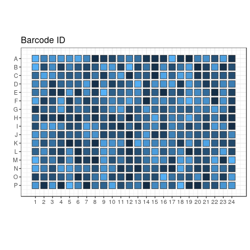

```r
variant <- "b"
newseed <- 2
indexes <- c("CTCTCTAC", "CGAGGCTG", "AAGAGGCA", "GTAGAGGA", "GCTCATGA", "ATCTCAGG")
```


New test of TSO, RT primer and RNA amounts
==========================================

In this design, the TSOs are randomised as much as possible (taking into
account that all do not have the same stock concentrations).

Each 384-well plate is divided in 6 "sextants", interleaved for easier
collection of the reaction products.  Each sextant has a different RNA amount,
and is indexed and amplified independently.  There are 9 × 7 combinations of TSO
and RT primer concentrations, plus one negative control with no RNA.  Each
reaction is assigned to a random well within the sextant.

For each plate replicate, a different random seed is used, to generate
different randomisations.

## Load scripts and libraries.


```r
library("magrittr")   # For its diamond pipe operators
library("ggplot2")    # For plotting
library("platetools") # For defining and manipulating 384-well plates
library("plyr")
library("tibble")     # For comfortable command-line operations

# The set_block function that will become part of platetools
source("https://raw.githubusercontent.com/charles-plessy/platetools/76213accb1704d11a2d96fb1f6284d0b46117778/R/set_block.R")

# Do not load the whole smallCAGEqc package, just get the barcode data.
data("nanoCAGE2017barcodes", package = "smallCAGEqc")
```


Selected TSOs
=============

TSOs are transferred as 1, 2 or 4 drops from 3 different starting
concentrations in the source plate.  Let's call each starting concentration
"Tier_A", "Tier_B" or "Tier_C".  Given constraints on remaining volume, some
TSOs can only be Tier_C, etc.  Let's refer to the TSOs by their numerical
identifier.  Tier_N is a set of barcodes that can be used for the negative
control.  See the file [Labcyte-RT6_TSO_stock_to_source.xls](Labcyte-RT6_TSO_stock_to_source.xls)
for details on the cherrypicking of the TSOs.


```r
Tier_A <- c(  3, 15, 27, 39, 51, 63, 75
           , 10, 22, 34, 46, 58, 70, 82
           , 11, 23, 35, 47, 59, 71, 83)

Tier_B <- c(  1, 13, 25, 37, 49, 61, 73
           ,  2, 14, 26, 38, 50, 62, 74
           ,  7, 19, 31, 43, 55, 67, 79)

Tier_C <- c(  4, 16, 28, 40, 52, 64, 76
           ,  5, 17, 29, 41, 65, 77, 89
           ,  6, 18, 30, 42, 66, 78, 90)

Tier_N <- c(  8, 20, 32, 44, 68, 80, 92)
```

Set Random seed
===============


```r
set.seed(newseed)
```

Creation of sextants
====================


```r
createRandomisedSextant <- function(index, rna) {
  df <- data.frame ( BARCODE_ID = c( sample(Tier_A, 21)
                                   , sample(Tier_B, 21)
                                   , sample(Tier_C, 21)
                                   , sample(Tier_N,  1)))
  tsoMaxConc <- 800
  df$TSO_source <- c( rep(tsoMaxConc /  1, 21)
                    , rep(tsoMaxConc /  8, 21)
                    , rep(tsoMaxConc /  64, 21)
                    , tsoMaxConc / 32)
  df$TSO_vol <- c(rep(c(rep(100,7), rep(50,7), rep(25,7)),3), 25)
  df$TSO <- df$TSO_source * df$TSO_vol / 500
  df$RT_PRIMERS <- c(rep(c(0, 1, 2, 4, 8, 16, 24), 9), 1)
  df$RT_PRIMERS_vol <- 25
  df[df$RT_PRIMERS == 0, "RT_PRIMERS_vol"] <- 0
  df$MASTER_MIX_vol <- 350
  df$INDEX <- index
  df$RNA <- rna
  df$RNA_vol <- 25
  df[64, "RNA_vol"] <- 0
  df$H2O_vol <- 500 - df$RNA_vol - df$RT_PRIMERS_vol - df$TSO_vol - df$MASTER_MIX_vol
  df[sample(nrow(df)),]
}
```


Sextants
========

Plate layout
------------

Create a data frame representing the contents of each well.


```r
plate           <- tibble(well = platetools::num_to_well(1:384, plate = "384"))
plate$row       <- sub("..$", "", plate$well) %>% factor
plate$col       <- sub("^.",  "", plate$well) %>% as.numeric %>% factor
```

Fill sextants
-------------


```r
plate$sxt <- paste0 (
  c(rep("A", 8), rep("B", 8), rep("C", 8)),
  ifelse (plate$row %in% LETTERS[1:8 * 2], 2, 1)
) %>% factor

plate %<>% arrange(sxt)

plate %<>% cbind( rbind( createRandomisedSextant(indexes[1], 1e5)
                       , createRandomisedSextant(indexes[2], 1e4)
                       , createRandomisedSextant(indexes[3], 1e3)
                       , createRandomisedSextant(indexes[4], 1e2)
                       , createRandomisedSextant(indexes[5], 1e1)
                       , createRandomisedSextant(indexes[6], 1e0))
      ) %>% as.tibble()

plate$BARCODE_ID
```

```
##   [1] 90 61 73 74 71 83 63  3 46 82 70 43 34 42 22 52 51 62 11 10 75  7 66 17 13 37 38 77 19 47 41
##  [32] 15 26 76 78 59 23 27 79 65 67 30 49 29  1 14 39  5 89 40 55 20 64  6 16  2 18 31 28 35 58  4
##  [63] 25 50 89 27 67 15 59 32 22 34 64 61 14 42 47 43 78  5 82 16 30 79 13 50 17 39 46 11 19  4 23
##  [94]  6 38 10 73 62 49 26 41 37 70 71 40 66 25 18 65  3 35 31 83 58 28 77 76 52 55 29 75  7 74  2
## [125] 90 63  1 51 14 23 47 59 49 10  7 11 16 58 77  5 42 35  3 83 90 38 43 55 66 18 37  4 39 64 76
## [156] 20 34 71 46 28 30 19  6 41 13 52 63 15 78 70 65  1 82 73 61 67 75 29 50 17 26 51 74 62 79 22
## [187] 27  2 40 31 25 89 79 75 16 90 19 51  6 66 63 17 30 44 89 15 70 73 47 61 50 77 52  3 58 64 35
## [218] 10 38  1 40 42 83 28 22 29 31  4 37 76 14 18 74 59 26  7 27 49 78 34 71 62 11 23  5 43 39 13
## [249] 41 82 25 46 55  2 65 67 89 10  1 59 70 30 79  7 43 80 74 11 18 37 35 25 38 22 65 66 46  3 63
## [280] 17 51 41 34 58 52 77 55  5 62 47 19 42 15 75 64  2 49 13 71 27 82 39 26 23 14 78 73 28 31 83
## [311]  6 90 50 40 29 67  4 61 16 76 26 51 78  1 18 75  6 27 77 11 76 47 14 31 64 58 40 67 89 65 70
## [342]  7 71 19 59 52 82 44 25 55 13 10 61 42 49 34 41 37 30 63 50 62  3 16 28 43 79 23  5 83 39 15
## [373] 17 66 46 22 35 90  4  2 38 29 73 74
```

```r
plate$INDEX %<>% factor
plate$BARCODE_SEQ <- nanoCAGE2017barcodes[plate$BARCODE_ID, "barcodes"]

plate$RNA_level <- plate$RNA %>% factor(labels = paste0("RNA_", LETTERS[1:6]))
plate$RTP_level <- plate$RT_PRIMERS %>% factor(labels = paste0("RTP_", LETTERS[1:7]))
```

Summary
=======


```r
plate 
```

```
## # A tibble: 384 x 18
##    well  row   col   sxt   BARCODE_ID TSO_source TSO_vol    TSO RT_PRIMERS RT_PRIMERS_vol
##  * <chr> <fct> <fct> <fct>      <dbl>      <dbl>   <dbl>  <dbl>      <dbl>          <dbl>
##  1 A01   A     1     A1           90.       12.5     50.   1.25        16.            25.
##  2 A02   A     2     A1           61.      100.     100.  20.0         24.            25.
##  3 A03   A     3     A1           73.      100.     100.  20.0          4.            25.
##  4 A04   A     4     A1           74.      100.      50.  10.0          0.             0.
##  5 A05   A     5     A1           71.      800.      50.  80.0         24.            25.
##  6 A06   A     6     A1           83.      800.     100. 160.           4.            25.
##  7 A07   A     7     A1           63.      800.      25.  40.0          1.            25.
##  8 A08   A     8     A1            3.      800.      25.  40.0          4.            25.
##  9 C01   C     1     A1           46.      800.     100. 160.           2.            25.
## 10 C02   C     2     A1           82.      800.      50.  80.0          4.            25.
## # ... with 374 more rows, and 8 more variables: MASTER_MIX_vol <dbl>, INDEX <fct>, RNA <dbl>,
## #   RNA_vol <dbl>, H2O_vol <dbl>, BARCODE_SEQ <chr>, RNA_level <fct>, RTP_level <fct>
```

```r
summary(plate)
```

```
##      well                row           col      sxt       BARCODE_ID      TSO_source   
##  Length:384         A      : 24   1      : 16   A1:64   Min.   : 1.00   Min.   : 12.5  
##  Class :character   B      : 24   2      : 16   A2:64   1st Qu.:19.75   1st Qu.: 12.5  
##  Mode  :character   C      : 24   3      : 16   B1:64   Median :41.00   Median :100.0  
##                     D      : 24   4      : 16   B2:64   Mean   :42.55   Mean   :299.8  
##                     E      : 24   5      : 16   C1:64   3rd Qu.:65.00   3rd Qu.:800.0  
##                     F      : 24   6      : 16   C2:64   Max.   :90.00   Max.   :800.0  
##                     (Other):240   (Other):288                                          
##     TSO_vol            TSO            RT_PRIMERS    RT_PRIMERS_vol  MASTER_MIX_vol      INDEX   
##  Min.   : 25.00   Min.   :  0.625   Min.   : 0.00   Min.   : 0.00   Min.   :350    AAGAGGCA:64  
##  1st Qu.: 25.00   1st Qu.:  2.500   1st Qu.: 1.00   1st Qu.:25.00   1st Qu.:350    ATCTCAGG:64  
##  Median : 50.00   Median : 10.000   Median : 4.00   Median :25.00   Median :350    CGAGGCTG:64  
##  Mean   : 57.81   Mean   : 34.951   Mean   : 7.75   Mean   :21.48   Mean   :350    CTCTCTAC:64  
##  3rd Qu.:100.00   3rd Qu.: 40.000   3rd Qu.:16.00   3rd Qu.:25.00   3rd Qu.:350    GCTCATGA:64  
##  Max.   :100.00   Max.   :160.000   Max.   :24.00   Max.   :25.00   Max.   :350    GTAGAGGA:64  
##                                                                                                 
##       RNA            RNA_vol         H2O_vol       BARCODE_SEQ        RNA_level  RTP_level 
##  Min.   :     1   Min.   : 0.00   Min.   :  0.00   Length:384         RNA_A:64   RTP_A:54  
##  1st Qu.:    10   1st Qu.:25.00   1st Qu.:  0.00   Class :character   RNA_B:64   RTP_B:60  
##  Median :   550   Median :25.00   Median : 50.00   Mode  :character   RNA_C:64   RTP_C:54  
##  Mean   : 18518   Mean   :24.61   Mean   : 46.09                      RNA_D:64   RTP_D:54  
##  3rd Qu.: 10000   3rd Qu.:25.00   3rd Qu.: 75.00                      RNA_E:64   RTP_E:54  
##  Max.   :100000   Max.   :25.00   Max.   :100.00                      RNA_F:64   RTP_F:54  
##                                                                                  RTP_G:54
```

```r
write.table(plate, paste0("plate6", variant, ".txt"), sep = "\t", quote = FALSE, row.names = FALSE)
```

Plate maps
==========


```r
plateMap <- function(x, title) {
  platetools::raw_map(plate[[x]], well=plate$well, plate="384") +
  ggtitle(title) +
  viridis::scale_fill_viridis(breaks = unique(plate[[x]]))
}

plateMapLog <- function(x, title) {
  platetools::raw_map(plate[[x]], well=plate$well, plate="384") +
  ggtitle(title) +
  viridis::scale_fill_viridis(breaks = unique(plate[[x]]), trans = "log")
}
```

TSO
---


```r
(plot_TSO <- plateMapLog("TSO", "TSO concentration"))
```

<!-- -->


```r
(plot_TSO_vol <- plateMap("TSO_vol", "TSO volume"))
```

<!-- -->


```r
(plot_BARCODES <- platetools::raw_map(plate[["BARCODE_ID"]], well=plate$well, plate="384") +
  ggtitle("Barcode ID")) + theme(legend.position="none")
```

<!-- -->

Indexes
-------


```r
(plot_indexes <- platetools::raw_map(plate[["INDEX"]], well=plate$well, plate="384") +
  ggtitle("INDEXes"))
```

<!-- -->

H2O
---


```r
(plot_H2O_vol <- plateMap("H2O_vol", "H2O volume"))
```

<!-- -->

RT primers
----------


```r
(plot_RT <- plateMapLog("RT_PRIMERS", "RT primer concentration"))
```

```
## Warning: Transformation introduced infinite values in discrete y-axis
```

<!-- -->


```r
(plot_RT_vol <- plateMap("RT_PRIMERS_vol", "RT primer volume"))
```

<!-- -->

RNA mass
--------


```r
(plot_RNA <- plateMapLog("RNA", "RNA mass (ng)"))
```

<!-- -->


```r
(plot_RNA_vol <- plateMap("RNA_vol", "RNA volume"))
```

<!-- -->


Transfer file
=============

## Source plate layout

### TSO


```r
nanoCAGE2017barcodes$well <- unlist(lapply(LETTERS[1:8], function(x) paste(x, sprintf("%02d", 1:12), sep = "")))

tso_block <- data.frame( id  = c(Tier_A, Tier_B, Tier_C, Tier_N)
                       , row = unlist(lapply(LETTERS[1:10], rep, 7))
                       , col = rep(1:7, 10))

tso_block$well <- paste0(tso_block$row, "0", tso_block$col)

tso_block$barcodes <- nanoCAGE2017barcodes[tso_block$id, "barcodes"]

source <- tibble(well = platetools::num_to_well(1:384, plate = "384"))

for (n in 1:nrow(tso_block))
  source %<>% set_block( tso_block[n,"well"]
                       , tso_block[n,"barcodes"]
                       , 20000)
```

### Water


```r
source %<>% set_block("M01~M06", "H2O", 20000)
```

### RNA


```r
levels(plate$RNA %>% factor)
```

```
## [1] "1"     "10"    "100"   "1000"  "10000" "1e+05"
```

```r
levels(plate$RNA_level)
```

```
## [1] "RNA_A" "RNA_B" "RNA_C" "RNA_D" "RNA_E" "RNA_F"
```

```r
source %<>% set_block("L01", "RNA_F", 20000)
source %<>% set_block("L02", "RNA_E", 20000)
source %<>% set_block("L03", "RNA_D", 20000)
source %<>% set_block("L04", "RNA_C", 20000)
source %<>% set_block("L05", "RNA_B", 20000)
source %<>% set_block("L06", "RNA_A", 20000)
```

### RNA


```r
levels(plate$RT_PRIMERS %>% factor)
```

```
## [1] "0"  "1"  "2"  "4"  "8"  "16" "24"
```

```r
levels(plate$RTP_level)
```

```
## [1] "RTP_A" "RTP_B" "RTP_C" "RTP_D" "RTP_E" "RTP_F" "RTP_G"
```

```r
source %<>% set_block("K01", "RTP_A", 20000)
source %<>% set_block("K02", "RTP_B", 20000)
source %<>% set_block("K03", "RTP_C", 20000)
source %<>% set_block("K04", "RTP_D", 20000)
source %<>% set_block("K05", "RTP_E", 20000)
source %<>% set_block("K06", "RTP_F", 20000)
source %<>% set_block("K07", "RTP_G", 20000)
```

## Plan plate


```r
planPlate <- tibble(well = platetools::num_to_well(1:384, plate = "384"))

for (n in 1:nrow(plate)) {
  planPlate %<>% set_block( plate[[n,"well"]]
                          , plate[[n,"BARCODE_SEQ"]] %>% as.character
                          , plate[[n,"TSO_vol"]])
  planPlate %<>% set_block( plate[[n,"well"]]
                          , "H2O"
                          , plate[[n,"H2O_vol"]])
  planPlate %<>% set_block( plate[[n,"well"]]
                          , plate[[n,"RTP_level"]] %>% as.character
                          , plate[[n,"RT_PRIMERS_vol"]])
  planPlate %<>% set_block( plate[[n,"well"]]
                          , plate[[n,"RNA_level"]] %>% as.character
                          , plate[[n,"RNA_vol"]])
}
planPlate %<>% replace( . == 0, NA)
```

## Plan transfer


```r
source("plates.R")
```

```
## Creating a generic function for 'colnames' from package 'base' in the global environment
```

```r
source("echo.R")

planPlate   <- Plate(plate = planPlate)
sourcePlate <- Plate(plate = source)
destPlate   <- Plate(plate = tibble::tibble(well = num_to_well(1:384, plate = "384")))

echo <- planTransfers(sourcePlate, destPlate, planPlate)
echo
```

```
## A 525 Echo machine:
##   Source plate:      A Plate with data about 384 wells (dead volume: 10000; max volume: 1e+05).
##   Destination plate: A Plate with data about 384 wells (dead volume: 10000; max volume: 1e+05).
## Transducer at the following coordinates:
##   Source:      L06 (384-well format)
##   Destination: P24 (384-well format)
## 1368 elements in the log.
```

```r
transfers <- as.data.frame(echo %>% showLogs)
transfers <- transfers[order(transfers$from),]

colnames(transfers) <- c("Source well", "Destination well", "Transfer volume", "what")

transfers
```

```
##      Source well Destination well Transfer volume   what
## 604          A01              A08              25 ACACTC
## 605          A01              C15             100 ACACTC
## 606          A01              E22              50 ACACTC
## 607          A01              F14              25 ACACTC
## 608          A01              L06             100 ACACTC
## 609          A01              L19              25 ACACTC
## 856          A02              B04              50 AGTCTC
## 857          A02              D14             100 AGTCTC
## 858          A02              G08             100 AGTCTC
## 859          A02              I16              25 AGTCTC
## 860          A02              I21              25 AGTCTC
## 861          A02              N20              25 AGTCTC
## 892          A03              B02              50 ATCTGA
## 893          A03              B24              50 ATCTGA
## 894          A03              I06              50 ATCTGA
## 895          A03              K20              25 ATCTGA
## 896          A03              L13              50 ATCTGA
## 897          A03              O11              25 ATCTGA
## 946          A04              F08             100 CGACTC
## 947          A04              G09              25 CGACTC
## 948          A04              K07             100 CGACTC
## 949          A04              K22              50 CGACTC
## 950          A04              N15              25 CGACTC
## 951          A04              N19              25 CGACTC
## 766          A05              B14              50 CTGCTC
## 767          A05              B18             100 CTGCTC
## 768          A05              E01              25 CTGCTC
## 769          A05              G17              25 CTGCTC
## 770          A05              M14              50 CTGCTC
## 771          A05              P08             100 CTGCTC
## 538          A06              A07              25 GAGTGA
## 539          A06              D09              25 GAGTGA
## 540          A06              E23              50 GAGTGA
## 541          A06              I15             100 GAGTGA
## 542          A06              J24              25 GAGTGA
## 543          A06              P06              25 GAGTGA
## 790          A07              B10              50 GTACTC
## 791          A07              B22             100 GTACTC
## 792          A07              E05              50 GTACTC
## 793          A07              I22             100 GTACTC
## 794          A07              M09              50 GTACTC
## 795          A07              P01             100 GTACTC
## 784          B01              A14              50 AGTACG
## 785          B01              A18             100 AGTACG
## 786          B01              E04              25 AGTACG
## 787          B01              H08              25 AGTACG
## 788          B01              H10             100 AGTACG
## 789          B01              H24              50 AGTACG
## 700          B02              B07              25 ATCGAT
## 701          B02              C07              25 ATCGAT
## 702          B02              E18             100 ATCGAT
## 703          B02              J09              25 ATCGAT
## 704          B02              N24              50 ATCGAT
## 705          B02              O10              50 ATCGAT
## 688          B03              B08              50 CACTAC
## 689          B03              C05              25 CACTAC
## 690          B03              G13             100 CACTAC
## 691          B03              G19              25 CACTAC
## 692          B03              J20             100 CACTAC
## 693          B03              L16             100 CACTAC
## 610          B04              C01             100 CTGACG
## 611          B04              E21             100 CTGACG
## 612          B04              G15              50 CTGACG
## 613          B04              H01              50 CTGACG
## 614          B04              N23              50 CTGACG
## 615          B04              P12              25 CTGACG
## 1026         B05              C10             100 GAGCAG
## 1027         B05              D24              50 GAGCAG
## 1028         B05              F15             100 GAGCAG
## 1029         B05              G20              50 GAGCAG
## 1030         B05              N02              25 GAGCAG
## 1031         B05              O05              50 GAGCAG
## 676          B06              A21              50 GCTGAT
## 677          B06              C03              50 GCTGAT
## 678          B06              D15             100 GCTGAT
## 679          B06              F21              25 GCTGAT
## 680          B06              J07              25 GCTGAT
## 681          B06              K10             100 GCTGAT
## 670          B07              C02              50 TATACG
## 671          B07              F01              50 TATACG
## 672          B07              H19             100 TATACG
## 673          B07              K13              50 TATACG
## 674          B07              K21              50 TATACG
## 675          B07              P10              25 TATACG
## 778          C01              A16              25 AGTAGC
## 779          C01              C20             100 AGTAGC
## 780          C01              D18              25 AGTAGC
## 781          C01              E03             100 AGTAGC
## 782          C01              H02             100 AGTAGC
## 783          C01              N11             100 AGTAGC
## 886          C02              A10              50 ATCGCA
## 887          C02              H05             100 ATCGCA
## 888          C02              I05             100 ATCGCA
## 889          C02              K24              25 ATCGCA
## 890          C02              L24             100 ATCGCA
## 891          C02              N12              50 ATCGCA
## 1020         C03              C14              25 CACTCT
## 1021         C03              C23              25 CACTCT
## 1022         C03              H09              50 CACTCT
## 1023         C03              L07             100 CACTCT
## 1024         C03              O04             100 CACTCT
## 1025         C03              P17             100 CACTCT
## 844          C04              A11              25 CTGAGC
## 845          C04              D05              25 CTGAGC
## 846          C04              D20              50 CTGAGC
## 847          C04              F09              50 CTGAGC
## 848          C04              G06              25 CTGAGC
## 849          C04              I18              25 CTGAGC
## 880          C05              A12             100 GAGCGT
## 881          C05              A20              50 GAGCGT
## 882          C05              B05              50 GAGCGT
## 883          C05              H17             100 GAGCGT
## 884          C05              I04              50 GAGCGT
## 885          C05              L10              25 GAGCGT
## 526          C06              A05              50 GCTGCA
## 527          C06              F23              50 GCTGCA
## 528          C06              G14              25 GCTGCA
## 529          C06              J08              50 GCTGCA
## 530          C06              K19             100 GCTGCA
## 531          C06              N09             100 GCTGCA
## 532          C07              A06             100 TATAGC
## 533          C07              C16             100 TATAGC
## 534          C07              H15              50 TATAGC
## 535          C07              M22             100 TATAGC
## 536          C07              N01              25 TATAGC
## 537          C07              N18              25 TATAGC
## 934          D01              A19              50 ACACAG
## 935          D01              B20             100 ACACAG
## 936          D01              H12              50 ACACAG
## 937          D01              K05              50 ACACAG
## 938          D01              K12              25 ACACAG
## 939          D01              P07              50 ACACAG
## 814          D02              F05              25 AGTCAG
## 815          D02              G01              50 AGTCAG
## 816          D02              H23              50 AGTCAG
## 817          D02              I13             100 AGTCAG
## 818          D02              K18              25 AGTCAG
## 819          D02              N16              25 AGTCAG
## 1038         D03              C24             100 ATCTAC
## 1039         D03              H21              25 ATCTAC
## 1040         D03              L03              50 ATCTAC
## 1041         D03              O07             100 ATCTAC
## 1042         D03              O15              50 ATCTAC
## 1043         D03              P11              25 ATCTAC
## 820          D04              C22              25 CGACAG
## 821          D04              E15              50 CGACAG
## 822          D04              G02              25 CGACAG
## 823          D04              J06             100 CGACAG
## 824          D04              J13             100 CGACAG
## 825          D04              J22              50 CGACAG
## 922          D05              A13             100 CTGCAG
## 923          D05              J03             100 CTGCAG
## 924          D05              J19              50 CTGCAG
## 925          D05              K03              50 CTGCAG
## 926          D05              K17             100 CTGCAG
## 927          D05              L14              50 CTGCAG
## 400          D06              A02             100 GAGTAC
## 401          D06              D02              25 GAGTAC
## 402          D06              F10              25 GAGTAC
## 403          D06              J17              25 GAGTAC
## 404          D06              K15             100 GAGTAC
## 405          D06              O22              50 GAGTAC
## 460          D07              A03             100 GTACAG
## 461          D07              D16             100 GTACAG
## 462          D07              J01             100 GTACAG
## 463          D07              K14              50 GTACAG
## 464          D07              M19              25 GTACAG
## 465          D07              P23              25 GTACAG
## 996          E01              I24             100 ACACGT
## 997          E01              M08              50 ACACGT
## 998          E01              O12              50 ACACGT
## 999          E01              P04              25 ACACGT
## 1000         E01              P14              50 ACACGT
## 1001         E01              P20             100 ACACGT
## 940          E02              A09              25 AGTCGT
## 941          E02              D03              50 AGTCGT
## 942          E02              D21              25 AGTCGT
## 943          E02              J15              25 AGTCGT
## 944          E02              K06             100 AGTCGT
## 945          E02              M17              50 AGTCGT
## 862          E03              B17             100 ATCTCT
## 863          E03              I01              25 ATCTCT
## 864          E03              J04              50 ATCTCT
## 865          E03              K23              25 ATCTCT
## 866          E03              L11              25 ATCTCT
## 867          E03              M13              25 ATCTCT
## 826          E04              E10             100 CGACGT
## 827          E04              E17              50 CGACGT
## 828          E04              G03              25 CGACGT
## 829          E04              H07              25 CGACGT
## 830          E04              H11             100 CGACGT
## 831          E04              P21             100 CGACGT
## 1044         E05              F06              50 CTGCGT
## 1045         E05              F11             100 CTGCGT
## 1046         E05              L17              50 CTGCGT
## 1047         E05              M11              50 CTGCGT
## 1048         E05              O08              25 CTGCGT
## 1049         E05              O17              50 CTGCGT
## 772          E06              E02              50 GAGTCT
## 773          E06              I17             100 GAGTCT
## 774          E06              J02             100 GAGTCT
## 775          E06              L18             100 GAGTCT
## 776          E06              M16              50 GAGTCT
## 777          E06              N10              25 GAGTCT
## 520          E07              A04              50 GTACGT
## 521          E07              C19             100 GTACGT
## 522          E07              L09             100 GTACGT
## 523          E07              M15              50 GTACGT
## 524          E07              P03              50 GTACGT
## 525          E07              P24              50 GTACGT
## 796          F01              A15              25 ACATAC
## 797          F01              A24              50 ACATAC
## 798          F01              E06              25 ACATAC
## 799          F01              F22              50 ACATAC
## 800          F01              L12              50 ACATAC
## 801          F01              P02              25 ACATAC
## 838          F02              B13             100 ATCACG
## 839          F02              F24              25 ATCACG
## 840          F02              G05              25 ATCACG
## 841          F02              H03              25 ATCACG
## 842          F02              I10             100 ATCACG
## 843          F02              I19             100 ATCACG
## 1008         F03              D22             100 CACGAT
## 1009         F03              J11              25 CACGAT
## 1010         F03              L08             100 CACGAT
## 1011         F03              M21              25 CACGAT
## 1012         F03              O02             100 CACGAT
## 1013         F03              O14             100 CACGAT
## 682          F04              C04              25 CGATAC
## 683          F04              C17              50 CGATAC
## 684          F04              D06              25 CGATAC
## 685          F04              E11              25 CGATAC
## 686          F04              L22             100 CGATAC
## 687          F04              N14             100 CGATAC
## 970          F05              E12              25 GAGACG
## 971          F05              G23              25 GAGACG
## 972          F05              H22              50 GAGACG
## 973          F05              M03             100 GAGACG
## 974          F05              N07             100 GAGACG
## 975          F05              P13              50 GAGACG
## 910          F06              B03              50 GCTCAG
## 911          F06              F18              25 GCTCAG
## 912          F06              K01              50 GCTCAG
## 913          F06              K16              25 GCTCAG
## 914          F06              O20             100 GCTCAG
## 915          F06              P16              50 GCTCAG
## 898          F07              A23              25 GTATAC
## 899          F07              B09              50 GTATAC
## 900          F07              F04             100 GTATAC
## 901          F07              I07             100 GTATAC
## 902          F07              L23              25 GTATAC
## 903          F07              O09             100 GTATAC
## 1032         G01              E16              50 ACAGAT
## 1033         G01              H04              25 ACAGAT
## 1034         G01              J12              25 ACAGAT
## 1035         G01              O06              50 ACAGAT
## 1036         G01              O21              50 ACAGAT
## 1037         G01              P19              50 ACAGAT
## 990          G02              B11             100 AGTGAT
## 991          G02              C09              25 AGTGAT
## 992          G02              F02              50 AGTGAT
## 993          G02              L20             100 AGTGAT
## 994          G02              M07              25 AGTGAT
## 995          G02              O23              25 AGTGAT
## 1014         G03              G16              50 CACACG
## 1015         G03              H16              25 CACACG
## 1016         G03              L21              50 CACACG
## 1017         G03              M20              50 CACACG
## 1018         G03              N03             100 CACACG
## 1019         G03              O03             100 CACACG
## 964          G04              F17             100 CGAGAT
## 965          G04              H13              50 CGAGAT
## 966          G04              L01              25 CGAGAT
## 967          G04              M02             100 CGAGAT
## 968          G04              O13             100 CGAGAT
## 969          G04              O18              50 CGAGAT
## 706          G05              C08              25 CTGTAC
## 707          G05              F13              50 CTGTAC
## 708          G05              G21              50 CTGTAC
## 709          G05              H18              50 CTGTAC
## 710          G05              I14              25 CTGTAC
## 711          G05              N06             100 CTGTAC
## 978          G06              D01             100 GCTACG
## 979          G06              D23              50 GCTACG
## 980          G06              F16              25 GCTACG
## 981          G06              G10              25 GCTACG
## 982          G06              I23              50 GCTACG
## 983          G06              M05             100 GCTACG
## 868          G07              D19             100 GTAGAT
## 869          G07              G11              25 GTAGAT
## 870          G07              I02              50 GTAGAT
## 871          G07              J14              25 GTAGAT
## 872          G07              N05             100 GTAGAT
## 873          G07              O24             100 GTAGAT
## 952          H01              C12             100 ACAGCA
## 953          H01              D08              25 ACAGCA
## 954          H01              G24              25 ACAGCA
## 955          H01              K08             100 ACAGCA
## 956          H01              N13              25 ACAGCA
## 957          H01              N17              50 ACAGCA
## 808          H02              D10              50 AGTGCA
## 809          H02              E08              25 AGTGCA
## 810          H02              E24             100 AGTGCA
## 811          H02              F07              50 AGTGCA
## 812          H02              M12             100 AGTGCA
## 813          H02              N21             100 AGTGCA
## 928          H03              J10              50 CACAGC
## 929          H03              K04              50 CACAGC
## 930          H03              M10              50 CACAGC
## 931          H03              N08              25 CACAGC
## 932          H03              O19              50 CACAGC
## 933          H03              P22              50 CACAGC
## 850          H04              G07              25 CGAGCA
## 851          H04              G18             100 CGAGCA
## 852          H04              I12             100 CGAGCA
## 853          H04              J05              50 CGAGCA
## 854          H04              J21             100 CGAGCA
## 855          H04              P09             100 CGAGCA
## 904          H05              E19              25 GCTAGC
## 905          H05              F20             100 GCTAGC
## 906          H05              I08              50 GCTAGC
## 907          H05              K11             100 GCTAGC
## 908          H05              L05              50 GCTAGC
## 909          H05              P15             100 GCTAGC
## 832          H06              C11              25 GTAGCA
## 833          H06              D17              25 GTAGCA
## 834          H06              F12              50 GTAGCA
## 835          H06              G04              50 GTAGCA
## 836          H06              G22              50 GTAGCA
## 837          H06              N04             100 GTAGCA
## 958          H07              A17              25 TATGCA
## 959          H07              B01              25 TATGCA
## 960          H07              D13             100 TATGCA
## 961          H07              F19             100 TATGCA
## 962          H07              M01              25 TATGCA
## 963          H07              O16              50 TATGCA
## 984          I01              B15             100 ACAGTG
## 985          I01              B23              50 ACAGTG
## 986          I01              H06              50 ACAGTG
## 987          I01              I11             100 ACAGTG
## 988          I01              M06             100 ACAGTG
## 989          I01              M23             100 ACAGTG
## 1002         I02              B21              25 AGTGTG
## 1003         I02              C21             100 AGTGTG
## 1004         I02              E14             100 AGTGTG
## 1005         I02              J16              25 AGTGTG
## 1006         I02              L04              50 AGTGTG
## 1007         I02              O01              25 AGTGTG
## 916          I03              A22              25 CACATA
## 917          I03              D11              50 CACATA
## 918          I03              F03             100 CACATA
## 919          I03              I09              25 CACATA
## 920          I03              J23              25 CACATA
## 921          I03              K02             100 CACATA
## 694          I04              C06             100 CGAGTG
## 695          I04              C13              50 CGAGTG
## 696          I04              D04              50 CGAGTG
## 697          I04              H14              50 CGAGTG
## 698          I04              I20             100 CGAGTG
## 699          I04              J18              25 CGAGTG
## 802          I05              B16              25 GCTATA
## 803          I05              E07              50 GCTATA
## 804          I05              E13              25 GCTATA
## 805          I05              E20              25 GCTATA
## 806          I05              L02              25 GCTATA
## 807          I05              N22              25 GCTATA
## 874          I06              B19              25 GTAGTG
## 875          I06              D07              25 GTAGTG
## 876          I06              I03              25 GTAGTG
## 877          I06              K09              50 GTAGTG
## 878          I06              L15             100 GTAGTG
## 879          I06              M18             100 GTAGTG
## 1            I07              A01              50 TATGTG
## 2            I07              B12             100 TATGTG
## 3            I07              E09              50 TATGTG
## 4            I07              M24              25 TATGTG
## 5            I07              P05             100 TATGTG
## 6            I07              P18              25 TATGTG
## 976          J02              G12              25 ATCAGC
## 977          J02              M04              25 ATCAGC
## 1113         J03              B06              25 CACGCA
## 1240         J04              D12              25 CGATCT
## 1241         J04              H20              25 CGATCT
## 1305         J06              C18              25 GTATCT
## 544          K02              A07              25  RTP_B
## 545          K02              A17              25  RTP_B
## 546          K02              B06              25  RTP_B
## 547          K02              B07              25  RTP_B
## 548          K02              B14              25  RTP_B
## 549          K02              B16              25  RTP_B
## 550          K02              B17              25  RTP_B
## 551          K02              C17              25  RTP_B
## 552          K02              C18              25  RTP_B
## 553          K02              C19              25  RTP_B
## 554          K02              C22              25  RTP_B
## 555          K02              D12              25  RTP_B
## 556          K02              D15              25  RTP_B
## 557          K02              D19              25  RTP_B
## 558          K02              D23              25  RTP_B
## 559          K02              E03              25  RTP_B
## 560          K02              E05              25  RTP_B
## 561          K02              E06              25  RTP_B
## 562          K02              E12              25  RTP_B
## 563          K02              E13              25  RTP_B
## 564          K02              E18              25  RTP_B
## 565          K02              F05              25  RTP_B
## 566          K02              F07              25  RTP_B
## 567          K02              F11              25  RTP_B
## 568          K02              F21              25  RTP_B
## 569          K02              G01              25  RTP_B
## 570          K02              G07              25  RTP_B
## 571          K02              G12              25  RTP_B
## 572          K02              G14              25  RTP_B
## 573          K02              G15              25  RTP_B
## 574          K02              G16              25  RTP_B
## 575          K02              G17              25  RTP_B
## 576          K02              G18              25  RTP_B
## 577          K02              G20              25  RTP_B
## 578          K02              H12              25  RTP_B
## 579          K02              H14              25  RTP_B
## 580          K02              H17              25  RTP_B
## 581          K02              H20              25  RTP_B
## 582          K02              H23              25  RTP_B
## 583          K02              I12              25  RTP_B
## 584          K02              I13              25  RTP_B
## 585          K02              I15              25  RTP_B
## 586          K02              J06              25  RTP_B
## 587          K02              J08              25  RTP_B
## 588          K02              J11              25  RTP_B
## 589          K02              J18              25  RTP_B
## 590          K02              L03              25  RTP_B
## 591          K02              M02              25  RTP_B
## 592          K02              M04              25  RTP_B
## 593          K02              M16              25  RTP_B
## 594          K02              N03              25  RTP_B
## 595          K02              N08              25  RTP_B
## 596          K02              N24              25  RTP_B
## 597          K02              O02              25  RTP_B
## 598          K02              O06              25  RTP_B
## 599          K02              O19              25  RTP_B
## 600          K02              P01              25  RTP_B
## 601          K02              P10              25  RTP_B
## 602          K02              P15              25  RTP_B
## 603          K02              P23              25  RTP_B
## 616          K03              A11              25  RTP_C
## 617          K03              A13              25  RTP_C
## 618          K03              A15              25  RTP_C
## 619          K03              B19              25  RTP_C
## 620          K03              B24              25  RTP_C
## 621          K03              C01              25  RTP_C
## 622          K03              C03              25  RTP_C
## 623          K03              C06              25  RTP_C
## 624          K03              C13              25  RTP_C
## 625          K03              C16              25  RTP_C
## 626          K03              D04              25  RTP_C
## 627          K03              D08              25  RTP_C
## 628          K03              D16              25  RTP_C
## 629          K03              D18              25  RTP_C
## 630          K03              E01              25  RTP_C
## 631          K03              E14              25  RTP_C
## 632          K03              E22              25  RTP_C
## 633          K03              F01              25  RTP_C
## 634          K03              F04              25  RTP_C
## 635          K03              F08              25  RTP_C
## 636          K03              G03              25  RTP_C
## 637          K03              G04              25  RTP_C
## 638          K03              G24              25  RTP_C
## 639          K03              H07              25  RTP_C
## 640          K03              H08              25  RTP_C
## 641          K03              H10              25  RTP_C
## 642          K03              H15              25  RTP_C
## 643          K03              I03              25  RTP_C
## 644          K03              I09              25  RTP_C
## 645          K03              I19              25  RTP_C
## 646          K03              I21              25  RTP_C
## 647          K03              I23              25  RTP_C
## 648          K03              J10              25  RTP_C
## 649          K03              J19              25  RTP_C
## 650          K03              K05              25  RTP_C
## 651          K03              K14              25  RTP_C
## 652          K03              L14              25  RTP_C
## 653          K03              L20              25  RTP_C
## 654          K03              L22              25  RTP_C
## 655          K03              L23              25  RTP_C
## 656          K03              M19              25  RTP_C
## 657          K03              M22              25  RTP_C
## 658          K03              N06              25  RTP_C
## 659          K03              N10              25  RTP_C
## 660          K03              N13              25  RTP_C
## 661          K03              N15              25  RTP_C
## 662          K03              O07              25  RTP_C
## 663          K03              O10              25  RTP_C
## 664          K03              O22              25  RTP_C
## 665          K03              O24              25  RTP_C
## 666          K03              P07              25  RTP_C
## 667          K03              P09              25  RTP_C
## 668          K03              P17              25  RTP_C
## 669          K03              P19              25  RTP_C
## 466          K04              A03              25  RTP_D
## 467          K04              A06              25  RTP_D
## 468          K04              A08              25  RTP_D
## 469          K04              A10              25  RTP_D
## 470          K04              A22              25  RTP_D
## 471          K04              B02              25  RTP_D
## 472          K04              B03              25  RTP_D
## 473          K04              B12              25  RTP_D
## 474          K04              B18              25  RTP_D
## 475          K04              B21              25  RTP_D
## 476          K04              C02              25  RTP_D
## 477          K04              C10              25  RTP_D
## 478          K04              D07              25  RTP_D
## 479          K04              E02              25  RTP_D
## 480          K04              E07              25  RTP_D
## 481          K04              E08              25  RTP_D
## 482          K04              E11              25  RTP_D
## 483          K04              E17              25  RTP_D
## 484          K04              E21              25  RTP_D
## 485          K04              E23              25  RTP_D
## 486          K04              F03              25  RTP_D
## 487          K04              F12              25  RTP_D
## 488          K04              F17              25  RTP_D
## 489          K04              G05              25  RTP_D
## 490          K04              G11              25  RTP_D
## 491          K04              G22              25  RTP_D
## 492          K04              H16              25  RTP_D
## 493          K04              H18              25  RTP_D
## 494          K04              H21              25  RTP_D
## 495          K04              H24              25  RTP_D
## 496          K04              I16              25  RTP_D
## 497          K04              I17              25  RTP_D
## 498          K04              J05              25  RTP_D
## 499          K04              J07              25  RTP_D
## 500          K04              J13              25  RTP_D
## 501          K04              J24              25  RTP_D
## 502          K04              K24              25  RTP_D
## 503          K04              L07              25  RTP_D
## 504          K04              L08              25  RTP_D
## 505          K04              L13              25  RTP_D
## 506          K04              L16              25  RTP_D
## 507          K04              M06              25  RTP_D
## 508          K04              M10              25  RTP_D
## 509          K04              M11              25  RTP_D
## 510          K04              M12              25  RTP_D
## 511          K04              M18              25  RTP_D
## 512          K04              M21              25  RTP_D
## 513          K04              N16              25  RTP_D
## 514          K04              O09              25  RTP_D
## 515          K04              P04              25  RTP_D
## 516          K04              P12              25  RTP_D
## 517          K04              P14              25  RTP_D
## 518          K04              P20              25  RTP_D
## 519          K04              P24              25  RTP_D
## 712          K05              A20              25  RTP_E
## 713          K05              B05              25  RTP_E
## 714          K05              B20              25  RTP_E
## 715          K05              B23              25  RTP_E
## 716          K05              C08              25  RTP_E
## 717          K05              C09              25  RTP_E
## 718          K05              C12              25  RTP_E
## 719          K05              C20              25  RTP_E
## 720          K05              C23              25  RTP_E
## 721          K05              D03              25  RTP_E
## 722          K05              D10              25  RTP_E
## 723          K05              D20              25  RTP_E
## 724          K05              D21              25  RTP_E
## 725          K05              E04              25  RTP_E
## 726          K05              E24              25  RTP_E
## 727          K05              F14              25  RTP_E
## 728          K05              H03              25  RTP_E
## 729          K05              H06              25  RTP_E
## 730          K05              H09              25  RTP_E
## 731          K05              H19              25  RTP_E
## 732          K05              H22              25  RTP_E
## 733          K05              I06              25  RTP_E
## 734          K05              I07              25  RTP_E
## 735          K05              J12              25  RTP_E
## 736          K05              J21              25  RTP_E
## 737          K05              J23              25  RTP_E
## 738          K05              K01              25  RTP_E
## 739          K05              K02              25  RTP_E
## 740          K05              K04              25  RTP_E
## 741          K05              K10              25  RTP_E
## 742          K05              K16              25  RTP_E
## 743          K05              K17              25  RTP_E
## 744          K05              K18              25  RTP_E
## 745          K05              L02              25  RTP_E
## 746          K05              L06              25  RTP_E
## 747          K05              L09              25  RTP_E
## 748          K05              L12              25  RTP_E
## 749          K05              L15              25  RTP_E
## 750          K05              M09              25  RTP_E
## 751          K05              M24              25  RTP_E
## 752          K05              N02              25  RTP_E
## 753          K05              N05              25  RTP_E
## 754          K05              N07              25  RTP_E
## 755          K05              N11              25  RTP_E
## 756          K05              N20              25  RTP_E
## 757          K05              O04              25  RTP_E
## 758          K05              O08              25  RTP_E
## 759          K05              O11              25  RTP_E
## 760          K05              O12              25  RTP_E
## 761          K05              O14              25  RTP_E
## 762          K05              O16              25  RTP_E
## 763          K05              O17              25  RTP_E
## 764          K05              O18              25  RTP_E
## 765          K05              P11              25  RTP_E
## 283          K06              A01              25  RTP_F
## 284          K06              A12              25  RTP_F
## 285          K06              A14              25  RTP_F
## 286          K06              A24              25  RTP_F
## 287          K06              B04              25  RTP_F
## 288          K06              B09              25  RTP_F
## 289          K06              B15              25  RTP_F
## 290          K06              C04              25  RTP_F
## 291          K06              C14              25  RTP_F
## 292          K06              D05              25  RTP_F
## 293          K06              D09              25  RTP_F
## 294          K06              D11              25  RTP_F
## 295          K06              E10              25  RTP_F
## 296          K06              E15              25  RTP_F
## 297          K06              F09              25  RTP_F
## 298          K06              F16              25  RTP_F
## 299          K06              F22              25  RTP_F
## 300          K06              F23              25  RTP_F
## 301          K06              F24              25  RTP_F
## 302          K06              G06              25  RTP_F
## 303          K06              G23              25  RTP_F
## 304          K06              H05              25  RTP_F
## 305          K06              H11              25  RTP_F
## 306          K06              I04              25  RTP_F
## 307          K06              I05              25  RTP_F
## 308          K06              I11              25  RTP_F
## 309          K06              I14              25  RTP_F
## 310          K06              I18              25  RTP_F
## 311          K06              I24              25  RTP_F
## 312          K06              J02              25  RTP_F
## 313          K06              J04              25  RTP_F
## 314          K06              J15              25  RTP_F
## 315          K06              J20              25  RTP_F
## 316          K06              K09              25  RTP_F
## 317          K06              K12              25  RTP_F
## 318          K06              K19              25  RTP_F
## 319          K06              K22              25  RTP_F
## 320          K06              L01              25  RTP_F
## 321          K06              L04              25  RTP_F
## 322          K06              L18              25  RTP_F
## 323          K06              L19              25  RTP_F
## 324          K06              M03              25  RTP_F
## 325          K06              M05              25  RTP_F
## 326          K06              M07              25  RTP_F
## 327          K06              M08              25  RTP_F
## 328          K06              M20              25  RTP_F
## 329          K06              M23              25  RTP_F
## 330          K06              N04              25  RTP_F
## 331          K06              N09              25  RTP_F
## 332          K06              N17              25  RTP_F
## 333          K06              N21              25  RTP_F
## 334          K06              N22              25  RTP_F
## 335          K06              O23              25  RTP_F
## 336          K06              P02              25  RTP_F
## 406          K07              A02              25  RTP_G
## 407          K07              A05              25  RTP_G
## 408          K07              A09              25  RTP_G
## 409          K07              A23              25  RTP_G
## 410          K07              B01              25  RTP_G
## 411          K07              B10              25  RTP_G
## 412          K07              B13              25  RTP_G
## 413          K07              C07              25  RTP_G
## 414          K07              C11              25  RTP_G
## 415          K07              C21              25  RTP_G
## 416          K07              D01              25  RTP_G
## 417          K07              D06              25  RTP_G
## 418          K07              D13              25  RTP_G
## 419          K07              D22              25  RTP_G
## 420          K07              D24              25  RTP_G
## 421          K07              E09              25  RTP_G
## 422          K07              E19              25  RTP_G
## 423          K07              F15              25  RTP_G
## 424          K07              F18              25  RTP_G
## 425          K07              F20              25  RTP_G
## 426          K07              G02              25  RTP_G
## 427          K07              G08              25  RTP_G
## 428          K07              G09              25  RTP_G
## 429          K07              G13              25  RTP_G
## 430          K07              G21              25  RTP_G
## 431          K07              H01              25  RTP_G
## 432          K07              H13              25  RTP_G
## 433          K07              I02              25  RTP_G
## 434          K07              I10              25  RTP_G
## 435          K07              I22              25  RTP_G
## 436          K07              J03              25  RTP_G
## 437          K07              J14              25  RTP_G
## 438          K07              J22              25  RTP_G
## 439          K07              K03              25  RTP_G
## 440          K07              K08              25  RTP_G
## 441          K07              K11              25  RTP_G
## 442          K07              K13              25  RTP_G
## 443          K07              K20              25  RTP_G
## 444          K07              K21              25  RTP_G
## 445          K07              L05              25  RTP_G
## 446          K07              L10              25  RTP_G
## 447          K07              L11              25  RTP_G
## 448          K07              L21              25  RTP_G
## 449          K07              L24              25  RTP_G
## 450          K07              M01              25  RTP_G
## 451          K07              M15              25  RTP_G
## 452          K07              M17              25  RTP_G
## 453          K07              N19              25  RTP_G
## 454          K07              O20              25  RTP_G
## 455          K07              P03              25  RTP_G
## 456          K07              P06              25  RTP_G
## 457          K07              P08              25  RTP_G
## 458          K07              P16              25  RTP_G
## 459          K07              P18              25  RTP_G
## 337          L01              A01              25  RNA_F
## 338          L01              A02              25  RNA_F
## 339          L01              A03              25  RNA_F
## 340          L01              A04              25  RNA_F
## 341          L01              A05              25  RNA_F
## 342          L01              A06              25  RNA_F
## 343          L01              A07              25  RNA_F
## 344          L01              A08              25  RNA_F
## 345          L01              C01              25  RNA_F
## 346          L01              C02              25  RNA_F
## 347          L01              C03              25  RNA_F
## 348          L01              C04              25  RNA_F
## 349          L01              C05              25  RNA_F
## 350          L01              C06              25  RNA_F
## 351          L01              C07              25  RNA_F
## 352          L01              C08              25  RNA_F
## 353          L01              E01              25  RNA_F
## 354          L01              E02              25  RNA_F
## 355          L01              E03              25  RNA_F
## 356          L01              E04              25  RNA_F
## 357          L01              E05              25  RNA_F
## 358          L01              E06              25  RNA_F
## 359          L01              E07              25  RNA_F
## 360          L01              E08              25  RNA_F
## 361          L01              G01              25  RNA_F
## 362          L01              G02              25  RNA_F
## 363          L01              G03              25  RNA_F
## 364          L01              G04              25  RNA_F
## 365          L01              G05              25  RNA_F
## 366          L01              G06              25  RNA_F
## 367          L01              G07              25  RNA_F
## 368          L01              G08              25  RNA_F
## 369          L01              I01              25  RNA_F
## 370          L01              I02              25  RNA_F
## 371          L01              I03              25  RNA_F
## 372          L01              I04              25  RNA_F
## 373          L01              I05              25  RNA_F
## 374          L01              I06              25  RNA_F
## 375          L01              I07              25  RNA_F
## 376          L01              I08              25  RNA_F
## 377          L01              K01              25  RNA_F
## 378          L01              K02              25  RNA_F
## 379          L01              K03              25  RNA_F
## 380          L01              K04              25  RNA_F
## 381          L01              K05              25  RNA_F
## 382          L01              K06              25  RNA_F
## 383          L01              K07              25  RNA_F
## 384          L01              K08              25  RNA_F
## 385          L01              M01              25  RNA_F
## 386          L01              M02              25  RNA_F
## 387          L01              M03              25  RNA_F
## 388          L01              M05              25  RNA_F
## 389          L01              M06              25  RNA_F
## 390          L01              M07              25  RNA_F
## 391          L01              M08              25  RNA_F
## 392          L01              O01              25  RNA_F
## 393          L01              O02              25  RNA_F
## 394          L01              O03              25  RNA_F
## 395          L01              O04              25  RNA_F
## 396          L01              O05              25  RNA_F
## 397          L01              O06              25  RNA_F
## 398          L01              O07              25  RNA_F
## 399          L01              O08              25  RNA_F
## 1050         L02              B01              25  RNA_E
## 1051         L02              B02              25  RNA_E
## 1052         L02              B03              25  RNA_E
## 1053         L02              B04              25  RNA_E
## 1054         L02              B05              25  RNA_E
## 1055         L02              B07              25  RNA_E
## 1056         L02              B08              25  RNA_E
## 1057         L02              D01              25  RNA_E
## 1058         L02              D02              25  RNA_E
## 1059         L02              D03              25  RNA_E
## 1060         L02              D04              25  RNA_E
## 1061         L02              D05              25  RNA_E
## 1062         L02              D06              25  RNA_E
## 1063         L02              D07              25  RNA_E
## 1064         L02              D08              25  RNA_E
## 1065         L02              F01              25  RNA_E
## 1066         L02              F02              25  RNA_E
## 1067         L02              F03              25  RNA_E
## 1068         L02              F04              25  RNA_E
## 1069         L02              F05              25  RNA_E
## 1070         L02              F06              25  RNA_E
## 1071         L02              F07              25  RNA_E
## 1072         L02              F08              25  RNA_E
## 1073         L02              H01              25  RNA_E
## 1074         L02              H02              25  RNA_E
## 1075         L02              H03              25  RNA_E
## 1076         L02              H04              25  RNA_E
## 1077         L02              H05              25  RNA_E
## 1078         L02              H06              25  RNA_E
## 1079         L02              H07              25  RNA_E
## 1080         L02              H08              25  RNA_E
## 1081         L02              J01              25  RNA_E
## 1082         L02              J02              25  RNA_E
## 1083         L02              J03              25  RNA_E
## 1084         L02              J04              25  RNA_E
## 1085         L02              J05              25  RNA_E
## 1086         L02              J06              25  RNA_E
## 1087         L02              J07              25  RNA_E
## 1088         L02              J08              25  RNA_E
## 1089         L02              L01              25  RNA_E
## 1090         L02              L02              25  RNA_E
## 1091         L02              L03              25  RNA_E
## 1092         L02              L04              25  RNA_E
## 1093         L02              L05              25  RNA_E
## 1094         L02              L06              25  RNA_E
## 1095         L02              L07              25  RNA_E
## 1096         L02              L08              25  RNA_E
## 1097         L02              N01              25  RNA_E
## 1098         L02              N02              25  RNA_E
## 1099         L02              N03              25  RNA_E
## 1100         L02              N04              25  RNA_E
## 1101         L02              N05              25  RNA_E
## 1102         L02              N06              25  RNA_E
## 1103         L02              N07              25  RNA_E
## 1104         L02              N08              25  RNA_E
## 1105         L02              P01              25  RNA_E
## 1106         L02              P02              25  RNA_E
## 1107         L02              P03              25  RNA_E
## 1108         L02              P04              25  RNA_E
## 1109         L02              P05              25  RNA_E
## 1110         L02              P06              25  RNA_E
## 1111         L02              P07              25  RNA_E
## 1112         L02              P08              25  RNA_E
## 1114         L03              A09              25  RNA_D
## 1115         L03              A10              25  RNA_D
## 1116         L03              A11              25  RNA_D
## 1117         L03              A12              25  RNA_D
## 1118         L03              A13              25  RNA_D
## 1119         L03              A14              25  RNA_D
## 1120         L03              A15              25  RNA_D
## 1121         L03              A16              25  RNA_D
## 1122         L03              C09              25  RNA_D
## 1123         L03              C10              25  RNA_D
## 1124         L03              C11              25  RNA_D
## 1125         L03              C12              25  RNA_D
## 1126         L03              C13              25  RNA_D
## 1127         L03              C14              25  RNA_D
## 1128         L03              C15              25  RNA_D
## 1129         L03              C16              25  RNA_D
## 1130         L03              E09              25  RNA_D
## 1131         L03              E10              25  RNA_D
## 1132         L03              E11              25  RNA_D
## 1133         L03              E12              25  RNA_D
## 1134         L03              E13              25  RNA_D
## 1135         L03              E14              25  RNA_D
## 1136         L03              E15              25  RNA_D
## 1137         L03              E16              25  RNA_D
## 1138         L03              G09              25  RNA_D
## 1139         L03              G10              25  RNA_D
## 1140         L03              G11              25  RNA_D
## 1141         L03              G13              25  RNA_D
## 1142         L03              G14              25  RNA_D
## 1143         L03              G15              25  RNA_D
## 1144         L03              G16              25  RNA_D
## 1145         L03              I09              25  RNA_D
## 1146         L03              I10              25  RNA_D
## 1147         L03              I11              25  RNA_D
## 1148         L03              I12              25  RNA_D
## 1149         L03              I13              25  RNA_D
## 1150         L03              I14              25  RNA_D
## 1151         L03              I15              25  RNA_D
## 1152         L03              I16              25  RNA_D
## 1153         L03              K09              25  RNA_D
## 1154         L03              K10              25  RNA_D
## 1155         L03              K11              25  RNA_D
## 1156         L03              K12              25  RNA_D
## 1157         L03              K13              25  RNA_D
## 1158         L03              K14              25  RNA_D
## 1159         L03              K15              25  RNA_D
## 1160         L03              K16              25  RNA_D
## 1161         L03              M09              25  RNA_D
## 1162         L03              M10              25  RNA_D
## 1163         L03              M11              25  RNA_D
## 1164         L03              M12              25  RNA_D
## 1165         L03              M13              25  RNA_D
## 1166         L03              M14              25  RNA_D
## 1167         L03              M15              25  RNA_D
## 1168         L03              M16              25  RNA_D
## 1169         L03              O09              25  RNA_D
## 1170         L03              O10              25  RNA_D
## 1171         L03              O11              25  RNA_D
## 1172         L03              O12              25  RNA_D
## 1173         L03              O13              25  RNA_D
## 1174         L03              O14              25  RNA_D
## 1175         L03              O15              25  RNA_D
## 1176         L03              O16              25  RNA_D
## 1177         L04              B09              25  RNA_C
## 1178         L04              B10              25  RNA_C
## 1179         L04              B11              25  RNA_C
## 1180         L04              B12              25  RNA_C
## 1181         L04              B13              25  RNA_C
## 1182         L04              B14              25  RNA_C
## 1183         L04              B15              25  RNA_C
## 1184         L04              B16              25  RNA_C
## 1185         L04              D09              25  RNA_C
## 1186         L04              D10              25  RNA_C
## 1187         L04              D11              25  RNA_C
## 1188         L04              D13              25  RNA_C
## 1189         L04              D14              25  RNA_C
## 1190         L04              D15              25  RNA_C
## 1191         L04              D16              25  RNA_C
## 1192         L04              F09              25  RNA_C
## 1193         L04              F10              25  RNA_C
## 1194         L04              F11              25  RNA_C
## 1195         L04              F12              25  RNA_C
## 1196         L04              F13              25  RNA_C
## 1197         L04              F14              25  RNA_C
## 1198         L04              F15              25  RNA_C
## 1199         L04              F16              25  RNA_C
## 1200         L04              H09              25  RNA_C
## 1201         L04              H10              25  RNA_C
## 1202         L04              H11              25  RNA_C
## 1203         L04              H12              25  RNA_C
## 1204         L04              H13              25  RNA_C
## 1205         L04              H14              25  RNA_C
## 1206         L04              H15              25  RNA_C
## 1207         L04              H16              25  RNA_C
## 1208         L04              J09              25  RNA_C
## 1209         L04              J10              25  RNA_C
## 1210         L04              J11              25  RNA_C
## 1211         L04              J12              25  RNA_C
## 1212         L04              J13              25  RNA_C
## 1213         L04              J14              25  RNA_C
## 1214         L04              J15              25  RNA_C
## 1215         L04              J16              25  RNA_C
## 1216         L04              L09              25  RNA_C
## 1217         L04              L10              25  RNA_C
## 1218         L04              L11              25  RNA_C
## 1219         L04              L12              25  RNA_C
## 1220         L04              L13              25  RNA_C
## 1221         L04              L14              25  RNA_C
## 1222         L04              L15              25  RNA_C
## 1223         L04              L16              25  RNA_C
## 1224         L04              N09              25  RNA_C
## 1225         L04              N10              25  RNA_C
## 1226         L04              N11              25  RNA_C
## 1227         L04              N12              25  RNA_C
## 1228         L04              N13              25  RNA_C
## 1229         L04              N14              25  RNA_C
## 1230         L04              N15              25  RNA_C
## 1231         L04              N16              25  RNA_C
## 1232         L04              P09              25  RNA_C
## 1233         L04              P10              25  RNA_C
## 1234         L04              P11              25  RNA_C
## 1235         L04              P12              25  RNA_C
## 1236         L04              P13              25  RNA_C
## 1237         L04              P14              25  RNA_C
## 1238         L04              P15              25  RNA_C
## 1239         L04              P16              25  RNA_C
## 1242         L05              A17              25  RNA_B
## 1243         L05              A18              25  RNA_B
## 1244         L05              A19              25  RNA_B
## 1245         L05              A20              25  RNA_B
## 1246         L05              A21              25  RNA_B
## 1247         L05              A22              25  RNA_B
## 1248         L05              A23              25  RNA_B
## 1249         L05              A24              25  RNA_B
## 1250         L05              C17              25  RNA_B
## 1251         L05              C19              25  RNA_B
## 1252         L05              C20              25  RNA_B
## 1253         L05              C21              25  RNA_B
## 1254         L05              C22              25  RNA_B
## 1255         L05              C23              25  RNA_B
## 1256         L05              C24              25  RNA_B
## 1257         L05              E17              25  RNA_B
## 1258         L05              E18              25  RNA_B
## 1259         L05              E19              25  RNA_B
## 1260         L05              E20              25  RNA_B
## 1261         L05              E21              25  RNA_B
## 1262         L05              E22              25  RNA_B
## 1263         L05              E23              25  RNA_B
## 1264         L05              E24              25  RNA_B
## 1265         L05              G17              25  RNA_B
## 1266         L05              G18              25  RNA_B
## 1267         L05              G19              25  RNA_B
## 1268         L05              G20              25  RNA_B
## 1269         L05              G21              25  RNA_B
## 1270         L05              G22              25  RNA_B
## 1271         L05              G23              25  RNA_B
## 1272         L05              G24              25  RNA_B
## 1273         L05              I17              25  RNA_B
## 1274         L05              I18              25  RNA_B
## 1275         L05              I19              25  RNA_B
## 1276         L05              I20              25  RNA_B
## 1277         L05              I21              25  RNA_B
## 1278         L05              I22              25  RNA_B
## 1279         L05              I23              25  RNA_B
## 1280         L05              I24              25  RNA_B
## 1281         L05              K17              25  RNA_B
## 1282         L05              K18              25  RNA_B
## 1283         L05              K19              25  RNA_B
## 1284         L05              K20              25  RNA_B
## 1285         L05              K21              25  RNA_B
## 1286         L05              K22              25  RNA_B
## 1287         L05              K23              25  RNA_B
## 1288         L05              K24              25  RNA_B
## 1289         L05              M17              25  RNA_B
## 1290         L05              M18              25  RNA_B
## 1291         L05              M19              25  RNA_B
## 1292         L05              M20              25  RNA_B
## 1293         L05              M21              25  RNA_B
## 1294         L05              M22              25  RNA_B
## 1295         L05              M23              25  RNA_B
## 1296         L05              M24              25  RNA_B
## 1297         L05              O17              25  RNA_B
## 1298         L05              O18              25  RNA_B
## 1299         L05              O19              25  RNA_B
## 1300         L05              O20              25  RNA_B
## 1301         L05              O21              25  RNA_B
## 1302         L05              O22              25  RNA_B
## 1303         L05              O23              25  RNA_B
## 1304         L05              O24              25  RNA_B
## 1306         L06              B17              25  RNA_A
## 1307         L06              B18              25  RNA_A
## 1308         L06              B19              25  RNA_A
## 1309         L06              B20              25  RNA_A
## 1310         L06              B21              25  RNA_A
## 1311         L06              B22              25  RNA_A
## 1312         L06              B23              25  RNA_A
## 1313         L06              B24              25  RNA_A
## 1314         L06              D17              25  RNA_A
## 1315         L06              D18              25  RNA_A
## 1316         L06              D19              25  RNA_A
## 1317         L06              D20              25  RNA_A
## 1318         L06              D21              25  RNA_A
## 1319         L06              D22              25  RNA_A
## 1320         L06              D23              25  RNA_A
## 1321         L06              D24              25  RNA_A
## 1322         L06              F17              25  RNA_A
## 1323         L06              F18              25  RNA_A
## 1324         L06              F19              25  RNA_A
## 1325         L06              F20              25  RNA_A
## 1326         L06              F21              25  RNA_A
## 1327         L06              F22              25  RNA_A
## 1328         L06              F23              25  RNA_A
## 1329         L06              F24              25  RNA_A
## 1330         L06              H17              25  RNA_A
## 1331         L06              H18              25  RNA_A
## 1332         L06              H19              25  RNA_A
## 1333         L06              H21              25  RNA_A
## 1334         L06              H22              25  RNA_A
## 1335         L06              H23              25  RNA_A
## 1336         L06              H24              25  RNA_A
## 1337         L06              J17              25  RNA_A
## 1338         L06              J18              25  RNA_A
## 1339         L06              J19              25  RNA_A
## 1340         L06              J20              25  RNA_A
## 1341         L06              J21              25  RNA_A
## 1342         L06              J22              25  RNA_A
## 1343         L06              J23              25  RNA_A
## 1344         L06              J24              25  RNA_A
## 1345         L06              L17              25  RNA_A
## 1346         L06              L18              25  RNA_A
## 1347         L06              L19              25  RNA_A
## 1348         L06              L20              25  RNA_A
## 1349         L06              L21              25  RNA_A
## 1350         L06              L22              25  RNA_A
## 1351         L06              L23              25  RNA_A
## 1352         L06              L24              25  RNA_A
## 1353         L06              N17              25  RNA_A
## 1354         L06              N18              25  RNA_A
## 1355         L06              N19              25  RNA_A
## 1356         L06              N20              25  RNA_A
## 1357         L06              N21              25  RNA_A
## 1358         L06              N22              25  RNA_A
## 1359         L06              N23              25  RNA_A
## 1360         L06              N24              25  RNA_A
## 1361         L06              P17              25  RNA_A
## 1362         L06              P18              25  RNA_A
## 1363         L06              P19              25  RNA_A
## 1364         L06              P20              25  RNA_A
## 1365         L06              P21              25  RNA_A
## 1366         L06              P22              25  RNA_A
## 1367         L06              P23              25  RNA_A
## 1368         L06              P24              25  RNA_A
## 7            M01              A01              50    H2O
## 8            M01              A04              75    H2O
## 9            M01              A05              50    H2O
## 10           M01              A07              75    H2O
## 11           M01              A08              75    H2O
## 12           M01              A09              75    H2O
## 13           M01              A10              50    H2O
## 14           M01              A11              75    H2O
## 15           M01              A14              50    H2O
## 16           M01              A15              75    H2O
## 17           M01              A16             100    H2O
## 18           M01              A17              75    H2O
## 19           M01              A18              25    H2O
## 20           M01              A19              75    H2O
## 21           M01              A20              50    H2O
## 22           M01              A21              75    H2O
## 23           M01              A22              75    H2O
## 24           M01              A23              75    H2O
## 25           M01              A24              50    H2O
## 26           M01              B01              75    H2O
## 27           M01              B02              50    H2O
## 28           M01              B03              50    H2O
## 29           M01              B04              50    H2O
## 30           M01              B05              50    H2O
## 31           M01              B06             100    H2O
## 32           M01              B07              75    H2O
## 33           M01              B08              75    H2O
## 34           M01              B09              50    H2O
## 35           M01              B10              50    H2O
## 36           M01              B11              25    H2O
## 37           M01              B14              50    H2O
## 38           M01              B16              75    H2O
## 39           M01              B19              75    H2O
## 40           M01              B21              75    H2O
## 41           M01              B22              25    H2O
## 42           M01              B23              50    H2O
## 43           M01              B24              50    H2O
## 44           M01              C02              50    H2O
## 45           M01              C03              50    H2O
## 46           M01              C04              75    H2O
## 47           M01              C05             100    H2O
## 48           M01              C07              75    H2O
## 49           M01              C08              75    H2O
## 50           M01              C09              75    H2O
## 51           M01              C11              75    H2O
## 52           M01              C13              50    H2O
## 53           M01              C14              75    H2O
## 54           M01              C15              25    H2O
## 55           M01              C17              50    H2O
## 56           M01              C18             100    H2O
## 57           M01              C22              75    H2O
## 58           M01              C23              75    H2O
## 59           M01              C24              25    H2O
## 60           M01              D02             100    H2O
## 61           M01              D03              50    H2O
## 62           M01              D04              50    H2O
## 63           M01              D05              75    H2O
## 64           M01              D06              75    H2O
## 65           M01              D07              75    H2O
## 66           M01              D08              75    H2O
## 67           M01              D09              75    H2O
## 68           M01              D10              50    H2O
## 69           M01              D11              50    H2O
## 70           M01              D12             100    H2O
## 71           M01              D14              25    H2O
## 72           M01              D17             100    H2O
## 73           M01              D18              75    H2O
## 74           M01              D20              50    H2O
## 75           M01              D21              75    H2O
## 76           M01              D23              50    H2O
## 77           M01              D24              50    H2O
## 78           M01              E01              75    H2O
## 79           M01              E02              50    H2O
## 80           M01              E04              75    H2O
## 81           M01              E05              50    H2O
## 82           M01              E06              75    H2O
## 83           M01              E07              50    H2O
## 84           M01              E08              75    H2O
## 85           M01              E09              50    H2O
## 86           M01              E11              75    H2O
## 87           M01              E12              75    H2O
## 88           M01              E13              75    H2O
## 89           M01              E15              50    H2O
## 90           M01              E16              75    H2O
## 91           M01              E17              50    H2O
## 92           M01              E19              75    H2O
## 93           M01              E20             100    H2O
## 94           M01              E22              50    H2O
## 95           M01              E23              50    H2O
## 96           M01              F01              50    H2O
## 97           M01              F02              75    H2O
## 98           M01              F05              75    H2O
## 99           M01              F06              75    H2O
## 100          M01              F07              50    H2O
## 101          M01              F09              50    H2O
## 102          M01              F10             100    H2O
## 103          M01              F12              50    H2O
## 104          M01              F13              75    H2O
## 105          M01              F14              75    H2O
## 106          M01              F16              75    H2O
## 107          M01              F18              75    H2O
## 108          M01              F19              25    H2O
## 109          M01              F21              75    H2O
## 110          M01              F22              50    H2O
## 111          M01              F23              50    H2O
## 112          M01              F24              75    H2O
## 113          M01              G01              50    H2O
## 114          M01              G02              75    H2O
## 115          M01              G03              75    H2O
## 116          M01              G04              50    H2O
## 117          M01              G05              75    H2O
## 118          M01              G06              75    H2O
## 119          M01              G07              75    H2O
## 120          M01              G09              75    H2O
## 121          M01              G10             100    H2O
## 122          M01              G11              75    H2O
## 123          M01              G12             100    H2O
## 124          M01              G14              75    H2O
## 125          M01              G15              50    H2O
## 126          M01              G16              50    H2O
## 127          M01              G17              75    H2O
## 128          M01              G19             100    H2O
## 129          M01              G20              50    H2O
## 130          M01              G21              50    H2O
## 131          M01              G22              50    H2O
## 132          M01              G23              75    H2O
## 133          M01              G24              75    H2O
## 134          M01              H01              50    H2O
## 135          M01              H02              25    H2O
## 136          M01              H03              75    H2O
## 137          M01              H04             100    H2O
## 138          M01              H06              50    H2O
## 139          M01              H07              75    H2O
## 140          M01              H08              75    H2O
## 141          M01              H09              50    H2O
## 142          M01              H12              50    H2O
## 143          M01              H13              50    H2O
## 144          M01              H14              50    H2O
## 145          M01              H15              50    H2O
## 146          M01              H16              75    H2O
## 147          M01              H18              50    H2O
## 148          M01              H20             100    H2O
## 149          M01              H21              75    H2O
## 150          M01              H22              50    H2O
## 151          M01              H23              50    H2O
## 152          M01              H24              50    H2O
## 153          M01              I01             100    H2O
## 154          M01              I02              50    H2O
## 155          M01              I03              75    H2O
## 156          M01              I04              50    H2O
## 157          M01              I06              50    H2O
## 158          M01              I08              75    H2O
## 159          M01              I09              75    H2O
## 160          M02              I14              75    H2O
## 161          M02              I16              75    H2O
## 162          M02              I18              75    H2O
## 163          M02              I20              25    H2O
## 164          M02              I21              75    H2O
## 165          M02              I23              50    H2O
## 166          M02              J01              25    H2O
## 167          M02              J04              50    H2O
## 168          M02              J05              50    H2O
## 169          M02              J07              75    H2O
## 170          M02              J08              50    H2O
## 171          M02              J09             100    H2O
## 172          M02              J10              50    H2O
## 173          M02              J11              75    H2O
## 174          M02              J12              75    H2O
## 175          M02              J14              75    H2O
## 176          M02              J15              75    H2O
## 177          M02              J16             100    H2O
## 178          M02              J17             100    H2O
## 179          M02              J18              75    H2O
## 180          M02              J19              50    H2O
## 181          M02              J22              50    H2O
## 182          M02              J23              75    H2O
## 183          M02              J24              75    H2O
## 184          M02              K01              50    H2O
## 185          M02              K03              50    H2O
## 186          M02              K04              50    H2O
## 187          M02              K05              50    H2O
## 188          M02              K06              25    H2O
## 189          M02              K07              25    H2O
## 190          M02              K09              50    H2O
## 191          M02              K12              75    H2O
## 192          M02              K13              50    H2O
## 193          M02              K14              50    H2O
## 194          M02              K15              25    H2O
## 195          M02              K16              75    H2O
## 196          M02              K18              75    H2O
## 197          M02              K20              75    H2O
## 198          M02              K21              50    H2O
## 199          M02              K22              50    H2O
## 200          M02              K23             100    H2O
## 201          M02              K24              75    H2O
## 202          M02              L01              75    H2O
## 203          M02              L02              75    H2O
## 204          M02              L03              50    H2O
## 205          M02              L04              50    H2O
## 206          M02              L05              50    H2O
## 207          M02              L10              75    H2O
## 208          M02              L11              75    H2O
## 209          M02              L12              50    H2O
## 210          M02              L13              50    H2O
## 211          M02              L14              50    H2O
## 212          M02              L17              75    H2O
## 213          M02              L19              75    H2O
## 214          M02              L21              50    H2O
## 215          M02              L23              75    H2O
## 216          M02              M01              75    H2O
## 217          M02              M04             100    H2O
## 218          M02              M07              75    H2O
## 219          M02              M08              50    H2O
## 220          M02              M09              50    H2O
## 221          M02              M10              50    H2O
## 222          M02              M11              50    H2O
## 223          M02              M13             100    H2O
## 224          M02              M14              75    H2O
## 225          M02              M15              50    H2O
## 226          M02              M16              50    H2O
## 227          M02              M17              50    H2O
## 228          M02              M19              75    H2O
## 229          M02              M20              50    H2O
## 230          M02              M21              75    H2O
## 231          M02              M24              75    H2O
## 232          M02              N01             100    H2O
## 233          M02              N02              75    H2O
## 234          M02              N08              75    H2O
## 235          M02              N10              75    H2O
## 236          M02              N12              75    H2O
## 237          M02              N13              75    H2O
## 238          M02              N14              25    H2O
## 239          M02              N15              75    H2O
## 240          M02              N16              75    H2O
## 241          M02              N17              50    H2O
## 242          M02              N18             100    H2O
## 243          M02              N19              75    H2O
## 244          M02              N20              75    H2O
## 245          M02              N22              75    H2O
## 246          M02              N23              75    H2O
## 247          M02              N24              50    H2O
## 248          M02              O01             100    H2O
## 249          M02              O03              25    H2O
## 250          M02              O05              75    H2O
## 251          M02              O06              50    H2O
## 252          M02              O08              75    H2O
## 253          M02              O10              50    H2O
## 254          M02              O11              75    H2O
## 255          M02              O12              50    H2O
## 256          M02              O13              25    H2O
## 257          M02              O15              75    H2O
## 258          M02              O16              50    H2O
## 259          M02              O17              50    H2O
## 260          M02              O18              50    H2O
## 261          M02              O19              50    H2O
## 262          M02              O21              75    H2O
## 263          M02              O22              50    H2O
## 264          M02              O23              75    H2O
## 265          M02              P02              75    H2O
## 266          M02              P03              50    H2O
## 267          M02              P04              75    H2O
## 268          M02              P05              25    H2O
## 269          M02              P06              75    H2O
## 270          M02              P07              50    H2O
## 271          M02              P10              75    H2O
## 272          M02              P11              75    H2O
## 273          M02              P12              75    H2O
## 274          M02              P13              75    H2O
## 275          M02              P14              50    H2O
## 276          M02              P16              50    H2O
## 277          M02              P18              75    H2O
## 278          M02              P19              50    H2O
## 279          M02              P21              25    H2O
## 280          M02              P22              75    H2O
## 281          M02              P23              75    H2O
## 282          M02              P24              50    H2O
```

```r
write.table( transfers[,1:3], file = paste0("Exp7_plate1", variant, ".csv")
           , quote = FALSE, row.names = FALSE, col.names = TRUE, sep = ",")
```

## Session information


```r
sessionInfo()
```

```
## R version 3.4.3 (2017-11-30)
## Platform: x86_64-pc-linux-gnu (64-bit)
## Running under: Debian GNU/Linux 9 (stretch)
## 
## Matrix products: default
## BLAS: /usr/lib/libblas/libblas.so.3.7.0
## LAPACK: /usr/lib/lapack/liblapack.so.3.7.0
## 
## locale:
##  [1] LC_CTYPE=en_GB.UTF-8       LC_NUMERIC=C               LC_TIME=en_GB.UTF-8       
##  [4] LC_COLLATE=en_GB.UTF-8     LC_MONETARY=en_GB.UTF-8    LC_MESSAGES=en_GB.UTF-8   
##  [7] LC_PAPER=en_GB.UTF-8       LC_NAME=C                  LC_ADDRESS=C              
## [10] LC_TELEPHONE=C             LC_MEASUREMENT=en_GB.UTF-8 LC_IDENTIFICATION=C       
## 
## attached base packages:
## [1] stats     graphics  grDevices utils     datasets  methods   base     
## 
## other attached packages:
## [1] bindrcpp_0.2     tibble_1.4.2     plyr_1.8.4       platetools_0.0.2 ggplot2_2.2.1   
## [6] magrittr_1.5    
## 
## loaded via a namespace (and not attached):
##  [1] Rcpp_0.12.16       bindr_0.1          knitr_1.20         munsell_0.4.3      viridisLite_0.2.0 
##  [6] colorspace_1.3-2   R6_2.2.2           rlang_0.2.0        stringr_1.3.0      dplyr_0.7.4       
## [11] tools_3.4.3        grid_3.4.3         gtable_0.2.0       utf8_1.1.3         cli_1.0.0         
## [16] htmltools_0.3.6    assertthat_0.2.0   yaml_2.1.18        lazyeval_0.2.1     rprojroot_1.3-2   
## [21] digest_0.6.15      crayon_1.3.4       gridExtra_2.3      RColorBrewer_1.1-2 codetools_0.2-15  
## [26] viridis_0.4.0      glue_1.2.0         evaluate_0.10.1    rmarkdown_1.9      stringi_1.1.7     
## [31] compiler_3.4.3     pillar_1.2.1       scales_0.5.0       backports_1.1.2    pkgconfig_2.0.1
```
