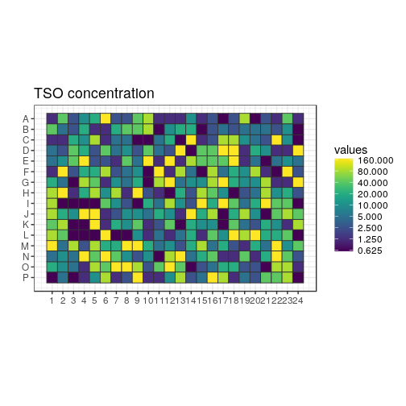
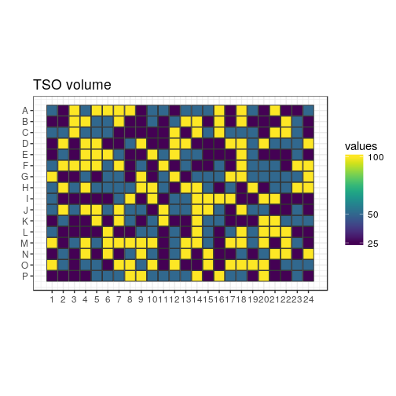
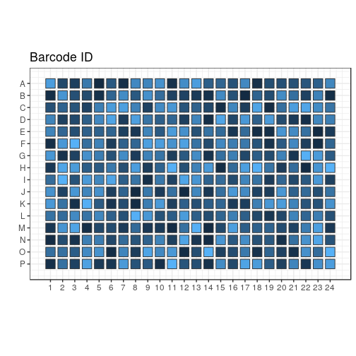
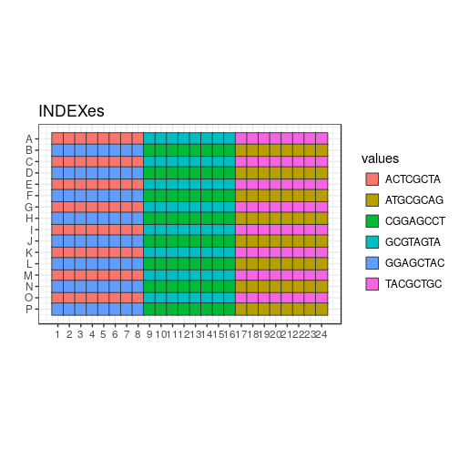
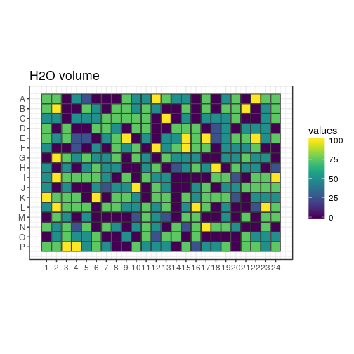
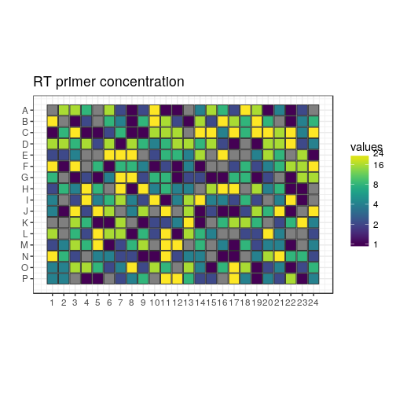
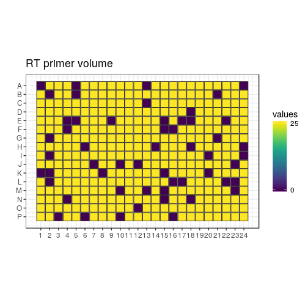
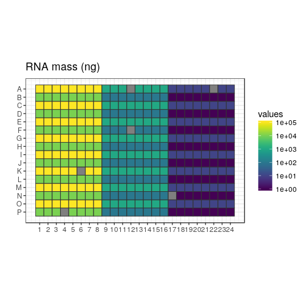
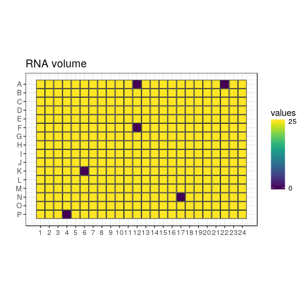

```r
variant <- "c"
newseed <- 3
indexes <- c("ACTCGCTA", "GGAGCTAC", "GCGTAGTA", "CGGAGCCT", "TACGCTGC", "ATGCGCAG")
```


New test of TSO, RT primer and RNA amounts
==========================================

In this design, the TSOs are randomised as much as possible (taking into
account that all do not have the same stock concentrations).

Each 384-well plate is divided in 6 "sextants", interleaved for easier
collection of the reaction products.  Each sextant has a different RNA amount,
and is indexed and amplified independently.  There are 9 × 7 combinations of TSO
and RT primer concentrations, plus one negative control with no RNA.  Each
reaction is assigned to a random well within the sextant.

For each plate replicate, a different random seed is used, to generate
different randomisations.

## Load scripts and libraries.


```r
library("magrittr")   # For its diamond pipe operators
library("ggplot2")    # For plotting
library("platetools") # For defining and manipulating 384-well plates
library("plyr")
library("tibble")     # For comfortable command-line operations

# The set_block function that will become part of platetools
source("https://raw.githubusercontent.com/charles-plessy/platetools/76213accb1704d11a2d96fb1f6284d0b46117778/R/set_block.R")

# Do not load the whole smallCAGEqc package, just get the barcode data.
data("nanoCAGE2017barcodes", package = "smallCAGEqc")
```


Selected TSOs
=============

TSOs are transferred as 1, 2 or 4 drops from 3 different starting
concentrations in the source plate.  Let's call each starting concentration
"Tier_A", "Tier_B" or "Tier_C".  Given constraints on remaining volume, some
TSOs can only be Tier_C, etc.  Let's refer to the TSOs by their numerical
identifier.  Tier_N is a set of barcodes that can be used for the negative
control.  See the file [Labcyte-RT6_TSO_stock_to_source.xls](Labcyte-RT6_TSO_stock_to_source.xls)
for details on the cherrypicking of the TSOs.


```r
Tier_A <- c(  3, 15, 27, 39, 51, 63, 75
           , 10, 22, 34, 46, 58, 70, 82
           , 11, 23, 35, 47, 59, 71, 83)

Tier_B <- c(  1, 13, 25, 37, 49, 61, 73
           ,  2, 14, 26, 38, 50, 62, 74
           ,  7, 19, 31, 43, 55, 67, 79)

Tier_C <- c(  4, 16, 28, 40, 52, 64, 76
           ,  5, 17, 29, 41, 65, 77, 89
           ,  6, 18, 30, 42, 66, 78, 90)

Tier_N <- c(  8, 20, 32, 44, 68, 80, 92)
```

Set Random seed
===============


```r
set.seed(newseed)
```

Creation of sextants
====================


```r
createRandomisedSextant <- function(index, rna) {
  df <- data.frame ( BARCODE_ID = c( sample(Tier_A, 21)
                                   , sample(Tier_B, 21)
                                   , sample(Tier_C, 21)
                                   , sample(Tier_N,  1)))
  tsoMaxConc <- 800
  df$TSO_source <- c( rep(tsoMaxConc /  1, 21)
                    , rep(tsoMaxConc /  8, 21)
                    , rep(tsoMaxConc /  64, 21)
                    , tsoMaxConc / 32)
  df$TSO_vol <- c(rep(c(rep(100,7), rep(50,7), rep(25,7)),3), 25)
  df$TSO <- df$TSO_source * df$TSO_vol / 500
  df$RT_PRIMERS <- c(rep(c(0, 1, 2, 4, 8, 16, 24), 9), 1)
  df$RT_PRIMERS_vol <- 25
  df[df$RT_PRIMERS == 0, "RT_PRIMERS_vol"] <- 0
  df$MASTER_MIX_vol <- 350
  df$INDEX <- index
  df$RNA <- rna
  df$RNA_vol <- 25
  df[64, "RNA_vol"] <- 0
  df$H2O_vol <- 500 - df$RNA_vol - df$RT_PRIMERS_vol - df$TSO_vol - df$MASTER_MIX_vol
  df[sample(nrow(df)),]
}
```


Sextants
========

Plate layout
------------

Create a data frame representing the contents of each well.


```r
plate           <- tibble(well = platetools::num_to_well(1:384, plate = "384"))
plate$row       <- sub("..$", "", plate$well) %>% factor
plate$col       <- sub("^.",  "", plate$well) %>% as.numeric %>% factor
```

Fill sextants
-------------


```r
plate$sxt <- paste0 (
  c(rep("A", 8), rep("B", 8), rep("C", 8)),
  ifelse (plate$row %in% LETTERS[1:8 * 2], 2, 1)
) %>% factor

plate %<>% arrange(sxt)

plate %<>% cbind( rbind( createRandomisedSextant(indexes[1], 1e5)
                       , createRandomisedSextant(indexes[2], 1e4)
                       , createRandomisedSextant(indexes[3], 1e3)
                       , createRandomisedSextant(indexes[4], 1e2)
                       , createRandomisedSextant(indexes[5], 1e1)
                       , createRandomisedSextant(indexes[6], 1e0))
      ) %>% as.tibble()

plate$BARCODE_ID
```

```
##   [1] 78 23 16 55  1 34  5 65 28 41 31 19 59 77 79 61 62 43 27 39 40 42 17 11 74  7 18 70 58 29 67
##  [32] 14 47 90 30 76 64 83 38 52 75 51  6 89 35  8 26  2 10 73 82  4 22 25 13 46 49 50 37 66 71  3
##  [63] 63 15  3 73 28 25  6 42 67 34 62 17 23 38 65 82 14 79  4 75 90 49 61 15 40 43 11 83 77 37 35
##  [94] 55 27 78 71 19 74 63 70 16 41  1 51 47 66 52 64 39 29 89  2 26  7 59 58 22 46 31  5 50 18 80
## [125] 13 10 76 30 63 71  6 68 78 38 42 30 18 66 74 31 40 22  4 64 62 35 77 70 29 51 46 10 61 52 15
## [156] 34 67  7 49 59  5 55 19 83 73 41 47 25 58 76 16 39 28 37 43 14 11 13  2 50 89  1 23 79 82 65
## [187] 75  3 27 90 17 26 70 47 18 19 13  7 66 29 52 39 43 16 63  4 83 22 79 78 71 80 51 25 65 58 15
## [218] 41 89 28 61 76  3 46 55 14 50  1 64 11 49 75 74 30 37 77 38 26 42 59 40 62 17 82 10  2 73 34
## [249] 35  5 90 31 27  6 67 23 65  5 27 28 29 32 39 64 15 82  2 49 78 83 67 52 46  3  4 73 66 50  1
## [280] 13 22 37 25 61 10 89 76 35 63 51 14 43 23 34 75 17 16 59 74 77 62 31 30 71 38 40 41 26 19 58
## [311] 79 11 55  7 42 18  6 70 47 90  1 41 26 67 49 18 61  4 75 39 76 25 13  5 64 59 55 31  7 35 65
## [342] 16  3 42 79 89 52 14 47  2 73 90 66 19 15 74 40 46 27 51 38 23 10 22 62 43 58 28 68 29 34  6
## [373] 50 71 83 30 82 77 37 17 63 11 70 78
```

```r
plate$INDEX %<>% factor
plate$BARCODE_SEQ <- nanoCAGE2017barcodes[plate$BARCODE_ID, "barcodes"]

plate$RNA_level <- plate$RNA %>% factor(labels = paste0("RNA_", LETTERS[1:6]))
plate$RTP_level <- plate$RT_PRIMERS %>% factor(labels = paste0("RTP_", LETTERS[1:7]))
```

Summary
=======


```r
plate 
```

```
## # A tibble: 384 x 18
##    well  row   col   sxt   BARCODE_ID TSO_source TSO_vol    TSO RT_PRIMERS RT_PRIMERS_vol
##  * <chr> <fct> <fct> <fct>      <dbl>      <dbl>   <dbl>  <dbl>      <dbl>          <dbl>
##  1 A01   A     1     A1           78.       12.5     50.   1.25         0.             0.
##  2 A02   A     2     A1           23.      800.      25.  40.0         16.            25.
##  3 A03   A     3     A1           16.       12.5    100.   2.50        16.            25.
##  4 A04   A     4     A1           55.      100.      50.  10.0          8.            25.
##  5 A05   A     5     A1            1.      100.     100.  20.0          0.             0.
##  6 A06   A     6     A1           34.      800.     100. 160.          16.            25.
##  7 A07   A     7     A1            5.       12.5    100.   2.50         2.            25.
##  8 A08   A     8     A1           65.       12.5    100.   2.50         1.            25.
##  9 C01   C     1     A1           28.       12.5     50.   1.25         1.            25.
## 10 C02   C     2     A1           41.       12.5     50.   1.25         8.            25.
## # ... with 374 more rows, and 8 more variables: MASTER_MIX_vol <dbl>, INDEX <fct>, RNA <dbl>,
## #   RNA_vol <dbl>, H2O_vol <dbl>, BARCODE_SEQ <chr>, RNA_level <fct>, RTP_level <fct>
```

```r
summary(plate)
```

```
##      well                row           col      sxt       BARCODE_ID     TSO_source   
##  Length:384         A      : 24   1      : 16   A1:64   Min.   : 1.0   Min.   : 12.5  
##  Class :character   B      : 24   2      : 16   A2:64   1st Qu.:19.0   1st Qu.: 12.5  
##  Mode  :character   C      : 24   3      : 16   B1:64   Median :41.0   Median :100.0  
##                     D      : 24   4      : 16   B2:64   Mean   :42.8   Mean   :299.8  
##                     E      : 24   5      : 16   C1:64   3rd Qu.:65.0   3rd Qu.:800.0  
##                     F      : 24   6      : 16   C2:64   Max.   :90.0   Max.   :800.0  
##                     (Other):240   (Other):288                                         
##     TSO_vol            TSO            RT_PRIMERS    RT_PRIMERS_vol  MASTER_MIX_vol      INDEX   
##  Min.   : 25.00   Min.   :  0.625   Min.   : 0.00   Min.   : 0.00   Min.   :350    ACTCGCTA:64  
##  1st Qu.: 25.00   1st Qu.:  2.500   1st Qu.: 1.00   1st Qu.:25.00   1st Qu.:350    ATGCGCAG:64  
##  Median : 50.00   Median : 10.000   Median : 4.00   Median :25.00   Median :350    CGGAGCCT:64  
##  Mean   : 57.81   Mean   : 34.951   Mean   : 7.75   Mean   :21.48   Mean   :350    GCGTAGTA:64  
##  3rd Qu.:100.00   3rd Qu.: 40.000   3rd Qu.:16.00   3rd Qu.:25.00   3rd Qu.:350    GGAGCTAC:64  
##  Max.   :100.00   Max.   :160.000   Max.   :24.00   Max.   :25.00   Max.   :350    TACGCTGC:64  
##                                                                                                 
##       RNA            RNA_vol         H2O_vol       BARCODE_SEQ        RNA_level  RTP_level 
##  Min.   :     1   Min.   : 0.00   Min.   :  0.00   Length:384         RNA_A:64   RTP_A:54  
##  1st Qu.:    10   1st Qu.:25.00   1st Qu.:  0.00   Class :character   RNA_B:64   RTP_B:60  
##  Median :   550   Median :25.00   Median : 50.00   Mode  :character   RNA_C:64   RTP_C:54  
##  Mean   : 18518   Mean   :24.61   Mean   : 46.09                      RNA_D:64   RTP_D:54  
##  3rd Qu.: 10000   3rd Qu.:25.00   3rd Qu.: 75.00                      RNA_E:64   RTP_E:54  
##  Max.   :100000   Max.   :25.00   Max.   :100.00                      RNA_F:64   RTP_F:54  
##                                                                                  RTP_G:54
```

```r
write.table(plate, paste0("plate6", variant, ".txt"), sep = "\t", quote = FALSE, row.names = FALSE)
```

Plate maps
==========


```r
plateMap <- function(x, title) {
  platetools::raw_map(plate[[x]], well=plate$well, plate="384") +
  ggtitle(title) +
  viridis::scale_fill_viridis(breaks = unique(plate[[x]]))
}

plateMapLog <- function(x, title) {
  platetools::raw_map(plate[[x]], well=plate$well, plate="384") +
  ggtitle(title) +
  viridis::scale_fill_viridis(breaks = unique(plate[[x]]), trans = "log")
}
```

TSO
---


```r
(plot_TSO <- plateMapLog("TSO", "TSO concentration"))
```

<!-- -->


```r
(plot_TSO_vol <- plateMap("TSO_vol", "TSO volume"))
```

<!-- -->


```r
(plot_BARCODES <- platetools::raw_map(plate[["BARCODE_ID"]], well=plate$well, plate="384") +
  ggtitle("Barcode ID")) + theme(legend.position="none")
```

<!-- -->

Indexes
-------


```r
(plot_indexes <- platetools::raw_map(plate[["INDEX"]], well=plate$well, plate="384") +
  ggtitle("INDEXes"))
```

<!-- -->

H2O
---


```r
(plot_H2O_vol <- plateMap("H2O_vol", "H2O volume"))
```

<!-- -->

RT primers
----------


```r
(plot_RT <- plateMapLog("RT_PRIMERS", "RT primer concentration"))
```

```
## Warning: Transformation introduced infinite values in discrete y-axis
```

<!-- -->


```r
(plot_RT_vol <- plateMap("RT_PRIMERS_vol", "RT primer volume"))
```

<!-- -->

RNA mass
--------


```r
(plot_RNA <- plateMapLog("RNA", "RNA mass (ng)"))
```

<!-- -->


```r
(plot_RNA_vol <- plateMap("RNA_vol", "RNA volume"))
```

<!-- -->


Transfer file
=============

## Source plate layout

### TSO


```r
nanoCAGE2017barcodes$well <- unlist(lapply(LETTERS[1:8], function(x) paste(x, sprintf("%02d", 1:12), sep = "")))

tso_block <- data.frame( id  = c(Tier_A, Tier_B, Tier_C, Tier_N)
                       , row = unlist(lapply(LETTERS[1:10], rep, 7))
                       , col = rep(1:7, 10))

tso_block$well <- paste0(tso_block$row, "0", tso_block$col)

tso_block$barcodes <- nanoCAGE2017barcodes[tso_block$id, "barcodes"]

source <- tibble(well = platetools::num_to_well(1:384, plate = "384"))

for (n in 1:nrow(tso_block))
  source %<>% set_block( tso_block[n,"well"]
                       , tso_block[n,"barcodes"]
                       , 20000)
```

### Water


```r
source %<>% set_block("M01~M06", "H2O", 20000)
```

### RNA


```r
levels(plate$RNA %>% factor)
```

```
## [1] "1"     "10"    "100"   "1000"  "10000" "1e+05"
```

```r
levels(plate$RNA_level)
```

```
## [1] "RNA_A" "RNA_B" "RNA_C" "RNA_D" "RNA_E" "RNA_F"
```

```r
source %<>% set_block("L01", "RNA_F", 20000)
source %<>% set_block("L02", "RNA_E", 20000)
source %<>% set_block("L03", "RNA_D", 20000)
source %<>% set_block("L04", "RNA_C", 20000)
source %<>% set_block("L05", "RNA_B", 20000)
source %<>% set_block("L06", "RNA_A", 20000)
```

### RNA


```r
levels(plate$RT_PRIMERS %>% factor)
```

```
## [1] "0"  "1"  "2"  "4"  "8"  "16" "24"
```

```r
levels(plate$RTP_level)
```

```
## [1] "RTP_A" "RTP_B" "RTP_C" "RTP_D" "RTP_E" "RTP_F" "RTP_G"
```

```r
source %<>% set_block("K01", "RTP_A", 20000)
source %<>% set_block("K02", "RTP_B", 20000)
source %<>% set_block("K03", "RTP_C", 20000)
source %<>% set_block("K04", "RTP_D", 20000)
source %<>% set_block("K05", "RTP_E", 20000)
source %<>% set_block("K06", "RTP_F", 20000)
source %<>% set_block("K07", "RTP_G", 20000)
```

## Plan plate


```r
planPlate <- tibble(well = platetools::num_to_well(1:384, plate = "384"))

for (n in 1:nrow(plate)) {
  planPlate %<>% set_block( plate[[n,"well"]]
                          , plate[[n,"BARCODE_SEQ"]] %>% as.character
                          , plate[[n,"TSO_vol"]])
  planPlate %<>% set_block( plate[[n,"well"]]
                          , "H2O"
                          , plate[[n,"H2O_vol"]])
  planPlate %<>% set_block( plate[[n,"well"]]
                          , plate[[n,"RTP_level"]] %>% as.character
                          , plate[[n,"RT_PRIMERS_vol"]])
  planPlate %<>% set_block( plate[[n,"well"]]
                          , plate[[n,"RNA_level"]] %>% as.character
                          , plate[[n,"RNA_vol"]])
}
planPlate %<>% replace( . == 0, NA)
```

## Plan transfer


```r
source("plates.R")
```

```
## Creating a generic function for 'colnames' from package 'base' in the global environment
```

```r
source("echo.R")

planPlate   <- Plate(plate = planPlate)
sourcePlate <- Plate(plate = source)
destPlate   <- Plate(plate = tibble::tibble(well = num_to_well(1:384, plate = "384")))

echo <- planTransfers(sourcePlate, destPlate, planPlate)
echo
```

```
## A 525 Echo machine:
##   Source plate:      A Plate with data about 384 wells (dead volume: 10000; max volume: 1e+05).
##   Destination plate: A Plate with data about 384 wells (dead volume: 10000; max volume: 1e+05).
## Transducer at the following coordinates:
##   Source:      L06 (384-well format)
##   Destination: P24 (384-well format)
## 1368 elements in the log.
```

```r
transfers <- as.data.frame(echo %>% showLogs)
transfers <- transfers[order(transfers$from),]

colnames(transfers) <- c("Source well", "Destination well", "Transfer volume", "what")

transfers
```

```
##      Source well Destination well Transfer volume   what
## 1031         A01              B01              25 ACACTC
## 1032         A01              E18             100 ACACTC
## 1033         A01              F23             100 ACACTC
## 1034         A01              H15              50 ACACTC
## 1035         A01              O06              25 ACACTC
## 1036         A01              O12             100 ACACTC
## 1043         A02              C17              50 AGTCTC
## 1044         A02              F06              50 AGTCTC
## 1045         A02              G11              50 AGTCTC
## 1046         A02              H09             100 AGTCTC
## 1047         A02              J19              50 AGTCTC
## 1048         A02              O08             100 AGTCTC
## 724          A03              A19              50 ATCTGA
## 725          A03              E03              25 ATCTGA
## 726          A03              H07              50 ATCTGA
## 727          A03              J23              50 ATCTGA
## 728          A03              O13              25 ATCTGA
## 729          A03              P13              50 ATCTGA
## 784          A04              A23              25 CGACTC
## 785          A04              D10              25 CGACTC
## 786          A04              D18             100 CGACTC
## 787          A04              E04             100 CGACTC
## 788          A04              K12              25 CGACTC
## 789          A04              L06             100 CGACTC
## 916          A05              E14              50 CTGCTC
## 917          A05              F13              50 CTGCTC
## 918          A05              I18              25 CTGCTC
## 919          A05              J24              25 CTGCTC
## 920          A05              K02              50 CTGCTC
## 921          A05              L01              50 CTGCTC
## 1037         A06              A09              25 GAGTGA
## 1038         A06              D13             100 GAGTGA
## 1039         A06              I17             100 GAGTGA
## 1040         A06              J04             100 GAGTGA
## 1041         A06              O07             100 GAGTGA
## 1042         A06              P21              25 GAGTGA
## 910          A07              D17             100 GTACTC
## 911          A07              F02             100 GTACTC
## 912          A07              I23              25 GTACTC
## 913          A07              J16              50 GTACTC
## 914          A07              K01              25 GTACTC
## 915          A07              O11              25 GTACTC
## 953          B01              E16              25 AGTACG
## 954          B01              G21              50 AGTACG
## 955          B01              L19              50 AGTACG
## 956          B01              M01             100 AGTACG
## 957          B01              N13             100 AGTACG
## 958          B01              P06              50 AGTACG
## 977          B02              C14             100 ATCGAT
## 978          B02              D16              25 ATCGAT
## 979          B02              G17             100 ATCGAT
## 980          B02              L20             100 ATCGAT
## 981          B02              M05              50 ATCGAT
## 982          B02              N06             100 ATCGAT
## 478          B03              A06             100 CACTAC
## 479          B03              B08              25 CACTAC
## 480          B03              G12             100 CACTAC
## 481          B03              I22              25 CACTAC
## 482          B03              N16              25 CACTAC
## 483          B03              N19              25 CACTAC
## 995          B04              E15              25 CTGACG
## 996          B04              E17              25 CTGACG
## 997          B04              H16              25 CTGACG
## 998          B04              J22              25 CTGACG
## 999          B04              M08             100 CTGACG
## 1000         B04              N07              25 CTGACG
## 838          B05              F16              50 GAGCAG
## 839          B05              G05              25 GAGCAG
## 840          B05              K09              25 GAGCAG
## 841          B05              L23              25 GAGCAG
## 842          B05              M22             100 GAGCAG
## 843          B05              N05              25 GAGCAG
## 832          B06              B09              25 GCTGAT
## 833          B06              E12             100 GCTGAT
## 834          B06              G04              50 GCTGAT
## 835          B06              J05             100 GCTGAT
## 836          B06              O22              50 GCTGAT
## 837          B06              P23              50 GCTGAT
## 965          B07              C18              50 TATACG
## 966          B07              D06              25 TATACG
## 967          B07              M03              50 TATACG
## 968          B07              N12              50 TATACG
## 969          B07              O09              50 TATACG
## 970          B07              P17              50 TATACG
## 808          C01              E08              25 AGTAGC
## 809          C01              H01              50 AGTAGC
## 810          C01              J14             100 AGTAGC
## 811          C01              M09             100 AGTAGC
## 812          C01              M24              25 AGTAGC
## 813          C01              P22              25 AGTAGC
## 346          C02              A02              25 ATCGCA
## 347          C02              D03              25 ATCGCA
## 348          C02              I21             100 ATCGCA
## 349          C02              L18             100 ATCGCA
## 350          C02              M15              50 ATCGCA
## 351          C02              P16             100 ATCGCA
## 934          C03              E10             100 CACTCT
## 935          C03              F20              50 CACTCT
## 936          C03              G24             100 CACTCT
## 937          C03              H05              50 CACTCT
## 938          C03              K05             100 CACTCT
## 939          C03              P09             100 CACTCT
## 862          C04              B10              50 CTGAGC
## 863          C04              H21              50 CTGAGC
## 864          C04              I01              50 CTGAGC
## 865          C04              I15             100 CTGAGC
## 866          C04              L02              25 CTGAGC
## 867          C04              O23              50 CTGAGC
## 688          C05              C05              50 GAGCGT
## 689          C05              D24             100 GAGCGT
## 690          C05              G16              50 GAGCGT
## 691          C05              K18              25 GAGCGT
## 692          C05              L16              25 GAGCGT
## 693          C05              N04             100 GAGCGT
## 1025         C06              A10              50 GCTGCA
## 1026         C06              F11             100 GCTGCA
## 1027         C06              J01              50 GCTGCA
## 1028         C06              K24              50 GCTGCA
## 1029         C06              N22             100 GCTGCA
## 1030         C06              O05              50 GCTGCA
## 892          C07              C22             100 TATAGC
## 893          C07              D15              25 TATAGC
## 894          C07              H02             100 TATAGC
## 895          C07              I06              25 TATAGC
## 896          C07              I12              50 TATAGC
## 897          C07              N23              25 TATAGC
## 472          D01              A05             100 ACACAG
## 473          D01              B17              25 ACACAG
## 474          D01              E23              50 ACACAG
## 475          D01              J08              50 ACACAG
## 476          D01              J12              50 ACACAG
## 477          D01              M14             100 ACACAG
## 989          D02              B13             100 AGTCAG
## 990          D02              D21              50 AGTCAG
## 991          D02              E24              25 AGTCAG
## 992          D02              M07             100 AGTCAG
## 993          D02              M10             100 AGTCAG
## 994          D02              P05              50 AGTCAG
## 983          D03              B04             100 ATCTAC
## 984          D03              D20             100 ATCTAC
## 985          D03              F14              25 ATCTAC
## 986          D03              G19              50 ATCTAC
## 987          D03              I16             100 ATCTAC
## 988          D03              M06             100 ATCTAC
## 1013         D04              G18             100 CGACAG
## 1014         D04              H04             100 CGACAG
## 1015         D04              K14             100 CGACAG
## 1016         D04              L11              25 CGACAG
## 1017         D04              O03              25 CGACAG
## 1018         D04              P19              25 CGACAG
## 1001         D05              B21              25 CTGCAG
## 1002         D05              C20              25 CTGCAG
## 1003         D05              F04             100 CTGCAG
## 1004         D05              G15              50 CTGCAG
## 1005         D05              J15             100 CTGCAG
## 1006         D05              O01             100 CTGCAG
## 706          D06              B23              50 GAGTAC
## 707          D06              C08              25 GAGTAC
## 708          D06              F05             100 GAGTAC
## 709          D06              G09             100 GAGTAC
## 710          D06              G20              50 GAGTAC
## 711          D06              H13             100 GAGTAC
## 959          D07              B02              25 GTACAG
## 960          D07              E20              25 GTACAG
## 961          D07              H23             100 GTACAG
## 962          D07              I13              50 GTACAG
## 963          D07              M02              25 GTACAG
## 964          D07              N15             100 GTACAG
## 947          E01              C19              50 ACACGT
## 948          E01              H22              50 ACACGT
## 949          E01              K08              50 ACACGT
## 950          E01              M11              25 ACACGT
## 951          E01              N01              25 ACACGT
## 952          E01              N14              25 ACACGT
## 856          E02              D07              25 AGTCGT
## 857          E02              G08              25 AGTCGT
## 858          E02              H20              25 AGTCGT
## 859          E02              I19              25 AGTCGT
## 860          E02              J10              25 AGTCGT
## 861          E02              K16              50 AGTCGT
## 941          E03              B19              25 ATCTCT
## 942          E03              K07             100 ATCTCT
## 943          E03              L14             100 ATCTCT
## 944          E03              M20             100 ATCTCT
## 945          E03              N02              50 ATCTCT
## 946          E03              O16              25 ATCTCT
## 898          E04              A14              50 CGACGT
## 899          E04              D04             100 CGACGT
## 900          E04              I07              50 CGACGT
## 901          E04              L13              25 CGACGT
## 902          E04              L17              50 CGACGT
## 903          E04              M17             100 CGACGT
## 1007         E05              E22              25 CTGCGT
## 1008         E05              J11             100 CTGCGT
## 1009         E05              M12              50 CTGCGT
## 1010         E05              N21             100 CTGCGT
## 1011         E05              O02              50 CTGCGT
## 1012         E05              P02              25 CTGCGT
## 712          E06              D01              25 GAGTCT
## 713          E06              E01              25 GAGTCT
## 714          E06              E09              25 GAGTCT
## 715          E06              K21             100 GAGTCT
## 716          E06              L21             100 GAGTCT
## 717          E06              N10              50 GAGTCT
## 814          E07              C11              25 GTACGT
## 815          E07              G01             100 GTACGT
## 816          E07              J03              50 GTACGT
## 817          E07              J20              50 GTACGT
## 818          E07              K19              25 GTACGT
## 819          E07              L09              50 GTACGT
## 820          F01              B14             100 ACATAC
## 821          F01              F19              50 ACATAC
## 822          F01              G02              25 ACATAC
## 823          F01              G14              50 ACATAC
## 824          F01              N03              25 ACATAC
## 825          F01              O18             100 ACATAC
## 682          F02              B12              50 ATCACG
## 683          F02              C04              50 ATCACG
## 684          F02              I11              25 ATCACG
## 685          F02              J02             100 ATCACG
## 686          F02              J18             100 ATCACG
## 687          F02              M21              25 ATCACG
## 622          F03              C03             100 CACGAT
## 623          F03              C12             100 CACGAT
## 624          F03              F18             100 CACGAT
## 625          F03              K22              50 CACGAT
## 626          F03              N08              50 CACGAT
## 627          F03              P12              50 CACGAT
## 718          F04              D11              25 CGATAC
## 719          F04              E02              50 CGATAC
## 720          F04              F08              25 CGATAC
## 721          F04              I20             100 CGATAC
## 722          F04              K15              50 CGATAC
## 723          F04              L22             100 CGATAC
## 412          F05              A04              50 GAGACG
## 413          F05              F17              25 GAGACG
## 414          F05              H06              50 GAGACG
## 415          F05              I10             100 GAGACG
## 416          F05              J09              50 GAGACG
## 417          F05              O17             100 GAGACG
## 850          F06              B07             100 GCTCAG
## 851          F06              B20              25 GCTCAG
## 852          F06              C23              50 GCTCAG
## 853          F06              G07              50 GCTCAG
## 854          F06              G13              25 GCTCAG
## 855          F06              P15              25 GCTCAG
## 700          F07              C07              25 GTATAC
## 701          F07              D08              50 GTATAC
## 702          F07              F09              50 GTATAC
## 703          F07              H17              50 GTATAC
## 704          F07              M16              25 GTATAC
## 705          F07              M23              50 GTATAC
## 971          G01              B24              25 ACAGAT
## 972          G01              C15              50 ACAGAT
## 973          G01              D14              25 ACAGAT
## 974          G01              E19              50 ACAGAT
## 975          G01              F01              50 ACAGAT
## 976          G01              M04             100 ACAGAT
## 406          G02              A03             100 AGTGAT
## 407          G02              D12             100 AGTGAT
## 408          G02              F22              25 AGTGAT
## 409          G02              J06              50 AGTGAT
## 410          G02              K11             100 AGTGAT
## 411          G02              K17              25 AGTGAT
## 610          G03              A20              25 CACACG
## 611          G03              B03             100 CACACG
## 612          G03              C01              50 CACACG
## 613          G03              H12              25 CACACG
## 614          G03              K13              25 CACACG
## 615          G03              L24              25 CACACG
## 790          G04              C13              25 CGAGAT
## 791          G04              E05             100 CGAGAT
## 792          G04              F07             100 CGAGAT
## 793          G04              J21              25 CGAGAT
## 794          G04              M18             100 CGAGAT
## 795          G04              N09             100 CGAGAT
## 904          G05              C24              25 CTGTAC
## 905          G05              D09             100 CTGTAC
## 906          G05              G10              25 CTGTAC
## 907          G05              H19             100 CTGTAC
## 908          G05              I08             100 CTGTAC
## 909          G05              L04              25 CTGTAC
## 886          G06              A24              50 GCTACG
## 887          G06              C16             100 GCTACG
## 888          G06              D23              50 GCTACG
## 889          G06              I05              25 GCTACG
## 890          G06              J13              50 GCTACG
## 891          G06              L05              25 GCTACG
## 880          G07              D19              50 GTAGAT
## 881          G07              G23              50 GTAGAT
## 882          G07              H14             100 GTAGAT
## 883          G07              I04              25 GTAGAT
## 884          G07              K10              50 GTAGAT
## 885          G07              P07              50 GTAGAT
## 484          H01              A07             100 ACAGCA
## 485          H01              A18             100 ACAGCA
## 486          H01              D22              50 ACAGCA
## 487          H01              I09              25 ACAGCA
## 488          H01              P01              25 ACAGCA
## 489          H01              P10              50 ACAGCA
## 802          H02              D02             100 AGTGCA
## 803          H02              E07              50 AGTGCA
## 804          H02              I24              25 AGTGCA
## 805          H02              N11              25 AGTGCA
## 806          H02              O15             100 AGTGCA
## 807          H02              P20             100 AGTGCA
## 844          H03              A21             100 CACAGC
## 845          H03              B16             100 CACAGC
## 846          H03              E13              50 CACAGC
## 847          H03              G06              50 CACAGC
## 848          H03              L07              25 CACAGC
## 849          H03              N18              50 CACAGC
## 616          H04              B18             100 CGAGCA
## 617          H04              C02              50 CGAGCA
## 618          H04              H10             100 CGAGCA
## 619          H04              I14             100 CGAGCA
## 620          H04              J07             100 CGAGCA
## 621          H04              M19              50 CGAGCA
## 544          H05              A08             100 GCTAGC
## 545          H05              A17              25 GCTAGC
## 546          H05              D05             100 GCTAGC
## 547          H05              F15              25 GCTAGC
## 548          H05              F21              50 GCTAGC
## 549          H05              O10             100 GCTAGC
## 694          H06              C06              50 GTAGCA
## 695          H06              E11              50 GTAGCA
## 696          H06              H03              50 GTAGCA
## 697          H06              K20             100 GTAGCA
## 698          H06              L12              50 GTAGCA
## 699          H06              P18              50 GTAGCA
## 928          H07              G22              50 TATGCA
## 929          H07              H11              50 TATGCA
## 930          H07              H18              25 TATGCA
## 931          H07              K04              25 TATGCA
## 932          H07              L08              25 TATGCA
## 933          H07              M13             100 TATGCA
## 922          I01              A11              50 ACAGTG
## 923          I01              B05              50 ACAGTG
## 924          I01              K03              25 ACAGTG
## 925          I01              N20              50 ACAGTG
## 926          I01              O21              25 ACAGTG
## 927          I01              P14             100 ACAGTG
## 826          I02              B11              25 AGTGTG
## 827          I02              B22             100 AGTGTG
## 828          I02              C09              25 AGTGTG
## 829          I02              G03              25 AGTGTG
## 830          I02              O20             100 AGTGTG
## 831          I02              P03              25 AGTGTG
## 874          I03              A16             100 CACATA
## 875          I03              I03              25 CACATA
## 876          I03              K23              50 CACATA
## 877          I03              L10              50 CACATA
## 878          I03              N24             100 CACATA
## 879          I03              P08             100 CACATA
## 796          I04              A15              50 CGAGTG
## 797          I04              B06              50 CGAGTG
## 798          I04              E06             100 CGAGTG
## 799          I04              F24             100 CGAGTG
## 800          I04              L15              50 CGAGTG
## 801          I04              O19             100 CGAGTG
## 1019         I05              B15              25 GCTATA
## 1020         I05              C10              25 GCTATA
## 1021         I05              E21              25 GCTATA
## 1022         I05              J17              25 GCTATA
## 1023         I05              L03              25 GCTATA
## 1024         I05              O04              50 GCTATA
## 1            I06              A01              50 GTAGTG
## 2            I06              A13              50 GTAGTG
## 3            I06              C21             100 GTAGTG
## 4            I06              F10              25 GTAGTG
## 5            I06              H08              50 GTAGTG
## 6            I06              P24              25 GTAGTG
## 868          I07              F03             100 TATGTG
## 869          I07              H24             100 TATGTG
## 870          I07              I02              25 TATGTG
## 871          I07              O14              25 TATGTG
## 872          I07              O24              50 TATGTG
## 873          I07              P11              50 TATGTG
## 940          J01              K06              25 ACATCT
## 1305         J03              A22              25 CACGCA
## 1177         J05              A12              25 GCTCGT
## 1178         J05              N17              25 GCTCGT
## 1112         J06              F12              25 GTATCT
## 1113         J06              P04              25 GTATCT
## 550          K02              A08              25  RTP_B
## 551          K02              A11              25  RTP_B
## 552          K02              A12              25  RTP_B
## 553          K02              A20              25  RTP_B
## 554          K02              A22              25  RTP_B
## 555          K02              B03              25  RTP_B
## 556          K02              B08              25  RTP_B
## 557          K02              B13              25  RTP_B
## 558          K02              B22              25  RTP_B
## 559          K02              C01              25  RTP_B
## 560          K02              C04              25  RTP_B
## 561          K02              C05              25  RTP_B
## 562          K02              C08              25  RTP_B
## 563          K02              C09              25  RTP_B
## 564          K02              D07              25  RTP_B
## 565          K02              D17              25  RTP_B
## 566          K02              D19              25  RTP_B
## 567          K02              E24              25  RTP_B
## 568          K02              F02              25  RTP_B
## 569          K02              F06              25  RTP_B
## 570          K02              F10              25  RTP_B
## 571          K02              F12              25  RTP_B
## 572          K02              F14              25  RTP_B
## 573          K02              G03              25  RTP_B
## 574          K02              G05              25  RTP_B
## 575          K02              G12              25  RTP_B
## 576          K02              G15              25  RTP_B
## 577          K02              G16              25  RTP_B
## 578          K02              G19              25  RTP_B
## 579          K02              G22              25  RTP_B
## 580          K02              H08              25  RTP_B
## 581          K02              H22              25  RTP_B
## 582          K02              H23              25  RTP_B
## 583          K02              I11              25  RTP_B
## 584          K02              I23              25  RTP_B
## 585          K02              J02              25  RTP_B
## 586          K02              J14              25  RTP_B
## 587          K02              J16              25  RTP_B
## 588          K02              J17              25  RTP_B
## 589          K02              J22              25  RTP_B
## 590          K02              K05              25  RTP_B
## 591          K02              K06              25  RTP_B
## 592          K02              K09              25  RTP_B
## 593          K02              K14              25  RTP_B
## 594          K02              L08              25  RTP_B
## 595          K02              L12              25  RTP_B
## 596          K02              M06              25  RTP_B
## 597          K02              M17              25  RTP_B
## 598          K02              M22              25  RTP_B
## 599          K02              N09              25  RTP_B
## 600          K02              N10              25  RTP_B
## 601          K02              N16              25  RTP_B
## 602          K02              N17              25  RTP_B
## 603          K02              O15              25  RTP_B
## 604          K02              O19              25  RTP_B
## 605          K02              O22              25  RTP_B
## 606          K02              P04              25  RTP_B
## 607          K02              P05              25  RTP_B
## 608          K02              P19              25  RTP_B
## 609          K02              P23              25  RTP_B
## 490          K03              A07              25  RTP_C
## 491          K03              A09              25  RTP_C
## 492          K03              A17              25  RTP_C
## 493          K03              A23              25  RTP_C
## 494          K03              B04              25  RTP_C
## 495          K03              B12              25  RTP_C
## 496          K03              B15              25  RTP_C
## 497          K03              C06              25  RTP_C
## 498          K03              D05              25  RTP_C
## 499          K03              D16              25  RTP_C
## 500          K03              D23              25  RTP_C
## 501          K03              E01              25  RTP_C
## 502          K03              E02              25  RTP_C
## 503          K03              E10              25  RTP_C
## 504          K03              F11              25  RTP_C
## 505          K03              F17              25  RTP_C
## 506          K03              F19              25  RTP_C
## 507          K03              G04              25  RTP_C
## 508          K03              G09              25  RTP_C
## 509          K03              G13              25  RTP_C
## 510          K03              G14              25  RTP_C
## 511          K03              G20              25  RTP_C
## 512          K03              H01              25  RTP_C
## 513          K03              I03              25  RTP_C
## 514          K03              I09              25  RTP_C
## 515          K03              I17              25  RTP_C
## 516          K03              I19              25  RTP_C
## 517          K03              J04              25  RTP_C
## 518          K03              J15              25  RTP_C
## 519          K03              J18              25  RTP_C
## 520          K03              K10              25  RTP_C
## 521          K03              K11              25  RTP_C
## 522          K03              K21              25  RTP_C
## 523          K03              L04              25  RTP_C
## 524          K03              L10              25  RTP_C
## 525          K03              L18              25  RTP_C
## 526          K03              L19              25  RTP_C
## 527          K03              L24              25  RTP_C
## 528          K03              M01              25  RTP_C
## 529          K03              M07              25  RTP_C
## 530          K03              M19              25  RTP_C
## 531          K03              N03              25  RTP_C
## 532          K03              N07              25  RTP_C
## 533          K03              N08              25  RTP_C
## 534          K03              N12              25  RTP_C
## 535          K03              N24              25  RTP_C
## 536          K03              O06              25  RTP_C
## 537          K03              O09              25  RTP_C
## 538          K03              O20              25  RTP_C
## 539          K03              O23              25  RTP_C
## 540          K03              P07              25  RTP_C
## 541          K03              P14              25  RTP_C
## 542          K03              P15              25  RTP_C
## 543          K03              P21              25  RTP_C
## 730          K04              A14              25  RTP_D
## 731          K04              A21              25  RTP_D
## 732          K04              B07              25  RTP_D
## 733          K04              B23              25  RTP_D
## 734          K04              C16              25  RTP_D
## 735          K04              C23              25  RTP_D
## 736          K04              D10              25  RTP_D
## 737          K04              D24              25  RTP_D
## 738          K04              E03              25  RTP_D
## 739          K04              E13              25  RTP_D
## 740          K04              E19              25  RTP_D
## 741          K04              F09              25  RTP_D
## 742          K04              F13              25  RTP_D
## 743          K04              F20              25  RTP_D
## 744          K04              G06              25  RTP_D
## 745          K04              H03              25  RTP_D
## 746          K04              H10              25  RTP_D
## 747          K04              H12              25  RTP_D
## 748          K04              H13              25  RTP_D
## 749          K04              H20              25  RTP_D
## 750          K04              I01              25  RTP_D
## 751          K04              I05              25  RTP_D
## 752          K04              I08              25  RTP_D
## 753          K04              I12              25  RTP_D
## 754          K04              I15              25  RTP_D
## 755          K04              I16              25  RTP_D
## 756          K04              I21              25  RTP_D
## 757          K04              J01              25  RTP_D
## 758          K04              J08              25  RTP_D
## 759          K04              K12              25  RTP_D
## 760          K04              K24              25  RTP_D
## 761          K04              L15              25  RTP_D
## 762          K04              L21              25  RTP_D
## 763          K04              M02              25  RTP_D
## 764          K04              M16              25  RTP_D
## 765          K04              M20              25  RTP_D
## 766          K04              M21              25  RTP_D
## 767          K04              M24              25  RTP_D
## 768          K04              N05              25  RTP_D
## 769          K04              N06              25  RTP_D
## 770          K04              N13              25  RTP_D
## 771          K04              N14              25  RTP_D
## 772          K04              N19              25  RTP_D
## 773          K04              O01              25  RTP_D
## 774          K04              O02              25  RTP_D
## 775          K04              O07              25  RTP_D
## 776          K04              O14              25  RTP_D
## 777          K04              O21              25  RTP_D
## 778          K04              P01              25  RTP_D
## 779          K04              P02              25  RTP_D
## 780          K04              P08              25  RTP_D
## 781          K04              P18              25  RTP_D
## 782          K04              P20              25  RTP_D
## 783          K04              P24              25  RTP_D
## 418          K05              A04              25  RTP_E
## 419          K05              A16              25  RTP_E
## 420          K05              B06              25  RTP_E
## 421          K05              B09              25  RTP_E
## 422          K05              B18              25  RTP_E
## 423          K05              B20              25  RTP_E
## 424          K05              B24              25  RTP_E
## 425          K05              C02              25  RTP_E
## 426          K05              C07              25  RTP_E
## 427          K05              C18              25  RTP_E
## 428          K05              D03              25  RTP_E
## 429          K05              D09              25  RTP_E
## 430          K05              D11              25  RTP_E
## 431          K05              D14              25  RTP_E
## 432          K05              E11              25  RTP_E
## 433          K05              E12              25  RTP_E
## 434          K05              E21              25  RTP_E
## 435          K05              F05              25  RTP_E
## 436          K05              F07              25  RTP_E
## 437          K05              F08              25  RTP_E
## 438          K05              F18              25  RTP_E
## 439          K05              F21              25  RTP_E
## 440          K05              G01              25  RTP_E
## 441          K05              G10              25  RTP_E
## 442          K05              G11              25  RTP_E
## 443          K05              G17              25  RTP_E
## 444          K05              G18              25  RTP_E
## 445          K05              H02              25  RTP_E
## 446          K05              H05              25  RTP_E
## 447          K05              H11              25  RTP_E
## 448          K05              H21              25  RTP_E
## 449          K05              I06              25  RTP_E
## 450          K05              I18              25  RTP_E
## 451          K05              J20              25  RTP_E
## 452          K05              K04              25  RTP_E
## 453          K05              K16              25  RTP_E
## 454          K05              K19              25  RTP_E
## 455          K05              K22              25  RTP_E
## 456          K05              L03              25  RTP_E
## 457          K05              L09              25  RTP_E
## 458          K05              L14              25  RTP_E
## 459          K05              M04              25  RTP_E
## 460          K05              M08              25  RTP_E
## 461          K05              M14              25  RTP_E
## 462          K05              M18              25  RTP_E
## 463          K05              N02              25  RTP_E
## 464          K05              N22              25  RTP_E
## 465          K05              N23              25  RTP_E
## 466          K05              O05              25  RTP_E
## 467          K05              O11              25  RTP_E
## 468          K05              O16              25  RTP_E
## 469          K05              O24              25  RTP_E
## 470          K05              P09              25  RTP_E
## 471          K05              P13              25  RTP_E
## 352          K06              A02              25  RTP_F
## 353          K06              A03              25  RTP_F
## 354          K06              A06              25  RTP_F
## 355          K06              A15              25  RTP_F
## 356          K06              A19              25  RTP_F
## 357          K06              B11              25  RTP_F
## 358          K06              B14              25  RTP_F
## 359          K06              B17              25  RTP_F
## 360          K06              C10              25  RTP_F
## 361          K06              C11              25  RTP_F
## 362          K06              C12              25  RTP_F
## 363          K06              C21              25  RTP_F
## 364          K06              D01              25  RTP_F
## 365          K06              D02              25  RTP_F
## 366          K06              D04              25  RTP_F
## 367          K06              D06              25  RTP_F
## 368          K06              D08              25  RTP_F
## 369          K06              D12              25  RTP_F
## 370          K06              D13              25  RTP_F
## 371          K06              D15              25  RTP_F
## 372          K06              D20              25  RTP_F
## 373          K06              D21              25  RTP_F
## 374          K06              E14              25  RTP_F
## 375          K06              E20              25  RTP_F
## 376          K06              E23              25  RTP_F
## 377          K06              F22              25  RTP_F
## 378          K06              F23              25  RTP_F
## 379          K06              G23              25  RTP_F
## 380          K06              G24              25  RTP_F
## 381          K06              H15              25  RTP_F
## 382          K06              H19              25  RTP_F
## 383          K06              I07              25  RTP_F
## 384          K06              I13              25  RTP_F
## 385          K06              J06              25  RTP_F
## 386          K06              J09              25  RTP_F
## 387          K06              J13              25  RTP_F
## 388          K06              J19              25  RTP_F
## 389          K06              K03              25  RTP_F
## 390          K06              K07              25  RTP_F
## 391          K06              K17              25  RTP_F
## 392          K06              K18              25  RTP_F
## 393          K06              L01              25  RTP_F
## 394          K06              L06              25  RTP_F
## 395          K06              L07              25  RTP_F
## 396          K06              L13              25  RTP_F
## 397          K06              M03              25  RTP_F
## 398          K06              M09              25  RTP_F
## 399          K06              N20              25  RTP_F
## 400          K06              O03              25  RTP_F
## 401          K06              O04              25  RTP_F
## 402          K06              O10              25  RTP_F
## 403          K06              O13              25  RTP_F
## 404          K06              O18              25  RTP_F
## 405          K06              P22              25  RTP_F
## 628          K07              A10              25  RTP_G
## 629          K07              A18              25  RTP_G
## 630          K07              B01              25  RTP_G
## 631          K07              B10              25  RTP_G
## 632          K07              B16              25  RTP_G
## 633          K07              B19              25  RTP_G
## 634          K07              C03              25  RTP_G
## 635          K07              C14              25  RTP_G
## 636          K07              C15              25  RTP_G
## 637          K07              C17              25  RTP_G
## 638          K07              C19              25  RTP_G
## 639          K07              C20              25  RTP_G
## 640          K07              C22              25  RTP_G
## 641          K07              C24              25  RTP_G
## 642          K07              D22              25  RTP_G
## 643          K07              E06              25  RTP_G
## 644          K07              E07              25  RTP_G
## 645          K07              E08              25  RTP_G
## 646          K07              E16              25  RTP_G
## 647          K07              F01              25  RTP_G
## 648          K07              F03              25  RTP_G
## 649          K07              F24              25  RTP_G
## 650          K07              G07              25  RTP_G
## 651          K07              G08              25  RTP_G
## 652          K07              H04              25  RTP_G
## 653          K07              H07              25  RTP_G
## 654          K07              H09              25  RTP_G
## 655          K07              H16              25  RTP_G
## 656          K07              H17              25  RTP_G
## 657          K07              I04              25  RTP_G
## 658          K07              I10              25  RTP_G
## 659          K07              I14              25  RTP_G
## 660          K07              I22              25  RTP_G
## 661          K07              J03              25  RTP_G
## 662          K07              J05              25  RTP_G
## 663          K07              J11              25  RTP_G
## 664          K07              J21              25  RTP_G
## 665          K07              J24              25  RTP_G
## 666          K07              K13              25  RTP_G
## 667          K07              K23              25  RTP_G
## 668          K07              L05              25  RTP_G
## 669          K07              L11              25  RTP_G
## 670          K07              L20              25  RTP_G
## 671          K07              M05              25  RTP_G
## 672          K07              M11              25  RTP_G
## 673          K07              M12              25  RTP_G
## 674          K07              N01              25  RTP_G
## 675          K07              N11              25  RTP_G
## 676          K07              N21              25  RTP_G
## 677          K07              O08              25  RTP_G
## 678          K07              O17              25  RTP_G
## 679          K07              P11              25  RTP_G
## 680          K07              P12              25  RTP_G
## 681          K07              P17              25  RTP_G
## 283          L01              A01              25  RNA_F
## 284          L01              A02              25  RNA_F
## 285          L01              A03              25  RNA_F
## 286          L01              A04              25  RNA_F
## 287          L01              A05              25  RNA_F
## 288          L01              A06              25  RNA_F
## 289          L01              A07              25  RNA_F
## 290          L01              A08              25  RNA_F
## 291          L01              C01              25  RNA_F
## 292          L01              C02              25  RNA_F
## 293          L01              C03              25  RNA_F
## 294          L01              C04              25  RNA_F
## 295          L01              C05              25  RNA_F
## 296          L01              C06              25  RNA_F
## 297          L01              C07              25  RNA_F
## 298          L01              C08              25  RNA_F
## 299          L01              E01              25  RNA_F
## 300          L01              E02              25  RNA_F
## 301          L01              E03              25  RNA_F
## 302          L01              E04              25  RNA_F
## 303          L01              E05              25  RNA_F
## 304          L01              E06              25  RNA_F
## 305          L01              E07              25  RNA_F
## 306          L01              E08              25  RNA_F
## 307          L01              G01              25  RNA_F
## 308          L01              G02              25  RNA_F
## 309          L01              G03              25  RNA_F
## 310          L01              G04              25  RNA_F
## 311          L01              G05              25  RNA_F
## 312          L01              G06              25  RNA_F
## 313          L01              G07              25  RNA_F
## 314          L01              G08              25  RNA_F
## 315          L01              I01              25  RNA_F
## 316          L01              I02              25  RNA_F
## 317          L01              I03              25  RNA_F
## 318          L01              I04              25  RNA_F
## 319          L01              I05              25  RNA_F
## 320          L01              I06              25  RNA_F
## 321          L01              I07              25  RNA_F
## 322          L01              I08              25  RNA_F
## 323          L01              K01              25  RNA_F
## 324          L01              K02              25  RNA_F
## 325          L01              K03              25  RNA_F
## 326          L01              K04              25  RNA_F
## 327          L01              K05              25  RNA_F
## 328          L01              K07              25  RNA_F
## 329          L01              K08              25  RNA_F
## 330          L01              M01              25  RNA_F
## 331          L01              M02              25  RNA_F
## 332          L01              M03              25  RNA_F
## 333          L01              M04              25  RNA_F
## 334          L01              M05              25  RNA_F
## 335          L01              M06              25  RNA_F
## 336          L01              M07              25  RNA_F
## 337          L01              M08              25  RNA_F
## 338          L01              O01              25  RNA_F
## 339          L01              O02              25  RNA_F
## 340          L01              O03              25  RNA_F
## 341          L01              O04              25  RNA_F
## 342          L01              O05              25  RNA_F
## 343          L01              O06              25  RNA_F
## 344          L01              O07              25  RNA_F
## 345          L01              O08              25  RNA_F
## 1049         L02              B01              25  RNA_E
## 1050         L02              B02              25  RNA_E
## 1051         L02              B03              25  RNA_E
## 1052         L02              B04              25  RNA_E
## 1053         L02              B05              25  RNA_E
## 1054         L02              B06              25  RNA_E
## 1055         L02              B07              25  RNA_E
## 1056         L02              B08              25  RNA_E
## 1057         L02              D01              25  RNA_E
## 1058         L02              D02              25  RNA_E
## 1059         L02              D03              25  RNA_E
## 1060         L02              D04              25  RNA_E
## 1061         L02              D05              25  RNA_E
## 1062         L02              D06              25  RNA_E
## 1063         L02              D07              25  RNA_E
## 1064         L02              D08              25  RNA_E
## 1065         L02              F01              25  RNA_E
## 1066         L02              F02              25  RNA_E
## 1067         L02              F03              25  RNA_E
## 1068         L02              F04              25  RNA_E
## 1069         L02              F05              25  RNA_E
## 1070         L02              F06              25  RNA_E
## 1071         L02              F07              25  RNA_E
## 1072         L02              F08              25  RNA_E
## 1073         L02              H01              25  RNA_E
## 1074         L02              H02              25  RNA_E
## 1075         L02              H03              25  RNA_E
## 1076         L02              H04              25  RNA_E
## 1077         L02              H05              25  RNA_E
## 1078         L02              H06              25  RNA_E
## 1079         L02              H07              25  RNA_E
## 1080         L02              H08              25  RNA_E
## 1081         L02              J01              25  RNA_E
## 1082         L02              J02              25  RNA_E
## 1083         L02              J03              25  RNA_E
## 1084         L02              J04              25  RNA_E
## 1085         L02              J05              25  RNA_E
## 1086         L02              J06              25  RNA_E
## 1087         L02              J07              25  RNA_E
## 1088         L02              J08              25  RNA_E
## 1089         L02              L01              25  RNA_E
## 1090         L02              L02              25  RNA_E
## 1091         L02              L03              25  RNA_E
## 1092         L02              L04              25  RNA_E
## 1093         L02              L05              25  RNA_E
## 1094         L02              L06              25  RNA_E
## 1095         L02              L07              25  RNA_E
## 1096         L02              L08              25  RNA_E
## 1097         L02              N01              25  RNA_E
## 1098         L02              N02              25  RNA_E
## 1099         L02              N03              25  RNA_E
## 1100         L02              N04              25  RNA_E
## 1101         L02              N05              25  RNA_E
## 1102         L02              N06              25  RNA_E
## 1103         L02              N07              25  RNA_E
## 1104         L02              N08              25  RNA_E
## 1105         L02              P01              25  RNA_E
## 1106         L02              P02              25  RNA_E
## 1107         L02              P03              25  RNA_E
## 1108         L02              P05              25  RNA_E
## 1109         L02              P06              25  RNA_E
## 1110         L02              P07              25  RNA_E
## 1111         L02              P08              25  RNA_E
## 1114         L03              A09              25  RNA_D
## 1115         L03              A10              25  RNA_D
## 1116         L03              A11              25  RNA_D
## 1117         L03              A13              25  RNA_D
## 1118         L03              A14              25  RNA_D
## 1119         L03              A15              25  RNA_D
## 1120         L03              A16              25  RNA_D
## 1121         L03              C09              25  RNA_D
## 1122         L03              C10              25  RNA_D
## 1123         L03              C11              25  RNA_D
## 1124         L03              C12              25  RNA_D
## 1125         L03              C13              25  RNA_D
## 1126         L03              C14              25  RNA_D
## 1127         L03              C15              25  RNA_D
## 1128         L03              C16              25  RNA_D
## 1129         L03              E09              25  RNA_D
## 1130         L03              E10              25  RNA_D
## 1131         L03              E11              25  RNA_D
## 1132         L03              E12              25  RNA_D
## 1133         L03              E13              25  RNA_D
## 1134         L03              E14              25  RNA_D
## 1135         L03              E15              25  RNA_D
## 1136         L03              E16              25  RNA_D
## 1137         L03              G09              25  RNA_D
## 1138         L03              G10              25  RNA_D
## 1139         L03              G11              25  RNA_D
## 1140         L03              G12              25  RNA_D
## 1141         L03              G13              25  RNA_D
## 1142         L03              G14              25  RNA_D
## 1143         L03              G15              25  RNA_D
## 1144         L03              G16              25  RNA_D
## 1145         L03              I09              25  RNA_D
## 1146         L03              I10              25  RNA_D
## 1147         L03              I11              25  RNA_D
## 1148         L03              I12              25  RNA_D
## 1149         L03              I13              25  RNA_D
## 1150         L03              I14              25  RNA_D
## 1151         L03              I15              25  RNA_D
## 1152         L03              I16              25  RNA_D
## 1153         L03              K09              25  RNA_D
## 1154         L03              K10              25  RNA_D
## 1155         L03              K11              25  RNA_D
## 1156         L03              K12              25  RNA_D
## 1157         L03              K13              25  RNA_D
## 1158         L03              K14              25  RNA_D
## 1159         L03              K15              25  RNA_D
## 1160         L03              K16              25  RNA_D
## 1161         L03              M09              25  RNA_D
## 1162         L03              M10              25  RNA_D
## 1163         L03              M11              25  RNA_D
## 1164         L03              M12              25  RNA_D
## 1165         L03              M13              25  RNA_D
## 1166         L03              M14              25  RNA_D
## 1167         L03              M15              25  RNA_D
## 1168         L03              M16              25  RNA_D
## 1169         L03              O09              25  RNA_D
## 1170         L03              O10              25  RNA_D
## 1171         L03              O11              25  RNA_D
## 1172         L03              O12              25  RNA_D
## 1173         L03              O13              25  RNA_D
## 1174         L03              O14              25  RNA_D
## 1175         L03              O15              25  RNA_D
## 1176         L03              O16              25  RNA_D
## 1179         L04              B09              25  RNA_C
## 1180         L04              B10              25  RNA_C
## 1181         L04              B11              25  RNA_C
## 1182         L04              B12              25  RNA_C
## 1183         L04              B13              25  RNA_C
## 1184         L04              B14              25  RNA_C
## 1185         L04              B15              25  RNA_C
## 1186         L04              B16              25  RNA_C
## 1187         L04              D09              25  RNA_C
## 1188         L04              D10              25  RNA_C
## 1189         L04              D11              25  RNA_C
## 1190         L04              D12              25  RNA_C
## 1191         L04              D13              25  RNA_C
## 1192         L04              D14              25  RNA_C
## 1193         L04              D15              25  RNA_C
## 1194         L04              D16              25  RNA_C
## 1195         L04              F09              25  RNA_C
## 1196         L04              F10              25  RNA_C
## 1197         L04              F11              25  RNA_C
## 1198         L04              F13              25  RNA_C
## 1199         L04              F14              25  RNA_C
## 1200         L04              F15              25  RNA_C
## 1201         L04              F16              25  RNA_C
## 1202         L04              H09              25  RNA_C
## 1203         L04              H10              25  RNA_C
## 1204         L04              H11              25  RNA_C
## 1205         L04              H12              25  RNA_C
## 1206         L04              H13              25  RNA_C
## 1207         L04              H14              25  RNA_C
## 1208         L04              H15              25  RNA_C
## 1209         L04              H16              25  RNA_C
## 1210         L04              J09              25  RNA_C
## 1211         L04              J10              25  RNA_C
## 1212         L04              J11              25  RNA_C
## 1213         L04              J12              25  RNA_C
## 1214         L04              J13              25  RNA_C
## 1215         L04              J14              25  RNA_C
## 1216         L04              J15              25  RNA_C
## 1217         L04              J16              25  RNA_C
## 1218         L04              L09              25  RNA_C
## 1219         L04              L10              25  RNA_C
## 1220         L04              L11              25  RNA_C
## 1221         L04              L12              25  RNA_C
## 1222         L04              L13              25  RNA_C
## 1223         L04              L14              25  RNA_C
## 1224         L04              L15              25  RNA_C
## 1225         L04              L16              25  RNA_C
## 1226         L04              N09              25  RNA_C
## 1227         L04              N10              25  RNA_C
## 1228         L04              N11              25  RNA_C
## 1229         L04              N12              25  RNA_C
## 1230         L04              N13              25  RNA_C
## 1231         L04              N14              25  RNA_C
## 1232         L04              N15              25  RNA_C
## 1233         L04              N16              25  RNA_C
## 1234         L04              P09              25  RNA_C
## 1235         L04              P10              25  RNA_C
## 1236         L04              P11              25  RNA_C
## 1237         L04              P12              25  RNA_C
## 1238         L04              P13              25  RNA_C
## 1239         L04              P14              25  RNA_C
## 1240         L04              P15              25  RNA_C
## 1241         L04              P16              25  RNA_C
## 1242         L05              A17              25  RNA_B
## 1243         L05              A18              25  RNA_B
## 1244         L05              A19              25  RNA_B
## 1245         L05              A20              25  RNA_B
## 1246         L05              A21              25  RNA_B
## 1247         L05              A23              25  RNA_B
## 1248         L05              A24              25  RNA_B
## 1249         L05              C17              25  RNA_B
## 1250         L05              C18              25  RNA_B
## 1251         L05              C19              25  RNA_B
## 1252         L05              C20              25  RNA_B
## 1253         L05              C21              25  RNA_B
## 1254         L05              C22              25  RNA_B
## 1255         L05              C23              25  RNA_B
## 1256         L05              C24              25  RNA_B
## 1257         L05              E17              25  RNA_B
## 1258         L05              E18              25  RNA_B
## 1259         L05              E19              25  RNA_B
## 1260         L05              E20              25  RNA_B
## 1261         L05              E21              25  RNA_B
## 1262         L05              E22              25  RNA_B
## 1263         L05              E23              25  RNA_B
## 1264         L05              E24              25  RNA_B
## 1265         L05              G17              25  RNA_B
## 1266         L05              G18              25  RNA_B
## 1267         L05              G19              25  RNA_B
## 1268         L05              G20              25  RNA_B
## 1269         L05              G21              25  RNA_B
## 1270         L05              G22              25  RNA_B
## 1271         L05              G23              25  RNA_B
## 1272         L05              G24              25  RNA_B
## 1273         L05              I17              25  RNA_B
## 1274         L05              I18              25  RNA_B
## 1275         L05              I19              25  RNA_B
## 1276         L05              I20              25  RNA_B
## 1277         L05              I21              25  RNA_B
## 1278         L05              I22              25  RNA_B
## 1279         L05              I23              25  RNA_B
## 1280         L05              I24              25  RNA_B
## 1281         L05              K17              25  RNA_B
## 1282         L05              K18              25  RNA_B
## 1283         L05              K19              25  RNA_B
## 1284         L05              K20              25  RNA_B
## 1285         L05              K21              25  RNA_B
## 1286         L05              K22              25  RNA_B
## 1287         L05              K23              25  RNA_B
## 1288         L05              K24              25  RNA_B
## 1289         L05              M17              25  RNA_B
## 1290         L05              M18              25  RNA_B
## 1291         L05              M19              25  RNA_B
## 1292         L05              M20              25  RNA_B
## 1293         L05              M21              25  RNA_B
## 1294         L05              M22              25  RNA_B
## 1295         L05              M23              25  RNA_B
## 1296         L05              M24              25  RNA_B
## 1297         L05              O17              25  RNA_B
## 1298         L05              O18              25  RNA_B
## 1299         L05              O19              25  RNA_B
## 1300         L05              O20              25  RNA_B
## 1301         L05              O21              25  RNA_B
## 1302         L05              O22              25  RNA_B
## 1303         L05              O23              25  RNA_B
## 1304         L05              O24              25  RNA_B
## 1306         L06              B17              25  RNA_A
## 1307         L06              B18              25  RNA_A
## 1308         L06              B19              25  RNA_A
## 1309         L06              B20              25  RNA_A
## 1310         L06              B21              25  RNA_A
## 1311         L06              B22              25  RNA_A
## 1312         L06              B23              25  RNA_A
## 1313         L06              B24              25  RNA_A
## 1314         L06              D17              25  RNA_A
## 1315         L06              D18              25  RNA_A
## 1316         L06              D19              25  RNA_A
## 1317         L06              D20              25  RNA_A
## 1318         L06              D21              25  RNA_A
## 1319         L06              D22              25  RNA_A
## 1320         L06              D23              25  RNA_A
## 1321         L06              D24              25  RNA_A
## 1322         L06              F17              25  RNA_A
## 1323         L06              F18              25  RNA_A
## 1324         L06              F19              25  RNA_A
## 1325         L06              F20              25  RNA_A
## 1326         L06              F21              25  RNA_A
## 1327         L06              F22              25  RNA_A
## 1328         L06              F23              25  RNA_A
## 1329         L06              F24              25  RNA_A
## 1330         L06              H17              25  RNA_A
## 1331         L06              H18              25  RNA_A
## 1332         L06              H19              25  RNA_A
## 1333         L06              H20              25  RNA_A
## 1334         L06              H21              25  RNA_A
## 1335         L06              H22              25  RNA_A
## 1336         L06              H23              25  RNA_A
## 1337         L06              H24              25  RNA_A
## 1338         L06              J17              25  RNA_A
## 1339         L06              J18              25  RNA_A
## 1340         L06              J19              25  RNA_A
## 1341         L06              J20              25  RNA_A
## 1342         L06              J21              25  RNA_A
## 1343         L06              J22              25  RNA_A
## 1344         L06              J23              25  RNA_A
## 1345         L06              J24              25  RNA_A
## 1346         L06              L17              25  RNA_A
## 1347         L06              L18              25  RNA_A
## 1348         L06              L19              25  RNA_A
## 1349         L06              L20              25  RNA_A
## 1350         L06              L21              25  RNA_A
## 1351         L06              L22              25  RNA_A
## 1352         L06              L23              25  RNA_A
## 1353         L06              L24              25  RNA_A
## 1354         L06              N18              25  RNA_A
## 1355         L06              N19              25  RNA_A
## 1356         L06              N20              25  RNA_A
## 1357         L06              N21              25  RNA_A
## 1358         L06              N22              25  RNA_A
## 1359         L06              N23              25  RNA_A
## 1360         L06              N24              25  RNA_A
## 1361         L06              P17              25  RNA_A
## 1362         L06              P18              25  RNA_A
## 1363         L06              P19              25  RNA_A
## 1364         L06              P20              25  RNA_A
## 1365         L06              P21              25  RNA_A
## 1366         L06              P22              25  RNA_A
## 1367         L06              P23              25  RNA_A
## 1368         L06              P24              25  RNA_A
## 7            M01              A01              75    H2O
## 8            M01              A02              75    H2O
## 9            M01              A04              50    H2O
## 10           M01              A05              25    H2O
## 11           M01              A09              75    H2O
## 12           M01              A10              50    H2O
## 13           M01              A11              50    H2O
## 14           M01              A12             100    H2O
## 15           M01              A13              75    H2O
## 16           M01              A14              50    H2O
## 17           M01              A15              50    H2O
## 18           M01              A17              75    H2O
## 19           M01              A19              50    H2O
## 20           M01              A20              75    H2O
## 21           M01              A22             100    H2O
## 22           M01              A23              75    H2O
## 23           M01              A24              75    H2O
## 24           M01              B01              75    H2O
## 25           M01              B02             100    H2O
## 26           M01              B05              75    H2O
## 27           M01              B06              50    H2O
## 28           M01              B08              75    H2O
## 29           M01              B09              75    H2O
## 30           M01              B10              50    H2O
## 31           M01              B11              75    H2O
## 32           M01              B12              50    H2O
## 33           M01              B15              75    H2O
## 34           M01              B17              75    H2O
## 35           M01              B19              75    H2O
## 36           M01              B20              75    H2O
## 37           M01              B21             100    H2O
## 38           M01              B23              50    H2O
## 39           M01              B24              75    H2O
## 40           M01              C01              50    H2O
## 41           M01              C02              50    H2O
## 42           M01              C04              50    H2O
## 43           M01              C05              50    H2O
## 44           M01              C06              50    H2O
## 45           M01              C07              75    H2O
## 46           M01              C08              75    H2O
## 47           M01              C09              75    H2O
## 48           M01              C10              75    H2O
## 49           M01              C11              75    H2O
## 50           M01              C13             100    H2O
## 51           M01              C15              50    H2O
## 52           M01              C17              50    H2O
## 53           M01              C18              50    H2O
## 54           M01              C19              50    H2O
## 55           M01              C20              75    H2O
## 56           M01              C23              50    H2O
## 57           M01              C24              75    H2O
## 58           M01              D01              75    H2O
## 59           M01              D03              75    H2O
## 60           M01              D06              75    H2O
## 61           M01              D07              75    H2O
## 62           M01              D08              50    H2O
## 63           M01              D10              75    H2O
## 64           M01              D11              75    H2O
## 65           M01              D14              75    H2O
## 66           M01              D15              75    H2O
## 67           M01              D16              75    H2O
## 68           M01              D18              25    H2O
## 69           M01              D19              50    H2O
## 70           M01              D21              50    H2O
## 71           M01              D22              50    H2O
## 72           M01              D23              50    H2O
## 73           M01              E01              75    H2O
## 74           M01              E02              50    H2O
## 75           M01              E03              75    H2O
## 76           M01              E04              25    H2O
## 77           M01              E05              25    H2O
## 78           M01              E07              50    H2O
## 79           M01              E08              75    H2O
## 80           M01              E09             100    H2O
## 81           M01              E11              50    H2O
## 82           M01              E13              50    H2O
## 83           M01              E14              50    H2O
## 84           M01              E15             100    H2O
## 85           M01              E16              75    H2O
## 86           M01              E17             100    H2O
## 87           M01              E18              25    H2O
## 88           M01              E19              50    H2O
## 89           M01              E20              75    H2O
## 90           M01              E21              75    H2O
## 91           M01              E22             100    H2O
## 92           M01              E23              50    H2O
## 93           M01              E24              75    H2O
## 94           M01              F01              50    H2O
## 95           M01              F04              25    H2O
## 96           M01              F06              50    H2O
## 97           M01              F08              75    H2O
## 98           M01              F09              50    H2O
## 99           M01              F10              75    H2O
## 100          M01              F12             100    H2O
## 101          M01              F13              50    H2O
## 102          M01              F14              75    H2O
## 103          M01              F15             100    H2O
## 104          M01              F16              75    H2O
## 105          M01              F17              75    H2O
## 106          M01              F19              50    H2O
## 107          M01              F20              50    H2O
## 108          M01              F21              50    H2O
## 109          M01              F22              75    H2O
## 110          M01              G02             100    H2O
## 111          M01              G03              75    H2O
## 112          M01              G04              50    H2O
## 113          M01              G05              75    H2O
## 114          M01              G06              50    H2O
## 115          M01              G07              50    H2O
## 116          M01              G08              75    H2O
## 117          M01              G10              75    H2O
## 118          M01              G11              50    H2O
## 119          M01              G13              75    H2O
## 120          M01              G14              50    H2O
## 121          M01              G15              50    H2O
## 122          M01              G16              50    H2O
## 123          M01              G19              50    H2O
## 124          M01              G20              50    H2O
## 125          M01              G21              75    H2O
## 126          M01              G22              50    H2O
## 127          M01              G23              50    H2O
## 128          M01              H01              50    H2O
## 129          M01              H03              50    H2O
## 130          M01              H05              50    H2O
## 131          M01              H06              75    H2O
## 132          M01              H07              50    H2O
## 133          M01              H08              50    H2O
## 134          M01              H11              50    H2O
## 135          M01              H12              75    H2O
## 136          M01              H14              25    H2O
## 137          M01              H15              50    H2O
## 138          M01              H16              75    H2O
## 139          M01              H17              50    H2O
## 140          M01              H18             100    H2O
## 141          M01              H20              75    H2O
## 142          M01              H21              50    H2O
## 143          M01              H22              50    H2O
## 144          M01              H24              25    H2O
## 145          M01              I01              50    H2O
## 146          M01              I02             100    H2O
## 147          M01              I03              75    H2O
## 148          M01              I04              75    H2O
## 149          M01              I05              75    H2O
## 150          M01              I06              75    H2O
## 151          M01              I07              50    H2O
## 152          M01              I09              75    H2O
## 153          M01              I11              75    H2O
## 154          M01              I12              50    H2O
## 155          M01              I13              50    H2O
## 156          M01              I18              75    H2O
## 157          M01              I19              75    H2O
## 158          M01              I20              25    H2O
## 159          M01              I22              75    H2O
## 160          M01              I23              75    H2O
## 161          M01              I24             100    H2O
## 162          M02              J01              50    H2O
## 163          M02              J03              50    H2O
## 164          M02              J06              50    H2O
## 165          M02              J07              25    H2O
## 166          M02              J08              50    H2O
## 167          M02              J09              50    H2O
## 168          M02              J10             100    H2O
## 169          M02              J12              75    H2O
## 170          M02              J13              50    H2O
## 171          M02              J16              50    H2O
## 172          M02              J17              75    H2O
## 173          M02              J19              50    H2O
## 174          M02              J20              50    H2O
## 175          M02              J21              75    H2O
## 176          M02              J22              75    H2O
## 177          M02              J23              75    H2O
## 178          M02              J24              75    H2O
## 179          M02              K01             100    H2O
## 180          M02              K02              75    H2O
## 181          M02              K03              75    H2O
## 182          M02              K04              75    H2O
## 183          M02              K06             100    H2O
## 184          M02              K08              75    H2O
## 185          M02              K09              75    H2O
## 186          M02              K10              50    H2O
## 187          M02              K12              75    H2O
## 188          M02              K13              75    H2O
## 189          M02              K15              75    H2O
## 190          M02              K16              50    H2O
## 191          M02              K17              75    H2O
## 192          M02              K18              75    H2O
## 193          M02              K19              75    H2O
## 194          M02              K20              25    H2O
## 195          M02              K22              50    H2O
## 196          M02              K23              50    H2O
## 197          M02              K24              50    H2O
## 198          M02              L01              50    H2O
## 199          M02              L02             100    H2O
## 200          M02              L03              75    H2O
## 201          M02              L04              75    H2O
## 202          M02              L05              75    H2O
## 203          M02              L07              75    H2O
## 204          M02              L08              75    H2O
## 205          M02              L09              50    H2O
## 206          M02              L10              50    H2O
## 207          M02              L11              75    H2O
## 208          M02              L12              50    H2O
## 209          M02              L13              75    H2O
## 210          M02              L15              50    H2O
## 211          M02              L16             100    H2O
## 212          M02              L17              75    H2O
## 213          M02              L19              50    H2O
## 214          M02              L22              25    H2O
## 215          M02              L23             100    H2O
## 216          M02              L24              75    H2O
## 217          M02              M02              75    H2O
## 218          M02              M03              50    H2O
## 219          M02              M05              50    H2O
## 220          M02              M10              25    H2O
## 221          M02              M11              75    H2O
## 222          M02              M12              50    H2O
## 223          M02              M13              25    H2O
## 224          M02              M15              75    H2O
## 225          M02              M16              75    H2O
## 226          M02              M19              50    H2O
## 227          M02              M21              75    H2O
## 228          M02              M23              75    H2O
## 229          M02              M24              75    H2O
## 230          M02              N01              75    H2O
## 231          M02              N02              50    H2O
## 232          M02              N03              75    H2O
## 233          M02              N04              25    H2O
## 234          M02              N05              75    H2O
## 235          M02              N07              75    H2O
## 236          M02              N08              50    H2O
## 237          M02              N10              50    H2O
## 238          M02              N11              75    H2O
## 239          M02              N12              50    H2O
## 240          M02              N14              75    H2O
## 241          M02              N15              25    H2O
## 242          M02              N16              75    H2O
## 243          M02              N17             100    H2O
## 244          M02              N18              75    H2O
## 245          M02              N19              75    H2O
## 246          M02              N20              50    H2O
## 247          M02              N23              75    H2O
## 248          M02              O02              50    H2O
## 249          M02              O03              75    H2O
## 250          M02              O04              50    H2O
## 251          M02              O05              50    H2O
## 252          M02              O06              75    H2O
## 253          M02              O09              50    H2O
## 254          M02              O11              75    H2O
## 255          M02              O12              25    H2O
## 256          M02              O13              75    H2O
## 257          M02              O14              75    H2O
## 258          M02              O16              75    H2O
## 259          M02              O21              75    H2O
## 260          M02              O22              50    H2O
## 261          M02              O23              50    H2O
## 262          M02              O24              50    H2O
## 263          M02              P01              75    H2O
## 264          M02              P02              75    H2O
## 265          M02              P03             100    H2O
## 266          M02              P04             100    H2O
## 267          M02              P05              50    H2O
## 268          M02              P06              75    H2O
## 269          M02              P07              50    H2O
## 270          M02              P10              75    H2O
## 271          M02              P11              50    H2O
## 272          M02              P12              50    H2O
## 273          M02              P13              50    H2O
## 274          M02              P15              75    H2O
## 275          M02              P16              25    H2O
## 276          M02              P17              50    H2O
## 277          M02              P18              50    H2O
## 278          M02              P19              75    H2O
## 279          M02              P21              75    H2O
## 280          M02              P22              75    H2O
## 281          M02              P23              50    H2O
## 282          M02              P24              75    H2O
```

```r
write.table( transfers[,1:3], file = paste0("Exp7_plate1", variant, ".csv")
           , quote = FALSE, row.names = FALSE, col.names = TRUE, sep = ",")
```

## Session information


```r
sessionInfo()
```

```
## R version 3.4.3 (2017-11-30)
## Platform: x86_64-pc-linux-gnu (64-bit)
## Running under: Debian GNU/Linux 9 (stretch)
## 
## Matrix products: default
## BLAS: /usr/lib/libblas/libblas.so.3.7.0
## LAPACK: /usr/lib/lapack/liblapack.so.3.7.0
## 
## locale:
##  [1] LC_CTYPE=en_GB.UTF-8       LC_NUMERIC=C               LC_TIME=en_GB.UTF-8       
##  [4] LC_COLLATE=en_GB.UTF-8     LC_MONETARY=en_GB.UTF-8    LC_MESSAGES=en_GB.UTF-8   
##  [7] LC_PAPER=en_GB.UTF-8       LC_NAME=C                  LC_ADDRESS=C              
## [10] LC_TELEPHONE=C             LC_MEASUREMENT=en_GB.UTF-8 LC_IDENTIFICATION=C       
## 
## attached base packages:
## [1] stats     graphics  grDevices utils     datasets  methods   base     
## 
## other attached packages:
## [1] bindrcpp_0.2     tibble_1.4.2     plyr_1.8.4       platetools_0.0.2 ggplot2_2.2.1   
## [6] magrittr_1.5    
## 
## loaded via a namespace (and not attached):
##  [1] Rcpp_0.12.16       bindr_0.1          knitr_1.20         munsell_0.4.3      viridisLite_0.2.0 
##  [6] colorspace_1.3-2   R6_2.2.2           rlang_0.2.0        stringr_1.3.0      dplyr_0.7.4       
## [11] tools_3.4.3        grid_3.4.3         gtable_0.2.0       utf8_1.1.3         cli_1.0.0         
## [16] htmltools_0.3.6    assertthat_0.2.0   yaml_2.1.18        lazyeval_0.2.1     rprojroot_1.3-2   
## [21] digest_0.6.15      crayon_1.3.4       gridExtra_2.3      RColorBrewer_1.1-2 codetools_0.2-15  
## [26] viridis_0.4.0      glue_1.2.0         evaluate_0.10.1    rmarkdown_1.9      stringi_1.1.7     
## [31] compiler_3.4.3     pillar_1.2.1       scales_0.5.0       backports_1.1.2    pkgconfig_2.0.1
```
