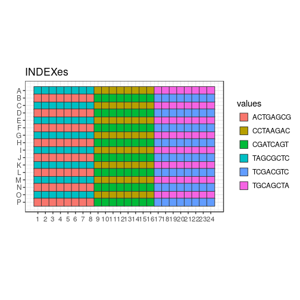

```r
variant <- "d"
newseed <- 4
indexes <- c("TAGCGCTC", "ACTGAGCG", "CCTAAGAC", "CGATCAGT", "TGCAGCTA", "TCGACGTC")
plateID <- "T"
```


New test of TSO, RT primer and RNA amounts
==========================================

In this design, the TSOs are randomised as much as possible (taking into
account that all do not have the same stock concentrations).

Each 384-well plate is divided in 6 "sextants", interleaved for easier
collection of the reaction products.  Each sextant has a different RNA amount,
and is indexed and amplified independently.  There are 9 × 7 combinations of TSO
and RT primer concentrations, plus one negative control with no RNA.  Each
reaction is assigned to a random well within the sextant.

For each plate replicate, a different random seed is used, to generate
different randomisations.

## Load scripts and libraries.


```r
library("magrittr")   # For its diamond pipe operators
library("ggplot2")    # For plotting
library("platetools") # For defining and manipulating 384-well plates
library("plyr")
library("tibble")     # For comfortable command-line operations

# The set_block function that will become part of platetools
source("https://raw.githubusercontent.com/charles-plessy/platetools/76213accb1704d11a2d96fb1f6284d0b46117778/R/set_block.R")

# Do not load the whole smallCAGEqc package, just get the barcode data.
data("nanoCAGE2017barcodes", package = "smallCAGEqc")
```


Selected TSOs
=============

TSOs are transferred as 1, 2 or 4 drops from 3 different starting
concentrations in the source plate.  Let's call each starting concentration
"Tier_A", "Tier_B" or "Tier_C".  Given constraints on remaining volume, some
TSOs can only be Tier_C, etc.  Let's refer to the TSOs by their numerical
identifier.  Tier_N is a set of barcodes that can be used for the negative
control.  See the file [Labcyte-RT6_TSO_stock_to_source.xls](Labcyte-RT6_TSO_stock_to_source.xls)
for details on the cherrypicking of the TSOs.


```r
Tier_A <- c(  3, 15, 27, 39, 51, 63, 75
           , 10, 22, 34, 46, 58, 70, 82
           , 11, 23, 35, 47, 59, 71, 83)

Tier_B <- c(  1, 13, 25, 37, 49, 61, 73
           ,  2, 14, 26, 38, 50, 62, 74
           ,  7, 19, 31, 43, 55, 67, 79)

Tier_C <- c(  4, 16, 28, 40, 52, 64, 76
           ,  5, 17, 29, 41, 65, 77, 89
           ,  6, 18, 30, 42, 66, 78, 90)

Tier_N <- c(  8, 20, 32, 44, 68, 80, 92)
```

Set Random seed
===============


```r
set.seed(newseed)
```

Creation of sextants
====================


```r
createRandomisedSextant <- function(index, rna) {
  df <- data.frame ( BARCODE_ID = c( sample(Tier_A, 21)
                                   , sample(Tier_B, 21)
                                   , sample(Tier_C, 21)
                                   , sample(Tier_N,  1)))
  tsoMaxConc <- 800
  df$TSO_source <- c( rep(tsoMaxConc /  1, 21)
                    , rep(tsoMaxConc /  8, 21)
                    , rep(tsoMaxConc /  64, 21)
                    , tsoMaxConc / 32)
  df$TSO_vol <- c(rep(c(rep(100,7), rep(50,7), rep(25,7)),3), 25)
  df$TSO <- df$TSO_source * df$TSO_vol / 500
  df$RT_PRIMERS <- c(rep(c(0, 1, 2, 4, 8, 16, 24), 9), 1)
  df$RT_PRIMERS_vol <- 25
  df[df$RT_PRIMERS == 0, "RT_PRIMERS_vol"] <- 0
  df$MASTER_MIX_vol <- 350
  df$INDEX <- index
  df$RNA <- rna
  df$RNA_vol <- 25
  df[64, "RNA_vol"] <- 0
  df$H2O_vol <- 500 - df$RNA_vol - df$RT_PRIMERS_vol - df$TSO_vol - df$MASTER_MIX_vol
  df[sample(nrow(df)),]
}
```


Sextants
========

Plate layout
------------

Create a data frame representing the contents of each well.


```r
plate           <- tibble(well = platetools::num_to_well(1:384, plate = "384"))
plate$row       <- sub("..$", "", plate$well) %>% factor
plate$col       <- sub("^.",  "", plate$well) %>% as.numeric %>% factor
```

Fill sextants
-------------


```r
plate$sxt <- paste0 (
  c(rep("A", 8), rep("B", 8), rep("C", 8)),
  ifelse (plate$row %in% LETTERS[1:8 * 2], 2, 1)
) %>% factor

plate %<>% arrange(sxt)

plate %<>% cbind( rbind( createRandomisedSextant(indexes[1], 1e5)
                       , createRandomisedSextant(indexes[2], 1e4)
                       , createRandomisedSextant(indexes[3], 1e3)
                       , createRandomisedSextant(indexes[4], 1e2)
                       , createRandomisedSextant(indexes[5], 1e1)
                       , createRandomisedSextant(indexes[6], 1e0))
      ) %>% as.tibble()

plate$BARCODE_ID
```

```
##   [1] 34  1 82 25 41 76 15 43 38 52 42 67 23 78 10 46 40 61  2 55 30 63  3 49 35 29 83  4 89 71 58
##  [32] 65 50  5 90 11 74 59 28 31 27 77 92 13 66 75 19  7 16 62 22 17 47  6 37 70 73 14 26 79 64 18
##  [63] 39 51 92 23 15 28 64 62  2 27 30 77 38 71 83 39 65  1 76 75 90 73 50  6 79 61 89 70 29  4 42
##  [94] 66 49 47 31 82 17 22 35 43 52 26 67 63 19  5 16  7 37 14 11 74 10 34  3 58 78 13 46 55 18 51
## [125] 40 59 25 41 61 83 42 46 35 66 11  5 78 49 23 25 62 77 28 52 51 40 82 89 41 63 10 15  6 59 64
## [156] 30 26 71 22  7 18 39 43 29 32 70 17 27  2 58 55 19 65 47 31 37 75 16 50  3 90  1 13 38 34 79
## [187] 73 74 14 76  4 67 40 23 75 30 42 59 22 26  5  4 37  7 29 63 73 89 31 77 61 25 15 74 10 76 16
## [218] 50 71 35 82 83 43  2 39 46 44 18 13 64 55 19 52 11 62 14 34 28 17  6  1  3 58 49 38 79 90 65
## [249] 51 67 66 41 27 78 47 70 79 47 42 76 16 82 89 39 31 70 46 13 49 17 51 61 11 83 71  8 34 78 10
## [280] 27 19 55 52 18 62 65 67 73 23 15 35 64 74  7 63 22 90  1 30 75 38  2 37  3 50 41 43 25 29 59
## [311]  6 66  4 26 77 28 14  5 58 40 77 80 73 89 16 64 83 47 38 75 52 79  4 62 41 10  2 61 19 40 51
## [342] 28 65  3 50 18 34 55 58 71 11  1 42 31 59 13 37 39 22 70 67  5 30 74 43 46 35 82 14 23 29 66
## [373] 27 63 90 78 17  6 26 76 15 25  7 49
```

```r
plate$INDEX %<>% factor
plate$BARCODE_SEQ <- nanoCAGE2017barcodes[plate$BARCODE_ID, "barcodes"]

plate$RNA_level <- plate$RNA %>% factor(labels = paste0("RNA_", LETTERS[1:6]))
plate$RTP_level <- plate$RT_PRIMERS %>% factor(labels = paste0("RTP_", LETTERS[1:7]))

plate$RNA[plate$RNA_vol == 0] <- 0
plate$plateID <- plateID
```

Summary
=======


```r
plate 
```

```
## # A tibble: 384 x 19
##    well  row   col   sxt   BARCODE_ID TSO_source TSO_vol     TSO RT_PRIMERS RT_PRIMERS_vol
##  * <chr> <fct> <fct> <fct>      <dbl>      <dbl>   <dbl>   <dbl>      <dbl>          <dbl>
##  1 A01   A     1     A1           34.      800.      25.  40.0           0.             0.
##  2 A02   A     2     A1            1.      100.      25.   5.00          8.            25.
##  3 A03   A     3     A1           82.      800.     100. 160.            8.            25.
##  4 A04   A     4     A1           25.      100.      50.  10.0           4.            25.
##  5 A05   A     5     A1           41.       12.5    100.   2.50         24.            25.
##  6 A06   A     6     A1           76.       12.5     25.   0.625         1.            25.
##  7 A07   A     7     A1           15.      800.      25.  40.0          16.            25.
##  8 A08   A     8     A1           43.      100.      25.   5.00          0.             0.
##  9 C01   C     1     A1           38.      100.     100.  20.0           1.            25.
## 10 C02   C     2     A1           52.       12.5     25.   0.625         2.            25.
## # ... with 374 more rows, and 9 more variables: MASTER_MIX_vol <dbl>, INDEX <fct>, RNA <dbl>,
## #   RNA_vol <dbl>, H2O_vol <dbl>, BARCODE_SEQ <chr>, RNA_level <fct>, RTP_level <fct>,
## #   plateID <chr>
```

```r
summary(plate)
```

```
##      well                row           col      sxt       BARCODE_ID      TSO_source   
##  Length:384         A      : 24   1      : 16   A1:64   Min.   : 1.00   Min.   : 12.5  
##  Class :character   B      : 24   2      : 16   A2:64   1st Qu.:19.00   1st Qu.: 12.5  
##  Mode  :character   C      : 24   3      : 16   B1:64   Median :41.00   Median :100.0  
##                     D      : 24   4      : 16   B2:64   Mean   :42.83   Mean   :299.8  
##                     E      : 24   5      : 16   C1:64   3rd Qu.:65.00   3rd Qu.:800.0  
##                     F      : 24   6      : 16   C2:64   Max.   :92.00   Max.   :800.0  
##                     (Other):240   (Other):288                                          
##     TSO_vol            TSO            RT_PRIMERS    RT_PRIMERS_vol  MASTER_MIX_vol      INDEX   
##  Min.   : 25.00   Min.   :  0.625   Min.   : 0.00   Min.   : 0.00   Min.   :350    ACTGAGCG:64  
##  1st Qu.: 25.00   1st Qu.:  2.500   1st Qu.: 1.00   1st Qu.:25.00   1st Qu.:350    CCTAAGAC:64  
##  Median : 50.00   Median : 10.000   Median : 4.00   Median :25.00   Median :350    CGATCAGT:64  
##  Mean   : 57.81   Mean   : 34.951   Mean   : 7.75   Mean   :21.48   Mean   :350    TAGCGCTC:64  
##  3rd Qu.:100.00   3rd Qu.: 40.000   3rd Qu.:16.00   3rd Qu.:25.00   3rd Qu.:350    TCGACGTC:64  
##  Max.   :100.00   Max.   :160.000   Max.   :24.00   Max.   :25.00   Max.   :350    TGCAGCTA:64  
##                                                                                                 
##       RNA            RNA_vol         H2O_vol       BARCODE_SEQ        RNA_level  RTP_level 
##  Min.   :     0   Min.   : 0.00   Min.   :  0.00   Length:384         RNA_A:64   RTP_A:54  
##  1st Qu.:    10   1st Qu.:25.00   1st Qu.:  0.00   Class :character   RNA_B:64   RTP_B:60  
##  Median :   100   Median :25.00   Median : 50.00   Mode  :character   RNA_C:64   RTP_C:54  
##  Mean   : 18229   Mean   :24.61   Mean   : 46.09                      RNA_D:64   RTP_D:54  
##  3rd Qu.: 10000   3rd Qu.:25.00   3rd Qu.: 75.00                      RNA_E:64   RTP_E:54  
##  Max.   :100000   Max.   :25.00   Max.   :100.00                      RNA_F:64   RTP_F:54  
##                                                                                  RTP_G:54  
##    plateID         
##  Length:384        
##  Class :character  
##  Mode  :character  
##                    
##                    
##                    
## 
```

```r
write.table(plate, paste0("plate6", variant, ".txt"), sep = "\t", quote = FALSE, row.names = FALSE)
```

Plate maps
==========


```r
plateMap <- function(x, title) {
  platetools::raw_map(plate[[x]], well=plate$well, plate="384") +
  ggtitle(title) +
  viridis::scale_fill_viridis(breaks = unique(plate[[x]]))
}

plateMapLog <- function(x, title) {
  platetools::raw_map(plate[[x]], well=plate$well, plate="384") +
  ggtitle(title) +
  viridis::scale_fill_viridis(breaks = unique(plate[[x]]), trans = "log")
}
```

TSO
---


```r
(plot_TSO <- plateMapLog("TSO", "TSO concentration"))
```

<!-- -->


```r
(plot_TSO_vol <- plateMap("TSO_vol", "TSO volume"))
```

<!-- -->


```r
(plot_BARCODES <- platetools::raw_map(plate[["BARCODE_ID"]], well=plate$well, plate="384") +
  ggtitle("Barcode ID")) + theme(legend.position="none")
```

<!-- -->

Indexes
-------


```r
(plot_indexes <- platetools::raw_map(plate[["INDEX"]], well=plate$well, plate="384") +
  ggtitle("INDEXes"))
```

<!-- -->

H2O
---


```r
(plot_H2O_vol <- plateMap("H2O_vol", "H2O volume"))
```

<!-- -->

RT primers
----------


```r
(plot_RT <- plateMapLog("RT_PRIMERS", "RT primer concentration"))
```

```
## Warning: Transformation introduced infinite values in discrete y-axis
```

<!-- -->


```r
(plot_RT_vol <- plateMap("RT_PRIMERS_vol", "RT primer volume"))
```

<!-- -->

RNA mass
--------


```r
(plot_RNA <- plateMapLog("RNA", "RNA mass (ng)"))
```

```
## Warning: Transformation introduced infinite values in discrete y-axis
```

<!-- -->


```r
(plot_RNA_vol <- plateMap("RNA_vol", "RNA volume"))
```

<!-- -->


Transfer file
=============

## Source plate layout

### TSO


```r
nanoCAGE2017barcodes$well <- unlist(lapply(LETTERS[1:8], function(x) paste(x, sprintf("%02d", 1:12), sep = "")))

tso_block <- data.frame( id  = c(Tier_A, Tier_B, Tier_C, Tier_N)
                       , row = unlist(lapply(LETTERS[1:10], rep, 7))
                       , col = rep(1:7, 10))

tso_block$well <- paste0(tso_block$row, "0", tso_block$col)

tso_block$barcodes <- nanoCAGE2017barcodes[tso_block$id, "barcodes"]

source <- tibble(well = platetools::num_to_well(1:384, plate = "384"))

for (n in 1:nrow(tso_block))
  source %<>% set_block( tso_block[n,"well"]
                       , tso_block[n,"barcodes"]
                       , 20000)
```

### Water


```r
source %<>% set_block("M01~M06", "H2O", 20000)
```

### RNA


```r
levels(plate$RNA %>% factor)
```

```
## [1] "0"     "1"     "10"    "100"   "1000"  "10000" "1e+05"
```

```r
levels(plate$RNA_level)
```

```
## [1] "RNA_A" "RNA_B" "RNA_C" "RNA_D" "RNA_E" "RNA_F"
```

```r
source %<>% set_block("L01", "RNA_F", 20000)
source %<>% set_block("L02", "RNA_E", 20000)
source %<>% set_block("L03", "RNA_D", 20000)
source %<>% set_block("L04", "RNA_C", 20000)
source %<>% set_block("L05", "RNA_B", 20000)
source %<>% set_block("L06", "RNA_A", 20000)
```

### RNA


```r
levels(plate$RT_PRIMERS %>% factor)
```

```
## [1] "0"  "1"  "2"  "4"  "8"  "16" "24"
```

```r
levels(plate$RTP_level)
```

```
## [1] "RTP_A" "RTP_B" "RTP_C" "RTP_D" "RTP_E" "RTP_F" "RTP_G"
```

```r
source %<>% set_block("K01", "RTP_A", 20000)
source %<>% set_block("K02", "RTP_B", 20000)
source %<>% set_block("K03", "RTP_C", 20000)
source %<>% set_block("K04", "RTP_D", 20000)
source %<>% set_block("K05", "RTP_E", 20000)
source %<>% set_block("K06", "RTP_F", 20000)
source %<>% set_block("K07", "RTP_G", 20000)
```

## Plan plate


```r
planPlate <- tibble(well = platetools::num_to_well(1:384, plate = "384"))

for (n in 1:nrow(plate)) {
  planPlate %<>% set_block( plate[[n,"well"]]
                          , plate[[n,"BARCODE_SEQ"]] %>% as.character
                          , plate[[n,"TSO_vol"]])
  planPlate %<>% set_block( plate[[n,"well"]]
                          , "H2O"
                          , plate[[n,"H2O_vol"]])
  planPlate %<>% set_block( plate[[n,"well"]]
                          , plate[[n,"RTP_level"]] %>% as.character
                          , plate[[n,"RT_PRIMERS_vol"]])
  planPlate %<>% set_block( plate[[n,"well"]]
                          , plate[[n,"RNA_level"]] %>% as.character
                          , plate[[n,"RNA_vol"]])
}
planPlate %<>% replace( . == 0, NA)
```

## Plan transfer


```r
source("plates.R")
```

```
## Creating a generic function for 'colnames' from package 'base' in the global environment
```

```r
source("echo.R")

planPlate   <- Plate(plate = planPlate)
sourcePlate <- Plate(plate = source)
destPlate   <- Plate(plate = tibble::tibble(well = num_to_well(1:384, plate = "384")))

echo <- planTransfers(sourcePlate, destPlate, planPlate)
echo
```

```
## A 525 Echo machine:
##   Source plate:      A Plate with data about 384 wells (dead volume: 10000; max volume: 1e+05).
##   Destination plate: A Plate with data about 384 wells (dead volume: 10000; max volume: 1e+05).
## Transducer at the following coordinates:
##   Source:      J06 (384-well format)
##   Destination: B18 (384-well format)
## 1368 elements in the log.
```

```r
transfers <- as.data.frame(echo %>% showLogs)
transfers <- transfers[order(transfers$from),]

colnames(transfers) <- c("Source well", "Destination well", "Transfer volume", "what")

transfers
```

```
##      Source well Destination well Transfer volume   what
## 802          A01              E07             100 ACACTC
## 803          A01              F24             100 ACACTC
## 804          A01              K24              50 ACACTC
## 805          A01              M12             100 ACACTC
## 806          A01              N05              50 ACACTC
## 807          A01              N10              25 ACACTC
## 598          A02              A07              25 AGTCTC
## 599          A02              B03              25 AGTCTC
## 600          A02              E16             100 AGTCTC
## 601          A02              F13              50 AGTCTC
## 602          A02              I18              50 AGTCTC
## 603          A02              P21              50 AGTCTC
## 910          A03              B08             100 ATCTGA
## 911          A03              E24             100 ATCTGA
## 912          A03              I16              50 ATCTGA
## 913          A03              K01              50 ATCTGA
## 914          A03              N21             100 ATCTGA
## 915          A03              P13             100 ATCTGA
## 1038         A04              A24             100 CGACTC
## 1039         A04              D06             100 CGACTC
## 1040         A04              I10              25 CGACTC
## 1041         A04              J09             100 CGACTC
## 1042         A04              J22              25 CGACTC
## 1043         A04              O07              25 CGACTC
## 1044         A05              C23             100 CTGCTC
## 1045         A05              E09              25 CTGCTC
## 1046         A05              F21             100 CTGCTC
## 1047         A05              O08             100 CTGCTC
## 1048         A05              P04              50 CTGCTC
## 1049         A05              P09              25 CTGCTC
## 796          A06              D14              25 GAGTGA
## 797          A06              E06             100 GAGTGA
## 798          A06              E14             100 GAGTGA
## 799          A06              I23              25 GAGTGA
## 800          A06              L02             100 GAGTGA
## 801          A06              N22              50 GAGTGA
## 936          A07              B11             100 GTACTC
## 937          A07              D18              25 GTACTC
## 938          A07              F02             100 GTACTC
## 939          A07              K06              25 GTACTC
## 940          A07              K20              25 GTACTC
## 941          A07              M09              25 GTACTC
## 754          B01              C07              50 AGTACG
## 755          B01              D24             100 AGTACG
## 756          B01              E15              50 AGTACG
## 757          B01              E23             100 AGTACG
## 758          B01              F15              25 AGTACG
## 759          B01              N03             100 AGTACG
## 966          B02              B15              25 ATCGAT
## 967          B02              G15              25 ATCGAT
## 968          B02              I24              50 ATCGAT
## 969          B02              J04              50 ATCGAT
## 970          B02              J23              50 ATCGAT
## 971          B02              M03              50 ATCGAT
## 1            B03              A01              25 CACTAC
## 2            B03              E21              25 CACTAC
## 3            B03              H19              25 CACTAC
## 4            B03              L13              25 CACTAC
## 5            B03              N04              50 CACTAC
## 6            B03              O09              25 CACTAC
## 760          B04              A12              25 CTGACG
## 761          B04              C08             100 CTGACG
## 762          B04              C19              50 CTGACG
## 763          B04              J10              50 CTGACG
## 764          B04              L22              25 CTGACG
## 765          B04              P01              25 CTGACG
## 850          B05              G07              50 GAGCAG
## 851          B05              H21             100 GAGCAG
## 852          B05              K10             100 GAGCAG
## 853          B05              N06             100 GAGCAG
## 854          B05              N11              50 GAGCAG
## 855          B05              O23              25 GAGCAG
## 996          B06              C18             100 GCTGAT
## 997          B06              H02             100 GCTGAT
## 998          B06              I14              50 GCTGAT
## 999          B06              J24              25 GCTGAT
## 1000         B06              M08             100 GCTGAT
## 1001         B06              P16             100 GCTGAT
## 406          B07              A03             100 TATACG
## 407          B07              A22              50 TATACG
## 408          B07              E11              25 TATACG
## 409          B07              H13              50 TATACG
## 410          B07              J02              25 TATACG
## 411          B07              L24              50 TATACG
## 880          C01              A15             100 AGTAGC
## 881          C01              E17              25 AGTAGC
## 882          C01              H23              25 AGTAGC
## 883          C01              I04              25 AGTAGC
## 884          C01              L10             100 AGTAGC
## 885          C01              N01              50 AGTAGC
## 742          C02              B02              25 ATCGCA
## 743          C02              B10             100 ATCGCA
## 744          C02              C05              25 ATCGCA
## 745          C02              C11             100 ATCGCA
## 746          C02              I17              50 ATCGCA
## 747          C02              N18             100 ATCGCA
## 814          C03              A13              50 CACTCT
## 815          C03              G01              50 CACTCT
## 816          C03              H12              25 CACTCT
## 817          C03              I19              25 CACTCT
## 818          C03              J05              50 CACTCT
## 819          C03              L23             100 CACTCT
## 978          C04              A18             100 CTGAGC
## 979          C04              B24              50 CTGAGC
## 980          C04              H08              50 CTGAGC
## 981          C04              K14              50 CTGAGC
## 982          C04              M05             100 CTGAGC
## 983          C04              P15              50 CTGAGC
## 892          C05              B14              50 GAGCGT
## 893          C05              G10              50 GAGCGT
## 894          C05              I06              25 GAGCGT
## 895          C05              J19              50 GAGCGT
## 896          C05              M22             100 GAGCGT
## 897          C05              P06              25 GAGCGT
## 844          C06              D04              25 GCTGCA
## 845          C06              E19              50 GCTGCA
## 846          C06              G06              50 GCTGCA
## 847          C06              G14             100 GCTGCA
## 848          C06              H11              50 GCTGCA
## 849          C06              H22              50 GCTGCA
## 826          C07              A10              50 TATAGC
## 827          C07              B23              25 TATAGC
## 828          C07              D05              25 TATAGC
## 829          C07              E18              25 TATAGC
## 830          C07              G03              50 TATAGC
## 831          C07              H14             100 TATAGC
## 346          D01              A02              25 ACACAG
## 347          D01              D08             100 ACACAG
## 348          D01              H24              25 ACACAG
## 349          D01              K18              25 ACACAG
## 350          D01              M14             100 ACACAG
## 351          D01              N09             100 ACACAG
## 924          D02              C20              50 AGTCAG
## 925          D02              J13              50 AGTCAG
## 926          D02              J20              25 AGTCAG
## 927          D02              K04              25 AGTCAG
## 928          D02              M15              50 AGTCAG
## 929          D02              N08              25 AGTCAG
## 412          D03              A04              50 ATCTAC
## 413          D03              C12              50 ATCTAC
## 414          D03              F12              25 ATCTAC
## 415          D03              M20              25 ATCTAC
## 416          D03              P07              50 ATCTAC
## 417          D03              P22              50 ATCTAC
## 990          D04              D11             100 CGACAG
## 991          D04              J21             100 CGACAG
## 992          D04              K16              50 CGACAG
## 993          D04              K23             100 CGACAG
## 994          D04              L07              50 CGACAG
## 995          D04              M07              50 CGACAG
## 808          D05              C10              25 CTGCAG
## 809          D05              C21             100 CTGCAG
## 810          D05              E08              25 CTGCAG
## 811          D05              H07             100 CTGCAG
## 812          D05              N12              50 CTGCAG
## 813          D05              P24             100 CTGCAG
## 772          D06              A09              25 GAGTAC
## 773          D06              C24              25 GAGTAC
## 774          D06              E02              50 GAGTAC
## 775          D06              F08              50 GAGTAC
## 776          D06              F11              50 GAGTAC
## 777          D06              F18              50 GAGTAC
## 1002         D07              B19              50 GTACAG
## 1003         D07              D15              25 GTACAG
## 1004         D07              F04              25 GTACAG
## 1005         D07              G24              25 GTACAG
## 1006         D07              O01              50 GTACAG
## 1007         D07              O11              25 GTACAG
## 778          E01              B07             100 ACACGT
## 779          E01              E03             100 ACACGT
## 780          E01              F17              25 ACACGT
## 781          E01              H16              25 ACACGT
## 782          E01              K09             100 ACACGT
## 783          E01              K22             100 ACACGT
## 1008         E02              L08              50 AGTCGT
## 1009         E02              L12              50 AGTCGT
## 1010         E02              N17             100 AGTCGT
## 1011         E02              O02              50 AGTCGT
## 1012         E02              O13              50 AGTCGT
## 1013         E02              O21              50 AGTCGT
## 1014         E03              B16             100 ATCTCT
## 1015         E03              G13              50 ATCTCT
## 1016         E03              J08             100 ATCTCT
## 1017         E03              O03             100 ATCTCT
## 1018         E03              O18             100 ATCTCT
## 1019         E03              P19              25 ATCTCT
## 664          E04              C01             100 CGACGT
## 665          E04              D03             100 CGACGT
## 666          E04              D17              50 CGACGT
## 667          E04              K21              50 CGACGT
## 668          E04              M16              25 CGACGT
## 669          E04              N13              25 CGACGT
## 862          E05              F05              25 CTGCGT
## 863          E05              H10              50 CTGCGT
## 864          E05              H17              25 CTGCGT
## 865          E05              I01             100 CTGCGT
## 866          E05              M11             100 CTGCGT
## 867          E05              M17             100 CTGCGT
## 960          E06              B06             100 GAGTCT
## 961          E06              C13             100 GAGTCT
## 962          E06              D22              50 GAGTCT
## 963          E06              G21              50 GAGTCT
## 964          E06              L11              25 GAGTCT
## 965          E06              M02             100 GAGTCT
## 886          E07              F14              50 GTACGT
## 887          E07              I05              25 GTACGT
## 888          E07              I21              25 GTACGT
## 889          E07              L20              50 GTACGT
## 890          E07              N02              25 GTACGT
## 891          E07              O12              50 GTACGT
## 948          F01              D12             100 ACATAC
## 949          F01              G16              25 ACATAC
## 950          F01              I22             100 ACATAC
## 951          F01              K08             100 ACATAC
## 952          F01              L06              50 ACATAC
## 953          F01              P23             100 ACATAC
## 942          F02              F19              25 ATCACG
## 943          F02              G17              25 ATCACG
## 944          F02              J16              25 ATCACG
## 945          F02              K07              50 ATCACG
## 946          F02              K12             100 ATCACG
## 947          F02              L03              25 ATCACG
## 904          F03              C17              50 CACGAT
## 905          F03              F09             100 CACGAT
## 906          F03              I08              50 CACGAT
## 907          F03              J01             100 CACGAT
## 908          F03              J18              25 CACGAT
## 909          F03              K15              25 CACGAT
## 658          F04              A08              25 CGATAC
## 659          F04              H15             100 CGATAC
## 660          F04              I11             100 CGATAC
## 661          F04              J06              50 CGATAC
## 662          F04              L21             100 CGATAC
## 663          F04              M19              50 CGATAC
## 784          F05              E04              25 GAGACG
## 785          F05              G18              50 GAGACG
## 786          F05              H20             100 GAGACG
## 787          F05              J15              50 GAGACG
## 788          F05              K11              25 GAGACG
## 789          F05              P02              25 GAGACG
## 736          F06              C04              25 GCTCAG
## 737          F06              G23             100 GCTCAG
## 738          F06              L01              25 GCTCAG
## 739          F06              L17             100 GCTCAG
## 740          F06              O16             100 GCTCAG
## 741          F06              P10              25 GCTCAG
## 1020         F07              A17              25 GTATAC
## 1021         F07              D20              50 GTATAC
## 1022         F07              F07              50 GTATAC
## 1023         F07              N14             100 GTATAC
## 1024         F07              O04             100 GTATAC
## 1025         F07              O10              50 GTATAC
## 832          G01              D10              25 ACAGAT
## 833          G01              D21             100 ACAGAT
## 834          G01              G04              25 ACAGAT
## 835          G01              H04             100 ACAGAT
## 836          G01              O15              25 ACAGAT
## 837          G01              O17              50 ACAGAT
## 954          G02              A21             100 AGTGAT
## 955          G02              B21              25 AGTGAT
## 956          G02              H09              50 AGTGAT
## 957          G02              L05              50 AGTGAT
## 958          G02              M01             100 AGTGAT
## 959          G02              M10              25 AGTGAT
## 898          G03              B04             100 CACACG
## 899          G03              C15              25 CACACG
## 900          G03              F22             100 CACACG
## 901          G03              I07              25 CACACG
## 902          G03              L14             100 CACACG
## 903          G03              O20              25 CACACG
## 766          G04              B09              50 CGAGAT
## 767          G04              E01             100 CGAGAT
## 768          G04              E10             100 CGAGAT
## 769          G04              F20              25 CGAGAT
## 770          G04              O24             100 CGAGAT
## 771          G04              P05             100 CGAGAT
## 670          G05              C02              25 CTGTAC
## 671          G05              C16              25 CTGTAC
## 672          G05              D19             100 CTGTAC
## 673          G05              G19             100 CTGTAC
## 674          G05              J07              25 CTGTAC
## 675          G05              L09              25 CTGTAC
## 1026         G06              B05              50 GCTACG
## 1027         G06              B22             100 GCTACG
## 1028         G06              G11              50 GCTACG
## 1029         G06              I20              25 GCTACG
## 1030         G06              J14              25 GCTACG
## 1031         G06              O05              50 GCTACG
## 532          G07              A06              25 GTAGAT
## 533          G07              A20             100 GTAGAT
## 534          G07              F01              50 GTAGAT
## 535          G07              F16             100 GTAGAT
## 536          G07              O14              50 GTAGAT
## 537          G07              P20              25 GTAGAT
## 868          H01              A16              25 ACAGCA
## 869          H01              D09             100 ACAGCA
## 870          H01              I02              50 ACAGCA
## 871          H01              L04              50 ACAGCA
## 872          H01              L18              50 ACAGCA
## 873          H01              O22              50 ACAGCA
## 972          H02              C22              25 AGTGCA
## 973          H02              I15              50 AGTGCA
## 974          H02              J03              50 AGTGCA
## 975          H02              L15              25 AGTGCA
## 976          H02              M04              50 AGTGCA
## 977          H02              P17             100 AGTGCA
## 820          H03              D13              50 CACAGC
## 821          H03              G02              50 CACAGC
## 822          H03              H03             100 CACAGC
## 823          H03              I12             100 CACAGC
## 824          H03              M21              25 CACAGC
## 825          H03              N19              50 CACAGC
## 472          H04              A05             100 CGAGCA
## 473          H04              D23              50 CGAGCA
## 474          H04              E13              25 CGAGCA
## 475          H04              M18              50 CGAGCA
## 476          H04              P08              50 CGAGCA
## 477          H04              P12              50 CGAGCA
## 856          H05              D07              25 GCTAGC
## 857          H05              F23              50 GCTAGC
## 858          H05              G08             100 GCTAGC
## 859          H05              G22              50 GCTAGC
## 860          H05              K13              50 GCTAGC
## 861          H05              N16              50 GCTAGC
## 916          H06              B17             100 GTAGCA
## 917          H06              C14              50 GTAGCA
## 918          H06              D02             100 GTAGCA
## 919          H06              F10              50 GTAGCA
## 920          H06              K02              25 GTAGCA
## 921          H06              O19              25 GTAGCA
## 838          H07              A23              25 TATGCA
## 839          H07              B20              50 TATGCA
## 840          H07              D16              25 TATGCA
## 841          H07              E12              50 TATGCA
## 842          H07              G05              50 TATGCA
## 843          H07              H01              25 TATGCA
## 984          I01              F06              25 ACAGTG
## 985          I01              G09             100 ACAGTG
## 986          I01              L16              25 ACAGTG
## 987          I01              M06             100 ACAGTG
## 988          I01              M23              50 ACAGTG
## 989          I01              P18              25 ACAGTG
## 1032         I02              G20              50 AGTGTG
## 1033         I02              H18              50 AGTGTG
## 1034         I02              I09             100 AGTGTG
## 1035         I02              J12              50 AGTGTG
## 1036         I02              O06             100 AGTGTG
## 1037         I02              P03              25 AGTGTG
## 790          I03              B12              25 CACATA
## 791          I03              D01              25 CACATA
## 792          I03              E05              25 CACATA
## 793          I03              G12             100 CACATA
## 794          I03              K19              50 CACATA
## 795          I03              L19              25 CACATA
## 730          I04              A11             100 CGAGTG
## 731          I04              A19             100 CGAGTG
## 732          I04              B13             100 CGAGTG
## 733          I04              C03             100 CGAGTG
## 734          I04              H05             100 CGAGTG
## 735          I04              J17              50 CGAGTG
## 930          I05              A14              50 GCTATA
## 931          I05              H06              50 GCTATA
## 932          I05              K05              25 GCTATA
## 933          I05              M24             100 GCTATA
## 934          I05              N20              25 GCTATA
## 935          I05              P11             100 GCTATA
## 748          I06              C06              50 GTAGTG
## 749          I06              C09             100 GTAGTG
## 750          I06              E22             100 GTAGTG
## 751          I06              N07              25 GTAGTG
## 752          I06              N24              25 GTAGTG
## 753          I06              P14             100 GTAGTG
## 874          I07              F03             100 TATGTG
## 875          I07              I03              50 TATGTG
## 876          I07              K17              25 TATGTG
## 877          I07              M13              25 TATGTG
## 878          I07              N15             100 TATGTG
## 879          I07              N23             100 TATGTG
## 1304         J01              E20              25 ACATCT
## 1176         J03              I13              25 CACGCA
## 1240         J04              J11              25 CGATCT
## 1368         J06              B18              25 GTATCT
## 922          J07              B01              25 TCGAGC
## 923          J07              K03              25 TCGAGC
## 538          K02              A06              25  RTP_B
## 539          K02              A16              25  RTP_B
## 540          K02              A18              25  RTP_B
## 541          K02              A23              25  RTP_B
## 542          K02              B01              25  RTP_B
## 543          K02              B05              25  RTP_B
## 544          K02              B07              25  RTP_B
## 545          K02              B14              25  RTP_B
## 546          K02              B18              25  RTP_B
## 547          K02              C01              25  RTP_B
## 548          K02              C04              25  RTP_B
## 549          K02              C20              25  RTP_B
## 550          K02              D02              25  RTP_B
## 551          K02              D07              25  RTP_B
## 552          K02              E01              25  RTP_B
## 553          K02              E07              25  RTP_B
## 554          K02              E10              25  RTP_B
## 555          K02              E20              25  RTP_B
## 556          K02              F02              25  RTP_B
## 557          K02              F12              25  RTP_B
## 558          K02              F14              25  RTP_B
## 559          K02              F15              25  RTP_B
## 560          K02              F16              25  RTP_B
## 561          K02              F24              25  RTP_B
## 562          K02              G01              25  RTP_B
## 563          K02              G14              25  RTP_B
## 564          K02              H09              25  RTP_B
## 565          K02              H14              25  RTP_B
## 566          K02              H15              25  RTP_B
## 567          K02              H18              25  RTP_B
## 568          K02              H24              25  RTP_B
## 569          K02              I11              25  RTP_B
## 570          K02              I13              25  RTP_B
## 571          K02              I16              25  RTP_B
## 572          K02              I18              25  RTP_B
## 573          K02              J11              25  RTP_B
## 574          K02              J14              25  RTP_B
## 575          K02              J24              25  RTP_B
## 576          K02              K03              25  RTP_B
## 577          K02              K06              25  RTP_B
## 578          K02              K13              25  RTP_B
## 579          K02              K18              25  RTP_B
## 580          K02              L07              25  RTP_B
## 581          K02              L20              25  RTP_B
## 582          K02              L21              25  RTP_B
## 583          K02              M09              25  RTP_B
## 584          K02              M15              25  RTP_B
## 585          K02              M17              25  RTP_B
## 586          K02              M23              25  RTP_B
## 587          K02              N04              25  RTP_B
## 588          K02              N08              25  RTP_B
## 589          K02              N20              25  RTP_B
## 590          K02              N22              25  RTP_B
## 591          K02              N23              25  RTP_B
## 592          K02              O01              25  RTP_B
## 593          K02              O05              25  RTP_B
## 594          K02              O11              25  RTP_B
## 595          K02              O23              25  RTP_B
## 596          K02              O24              25  RTP_B
## 597          K02              P06              25  RTP_B
## 676          K03              A22              25  RTP_C
## 677          K03              B13              25  RTP_C
## 678          K03              B24              25  RTP_C
## 679          K03              C02              25  RTP_C
## 680          K03              C03              25  RTP_C
## 681          K03              C05              25  RTP_C
## 682          K03              C14              25  RTP_C
## 683          K03              C18              25  RTP_C
## 684          K03              D08              25  RTP_C
## 685          K03              D15              25  RTP_C
## 686          K03              D17              25  RTP_C
## 687          K03              D18              25  RTP_C
## 688          K03              D21              25  RTP_C
## 689          K03              E06              25  RTP_C
## 690          K03              E17              25  RTP_C
## 691          K03              F06              25  RTP_C
## 692          K03              F08              25  RTP_C
## 693          K03              F09              25  RTP_C
## 694          K03              F19              25  RTP_C
## 695          K03              G06              25  RTP_C
## 696          K03              G10              25  RTP_C
## 697          K03              G19              25  RTP_C
## 698          K03              G20              25  RTP_C
## 699          K03              G23              25  RTP_C
## 700          K03              H08              25  RTP_C
## 701          K03              I05              25  RTP_C
## 702          K03              I08              25  RTP_C
## 703          K03              I09              25  RTP_C
## 704          K03              I10              25  RTP_C
## 705          K03              J02              25  RTP_C
## 706          K03              J03              25  RTP_C
## 707          K03              J21              25  RTP_C
## 708          K03              K15              25  RTP_C
## 709          K03              K17              25  RTP_C
## 710          K03              L12              25  RTP_C
## 711          K03              L16              25  RTP_C
## 712          K03              L23              25  RTP_C
## 713          K03              M04              25  RTP_C
## 714          K03              M11              25  RTP_C
## 715          K03              M12              25  RTP_C
## 716          K03              M13              25  RTP_C
## 717          K03              M20              25  RTP_C
## 718          K03              N03              25  RTP_C
## 719          K03              N11              25  RTP_C
## 720          K03              N19              25  RTP_C
## 721          K03              O03              25  RTP_C
## 722          K03              O13              25  RTP_C
## 723          K03              O21              25  RTP_C
## 724          K03              P02              25  RTP_C
## 725          K03              P05              25  RTP_C
## 726          K03              P09              25  RTP_C
## 727          K03              P12              25  RTP_C
## 728          K03              P13              25  RTP_C
## 729          K03              P20              25  RTP_C
## 418          K04              A04              25  RTP_D
## 419          K04              A13              25  RTP_D
## 420          K04              A14              25  RTP_D
## 421          K04              A21              25  RTP_D
## 422          K04              A24              25  RTP_D
## 423          K04              B03              25  RTP_D
## 424          K04              B15              25  RTP_D
## 425          K04              B23              25  RTP_D
## 426          K04              C10              25  RTP_D
## 427          K04              C11              25  RTP_D
## 428          K04              C15              25  RTP_D
## 429          K04              D03              25  RTP_D
## 430          K04              D06              25  RTP_D
## 431          K04              D11              25  RTP_D
## 432          K04              D16              25  RTP_D
## 433          K04              D19              25  RTP_D
## 434          K04              D22              25  RTP_D
## 435          K04              D24              25  RTP_D
## 436          K04              E19              25  RTP_D
## 437          K04              G02              25  RTP_D
## 438          K04              G15              25  RTP_D
## 439          K04              H03              25  RTP_D
## 440          K04              I01              25  RTP_D
## 441          K04              I06              25  RTP_D
## 442          K04              I07              25  RTP_D
## 443          K04              I12              25  RTP_D
## 444          K04              I19              25  RTP_D
## 445          K04              I20              25  RTP_D
## 446          K04              I21              25  RTP_D
## 447          K04              I22              25  RTP_D
## 448          K04              J10              25  RTP_D
## 449          K04              J12              25  RTP_D
## 450          K04              J13              25  RTP_D
## 451          K04              J20              25  RTP_D
## 452          K04              J23              25  RTP_D
## 453          K04              K04              25  RTP_D
## 454          K04              K12              25  RTP_D
## 455          K04              K21              25  RTP_D
## 456          K04              L03              25  RTP_D
## 457          K04              L05              25  RTP_D
## 458          K04              L08              25  RTP_D
## 459          K04              L18              25  RTP_D
## 460          K04              L19              25  RTP_D
## 461          K04              M01              25  RTP_D
## 462          K04              M03              25  RTP_D
## 463          K04              N07              25  RTP_D
## 464          K04              N13              25  RTP_D
## 465          K04              O08              25  RTP_D
## 466          K04              O10              25  RTP_D
## 467          K04              O17              25  RTP_D
## 468          K04              P04              25  RTP_D
## 469          K04              P11              25  RTP_D
## 470          K04              P16              25  RTP_D
## 471          K04              P23              25  RTP_D
## 352          K05              A02              25  RTP_E
## 353          K05              A03              25  RTP_E
## 354          K05              A10              25  RTP_E
## 355          K05              A15              25  RTP_E
## 356          K05              A19              25  RTP_E
## 357          K05              B11              25  RTP_E
## 358          K05              C09              25  RTP_E
## 359          K05              C22              25  RTP_E
## 360          K05              D01              25  RTP_E
## 361          K05              D05              25  RTP_E
## 362          K05              E11              25  RTP_E
## 363          K05              E18              25  RTP_E
## 364          K05              F01              25  RTP_E
## 365          K05              F03              25  RTP_E
## 366          K05              F07              25  RTP_E
## 367          K05              F10              25  RTP_E
## 368          K05              F17              25  RTP_E
## 369          K05              F18              25  RTP_E
## 370          K05              F20              25  RTP_E
## 371          K05              F21              25  RTP_E
## 372          K05              G24              25  RTP_E
## 373          K05              H10              25  RTP_E
## 374          K05              H23              25  RTP_E
## 375          K05              I03              25  RTP_E
## 376          K05              I15              25  RTP_E
## 377          K05              J01              25  RTP_E
## 378          K05              J17              25  RTP_E
## 379          K05              K01              25  RTP_E
## 380          K05              K02              25  RTP_E
## 381          K05              K08              25  RTP_E
## 382          K05              K09              25  RTP_E
## 383          K05              K11              25  RTP_E
## 384          K05              K19              25  RTP_E
## 385          K05              K23              25  RTP_E
## 386          K05              K24              25  RTP_E
## 387          K05              L01              25  RTP_E
## 388          K05              L02              25  RTP_E
## 389          K05              L11              25  RTP_E
## 390          K05              L14              25  RTP_E
## 391          K05              L15              25  RTP_E
## 392          K05              L24              25  RTP_E
## 393          K05              M19              25  RTP_E
## 394          K05              M22              25  RTP_E
## 395          K05              N05              25  RTP_E
## 396          K05              N09              25  RTP_E
## 397          K05              N10              25  RTP_E
## 398          K05              N17              25  RTP_E
## 399          K05              O02              25  RTP_E
## 400          K05              O06              25  RTP_E
## 401          K05              O07              25  RTP_E
## 402          K05              O12              25  RTP_E
## 403          K05              O15              25  RTP_E
## 404          K05              P15              25  RTP_E
## 405          K05              P17              25  RTP_E
## 604          K06              A07              25  RTP_F
## 605          K06              A09              25  RTP_F
## 606          K06              B08              25  RTP_F
## 607          K06              B19              25  RTP_F
## 608          K06              B22              25  RTP_F
## 609          K06              C13              25  RTP_F
## 610          K06              C23              25  RTP_F
## 611          K06              D04              25  RTP_F
## 612          K06              D12              25  RTP_F
## 613          K06              D13              25  RTP_F
## 614          K06              D14              25  RTP_F
## 615          K06              D23              25  RTP_F
## 616          K06              E02              25  RTP_F
## 617          K06              E03              25  RTP_F
## 618          K06              E08              25  RTP_F
## 619          K06              E09              25  RTP_F
## 620          K06              E13              25  RTP_F
## 621          K06              E16              25  RTP_F
## 622          K06              E21              25  RTP_F
## 623          K06              E22              25  RTP_F
## 624          K06              F04              25  RTP_F
## 625          K06              F11              25  RTP_F
## 626          K06              G04              25  RTP_F
## 627          K06              G05              25  RTP_F
## 628          K06              G07              25  RTP_F
## 629          K06              G12              25  RTP_F
## 630          K06              G17              25  RTP_F
## 631          K06              G21              25  RTP_F
## 632          K06              H04              25  RTP_F
## 633          K06              H07              25  RTP_F
## 634          K06              H13              25  RTP_F
## 635          K06              H16              25  RTP_F
## 636          K06              H17              25  RTP_F
## 637          K06              H19              25  RTP_F
## 638          K06              H20              25  RTP_F
## 639          K06              I14              25  RTP_F
## 640          K06              I24              25  RTP_F
## 641          K06              J05              25  RTP_F
## 642          K06              J06              25  RTP_F
## 643          K06              J07              25  RTP_F
## 644          K06              J09              25  RTP_F
## 645          K06              K16              25  RTP_F
## 646          K06              K22              25  RTP_F
## 647          K06              L09              25  RTP_F
## 648          K06              M05              25  RTP_F
## 649          K06              M06              25  RTP_F
## 650          K06              M18              25  RTP_F
## 651          K06              N18              25  RTP_F
## 652          K06              O14              25  RTP_F
## 653          K06              O19              25  RTP_F
## 654          K06              P08              25  RTP_F
## 655          K06              P14              25  RTP_F
## 656          K06              P18              25  RTP_F
## 657          K06              P21              25  RTP_F
## 478          K07              A05              25  RTP_G
## 479          K07              A12              25  RTP_G
## 480          K07              A20              25  RTP_G
## 481          K07              B06              25  RTP_G
## 482          K07              B09              25  RTP_G
## 483          K07              B10              25  RTP_G
## 484          K07              B20              25  RTP_G
## 485          K07              B21              25  RTP_G
## 486          K07              C06              25  RTP_G
## 487          K07              C07              25  RTP_G
## 488          K07              C08              25  RTP_G
## 489          K07              C16              25  RTP_G
## 490          K07              C17              25  RTP_G
## 491          K07              C19              25  RTP_G
## 492          K07              C21              25  RTP_G
## 493          K07              C24              25  RTP_G
## 494          K07              D09              25  RTP_G
## 495          K07              D10              25  RTP_G
## 496          K07              E04              25  RTP_G
## 497          K07              E05              25  RTP_G
## 498          K07              E15              25  RTP_G
## 499          K07              E23              25  RTP_G
## 500          K07              F05              25  RTP_G
## 501          K07              F22              25  RTP_G
## 502          K07              G09              25  RTP_G
## 503          K07              G11              25  RTP_G
## 504          K07              G13              25  RTP_G
## 505          K07              H02              25  RTP_G
## 506          K07              H05              25  RTP_G
## 507          K07              H11              25  RTP_G
## 508          K07              H22              25  RTP_G
## 509          K07              I04              25  RTP_G
## 510          K07              J04              25  RTP_G
## 511          K07              J22              25  RTP_G
## 512          K07              K10              25  RTP_G
## 513          K07              K20              25  RTP_G
## 514          K07              L04              25  RTP_G
## 515          K07              L06              25  RTP_G
## 516          K07              L13              25  RTP_G
## 517          K07              M02              25  RTP_G
## 518          K07              M07              25  RTP_G
## 519          K07              M14              25  RTP_G
## 520          K07              M16              25  RTP_G
## 521          K07              N12              25  RTP_G
## 522          K07              N14              25  RTP_G
## 523          K07              N21              25  RTP_G
## 524          K07              O20              25  RTP_G
## 525          K07              O22              25  RTP_G
## 526          K07              P01              25  RTP_G
## 527          K07              P03              25  RTP_G
## 528          K07              P10              25  RTP_G
## 529          K07              P19              25  RTP_G
## 530          K07              P22              25  RTP_G
## 531          K07              P24              25  RTP_G
## 283          L01              A01              25  RNA_F
## 284          L01              A02              25  RNA_F
## 285          L01              A03              25  RNA_F
## 286          L01              A04              25  RNA_F
## 287          L01              A05              25  RNA_F
## 288          L01              A06              25  RNA_F
## 289          L01              A07              25  RNA_F
## 290          L01              A08              25  RNA_F
## 291          L01              C01              25  RNA_F
## 292          L01              C02              25  RNA_F
## 293          L01              C03              25  RNA_F
## 294          L01              C04              25  RNA_F
## 295          L01              C05              25  RNA_F
## 296          L01              C06              25  RNA_F
## 297          L01              C07              25  RNA_F
## 298          L01              C08              25  RNA_F
## 299          L01              E01              25  RNA_F
## 300          L01              E02              25  RNA_F
## 301          L01              E03              25  RNA_F
## 302          L01              E04              25  RNA_F
## 303          L01              E05              25  RNA_F
## 304          L01              E06              25  RNA_F
## 305          L01              E07              25  RNA_F
## 306          L01              E08              25  RNA_F
## 307          L01              G01              25  RNA_F
## 308          L01              G02              25  RNA_F
## 309          L01              G03              25  RNA_F
## 310          L01              G04              25  RNA_F
## 311          L01              G05              25  RNA_F
## 312          L01              G06              25  RNA_F
## 313          L01              G07              25  RNA_F
## 314          L01              G08              25  RNA_F
## 315          L01              I01              25  RNA_F
## 316          L01              I02              25  RNA_F
## 317          L01              I03              25  RNA_F
## 318          L01              I04              25  RNA_F
## 319          L01              I05              25  RNA_F
## 320          L01              I06              25  RNA_F
## 321          L01              I07              25  RNA_F
## 322          L01              I08              25  RNA_F
## 323          L01              K01              25  RNA_F
## 324          L01              K02              25  RNA_F
## 325          L01              K04              25  RNA_F
## 326          L01              K05              25  RNA_F
## 327          L01              K06              25  RNA_F
## 328          L01              K07              25  RNA_F
## 329          L01              K08              25  RNA_F
## 330          L01              M01              25  RNA_F
## 331          L01              M02              25  RNA_F
## 332          L01              M03              25  RNA_F
## 333          L01              M04              25  RNA_F
## 334          L01              M05              25  RNA_F
## 335          L01              M06              25  RNA_F
## 336          L01              M07              25  RNA_F
## 337          L01              M08              25  RNA_F
## 338          L01              O01              25  RNA_F
## 339          L01              O02              25  RNA_F
## 340          L01              O03              25  RNA_F
## 341          L01              O04              25  RNA_F
## 342          L01              O05              25  RNA_F
## 343          L01              O06              25  RNA_F
## 344          L01              O07              25  RNA_F
## 345          L01              O08              25  RNA_F
## 1050         L02              B02              25  RNA_E
## 1051         L02              B03              25  RNA_E
## 1052         L02              B04              25  RNA_E
## 1053         L02              B05              25  RNA_E
## 1054         L02              B06              25  RNA_E
## 1055         L02              B07              25  RNA_E
## 1056         L02              B08              25  RNA_E
## 1057         L02              D01              25  RNA_E
## 1058         L02              D02              25  RNA_E
## 1059         L02              D03              25  RNA_E
## 1060         L02              D04              25  RNA_E
## 1061         L02              D05              25  RNA_E
## 1062         L02              D06              25  RNA_E
## 1063         L02              D07              25  RNA_E
## 1064         L02              D08              25  RNA_E
## 1065         L02              F01              25  RNA_E
## 1066         L02              F02              25  RNA_E
## 1067         L02              F03              25  RNA_E
## 1068         L02              F04              25  RNA_E
## 1069         L02              F05              25  RNA_E
## 1070         L02              F06              25  RNA_E
## 1071         L02              F07              25  RNA_E
## 1072         L02              F08              25  RNA_E
## 1073         L02              H01              25  RNA_E
## 1074         L02              H02              25  RNA_E
## 1075         L02              H03              25  RNA_E
## 1076         L02              H04              25  RNA_E
## 1077         L02              H05              25  RNA_E
## 1078         L02              H06              25  RNA_E
## 1079         L02              H07              25  RNA_E
## 1080         L02              H08              25  RNA_E
## 1081         L02              J01              25  RNA_E
## 1082         L02              J02              25  RNA_E
## 1083         L02              J03              25  RNA_E
## 1084         L02              J04              25  RNA_E
## 1085         L02              J05              25  RNA_E
## 1086         L02              J06              25  RNA_E
## 1087         L02              J07              25  RNA_E
## 1088         L02              J08              25  RNA_E
## 1089         L02              L01              25  RNA_E
## 1090         L02              L02              25  RNA_E
## 1091         L02              L03              25  RNA_E
## 1092         L02              L04              25  RNA_E
## 1093         L02              L05              25  RNA_E
## 1094         L02              L06              25  RNA_E
## 1095         L02              L07              25  RNA_E
## 1096         L02              L08              25  RNA_E
## 1097         L02              N01              25  RNA_E
## 1098         L02              N02              25  RNA_E
## 1099         L02              N03              25  RNA_E
## 1100         L02              N04              25  RNA_E
## 1101         L02              N05              25  RNA_E
## 1102         L02              N06              25  RNA_E
## 1103         L02              N07              25  RNA_E
## 1104         L02              N08              25  RNA_E
## 1105         L02              P01              25  RNA_E
## 1106         L02              P02              25  RNA_E
## 1107         L02              P03              25  RNA_E
## 1108         L02              P04              25  RNA_E
## 1109         L02              P05              25  RNA_E
## 1110         L02              P06              25  RNA_E
## 1111         L02              P07              25  RNA_E
## 1112         L02              P08              25  RNA_E
## 1113         L03              A09              25  RNA_D
## 1114         L03              A10              25  RNA_D
## 1115         L03              A11              25  RNA_D
## 1116         L03              A12              25  RNA_D
## 1117         L03              A13              25  RNA_D
## 1118         L03              A14              25  RNA_D
## 1119         L03              A15              25  RNA_D
## 1120         L03              A16              25  RNA_D
## 1121         L03              C09              25  RNA_D
## 1122         L03              C10              25  RNA_D
## 1123         L03              C11              25  RNA_D
## 1124         L03              C12              25  RNA_D
## 1125         L03              C13              25  RNA_D
## 1126         L03              C14              25  RNA_D
## 1127         L03              C15              25  RNA_D
## 1128         L03              C16              25  RNA_D
## 1129         L03              E09              25  RNA_D
## 1130         L03              E10              25  RNA_D
## 1131         L03              E11              25  RNA_D
## 1132         L03              E12              25  RNA_D
## 1133         L03              E13              25  RNA_D
## 1134         L03              E14              25  RNA_D
## 1135         L03              E15              25  RNA_D
## 1136         L03              E16              25  RNA_D
## 1137         L03              G09              25  RNA_D
## 1138         L03              G10              25  RNA_D
## 1139         L03              G11              25  RNA_D
## 1140         L03              G12              25  RNA_D
## 1141         L03              G13              25  RNA_D
## 1142         L03              G14              25  RNA_D
## 1143         L03              G15              25  RNA_D
## 1144         L03              G16              25  RNA_D
## 1145         L03              I09              25  RNA_D
## 1146         L03              I10              25  RNA_D
## 1147         L03              I11              25  RNA_D
## 1148         L03              I12              25  RNA_D
## 1149         L03              I14              25  RNA_D
## 1150         L03              I15              25  RNA_D
## 1151         L03              I16              25  RNA_D
## 1152         L03              K09              25  RNA_D
## 1153         L03              K10              25  RNA_D
## 1154         L03              K11              25  RNA_D
## 1155         L03              K12              25  RNA_D
## 1156         L03              K13              25  RNA_D
## 1157         L03              K14              25  RNA_D
## 1158         L03              K15              25  RNA_D
## 1159         L03              K16              25  RNA_D
## 1160         L03              M09              25  RNA_D
## 1161         L03              M10              25  RNA_D
## 1162         L03              M11              25  RNA_D
## 1163         L03              M12              25  RNA_D
## 1164         L03              M13              25  RNA_D
## 1165         L03              M14              25  RNA_D
## 1166         L03              M15              25  RNA_D
## 1167         L03              M16              25  RNA_D
## 1168         L03              O09              25  RNA_D
## 1169         L03              O10              25  RNA_D
## 1170         L03              O11              25  RNA_D
## 1171         L03              O12              25  RNA_D
## 1172         L03              O13              25  RNA_D
## 1173         L03              O14              25  RNA_D
## 1174         L03              O15              25  RNA_D
## 1175         L03              O16              25  RNA_D
## 1177         L04              B09              25  RNA_C
## 1178         L04              B10              25  RNA_C
## 1179         L04              B11              25  RNA_C
## 1180         L04              B12              25  RNA_C
## 1181         L04              B13              25  RNA_C
## 1182         L04              B14              25  RNA_C
## 1183         L04              B15              25  RNA_C
## 1184         L04              B16              25  RNA_C
## 1185         L04              D09              25  RNA_C
## 1186         L04              D10              25  RNA_C
## 1187         L04              D11              25  RNA_C
## 1188         L04              D12              25  RNA_C
## 1189         L04              D13              25  RNA_C
## 1190         L04              D14              25  RNA_C
## 1191         L04              D15              25  RNA_C
## 1192         L04              D16              25  RNA_C
## 1193         L04              F09              25  RNA_C
## 1194         L04              F10              25  RNA_C
## 1195         L04              F11              25  RNA_C
## 1196         L04              F12              25  RNA_C
## 1197         L04              F13              25  RNA_C
## 1198         L04              F14              25  RNA_C
## 1199         L04              F15              25  RNA_C
## 1200         L04              F16              25  RNA_C
## 1201         L04              H09              25  RNA_C
## 1202         L04              H10              25  RNA_C
## 1203         L04              H11              25  RNA_C
## 1204         L04              H12              25  RNA_C
## 1205         L04              H13              25  RNA_C
## 1206         L04              H14              25  RNA_C
## 1207         L04              H15              25  RNA_C
## 1208         L04              H16              25  RNA_C
## 1209         L04              J09              25  RNA_C
## 1210         L04              J10              25  RNA_C
## 1211         L04              J12              25  RNA_C
## 1212         L04              J13              25  RNA_C
## 1213         L04              J14              25  RNA_C
## 1214         L04              J15              25  RNA_C
## 1215         L04              J16              25  RNA_C
## 1216         L04              L09              25  RNA_C
## 1217         L04              L10              25  RNA_C
## 1218         L04              L11              25  RNA_C
## 1219         L04              L12              25  RNA_C
## 1220         L04              L13              25  RNA_C
## 1221         L04              L14              25  RNA_C
## 1222         L04              L15              25  RNA_C
## 1223         L04              L16              25  RNA_C
## 1224         L04              N09              25  RNA_C
## 1225         L04              N10              25  RNA_C
## 1226         L04              N11              25  RNA_C
## 1227         L04              N12              25  RNA_C
## 1228         L04              N13              25  RNA_C
## 1229         L04              N14              25  RNA_C
## 1230         L04              N15              25  RNA_C
## 1231         L04              N16              25  RNA_C
## 1232         L04              P09              25  RNA_C
## 1233         L04              P10              25  RNA_C
## 1234         L04              P11              25  RNA_C
## 1235         L04              P12              25  RNA_C
## 1236         L04              P13              25  RNA_C
## 1237         L04              P14              25  RNA_C
## 1238         L04              P15              25  RNA_C
## 1239         L04              P16              25  RNA_C
## 1241         L05              A17              25  RNA_B
## 1242         L05              A18              25  RNA_B
## 1243         L05              A19              25  RNA_B
## 1244         L05              A20              25  RNA_B
## 1245         L05              A21              25  RNA_B
## 1246         L05              A22              25  RNA_B
## 1247         L05              A23              25  RNA_B
## 1248         L05              A24              25  RNA_B
## 1249         L05              C17              25  RNA_B
## 1250         L05              C18              25  RNA_B
## 1251         L05              C19              25  RNA_B
## 1252         L05              C20              25  RNA_B
## 1253         L05              C21              25  RNA_B
## 1254         L05              C22              25  RNA_B
## 1255         L05              C23              25  RNA_B
## 1256         L05              C24              25  RNA_B
## 1257         L05              E17              25  RNA_B
## 1258         L05              E18              25  RNA_B
## 1259         L05              E19              25  RNA_B
## 1260         L05              E21              25  RNA_B
## 1261         L05              E22              25  RNA_B
## 1262         L05              E23              25  RNA_B
## 1263         L05              E24              25  RNA_B
## 1264         L05              G17              25  RNA_B
## 1265         L05              G18              25  RNA_B
## 1266         L05              G19              25  RNA_B
## 1267         L05              G20              25  RNA_B
## 1268         L05              G21              25  RNA_B
## 1269         L05              G22              25  RNA_B
## 1270         L05              G23              25  RNA_B
## 1271         L05              G24              25  RNA_B
## 1272         L05              I17              25  RNA_B
## 1273         L05              I18              25  RNA_B
## 1274         L05              I19              25  RNA_B
## 1275         L05              I20              25  RNA_B
## 1276         L05              I21              25  RNA_B
## 1277         L05              I22              25  RNA_B
## 1278         L05              I23              25  RNA_B
## 1279         L05              I24              25  RNA_B
## 1280         L05              K17              25  RNA_B
## 1281         L05              K18              25  RNA_B
## 1282         L05              K19              25  RNA_B
## 1283         L05              K20              25  RNA_B
## 1284         L05              K21              25  RNA_B
## 1285         L05              K22              25  RNA_B
## 1286         L05              K23              25  RNA_B
## 1287         L05              K24              25  RNA_B
## 1288         L05              M17              25  RNA_B
## 1289         L05              M18              25  RNA_B
## 1290         L05              M19              25  RNA_B
## 1291         L05              M20              25  RNA_B
## 1292         L05              M21              25  RNA_B
## 1293         L05              M22              25  RNA_B
## 1294         L05              M23              25  RNA_B
## 1295         L05              M24              25  RNA_B
## 1296         L05              O17              25  RNA_B
## 1297         L05              O18              25  RNA_B
## 1298         L05              O19              25  RNA_B
## 1299         L05              O20              25  RNA_B
## 1300         L05              O21              25  RNA_B
## 1301         L05              O22              25  RNA_B
## 1302         L05              O23              25  RNA_B
## 1303         L05              O24              25  RNA_B
## 1305         L06              B17              25  RNA_A
## 1306         L06              B19              25  RNA_A
## 1307         L06              B20              25  RNA_A
## 1308         L06              B21              25  RNA_A
## 1309         L06              B22              25  RNA_A
## 1310         L06              B23              25  RNA_A
## 1311         L06              B24              25  RNA_A
## 1312         L06              D17              25  RNA_A
## 1313         L06              D18              25  RNA_A
## 1314         L06              D19              25  RNA_A
## 1315         L06              D20              25  RNA_A
## 1316         L06              D21              25  RNA_A
## 1317         L06              D22              25  RNA_A
## 1318         L06              D23              25  RNA_A
## 1319         L06              D24              25  RNA_A
## 1320         L06              F17              25  RNA_A
## 1321         L06              F18              25  RNA_A
## 1322         L06              F19              25  RNA_A
## 1323         L06              F20              25  RNA_A
## 1324         L06              F21              25  RNA_A
## 1325         L06              F22              25  RNA_A
## 1326         L06              F23              25  RNA_A
## 1327         L06              F24              25  RNA_A
## 1328         L06              H17              25  RNA_A
## 1329         L06              H18              25  RNA_A
## 1330         L06              H19              25  RNA_A
## 1331         L06              H20              25  RNA_A
## 1332         L06              H21              25  RNA_A
## 1333         L06              H22              25  RNA_A
## 1334         L06              H23              25  RNA_A
## 1335         L06              H24              25  RNA_A
## 1336         L06              J17              25  RNA_A
## 1337         L06              J18              25  RNA_A
## 1338         L06              J19              25  RNA_A
## 1339         L06              J20              25  RNA_A
## 1340         L06              J21              25  RNA_A
## 1341         L06              J22              25  RNA_A
## 1342         L06              J23              25  RNA_A
## 1343         L06              J24              25  RNA_A
## 1344         L06              L17              25  RNA_A
## 1345         L06              L18              25  RNA_A
## 1346         L06              L19              25  RNA_A
## 1347         L06              L20              25  RNA_A
## 1348         L06              L21              25  RNA_A
## 1349         L06              L22              25  RNA_A
## 1350         L06              L23              25  RNA_A
## 1351         L06              L24              25  RNA_A
## 1352         L06              N17              25  RNA_A
## 1353         L06              N18              25  RNA_A
## 1354         L06              N19              25  RNA_A
## 1355         L06              N20              25  RNA_A
## 1356         L06              N21              25  RNA_A
## 1357         L06              N22              25  RNA_A
## 1358         L06              N23              25  RNA_A
## 1359         L06              N24              25  RNA_A
## 1360         L06              P17              25  RNA_A
## 1361         L06              P18              25  RNA_A
## 1362         L06              P19              25  RNA_A
## 1363         L06              P20              25  RNA_A
## 1364         L06              P21              25  RNA_A
## 1365         L06              P22              25  RNA_A
## 1366         L06              P23              25  RNA_A
## 1367         L06              P24              25  RNA_A
## 7            M01              A01             100    H2O
## 8            M01              A02              75    H2O
## 9            M01              A04              50    H2O
## 10           M01              A06              75    H2O
## 11           M01              A07              75    H2O
## 12           M01              A08             100    H2O
## 13           M01              A09              75    H2O
## 14           M01              A10              50    H2O
## 15           M01              A11              25    H2O
## 16           M01              A12              75    H2O
## 17           M01              A13              50    H2O
## 18           M01              A14              50    H2O
## 19           M01              A16              75    H2O
## 20           M01              A17             100    H2O
## 21           M01              A22              50    H2O
## 22           M01              A23              75    H2O
## 23           M01              B01             100    H2O
## 24           M01              B02             100    H2O
## 25           M01              B03              75    H2O
## 26           M01              B04              25    H2O
## 27           M01              B05              50    H2O
## 28           M01              B09              50    H2O
## 29           M01              B12             100    H2O
## 30           M01              B14              50    H2O
## 31           M01              B15              75    H2O
## 32           M01              B16              25    H2O
## 33           M01              B17              25    H2O
## 34           M01              B18             100    H2O
## 35           M01              B19              50    H2O
## 36           M01              B20              50    H2O
## 37           M01              B21              75    H2O
## 38           M01              B23              75    H2O
## 39           M01              B24              50    H2O
## 40           M01              C02              75    H2O
## 41           M01              C04              75    H2O
## 42           M01              C05              75    H2O
## 43           M01              C06              50    H2O
## 44           M01              C07              50    H2O
## 45           M01              C10              75    H2O
## 46           M01              C12              75    H2O
## 47           M01              C14              50    H2O
## 48           M01              C15              75    H2O
## 49           M01              C16              75    H2O
## 50           M01              C17              50    H2O
## 51           M01              C19              50    H2O
## 52           M01              C20              50    H2O
## 53           M01              C22              75    H2O
## 54           M01              C24              75    H2O
## 55           M01              D01              75    H2O
## 56           M01              D04              75    H2O
## 57           M01              D05              75    H2O
## 58           M01              D07              75    H2O
## 59           M01              D10              75    H2O
## 60           M01              D13              50    H2O
## 61           M01              D14              75    H2O
## 62           M01              D15              75    H2O
## 63           M01              D16              75    H2O
## 64           M01              D17              50    H2O
## 65           M01              D18              75    H2O
## 66           M01              D20              75    H2O
## 67           M01              D22              50    H2O
## 68           M01              D23              50    H2O
## 69           M01              E02              50    H2O
## 70           M01              E04              75    H2O
## 71           M01              E05              75    H2O
## 72           M01              E08              75    H2O
## 73           M01              E09              75    H2O
## 74           M01              E11              75    H2O
## 75           M01              E12              75    H2O
## 76           M01              E13              75    H2O
## 77           M01              E14              25    H2O
## 78           M01              E15              50    H2O
## 79           M01              E17              75    H2O
## 80           M01              E18              75    H2O
## 81           M01              E19              50    H2O
## 82           M01              E20             100    H2O
## 83           M01              E21              75    H2O
## 84           M01              E24              25    H2O
## 85           M01              F01              50    H2O
## 86           M01              F04              75    H2O
## 87           M01              F05              75    H2O
## 88           M01              F06              75    H2O
## 89           M01              F07              50    H2O
## 90           M01              F08              50    H2O
## 91           M01              F10              50    H2O
## 92           M01              F11              50    H2O
## 93           M01              F12              75    H2O
## 94           M01              F13              75    H2O
## 95           M01              F14              50    H2O
## 96           M01              F15              75    H2O
## 97           M01              F17              75    H2O
## 98           M01              F18              50    H2O
## 99           M01              F19              75    H2O
## 100          M01              F20              75    H2O
## 101          M01              F23              75    H2O
## 102          M01              G01              50    H2O
## 103          M01              G02              50    H2O
## 104          M01              G03              75    H2O
## 105          M01              G04              75    H2O
## 106          M01              G05              50    H2O
## 107          M01              G06              50    H2O
## 108          M01              G07              50    H2O
## 109          M01              G08              25    H2O
## 110          M01              G10              50    H2O
## 111          M01              G11              50    H2O
## 112          M01              G13              50    H2O
## 113          M01              G15              75    H2O
## 114          M01              G16             100    H2O
## 115          M01              G17              75    H2O
## 116          M01              G18              75    H2O
## 117          M01              G20              50    H2O
## 118          M01              G21              50    H2O
## 119          M01              G22              75    H2O
## 120          M01              G24              75    H2O
## 121          M01              H01             100    H2O
## 122          M01              H06              75    H2O
## 123          M01              H08              50    H2O
## 124          M01              H09              50    H2O
## 125          M01              H10              50    H2O
## 126          M01              H11              50    H2O
## 127          M01              H12             100    H2O
## 128          M01              H13              50    H2O
## 129          M01              H16              75    H2O
## 130          M01              H17              75    H2O
## 131          M01              H18              50    H2O
## 132          M01              H19              75    H2O
## 133          M01              H21              25    H2O
## 134          M01              H22              50    H2O
## 135          M01              H23              75    H2O
## 136          M01              H24              75    H2O
## 137          M01              I02              75    H2O
## 138          M01              I03              50    H2O
## 139          M01              I04              75    H2O
## 140          M01              I05              75    H2O
## 141          M01              I06              75    H2O
## 142          M01              I07              75    H2O
## 143          M01              I08              50    H2O
## 144          M01              I10              75    H2O
## 145          M01              I13             100    H2O
## 146          M01              I14              50    H2O
## 147          M01              I15              50    H2O
## 148          M01              I16              50    H2O
## 149          M01              I17              75    H2O
## 150          M01              I18              50    H2O
## 151          M01              I19              75    H2O
## 152          M01              I20              75    H2O
## 153          M01              I21              75    H2O
## 154          M01              I23             100    H2O
## 155          M01              I24              50    H2O
## 156          M01              J02              75    H2O
## 157          M01              J03              50    H2O
## 158          M01              J04              50    H2O
## 159          M01              J05              50    H2O
## 160          M02              J06              50    H2O
## 161          M02              J07              75    H2O
## 162          M02              J08              25    H2O
## 163          M02              J10              50    H2O
## 164          M02              J11             100    H2O
## 165          M02              J12              50    H2O
## 166          M02              J13              50    H2O
## 167          M02              J14              75    H2O
## 168          M02              J15              75    H2O
## 169          M02              J16             100    H2O
## 170          M02              J17              50    H2O
## 171          M02              J18             100    H2O
## 172          M02              J19              75    H2O
## 173          M02              J20              75    H2O
## 174          M02              J22              75    H2O
## 175          M02              J23              50    H2O
## 176          M02              J24              75    H2O
## 177          M02              K01              50    H2O
## 178          M02              K02              75    H2O
## 179          M02              K03             100    H2O
## 180          M02              K04              75    H2O
## 181          M02              K05             100    H2O
## 182          M02              K06              75    H2O
## 183          M02              K07              75    H2O
## 184          M02              K11              75    H2O
## 185          M02              K13              50    H2O
## 186          M02              K14              75    H2O
## 187          M02              K15              75    H2O
## 188          M02              K16              50    H2O
## 189          M02              K17              75    H2O
## 190          M02              K18              75    H2O
## 191          M02              K19              50    H2O
## 192          M02              K20              75    H2O
## 193          M02              K21              50    H2O
## 194          M02              K24              50    H2O
## 195          M02              L01              75    H2O
## 196          M02              L03              75    H2O
## 197          M02              L04              50    H2O
## 198          M02              L05              50    H2O
## 199          M02              L06              50    H2O
## 200          M02              L07              50    H2O
## 201          M02              L08              50    H2O
## 202          M02              L09              75    H2O
## 203          M02              L10              25    H2O
## 204          M02              L11              75    H2O
## 205          M02              L12              50    H2O
## 206          M02              L13              75    H2O
## 207          M02              L15              75    H2O
## 208          M02              L16              75    H2O
## 209          M02              L17              25    H2O
## 210          M02              L18              50    H2O
## 211          M02              L19              75    H2O
## 212          M02              L20              50    H2O
## 213          M02              L22             100    H2O
## 214          M02              L24              50    H2O
## 215          M02              M03              50    H2O
## 216          M02              M04              50    H2O
## 217          M02              M07              50    H2O
## 218          M02              M08              25    H2O
## 219          M02              M09              75    H2O
## 220          M02              M10             100    H2O
## 221          M02              M13              75    H2O
## 222          M02              M15              50    H2O
## 223          M02              M16              75    H2O
## 224          M02              M18              50    H2O
## 225          M02              M19              50    H2O
## 226          M02              M20              75    H2O
## 227          M02              M21             100    H2O
## 228          M02              M23              50    H2O
## 229          M02              M24              25    H2O
## 230          M02              N01              75    H2O
## 231          M02              N02             100    H2O
## 232          M02              N04              50    H2O
## 233          M02              N05              50    H2O
## 234          M02              N06              25    H2O
## 235          M02              N07              75    H2O
## 236          M02              N08              75    H2O
## 237          M02              N10              75    H2O
## 238          M02              N11              50    H2O
## 239          M02              N12              50    H2O
## 240          M02              N13              75    H2O
## 241          M02              N15              25    H2O
## 242          M02              N16              75    H2O
## 243          M02              N19              50    H2O
## 244          M02              N20              75    H2O
## 245          M02              N22              50    H2O
## 246          M02              N24             100    H2O
## 247          M02              O01              50    H2O
## 248          M02              O02              50    H2O
## 249          M02              O04              25    H2O
## 250          M02              O05              50    H2O
## 251          M02              O07              75    H2O
## 252          M02              O09             100    H2O
## 253          M02              O10              50    H2O
## 254          M02              O11              75    H2O
## 255          M02              O12              50    H2O
## 256          M02              O13              50    H2O
## 257          M02              O14              50    H2O
## 258          M02              O15              75    H2O
## 259          M02              O16              25    H2O
## 260          M02              O17              50    H2O
## 261          M02              O18              25    H2O
## 262          M02              O19              75    H2O
## 263          M02              O20              75    H2O
## 264          M02              O21              50    H2O
## 265          M02              O22              50    H2O
## 266          M02              O23              75    H2O
## 267          M02              P01              75    H2O
## 268          M02              P02              75    H2O
## 269          M02              P03              75    H2O
## 270          M02              P04              50    H2O
## 271          M02              P06              75    H2O
## 272          M02              P07              75    H2O
## 273          M02              P08              50    H2O
## 274          M02              P09              75    H2O
## 275          M02              P10              75    H2O
## 276          M02              P12              50    H2O
## 277          M02              P15              50    H2O
## 278          M02              P18              75    H2O
## 279          M02              P19              75    H2O
## 280          M02              P20              75    H2O
## 281          M02              P21              50    H2O
## 282          M02              P22              50    H2O
```

```r
write.table( transfers[,1:3], file = paste0("Exp7_plate1", variant, ".csv")
           , quote = FALSE, row.names = FALSE, col.names = TRUE, sep = ",")
```

## Session information


```r
sessionInfo()
```

```
## R version 3.4.3 (2017-11-30)
## Platform: x86_64-pc-linux-gnu (64-bit)
## Running under: Debian GNU/Linux 9 (stretch)
## 
## Matrix products: default
## BLAS: /usr/lib/libblas/libblas.so.3.7.0
## LAPACK: /usr/lib/lapack/liblapack.so.3.7.0
## 
## locale:
##  [1] LC_CTYPE=en_GB.UTF-8       LC_NUMERIC=C               LC_TIME=en_GB.UTF-8       
##  [4] LC_COLLATE=en_GB.UTF-8     LC_MONETARY=en_GB.UTF-8    LC_MESSAGES=en_GB.UTF-8   
##  [7] LC_PAPER=en_GB.UTF-8       LC_NAME=C                  LC_ADDRESS=C              
## [10] LC_TELEPHONE=C             LC_MEASUREMENT=en_GB.UTF-8 LC_IDENTIFICATION=C       
## 
## attached base packages:
## [1] stats     graphics  grDevices utils     datasets  methods   base     
## 
## other attached packages:
## [1] bindrcpp_0.2     tibble_1.4.2     plyr_1.8.4       platetools_0.0.2 ggplot2_2.2.1   
## [6] magrittr_1.5    
## 
## loaded via a namespace (and not attached):
##  [1] Rcpp_0.12.16       bindr_0.1          knitr_1.20         munsell_0.4.3      viridisLite_0.2.0 
##  [6] colorspace_1.3-2   R6_2.2.2           rlang_0.2.0        stringr_1.3.0      dplyr_0.7.4       
## [11] tools_3.4.3        grid_3.4.3         gtable_0.2.0       utf8_1.1.3         cli_1.0.0         
## [16] htmltools_0.3.6    assertthat_0.2.0   yaml_2.1.18        lazyeval_0.2.1     rprojroot_1.3-2   
## [21] digest_0.6.15      crayon_1.3.4       gridExtra_2.3      RColorBrewer_1.1-2 codetools_0.2-15  
## [26] viridis_0.4.0      glue_1.2.0         evaluate_0.10.1    rmarkdown_1.9      stringi_1.1.7     
## [31] compiler_3.4.3     pillar_1.2.1       scales_0.5.0       backports_1.1.2    pkgconfig_2.0.1
```
