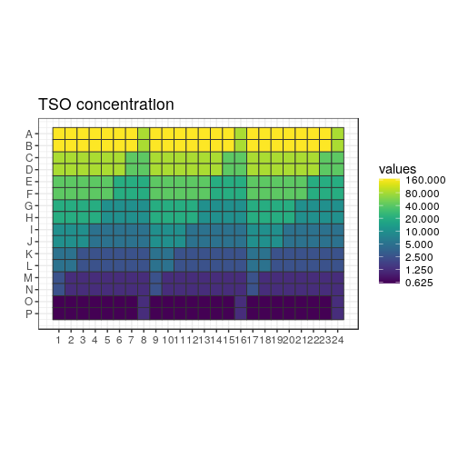
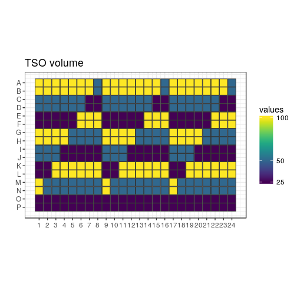
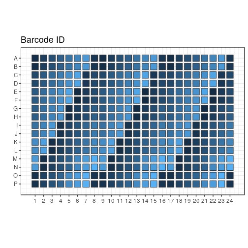
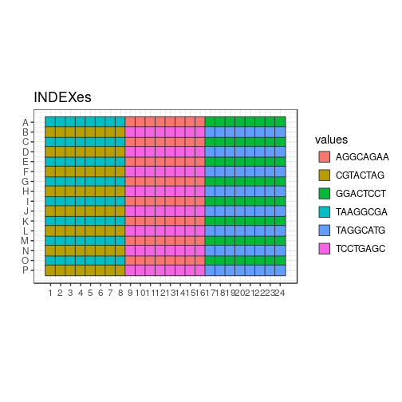
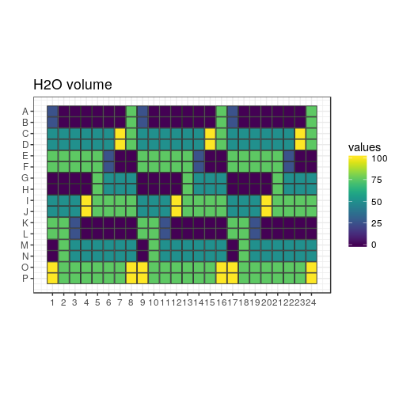
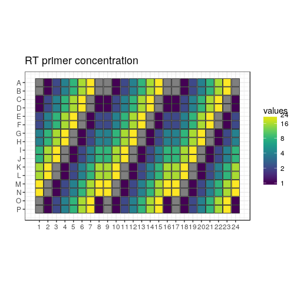
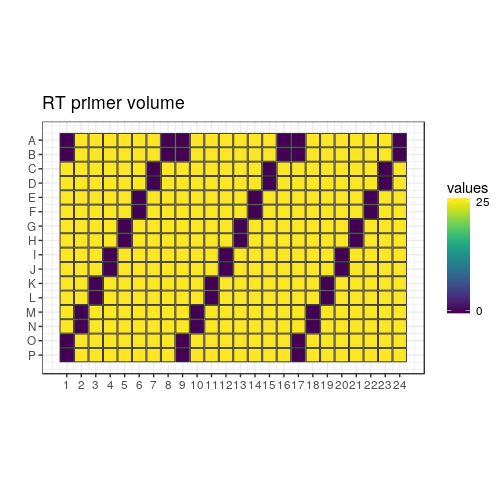
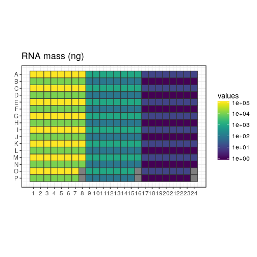
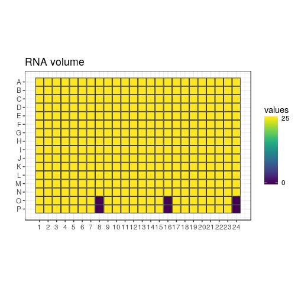

```r
variant <- "a"
newseed <- "n"
indexes <- c("TAAGGCGA", "CGTACTAG", "AGGCAGAA", "TCCTGAGC", "GGACTCCT", "TAGGCATG")
plateID <- "Q"
```


New test of TSO, RT primer and RNA amounts
==========================================

In this design, the TSOs are randomised as much as possible (taking into
account that all do not have the same stock concentrations).

Each 384-well plate is divided in 6 "sextants", interleaved for easier
collection of the reaction products.  Each sextant has a different RNA amount,
and is indexed and amplified independently.  There are 9 × 7 combinations of TSO
and RT primer concentrations, plus one negative control with no RNA.  Each
reaction is assigned to a random well within the sextant.

For each plate replicate, a different random seed is used, to generate
different randomisations.

## Load scripts and libraries.


```r
library("magrittr")   # For its diamond pipe operators
library("ggplot2")    # For plotting
library("platetools") # For defining and manipulating 384-well plates
library("plyr")
library("tibble")     # For comfortable command-line operations

# The set_block function that will become part of platetools
source("https://raw.githubusercontent.com/charles-plessy/platetools/76213accb1704d11a2d96fb1f6284d0b46117778/R/set_block.R")

# Do not load the whole smallCAGEqc package, just get the barcode data.
data("nanoCAGE2017barcodes", package = "smallCAGEqc")
```


Selected TSOs
=============

TSOs are transferred as 1, 2 or 4 drops from 3 different starting
concentrations in the source plate.  Let's call each starting concentration
"Tier_A", "Tier_B" or "Tier_C".  Given constraints on remaining volume, some
TSOs can only be Tier_C, etc.  Let's refer to the TSOs by their numerical
identifier.  Tier_N is a set of barcodes that can be used for the negative
control.  See the file [Labcyte-RT6_TSO_stock_to_source.xls](Labcyte-RT6_TSO_stock_to_source.xls)
for details on the cherrypicking of the TSOs.


```r
Tier_A <- c(  3, 15, 27, 39, 51, 63, 75
           , 10, 22, 34, 46, 58, 70, 82
           , 11, 23, 35, 47, 59, 71, 83)

Tier_B <- c(  1, 13, 25, 37, 49, 61, 73
           ,  2, 14, 26, 38, 50, 62, 74
           ,  7, 19, 31, 43, 55, 67, 79)

Tier_C <- c(  4, 16, 28, 40, 52, 64, 76
           ,  5, 17, 29, 41, 65, 77, 89
           ,  6, 18, 30, 42, 66, 78, 90)

Tier_N <- c(  8, 20, 32, 44, 68, 80, 92)
```

Set Random seed
===============


```r
if (is.numeric(newseed)) set.seed(newseed)
```

Creation of sextants
====================


```r
createRandomisedSextant <- function(index, rna) {
  if (is.numeric(newseed)) {
    df <- data.frame ( BARCODE_ID = c( sample(Tier_A, 21)
                                     , sample(Tier_B, 21)
                                     , sample(Tier_C, 21)
                                     , sample(Tier_N,  1)))
  } else {
    df <- data.frame ( BARCODE_ID = c( Tier_A[1:21]
                                     , Tier_B[1:21]
                                     , Tier_C[1:21]
                                     , Tier_N[1]))
  }
  tsoMaxConc <- 800
  df$TSO_source <- c( rep(tsoMaxConc /  1, 21)
                    , rep(tsoMaxConc /  8, 21)
                    , rep(tsoMaxConc /  64, 21)
                    , tsoMaxConc / 32)
  df$TSO_vol <- c(rep(c(rep(100,7), rep(50,7), rep(25,7)),3), 25)
  df$TSO <- df$TSO_source * df$TSO_vol / 500
  df$RT_PRIMERS <- c(rep(c(0, 1, 2, 4, 8, 16, 24), 9), 1)
  df$RT_PRIMERS_vol <- 25
  df[df$RT_PRIMERS == 0, "RT_PRIMERS_vol"] <- 0
  df$MASTER_MIX_vol <- 350
  df$INDEX <- index
  df$RNA <- rna
  df$RNA_vol <- 25
  df[64, "RNA_vol"] <- 0
  df$H2O_vol <- 500 - df$RNA_vol - df$RT_PRIMERS_vol - df$TSO_vol - df$MASTER_MIX_vol
  if (is.numeric(newseed)) df <- df[sample(nrow(df)),]
  df
}
```


Sextants
========

Plate layout
------------

Create a data frame representing the contents of each well.


```r
plate           <- tibble(well = platetools::num_to_well(1:384, plate = "384"))
plate$row       <- sub("..$", "", plate$well) %>% factor
plate$col       <- sub("^.",  "", plate$well) %>% as.numeric %>% factor
```

Fill sextants
-------------


```r
plate$sxt <- paste0 (
  c(rep("A", 8), rep("B", 8), rep("C", 8)),
  ifelse (plate$row %in% LETTERS[1:8 * 2], 2, 1)
) %>% factor

plate %<>% arrange(sxt)

plate %<>% cbind( rbind( createRandomisedSextant(indexes[1], 1e5)
                       , createRandomisedSextant(indexes[2], 1e4)
                       , createRandomisedSextant(indexes[3], 1e3)
                       , createRandomisedSextant(indexes[4], 1e2)
                       , createRandomisedSextant(indexes[5], 1e1)
                       , createRandomisedSextant(indexes[6], 1e0))
      ) %>% as.tibble()

plate$BARCODE_ID
```

```
##   [1]  3 15 27 39 51 63 75 10 22 34 46 58 70 82 11 23 35 47 59 71 83  1 13 25 37 49 61 73  2 14 26
##  [32] 38 50 62 74  7 19 31 43 55 67 79  4 16 28 40 52 64 76  5 17 29 41 65 77 89  6 18 30 42 66 78
##  [63] 90  8  3 15 27 39 51 63 75 10 22 34 46 58 70 82 11 23 35 47 59 71 83  1 13 25 37 49 61 73  2
##  [94] 14 26 38 50 62 74  7 19 31 43 55 67 79  4 16 28 40 52 64 76  5 17 29 41 65 77 89  6 18 30 42
## [125] 66 78 90  8  3 15 27 39 51 63 75 10 22 34 46 58 70 82 11 23 35 47 59 71 83  1 13 25 37 49 61
## [156] 73  2 14 26 38 50 62 74  7 19 31 43 55 67 79  4 16 28 40 52 64 76  5 17 29 41 65 77 89  6 18
## [187] 30 42 66 78 90  8  3 15 27 39 51 63 75 10 22 34 46 58 70 82 11 23 35 47 59 71 83  1 13 25 37
## [218] 49 61 73  2 14 26 38 50 62 74  7 19 31 43 55 67 79  4 16 28 40 52 64 76  5 17 29 41 65 77 89
## [249]  6 18 30 42 66 78 90  8  3 15 27 39 51 63 75 10 22 34 46 58 70 82 11 23 35 47 59 71 83  1 13
## [280] 25 37 49 61 73  2 14 26 38 50 62 74  7 19 31 43 55 67 79  4 16 28 40 52 64 76  5 17 29 41 65
## [311] 77 89  6 18 30 42 66 78 90  8  3 15 27 39 51 63 75 10 22 34 46 58 70 82 11 23 35 47 59 71 83
## [342]  1 13 25 37 49 61 73  2 14 26 38 50 62 74  7 19 31 43 55 67 79  4 16 28 40 52 64 76  5 17 29
## [373] 41 65 77 89  6 18 30 42 66 78 90  8
```

```r
plate$INDEX %<>% factor
plate$BARCODE_SEQ <- nanoCAGE2017barcodes[plate$BARCODE_ID, "barcodes"]

plate$RNA_level <- plate$RNA %>% factor(labels = paste0("RNA_", LETTERS[1:6]))
plate$RTP_level <- plate$RT_PRIMERS %>% factor(labels = paste0("RTP_", LETTERS[1:7]))

plate$RNA[plate$RNA_vol == 0] <- 0
plate$plateID <- plateID
```

Summary
=======


```r
plate 
```

```
## # A tibble: 384 x 19
##    well  row   col   sxt   BARCODE_ID TSO_source TSO_vol   TSO RT_PRIMERS RT_PRIMERS_vol
##  * <chr> <fct> <fct> <fct>      <dbl>      <dbl>   <dbl> <dbl>      <dbl>          <dbl>
##  1 A01   A     1     A1             3        800     100   160          0              0
##  2 A02   A     2     A1            15        800     100   160          1             25
##  3 A03   A     3     A1            27        800     100   160          2             25
##  4 A04   A     4     A1            39        800     100   160          4             25
##  5 A05   A     5     A1            51        800     100   160          8             25
##  6 A06   A     6     A1            63        800     100   160         16             25
##  7 A07   A     7     A1            75        800     100   160         24             25
##  8 A08   A     8     A1            10        800      50    80          0              0
##  9 C01   C     1     A1            22        800      50    80          1             25
## 10 C02   C     2     A1            34        800      50    80          2             25
## # ... with 374 more rows, and 9 more variables: MASTER_MIX_vol <dbl>, INDEX <fct>, RNA <dbl>,
## #   RNA_vol <dbl>, H2O_vol <dbl>, BARCODE_SEQ <chr>, RNA_level <fct>, RTP_level <fct>,
## #   plateID <chr>
```

```r
summary(plate)
```

```
##      well                row           col      sxt       BARCODE_ID      TSO_source   
##  Length:384         A      : 24   1      : 16   A1:64   Min.   : 1.00   Min.   : 12.5  
##  Class :character   B      : 24   2      : 16   A2:64   1st Qu.:18.75   1st Qu.: 12.5  
##  Mode  :character   C      : 24   3      : 16   B1:64   Median :40.50   Median :100.0  
##                     D      : 24   4      : 16   B2:64   Mean   :42.05   Mean   :299.8  
##                     E      : 24   5      : 16   C1:64   3rd Qu.:64.25   3rd Qu.:800.0  
##                     F      : 24   6      : 16   C2:64   Max.   :90.00   Max.   :800.0  
##                     (Other):240   (Other):288                                          
##     TSO_vol            TSO            RT_PRIMERS    RT_PRIMERS_vol  MASTER_MIX_vol      INDEX   
##  Min.   : 25.00   Min.   :  0.625   Min.   : 0.00   Min.   : 0.00   Min.   :350    AGGCAGAA:64  
##  1st Qu.: 25.00   1st Qu.:  2.500   1st Qu.: 1.00   1st Qu.:25.00   1st Qu.:350    CGTACTAG:64  
##  Median : 50.00   Median : 10.000   Median : 4.00   Median :25.00   Median :350    GGACTCCT:64  
##  Mean   : 57.81   Mean   : 34.951   Mean   : 7.75   Mean   :21.48   Mean   :350    TAAGGCGA:64  
##  3rd Qu.:100.00   3rd Qu.: 40.000   3rd Qu.:16.00   3rd Qu.:25.00   3rd Qu.:350    TAGGCATG:64  
##  Max.   :100.00   Max.   :160.000   Max.   :24.00   Max.   :25.00   Max.   :350    TCCTGAGC:64  
##                                                                                                 
##       RNA            RNA_vol         H2O_vol       BARCODE_SEQ        RNA_level  RTP_level 
##  Min.   :     0   Min.   : 0.00   Min.   :  0.00   Length:384         RNA_A:64   RTP_A:54  
##  1st Qu.:    10   1st Qu.:25.00   1st Qu.:  0.00   Class :character   RNA_B:64   RTP_B:60  
##  Median :   100   Median :25.00   Median : 50.00   Mode  :character   RNA_C:64   RTP_C:54  
##  Mean   : 18229   Mean   :24.61   Mean   : 46.09                      RNA_D:64   RTP_D:54  
##  3rd Qu.: 10000   3rd Qu.:25.00   3rd Qu.: 75.00                      RNA_E:64   RTP_E:54  
##  Max.   :100000   Max.   :25.00   Max.   :100.00                      RNA_F:64   RTP_F:54  
##                                                                                  RTP_G:54  
##    plateID         
##  Length:384        
##  Class :character  
##  Mode  :character  
##                    
##                    
##                    
## 
```

```r
write.table(plate, paste0("plate6", variant, ".txt"), sep = "\t", quote = FALSE, row.names = FALSE)
```

Plate maps
==========


```r
plateMap <- function(x, title) {
  platetools::raw_map(plate[[x]], well=plate$well, plate="384") +
  ggtitle(title) +
  viridis::scale_fill_viridis(breaks = unique(plate[[x]]))
}

plateMapLog <- function(x, title) {
  platetools::raw_map(plate[[x]], well=plate$well, plate="384") +
  ggtitle(title) +
  viridis::scale_fill_viridis(breaks = unique(plate[[x]]), trans = "log")
}
```

TSO
---


```r
(plot_TSO <- plateMapLog("TSO", "TSO concentration"))
```

<!-- -->


```r
(plot_TSO_vol <- plateMap("TSO_vol", "TSO volume"))
```

<!-- -->


```r
(plot_BARCODES <- platetools::raw_map(plate[["BARCODE_ID"]], well=plate$well, plate="384") +
  ggtitle("Barcode ID")) + theme(legend.position="none")
```

<!-- -->

Indexes
-------


```r
(plot_indexes <- platetools::raw_map(plate[["INDEX"]], well=plate$well, plate="384") +
  ggtitle("INDEXes"))
```

<!-- -->

H2O
---


```r
(plot_H2O_vol <- plateMap("H2O_vol", "H2O volume"))
```

<!-- -->

RT primers
----------


```r
(plot_RT <- plateMapLog("RT_PRIMERS", "RT primer concentration"))
```

```
## Warning: Transformation introduced infinite values in discrete y-axis
```

<!-- -->


```r
(plot_RT_vol <- plateMap("RT_PRIMERS_vol", "RT primer volume"))
```

<!-- -->

RNA mass
--------


```r
(plot_RNA <- plateMapLog("RNA", "RNA mass (ng)"))
```

```
## Warning: Transformation introduced infinite values in discrete y-axis
```

<!-- -->


```r
(plot_RNA_vol <- plateMap("RNA_vol", "RNA volume"))
```

<!-- -->


Transfer file
=============

## Source plate layout

### TSO


```r
nanoCAGE2017barcodes$well <- unlist(lapply(LETTERS[1:8], function(x) paste(x, sprintf("%02d", 1:12), sep = "")))

tso_block <- data.frame( id  = c(Tier_A, Tier_B, Tier_C, Tier_N)
                       , row = unlist(lapply(LETTERS[1:10], rep, 7))
                       , col = rep(1:7, 10))

tso_block$well <- paste0(tso_block$row, "0", tso_block$col)

tso_block$barcodes <- nanoCAGE2017barcodes[tso_block$id, "barcodes"]

source <- tibble(well = platetools::num_to_well(1:384, plate = "384"))

for (n in 1:nrow(tso_block))
  source %<>% set_block( tso_block[n,"well"]
                       , tso_block[n,"barcodes"]
                       , 20000)
```

### Water


```r
source %<>% set_block("M01~M06", "H2O", 20000)
```

### RNA


```r
levels(plate$RNA %>% factor)
```

```
## [1] "0"     "1"     "10"    "100"   "1000"  "10000" "1e+05"
```

```r
levels(plate$RNA_level)
```

```
## [1] "RNA_A" "RNA_B" "RNA_C" "RNA_D" "RNA_E" "RNA_F"
```

```r
source %<>% set_block("L01", "RNA_F", 20000)
source %<>% set_block("L02", "RNA_E", 20000)
source %<>% set_block("L03", "RNA_D", 20000)
source %<>% set_block("L04", "RNA_C", 20000)
source %<>% set_block("L05", "RNA_B", 20000)
source %<>% set_block("L06", "RNA_A", 20000)
```

### RNA


```r
levels(plate$RT_PRIMERS %>% factor)
```

```
## [1] "0"  "1"  "2"  "4"  "8"  "16" "24"
```

```r
levels(plate$RTP_level)
```

```
## [1] "RTP_A" "RTP_B" "RTP_C" "RTP_D" "RTP_E" "RTP_F" "RTP_G"
```

```r
source %<>% set_block("K01", "RTP_A", 20000)
source %<>% set_block("K02", "RTP_B", 20000)
source %<>% set_block("K03", "RTP_C", 20000)
source %<>% set_block("K04", "RTP_D", 20000)
source %<>% set_block("K05", "RTP_E", 20000)
source %<>% set_block("K06", "RTP_F", 20000)
source %<>% set_block("K07", "RTP_G", 20000)
```

## Plan plate


```r
planPlate <- tibble(well = platetools::num_to_well(1:384, plate = "384"))

for (n in 1:nrow(plate)) {
  planPlate %<>% set_block( plate[[n,"well"]]
                          , plate[[n,"BARCODE_SEQ"]] %>% as.character
                          , plate[[n,"TSO_vol"]])
  planPlate %<>% set_block( plate[[n,"well"]]
                          , "H2O"
                          , plate[[n,"H2O_vol"]])
  planPlate %<>% set_block( plate[[n,"well"]]
                          , plate[[n,"RTP_level"]] %>% as.character
                          , plate[[n,"RT_PRIMERS_vol"]])
  planPlate %<>% set_block( plate[[n,"well"]]
                          , plate[[n,"RNA_level"]] %>% as.character
                          , plate[[n,"RNA_vol"]])
}
planPlate %<>% replace( . == 0, NA)
```

## Plan transfer


```r
source("plates.R")
```

```
## Creating a generic function for 'colnames' from package 'base' in the global environment
```

```r
source("echo.R")

planPlate   <- Plate(plate = planPlate)
sourcePlate <- Plate(plate = source)
destPlate   <- Plate(plate = tibble::tibble(well = num_to_well(1:384, plate = "384")))

echo <- planTransfers(sourcePlate, destPlate, planPlate)
echo
```

```
## A 525 Echo machine:
##   Source plate:      A Plate with data about 384 wells (dead volume: 10000; max volume: 1e+05).
##   Destination plate: A Plate with data about 384 wells (dead volume: 10000; max volume: 1e+05).
## Transducer at the following coordinates:
##   Source:      L06 (384-well format)
##   Destination: P23 (384-well format)
## 1368 elements in the log.
```

```r
transfers <- as.data.frame(echo %>% showLogs)
transfers <- transfers[order(transfers$from),]

colnames(transfers) <- c("Source well", "Destination well", "Transfer volume", "what")

transfers
```

```
##      Source well Destination well Transfer volume   what
## 1            A01              A01             100 ACACTC
## 2            A01              A09             100 ACACTC
## 3            A01              A17             100 ACACTC
## 4            A01              B01             100 ACACTC
## 5            A01              B09             100 ACACTC
## 6            A01              B17             100 ACACTC
## 346          A02              A02             100 AGTCTC
## 347          A02              A10             100 AGTCTC
## 348          A02              A18             100 AGTCTC
## 349          A02              B02             100 AGTCTC
## 350          A02              B10             100 AGTCTC
## 351          A02              B18             100 AGTCTC
## 412          A03              A03             100 ATCTGA
## 413          A03              A11             100 ATCTGA
## 414          A03              A19             100 ATCTGA
## 415          A03              B03             100 ATCTGA
## 416          A03              B11             100 ATCTGA
## 417          A03              B19             100 ATCTGA
## 472          A04              A04             100 CGACTC
## 473          A04              A12             100 CGACTC
## 474          A04              A20             100 CGACTC
## 475          A04              B04             100 CGACTC
## 476          A04              B12             100 CGACTC
## 477          A04              B20             100 CGACTC
## 532          A05              A05             100 CTGCTC
## 533          A05              A13             100 CTGCTC
## 534          A05              A21             100 CTGCTC
## 535          A05              B05             100 CTGCTC
## 536          A05              B13             100 CTGCTC
## 537          A05              B21             100 CTGCTC
## 592          A06              A06             100 GAGTGA
## 593          A06              A14             100 GAGTGA
## 594          A06              A22             100 GAGTGA
## 595          A06              B06             100 GAGTGA
## 596          A06              B14             100 GAGTGA
## 597          A06              B22             100 GAGTGA
## 652          A07              A07             100 GTACTC
## 653          A07              A15             100 GTACTC
## 654          A07              A23             100 GTACTC
## 655          A07              B07             100 GTACTC
## 656          A07              B15             100 GTACTC
## 657          A07              B23             100 GTACTC
## 712          B01              A08              50 AGTACG
## 713          B01              A16              50 AGTACG
## 714          B01              A24              50 AGTACG
## 715          B01              B08              50 AGTACG
## 716          B01              B16              50 AGTACG
## 717          B01              B24              50 AGTACG
## 718          B02              C01              50 ATCGAT
## 719          B02              C09              50 ATCGAT
## 720          B02              C17              50 ATCGAT
## 721          B02              D01              50 ATCGAT
## 722          B02              D09              50 ATCGAT
## 723          B02              D17              50 ATCGAT
## 724          B03              C02              50 CACTAC
## 725          B03              C10              50 CACTAC
## 726          B03              C18              50 CACTAC
## 727          B03              D02              50 CACTAC
## 728          B03              D10              50 CACTAC
## 729          B03              D18              50 CACTAC
## 730          B04              C03              50 CTGACG
## 731          B04              C11              50 CTGACG
## 732          B04              C19              50 CTGACG
## 733          B04              D03              50 CTGACG
## 734          B04              D11              50 CTGACG
## 735          B04              D19              50 CTGACG
## 736          B05              C04              50 GAGCAG
## 737          B05              C12              50 GAGCAG
## 738          B05              C20              50 GAGCAG
## 739          B05              D04              50 GAGCAG
## 740          B05              D12              50 GAGCAG
## 741          B05              D20              50 GAGCAG
## 742          B06              C05              50 GCTGAT
## 743          B06              C13              50 GCTGAT
## 744          B06              C21              50 GCTGAT
## 745          B06              D05              50 GCTGAT
## 746          B06              D13              50 GCTGAT
## 747          B06              D21              50 GCTGAT
## 748          B07              C06              50 TATACG
## 749          B07              C14              50 TATACG
## 750          B07              C22              50 TATACG
## 751          B07              D06              50 TATACG
## 752          B07              D14              50 TATACG
## 753          B07              D22              50 TATACG
## 754          C01              C07              25 AGTAGC
## 755          C01              C15              25 AGTAGC
## 756          C01              C23              25 AGTAGC
## 757          C01              D07              25 AGTAGC
## 758          C01              D15              25 AGTAGC
## 759          C01              D23              25 AGTAGC
## 760          C02              C08              25 ATCGCA
## 761          C02              C16              25 ATCGCA
## 762          C02              C24              25 ATCGCA
## 763          C02              D08              25 ATCGCA
## 764          C02              D16              25 ATCGCA
## 765          C02              D24              25 ATCGCA
## 766          C03              E01              25 CACTCT
## 767          C03              E09              25 CACTCT
## 768          C03              E17              25 CACTCT
## 769          C03              F01              25 CACTCT
## 770          C03              F09              25 CACTCT
## 771          C03              F17              25 CACTCT
## 772          C04              E02              25 CTGAGC
## 773          C04              E10              25 CTGAGC
## 774          C04              E18              25 CTGAGC
## 775          C04              F02              25 CTGAGC
## 776          C04              F10              25 CTGAGC
## 777          C04              F18              25 CTGAGC
## 778          C05              E03              25 GAGCGT
## 779          C05              E11              25 GAGCGT
## 780          C05              E19              25 GAGCGT
## 781          C05              F03              25 GAGCGT
## 782          C05              F11              25 GAGCGT
## 783          C05              F19              25 GAGCGT
## 784          C06              E04              25 GCTGCA
## 785          C06              E12              25 GCTGCA
## 786          C06              E20              25 GCTGCA
## 787          C06              F04              25 GCTGCA
## 788          C06              F12              25 GCTGCA
## 789          C06              F20              25 GCTGCA
## 790          C07              E05              25 TATAGC
## 791          C07              E13              25 TATAGC
## 792          C07              E21              25 TATAGC
## 793          C07              F05              25 TATAGC
## 794          C07              F13              25 TATAGC
## 795          C07              F21              25 TATAGC
## 796          D01              E06             100 ACACAG
## 797          D01              E14             100 ACACAG
## 798          D01              E22             100 ACACAG
## 799          D01              F06             100 ACACAG
## 800          D01              F14             100 ACACAG
## 801          D01              F22             100 ACACAG
## 802          D02              E07             100 AGTCAG
## 803          D02              E15             100 AGTCAG
## 804          D02              E23             100 AGTCAG
## 805          D02              F07             100 AGTCAG
## 806          D02              F15             100 AGTCAG
## 807          D02              F23             100 AGTCAG
## 808          D03              E08             100 ATCTAC
## 809          D03              E16             100 ATCTAC
## 810          D03              E24             100 ATCTAC
## 811          D03              F08             100 ATCTAC
## 812          D03              F16             100 ATCTAC
## 813          D03              F24             100 ATCTAC
## 814          D04              G01             100 CGACAG
## 815          D04              G09             100 CGACAG
## 816          D04              G17             100 CGACAG
## 817          D04              H01             100 CGACAG
## 818          D04              H09             100 CGACAG
## 819          D04              H17             100 CGACAG
## 820          D05              G02             100 CTGCAG
## 821          D05              G10             100 CTGCAG
## 822          D05              G18             100 CTGCAG
## 823          D05              H02             100 CTGCAG
## 824          D05              H10             100 CTGCAG
## 825          D05              H18             100 CTGCAG
## 826          D06              G03             100 GAGTAC
## 827          D06              G11             100 GAGTAC
## 828          D06              G19             100 GAGTAC
## 829          D06              H03             100 GAGTAC
## 830          D06              H11             100 GAGTAC
## 831          D06              H19             100 GAGTAC
## 832          D07              G04             100 GTACAG
## 833          D07              G12             100 GTACAG
## 834          D07              G20             100 GTACAG
## 835          D07              H04             100 GTACAG
## 836          D07              H12             100 GTACAG
## 837          D07              H20             100 GTACAG
## 838          E01              G05              50 ACACGT
## 839          E01              G13              50 ACACGT
## 840          E01              G21              50 ACACGT
## 841          E01              H05              50 ACACGT
## 842          E01              H13              50 ACACGT
## 843          E01              H21              50 ACACGT
## 844          E02              G06              50 AGTCGT
## 845          E02              G14              50 AGTCGT
## 846          E02              G22              50 AGTCGT
## 847          E02              H06              50 AGTCGT
## 848          E02              H14              50 AGTCGT
## 849          E02              H22              50 AGTCGT
## 850          E03              G07              50 ATCTCT
## 851          E03              G15              50 ATCTCT
## 852          E03              G23              50 ATCTCT
## 853          E03              H07              50 ATCTCT
## 854          E03              H15              50 ATCTCT
## 855          E03              H23              50 ATCTCT
## 856          E04              G08              50 CGACGT
## 857          E04              G16              50 CGACGT
## 858          E04              G24              50 CGACGT
## 859          E04              H08              50 CGACGT
## 860          E04              H16              50 CGACGT
## 861          E04              H24              50 CGACGT
## 862          E05              I01              50 CTGCGT
## 863          E05              I09              50 CTGCGT
## 864          E05              I17              50 CTGCGT
## 865          E05              J01              50 CTGCGT
## 866          E05              J09              50 CTGCGT
## 867          E05              J17              50 CTGCGT
## 868          E06              I02              50 GAGTCT
## 869          E06              I10              50 GAGTCT
## 870          E06              I18              50 GAGTCT
## 871          E06              J02              50 GAGTCT
## 872          E06              J10              50 GAGTCT
## 873          E06              J18              50 GAGTCT
## 874          E07              I03              50 GTACGT
## 875          E07              I11              50 GTACGT
## 876          E07              I19              50 GTACGT
## 877          E07              J03              50 GTACGT
## 878          E07              J11              50 GTACGT
## 879          E07              J19              50 GTACGT
## 880          F01              I04              25 ACATAC
## 881          F01              I12              25 ACATAC
## 882          F01              I20              25 ACATAC
## 883          F01              J04              25 ACATAC
## 884          F01              J12              25 ACATAC
## 885          F01              J20              25 ACATAC
## 886          F02              I05              25 ATCACG
## 887          F02              I13              25 ATCACG
## 888          F02              I21              25 ATCACG
## 889          F02              J05              25 ATCACG
## 890          F02              J13              25 ATCACG
## 891          F02              J21              25 ATCACG
## 892          F03              I06              25 CACGAT
## 893          F03              I14              25 CACGAT
## 894          F03              I22              25 CACGAT
## 895          F03              J06              25 CACGAT
## 896          F03              J14              25 CACGAT
## 897          F03              J22              25 CACGAT
## 898          F04              I07              25 CGATAC
## 899          F04              I15              25 CGATAC
## 900          F04              I23              25 CGATAC
## 901          F04              J07              25 CGATAC
## 902          F04              J15              25 CGATAC
## 903          F04              J23              25 CGATAC
## 904          F05              I08              25 GAGACG
## 905          F05              I16              25 GAGACG
## 906          F05              I24              25 GAGACG
## 907          F05              J08              25 GAGACG
## 908          F05              J16              25 GAGACG
## 909          F05              J24              25 GAGACG
## 910          F06              K01              25 GCTCAG
## 911          F06              K09              25 GCTCAG
## 912          F06              K17              25 GCTCAG
## 913          F06              L01              25 GCTCAG
## 914          F06              L09              25 GCTCAG
## 915          F06              L17              25 GCTCAG
## 916          F07              K02              25 GTATAC
## 917          F07              K10              25 GTATAC
## 918          F07              K18              25 GTATAC
## 919          F07              L02              25 GTATAC
## 920          F07              L10              25 GTATAC
## 921          F07              L18              25 GTATAC
## 922          G01              K03             100 ACAGAT
## 923          G01              K11             100 ACAGAT
## 924          G01              K19             100 ACAGAT
## 925          G01              L03             100 ACAGAT
## 926          G01              L11             100 ACAGAT
## 927          G01              L19             100 ACAGAT
## 928          G02              K04             100 AGTGAT
## 929          G02              K12             100 AGTGAT
## 930          G02              K20             100 AGTGAT
## 931          G02              L04             100 AGTGAT
## 932          G02              L12             100 AGTGAT
## 933          G02              L20             100 AGTGAT
## 934          G03              K05             100 CACACG
## 935          G03              K13             100 CACACG
## 936          G03              K21             100 CACACG
## 937          G03              L05             100 CACACG
## 938          G03              L13             100 CACACG
## 939          G03              L21             100 CACACG
## 940          G04              K06             100 CGAGAT
## 941          G04              K14             100 CGAGAT
## 942          G04              K22             100 CGAGAT
## 943          G04              L06             100 CGAGAT
## 944          G04              L14             100 CGAGAT
## 945          G04              L22             100 CGAGAT
## 946          G05              K07             100 CTGTAC
## 947          G05              K15             100 CTGTAC
## 948          G05              K23             100 CTGTAC
## 949          G05              L07             100 CTGTAC
## 950          G05              L15             100 CTGTAC
## 951          G05              L23             100 CTGTAC
## 952          G06              K08             100 GCTACG
## 953          G06              K16             100 GCTACG
## 954          G06              K24             100 GCTACG
## 955          G06              L08             100 GCTACG
## 956          G06              L16             100 GCTACG
## 957          G06              L24             100 GCTACG
## 958          G07              M01             100 GTAGAT
## 959          G07              M09             100 GTAGAT
## 960          G07              M17             100 GTAGAT
## 961          G07              N01             100 GTAGAT
## 962          G07              N09             100 GTAGAT
## 963          G07              N17             100 GTAGAT
## 964          H01              M02              50 ACAGCA
## 965          H01              M10              50 ACAGCA
## 966          H01              M18              50 ACAGCA
## 967          H01              N02              50 ACAGCA
## 968          H01              N10              50 ACAGCA
## 969          H01              N18              50 ACAGCA
## 970          H02              M03              50 AGTGCA
## 971          H02              M11              50 AGTGCA
## 972          H02              M19              50 AGTGCA
## 973          H02              N03              50 AGTGCA
## 974          H02              N11              50 AGTGCA
## 975          H02              N19              50 AGTGCA
## 976          H03              M04              50 CACAGC
## 977          H03              M12              50 CACAGC
## 978          H03              M20              50 CACAGC
## 979          H03              N04              50 CACAGC
## 980          H03              N12              50 CACAGC
## 981          H03              N20              50 CACAGC
## 982          H04              M05              50 CGAGCA
## 983          H04              M13              50 CGAGCA
## 984          H04              M21              50 CGAGCA
## 985          H04              N05              50 CGAGCA
## 986          H04              N13              50 CGAGCA
## 987          H04              N21              50 CGAGCA
## 988          H05              M06              50 GCTAGC
## 989          H05              M14              50 GCTAGC
## 990          H05              M22              50 GCTAGC
## 991          H05              N06              50 GCTAGC
## 992          H05              N14              50 GCTAGC
## 993          H05              N22              50 GCTAGC
## 994          H06              M07              50 GTAGCA
## 995          H06              M15              50 GTAGCA
## 996          H06              M23              50 GTAGCA
## 997          H06              N07              50 GTAGCA
## 998          H06              N15              50 GTAGCA
## 999          H06              N23              50 GTAGCA
## 1000         H07              M08              50 TATGCA
## 1001         H07              M16              50 TATGCA
## 1002         H07              M24              50 TATGCA
## 1003         H07              N08              50 TATGCA
## 1004         H07              N16              50 TATGCA
## 1005         H07              N24              50 TATGCA
## 1006         I01              O01              25 ACAGTG
## 1007         I01              O09              25 ACAGTG
## 1008         I01              O17              25 ACAGTG
## 1009         I01              P01              25 ACAGTG
## 1010         I01              P09              25 ACAGTG
## 1011         I01              P17              25 ACAGTG
## 1012         I02              O02              25 AGTGTG
## 1013         I02              O10              25 AGTGTG
## 1014         I02              O18              25 AGTGTG
## 1015         I02              P02              25 AGTGTG
## 1016         I02              P10              25 AGTGTG
## 1017         I02              P18              25 AGTGTG
## 1018         I03              O03              25 CACATA
## 1019         I03              O11              25 CACATA
## 1020         I03              O19              25 CACATA
## 1021         I03              P03              25 CACATA
## 1022         I03              P11              25 CACATA
## 1023         I03              P19              25 CACATA
## 1024         I04              O04              25 CGAGTG
## 1025         I04              O12              25 CGAGTG
## 1026         I04              O20              25 CGAGTG
## 1027         I04              P04              25 CGAGTG
## 1028         I04              P12              25 CGAGTG
## 1029         I04              P20              25 CGAGTG
## 1030         I05              O05              25 GCTATA
## 1031         I05              O13              25 GCTATA
## 1032         I05              O21              25 GCTATA
## 1033         I05              P05              25 GCTATA
## 1034         I05              P13              25 GCTATA
## 1035         I05              P21              25 GCTATA
## 1036         I06              O06              25 GTAGTG
## 1037         I06              O14              25 GTAGTG
## 1038         I06              O22              25 GTAGTG
## 1039         I06              P06              25 GTAGTG
## 1040         I06              P14              25 GTAGTG
## 1041         I06              P22              25 GTAGTG
## 1042         I07              O07              25 TATGTG
## 1043         I07              O15              25 TATGTG
## 1044         I07              O23              25 TATGTG
## 1045         I07              P07              25 TATGTG
## 1046         I07              P15              25 TATGTG
## 1047         I07              P23              25 TATGTG
## 1048         J01              O08              25 ACATCT
## 1049         J01              O16              25 ACATCT
## 1050         J01              O24              25 ACATCT
## 1051         J01              P08              25 ACATCT
## 1052         J01              P16              25 ACATCT
## 1053         J01              P24              25 ACATCT
## 352          K02              A02              25  RTP_B
## 353          K02              A10              25  RTP_B
## 354          K02              A18              25  RTP_B
## 355          K02              B02              25  RTP_B
## 356          K02              B10              25  RTP_B
## 357          K02              B18              25  RTP_B
## 358          K02              C01              25  RTP_B
## 359          K02              C08              25  RTP_B
## 360          K02              C09              25  RTP_B
## 361          K02              C16              25  RTP_B
## 362          K02              C17              25  RTP_B
## 363          K02              C24              25  RTP_B
## 364          K02              D01              25  RTP_B
## 365          K02              D08              25  RTP_B
## 366          K02              D09              25  RTP_B
## 367          K02              D16              25  RTP_B
## 368          K02              D17              25  RTP_B
## 369          K02              D24              25  RTP_B
## 370          K02              E07              25  RTP_B
## 371          K02              E15              25  RTP_B
## 372          K02              E23              25  RTP_B
## 373          K02              F07              25  RTP_B
## 374          K02              F15              25  RTP_B
## 375          K02              F23              25  RTP_B
## 376          K02              G06              25  RTP_B
## 377          K02              G14              25  RTP_B
## 378          K02              G22              25  RTP_B
## 379          K02              H06              25  RTP_B
## 380          K02              H14              25  RTP_B
## 381          K02              H22              25  RTP_B
## 382          K02              I05              25  RTP_B
## 383          K02              I13              25  RTP_B
## 384          K02              I21              25  RTP_B
## 385          K02              J05              25  RTP_B
## 386          K02              J13              25  RTP_B
## 387          K02              J21              25  RTP_B
## 388          K02              K04              25  RTP_B
## 389          K02              K12              25  RTP_B
## 390          K02              K20              25  RTP_B
## 391          K02              L04              25  RTP_B
## 392          K02              L12              25  RTP_B
## 393          K02              L20              25  RTP_B
## 394          K02              M03              25  RTP_B
## 395          K02              M11              25  RTP_B
## 396          K02              M19              25  RTP_B
## 397          K02              N03              25  RTP_B
## 398          K02              N11              25  RTP_B
## 399          K02              N19              25  RTP_B
## 400          K02              O02              25  RTP_B
## 401          K02              O08              25  RTP_B
## 402          K02              O10              25  RTP_B
## 403          K02              O16              25  RTP_B
## 404          K02              O18              25  RTP_B
## 405          K02              O24              25  RTP_B
## 406          K02              P02              25  RTP_B
## 407          K02              P08              25  RTP_B
## 408          K02              P10              25  RTP_B
## 409          K02              P16              25  RTP_B
## 410          K02              P18              25  RTP_B
## 411          K02              P24              25  RTP_B
## 418          K03              A03              25  RTP_C
## 419          K03              A11              25  RTP_C
## 420          K03              A19              25  RTP_C
## 421          K03              B03              25  RTP_C
## 422          K03              B11              25  RTP_C
## 423          K03              B19              25  RTP_C
## 424          K03              C02              25  RTP_C
## 425          K03              C10              25  RTP_C
## 426          K03              C18              25  RTP_C
## 427          K03              D02              25  RTP_C
## 428          K03              D10              25  RTP_C
## 429          K03              D18              25  RTP_C
## 430          K03              E01              25  RTP_C
## 431          K03              E08              25  RTP_C
## 432          K03              E09              25  RTP_C
## 433          K03              E16              25  RTP_C
## 434          K03              E17              25  RTP_C
## 435          K03              E24              25  RTP_C
## 436          K03              F01              25  RTP_C
## 437          K03              F08              25  RTP_C
## 438          K03              F09              25  RTP_C
## 439          K03              F16              25  RTP_C
## 440          K03              F17              25  RTP_C
## 441          K03              F24              25  RTP_C
## 442          K03              G07              25  RTP_C
## 443          K03              G15              25  RTP_C
## 444          K03              G23              25  RTP_C
## 445          K03              H07              25  RTP_C
## 446          K03              H15              25  RTP_C
## 447          K03              H23              25  RTP_C
## 448          K03              I06              25  RTP_C
## 449          K03              I14              25  RTP_C
## 450          K03              I22              25  RTP_C
## 451          K03              J06              25  RTP_C
## 452          K03              J14              25  RTP_C
## 453          K03              J22              25  RTP_C
## 454          K03              K05              25  RTP_C
## 455          K03              K13              25  RTP_C
## 456          K03              K21              25  RTP_C
## 457          K03              L05              25  RTP_C
## 458          K03              L13              25  RTP_C
## 459          K03              L21              25  RTP_C
## 460          K03              M04              25  RTP_C
## 461          K03              M12              25  RTP_C
## 462          K03              M20              25  RTP_C
## 463          K03              N04              25  RTP_C
## 464          K03              N12              25  RTP_C
## 465          K03              N20              25  RTP_C
## 466          K03              O03              25  RTP_C
## 467          K03              O11              25  RTP_C
## 468          K03              O19              25  RTP_C
## 469          K03              P03              25  RTP_C
## 470          K03              P11              25  RTP_C
## 471          K03              P19              25  RTP_C
## 478          K04              A04              25  RTP_D
## 479          K04              A12              25  RTP_D
## 480          K04              A20              25  RTP_D
## 481          K04              B04              25  RTP_D
## 482          K04              B12              25  RTP_D
## 483          K04              B20              25  RTP_D
## 484          K04              C03              25  RTP_D
## 485          K04              C11              25  RTP_D
## 486          K04              C19              25  RTP_D
## 487          K04              D03              25  RTP_D
## 488          K04              D11              25  RTP_D
## 489          K04              D19              25  RTP_D
## 490          K04              E02              25  RTP_D
## 491          K04              E10              25  RTP_D
## 492          K04              E18              25  RTP_D
## 493          K04              F02              25  RTP_D
## 494          K04              F10              25  RTP_D
## 495          K04              F18              25  RTP_D
## 496          K04              G01              25  RTP_D
## 497          K04              G08              25  RTP_D
## 498          K04              G09              25  RTP_D
## 499          K04              G16              25  RTP_D
## 500          K04              G17              25  RTP_D
## 501          K04              G24              25  RTP_D
## 502          K04              H01              25  RTP_D
## 503          K04              H08              25  RTP_D
## 504          K04              H09              25  RTP_D
## 505          K04              H16              25  RTP_D
## 506          K04              H17              25  RTP_D
## 507          K04              H24              25  RTP_D
## 508          K04              I07              25  RTP_D
## 509          K04              I15              25  RTP_D
## 510          K04              I23              25  RTP_D
## 511          K04              J07              25  RTP_D
## 512          K04              J15              25  RTP_D
## 513          K04              J23              25  RTP_D
## 514          K04              K06              25  RTP_D
## 515          K04              K14              25  RTP_D
## 516          K04              K22              25  RTP_D
## 517          K04              L06              25  RTP_D
## 518          K04              L14              25  RTP_D
## 519          K04              L22              25  RTP_D
## 520          K04              M05              25  RTP_D
## 521          K04              M13              25  RTP_D
## 522          K04              M21              25  RTP_D
## 523          K04              N05              25  RTP_D
## 524          K04              N13              25  RTP_D
## 525          K04              N21              25  RTP_D
## 526          K04              O04              25  RTP_D
## 527          K04              O12              25  RTP_D
## 528          K04              O20              25  RTP_D
## 529          K04              P04              25  RTP_D
## 530          K04              P12              25  RTP_D
## 531          K04              P20              25  RTP_D
## 538          K05              A05              25  RTP_E
## 539          K05              A13              25  RTP_E
## 540          K05              A21              25  RTP_E
## 541          K05              B05              25  RTP_E
## 542          K05              B13              25  RTP_E
## 543          K05              B21              25  RTP_E
## 544          K05              C04              25  RTP_E
## 545          K05              C12              25  RTP_E
## 546          K05              C20              25  RTP_E
## 547          K05              D04              25  RTP_E
## 548          K05              D12              25  RTP_E
## 549          K05              D20              25  RTP_E
## 550          K05              E03              25  RTP_E
## 551          K05              E11              25  RTP_E
## 552          K05              E19              25  RTP_E
## 553          K05              F03              25  RTP_E
## 554          K05              F11              25  RTP_E
## 555          K05              F19              25  RTP_E
## 556          K05              G02              25  RTP_E
## 557          K05              G10              25  RTP_E
## 558          K05              G18              25  RTP_E
## 559          K05              H02              25  RTP_E
## 560          K05              H10              25  RTP_E
## 561          K05              H18              25  RTP_E
## 562          K05              I01              25  RTP_E
## 563          K05              I08              25  RTP_E
## 564          K05              I09              25  RTP_E
## 565          K05              I16              25  RTP_E
## 566          K05              I17              25  RTP_E
## 567          K05              I24              25  RTP_E
## 568          K05              J01              25  RTP_E
## 569          K05              J08              25  RTP_E
## 570          K05              J09              25  RTP_E
## 571          K05              J16              25  RTP_E
## 572          K05              J17              25  RTP_E
## 573          K05              J24              25  RTP_E
## 574          K05              K07              25  RTP_E
## 575          K05              K15              25  RTP_E
## 576          K05              K23              25  RTP_E
## 577          K05              L07              25  RTP_E
## 578          K05              L15              25  RTP_E
## 579          K05              L23              25  RTP_E
## 580          K05              M06              25  RTP_E
## 581          K05              M14              25  RTP_E
## 582          K05              M22              25  RTP_E
## 583          K05              N06              25  RTP_E
## 584          K05              N14              25  RTP_E
## 585          K05              N22              25  RTP_E
## 586          K05              O05              25  RTP_E
## 587          K05              O13              25  RTP_E
## 588          K05              O21              25  RTP_E
## 589          K05              P05              25  RTP_E
## 590          K05              P13              25  RTP_E
## 591          K05              P21              25  RTP_E
## 598          K06              A06              25  RTP_F
## 599          K06              A14              25  RTP_F
## 600          K06              A22              25  RTP_F
## 601          K06              B06              25  RTP_F
## 602          K06              B14              25  RTP_F
## 603          K06              B22              25  RTP_F
## 604          K06              C05              25  RTP_F
## 605          K06              C13              25  RTP_F
## 606          K06              C21              25  RTP_F
## 607          K06              D05              25  RTP_F
## 608          K06              D13              25  RTP_F
## 609          K06              D21              25  RTP_F
## 610          K06              E04              25  RTP_F
## 611          K06              E12              25  RTP_F
## 612          K06              E20              25  RTP_F
## 613          K06              F04              25  RTP_F
## 614          K06              F12              25  RTP_F
## 615          K06              F20              25  RTP_F
## 616          K06              G03              25  RTP_F
## 617          K06              G11              25  RTP_F
## 618          K06              G19              25  RTP_F
## 619          K06              H03              25  RTP_F
## 620          K06              H11              25  RTP_F
## 621          K06              H19              25  RTP_F
## 622          K06              I02              25  RTP_F
## 623          K06              I10              25  RTP_F
## 624          K06              I18              25  RTP_F
## 625          K06              J02              25  RTP_F
## 626          K06              J10              25  RTP_F
## 627          K06              J18              25  RTP_F
## 628          K06              K01              25  RTP_F
## 629          K06              K08              25  RTP_F
## 630          K06              K09              25  RTP_F
## 631          K06              K16              25  RTP_F
## 632          K06              K17              25  RTP_F
## 633          K06              K24              25  RTP_F
## 634          K06              L01              25  RTP_F
## 635          K06              L08              25  RTP_F
## 636          K06              L09              25  RTP_F
## 637          K06              L16              25  RTP_F
## 638          K06              L17              25  RTP_F
## 639          K06              L24              25  RTP_F
## 640          K06              M07              25  RTP_F
## 641          K06              M15              25  RTP_F
## 642          K06              M23              25  RTP_F
## 643          K06              N07              25  RTP_F
## 644          K06              N15              25  RTP_F
## 645          K06              N23              25  RTP_F
## 646          K06              O06              25  RTP_F
## 647          K06              O14              25  RTP_F
## 648          K06              O22              25  RTP_F
## 649          K06              P06              25  RTP_F
## 650          K06              P14              25  RTP_F
## 651          K06              P22              25  RTP_F
## 658          K07              A07              25  RTP_G
## 659          K07              A15              25  RTP_G
## 660          K07              A23              25  RTP_G
## 661          K07              B07              25  RTP_G
## 662          K07              B15              25  RTP_G
## 663          K07              B23              25  RTP_G
## 664          K07              C06              25  RTP_G
## 665          K07              C14              25  RTP_G
## 666          K07              C22              25  RTP_G
## 667          K07              D06              25  RTP_G
## 668          K07              D14              25  RTP_G
## 669          K07              D22              25  RTP_G
## 670          K07              E05              25  RTP_G
## 671          K07              E13              25  RTP_G
## 672          K07              E21              25  RTP_G
## 673          K07              F05              25  RTP_G
## 674          K07              F13              25  RTP_G
## 675          K07              F21              25  RTP_G
## 676          K07              G04              25  RTP_G
## 677          K07              G12              25  RTP_G
## 678          K07              G20              25  RTP_G
## 679          K07              H04              25  RTP_G
## 680          K07              H12              25  RTP_G
## 681          K07              H20              25  RTP_G
## 682          K07              I03              25  RTP_G
## 683          K07              I11              25  RTP_G
## 684          K07              I19              25  RTP_G
## 685          K07              J03              25  RTP_G
## 686          K07              J11              25  RTP_G
## 687          K07              J19              25  RTP_G
## 688          K07              K02              25  RTP_G
## 689          K07              K10              25  RTP_G
## 690          K07              K18              25  RTP_G
## 691          K07              L02              25  RTP_G
## 692          K07              L10              25  RTP_G
## 693          K07              L18              25  RTP_G
## 694          K07              M01              25  RTP_G
## 695          K07              M08              25  RTP_G
## 696          K07              M09              25  RTP_G
## 697          K07              M16              25  RTP_G
## 698          K07              M17              25  RTP_G
## 699          K07              M24              25  RTP_G
## 700          K07              N01              25  RTP_G
## 701          K07              N08              25  RTP_G
## 702          K07              N09              25  RTP_G
## 703          K07              N16              25  RTP_G
## 704          K07              N17              25  RTP_G
## 705          K07              N24              25  RTP_G
## 706          K07              O07              25  RTP_G
## 707          K07              O15              25  RTP_G
## 708          K07              O23              25  RTP_G
## 709          K07              P07              25  RTP_G
## 710          K07              P15              25  RTP_G
## 711          K07              P23              25  RTP_G
## 283          L01              A01              25  RNA_F
## 284          L01              A02              25  RNA_F
## 285          L01              A03              25  RNA_F
## 286          L01              A04              25  RNA_F
## 287          L01              A05              25  RNA_F
## 288          L01              A06              25  RNA_F
## 289          L01              A07              25  RNA_F
## 290          L01              A08              25  RNA_F
## 291          L01              C01              25  RNA_F
## 292          L01              C02              25  RNA_F
## 293          L01              C03              25  RNA_F
## 294          L01              C04              25  RNA_F
## 295          L01              C05              25  RNA_F
## 296          L01              C06              25  RNA_F
## 297          L01              C07              25  RNA_F
## 298          L01              C08              25  RNA_F
## 299          L01              E01              25  RNA_F
## 300          L01              E02              25  RNA_F
## 301          L01              E03              25  RNA_F
## 302          L01              E04              25  RNA_F
## 303          L01              E05              25  RNA_F
## 304          L01              E06              25  RNA_F
## 305          L01              E07              25  RNA_F
## 306          L01              E08              25  RNA_F
## 307          L01              G01              25  RNA_F
## 308          L01              G02              25  RNA_F
## 309          L01              G03              25  RNA_F
## 310          L01              G04              25  RNA_F
## 311          L01              G05              25  RNA_F
## 312          L01              G06              25  RNA_F
## 313          L01              G07              25  RNA_F
## 314          L01              G08              25  RNA_F
## 315          L01              I01              25  RNA_F
## 316          L01              I02              25  RNA_F
## 317          L01              I03              25  RNA_F
## 318          L01              I04              25  RNA_F
## 319          L01              I05              25  RNA_F
## 320          L01              I06              25  RNA_F
## 321          L01              I07              25  RNA_F
## 322          L01              I08              25  RNA_F
## 323          L01              K01              25  RNA_F
## 324          L01              K02              25  RNA_F
## 325          L01              K03              25  RNA_F
## 326          L01              K04              25  RNA_F
## 327          L01              K05              25  RNA_F
## 328          L01              K06              25  RNA_F
## 329          L01              K07              25  RNA_F
## 330          L01              K08              25  RNA_F
## 331          L01              M01              25  RNA_F
## 332          L01              M02              25  RNA_F
## 333          L01              M03              25  RNA_F
## 334          L01              M04              25  RNA_F
## 335          L01              M05              25  RNA_F
## 336          L01              M06              25  RNA_F
## 337          L01              M07              25  RNA_F
## 338          L01              M08              25  RNA_F
## 339          L01              O01              25  RNA_F
## 340          L01              O02              25  RNA_F
## 341          L01              O03              25  RNA_F
## 342          L01              O04              25  RNA_F
## 343          L01              O05              25  RNA_F
## 344          L01              O06              25  RNA_F
## 345          L01              O07              25  RNA_F
## 1054         L02              B01              25  RNA_E
## 1055         L02              B02              25  RNA_E
## 1056         L02              B03              25  RNA_E
## 1057         L02              B04              25  RNA_E
## 1058         L02              B05              25  RNA_E
## 1059         L02              B06              25  RNA_E
## 1060         L02              B07              25  RNA_E
## 1061         L02              B08              25  RNA_E
## 1062         L02              D01              25  RNA_E
## 1063         L02              D02              25  RNA_E
## 1064         L02              D03              25  RNA_E
## 1065         L02              D04              25  RNA_E
## 1066         L02              D05              25  RNA_E
## 1067         L02              D06              25  RNA_E
## 1068         L02              D07              25  RNA_E
## 1069         L02              D08              25  RNA_E
## 1070         L02              F01              25  RNA_E
## 1071         L02              F02              25  RNA_E
## 1072         L02              F03              25  RNA_E
## 1073         L02              F04              25  RNA_E
## 1074         L02              F05              25  RNA_E
## 1075         L02              F06              25  RNA_E
## 1076         L02              F07              25  RNA_E
## 1077         L02              F08              25  RNA_E
## 1078         L02              H01              25  RNA_E
## 1079         L02              H02              25  RNA_E
## 1080         L02              H03              25  RNA_E
## 1081         L02              H04              25  RNA_E
## 1082         L02              H05              25  RNA_E
## 1083         L02              H06              25  RNA_E
## 1084         L02              H07              25  RNA_E
## 1085         L02              H08              25  RNA_E
## 1086         L02              J01              25  RNA_E
## 1087         L02              J02              25  RNA_E
## 1088         L02              J03              25  RNA_E
## 1089         L02              J04              25  RNA_E
## 1090         L02              J05              25  RNA_E
## 1091         L02              J06              25  RNA_E
## 1092         L02              J07              25  RNA_E
## 1093         L02              J08              25  RNA_E
## 1094         L02              L01              25  RNA_E
## 1095         L02              L02              25  RNA_E
## 1096         L02              L03              25  RNA_E
## 1097         L02              L04              25  RNA_E
## 1098         L02              L05              25  RNA_E
## 1099         L02              L06              25  RNA_E
## 1100         L02              L07              25  RNA_E
## 1101         L02              L08              25  RNA_E
## 1102         L02              N01              25  RNA_E
## 1103         L02              N02              25  RNA_E
## 1104         L02              N03              25  RNA_E
## 1105         L02              N04              25  RNA_E
## 1106         L02              N05              25  RNA_E
## 1107         L02              N06              25  RNA_E
## 1108         L02              N07              25  RNA_E
## 1109         L02              N08              25  RNA_E
## 1110         L02              P01              25  RNA_E
## 1111         L02              P02              25  RNA_E
## 1112         L02              P03              25  RNA_E
## 1113         L02              P04              25  RNA_E
## 1114         L02              P05              25  RNA_E
## 1115         L02              P06              25  RNA_E
## 1116         L02              P07              25  RNA_E
## 1117         L03              A09              25  RNA_D
## 1118         L03              A10              25  RNA_D
## 1119         L03              A11              25  RNA_D
## 1120         L03              A12              25  RNA_D
## 1121         L03              A13              25  RNA_D
## 1122         L03              A14              25  RNA_D
## 1123         L03              A15              25  RNA_D
## 1124         L03              A16              25  RNA_D
## 1125         L03              C09              25  RNA_D
## 1126         L03              C10              25  RNA_D
## 1127         L03              C11              25  RNA_D
## 1128         L03              C12              25  RNA_D
## 1129         L03              C13              25  RNA_D
## 1130         L03              C14              25  RNA_D
## 1131         L03              C15              25  RNA_D
## 1132         L03              C16              25  RNA_D
## 1133         L03              E09              25  RNA_D
## 1134         L03              E10              25  RNA_D
## 1135         L03              E11              25  RNA_D
## 1136         L03              E12              25  RNA_D
## 1137         L03              E13              25  RNA_D
## 1138         L03              E14              25  RNA_D
## 1139         L03              E15              25  RNA_D
## 1140         L03              E16              25  RNA_D
## 1141         L03              G09              25  RNA_D
## 1142         L03              G10              25  RNA_D
## 1143         L03              G11              25  RNA_D
## 1144         L03              G12              25  RNA_D
## 1145         L03              G13              25  RNA_D
## 1146         L03              G14              25  RNA_D
## 1147         L03              G15              25  RNA_D
## 1148         L03              G16              25  RNA_D
## 1149         L03              I09              25  RNA_D
## 1150         L03              I10              25  RNA_D
## 1151         L03              I11              25  RNA_D
## 1152         L03              I12              25  RNA_D
## 1153         L03              I13              25  RNA_D
## 1154         L03              I14              25  RNA_D
## 1155         L03              I15              25  RNA_D
## 1156         L03              I16              25  RNA_D
## 1157         L03              K09              25  RNA_D
## 1158         L03              K10              25  RNA_D
## 1159         L03              K11              25  RNA_D
## 1160         L03              K12              25  RNA_D
## 1161         L03              K13              25  RNA_D
## 1162         L03              K14              25  RNA_D
## 1163         L03              K15              25  RNA_D
## 1164         L03              K16              25  RNA_D
## 1165         L03              M09              25  RNA_D
## 1166         L03              M10              25  RNA_D
## 1167         L03              M11              25  RNA_D
## 1168         L03              M12              25  RNA_D
## 1169         L03              M13              25  RNA_D
## 1170         L03              M14              25  RNA_D
## 1171         L03              M15              25  RNA_D
## 1172         L03              M16              25  RNA_D
## 1173         L03              O09              25  RNA_D
## 1174         L03              O10              25  RNA_D
## 1175         L03              O11              25  RNA_D
## 1176         L03              O12              25  RNA_D
## 1177         L03              O13              25  RNA_D
## 1178         L03              O14              25  RNA_D
## 1179         L03              O15              25  RNA_D
## 1180         L04              B09              25  RNA_C
## 1181         L04              B10              25  RNA_C
## 1182         L04              B11              25  RNA_C
## 1183         L04              B12              25  RNA_C
## 1184         L04              B13              25  RNA_C
## 1185         L04              B14              25  RNA_C
## 1186         L04              B15              25  RNA_C
## 1187         L04              B16              25  RNA_C
## 1188         L04              D09              25  RNA_C
## 1189         L04              D10              25  RNA_C
## 1190         L04              D11              25  RNA_C
## 1191         L04              D12              25  RNA_C
## 1192         L04              D13              25  RNA_C
## 1193         L04              D14              25  RNA_C
## 1194         L04              D15              25  RNA_C
## 1195         L04              D16              25  RNA_C
## 1196         L04              F09              25  RNA_C
## 1197         L04              F10              25  RNA_C
## 1198         L04              F11              25  RNA_C
## 1199         L04              F12              25  RNA_C
## 1200         L04              F13              25  RNA_C
## 1201         L04              F14              25  RNA_C
## 1202         L04              F15              25  RNA_C
## 1203         L04              F16              25  RNA_C
## 1204         L04              H09              25  RNA_C
## 1205         L04              H10              25  RNA_C
## 1206         L04              H11              25  RNA_C
## 1207         L04              H12              25  RNA_C
## 1208         L04              H13              25  RNA_C
## 1209         L04              H14              25  RNA_C
## 1210         L04              H15              25  RNA_C
## 1211         L04              H16              25  RNA_C
## 1212         L04              J09              25  RNA_C
## 1213         L04              J10              25  RNA_C
## 1214         L04              J11              25  RNA_C
## 1215         L04              J12              25  RNA_C
## 1216         L04              J13              25  RNA_C
## 1217         L04              J14              25  RNA_C
## 1218         L04              J15              25  RNA_C
## 1219         L04              J16              25  RNA_C
## 1220         L04              L09              25  RNA_C
## 1221         L04              L10              25  RNA_C
## 1222         L04              L11              25  RNA_C
## 1223         L04              L12              25  RNA_C
## 1224         L04              L13              25  RNA_C
## 1225         L04              L14              25  RNA_C
## 1226         L04              L15              25  RNA_C
## 1227         L04              L16              25  RNA_C
## 1228         L04              N09              25  RNA_C
## 1229         L04              N10              25  RNA_C
## 1230         L04              N11              25  RNA_C
## 1231         L04              N12              25  RNA_C
## 1232         L04              N13              25  RNA_C
## 1233         L04              N14              25  RNA_C
## 1234         L04              N15              25  RNA_C
## 1235         L04              N16              25  RNA_C
## 1236         L04              P09              25  RNA_C
## 1237         L04              P10              25  RNA_C
## 1238         L04              P11              25  RNA_C
## 1239         L04              P12              25  RNA_C
## 1240         L04              P13              25  RNA_C
## 1241         L04              P14              25  RNA_C
## 1242         L04              P15              25  RNA_C
## 1243         L05              A17              25  RNA_B
## 1244         L05              A18              25  RNA_B
## 1245         L05              A19              25  RNA_B
## 1246         L05              A20              25  RNA_B
## 1247         L05              A21              25  RNA_B
## 1248         L05              A22              25  RNA_B
## 1249         L05              A23              25  RNA_B
## 1250         L05              A24              25  RNA_B
## 1251         L05              C17              25  RNA_B
## 1252         L05              C18              25  RNA_B
## 1253         L05              C19              25  RNA_B
## 1254         L05              C20              25  RNA_B
## 1255         L05              C21              25  RNA_B
## 1256         L05              C22              25  RNA_B
## 1257         L05              C23              25  RNA_B
## 1258         L05              C24              25  RNA_B
## 1259         L05              E17              25  RNA_B
## 1260         L05              E18              25  RNA_B
## 1261         L05              E19              25  RNA_B
## 1262         L05              E20              25  RNA_B
## 1263         L05              E21              25  RNA_B
## 1264         L05              E22              25  RNA_B
## 1265         L05              E23              25  RNA_B
## 1266         L05              E24              25  RNA_B
## 1267         L05              G17              25  RNA_B
## 1268         L05              G18              25  RNA_B
## 1269         L05              G19              25  RNA_B
## 1270         L05              G20              25  RNA_B
## 1271         L05              G21              25  RNA_B
## 1272         L05              G22              25  RNA_B
## 1273         L05              G23              25  RNA_B
## 1274         L05              G24              25  RNA_B
## 1275         L05              I17              25  RNA_B
## 1276         L05              I18              25  RNA_B
## 1277         L05              I19              25  RNA_B
## 1278         L05              I20              25  RNA_B
## 1279         L05              I21              25  RNA_B
## 1280         L05              I22              25  RNA_B
## 1281         L05              I23              25  RNA_B
## 1282         L05              I24              25  RNA_B
## 1283         L05              K17              25  RNA_B
## 1284         L05              K18              25  RNA_B
## 1285         L05              K19              25  RNA_B
## 1286         L05              K20              25  RNA_B
## 1287         L05              K21              25  RNA_B
## 1288         L05              K22              25  RNA_B
## 1289         L05              K23              25  RNA_B
## 1290         L05              K24              25  RNA_B
## 1291         L05              M17              25  RNA_B
## 1292         L05              M18              25  RNA_B
## 1293         L05              M19              25  RNA_B
## 1294         L05              M20              25  RNA_B
## 1295         L05              M21              25  RNA_B
## 1296         L05              M22              25  RNA_B
## 1297         L05              M23              25  RNA_B
## 1298         L05              M24              25  RNA_B
## 1299         L05              O17              25  RNA_B
## 1300         L05              O18              25  RNA_B
## 1301         L05              O19              25  RNA_B
## 1302         L05              O20              25  RNA_B
## 1303         L05              O21              25  RNA_B
## 1304         L05              O22              25  RNA_B
## 1305         L05              O23              25  RNA_B
## 1306         L06              B17              25  RNA_A
## 1307         L06              B18              25  RNA_A
## 1308         L06              B19              25  RNA_A
## 1309         L06              B20              25  RNA_A
## 1310         L06              B21              25  RNA_A
## 1311         L06              B22              25  RNA_A
## 1312         L06              B23              25  RNA_A
## 1313         L06              B24              25  RNA_A
## 1314         L06              D17              25  RNA_A
## 1315         L06              D18              25  RNA_A
## 1316         L06              D19              25  RNA_A
## 1317         L06              D20              25  RNA_A
## 1318         L06              D21              25  RNA_A
## 1319         L06              D22              25  RNA_A
## 1320         L06              D23              25  RNA_A
## 1321         L06              D24              25  RNA_A
## 1322         L06              F17              25  RNA_A
## 1323         L06              F18              25  RNA_A
## 1324         L06              F19              25  RNA_A
## 1325         L06              F20              25  RNA_A
## 1326         L06              F21              25  RNA_A
## 1327         L06              F22              25  RNA_A
## 1328         L06              F23              25  RNA_A
## 1329         L06              F24              25  RNA_A
## 1330         L06              H17              25  RNA_A
## 1331         L06              H18              25  RNA_A
## 1332         L06              H19              25  RNA_A
## 1333         L06              H20              25  RNA_A
## 1334         L06              H21              25  RNA_A
## 1335         L06              H22              25  RNA_A
## 1336         L06              H23              25  RNA_A
## 1337         L06              H24              25  RNA_A
## 1338         L06              J17              25  RNA_A
## 1339         L06              J18              25  RNA_A
## 1340         L06              J19              25  RNA_A
## 1341         L06              J20              25  RNA_A
## 1342         L06              J21              25  RNA_A
## 1343         L06              J22              25  RNA_A
## 1344         L06              J23              25  RNA_A
## 1345         L06              J24              25  RNA_A
## 1346         L06              L17              25  RNA_A
## 1347         L06              L18              25  RNA_A
## 1348         L06              L19              25  RNA_A
## 1349         L06              L20              25  RNA_A
## 1350         L06              L21              25  RNA_A
## 1351         L06              L22              25  RNA_A
## 1352         L06              L23              25  RNA_A
## 1353         L06              L24              25  RNA_A
## 1354         L06              N17              25  RNA_A
## 1355         L06              N18              25  RNA_A
## 1356         L06              N19              25  RNA_A
## 1357         L06              N20              25  RNA_A
## 1358         L06              N21              25  RNA_A
## 1359         L06              N22              25  RNA_A
## 1360         L06              N23              25  RNA_A
## 1361         L06              N24              25  RNA_A
## 1362         L06              P17              25  RNA_A
## 1363         L06              P18              25  RNA_A
## 1364         L06              P19              25  RNA_A
## 1365         L06              P20              25  RNA_A
## 1366         L06              P21              25  RNA_A
## 1367         L06              P22              25  RNA_A
## 1368         L06              P23              25  RNA_A
## 7            M01              A01              25    H2O
## 8            M01              A08              75    H2O
## 9            M01              A09              25    H2O
## 10           M01              A16              75    H2O
## 11           M01              A17              25    H2O
## 12           M01              A24              75    H2O
## 13           M01              B01              25    H2O
## 14           M01              B08              75    H2O
## 15           M01              B09              25    H2O
## 16           M01              B16              75    H2O
## 17           M01              B17              25    H2O
## 18           M01              B24              75    H2O
## 19           M01              C01              50    H2O
## 20           M01              C02              50    H2O
## 21           M01              C03              50    H2O
## 22           M01              C04              50    H2O
## 23           M01              C05              50    H2O
## 24           M01              C06              50    H2O
## 25           M01              C07             100    H2O
## 26           M01              C08              75    H2O
## 27           M01              C09              50    H2O
## 28           M01              C10              50    H2O
## 29           M01              C11              50    H2O
## 30           M01              C12              50    H2O
## 31           M01              C13              50    H2O
## 32           M01              C14              50    H2O
## 33           M01              C15             100    H2O
## 34           M01              C16              75    H2O
## 35           M01              C17              50    H2O
## 36           M01              C18              50    H2O
## 37           M01              C19              50    H2O
## 38           M01              C20              50    H2O
## 39           M01              C21              50    H2O
## 40           M01              C22              50    H2O
## 41           M01              C23             100    H2O
## 42           M01              C24              75    H2O
## 43           M01              D01              50    H2O
## 44           M01              D02              50    H2O
## 45           M01              D03              50    H2O
## 46           M01              D04              50    H2O
## 47           M01              D05              50    H2O
## 48           M01              D06              50    H2O
## 49           M01              D07             100    H2O
## 50           M01              D08              75    H2O
## 51           M01              D09              50    H2O
## 52           M01              D10              50    H2O
## 53           M01              D11              50    H2O
## 54           M01              D12              50    H2O
## 55           M01              D13              50    H2O
## 56           M01              D14              50    H2O
## 57           M01              D15             100    H2O
## 58           M01              D16              75    H2O
## 59           M01              D17              50    H2O
## 60           M01              D18              50    H2O
## 61           M01              D19              50    H2O
## 62           M01              D20              50    H2O
## 63           M01              D21              50    H2O
## 64           M01              D22              50    H2O
## 65           M01              D23             100    H2O
## 66           M01              D24              75    H2O
## 67           M01              E01              75    H2O
## 68           M01              E02              75    H2O
## 69           M01              E03              75    H2O
## 70           M01              E04              75    H2O
## 71           M01              E05              75    H2O
## 72           M01              E06              25    H2O
## 73           M01              E09              75    H2O
## 74           M01              E10              75    H2O
## 75           M01              E11              75    H2O
## 76           M01              E12              75    H2O
## 77           M01              E13              75    H2O
## 78           M01              E14              25    H2O
## 79           M01              E17              75    H2O
## 80           M01              E18              75    H2O
## 81           M01              E19              75    H2O
## 82           M01              E20              75    H2O
## 83           M01              E21              75    H2O
## 84           M01              E22              25    H2O
## 85           M01              F01              75    H2O
## 86           M01              F02              75    H2O
## 87           M01              F03              75    H2O
## 88           M01              F04              75    H2O
## 89           M01              F05              75    H2O
## 90           M01              F06              25    H2O
## 91           M01              F09              75    H2O
## 92           M01              F10              75    H2O
## 93           M01              F11              75    H2O
## 94           M01              F12              75    H2O
## 95           M01              F13              75    H2O
## 96           M01              F14              25    H2O
## 97           M01              F17              75    H2O
## 98           M01              F18              75    H2O
## 99           M01              F19              75    H2O
## 100          M01              F20              75    H2O
## 101          M01              F21              75    H2O
## 102          M01              F22              25    H2O
## 103          M01              G05              75    H2O
## 104          M01              G06              50    H2O
## 105          M01              G07              50    H2O
## 106          M01              G08              50    H2O
## 107          M01              G13              75    H2O
## 108          M01              G14              50    H2O
## 109          M01              G15              50    H2O
## 110          M01              G16              50    H2O
## 111          M01              G21              75    H2O
## 112          M01              G22              50    H2O
## 113          M01              G23              50    H2O
## 114          M01              G24              50    H2O
## 115          M01              H05              75    H2O
## 116          M01              H06              50    H2O
## 117          M01              H07              50    H2O
## 118          M01              H08              50    H2O
## 119          M01              H13              75    H2O
## 120          M01              H14              50    H2O
## 121          M01              H15              50    H2O
## 122          M01              H16              50    H2O
## 123          M01              H21              75    H2O
## 124          M01              H22              50    H2O
## 125          M01              H23              50    H2O
## 126          M01              H24              50    H2O
## 127          M01              I01              50    H2O
## 128          M01              I02              50    H2O
## 129          M01              I03              50    H2O
## 130          M01              I04             100    H2O
## 131          M01              I05              75    H2O
## 132          M01              I06              75    H2O
## 133          M01              I07              75    H2O
## 134          M01              I08              75    H2O
## 135          M01              I09              50    H2O
## 136          M01              I10              50    H2O
## 137          M01              I11              50    H2O
## 138          M01              I12             100    H2O
## 139          M01              I13              75    H2O
## 140          M01              I14              75    H2O
## 141          M01              I15              75    H2O
## 142          M01              I16              75    H2O
## 143          M01              I17              50    H2O
## 144          M01              I18              50    H2O
## 145          M01              I19              50    H2O
## 146          M01              I20             100    H2O
## 147          M01              I21              75    H2O
## 148          M01              I22              75    H2O
## 149          M01              I23              75    H2O
## 150          M01              I24              75    H2O
## 151          M01              J01              50    H2O
## 152          M01              J02              50    H2O
## 153          M01              J03              50    H2O
## 154          M01              J04             100    H2O
## 155          M01              J05              75    H2O
## 156          M01              J06              75    H2O
## 157          M01              J07              75    H2O
## 158          M01              J08              75    H2O
## 159          M01              J09              50    H2O
## 160          M01              J10              50    H2O
## 161          M01              J11              50    H2O
## 162          M01              J12             100    H2O
## 163          M01              J13              75    H2O
## 164          M01              J14              75    H2O
## 165          M01              J15              75    H2O
## 166          M01              J16              75    H2O
## 167          M02              J17              50    H2O
## 168          M02              J18              50    H2O
## 169          M02              J19              50    H2O
## 170          M02              J20             100    H2O
## 171          M02              J21              75    H2O
## 172          M02              J22              75    H2O
## 173          M02              J23              75    H2O
## 174          M02              J24              75    H2O
## 175          M02              K01              75    H2O
## 176          M02              K02              75    H2O
## 177          M02              K03              25    H2O
## 178          M02              K09              75    H2O
## 179          M02              K10              75    H2O
## 180          M02              K11              25    H2O
## 181          M02              K17              75    H2O
## 182          M02              K18              75    H2O
## 183          M02              K19              25    H2O
## 184          M02              L01              75    H2O
## 185          M02              L02              75    H2O
## 186          M02              L03              25    H2O
## 187          M02              L09              75    H2O
## 188          M02              L10              75    H2O
## 189          M02              L11              25    H2O
## 190          M02              L17              75    H2O
## 191          M02              L18              75    H2O
## 192          M02              L19              25    H2O
## 193          M02              M02              75    H2O
## 194          M02              M03              50    H2O
## 195          M02              M04              50    H2O
## 196          M02              M05              50    H2O
## 197          M02              M06              50    H2O
## 198          M02              M07              50    H2O
## 199          M02              M08              50    H2O
## 200          M02              M10              75    H2O
## 201          M02              M11              50    H2O
## 202          M02              M12              50    H2O
## 203          M02              M13              50    H2O
## 204          M02              M14              50    H2O
## 205          M02              M15              50    H2O
## 206          M02              M16              50    H2O
## 207          M02              M18              75    H2O
## 208          M02              M19              50    H2O
## 209          M02              M20              50    H2O
## 210          M02              M21              50    H2O
## 211          M02              M22              50    H2O
## 212          M02              M23              50    H2O
## 213          M02              M24              50    H2O
## 214          M02              N02              75    H2O
## 215          M02              N03              50    H2O
## 216          M02              N04              50    H2O
## 217          M02              N05              50    H2O
## 218          M02              N06              50    H2O
## 219          M02              N07              50    H2O
## 220          M02              N08              50    H2O
## 221          M02              N10              75    H2O
## 222          M02              N11              50    H2O
## 223          M02              N12              50    H2O
## 224          M02              N13              50    H2O
## 225          M02              N14              50    H2O
## 226          M02              N15              50    H2O
## 227          M02              N16              50    H2O
## 228          M02              N18              75    H2O
## 229          M02              N19              50    H2O
## 230          M02              N20              50    H2O
## 231          M02              N21              50    H2O
## 232          M02              N22              50    H2O
## 233          M02              N23              50    H2O
## 234          M02              N24              50    H2O
## 235          M02              O01             100    H2O
## 236          M02              O02              75    H2O
## 237          M02              O03              75    H2O
## 238          M02              O04              75    H2O
## 239          M02              O05              75    H2O
## 240          M02              O06              75    H2O
## 241          M02              O07              75    H2O
## 242          M02              O08             100    H2O
## 243          M02              O09             100    H2O
## 244          M02              O10              75    H2O
## 245          M02              O11              75    H2O
## 246          M02              O12              75    H2O
## 247          M02              O13              75    H2O
## 248          M02              O14              75    H2O
## 249          M02              O15              75    H2O
## 250          M02              O16             100    H2O
## 251          M02              O17             100    H2O
## 252          M02              O18              75    H2O
## 253          M02              O19              75    H2O
## 254          M02              O20              75    H2O
## 255          M02              O21              75    H2O
## 256          M02              O22              75    H2O
## 257          M02              O23              75    H2O
## 258          M02              O24             100    H2O
## 259          M02              P01             100    H2O
## 260          M02              P02              75    H2O
## 261          M02              P03              75    H2O
## 262          M02              P04              75    H2O
## 263          M02              P05              75    H2O
## 264          M02              P06              75    H2O
## 265          M02              P07              75    H2O
## 266          M02              P08             100    H2O
## 267          M02              P09             100    H2O
## 268          M02              P10              75    H2O
## 269          M02              P11              75    H2O
## 270          M02              P12              75    H2O
## 271          M02              P13              75    H2O
## 272          M02              P14              75    H2O
## 273          M02              P15              75    H2O
## 274          M02              P16             100    H2O
## 275          M02              P17             100    H2O
## 276          M02              P18              75    H2O
## 277          M02              P19              75    H2O
## 278          M02              P20              75    H2O
## 279          M02              P21              75    H2O
## 280          M02              P22              75    H2O
## 281          M02              P23              75    H2O
## 282          M02              P24             100    H2O
```

```r
write.table( transfers[,1:3], file = paste0("Exp7_plate1", variant, ".csv")
           , quote = FALSE, row.names = FALSE, col.names = TRUE, sep = ",")
```

## Session information


```r
sessionInfo()
```

```
## R version 3.3.3 (2017-03-06)
## Platform: x86_64-pc-linux-gnu (64-bit)
## Running under: Debian GNU/Linux 9 (stretch)
## 
## locale:
##  [1] LC_CTYPE=en_GB.UTF-8       LC_NUMERIC=C               LC_TIME=en_GB.UTF-8       
##  [4] LC_COLLATE=en_GB.UTF-8     LC_MONETARY=en_GB.UTF-8    LC_MESSAGES=en_GB.UTF-8   
##  [7] LC_PAPER=en_GB.UTF-8       LC_NAME=C                  LC_ADDRESS=C              
## [10] LC_TELEPHONE=C             LC_MEASUREMENT=en_GB.UTF-8 LC_IDENTIFICATION=C       
## 
## attached base packages:
## [1] stats     graphics  grDevices utils     datasets  methods   base     
## 
## other attached packages:
## [1] tibble_1.4.2     plyr_1.8.4       platetools_0.1.1 ggplot2_2.2.1    magrittr_1.5    
## 
## loaded via a namespace (and not attached):
##  [1] Rcpp_0.12.9        knitr_1.20         munsell_0.4.3      viridisLite_0.3.0  colorspace_1.3-2  
##  [6] R6_2.2.2           rlang_0.2.2        fansi_0.3.0        stringr_1.3.1      dplyr_0.5.0       
## [11] tools_3.3.3        grid_3.3.3         gtable_0.2.0       utf8_1.1.4         cli_1.0.0         
## [16] DBI_0.5-1          htmltools_0.3.5    assertthat_0.2.0   yaml_2.1.14        lazyeval_0.2.0    
## [21] rprojroot_1.3-2    digest_0.6.11      crayon_1.3.4       gridExtra_2.2.1    RColorBrewer_1.1-2
## [26] codetools_0.2-15   viridis_0.5.1      evaluate_0.10      rmarkdown_1.10     stringi_1.2.4     
## [31] pillar_1.3.0       scales_0.4.1       backports_1.1.2
```
