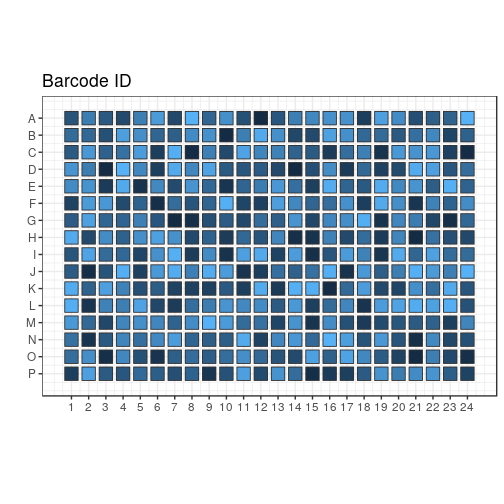

Influence of dNTP concentration and divalent ions
=================================================

It has been reported ([Lee et al., 2017](https://pubmed.gov/28327113)) that
increasing [dNTP] (dNTP concentration) increases tailing and favors template
switching.  Here, we the goal is to replicate and extend the results, and check
if [dNTP] has a positive or negative impact on cap specificity.

Increase of magnesium concentrations has been reported to enhance yield, and
addition of manganese was reported to enhance template switching.  Moreover,
increase of [dNTP] must be compensated by increase of divalent ions (magnesium
or manganese), otherwise too many of them will be be chelated and the reaction
will be inhibited.  Indeed, [dNTP] is never higher than [Mg<sup>2+</sup>] +
[Mn<sup>2+</sup>] in transcriptome protocols.  Therefore various combinations
of dNTP and divalent ion concentrations will be tested.

In this design, the TSOs and ion concentrations are randomised as much as
possible (taking into account that all do not have the same stock
concentrations). A fixed TSO, RT primer and RNA concentration is chosen, based
on the results of [Experiment 7](Labcyte-RT_Data_Analysis_7.md).

Each 384-well plate is divided in 6 "sextants", interleaved for easier
collection of the reaction products.  Each sextant has a different
Mn<sup>2+</sup> amount, and is indexed and amplified independently.
There are 9 × 7 combinations of dNTP and Mg<sup>2+</sup>, plus one negative
control with no RNA.  Each reaction is assigned to a random well within the
sextant.

For each plate replicate, a different random seed is used, to generate
different randomisations.

Compared with the previous design, all replicate randomisations and transfers
are calculated at once, to prevent from running out of reagents.

### Post-experimental notes

Since the mastermixes are viscous, even a 20 µL dead volume is too low.
Manual corrections were needed during the actual transfers.


Load R packages and scripts
===========================


```r
library("magrittr")   # For its diamond pipe operators
library("ggplot2")    # For plotting
library("platetools") # For defining and manipulating 384-well plates
library("plyr")
library("tibble")     # For comfortable command-line operations

# The set_block function that will become part of platetools
source("https://raw.githubusercontent.com/charles-plessy/platetools/76213accb1704d11a2d96fb1f6284d0b46117778/R/set_block.R")

# Do not load the whole smallCAGEqc package, just get the barcode data.
data("nanoCAGE2017barcodes", package = "smallCAGEqc")
```


Selected TSOs
=============

TSOs are selected according to remaining volume.  See the file [Labcyte-RT7_TSO_stock_to_source.xls](Labcyte-RT7_TSO_stock_to_source.xls)
for details on the cherry-picking of the TSOs.  This time, the concentrations
are adjusted according to the
[concentration check of the stock plate PO_8268526](TSO_concentration_check2.md).


```r
#           1   2   3   4   5   6   7
TSOs <- c(  1, 13, 25, 37, 49, 61, 73  # A
         ,  2, 14, 39, 38, 50, 62, 74  # B
         ,  4, 16, 28, 40, 64, 76, 88  # C
         ,  5, 17, 29, 41, 65, 77, 89  # D
         , 51, 18, 30, 42, 66, 78, 90  # E
         ,  7, 19, 31, 43, 67, 79, 91  # F
         ,  8, 87, 32, 44, 68, 80, 92  # G
         ,  9, 21, 33, 45, 69, 81, 24  # H 
         , 71, 23, 60, 47, 70, 83, 36  # I
         , 72, 22, 35, 46, 59, 82, 48) # J
```

Combinations of magnesium and dNTP concentrations
=================================================

This goes to high extremes, but Smart-Seq 2 has 1 mM dNTP and
12 mM MgCl<sub>2</sub>...

Master Mix "SSIII" uses the standard SSIII first-strand buffer (375 mM KCl,
15 mM MgCl<sub>2</sub>, 250 mM Tris-HCl pH 8.3), and Master Mix "Custom"
is the same, without MgCl<sub>2</sub>.


```r
combi <- expand.grid( dNTP = c(0.5, 1:5)
                    , Mg   = c(0:3, 3, 4, 6, 9, 12, 15))
combi$MMix <- c(rep("Custom", 24), rep("SSIII", 36))

plot(combi$dNTP, combi$Mg, xlab = "[dNTP] (mM)", ylab ="[Mg] (mM)", main = "Tested combinations", pch = combi$MMix %>% factor %>% as.numeric + 3
     , sub = "Legend: diamonds = standard buffer, crosses = custom")
```

<!-- -->

Conveniently, there are 60 remaining combinations, which leaves space for
4 negative control.


Creation of sextants
====================


```r
createRandomisedSextant <- function(index, Mn) {
  df                       <- data.frame(BARCODE_ID = sample(TSOs, 64))
  df$TSO_source            <- 200
  df$TSO_vol               <- 25
  df$TSO                   <- df$TSO_source * df$TSO_vol / 500
  df$RT_PRIMERS            <- 1
  df$RNA                   <- 10
  df$RT_PRIMERS_RNA_vol    <- 25
  df$MMix                  <- c(combi$MMix, c("Custom", "Custom", "SSIII", "SSIII"))
  df$MASTER_MIX_vol        <- 300
  df$INDEX                 <- index
  df$Mn                    <- Mn
  df$Mn_vol                <- 25
  df[df$Mn == 0, "Mn_vol"] <- 0
  df$Mg                    <- c(combi$Mg, 3, 3, 0, 0)
  df$Mg_vol                <- 25
  df[df$Mg == 0, "Mg_vol"] <- 0
  df$dNTP                  <- c(combi$dNTP, 0, 0, 0, 0)
  df$dNTP_vol              <- 100
  df[61:64, "dNTP_vol"]    <- 0  # Negative controls

  df$H2O_vol <- 500 - with(df, dNTP_vol + Mn_vol + Mg_vol +
                               TSO_vol + RT_PRIMERS_RNA_vol +
                               MASTER_MIX_vol)
  df[sample(nrow(df)),]
}
```


Create plates
=============


```r
mkPlate <- function(randomSeed, plateID, indexes) {
  plate           <- tibble(well = platetools::num_to_well(1:384, plate = "384"))
  plate$row       <- sub("..$", "", plate$well) %>% factor
  plate$col       <- sub("^.",  "", plate$well) %>% as.numeric %>% factor

  set.seed(randomSeed)
  plate$sxt <- paste0 (
    c(rep("A", 8), rep("B", 8), rep("C", 8)),
    ifelse (plate$row %in% LETTERS[1:8 * 2], 2, 1)
  ) %>% factor
  
  plate %<>% arrange(sxt)
  
  plate %<>% cbind( rbind( createRandomisedSextant(indexes[1], 0)
                         , createRandomisedSextant(indexes[2], 1)
                         , createRandomisedSextant(indexes[3], 2)
                         , createRandomisedSextant(indexes[4], 3)
                         , createRandomisedSextant(indexes[5], 4)
                         , createRandomisedSextant(indexes[6], 5))
        ) %>% as.tibble()
  
  plate$INDEX %<>% factor
  plate$BARCODE_SEQ <- nanoCAGE2017barcodes[plate$BARCODE_ID, "barcodes"]
  
  plate$Mg_level     <- plate$Mg   %>% factor(labels = paste0("Mg_",   LETTERS[1:9]))
  plate$Mn_level     <- plate$Mn   %>% factor(labels = paste0("Mn_",   LETTERS[1:6]))
  plate$dNTP_level   <- plate$dNTP %>% factor(labels = paste0("dNTP_", LETTERS[1:7]))
  plate$plateID <- plateID
  plate
}

plate7a <- mkPlate(1, "U", c("TAAGGCGA", "CGTACTAG", "AGGCAGAA", "TCCTGAGC", "GGACTCCT", "TAGGCATG"))
plate7b <- mkPlate(2, "V", c("CTCTCTAC", "CGAGGCTG", "AAGAGGCA", "GTAGAGGA", "GCTCATGA", "ATCTCAGG"))
plate7c <- mkPlate(3, "W", c("ACTCGCTA", "GGAGCTAC", "GCGTAGTA", "CGGAGCCT", "TACGCTGC", "ATGCGCAG"))
plate7d <- mkPlate(4, "X", c("TAGCGCTC", "ACTGAGCG", "CCTAAGAC", "CGATCAGT", "TGCAGCTA", "TCGACGTC"))
```


### Summary


```r
writePlate <- function(plate) {
  plateName <- deparse(substitute(plate))
  write.table( plate
             , paste0(plateName, ".txt")
             , sep = "\t"
             , quote = FALSE
             , row.names = FALSE)
}

writePlate(plate7a)
writePlate(plate7b)
writePlate(plate7c)
writePlate(plate7d)
```


Plate maps for randomisation a
==============================


```r
plateMap <- function(x, title) {
  plate <- plate7a
  platetools::raw_map(plate[[x]], well=plate$well, plate="384") +
  ggtitle(title) +
  viridis::scale_fill_viridis(breaks = unique(plate[[x]]))
}

plateMapLog <- function(x, title) {
  plate <- plate7a
  platetools::raw_map(plate[[x]], well=plate$well, plate="384") +
  ggtitle(title) +
  viridis::scale_fill_viridis(breaks = unique(plate[[x]]), trans = "log")
}
```

dNTP, Mg, Mn
------------


```r
(plot_dNTP <- plateMapLog("dNTP", "dNTP concentration"))
```

```
## Warning: Transformation introduced infinite values in discrete y-axis
```

<!-- -->


```r
(plot_Mg   <- plateMapLog("Mg",   "Mg concentration"))
```

```
## Warning: Transformation introduced infinite values in discrete y-axis
```

<!-- -->


```r
(plot_Mn   <- plateMapLog("Mn",   "Mn concentration"))
```

```
## Warning: Transformation introduced infinite values in discrete y-axis
```

<!-- -->

Barcode IDs
-----------


```r
(plot_BARCODES <- platetools::raw_map(plate7a[["BARCODE_ID"]], well=plate7a$well, plate="384") +
  ggtitle("Barcode ID")) + theme(legend.position="none")
```

<!-- -->

Indexes
-------


```r
(plot_indexes <- platetools::raw_map(plate7a[["INDEX"]], well=plate7a$well, plate="384") +
  ggtitle("INDEXes"))
```

<!-- -->

H2O
---


```r
(plot_H2O_vol <- plateMap("H2O_vol", "H2O volume"))
```

<!-- -->


Transfer file
=============

## Source plate layout

### TSOs in wells A01~J07

Source plate concentration is 200 μM, for a 10 μM final concentration
(25 nL transfer).  This time, the dilution factors calculated from the
concentration checks in the stock plate have been applied.  The TSOs will be in
wells A1 to J7 of the source plate.  Actual concentrations will be checked
in [TSO_concentration_check5](TSO_concentration_check5.md).


```r
tso_block <- data.frame( id  = TSOs
                       , row = unlist(lapply(LETTERS[1:10], rep, 7))
                       , col = rep(1:7, 10))

tso_block$well <- paste0(tso_block$row, "0", tso_block$col)

tso_block$barcodes <- nanoCAGE2017barcodes[tso_block$id, "barcodes"]

source <- tibble(well = platetools::num_to_well(1:384, plate = "384"))

for (n in 1:nrow(tso_block))
  source %<>% set_block( tso_block[n,"well"]
                       , tso_block[n,"barcodes"]
                       , 20000)
```


### RNA / RT primer mix in well K01

This time it was needed to combine RNA and RT primers to reduce the total volume.
Fixed RT primer concentration and RNA amount: 20 μM RT primer ; 400 ng / μL RNA.


```r
source %<>% set_block("K01", "RT_PRIMERS_RNA", 60000)
```


### Water in well K02


```r
source %<>% set_block("K02", "H2O", 60000)
```


### Mn<sup>2+</sup> in wells L01 to L05

Wells L01 to L05 filled with 20, 40, 60, 80 and 100 μM MnCl<sub>2</sub> respectively.


```r
levels(plate7a$Mn %>% factor)
```

```
## [1] "0" "1" "2" "3" "4" "5"
```

```r
levels(plate7a$Mn_level)
```

```
## [1] "Mn_A" "Mn_B" "Mn_C" "Mn_D" "Mn_E" "Mn_F"
```

```r
source %<>% set_block("L01", "Mn_B", 60000)
source %<>% set_block("L02", "Mn_C", 60000)
source %<>% set_block("L03", "Mn_D", 60000)
source %<>% set_block("L04", "Mn_E", 60000)
source %<>% set_block("L05", "Mn_F", 60000)
```


### Mg<sup>2+</sup> in wells M01 to M08

Wells M01 to M08 filled with 20, 40, 60, 80, 120, 180, 240, and 300 μM
MgCl<sub>2</sub> respectively.


```r
levels(plate7a$Mg %>% factor)
```

```
## [1] "0"  "1"  "2"  "3"  "4"  "6"  "9"  "12" "15"
```

```r
levels(plate7a$Mg_level)
```

```
## [1] "Mg_A" "Mg_B" "Mg_C" "Mg_D" "Mg_E" "Mg_F" "Mg_G" "Mg_H" "Mg_I"
```

```r
source %<>% set_block("M01", "Mg_B", 60000)
source %<>% set_block("M02", "Mg_C", 60000)
source %<>% set_block("M03", "Mg_D", 60000)
source %<>% set_block("M04", "Mg_E", 60000)
source %<>% set_block("M05", "Mg_F", 60000)
source %<>% set_block("M06", "Mg_G", 60000)
source %<>% set_block("M07", "Mg_H", 60000)
source %<>% set_block("M08", "Mg_I", 60000)
```


### dNTPs

Wells N01 to N06 filled with 2.5, 5, 10, 15, 20, 25 mM dNTPs respectively.


```r
levels(plate7a$dNTP %>% factor)
```

```
## [1] "0"   "0.5" "1"   "2"   "3"   "4"   "5"
```

```r
levels(plate7a$dNTP_level)
```

```
## [1] "dNTP_A" "dNTP_B" "dNTP_C" "dNTP_D" "dNTP_E" "dNTP_F" "dNTP_G"
```

```r
source %<>% set_block("N01", "dNTP_B", 60000)
source %<>% set_block("N02", "dNTP_C", 60000)
source %<>% set_block("N03", "dNTP_D", 60000)
source %<>% set_block("N04", "dNTP_E", 60000)
source %<>% set_block("N05", "dNTP_F", 60000)
source %<>% set_block("N06", "dNTP_G", 60000)
```


### Mastermixes

Wells O01 to O06 filled with custom mastermix; wells P01 to P07 filled
with standard mastermix.

For reducing the volume (to give more flexibility to the transfers), DTT
concentration was reduced from 10 to 7 mM.  Let's hope it has no impact.


```r
levels(plate7a$MMix %>% factor)
```

```
## [1] "Custom" "SSIII"
```

```r
source %<>% set_block("O01~O06", "Custom", 60000)
source %<>% set_block("P01~P07", "SSIII",  60000)
```


## Plan plate


```r
mkPlanPlate <- function(plate) {
  planPlate <- tibble(well = platetools::num_to_well(1:384, plate = "384"))
  
  for (n in 1:nrow(plate)) {
    planPlate %<>% set_block( plate[[n,"well"]]
                            , plate[[n,"BARCODE_SEQ"]] %>% as.character
                            , plate[[n,"TSO_vol"]])
    
    planPlate %<>% set_block( plate[[n,"well"]]
                            , "H2O"
                            , plate[[n,"H2O_vol"]])
    
    planPlate %<>% set_block( plate[[n,"well"]]
                            , "RT_PRIMERS_RNA"
                            , plate[[n,"RT_PRIMERS_RNA_vol"]])
    
    planPlate %<>% set_block( plate[[n,"well"]]
                            , plate[[n,"Mg_level"]] %>% as.character
                            , plate[[n,"Mg_vol"]])
    
    planPlate %<>% set_block( plate[[n,"well"]]
                            , plate[[n,"Mn_level"]] %>% as.character
                            , plate[[n,"Mn_vol"]])
    
    planPlate %<>% set_block( plate[[n,"well"]]
                            , plate[[n,"dNTP_level"]] %>% as.character
                            , plate[[n,"dNTP_vol"]])
    
    planPlate %<>% set_block( plate[[n,"well"]]
                            , plate[[n,"MMix"]] %>% as.character
                            , plate[[n,"MASTER_MIX_vol"]])
  }
  planPlate %<>% replace( . == 0, NA)
  planPlate <- planPlate[,sapply(planPlate, function(x) !all(is.na(x)))]
  planPlate
}
```

## Plan transfer


```r
source("plates.R")
```

```
## Creating a generic function for 'colnames' from package 'base' in the global environment
```

```r
source("echo.R")

planPlate7a <- Plate(plate = mkPlanPlate(plate7a))
sourcePlate <- Plate(plate = source, deadVolume = 16000)
destPlate   <- Plate(plate = tibble::tibble(well = num_to_well(1:384, plate = "384")))

echo <- planTransfers(sourcePlate, destPlate, planPlate7a)
echo
```

```
## A 525 Echo machine:
##   Source plate:      A Plate with data about 384 wells (dead volume: 16000; max volume: 1e+05).
##   Destination plate: A Plate with data about 384 wells (dead volume: 10000; max volume: 1e+05).
## Transducer at the following coordinates:
##   Source:      L05 (384-well format)
##   Destination: P24 (384-well format)
## 2282 elements in the log.
```

```r
echo@source@plate[,-1] %>% colSums(na.rm = TRUE)
```

```
##         ACACAG         AGTCAG         ATCTAC         CGACAG         CTGCAG         GAGTAC 
##          19875          19875          19850          19875          19850          19875 
##         GTACAG         ACACGT         AGTCGT         CGACTC         CGACGT         CTGCGT 
##          19875          19875          19875          19850          19850          19875 
##         GAGTCT         GTACGT         ACAGAT         AGTGAT         CACACG         CGAGAT 
##          19850          19850          19875          19850          19850          19850 
##         GCTACG         GTAGAT         TATGAT         ACAGCA         AGTGCA         CACAGC 
##          19850          19850          19875          19875          19875          19875 
##         CGAGCA         GCTAGC         GTAGCA         TATGCA         CTGCTC         AGTGTG 
##          19900          19850          19875          19850          19875          19850 
##         CACATA         CGAGTG         GCTATA         GTAGTG         TATGTG         ACATAC 
##          19950          19875          19850          19875          19850          19875 
##         ATCACG         CACGAT         CGATAC         GCTCAG         GTATAC         TCGACG 
##          19850          19900          19875          19875          19850          19850 
##         ACATCT         TATCTC         CACGCA         CGATCT         GCTCGT         GTATCT 
##          19850          19850          19850          19875          19850          19925 
##         TCGAGC         ACATGA         ATCATA         CACGTG         CGATGA         GCTCTC 
##          19850          19875          19875          19850          19850          19875 
##         GTATGA         ATCGTG         GCTGCA         ATCGCA         GAGCTC         CTGAGC 
##          19850          19850          19850          19850          19850          19850 
##         GCTGAT         TATAGC         CACTGA         GCTGTG         ATCGAT         CACTCT 
##          19875          19850          19850          19850          19850          19850 
##         CTGACG         GAGCGT         TATACG         CTGATA RT_PRIMERS_RNA            H2O 
##          19850          19850          19850          19850          50400          54800 
##           Mn_B           Mn_C           Mn_D           Mn_E           Mn_F           Mg_B 
##          58400          58400          58400          58400          58400          59100 
##           Mg_C           Mg_D           Mg_E           Mg_F           Mg_G           Mg_H 
##          59100          57900          59100          59100          59100          59100 
##           Mg_I         dNTP_B         dNTP_C         dNTP_D         dNTP_E         dNTP_F 
##          59100          54000          54000          54000          54000          54000 
##         dNTP_G         Custom          SSIII 
##          54000         313200         351600
```

```r
transfers7a <- as.data.frame(echo %>% showLogs)
transfers7a <- transfers7a[order(transfers7a$from),]

writeMMixTransfers <- function(transfers, filename) {
  transfers <- transfers[transfers$what %in% c("SSIII","Custom"),]
  write.table( transfers[,1:3], file = filename
             , quote = FALSE, row.names = FALSE, col.names = TRUE, sep = ",")
}

writeOtherTransfers <- function(transfers, filename) {
  transfers <- transfers[!transfers$what %in% c("SSIII","Custom"),]
  write.table( transfers[,1:3], file = filename
             , quote = FALSE, row.names = FALSE, col.names = TRUE, sep = ",")
}

writeMMixTransfers (transfers7a, "Exp8_plate1_mastermix.csv")
writeOtherTransfers(transfers7a, "Exp8_plate1_other-reagents.csv")
```


```r
planPlate7b <- Plate(plate = mkPlanPlate(plate7b))
sourcePlate <- echo@source

echo <- planTransfers(sourcePlate, destPlate, planPlate7b)
echo
```

```
## A 525 Echo machine:
##   Source plate:      A Plate with data about 384 wells (dead volume: 16000; max volume: 1e+05).
##   Destination plate: A Plate with data about 384 wells (dead volume: 10000; max volume: 1e+05).
## Transducer at the following coordinates:
##   Source:      L05 (384-well format)
##   Destination: P24 (384-well format)
## 2282 elements in the log.
```

```r
echo@source@plate[,-1] %>% colSums(na.rm = TRUE)
```

```
##         ACACAG         AGTCAG         ATCTAC         CGACAG         CTGCAG         GAGTAC 
##          19725          19725          19750          19725          19750          19775 
##         GTACAG         ACACGT         AGTCGT         CGACTC         CGACGT         CTGCGT 
##          19725          19750          19725          19700          19725          19725 
##         GAGTCT         GTACGT         ACAGAT         AGTGAT         CACACG         CGAGAT 
##          19700          19700          19725          19700          19725          19700 
##         GCTACG         GTAGAT         TATGAT         ACAGCA         AGTGCA         CACAGC 
##          19750          19700          19750          19725          19775          19725 
##         CGAGCA         GCTAGC         GTAGCA         TATGCA         CTGCTC         AGTGTG 
##          19750          19725          19725          19725          19725          19700 
##         CACATA         CGAGTG         GCTATA         GTAGTG         TATGTG         ACATAC 
##          19800          19725          19750          19725          19775          19800 
##         ATCACG         CACGAT         CGATAC         GCTCAG         GTATAC         TCGACG 
##          19725          19750          19725          19750          19700          19700 
##         ACATCT         TATCTC         CACGCA         CGATCT         GCTCGT         GTATCT 
##          19700          19700          19700          19725          19725          19775 
##         TCGAGC         ACATGA         ATCATA         CACGTG         CGATGA         GCTCTC 
##          19700          19725          19725          19725          19700          19725 
##         GTATGA         ATCGTG         GCTGCA         ATCGCA         GAGCTC         CTGAGC 
##          19700          19725          19700          19750          19700          19700 
##         GCTGAT         TATAGC         CACTGA         GCTGTG         ATCGAT         CACTCT 
##          19725          19725          19700          19700          19700          19700 
##         CTGACG         GAGCGT         TATACG         CTGATA RT_PRIMERS_RNA            H2O 
##          19725          19725          19725          19725          40800          49600 
##           Mn_B           Mn_C           Mn_D           Mn_E           Mn_F           Mg_B 
##          56800          56800          56800          56800          56800          58200 
##           Mg_C           Mg_D           Mg_E           Mg_F           Mg_G           Mg_H 
##          58200          55800          58200          58200          58200          58200 
##           Mg_I         dNTP_B         dNTP_C         dNTP_D         dNTP_E         dNTP_F 
##          58200          48000          48000          48000          48000          48000 
##         dNTP_G         Custom          SSIII 
##          48000         266400         283200
```

```r
transfers7b <- as.data.frame(echo %>% showLogs)
transfers7b <- transfers7b[order(transfers7b$from),]

writeMMixTransfers (transfers7b, "Exp8_plate2_mastermix.csv")
writeOtherTransfers(transfers7b, "Exp8_plate2_other-reagents.csv")
```


```r
planPlate7c <- Plate(plate = mkPlanPlate(plate7c))
sourcePlate <- echo@source

echo <- planTransfers(sourcePlate, destPlate, planPlate7c)
echo
```

```
## A 525 Echo machine:
##   Source plate:      A Plate with data about 384 wells (dead volume: 16000; max volume: 1e+05).
##   Destination plate: A Plate with data about 384 wells (dead volume: 10000; max volume: 1e+05).
## Transducer at the following coordinates:
##   Source:      L05 (384-well format)
##   Destination: P24 (384-well format)
## 2282 elements in the log.
```

```r
echo@source@plate[,-1] %>% colSums(na.rm = TRUE)
```

```
##         ACACAG         AGTCAG         ATCTAC         CGACAG         CTGCAG         GAGTAC 
##          19625          19575          19600          19600          19600          19675 
##         GTACAG         ACACGT         AGTCGT         CGACTC         CGACGT         CTGCGT 
##          19575          19625          19600          19575          19575          19600 
##         GAGTCT         GTACGT         ACAGAT         AGTGAT         CACACG         CGAGAT 
##          19600          19550          19575          19550          19600          19550 
##         GCTACG         GTAGAT         TATGAT         ACAGCA         AGTGCA         CACAGC 
##          19600          19550          19600          19575          19625          19575 
##         CGAGCA         GCTAGC         GTAGCA         TATGCA         CTGCTC         AGTGTG 
##          19625          19600          19600          19575          19575          19550 
##         CACATA         CGAGTG         GCTATA         GTAGTG         TATGTG         ACATAC 
##          19650          19575          19600          19600          19650          19675 
##         ATCACG         CACGAT         CGATAC         GCTCAG         GTATAC         TCGACG 
##          19600          19600          19575          19625          19550          19600 
##         ACATCT         TATCTC         CACGCA         CGATCT         GCTCGT         GTATCT 
##          19550          19550          19550          19625          19575          19625 
##         TCGAGC         ACATGA         ATCATA         CACGTG         CGATGA         GCTCTC 
##          19550          19625          19600          19575          19600          19575 
##         GTATGA         ATCGTG         GCTGCA         ATCGCA         GAGCTC         CTGAGC 
##          19575          19575          19600          19600          19550          19550 
##         GCTGAT         TATAGC         CACTGA         GCTGTG         ATCGAT         CACTCT 
##          19575          19575          19550          19575          19575          19550 
##         CTGACG         GAGCGT         TATACG         CTGATA RT_PRIMERS_RNA            H2O 
##          19600          19575          19600          19575          31200          44400 
##           Mn_B           Mn_C           Mn_D           Mn_E           Mn_F           Mg_B 
##          55200          55200          55200          55200          55200          57300 
##           Mg_C           Mg_D           Mg_E           Mg_F           Mg_G           Mg_H 
##          57300          53700          57300          57300          57300          57300 
##           Mg_I         dNTP_B         dNTP_C         dNTP_D         dNTP_E         dNTP_F 
##          57300          42000          42000          42000          42000          42000 
##         dNTP_G         Custom          SSIII 
##          42000         219600         214800
```

```r
transfers7c <- as.data.frame(echo %>% showLogs)
transfers7c <- transfers7c[order(transfers7c$from),]

writeMMixTransfers (transfers7c, "Exp8_plate3_mastermix.csv")
writeOtherTransfers(transfers7c, "Exp8_plate3_other-reagents.csv")
```


```r
planPlate7d <- Plate(plate = mkPlanPlate(plate7d))
sourcePlate <- echo@source

echo <- planTransfers(sourcePlate, destPlate, planPlate7d)
echo
```

```
## A 525 Echo machine:
##   Source plate:      A Plate with data about 384 wells (dead volume: 16000; max volume: 1e+05).
##   Destination plate: A Plate with data about 384 wells (dead volume: 10000; max volume: 1e+05).
## Transducer at the following coordinates:
##   Source:      L05 (384-well format)
##   Destination: P24 (384-well format)
## 2282 elements in the log.
```

```r
echo@source@plate[,-1] %>% colSums(na.rm = TRUE)
```

```
##         ACACAG         AGTCAG         ATCTAC         CGACAG         CTGCAG         GAGTAC 
##          19475          19450          19450          19475          19475          19525 
##         GTACAG         ACACGT         AGTCGT         CGACTC         CGACGT         CTGCGT 
##          19425          19475          19450          19425          19425          19450 
##         GAGTCT         GTACGT         ACAGAT         AGTGAT         CACACG         CGAGAT 
##          19450          19400          19450          19400          19450          19450 
##         GCTACG         GTAGAT         TATGAT         ACAGCA         AGTGCA         CACAGC 
##          19475          19400          19500          19425          19500          19425 
##         CGAGCA         GCTAGC         GTAGCA         TATGCA         CTGCTC         AGTGTG 
##          19500          19475          19500          19450          19450          19400 
##         CACATA         CGAGTG         GCTATA         GTAGTG         TATGTG         ACATAC 
##          19525          19475          19450          19475          19500          19550 
##         ATCACG         CACGAT         CGATAC         GCTCAG         GTATAC         TCGACG 
##          19475          19450          19425          19525          19400          19450 
##         ACATCT         TATCTC         CACGCA         CGATCT         GCTCGT         GTATCT 
##          19400          19400          19400          19475          19450          19500 
##         TCGAGC         ACATGA         ATCATA         CACGTG         CGATGA         GCTCTC 
##          19400          19475          19450          19475          19450          19450 
##         GTATGA         ATCGTG         GCTGCA         ATCGCA         GAGCTC         CTGAGC 
##          19425          19425          19450          19450          19400          19450 
##         GCTGAT         TATAGC         CACTGA         GCTGTG         ATCGAT         CACTCT 
##          19425          19450          19450          19425          19425          19425 
##         CTGACG         GAGCGT         TATACG         CTGATA RT_PRIMERS_RNA            H2O 
##          19450          19425          19475          19425          21600          39200 
##           Mn_B           Mn_C           Mn_D           Mn_E           Mn_F           Mg_B 
##          53600          53600          53600          53600          53600          56400 
##           Mg_C           Mg_D           Mg_E           Mg_F           Mg_G           Mg_H 
##          56400          51600          56400          56400          56400          56400 
##           Mg_I         dNTP_B         dNTP_C         dNTP_D         dNTP_E         dNTP_F 
##          56400          36000          36000          36000          36000          36000 
##         dNTP_G         Custom          SSIII 
##          36000         172800         146400
```

```r
transfers7d <- as.data.frame(echo %>% showLogs)
transfers7d <- transfers7d[order(transfers7d$from),]

writeMMixTransfers (transfers7d, "Exp8_plate4_mastermix.csv")
writeOtherTransfers(transfers7d, "Exp8_plate4_other-reagents.csv")
```


Inline copy of the tables
=========================


```r
plate7a %>% as.data.frame
```

```
##     well row col sxt BARCODE_ID TSO_source TSO_vol TSO RT_PRIMERS RNA RT_PRIMERS_RNA_vol   MMix
## 42   A01   A   1  A1         31        200      25  10          1  10                 25  SSIII
## 17   A02   A   2  A1         59        200      25  10          1  10                 25 Custom
## 30   A03   A   3  A1         35        200      25  10          1  10                 25  SSIII
## 47   A04   A   4  A1         24        200      25  10          1  10                 25  SSIII
## 6    A05   A   5  A1         60        200      25  10          1  10                 25 Custom
## 52   A06   A   6  A1         78        200      25  10          1  10                 25  SSIII
## 20   A07   A   7  A1         23        200      25  10          1  10                 25 Custom
## 48   A08   A   8  A1         92        200      25  10          1  10                 25  SSIII
## 58   C01   C   1  A1         36        200      25  10          1  10                 25  SSIII
## 19   C02   C   2  A1         76        200      25  10          1  10                 25 Custom
## 26   C03   C   3  A1         40        200      25  10          1  10                 25  SSIII
## 57   C04   C   4  A1         51        200      25  10          1  10                 25  SSIII
## 45   C05   C   5  A1         79        200      25  10          1  10                 25  SSIII
## 56   C06   C   6  A1         16        200      25  10          1  10                 25  SSIII
## 39   C07   C   7  A1         90        200      25  10          1  10                 25  SSIII
## 53   C08   C   8  A1          2        200      25  10          1  10                 25  SSIII
## 21   E01   E   1  A1         68        200      25  10          1  10                 25 Custom
## 34   E02   E   2  A1         73        200      25  10          1  10                 25  SSIII
## 55   E03   E   3  A1         13        200      25  10          1  10                 25  SSIII
## 15   E04   E   4  A1         87        200      25  10          1  10                 25 Custom
## 61   E05   E   5  A1          7        200      25  10          1  10                 25 Custom
## 9    E06   E   6  A1         67        200      25  10          1  10                 25 Custom
## 62   E07   E   7  A1         25        200      25  10          1  10                 25 Custom
## 5    E08   E   8  A1         74        200      25  10          1  10                 25 Custom
## 10   G01   G   1  A1         37        200      25  10          1  10                 25 Custom
## 60   G02   G   2  A1         82        200      25  10          1  10                 25  SSIII
## 40   G03   G   3  A1         44        200      25  10          1  10                 25  SSIII
## 3    G04   G   4  A1         43        200      25  10          1  10                 25 Custom
## 24   G05   G   5  A1         61        200      25  10          1  10                 25 Custom
## 31   G06   G   6  A1         33        200      25  10          1  10                 25  SSIII
## 27   G07   G   7  A1          1        200      25  10          1  10                 25  SSIII
## 44   G08   G   8  A1          4        200      25  10          1  10                 25  SSIII
## 59   I01   I   1  A1         32        200      25  10          1  10                 25  SSIII
## 13   I02   I   2  A1         83        200      25  10          1  10                 25 Custom
## 25   I03   I   3  A1         47        200      25  10          1  10                 25  SSIII
## 18   I04   I   4  A1         45        200      25  10          1  10                 25 Custom
## 46   I05   I   5  A1         21        200      25  10          1  10                 25  SSIII
## 38   I06   I   6  A1         72        200      25  10          1  10                 25  SSIII
## 8    I07   I   7  A1         91        200      25  10          1  10                 25 Custom
## 64   I08   I   8  A1         14        200      25  10          1  10                 25  SSIII
## 16   K01   K   1  A1         89        200      25  10          1  10                 25 Custom
## 41   K02   K   2  A1         41        200      25  10          1  10                 25  SSIII
## 37   K03   K   3  A1         81        200      25  10          1  10                 25  SSIII
## 11   K04   K   4  A1         62        200      25  10          1  10                 25 Custom
## 28   K05   K   5  A1         28        200      25  10          1  10                 25  SSIII
## 12   K06   K   6  A1         38        200      25  10          1  10                 25 Custom
## 29   K07   K   7  A1         19        200      25  10          1  10                 25  SSIII
## 35   K08   K   8  A1         18        200      25  10          1  10                 25  SSIII
## 50   M01   M   1  A1         77        200      25  10          1  10                 25  SSIII
## 7    M02   M   2  A1         46        200      25  10          1  10                 25 Custom
## 22   M03   M   3  A1         22        200      25  10          1  10                 25 Custom
## 1    M04   M   4  A1         64        200      25  10          1  10                 25 Custom
## 43   M05   M   5  A1         71        200      25  10          1  10                 25  SSIII
## 2    M06   M   6  A1         65        200      25  10          1  10                 25 Custom
## 23   M07   M   7  A1         42        200      25  10          1  10                 25 Custom
## 36   M08   M   8  A1         69        200      25  10          1  10                 25  SSIII
## 54   O01   O   1  A1         49        200      25  10          1  10                 25  SSIII
## 4    O02   O   2  A1         70        200      25  10          1  10                 25 Custom
## 14   O03   O   3  A1          5        200      25  10          1  10                 25 Custom
## 63   O04   O   4  A1         66        200      25  10          1  10                 25  SSIII
## 32   O05   O   5  A1         29        200      25  10          1  10                 25  SSIII
## 49   O06   O   6  A1          8        200      25  10          1  10                 25  SSIII
## 51   O07   O   7  A1         39        200      25  10          1  10                 25  SSIII
## 33   O08   O   8  A1         48        200      25  10          1  10                 25  SSIII
## 71   B01   B   1  A2         47        200      25  10          1  10                 25 Custom
## 591  B02   B   2  A2         45        200      25  10          1  10                 25  SSIII
## 181  B03   B   3  A2         29        200      25  10          1  10                 25 Custom
## 371  B04   B   4  A2         80        200      25  10          1  10                 25  SSIII
## 641  B05   B   5  A2         70        200      25  10          1  10                 25  SSIII
## 501  B06   B   6  A2         44        200      25  10          1  10                 25  SSIII
## 191  B07   B   7  A2         39        200      25  10          1  10                 25 Custom
## 451  B08   B   8  A2         68        200      25  10          1  10                 25  SSIII
## 151  D01   D   1  A2         74        200      25  10          1  10                 25 Custom
## 131  D02   D   2  A2         59        200      25  10          1  10                 25 Custom
## 281  D03   D   3  A2          2        200      25  10          1  10                 25  SSIII
## 561  D04   D   4  A2         92        200      25  10          1  10                 25  SSIII
## 101  D05   D   5  A2         66        200      25  10          1  10                 25 Custom
## 271  D06   D   6  A2         17        200      25  10          1  10                 25  SSIII
## 291  D07   D   7  A2         87        200      25  10          1  10                 25  SSIII
## 601  D08   D   8  A2         65        200      25  10          1  10                 25  SSIII
## 551  F01   F   1  A2         19        200      25  10          1  10                 25  SSIII
## 341  F02   F   2  A2         78        200      25  10          1  10                 25  SSIII
## 571  F03   F   3  A2         76        200      25  10          1  10                 25  SSIII
## 510  F04   F   4  A2         25        200      25  10          1  10                 25 Custom
## 471  F05   F   5  A2         41        200      25  10          1  10                 25  SSIII
## 411  F06   F   6  A2          5        200      25  10          1  10                 25  SSIII
## 351  F07   F   7  A2         48        200      25  10          1  10                 25  SSIII
## 481  F08   F   8  A2         32        200      25  10          1  10                 25  SSIII
## 261  H01   H   1  A2         88        200      25  10          1  10                 25  SSIII
## 381  H02   H   2  A2         24        200      25  10          1  10                 25  SSIII
## 611  H03   H   3  A2         69        200      25  10          1  10                 25 Custom
## 431  H04   H   4  A2         40        200      25  10          1  10                 25  SSIII
## 521  H05   H   5  A2         71        200      25  10          1  10                 25  SSIII
## 65   H06   H   6  A2         82        200      25  10          1  10                 25 Custom
## 111  H07   H   7  A2         72        200      25  10          1  10                 25 Custom
## 171  H08   H   8  A2         23        200      25  10          1  10                 25 Custom
## 301  J01   J   1  A2         37        200      25  10          1  10                 25  SSIII
## 161  J02   J   2  A2          4        200      25  10          1  10                 25 Custom
## 81   J03   J   3  A2         31        200      25  10          1  10                 25 Custom
## 210  J04   J   4  A2         91        200      25  10          1  10                 25 Custom
## 121  J05   J   5  A2         18        200      25  10          1  10                 25 Custom
## 241  J06   J   6  A2         77        200      25  10          1  10                 25 Custom
## 361  J07   J   7  A2         89        200      25  10          1  10                 25  SSIII
## 410  J08   J   8  A2         61        200      25  10          1  10                 25 Custom
## 91   L01   L   1  A2         90        200      25  10          1  10                 25 Custom
## 531  L02   L   2  A2          9        200      25  10          1  10                 25  SSIII
## 511  L03   L   3  A2         62        200      25  10          1  10                 25  SSIII
## 231  L04   L   4  A2         60        200      25  10          1  10                 25 Custom
## 141  L05   L   5  A2         83        200      25  10          1  10                 25 Custom
## 441  L06   L   6  A2         22        200      25  10          1  10                 25  SSIII
## 321  L07   L   7  A2         14        200      25  10          1  10                 25  SSIII
## 621  L08   L   8  A2         49        200      25  10          1  10                 25 Custom
## 461  N01   N   1  A2         51        200      25  10          1  10                 25  SSIII
## 221  N02   N   2  A2          8        200      25  10          1  10                 25 Custom
## 391  N03   N   3  A2         35        200      25  10          1  10                 25  SSIII
## 631  N04   N   4  A2         64        200      25  10          1  10                 25  SSIII
## 311  N05   N   5  A2         50        200      25  10          1  10                 25  SSIII
## 310  N06   N   6  A2         67        200      25  10          1  10                 25 Custom
## 541  N07   N   7  A2         79        200      25  10          1  10                 25  SSIII
## 201  N08   N   8  A2         43        200      25  10          1  10                 25 Custom
## 251  P01   P   1  A2         16        200      25  10          1  10                 25  SSIII
## 491  P02   P   2  A2         81        200      25  10          1  10                 25  SSIII
## 401  P03   P   3  A2         36        200      25  10          1  10                 25  SSIII
## 421  P04   P   4  A2         33        200      25  10          1  10                 25  SSIII
## 211  P05   P   5  A2         46        200      25  10          1  10                 25 Custom
## 331  P06   P   6  A2         38        200      25  10          1  10                 25  SSIII
## 110  P07   P   7  A2         28        200      25  10          1  10                 25 Custom
## 581  P08   P   8  A2         42        200      25  10          1  10                 25  SSIII
## 432  A09   A   9  B1         44        200      25  10          1  10                 25  SSIII
## 202  A10   A  10  B1         71        200      25  10          1  10                 25 Custom
## 262  A11   A  11  B1         29        200      25  10          1  10                 25  SSIII
## 612  A12   A  12  B1          1        200      25  10          1  10                 25 Custom
## 522  A13   A  13  B1         33        200      25  10          1  10                 25  SSIII
## 572  A14   A  14  B1         60        200      25  10          1  10                 25  SSIII
## 482  A15   A  15  B1         66        200      25  10          1  10                 25  SSIII
## 452  A16   A  16  B1         72        200      25  10          1  10                 25  SSIII
## 162  C09   C   9  B1         61        200      25  10          1  10                 25 Custom
## 422  C10   C  10  B1         24        200      25  10          1  10                 25  SSIII
## 542  C11   C  11  B1         83        200      25  10          1  10                 25  SSIII
## 562  C12   C  12  B1         64        200      25  10          1  10                 25  SSIII
## 212  C13   C  13  B1         62        200      25  10          1  10                 25 Custom
## 552  C14   C  14  B1         41        200      25  10          1  10                 25  SSIII
## 412  C15   C  15  B1         36        200      25  10          1  10                 25 Custom
## 182  C16   C  16  B1         14        200      25  10          1  10                 25 Custom
## 222  E09   E   9  B1         45        200      25  10          1  10                 25 Custom
## 82   E10   E  10  B1          9        200      25  10          1  10                 25 Custom
## 272  E11   E  11  B1         43        200      25  10          1  10                 25  SSIII
## 442  E12   E  12  B1         59        200      25  10          1  10                 25  SSIII
## 592  E13   E  13  B1         76        200      25  10          1  10                 25  SSIII
## 472  E14   E  14  B1         50        200      25  10          1  10                 25  SSIII
## 232  E15   E  15  B1         17        200      25  10          1  10                 25 Custom
## 532  E16   E  16  B1         89        200      25  10          1  10                 25  SSIII
## 282  G09   G   9  B1         28        200      25  10          1  10                 25  SSIII
## 112  G10   G  10  B1         37        200      25  10          1  10                 25 Custom
## 492  G11   G  11  B1         23        200      25  10          1  10                 25  SSIII
## 72   G12   G  12  B1         48        200      25  10          1  10                 25 Custom
## 142  G13   G  13  B1         39        200      25  10          1  10                 25 Custom
## 622  G14   G  14  B1         74        200      25  10          1  10                 25 Custom
## 172  G15   G  15  B1         22        200      25  10          1  10                 25 Custom
## 312  G16   G  16  B1         65        200      25  10          1  10                 25 Custom
## 352  I09   I   9  B1         68        200      25  10          1  10                 25  SSIII
## 132  I10   I  10  B1          7        200      25  10          1  10                 25 Custom
## 302  I11   I  11  B1         81        200      25  10          1  10                 25  SSIII
## 92   I12   I  12  B1         87        200      25  10          1  10                 25 Custom
## 242  I13   I  13  B1         19        200      25  10          1  10                 25 Custom
## 332  I14   I  14  B1         79        200      25  10          1  10                 25  SSIII
## 402  I15   I  15  B1          5        200      25  10          1  10                 25  SSIII
## 122  I16   I  16  B1         32        200      25  10          1  10                 25 Custom
## 462  K09   K   9  B1         18        200      25  10          1  10                 25  SSIII
## 642  K10   K  10  B1         35        200      25  10          1  10                 25  SSIII
## 192  K11   K  11  B1         16        200      25  10          1  10                 25 Custom
## 66   K12   K  12  B1         88        200      25  10          1  10                 25 Custom
## 252  K13   K  13  B1         13        200      25  10          1  10                 25  SSIII
## 413  K14   K  14  B1         91        200      25  10          1  10                 25  SSIII
## 213  K15   K  15  B1         90        200      25  10          1  10                 25 Custom
## 632  K16   K  16  B1          2        200      25  10          1  10                 25  SSIII
## 342  M09   M   9  B1         92        200      25  10          1  10                 25  SSIII
## 372  M10   M  10  B1         78        200      25  10          1  10                 25  SSIII
## 152  M11   M  11  B1         47        200      25  10          1  10                 25 Custom
## 512  M12   M  12  B1         51        200      25  10          1  10                 25  SSIII
## 582  M13   M  13  B1         21        200      25  10          1  10                 25  SSIII
## 322  M14   M  14  B1         73        200      25  10          1  10                 25  SSIII
## 392  M15   M  15  B1          8        200      25  10          1  10                 25  SSIII
## 502  M16   M  16  B1         69        200      25  10          1  10                 25  SSIII
## 102  O09   O   9  B1         38        200      25  10          1  10                 25 Custom
## 362  O10   O  10  B1         49        200      25  10          1  10                 25  SSIII
## 382  O11   O  11  B1         70        200      25  10          1  10                 25  SSIII
## 313  O12   O  12  B1         46        200      25  10          1  10                 25  SSIII
## 602  O13   O  13  B1         31        200      25  10          1  10                 25  SSIII
## 292  O14   O  14  B1         25        200      25  10          1  10                 25  SSIII
## 513  O15   O  15  B1         82        200      25  10          1  10                 25 Custom
## 113  O16   O  16  B1         40        200      25  10          1  10                 25 Custom
## 83   B09   B   9  B2         72        200      25  10          1  10                 25 Custom
## 514  B10   B  10  B2          2        200      25  10          1  10                 25 Custom
## 603  B11   B  11  B2         60        200      25  10          1  10                 25  SSIII
## 273  B12   B  12  B2         87        200      25  10          1  10                 25  SSIII
## 233  B13   B  13  B2         71        200      25  10          1  10                 25 Custom
## 114  B14   B  14  B2         22        200      25  10          1  10                 25 Custom
## 414  B15   B  15  B2         24        200      25  10          1  10                 25 Custom
## 383  B16   B  16  B2         82        200      25  10          1  10                 25  SSIII
## 333  D09   D   9  B2         83        200      25  10          1  10                 25  SSIII
## 553  D10   D  10  B2         35        200      25  10          1  10                 25  SSIII
## 563  D11   D  11  B2         33        200      25  10          1  10                 25  SSIII
## 583  D12   D  12  B2         37        200      25  10          1  10                 25  SSIII
## 93   D13   D  13  B2         23        200      25  10          1  10                 25 Custom
## 253  D14   D  14  B2          1        200      25  10          1  10                 25  SSIII
## 115  D15   D  15  B2         28        200      25  10          1  10                 25 Custom
## 223  D16   D  16  B2         69        200      25  10          1  10                 25 Custom
## 133  F09   F   9  B2         43        200      25  10          1  10                 25 Custom
## 453  F10   F  10  B2         91        200      25  10          1  10                 25  SSIII
## 543  F11   F  11  B2         21        200      25  10          1  10                 25  SSIII
## 643  F12   F  12  B2         18        200      25  10          1  10                 25  SSIII
## 214  F13   F  13  B2         80        200      25  10          1  10                 25 Custom
## 303  F14   F  14  B2         66        200      25  10          1  10                 25  SSIII
## 203  F15   F  15  B2         44        200      25  10          1  10                 25 Custom
## 403  F16   F  16  B2         49        200      25  10          1  10                 25  SSIII
## 293  H09   H   9  B2         42        200      25  10          1  10                 25  SSIII
## 163  H10   H  10  B2         14        200      25  10          1  10                 25 Custom
## 633  H11   H  11  B2         45        200      25  10          1  10                 25  SSIII
## 523  H12   H  12  B2         32        200      25  10          1  10                 25  SSIII
## 323  H13   H  13  B2         64        200      25  10          1  10                 25  SSIII
## 393  H14   H  14  B2          5        200      25  10          1  10                 25  SSIII
## 173  H15   H  15  B2          7        200      25  10          1  10                 25 Custom
## 623  H16   H  16  B2         62        200      25  10          1  10                 25 Custom
## 515  J09   J   9  B2         89        200      25  10          1  10                 25  SSIII
## 573  J10   J  10  B2         79        200      25  10          1  10                 25  SSIII
## 263  J11   J  11  B2          8        200      25  10          1  10                 25  SSIII
## 283  J12   J  12  B2         16        200      25  10          1  10                 25  SSIII
## 343  J13   J  13  B2         50        200      25  10          1  10                 25  SSIII
## 143  J14   J  14  B2         40        200      25  10          1  10                 25 Custom
## 314  J15   J  15  B2         51        200      25  10          1  10                 25  SSIII
## 503  J16   J  16  B2         90        200      25  10          1  10                 25  SSIII
## 493  L09   L   9  B2         59        200      25  10          1  10                 25  SSIII
## 533  L10   L  10  B2         74        200      25  10          1  10                 25  SSIII
## 363  L11   L  11  B2         67        200      25  10          1  10                 25  SSIII
## 423  L12   L  12  B2         68        200      25  10          1  10                 25  SSIII
## 67   L13   L  13  B2         36        200      25  10          1  10                 25 Custom
## 463  L14   L  14  B2         77        200      25  10          1  10                 25  SSIII
## 473  L15   L  15  B2         17        200      25  10          1  10                 25  SSIII
## 183  L16   L  16  B2         47        200      25  10          1  10                 25 Custom
## 73   N09   N   9  B2         39        200      25  10          1  10                 25 Custom
## 415  N10   N  10  B2         38        200      25  10          1  10                 25  SSIII
## 123  N11   N  11  B2         88        200      25  10          1  10                 25 Custom
## 243  N12   N  12  B2         19        200      25  10          1  10                 25 Custom
## 353  N13   N  13  B2         65        200      25  10          1  10                 25  SSIII
## 153  N14   N  14  B2         76        200      25  10          1  10                 25 Custom
## 613  N15   N  15  B2         46        200      25  10          1  10                 25 Custom
## 443  N16   N  16  B2         92        200      25  10          1  10                 25  SSIII
## 193  P09   P   9  B2          9        200      25  10          1  10                 25 Custom
## 103  P10   P  10  B2         30        200      25  10          1  10                 25 Custom
## 315  P11   P  11  B2         81        200      25  10          1  10                 25 Custom
## 433  P12   P  12  B2         25        200      25  10          1  10                 25  SSIII
## 593  P13   P  13  B2         73        200      25  10          1  10                 25  SSIII
## 215  P14   P  14  B2         48        200      25  10          1  10                 25 Custom
## 373  P15   P  15  B2          4        200      25  10          1  10                 25  SSIII
## 483  P16   P  16  B2         13        200      25  10          1  10                 25  SSIII
## 434  A17   A  17  C1         72        200      25  10          1  10                 25  SSIII
## 264  A18   A  18  C1         16        200      25  10          1  10                 25  SSIII
## 534  A19   A  19  C1         81        200      25  10          1  10                 25  SSIII
## 454  A20   A  20  C1         68        200      25  10          1  10                 25  SSIII
## 216  A21   A  21  C1         28        200      25  10          1  10                 25 Custom
## 564  A22   A  22  C1         39        200      25  10          1  10                 25  SSIII
## 384  A23   A  23  C1         41        200      25  10          1  10                 25  SSIII
## 316  A24   A  24  C1         92        200      25  10          1  10                 25 Custom
## 344  C17   C  17  C1         49        200      25  10          1  10                 25  SSIII
## 234  C18   C  18  C1         61        200      25  10          1  10                 25 Custom
## 516  C19   C  19  C1          8        200      25  10          1  10                 25 Custom
## 284  C20   C  20  C1         77        200      25  10          1  10                 25  SSIII
## 517  C21   C  21  C1         73        200      25  10          1  10                 25  SSIII
## 374  C22   C  22  C1         76        200      25  10          1  10                 25  SSIII
## 624  C23   C  23  C1         18        200      25  10          1  10                 25 Custom
## 124  C24   C  24  C1          2        200      25  10          1  10                 25 Custom
## 584  E17   E  17  C1         43        200      25  10          1  10                 25  SSIII
## 317  E18   E  18  C1         35        200      25  10          1  10                 25  SSIII
## 394  E19   E  19  C1         89        200      25  10          1  10                 25  SSIII
## 304  E20   E  20  C1         67        200      25  10          1  10                 25  SSIII
## 224  E21   E  21  C1         74        200      25  10          1  10                 25 Custom
## 444  E22   E  22  C1         38        200      25  10          1  10                 25  SSIII
## 164  E23   E  23  C1         91        200      25  10          1  10                 25 Custom
## 194  E24   E  24  C1         42        200      25  10          1  10                 25 Custom
## 334  G17   G  17  C1         70        200      25  10          1  10                 25  SSIII
## 524  G18   G  18  C1         90        200      25  10          1  10                 25  SSIII
## 68   G19   G  19  C1          7        200      25  10          1  10                 25 Custom
## 504  G20   G  20  C1         65        200      25  10          1  10                 25  SSIII
## 364  G21   G  21  C1         59        200      25  10          1  10                 25  SSIII
## 354  G22   G  22  C1         22        200      25  10          1  10                 25  SSIII
## 494  G23   G  23  C1          4        200      25  10          1  10                 25  SSIII
## 144  G24   G  24  C1         45        200      25  10          1  10                 25 Custom
## 474  I17   I  17  C1         78        200      25  10          1  10                 25  SSIII
## 416  I18   I  18  C1         62        200      25  10          1  10                 25 Custom
## 294  I19   I  19  C1          9        200      25  10          1  10                 25  SSIII
## 116  I20   I  20  C1         88        200      25  10          1  10                 25 Custom
## 154  I21   I  21  C1         44        200      25  10          1  10                 25 Custom
## 464  I22   I  22  C1         82        200      25  10          1  10                 25  SSIII
## 417  I23   I  23  C1         48        200      25  10          1  10                 25  SSIII
## 614  I24   I  24  C1         47        200      25  10          1  10                 25 Custom
## 324  K17   K  17  C1         46        200      25  10          1  10                 25  SSIII
## 84   K18   K  18  C1         79        200      25  10          1  10                 25 Custom
## 404  K19   K  19  C1         24        200      25  10          1  10                 25  SSIII
## 217  K20   K  20  C1         21        200      25  10          1  10                 25 Custom
## 184  K21   K  21  C1         71        200      25  10          1  10                 25 Custom
## 544  K22   K  22  C1         50        200      25  10          1  10                 25  SSIII
## 104  K23   K  23  C1         87        200      25  10          1  10                 25 Custom
## 574  K24   K  24  C1         32        200      25  10          1  10                 25  SSIII
## 484  M17   M  17  C1         29        200      25  10          1  10                 25  SSIII
## 204  M18   M  18  C1         13        200      25  10          1  10                 25 Custom
## 244  M19   M  19  C1         25        200      25  10          1  10                 25 Custom
## 94   M20   M  20  C1         33        200      25  10          1  10                 25 Custom
## 424  M21   M  21  C1         36        200      25  10          1  10                 25  SSIII
## 254  M22   M  22  C1         40        200      25  10          1  10                 25  SSIII
## 134  M23   M  23  C1         17        200      25  10          1  10                 25 Custom
## 644  M24   M  24  C1         64        200      25  10          1  10                 25  SSIII
## 174  O17   O  17  C1         83        200      25  10          1  10                 25 Custom
## 594  O18   O  18  C1         66        200      25  10          1  10                 25  SSIII
## 554  O19   O  19  C1         37        200      25  10          1  10                 25  SSIII
## 604  O20   O  20  C1         19        200      25  10          1  10                 25  SSIII
## 117  O21   O  21  C1          1        200      25  10          1  10                 25 Custom
## 274  O22   O  22  C1         60        200      25  10          1  10                 25  SSIII
## 634  O23   O  23  C1         23        200      25  10          1  10                 25  SSIII
## 74   O24   O  24  C1          5        200      25  10          1  10                 25 Custom
## 425  B17   B  17  C2         71        200      25  10          1  10                 25  SSIII
## 518  B18   B  18  C2         45        200      25  10          1  10                 25 Custom
## 275  B19   B  19  C2         47        200      25  10          1  10                 25  SSIII
## 335  B20   B  20  C2         35        200      25  10          1  10                 25  SSIII
## 575  B21   B  21  C2         50        200      25  10          1  10                 25  SSIII
## 435  B22   B  22  C2         66        200      25  10          1  10                 25  SSIII
## 595  B23   B  23  C2         21        200      25  10          1  10                 25  SSIII
## 625  B24   B  24  C2         40        200      25  10          1  10                 25 Custom
## 75   D17   D  17  C2         13        200      25  10          1  10                 25 Custom
## 445  D18   D  18  C2         46        200      25  10          1  10                 25  SSIII
## 245  D19   D  19  C2         18        200      25  10          1  10                 25 Custom
## 235  D20   D  20  C2         25        200      25  10          1  10                 25 Custom
## 218  D21   D  21  C2         88        200      25  10          1  10                 25 Custom
## 85   D22   D  22  C2         81        200      25  10          1  10                 25 Custom
## 225  D23   D  23  C2         33        200      25  10          1  10                 25 Custom
## 385  D24   D  24  C2         49        200      25  10          1  10                 25  SSIII
## 118  F17   F  17  C2         72        200      25  10          1  10                 25 Custom
## 295  F18   F  18  C2         16        200      25  10          1  10                 25  SSIII
## 645  F19   F  19  C2         87        200      25  10          1  10                 25  SSIII
## 325  F20   F  20  C2         70        200      25  10          1  10                 25  SSIII
## 125  F21   F  21  C2          9        200      25  10          1  10                 25 Custom
## 375  F22   F  22  C2         62        200      25  10          1  10                 25  SSIII
## 155  F23   F  23  C2         42        200      25  10          1  10                 25 Custom
## 545  F24   F  24  C2         69        200      25  10          1  10                 25  SSIII
## 185  H17   H  17  C2         24        200      25  10          1  10                 25 Custom
## 318  H18   H  18  C2         48        200      25  10          1  10                 25 Custom
## 285  H19   H  19  C2         14        200      25  10          1  10                 25  SSIII
## 219  H20   H  20  C2         64        200      25  10          1  10                 25 Custom
## 495  H21   H  21  C2          1        200      25  10          1  10                 25  SSIII
## 525  H22   H  22  C2         51        200      25  10          1  10                 25  SSIII
## 255  H23   H  23  C2         28        200      25  10          1  10                 25  SSIII
## 105  H24   H  24  C2         23        200      25  10          1  10                 25 Custom
## 615  J17   J  17  C2          7        200      25  10          1  10                 25 Custom
## 265  J18   J  18  C2         77        200      25  10          1  10                 25  SSIII
## 395  J19   J  19  C2         39        200      25  10          1  10                 25  SSIII
## 355  J20   J  20  C2         60        200      25  10          1  10                 25  SSIII
## 455  J21   J  21  C2         91        200      25  10          1  10                 25  SSIII
## 465  J22   J  22  C2         78        200      25  10          1  10                 25  SSIII
## 165  J23   J  23  C2         61        200      25  10          1  10                 25 Custom
## 565  J24   J  24  C2         92        200      25  10          1  10                 25  SSIII
## 635  L17   L  17  C2         65        200      25  10          1  10                 25  SSIII
## 95   L18   L  18  C2          8        200      25  10          1  10                 25 Custom
## 119  L19   L  19  C2         79        200      25  10          1  10                 25 Custom
## 405  L20   L  20  C2         83        200      25  10          1  10                 25  SSIII
## 305  L21   L  21  C2         89        200      25  10          1  10                 25  SSIII
## 135  L22   L  22  C2         82        200      25  10          1  10                 25 Custom
## 535  L23   L  23  C2         90        200      25  10          1  10                 25  SSIII
## 319  L24   L  24  C2         30        200      25  10          1  10                 25  SSIII
## 585  N17   N  17  C2         80        200      25  10          1  10                 25  SSIII
## 475  N18   N  18  C2         31        200      25  10          1  10                 25  SSIII
## 345  N19   N  19  C2         76        200      25  10          1  10                 25  SSIII
## 205  N20   N  20  C2         32        200      25  10          1  10                 25 Custom
## 69   N21   N  21  C2          4        200      25  10          1  10                 25 Custom
## 195  N22   N  22  C2         67        200      25  10          1  10                 25 Custom
## 365  N23   N  23  C2         22        200      25  10          1  10                 25  SSIII
## 418  N24   N  24  C2         29        200      25  10          1  10                 25  SSIII
## 145  P17   P  17  C2         17        200      25  10          1  10                 25 Custom
## 605  P18   P  18  C2         36        200      25  10          1  10                 25  SSIII
## 555  P19   P  19  C2         73        200      25  10          1  10                 25  SSIII
## 519  P20   P  20  C2         59        200      25  10          1  10                 25  SSIII
## 485  P21   P  21  C2         68        200      25  10          1  10                 25  SSIII
## 419  P22   P  22  C2         74        200      25  10          1  10                 25 Custom
## 175  P23   P  23  C2         38        200      25  10          1  10                 25 Custom
## 505  P24   P  24  C2         19        200      25  10          1  10                 25  SSIII
##     MASTER_MIX_vol    INDEX Mn Mn_vol Mg Mg_vol dNTP dNTP_vol H2O_vol BARCODE_SEQ Mg_level Mn_level
## 42             300 TAAGGCGA  0      0  6     25  5.0      100      25      CACGAT     Mg_F     Mn_A
## 17             300 TAAGGCGA  0      0  2     25  4.0      100      25      GAGCGT     Mg_C     Mn_A
## 30             300 TAAGGCGA  0      0  3     25  5.0      100      25      CACTCT     Mg_D     Mn_A
## 47             300 TAAGGCGA  0      0  9     25  4.0      100      25      ATCGTG     Mg_G     Mn_A
## 6              300 TAAGGCGA  0      0  0      0  5.0      100      50      GAGCTC     Mg_A     Mn_A
## 52             300 TAAGGCGA  0      0 12     25  3.0      100      25      GTAGTG     Mg_H     Mn_A
## 20             300 TAAGGCGA  0      0  3     25  1.0      100      25      ATCGCA     Mg_D     Mn_A
## 48             300 TAAGGCGA  0      0  9     25  5.0      100      25      TCGAGC     Mg_G     Mn_A
## 58             300 TAAGGCGA  0      0 15     25  3.0      100      25      CACTGA     Mg_I     Mn_A
## 19             300 TAAGGCGA  0      0  3     25  0.5      100      25      GTAGAT     Mg_D     Mn_A
## 26             300 TAAGGCGA  0      0  3     25  1.0      100      25      CGAGAT     Mg_D     Mn_A
## 57             300 TAAGGCGA  0      0 15     25  2.0      100      25      CTGCTC     Mg_I     Mn_A
## 45             300 TAAGGCGA  0      0  9     25  2.0      100      25      GTATAC     Mg_G     Mn_A
## 56             300 TAAGGCGA  0      0 15     25  1.0      100      25      AGTGAT     Mg_I     Mn_A
## 39             300 TAAGGCGA  0      0  6     25  2.0      100      25      TATGTG     Mg_F     Mn_A
## 53             300 TAAGGCGA  0      0 12     25  4.0      100      25      ACACGT     Mg_H     Mn_A
## 21             300 TAAGGCGA  0      0  3     25  2.0      100      25      GCTCGT     Mg_D     Mn_A
## 34             300 TAAGGCGA  0      0  4     25  3.0      100      25      GTACAG     Mg_E     Mn_A
## 55             300 TAAGGCGA  0      0 15     25  0.5      100      25      AGTCAG     Mg_I     Mn_A
## 15             300 TAAGGCGA  0      0  2     25  2.0      100      25      TATCTC     Mg_C     Mn_A
## 61             300 TAAGGCGA  0      0  3     25  0.0        0     125      ACATAC     Mg_D     Mn_A
## 9              300 TAAGGCGA  0      0  1     25  2.0      100      25      GCTCAG     Mg_B     Mn_A
## 62             300 TAAGGCGA  0      0  3     25  0.0        0     125      ATCTAC     Mg_D     Mn_A
## 5              300 TAAGGCGA  0      0  0      0  4.0      100      50      GTACGT     Mg_A     Mn_A
## 10             300 TAAGGCGA  0      0  1     25  3.0      100      25      CGACAG     Mg_B     Mn_A
## 60             300 TAAGGCGA  0      0 15     25  5.0      100      25      TATACG     Mg_I     Mn_A
## 40             300 TAAGGCGA  0      0  6     25  3.0      100      25      CGATCT     Mg_F     Mn_A
## 3              300 TAAGGCGA  0      0  0      0  2.0      100      50      CGATAC     Mg_A     Mn_A
## 24             300 TAAGGCGA  0      0  3     25  5.0      100      25      GAGTAC     Mg_D     Mn_A
## 31             300 TAAGGCGA  0      0  4     25  0.5      100      25      CACGTG     Mg_E     Mn_A
## 27             300 TAAGGCGA  0      0  3     25  2.0      100      25      ACACAG     Mg_D     Mn_A
## 44             300 TAAGGCGA  0      0  9     25  1.0      100      25      ACAGAT     Mg_G     Mn_A
## 59             300 TAAGGCGA  0      0 15     25  4.0      100      25      CACGCA     Mg_I     Mn_A
## 13             300 TAAGGCGA  0      0  2     25  0.5      100      25      TATAGC     Mg_C     Mn_A
## 25             300 TAAGGCGA  0      0  3     25  0.5      100      25      CTGAGC     Mg_D     Mn_A
## 18             300 TAAGGCGA  0      0  2     25  5.0      100      25      CGATGA     Mg_C     Mn_A
## 46             300 TAAGGCGA  0      0  9     25  3.0      100      25      ATCATA     Mg_G     Mn_A
## 38             300 TAAGGCGA  0      0  6     25  1.0      100      25      GCTGTG     Mg_F     Mn_A
## 8              300 TAAGGCGA  0      0  1     25  1.0      100      25      TCGACG     Mg_B     Mn_A
## 64             300 TAAGGCGA  0      0  0      0  0.0        0     150      AGTCGT     Mg_A     Mn_A
## 16             300 TAAGGCGA  0      0  2     25  3.0      100      25      TATGCA     Mg_C     Mn_A
## 41             300 TAAGGCGA  0      0  6     25  4.0      100      25      CGAGCA     Mg_F     Mn_A
## 37             300 TAAGGCGA  0      0  6     25  0.5      100      25      GTATGA     Mg_F     Mn_A
## 11             300 TAAGGCGA  0      0  1     25  4.0      100      25      GAGTCT     Mg_B     Mn_A
## 28             300 TAAGGCGA  0      0  3     25  3.0      100      25      CACACG     Mg_D     Mn_A
## 12             300 TAAGGCGA  0      0  1     25  5.0      100      25      CGACGT     Mg_B     Mn_A
## 29             300 TAAGGCGA  0      0  3     25  4.0      100      25      ATCACG     Mg_D     Mn_A
## 35             300 TAAGGCGA  0      0  4     25  4.0      100      25      AGTGTG     Mg_E     Mn_A
## 50             300 TAAGGCGA  0      0 12     25  1.0      100      25      GTAGCA     Mg_H     Mn_A
## 7              300 TAAGGCGA  0      0  1     25  0.5      100      25      CTGACG     Mg_B     Mn_A
## 22             300 TAAGGCGA  0      0  3     25  3.0      100      25      ATCGAT     Mg_D     Mn_A
## 1              300 TAAGGCGA  0      0  0      0  0.5      100      50      GCTACG     Mg_A     Mn_A
## 43             300 TAAGGCGA  0      0  9     25  0.5      100      25      GCTGCA     Mg_G     Mn_A
## 2              300 TAAGGCGA  0      0  0      0  1.0      100      50      GCTAGC     Mg_A     Mn_A
## 23             300 TAAGGCGA  0      0  3     25  4.0      100      25      CGAGTG     Mg_D     Mn_A
## 36             300 TAAGGCGA  0      0  4     25  5.0      100      25      GCTCTC     Mg_E     Mn_A
## 54             300 TAAGGCGA  0      0 12     25  5.0      100      25      CTGCAG     Mg_H     Mn_A
## 4              300 TAAGGCGA  0      0  0      0  3.0      100      50      GCTGAT     Mg_A     Mn_A
## 14             300 TAAGGCGA  0      0  2     25  1.0      100      25      ACAGCA     Mg_C     Mn_A
## 63             300 TAAGGCGA  0      0  0      0  0.0        0     150      GCTATA     Mg_A     Mn_A
## 32             300 TAAGGCGA  0      0  4     25  1.0      100      25      CACAGC     Mg_E     Mn_A
## 49             300 TAAGGCGA  0      0 12     25  0.5      100      25      ACATCT     Mg_H     Mn_A
## 51             300 TAAGGCGA  0      0 12     25  2.0      100      25      CGACTC     Mg_H     Mn_A
## 33             300 TAAGGCGA  0      0  4     25  2.0      100      25      CTGATA     Mg_E     Mn_A
## 71             300 CGTACTAG  1     25  1     25  0.5      100       0      CTGAGC     Mg_B     Mn_B
## 591            300 CGTACTAG  1     25 15     25  4.0      100       0      CGATGA     Mg_I     Mn_B
## 181            300 CGTACTAG  1     25  2     25  5.0      100       0      CACAGC     Mg_C     Mn_B
## 371            300 CGTACTAG  1     25  6     25  0.5      100       0      GTATCT     Mg_F     Mn_B
## 641            300 CGTACTAG  1     25  0      0  0.0        0     125      GCTGAT     Mg_A     Mn_B
## 501            300 CGTACTAG  1     25 12     25  1.0      100       0      CGATCT     Mg_H     Mn_B
## 191            300 CGTACTAG  1     25  3     25  0.5      100       0      CGACTC     Mg_D     Mn_B
## 451            300 CGTACTAG  1     25  9     25  2.0      100       0      GCTCGT     Mg_G     Mn_B
## 151            300 CGTACTAG  1     25  2     25  2.0      100       0      GTACGT     Mg_C     Mn_B
## 131            300 CGTACTAG  1     25  2     25  0.5      100       0      GAGCGT     Mg_C     Mn_B
## 281            300 CGTACTAG  1     25  3     25  3.0      100       0      ACACGT     Mg_D     Mn_B
## 561            300 CGTACTAG  1     25 15     25  1.0      100       0      TCGAGC     Mg_I     Mn_B
## 101            300 CGTACTAG  1     25  1     25  3.0      100       0      GCTATA     Mg_B     Mn_B
## 271            300 CGTACTAG  1     25  3     25  2.0      100       0      AGTGCA     Mg_D     Mn_B
## 291            300 CGTACTAG  1     25  3     25  4.0      100       0      TATCTC     Mg_D     Mn_B
## 601            300 CGTACTAG  1     25 15     25  5.0      100       0      GCTAGC     Mg_I     Mn_B
## 551            300 CGTACTAG  1     25 15     25  0.5      100       0      ATCACG     Mg_I     Mn_B
## 341            300 CGTACTAG  1     25  4     25  3.0      100       0      GTAGTG     Mg_E     Mn_B
## 571            300 CGTACTAG  1     25 15     25  2.0      100       0      GTAGAT     Mg_I     Mn_B
## 510            300 CGTACTAG  1     25  0      0  4.0      100      25      ATCTAC     Mg_A     Mn_B
## 471            300 CGTACTAG  1     25  9     25  4.0      100       0      CGAGCA     Mg_G     Mn_B
## 411            300 CGTACTAG  1     25  6     25  4.0      100       0      ACAGCA     Mg_F     Mn_B
## 351            300 CGTACTAG  1     25  4     25  4.0      100       0      CTGATA     Mg_E     Mn_B
## 481            300 CGTACTAG  1     25  9     25  5.0      100       0      CACGCA     Mg_G     Mn_B
## 261            300 CGTACTAG  1     25  3     25  1.0      100       0      TATGAT     Mg_D     Mn_B
## 381            300 CGTACTAG  1     25  6     25  1.0      100       0      ATCGTG     Mg_F     Mn_B
## 611            300 CGTACTAG  1     25  3     25  0.0        0     100      GCTCTC     Mg_D     Mn_B
## 431            300 CGTACTAG  1     25  9     25  0.5      100       0      CGAGAT     Mg_G     Mn_B
## 521            300 CGTACTAG  1     25 12     25  3.0      100       0      GCTGCA     Mg_H     Mn_B
## 65             300 CGTACTAG  1     25  0      0  5.0      100      25      TATACG     Mg_A     Mn_B
## 111            300 CGTACTAG  1     25  1     25  4.0      100       0      GCTGTG     Mg_B     Mn_B
## 171            300 CGTACTAG  1     25  2     25  4.0      100       0      ATCGCA     Mg_C     Mn_B
## 301            300 CGTACTAG  1     25  3     25  5.0      100       0      CGACAG     Mg_D     Mn_B
## 161            300 CGTACTAG  1     25  2     25  3.0      100       0      ACAGAT     Mg_C     Mn_B
## 81             300 CGTACTAG  1     25  1     25  1.0      100       0      CACGAT     Mg_B     Mn_B
## 210            300 CGTACTAG  1     25  0      0  1.0      100      25      TCGACG     Mg_A     Mn_B
## 121            300 CGTACTAG  1     25  1     25  5.0      100       0      AGTGTG     Mg_B     Mn_B
## 241            300 CGTACTAG  1     25  3     25  5.0      100       0      GTAGCA     Mg_D     Mn_B
## 361            300 CGTACTAG  1     25  4     25  5.0      100       0      TATGCA     Mg_E     Mn_B
## 410            300 CGTACTAG  1     25  0      0  3.0      100      25      GAGTAC     Mg_A     Mn_B
## 91             300 CGTACTAG  1     25  1     25  2.0      100       0      TATGTG     Mg_B     Mn_B
## 531            300 CGTACTAG  1     25 12     25  4.0      100       0      ACATGA     Mg_H     Mn_B
## 511            300 CGTACTAG  1     25 12     25  2.0      100       0      GAGTCT     Mg_H     Mn_B
## 231            300 CGTACTAG  1     25  3     25  4.0      100       0      GAGCTC     Mg_D     Mn_B
## 141            300 CGTACTAG  1     25  2     25  1.0      100       0      TATAGC     Mg_C     Mn_B
## 441            300 CGTACTAG  1     25  9     25  1.0      100       0      ATCGAT     Mg_G     Mn_B
## 321            300 CGTACTAG  1     25  4     25  1.0      100       0      AGTCGT     Mg_E     Mn_B
## 621            300 CGTACTAG  1     25  3     25  0.0        0     100      CTGCAG     Mg_D     Mn_B
## 461            300 CGTACTAG  1     25  9     25  3.0      100       0      CTGCTC     Mg_G     Mn_B
## 221            300 CGTACTAG  1     25  3     25  3.0      100       0      ACATCT     Mg_D     Mn_B
## 391            300 CGTACTAG  1     25  6     25  2.0      100       0      CACTCT     Mg_F     Mn_B
## 631            300 CGTACTAG  1     25  0      0  0.0        0     125      GCTACG     Mg_A     Mn_B
## 311            300 CGTACTAG  1     25  4     25  0.5      100       0      CTGCGT     Mg_E     Mn_B
## 310            300 CGTACTAG  1     25  0      0  2.0      100      25      GCTCAG     Mg_A     Mn_B
## 541            300 CGTACTAG  1     25 12     25  5.0      100       0      GTATAC     Mg_H     Mn_B
## 201            300 CGTACTAG  1     25  3     25  1.0      100       0      CGATAC     Mg_D     Mn_B
## 251            300 CGTACTAG  1     25  3     25  0.5      100       0      AGTGAT     Mg_D     Mn_B
## 491            300 CGTACTAG  1     25 12     25  0.5      100       0      GTATGA     Mg_H     Mn_B
## 401            300 CGTACTAG  1     25  6     25  3.0      100       0      CACTGA     Mg_F     Mn_B
## 421            300 CGTACTAG  1     25  6     25  5.0      100       0      CACGTG     Mg_F     Mn_B
## 211            300 CGTACTAG  1     25  3     25  2.0      100       0      CTGACG     Mg_D     Mn_B
## 331            300 CGTACTAG  1     25  4     25  2.0      100       0      CGACGT     Mg_E     Mn_B
## 110            300 CGTACTAG  1     25  0      0  0.5      100      25      CACACG     Mg_A     Mn_B
## 581            300 CGTACTAG  1     25 15     25  3.0      100       0      CGAGTG     Mg_I     Mn_B
## 432            300 AGGCAGAA  2     25  9     25  0.5      100       0      CGATCT     Mg_G     Mn_C
## 202            300 AGGCAGAA  2     25  3     25  1.0      100       0      GCTGCA     Mg_D     Mn_C
## 262            300 AGGCAGAA  2     25  3     25  1.0      100       0      CACAGC     Mg_D     Mn_C
## 612            300 AGGCAGAA  2     25  3     25  0.0        0     100      ACACAG     Mg_D     Mn_C
## 522            300 AGGCAGAA  2     25 12     25  3.0      100       0      CACGTG     Mg_H     Mn_C
## 572            300 AGGCAGAA  2     25 15     25  2.0      100       0      GAGCTC     Mg_I     Mn_C
## 482            300 AGGCAGAA  2     25  9     25  5.0      100       0      GCTATA     Mg_G     Mn_C
## 452            300 AGGCAGAA  2     25  9     25  2.0      100       0      GCTGTG     Mg_G     Mn_C
## 162            300 AGGCAGAA  2     25  2     25  3.0      100       0      GAGTAC     Mg_C     Mn_C
## 422            300 AGGCAGAA  2     25  6     25  5.0      100       0      ATCGTG     Mg_F     Mn_C
## 542            300 AGGCAGAA  2     25 12     25  5.0      100       0      TATAGC     Mg_H     Mn_C
## 562            300 AGGCAGAA  2     25 15     25  1.0      100       0      GCTACG     Mg_I     Mn_C
## 212            300 AGGCAGAA  2     25  3     25  2.0      100       0      GAGTCT     Mg_D     Mn_C
## 552            300 AGGCAGAA  2     25 15     25  0.5      100       0      CGAGCA     Mg_I     Mn_C
## 412            300 AGGCAGAA  2     25  0      0  3.0      100      25      CACTGA     Mg_A     Mn_C
## 182            300 AGGCAGAA  2     25  2     25  5.0      100       0      AGTCGT     Mg_C     Mn_C
## 222            300 AGGCAGAA  2     25  3     25  3.0      100       0      CGATGA     Mg_D     Mn_C
## 82             300 AGGCAGAA  2     25  1     25  1.0      100       0      ACATGA     Mg_B     Mn_C
## 272            300 AGGCAGAA  2     25  3     25  2.0      100       0      CGATAC     Mg_D     Mn_C
## 442            300 AGGCAGAA  2     25  9     25  1.0      100       0      GAGCGT     Mg_G     Mn_C
## 592            300 AGGCAGAA  2     25 15     25  4.0      100       0      GTAGAT     Mg_I     Mn_C
## 472            300 AGGCAGAA  2     25  9     25  4.0      100       0      CTGCGT     Mg_G     Mn_C
## 232            300 AGGCAGAA  2     25  3     25  4.0      100       0      AGTGCA     Mg_D     Mn_C
## 532            300 AGGCAGAA  2     25 12     25  4.0      100       0      TATGCA     Mg_H     Mn_C
## 282            300 AGGCAGAA  2     25  3     25  3.0      100       0      CACACG     Mg_D     Mn_C
## 112            300 AGGCAGAA  2     25  1     25  4.0      100       0      CGACAG     Mg_B     Mn_C
## 492            300 AGGCAGAA  2     25 12     25  0.5      100       0      ATCGCA     Mg_H     Mn_C
## 72             300 AGGCAGAA  2     25  1     25  0.5      100       0      CTGATA     Mg_B     Mn_C
## 142            300 AGGCAGAA  2     25  2     25  1.0      100       0      CGACTC     Mg_C     Mn_C
## 622            300 AGGCAGAA  2     25  3     25  0.0        0     100      GTACGT     Mg_D     Mn_C
## 172            300 AGGCAGAA  2     25  2     25  4.0      100       0      ATCGAT     Mg_C     Mn_C
## 312            300 AGGCAGAA  2     25  0      0  2.0      100      25      GCTAGC     Mg_A     Mn_C
## 352            300 AGGCAGAA  2     25  4     25  4.0      100       0      GCTCGT     Mg_E     Mn_C
## 132            300 AGGCAGAA  2     25  2     25  0.5      100       0      ACATAC     Mg_C     Mn_C
## 302            300 AGGCAGAA  2     25  3     25  5.0      100       0      GTATGA     Mg_D     Mn_C
## 92             300 AGGCAGAA  2     25  1     25  2.0      100       0      TATCTC     Mg_B     Mn_C
## 242            300 AGGCAGAA  2     25  3     25  5.0      100       0      ATCACG     Mg_D     Mn_C
## 332            300 AGGCAGAA  2     25  4     25  2.0      100       0      GTATAC     Mg_E     Mn_C
## 402            300 AGGCAGAA  2     25  6     25  3.0      100       0      ACAGCA     Mg_F     Mn_C
## 122            300 AGGCAGAA  2     25  1     25  5.0      100       0      CACGCA     Mg_B     Mn_C
## 462            300 AGGCAGAA  2     25  9     25  3.0      100       0      AGTGTG     Mg_G     Mn_C
## 642            300 AGGCAGAA  2     25  0      0  0.0        0     125      CACTCT     Mg_A     Mn_C
## 192            300 AGGCAGAA  2     25  3     25  0.5      100       0      AGTGAT     Mg_D     Mn_C
## 66             300 AGGCAGAA  2     25  0      0  5.0      100      25      TATGAT     Mg_A     Mn_C
## 252            300 AGGCAGAA  2     25  3     25  0.5      100       0      AGTCAG     Mg_D     Mn_C
## 413            300 AGGCAGAA  2     25  6     25  4.0      100       0      TCGACG     Mg_F     Mn_C
## 213            300 AGGCAGAA  2     25  0      0  1.0      100      25      TATGTG     Mg_A     Mn_C
## 632            300 AGGCAGAA  2     25  0      0  0.0        0     125      ACACGT     Mg_A     Mn_C
## 342            300 AGGCAGAA  2     25  4     25  3.0      100       0      TCGAGC     Mg_E     Mn_C
## 372            300 AGGCAGAA  2     25  6     25  0.5      100       0      GTAGTG     Mg_F     Mn_C
## 152            300 AGGCAGAA  2     25  2     25  2.0      100       0      CTGAGC     Mg_C     Mn_C
## 512            300 AGGCAGAA  2     25 12     25  2.0      100       0      CTGCTC     Mg_H     Mn_C
## 582            300 AGGCAGAA  2     25 15     25  3.0      100       0      ATCATA     Mg_I     Mn_C
## 322            300 AGGCAGAA  2     25  4     25  1.0      100       0      GTACAG     Mg_E     Mn_C
## 392            300 AGGCAGAA  2     25  6     25  2.0      100       0      ACATCT     Mg_F     Mn_C
## 502            300 AGGCAGAA  2     25 12     25  1.0      100       0      GCTCTC     Mg_H     Mn_C
## 102            300 AGGCAGAA  2     25  1     25  3.0      100       0      CGACGT     Mg_B     Mn_C
## 362            300 AGGCAGAA  2     25  4     25  5.0      100       0      CTGCAG     Mg_E     Mn_C
## 382            300 AGGCAGAA  2     25  6     25  1.0      100       0      GCTGAT     Mg_F     Mn_C
## 313            300 AGGCAGAA  2     25  4     25  0.5      100       0      CTGACG     Mg_E     Mn_C
## 602            300 AGGCAGAA  2     25 15     25  5.0      100       0      CACGAT     Mg_I     Mn_C
## 292            300 AGGCAGAA  2     25  3     25  4.0      100       0      ATCTAC     Mg_D     Mn_C
## 513            300 AGGCAGAA  2     25  0      0  4.0      100      25      TATACG     Mg_A     Mn_C
## 113            300 AGGCAGAA  2     25  0      0  0.5      100      25      CGAGAT     Mg_A     Mn_C
## 83             300 TCCTGAGC  3     25  1     25  1.0      100       0      GCTGTG     Mg_B     Mn_D
## 514            300 TCCTGAGC  3     25  0      0  4.0      100      25      ACACGT     Mg_A     Mn_D
## 603            300 TCCTGAGC  3     25 15     25  5.0      100       0      GAGCTC     Mg_I     Mn_D
## 273            300 TCCTGAGC  3     25  3     25  2.0      100       0      TATCTC     Mg_D     Mn_D
## 233            300 TCCTGAGC  3     25  3     25  4.0      100       0      GCTGCA     Mg_D     Mn_D
## 114            300 TCCTGAGC  3     25  1     25  4.0      100       0      ATCGAT     Mg_B     Mn_D
## 414            300 TCCTGAGC  3     25  0      0  3.0      100      25      ATCGTG     Mg_A     Mn_D
## 383            300 TCCTGAGC  3     25  6     25  1.0      100       0      TATACG     Mg_F     Mn_D
## 333            300 TCCTGAGC  3     25  4     25  2.0      100       0      TATAGC     Mg_E     Mn_D
## 553            300 TCCTGAGC  3     25 15     25  0.5      100       0      CACTCT     Mg_I     Mn_D
## 563            300 TCCTGAGC  3     25 15     25  1.0      100       0      CACGTG     Mg_I     Mn_D
## 583            300 TCCTGAGC  3     25 15     25  3.0      100       0      CGACAG     Mg_I     Mn_D
## 93             300 TCCTGAGC  3     25  1     25  2.0      100       0      ATCGCA     Mg_B     Mn_D
## 253            300 TCCTGAGC  3     25  3     25  0.5      100       0      ACACAG     Mg_D     Mn_D
## 115            300 TCCTGAGC  3     25  0      0  0.5      100      25      CACACG     Mg_A     Mn_D
## 223            300 TCCTGAGC  3     25  3     25  3.0      100       0      GCTCTC     Mg_D     Mn_D
## 133            300 TCCTGAGC  3     25  2     25  0.5      100       0      CGATAC     Mg_C     Mn_D
## 453            300 TCCTGAGC  3     25  9     25  2.0      100       0      TCGACG     Mg_G     Mn_D
## 543            300 TCCTGAGC  3     25 12     25  5.0      100       0      ATCATA     Mg_H     Mn_D
## 643            300 TCCTGAGC  3     25  0      0  0.0        0     125      AGTGTG     Mg_A     Mn_D
## 214            300 TCCTGAGC  3     25  3     25  2.0      100       0      GTATCT     Mg_D     Mn_D
## 303            300 TCCTGAGC  3     25  3     25  5.0      100       0      GCTATA     Mg_D     Mn_D
## 203            300 TCCTGAGC  3     25  3     25  1.0      100       0      CGATCT     Mg_D     Mn_D
## 403            300 TCCTGAGC  3     25  6     25  3.0      100       0      CTGCAG     Mg_F     Mn_D
## 293            300 TCCTGAGC  3     25  3     25  4.0      100       0      CGAGTG     Mg_D     Mn_D
## 163            300 TCCTGAGC  3     25  2     25  3.0      100       0      AGTCGT     Mg_C     Mn_D
## 633            300 TCCTGAGC  3     25  0      0  0.0        0     125      CGATGA     Mg_A     Mn_D
## 523            300 TCCTGAGC  3     25 12     25  3.0      100       0      CACGCA     Mg_H     Mn_D
## 323            300 TCCTGAGC  3     25  4     25  1.0      100       0      GCTACG     Mg_E     Mn_D
## 393            300 TCCTGAGC  3     25  6     25  2.0      100       0      ACAGCA     Mg_F     Mn_D
## 173            300 TCCTGAGC  3     25  2     25  4.0      100       0      ACATAC     Mg_C     Mn_D
## 623            300 TCCTGAGC  3     25  3     25  0.0        0     100      GAGTCT     Mg_D     Mn_D
## 515            300 TCCTGAGC  3     25 12     25  2.0      100       0      TATGCA     Mg_H     Mn_D
## 573            300 TCCTGAGC  3     25 15     25  2.0      100       0      GTATAC     Mg_I     Mn_D
## 263            300 TCCTGAGC  3     25  3     25  1.0      100       0      ACATCT     Mg_D     Mn_D
## 283            300 TCCTGAGC  3     25  3     25  3.0      100       0      AGTGAT     Mg_D     Mn_D
## 343            300 TCCTGAGC  3     25  4     25  3.0      100       0      CTGCGT     Mg_E     Mn_D
## 143            300 TCCTGAGC  3     25  2     25  1.0      100       0      CGAGAT     Mg_C     Mn_D
## 314            300 TCCTGAGC  3     25  4     25  0.5      100       0      CTGCTC     Mg_E     Mn_D
## 503            300 TCCTGAGC  3     25 12     25  1.0      100       0      TATGTG     Mg_H     Mn_D
## 493            300 TCCTGAGC  3     25 12     25  0.5      100       0      GAGCGT     Mg_H     Mn_D
## 533            300 TCCTGAGC  3     25 12     25  4.0      100       0      GTACGT     Mg_H     Mn_D
## 363            300 TCCTGAGC  3     25  4     25  5.0      100       0      GCTCAG     Mg_E     Mn_D
## 423            300 TCCTGAGC  3     25  6     25  5.0      100       0      GCTCGT     Mg_F     Mn_D
## 67             300 TCCTGAGC  3     25  0      0  5.0      100      25      CACTGA     Mg_A     Mn_D
## 463            300 TCCTGAGC  3     25  9     25  3.0      100       0      GTAGCA     Mg_G     Mn_D
## 473            300 TCCTGAGC  3     25  9     25  4.0      100       0      AGTGCA     Mg_G     Mn_D
## 183            300 TCCTGAGC  3     25  2     25  5.0      100       0      CTGAGC     Mg_C     Mn_D
## 73             300 TCCTGAGC  3     25  1     25  0.5      100       0      CGACTC     Mg_B     Mn_D
## 415            300 TCCTGAGC  3     25  6     25  4.0      100       0      CGACGT     Mg_F     Mn_D
## 123            300 TCCTGAGC  3     25  1     25  5.0      100       0      TATGAT     Mg_B     Mn_D
## 243            300 TCCTGAGC  3     25  3     25  5.0      100       0      ATCACG     Mg_D     Mn_D
## 353            300 TCCTGAGC  3     25  4     25  4.0      100       0      GCTAGC     Mg_E     Mn_D
## 153            300 TCCTGAGC  3     25  2     25  2.0      100       0      GTAGAT     Mg_C     Mn_D
## 613            300 TCCTGAGC  3     25  3     25  0.0        0     100      CTGACG     Mg_D     Mn_D
## 443            300 TCCTGAGC  3     25  9     25  1.0      100       0      TCGAGC     Mg_G     Mn_D
## 193            300 TCCTGAGC  3     25  3     25  0.5      100       0      ACATGA     Mg_D     Mn_D
## 103            300 TCCTGAGC  3     25  1     25  3.0      100       0      CACATA     Mg_B     Mn_D
## 315            300 TCCTGAGC  3     25  0      0  2.0      100      25      GTATGA     Mg_A     Mn_D
## 433            300 TCCTGAGC  3     25  9     25  0.5      100       0      ATCTAC     Mg_G     Mn_D
## 593            300 TCCTGAGC  3     25 15     25  4.0      100       0      GTACAG     Mg_I     Mn_D
## 215            300 TCCTGAGC  3     25  0      0  1.0      100      25      CTGATA     Mg_A     Mn_D
## 373            300 TCCTGAGC  3     25  6     25  0.5      100       0      ACAGAT     Mg_F     Mn_D
## 483            300 TCCTGAGC  3     25  9     25  5.0      100       0      AGTCAG     Mg_G     Mn_D
## 434            300 GGACTCCT  4     25  9     25  0.5      100       0      GCTGTG     Mg_G     Mn_E
## 264            300 GGACTCCT  4     25  3     25  1.0      100       0      AGTGAT     Mg_D     Mn_E
## 534            300 GGACTCCT  4     25 12     25  4.0      100       0      GTATGA     Mg_H     Mn_E
## 454            300 GGACTCCT  4     25  9     25  2.0      100       0      GCTCGT     Mg_G     Mn_E
## 216            300 GGACTCCT  4     25  3     25  2.0      100       0      CACACG     Mg_D     Mn_E
## 564            300 GGACTCCT  4     25 15     25  1.0      100       0      CGACTC     Mg_I     Mn_E
## 384            300 GGACTCCT  4     25  6     25  1.0      100       0      CGAGCA     Mg_F     Mn_E
## 316            300 GGACTCCT  4     25  0      0  2.0      100      25      TCGAGC     Mg_A     Mn_E
## 344            300 GGACTCCT  4     25  4     25  3.0      100       0      CTGCAG     Mg_E     Mn_E
## 234            300 GGACTCCT  4     25  3     25  4.0      100       0      GAGTAC     Mg_D     Mn_E
## 516            300 GGACTCCT  4     25  0      0  4.0      100      25      ACATCT     Mg_A     Mn_E
## 284            300 GGACTCCT  4     25  3     25  3.0      100       0      GTAGCA     Mg_D     Mn_E
## 517            300 GGACTCCT  4     25 12     25  2.0      100       0      GTACAG     Mg_H     Mn_E
## 374            300 GGACTCCT  4     25  6     25  0.5      100       0      GTAGAT     Mg_F     Mn_E
## 624            300 GGACTCCT  4     25  3     25  0.0        0     100      AGTGTG     Mg_D     Mn_E
## 124            300 GGACTCCT  4     25  1     25  5.0      100       0      ACACGT     Mg_B     Mn_E
## 584            300 GGACTCCT  4     25 15     25  3.0      100       0      CGATAC     Mg_I     Mn_E
## 317            300 GGACTCCT  4     25  4     25  0.5      100       0      CACTCT     Mg_E     Mn_E
## 394            300 GGACTCCT  4     25  6     25  2.0      100       0      TATGCA     Mg_F     Mn_E
## 304            300 GGACTCCT  4     25  3     25  5.0      100       0      GCTCAG     Mg_D     Mn_E
## 224            300 GGACTCCT  4     25  3     25  3.0      100       0      GTACGT     Mg_D     Mn_E
## 444            300 GGACTCCT  4     25  9     25  1.0      100       0      CGACGT     Mg_G     Mn_E
## 164            300 GGACTCCT  4     25  2     25  3.0      100       0      TCGACG     Mg_C     Mn_E
## 194            300 GGACTCCT  4     25  3     25  0.5      100       0      CGAGTG     Mg_D     Mn_E
## 334            300 GGACTCCT  4     25  4     25  2.0      100       0      GCTGAT     Mg_E     Mn_E
## 524            300 GGACTCCT  4     25 12     25  3.0      100       0      TATGTG     Mg_H     Mn_E
## 68             300 GGACTCCT  4     25  0      0  5.0      100      25      ACATAC     Mg_A     Mn_E
## 504            300 GGACTCCT  4     25 12     25  1.0      100       0      GCTAGC     Mg_H     Mn_E
## 364            300 GGACTCCT  4     25  4     25  5.0      100       0      GAGCGT     Mg_E     Mn_E
## 354            300 GGACTCCT  4     25  4     25  4.0      100       0      ATCGAT     Mg_E     Mn_E
## 494            300 GGACTCCT  4     25 12     25  0.5      100       0      ACAGAT     Mg_H     Mn_E
## 144            300 GGACTCCT  4     25  2     25  1.0      100       0      CGATGA     Mg_C     Mn_E
## 474            300 GGACTCCT  4     25  9     25  4.0      100       0      GTAGTG     Mg_G     Mn_E
## 416            300 GGACTCCT  4     25  0      0  3.0      100      25      GAGTCT     Mg_A     Mn_E
## 294            300 GGACTCCT  4     25  3     25  4.0      100       0      ACATGA     Mg_D     Mn_E
## 116            300 GGACTCCT  4     25  1     25  4.0      100       0      TATGAT     Mg_B     Mn_E
## 154            300 GGACTCCT  4     25  2     25  2.0      100       0      CGATCT     Mg_C     Mn_E
## 464            300 GGACTCCT  4     25  9     25  3.0      100       0      TATACG     Mg_G     Mn_E
## 417            300 GGACTCCT  4     25  6     25  4.0      100       0      CTGATA     Mg_F     Mn_E
## 614            300 GGACTCCT  4     25  3     25  0.0        0     100      CTGAGC     Mg_D     Mn_E
## 324            300 GGACTCCT  4     25  4     25  1.0      100       0      CTGACG     Mg_E     Mn_E
## 84             300 GGACTCCT  4     25  1     25  1.0      100       0      GTATAC     Mg_B     Mn_E
## 404            300 GGACTCCT  4     25  6     25  3.0      100       0      ATCGTG     Mg_F     Mn_E
## 217            300 GGACTCCT  4     25  0      0  1.0      100      25      ATCATA     Mg_A     Mn_E
## 184            300 GGACTCCT  4     25  2     25  5.0      100       0      GCTGCA     Mg_C     Mn_E
## 544            300 GGACTCCT  4     25 12     25  5.0      100       0      CTGCGT     Mg_H     Mn_E
## 104            300 GGACTCCT  4     25  1     25  3.0      100       0      TATCTC     Mg_B     Mn_E
## 574            300 GGACTCCT  4     25 15     25  2.0      100       0      CACGCA     Mg_I     Mn_E
## 484            300 GGACTCCT  4     25  9     25  5.0      100       0      CACAGC     Mg_G     Mn_E
## 204            300 GGACTCCT  4     25  3     25  1.0      100       0      AGTCAG     Mg_D     Mn_E
## 244            300 GGACTCCT  4     25  3     25  5.0      100       0      ATCTAC     Mg_D     Mn_E
## 94             300 GGACTCCT  4     25  1     25  2.0      100       0      CACGTG     Mg_B     Mn_E
## 424            300 GGACTCCT  4     25  6     25  5.0      100       0      CACTGA     Mg_F     Mn_E
## 254            300 GGACTCCT  4     25  3     25  0.5      100       0      CGAGAT     Mg_D     Mn_E
## 134            300 GGACTCCT  4     25  2     25  0.5      100       0      AGTGCA     Mg_C     Mn_E
## 644            300 GGACTCCT  4     25  0      0  0.0        0     125      GCTACG     Mg_A     Mn_E
## 174            300 GGACTCCT  4     25  2     25  4.0      100       0      TATAGC     Mg_C     Mn_E
## 594            300 GGACTCCT  4     25 15     25  4.0      100       0      GCTATA     Mg_I     Mn_E
## 554            300 GGACTCCT  4     25 15     25  0.5      100       0      CGACAG     Mg_I     Mn_E
## 604            300 GGACTCCT  4     25 15     25  5.0      100       0      ATCACG     Mg_I     Mn_E
## 117            300 GGACTCCT  4     25  0      0  0.5      100      25      ACACAG     Mg_A     Mn_E
## 274            300 GGACTCCT  4     25  3     25  2.0      100       0      GAGCTC     Mg_D     Mn_E
## 634            300 GGACTCCT  4     25  0      0  0.0        0     125      ATCGCA     Mg_A     Mn_E
## 74             300 GGACTCCT  4     25  1     25  0.5      100       0      ACAGCA     Mg_B     Mn_E
## 425            300 TAGGCATG  5     25  6     25  5.0      100       0      GCTGCA     Mg_F     Mn_F
## 518            300 TAGGCATG  5     25  0      0  4.0      100      25      CGATGA     Mg_A     Mn_F
## 275            300 TAGGCATG  5     25  3     25  2.0      100       0      CTGAGC     Mg_D     Mn_F
## 335            300 TAGGCATG  5     25  4     25  2.0      100       0      CACTCT     Mg_E     Mn_F
## 575            300 TAGGCATG  5     25 15     25  2.0      100       0      CTGCGT     Mg_I     Mn_F
## 435            300 TAGGCATG  5     25  9     25  0.5      100       0      GCTATA     Mg_G     Mn_F
## 595            300 TAGGCATG  5     25 15     25  4.0      100       0      ATCATA     Mg_I     Mn_F
## 625            300 TAGGCATG  5     25  3     25  0.0        0     100      CGAGAT     Mg_D     Mn_F
## 75             300 TAGGCATG  5     25  1     25  0.5      100       0      AGTCAG     Mg_B     Mn_F
## 445            300 TAGGCATG  5     25  9     25  1.0      100       0      CTGACG     Mg_G     Mn_F
## 245            300 TAGGCATG  5     25  3     25  5.0      100       0      AGTGTG     Mg_D     Mn_F
## 235            300 TAGGCATG  5     25  3     25  4.0      100       0      ATCTAC     Mg_D     Mn_F
## 218            300 TAGGCATG  5     25  0      0  1.0      100      25      TATGAT     Mg_A     Mn_F
## 85             300 TAGGCATG  5     25  1     25  1.0      100       0      GTATGA     Mg_B     Mn_F
## 225            300 TAGGCATG  5     25  3     25  3.0      100       0      CACGTG     Mg_D     Mn_F
## 385            300 TAGGCATG  5     25  6     25  1.0      100       0      CTGCAG     Mg_F     Mn_F
## 118            300 TAGGCATG  5     25  0      0  0.5      100      25      GCTGTG     Mg_A     Mn_F
## 295            300 TAGGCATG  5     25  3     25  4.0      100       0      AGTGAT     Mg_D     Mn_F
## 645            300 TAGGCATG  5     25  0      0  0.0        0     125      TATCTC     Mg_A     Mn_F
## 325            300 TAGGCATG  5     25  4     25  1.0      100       0      GCTGAT     Mg_E     Mn_F
## 125            300 TAGGCATG  5     25  1     25  5.0      100       0      ACATGA     Mg_B     Mn_F
## 375            300 TAGGCATG  5     25  6     25  0.5      100       0      GAGTCT     Mg_F     Mn_F
## 155            300 TAGGCATG  5     25  2     25  2.0      100       0      CGAGTG     Mg_C     Mn_F
## 545            300 TAGGCATG  5     25 12     25  5.0      100       0      GCTCTC     Mg_H     Mn_F
## 185            300 TAGGCATG  5     25  2     25  5.0      100       0      ATCGTG     Mg_C     Mn_F
## 318            300 TAGGCATG  5     25  0      0  2.0      100      25      CTGATA     Mg_A     Mn_F
## 285            300 TAGGCATG  5     25  3     25  3.0      100       0      AGTCGT     Mg_D     Mn_F
## 219            300 TAGGCATG  5     25  3     25  2.0      100       0      GCTACG     Mg_D     Mn_F
## 495            300 TAGGCATG  5     25 12     25  0.5      100       0      ACACAG     Mg_H     Mn_F
## 525            300 TAGGCATG  5     25 12     25  3.0      100       0      CTGCTC     Mg_H     Mn_F
## 255            300 TAGGCATG  5     25  3     25  0.5      100       0      CACACG     Mg_D     Mn_F
## 105            300 TAGGCATG  5     25  1     25  3.0      100       0      ATCGCA     Mg_B     Mn_F
## 615            300 TAGGCATG  5     25  3     25  0.0        0     100      ACATAC     Mg_D     Mn_F
## 265            300 TAGGCATG  5     25  3     25  1.0      100       0      GTAGCA     Mg_D     Mn_F
## 395            300 TAGGCATG  5     25  6     25  2.0      100       0      CGACTC     Mg_F     Mn_F
## 355            300 TAGGCATG  5     25  4     25  4.0      100       0      GAGCTC     Mg_E     Mn_F
## 455            300 TAGGCATG  5     25  9     25  2.0      100       0      TCGACG     Mg_G     Mn_F
## 465            300 TAGGCATG  5     25  9     25  3.0      100       0      GTAGTG     Mg_G     Mn_F
## 165            300 TAGGCATG  5     25  2     25  3.0      100       0      GAGTAC     Mg_C     Mn_F
## 565            300 TAGGCATG  5     25 15     25  1.0      100       0      TCGAGC     Mg_I     Mn_F
## 635            300 TAGGCATG  5     25  0      0  0.0        0     125      GCTAGC     Mg_A     Mn_F
## 95             300 TAGGCATG  5     25  1     25  2.0      100       0      ACATCT     Mg_B     Mn_F
## 119            300 TAGGCATG  5     25  1     25  4.0      100       0      GTATAC     Mg_B     Mn_F
## 405            300 TAGGCATG  5     25  6     25  3.0      100       0      TATAGC     Mg_F     Mn_F
## 305            300 TAGGCATG  5     25  3     25  5.0      100       0      TATGCA     Mg_D     Mn_F
## 135            300 TAGGCATG  5     25  2     25  0.5      100       0      TATACG     Mg_C     Mn_F
## 535            300 TAGGCATG  5     25 12     25  4.0      100       0      TATGTG     Mg_H     Mn_F
## 319            300 TAGGCATG  5     25  4     25  0.5      100       0      CACATA     Mg_E     Mn_F
## 585            300 TAGGCATG  5     25 15     25  3.0      100       0      GTATCT     Mg_I     Mn_F
## 475            300 TAGGCATG  5     25  9     25  4.0      100       0      CACGAT     Mg_G     Mn_F
## 345            300 TAGGCATG  5     25  4     25  3.0      100       0      GTAGAT     Mg_E     Mn_F
## 205            300 TAGGCATG  5     25  3     25  1.0      100       0      CACGCA     Mg_D     Mn_F
## 69             300 TAGGCATG  5     25  0      0  5.0      100      25      ACAGAT     Mg_A     Mn_F
## 195            300 TAGGCATG  5     25  3     25  0.5      100       0      GCTCAG     Mg_D     Mn_F
## 365            300 TAGGCATG  5     25  4     25  5.0      100       0      ATCGAT     Mg_E     Mn_F
## 418            300 TAGGCATG  5     25  6     25  4.0      100       0      CACAGC     Mg_F     Mn_F
## 145            300 TAGGCATG  5     25  2     25  1.0      100       0      AGTGCA     Mg_C     Mn_F
## 605            300 TAGGCATG  5     25 15     25  5.0      100       0      CACTGA     Mg_I     Mn_F
## 555            300 TAGGCATG  5     25 15     25  0.5      100       0      GTACAG     Mg_I     Mn_F
## 519            300 TAGGCATG  5     25 12     25  2.0      100       0      GAGCGT     Mg_H     Mn_F
## 485            300 TAGGCATG  5     25  9     25  5.0      100       0      GCTCGT     Mg_G     Mn_F
## 419            300 TAGGCATG  5     25  0      0  3.0      100      25      GTACGT     Mg_A     Mn_F
## 175            300 TAGGCATG  5     25  2     25  4.0      100       0      CGACGT     Mg_C     Mn_F
## 505            300 TAGGCATG  5     25 12     25  1.0      100       0      ATCACG     Mg_H     Mn_F
##     dNTP_level plateID
## 42      dNTP_G       U
## 17      dNTP_F       U
## 30      dNTP_G       U
## 47      dNTP_F       U
## 6       dNTP_G       U
## 52      dNTP_E       U
## 20      dNTP_C       U
## 48      dNTP_G       U
## 58      dNTP_E       U
## 19      dNTP_B       U
## 26      dNTP_C       U
## 57      dNTP_D       U
## 45      dNTP_D       U
## 56      dNTP_C       U
## 39      dNTP_D       U
## 53      dNTP_F       U
## 21      dNTP_D       U
## 34      dNTP_E       U
## 55      dNTP_B       U
## 15      dNTP_D       U
## 61      dNTP_A       U
## 9       dNTP_D       U
## 62      dNTP_A       U
## 5       dNTP_F       U
## 10      dNTP_E       U
## 60      dNTP_G       U
## 40      dNTP_E       U
## 3       dNTP_D       U
## 24      dNTP_G       U
## 31      dNTP_B       U
## 27      dNTP_D       U
## 44      dNTP_C       U
## 59      dNTP_F       U
## 13      dNTP_B       U
## 25      dNTP_B       U
## 18      dNTP_G       U
## 46      dNTP_E       U
## 38      dNTP_C       U
## 8       dNTP_C       U
## 64      dNTP_A       U
## 16      dNTP_E       U
## 41      dNTP_F       U
## 37      dNTP_B       U
## 11      dNTP_F       U
## 28      dNTP_E       U
## 12      dNTP_G       U
## 29      dNTP_F       U
## 35      dNTP_F       U
## 50      dNTP_C       U
## 7       dNTP_B       U
## 22      dNTP_E       U
## 1       dNTP_B       U
## 43      dNTP_B       U
## 2       dNTP_C       U
## 23      dNTP_F       U
## 36      dNTP_G       U
## 54      dNTP_G       U
## 4       dNTP_E       U
## 14      dNTP_C       U
## 63      dNTP_A       U
## 32      dNTP_C       U
## 49      dNTP_B       U
## 51      dNTP_D       U
## 33      dNTP_D       U
## 71      dNTP_B       U
## 591     dNTP_F       U
## 181     dNTP_G       U
## 371     dNTP_B       U
## 641     dNTP_A       U
## 501     dNTP_C       U
## 191     dNTP_B       U
## 451     dNTP_D       U
## 151     dNTP_D       U
## 131     dNTP_B       U
## 281     dNTP_E       U
## 561     dNTP_C       U
## 101     dNTP_E       U
## 271     dNTP_D       U
## 291     dNTP_F       U
## 601     dNTP_G       U
## 551     dNTP_B       U
## 341     dNTP_E       U
## 571     dNTP_D       U
## 510     dNTP_F       U
## 471     dNTP_F       U
## 411     dNTP_F       U
## 351     dNTP_F       U
## 481     dNTP_G       U
## 261     dNTP_C       U
## 381     dNTP_C       U
## 611     dNTP_A       U
## 431     dNTP_B       U
## 521     dNTP_E       U
## 65      dNTP_G       U
## 111     dNTP_F       U
## 171     dNTP_F       U
## 301     dNTP_G       U
## 161     dNTP_E       U
## 81      dNTP_C       U
## 210     dNTP_C       U
## 121     dNTP_G       U
## 241     dNTP_G       U
## 361     dNTP_G       U
## 410     dNTP_E       U
## 91      dNTP_D       U
## 531     dNTP_F       U
## 511     dNTP_D       U
## 231     dNTP_F       U
## 141     dNTP_C       U
## 441     dNTP_C       U
## 321     dNTP_C       U
## 621     dNTP_A       U
## 461     dNTP_E       U
## 221     dNTP_E       U
## 391     dNTP_D       U
## 631     dNTP_A       U
## 311     dNTP_B       U
## 310     dNTP_D       U
## 541     dNTP_G       U
## 201     dNTP_C       U
## 251     dNTP_B       U
## 491     dNTP_B       U
## 401     dNTP_E       U
## 421     dNTP_G       U
## 211     dNTP_D       U
## 331     dNTP_D       U
## 110     dNTP_B       U
## 581     dNTP_E       U
## 432     dNTP_B       U
## 202     dNTP_C       U
## 262     dNTP_C       U
## 612     dNTP_A       U
## 522     dNTP_E       U
## 572     dNTP_D       U
## 482     dNTP_G       U
## 452     dNTP_D       U
## 162     dNTP_E       U
## 422     dNTP_G       U
## 542     dNTP_G       U
## 562     dNTP_C       U
## 212     dNTP_D       U
## 552     dNTP_B       U
## 412     dNTP_E       U
## 182     dNTP_G       U
## 222     dNTP_E       U
## 82      dNTP_C       U
## 272     dNTP_D       U
## 442     dNTP_C       U
## 592     dNTP_F       U
## 472     dNTP_F       U
## 232     dNTP_F       U
## 532     dNTP_F       U
## 282     dNTP_E       U
## 112     dNTP_F       U
## 492     dNTP_B       U
## 72      dNTP_B       U
## 142     dNTP_C       U
## 622     dNTP_A       U
## 172     dNTP_F       U
## 312     dNTP_D       U
## 352     dNTP_F       U
## 132     dNTP_B       U
## 302     dNTP_G       U
## 92      dNTP_D       U
## 242     dNTP_G       U
## 332     dNTP_D       U
## 402     dNTP_E       U
## 122     dNTP_G       U
## 462     dNTP_E       U
## 642     dNTP_A       U
## 192     dNTP_B       U
## 66      dNTP_G       U
## 252     dNTP_B       U
## 413     dNTP_F       U
## 213     dNTP_C       U
## 632     dNTP_A       U
## 342     dNTP_E       U
## 372     dNTP_B       U
## 152     dNTP_D       U
## 512     dNTP_D       U
## 582     dNTP_E       U
## 322     dNTP_C       U
## 392     dNTP_D       U
## 502     dNTP_C       U
## 102     dNTP_E       U
## 362     dNTP_G       U
## 382     dNTP_C       U
## 313     dNTP_B       U
## 602     dNTP_G       U
## 292     dNTP_F       U
## 513     dNTP_F       U
## 113     dNTP_B       U
## 83      dNTP_C       U
## 514     dNTP_F       U
## 603     dNTP_G       U
## 273     dNTP_D       U
## 233     dNTP_F       U
## 114     dNTP_F       U
## 414     dNTP_E       U
## 383     dNTP_C       U
## 333     dNTP_D       U
## 553     dNTP_B       U
## 563     dNTP_C       U
## 583     dNTP_E       U
## 93      dNTP_D       U
## 253     dNTP_B       U
## 115     dNTP_B       U
## 223     dNTP_E       U
## 133     dNTP_B       U
## 453     dNTP_D       U
## 543     dNTP_G       U
## 643     dNTP_A       U
## 214     dNTP_D       U
## 303     dNTP_G       U
## 203     dNTP_C       U
## 403     dNTP_E       U
## 293     dNTP_F       U
## 163     dNTP_E       U
## 633     dNTP_A       U
## 523     dNTP_E       U
## 323     dNTP_C       U
## 393     dNTP_D       U
## 173     dNTP_F       U
## 623     dNTP_A       U
## 515     dNTP_D       U
## 573     dNTP_D       U
## 263     dNTP_C       U
## 283     dNTP_E       U
## 343     dNTP_E       U
## 143     dNTP_C       U
## 314     dNTP_B       U
## 503     dNTP_C       U
## 493     dNTP_B       U
## 533     dNTP_F       U
## 363     dNTP_G       U
## 423     dNTP_G       U
## 67      dNTP_G       U
## 463     dNTP_E       U
## 473     dNTP_F       U
## 183     dNTP_G       U
## 73      dNTP_B       U
## 415     dNTP_F       U
## 123     dNTP_G       U
## 243     dNTP_G       U
## 353     dNTP_F       U
## 153     dNTP_D       U
## 613     dNTP_A       U
## 443     dNTP_C       U
## 193     dNTP_B       U
## 103     dNTP_E       U
## 315     dNTP_D       U
## 433     dNTP_B       U
## 593     dNTP_F       U
## 215     dNTP_C       U
## 373     dNTP_B       U
## 483     dNTP_G       U
## 434     dNTP_B       U
## 264     dNTP_C       U
## 534     dNTP_F       U
## 454     dNTP_D       U
## 216     dNTP_D       U
## 564     dNTP_C       U
## 384     dNTP_C       U
## 316     dNTP_D       U
## 344     dNTP_E       U
## 234     dNTP_F       U
## 516     dNTP_F       U
## 284     dNTP_E       U
## 517     dNTP_D       U
## 374     dNTP_B       U
## 624     dNTP_A       U
## 124     dNTP_G       U
## 584     dNTP_E       U
## 317     dNTP_B       U
## 394     dNTP_D       U
## 304     dNTP_G       U
## 224     dNTP_E       U
## 444     dNTP_C       U
## 164     dNTP_E       U
## 194     dNTP_B       U
## 334     dNTP_D       U
## 524     dNTP_E       U
## 68      dNTP_G       U
## 504     dNTP_C       U
## 364     dNTP_G       U
## 354     dNTP_F       U
## 494     dNTP_B       U
## 144     dNTP_C       U
## 474     dNTP_F       U
## 416     dNTP_E       U
## 294     dNTP_F       U
## 116     dNTP_F       U
## 154     dNTP_D       U
## 464     dNTP_E       U
## 417     dNTP_F       U
## 614     dNTP_A       U
## 324     dNTP_C       U
## 84      dNTP_C       U
## 404     dNTP_E       U
## 217     dNTP_C       U
## 184     dNTP_G       U
## 544     dNTP_G       U
## 104     dNTP_E       U
## 574     dNTP_D       U
## 484     dNTP_G       U
## 204     dNTP_C       U
## 244     dNTP_G       U
## 94      dNTP_D       U
## 424     dNTP_G       U
## 254     dNTP_B       U
## 134     dNTP_B       U
## 644     dNTP_A       U
## 174     dNTP_F       U
## 594     dNTP_F       U
## 554     dNTP_B       U
## 604     dNTP_G       U
## 117     dNTP_B       U
## 274     dNTP_D       U
## 634     dNTP_A       U
## 74      dNTP_B       U
## 425     dNTP_G       U
## 518     dNTP_F       U
## 275     dNTP_D       U
## 335     dNTP_D       U
## 575     dNTP_D       U
## 435     dNTP_B       U
## 595     dNTP_F       U
## 625     dNTP_A       U
## 75      dNTP_B       U
## 445     dNTP_C       U
## 245     dNTP_G       U
## 235     dNTP_F       U
## 218     dNTP_C       U
## 85      dNTP_C       U
## 225     dNTP_E       U
## 385     dNTP_C       U
## 118     dNTP_B       U
## 295     dNTP_F       U
## 645     dNTP_A       U
## 325     dNTP_C       U
## 125     dNTP_G       U
## 375     dNTP_B       U
## 155     dNTP_D       U
## 545     dNTP_G       U
## 185     dNTP_G       U
## 318     dNTP_D       U
## 285     dNTP_E       U
## 219     dNTP_D       U
## 495     dNTP_B       U
## 525     dNTP_E       U
## 255     dNTP_B       U
## 105     dNTP_E       U
## 615     dNTP_A       U
## 265     dNTP_C       U
## 395     dNTP_D       U
## 355     dNTP_F       U
## 455     dNTP_D       U
## 465     dNTP_E       U
## 165     dNTP_E       U
## 565     dNTP_C       U
## 635     dNTP_A       U
## 95      dNTP_D       U
## 119     dNTP_F       U
## 405     dNTP_E       U
## 305     dNTP_G       U
## 135     dNTP_B       U
## 535     dNTP_F       U
## 319     dNTP_B       U
## 585     dNTP_E       U
## 475     dNTP_F       U
## 345     dNTP_E       U
## 205     dNTP_C       U
## 69      dNTP_G       U
## 195     dNTP_B       U
## 365     dNTP_G       U
## 418     dNTP_F       U
## 145     dNTP_C       U
## 605     dNTP_G       U
## 555     dNTP_B       U
## 519     dNTP_D       U
## 485     dNTP_G       U
## 419     dNTP_E       U
## 175     dNTP_F       U
## 505     dNTP_C       U
```

```r
plate7b %>% as.data.frame
```

```
##     well row col sxt BARCODE_ID TSO_source TSO_vol TSO RT_PRIMERS RNA RT_PRIMERS_RNA_vol   MMix
## 55   A01   A   1  A1         77        200      25  10          1  10                 25  SSIII
## 28   A02   A   2  A1         44        200      25  10          1  10                 25  SSIII
## 25   A03   A   3  A1         16        200      25  10          1  10                 25  SSIII
## 29   A04   A   4  A1         80        200      25  10          1  10                 25  SSIII
## 14   A05   A   5  A1         38        200      25  10          1  10                 25 Custom
## 4    A06   A   6  A1         50        200      25  10          1  10                 25 Custom
## 16   A07   A   7  A1         68        200      25  10          1  10                 25 Custom
## 18   A08   A   8  A1         46        200      25  10          1  10                 25 Custom
## 3    C01   C   1  A1         43        200      25  10          1  10                 25 Custom
## 11   C02   C   2  A1         70        200      25  10          1  10                 25 Custom
## 10   C03   C   3  A1         78        200      25  10          1  10                 25 Custom
## 41   C04   C   4  A1         22        200      25  10          1  10                 25  SSIII
## 15   C05   C   5  A1         17        200      25  10          1  10                 25 Custom
## 45   C06   C   6  A1         41        200      25  10          1  10                 25  SSIII
## 21   C07   C   7  A1         47        200      25  10          1  10                 25 Custom
## 61   C08   C   8  A1         71        200      25  10          1  10                 25 Custom
## 17   E01   E   1  A1         35        200      25  10          1  10                 25 Custom
## 32   E02   E   2  A1         87        200      25  10          1  10                 25  SSIII
## 2    E03   E   3  A1         92        200      25  10          1  10                 25 Custom
## 19   E04   E   4  A1         29        200      25  10          1  10                 25 Custom
## 9    E05   E   5  A1         18        200      25  10          1  10                 25 Custom
## 37   E06   E   6  A1         51        200      25  10          1  10                 25  SSIII
## 53   E07   E   7  A1         48        200      25  10          1  10                 25  SSIII
## 60   E08   E   8  A1         74        200      25  10          1  10                 25  SSIII
## 30   G01   G   1  A1         61        200      25  10          1  10                 25  SSIII
## 42   G02   G   2  A1         72        200      25  10          1  10                 25  SSIII
## 38   G03   G   3  A1         39        200      25  10          1  10                 25  SSIII
## 52   G04   G   4  A1         65        200      25  10          1  10                 25  SSIII
## 39   G05   G   5  A1         90        200      25  10          1  10                 25  SSIII
## 20   G06   G   6  A1         37        200      25  10          1  10                 25 Custom
## 58   G07   G   7  A1         60        200      25  10          1  10                 25  SSIII
## 7    G08   G   8  A1         14        200      25  10          1  10                 25 Custom
## 36   I01   I   1  A1         23        200      25  10          1  10                 25  SSIII
## 56   I02   I   2  A1         88        200      25  10          1  10                 25  SSIII
## 59   I03   I   3  A1         81        200      25  10          1  10                 25  SSIII
## 13   I04   I   4  A1         32        200      25  10          1  10                 25 Custom
## 6    I05   I   5  A1         83        200      25  10          1  10                 25 Custom
## 12   I06   I   6  A1          4        200      25  10          1  10                 25 Custom
## 26   I07   I   7  A1          5        200      25  10          1  10                 25  SSIII
## 50   I08   I   8  A1         40        200      25  10          1  10                 25  SSIII
## 33   K01   K   1  A1         30        200      25  10          1  10                 25  SSIII
## 47   K02   K   2  A1         33        200      25  10          1  10                 25  SSIII
## 35   K03   K   3  A1         82        200      25  10          1  10                 25  SSIII
## 54   K04   K   4  A1          8        200      25  10          1  10                 25  SSIII
## 31   K05   K   5  A1          1        200      25  10          1  10                 25  SSIII
## 22   K06   K   6  A1         64        200      25  10          1  10                 25 Custom
## 1    K07   K   7  A1         62        200      25  10          1  10                 25 Custom
## 49   K08   K   8  A1         69        200      25  10          1  10                 25  SSIII
## 63   M01   M   1  A1         91        200      25  10          1  10                 25  SSIII
## 44   M02   M   2  A1         31        200      25  10          1  10                 25  SSIII
## 27   M03   M   3  A1         73        200      25  10          1  10                 25  SSIII
## 64   M04   M   4  A1         13        200      25  10          1  10                 25  SSIII
## 48   M05   M   5  A1          9        200      25  10          1  10                 25  SSIII
## 46   M06   M   6  A1         76        200      25  10          1  10                 25  SSIII
## 62   M07   M   7  A1         19        200      25  10          1  10                 25 Custom
## 34   M08   M   8  A1         66        200      25  10          1  10                 25  SSIII
## 57   O01   O   1  A1         42        200      25  10          1  10                 25  SSIII
## 23   O02   O   2  A1         79        200      25  10          1  10                 25 Custom
## 43   O03   O   3  A1         21        200      25  10          1  10                 25  SSIII
## 5    O04   O   4  A1         36        200      25  10          1  10                 25 Custom
## 8    O05   O   5  A1         45        200      25  10          1  10                 25 Custom
## 51   O06   O   6  A1         67        200      25  10          1  10                 25  SSIII
## 24   O07   O   7  A1          2        200      25  10          1  10                 25 Custom
## 40   O08   O   8  A1         49        200      25  10          1  10                 25  SSIII
## 631  B01   B   1  A2          8        200      25  10          1  10                 25  SSIII
## 111  B02   B   2  A2         50        200      25  10          1  10                 25 Custom
## 321  B03   B   3  A2         47        200      25  10          1  10                 25  SSIII
## 131  B04   B   4  A2         38        200      25  10          1  10                 25 Custom
## 121  B05   B   5  A2         82        200      25  10          1  10                 25 Custom
## 641  B06   B   6  A2         72        200      25  10          1  10                 25  SSIII
## 161  B07   B   7  A2         71        200      25  10          1  10                 25 Custom
## 81   B08   B   8  A2         91        200      25  10          1  10                 25 Custom
## 491  D01   D   1  A2         79        200      25  10          1  10                 25  SSIII
## 361  D02   D   2  A2         77        200      25  10          1  10                 25  SSIII
## 331  D03   D   3  A2         42        200      25  10          1  10                 25  SSIII
## 521  D04   D   4  A2         46        200      25  10          1  10                 25  SSIII
## 201  D05   D   5  A2         16        200      25  10          1  10                 25 Custom
## 421  D06   D   6  A2         21        200      25  10          1  10                 25  SSIII
## 601  D07   D   7  A2         80        200      25  10          1  10                 25  SSIII
## 591  D08   D   8  A2         76        200      25  10          1  10                 25  SSIII
## 101  F01   F   1  A2          9        200      25  10          1  10                 25 Custom
## 501  F02   F   2  A2         19        200      25  10          1  10                 25  SSIII
## 461  F03   F   3  A2         17        200      25  10          1  10                 25  SSIII
## 241  F04   F   4  A2         81        200      25  10          1  10                 25 Custom
## 371  F05   F   5  A2         23        200      25  10          1  10                 25  SSIII
## 291  F06   F   6  A2         24        200      25  10          1  10                 25  SSIII
## 511  F07   F   7  A2         74        200      25  10          1  10                 25  SSIII
## 310  F08   F   8  A2          4        200      25  10          1  10                 25 Custom
## 141  H01   H   1  A2         28        200      25  10          1  10                 25 Custom
## 110  H02   H   2  A2         92        200      25  10          1  10                 25 Custom
## 401  H03   H   3  A2         30        200      25  10          1  10                 25  SSIII
## 571  H04   H   4  A2         44        200      25  10          1  10                 25  SSIII
## 65   H05   H   5  A2         36        200      25  10          1  10                 25 Custom
## 541  H06   H   6  A2         70        200      25  10          1  10                 25  SSIII
## 381  H07   H   7  A2          5        200      25  10          1  10                 25  SSIII
## 171  H08   H   8  A2         60        200      25  10          1  10                 25 Custom
## 221  J01   J   1  A2         59        200      25  10          1  10                 25 Custom
## 271  J02   J   2  A2         33        200      25  10          1  10                 25  SSIII
## 281  J03   J   3  A2         62        200      25  10          1  10                 25  SSIII
## 341  J04   J   4  A2         87        200      25  10          1  10                 25  SSIII
## 531  J05   J   5  A2         32        200      25  10          1  10                 25  SSIII
## 231  J06   J   6  A2         14        200      25  10          1  10                 25 Custom
## 181  J07   J   7  A2         43        200      25  10          1  10                 25 Custom
## 91   J08   J   8  A2         78        200      25  10          1  10                 25 Custom
## 621  L01   L   1  A2         68        200      25  10          1  10                 25 Custom
## 611  L02   L   2  A2         18        200      25  10          1  10                 25 Custom
## 301  L03   L   3  A2          2        200      25  10          1  10                 25  SSIII
## 551  L04   L   4  A2         51        200      25  10          1  10                 25  SSIII
## 561  L05   L   5  A2         45        200      25  10          1  10                 25  SSIII
## 510  L06   L   6  A2         13        200      25  10          1  10                 25 Custom
## 410  L07   L   7  A2         83        200      25  10          1  10                 25 Custom
## 251  L08   L   8  A2         22        200      25  10          1  10                 25  SSIII
## 151  N01   N   1  A2          7        200      25  10          1  10                 25 Custom
## 191  N02   N   2  A2         90        200      25  10          1  10                 25 Custom
## 441  N03   N   3  A2         31        200      25  10          1  10                 25  SSIII
## 481  N04   N   4  A2         64        200      25  10          1  10                 25  SSIII
## 471  N05   N   5  A2         39        200      25  10          1  10                 25  SSIII
## 451  N06   N   6  A2         73        200      25  10          1  10                 25  SSIII
## 261  N07   N   7  A2         40        200      25  10          1  10                 25  SSIII
## 581  N08   N   8  A2         41        200      25  10          1  10                 25  SSIII
## 210  P01   P   1  A2         29        200      25  10          1  10                 25 Custom
## 411  P02   P   2  A2          1        200      25  10          1  10                 25  SSIII
## 351  P03   P   3  A2         35        200      25  10          1  10                 25  SSIII
## 391  P04   P   4  A2         25        200      25  10          1  10                 25  SSIII
## 431  P05   P   5  A2         89        200      25  10          1  10                 25  SSIII
## 211  P06   P   6  A2         69        200      25  10          1  10                 25 Custom
## 311  P07   P   7  A2         37        200      25  10          1  10                 25  SSIII
## 71   P08   P   8  A2         88        200      25  10          1  10                 25 Custom
## 422  A09   A   9  B1         59        200      25  10          1  10                 25  SSIII
## 112  A10   A  10  B1         13        200      25  10          1  10                 25 Custom
## 172  A11   A  11  B1         44        200      25  10          1  10                 25 Custom
## 66   A12   A  12  B1         37        200      25  10          1  10                 25 Custom
## 242  A13   A  13  B1         38        200      25  10          1  10                 25 Custom
## 132  A14   A  14  B1         33        200      25  10          1  10                 25 Custom
## 382  A15   A  15  B1         28        200      25  10          1  10                 25  SSIII
## 152  A16   A  16  B1         35        200      25  10          1  10                 25 Custom
## 612  C09   C   9  B1          4        200      25  10          1  10                 25 Custom
## 412  C10   C  10  B1          8        200      25  10          1  10                 25 Custom
## 632  C11   C  11  B1         61        200      25  10          1  10                 25  SSIII
## 472  C12   C  12  B1         68        200      25  10          1  10                 25  SSIII
## 522  C13   C  13  B1         77        200      25  10          1  10                 25  SSIII
## 202  C14   C  14  B1         65        200      25  10          1  10                 25 Custom
## 113  C15   C  15  B1         25        200      25  10          1  10                 25 Custom
## 312  C16   C  16  B1         48        200      25  10          1  10                 25 Custom
## 562  E09   E   9  B1         31        200      25  10          1  10                 25  SSIII
## 272  E10   E  10  B1         51        200      25  10          1  10                 25  SSIII
## 392  E11   E  11  B1         43        200      25  10          1  10                 25  SSIII
## 372  E12   E  12  B1         81        200      25  10          1  10                 25  SSIII
## 582  E13   E  13  B1         45        200      25  10          1  10                 25  SSIII
## 452  E14   E  14  B1         67        200      25  10          1  10                 25  SSIII
## 342  E15   E  15  B1         74        200      25  10          1  10                 25  SSIII
## 502  E16   E  16  B1         47        200      25  10          1  10                 25  SSIII
## 212  G09   G   9  B1         24        200      25  10          1  10                 25 Custom
## 572  G10   G  10  B1         29        200      25  10          1  10                 25  SSIII
## 602  G11   G  11  B1         40        200      25  10          1  10                 25  SSIII
## 642  G12   G  12  B1         41        200      25  10          1  10                 25  SSIII
## 72   G13   G  13  B1         79        200      25  10          1  10                 25 Custom
## 162  G14   G  14  B1         83        200      25  10          1  10                 25 Custom
## 92   G15   G  15  B1         21        200      25  10          1  10                 25 Custom
## 512  G16   G  16  B1         80        200      25  10          1  10                 25  SSIII
## 592  I09   I   9  B1         91        200      25  10          1  10                 25  SSIII
## 282  I10   I  10  B1         32        200      25  10          1  10                 25  SSIII
## 482  I11   I  11  B1         88        200      25  10          1  10                 25  SSIII
## 442  I12   I  12  B1         19        200      25  10          1  10                 25  SSIII
## 232  I13   I  13  B1         22        200      25  10          1  10                 25 Custom
## 622  I14   I  14  B1         89        200      25  10          1  10                 25 Custom
## 213  I15   I  15  B1         76        200      25  10          1  10                 25 Custom
## 182  I16   I  16  B1         16        200      25  10          1  10                 25 Custom
## 552  K09   K   9  B1         42        200      25  10          1  10                 25  SSIII
## 513  K10   K  10  B1          9        200      25  10          1  10                 25 Custom
## 492  K11   K  11  B1         66        200      25  10          1  10                 25  SSIII
## 413  K12   K  12  B1         73        200      25  10          1  10                 25  SSIII
## 142  K13   K  13  B1         30        200      25  10          1  10                 25 Custom
## 313  K14   K  14  B1          5        200      25  10          1  10                 25  SSIII
## 222  K15   K  15  B1         50        200      25  10          1  10                 25 Custom
## 402  K16   K  16  B1         69        200      25  10          1  10                 25  SSIII
## 122  M09   M   9  B1         70        200      25  10          1  10                 25 Custom
## 532  M10   M  10  B1         78        200      25  10          1  10                 25  SSIII
## 322  M11   M  11  B1         36        200      25  10          1  10                 25  SSIII
## 462  M12   M  12  B1         71        200      25  10          1  10                 25  SSIII
## 362  M13   M  13  B1         92        200      25  10          1  10                 25  SSIII
## 82   M14   M  14  B1         17        200      25  10          1  10                 25 Custom
## 352  M15   M  15  B1         39        200      25  10          1  10                 25  SSIII
## 302  M16   M  16  B1         23        200      25  10          1  10                 25  SSIII
## 252  O09   O   9  B1         62        200      25  10          1  10                 25  SSIII
## 102  O10   O  10  B1         72        200      25  10          1  10                 25 Custom
## 192  O11   O  11  B1         60        200      25  10          1  10                 25 Custom
## 332  O12   O  12  B1         18        200      25  10          1  10                 25  SSIII
## 432  O13   O  13  B1         49        200      25  10          1  10                 25  SSIII
## 262  O14   O  14  B1         87        200      25  10          1  10                 25  SSIII
## 292  O15   O  15  B1         14        200      25  10          1  10                 25  SSIII
## 542  O16   O  16  B1          1        200      25  10          1  10                 25  SSIII
## 343  B09   B   9  B2         68        200      25  10          1  10                 25  SSIII
## 143  B10   B  10  B2         72        200      25  10          1  10                 25 Custom
## 433  B11   B  11  B2         35        200      25  10          1  10                 25  SSIII
## 463  B12   B  12  B2         21        200      25  10          1  10                 25  SSIII
## 283  B13   B  13  B2         45        200      25  10          1  10                 25  SSIII
## 93   B14   B  14  B2         88        200      25  10          1  10                 25 Custom
## 483  B15   B  15  B2         81        200      25  10          1  10                 25  SSIII
## 583  B16   B  16  B2         40        200      25  10          1  10                 25  SSIII
## 203  D09   D   9  B2         13        200      25  10          1  10                 25 Custom
## 543  D10   D  10  B2         43        200      25  10          1  10                 25  SSIII
## 553  D11   D  11  B2         91        200      25  10          1  10                 25  SSIII
## 643  D12   D  12  B2         18        200      25  10          1  10                 25  SSIII
## 493  D13   D  13  B2         76        200      25  10          1  10                 25  SSIII
## 114  D14   D  14  B2         73        200      25  10          1  10                 25 Custom
## 214  D15   D  15  B2          8        200      25  10          1  10                 25 Custom
## 243  D16   D  16  B2         16        200      25  10          1  10                 25 Custom
## 133  F09   F   9  B2         50        200      25  10          1  10                 25 Custom
## 363  F10   F  10  B2         31        200      25  10          1  10                 25  SSIII
## 233  F11   F  11  B2         51        200      25  10          1  10                 25 Custom
## 533  F12   F  12  B2         90        200      25  10          1  10                 25  SSIII
## 503  F13   F  13  B2         36        200      25  10          1  10                 25  SSIII
## 193  F14   F  14  B2         14        200      25  10          1  10                 25 Custom
## 73   F15   F  15  B2         22        200      25  10          1  10                 25 Custom
## 623  F16   F  16  B2         38        200      25  10          1  10                 25 Custom
## 123  H09   H   9  B2         48        200      25  10          1  10                 25 Custom
## 314  H10   H  10  B2         77        200      25  10          1  10                 25 Custom
## 273  H11   H  11  B2         80        200      25  10          1  10                 25  SSIII
## 303  H12   H  12  B2         25        200      25  10          1  10                 25  SSIII
## 563  H13   H  13  B2         44        200      25  10          1  10                 25  SSIII
## 514  H14   H  14  B2         41        200      25  10          1  10                 25  SSIII
## 103  H15   H  15  B2         39        200      25  10          1  10                 25 Custom
## 603  H16   H  16  B2         83        200      25  10          1  10                 25  SSIII
## 153  J09   J   9  B2         47        200      25  10          1  10                 25 Custom
## 523  J10   J  10  B2         59        200      25  10          1  10                 25  SSIII
## 373  J11   J  11  B2         87        200      25  10          1  10                 25  SSIII
## 613  J12   J  12  B2         24        200      25  10          1  10                 25 Custom
## 253  J13   J  13  B2          2        200      25  10          1  10                 25  SSIII
## 633  J14   J  14  B2         29        200      25  10          1  10                 25  SSIII
## 414  J15   J  15  B2         69        200      25  10          1  10                 25  SSIII
## 573  J16   J  16  B2         42        200      25  10          1  10                 25  SSIII
## 263  L09   L   9  B2         46        200      25  10          1  10                 25  SSIII
## 215  L10   L  10  B2          9        200      25  10          1  10                 25 Custom
## 423  L11   L  11  B2         37        200      25  10          1  10                 25  SSIII
## 333  L12   L  12  B2         89        200      25  10          1  10                 25  SSIII
## 115  L13   L  13  B2         62        200      25  10          1  10                 25 Custom
## 315  L14   L  14  B2          4        200      25  10          1  10                 25  SSIII
## 473  L15   L  15  B2         28        200      25  10          1  10                 25  SSIII
## 415  L16   L  16  B2         19        200      25  10          1  10                 25 Custom
## 67   N09   N   9  B2         92        200      25  10          1  10                 25 Custom
## 383  N10   N  10  B2          1        200      25  10          1  10                 25  SSIII
## 515  N11   N  11  B2         71        200      25  10          1  10                 25 Custom
## 83   N12   N  12  B2         60        200      25  10          1  10                 25 Custom
## 593  N13   N  13  B2         74        200      25  10          1  10                 25  SSIII
## 223  N14   N  14  B2         79        200      25  10          1  10                 25 Custom
## 173  N15   N  15  B2         78        200      25  10          1  10                 25 Custom
## 393  N16   N  16  B2         70        200      25  10          1  10                 25  SSIII
## 453  P09   P   9  B2         67        200      25  10          1  10                 25  SSIII
## 163  P10   P  10  B2         82        200      25  10          1  10                 25 Custom
## 403  P11   P  11  B2          7        200      25  10          1  10                 25  SSIII
## 183  P12   P  12  B2         30        200      25  10          1  10                 25 Custom
## 293  P13   P  13  B2         64        200      25  10          1  10                 25  SSIII
## 323  P14   P  14  B2         65        200      25  10          1  10                 25  SSIII
## 443  P15   P  15  B2         32        200      25  10          1  10                 25  SSIII
## 353  P16   P  16  B2          5        200      25  10          1  10                 25  SSIII
## 584  A17   A  17  C1         36        200      25  10          1  10                 25  SSIII
## 116  A18   A  18  C1         77        200      25  10          1  10                 25 Custom
## 294  A19   A  19  C1          1        200      25  10          1  10                 25  SSIII
## 124  A20   A  20  C1          8        200      25  10          1  10                 25 Custom
## 84   A21   A  21  C1         35        200      25  10          1  10                 25 Custom
## 604  A22   A  22  C1          9        200      25  10          1  10                 25  SSIII
## 424  A23   A  23  C1         16        200      25  10          1  10                 25  SSIII
## 344  A24   A  24  C1         91        200      25  10          1  10                 25  SSIII
## 304  C17   C  17  C1         46        200      25  10          1  10                 25  SSIII
## 644  C18   C  18  C1         40        200      25  10          1  10                 25  SSIII
## 234  C19   C  19  C1         66        200      25  10          1  10                 25 Custom
## 516  C20   C  20  C1         24        200      25  10          1  10                 25 Custom
## 494  C21   C  21  C1         87        200      25  10          1  10                 25  SSIII
## 374  C22   C  22  C1         88        200      25  10          1  10                 25  SSIII
## 194  C23   C  23  C1         49        200      25  10          1  10                 25 Custom
## 224  C24   C  24  C1         73        200      25  10          1  10                 25 Custom
## 324  E17   E  17  C1         60        200      25  10          1  10                 25  SSIII
## 216  E18   E  18  C1         51        200      25  10          1  10                 25 Custom
## 634  E19   E  19  C1         82        200      25  10          1  10                 25  SSIII
## 574  E20   E  20  C1         47        200      25  10          1  10                 25  SSIII
## 416  E21   E  21  C1         67        200      25  10          1  10                 25 Custom
## 104  E22   E  22  C1         37        200      25  10          1  10                 25 Custom
## 117  E23   E  23  C1         72        200      25  10          1  10                 25 Custom
## 474  E24   E  24  C1         32        200      25  10          1  10                 25  SSIII
## 164  G17   G  17  C1         43        200      25  10          1  10                 25 Custom
## 444  G18   G  18  C1         69        200      25  10          1  10                 25  SSIII
## 154  G19   G  19  C1         83        200      25  10          1  10                 25 Custom
## 94   G20   G  20  C1         71        200      25  10          1  10                 25 Custom
## 564  G21   G  21  C1         44        200      25  10          1  10                 25  SSIII
## 534  G22   G  22  C1         28        200      25  10          1  10                 25  SSIII
## 417  G23   G  23  C1          4        200      25  10          1  10                 25  SSIII
## 594  G24   G  24  C1         42        200      25  10          1  10                 25  SSIII
## 254  I17   I  17  C1         45        200      25  10          1  10                 25  SSIII
## 204  I18   I  18  C1         92        200      25  10          1  10                 25 Custom
## 244  I19   I  19  C1         31        200      25  10          1  10                 25 Custom
## 434  I20   I  20  C1         29        200      25  10          1  10                 25  SSIII
## 174  I21   I  21  C1         74        200      25  10          1  10                 25 Custom
## 74   I22   I  22  C1         89        200      25  10          1  10                 25 Custom
## 524  I23   I  23  C1         39        200      25  10          1  10                 25  SSIII
## 274  I24   I  24  C1         23        200      25  10          1  10                 25  SSIII
## 264  K17   K  17  C1         62        200      25  10          1  10                 25  SSIII
## 404  K18   K  18  C1         50        200      25  10          1  10                 25  SSIII
## 68   K19   K  19  C1         78        200      25  10          1  10                 25 Custom
## 217  K20   K  20  C1         21        200      25  10          1  10                 25 Custom
## 144  K21   K  21  C1         13        200      25  10          1  10                 25 Custom
## 134  K22   K  22  C1          5        200      25  10          1  10                 25 Custom
## 364  K23   K  23  C1         59        200      25  10          1  10                 25  SSIII
## 184  K24   K  24  C1         80        200      25  10          1  10                 25 Custom
## 354  M17   M  17  C1         70        200      25  10          1  10                 25  SSIII
## 464  M18   M  18  C1         18        200      25  10          1  10                 25  SSIII
## 384  M19   M  19  C1         65        200      25  10          1  10                 25  SSIII
## 554  M20   M  20  C1         33        200      25  10          1  10                 25  SSIII
## 394  M21   M  21  C1         30        200      25  10          1  10                 25  SSIII
## 316  M22   M  22  C1         48        200      25  10          1  10                 25 Custom
## 484  M23   M  23  C1         22        200      25  10          1  10                 25  SSIII
## 614  M24   M  24  C1         81        200      25  10          1  10                 25 Custom
## 334  O17   O  17  C1         79        200      25  10          1  10                 25  SSIII
## 544  O18   O  18  C1         61        200      25  10          1  10                 25  SSIII
## 517  O19   O  19  C1         41        200      25  10          1  10                 25  SSIII
## 284  O20   O  20  C1         68        200      25  10          1  10                 25  SSIII
## 504  O21   O  21  C1         19        200      25  10          1  10                 25  SSIII
## 317  O22   O  22  C1         76        200      25  10          1  10                 25  SSIII
## 624  O23   O  23  C1          2        200      25  10          1  10                 25 Custom
## 454  O24   O  24  C1         14        200      25  10          1  10                 25  SSIII
## 235  B17   B  17  C2         17        200      25  10          1  10                 25 Custom
## 418  B18   B  18  C2         64        200      25  10          1  10                 25 Custom
## 595  B19   B  19  C2          2        200      25  10          1  10                 25  SSIII
## 265  B20   B  20  C2         13        200      25  10          1  10                 25  SSIII
## 605  B21   B  21  C2         41        200      25  10          1  10                 25  SSIII
## 118  B22   B  22  C2          5        200      25  10          1  10                 25 Custom
## 545  B23   B  23  C2         89        200      25  10          1  10                 25  SSIII
## 105  B24   B  24  C2         50        200      25  10          1  10                 25 Custom
## 575  D17   D  17  C2         82        200      25  10          1  10                 25  SSIII
## 175  D18   D  18  C2         21        200      25  10          1  10                 25 Custom
## 445  D19   D  19  C2         39        200      25  10          1  10                 25  SSIII
## 125  D20   D  20  C2         65        200      25  10          1  10                 25 Custom
## 405  D21   D  21  C2         69        200      25  10          1  10                 25  SSIII
## 285  D22   D  22  C2         32        200      25  10          1  10                 25  SSIII
## 518  D23   D  23  C2         14        200      25  10          1  10                 25  SSIII
## 145  D24   D  24  C2         46        200      25  10          1  10                 25 Custom
## 465  F17   F  17  C2         61        200      25  10          1  10                 25  SSIII
## 425  F18   F  18  C2         22        200      25  10          1  10                 25  SSIII
## 435  F19   F  19  C2         71        200      25  10          1  10                 25  SSIII
## 495  F20   F  20  C2         28        200      25  10          1  10                 25  SSIII
## 165  F21   F  21  C2         59        200      25  10          1  10                 25 Custom
## 345  F22   F  22  C2          1        200      25  10          1  10                 25  SSIII
## 135  F23   F  23  C2         92        200      25  10          1  10                 25 Custom
## 419  F24   F  24  C2          9        200      25  10          1  10                 25  SSIII
## 218  H17   H  17  C2         36        200      25  10          1  10                 25 Custom
## 535  H18   H  18  C2         30        200      25  10          1  10                 25  SSIII
## 519  H19   H  19  C2         81        200      25  10          1  10                 25 Custom
## 645  H20   H  20  C2         37        200      25  10          1  10                 25  SSIII
## 395  H21   H  21  C2         48        200      25  10          1  10                 25  SSIII
## 335  H22   H  22  C2         18        200      25  10          1  10                 25  SSIII
## 305  H23   H  23  C2         49        200      25  10          1  10                 25  SSIII
## 119  H24   H  24  C2          8        200      25  10          1  10                 25 Custom
## 365  J17   J  17  C2         31        200      25  10          1  10                 25  SSIII
## 585  J18   J  18  C2         44        200      25  10          1  10                 25  SSIII
## 318  J19   J  19  C2         16        200      25  10          1  10                 25  SSIII
## 69   J20   J  20  C2         79        200      25  10          1  10                 25 Custom
## 475  J21   J  21  C2          4        200      25  10          1  10                 25  SSIII
## 355  J22   J  22  C2         40        200      25  10          1  10                 25  SSIII
## 615  J23   J  23  C2         77        200      25  10          1  10                 25 Custom
## 185  J24   J  24  C2         78        200      25  10          1  10                 25 Custom
## 295  L17   L  17  C2          7        200      25  10          1  10                 25  SSIII
## 275  L18   L  18  C2         45        200      25  10          1  10                 25  SSIII
## 205  L19   L  19  C2         73        200      25  10          1  10                 25 Custom
## 455  L20   L  20  C2         25        200      25  10          1  10                 25  SSIII
## 565  L21   L  21  C2         66        200      25  10          1  10                 25  SSIII
## 245  L22   L  22  C2         87        200      25  10          1  10                 25 Custom
## 385  L23   L  23  C2         51        200      25  10          1  10                 25  SSIII
## 75   L24   L  24  C2         91        200      25  10          1  10                 25 Custom
## 555  N17   N  17  C2         74        200      25  10          1  10                 25  SSIII
## 155  N18   N  18  C2         35        200      25  10          1  10                 25 Custom
## 219  N19   N  19  C2         72        200      25  10          1  10                 25 Custom
## 195  N20   N  20  C2         76        200      25  10          1  10                 25 Custom
## 485  N21   N  21  C2         70        200      25  10          1  10                 25  SSIII
## 625  N22   N  22  C2         62        200      25  10          1  10                 25 Custom
## 85   N23   N  23  C2         80        200      25  10          1  10                 25 Custom
## 95   N24   N  24  C2         43        200      25  10          1  10                 25 Custom
## 319  P17   P  17  C2         60        200      25  10          1  10                 25 Custom
## 635  P18   P  18  C2         38        200      25  10          1  10                 25  SSIII
## 525  P19   P  19  C2         47        200      25  10          1  10                 25  SSIII
## 255  P20   P  20  C2         33        200      25  10          1  10                 25  SSIII
## 225  P21   P  21  C2         24        200      25  10          1  10                 25 Custom
## 505  P22   P  22  C2         29        200      25  10          1  10                 25  SSIII
## 375  P23   P  23  C2         42        200      25  10          1  10                 25  SSIII
## 325  P24   P  24  C2         67        200      25  10          1  10                 25  SSIII
##     MASTER_MIX_vol    INDEX Mn Mn_vol Mg Mg_vol dNTP dNTP_vol H2O_vol BARCODE_SEQ Mg_level Mn_level
## 55             300 CTCTCTAC  0      0 15     25  0.5      100      25      GTAGCA     Mg_I     Mn_A
## 28             300 CTCTCTAC  0      0  3     25  3.0      100      25      CGATCT     Mg_D     Mn_A
## 25             300 CTCTCTAC  0      0  3     25  0.5      100      25      AGTGAT     Mg_D     Mn_A
## 29             300 CTCTCTAC  0      0  3     25  4.0      100      25      GTATCT     Mg_D     Mn_A
## 14             300 CTCTCTAC  0      0  2     25  1.0      100      25      CGACGT     Mg_C     Mn_A
## 4              300 CTCTCTAC  0      0  0      0  3.0      100      50      CTGCGT     Mg_A     Mn_A
## 16             300 CTCTCTAC  0      0  2     25  3.0      100      25      GCTCGT     Mg_C     Mn_A
## 18             300 CTCTCTAC  0      0  2     25  5.0      100      25      CTGACG     Mg_C     Mn_A
## 3              300 CTCTCTAC  0      0  0      0  2.0      100      50      CGATAC     Mg_A     Mn_A
## 11             300 CTCTCTAC  0      0  1     25  4.0      100      25      GCTGAT     Mg_B     Mn_A
## 10             300 CTCTCTAC  0      0  1     25  3.0      100      25      GTAGTG     Mg_B     Mn_A
## 41             300 CTCTCTAC  0      0  6     25  4.0      100      25      ATCGAT     Mg_F     Mn_A
## 15             300 CTCTCTAC  0      0  2     25  2.0      100      25      AGTGCA     Mg_C     Mn_A
## 45             300 CTCTCTAC  0      0  9     25  2.0      100      25      CGAGCA     Mg_G     Mn_A
## 21             300 CTCTCTAC  0      0  3     25  2.0      100      25      CTGAGC     Mg_D     Mn_A
## 61             300 CTCTCTAC  0      0  3     25  0.0        0     125      GCTGCA     Mg_D     Mn_A
## 17             300 CTCTCTAC  0      0  2     25  4.0      100      25      CACTCT     Mg_C     Mn_A
## 32             300 CTCTCTAC  0      0  4     25  1.0      100      25      TATCTC     Mg_E     Mn_A
## 2              300 CTCTCTAC  0      0  0      0  1.0      100      50      TCGAGC     Mg_A     Mn_A
## 19             300 CTCTCTAC  0      0  3     25  0.5      100      25      CACAGC     Mg_D     Mn_A
## 9              300 CTCTCTAC  0      0  1     25  2.0      100      25      AGTGTG     Mg_B     Mn_A
## 37             300 CTCTCTAC  0      0  6     25  0.5      100      25      CTGCTC     Mg_F     Mn_A
## 53             300 CTCTCTAC  0      0 12     25  4.0      100      25      CTGATA     Mg_H     Mn_A
## 60             300 CTCTCTAC  0      0 15     25  5.0      100      25      GTACGT     Mg_I     Mn_A
## 30             300 CTCTCTAC  0      0  3     25  5.0      100      25      GAGTAC     Mg_D     Mn_A
## 42             300 CTCTCTAC  0      0  6     25  5.0      100      25      GCTGTG     Mg_F     Mn_A
## 38             300 CTCTCTAC  0      0  6     25  1.0      100      25      CGACTC     Mg_F     Mn_A
## 52             300 CTCTCTAC  0      0 12     25  3.0      100      25      GCTAGC     Mg_H     Mn_A
## 39             300 CTCTCTAC  0      0  6     25  2.0      100      25      TATGTG     Mg_F     Mn_A
## 20             300 CTCTCTAC  0      0  3     25  1.0      100      25      CGACAG     Mg_D     Mn_A
## 58             300 CTCTCTAC  0      0 15     25  3.0      100      25      GAGCTC     Mg_I     Mn_A
## 7              300 CTCTCTAC  0      0  1     25  0.5      100      25      AGTCGT     Mg_B     Mn_A
## 36             300 CTCTCTAC  0      0  4     25  5.0      100      25      ATCGCA     Mg_E     Mn_A
## 56             300 CTCTCTAC  0      0 15     25  1.0      100      25      TATGAT     Mg_I     Mn_A
## 59             300 CTCTCTAC  0      0 15     25  4.0      100      25      GTATGA     Mg_I     Mn_A
## 13             300 CTCTCTAC  0      0  2     25  0.5      100      25      CACGCA     Mg_C     Mn_A
## 6              300 CTCTCTAC  0      0  0      0  5.0      100      50      TATAGC     Mg_A     Mn_A
## 12             300 CTCTCTAC  0      0  1     25  5.0      100      25      ACAGAT     Mg_B     Mn_A
## 26             300 CTCTCTAC  0      0  3     25  1.0      100      25      ACAGCA     Mg_D     Mn_A
## 50             300 CTCTCTAC  0      0 12     25  1.0      100      25      CGAGAT     Mg_H     Mn_A
## 33             300 CTCTCTAC  0      0  4     25  2.0      100      25      CACATA     Mg_E     Mn_A
## 47             300 CTCTCTAC  0      0  9     25  4.0      100      25      CACGTG     Mg_G     Mn_A
## 35             300 CTCTCTAC  0      0  4     25  4.0      100      25      TATACG     Mg_E     Mn_A
## 54             300 CTCTCTAC  0      0 12     25  5.0      100      25      ACATCT     Mg_H     Mn_A
## 31             300 CTCTCTAC  0      0  4     25  0.5      100      25      ACACAG     Mg_E     Mn_A
## 22             300 CTCTCTAC  0      0  3     25  3.0      100      25      GCTACG     Mg_D     Mn_A
## 1              300 CTCTCTAC  0      0  0      0  0.5      100      50      GAGTCT     Mg_A     Mn_A
## 49             300 CTCTCTAC  0      0 12     25  0.5      100      25      GCTCTC     Mg_H     Mn_A
## 63             300 CTCTCTAC  0      0  0      0  0.0        0     150      TCGACG     Mg_A     Mn_A
## 44             300 CTCTCTAC  0      0  9     25  1.0      100      25      CACGAT     Mg_G     Mn_A
## 27             300 CTCTCTAC  0      0  3     25  2.0      100      25      GTACAG     Mg_D     Mn_A
## 64             300 CTCTCTAC  0      0  0      0  0.0        0     150      AGTCAG     Mg_A     Mn_A
## 48             300 CTCTCTAC  0      0  9     25  5.0      100      25      ACATGA     Mg_G     Mn_A
## 46             300 CTCTCTAC  0      0  9     25  3.0      100      25      GTAGAT     Mg_G     Mn_A
## 62             300 CTCTCTAC  0      0  3     25  0.0        0     125      ATCACG     Mg_D     Mn_A
## 34             300 CTCTCTAC  0      0  4     25  3.0      100      25      GCTATA     Mg_E     Mn_A
## 57             300 CTCTCTAC  0      0 15     25  2.0      100      25      CGAGTG     Mg_I     Mn_A
## 23             300 CTCTCTAC  0      0  3     25  4.0      100      25      GTATAC     Mg_D     Mn_A
## 43             300 CTCTCTAC  0      0  9     25  0.5      100      25      ATCATA     Mg_G     Mn_A
## 5              300 CTCTCTAC  0      0  0      0  4.0      100      50      CACTGA     Mg_A     Mn_A
## 8              300 CTCTCTAC  0      0  1     25  1.0      100      25      CGATGA     Mg_B     Mn_A
## 51             300 CTCTCTAC  0      0 12     25  2.0      100      25      GCTCAG     Mg_H     Mn_A
## 24             300 CTCTCTAC  0      0  3     25  5.0      100      25      ACACGT     Mg_D     Mn_A
## 40             300 CTCTCTAC  0      0  6     25  3.0      100      25      CTGCAG     Mg_F     Mn_A
## 631            300 CGAGGCTG  1     25  0      0  0.0        0     125      ACATCT     Mg_A     Mn_B
## 111            300 CGAGGCTG  1     25  1     25  4.0      100       0      CTGCGT     Mg_B     Mn_B
## 321            300 CGAGGCTG  1     25  4     25  1.0      100       0      CTGAGC     Mg_E     Mn_B
## 131            300 CGAGGCTG  1     25  2     25  0.5      100       0      CGACGT     Mg_C     Mn_B
## 121            300 CGAGGCTG  1     25  1     25  5.0      100       0      TATACG     Mg_B     Mn_B
## 641            300 CGAGGCTG  1     25  0      0  0.0        0     125      GCTGTG     Mg_A     Mn_B
## 161            300 CGAGGCTG  1     25  2     25  3.0      100       0      GCTGCA     Mg_C     Mn_B
## 81             300 CGAGGCTG  1     25  1     25  1.0      100       0      TCGACG     Mg_B     Mn_B
## 491            300 CGAGGCTG  1     25 12     25  0.5      100       0      GTATAC     Mg_H     Mn_B
## 361            300 CGAGGCTG  1     25  4     25  5.0      100       0      GTAGCA     Mg_E     Mn_B
## 331            300 CGAGGCTG  1     25  4     25  2.0      100       0      CGAGTG     Mg_E     Mn_B
## 521            300 CGAGGCTG  1     25 12     25  3.0      100       0      CTGACG     Mg_H     Mn_B
## 201            300 CGAGGCTG  1     25  3     25  1.0      100       0      AGTGAT     Mg_D     Mn_B
## 421            300 CGAGGCTG  1     25  6     25  5.0      100       0      ATCATA     Mg_F     Mn_B
## 601            300 CGAGGCTG  1     25 15     25  5.0      100       0      GTATCT     Mg_I     Mn_B
## 591            300 CGAGGCTG  1     25 15     25  4.0      100       0      GTAGAT     Mg_I     Mn_B
## 101            300 CGAGGCTG  1     25  1     25  3.0      100       0      ACATGA     Mg_B     Mn_B
## 501            300 CGAGGCTG  1     25 12     25  1.0      100       0      ATCACG     Mg_H     Mn_B
## 461            300 CGAGGCTG  1     25  9     25  3.0      100       0      AGTGCA     Mg_G     Mn_B
## 241            300 CGAGGCTG  1     25  3     25  5.0      100       0      GTATGA     Mg_D     Mn_B
## 371            300 CGAGGCTG  1     25  6     25  0.5      100       0      ATCGCA     Mg_F     Mn_B
## 291            300 CGAGGCTG  1     25  3     25  4.0      100       0      ATCGTG     Mg_D     Mn_B
## 511            300 CGAGGCTG  1     25 12     25  2.0      100       0      GTACGT     Mg_H     Mn_B
## 310            300 CGAGGCTG  1     25  0      0  2.0      100      25      ACAGAT     Mg_A     Mn_B
## 141            300 CGAGGCTG  1     25  2     25  1.0      100       0      CACACG     Mg_C     Mn_B
## 110            300 CGAGGCTG  1     25  0      0  0.5      100      25      TCGAGC     Mg_A     Mn_B
## 401            300 CGAGGCTG  1     25  6     25  3.0      100       0      CACATA     Mg_F     Mn_B
## 571            300 CGAGGCTG  1     25 15     25  2.0      100       0      CGATCT     Mg_I     Mn_B
## 65             300 CGAGGCTG  1     25  0      0  5.0      100      25      CACTGA     Mg_A     Mn_B
## 541            300 CGAGGCTG  1     25 12     25  5.0      100       0      GCTGAT     Mg_H     Mn_B
## 381            300 CGAGGCTG  1     25  6     25  1.0      100       0      ACAGCA     Mg_F     Mn_B
## 171            300 CGAGGCTG  1     25  2     25  4.0      100       0      GAGCTC     Mg_C     Mn_B
## 221            300 CGAGGCTG  1     25  3     25  3.0      100       0      GAGCGT     Mg_D     Mn_B
## 271            300 CGAGGCTG  1     25  3     25  2.0      100       0      CACGTG     Mg_D     Mn_B
## 281            300 CGAGGCTG  1     25  3     25  3.0      100       0      GAGTCT     Mg_D     Mn_B
## 341            300 CGAGGCTG  1     25  4     25  3.0      100       0      TATCTC     Mg_E     Mn_B
## 531            300 CGAGGCTG  1     25 12     25  4.0      100       0      CACGCA     Mg_H     Mn_B
## 231            300 CGAGGCTG  1     25  3     25  4.0      100       0      AGTCGT     Mg_D     Mn_B
## 181            300 CGAGGCTG  1     25  2     25  5.0      100       0      CGATAC     Mg_C     Mn_B
## 91             300 CGAGGCTG  1     25  1     25  2.0      100       0      GTAGTG     Mg_B     Mn_B
## 621            300 CGAGGCTG  1     25  3     25  0.0        0     100      GCTCGT     Mg_D     Mn_B
## 611            300 CGAGGCTG  1     25  3     25  0.0        0     100      AGTGTG     Mg_D     Mn_B
## 301            300 CGAGGCTG  1     25  3     25  5.0      100       0      ACACGT     Mg_D     Mn_B
## 551            300 CGAGGCTG  1     25 15     25  0.5      100       0      CTGCTC     Mg_I     Mn_B
## 561            300 CGAGGCTG  1     25 15     25  1.0      100       0      CGATGA     Mg_I     Mn_B
## 510            300 CGAGGCTG  1     25  0      0  4.0      100      25      AGTCAG     Mg_A     Mn_B
## 410            300 CGAGGCTG  1     25  0      0  3.0      100      25      TATAGC     Mg_A     Mn_B
## 251            300 CGAGGCTG  1     25  3     25  0.5      100       0      ATCGAT     Mg_D     Mn_B
## 151            300 CGAGGCTG  1     25  2     25  2.0      100       0      ACATAC     Mg_C     Mn_B
## 191            300 CGAGGCTG  1     25  3     25  0.5      100       0      TATGTG     Mg_D     Mn_B
## 441            300 CGAGGCTG  1     25  9     25  1.0      100       0      CACGAT     Mg_G     Mn_B
## 481            300 CGAGGCTG  1     25  9     25  5.0      100       0      GCTACG     Mg_G     Mn_B
## 471            300 CGAGGCTG  1     25  9     25  4.0      100       0      CGACTC     Mg_G     Mn_B
## 451            300 CGAGGCTG  1     25  9     25  2.0      100       0      GTACAG     Mg_G     Mn_B
## 261            300 CGAGGCTG  1     25  3     25  1.0      100       0      CGAGAT     Mg_D     Mn_B
## 581            300 CGAGGCTG  1     25 15     25  3.0      100       0      CGAGCA     Mg_I     Mn_B
## 210            300 CGAGGCTG  1     25  0      0  1.0      100      25      CACAGC     Mg_A     Mn_B
## 411            300 CGAGGCTG  1     25  6     25  4.0      100       0      ACACAG     Mg_F     Mn_B
## 351            300 CGAGGCTG  1     25  4     25  4.0      100       0      CACTCT     Mg_E     Mn_B
## 391            300 CGAGGCTG  1     25  6     25  2.0      100       0      ATCTAC     Mg_F     Mn_B
## 431            300 CGAGGCTG  1     25  9     25  0.5      100       0      TATGCA     Mg_G     Mn_B
## 211            300 CGAGGCTG  1     25  3     25  2.0      100       0      GCTCTC     Mg_D     Mn_B
## 311            300 CGAGGCTG  1     25  4     25  0.5      100       0      CGACAG     Mg_E     Mn_B
## 71             300 CGAGGCTG  1     25  1     25  0.5      100       0      TATGAT     Mg_B     Mn_B
## 422            300 AAGAGGCA  2     25  6     25  5.0      100       0      GAGCGT     Mg_F     Mn_C
## 112            300 AAGAGGCA  2     25  1     25  4.0      100       0      AGTCAG     Mg_B     Mn_C
## 172            300 AAGAGGCA  2     25  2     25  4.0      100       0      CGATCT     Mg_C     Mn_C
## 66             300 AAGAGGCA  2     25  0      0  5.0      100      25      CGACAG     Mg_A     Mn_C
## 242            300 AAGAGGCA  2     25  3     25  5.0      100       0      CGACGT     Mg_D     Mn_C
## 132            300 AAGAGGCA  2     25  2     25  0.5      100       0      CACGTG     Mg_C     Mn_C
## 382            300 AAGAGGCA  2     25  6     25  1.0      100       0      CACACG     Mg_F     Mn_C
## 152            300 AAGAGGCA  2     25  2     25  2.0      100       0      CACTCT     Mg_C     Mn_C
## 612            300 AAGAGGCA  2     25  3     25  0.0        0     100      ACAGAT     Mg_D     Mn_C
## 412            300 AAGAGGCA  2     25  0      0  3.0      100      25      ACATCT     Mg_A     Mn_C
## 632            300 AAGAGGCA  2     25  0      0  0.0        0     125      GAGTAC     Mg_A     Mn_C
## 472            300 AAGAGGCA  2     25  9     25  4.0      100       0      GCTCGT     Mg_G     Mn_C
## 522            300 AAGAGGCA  2     25 12     25  3.0      100       0      GTAGCA     Mg_H     Mn_C
## 202            300 AAGAGGCA  2     25  3     25  1.0      100       0      GCTAGC     Mg_D     Mn_C
## 113            300 AAGAGGCA  2     25  0      0  0.5      100      25      ATCTAC     Mg_A     Mn_C
## 312            300 AAGAGGCA  2     25  0      0  2.0      100      25      CTGATA     Mg_A     Mn_C
## 562            300 AAGAGGCA  2     25 15     25  1.0      100       0      CACGAT     Mg_I     Mn_C
## 272            300 AAGAGGCA  2     25  3     25  2.0      100       0      CTGCTC     Mg_D     Mn_C
## 392            300 AAGAGGCA  2     25  6     25  2.0      100       0      CGATAC     Mg_F     Mn_C
## 372            300 AAGAGGCA  2     25  6     25  0.5      100       0      GTATGA     Mg_F     Mn_C
## 582            300 AAGAGGCA  2     25 15     25  3.0      100       0      CGATGA     Mg_I     Mn_C
## 452            300 AAGAGGCA  2     25  9     25  2.0      100       0      GCTCAG     Mg_G     Mn_C
## 342            300 AAGAGGCA  2     25  4     25  3.0      100       0      GTACGT     Mg_E     Mn_C
## 502            300 AAGAGGCA  2     25 12     25  1.0      100       0      CTGAGC     Mg_H     Mn_C
## 212            300 AAGAGGCA  2     25  3     25  2.0      100       0      ATCGTG     Mg_D     Mn_C
## 572            300 AAGAGGCA  2     25 15     25  2.0      100       0      CACAGC     Mg_I     Mn_C
## 602            300 AAGAGGCA  2     25 15     25  5.0      100       0      CGAGAT     Mg_I     Mn_C
## 642            300 AAGAGGCA  2     25  0      0  0.0        0     125      CGAGCA     Mg_A     Mn_C
## 72             300 AAGAGGCA  2     25  1     25  0.5      100       0      GTATAC     Mg_B     Mn_C
## 162            300 AAGAGGCA  2     25  2     25  3.0      100       0      TATAGC     Mg_C     Mn_C
## 92             300 AAGAGGCA  2     25  1     25  2.0      100       0      ATCATA     Mg_B     Mn_C
## 512            300 AAGAGGCA  2     25 12     25  2.0      100       0      GTATCT     Mg_H     Mn_C
## 592            300 AAGAGGCA  2     25 15     25  4.0      100       0      TCGACG     Mg_I     Mn_C
## 282            300 AAGAGGCA  2     25  3     25  3.0      100       0      CACGCA     Mg_D     Mn_C
## 482            300 AAGAGGCA  2     25  9     25  5.0      100       0      TATGAT     Mg_G     Mn_C
## 442            300 AAGAGGCA  2     25  9     25  1.0      100       0      ATCACG     Mg_G     Mn_C
## 232            300 AAGAGGCA  2     25  3     25  4.0      100       0      ATCGAT     Mg_D     Mn_C
## 622            300 AAGAGGCA  2     25  3     25  0.0        0     100      TATGCA     Mg_D     Mn_C
## 213            300 AAGAGGCA  2     25  0      0  1.0      100      25      GTAGAT     Mg_A     Mn_C
## 182            300 AAGAGGCA  2     25  2     25  5.0      100       0      AGTGAT     Mg_C     Mn_C
## 552            300 AAGAGGCA  2     25 15     25  0.5      100       0      CGAGTG     Mg_I     Mn_C
## 513            300 AAGAGGCA  2     25  0      0  4.0      100      25      ACATGA     Mg_A     Mn_C
## 492            300 AAGAGGCA  2     25 12     25  0.5      100       0      GCTATA     Mg_H     Mn_C
## 413            300 AAGAGGCA  2     25  6     25  4.0      100       0      GTACAG     Mg_F     Mn_C
## 142            300 AAGAGGCA  2     25  2     25  1.0      100       0      CACATA     Mg_C     Mn_C
## 313            300 AAGAGGCA  2     25  4     25  0.5      100       0      ACAGCA     Mg_E     Mn_C
## 222            300 AAGAGGCA  2     25  3     25  3.0      100       0      CTGCGT     Mg_D     Mn_C
## 402            300 AAGAGGCA  2     25  6     25  3.0      100       0      GCTCTC     Mg_F     Mn_C
## 122            300 AAGAGGCA  2     25  1     25  5.0      100       0      GCTGAT     Mg_B     Mn_C
## 532            300 AAGAGGCA  2     25 12     25  4.0      100       0      GTAGTG     Mg_H     Mn_C
## 322            300 AAGAGGCA  2     25  4     25  1.0      100       0      CACTGA     Mg_E     Mn_C
## 462            300 AAGAGGCA  2     25  9     25  3.0      100       0      GCTGCA     Mg_G     Mn_C
## 362            300 AAGAGGCA  2     25  4     25  5.0      100       0      TCGAGC     Mg_E     Mn_C
## 82             300 AAGAGGCA  2     25  1     25  1.0      100       0      AGTGCA     Mg_B     Mn_C
## 352            300 AAGAGGCA  2     25  4     25  4.0      100       0      CGACTC     Mg_E     Mn_C
## 302            300 AAGAGGCA  2     25  3     25  5.0      100       0      ATCGCA     Mg_D     Mn_C
## 252            300 AAGAGGCA  2     25  3     25  0.5      100       0      GAGTCT     Mg_D     Mn_C
## 102            300 AAGAGGCA  2     25  1     25  3.0      100       0      GCTGTG     Mg_B     Mn_C
## 192            300 AAGAGGCA  2     25  3     25  0.5      100       0      GAGCTC     Mg_D     Mn_C
## 332            300 AAGAGGCA  2     25  4     25  2.0      100       0      AGTGTG     Mg_E     Mn_C
## 432            300 AAGAGGCA  2     25  9     25  0.5      100       0      CTGCAG     Mg_G     Mn_C
## 262            300 AAGAGGCA  2     25  3     25  1.0      100       0      TATCTC     Mg_D     Mn_C
## 292            300 AAGAGGCA  2     25  3     25  4.0      100       0      AGTCGT     Mg_D     Mn_C
## 542            300 AAGAGGCA  2     25 12     25  5.0      100       0      ACACAG     Mg_H     Mn_C
## 343            300 GTAGAGGA  3     25  4     25  3.0      100       0      GCTCGT     Mg_E     Mn_D
## 143            300 GTAGAGGA  3     25  2     25  1.0      100       0      GCTGTG     Mg_C     Mn_D
## 433            300 GTAGAGGA  3     25  9     25  0.5      100       0      CACTCT     Mg_G     Mn_D
## 463            300 GTAGAGGA  3     25  9     25  3.0      100       0      ATCATA     Mg_G     Mn_D
## 283            300 GTAGAGGA  3     25  3     25  3.0      100       0      CGATGA     Mg_D     Mn_D
## 93             300 GTAGAGGA  3     25  1     25  2.0      100       0      TATGAT     Mg_B     Mn_D
## 483            300 GTAGAGGA  3     25  9     25  5.0      100       0      GTATGA     Mg_G     Mn_D
## 583            300 GTAGAGGA  3     25 15     25  3.0      100       0      CGAGAT     Mg_I     Mn_D
## 203            300 GTAGAGGA  3     25  3     25  1.0      100       0      AGTCAG     Mg_D     Mn_D
## 543            300 GTAGAGGA  3     25 12     25  5.0      100       0      CGATAC     Mg_H     Mn_D
## 553            300 GTAGAGGA  3     25 15     25  0.5      100       0      TCGACG     Mg_I     Mn_D
## 643            300 GTAGAGGA  3     25  0      0  0.0        0     125      AGTGTG     Mg_A     Mn_D
## 493            300 GTAGAGGA  3     25 12     25  0.5      100       0      GTAGAT     Mg_H     Mn_D
## 114            300 GTAGAGGA  3     25  0      0  0.5      100      25      GTACAG     Mg_A     Mn_D
## 214            300 GTAGAGGA  3     25  0      0  1.0      100      25      ACATCT     Mg_A     Mn_D
## 243            300 GTAGAGGA  3     25  3     25  5.0      100       0      AGTGAT     Mg_D     Mn_D
## 133            300 GTAGAGGA  3     25  2     25  0.5      100       0      CTGCGT     Mg_C     Mn_D
## 363            300 GTAGAGGA  3     25  4     25  5.0      100       0      CACGAT     Mg_E     Mn_D
## 233            300 GTAGAGGA  3     25  3     25  4.0      100       0      CTGCTC     Mg_D     Mn_D
## 533            300 GTAGAGGA  3     25 12     25  4.0      100       0      TATGTG     Mg_H     Mn_D
## 503            300 GTAGAGGA  3     25 12     25  1.0      100       0      CACTGA     Mg_H     Mn_D
## 193            300 GTAGAGGA  3     25  3     25  0.5      100       0      AGTCGT     Mg_D     Mn_D
## 73             300 GTAGAGGA  3     25  1     25  0.5      100       0      ATCGAT     Mg_B     Mn_D
## 623            300 GTAGAGGA  3     25  3     25  0.0        0     100      CGACGT     Mg_D     Mn_D
## 123            300 GTAGAGGA  3     25  1     25  5.0      100       0      CTGATA     Mg_B     Mn_D
## 314            300 GTAGAGGA  3     25  0      0  2.0      100      25      GTAGCA     Mg_A     Mn_D
## 273            300 GTAGAGGA  3     25  3     25  2.0      100       0      GTATCT     Mg_D     Mn_D
## 303            300 GTAGAGGA  3     25  3     25  5.0      100       0      ATCTAC     Mg_D     Mn_D
## 563            300 GTAGAGGA  3     25 15     25  1.0      100       0      CGATCT     Mg_I     Mn_D
## 514            300 GTAGAGGA  3     25 12     25  2.0      100       0      CGAGCA     Mg_H     Mn_D
## 103            300 GTAGAGGA  3     25  1     25  3.0      100       0      CGACTC     Mg_B     Mn_D
## 603            300 GTAGAGGA  3     25 15     25  5.0      100       0      TATAGC     Mg_I     Mn_D
## 153            300 GTAGAGGA  3     25  2     25  2.0      100       0      CTGAGC     Mg_C     Mn_D
## 523            300 GTAGAGGA  3     25 12     25  3.0      100       0      GAGCGT     Mg_H     Mn_D
## 373            300 GTAGAGGA  3     25  6     25  0.5      100       0      TATCTC     Mg_F     Mn_D
## 613            300 GTAGAGGA  3     25  3     25  0.0        0     100      ATCGTG     Mg_D     Mn_D
## 253            300 GTAGAGGA  3     25  3     25  0.5      100       0      ACACGT     Mg_D     Mn_D
## 633            300 GTAGAGGA  3     25  0      0  0.0        0     125      CACAGC     Mg_A     Mn_D
## 414            300 GTAGAGGA  3     25  6     25  4.0      100       0      GCTCTC     Mg_F     Mn_D
## 573            300 GTAGAGGA  3     25 15     25  2.0      100       0      CGAGTG     Mg_I     Mn_D
## 263            300 GTAGAGGA  3     25  3     25  1.0      100       0      CTGACG     Mg_D     Mn_D
## 215            300 GTAGAGGA  3     25  3     25  2.0      100       0      ACATGA     Mg_D     Mn_D
## 423            300 GTAGAGGA  3     25  6     25  5.0      100       0      CGACAG     Mg_F     Mn_D
## 333            300 GTAGAGGA  3     25  4     25  2.0      100       0      TATGCA     Mg_E     Mn_D
## 115            300 GTAGAGGA  3     25  1     25  4.0      100       0      GAGTCT     Mg_B     Mn_D
## 315            300 GTAGAGGA  3     25  4     25  0.5      100       0      ACAGAT     Mg_E     Mn_D
## 473            300 GTAGAGGA  3     25  9     25  4.0      100       0      CACACG     Mg_G     Mn_D
## 415            300 GTAGAGGA  3     25  0      0  3.0      100      25      ATCACG     Mg_A     Mn_D
## 67             300 GTAGAGGA  3     25  0      0  5.0      100      25      TCGAGC     Mg_A     Mn_D
## 383            300 GTAGAGGA  3     25  6     25  1.0      100       0      ACACAG     Mg_F     Mn_D
## 515            300 GTAGAGGA  3     25  0      0  4.0      100      25      GCTGCA     Mg_A     Mn_D
## 83             300 GTAGAGGA  3     25  1     25  1.0      100       0      GAGCTC     Mg_B     Mn_D
## 593            300 GTAGAGGA  3     25 15     25  4.0      100       0      GTACGT     Mg_I     Mn_D
## 223            300 GTAGAGGA  3     25  3     25  3.0      100       0      GTATAC     Mg_D     Mn_D
## 173            300 GTAGAGGA  3     25  2     25  4.0      100       0      GTAGTG     Mg_C     Mn_D
## 393            300 GTAGAGGA  3     25  6     25  2.0      100       0      GCTGAT     Mg_F     Mn_D
## 453            300 GTAGAGGA  3     25  9     25  2.0      100       0      GCTCAG     Mg_G     Mn_D
## 163            300 GTAGAGGA  3     25  2     25  3.0      100       0      TATACG     Mg_C     Mn_D
## 403            300 GTAGAGGA  3     25  6     25  3.0      100       0      ACATAC     Mg_F     Mn_D
## 183            300 GTAGAGGA  3     25  2     25  5.0      100       0      CACATA     Mg_C     Mn_D
## 293            300 GTAGAGGA  3     25  3     25  4.0      100       0      GCTACG     Mg_D     Mn_D
## 323            300 GTAGAGGA  3     25  4     25  1.0      100       0      GCTAGC     Mg_E     Mn_D
## 443            300 GTAGAGGA  3     25  9     25  1.0      100       0      CACGCA     Mg_G     Mn_D
## 353            300 GTAGAGGA  3     25  4     25  4.0      100       0      ACAGCA     Mg_E     Mn_D
## 584            300 GCTCATGA  4     25 15     25  3.0      100       0      CACTGA     Mg_I     Mn_E
## 116            300 GCTCATGA  4     25  0      0  0.5      100      25      GTAGCA     Mg_A     Mn_E
## 294            300 GCTCATGA  4     25  3     25  4.0      100       0      ACACAG     Mg_D     Mn_E
## 124            300 GCTCATGA  4     25  1     25  5.0      100       0      ACATCT     Mg_B     Mn_E
## 84             300 GCTCATGA  4     25  1     25  1.0      100       0      CACTCT     Mg_B     Mn_E
## 604            300 GCTCATGA  4     25 15     25  5.0      100       0      ACATGA     Mg_I     Mn_E
## 424            300 GCTCATGA  4     25  6     25  5.0      100       0      AGTGAT     Mg_F     Mn_E
## 344            300 GCTCATGA  4     25  4     25  3.0      100       0      TCGACG     Mg_E     Mn_E
## 304            300 GCTCATGA  4     25  3     25  5.0      100       0      CTGACG     Mg_D     Mn_E
## 644            300 GCTCATGA  4     25  0      0  0.0        0     125      CGAGAT     Mg_A     Mn_E
## 234            300 GCTCATGA  4     25  3     25  4.0      100       0      GCTATA     Mg_D     Mn_E
## 516            300 GCTCATGA  4     25  0      0  4.0      100      25      ATCGTG     Mg_A     Mn_E
## 494            300 GCTCATGA  4     25 12     25  0.5      100       0      TATCTC     Mg_H     Mn_E
## 374            300 GCTCATGA  4     25  6     25  0.5      100       0      TATGAT     Mg_F     Mn_E
## 194            300 GCTCATGA  4     25  3     25  0.5      100       0      CTGCAG     Mg_D     Mn_E
## 224            300 GCTCATGA  4     25  3     25  3.0      100       0      GTACAG     Mg_D     Mn_E
## 324            300 GCTCATGA  4     25  4     25  1.0      100       0      GAGCTC     Mg_E     Mn_E
## 216            300 GCTCATGA  4     25  0      0  1.0      100      25      CTGCTC     Mg_A     Mn_E
## 634            300 GCTCATGA  4     25  0      0  0.0        0     125      TATACG     Mg_A     Mn_E
## 574            300 GCTCATGA  4     25 15     25  2.0      100       0      CTGAGC     Mg_I     Mn_E
## 416            300 GCTCATGA  4     25  0      0  3.0      100      25      GCTCAG     Mg_A     Mn_E
## 104            300 GCTCATGA  4     25  1     25  3.0      100       0      CGACAG     Mg_B     Mn_E
## 117            300 GCTCATGA  4     25  1     25  4.0      100       0      GCTGTG     Mg_B     Mn_E
## 474            300 GCTCATGA  4     25  9     25  4.0      100       0      CACGCA     Mg_G     Mn_E
## 164            300 GCTCATGA  4     25  2     25  3.0      100       0      CGATAC     Mg_C     Mn_E
## 444            300 GCTCATGA  4     25  9     25  1.0      100       0      GCTCTC     Mg_G     Mn_E
## 154            300 GCTCATGA  4     25  2     25  2.0      100       0      TATAGC     Mg_C     Mn_E
## 94             300 GCTCATGA  4     25  1     25  2.0      100       0      GCTGCA     Mg_B     Mn_E
## 564            300 GCTCATGA  4     25 15     25  1.0      100       0      CGATCT     Mg_I     Mn_E
## 534            300 GCTCATGA  4     25 12     25  4.0      100       0      CACACG     Mg_H     Mn_E
## 417            300 GCTCATGA  4     25  6     25  4.0      100       0      ACAGAT     Mg_F     Mn_E
## 594            300 GCTCATGA  4     25 15     25  4.0      100       0      CGAGTG     Mg_I     Mn_E
## 254            300 GCTCATGA  4     25  3     25  0.5      100       0      CGATGA     Mg_D     Mn_E
## 204            300 GCTCATGA  4     25  3     25  1.0      100       0      TCGAGC     Mg_D     Mn_E
## 244            300 GCTCATGA  4     25  3     25  5.0      100       0      CACGAT     Mg_D     Mn_E
## 434            300 GCTCATGA  4     25  9     25  0.5      100       0      CACAGC     Mg_G     Mn_E
## 174            300 GCTCATGA  4     25  2     25  4.0      100       0      GTACGT     Mg_C     Mn_E
## 74             300 GCTCATGA  4     25  1     25  0.5      100       0      TATGCA     Mg_B     Mn_E
## 524            300 GCTCATGA  4     25 12     25  3.0      100       0      CGACTC     Mg_H     Mn_E
## 274            300 GCTCATGA  4     25  3     25  2.0      100       0      ATCGCA     Mg_D     Mn_E
## 264            300 GCTCATGA  4     25  3     25  1.0      100       0      GAGTCT     Mg_D     Mn_E
## 404            300 GCTCATGA  4     25  6     25  3.0      100       0      CTGCGT     Mg_F     Mn_E
## 68             300 GCTCATGA  4     25  0      0  5.0      100      25      GTAGTG     Mg_A     Mn_E
## 217            300 GCTCATGA  4     25  3     25  2.0      100       0      ATCATA     Mg_D     Mn_E
## 144            300 GCTCATGA  4     25  2     25  1.0      100       0      AGTCAG     Mg_C     Mn_E
## 134            300 GCTCATGA  4     25  2     25  0.5      100       0      ACAGCA     Mg_C     Mn_E
## 364            300 GCTCATGA  4     25  4     25  5.0      100       0      GAGCGT     Mg_E     Mn_E
## 184            300 GCTCATGA  4     25  2     25  5.0      100       0      GTATCT     Mg_C     Mn_E
## 354            300 GCTCATGA  4     25  4     25  4.0      100       0      GCTGAT     Mg_E     Mn_E
## 464            300 GCTCATGA  4     25  9     25  3.0      100       0      AGTGTG     Mg_G     Mn_E
## 384            300 GCTCATGA  4     25  6     25  1.0      100       0      GCTAGC     Mg_F     Mn_E
## 554            300 GCTCATGA  4     25 15     25  0.5      100       0      CACGTG     Mg_I     Mn_E
## 394            300 GCTCATGA  4     25  6     25  2.0      100       0      CACATA     Mg_F     Mn_E
## 316            300 GCTCATGA  4     25  0      0  2.0      100      25      CTGATA     Mg_A     Mn_E
## 484            300 GCTCATGA  4     25  9     25  5.0      100       0      ATCGAT     Mg_G     Mn_E
## 614            300 GCTCATGA  4     25  3     25  0.0        0     100      GTATGA     Mg_D     Mn_E
## 334            300 GCTCATGA  4     25  4     25  2.0      100       0      GTATAC     Mg_E     Mn_E
## 544            300 GCTCATGA  4     25 12     25  5.0      100       0      GAGTAC     Mg_H     Mn_E
## 517            300 GCTCATGA  4     25 12     25  2.0      100       0      CGAGCA     Mg_H     Mn_E
## 284            300 GCTCATGA  4     25  3     25  3.0      100       0      GCTCGT     Mg_D     Mn_E
## 504            300 GCTCATGA  4     25 12     25  1.0      100       0      ATCACG     Mg_H     Mn_E
## 317            300 GCTCATGA  4     25  4     25  0.5      100       0      GTAGAT     Mg_E     Mn_E
## 624            300 GCTCATGA  4     25  3     25  0.0        0     100      ACACGT     Mg_D     Mn_E
## 454            300 GCTCATGA  4     25  9     25  2.0      100       0      AGTCGT     Mg_G     Mn_E
## 235            300 ATCTCAGG  5     25  3     25  4.0      100       0      AGTGCA     Mg_D     Mn_F
## 418            300 ATCTCAGG  5     25  0      0  3.0      100      25      GCTACG     Mg_A     Mn_F
## 595            300 ATCTCAGG  5     25 15     25  4.0      100       0      ACACGT     Mg_I     Mn_F
## 265            300 ATCTCAGG  5     25  3     25  1.0      100       0      AGTCAG     Mg_D     Mn_F
## 605            300 ATCTCAGG  5     25 15     25  5.0      100       0      CGAGCA     Mg_I     Mn_F
## 118            300 ATCTCAGG  5     25  0      0  0.5      100      25      ACAGCA     Mg_A     Mn_F
## 545            300 ATCTCAGG  5     25 12     25  5.0      100       0      TATGCA     Mg_H     Mn_F
## 105            300 ATCTCAGG  5     25  1     25  3.0      100       0      CTGCGT     Mg_B     Mn_F
## 575            300 ATCTCAGG  5     25 15     25  2.0      100       0      TATACG     Mg_I     Mn_F
## 175            300 ATCTCAGG  5     25  2     25  4.0      100       0      ATCATA     Mg_C     Mn_F
## 445            300 ATCTCAGG  5     25  9     25  1.0      100       0      CGACTC     Mg_G     Mn_F
## 125            300 ATCTCAGG  5     25  1     25  5.0      100       0      GCTAGC     Mg_B     Mn_F
## 405            300 ATCTCAGG  5     25  6     25  3.0      100       0      GCTCTC     Mg_F     Mn_F
## 285            300 ATCTCAGG  5     25  3     25  3.0      100       0      CACGCA     Mg_D     Mn_F
## 518            300 ATCTCAGG  5     25 12     25  2.0      100       0      AGTCGT     Mg_H     Mn_F
## 145            300 ATCTCAGG  5     25  2     25  1.0      100       0      CTGACG     Mg_C     Mn_F
## 465            300 ATCTCAGG  5     25  9     25  3.0      100       0      GAGTAC     Mg_G     Mn_F
## 425            300 ATCTCAGG  5     25  6     25  5.0      100       0      ATCGAT     Mg_F     Mn_F
## 435            300 ATCTCAGG  5     25  9     25  0.5      100       0      GCTGCA     Mg_G     Mn_F
## 495            300 ATCTCAGG  5     25 12     25  0.5      100       0      CACACG     Mg_H     Mn_F
## 165            300 ATCTCAGG  5     25  2     25  3.0      100       0      GAGCGT     Mg_C     Mn_F
## 345            300 ATCTCAGG  5     25  4     25  3.0      100       0      ACACAG     Mg_E     Mn_F
## 135            300 ATCTCAGG  5     25  2     25  0.5      100       0      TCGAGC     Mg_C     Mn_F
## 419            300 ATCTCAGG  5     25  6     25  4.0      100       0      ACATGA     Mg_F     Mn_F
## 218            300 ATCTCAGG  5     25  0      0  1.0      100      25      CACTGA     Mg_A     Mn_F
## 535            300 ATCTCAGG  5     25 12     25  4.0      100       0      CACATA     Mg_H     Mn_F
## 519            300 ATCTCAGG  5     25  0      0  4.0      100      25      GTATGA     Mg_A     Mn_F
## 645            300 ATCTCAGG  5     25  0      0  0.0        0     125      CGACAG     Mg_A     Mn_F
## 395            300 ATCTCAGG  5     25  6     25  2.0      100       0      CTGATA     Mg_F     Mn_F
## 335            300 ATCTCAGG  5     25  4     25  2.0      100       0      AGTGTG     Mg_E     Mn_F
## 305            300 ATCTCAGG  5     25  3     25  5.0      100       0      CTGCAG     Mg_D     Mn_F
## 119            300 ATCTCAGG  5     25  1     25  4.0      100       0      ACATCT     Mg_B     Mn_F
## 365            300 ATCTCAGG  5     25  4     25  5.0      100       0      CACGAT     Mg_E     Mn_F
## 585            300 ATCTCAGG  5     25 15     25  3.0      100       0      CGATCT     Mg_I     Mn_F
## 318            300 ATCTCAGG  5     25  4     25  0.5      100       0      AGTGAT     Mg_E     Mn_F
## 69             300 ATCTCAGG  5     25  0      0  5.0      100      25      GTATAC     Mg_A     Mn_F
## 475            300 ATCTCAGG  5     25  9     25  4.0      100       0      ACAGAT     Mg_G     Mn_F
## 355            300 ATCTCAGG  5     25  4     25  4.0      100       0      CGAGAT     Mg_E     Mn_F
## 615            300 ATCTCAGG  5     25  3     25  0.0        0     100      GTAGCA     Mg_D     Mn_F
## 185            300 ATCTCAGG  5     25  2     25  5.0      100       0      GTAGTG     Mg_C     Mn_F
## 295            300 ATCTCAGG  5     25  3     25  4.0      100       0      ACATAC     Mg_D     Mn_F
## 275            300 ATCTCAGG  5     25  3     25  2.0      100       0      CGATGA     Mg_D     Mn_F
## 205            300 ATCTCAGG  5     25  3     25  1.0      100       0      GTACAG     Mg_D     Mn_F
## 455            300 ATCTCAGG  5     25  9     25  2.0      100       0      ATCTAC     Mg_G     Mn_F
## 565            300 ATCTCAGG  5     25 15     25  1.0      100       0      GCTATA     Mg_I     Mn_F
## 245            300 ATCTCAGG  5     25  3     25  5.0      100       0      TATCTC     Mg_D     Mn_F
## 385            300 ATCTCAGG  5     25  6     25  1.0      100       0      CTGCTC     Mg_F     Mn_F
## 75             300 ATCTCAGG  5     25  1     25  0.5      100       0      TCGACG     Mg_B     Mn_F
## 555            300 ATCTCAGG  5     25 15     25  0.5      100       0      GTACGT     Mg_I     Mn_F
## 155            300 ATCTCAGG  5     25  2     25  2.0      100       0      CACTCT     Mg_C     Mn_F
## 219            300 ATCTCAGG  5     25  3     25  2.0      100       0      GCTGTG     Mg_D     Mn_F
## 195            300 ATCTCAGG  5     25  3     25  0.5      100       0      GTAGAT     Mg_D     Mn_F
## 485            300 ATCTCAGG  5     25  9     25  5.0      100       0      GCTGAT     Mg_G     Mn_F
## 625            300 ATCTCAGG  5     25  3     25  0.0        0     100      GAGTCT     Mg_D     Mn_F
## 85             300 ATCTCAGG  5     25  1     25  1.0      100       0      GTATCT     Mg_B     Mn_F
## 95             300 ATCTCAGG  5     25  1     25  2.0      100       0      CGATAC     Mg_B     Mn_F
## 319            300 ATCTCAGG  5     25  0      0  2.0      100      25      GAGCTC     Mg_A     Mn_F
## 635            300 ATCTCAGG  5     25  0      0  0.0        0     125      CGACGT     Mg_A     Mn_F
## 525            300 ATCTCAGG  5     25 12     25  3.0      100       0      CTGAGC     Mg_H     Mn_F
## 255            300 ATCTCAGG  5     25  3     25  0.5      100       0      CACGTG     Mg_D     Mn_F
## 225            300 ATCTCAGG  5     25  3     25  3.0      100       0      ATCGTG     Mg_D     Mn_F
## 505            300 ATCTCAGG  5     25 12     25  1.0      100       0      CACAGC     Mg_H     Mn_F
## 375            300 ATCTCAGG  5     25  6     25  0.5      100       0      CGAGTG     Mg_F     Mn_F
## 325            300 ATCTCAGG  5     25  4     25  1.0      100       0      GCTCAG     Mg_E     Mn_F
##     dNTP_level plateID
## 55      dNTP_B       V
## 28      dNTP_E       V
## 25      dNTP_B       V
## 29      dNTP_F       V
## 14      dNTP_C       V
## 4       dNTP_E       V
## 16      dNTP_E       V
## 18      dNTP_G       V
## 3       dNTP_D       V
## 11      dNTP_F       V
## 10      dNTP_E       V
## 41      dNTP_F       V
## 15      dNTP_D       V
## 45      dNTP_D       V
## 21      dNTP_D       V
## 61      dNTP_A       V
## 17      dNTP_F       V
## 32      dNTP_C       V
## 2       dNTP_C       V
## 19      dNTP_B       V
## 9       dNTP_D       V
## 37      dNTP_B       V
## 53      dNTP_F       V
## 60      dNTP_G       V
## 30      dNTP_G       V
## 42      dNTP_G       V
## 38      dNTP_C       V
## 52      dNTP_E       V
## 39      dNTP_D       V
## 20      dNTP_C       V
## 58      dNTP_E       V
## 7       dNTP_B       V
## 36      dNTP_G       V
## 56      dNTP_C       V
## 59      dNTP_F       V
## 13      dNTP_B       V
## 6       dNTP_G       V
## 12      dNTP_G       V
## 26      dNTP_C       V
## 50      dNTP_C       V
## 33      dNTP_D       V
## 47      dNTP_F       V
## 35      dNTP_F       V
## 54      dNTP_G       V
## 31      dNTP_B       V
## 22      dNTP_E       V
## 1       dNTP_B       V
## 49      dNTP_B       V
## 63      dNTP_A       V
## 44      dNTP_C       V
## 27      dNTP_D       V
## 64      dNTP_A       V
## 48      dNTP_G       V
## 46      dNTP_E       V
## 62      dNTP_A       V
## 34      dNTP_E       V
## 57      dNTP_D       V
## 23      dNTP_F       V
## 43      dNTP_B       V
## 5       dNTP_F       V
## 8       dNTP_C       V
## 51      dNTP_D       V
## 24      dNTP_G       V
## 40      dNTP_E       V
## 631     dNTP_A       V
## 111     dNTP_F       V
## 321     dNTP_C       V
## 131     dNTP_B       V
## 121     dNTP_G       V
## 641     dNTP_A       V
## 161     dNTP_E       V
## 81      dNTP_C       V
## 491     dNTP_B       V
## 361     dNTP_G       V
## 331     dNTP_D       V
## 521     dNTP_E       V
## 201     dNTP_C       V
## 421     dNTP_G       V
## 601     dNTP_G       V
## 591     dNTP_F       V
## 101     dNTP_E       V
## 501     dNTP_C       V
## 461     dNTP_E       V
## 241     dNTP_G       V
## 371     dNTP_B       V
## 291     dNTP_F       V
## 511     dNTP_D       V
## 310     dNTP_D       V
## 141     dNTP_C       V
## 110     dNTP_B       V
## 401     dNTP_E       V
## 571     dNTP_D       V
## 65      dNTP_G       V
## 541     dNTP_G       V
## 381     dNTP_C       V
## 171     dNTP_F       V
## 221     dNTP_E       V
## 271     dNTP_D       V
## 281     dNTP_E       V
## 341     dNTP_E       V
## 531     dNTP_F       V
## 231     dNTP_F       V
## 181     dNTP_G       V
## 91      dNTP_D       V
## 621     dNTP_A       V
## 611     dNTP_A       V
## 301     dNTP_G       V
## 551     dNTP_B       V
## 561     dNTP_C       V
## 510     dNTP_F       V
## 410     dNTP_E       V
## 251     dNTP_B       V
## 151     dNTP_D       V
## 191     dNTP_B       V
## 441     dNTP_C       V
## 481     dNTP_G       V
## 471     dNTP_F       V
## 451     dNTP_D       V
## 261     dNTP_C       V
## 581     dNTP_E       V
## 210     dNTP_C       V
## 411     dNTP_F       V
## 351     dNTP_F       V
## 391     dNTP_D       V
## 431     dNTP_B       V
## 211     dNTP_D       V
## 311     dNTP_B       V
## 71      dNTP_B       V
## 422     dNTP_G       V
## 112     dNTP_F       V
## 172     dNTP_F       V
## 66      dNTP_G       V
## 242     dNTP_G       V
## 132     dNTP_B       V
## 382     dNTP_C       V
## 152     dNTP_D       V
## 612     dNTP_A       V
## 412     dNTP_E       V
## 632     dNTP_A       V
## 472     dNTP_F       V
## 522     dNTP_E       V
## 202     dNTP_C       V
## 113     dNTP_B       V
## 312     dNTP_D       V
## 562     dNTP_C       V
## 272     dNTP_D       V
## 392     dNTP_D       V
## 372     dNTP_B       V
## 582     dNTP_E       V
## 452     dNTP_D       V
## 342     dNTP_E       V
## 502     dNTP_C       V
## 212     dNTP_D       V
## 572     dNTP_D       V
## 602     dNTP_G       V
## 642     dNTP_A       V
## 72      dNTP_B       V
## 162     dNTP_E       V
## 92      dNTP_D       V
## 512     dNTP_D       V
## 592     dNTP_F       V
## 282     dNTP_E       V
## 482     dNTP_G       V
## 442     dNTP_C       V
## 232     dNTP_F       V
## 622     dNTP_A       V
## 213     dNTP_C       V
## 182     dNTP_G       V
## 552     dNTP_B       V
## 513     dNTP_F       V
## 492     dNTP_B       V
## 413     dNTP_F       V
## 142     dNTP_C       V
## 313     dNTP_B       V
## 222     dNTP_E       V
## 402     dNTP_E       V
## 122     dNTP_G       V
## 532     dNTP_F       V
## 322     dNTP_C       V
## 462     dNTP_E       V
## 362     dNTP_G       V
## 82      dNTP_C       V
## 352     dNTP_F       V
## 302     dNTP_G       V
## 252     dNTP_B       V
## 102     dNTP_E       V
## 192     dNTP_B       V
## 332     dNTP_D       V
## 432     dNTP_B       V
## 262     dNTP_C       V
## 292     dNTP_F       V
## 542     dNTP_G       V
## 343     dNTP_E       V
## 143     dNTP_C       V
## 433     dNTP_B       V
## 463     dNTP_E       V
## 283     dNTP_E       V
## 93      dNTP_D       V
## 483     dNTP_G       V
## 583     dNTP_E       V
## 203     dNTP_C       V
## 543     dNTP_G       V
## 553     dNTP_B       V
## 643     dNTP_A       V
## 493     dNTP_B       V
## 114     dNTP_B       V
## 214     dNTP_C       V
## 243     dNTP_G       V
## 133     dNTP_B       V
## 363     dNTP_G       V
## 233     dNTP_F       V
## 533     dNTP_F       V
## 503     dNTP_C       V
## 193     dNTP_B       V
## 73      dNTP_B       V
## 623     dNTP_A       V
## 123     dNTP_G       V
## 314     dNTP_D       V
## 273     dNTP_D       V
## 303     dNTP_G       V
## 563     dNTP_C       V
## 514     dNTP_D       V
## 103     dNTP_E       V
## 603     dNTP_G       V
## 153     dNTP_D       V
## 523     dNTP_E       V
## 373     dNTP_B       V
## 613     dNTP_A       V
## 253     dNTP_B       V
## 633     dNTP_A       V
## 414     dNTP_F       V
## 573     dNTP_D       V
## 263     dNTP_C       V
## 215     dNTP_D       V
## 423     dNTP_G       V
## 333     dNTP_D       V
## 115     dNTP_F       V
## 315     dNTP_B       V
## 473     dNTP_F       V
## 415     dNTP_E       V
## 67      dNTP_G       V
## 383     dNTP_C       V
## 515     dNTP_F       V
## 83      dNTP_C       V
## 593     dNTP_F       V
## 223     dNTP_E       V
## 173     dNTP_F       V
## 393     dNTP_D       V
## 453     dNTP_D       V
## 163     dNTP_E       V
## 403     dNTP_E       V
## 183     dNTP_G       V
## 293     dNTP_F       V
## 323     dNTP_C       V
## 443     dNTP_C       V
## 353     dNTP_F       V
## 584     dNTP_E       V
## 116     dNTP_B       V
## 294     dNTP_F       V
## 124     dNTP_G       V
## 84      dNTP_C       V
## 604     dNTP_G       V
## 424     dNTP_G       V
## 344     dNTP_E       V
## 304     dNTP_G       V
## 644     dNTP_A       V
## 234     dNTP_F       V
## 516     dNTP_F       V
## 494     dNTP_B       V
## 374     dNTP_B       V
## 194     dNTP_B       V
## 224     dNTP_E       V
## 324     dNTP_C       V
## 216     dNTP_C       V
## 634     dNTP_A       V
## 574     dNTP_D       V
## 416     dNTP_E       V
## 104     dNTP_E       V
## 117     dNTP_F       V
## 474     dNTP_F       V
## 164     dNTP_E       V
## 444     dNTP_C       V
## 154     dNTP_D       V
## 94      dNTP_D       V
## 564     dNTP_C       V
## 534     dNTP_F       V
## 417     dNTP_F       V
## 594     dNTP_F       V
## 254     dNTP_B       V
## 204     dNTP_C       V
## 244     dNTP_G       V
## 434     dNTP_B       V
## 174     dNTP_F       V
## 74      dNTP_B       V
## 524     dNTP_E       V
## 274     dNTP_D       V
## 264     dNTP_C       V
## 404     dNTP_E       V
## 68      dNTP_G       V
## 217     dNTP_D       V
## 144     dNTP_C       V
## 134     dNTP_B       V
## 364     dNTP_G       V
## 184     dNTP_G       V
## 354     dNTP_F       V
## 464     dNTP_E       V
## 384     dNTP_C       V
## 554     dNTP_B       V
## 394     dNTP_D       V
## 316     dNTP_D       V
## 484     dNTP_G       V
## 614     dNTP_A       V
## 334     dNTP_D       V
## 544     dNTP_G       V
## 517     dNTP_D       V
## 284     dNTP_E       V
## 504     dNTP_C       V
## 317     dNTP_B       V
## 624     dNTP_A       V
## 454     dNTP_D       V
## 235     dNTP_F       V
## 418     dNTP_E       V
## 595     dNTP_F       V
## 265     dNTP_C       V
## 605     dNTP_G       V
## 118     dNTP_B       V
## 545     dNTP_G       V
## 105     dNTP_E       V
## 575     dNTP_D       V
## 175     dNTP_F       V
## 445     dNTP_C       V
## 125     dNTP_G       V
## 405     dNTP_E       V
## 285     dNTP_E       V
## 518     dNTP_D       V
## 145     dNTP_C       V
## 465     dNTP_E       V
## 425     dNTP_G       V
## 435     dNTP_B       V
## 495     dNTP_B       V
## 165     dNTP_E       V
## 345     dNTP_E       V
## 135     dNTP_B       V
## 419     dNTP_F       V
## 218     dNTP_C       V
## 535     dNTP_F       V
## 519     dNTP_F       V
## 645     dNTP_A       V
## 395     dNTP_D       V
## 335     dNTP_D       V
## 305     dNTP_G       V
## 119     dNTP_F       V
## 365     dNTP_G       V
## 585     dNTP_E       V
## 318     dNTP_B       V
## 69      dNTP_G       V
## 475     dNTP_F       V
## 355     dNTP_F       V
## 615     dNTP_A       V
## 185     dNTP_G       V
## 295     dNTP_F       V
## 275     dNTP_D       V
## 205     dNTP_C       V
## 455     dNTP_D       V
## 565     dNTP_C       V
## 245     dNTP_G       V
## 385     dNTP_C       V
## 75      dNTP_B       V
## 555     dNTP_B       V
## 155     dNTP_D       V
## 219     dNTP_D       V
## 195     dNTP_B       V
## 485     dNTP_G       V
## 625     dNTP_A       V
## 85      dNTP_C       V
## 95      dNTP_D       V
## 319     dNTP_D       V
## 635     dNTP_A       V
## 525     dNTP_E       V
## 255     dNTP_B       V
## 225     dNTP_E       V
## 505     dNTP_C       V
## 375     dNTP_B       V
## 325     dNTP_C       V
```

```r
plate7c %>% as.data.frame
```

```
##     well row col sxt BARCODE_ID TSO_source TSO_vol TSO RT_PRIMERS RNA RT_PRIMERS_RNA_vol   MMix
## 50   A01   A   1  A1         19        200      25  10          1  10                 25  SSIII
## 20   A02   A   2  A1          4        200      25  10          1  10                 25 Custom
## 48   A03   A   3  A1         25        200      25  10          1  10                 25  SSIII
## 33   A04   A   4  A1         80        200      25  10          1  10                 25  SSIII
## 22   A05   A   5  A1          1        200      25  10          1  10                 25 Custom
## 6    A06   A   6  A1         35        200      25  10          1  10                 25 Custom
## 45   A07   A   7  A1         81        200      25  10          1  10                 25  SSIII
## 44   A08   A   8  A1          8        200      25  10          1  10                 25  SSIII
## 51   C01   C   1  A1         89        200      25  10          1  10                 25  SSIII
## 54   C02   C   2  A1         88        200      25  10          1  10                 25  SSIII
## 28   C03   C   3  A1         22        200      25  10          1  10                 25  SSIII
## 30   C04   C   4  A1         23        200      25  10          1  10                 25  SSIII
## 9    C05   C   5  A1          7        200      25  10          1  10                 25 Custom
## 52   C06   C   6  A1         76        200      25  10          1  10                 25  SSIII
## 40   C07   C   7  A1         66        200      25  10          1  10                 25  SSIII
## 37   C08   C   8  A1         79        200      25  10          1  10                 25  SSIII
## 38   E01   E   1  A1         45        200      25  10          1  10                 25  SSIII
## 31   E02   E   2  A1         16        200      25  10          1  10                 25  SSIII
## 18   E03   E   3  A1         31        200      25  10          1  10                 25 Custom
## 1    E04   E   4  A1         50        200      25  10          1  10                 25 Custom
## 43   E05   E   5  A1         33        200      25  10          1  10                 25  SSIII
## 49   E06   E   6  A1         41        200      25  10          1  10                 25  SSIII
## 56   E07   E   7  A1         40        200      25  10          1  10                 25  SSIII
## 21   E08   E   8  A1         48        200      25  10          1  10                 25 Custom
## 26   G01   G   1  A1         83        200      25  10          1  10                 25  SSIII
## 36   G02   G   2  A1          9        200      25  10          1  10                 25  SSIII
## 58   G03   G   3  A1         51        200      25  10          1  10                 25  SSIII
## 10   G04   G   4  A1         43        200      25  10          1  10                 25 Custom
## 16   G05   G   5  A1         44        200      25  10          1  10                 25 Custom
## 53   G06   G   6  A1         87        200      25  10          1  10                 25  SSIII
## 35   G07   G   7  A1         39        200      25  10          1  10                 25  SSIII
## 42   G08   G   8  A1         17        200      25  10          1  10                 25  SSIII
## 11   I01   I   1  A1         30        200      25  10          1  10                 25 Custom
## 57   I02   I   2  A1         46        200      25  10          1  10                 25  SSIII
## 59   I03   I   3  A1         91        200      25  10          1  10                 25  SSIII
## 63   I04   I   4  A1         70        200      25  10          1  10                 25  SSIII
## 60   I05   I   5  A1         37        200      25  10          1  10                 25  SSIII
## 19   I06   I   6  A1         68        200      25  10          1  10                 25 Custom
## 34   I07   I   7  A1         28        200      25  10          1  10                 25  SSIII
## 46   I08   I   8  A1         78        200      25  10          1  10                 25  SSIII
## 15   K01   K   1  A1         92        200      25  10          1  10                 25 Custom
## 8    K02   K   2  A1         64        200      25  10          1  10                 25 Custom
## 62   K03   K   3  A1         82        200      25  10          1  10                 25 Custom
## 61   K04   K   4  A1         60        200      25  10          1  10                 25 Custom
## 2    K05   K   5  A1         24        200      25  10          1  10                 25 Custom
## 64   K06   K   6  A1         32        200      25  10          1  10                 25  SSIII
## 27   K07   K   7  A1         59        200      25  10          1  10                 25  SSIII
## 29   K08   K   8  A1         29        200      25  10          1  10                 25  SSIII
## 3    M01   M   1  A1         77        200      25  10          1  10                 25 Custom
## 39   M02   M   2  A1         36        200      25  10          1  10                 25  SSIII
## 13   M03   M   3  A1         47        200      25  10          1  10                 25 Custom
## 47   M04   M   4  A1         13        200      25  10          1  10                 25  SSIII
## 14   M05   M   5  A1         42        200      25  10          1  10                 25 Custom
## 23   M06   M   6  A1         69        200      25  10          1  10                 25 Custom
## 24   M07   M   7  A1         49        200      25  10          1  10                 25 Custom
## 5    M08   M   8  A1         67        200      25  10          1  10                 25 Custom
## 25   O01   O   1  A1         38        200      25  10          1  10                 25  SSIII
## 32   O02   O   2  A1         21        200      25  10          1  10                 25  SSIII
## 41   O03   O   3  A1         14        200      25  10          1  10                 25  SSIII
## 55   O04   O   4  A1         74        200      25  10          1  10                 25  SSIII
## 12   O05   O   5  A1         18        200      25  10          1  10                 25 Custom
## 17   O06   O   6  A1         73        200      25  10          1  10                 25 Custom
## 4    O07   O   7  A1          5        200      25  10          1  10                 25 Custom
## 7    O08   O   8  A1          2        200      25  10          1  10                 25 Custom
## 211  B01   B   1  A2         18        200      25  10          1  10                 25 Custom
## 361  B02   B   2  A2         30        200      25  10          1  10                 25  SSIII
## 441  B03   B   3  A2         25        200      25  10          1  10                 25  SSIII
## 241  B04   B   4  A2         61        200      25  10          1  10                 25 Custom
## 501  B05   B   5  A2         28        200      25  10          1  10                 25  SSIII
## 541  B06   B   6  A2         47        200      25  10          1  10                 25  SSIII
## 251  B07   B   7  A2         79        200      25  10          1  10                 25  SSIII
## 161  B08   B   8  A2         80        200      25  10          1  10                 25 Custom
## 411  D01   D   1  A2         29        200      25  10          1  10                 25  SSIII
## 481  D02   D   2  A2         62        200      25  10          1  10                 25  SSIII
## 191  D03   D   3  A2         60        200      25  10          1  10                 25 Custom
## 271  D04   D   4  A2         23        200      25  10          1  10                 25  SSIII
## 451  D05   D   5  A2         33        200      25  10          1  10                 25  SSIII
## 201  D06   D   6  A2          8        200      25  10          1  10                 25 Custom
## 371  D07   D   7  A2         65        200      25  10          1  10                 25  SSIII
## 341  D08   D   8  A2         71        200      25  10          1  10                 25  SSIII
## 561  F01   F   1  A2         24        200      25  10          1  10                 25  SSIII
## 210  F02   F   2  A2         17        200      25  10          1  10                 25 Custom
## 491  F03   F   3  A2         45        200      25  10          1  10                 25  SSIII
## 221  F04   F   4  A2         39        200      25  10          1  10                 25 Custom
## 261  F05   F   5  A2         74        200      25  10          1  10                 25  SSIII
## 91   F06   F   6  A2         73        200      25  10          1  10                 25 Custom
## 471  F07   F   7  A2         72        200      25  10          1  10                 25  SSIII
## 401  F08   F   8  A2         68        200      25  10          1  10                 25  SSIII
## 101  H01   H   1  A2         48        200      25  10          1  10                 25 Custom
## 510  H02   H   2  A2         82        200      25  10          1  10                 25 Custom
## 531  H03   H   3  A2         76        200      25  10          1  10                 25  SSIII
## 281  H04   H   4  A2         50        200      25  10          1  10                 25  SSIII
## 121  H05   H   5  A2         42        200      25  10          1  10                 25 Custom
## 291  H06   H   6  A2         70        200      25  10          1  10                 25  SSIII
## 141  H07   H   7  A2         64        200      25  10          1  10                 25 Custom
## 511  H08   H   8  A2         37        200      25  10          1  10                 25  SSIII
## 111  J01   J   1  A2         90        200      25  10          1  10                 25 Custom
## 231  J02   J   2  A2         31        200      25  10          1  10                 25 Custom
## 351  J03   J   3  A2         32        200      25  10          1  10                 25  SSIII
## 310  J04   J   4  A2          5        200      25  10          1  10                 25 Custom
## 71   J05   J   5  A2         69        200      25  10          1  10                 25 Custom
## 551  J06   J   6  A2         77        200      25  10          1  10                 25  SSIII
## 431  J07   J   7  A2          7        200      25  10          1  10                 25  SSIII
## 321  J08   J   8  A2         13        200      25  10          1  10                 25  SSIII
## 131  L01   L   1  A2         51        200      25  10          1  10                 25 Custom
## 151  L02   L   2  A2         43        200      25  10          1  10                 25 Custom
## 611  L03   L   3  A2         89        200      25  10          1  10                 25 Custom
## 591  L04   L   4  A2         81        200      25  10          1  10                 25  SSIII
## 631  L05   L   5  A2         92        200      25  10          1  10                 25  SSIII
## 65   L06   L   6  A2          4        200      25  10          1  10                 25 Custom
## 621  L07   L   7  A2         66        200      25  10          1  10                 25 Custom
## 581  L08   L   8  A2          9        200      25  10          1  10                 25  SSIII
## 421  N01   N   1  A2         16        200      25  10          1  10                 25  SSIII
## 331  N02   N   2  A2         19        200      25  10          1  10                 25  SSIII
## 381  N03   N   3  A2         36        200      25  10          1  10                 25  SSIII
## 110  N04   N   4  A2         83        200      25  10          1  10                 25 Custom
## 181  N05   N   5  A2         22        200      25  10          1  10                 25 Custom
## 410  N06   N   6  A2         78        200      25  10          1  10                 25 Custom
## 171  N07   N   7  A2         44        200      25  10          1  10                 25 Custom
## 311  N08   N   8  A2         40        200      25  10          1  10                 25  SSIII
## 601  P01   P   1  A2         59        200      25  10          1  10                 25  SSIII
## 391  P02   P   2  A2         87        200      25  10          1  10                 25  SSIII
## 571  P03   P   3  A2         67        200      25  10          1  10                 25  SSIII
## 641  P04   P   4  A2         88        200      25  10          1  10                 25  SSIII
## 301  P05   P   5  A2         49        200      25  10          1  10                 25  SSIII
## 81   P06   P   6  A2         46        200      25  10          1  10                 25 Custom
## 521  P07   P   7  A2         38        200      25  10          1  10                 25  SSIII
## 461  P08   P   8  A2         35        200      25  10          1  10                 25  SSIII
## 172  A09   A   9  B1         35        200      25  10          1  10                 25 Custom
## 142  A10   A  10  B1         50        200      25  10          1  10                 25 Custom
## 512  A11   A  11  B1         17        200      25  10          1  10                 25  SSIII
## 642  A12   A  12  B1         45        200      25  10          1  10                 25  SSIII
## 502  A13   A  13  B1         74        200      25  10          1  10                 25  SSIII
## 322  A14   A  14  B1         43        200      25  10          1  10                 25  SSIII
## 552  A15   A  15  B1         80        200      25  10          1  10                 25  SSIII
## 472  A16   A  16  B1         46        200      25  10          1  10                 25  SSIII
## 582  C09   C   9  B1         31        200      25  10          1  10                 25  SSIII
## 622  C10   C  10  B1         88        200      25  10          1  10                 25 Custom
## 412  C11   C  11  B1         18        200      25  10          1  10                 25  SSIII
## 272  C12   C  12  B1         13        200      25  10          1  10                 25  SSIII
## 572  C13   C  13  B1         51        200      25  10          1  10                 25  SSIII
## 72   C14   C  14  B1          7        200      25  10          1  10                 25 Custom
## 562  C15   C  15  B1         32        200      25  10          1  10                 25  SSIII
## 462  C16   C  16  B1          2        200      25  10          1  10                 25  SSIII
## 362  E09   E   9  B1          5        200      25  10          1  10                 25  SSIII
## 312  E10   E  10  B1         47        200      25  10          1  10                 25 Custom
## 542  E11   E  11  B1         76        200      25  10          1  10                 25  SSIII
## 513  E12   E  12  B1          9        200      25  10          1  10                 25 Custom
## 532  E13   E  13  B1         82        200      25  10          1  10                 25  SSIII
## 132  E14   E  14  B1         42        200      25  10          1  10                 25 Custom
## 152  E15   E  15  B1          1        200      25  10          1  10                 25 Custom
## 212  E16   E  16  B1         49        200      25  10          1  10                 25 Custom
## 242  G09   G   9  B1         62        200      25  10          1  10                 25 Custom
## 612  G10   G  10  B1          4        200      25  10          1  10                 25 Custom
## 122  G11   G  11  B1         38        200      25  10          1  10                 25 Custom
## 213  G12   G  12  B1         66        200      25  10          1  10                 25 Custom
## 382  G13   G  13  B1         90        200      25  10          1  10                 25  SSIII
## 313  G14   G  14  B1         40        200      25  10          1  10                 25  SSIII
## 302  G15   G  15  B1         16        200      25  10          1  10                 25  SSIII
## 92   G16   G  16  B1         23        200      25  10          1  10                 25 Custom
## 592  I09   I   9  B1         87        200      25  10          1  10                 25  SSIII
## 282  I10   I  10  B1         28        200      25  10          1  10                 25  SSIII
## 372  I11   I  11  B1         92        200      25  10          1  10                 25  SSIII
## 112  I12   I  12  B1         37        200      25  10          1  10                 25 Custom
## 342  I13   I  13  B1         65        200      25  10          1  10                 25  SSIII
## 492  I14   I  14  B1         22        200      25  10          1  10                 25  SSIII
## 413  I15   I  15  B1         72        200      25  10          1  10                 25 Custom
## 252  I16   I  16  B1         61        200      25  10          1  10                 25  SSIII
## 162  K09   K   9  B1         36        200      25  10          1  10                 25 Custom
## 522  K10   K  10  B1         77        200      25  10          1  10                 25  SSIII
## 452  K11   K  11  B1         48        200      25  10          1  10                 25  SSIII
## 182  K12   K  12  B1         69        200      25  10          1  10                 25 Custom
## 632  K13   K  13  B1         68        200      25  10          1  10                 25  SSIII
## 232  K14   K  14  B1         33        200      25  10          1  10                 25 Custom
## 292  K15   K  15  B1         73        200      25  10          1  10                 25  SSIII
## 332  K16   K  16  B1         83        200      25  10          1  10                 25  SSIII
## 66   M09   M   9  B1         70        200      25  10          1  10                 25 Custom
## 222  M10   M  10  B1         59        200      25  10          1  10                 25 Custom
## 422  M11   M  11  B1         41        200      25  10          1  10                 25  SSIII
## 352  M12   M  12  B1         29        200      25  10          1  10                 25  SSIII
## 432  M13   M  13  B1         30        200      25  10          1  10                 25  SSIII
## 262  M14   M  14  B1         24        200      25  10          1  10                 25  SSIII
## 82   M15   M  15  B1         67        200      25  10          1  10                 25 Custom
## 392  M16   M  16  B1         14        200      25  10          1  10                 25  SSIII
## 102  O09   O   9  B1         79        200      25  10          1  10                 25 Custom
## 482  O10   O  10  B1          8        200      25  10          1  10                 25  SSIII
## 192  O11   O  11  B1         39        200      25  10          1  10                 25 Custom
## 113  O12   O  12  B1         25        200      25  10          1  10                 25 Custom
## 202  O13   O  13  B1         64        200      25  10          1  10                 25 Custom
## 602  O14   O  14  B1         89        200      25  10          1  10                 25  SSIII
## 442  O15   O  15  B1         60        200      25  10          1  10                 25  SSIII
## 402  O16   O  16  B1         21        200      25  10          1  10                 25  SSIII
## 193  B09   B   9  B2         42        200      25  10          1  10                 25 Custom
## 143  B10   B  10  B2         48        200      25  10          1  10                 25 Custom
## 623  B11   B  11  B2         71        200      25  10          1  10                 25 Custom
## 314  B12   B  12  B2         31        200      25  10          1  10                 25  SSIII
## 233  B13   B  13  B2         25        200      25  10          1  10                 25 Custom
## 273  B14   B  14  B2         79        200      25  10          1  10                 25  SSIII
## 593  B15   B  15  B2         90        200      25  10          1  10                 25  SSIII
## 493  B16   B  16  B2         18        200      25  10          1  10                 25  SSIII
## 473  D09   D   9  B2         23        200      25  10          1  10                 25  SSIII
## 183  D10   D  10  B2         87        200      25  10          1  10                 25 Custom
## 403  D11   D  11  B2         32        200      25  10          1  10                 25  SSIII
## 483  D12   D  12  B2         91        200      25  10          1  10                 25  SSIII
## 67   D13   D  13  B2          5        200      25  10          1  10                 25 Custom
## 613  D14   D  14  B2         81        200      25  10          1  10                 25 Custom
## 203  D15   D  15  B2         89        200      25  10          1  10                 25 Custom
## 173  D16   D  16  B2         49        200      25  10          1  10                 25 Custom
## 323  F09   F   9  B2         41        200      25  10          1  10                 25  SSIII
## 583  F10   F  10  B2         29        200      25  10          1  10                 25  SSIII
## 315  F11   F  11  B2         69        200      25  10          1  10                 25 Custom
## 643  F12   F  12  B2         51        200      25  10          1  10                 25  SSIII
## 114  F13   F  13  B2         65        200      25  10          1  10                 25 Custom
## 373  F14   F  14  B2         68        200      25  10          1  10                 25  SSIII
## 573  F15   F  15  B2         21        200      25  10          1  10                 25  SSIII
## 83   F16   F  16  B2         59        200      25  10          1  10                 25 Custom
## 73   H09   H   9  B2         61        200      25  10          1  10                 25 Custom
## 463  H10   H  10  B2         60        200      25  10          1  10                 25  SSIII
## 543  H11   H  11  B2          8        200      25  10          1  10                 25  SSIII
## 603  H12   H  12  B2         64        200      25  10          1  10                 25  SSIII
## 253  H13   H  13  B2         82        200      25  10          1  10                 25  SSIII
## 433  H14   H  14  B2         14        200      25  10          1  10                 25  SSIII
## 133  H15   H  15  B2         73        200      25  10          1  10                 25 Custom
## 214  H16   H  16  B2         45        200      25  10          1  10                 25 Custom
## 343  J09   J   9  B2         76        200      25  10          1  10                 25  SSIII
## 363  J10   J  10  B2         88        200      25  10          1  10                 25  SSIII
## 283  J11   J  11  B2         78        200      25  10          1  10                 25  SSIII
## 293  J12   J  12  B2         13        200      25  10          1  10                 25  SSIII
## 553  J13   J  13  B2         83        200      25  10          1  10                 25  SSIII
## 215  J14   J  14  B2         92        200      25  10          1  10                 25 Custom
## 243  J15   J  15  B2         62        200      25  10          1  10                 25 Custom
## 93   J16   J  16  B2         66        200      25  10          1  10                 25 Custom
## 333  L09   L   9  B2         80        200      25  10          1  10                 25  SSIII
## 523  L10   L  10  B2          2        200      25  10          1  10                 25  SSIII
## 423  L11   L  11  B2         16        200      25  10          1  10                 25  SSIII
## 514  L12   L  12  B2         30        200      25  10          1  10                 25  SSIII
## 414  L13   L  13  B2          9        200      25  10          1  10                 25  SSIII
## 263  L14   L  14  B2         47        200      25  10          1  10                 25  SSIII
## 533  L15   L  15  B2         28        200      25  10          1  10                 25  SSIII
## 153  L16   L  16  B2          4        200      25  10          1  10                 25 Custom
## 443  N09   N   9  B2          7        200      25  10          1  10                 25  SSIII
## 303  N10   N  10  B2         43        200      25  10          1  10                 25  SSIII
## 633  N11   N  11  B2         22        200      25  10          1  10                 25  SSIII
## 103  N12   N  12  B2         70        200      25  10          1  10                 25 Custom
## 415  N13   N  13  B2         77        200      25  10          1  10                 25 Custom
## 393  N14   N  14  B2         72        200      25  10          1  10                 25  SSIII
## 223  N15   N  15  B2         24        200      25  10          1  10                 25 Custom
## 163  N16   N  16  B2         17        200      25  10          1  10                 25 Custom
## 515  P09   P   9  B2         35        200      25  10          1  10                 25 Custom
## 503  P10   P  10  B2         50        200      25  10          1  10                 25  SSIII
## 563  P11   P  11  B2         40        200      25  10          1  10                 25  SSIII
## 353  P12   P  12  B2         36        200      25  10          1  10                 25  SSIII
## 123  P13   P  13  B2         74        200      25  10          1  10                 25 Custom
## 453  P14   P  14  B2         19        200      25  10          1  10                 25  SSIII
## 383  P15   P  15  B2         38        200      25  10          1  10                 25  SSIII
## 115  P16   P  16  B2         33        200      25  10          1  10                 25 Custom
## 594  A17   A  17  C1         13        200      25  10          1  10                 25  SSIII
## 494  A18   A  18  C1         46        200      25  10          1  10                 25  SSIII
## 134  A19   A  19  C1         64        200      25  10          1  10                 25 Custom
## 584  A20   A  20  C1         61        200      25  10          1  10                 25  SSIII
## 464  A21   A  21  C1         31        200      25  10          1  10                 25  SSIII
## 644  A22   A  22  C1         48        200      25  10          1  10                 25  SSIII
## 174  A23   A  23  C1         90        200      25  10          1  10                 25 Custom
## 504  A24   A  24  C1         36        200      25  10          1  10                 25  SSIII
## 144  C17   C  17  C1         38        200      25  10          1  10                 25 Custom
## 124  C18   C  18  C1          8        200      25  10          1  10                 25 Custom
## 354  C19   C  19  C1         35        200      25  10          1  10                 25  SSIII
## 424  C20   C  20  C1         92        200      25  10          1  10                 25  SSIII
## 484  C21   C  21  C1         70        200      25  10          1  10                 25  SSIII
## 74   C22   C  22  C1          1        200      25  10          1  10                 25 Custom
## 324  C23   C  23  C1         60        200      25  10          1  10                 25  SSIII
## 634  C24   C  24  C1         69        200      25  10          1  10                 25  SSIII
## 154  E17   E  17  C1         40        200      25  10          1  10                 25 Custom
## 116  E18   E  18  C1         25        200      25  10          1  10                 25 Custom
## 534  E19   E  19  C1         87        200      25  10          1  10                 25  SSIII
## 416  E20   E  20  C1         23        200      25  10          1  10                 25  SSIII
## 614  E21   E  21  C1         51        200      25  10          1  10                 25 Custom
## 364  E22   E  22  C1         77        200      25  10          1  10                 25  SSIII
## 344  E23   E  23  C1         72        200      25  10          1  10                 25  SSIII
## 374  E24   E  24  C1         32        200      25  10          1  10                 25  SSIII
## 516  G17   G  17  C1         66        200      25  10          1  10                 25 Custom
## 264  G18   G  18  C1         33        200      25  10          1  10                 25  SSIII
## 304  G19   G  19  C1         39        200      25  10          1  10                 25  SSIII
## 316  G20   G  20  C1         24        200      25  10          1  10                 25  SSIII
## 84   G21   G  21  C1         78        200      25  10          1  10                 25 Custom
## 517  G22   G  22  C1         88        200      25  10          1  10                 25  SSIII
## 554  G23   G  23  C1         30        200      25  10          1  10                 25  SSIII
## 68   G24   G  24  C1         19        200      25  10          1  10                 25 Custom
## 317  I17   I  17  C1         76        200      25  10          1  10                 25 Custom
## 194  I18   I  18  C1         14        200      25  10          1  10                 25 Custom
## 384  I19   I  19  C1         37        200      25  10          1  10                 25  SSIII
## 224  I20   I  20  C1         79        200      25  10          1  10                 25 Custom
## 417  I21   I  21  C1         71        200      25  10          1  10                 25 Custom
## 216  I22   I  22  C1          4        200      25  10          1  10                 25 Custom
## 164  I23   I  23  C1         29        200      25  10          1  10                 25 Custom
## 574  I24   I  24  C1         83        200      25  10          1  10                 25  SSIII
## 624  K17   K  17  C1         16        200      25  10          1  10                 25 Custom
## 204  K18   K  18  C1         28        200      25  10          1  10                 25 Custom
## 404  K19   K  19  C1         18        200      25  10          1  10                 25  SSIII
## 434  K20   K  20  C1         21        200      25  10          1  10                 25  SSIII
## 244  K21   K  21  C1         42        200      25  10          1  10                 25 Custom
## 334  K22   K  22  C1         74        200      25  10          1  10                 25  SSIII
## 564  K23   K  23  C1         73        200      25  10          1  10                 25  SSIII
## 117  K24   K  24  C1         68        200      25  10          1  10                 25 Custom
## 234  M17   M  17  C1         65        200      25  10          1  10                 25 Custom
## 474  M18   M  18  C1         49        200      25  10          1  10                 25  SSIII
## 524  M19   M  19  C1         91        200      25  10          1  10                 25  SSIII
## 254  M20   M  20  C1         41        200      25  10          1  10                 25  SSIII
## 394  M21   M  21  C1         17        200      25  10          1  10                 25  SSIII
## 217  M22   M  22  C1         67        200      25  10          1  10                 25 Custom
## 294  M23   M  23  C1         89        200      25  10          1  10                 25  SSIII
## 184  M24   M  24  C1          2        200      25  10          1  10                 25 Custom
## 284  O17   O  17  C1         22        200      25  10          1  10                 25  SSIII
## 274  O18   O  18  C1         43        200      25  10          1  10                 25  SSIII
## 444  O19   O  19  C1         81        200      25  10          1  10                 25  SSIII
## 454  O20   O  20  C1          5        200      25  10          1  10                 25  SSIII
## 604  O21   O  21  C1         59        200      25  10          1  10                 25  SSIII
## 94   O22   O  22  C1         47        200      25  10          1  10                 25 Custom
## 104  O23   O  23  C1         44        200      25  10          1  10                 25 Custom
## 544  O24   O  24  C1         80        200      25  10          1  10                 25  SSIII
## 418  B17   B  17  C2         74        200      25  10          1  10                 25  SSIII
## 475  B18   B  18  C2         80        200      25  10          1  10                 25  SSIII
## 425  B19   B  19  C2         92        200      25  10          1  10                 25  SSIII
## 405  B20   B  20  C2         65        200      25  10          1  10                 25  SSIII
## 365  B21   B  21  C2         81        200      25  10          1  10                 25  SSIII
## 445  B22   B  22  C2         78        200      25  10          1  10                 25  SSIII
## 325  B23   B  23  C2         64        200      25  10          1  10                 25  SSIII
## 615  B24   B  24  C2          1        200      25  10          1  10                 25 Custom
## 218  D17   D  17  C2         29        200      25  10          1  10                 25 Custom
## 118  D18   D  18  C2         62        200      25  10          1  10                 25 Custom
## 518  D19   D  19  C2         38        200      25  10          1  10                 25  SSIII
## 275  D20   D  20  C2          2        200      25  10          1  10                 25  SSIII
## 345  D21   D  21  C2         32        200      25  10          1  10                 25  SSIII
## 565  D22   D  22  C2         82        200      25  10          1  10                 25  SSIII
## 525  D23   D  23  C2         14        200      25  10          1  10                 25  SSIII
## 419  D24   D  24  C2         23        200      25  10          1  10                 25 Custom
## 385  F17   F  17  C2         71        200      25  10          1  10                 25  SSIII
## 265  F18   F  18  C2         21        200      25  10          1  10                 25  SSIII
## 318  F19   F  19  C2         68        200      25  10          1  10                 25  SSIII
## 119  F20   F  20  C2         72        200      25  10          1  10                 25 Custom
## 545  F21   F  21  C2         91        200      25  10          1  10                 25  SSIII
## 625  F22   F  22  C2         43        200      25  10          1  10                 25 Custom
## 69   F23   F  23  C2         25        200      25  10          1  10                 25 Custom
## 495  F24   F  24  C2         35        200      25  10          1  10                 25  SSIII
## 355  H17   H  17  C2         47        200      25  10          1  10                 25  SSIII
## 575  H18   H  18  C2         76        200      25  10          1  10                 25  SSIII
## 485  H19   H  19  C2         33        200      25  10          1  10                 25  SSIII
## 395  H20   H  20  C2         46        200      25  10          1  10                 25  SSIII
## 125  H21   H  21  C2         37        200      25  10          1  10                 25 Custom
## 305  H22   H  22  C2         17        200      25  10          1  10                 25  SSIII
## 235  H23   H  23  C2         16        200      25  10          1  10                 25 Custom
## 435  H24   H  24  C2         89        200      25  10          1  10                 25  SSIII
## 585  J17   J  17  C2         67        200      25  10          1  10                 25  SSIII
## 245  J18   J  18  C2         31        200      25  10          1  10                 25 Custom
## 135  J19   J  19  C2         36        200      25  10          1  10                 25 Custom
## 335  J20   J  20  C2         59        200      25  10          1  10                 25  SSIII
## 635  J21   J  21  C2         49        200      25  10          1  10                 25  SSIII
## 165  J22   J  22  C2         88        200      25  10          1  10                 25 Custom
## 85   J23   J  23  C2         39        200      25  10          1  10                 25 Custom
## 219  J24   J  24  C2         13        200      25  10          1  10                 25 Custom
## 295  L17   L  17  C2         42        200      25  10          1  10                 25  SSIII
## 319  L18   L  18  C2         24        200      25  10          1  10                 25 Custom
## 105  L19   L  19  C2         19        200      25  10          1  10                 25 Custom
## 75   L20   L  20  C2         90        200      25  10          1  10                 25 Custom
## 255  L21   L  21  C2         66        200      25  10          1  10                 25  SSIII
## 225  L22   L  22  C2         79        200      25  10          1  10                 25 Custom
## 155  L23   L  23  C2          5        200      25  10          1  10                 25 Custom
## 595  L24   L  24  C2         69        200      25  10          1  10                 25  SSIII
## 645  N17   N  17  C2         83        200      25  10          1  10                 25  SSIII
## 505  N18   N  18  C2         18        200      25  10          1  10                 25  SSIII
## 185  N19   N  19  C2         60        200      25  10          1  10                 25 Custom
## 555  N20   N  20  C2          8        200      25  10          1  10                 25  SSIII
## 285  N21   N  21  C2         44        200      25  10          1  10                 25  SSIII
## 519  N22   N  22  C2         41        200      25  10          1  10                 25 Custom
## 195  N23   N  23  C2         73        200      25  10          1  10                 25 Custom
## 455  N24   N  24  C2         51        200      25  10          1  10                 25  SSIII
## 145  P17   P  17  C2          4        200      25  10          1  10                 25 Custom
## 535  P18   P  18  C2         50        200      25  10          1  10                 25  SSIII
## 375  P19   P  19  C2          7        200      25  10          1  10                 25  SSIII
## 465  P20   P  20  C2         48        200      25  10          1  10                 25  SSIII
## 175  P21   P  21  C2         30        200      25  10          1  10                 25 Custom
## 205  P22   P  22  C2         87        200      25  10          1  10                 25 Custom
## 95   P23   P  23  C2         70        200      25  10          1  10                 25 Custom
## 605  P24   P  24  C2         40        200      25  10          1  10                 25  SSIII
##     MASTER_MIX_vol    INDEX Mn Mn_vol Mg Mg_vol dNTP dNTP_vol H2O_vol BARCODE_SEQ Mg_level Mn_level
## 50             300 ACTCGCTA  0      0 12     25  1.0      100      25      ATCACG     Mg_H     Mn_A
## 20             300 ACTCGCTA  0      0  3     25  1.0      100      25      ACAGAT     Mg_D     Mn_A
## 48             300 ACTCGCTA  0      0  9     25  5.0      100      25      ATCTAC     Mg_G     Mn_A
## 33             300 ACTCGCTA  0      0  4     25  2.0      100      25      GTATCT     Mg_E     Mn_A
## 22             300 ACTCGCTA  0      0  3     25  3.0      100      25      ACACAG     Mg_D     Mn_A
## 6              300 ACTCGCTA  0      0  0      0  5.0      100      50      CACTCT     Mg_A     Mn_A
## 45             300 ACTCGCTA  0      0  9     25  2.0      100      25      GTATGA     Mg_G     Mn_A
## 44             300 ACTCGCTA  0      0  9     25  1.0      100      25      ACATCT     Mg_G     Mn_A
## 51             300 ACTCGCTA  0      0 12     25  2.0      100      25      TATGCA     Mg_H     Mn_A
## 54             300 ACTCGCTA  0      0 12     25  5.0      100      25      TATGAT     Mg_H     Mn_A
## 28             300 ACTCGCTA  0      0  3     25  3.0      100      25      ATCGAT     Mg_D     Mn_A
## 30             300 ACTCGCTA  0      0  3     25  5.0      100      25      ATCGCA     Mg_D     Mn_A
## 9              300 ACTCGCTA  0      0  1     25  2.0      100      25      ACATAC     Mg_B     Mn_A
## 52             300 ACTCGCTA  0      0 12     25  3.0      100      25      GTAGAT     Mg_H     Mn_A
## 40             300 ACTCGCTA  0      0  6     25  3.0      100      25      GCTATA     Mg_F     Mn_A
## 37             300 ACTCGCTA  0      0  6     25  0.5      100      25      GTATAC     Mg_F     Mn_A
## 38             300 ACTCGCTA  0      0  6     25  1.0      100      25      CGATGA     Mg_F     Mn_A
## 31             300 ACTCGCTA  0      0  4     25  0.5      100      25      AGTGAT     Mg_E     Mn_A
## 18             300 ACTCGCTA  0      0  2     25  5.0      100      25      CACGAT     Mg_C     Mn_A
## 1              300 ACTCGCTA  0      0  0      0  0.5      100      50      CTGCGT     Mg_A     Mn_A
## 43             300 ACTCGCTA  0      0  9     25  0.5      100      25      CACGTG     Mg_G     Mn_A
## 49             300 ACTCGCTA  0      0 12     25  0.5      100      25      CGAGCA     Mg_H     Mn_A
## 56             300 ACTCGCTA  0      0 15     25  1.0      100      25      CGAGAT     Mg_I     Mn_A
## 21             300 ACTCGCTA  0      0  3     25  2.0      100      25      CTGATA     Mg_D     Mn_A
## 26             300 ACTCGCTA  0      0  3     25  1.0      100      25      TATAGC     Mg_D     Mn_A
## 36             300 ACTCGCTA  0      0  4     25  5.0      100      25      ACATGA     Mg_E     Mn_A
## 58             300 ACTCGCTA  0      0 15     25  3.0      100      25      CTGCTC     Mg_I     Mn_A
## 10             300 ACTCGCTA  0      0  1     25  3.0      100      25      CGATAC     Mg_B     Mn_A
## 16             300 ACTCGCTA  0      0  2     25  3.0      100      25      CGATCT     Mg_C     Mn_A
## 53             300 ACTCGCTA  0      0 12     25  4.0      100      25      TATCTC     Mg_H     Mn_A
## 35             300 ACTCGCTA  0      0  4     25  4.0      100      25      CGACTC     Mg_E     Mn_A
## 42             300 ACTCGCTA  0      0  6     25  5.0      100      25      AGTGCA     Mg_F     Mn_A
## 11             300 ACTCGCTA  0      0  1     25  4.0      100      25      CACATA     Mg_B     Mn_A
## 57             300 ACTCGCTA  0      0 15     25  2.0      100      25      CTGACG     Mg_I     Mn_A
## 59             300 ACTCGCTA  0      0 15     25  4.0      100      25      TCGACG     Mg_I     Mn_A
## 63             300 ACTCGCTA  0      0  0      0  0.0        0     150      GCTGAT     Mg_A     Mn_A
## 60             300 ACTCGCTA  0      0 15     25  5.0      100      25      CGACAG     Mg_I     Mn_A
## 19             300 ACTCGCTA  0      0  3     25  0.5      100      25      GCTCGT     Mg_D     Mn_A
## 34             300 ACTCGCTA  0      0  4     25  3.0      100      25      CACACG     Mg_E     Mn_A
## 46             300 ACTCGCTA  0      0  9     25  3.0      100      25      GTAGTG     Mg_G     Mn_A
## 15             300 ACTCGCTA  0      0  2     25  2.0      100      25      TCGAGC     Mg_C     Mn_A
## 8              300 ACTCGCTA  0      0  1     25  1.0      100      25      GCTACG     Mg_B     Mn_A
## 62             300 ACTCGCTA  0      0  3     25  0.0        0     125      TATACG     Mg_D     Mn_A
## 61             300 ACTCGCTA  0      0  3     25  0.0        0     125      GAGCTC     Mg_D     Mn_A
## 2              300 ACTCGCTA  0      0  0      0  1.0      100      50      ATCGTG     Mg_A     Mn_A
## 64             300 ACTCGCTA  0      0  0      0  0.0        0     150      CACGCA     Mg_A     Mn_A
## 27             300 ACTCGCTA  0      0  3     25  2.0      100      25      GAGCGT     Mg_D     Mn_A
## 29             300 ACTCGCTA  0      0  3     25  4.0      100      25      CACAGC     Mg_D     Mn_A
## 3              300 ACTCGCTA  0      0  0      0  2.0      100      50      GTAGCA     Mg_A     Mn_A
## 39             300 ACTCGCTA  0      0  6     25  2.0      100      25      CACTGA     Mg_F     Mn_A
## 13             300 ACTCGCTA  0      0  2     25  0.5      100      25      CTGAGC     Mg_C     Mn_A
## 47             300 ACTCGCTA  0      0  9     25  4.0      100      25      AGTCAG     Mg_G     Mn_A
## 14             300 ACTCGCTA  0      0  2     25  1.0      100      25      CGAGTG     Mg_C     Mn_A
## 23             300 ACTCGCTA  0      0  3     25  4.0      100      25      GCTCTC     Mg_D     Mn_A
## 24             300 ACTCGCTA  0      0  3     25  5.0      100      25      CTGCAG     Mg_D     Mn_A
## 5              300 ACTCGCTA  0      0  0      0  4.0      100      50      GCTCAG     Mg_A     Mn_A
## 25             300 ACTCGCTA  0      0  3     25  0.5      100      25      CGACGT     Mg_D     Mn_A
## 32             300 ACTCGCTA  0      0  4     25  1.0      100      25      ATCATA     Mg_E     Mn_A
## 41             300 ACTCGCTA  0      0  6     25  4.0      100      25      AGTCGT     Mg_F     Mn_A
## 55             300 ACTCGCTA  0      0 15     25  0.5      100      25      GTACGT     Mg_I     Mn_A
## 12             300 ACTCGCTA  0      0  1     25  5.0      100      25      AGTGTG     Mg_B     Mn_A
## 17             300 ACTCGCTA  0      0  2     25  4.0      100      25      GTACAG     Mg_C     Mn_A
## 4              300 ACTCGCTA  0      0  0      0  3.0      100      50      ACAGCA     Mg_A     Mn_A
## 7              300 ACTCGCTA  0      0  1     25  0.5      100      25      ACACGT     Mg_B     Mn_A
## 211            300 GGAGCTAC  1     25  3     25  2.0      100       0      AGTGTG     Mg_D     Mn_B
## 361            300 GGAGCTAC  1     25  4     25  5.0      100       0      CACATA     Mg_E     Mn_B
## 441            300 GGAGCTAC  1     25  9     25  1.0      100       0      ATCTAC     Mg_G     Mn_B
## 241            300 GGAGCTAC  1     25  3     25  5.0      100       0      GAGTAC     Mg_D     Mn_B
## 501            300 GGAGCTAC  1     25 12     25  1.0      100       0      CACACG     Mg_H     Mn_B
## 541            300 GGAGCTAC  1     25 12     25  5.0      100       0      CTGAGC     Mg_H     Mn_B
## 251            300 GGAGCTAC  1     25  3     25  0.5      100       0      GTATAC     Mg_D     Mn_B
## 161            300 GGAGCTAC  1     25  2     25  3.0      100       0      GTATCT     Mg_C     Mn_B
## 411            300 GGAGCTAC  1     25  6     25  4.0      100       0      CACAGC     Mg_F     Mn_B
## 481            300 GGAGCTAC  1     25  9     25  5.0      100       0      GAGTCT     Mg_G     Mn_B
## 191            300 GGAGCTAC  1     25  3     25  0.5      100       0      GAGCTC     Mg_D     Mn_B
## 271            300 GGAGCTAC  1     25  3     25  2.0      100       0      ATCGCA     Mg_D     Mn_B
## 451            300 GGAGCTAC  1     25  9     25  2.0      100       0      CACGTG     Mg_G     Mn_B
## 201            300 GGAGCTAC  1     25  3     25  1.0      100       0      ACATCT     Mg_D     Mn_B
## 371            300 GGAGCTAC  1     25  6     25  0.5      100       0      GCTAGC     Mg_F     Mn_B
## 341            300 GGAGCTAC  1     25  4     25  3.0      100       0      GCTGCA     Mg_E     Mn_B
## 561            300 GGAGCTAC  1     25 15     25  1.0      100       0      ATCGTG     Mg_I     Mn_B
## 210            300 GGAGCTAC  1     25  0      0  1.0      100      25      AGTGCA     Mg_A     Mn_B
## 491            300 GGAGCTAC  1     25 12     25  0.5      100       0      CGATGA     Mg_H     Mn_B
## 221            300 GGAGCTAC  1     25  3     25  3.0      100       0      CGACTC     Mg_D     Mn_B
## 261            300 GGAGCTAC  1     25  3     25  1.0      100       0      GTACGT     Mg_D     Mn_B
## 91             300 GGAGCTAC  1     25  1     25  2.0      100       0      GTACAG     Mg_B     Mn_B
## 471            300 GGAGCTAC  1     25  9     25  4.0      100       0      GCTGTG     Mg_G     Mn_B
## 401            300 GGAGCTAC  1     25  6     25  3.0      100       0      GCTCGT     Mg_F     Mn_B
## 101            300 GGAGCTAC  1     25  1     25  3.0      100       0      CTGATA     Mg_B     Mn_B
## 510            300 GGAGCTAC  1     25  0      0  4.0      100      25      TATACG     Mg_A     Mn_B
## 531            300 GGAGCTAC  1     25 12     25  4.0      100       0      GTAGAT     Mg_H     Mn_B
## 281            300 GGAGCTAC  1     25  3     25  3.0      100       0      CTGCGT     Mg_D     Mn_B
## 121            300 GGAGCTAC  1     25  1     25  5.0      100       0      CGAGTG     Mg_B     Mn_B
## 291            300 GGAGCTAC  1     25  3     25  4.0      100       0      GCTGAT     Mg_D     Mn_B
## 141            300 GGAGCTAC  1     25  2     25  1.0      100       0      GCTACG     Mg_C     Mn_B
## 511            300 GGAGCTAC  1     25 12     25  2.0      100       0      CGACAG     Mg_H     Mn_B
## 111            300 GGAGCTAC  1     25  1     25  4.0      100       0      TATGTG     Mg_B     Mn_B
## 231            300 GGAGCTAC  1     25  3     25  4.0      100       0      CACGAT     Mg_D     Mn_B
## 351            300 GGAGCTAC  1     25  4     25  4.0      100       0      CACGCA     Mg_E     Mn_B
## 310            300 GGAGCTAC  1     25  0      0  2.0      100      25      ACAGCA     Mg_A     Mn_B
## 71             300 GGAGCTAC  1     25  1     25  0.5      100       0      GCTCTC     Mg_B     Mn_B
## 551            300 GGAGCTAC  1     25 15     25  0.5      100       0      GTAGCA     Mg_I     Mn_B
## 431            300 GGAGCTAC  1     25  9     25  0.5      100       0      ACATAC     Mg_G     Mn_B
## 321            300 GGAGCTAC  1     25  4     25  1.0      100       0      AGTCAG     Mg_E     Mn_B
## 131            300 GGAGCTAC  1     25  2     25  0.5      100       0      CTGCTC     Mg_C     Mn_B
## 151            300 GGAGCTAC  1     25  2     25  2.0      100       0      CGATAC     Mg_C     Mn_B
## 611            300 GGAGCTAC  1     25  3     25  0.0        0     100      TATGCA     Mg_D     Mn_B
## 591            300 GGAGCTAC  1     25 15     25  4.0      100       0      GTATGA     Mg_I     Mn_B
## 631            300 GGAGCTAC  1     25  0      0  0.0        0     125      TCGAGC     Mg_A     Mn_B
## 65             300 GGAGCTAC  1     25  0      0  5.0      100      25      ACAGAT     Mg_A     Mn_B
## 621            300 GGAGCTAC  1     25  3     25  0.0        0     100      GCTATA     Mg_D     Mn_B
## 581            300 GGAGCTAC  1     25 15     25  3.0      100       0      ACATGA     Mg_I     Mn_B
## 421            300 GGAGCTAC  1     25  6     25  5.0      100       0      AGTGAT     Mg_F     Mn_B
## 331            300 GGAGCTAC  1     25  4     25  2.0      100       0      ATCACG     Mg_E     Mn_B
## 381            300 GGAGCTAC  1     25  6     25  1.0      100       0      CACTGA     Mg_F     Mn_B
## 110            300 GGAGCTAC  1     25  0      0  0.5      100      25      TATAGC     Mg_A     Mn_B
## 181            300 GGAGCTAC  1     25  2     25  5.0      100       0      ATCGAT     Mg_C     Mn_B
## 410            300 GGAGCTAC  1     25  0      0  3.0      100      25      GTAGTG     Mg_A     Mn_B
## 171            300 GGAGCTAC  1     25  2     25  4.0      100       0      CGATCT     Mg_C     Mn_B
## 311            300 GGAGCTAC  1     25  4     25  0.5      100       0      CGAGAT     Mg_E     Mn_B
## 601            300 GGAGCTAC  1     25 15     25  5.0      100       0      GAGCGT     Mg_I     Mn_B
## 391            300 GGAGCTAC  1     25  6     25  2.0      100       0      TATCTC     Mg_F     Mn_B
## 571            300 GGAGCTAC  1     25 15     25  2.0      100       0      GCTCAG     Mg_I     Mn_B
## 641            300 GGAGCTAC  1     25  0      0  0.0        0     125      TATGAT     Mg_A     Mn_B
## 301            300 GGAGCTAC  1     25  3     25  5.0      100       0      CTGCAG     Mg_D     Mn_B
## 81             300 GGAGCTAC  1     25  1     25  1.0      100       0      CTGACG     Mg_B     Mn_B
## 521            300 GGAGCTAC  1     25 12     25  3.0      100       0      CGACGT     Mg_H     Mn_B
## 461            300 GGAGCTAC  1     25  9     25  3.0      100       0      CACTCT     Mg_G     Mn_B
## 172            300 GCGTAGTA  2     25  2     25  4.0      100       0      CACTCT     Mg_C     Mn_C
## 142            300 GCGTAGTA  2     25  2     25  1.0      100       0      CTGCGT     Mg_C     Mn_C
## 512            300 GCGTAGTA  2     25 12     25  2.0      100       0      AGTGCA     Mg_H     Mn_C
## 642            300 GCGTAGTA  2     25  0      0  0.0        0     125      CGATGA     Mg_A     Mn_C
## 502            300 GCGTAGTA  2     25 12     25  1.0      100       0      GTACGT     Mg_H     Mn_C
## 322            300 GCGTAGTA  2     25  4     25  1.0      100       0      CGATAC     Mg_E     Mn_C
## 552            300 GCGTAGTA  2     25 15     25  0.5      100       0      GTATCT     Mg_I     Mn_C
## 472            300 GCGTAGTA  2     25  9     25  4.0      100       0      CTGACG     Mg_G     Mn_C
## 582            300 GCGTAGTA  2     25 15     25  3.0      100       0      CACGAT     Mg_I     Mn_C
## 622            300 GCGTAGTA  2     25  3     25  0.0        0     100      TATGAT     Mg_D     Mn_C
## 412            300 GCGTAGTA  2     25  6     25  4.0      100       0      AGTGTG     Mg_F     Mn_C
## 272            300 GCGTAGTA  2     25  3     25  2.0      100       0      AGTCAG     Mg_D     Mn_C
## 572            300 GCGTAGTA  2     25 15     25  2.0      100       0      CTGCTC     Mg_I     Mn_C
## 72             300 GCGTAGTA  2     25  1     25  0.5      100       0      ACATAC     Mg_B     Mn_C
## 562            300 GCGTAGTA  2     25 15     25  1.0      100       0      CACGCA     Mg_I     Mn_C
## 462            300 GCGTAGTA  2     25  9     25  3.0      100       0      ACACGT     Mg_G     Mn_C
## 362            300 GCGTAGTA  2     25  4     25  5.0      100       0      ACAGCA     Mg_E     Mn_C
## 312            300 GCGTAGTA  2     25  0      0  2.0      100      25      CTGAGC     Mg_A     Mn_C
## 542            300 GCGTAGTA  2     25 12     25  5.0      100       0      GTAGAT     Mg_H     Mn_C
## 513            300 GCGTAGTA  2     25  0      0  4.0      100      25      ACATGA     Mg_A     Mn_C
## 532            300 GCGTAGTA  2     25 12     25  4.0      100       0      TATACG     Mg_H     Mn_C
## 132            300 GCGTAGTA  2     25  2     25  0.5      100       0      CGAGTG     Mg_C     Mn_C
## 152            300 GCGTAGTA  2     25  2     25  2.0      100       0      ACACAG     Mg_C     Mn_C
## 212            300 GCGTAGTA  2     25  3     25  2.0      100       0      CTGCAG     Mg_D     Mn_C
## 242            300 GCGTAGTA  2     25  3     25  5.0      100       0      GAGTCT     Mg_D     Mn_C
## 612            300 GCGTAGTA  2     25  3     25  0.0        0     100      ACAGAT     Mg_D     Mn_C
## 122            300 GCGTAGTA  2     25  1     25  5.0      100       0      CGACGT     Mg_B     Mn_C
## 213            300 GCGTAGTA  2     25  0      0  1.0      100      25      GCTATA     Mg_A     Mn_C
## 382            300 GCGTAGTA  2     25  6     25  1.0      100       0      TATGTG     Mg_F     Mn_C
## 313            300 GCGTAGTA  2     25  4     25  0.5      100       0      CGAGAT     Mg_E     Mn_C
## 302            300 GCGTAGTA  2     25  3     25  5.0      100       0      AGTGAT     Mg_D     Mn_C
## 92             300 GCGTAGTA  2     25  1     25  2.0      100       0      ATCGCA     Mg_B     Mn_C
## 592            300 GCGTAGTA  2     25 15     25  4.0      100       0      TATCTC     Mg_I     Mn_C
## 282            300 GCGTAGTA  2     25  3     25  3.0      100       0      CACACG     Mg_D     Mn_C
## 372            300 GCGTAGTA  2     25  6     25  0.5      100       0      TCGAGC     Mg_F     Mn_C
## 112            300 GCGTAGTA  2     25  1     25  4.0      100       0      CGACAG     Mg_B     Mn_C
## 342            300 GCGTAGTA  2     25  4     25  3.0      100       0      GCTAGC     Mg_E     Mn_C
## 492            300 GCGTAGTA  2     25 12     25  0.5      100       0      ATCGAT     Mg_H     Mn_C
## 413            300 GCGTAGTA  2     25  0      0  3.0      100      25      GCTGTG     Mg_A     Mn_C
## 252            300 GCGTAGTA  2     25  3     25  0.5      100       0      GAGTAC     Mg_D     Mn_C
## 162            300 GCGTAGTA  2     25  2     25  3.0      100       0      CACTGA     Mg_C     Mn_C
## 522            300 GCGTAGTA  2     25 12     25  3.0      100       0      GTAGCA     Mg_H     Mn_C
## 452            300 GCGTAGTA  2     25  9     25  2.0      100       0      CTGATA     Mg_G     Mn_C
## 182            300 GCGTAGTA  2     25  2     25  5.0      100       0      GCTCTC     Mg_C     Mn_C
## 632            300 GCGTAGTA  2     25  0      0  0.0        0     125      GCTCGT     Mg_A     Mn_C
## 232            300 GCGTAGTA  2     25  3     25  4.0      100       0      CACGTG     Mg_D     Mn_C
## 292            300 GCGTAGTA  2     25  3     25  4.0      100       0      GTACAG     Mg_D     Mn_C
## 332            300 GCGTAGTA  2     25  4     25  2.0      100       0      TATAGC     Mg_E     Mn_C
## 66             300 GCGTAGTA  2     25  0      0  5.0      100      25      GCTGAT     Mg_A     Mn_C
## 222            300 GCGTAGTA  2     25  3     25  3.0      100       0      GAGCGT     Mg_D     Mn_C
## 422            300 GCGTAGTA  2     25  6     25  5.0      100       0      CGAGCA     Mg_F     Mn_C
## 352            300 GCGTAGTA  2     25  4     25  4.0      100       0      CACAGC     Mg_E     Mn_C
## 432            300 GCGTAGTA  2     25  9     25  0.5      100       0      CACATA     Mg_G     Mn_C
## 262            300 GCGTAGTA  2     25  3     25  1.0      100       0      ATCGTG     Mg_D     Mn_C
## 82             300 GCGTAGTA  2     25  1     25  1.0      100       0      GCTCAG     Mg_B     Mn_C
## 392            300 GCGTAGTA  2     25  6     25  2.0      100       0      AGTCGT     Mg_F     Mn_C
## 102            300 GCGTAGTA  2     25  1     25  3.0      100       0      GTATAC     Mg_B     Mn_C
## 482            300 GCGTAGTA  2     25  9     25  5.0      100       0      ACATCT     Mg_G     Mn_C
## 192            300 GCGTAGTA  2     25  3     25  0.5      100       0      CGACTC     Mg_D     Mn_C
## 113            300 GCGTAGTA  2     25  0      0  0.5      100      25      ATCTAC     Mg_A     Mn_C
## 202            300 GCGTAGTA  2     25  3     25  1.0      100       0      GCTACG     Mg_D     Mn_C
## 602            300 GCGTAGTA  2     25 15     25  5.0      100       0      TATGCA     Mg_I     Mn_C
## 442            300 GCGTAGTA  2     25  9     25  1.0      100       0      GAGCTC     Mg_G     Mn_C
## 402            300 GCGTAGTA  2     25  6     25  3.0      100       0      ATCATA     Mg_F     Mn_C
## 193            300 CGGAGCCT  3     25  3     25  0.5      100       0      CGAGTG     Mg_D     Mn_D
## 143            300 CGGAGCCT  3     25  2     25  1.0      100       0      CTGATA     Mg_C     Mn_D
## 623            300 CGGAGCCT  3     25  3     25  0.0        0     100      GCTGCA     Mg_D     Mn_D
## 314            300 CGGAGCCT  3     25  4     25  0.5      100       0      CACGAT     Mg_E     Mn_D
## 233            300 CGGAGCCT  3     25  3     25  4.0      100       0      ATCTAC     Mg_D     Mn_D
## 273            300 CGGAGCCT  3     25  3     25  2.0      100       0      GTATAC     Mg_D     Mn_D
## 593            300 CGGAGCCT  3     25 15     25  4.0      100       0      TATGTG     Mg_I     Mn_D
## 493            300 CGGAGCCT  3     25 12     25  0.5      100       0      AGTGTG     Mg_H     Mn_D
## 473            300 CGGAGCCT  3     25  9     25  4.0      100       0      ATCGCA     Mg_G     Mn_D
## 183            300 CGGAGCCT  3     25  2     25  5.0      100       0      TATCTC     Mg_C     Mn_D
## 403            300 CGGAGCCT  3     25  6     25  3.0      100       0      CACGCA     Mg_F     Mn_D
## 483            300 CGGAGCCT  3     25  9     25  5.0      100       0      TCGACG     Mg_G     Mn_D
## 67             300 CGGAGCCT  3     25  0      0  5.0      100      25      ACAGCA     Mg_A     Mn_D
## 613            300 CGGAGCCT  3     25  3     25  0.0        0     100      GTATGA     Mg_D     Mn_D
## 203            300 CGGAGCCT  3     25  3     25  1.0      100       0      TATGCA     Mg_D     Mn_D
## 173            300 CGGAGCCT  3     25  2     25  4.0      100       0      CTGCAG     Mg_C     Mn_D
## 323            300 CGGAGCCT  3     25  4     25  1.0      100       0      CGAGCA     Mg_E     Mn_D
## 583            300 CGGAGCCT  3     25 15     25  3.0      100       0      CACAGC     Mg_I     Mn_D
## 315            300 CGGAGCCT  3     25  0      0  2.0      100      25      GCTCTC     Mg_A     Mn_D
## 643            300 CGGAGCCT  3     25  0      0  0.0        0     125      CTGCTC     Mg_A     Mn_D
## 114            300 CGGAGCCT  3     25  1     25  4.0      100       0      GCTAGC     Mg_B     Mn_D
## 373            300 CGGAGCCT  3     25  6     25  0.5      100       0      GCTCGT     Mg_F     Mn_D
## 573            300 CGGAGCCT  3     25 15     25  2.0      100       0      ATCATA     Mg_I     Mn_D
## 83             300 CGGAGCCT  3     25  1     25  1.0      100       0      GAGCGT     Mg_B     Mn_D
## 73             300 CGGAGCCT  3     25  1     25  0.5      100       0      GAGTAC     Mg_B     Mn_D
## 463            300 CGGAGCCT  3     25  9     25  3.0      100       0      GAGCTC     Mg_G     Mn_D
## 543            300 CGGAGCCT  3     25 12     25  5.0      100       0      ACATCT     Mg_H     Mn_D
## 603            300 CGGAGCCT  3     25 15     25  5.0      100       0      GCTACG     Mg_I     Mn_D
## 253            300 CGGAGCCT  3     25  3     25  0.5      100       0      TATACG     Mg_D     Mn_D
## 433            300 CGGAGCCT  3     25  9     25  0.5      100       0      AGTCGT     Mg_G     Mn_D
## 133            300 CGGAGCCT  3     25  2     25  0.5      100       0      GTACAG     Mg_C     Mn_D
## 214            300 CGGAGCCT  3     25  3     25  2.0      100       0      CGATGA     Mg_D     Mn_D
## 343            300 CGGAGCCT  3     25  4     25  3.0      100       0      GTAGAT     Mg_E     Mn_D
## 363            300 CGGAGCCT  3     25  4     25  5.0      100       0      TATGAT     Mg_E     Mn_D
## 283            300 CGGAGCCT  3     25  3     25  3.0      100       0      GTAGTG     Mg_D     Mn_D
## 293            300 CGGAGCCT  3     25  3     25  4.0      100       0      AGTCAG     Mg_D     Mn_D
## 553            300 CGGAGCCT  3     25 15     25  0.5      100       0      TATAGC     Mg_I     Mn_D
## 215            300 CGGAGCCT  3     25  0      0  1.0      100      25      TCGAGC     Mg_A     Mn_D
## 243            300 CGGAGCCT  3     25  3     25  5.0      100       0      GAGTCT     Mg_D     Mn_D
## 93             300 CGGAGCCT  3     25  1     25  2.0      100       0      GCTATA     Mg_B     Mn_D
## 333            300 CGGAGCCT  3     25  4     25  2.0      100       0      GTATCT     Mg_E     Mn_D
## 523            300 CGGAGCCT  3     25 12     25  3.0      100       0      ACACGT     Mg_H     Mn_D
## 423            300 CGGAGCCT  3     25  6     25  5.0      100       0      AGTGAT     Mg_F     Mn_D
## 514            300 CGGAGCCT  3     25 12     25  2.0      100       0      CACATA     Mg_H     Mn_D
## 414            300 CGGAGCCT  3     25  6     25  4.0      100       0      ACATGA     Mg_F     Mn_D
## 263            300 CGGAGCCT  3     25  3     25  1.0      100       0      CTGAGC     Mg_D     Mn_D
## 533            300 CGGAGCCT  3     25 12     25  4.0      100       0      CACACG     Mg_H     Mn_D
## 153            300 CGGAGCCT  3     25  2     25  2.0      100       0      ACAGAT     Mg_C     Mn_D
## 443            300 CGGAGCCT  3     25  9     25  1.0      100       0      ACATAC     Mg_G     Mn_D
## 303            300 CGGAGCCT  3     25  3     25  5.0      100       0      CGATAC     Mg_D     Mn_D
## 633            300 CGGAGCCT  3     25  0      0  0.0        0     125      ATCGAT     Mg_A     Mn_D
## 103            300 CGGAGCCT  3     25  1     25  3.0      100       0      GCTGAT     Mg_B     Mn_D
## 415            300 CGGAGCCT  3     25  0      0  3.0      100      25      GTAGCA     Mg_A     Mn_D
## 393            300 CGGAGCCT  3     25  6     25  2.0      100       0      GCTGTG     Mg_F     Mn_D
## 223            300 CGGAGCCT  3     25  3     25  3.0      100       0      ATCGTG     Mg_D     Mn_D
## 163            300 CGGAGCCT  3     25  2     25  3.0      100       0      AGTGCA     Mg_C     Mn_D
## 515            300 CGGAGCCT  3     25  0      0  4.0      100      25      CACTCT     Mg_A     Mn_D
## 503            300 CGGAGCCT  3     25 12     25  1.0      100       0      CTGCGT     Mg_H     Mn_D
## 563            300 CGGAGCCT  3     25 15     25  1.0      100       0      CGAGAT     Mg_I     Mn_D
## 353            300 CGGAGCCT  3     25  4     25  4.0      100       0      CACTGA     Mg_E     Mn_D
## 123            300 CGGAGCCT  3     25  1     25  5.0      100       0      GTACGT     Mg_B     Mn_D
## 453            300 CGGAGCCT  3     25  9     25  2.0      100       0      ATCACG     Mg_G     Mn_D
## 383            300 CGGAGCCT  3     25  6     25  1.0      100       0      CGACGT     Mg_F     Mn_D
## 115            300 CGGAGCCT  3     25  0      0  0.5      100      25      CACGTG     Mg_A     Mn_D
## 594            300 TACGCTGC  4     25 15     25  4.0      100       0      AGTCAG     Mg_I     Mn_E
## 494            300 TACGCTGC  4     25 12     25  0.5      100       0      CTGACG     Mg_H     Mn_E
## 134            300 TACGCTGC  4     25  2     25  0.5      100       0      GCTACG     Mg_C     Mn_E
## 584            300 TACGCTGC  4     25 15     25  3.0      100       0      GAGTAC     Mg_I     Mn_E
## 464            300 TACGCTGC  4     25  9     25  3.0      100       0      CACGAT     Mg_G     Mn_E
## 644            300 TACGCTGC  4     25  0      0  0.0        0     125      CTGATA     Mg_A     Mn_E
## 174            300 TACGCTGC  4     25  2     25  4.0      100       0      TATGTG     Mg_C     Mn_E
## 504            300 TACGCTGC  4     25 12     25  1.0      100       0      CACTGA     Mg_H     Mn_E
## 144            300 TACGCTGC  4     25  2     25  1.0      100       0      CGACGT     Mg_C     Mn_E
## 124            300 TACGCTGC  4     25  1     25  5.0      100       0      ACATCT     Mg_B     Mn_E
## 354            300 TACGCTGC  4     25  4     25  4.0      100       0      CACTCT     Mg_E     Mn_E
## 424            300 TACGCTGC  4     25  6     25  5.0      100       0      TCGAGC     Mg_F     Mn_E
## 484            300 TACGCTGC  4     25  9     25  5.0      100       0      GCTGAT     Mg_G     Mn_E
## 74             300 TACGCTGC  4     25  1     25  0.5      100       0      ACACAG     Mg_B     Mn_E
## 324            300 TACGCTGC  4     25  4     25  1.0      100       0      GAGCTC     Mg_E     Mn_E
## 634            300 TACGCTGC  4     25  0      0  0.0        0     125      GCTCTC     Mg_A     Mn_E
## 154            300 TACGCTGC  4     25  2     25  2.0      100       0      CGAGAT     Mg_C     Mn_E
## 116            300 TACGCTGC  4     25  0      0  0.5      100      25      ATCTAC     Mg_A     Mn_E
## 534            300 TACGCTGC  4     25 12     25  4.0      100       0      TATCTC     Mg_H     Mn_E
## 416            300 TACGCTGC  4     25  6     25  4.0      100       0      ATCGCA     Mg_F     Mn_E
## 614            300 TACGCTGC  4     25  3     25  0.0        0     100      CTGCTC     Mg_D     Mn_E
## 364            300 TACGCTGC  4     25  4     25  5.0      100       0      GTAGCA     Mg_E     Mn_E
## 344            300 TACGCTGC  4     25  4     25  3.0      100       0      GCTGTG     Mg_E     Mn_E
## 374            300 TACGCTGC  4     25  6     25  0.5      100       0      CACGCA     Mg_F     Mn_E
## 516            300 TACGCTGC  4     25  0      0  4.0      100      25      GCTATA     Mg_A     Mn_E
## 264            300 TACGCTGC  4     25  3     25  1.0      100       0      CACGTG     Mg_D     Mn_E
## 304            300 TACGCTGC  4     25  3     25  5.0      100       0      CGACTC     Mg_D     Mn_E
## 316            300 TACGCTGC  4     25  4     25  0.5      100       0      ATCGTG     Mg_E     Mn_E
## 84             300 TACGCTGC  4     25  1     25  1.0      100       0      GTAGTG     Mg_B     Mn_E
## 517            300 TACGCTGC  4     25 12     25  2.0      100       0      TATGAT     Mg_H     Mn_E
## 554            300 TACGCTGC  4     25 15     25  0.5      100       0      CACATA     Mg_I     Mn_E
## 68             300 TACGCTGC  4     25  0      0  5.0      100      25      ATCACG     Mg_A     Mn_E
## 317            300 TACGCTGC  4     25  0      0  2.0      100      25      GTAGAT     Mg_A     Mn_E
## 194            300 TACGCTGC  4     25  3     25  0.5      100       0      AGTCGT     Mg_D     Mn_E
## 384            300 TACGCTGC  4     25  6     25  1.0      100       0      CGACAG     Mg_F     Mn_E
## 224            300 TACGCTGC  4     25  3     25  3.0      100       0      GTATAC     Mg_D     Mn_E
## 417            300 TACGCTGC  4     25  0      0  3.0      100      25      GCTGCA     Mg_A     Mn_E
## 216            300 TACGCTGC  4     25  3     25  2.0      100       0      ACAGAT     Mg_D     Mn_E
## 164            300 TACGCTGC  4     25  2     25  3.0      100       0      CACAGC     Mg_C     Mn_E
## 574            300 TACGCTGC  4     25 15     25  2.0      100       0      TATAGC     Mg_I     Mn_E
## 624            300 TACGCTGC  4     25  3     25  0.0        0     100      AGTGAT     Mg_D     Mn_E
## 204            300 TACGCTGC  4     25  3     25  1.0      100       0      CACACG     Mg_D     Mn_E
## 404            300 TACGCTGC  4     25  6     25  3.0      100       0      AGTGTG     Mg_F     Mn_E
## 434            300 TACGCTGC  4     25  9     25  0.5      100       0      ATCATA     Mg_G     Mn_E
## 244            300 TACGCTGC  4     25  3     25  5.0      100       0      CGAGTG     Mg_D     Mn_E
## 334            300 TACGCTGC  4     25  4     25  2.0      100       0      GTACGT     Mg_E     Mn_E
## 564            300 TACGCTGC  4     25 15     25  1.0      100       0      GTACAG     Mg_I     Mn_E
## 117            300 TACGCTGC  4     25  1     25  4.0      100       0      GCTCGT     Mg_B     Mn_E
## 234            300 TACGCTGC  4     25  3     25  4.0      100       0      GCTAGC     Mg_D     Mn_E
## 474            300 TACGCTGC  4     25  9     25  4.0      100       0      CTGCAG     Mg_G     Mn_E
## 524            300 TACGCTGC  4     25 12     25  3.0      100       0      TCGACG     Mg_H     Mn_E
## 254            300 TACGCTGC  4     25  3     25  0.5      100       0      CGAGCA     Mg_D     Mn_E
## 394            300 TACGCTGC  4     25  6     25  2.0      100       0      AGTGCA     Mg_F     Mn_E
## 217            300 TACGCTGC  4     25  0      0  1.0      100      25      GCTCAG     Mg_A     Mn_E
## 294            300 TACGCTGC  4     25  3     25  4.0      100       0      TATGCA     Mg_D     Mn_E
## 184            300 TACGCTGC  4     25  2     25  5.0      100       0      ACACGT     Mg_C     Mn_E
## 284            300 TACGCTGC  4     25  3     25  3.0      100       0      ATCGAT     Mg_D     Mn_E
## 274            300 TACGCTGC  4     25  3     25  2.0      100       0      CGATAC     Mg_D     Mn_E
## 444            300 TACGCTGC  4     25  9     25  1.0      100       0      GTATGA     Mg_G     Mn_E
## 454            300 TACGCTGC  4     25  9     25  2.0      100       0      ACAGCA     Mg_G     Mn_E
## 604            300 TACGCTGC  4     25 15     25  5.0      100       0      GAGCGT     Mg_I     Mn_E
## 94             300 TACGCTGC  4     25  1     25  2.0      100       0      CTGAGC     Mg_B     Mn_E
## 104            300 TACGCTGC  4     25  1     25  3.0      100       0      CGATCT     Mg_B     Mn_E
## 544            300 TACGCTGC  4     25 12     25  5.0      100       0      GTATCT     Mg_H     Mn_E
## 418            300 ATGCGCAG  5     25  6     25  4.0      100       0      GTACGT     Mg_F     Mn_F
## 475            300 ATGCGCAG  5     25  9     25  4.0      100       0      GTATCT     Mg_G     Mn_F
## 425            300 ATGCGCAG  5     25  6     25  5.0      100       0      TCGAGC     Mg_F     Mn_F
## 405            300 ATGCGCAG  5     25  6     25  3.0      100       0      GCTAGC     Mg_F     Mn_F
## 365            300 ATGCGCAG  5     25  4     25  5.0      100       0      GTATGA     Mg_E     Mn_F
## 445            300 ATGCGCAG  5     25  9     25  1.0      100       0      GTAGTG     Mg_G     Mn_F
## 325            300 ATGCGCAG  5     25  4     25  1.0      100       0      GCTACG     Mg_E     Mn_F
## 615            300 ATGCGCAG  5     25  3     25  0.0        0     100      ACACAG     Mg_D     Mn_F
## 218            300 ATGCGCAG  5     25  0      0  1.0      100      25      CACAGC     Mg_A     Mn_F
## 118            300 ATGCGCAG  5     25  0      0  0.5      100      25      GAGTCT     Mg_A     Mn_F
## 518            300 ATGCGCAG  5     25 12     25  2.0      100       0      CGACGT     Mg_H     Mn_F
## 275            300 ATGCGCAG  5     25  3     25  2.0      100       0      ACACGT     Mg_D     Mn_F
## 345            300 ATGCGCAG  5     25  4     25  3.0      100       0      CACGCA     Mg_E     Mn_F
## 565            300 ATGCGCAG  5     25 15     25  1.0      100       0      TATACG     Mg_I     Mn_F
## 525            300 ATGCGCAG  5     25 12     25  3.0      100       0      AGTCGT     Mg_H     Mn_F
## 419            300 ATGCGCAG  5     25  0      0  3.0      100      25      ATCGCA     Mg_A     Mn_F
## 385            300 ATGCGCAG  5     25  6     25  1.0      100       0      GCTGCA     Mg_F     Mn_F
## 265            300 ATGCGCAG  5     25  3     25  1.0      100       0      ATCATA     Mg_D     Mn_F
## 318            300 ATGCGCAG  5     25  4     25  0.5      100       0      GCTCGT     Mg_E     Mn_F
## 119            300 ATGCGCAG  5     25  1     25  4.0      100       0      GCTGTG     Mg_B     Mn_F
## 545            300 ATGCGCAG  5     25 12     25  5.0      100       0      TCGACG     Mg_H     Mn_F
## 625            300 ATGCGCAG  5     25  3     25  0.0        0     100      CGATAC     Mg_D     Mn_F
## 69             300 ATGCGCAG  5     25  0      0  5.0      100      25      ATCTAC     Mg_A     Mn_F
## 495            300 ATGCGCAG  5     25 12     25  0.5      100       0      CACTCT     Mg_H     Mn_F
## 355            300 ATGCGCAG  5     25  4     25  4.0      100       0      CTGAGC     Mg_E     Mn_F
## 575            300 ATGCGCAG  5     25 15     25  2.0      100       0      GTAGAT     Mg_I     Mn_F
## 485            300 ATGCGCAG  5     25  9     25  5.0      100       0      CACGTG     Mg_G     Mn_F
## 395            300 ATGCGCAG  5     25  6     25  2.0      100       0      CTGACG     Mg_F     Mn_F
## 125            300 ATGCGCAG  5     25  1     25  5.0      100       0      CGACAG     Mg_B     Mn_F
## 305            300 ATGCGCAG  5     25  3     25  5.0      100       0      AGTGCA     Mg_D     Mn_F
## 235            300 ATGCGCAG  5     25  3     25  4.0      100       0      AGTGAT     Mg_D     Mn_F
## 435            300 ATGCGCAG  5     25  9     25  0.5      100       0      TATGCA     Mg_G     Mn_F
## 585            300 ATGCGCAG  5     25 15     25  3.0      100       0      GCTCAG     Mg_I     Mn_F
## 245            300 ATGCGCAG  5     25  3     25  5.0      100       0      CACGAT     Mg_D     Mn_F
## 135            300 ATGCGCAG  5     25  2     25  0.5      100       0      CACTGA     Mg_C     Mn_F
## 335            300 ATGCGCAG  5     25  4     25  2.0      100       0      GAGCGT     Mg_E     Mn_F
## 635            300 ATGCGCAG  5     25  0      0  0.0        0     125      CTGCAG     Mg_A     Mn_F
## 165            300 ATGCGCAG  5     25  2     25  3.0      100       0      TATGAT     Mg_C     Mn_F
## 85             300 ATGCGCAG  5     25  1     25  1.0      100       0      CGACTC     Mg_B     Mn_F
## 219            300 ATGCGCAG  5     25  3     25  2.0      100       0      AGTCAG     Mg_D     Mn_F
## 295            300 ATGCGCAG  5     25  3     25  4.0      100       0      CGAGTG     Mg_D     Mn_F
## 319            300 ATGCGCAG  5     25  0      0  2.0      100      25      ATCGTG     Mg_A     Mn_F
## 105            300 ATGCGCAG  5     25  1     25  3.0      100       0      ATCACG     Mg_B     Mn_F
## 75             300 ATGCGCAG  5     25  1     25  0.5      100       0      TATGTG     Mg_B     Mn_F
## 255            300 ATGCGCAG  5     25  3     25  0.5      100       0      GCTATA     Mg_D     Mn_F
## 225            300 ATGCGCAG  5     25  3     25  3.0      100       0      GTATAC     Mg_D     Mn_F
## 155            300 ATGCGCAG  5     25  2     25  2.0      100       0      ACAGCA     Mg_C     Mn_F
## 595            300 ATGCGCAG  5     25 15     25  4.0      100       0      GCTCTC     Mg_I     Mn_F
## 645            300 ATGCGCAG  5     25  0      0  0.0        0     125      TATAGC     Mg_A     Mn_F
## 505            300 ATGCGCAG  5     25 12     25  1.0      100       0      AGTGTG     Mg_H     Mn_F
## 185            300 ATGCGCAG  5     25  2     25  5.0      100       0      GAGCTC     Mg_C     Mn_F
## 555            300 ATGCGCAG  5     25 15     25  0.5      100       0      ACATCT     Mg_I     Mn_F
## 285            300 ATGCGCAG  5     25  3     25  3.0      100       0      CGATCT     Mg_D     Mn_F
## 519            300 ATGCGCAG  5     25  0      0  4.0      100      25      CGAGCA     Mg_A     Mn_F
## 195            300 ATGCGCAG  5     25  3     25  0.5      100       0      GTACAG     Mg_D     Mn_F
## 455            300 ATGCGCAG  5     25  9     25  2.0      100       0      CTGCTC     Mg_G     Mn_F
## 145            300 ATGCGCAG  5     25  2     25  1.0      100       0      ACAGAT     Mg_C     Mn_F
## 535            300 ATGCGCAG  5     25 12     25  4.0      100       0      CTGCGT     Mg_H     Mn_F
## 375            300 ATGCGCAG  5     25  6     25  0.5      100       0      ACATAC     Mg_F     Mn_F
## 465            300 ATGCGCAG  5     25  9     25  3.0      100       0      CTGATA     Mg_G     Mn_F
## 175            300 ATGCGCAG  5     25  2     25  4.0      100       0      CACATA     Mg_C     Mn_F
## 205            300 ATGCGCAG  5     25  3     25  1.0      100       0      TATCTC     Mg_D     Mn_F
## 95             300 ATGCGCAG  5     25  1     25  2.0      100       0      GCTGAT     Mg_B     Mn_F
## 605            300 ATGCGCAG  5     25 15     25  5.0      100       0      CGAGAT     Mg_I     Mn_F
##     dNTP_level plateID
## 50      dNTP_C       W
## 20      dNTP_C       W
## 48      dNTP_G       W
## 33      dNTP_D       W
## 22      dNTP_E       W
## 6       dNTP_G       W
## 45      dNTP_D       W
## 44      dNTP_C       W
## 51      dNTP_D       W
## 54      dNTP_G       W
## 28      dNTP_E       W
## 30      dNTP_G       W
## 9       dNTP_D       W
## 52      dNTP_E       W
## 40      dNTP_E       W
## 37      dNTP_B       W
## 38      dNTP_C       W
## 31      dNTP_B       W
## 18      dNTP_G       W
## 1       dNTP_B       W
## 43      dNTP_B       W
## 49      dNTP_B       W
## 56      dNTP_C       W
## 21      dNTP_D       W
## 26      dNTP_C       W
## 36      dNTP_G       W
## 58      dNTP_E       W
## 10      dNTP_E       W
## 16      dNTP_E       W
## 53      dNTP_F       W
## 35      dNTP_F       W
## 42      dNTP_G       W
## 11      dNTP_F       W
## 57      dNTP_D       W
## 59      dNTP_F       W
## 63      dNTP_A       W
## 60      dNTP_G       W
## 19      dNTP_B       W
## 34      dNTP_E       W
## 46      dNTP_E       W
## 15      dNTP_D       W
## 8       dNTP_C       W
## 62      dNTP_A       W
## 61      dNTP_A       W
## 2       dNTP_C       W
## 64      dNTP_A       W
## 27      dNTP_D       W
## 29      dNTP_F       W
## 3       dNTP_D       W
## 39      dNTP_D       W
## 13      dNTP_B       W
## 47      dNTP_F       W
## 14      dNTP_C       W
## 23      dNTP_F       W
## 24      dNTP_G       W
## 5       dNTP_F       W
## 25      dNTP_B       W
## 32      dNTP_C       W
## 41      dNTP_F       W
## 55      dNTP_B       W
## 12      dNTP_G       W
## 17      dNTP_F       W
## 4       dNTP_E       W
## 7       dNTP_B       W
## 211     dNTP_D       W
## 361     dNTP_G       W
## 441     dNTP_C       W
## 241     dNTP_G       W
## 501     dNTP_C       W
## 541     dNTP_G       W
## 251     dNTP_B       W
## 161     dNTP_E       W
## 411     dNTP_F       W
## 481     dNTP_G       W
## 191     dNTP_B       W
## 271     dNTP_D       W
## 451     dNTP_D       W
## 201     dNTP_C       W
## 371     dNTP_B       W
## 341     dNTP_E       W
## 561     dNTP_C       W
## 210     dNTP_C       W
## 491     dNTP_B       W
## 221     dNTP_E       W
## 261     dNTP_C       W
## 91      dNTP_D       W
## 471     dNTP_F       W
## 401     dNTP_E       W
## 101     dNTP_E       W
## 510     dNTP_F       W
## 531     dNTP_F       W
## 281     dNTP_E       W
## 121     dNTP_G       W
## 291     dNTP_F       W
## 141     dNTP_C       W
## 511     dNTP_D       W
## 111     dNTP_F       W
## 231     dNTP_F       W
## 351     dNTP_F       W
## 310     dNTP_D       W
## 71      dNTP_B       W
## 551     dNTP_B       W
## 431     dNTP_B       W
## 321     dNTP_C       W
## 131     dNTP_B       W
## 151     dNTP_D       W
## 611     dNTP_A       W
## 591     dNTP_F       W
## 631     dNTP_A       W
## 65      dNTP_G       W
## 621     dNTP_A       W
## 581     dNTP_E       W
## 421     dNTP_G       W
## 331     dNTP_D       W
## 381     dNTP_C       W
## 110     dNTP_B       W
## 181     dNTP_G       W
## 410     dNTP_E       W
## 171     dNTP_F       W
## 311     dNTP_B       W
## 601     dNTP_G       W
## 391     dNTP_D       W
## 571     dNTP_D       W
## 641     dNTP_A       W
## 301     dNTP_G       W
## 81      dNTP_C       W
## 521     dNTP_E       W
## 461     dNTP_E       W
## 172     dNTP_F       W
## 142     dNTP_C       W
## 512     dNTP_D       W
## 642     dNTP_A       W
## 502     dNTP_C       W
## 322     dNTP_C       W
## 552     dNTP_B       W
## 472     dNTP_F       W
## 582     dNTP_E       W
## 622     dNTP_A       W
## 412     dNTP_F       W
## 272     dNTP_D       W
## 572     dNTP_D       W
## 72      dNTP_B       W
## 562     dNTP_C       W
## 462     dNTP_E       W
## 362     dNTP_G       W
## 312     dNTP_D       W
## 542     dNTP_G       W
## 513     dNTP_F       W
## 532     dNTP_F       W
## 132     dNTP_B       W
## 152     dNTP_D       W
## 212     dNTP_D       W
## 242     dNTP_G       W
## 612     dNTP_A       W
## 122     dNTP_G       W
## 213     dNTP_C       W
## 382     dNTP_C       W
## 313     dNTP_B       W
## 302     dNTP_G       W
## 92      dNTP_D       W
## 592     dNTP_F       W
## 282     dNTP_E       W
## 372     dNTP_B       W
## 112     dNTP_F       W
## 342     dNTP_E       W
## 492     dNTP_B       W
## 413     dNTP_E       W
## 252     dNTP_B       W
## 162     dNTP_E       W
## 522     dNTP_E       W
## 452     dNTP_D       W
## 182     dNTP_G       W
## 632     dNTP_A       W
## 232     dNTP_F       W
## 292     dNTP_F       W
## 332     dNTP_D       W
## 66      dNTP_G       W
## 222     dNTP_E       W
## 422     dNTP_G       W
## 352     dNTP_F       W
## 432     dNTP_B       W
## 262     dNTP_C       W
## 82      dNTP_C       W
## 392     dNTP_D       W
## 102     dNTP_E       W
## 482     dNTP_G       W
## 192     dNTP_B       W
## 113     dNTP_B       W
## 202     dNTP_C       W
## 602     dNTP_G       W
## 442     dNTP_C       W
## 402     dNTP_E       W
## 193     dNTP_B       W
## 143     dNTP_C       W
## 623     dNTP_A       W
## 314     dNTP_B       W
## 233     dNTP_F       W
## 273     dNTP_D       W
## 593     dNTP_F       W
## 493     dNTP_B       W
## 473     dNTP_F       W
## 183     dNTP_G       W
## 403     dNTP_E       W
## 483     dNTP_G       W
## 67      dNTP_G       W
## 613     dNTP_A       W
## 203     dNTP_C       W
## 173     dNTP_F       W
## 323     dNTP_C       W
## 583     dNTP_E       W
## 315     dNTP_D       W
## 643     dNTP_A       W
## 114     dNTP_F       W
## 373     dNTP_B       W
## 573     dNTP_D       W
## 83      dNTP_C       W
## 73      dNTP_B       W
## 463     dNTP_E       W
## 543     dNTP_G       W
## 603     dNTP_G       W
## 253     dNTP_B       W
## 433     dNTP_B       W
## 133     dNTP_B       W
## 214     dNTP_D       W
## 343     dNTP_E       W
## 363     dNTP_G       W
## 283     dNTP_E       W
## 293     dNTP_F       W
## 553     dNTP_B       W
## 215     dNTP_C       W
## 243     dNTP_G       W
## 93      dNTP_D       W
## 333     dNTP_D       W
## 523     dNTP_E       W
## 423     dNTP_G       W
## 514     dNTP_D       W
## 414     dNTP_F       W
## 263     dNTP_C       W
## 533     dNTP_F       W
## 153     dNTP_D       W
## 443     dNTP_C       W
## 303     dNTP_G       W
## 633     dNTP_A       W
## 103     dNTP_E       W
## 415     dNTP_E       W
## 393     dNTP_D       W
## 223     dNTP_E       W
## 163     dNTP_E       W
## 515     dNTP_F       W
## 503     dNTP_C       W
## 563     dNTP_C       W
## 353     dNTP_F       W
## 123     dNTP_G       W
## 453     dNTP_D       W
## 383     dNTP_C       W
## 115     dNTP_B       W
## 594     dNTP_F       W
## 494     dNTP_B       W
## 134     dNTP_B       W
## 584     dNTP_E       W
## 464     dNTP_E       W
## 644     dNTP_A       W
## 174     dNTP_F       W
## 504     dNTP_C       W
## 144     dNTP_C       W
## 124     dNTP_G       W
## 354     dNTP_F       W
## 424     dNTP_G       W
## 484     dNTP_G       W
## 74      dNTP_B       W
## 324     dNTP_C       W
## 634     dNTP_A       W
## 154     dNTP_D       W
## 116     dNTP_B       W
## 534     dNTP_F       W
## 416     dNTP_F       W
## 614     dNTP_A       W
## 364     dNTP_G       W
## 344     dNTP_E       W
## 374     dNTP_B       W
## 516     dNTP_F       W
## 264     dNTP_C       W
## 304     dNTP_G       W
## 316     dNTP_B       W
## 84      dNTP_C       W
## 517     dNTP_D       W
## 554     dNTP_B       W
## 68      dNTP_G       W
## 317     dNTP_D       W
## 194     dNTP_B       W
## 384     dNTP_C       W
## 224     dNTP_E       W
## 417     dNTP_E       W
## 216     dNTP_D       W
## 164     dNTP_E       W
## 574     dNTP_D       W
## 624     dNTP_A       W
## 204     dNTP_C       W
## 404     dNTP_E       W
## 434     dNTP_B       W
## 244     dNTP_G       W
## 334     dNTP_D       W
## 564     dNTP_C       W
## 117     dNTP_F       W
## 234     dNTP_F       W
## 474     dNTP_F       W
## 524     dNTP_E       W
## 254     dNTP_B       W
## 394     dNTP_D       W
## 217     dNTP_C       W
## 294     dNTP_F       W
## 184     dNTP_G       W
## 284     dNTP_E       W
## 274     dNTP_D       W
## 444     dNTP_C       W
## 454     dNTP_D       W
## 604     dNTP_G       W
## 94      dNTP_D       W
## 104     dNTP_E       W
## 544     dNTP_G       W
## 418     dNTP_F       W
## 475     dNTP_F       W
## 425     dNTP_G       W
## 405     dNTP_E       W
## 365     dNTP_G       W
## 445     dNTP_C       W
## 325     dNTP_C       W
## 615     dNTP_A       W
## 218     dNTP_C       W
## 118     dNTP_B       W
## 518     dNTP_D       W
## 275     dNTP_D       W
## 345     dNTP_E       W
## 565     dNTP_C       W
## 525     dNTP_E       W
## 419     dNTP_E       W
## 385     dNTP_C       W
## 265     dNTP_C       W
## 318     dNTP_B       W
## 119     dNTP_F       W
## 545     dNTP_G       W
## 625     dNTP_A       W
## 69      dNTP_G       W
## 495     dNTP_B       W
## 355     dNTP_F       W
## 575     dNTP_D       W
## 485     dNTP_G       W
## 395     dNTP_D       W
## 125     dNTP_G       W
## 305     dNTP_G       W
## 235     dNTP_F       W
## 435     dNTP_B       W
## 585     dNTP_E       W
## 245     dNTP_G       W
## 135     dNTP_B       W
## 335     dNTP_D       W
## 635     dNTP_A       W
## 165     dNTP_E       W
## 85      dNTP_C       W
## 219     dNTP_D       W
## 295     dNTP_F       W
## 319     dNTP_D       W
## 105     dNTP_E       W
## 75      dNTP_B       W
## 255     dNTP_B       W
## 225     dNTP_E       W
## 155     dNTP_D       W
## 595     dNTP_F       W
## 645     dNTP_A       W
## 505     dNTP_C       W
## 185     dNTP_G       W
## 555     dNTP_B       W
## 285     dNTP_E       W
## 519     dNTP_F       W
## 195     dNTP_B       W
## 455     dNTP_D       W
## 145     dNTP_C       W
## 535     dNTP_F       W
## 375     dNTP_B       W
## 465     dNTP_E       W
## 175     dNTP_F       W
## 205     dNTP_C       W
## 95      dNTP_D       W
## 605     dNTP_G       W
```

```r
plate7d %>% as.data.frame
```

```
##     well row col sxt BARCODE_ID TSO_source TSO_vol TSO RT_PRIMERS RNA RT_PRIMERS_RNA_vol   MMix
## 15   A01   A   1  A1         29        200      25  10          1  10                 25 Custom
## 40   A02   A   2  A1         82        200      25  10          1  10                 25  SSIII
## 5    A03   A   3  A1         69        200      25  10          1  10                 25 Custom
## 32   A04   A   4  A1         39        200      25  10          1  10                 25  SSIII
## 49   A05   A   5  A1         89        200      25  10          1  10                 25  SSIII
## 58   A06   A   6  A1         71        200      25  10          1  10                 25  SSIII
## 20   A07   A   7  A1         43        200      25  10          1  10                 25 Custom
## 36   A08   A   8  A1         32        200      25  10          1  10                 25  SSIII
## 23   C01   C   1  A1         41        200      25  10          1  10                 25 Custom
## 59   C02   C   2  A1         38        200      25  10          1  10                 25  SSIII
## 45   C03   C   3  A1         72        200      25  10          1  10                 25  SSIII
## 37   C04   C   4  A1         16        200      25  10          1  10                 25  SSIII
## 17   C05   C   5  A1         45        200      25  10          1  10                 25 Custom
## 56   C06   C   6  A1         73        200      25  10          1  10                 25  SSIII
## 14   C07   C   7  A1         81        200      25  10          1  10                 25 Custom
## 7    C08   C   8  A1         68        200      25  10          1  10                 25 Custom
## 44   E01   E   1  A1         70        200      25  10          1  10                 25  SSIII
## 34   E02   E   2  A1         80        200      25  10          1  10                 25  SSIII
## 27   E03   E   3  A1          5        200      25  10          1  10                 25  SSIII
## 42   E04   E   4  A1          2        200      25  10          1  10                 25  SSIII
## 63   E05   E   5  A1         46        200      25  10          1  10                 25  SSIII
## 3    E06   E   6  A1         76        200      25  10          1  10                 25 Custom
## 2    E07   E   7  A1          1        200      25  10          1  10                 25 Custom
## 41   E08   E   8  A1         51        200      25  10          1  10                 25  SSIII
## 9    G01   G   1  A1         60        200      25  10          1  10                 25 Custom
## 53   G02   G   2  A1         83        200      25  10          1  10                 25  SSIII
## 8    G03   G   3  A1         23        200      25  10          1  10                 25 Custom
## 62   G04   G   4  A1         35        200      25  10          1  10                 25 Custom
## 55   G05   G   5  A1          9        200      25  10          1  10                 25  SSIII
## 10   G06   G   6  A1         49        200      25  10          1  10                 25 Custom
## 13   G07   G   7  A1         61        200      25  10          1  10                 25 Custom
## 43   G08   G   8  A1         90        200      25  10          1  10                 25  SSIII
## 25   I01   I   1  A1         18        200      25  10          1  10                 25  SSIII
## 50   I02   I   2  A1         50        200      25  10          1  10                 25  SSIII
## 54   I03   I   3  A1         74        200      25  10          1  10                 25  SSIII
## 21   I04   I   4  A1          7        200      25  10          1  10                 25 Custom
## 38   I05   I   5  A1         88        200      25  10          1  10                 25  SSIII
## 18   I06   I   6  A1         30        200      25  10          1  10                 25 Custom
## 60   I07   I   7  A1         14        200      25  10          1  10                 25  SSIII
## 31   I08   I   8  A1         17        200      25  10          1  10                 25  SSIII
## 12   K01   K   1  A1         22        200      25  10          1  10                 25 Custom
## 61   K02   K   2  A1         36        200      25  10          1  10                 25 Custom
## 64   K03   K   3  A1         59        200      25  10          1  10                 25  SSIII
## 39   K04   K   4  A1         62        200      25  10          1  10                 25  SSIII
## 57   K05   K   5  A1          8        200      25  10          1  10                 25  SSIII
## 16   K06   K   6  A1         65        200      25  10          1  10                 25 Custom
## 29   K07   K   7  A1         87        200      25  10          1  10                 25  SSIII
## 26   K08   K   8  A1         31        200      25  10          1  10                 25  SSIII
## 46   M01   M   1  A1         25        200      25  10          1  10                 25  SSIII
## 28   M02   M   2  A1         19        200      25  10          1  10                 25  SSIII
## 11   M03   M   3  A1         44        200      25  10          1  10                 25 Custom
## 52   M04   M   4  A1          4        200      25  10          1  10                 25  SSIII
## 6    M05   M   5  A1         28        200      25  10          1  10                 25 Custom
## 48   M06   M   6  A1         66        200      25  10          1  10                 25  SSIII
## 35   M07   M   7  A1         40        200      25  10          1  10                 25  SSIII
## 1    M08   M   8  A1         91        200      25  10          1  10                 25 Custom
## 30   O01   O   1  A1         48        200      25  10          1  10                 25  SSIII
## 33   O02   O   2  A1         78        200      25  10          1  10                 25  SSIII
## 24   O03   O   3  A1         24        200      25  10          1  10                 25 Custom
## 22   O04   O   4  A1         92        200      25  10          1  10                 25 Custom
## 51   O05   O   5  A1         47        200      25  10          1  10                 25  SSIII
## 47   O06   O   6  A1         79        200      25  10          1  10                 25  SSIII
## 19   O07   O   7  A1         21        200      25  10          1  10                 25 Custom
## 4    O08   O   8  A1         64        200      25  10          1  10                 25 Custom
## 641  B01   B   1  A2         73        200      25  10          1  10                 25  SSIII
## 151  B02   B   2  A2         40        200      25  10          1  10                 25 Custom
## 181  B03   B   3  A2         82        200      25  10          1  10                 25 Custom
## 431  B04   B   4  A2         42        200      25  10          1  10                 25  SSIII
## 511  B05   B   5  A2         91        200      25  10          1  10                 25  SSIII
## 281  B06   B   6  A2         19        200      25  10          1  10                 25  SSIII
## 231  B07   B   7  A2         36        200      25  10          1  10                 25 Custom
## 65   B08   B   8  A2         50        200      25  10          1  10                 25 Custom
## 611  D01   D   1  A2         51        200      25  10          1  10                 25 Custom
## 441  D02   D   2  A2         70        200      25  10          1  10                 25  SSIII
## 251  D03   D   3  A2         59        200      25  10          1  10                 25  SSIII
## 201  D04   D   4  A2          9        200      25  10          1  10                 25 Custom
## 191  D05   D   5  A2         18        200      25  10          1  10                 25 Custom
## 410  D06   D   6  A2         62        200      25  10          1  10                 25 Custom
## 581  D07   D   7  A2         16        200      25  10          1  10                 25  SSIII
## 241  D08   D   8  A2         13        200      25  10          1  10                 25 Custom
## 541  F01   F   1  A2         38        200      25  10          1  10                 25  SSIII
## 210  F02   F   2  A2         29        200      25  10          1  10                 25 Custom
## 471  F03   F   3  A2         37        200      25  10          1  10                 25  SSIII
## 411  F04   F   4  A2         21        200      25  10          1  10                 25  SSIII
## 421  F05   F   5  A2         92        200      25  10          1  10                 25  SSIII
## 591  F06   F   6  A2         67        200      25  10          1  10                 25  SSIII
## 331  F07   F   7  A2         90        200      25  10          1  10                 25  SSIII
## 311  F08   F   8  A2         76        200      25  10          1  10                 25  SSIII
## 571  H01   H   1  A2          2        200      25  10          1  10                 25  SSIII
## 71   H02   H   2  A2         45        200      25  10          1  10                 25 Custom
## 461  H03   H   3  A2         46        200      25  10          1  10                 25  SSIII
## 481  H04   H   4  A2         60        200      25  10          1  10                 25  SSIII
## 491  H05   H   5  A2          7        200      25  10          1  10                 25  SSIII
## 501  H06   H   6  A2         47        200      25  10          1  10                 25  SSIII
## 271  H07   H   7  A2         22        200      25  10          1  10                 25  SSIII
## 101  H08   H   8  A2         28        200      25  10          1  10                 25 Custom
## 261  J01   J   1  A2         83        200      25  10          1  10                 25  SSIII
## 171  J02   J   2  A2         39        200      25  10          1  10                 25 Custom
## 521  J03   J   3  A2         74        200      25  10          1  10                 25  SSIII
## 141  J04   J   4  A2         48        200      25  10          1  10                 25 Custom
## 131  J05   J   5  A2         66        200      25  10          1  10                 25 Custom
## 341  J06   J   6  A2         31        200      25  10          1  10                 25  SSIII
## 621  J07   J   7  A2          8        200      25  10          1  10                 25 Custom
## 221  J08   J   8  A2          5        200      25  10          1  10                 25 Custom
## 401  L01   L   1  A2         49        200      25  10          1  10                 25  SSIII
## 510  L02   L   2  A2         17        200      25  10          1  10                 25 Custom
## 391  L03   L   3  A2         23        200      25  10          1  10                 25  SSIII
## 561  L04   L   4  A2         64        200      25  10          1  10                 25  SSIII
## 531  L05   L   5  A2         68        200      25  10          1  10                 25  SSIII
## 351  L06   L   6  A2          4        200      25  10          1  10                 25  SSIII
## 301  L07   L   7  A2         32        200      25  10          1  10                 25  SSIII
## 321  L08   L   8  A2         30        200      25  10          1  10                 25  SSIII
## 81   N01   N   1  A2         24        200      25  10          1  10                 25 Custom
## 361  N02   N   2  A2         79        200      25  10          1  10                 25  SSIII
## 310  N03   N   3  A2         89        200      25  10          1  10                 25 Custom
## 91   N04   N   4  A2         87        200      25  10          1  10                 25 Custom
## 121  N05   N   5  A2          1        200      25  10          1  10                 25 Custom
## 110  N06   N   6  A2         43        200      25  10          1  10                 25 Custom
## 601  N07   N   7  A2         44        200      25  10          1  10                 25  SSIII
## 371  N08   N   8  A2         69        200      25  10          1  10                 25  SSIII
## 211  P01   P   1  A2         71        200      25  10          1  10                 25 Custom
## 381  P02   P   2  A2         25        200      25  10          1  10                 25  SSIII
## 631  P03   P   3  A2         41        200      25  10          1  10                 25  SSIII
## 111  P04   P   4  A2         65        200      25  10          1  10                 25 Custom
## 451  P05   P   5  A2         61        200      25  10          1  10                 25  SSIII
## 161  P06   P   6  A2         72        200      25  10          1  10                 25 Custom
## 291  P07   P   7  A2         14        200      25  10          1  10                 25  SSIII
## 551  P08   P   8  A2         81        200      25  10          1  10                 25  SSIII
## 412  A09   A   9  B1         39        200      25  10          1  10                 25  SSIII
## 122  A10   A  10  B1         66        200      25  10          1  10                 25 Custom
## 432  A11   A  11  B1         17        200      25  10          1  10                 25  SSIII
## 212  A12   A  12  B1         25        200      25  10          1  10                 25 Custom
## 112  A13   A  13  B1         13        200      25  10          1  10                 25 Custom
## 532  A14   A  14  B1         61        200      25  10          1  10                 25  SSIII
## 512  A15   A  15  B1         71        200      25  10          1  10                 25 Custom
## 582  A16   A  16  B1         16        200      25  10          1  10                 25  SSIII
## 472  C09   C   9  B1         77        200      25  10          1  10                 25  SSIII
## 392  C10   C  10  B1         88        200      25  10          1  10                 25  SSIII
## 413  C11   C  11  B1         60        200      25  10          1  10                 25 Custom
## 292  C12   C  12  B1         14        200      25  10          1  10                 25  SSIII
## 272  C13   C  13  B1         78        200      25  10          1  10                 25  SSIII
## 522  C14   C  14  B1         48        200      25  10          1  10                 25  SSIII
## 602  C15   C  15  B1         24        200      25  10          1  10                 25  SSIII
## 632  C16   C  16  B1         73        200      25  10          1  10                 25  SSIII
## 202  E09   E   9  B1         32        200      25  10          1  10                 25 Custom
## 442  E10   E  10  B1         92        200      25  10          1  10                 25  SSIII
## 192  E11   E  11  B1         41        200      25  10          1  10                 25 Custom
## 502  E12   E  12  B1         65        200      25  10          1  10                 25  SSIII
## 622  E13   E  13  B1         87        200      25  10          1  10                 25 Custom
## 113  E14   E  14  B1         76        200      25  10          1  10                 25 Custom
## 142  E15   E  15  B1         45        200      25  10          1  10                 25 Custom
## 66   E16   E  16  B1          2        200      25  10          1  10                 25 Custom
## 492  G09   G   9  B1         42        200      25  10          1  10                 25  SSIII
## 102  G10   G  10  B1         59        200      25  10          1  10                 25 Custom
## 562  G11   G  11  B1         83        200      25  10          1  10                 25  SSIII
## 482  G12   G  12  B1         29        200      25  10          1  10                 25  SSIII
## 352  G13   G  13  B1         50        200      25  10          1  10                 25  SSIII
## 213  G14   G  14  B1         82        200      25  10          1  10                 25 Custom
## 182  G15   G  15  B1         30        200      25  10          1  10                 25 Custom
## 362  G16   G  16  B1         72        200      25  10          1  10                 25  SSIII
## 452  I09   I   9  B1          5        200      25  10          1  10                 25  SSIII
## 172  I10   I  10  B1         43        200      25  10          1  10                 25 Custom
## 232  I11   I  11  B1          8        200      25  10          1  10                 25 Custom
## 462  I12   I  12  B1         74        200      25  10          1  10                 25  SSIII
## 642  I13   I  13  B1         62        200      25  10          1  10                 25  SSIII
## 132  I14   I  14  B1         28        200      25  10          1  10                 25 Custom
## 542  I15   I  15  B1         46        200      25  10          1  10                 25  SSIII
## 92   I16   I  16  B1         38        200      25  10          1  10                 25 Custom
## 262  K09   K   9  B1         64        200      25  10          1  10                 25  SSIII
## 72   K10   K  10  B1         80        200      25  10          1  10                 25 Custom
## 402  K11   K  11  B1         35        200      25  10          1  10                 25  SSIII
## 252  K12   K  12  B1         69        200      25  10          1  10                 25  SSIII
## 513  K13   K  13  B1         21        200      25  10          1  10                 25  SSIII
## 82   K14   K  14  B1         22        200      25  10          1  10                 25 Custom
## 382  K15   K  15  B1          4        200      25  10          1  10                 25  SSIII
## 342  K16   K  16  B1         23        200      25  10          1  10                 25  SSIII
## 162  M09   M   9  B1         33        200      25  10          1  10                 25 Custom
## 572  M10   M  10  B1          9        200      25  10          1  10                 25  SSIII
## 242  M11   M  11  B1         51        200      25  10          1  10                 25 Custom
## 312  M12   M  12  B1          1        200      25  10          1  10                 25 Custom
## 592  M13   M  13  B1         81        200      25  10          1  10                 25  SSIII
## 282  M14   M  14  B1         70        200      25  10          1  10                 25  SSIII
## 302  M15   M  15  B1         49        200      25  10          1  10                 25  SSIII
## 422  M16   M  16  B1         31        200      25  10          1  10                 25  SSIII
## 152  O09   O   9  B1         68        200      25  10          1  10                 25 Custom
## 322  O10   O  10  B1         79        200      25  10          1  10                 25  SSIII
## 372  O11   O  11  B1         37        200      25  10          1  10                 25  SSIII
## 332  O12   O  12  B1         91        200      25  10          1  10                 25  SSIII
## 313  O13   O  13  B1         18        200      25  10          1  10                 25  SSIII
## 552  O14   O  14  B1          7        200      25  10          1  10                 25  SSIII
## 612  O15   O  15  B1         90        200      25  10          1  10                 25 Custom
## 222  O16   O  16  B1         44        200      25  10          1  10                 25 Custom
## 563  B09   B   9  B2         70        200      25  10          1  10                 25  SSIII
## 73   B10   B  10  B2         28        200      25  10          1  10                 25 Custom
## 514  B11   B  11  B2         41        200      25  10          1  10                 25 Custom
## 573  B12   B  12  B2         61        200      25  10          1  10                 25  SSIII
## 453  B13   B  13  B2         35        200      25  10          1  10                 25  SSIII
## 93   B14   B  14  B2         50        200      25  10          1  10                 25 Custom
## 183  B15   B  15  B2          4        200      25  10          1  10                 25 Custom
## 223  B16   B  16  B2         17        200      25  10          1  10                 25 Custom
## 493  D09   D   9  B2         44        200      25  10          1  10                 25  SSIII
## 633  D10   D  10  B2         92        200      25  10          1  10                 25  SSIII
## 253  D11   D  11  B2         38        200      25  10          1  10                 25  SSIII
## 273  D12   D  12  B2         68        200      25  10          1  10                 25  SSIII
## 553  D13   D  13  B2         29        200      25  10          1  10                 25  SSIII
## 203  D14   D  14  B2         79        200      25  10          1  10                 25 Custom
## 383  D15   D  15  B2         40        200      25  10          1  10                 25  SSIII
## 603  D16   D  16  B2         45        200      25  10          1  10                 25  SSIII
## 243  F09   F   9  B2         91        200      25  10          1  10                 25 Custom
## 543  F10   F  10  B2         25        200      25  10          1  10                 25  SSIII
## 343  F11   F  11  B2          5        200      25  10          1  10                 25  SSIII
## 373  F12   F  12  B2         22        200      25  10          1  10                 25  SSIII
## 83   F13   F  13  B2         73        200      25  10          1  10                 25 Custom
## 303  F14   F  14  B2         87        200      25  10          1  10                 25  SSIII
## 163  F15   F  15  B2         19        200      25  10          1  10                 25 Custom
## 443  F16   F  16  B2         14        200      25  10          1  10                 25  SSIII
## 515  H09   H   9  B2         32        200      25  10          1  10                 25  SSIII
## 333  H10   H  10  B2         66        200      25  10          1  10                 25  SSIII
## 143  H11   H  11  B2         77        200      25  10          1  10                 25 Custom
## 153  H12   H  12  B2         69        200      25  10          1  10                 25 Custom
## 133  H13   H  13  B2         36        200      25  10          1  10                 25 Custom
## 214  H14   H  14  B2         48        200      25  10          1  10                 25 Custom
## 233  H15   H  15  B2         21        200      25  10          1  10                 25 Custom
## 414  H16   H  16  B2         62        200      25  10          1  10                 25  SSIII
## 67   J09   J   9  B2         74        200      25  10          1  10                 25 Custom
## 114  J10   J  10  B2         24        200      25  10          1  10                 25 Custom
## 643  J11   J  11  B2         16        200      25  10          1  10                 25  SSIII
## 533  J12   J  12  B2         81        200      25  10          1  10                 25  SSIII
## 323  J13   J  13  B2         49        200      25  10          1  10                 25  SSIII
## 583  J14   J  14  B2         18        200      25  10          1  10                 25  SSIII
## 293  J15   J  15  B2          1        200      25  10          1  10                 25  SSIII
## 363  J16   J  16  B2          8        200      25  10          1  10                 25  SSIII
## 623  L09   L   9  B2         30        200      25  10          1  10                 25 Custom
## 115  L10   L  10  B2          9        200      25  10          1  10                 25 Custom
## 403  L11   L  11  B2         59        200      25  10          1  10                 25  SSIII
## 314  L12   L  12  B2         51        200      25  10          1  10                 25  SSIII
## 215  L13   L  13  B2         76        200      25  10          1  10                 25 Custom
## 473  L14   L  14  B2         33        200      25  10          1  10                 25  SSIII
## 613  L15   L  15  B2         43        200      25  10          1  10                 25 Custom
## 593  L16   L  16  B2         71        200      25  10          1  10                 25  SSIII
## 263  N09   N   9  B2         13        200      25  10          1  10                 25  SSIII
## 193  N10   N  10  B2         37        200      25  10          1  10                 25 Custom
## 103  N11   N  11  B2         23        200      25  10          1  10                 25 Custom
## 353  N12   N  12  B2         88        200      25  10          1  10                 25  SSIII
## 393  N13   N  13  B2         78        200      25  10          1  10                 25  SSIII
## 283  N14   N  14  B2         89        200      25  10          1  10                 25  SSIII
## 433  N15   N  15  B2         90        200      25  10          1  10                 25  SSIII
## 503  N16   N  16  B2         31        200      25  10          1  10                 25  SSIII
## 173  P09   P   9  B2         46        200      25  10          1  10                 25 Custom
## 423  P10   P  10  B2         65        200      25  10          1  10                 25  SSIII
## 463  P11   P  11  B2         67        200      25  10          1  10                 25  SSIII
## 523  P12   P  12  B2         60        200      25  10          1  10                 25  SSIII
## 315  P13   P  13  B2          2        200      25  10          1  10                 25 Custom
## 483  P14   P  14  B2         39        200      25  10          1  10                 25  SSIII
## 123  P15   P  15  B2         72        200      25  10          1  10                 25 Custom
## 415  P16   P  16  B2         80        200      25  10          1  10                 25 Custom
## 364  A17   A  17  C1         35        200      25  10          1  10                 25  SSIII
## 216  A18   A  18  C1         60        200      25  10          1  10                 25 Custom
## 474  A19   A  19  C1         67        200      25  10          1  10                 25  SSIII
## 494  A20   A  20  C1         48        200      25  10          1  10                 25  SSIII
## 464  A21   A  21  C1         13        200      25  10          1  10                 25  SSIII
## 104  A22   A  22  C1         36        200      25  10          1  10                 25 Custom
## 584  A23   A  23  C1          2        200      25  10          1  10                 25  SSIII
## 416  A24   A  24  C1         50        200      25  10          1  10                 25 Custom
## 354  C17   C  17  C1         69        200      25  10          1  10                 25  SSIII
## 316  C18   C  18  C1         44        200      25  10          1  10                 25 Custom
## 144  C19   C  19  C1         89        200      25  10          1  10                 25 Custom
## 304  C20   C  20  C1         61        200      25  10          1  10                 25  SSIII
## 284  C21   C  21  C1         74        200      25  10          1  10                 25  SSIII
## 614  C22   C  22  C1         18        200      25  10          1  10                 25 Custom
## 68   C23   C  23  C1         64        200      25  10          1  10                 25 Custom
## 424  C24   C  24  C1         62        200      25  10          1  10                 25  SSIII
## 174  E17   E  17  C1         31        200      25  10          1  10                 25 Custom
## 194  E18   E  18  C1         33        200      25  10          1  10                 25 Custom
## 116  E19   E  19  C1         22        200      25  10          1  10                 25 Custom
## 644  E20   E  20  C1         81        200      25  10          1  10                 25  SSIII
## 204  E21   E  21  C1         83        200      25  10          1  10                 25 Custom
## 484  E22   E  22  C1         30        200      25  10          1  10                 25  SSIII
## 74   E23   E  23  C1         66        200      25  10          1  10                 25 Custom
## 117  E24   E  24  C1         39        200      25  10          1  10                 25 Custom
## 417  G17   G  17  C1         91        200      25  10          1  10                 25  SSIII
## 294  G18   G  18  C1          7        200      25  10          1  10                 25  SSIII
## 454  G19   G  19  C1         21        200      25  10          1  10                 25  SSIII
## 524  G20   G  20  C1         59        200      25  10          1  10                 25  SSIII
## 344  G21   G  21  C1         79        200      25  10          1  10                 25  SSIII
## 504  G22   G  22  C1         28        200      25  10          1  10                 25  SSIII
## 244  G23   G  23  C1         80        200      25  10          1  10                 25 Custom
## 404  G24   G  24  C1         77        200      25  10          1  10                 25  SSIII
## 84   I17   I  17  C1          5        200      25  10          1  10                 25 Custom
## 94   I18   I  18  C1         73        200      25  10          1  10                 25 Custom
## 184  I19   I  19  C1         47        200      25  10          1  10                 25 Custom
## 604  I20   I  20  C1         46        200      25  10          1  10                 25  SSIII
## 394  I21   I  21  C1         24        200      25  10          1  10                 25  SSIII
## 254  I22   I  22  C1         19        200      25  10          1  10                 25  SSIII
## 154  I23   I  23  C1         32        200      25  10          1  10                 25 Custom
## 134  I24   I  24  C1         45        200      25  10          1  10                 25 Custom
## 594  K17   K  17  C1         38        200      25  10          1  10                 25  SSIII
## 374  K18   K  18  C1         82        200      25  10          1  10                 25  SSIII
## 544  K19   K  19  C1         37        200      25  10          1  10                 25  SSIII
## 217  K20   K  20  C1         76        200      25  10          1  10                 25 Custom
## 324  K21   K  21  C1         43        200      25  10          1  10                 25  SSIII
## 274  K22   K  22  C1          9        200      25  10          1  10                 25  SSIII
## 264  K23   K  23  C1         14        200      25  10          1  10                 25  SSIII
## 124  K24   K  24  C1          1        200      25  10          1  10                 25 Custom
## 234  M17   M  17  C1         71        200      25  10          1  10                 25 Custom
## 554  M18   M  18  C1         78        200      25  10          1  10                 25  SSIII
## 334  M19   M  19  C1         16        200      25  10          1  10                 25  SSIII
## 384  M20   M  20  C1          8        200      25  10          1  10                 25  SSIII
## 574  M21   M  21  C1         25        200      25  10          1  10                 25  SSIII
## 516  M22   M  22  C1         92        200      25  10          1  10                 25 Custom
## 517  M23   M  23  C1         90        200      25  10          1  10                 25  SSIII
## 434  M24   M  24  C1         41        200      25  10          1  10                 25  SSIII
## 534  O17   O  17  C1         29        200      25  10          1  10                 25  SSIII
## 224  O18   O  18  C1         70        200      25  10          1  10                 25 Custom
## 624  O19   O  19  C1         42        200      25  10          1  10                 25 Custom
## 634  O20   O  20  C1         23        200      25  10          1  10                 25  SSIII
## 317  O21   O  21  C1         68        200      25  10          1  10                 25  SSIII
## 564  O22   O  22  C1         72        200      25  10          1  10                 25  SSIII
## 164  O23   O  23  C1         87        200      25  10          1  10                 25 Custom
## 444  O24   O  24  C1         49        200      25  10          1  10                 25  SSIII
## 435  B17   B  17  C2         35        200      25  10          1  10                 25  SSIII
## 645  B18   B  18  C2         43        200      25  10          1  10                 25  SSIII
## 345  B19   B  19  C2         22        200      25  10          1  10                 25  SSIII
## 565  B20   B  20  C2         92        200      25  10          1  10                 25  SSIII
## 635  B21   B  21  C2         61        200      25  10          1  10                 25  SSIII
## 485  B22   B  22  C2          2        200      25  10          1  10                 25  SSIII
## 185  B23   B  23  C2         72        200      25  10          1  10                 25 Custom
## 105  B24   B  24  C2         31        200      25  10          1  10                 25 Custom
## 318  D17   D  17  C2         21        200      25  10          1  10                 25  SSIII
## 175  D18   D  18  C2         76        200      25  10          1  10                 25 Custom
## 465  D19   D  19  C2         71        200      25  10          1  10                 25  SSIII
## 295  D20   D  20  C2          4        200      25  10          1  10                 25  SSIII
## 455  D21   D  21  C2         82        200      25  10          1  10                 25  SSIII
## 325  D22   D  22  C2         91        200      25  10          1  10                 25  SSIII
## 555  D23   D  23  C2         79        200      25  10          1  10                 25  SSIII
## 418  D24   D  24  C2         89        200      25  10          1  10                 25 Custom
## 405  F17   F  17  C2         18        200      25  10          1  10                 25  SSIII
## 335  F18   F  18  C2         88        200      25  10          1  10                 25  SSIII
## 385  F19   F  19  C2         65        200      25  10          1  10                 25  SSIII
## 615  F20   F  20  C2         48        200      25  10          1  10                 25 Custom
## 518  F21   F  21  C2         28        200      25  10          1  10                 25 Custom
## 495  F22   F  22  C2         37        200      25  10          1  10                 25  SSIII
## 505  F23   F  23  C2         40        200      25  10          1  10                 25  SSIII
## 218  F24   F  24  C2         13        200      25  10          1  10                 25 Custom
## 419  H17   H  17  C2          5        200      25  10          1  10                 25  SSIII
## 519  H18   H  18  C2         87        200      25  10          1  10                 25  SSIII
## 205  H19   H  19  C2         90        200      25  10          1  10                 25 Custom
## 275  H20   H  20  C2         59        200      25  10          1  10                 25  SSIII
## 118  H21   H  21  C2         67        200      25  10          1  10                 25 Custom
## 145  H22   H  22  C2         73        200      25  10          1  10                 25 Custom
## 195  H23   H  23  C2         32        200      25  10          1  10                 25 Custom
## 375  H24   H  24  C2         25        200      25  10          1  10                 25  SSIII
## 545  J17   J  17  C2         33        200      25  10          1  10                 25  SSIII
## 365  J18   J  18  C2         78        200      25  10          1  10                 25  SSIII
## 85   J19   J  19  C2         64        200      25  10          1  10                 25 Custom
## 395  J20   J  20  C2          7        200      25  10          1  10                 25  SSIII
## 245  J21   J  21  C2         24        200      25  10          1  10                 25 Custom
## 219  J22   J  22  C2          8        200      25  10          1  10                 25 Custom
## 119  J23   J  23  C2         44        200      25  10          1  10                 25 Custom
## 165  J24   J  24  C2          9        200      25  10          1  10                 25 Custom
## 225  L17   L  17  C2         47        200      25  10          1  10                 25 Custom
## 535  L18   L  18  C2         29        200      25  10          1  10                 25  SSIII
## 605  L19   L  19  C2         70        200      25  10          1  10                 25  SSIII
## 305  L20   L  20  C2         74        200      25  10          1  10                 25  SSIII
## 235  L21   L  21  C2         81        200      25  10          1  10                 25 Custom
## 155  L22   L  22  C2         14        200      25  10          1  10                 25 Custom
## 319  L23   L  23  C2         23        200      25  10          1  10                 25 Custom
## 125  L24   L  24  C2         46        200      25  10          1  10                 25 Custom
## 265  N17   N  17  C2         17        200      25  10          1  10                 25  SSIII
## 69   N18   N  18  C2         83        200      25  10          1  10                 25 Custom
## 525  N19   N  19  C2         16        200      25  10          1  10                 25  SSIII
## 585  N20   N  20  C2          1        200      25  10          1  10                 25  SSIII
## 75   N21   N  21  C2         38        200      25  10          1  10                 25 Custom
## 95   N22   N  22  C2         77        200      25  10          1  10                 25 Custom
## 445  N23   N  23  C2         51        200      25  10          1  10                 25  SSIII
## 575  N24   N  24  C2         42        200      25  10          1  10                 25  SSIII
## 475  P17   P  17  C2         80        200      25  10          1  10                 25  SSIII
## 625  P18   P  18  C2         45        200      25  10          1  10                 25 Custom
## 425  P19   P  19  C2         60        200      25  10          1  10                 25  SSIII
## 595  P20   P  20  C2         66        200      25  10          1  10                 25  SSIII
## 135  P21   P  21  C2         39        200      25  10          1  10                 25 Custom
## 355  P22   P  22  C2         50        200      25  10          1  10                 25  SSIII
## 255  P23   P  23  C2         19        200      25  10          1  10                 25  SSIII
## 285  P24   P  24  C2         62        200      25  10          1  10                 25  SSIII
##     MASTER_MIX_vol    INDEX Mn Mn_vol Mg Mg_vol dNTP dNTP_vol H2O_vol BARCODE_SEQ Mg_level Mn_level
## 15             300 TAGCGCTC  0      0  2     25  2.0      100      25      CACAGC     Mg_C     Mn_A
## 40             300 TAGCGCTC  0      0  6     25  3.0      100      25      TATACG     Mg_F     Mn_A
## 5              300 TAGCGCTC  0      0  0      0  4.0      100      50      GCTCTC     Mg_A     Mn_A
## 32             300 TAGCGCTC  0      0  4     25  1.0      100      25      CGACTC     Mg_E     Mn_A
## 49             300 TAGCGCTC  0      0 12     25  0.5      100      25      TATGCA     Mg_H     Mn_A
## 58             300 TAGCGCTC  0      0 15     25  3.0      100      25      GCTGCA     Mg_I     Mn_A
## 20             300 TAGCGCTC  0      0  3     25  1.0      100      25      CGATAC     Mg_D     Mn_A
## 36             300 TAGCGCTC  0      0  4     25  5.0      100      25      CACGCA     Mg_E     Mn_A
## 23             300 TAGCGCTC  0      0  3     25  4.0      100      25      CGAGCA     Mg_D     Mn_A
## 59             300 TAGCGCTC  0      0 15     25  4.0      100      25      CGACGT     Mg_I     Mn_A
## 45             300 TAGCGCTC  0      0  9     25  2.0      100      25      GCTGTG     Mg_G     Mn_A
## 37             300 TAGCGCTC  0      0  6     25  0.5      100      25      AGTGAT     Mg_F     Mn_A
## 17             300 TAGCGCTC  0      0  2     25  4.0      100      25      CGATGA     Mg_C     Mn_A
## 56             300 TAGCGCTC  0      0 15     25  1.0      100      25      GTACAG     Mg_I     Mn_A
## 14             300 TAGCGCTC  0      0  2     25  1.0      100      25      GTATGA     Mg_C     Mn_A
## 7              300 TAGCGCTC  0      0  1     25  0.5      100      25      GCTCGT     Mg_B     Mn_A
## 44             300 TAGCGCTC  0      0  9     25  1.0      100      25      GCTGAT     Mg_G     Mn_A
## 34             300 TAGCGCTC  0      0  4     25  3.0      100      25      GTATCT     Mg_E     Mn_A
## 27             300 TAGCGCTC  0      0  3     25  2.0      100      25      ACAGCA     Mg_D     Mn_A
## 42             300 TAGCGCTC  0      0  6     25  5.0      100      25      ACACGT     Mg_F     Mn_A
## 63             300 TAGCGCTC  0      0  0      0  0.0        0     150      CTGACG     Mg_A     Mn_A
## 3              300 TAGCGCTC  0      0  0      0  2.0      100      50      GTAGAT     Mg_A     Mn_A
## 2              300 TAGCGCTC  0      0  0      0  1.0      100      50      ACACAG     Mg_A     Mn_A
## 41             300 TAGCGCTC  0      0  6     25  4.0      100      25      CTGCTC     Mg_F     Mn_A
## 9              300 TAGCGCTC  0      0  1     25  2.0      100      25      GAGCTC     Mg_B     Mn_A
## 53             300 TAGCGCTC  0      0 12     25  4.0      100      25      TATAGC     Mg_H     Mn_A
## 8              300 TAGCGCTC  0      0  1     25  1.0      100      25      ATCGCA     Mg_B     Mn_A
## 62             300 TAGCGCTC  0      0  3     25  0.0        0     125      CACTCT     Mg_D     Mn_A
## 55             300 TAGCGCTC  0      0 15     25  0.5      100      25      ACATGA     Mg_I     Mn_A
## 10             300 TAGCGCTC  0      0  1     25  3.0      100      25      CTGCAG     Mg_B     Mn_A
## 13             300 TAGCGCTC  0      0  2     25  0.5      100      25      GAGTAC     Mg_C     Mn_A
## 43             300 TAGCGCTC  0      0  9     25  0.5      100      25      TATGTG     Mg_G     Mn_A
## 25             300 TAGCGCTC  0      0  3     25  0.5      100      25      AGTGTG     Mg_D     Mn_A
## 50             300 TAGCGCTC  0      0 12     25  1.0      100      25      CTGCGT     Mg_H     Mn_A
## 54             300 TAGCGCTC  0      0 12     25  5.0      100      25      GTACGT     Mg_H     Mn_A
## 21             300 TAGCGCTC  0      0  3     25  2.0      100      25      ACATAC     Mg_D     Mn_A
## 38             300 TAGCGCTC  0      0  6     25  1.0      100      25      TATGAT     Mg_F     Mn_A
## 18             300 TAGCGCTC  0      0  2     25  5.0      100      25      CACATA     Mg_C     Mn_A
## 60             300 TAGCGCTC  0      0 15     25  5.0      100      25      AGTCGT     Mg_I     Mn_A
## 31             300 TAGCGCTC  0      0  4     25  0.5      100      25      AGTGCA     Mg_E     Mn_A
## 12             300 TAGCGCTC  0      0  1     25  5.0      100      25      ATCGAT     Mg_B     Mn_A
## 61             300 TAGCGCTC  0      0  3     25  0.0        0     125      CACTGA     Mg_D     Mn_A
## 64             300 TAGCGCTC  0      0  0      0  0.0        0     150      GAGCGT     Mg_A     Mn_A
## 39             300 TAGCGCTC  0      0  6     25  2.0      100      25      GAGTCT     Mg_F     Mn_A
## 57             300 TAGCGCTC  0      0 15     25  2.0      100      25      ACATCT     Mg_I     Mn_A
## 16             300 TAGCGCTC  0      0  2     25  3.0      100      25      GCTAGC     Mg_C     Mn_A
## 29             300 TAGCGCTC  0      0  3     25  4.0      100      25      TATCTC     Mg_D     Mn_A
## 26             300 TAGCGCTC  0      0  3     25  1.0      100      25      CACGAT     Mg_D     Mn_A
## 46             300 TAGCGCTC  0      0  9     25  3.0      100      25      ATCTAC     Mg_G     Mn_A
## 28             300 TAGCGCTC  0      0  3     25  3.0      100      25      ATCACG     Mg_D     Mn_A
## 11             300 TAGCGCTC  0      0  1     25  4.0      100      25      CGATCT     Mg_B     Mn_A
## 52             300 TAGCGCTC  0      0 12     25  3.0      100      25      ACAGAT     Mg_H     Mn_A
## 6              300 TAGCGCTC  0      0  0      0  5.0      100      50      CACACG     Mg_A     Mn_A
## 48             300 TAGCGCTC  0      0  9     25  5.0      100      25      GCTATA     Mg_G     Mn_A
## 35             300 TAGCGCTC  0      0  4     25  4.0      100      25      CGAGAT     Mg_E     Mn_A
## 1              300 TAGCGCTC  0      0  0      0  0.5      100      50      TCGACG     Mg_A     Mn_A
## 30             300 TAGCGCTC  0      0  3     25  5.0      100      25      CTGATA     Mg_D     Mn_A
## 33             300 TAGCGCTC  0      0  4     25  2.0      100      25      GTAGTG     Mg_E     Mn_A
## 24             300 TAGCGCTC  0      0  3     25  5.0      100      25      ATCGTG     Mg_D     Mn_A
## 22             300 TAGCGCTC  0      0  3     25  3.0      100      25      TCGAGC     Mg_D     Mn_A
## 51             300 TAGCGCTC  0      0 12     25  2.0      100      25      CTGAGC     Mg_H     Mn_A
## 47             300 TAGCGCTC  0      0  9     25  4.0      100      25      GTATAC     Mg_G     Mn_A
## 19             300 TAGCGCTC  0      0  3     25  0.5      100      25      ATCATA     Mg_D     Mn_A
## 4              300 TAGCGCTC  0      0  0      0  3.0      100      50      GCTACG     Mg_A     Mn_A
## 641            300 ACTGAGCG  1     25  0      0  0.0        0     125      GTACAG     Mg_A     Mn_B
## 151            300 ACTGAGCG  1     25  2     25  2.0      100       0      CGAGAT     Mg_C     Mn_B
## 181            300 ACTGAGCG  1     25  2     25  5.0      100       0      TATACG     Mg_C     Mn_B
## 431            300 ACTGAGCG  1     25  9     25  0.5      100       0      CGAGTG     Mg_G     Mn_B
## 511            300 ACTGAGCG  1     25 12     25  2.0      100       0      TCGACG     Mg_H     Mn_B
## 281            300 ACTGAGCG  1     25  3     25  3.0      100       0      ATCACG     Mg_D     Mn_B
## 231            300 ACTGAGCG  1     25  3     25  4.0      100       0      CACTGA     Mg_D     Mn_B
## 65             300 ACTGAGCG  1     25  0      0  5.0      100      25      CTGCGT     Mg_A     Mn_B
## 611            300 ACTGAGCG  1     25  3     25  0.0        0     100      CTGCTC     Mg_D     Mn_B
## 441            300 ACTGAGCG  1     25  9     25  1.0      100       0      GCTGAT     Mg_G     Mn_B
## 251            300 ACTGAGCG  1     25  3     25  0.5      100       0      GAGCGT     Mg_D     Mn_B
## 201            300 ACTGAGCG  1     25  3     25  1.0      100       0      ACATGA     Mg_D     Mn_B
## 191            300 ACTGAGCG  1     25  3     25  0.5      100       0      AGTGTG     Mg_D     Mn_B
## 410            300 ACTGAGCG  1     25  0      0  3.0      100      25      GAGTCT     Mg_A     Mn_B
## 581            300 ACTGAGCG  1     25 15     25  3.0      100       0      AGTGAT     Mg_I     Mn_B
## 241            300 ACTGAGCG  1     25  3     25  5.0      100       0      AGTCAG     Mg_D     Mn_B
## 541            300 ACTGAGCG  1     25 12     25  5.0      100       0      CGACGT     Mg_H     Mn_B
## 210            300 ACTGAGCG  1     25  0      0  1.0      100      25      CACAGC     Mg_A     Mn_B
## 471            300 ACTGAGCG  1     25  9     25  4.0      100       0      CGACAG     Mg_G     Mn_B
## 411            300 ACTGAGCG  1     25  6     25  4.0      100       0      ATCATA     Mg_F     Mn_B
## 421            300 ACTGAGCG  1     25  6     25  5.0      100       0      TCGAGC     Mg_F     Mn_B
## 591            300 ACTGAGCG  1     25 15     25  4.0      100       0      GCTCAG     Mg_I     Mn_B
## 331            300 ACTGAGCG  1     25  4     25  2.0      100       0      TATGTG     Mg_E     Mn_B
## 311            300 ACTGAGCG  1     25  4     25  0.5      100       0      GTAGAT     Mg_E     Mn_B
## 571            300 ACTGAGCG  1     25 15     25  2.0      100       0      ACACGT     Mg_I     Mn_B
## 71             300 ACTGAGCG  1     25  1     25  0.5      100       0      CGATGA     Mg_B     Mn_B
## 461            300 ACTGAGCG  1     25  9     25  3.0      100       0      CTGACG     Mg_G     Mn_B
## 481            300 ACTGAGCG  1     25  9     25  5.0      100       0      GAGCTC     Mg_G     Mn_B
## 491            300 ACTGAGCG  1     25 12     25  0.5      100       0      ACATAC     Mg_H     Mn_B
## 501            300 ACTGAGCG  1     25 12     25  1.0      100       0      CTGAGC     Mg_H     Mn_B
## 271            300 ACTGAGCG  1     25  3     25  2.0      100       0      ATCGAT     Mg_D     Mn_B
## 101            300 ACTGAGCG  1     25  1     25  3.0      100       0      CACACG     Mg_B     Mn_B
## 261            300 ACTGAGCG  1     25  3     25  1.0      100       0      TATAGC     Mg_D     Mn_B
## 171            300 ACTGAGCG  1     25  2     25  4.0      100       0      CGACTC     Mg_C     Mn_B
## 521            300 ACTGAGCG  1     25 12     25  3.0      100       0      GTACGT     Mg_H     Mn_B
## 141            300 ACTGAGCG  1     25  2     25  1.0      100       0      CTGATA     Mg_C     Mn_B
## 131            300 ACTGAGCG  1     25  2     25  0.5      100       0      GCTATA     Mg_C     Mn_B
## 341            300 ACTGAGCG  1     25  4     25  3.0      100       0      CACGAT     Mg_E     Mn_B
## 621            300 ACTGAGCG  1     25  3     25  0.0        0     100      ACATCT     Mg_D     Mn_B
## 221            300 ACTGAGCG  1     25  3     25  3.0      100       0      ACAGCA     Mg_D     Mn_B
## 401            300 ACTGAGCG  1     25  6     25  3.0      100       0      CTGCAG     Mg_F     Mn_B
## 510            300 ACTGAGCG  1     25  0      0  4.0      100      25      AGTGCA     Mg_A     Mn_B
## 391            300 ACTGAGCG  1     25  6     25  2.0      100       0      ATCGCA     Mg_F     Mn_B
## 561            300 ACTGAGCG  1     25 15     25  1.0      100       0      GCTACG     Mg_I     Mn_B
## 531            300 ACTGAGCG  1     25 12     25  4.0      100       0      GCTCGT     Mg_H     Mn_B
## 351            300 ACTGAGCG  1     25  4     25  4.0      100       0      ACAGAT     Mg_E     Mn_B
## 301            300 ACTGAGCG  1     25  3     25  5.0      100       0      CACGCA     Mg_D     Mn_B
## 321            300 ACTGAGCG  1     25  4     25  1.0      100       0      CACATA     Mg_E     Mn_B
## 81             300 ACTGAGCG  1     25  1     25  1.0      100       0      ATCGTG     Mg_B     Mn_B
## 361            300 ACTGAGCG  1     25  4     25  5.0      100       0      GTATAC     Mg_E     Mn_B
## 310            300 ACTGAGCG  1     25  0      0  2.0      100      25      TATGCA     Mg_A     Mn_B
## 91             300 ACTGAGCG  1     25  1     25  2.0      100       0      TATCTC     Mg_B     Mn_B
## 121            300 ACTGAGCG  1     25  1     25  5.0      100       0      ACACAG     Mg_B     Mn_B
## 110            300 ACTGAGCG  1     25  0      0  0.5      100      25      CGATAC     Mg_A     Mn_B
## 601            300 ACTGAGCG  1     25 15     25  5.0      100       0      CGATCT     Mg_I     Mn_B
## 371            300 ACTGAGCG  1     25  6     25  0.5      100       0      GCTCTC     Mg_F     Mn_B
## 211            300 ACTGAGCG  1     25  3     25  2.0      100       0      GCTGCA     Mg_D     Mn_B
## 381            300 ACTGAGCG  1     25  6     25  1.0      100       0      ATCTAC     Mg_F     Mn_B
## 631            300 ACTGAGCG  1     25  0      0  0.0        0     125      CGAGCA     Mg_A     Mn_B
## 111            300 ACTGAGCG  1     25  1     25  4.0      100       0      GCTAGC     Mg_B     Mn_B
## 451            300 ACTGAGCG  1     25  9     25  2.0      100       0      GAGTAC     Mg_G     Mn_B
## 161            300 ACTGAGCG  1     25  2     25  3.0      100       0      GCTGTG     Mg_C     Mn_B
## 291            300 ACTGAGCG  1     25  3     25  4.0      100       0      AGTCGT     Mg_D     Mn_B
## 551            300 ACTGAGCG  1     25 15     25  0.5      100       0      GTATGA     Mg_I     Mn_B
## 412            300 CCTAAGAC  2     25  6     25  4.0      100       0      CGACTC     Mg_F     Mn_C
## 122            300 CCTAAGAC  2     25  1     25  5.0      100       0      GCTATA     Mg_B     Mn_C
## 432            300 CCTAAGAC  2     25  9     25  0.5      100       0      AGTGCA     Mg_G     Mn_C
## 212            300 CCTAAGAC  2     25  3     25  2.0      100       0      ATCTAC     Mg_D     Mn_C
## 112            300 CCTAAGAC  2     25  1     25  4.0      100       0      AGTCAG     Mg_B     Mn_C
## 532            300 CCTAAGAC  2     25 12     25  4.0      100       0      GAGTAC     Mg_H     Mn_C
## 512            300 CCTAAGAC  2     25  0      0  4.0      100      25      GCTGCA     Mg_A     Mn_C
## 582            300 CCTAAGAC  2     25 15     25  3.0      100       0      AGTGAT     Mg_I     Mn_C
## 472            300 CCTAAGAC  2     25  9     25  4.0      100       0      GTAGCA     Mg_G     Mn_C
## 392            300 CCTAAGAC  2     25  6     25  2.0      100       0      TATGAT     Mg_F     Mn_C
## 413            300 CCTAAGAC  2     25  0      0  3.0      100      25      GAGCTC     Mg_A     Mn_C
## 292            300 CCTAAGAC  2     25  3     25  4.0      100       0      AGTCGT     Mg_D     Mn_C
## 272            300 CCTAAGAC  2     25  3     25  2.0      100       0      GTAGTG     Mg_D     Mn_C
## 522            300 CCTAAGAC  2     25 12     25  3.0      100       0      CTGATA     Mg_H     Mn_C
## 602            300 CCTAAGAC  2     25 15     25  5.0      100       0      ATCGTG     Mg_I     Mn_C
## 632            300 CCTAAGAC  2     25  0      0  0.0        0     125      GTACAG     Mg_A     Mn_C
## 202            300 CCTAAGAC  2     25  3     25  1.0      100       0      CACGCA     Mg_D     Mn_C
## 442            300 CCTAAGAC  2     25  9     25  1.0      100       0      TCGAGC     Mg_G     Mn_C
## 192            300 CCTAAGAC  2     25  3     25  0.5      100       0      CGAGCA     Mg_D     Mn_C
## 502            300 CCTAAGAC  2     25 12     25  1.0      100       0      GCTAGC     Mg_H     Mn_C
## 622            300 CCTAAGAC  2     25  3     25  0.0        0     100      TATCTC     Mg_D     Mn_C
## 113            300 CCTAAGAC  2     25  0      0  0.5      100      25      GTAGAT     Mg_A     Mn_C
## 142            300 CCTAAGAC  2     25  2     25  1.0      100       0      CGATGA     Mg_C     Mn_C
## 66             300 CCTAAGAC  2     25  0      0  5.0      100      25      ACACGT     Mg_A     Mn_C
## 492            300 CCTAAGAC  2     25 12     25  0.5      100       0      CGAGTG     Mg_H     Mn_C
## 102            300 CCTAAGAC  2     25  1     25  3.0      100       0      GAGCGT     Mg_B     Mn_C
## 562            300 CCTAAGAC  2     25 15     25  1.0      100       0      TATAGC     Mg_I     Mn_C
## 482            300 CCTAAGAC  2     25  9     25  5.0      100       0      CACAGC     Mg_G     Mn_C
## 352            300 CCTAAGAC  2     25  4     25  4.0      100       0      CTGCGT     Mg_E     Mn_C
## 213            300 CCTAAGAC  2     25  0      0  1.0      100      25      TATACG     Mg_A     Mn_C
## 182            300 CCTAAGAC  2     25  2     25  5.0      100       0      CACATA     Mg_C     Mn_C
## 362            300 CCTAAGAC  2     25  4     25  5.0      100       0      GCTGTG     Mg_E     Mn_C
## 452            300 CCTAAGAC  2     25  9     25  2.0      100       0      ACAGCA     Mg_G     Mn_C
## 172            300 CCTAAGAC  2     25  2     25  4.0      100       0      CGATAC     Mg_C     Mn_C
## 232            300 CCTAAGAC  2     25  3     25  4.0      100       0      ACATCT     Mg_D     Mn_C
## 462            300 CCTAAGAC  2     25  9     25  3.0      100       0      GTACGT     Mg_G     Mn_C
## 642            300 CCTAAGAC  2     25  0      0  0.0        0     125      GAGTCT     Mg_A     Mn_C
## 132            300 CCTAAGAC  2     25  2     25  0.5      100       0      CACACG     Mg_C     Mn_C
## 542            300 CCTAAGAC  2     25 12     25  5.0      100       0      CTGACG     Mg_H     Mn_C
## 92             300 CCTAAGAC  2     25  1     25  2.0      100       0      CGACGT     Mg_B     Mn_C
## 262            300 CCTAAGAC  2     25  3     25  1.0      100       0      GCTACG     Mg_D     Mn_C
## 72             300 CCTAAGAC  2     25  1     25  0.5      100       0      GTATCT     Mg_B     Mn_C
## 402            300 CCTAAGAC  2     25  6     25  3.0      100       0      CACTCT     Mg_F     Mn_C
## 252            300 CCTAAGAC  2     25  3     25  0.5      100       0      GCTCTC     Mg_D     Mn_C
## 513            300 CCTAAGAC  2     25 12     25  2.0      100       0      ATCATA     Mg_H     Mn_C
## 82             300 CCTAAGAC  2     25  1     25  1.0      100       0      ATCGAT     Mg_B     Mn_C
## 382            300 CCTAAGAC  2     25  6     25  1.0      100       0      ACAGAT     Mg_F     Mn_C
## 342            300 CCTAAGAC  2     25  4     25  3.0      100       0      ATCGCA     Mg_E     Mn_C
## 162            300 CCTAAGAC  2     25  2     25  3.0      100       0      CACGTG     Mg_C     Mn_C
## 572            300 CCTAAGAC  2     25 15     25  2.0      100       0      ACATGA     Mg_I     Mn_C
## 242            300 CCTAAGAC  2     25  3     25  5.0      100       0      CTGCTC     Mg_D     Mn_C
## 312            300 CCTAAGAC  2     25  0      0  2.0      100      25      ACACAG     Mg_A     Mn_C
## 592            300 CCTAAGAC  2     25 15     25  4.0      100       0      GTATGA     Mg_I     Mn_C
## 282            300 CCTAAGAC  2     25  3     25  3.0      100       0      GCTGAT     Mg_D     Mn_C
## 302            300 CCTAAGAC  2     25  3     25  5.0      100       0      CTGCAG     Mg_D     Mn_C
## 422            300 CCTAAGAC  2     25  6     25  5.0      100       0      CACGAT     Mg_F     Mn_C
## 152            300 CCTAAGAC  2     25  2     25  2.0      100       0      GCTCGT     Mg_C     Mn_C
## 322            300 CCTAAGAC  2     25  4     25  1.0      100       0      GTATAC     Mg_E     Mn_C
## 372            300 CCTAAGAC  2     25  6     25  0.5      100       0      CGACAG     Mg_F     Mn_C
## 332            300 CCTAAGAC  2     25  4     25  2.0      100       0      TCGACG     Mg_E     Mn_C
## 313            300 CCTAAGAC  2     25  4     25  0.5      100       0      AGTGTG     Mg_E     Mn_C
## 552            300 CCTAAGAC  2     25 15     25  0.5      100       0      ACATAC     Mg_I     Mn_C
## 612            300 CCTAAGAC  2     25  3     25  0.0        0     100      TATGTG     Mg_D     Mn_C
## 222            300 CCTAAGAC  2     25  3     25  3.0      100       0      CGATCT     Mg_D     Mn_C
## 563            300 CGATCAGT  3     25 15     25  1.0      100       0      GCTGAT     Mg_I     Mn_D
## 73             300 CGATCAGT  3     25  1     25  0.5      100       0      CACACG     Mg_B     Mn_D
## 514            300 CGATCAGT  3     25  0      0  4.0      100      25      CGAGCA     Mg_A     Mn_D
## 573            300 CGATCAGT  3     25 15     25  2.0      100       0      GAGTAC     Mg_I     Mn_D
## 453            300 CGATCAGT  3     25  9     25  2.0      100       0      CACTCT     Mg_G     Mn_D
## 93             300 CGATCAGT  3     25  1     25  2.0      100       0      CTGCGT     Mg_B     Mn_D
## 183            300 CGATCAGT  3     25  2     25  5.0      100       0      ACAGAT     Mg_C     Mn_D
## 223            300 CGATCAGT  3     25  3     25  3.0      100       0      AGTGCA     Mg_D     Mn_D
## 493            300 CGATCAGT  3     25 12     25  0.5      100       0      CGATCT     Mg_H     Mn_D
## 633            300 CGATCAGT  3     25  0      0  0.0        0     125      TCGAGC     Mg_A     Mn_D
## 253            300 CGATCAGT  3     25  3     25  0.5      100       0      CGACGT     Mg_D     Mn_D
## 273            300 CGATCAGT  3     25  3     25  2.0      100       0      GCTCGT     Mg_D     Mn_D
## 553            300 CGATCAGT  3     25 15     25  0.5      100       0      CACAGC     Mg_I     Mn_D
## 203            300 CGATCAGT  3     25  3     25  1.0      100       0      GTATAC     Mg_D     Mn_D
## 383            300 CGATCAGT  3     25  6     25  1.0      100       0      CGAGAT     Mg_F     Mn_D
## 603            300 CGATCAGT  3     25 15     25  5.0      100       0      CGATGA     Mg_I     Mn_D
## 243            300 CGATCAGT  3     25  3     25  5.0      100       0      TCGACG     Mg_D     Mn_D
## 543            300 CGATCAGT  3     25 12     25  5.0      100       0      ATCTAC     Mg_H     Mn_D
## 343            300 CGATCAGT  3     25  4     25  3.0      100       0      ACAGCA     Mg_E     Mn_D
## 373            300 CGATCAGT  3     25  6     25  0.5      100       0      ATCGAT     Mg_F     Mn_D
## 83             300 CGATCAGT  3     25  1     25  1.0      100       0      GTACAG     Mg_B     Mn_D
## 303            300 CGATCAGT  3     25  3     25  5.0      100       0      TATCTC     Mg_D     Mn_D
## 163            300 CGATCAGT  3     25  2     25  3.0      100       0      ATCACG     Mg_C     Mn_D
## 443            300 CGATCAGT  3     25  9     25  1.0      100       0      AGTCGT     Mg_G     Mn_D
## 515            300 CGATCAGT  3     25 12     25  2.0      100       0      CACGCA     Mg_H     Mn_D
## 333            300 CGATCAGT  3     25  4     25  2.0      100       0      GCTATA     Mg_E     Mn_D
## 143            300 CGATCAGT  3     25  2     25  1.0      100       0      GTAGCA     Mg_C     Mn_D
## 153            300 CGATCAGT  3     25  2     25  2.0      100       0      GCTCTC     Mg_C     Mn_D
## 133            300 CGATCAGT  3     25  2     25  0.5      100       0      CACTGA     Mg_C     Mn_D
## 214            300 CGATCAGT  3     25  0      0  1.0      100      25      CTGATA     Mg_A     Mn_D
## 233            300 CGATCAGT  3     25  3     25  4.0      100       0      ATCATA     Mg_D     Mn_D
## 414            300 CGATCAGT  3     25  6     25  4.0      100       0      GAGTCT     Mg_F     Mn_D
## 67             300 CGATCAGT  3     25  0      0  5.0      100      25      GTACGT     Mg_A     Mn_D
## 114            300 CGATCAGT  3     25  1     25  4.0      100       0      ATCGTG     Mg_B     Mn_D
## 643            300 CGATCAGT  3     25  0      0  0.0        0     125      AGTGAT     Mg_A     Mn_D
## 533            300 CGATCAGT  3     25 12     25  4.0      100       0      GTATGA     Mg_H     Mn_D
## 323            300 CGATCAGT  3     25  4     25  1.0      100       0      CTGCAG     Mg_E     Mn_D
## 583            300 CGATCAGT  3     25 15     25  3.0      100       0      AGTGTG     Mg_I     Mn_D
## 293            300 CGATCAGT  3     25  3     25  4.0      100       0      ACACAG     Mg_D     Mn_D
## 363            300 CGATCAGT  3     25  4     25  5.0      100       0      ACATCT     Mg_E     Mn_D
## 623            300 CGATCAGT  3     25  3     25  0.0        0     100      CACATA     Mg_D     Mn_D
## 115            300 CGATCAGT  3     25  0      0  0.5      100      25      ACATGA     Mg_A     Mn_D
## 403            300 CGATCAGT  3     25  6     25  3.0      100       0      GAGCGT     Mg_F     Mn_D
## 314            300 CGATCAGT  3     25  4     25  0.5      100       0      CTGCTC     Mg_E     Mn_D
## 215            300 CGATCAGT  3     25  3     25  2.0      100       0      GTAGAT     Mg_D     Mn_D
## 473            300 CGATCAGT  3     25  9     25  4.0      100       0      CACGTG     Mg_G     Mn_D
## 613            300 CGATCAGT  3     25  3     25  0.0        0     100      CGATAC     Mg_D     Mn_D
## 593            300 CGATCAGT  3     25 15     25  4.0      100       0      GCTGCA     Mg_I     Mn_D
## 263            300 CGATCAGT  3     25  3     25  1.0      100       0      AGTCAG     Mg_D     Mn_D
## 193            300 CGATCAGT  3     25  3     25  0.5      100       0      CGACAG     Mg_D     Mn_D
## 103            300 CGATCAGT  3     25  1     25  3.0      100       0      ATCGCA     Mg_B     Mn_D
## 353            300 CGATCAGT  3     25  4     25  4.0      100       0      TATGAT     Mg_E     Mn_D
## 393            300 CGATCAGT  3     25  6     25  2.0      100       0      GTAGTG     Mg_F     Mn_D
## 283            300 CGATCAGT  3     25  3     25  3.0      100       0      TATGCA     Mg_D     Mn_D
## 433            300 CGATCAGT  3     25  9     25  0.5      100       0      TATGTG     Mg_G     Mn_D
## 503            300 CGATCAGT  3     25 12     25  1.0      100       0      CACGAT     Mg_H     Mn_D
## 173            300 CGATCAGT  3     25  2     25  4.0      100       0      CTGACG     Mg_C     Mn_D
## 423            300 CGATCAGT  3     25  6     25  5.0      100       0      GCTAGC     Mg_F     Mn_D
## 463            300 CGATCAGT  3     25  9     25  3.0      100       0      GCTCAG     Mg_G     Mn_D
## 523            300 CGATCAGT  3     25 12     25  3.0      100       0      GAGCTC     Mg_H     Mn_D
## 315            300 CGATCAGT  3     25  0      0  2.0      100      25      ACACGT     Mg_A     Mn_D
## 483            300 CGATCAGT  3     25  9     25  5.0      100       0      CGACTC     Mg_G     Mn_D
## 123            300 CGATCAGT  3     25  1     25  5.0      100       0      GCTGTG     Mg_B     Mn_D
## 415            300 CGATCAGT  3     25  0      0  3.0      100      25      GTATCT     Mg_A     Mn_D
## 364            300 TGCAGCTA  4     25  4     25  5.0      100       0      CACTCT     Mg_E     Mn_E
## 216            300 TGCAGCTA  4     25  0      0  1.0      100      25      GAGCTC     Mg_A     Mn_E
## 474            300 TGCAGCTA  4     25  9     25  4.0      100       0      GCTCAG     Mg_G     Mn_E
## 494            300 TGCAGCTA  4     25 12     25  0.5      100       0      CTGATA     Mg_H     Mn_E
## 464            300 TGCAGCTA  4     25  9     25  3.0      100       0      AGTCAG     Mg_G     Mn_E
## 104            300 TGCAGCTA  4     25  1     25  3.0      100       0      CACTGA     Mg_B     Mn_E
## 584            300 TGCAGCTA  4     25 15     25  3.0      100       0      ACACGT     Mg_I     Mn_E
## 416            300 TGCAGCTA  4     25  0      0  3.0      100      25      CTGCGT     Mg_A     Mn_E
## 354            300 TGCAGCTA  4     25  4     25  4.0      100       0      GCTCTC     Mg_E     Mn_E
## 316            300 TGCAGCTA  4     25  0      0  2.0      100      25      CGATCT     Mg_A     Mn_E
## 144            300 TGCAGCTA  4     25  2     25  1.0      100       0      TATGCA     Mg_C     Mn_E
## 304            300 TGCAGCTA  4     25  3     25  5.0      100       0      GAGTAC     Mg_D     Mn_E
## 284            300 TGCAGCTA  4     25  3     25  3.0      100       0      GTACGT     Mg_D     Mn_E
## 614            300 TGCAGCTA  4     25  3     25  0.0        0     100      AGTGTG     Mg_D     Mn_E
## 68             300 TGCAGCTA  4     25  0      0  5.0      100      25      GCTACG     Mg_A     Mn_E
## 424            300 TGCAGCTA  4     25  6     25  5.0      100       0      GAGTCT     Mg_F     Mn_E
## 174            300 TGCAGCTA  4     25  2     25  4.0      100       0      CACGAT     Mg_C     Mn_E
## 194            300 TGCAGCTA  4     25  3     25  0.5      100       0      CACGTG     Mg_D     Mn_E
## 116            300 TGCAGCTA  4     25  1     25  4.0      100       0      ATCGAT     Mg_B     Mn_E
## 644            300 TGCAGCTA  4     25  0      0  0.0        0     125      GTATGA     Mg_A     Mn_E
## 204            300 TGCAGCTA  4     25  3     25  1.0      100       0      TATAGC     Mg_D     Mn_E
## 484            300 TGCAGCTA  4     25  9     25  5.0      100       0      CACATA     Mg_G     Mn_E
## 74             300 TGCAGCTA  4     25  1     25  0.5      100       0      GCTATA     Mg_B     Mn_E
## 117            300 TGCAGCTA  4     25  0      0  0.5      100      25      CGACTC     Mg_A     Mn_E
## 417            300 TGCAGCTA  4     25  6     25  4.0      100       0      TCGACG     Mg_F     Mn_E
## 294            300 TGCAGCTA  4     25  3     25  4.0      100       0      ACATAC     Mg_D     Mn_E
## 454            300 TGCAGCTA  4     25  9     25  2.0      100       0      ATCATA     Mg_G     Mn_E
## 524            300 TGCAGCTA  4     25 12     25  3.0      100       0      GAGCGT     Mg_H     Mn_E
## 344            300 TGCAGCTA  4     25  4     25  3.0      100       0      GTATAC     Mg_E     Mn_E
## 504            300 TGCAGCTA  4     25 12     25  1.0      100       0      CACACG     Mg_H     Mn_E
## 244            300 TGCAGCTA  4     25  3     25  5.0      100       0      GTATCT     Mg_D     Mn_E
## 404            300 TGCAGCTA  4     25  6     25  3.0      100       0      GTAGCA     Mg_F     Mn_E
## 84             300 TGCAGCTA  4     25  1     25  1.0      100       0      ACAGCA     Mg_B     Mn_E
## 94             300 TGCAGCTA  4     25  1     25  2.0      100       0      GTACAG     Mg_B     Mn_E
## 184            300 TGCAGCTA  4     25  2     25  5.0      100       0      CTGAGC     Mg_C     Mn_E
## 604            300 TGCAGCTA  4     25 15     25  5.0      100       0      CTGACG     Mg_I     Mn_E
## 394            300 TGCAGCTA  4     25  6     25  2.0      100       0      ATCGTG     Mg_F     Mn_E
## 254            300 TGCAGCTA  4     25  3     25  0.5      100       0      ATCACG     Mg_D     Mn_E
## 154            300 TGCAGCTA  4     25  2     25  2.0      100       0      CACGCA     Mg_C     Mn_E
## 134            300 TGCAGCTA  4     25  2     25  0.5      100       0      CGATGA     Mg_C     Mn_E
## 594            300 TGCAGCTA  4     25 15     25  4.0      100       0      CGACGT     Mg_I     Mn_E
## 374            300 TGCAGCTA  4     25  6     25  0.5      100       0      TATACG     Mg_F     Mn_E
## 544            300 TGCAGCTA  4     25 12     25  5.0      100       0      CGACAG     Mg_H     Mn_E
## 217            300 TGCAGCTA  4     25  3     25  2.0      100       0      GTAGAT     Mg_D     Mn_E
## 324            300 TGCAGCTA  4     25  4     25  1.0      100       0      CGATAC     Mg_E     Mn_E
## 274            300 TGCAGCTA  4     25  3     25  2.0      100       0      ACATGA     Mg_D     Mn_E
## 264            300 TGCAGCTA  4     25  3     25  1.0      100       0      AGTCGT     Mg_D     Mn_E
## 124            300 TGCAGCTA  4     25  1     25  5.0      100       0      ACACAG     Mg_B     Mn_E
## 234            300 TGCAGCTA  4     25  3     25  4.0      100       0      GCTGCA     Mg_D     Mn_E
## 554            300 TGCAGCTA  4     25 15     25  0.5      100       0      GTAGTG     Mg_I     Mn_E
## 334            300 TGCAGCTA  4     25  4     25  2.0      100       0      AGTGAT     Mg_E     Mn_E
## 384            300 TGCAGCTA  4     25  6     25  1.0      100       0      ACATCT     Mg_F     Mn_E
## 574            300 TGCAGCTA  4     25 15     25  2.0      100       0      ATCTAC     Mg_I     Mn_E
## 516            300 TGCAGCTA  4     25  0      0  4.0      100      25      TCGAGC     Mg_A     Mn_E
## 517            300 TGCAGCTA  4     25 12     25  2.0      100       0      TATGTG     Mg_H     Mn_E
## 434            300 TGCAGCTA  4     25  9     25  0.5      100       0      CGAGCA     Mg_G     Mn_E
## 534            300 TGCAGCTA  4     25 12     25  4.0      100       0      CACAGC     Mg_H     Mn_E
## 224            300 TGCAGCTA  4     25  3     25  3.0      100       0      GCTGAT     Mg_D     Mn_E
## 624            300 TGCAGCTA  4     25  3     25  0.0        0     100      CGAGTG     Mg_D     Mn_E
## 634            300 TGCAGCTA  4     25  0      0  0.0        0     125      ATCGCA     Mg_A     Mn_E
## 317            300 TGCAGCTA  4     25  4     25  0.5      100       0      GCTCGT     Mg_E     Mn_E
## 564            300 TGCAGCTA  4     25 15     25  1.0      100       0      GCTGTG     Mg_I     Mn_E
## 164            300 TGCAGCTA  4     25  2     25  3.0      100       0      TATCTC     Mg_C     Mn_E
## 444            300 TGCAGCTA  4     25  9     25  1.0      100       0      CTGCAG     Mg_G     Mn_E
## 435            300 TCGACGTC  5     25  9     25  0.5      100       0      CACTCT     Mg_G     Mn_F
## 645            300 TCGACGTC  5     25  0      0  0.0        0     125      CGATAC     Mg_A     Mn_F
## 345            300 TCGACGTC  5     25  4     25  3.0      100       0      ATCGAT     Mg_E     Mn_F
## 565            300 TCGACGTC  5     25 15     25  1.0      100       0      TCGAGC     Mg_I     Mn_F
## 635            300 TCGACGTC  5     25  0      0  0.0        0     125      GAGTAC     Mg_A     Mn_F
## 485            300 TCGACGTC  5     25  9     25  5.0      100       0      ACACGT     Mg_G     Mn_F
## 185            300 TCGACGTC  5     25  2     25  5.0      100       0      GCTGTG     Mg_C     Mn_F
## 105            300 TCGACGTC  5     25  1     25  3.0      100       0      CACGAT     Mg_B     Mn_F
## 318            300 TCGACGTC  5     25  4     25  0.5      100       0      ATCATA     Mg_E     Mn_F
## 175            300 TCGACGTC  5     25  2     25  4.0      100       0      GTAGAT     Mg_C     Mn_F
## 465            300 TCGACGTC  5     25  9     25  3.0      100       0      GCTGCA     Mg_G     Mn_F
## 295            300 TCGACGTC  5     25  3     25  4.0      100       0      ACAGAT     Mg_D     Mn_F
## 455            300 TCGACGTC  5     25  9     25  2.0      100       0      TATACG     Mg_G     Mn_F
## 325            300 TCGACGTC  5     25  4     25  1.0      100       0      TCGACG     Mg_E     Mn_F
## 555            300 TCGACGTC  5     25 15     25  0.5      100       0      GTATAC     Mg_I     Mn_F
## 418            300 TCGACGTC  5     25  0      0  3.0      100      25      TATGCA     Mg_A     Mn_F
## 405            300 TCGACGTC  5     25  6     25  3.0      100       0      AGTGTG     Mg_F     Mn_F
## 335            300 TCGACGTC  5     25  4     25  2.0      100       0      TATGAT     Mg_E     Mn_F
## 385            300 TCGACGTC  5     25  6     25  1.0      100       0      GCTAGC     Mg_F     Mn_F
## 615            300 TCGACGTC  5     25  3     25  0.0        0     100      CTGATA     Mg_D     Mn_F
## 518            300 TCGACGTC  5     25  0      0  4.0      100      25      CACACG     Mg_A     Mn_F
## 495            300 TCGACGTC  5     25 12     25  0.5      100       0      CGACAG     Mg_H     Mn_F
## 505            300 TCGACGTC  5     25 12     25  1.0      100       0      CGAGAT     Mg_H     Mn_F
## 218            300 TCGACGTC  5     25  0      0  1.0      100      25      AGTCAG     Mg_A     Mn_F
## 419            300 TCGACGTC  5     25  6     25  4.0      100       0      ACAGCA     Mg_F     Mn_F
## 519            300 TCGACGTC  5     25 12     25  2.0      100       0      TATCTC     Mg_H     Mn_F
## 205            300 TCGACGTC  5     25  3     25  1.0      100       0      TATGTG     Mg_D     Mn_F
## 275            300 TCGACGTC  5     25  3     25  2.0      100       0      GAGCGT     Mg_D     Mn_F
## 118            300 TCGACGTC  5     25  0      0  0.5      100      25      GCTCAG     Mg_A     Mn_F
## 145            300 TCGACGTC  5     25  2     25  1.0      100       0      GTACAG     Mg_C     Mn_F
## 195            300 TCGACGTC  5     25  3     25  0.5      100       0      CACGCA     Mg_D     Mn_F
## 375            300 TCGACGTC  5     25  6     25  0.5      100       0      ATCTAC     Mg_F     Mn_F
## 545            300 TCGACGTC  5     25 12     25  5.0      100       0      CACGTG     Mg_H     Mn_F
## 365            300 TCGACGTC  5     25  4     25  5.0      100       0      GTAGTG     Mg_E     Mn_F
## 85             300 TCGACGTC  5     25  1     25  1.0      100       0      GCTACG     Mg_B     Mn_F
## 395            300 TCGACGTC  5     25  6     25  2.0      100       0      ACATAC     Mg_F     Mn_F
## 245            300 TCGACGTC  5     25  3     25  5.0      100       0      ATCGTG     Mg_D     Mn_F
## 219            300 TCGACGTC  5     25  3     25  2.0      100       0      ACATCT     Mg_D     Mn_F
## 119            300 TCGACGTC  5     25  1     25  4.0      100       0      CGATCT     Mg_B     Mn_F
## 165            300 TCGACGTC  5     25  2     25  3.0      100       0      ACATGA     Mg_C     Mn_F
## 225            300 TCGACGTC  5     25  3     25  3.0      100       0      CTGAGC     Mg_D     Mn_F
## 535            300 TCGACGTC  5     25 12     25  4.0      100       0      CACAGC     Mg_H     Mn_F
## 605            300 TCGACGTC  5     25 15     25  5.0      100       0      GCTGAT     Mg_I     Mn_F
## 305            300 TCGACGTC  5     25  3     25  5.0      100       0      GTACGT     Mg_D     Mn_F
## 235            300 TCGACGTC  5     25  3     25  4.0      100       0      GTATGA     Mg_D     Mn_F
## 155            300 TCGACGTC  5     25  2     25  2.0      100       0      AGTCGT     Mg_C     Mn_F
## 319            300 TCGACGTC  5     25  0      0  2.0      100      25      ATCGCA     Mg_A     Mn_F
## 125            300 TCGACGTC  5     25  1     25  5.0      100       0      CTGACG     Mg_B     Mn_F
## 265            300 TCGACGTC  5     25  3     25  1.0      100       0      AGTGCA     Mg_D     Mn_F
## 69             300 TCGACGTC  5     25  0      0  5.0      100      25      TATAGC     Mg_A     Mn_F
## 525            300 TCGACGTC  5     25 12     25  3.0      100       0      AGTGAT     Mg_H     Mn_F
## 585            300 TCGACGTC  5     25 15     25  3.0      100       0      ACACAG     Mg_I     Mn_F
## 75             300 TCGACGTC  5     25  1     25  0.5      100       0      CGACGT     Mg_B     Mn_F
## 95             300 TCGACGTC  5     25  1     25  2.0      100       0      GTAGCA     Mg_B     Mn_F
## 445            300 TCGACGTC  5     25  9     25  1.0      100       0      CTGCTC     Mg_G     Mn_F
## 575            300 TCGACGTC  5     25 15     25  2.0      100       0      CGAGTG     Mg_I     Mn_F
## 475            300 TCGACGTC  5     25  9     25  4.0      100       0      GTATCT     Mg_G     Mn_F
## 625            300 TCGACGTC  5     25  3     25  0.0        0     100      CGATGA     Mg_D     Mn_F
## 425            300 TCGACGTC  5     25  6     25  5.0      100       0      GAGCTC     Mg_F     Mn_F
## 595            300 TCGACGTC  5     25 15     25  4.0      100       0      GCTATA     Mg_I     Mn_F
## 135            300 TCGACGTC  5     25  2     25  0.5      100       0      CGACTC     Mg_C     Mn_F
## 355            300 TCGACGTC  5     25  4     25  4.0      100       0      CTGCGT     Mg_E     Mn_F
## 255            300 TCGACGTC  5     25  3     25  0.5      100       0      ATCACG     Mg_D     Mn_F
## 285            300 TCGACGTC  5     25  3     25  3.0      100       0      GAGTCT     Mg_D     Mn_F
##     dNTP_level plateID
## 15      dNTP_D       X
## 40      dNTP_E       X
## 5       dNTP_F       X
## 32      dNTP_C       X
## 49      dNTP_B       X
## 58      dNTP_E       X
## 20      dNTP_C       X
## 36      dNTP_G       X
## 23      dNTP_F       X
## 59      dNTP_F       X
## 45      dNTP_D       X
## 37      dNTP_B       X
## 17      dNTP_F       X
## 56      dNTP_C       X
## 14      dNTP_C       X
## 7       dNTP_B       X
## 44      dNTP_C       X
## 34      dNTP_E       X
## 27      dNTP_D       X
## 42      dNTP_G       X
## 63      dNTP_A       X
## 3       dNTP_D       X
## 2       dNTP_C       X
## 41      dNTP_F       X
## 9       dNTP_D       X
## 53      dNTP_F       X
## 8       dNTP_C       X
## 62      dNTP_A       X
## 55      dNTP_B       X
## 10      dNTP_E       X
## 13      dNTP_B       X
## 43      dNTP_B       X
## 25      dNTP_B       X
## 50      dNTP_C       X
## 54      dNTP_G       X
## 21      dNTP_D       X
## 38      dNTP_C       X
## 18      dNTP_G       X
## 60      dNTP_G       X
## 31      dNTP_B       X
## 12      dNTP_G       X
## 61      dNTP_A       X
## 64      dNTP_A       X
## 39      dNTP_D       X
## 57      dNTP_D       X
## 16      dNTP_E       X
## 29      dNTP_F       X
## 26      dNTP_C       X
## 46      dNTP_E       X
## 28      dNTP_E       X
## 11      dNTP_F       X
## 52      dNTP_E       X
## 6       dNTP_G       X
## 48      dNTP_G       X
## 35      dNTP_F       X
## 1       dNTP_B       X
## 30      dNTP_G       X
## 33      dNTP_D       X
## 24      dNTP_G       X
## 22      dNTP_E       X
## 51      dNTP_D       X
## 47      dNTP_F       X
## 19      dNTP_B       X
## 4       dNTP_E       X
## 641     dNTP_A       X
## 151     dNTP_D       X
## 181     dNTP_G       X
## 431     dNTP_B       X
## 511     dNTP_D       X
## 281     dNTP_E       X
## 231     dNTP_F       X
## 65      dNTP_G       X
## 611     dNTP_A       X
## 441     dNTP_C       X
## 251     dNTP_B       X
## 201     dNTP_C       X
## 191     dNTP_B       X
## 410     dNTP_E       X
## 581     dNTP_E       X
## 241     dNTP_G       X
## 541     dNTP_G       X
## 210     dNTP_C       X
## 471     dNTP_F       X
## 411     dNTP_F       X
## 421     dNTP_G       X
## 591     dNTP_F       X
## 331     dNTP_D       X
## 311     dNTP_B       X
## 571     dNTP_D       X
## 71      dNTP_B       X
## 461     dNTP_E       X
## 481     dNTP_G       X
## 491     dNTP_B       X
## 501     dNTP_C       X
## 271     dNTP_D       X
## 101     dNTP_E       X
## 261     dNTP_C       X
## 171     dNTP_F       X
## 521     dNTP_E       X
## 141     dNTP_C       X
## 131     dNTP_B       X
## 341     dNTP_E       X
## 621     dNTP_A       X
## 221     dNTP_E       X
## 401     dNTP_E       X
## 510     dNTP_F       X
## 391     dNTP_D       X
## 561     dNTP_C       X
## 531     dNTP_F       X
## 351     dNTP_F       X
## 301     dNTP_G       X
## 321     dNTP_C       X
## 81      dNTP_C       X
## 361     dNTP_G       X
## 310     dNTP_D       X
## 91      dNTP_D       X
## 121     dNTP_G       X
## 110     dNTP_B       X
## 601     dNTP_G       X
## 371     dNTP_B       X
## 211     dNTP_D       X
## 381     dNTP_C       X
## 631     dNTP_A       X
## 111     dNTP_F       X
## 451     dNTP_D       X
## 161     dNTP_E       X
## 291     dNTP_F       X
## 551     dNTP_B       X
## 412     dNTP_F       X
## 122     dNTP_G       X
## 432     dNTP_B       X
## 212     dNTP_D       X
## 112     dNTP_F       X
## 532     dNTP_F       X
## 512     dNTP_F       X
## 582     dNTP_E       X
## 472     dNTP_F       X
## 392     dNTP_D       X
## 413     dNTP_E       X
## 292     dNTP_F       X
## 272     dNTP_D       X
## 522     dNTP_E       X
## 602     dNTP_G       X
## 632     dNTP_A       X
## 202     dNTP_C       X
## 442     dNTP_C       X
## 192     dNTP_B       X
## 502     dNTP_C       X
## 622     dNTP_A       X
## 113     dNTP_B       X
## 142     dNTP_C       X
## 66      dNTP_G       X
## 492     dNTP_B       X
## 102     dNTP_E       X
## 562     dNTP_C       X
## 482     dNTP_G       X
## 352     dNTP_F       X
## 213     dNTP_C       X
## 182     dNTP_G       X
## 362     dNTP_G       X
## 452     dNTP_D       X
## 172     dNTP_F       X
## 232     dNTP_F       X
## 462     dNTP_E       X
## 642     dNTP_A       X
## 132     dNTP_B       X
## 542     dNTP_G       X
## 92      dNTP_D       X
## 262     dNTP_C       X
## 72      dNTP_B       X
## 402     dNTP_E       X
## 252     dNTP_B       X
## 513     dNTP_D       X
## 82      dNTP_C       X
## 382     dNTP_C       X
## 342     dNTP_E       X
## 162     dNTP_E       X
## 572     dNTP_D       X
## 242     dNTP_G       X
## 312     dNTP_D       X
## 592     dNTP_F       X
## 282     dNTP_E       X
## 302     dNTP_G       X
## 422     dNTP_G       X
## 152     dNTP_D       X
## 322     dNTP_C       X
## 372     dNTP_B       X
## 332     dNTP_D       X
## 313     dNTP_B       X
## 552     dNTP_B       X
## 612     dNTP_A       X
## 222     dNTP_E       X
## 563     dNTP_C       X
## 73      dNTP_B       X
## 514     dNTP_F       X
## 573     dNTP_D       X
## 453     dNTP_D       X
## 93      dNTP_D       X
## 183     dNTP_G       X
## 223     dNTP_E       X
## 493     dNTP_B       X
## 633     dNTP_A       X
## 253     dNTP_B       X
## 273     dNTP_D       X
## 553     dNTP_B       X
## 203     dNTP_C       X
## 383     dNTP_C       X
## 603     dNTP_G       X
## 243     dNTP_G       X
## 543     dNTP_G       X
## 343     dNTP_E       X
## 373     dNTP_B       X
## 83      dNTP_C       X
## 303     dNTP_G       X
## 163     dNTP_E       X
## 443     dNTP_C       X
## 515     dNTP_D       X
## 333     dNTP_D       X
## 143     dNTP_C       X
## 153     dNTP_D       X
## 133     dNTP_B       X
## 214     dNTP_C       X
## 233     dNTP_F       X
## 414     dNTP_F       X
## 67      dNTP_G       X
## 114     dNTP_F       X
## 643     dNTP_A       X
## 533     dNTP_F       X
## 323     dNTP_C       X
## 583     dNTP_E       X
## 293     dNTP_F       X
## 363     dNTP_G       X
## 623     dNTP_A       X
## 115     dNTP_B       X
## 403     dNTP_E       X
## 314     dNTP_B       X
## 215     dNTP_D       X
## 473     dNTP_F       X
## 613     dNTP_A       X
## 593     dNTP_F       X
## 263     dNTP_C       X
## 193     dNTP_B       X
## 103     dNTP_E       X
## 353     dNTP_F       X
## 393     dNTP_D       X
## 283     dNTP_E       X
## 433     dNTP_B       X
## 503     dNTP_C       X
## 173     dNTP_F       X
## 423     dNTP_G       X
## 463     dNTP_E       X
## 523     dNTP_E       X
## 315     dNTP_D       X
## 483     dNTP_G       X
## 123     dNTP_G       X
## 415     dNTP_E       X
## 364     dNTP_G       X
## 216     dNTP_C       X
## 474     dNTP_F       X
## 494     dNTP_B       X
## 464     dNTP_E       X
## 104     dNTP_E       X
## 584     dNTP_E       X
## 416     dNTP_E       X
## 354     dNTP_F       X
## 316     dNTP_D       X
## 144     dNTP_C       X
## 304     dNTP_G       X
## 284     dNTP_E       X
## 614     dNTP_A       X
## 68      dNTP_G       X
## 424     dNTP_G       X
## 174     dNTP_F       X
## 194     dNTP_B       X
## 116     dNTP_F       X
## 644     dNTP_A       X
## 204     dNTP_C       X
## 484     dNTP_G       X
## 74      dNTP_B       X
## 117     dNTP_B       X
## 417     dNTP_F       X
## 294     dNTP_F       X
## 454     dNTP_D       X
## 524     dNTP_E       X
## 344     dNTP_E       X
## 504     dNTP_C       X
## 244     dNTP_G       X
## 404     dNTP_E       X
## 84      dNTP_C       X
## 94      dNTP_D       X
## 184     dNTP_G       X
## 604     dNTP_G       X
## 394     dNTP_D       X
## 254     dNTP_B       X
## 154     dNTP_D       X
## 134     dNTP_B       X
## 594     dNTP_F       X
## 374     dNTP_B       X
## 544     dNTP_G       X
## 217     dNTP_D       X
## 324     dNTP_C       X
## 274     dNTP_D       X
## 264     dNTP_C       X
## 124     dNTP_G       X
## 234     dNTP_F       X
## 554     dNTP_B       X
## 334     dNTP_D       X
## 384     dNTP_C       X
## 574     dNTP_D       X
## 516     dNTP_F       X
## 517     dNTP_D       X
## 434     dNTP_B       X
## 534     dNTP_F       X
## 224     dNTP_E       X
## 624     dNTP_A       X
## 634     dNTP_A       X
## 317     dNTP_B       X
## 564     dNTP_C       X
## 164     dNTP_E       X
## 444     dNTP_C       X
## 435     dNTP_B       X
## 645     dNTP_A       X
## 345     dNTP_E       X
## 565     dNTP_C       X
## 635     dNTP_A       X
## 485     dNTP_G       X
## 185     dNTP_G       X
## 105     dNTP_E       X
## 318     dNTP_B       X
## 175     dNTP_F       X
## 465     dNTP_E       X
## 295     dNTP_F       X
## 455     dNTP_D       X
## 325     dNTP_C       X
## 555     dNTP_B       X
## 418     dNTP_E       X
## 405     dNTP_E       X
## 335     dNTP_D       X
## 385     dNTP_C       X
## 615     dNTP_A       X
## 518     dNTP_F       X
## 495     dNTP_B       X
## 505     dNTP_C       X
## 218     dNTP_C       X
## 419     dNTP_F       X
## 519     dNTP_D       X
## 205     dNTP_C       X
## 275     dNTP_D       X
## 118     dNTP_B       X
## 145     dNTP_C       X
## 195     dNTP_B       X
## 375     dNTP_B       X
## 545     dNTP_G       X
## 365     dNTP_G       X
## 85      dNTP_C       X
## 395     dNTP_D       X
## 245     dNTP_G       X
## 219     dNTP_D       X
## 119     dNTP_F       X
## 165     dNTP_E       X
## 225     dNTP_E       X
## 535     dNTP_F       X
## 605     dNTP_G       X
## 305     dNTP_G       X
## 235     dNTP_F       X
## 155     dNTP_D       X
## 319     dNTP_D       X
## 125     dNTP_G       X
## 265     dNTP_C       X
## 69      dNTP_G       X
## 525     dNTP_E       X
## 585     dNTP_E       X
## 75      dNTP_B       X
## 95      dNTP_D       X
## 445     dNTP_C       X
## 575     dNTP_D       X
## 475     dNTP_F       X
## 625     dNTP_A       X
## 425     dNTP_G       X
## 595     dNTP_F       X
## 135     dNTP_B       X
## 355     dNTP_F       X
## 255     dNTP_B       X
## 285     dNTP_E       X
```

```r
transfers7a
```

```
##      from  to vol           what
## 1746  A01 A12  25         ACACAG
## 1747  A01 D14  25         ACACAG
## 1748  A01 G07  25         ACACAG
## 1749  A01 H21  25         ACACAG
## 1750  A01 O21  25         ACACAG
## 1645  A02 D17  25         AGTCAG
## 1646  A02 E03  25         AGTCAG
## 1647  A02 K13  25         AGTCAG
## 1648  A02 M18  25         AGTCAG
## 1649  A02 P16  25         AGTCAG
## 1702  A03 D20  25         ATCTAC
## 1703  A03 E07  25         ATCTAC
## 1704  A03 F04  25         ATCTAC
## 1705  A03 M19  25         ATCTAC
## 1706  A03 O14  25         ATCTAC
## 1707  A03 P12  25         ATCTAC
## 1714  A04 D12  25         CGACAG
## 1715  A04 G01  25         CGACAG
## 1716  A04 G10  25         CGACAG
## 1717  A04 J01  25         CGACAG
## 1718  A04 O19  25         CGACAG
## 1893  A05 C17  25         CTGCAG
## 1894  A05 D24  25         CTGCAG
## 1895  A05 F16  25         CTGCAG
## 1896  A05 L08  25         CTGCAG
## 1897  A05 O01  25         CTGCAG
## 1898  A05 O10  25         CTGCAG
## 1735  A06 C09  25         GAGTAC
## 1736  A06 C18  25         GAGTAC
## 1737  A06 G05  25         GAGTAC
## 1738  A06 J08  25         GAGTAC
## 1739  A06 J23  25         GAGTAC
## 1604  A07 C21  25         GTACAG
## 1605  A07 E02  25         GTACAG
## 1606  A07 M14  25         GTACAG
## 1607  A07 P13  25         GTACAG
## 1608  A07 P19  25         GTACAG
## 1593  B01 B10  25         ACACGT
## 1594  B01 C08  25         ACACGT
## 1595  B01 C24  25         ACACGT
## 1596  B01 D03  25         ACACGT
## 1597  B01 K16  25         ACACGT
## 1797  B02 C16  25         AGTCGT
## 1798  B02 H10  25         AGTCGT
## 1799  B02 H19  25         AGTCGT
## 1800  B02 I08  25         AGTCGT
## 1801  B02 L07  25         AGTCGT
## 1926  B03 A22  25         CGACTC
## 1927  B03 B07  25         CGACTC
## 1928  B03 G13  25         CGACTC
## 1929  B03 J19  25         CGACTC
## 1930  B03 N09  25         CGACTC
## 1931  B03 O07  25         CGACTC
## 1830  B04 E22  25         CGACGT
## 1831  B04 K06  25         CGACGT
## 1832  B04 N10  25         CGACGT
## 1833  B04 O09  25         CGACGT
## 1834  B04 P06  25         CGACGT
## 1835  B04 P23  25         CGACGT
## 2020  B05 B21  25         CTGCGT
## 2021  B05 E14  25         CTGCGT
## 2022  B05 J13  25         CTGCGT
## 2023  B05 K22  25         CTGCGT
## 2024  B05 N05  25         CTGCGT
## 1818  B06 C13  25         GAGTCT
## 1819  B06 F22  25         GAGTCT
## 1820  B06 H16  25         GAGTCT
## 1821  B06 I18  25         GAGTCT
## 1822  B06 K04  25         GAGTCT
## 1823  B06 L03  25         GAGTCT
## 1708  B07 D01  25         GTACGT
## 1709  B07 E08  25         GTACGT
## 1710  B07 E21  25         GTACGT
## 1711  B07 G14  25         GTACGT
## 1712  B07 L10  25         GTACGT
## 1713  B07 P22  25         GTACGT
## 1751  C01 G08  25         ACAGAT
## 1752  C01 G23  25         ACAGAT
## 1753  C01 J02  25         ACAGAT
## 1754  C01 N21  25         ACAGAT
## 1755  C01 P15  25         ACAGAT
## 1581  C02 A18  25         AGTGAT
## 1582  C02 C06  25         AGTGAT
## 1583  C02 F18  25         AGTGAT
## 1584  C02 J12  25         AGTGAT
## 1585  C02 K11  25         AGTGAT
## 1586  C02 P01  25         AGTGAT
## 1824  C03 A21  25         CACACG
## 1825  C03 D15  25         CACACG
## 1826  C03 G09  25         CACACG
## 1827  C03 H23  25         CACACG
## 1828  C03 K05  25         CACACG
## 1829  C03 P07  25         CACACG
## 1504  C04 B24  25         CGAGAT
## 1505  C04 C03  25         CGAGAT
## 1506  C04 H04  25         CGAGAT
## 1507  C04 J14  25         CGAGAT
## 1508  C04 M22  25         CGAGAT
## 1509  C04 O16  25         CGAGAT
## 1865  C05 C12  25         GCTACG
## 1866  C05 H13  25         GCTACG
## 1867  C05 H20  25         GCTACG
## 1868  C05 M04  25         GCTACG
## 1869  C05 M24  25         GCTACG
## 1870  C05 N04  25         GCTACG
## 1438  C06 C02  25         GTAGAT
## 1439  C06 C22  25         GTAGAT
## 1440  C06 E13  25         GTAGAT
## 1441  C06 F03  25         GTAGAT
## 1442  C06 N14  25         GTAGAT
## 1443  C06 N19  25         GTAGAT
## 2010  C07 D21  25         TATGAT
## 2011  C07 H01  25         TATGAT
## 2012  C07 I20  25         TATGAT
## 2013  C07 K12  25         TATGAT
## 2014  C07 N11  25         TATGAT
## 1904  D01 F06  25         ACAGCA
## 1905  D01 H14  25         ACAGCA
## 1906  D01 I15  25         ACAGCA
## 1907  D01 O03  25         ACAGCA
## 1908  D01 O24  25         ACAGCA
## 2005  D02 D06  25         AGTGCA
## 2006  D02 E15  25         AGTGCA
## 2007  D02 L15  25         AGTGCA
## 2008  D02 M23  25         AGTGCA
## 2009  D02 P17  25         AGTGCA
## 1915  D03 A11  25         CACAGC
## 1916  D03 B03  25         CACAGC
## 1917  D03 M17  25         CACAGC
## 1918  D03 N24  25         CACAGC
## 1919  D03 O05  25         CACAGC
## 1808  D04 A23  25         CGAGCA
## 1809  D04 C14  25         CGAGCA
## 1810  D04 F05  25         CGAGCA
## 1811  D04 K02  25         CGAGCA
## 1877  D05 D08  25         GCTAGC
## 1878  D05 G16  25         GCTAGC
## 1879  D05 G20  25         GCTAGC
## 1880  D05 L17  25         GCTAGC
## 1881  D05 M06  25         GCTAGC
## 1882  D05 N13  25         GCTAGC
## 1848  D06 C20  25         GTAGCA
## 1849  D06 J06  25         GTAGCA
## 1850  D06 J18  25         GTAGCA
## 1851  D06 L14  25         GTAGCA
## 1852  D06 M01  25         GTAGCA
## 1802  D07 E16  25         TATGCA
## 1803  D07 E19  25         TATGCA
## 1804  D07 J07  25         TATGCA
## 1805  D07 J09  25         TATGCA
## 1806  D07 K01  25         TATGCA
## 1807  D07 L21  25         TATGCA
## 1510  E01 C04  25         CTGCTC
## 1511  E01 H22  25         CTGCTC
## 1512  E01 J15  25         CTGCTC
## 1513  E01 M12  25         CTGCTC
## 1514  E01 N01  25         CTGCTC
## 1842  E02 C23  25         AGTGTG
## 1843  E02 D19  25         AGTGTG
## 1844  E02 F12  25         AGTGTG
## 1845  E02 J05  25         AGTGTG
## 1846  E02 K08  25         AGTGTG
## 1847  E02 K09  25         AGTGTG
## 2153  E03 L24  25         CACATA
## 2154  E03 P10  25         CACATA
## 1883  E04 E24  25         CGAGTG
## 1884  E04 F23  25         CGAGTG
## 1885  E04 H09  25         CGAGTG
## 1886  E04 M07  25         CGAGTG
## 1887  E04 P08  25         CGAGTG
## 1909  E05 A15  25         GCTATA
## 1910  E05 B22  25         GCTATA
## 1911  E05 D05  25         GCTATA
## 1912  E05 F14  25         GCTATA
## 1913  E05 O04  25         GCTATA
## 1914  E05 O18  25         GCTATA
## 1223  E06 A06  25         GTAGTG
## 1224  E06 F02  25         GTAGTG
## 1225  E06 I17  25         GTAGTG
## 1226  E06 J22  25         GTAGTG
## 1227  E06 M10  25         GTAGTG
## 1587  E07 C07  25         TATGTG
## 1588  E07 G18  25         TATGTG
## 1589  E07 J16  25         TATGTG
## 1590  E07 K15  25         TATGTG
## 1591  E07 L01  25         TATGTG
## 1592  E07 L23  25         TATGTG
## 1656  F01 E05  25         ACATAC
## 1657  F01 G19  25         ACATAC
## 1658  F01 H15  25         ACATAC
## 1659  F01 I10  25         ACATAC
## 1660  F01 J17  25         ACATAC
## 1836  F02 F01  25         ATCACG
## 1837  F02 I13  25         ATCACG
## 1838  F02 K07  25         ATCACG
## 1839  F02 N12  25         ATCACG
## 1840  F02 O20  25         ATCACG
## 1841  F02 P24  25         ATCACG
## 1     F03 A01  25         CACGAT
## 2     F03 J03  25         CACGAT
## 3     F03 N18  25         CACGAT
## 4     F03 O13  25         CACGAT
## 1730  F04 E11  25         CGATAC
## 1731  F04 E17  25         CGATAC
## 1732  F04 F09  25         CGATAC
## 1733  F04 G04  25         CGATAC
## 1734  F04 N08  25         CGATAC
## 1661  F05 E06  25         GCTCAG
## 1662  F05 E20  25         GCTCAG
## 1663  F05 L11  25         GCTCAG
## 1664  F05 N06  25         GCTCAG
## 1665  F05 N22  25         GCTCAG
## 1575  F06 C05  25         GTATAC
## 1576  F06 I14  25         GTATAC
## 1577  F06 J10  25         GTATAC
## 1578  F06 K18  25         GTATAC
## 1579  F06 L19  25         GTATAC
## 1580  F06 N07  25         GTATAC
## 1791  F07 E23  25         TCGACG
## 1792  F07 F10  25         TCGACG
## 1793  F07 I07  25         TCGACG
## 1794  F07 J04  25         TCGACG
## 1795  F07 J21  25         TCGACG
## 1796  F07 K14  25         TCGACG
## 1920  G01 C19  25         ACATCT
## 1921  G01 J11  25         ACATCT
## 1922  G01 L18  25         ACATCT
## 1923  G01 M15  25         ACATCT
## 1924  G01 N02  25         ACATCT
## 1925  G01 O06  25         ACATCT
## 1650  G02 B12  25         TATCTC
## 1651  G02 D07  25         TATCTC
## 1652  G02 E04  25         TATCTC
## 1653  G02 F19  25         TATCTC
## 1654  G02 I12  25         TATCTC
## 1655  G02 K23  25         TATCTC
## 1756  G03 F08  25         CACGCA
## 1757  G03 H12  25         CACGCA
## 1758  G03 I01  25         CACGCA
## 1759  G03 I16  25         CACGCA
## 1760  G03 K24  25         CACGCA
## 1761  G03 N20  25         CACGCA
## 1725  G04 A09  25         CGATCT
## 1726  G04 B06  25         CGATCT
## 1727  G04 F15  25         CGATCT
## 1728  G04 G03  25         CGATCT
## 1729  G04 I21  25         CGATCT
## 1598  G05 A20  25         GCTCGT
## 1599  G05 B08  25         GCTCGT
## 1600  G05 E01  25         GCTCGT
## 1601  G05 I09  25         GCTCGT
## 1602  G05 L12  25         GCTCGT
## 1603  G05 P21  25         GCTCGT
## 2002  G06 B04  25         GTATCT
## 2003  G06 F13  25         GTATCT
## 2004  G06 N17  25         GTATCT
## 1390  G07 A08  25         TCGAGC
## 1391  G07 A24  25         TCGAGC
## 1392  G07 D04  25         TCGAGC
## 1393  G07 J24  25         TCGAGC
## 1394  G07 M09  25         TCGAGC
## 1395  G07 N16  25         TCGAGC
## 2015  H01 E10  25         ACATGA
## 2016  H01 F21  25         ACATGA
## 2017  H01 I19  25         ACATGA
## 2018  H01 L02  25         ACATGA
## 2019  H01 P09  25         ACATGA
## 1780  H02 B23  25         ATCATA
## 1781  H02 F11  25         ATCATA
## 1782  H02 I05  25         ATCATA
## 1783  H02 K20  25         ATCATA
## 1784  H02 M13  25         ATCATA
## 1740  H03 A13  25         CACGTG
## 1741  H03 D11  25         CACGTG
## 1742  H03 D23  25         CACGTG
## 1743  H03 G06  25         CACGTG
## 1744  H03 M20  25         CACGTG
## 1745  H03 P04  25         CACGTG
## 1774  H04 B02  25         CGATGA
## 1775  H04 B18  25         CGATGA
## 1776  H04 E09  25         CGATGA
## 1777  H04 G24  25         CGATGA
## 1778  H04 H11  25         CGATGA
## 1779  H04 I04  25         CGATGA
## 1888  H05 D16  25         GCTCTC
## 1889  H05 F24  25         GCTCTC
## 1890  H05 H03  25         GCTCTC
## 1891  H05 M08  25         GCTCTC
## 1892  H05 M16  25         GCTCTC
## 1812  H06 A19  25         GTATGA
## 1813  H06 D22  25         GTATGA
## 1814  H06 I11  25         GTATGA
## 1815  H06 K03  25         GTATGA
## 1816  H06 P02  25         GTATGA
## 1817  H06 P11  25         GTATGA
## 1175  H07 A04  25         ATCGTG
## 1176  H07 B15  25         ATCGTG
## 1177  H07 C10  25         ATCGTG
## 1178  H07 H02  25         ATCGTG
## 1179  H07 H17  25         ATCGTG
## 1180  H07 K19  25         ATCGTG
## 1871  I01 A10  25         GCTGCA
## 1872  I01 B13  25         GCTGCA
## 1873  I01 B17  25         GCTGCA
## 1874  I01 H05  25         GCTGCA
## 1875  I01 K21  25         GCTGCA
## 1876  I01 M05  25         GCTGCA
## 1324  I02 A07  25         ATCGCA
## 1325  I02 D13  25         ATCGCA
## 1326  I02 G11  25         ATCGCA
## 1327  I02 H08  25         ATCGCA
## 1328  I02 H24  25         ATCGCA
## 1329  I02 O23  25         ATCGCA
## 1217  I03 A05  25         GAGCTC
## 1218  I03 A14  25         GAGCTC
## 1219  I03 B11  25         GAGCTC
## 1220  I03 J20  25         GAGCTC
## 1221  I03 L04  25         GAGCTC
## 1222  I03 O22  25         GAGCTC
## 1768  I04 B01  25         CTGAGC
## 1769  I04 B19  25         CTGAGC
## 1770  I04 I03  25         CTGAGC
## 1771  I04 I24  25         CTGAGC
## 1772  I04 L16  25         CTGAGC
## 1773  I04 M11  25         CTGAGC
## 1899  I05 B05  25         GCTGAT
## 1900  I05 F20  25         GCTGAT
## 1901  I05 G17  25         GCTGAT
## 1902  I05 O02  25         GCTGAT
## 1903  I05 O11  25         GCTGAT
## 1762  I06 C11  25         TATAGC
## 1763  I06 D09  25         TATAGC
## 1764  I06 I02  25         TATAGC
## 1765  I06 L05  25         TATAGC
## 1766  I06 L20  25         TATAGC
## 1767  I06 O17  25         TATAGC
## 1396  I07 C01  25         CACTGA
## 1397  I07 C15  25         CACTGA
## 1398  I07 L13  25         CACTGA
## 1399  I07 M21  25         CACTGA
## 1400  I07 P03  25         CACTGA
## 1401  I07 P18  25         CACTGA
## 1785  J01 A16  25         GCTGTG
## 1786  J01 A17  25         GCTGTG
## 1787  J01 B09  25         GCTGTG
## 1788  J01 F17  25         GCTGTG
## 1789  J01 H07  25         GCTGTG
## 1790  J01 I06  25         GCTGTG
## 1859  J02 B14  25         ATCGAT
## 1860  J02 G15  25         ATCGAT
## 1861  J02 G22  25         ATCGAT
## 1862  J02 L06  25         ATCGAT
## 1863  J02 M03  25         ATCGAT
## 1864  J02 N23  25         ATCGAT
## 1085  J03 A03  25         CACTCT
## 1086  J03 B20  25         CACTCT
## 1087  J03 D10  25         CACTCT
## 1088  J03 E18  25         CACTCT
## 1089  J03 K10  25         CACTCT
## 1090  J03 N03  25         CACTCT
## 1853  J04 D18  25         CTGACG
## 1854  J04 K17  25         CTGACG
## 1855  J04 M02  25         CTGACG
## 1856  J04 N15  25         CTGACG
## 1857  J04 O12  25         CTGACG
## 1858  J04 P05  25         CTGACG
## 827   J05 A02  25         GAGCGT
## 828   J05 D02  25         GAGCGT
## 829   J05 E12  25         GAGCGT
## 830   J05 G21  25         GAGCGT
## 831   J05 L09  25         GAGCGT
## 832   J05 P20  25         GAGCGT
## 1719  J06 B16  25         TATACG
## 1720  J06 G02  25         TATACG
## 1721  J06 H06  25         TATACG
## 1722  J06 I22  25         TATACG
## 1723  J06 L22  25         TATACG
## 1724  J06 O15  25         TATACG
## 1932  J07 F07  25         CTGATA
## 1933  J07 G12  25         CTGATA
## 1934  J07 H18  25         CTGATA
## 1935  J07 I23  25         CTGATA
## 1936  J07 O08  25         CTGATA
## 1937  J07 P14  25         CTGATA
## 119   K01 A01  25 RT_PRIMERS_RNA
## 120   K01 A02  25 RT_PRIMERS_RNA
## 121   K01 A03  25 RT_PRIMERS_RNA
## 122   K01 A04  25 RT_PRIMERS_RNA
## 123   K01 A05  25 RT_PRIMERS_RNA
## 124   K01 A06  25 RT_PRIMERS_RNA
## 125   K01 A07  25 RT_PRIMERS_RNA
## 126   K01 A08  25 RT_PRIMERS_RNA
## 127   K01 A09  25 RT_PRIMERS_RNA
## 128   K01 A10  25 RT_PRIMERS_RNA
## 129   K01 A11  25 RT_PRIMERS_RNA
## 130   K01 A12  25 RT_PRIMERS_RNA
## 131   K01 A13  25 RT_PRIMERS_RNA
## 132   K01 A14  25 RT_PRIMERS_RNA
## 133   K01 A15  25 RT_PRIMERS_RNA
## 134   K01 A16  25 RT_PRIMERS_RNA
## 135   K01 A17  25 RT_PRIMERS_RNA
## 136   K01 A18  25 RT_PRIMERS_RNA
## 137   K01 A19  25 RT_PRIMERS_RNA
## 138   K01 A20  25 RT_PRIMERS_RNA
## 139   K01 A21  25 RT_PRIMERS_RNA
## 140   K01 A22  25 RT_PRIMERS_RNA
## 141   K01 A23  25 RT_PRIMERS_RNA
## 142   K01 A24  25 RT_PRIMERS_RNA
## 143   K01 B01  25 RT_PRIMERS_RNA
## 144   K01 B02  25 RT_PRIMERS_RNA
## 145   K01 B03  25 RT_PRIMERS_RNA
## 146   K01 B04  25 RT_PRIMERS_RNA
## 147   K01 B05  25 RT_PRIMERS_RNA
## 148   K01 B06  25 RT_PRIMERS_RNA
## 149   K01 B07  25 RT_PRIMERS_RNA
## 150   K01 B08  25 RT_PRIMERS_RNA
## 151   K01 B09  25 RT_PRIMERS_RNA
## 152   K01 B10  25 RT_PRIMERS_RNA
## 153   K01 B11  25 RT_PRIMERS_RNA
## 154   K01 B12  25 RT_PRIMERS_RNA
## 155   K01 B13  25 RT_PRIMERS_RNA
## 156   K01 B14  25 RT_PRIMERS_RNA
## 157   K01 B15  25 RT_PRIMERS_RNA
## 158   K01 B16  25 RT_PRIMERS_RNA
## 159   K01 B17  25 RT_PRIMERS_RNA
## 160   K01 B18  25 RT_PRIMERS_RNA
## 161   K01 B19  25 RT_PRIMERS_RNA
## 162   K01 B20  25 RT_PRIMERS_RNA
## 163   K01 B21  25 RT_PRIMERS_RNA
## 164   K01 B22  25 RT_PRIMERS_RNA
## 165   K01 B23  25 RT_PRIMERS_RNA
## 166   K01 B24  25 RT_PRIMERS_RNA
## 167   K01 C01  25 RT_PRIMERS_RNA
## 168   K01 C02  25 RT_PRIMERS_RNA
## 169   K01 C03  25 RT_PRIMERS_RNA
## 170   K01 C04  25 RT_PRIMERS_RNA
## 171   K01 C05  25 RT_PRIMERS_RNA
## 172   K01 C06  25 RT_PRIMERS_RNA
## 173   K01 C07  25 RT_PRIMERS_RNA
## 174   K01 C08  25 RT_PRIMERS_RNA
## 175   K01 C09  25 RT_PRIMERS_RNA
## 176   K01 C10  25 RT_PRIMERS_RNA
## 177   K01 C11  25 RT_PRIMERS_RNA
## 178   K01 C12  25 RT_PRIMERS_RNA
## 179   K01 C13  25 RT_PRIMERS_RNA
## 180   K01 C14  25 RT_PRIMERS_RNA
## 181   K01 C15  25 RT_PRIMERS_RNA
## 182   K01 C16  25 RT_PRIMERS_RNA
## 183   K01 C17  25 RT_PRIMERS_RNA
## 184   K01 C18  25 RT_PRIMERS_RNA
## 185   K01 C19  25 RT_PRIMERS_RNA
## 186   K01 C20  25 RT_PRIMERS_RNA
## 187   K01 C21  25 RT_PRIMERS_RNA
## 188   K01 C22  25 RT_PRIMERS_RNA
## 189   K01 C23  25 RT_PRIMERS_RNA
## 190   K01 C24  25 RT_PRIMERS_RNA
## 191   K01 D01  25 RT_PRIMERS_RNA
## 192   K01 D02  25 RT_PRIMERS_RNA
## 193   K01 D03  25 RT_PRIMERS_RNA
## 194   K01 D04  25 RT_PRIMERS_RNA
## 195   K01 D05  25 RT_PRIMERS_RNA
## 196   K01 D06  25 RT_PRIMERS_RNA
## 197   K01 D07  25 RT_PRIMERS_RNA
## 198   K01 D08  25 RT_PRIMERS_RNA
## 199   K01 D09  25 RT_PRIMERS_RNA
## 200   K01 D10  25 RT_PRIMERS_RNA
## 201   K01 D11  25 RT_PRIMERS_RNA
## 202   K01 D12  25 RT_PRIMERS_RNA
## 203   K01 D13  25 RT_PRIMERS_RNA
## 204   K01 D14  25 RT_PRIMERS_RNA
## 205   K01 D15  25 RT_PRIMERS_RNA
## 206   K01 D16  25 RT_PRIMERS_RNA
## 207   K01 D17  25 RT_PRIMERS_RNA
## 208   K01 D18  25 RT_PRIMERS_RNA
## 209   K01 D19  25 RT_PRIMERS_RNA
## 210   K01 D20  25 RT_PRIMERS_RNA
## 211   K01 D21  25 RT_PRIMERS_RNA
## 212   K01 D22  25 RT_PRIMERS_RNA
## 213   K01 D23  25 RT_PRIMERS_RNA
## 214   K01 D24  25 RT_PRIMERS_RNA
## 215   K01 E01  25 RT_PRIMERS_RNA
## 216   K01 E02  25 RT_PRIMERS_RNA
## 217   K01 E03  25 RT_PRIMERS_RNA
## 218   K01 E04  25 RT_PRIMERS_RNA
## 219   K01 E05  25 RT_PRIMERS_RNA
## 220   K01 E06  25 RT_PRIMERS_RNA
## 221   K01 E07  25 RT_PRIMERS_RNA
## 222   K01 E08  25 RT_PRIMERS_RNA
## 223   K01 E09  25 RT_PRIMERS_RNA
## 224   K01 E10  25 RT_PRIMERS_RNA
## 225   K01 E11  25 RT_PRIMERS_RNA
## 226   K01 E12  25 RT_PRIMERS_RNA
## 227   K01 E13  25 RT_PRIMERS_RNA
## 228   K01 E14  25 RT_PRIMERS_RNA
## 229   K01 E15  25 RT_PRIMERS_RNA
## 230   K01 E16  25 RT_PRIMERS_RNA
## 231   K01 E17  25 RT_PRIMERS_RNA
## 232   K01 E18  25 RT_PRIMERS_RNA
## 233   K01 E19  25 RT_PRIMERS_RNA
## 234   K01 E20  25 RT_PRIMERS_RNA
## 235   K01 E21  25 RT_PRIMERS_RNA
## 236   K01 E22  25 RT_PRIMERS_RNA
## 237   K01 E23  25 RT_PRIMERS_RNA
## 238   K01 E24  25 RT_PRIMERS_RNA
## 239   K01 F01  25 RT_PRIMERS_RNA
## 240   K01 F02  25 RT_PRIMERS_RNA
## 241   K01 F03  25 RT_PRIMERS_RNA
## 242   K01 F04  25 RT_PRIMERS_RNA
## 243   K01 F05  25 RT_PRIMERS_RNA
## 244   K01 F06  25 RT_PRIMERS_RNA
## 245   K01 F07  25 RT_PRIMERS_RNA
## 246   K01 F08  25 RT_PRIMERS_RNA
## 247   K01 F09  25 RT_PRIMERS_RNA
## 248   K01 F10  25 RT_PRIMERS_RNA
## 249   K01 F11  25 RT_PRIMERS_RNA
## 250   K01 F12  25 RT_PRIMERS_RNA
## 251   K01 F13  25 RT_PRIMERS_RNA
## 252   K01 F14  25 RT_PRIMERS_RNA
## 253   K01 F15  25 RT_PRIMERS_RNA
## 254   K01 F16  25 RT_PRIMERS_RNA
## 255   K01 F17  25 RT_PRIMERS_RNA
## 256   K01 F18  25 RT_PRIMERS_RNA
## 257   K01 F19  25 RT_PRIMERS_RNA
## 258   K01 F20  25 RT_PRIMERS_RNA
## 259   K01 F21  25 RT_PRIMERS_RNA
## 260   K01 F22  25 RT_PRIMERS_RNA
## 261   K01 F23  25 RT_PRIMERS_RNA
## 262   K01 F24  25 RT_PRIMERS_RNA
## 263   K01 G01  25 RT_PRIMERS_RNA
## 264   K01 G02  25 RT_PRIMERS_RNA
## 265   K01 G03  25 RT_PRIMERS_RNA
## 266   K01 G04  25 RT_PRIMERS_RNA
## 267   K01 G05  25 RT_PRIMERS_RNA
## 268   K01 G06  25 RT_PRIMERS_RNA
## 269   K01 G07  25 RT_PRIMERS_RNA
## 270   K01 G08  25 RT_PRIMERS_RNA
## 271   K01 G09  25 RT_PRIMERS_RNA
## 272   K01 G10  25 RT_PRIMERS_RNA
## 273   K01 G11  25 RT_PRIMERS_RNA
## 274   K01 G12  25 RT_PRIMERS_RNA
## 275   K01 G13  25 RT_PRIMERS_RNA
## 276   K01 G14  25 RT_PRIMERS_RNA
## 277   K01 G15  25 RT_PRIMERS_RNA
## 278   K01 G16  25 RT_PRIMERS_RNA
## 279   K01 G17  25 RT_PRIMERS_RNA
## 280   K01 G18  25 RT_PRIMERS_RNA
## 281   K01 G19  25 RT_PRIMERS_RNA
## 282   K01 G20  25 RT_PRIMERS_RNA
## 283   K01 G21  25 RT_PRIMERS_RNA
## 284   K01 G22  25 RT_PRIMERS_RNA
## 285   K01 G23  25 RT_PRIMERS_RNA
## 286   K01 G24  25 RT_PRIMERS_RNA
## 287   K01 H01  25 RT_PRIMERS_RNA
## 288   K01 H02  25 RT_PRIMERS_RNA
## 289   K01 H03  25 RT_PRIMERS_RNA
## 290   K01 H04  25 RT_PRIMERS_RNA
## 291   K01 H05  25 RT_PRIMERS_RNA
## 292   K01 H06  25 RT_PRIMERS_RNA
## 293   K01 H07  25 RT_PRIMERS_RNA
## 294   K01 H08  25 RT_PRIMERS_RNA
## 295   K01 H09  25 RT_PRIMERS_RNA
## 296   K01 H10  25 RT_PRIMERS_RNA
## 297   K01 H11  25 RT_PRIMERS_RNA
## 298   K01 H12  25 RT_PRIMERS_RNA
## 299   K01 H13  25 RT_PRIMERS_RNA
## 300   K01 H14  25 RT_PRIMERS_RNA
## 301   K01 H15  25 RT_PRIMERS_RNA
## 302   K01 H16  25 RT_PRIMERS_RNA
## 303   K01 H17  25 RT_PRIMERS_RNA
## 304   K01 H18  25 RT_PRIMERS_RNA
## 305   K01 H19  25 RT_PRIMERS_RNA
## 306   K01 H20  25 RT_PRIMERS_RNA
## 307   K01 H21  25 RT_PRIMERS_RNA
## 308   K01 H22  25 RT_PRIMERS_RNA
## 309   K01 H23  25 RT_PRIMERS_RNA
## 310   K01 H24  25 RT_PRIMERS_RNA
## 311   K01 I01  25 RT_PRIMERS_RNA
## 312   K01 I02  25 RT_PRIMERS_RNA
## 313   K01 I03  25 RT_PRIMERS_RNA
## 314   K01 I04  25 RT_PRIMERS_RNA
## 315   K01 I05  25 RT_PRIMERS_RNA
## 316   K01 I06  25 RT_PRIMERS_RNA
## 317   K01 I07  25 RT_PRIMERS_RNA
## 318   K01 I08  25 RT_PRIMERS_RNA
## 319   K01 I09  25 RT_PRIMERS_RNA
## 320   K01 I10  25 RT_PRIMERS_RNA
## 321   K01 I11  25 RT_PRIMERS_RNA
## 322   K01 I12  25 RT_PRIMERS_RNA
## 323   K01 I13  25 RT_PRIMERS_RNA
## 324   K01 I14  25 RT_PRIMERS_RNA
## 325   K01 I15  25 RT_PRIMERS_RNA
## 326   K01 I16  25 RT_PRIMERS_RNA
## 327   K01 I17  25 RT_PRIMERS_RNA
## 328   K01 I18  25 RT_PRIMERS_RNA
## 329   K01 I19  25 RT_PRIMERS_RNA
## 330   K01 I20  25 RT_PRIMERS_RNA
## 331   K01 I21  25 RT_PRIMERS_RNA
## 332   K01 I22  25 RT_PRIMERS_RNA
## 333   K01 I23  25 RT_PRIMERS_RNA
## 334   K01 I24  25 RT_PRIMERS_RNA
## 335   K01 J01  25 RT_PRIMERS_RNA
## 336   K01 J02  25 RT_PRIMERS_RNA
## 337   K01 J03  25 RT_PRIMERS_RNA
## 338   K01 J04  25 RT_PRIMERS_RNA
## 339   K01 J05  25 RT_PRIMERS_RNA
## 340   K01 J06  25 RT_PRIMERS_RNA
## 341   K01 J07  25 RT_PRIMERS_RNA
## 342   K01 J08  25 RT_PRIMERS_RNA
## 343   K01 J09  25 RT_PRIMERS_RNA
## 344   K01 J10  25 RT_PRIMERS_RNA
## 345   K01 J11  25 RT_PRIMERS_RNA
## 346   K01 J12  25 RT_PRIMERS_RNA
## 347   K01 J13  25 RT_PRIMERS_RNA
## 348   K01 J14  25 RT_PRIMERS_RNA
## 349   K01 J15  25 RT_PRIMERS_RNA
## 350   K01 J16  25 RT_PRIMERS_RNA
## 351   K01 J17  25 RT_PRIMERS_RNA
## 352   K01 J18  25 RT_PRIMERS_RNA
## 353   K01 J19  25 RT_PRIMERS_RNA
## 354   K01 J20  25 RT_PRIMERS_RNA
## 355   K01 J21  25 RT_PRIMERS_RNA
## 356   K01 J22  25 RT_PRIMERS_RNA
## 357   K01 J23  25 RT_PRIMERS_RNA
## 358   K01 J24  25 RT_PRIMERS_RNA
## 359   K01 K01  25 RT_PRIMERS_RNA
## 360   K01 K02  25 RT_PRIMERS_RNA
## 361   K01 K03  25 RT_PRIMERS_RNA
## 362   K01 K04  25 RT_PRIMERS_RNA
## 363   K01 K05  25 RT_PRIMERS_RNA
## 364   K01 K06  25 RT_PRIMERS_RNA
## 365   K01 K07  25 RT_PRIMERS_RNA
## 366   K01 K08  25 RT_PRIMERS_RNA
## 367   K01 K09  25 RT_PRIMERS_RNA
## 368   K01 K10  25 RT_PRIMERS_RNA
## 369   K01 K11  25 RT_PRIMERS_RNA
## 370   K01 K12  25 RT_PRIMERS_RNA
## 371   K01 K13  25 RT_PRIMERS_RNA
## 372   K01 K14  25 RT_PRIMERS_RNA
## 373   K01 K15  25 RT_PRIMERS_RNA
## 374   K01 K16  25 RT_PRIMERS_RNA
## 375   K01 K17  25 RT_PRIMERS_RNA
## 376   K01 K18  25 RT_PRIMERS_RNA
## 377   K01 K19  25 RT_PRIMERS_RNA
## 378   K01 K20  25 RT_PRIMERS_RNA
## 379   K01 K21  25 RT_PRIMERS_RNA
## 380   K01 K22  25 RT_PRIMERS_RNA
## 381   K01 K23  25 RT_PRIMERS_RNA
## 382   K01 K24  25 RT_PRIMERS_RNA
## 383   K01 L01  25 RT_PRIMERS_RNA
## 384   K01 L02  25 RT_PRIMERS_RNA
## 385   K01 L03  25 RT_PRIMERS_RNA
## 386   K01 L04  25 RT_PRIMERS_RNA
## 387   K01 L05  25 RT_PRIMERS_RNA
## 388   K01 L06  25 RT_PRIMERS_RNA
## 389   K01 L07  25 RT_PRIMERS_RNA
## 390   K01 L08  25 RT_PRIMERS_RNA
## 391   K01 L09  25 RT_PRIMERS_RNA
## 392   K01 L10  25 RT_PRIMERS_RNA
## 393   K01 L11  25 RT_PRIMERS_RNA
## 394   K01 L12  25 RT_PRIMERS_RNA
## 395   K01 L13  25 RT_PRIMERS_RNA
## 396   K01 L14  25 RT_PRIMERS_RNA
## 397   K01 L15  25 RT_PRIMERS_RNA
## 398   K01 L16  25 RT_PRIMERS_RNA
## 399   K01 L17  25 RT_PRIMERS_RNA
## 400   K01 L18  25 RT_PRIMERS_RNA
## 401   K01 L19  25 RT_PRIMERS_RNA
## 402   K01 L20  25 RT_PRIMERS_RNA
## 403   K01 L21  25 RT_PRIMERS_RNA
## 404   K01 L22  25 RT_PRIMERS_RNA
## 405   K01 L23  25 RT_PRIMERS_RNA
## 406   K01 L24  25 RT_PRIMERS_RNA
## 407   K01 M01  25 RT_PRIMERS_RNA
## 408   K01 M02  25 RT_PRIMERS_RNA
## 409   K01 M03  25 RT_PRIMERS_RNA
## 410   K01 M04  25 RT_PRIMERS_RNA
## 411   K01 M05  25 RT_PRIMERS_RNA
## 412   K01 M06  25 RT_PRIMERS_RNA
## 413   K01 M07  25 RT_PRIMERS_RNA
## 414   K01 M08  25 RT_PRIMERS_RNA
## 415   K01 M09  25 RT_PRIMERS_RNA
## 416   K01 M10  25 RT_PRIMERS_RNA
## 417   K01 M11  25 RT_PRIMERS_RNA
## 418   K01 M12  25 RT_PRIMERS_RNA
## 419   K01 M13  25 RT_PRIMERS_RNA
## 420   K01 M14  25 RT_PRIMERS_RNA
## 421   K01 M15  25 RT_PRIMERS_RNA
## 422   K01 M16  25 RT_PRIMERS_RNA
## 423   K01 M17  25 RT_PRIMERS_RNA
## 424   K01 M18  25 RT_PRIMERS_RNA
## 425   K01 M19  25 RT_PRIMERS_RNA
## 426   K01 M20  25 RT_PRIMERS_RNA
## 427   K01 M21  25 RT_PRIMERS_RNA
## 428   K01 M22  25 RT_PRIMERS_RNA
## 429   K01 M23  25 RT_PRIMERS_RNA
## 430   K01 M24  25 RT_PRIMERS_RNA
## 431   K01 N01  25 RT_PRIMERS_RNA
## 432   K01 N02  25 RT_PRIMERS_RNA
## 433   K01 N03  25 RT_PRIMERS_RNA
## 434   K01 N04  25 RT_PRIMERS_RNA
## 435   K01 N05  25 RT_PRIMERS_RNA
## 436   K01 N06  25 RT_PRIMERS_RNA
## 437   K01 N07  25 RT_PRIMERS_RNA
## 438   K01 N08  25 RT_PRIMERS_RNA
## 439   K01 N09  25 RT_PRIMERS_RNA
## 440   K01 N10  25 RT_PRIMERS_RNA
## 441   K01 N11  25 RT_PRIMERS_RNA
## 442   K01 N12  25 RT_PRIMERS_RNA
## 443   K01 N13  25 RT_PRIMERS_RNA
## 444   K01 N14  25 RT_PRIMERS_RNA
## 445   K01 N15  25 RT_PRIMERS_RNA
## 446   K01 N16  25 RT_PRIMERS_RNA
## 447   K01 N17  25 RT_PRIMERS_RNA
## 448   K01 N18  25 RT_PRIMERS_RNA
## 449   K01 N19  25 RT_PRIMERS_RNA
## 450   K01 N20  25 RT_PRIMERS_RNA
## 451   K01 N21  25 RT_PRIMERS_RNA
## 452   K01 N22  25 RT_PRIMERS_RNA
## 453   K01 N23  25 RT_PRIMERS_RNA
## 454   K01 N24  25 RT_PRIMERS_RNA
## 455   K01 O01  25 RT_PRIMERS_RNA
## 456   K01 O02  25 RT_PRIMERS_RNA
## 457   K01 O03  25 RT_PRIMERS_RNA
## 458   K01 O04  25 RT_PRIMERS_RNA
## 459   K01 O05  25 RT_PRIMERS_RNA
## 460   K01 O06  25 RT_PRIMERS_RNA
## 461   K01 O07  25 RT_PRIMERS_RNA
## 462   K01 O08  25 RT_PRIMERS_RNA
## 463   K01 O09  25 RT_PRIMERS_RNA
## 464   K01 O10  25 RT_PRIMERS_RNA
## 465   K01 O11  25 RT_PRIMERS_RNA
## 466   K01 O12  25 RT_PRIMERS_RNA
## 467   K01 O13  25 RT_PRIMERS_RNA
## 468   K01 O14  25 RT_PRIMERS_RNA
## 469   K01 O15  25 RT_PRIMERS_RNA
## 470   K01 O16  25 RT_PRIMERS_RNA
## 471   K01 O17  25 RT_PRIMERS_RNA
## 472   K01 O18  25 RT_PRIMERS_RNA
## 473   K01 O19  25 RT_PRIMERS_RNA
## 474   K01 O20  25 RT_PRIMERS_RNA
## 475   K01 O21  25 RT_PRIMERS_RNA
## 476   K01 O22  25 RT_PRIMERS_RNA
## 477   K01 O23  25 RT_PRIMERS_RNA
## 478   K01 O24  25 RT_PRIMERS_RNA
## 479   K01 P01  25 RT_PRIMERS_RNA
## 480   K01 P02  25 RT_PRIMERS_RNA
## 481   K01 P03  25 RT_PRIMERS_RNA
## 482   K01 P04  25 RT_PRIMERS_RNA
## 483   K01 P05  25 RT_PRIMERS_RNA
## 484   K01 P06  25 RT_PRIMERS_RNA
## 485   K01 P07  25 RT_PRIMERS_RNA
## 486   K01 P08  25 RT_PRIMERS_RNA
## 487   K01 P09  25 RT_PRIMERS_RNA
## 488   K01 P10  25 RT_PRIMERS_RNA
## 489   K01 P11  25 RT_PRIMERS_RNA
## 490   K01 P12  25 RT_PRIMERS_RNA
## 491   K01 P13  25 RT_PRIMERS_RNA
## 492   K01 P14  25 RT_PRIMERS_RNA
## 493   K01 P15  25 RT_PRIMERS_RNA
## 494   K01 P16  25 RT_PRIMERS_RNA
## 495   K01 P17  25 RT_PRIMERS_RNA
## 496   K01 P18  25 RT_PRIMERS_RNA
## 497   K01 P19  25 RT_PRIMERS_RNA
## 498   K01 P20  25 RT_PRIMERS_RNA
## 499   K01 P21  25 RT_PRIMERS_RNA
## 500   K01 P22  25 RT_PRIMERS_RNA
## 501   K01 P23  25 RT_PRIMERS_RNA
## 502   K01 P24  25 RT_PRIMERS_RNA
## 5     K02 A01  25            H2O
## 6     K02 A02  25            H2O
## 7     K02 A03  25            H2O
## 8     K02 A04  25            H2O
## 9     K02 A05  50            H2O
## 10    K02 A06  25            H2O
## 11    K02 A07  25            H2O
## 12    K02 A08  25            H2O
## 13    K02 A12 100            H2O
## 14    K02 A24  25            H2O
## 15    K02 B05 125            H2O
## 16    K02 B10  25            H2O
## 17    K02 B15  25            H2O
## 18    K02 B18  25            H2O
## 19    K02 B24 100            H2O
## 20    K02 C01  25            H2O
## 21    K02 C02  25            H2O
## 22    K02 C03  25            H2O
## 23    K02 C04  25            H2O
## 24    K02 C05  25            H2O
## 25    K02 C06  25            H2O
## 26    K02 C07  25            H2O
## 27    K02 C08  25            H2O
## 28    K02 C15  25            H2O
## 29    K02 C19  25            H2O
## 30    K02 C23 100            H2O
## 31    K02 D15  25            H2O
## 32    K02 D21  25            H2O
## 33    K02 E01  25            H2O
## 34    K02 E02  25            H2O
## 35    K02 E03  25            H2O
## 36    K02 E04  25            H2O
## 37    K02 E05 125            H2O
## 38    K02 E06  25            H2O
## 39    K02 E07 125            H2O
## 40    K02 E08  50            H2O
## 41    K02 F04  25            H2O
## 42    K02 F12 125            H2O
## 43    K02 F17  25            H2O
## 44    K02 F19 125            H2O
## 45    K02 G01  25            H2O
## 46    K02 G02  25            H2O
## 47    K02 G03  25            H2O
## 48    K02 G04  50            H2O
## 49    K02 G05  25            H2O
## 50    K02 G06  25            H2O
## 51    K02 G07  25            H2O
## 52    K02 G08  25            H2O
## 53    K02 G14 100            H2O
## 54    K02 G16  25            H2O
## 55    K02 G19  25            H2O
## 56    K02 H03 100            H2O
## 57    K02 H06  25            H2O
## 58    K02 H11 125            H2O
## 59    K02 H16 100            H2O
## 60    K02 H18  25            H2O
## 61    K02 I01  25            H2O
## 62    K02 I02  25            H2O
## 63    K02 I03  25            H2O
## 64    K02 I04  25            H2O
## 65    K02 I05  25            H2O
## 66    K02 I06  25            H2O
## 67    K02 I07  25            H2O
## 68    K02 I08 150            H2O
## 69    K02 I18  25            H2O
## 70    K02 I24 100            H2O
## 71    K02 J04  25            H2O
## 72    K02 J08  25            H2O
## 73    K02 J17 100            H2O
## 74    K02 K01  25            H2O
## 75    K02 K02  25            H2O
## 76    K02 K03  25            H2O
## 77    K02 K04  25            H2O
## 78    K02 K05  25            H2O
## 79    K02 K06  25            H2O
## 80    K02 K07  25            H2O
## 81    K02 K08  25            H2O
## 82    K02 K10 125            H2O
## 83    K02 K12  25            H2O
## 84    K02 K15  25            H2O
## 85    K02 K16 125            H2O
## 86    K02 K20  25            H2O
## 87    K02 L08 100            H2O
## 88    K02 L13  25            H2O
## 89    K02 L17 125            H2O
## 90    K02 M01  25            H2O
## 91    K02 M02  25            H2O
## 92    K02 M03  25            H2O
## 93    K02 M04  50            H2O
## 94    K02 M05  25            H2O
## 95    K02 M06  50            H2O
## 96    K02 M07  25            H2O
## 97    K02 M08  25            H2O
## 98    K02 M24 125            H2O
## 99    K02 N04 125            H2O
## 100   K02 N06  25            H2O
## 101   K02 N15 100            H2O
## 102   K02 N21  25            H2O
## 103   K02 O01  25            H2O
## 104   K02 O02  50            H2O
## 105   K02 O03  25            H2O
## 106   K02 O04 150            H2O
## 107   K02 O05  25            H2O
## 108   K02 O06  25            H2O
## 109   K02 O07  25            H2O
## 110   K02 O08  25            H2O
## 111   K02 O15  25            H2O
## 112   K02 O16  25            H2O
## 113   K02 O21  25            H2O
## 114   K02 O23 125            H2O
## 115   K02 P07  25            H2O
## 116   K02 P11  25            H2O
## 117   K02 P14  25            H2O
## 118   K02 P22  25            H2O
## 1938  L01 B01  25           Mn_B
## 1939  L01 B02  25           Mn_B
## 1940  L01 B03  25           Mn_B
## 1941  L01 B04  25           Mn_B
## 1942  L01 B05  25           Mn_B
## 1943  L01 B06  25           Mn_B
## 1944  L01 B07  25           Mn_B
## 1945  L01 B08  25           Mn_B
## 1946  L01 D01  25           Mn_B
## 1947  L01 D02  25           Mn_B
## 1948  L01 D03  25           Mn_B
## 1949  L01 D04  25           Mn_B
## 1950  L01 D05  25           Mn_B
## 1951  L01 D06  25           Mn_B
## 1952  L01 D07  25           Mn_B
## 1953  L01 D08  25           Mn_B
## 1954  L01 F01  25           Mn_B
## 1955  L01 F02  25           Mn_B
## 1956  L01 F03  25           Mn_B
## 1957  L01 F04  25           Mn_B
## 1958  L01 F05  25           Mn_B
## 1959  L01 F06  25           Mn_B
## 1960  L01 F07  25           Mn_B
## 1961  L01 F08  25           Mn_B
## 1962  L01 H01  25           Mn_B
## 1963  L01 H02  25           Mn_B
## 1964  L01 H03  25           Mn_B
## 1965  L01 H04  25           Mn_B
## 1966  L01 H05  25           Mn_B
## 1967  L01 H06  25           Mn_B
## 1968  L01 H07  25           Mn_B
## 1969  L01 H08  25           Mn_B
## 1970  L01 J01  25           Mn_B
## 1971  L01 J02  25           Mn_B
## 1972  L01 J03  25           Mn_B
## 1973  L01 J04  25           Mn_B
## 1974  L01 J05  25           Mn_B
## 1975  L01 J06  25           Mn_B
## 1976  L01 J07  25           Mn_B
## 1977  L01 J08  25           Mn_B
## 1978  L01 L01  25           Mn_B
## 1979  L01 L02  25           Mn_B
## 1980  L01 L03  25           Mn_B
## 1981  L01 L04  25           Mn_B
## 1982  L01 L05  25           Mn_B
## 1983  L01 L06  25           Mn_B
## 1984  L01 L07  25           Mn_B
## 1985  L01 L08  25           Mn_B
## 1986  L01 N01  25           Mn_B
## 1987  L01 N02  25           Mn_B
## 1988  L01 N03  25           Mn_B
## 1989  L01 N04  25           Mn_B
## 1990  L01 N05  25           Mn_B
## 1991  L01 N06  25           Mn_B
## 1992  L01 N07  25           Mn_B
## 1993  L01 N08  25           Mn_B
## 1994  L01 P01  25           Mn_B
## 1995  L01 P02  25           Mn_B
## 1996  L01 P03  25           Mn_B
## 1997  L01 P04  25           Mn_B
## 1998  L01 P05  25           Mn_B
## 1999  L01 P06  25           Mn_B
## 2000  L01 P07  25           Mn_B
## 2001  L01 P08  25           Mn_B
## 2025  L02 A09  25           Mn_C
## 2026  L02 A10  25           Mn_C
## 2027  L02 A11  25           Mn_C
## 2028  L02 A12  25           Mn_C
## 2029  L02 A13  25           Mn_C
## 2030  L02 A14  25           Mn_C
## 2031  L02 A15  25           Mn_C
## 2032  L02 A16  25           Mn_C
## 2033  L02 C09  25           Mn_C
## 2034  L02 C10  25           Mn_C
## 2035  L02 C11  25           Mn_C
## 2036  L02 C12  25           Mn_C
## 2037  L02 C13  25           Mn_C
## 2038  L02 C14  25           Mn_C
## 2039  L02 C15  25           Mn_C
## 2040  L02 C16  25           Mn_C
## 2041  L02 E09  25           Mn_C
## 2042  L02 E10  25           Mn_C
## 2043  L02 E11  25           Mn_C
## 2044  L02 E12  25           Mn_C
## 2045  L02 E13  25           Mn_C
## 2046  L02 E14  25           Mn_C
## 2047  L02 E15  25           Mn_C
## 2048  L02 E16  25           Mn_C
## 2049  L02 G09  25           Mn_C
## 2050  L02 G10  25           Mn_C
## 2051  L02 G11  25           Mn_C
## 2052  L02 G12  25           Mn_C
## 2053  L02 G13  25           Mn_C
## 2054  L02 G14  25           Mn_C
## 2055  L02 G15  25           Mn_C
## 2056  L02 G16  25           Mn_C
## 2057  L02 I09  25           Mn_C
## 2058  L02 I10  25           Mn_C
## 2059  L02 I11  25           Mn_C
## 2060  L02 I12  25           Mn_C
## 2061  L02 I13  25           Mn_C
## 2062  L02 I14  25           Mn_C
## 2063  L02 I15  25           Mn_C
## 2064  L02 I16  25           Mn_C
## 2065  L02 K09  25           Mn_C
## 2066  L02 K10  25           Mn_C
## 2067  L02 K11  25           Mn_C
## 2068  L02 K12  25           Mn_C
## 2069  L02 K13  25           Mn_C
## 2070  L02 K14  25           Mn_C
## 2071  L02 K15  25           Mn_C
## 2072  L02 K16  25           Mn_C
## 2073  L02 M09  25           Mn_C
## 2074  L02 M10  25           Mn_C
## 2075  L02 M11  25           Mn_C
## 2076  L02 M12  25           Mn_C
## 2077  L02 M13  25           Mn_C
## 2078  L02 M14  25           Mn_C
## 2079  L02 M15  25           Mn_C
## 2080  L02 M16  25           Mn_C
## 2081  L02 O09  25           Mn_C
## 2082  L02 O10  25           Mn_C
## 2083  L02 O11  25           Mn_C
## 2084  L02 O12  25           Mn_C
## 2085  L02 O13  25           Mn_C
## 2086  L02 O14  25           Mn_C
## 2087  L02 O15  25           Mn_C
## 2088  L02 O16  25           Mn_C
## 2089  L03 B09  25           Mn_D
## 2090  L03 B10  25           Mn_D
## 2091  L03 B11  25           Mn_D
## 2092  L03 B12  25           Mn_D
## 2093  L03 B13  25           Mn_D
## 2094  L03 B14  25           Mn_D
## 2095  L03 B15  25           Mn_D
## 2096  L03 B16  25           Mn_D
## 2097  L03 D09  25           Mn_D
## 2098  L03 D10  25           Mn_D
## 2099  L03 D11  25           Mn_D
## 2100  L03 D12  25           Mn_D
## 2101  L03 D13  25           Mn_D
## 2102  L03 D14  25           Mn_D
## 2103  L03 D15  25           Mn_D
## 2104  L03 D16  25           Mn_D
## 2105  L03 F09  25           Mn_D
## 2106  L03 F10  25           Mn_D
## 2107  L03 F11  25           Mn_D
## 2108  L03 F12  25           Mn_D
## 2109  L03 F13  25           Mn_D
## 2110  L03 F14  25           Mn_D
## 2111  L03 F15  25           Mn_D
## 2112  L03 F16  25           Mn_D
## 2113  L03 H09  25           Mn_D
## 2114  L03 H10  25           Mn_D
## 2115  L03 H11  25           Mn_D
## 2116  L03 H12  25           Mn_D
## 2117  L03 H13  25           Mn_D
## 2118  L03 H14  25           Mn_D
## 2119  L03 H15  25           Mn_D
## 2120  L03 H16  25           Mn_D
## 2121  L03 J09  25           Mn_D
## 2122  L03 J10  25           Mn_D
## 2123  L03 J11  25           Mn_D
## 2124  L03 J12  25           Mn_D
## 2125  L03 J13  25           Mn_D
## 2126  L03 J14  25           Mn_D
## 2127  L03 J15  25           Mn_D
## 2128  L03 J16  25           Mn_D
## 2129  L03 L09  25           Mn_D
## 2130  L03 L10  25           Mn_D
## 2131  L03 L11  25           Mn_D
## 2132  L03 L12  25           Mn_D
## 2133  L03 L13  25           Mn_D
## 2134  L03 L14  25           Mn_D
## 2135  L03 L15  25           Mn_D
## 2136  L03 L16  25           Mn_D
## 2137  L03 N09  25           Mn_D
## 2138  L03 N10  25           Mn_D
## 2139  L03 N11  25           Mn_D
## 2140  L03 N12  25           Mn_D
## 2141  L03 N13  25           Mn_D
## 2142  L03 N14  25           Mn_D
## 2143  L03 N15  25           Mn_D
## 2144  L03 N16  25           Mn_D
## 2145  L03 P09  25           Mn_D
## 2146  L03 P10  25           Mn_D
## 2147  L03 P11  25           Mn_D
## 2148  L03 P12  25           Mn_D
## 2149  L03 P13  25           Mn_D
## 2150  L03 P14  25           Mn_D
## 2151  L03 P15  25           Mn_D
## 2152  L03 P16  25           Mn_D
## 2155  L04 A17  25           Mn_E
## 2156  L04 A18  25           Mn_E
## 2157  L04 A19  25           Mn_E
## 2158  L04 A20  25           Mn_E
## 2159  L04 A21  25           Mn_E
## 2160  L04 A22  25           Mn_E
## 2161  L04 A23  25           Mn_E
## 2162  L04 A24  25           Mn_E
## 2163  L04 C17  25           Mn_E
## 2164  L04 C18  25           Mn_E
## 2165  L04 C19  25           Mn_E
## 2166  L04 C20  25           Mn_E
## 2167  L04 C21  25           Mn_E
## 2168  L04 C22  25           Mn_E
## 2169  L04 C23  25           Mn_E
## 2170  L04 C24  25           Mn_E
## 2171  L04 E17  25           Mn_E
## 2172  L04 E18  25           Mn_E
## 2173  L04 E19  25           Mn_E
## 2174  L04 E20  25           Mn_E
## 2175  L04 E21  25           Mn_E
## 2176  L04 E22  25           Mn_E
## 2177  L04 E23  25           Mn_E
## 2178  L04 E24  25           Mn_E
## 2179  L04 G17  25           Mn_E
## 2180  L04 G18  25           Mn_E
## 2181  L04 G19  25           Mn_E
## 2182  L04 G20  25           Mn_E
## 2183  L04 G21  25           Mn_E
## 2184  L04 G22  25           Mn_E
## 2185  L04 G23  25           Mn_E
## 2186  L04 G24  25           Mn_E
## 2187  L04 I17  25           Mn_E
## 2188  L04 I18  25           Mn_E
## 2189  L04 I19  25           Mn_E
## 2190  L04 I20  25           Mn_E
## 2191  L04 I21  25           Mn_E
## 2192  L04 I22  25           Mn_E
## 2193  L04 I23  25           Mn_E
## 2194  L04 I24  25           Mn_E
## 2195  L04 K17  25           Mn_E
## 2196  L04 K18  25           Mn_E
## 2197  L04 K19  25           Mn_E
## 2198  L04 K20  25           Mn_E
## 2199  L04 K21  25           Mn_E
## 2200  L04 K22  25           Mn_E
## 2201  L04 K23  25           Mn_E
## 2202  L04 K24  25           Mn_E
## 2203  L04 M17  25           Mn_E
## 2204  L04 M18  25           Mn_E
## 2205  L04 M19  25           Mn_E
## 2206  L04 M20  25           Mn_E
## 2207  L04 M21  25           Mn_E
## 2208  L04 M22  25           Mn_E
## 2209  L04 M23  25           Mn_E
## 2210  L04 M24  25           Mn_E
## 2211  L04 O17  25           Mn_E
## 2212  L04 O18  25           Mn_E
## 2213  L04 O19  25           Mn_E
## 2214  L04 O20  25           Mn_E
## 2215  L04 O21  25           Mn_E
## 2216  L04 O22  25           Mn_E
## 2217  L04 O23  25           Mn_E
## 2218  L04 O24  25           Mn_E
## 2219  L05 B17  25           Mn_F
## 2220  L05 B18  25           Mn_F
## 2221  L05 B19  25           Mn_F
## 2222  L05 B20  25           Mn_F
## 2223  L05 B21  25           Mn_F
## 2224  L05 B22  25           Mn_F
## 2225  L05 B23  25           Mn_F
## 2226  L05 B24  25           Mn_F
## 2227  L05 D17  25           Mn_F
## 2228  L05 D18  25           Mn_F
## 2229  L05 D19  25           Mn_F
## 2230  L05 D20  25           Mn_F
## 2231  L05 D21  25           Mn_F
## 2232  L05 D22  25           Mn_F
## 2233  L05 D23  25           Mn_F
## 2234  L05 D24  25           Mn_F
## 2235  L05 F17  25           Mn_F
## 2236  L05 F18  25           Mn_F
## 2237  L05 F19  25           Mn_F
## 2238  L05 F20  25           Mn_F
## 2239  L05 F21  25           Mn_F
## 2240  L05 F22  25           Mn_F
## 2241  L05 F23  25           Mn_F
## 2242  L05 F24  25           Mn_F
## 2243  L05 H17  25           Mn_F
## 2244  L05 H18  25           Mn_F
## 2245  L05 H19  25           Mn_F
## 2246  L05 H20  25           Mn_F
## 2247  L05 H21  25           Mn_F
## 2248  L05 H22  25           Mn_F
## 2249  L05 H23  25           Mn_F
## 2250  L05 H24  25           Mn_F
## 2251  L05 J17  25           Mn_F
## 2252  L05 J18  25           Mn_F
## 2253  L05 J19  25           Mn_F
## 2254  L05 J20  25           Mn_F
## 2255  L05 J21  25           Mn_F
## 2256  L05 J22  25           Mn_F
## 2257  L05 J23  25           Mn_F
## 2258  L05 J24  25           Mn_F
## 2259  L05 L17  25           Mn_F
## 2260  L05 L18  25           Mn_F
## 2261  L05 L19  25           Mn_F
## 2262  L05 L20  25           Mn_F
## 2263  L05 L21  25           Mn_F
## 2264  L05 L22  25           Mn_F
## 2265  L05 L23  25           Mn_F
## 2266  L05 L24  25           Mn_F
## 2267  L05 N17  25           Mn_F
## 2268  L05 N18  25           Mn_F
## 2269  L05 N19  25           Mn_F
## 2270  L05 N20  25           Mn_F
## 2271  L05 N21  25           Mn_F
## 2272  L05 N22  25           Mn_F
## 2273  L05 N23  25           Mn_F
## 2274  L05 N24  25           Mn_F
## 2275  L05 P17  25           Mn_F
## 2276  L05 P18  25           Mn_F
## 2277  L05 P19  25           Mn_F
## 2278  L05 P20  25           Mn_F
## 2279  L05 P21  25           Mn_F
## 2280  L05 P22  25           Mn_F
## 2281  L05 P23  25           Mn_F
## 2282  L05 P24  25           Mn_F
## 1666  M01 B01  25           Mg_B
## 1667  M01 B09  25           Mg_B
## 1668  M01 B14  25           Mg_B
## 1669  M01 C24  25           Mg_B
## 1670  M01 D05  25           Mg_B
## 1671  M01 D13  25           Mg_B
## 1672  M01 D17  25           Mg_B
## 1673  M01 D22  25           Mg_B
## 1674  M01 E06  25           Mg_B
## 1675  M01 E10  25           Mg_B
## 1676  M01 F21  25           Mg_B
## 1677  M01 G01  25           Mg_B
## 1678  M01 G10  25           Mg_B
## 1679  M01 G12  25           Mg_B
## 1680  M01 H07  25           Mg_B
## 1681  M01 H24  25           Mg_B
## 1682  M01 I07  25           Mg_B
## 1683  M01 I12  25           Mg_B
## 1684  M01 I16  25           Mg_B
## 1685  M01 I20  25           Mg_B
## 1686  M01 J03  25           Mg_B
## 1687  M01 J05  25           Mg_B
## 1688  M01 K04  25           Mg_B
## 1689  M01 K06  25           Mg_B
## 1690  M01 K18  25           Mg_B
## 1691  M01 K23  25           Mg_B
## 1692  M01 L01  25           Mg_B
## 1693  M01 L18  25           Mg_B
## 1694  M01 L19  25           Mg_B
## 1695  M01 M02  25           Mg_B
## 1696  M01 M20  25           Mg_B
## 1697  M01 N09  25           Mg_B
## 1698  M01 N11  25           Mg_B
## 1699  M01 O09  25           Mg_B
## 1700  M01 O24  25           Mg_B
## 1701  M01 P10  25           Mg_B
## 833   M02 A02  25           Mg_C
## 834   M02 B03  25           Mg_C
## 835   M02 C09  25           Mg_C
## 836   M02 C16  25           Mg_C
## 837   M02 D01  25           Mg_C
## 838   M02 D02  25           Mg_C
## 839   M02 E04  25           Mg_C
## 840   M02 E23  25           Mg_C
## 841   M02 F09  25           Mg_C
## 842   M02 F23  25           Mg_C
## 843   M02 G13  25           Mg_C
## 844   M02 G15  25           Mg_C
## 845   M02 G24  25           Mg_C
## 846   M02 H08  25           Mg_C
## 847   M02 H10  25           Mg_C
## 848   M02 H15  25           Mg_C
## 849   M02 H17  25           Mg_C
## 850   M02 I02  25           Mg_C
## 851   M02 I04  25           Mg_C
## 852   M02 I10  25           Mg_C
## 853   M02 I21  25           Mg_C
## 854   M02 J02  25           Mg_C
## 855   M02 J14  25           Mg_C
## 856   M02 J23  25           Mg_C
## 857   M02 K01  25           Mg_C
## 858   M02 K21  25           Mg_C
## 859   M02 L05  25           Mg_C
## 860   M02 L16  25           Mg_C
## 861   M02 L22  25           Mg_C
## 862   M02 M11  25           Mg_C
## 863   M02 M23  25           Mg_C
## 864   M02 N14  25           Mg_C
## 865   M02 O03  25           Mg_C
## 866   M02 O17  25           Mg_C
## 867   M02 P17  25           Mg_C
## 868   M02 P23  25           Mg_C
## 1091  M03 A03  25           Mg_D
## 1092  M03 A07  25           Mg_D
## 1093  M03 A10  25           Mg_D
## 1094  M03 A11  25           Mg_D
## 1095  M03 A12  25           Mg_D
## 1096  M03 A18  25           Mg_D
## 1097  M03 A21  25           Mg_D
## 1098  M03 B07  25           Mg_D
## 1099  M03 B12  25           Mg_D
## 1100  M03 B13  25           Mg_D
## 1101  M03 B19  25           Mg_D
## 1102  M03 B24  25           Mg_D
## 1103  M03 C02  25           Mg_D
## 1104  M03 C03  25           Mg_D
## 1105  M03 C13  25           Mg_D
## 1106  M03 C18  25           Mg_D
## 1107  M03 C20  25           Mg_D
## 1108  M03 C23  25           Mg_D
## 1109  M03 D03  25           Mg_D
## 1110  M03 D06  25           Mg_D
## 1111  M03 D07  25           Mg_D
## 1112  M03 D14  25           Mg_D
## 1113  M03 D16  25           Mg_D
## 1114  M03 D19  25           Mg_D
## 1115  M03 D20  25           Mg_D
## 1116  M03 D23  25           Mg_D
## 1117  M03 E01  25           Mg_D
## 1118  M03 E05  25           Mg_D
## 1119  M03 E07  25           Mg_D
## 1120  M03 E09  25           Mg_D
## 1121  M03 E11  25           Mg_D
## 1122  M03 E15  25           Mg_D
## 1123  M03 E20  25           Mg_D
## 1124  M03 E21  25           Mg_D
## 1125  M03 E24  25           Mg_D
## 1126  M03 F13  25           Mg_D
## 1127  M03 F14  25           Mg_D
## 1128  M03 F15  25           Mg_D
## 1129  M03 F18  25           Mg_D
## 1130  M03 G05  25           Mg_D
## 1131  M03 G07  25           Mg_D
## 1132  M03 G09  25           Mg_D
## 1133  M03 G14  25           Mg_D
## 1134  M03 H01  25           Mg_D
## 1135  M03 H03  25           Mg_D
## 1136  M03 H09  25           Mg_D
## 1137  M03 H16  25           Mg_D
## 1138  M03 H19  25           Mg_D
## 1139  M03 H20  25           Mg_D
## 1140  M03 H23  25           Mg_D
## 1141  M03 I03  25           Mg_D
## 1142  M03 I11  25           Mg_D
## 1143  M03 I13  25           Mg_D
## 1144  M03 I19  25           Mg_D
## 1145  M03 I24  25           Mg_D
## 1146  M03 J01  25           Mg_D
## 1147  M03 J06  25           Mg_D
## 1148  M03 J11  25           Mg_D
## 1149  M03 J12  25           Mg_D
## 1150  M03 J17  25           Mg_D
## 1151  M03 J18  25           Mg_D
## 1152  M03 K05  25           Mg_D
## 1153  M03 K07  25           Mg_D
## 1154  M03 K11  25           Mg_D
## 1155  M03 K13  25           Mg_D
## 1156  M03 L04  25           Mg_D
## 1157  M03 L08  25           Mg_D
## 1158  M03 L21  25           Mg_D
## 1159  M03 M03  25           Mg_D
## 1160  M03 M07  25           Mg_D
## 1161  M03 M18  25           Mg_D
## 1162  M03 M19  25           Mg_D
## 1163  M03 M22  25           Mg_D
## 1164  M03 N02  25           Mg_D
## 1165  M03 N08  25           Mg_D
## 1166  M03 N12  25           Mg_D
## 1167  M03 N15  25           Mg_D
## 1168  M03 N20  25           Mg_D
## 1169  M03 N22  25           Mg_D
## 1170  M03 O14  25           Mg_D
## 1171  M03 O22  25           Mg_D
## 1172  M03 P01  25           Mg_D
## 1173  M03 P05  25           Mg_D
## 1174  M03 P09  25           Mg_D
## 1609  M04 B20  25           Mg_E
## 1610  M04 C17  25           Mg_E
## 1611  M04 D09  25           Mg_E
## 1612  M04 E02  25           Mg_E
## 1613  M04 E18  25           Mg_E
## 1614  M04 F02  25           Mg_E
## 1615  M04 F07  25           Mg_E
## 1616  M04 F20  25           Mg_E
## 1617  M04 G06  25           Mg_E
## 1618  M04 G17  25           Mg_E
## 1619  M04 G21  25           Mg_E
## 1620  M04 G22  25           Mg_E
## 1621  M04 H13  25           Mg_E
## 1622  M04 I09  25           Mg_E
## 1623  M04 I14  25           Mg_E
## 1624  M04 J07  25           Mg_E
## 1625  M04 J13  25           Mg_E
## 1626  M04 J15  25           Mg_E
## 1627  M04 J20  25           Mg_E
## 1628  M04 K08  25           Mg_E
## 1629  M04 K17  25           Mg_E
## 1630  M04 L07  25           Mg_E
## 1631  M04 L11  25           Mg_E
## 1632  M04 L24  25           Mg_E
## 1633  M04 M08  25           Mg_E
## 1634  M04 M09  25           Mg_E
## 1635  M04 M14  25           Mg_E
## 1636  M04 N05  25           Mg_E
## 1637  M04 N13  25           Mg_E
## 1638  M04 N19  25           Mg_E
## 1639  M04 N23  25           Mg_E
## 1640  M04 O05  25           Mg_E
## 1641  M04 O08  25           Mg_E
## 1642  M04 O10  25           Mg_E
## 1643  M04 O12  25           Mg_E
## 1644  M04 P06  25           Mg_E
## 503   M05 A01  25           Mg_F
## 504   M05 A23  25           Mg_F
## 505   M05 B04  25           Mg_F
## 506   M05 B16  25           Mg_F
## 507   M05 B17  25           Mg_F
## 508   M05 C07  25           Mg_F
## 509   M05 C10  25           Mg_F
## 510   M05 C22  25           Mg_F
## 511   M05 D24  25           Mg_F
## 512   M05 E19  25           Mg_F
## 513   M05 F06  25           Mg_F
## 514   M05 F16  25           Mg_F
## 515   M05 F22  25           Mg_F
## 516   M05 G03  25           Mg_F
## 517   M05 H02  25           Mg_F
## 518   M05 H14  25           Mg_F
## 519   M05 I06  25           Mg_F
## 520   M05 I15  25           Mg_F
## 521   M05 I23  25           Mg_F
## 522   M05 J19  25           Mg_F
## 523   M05 K02  25           Mg_F
## 524   M05 K03  25           Mg_F
## 525   M05 K14  25           Mg_F
## 526   M05 K19  25           Mg_F
## 527   M05 L12  25           Mg_F
## 528   M05 L20  25           Mg_F
## 529   M05 M10  25           Mg_F
## 530   M05 M15  25           Mg_F
## 531   M05 M21  25           Mg_F
## 532   M05 N03  25           Mg_F
## 533   M05 N10  25           Mg_F
## 534   M05 N24  25           Mg_F
## 535   M05 O11  25           Mg_F
## 536   M05 P03  25           Mg_F
## 537   M05 P04  25           Mg_F
## 538   M05 P15  25           Mg_F
## 1181  M06 A04  25           Mg_G
## 1182  M06 A08  25           Mg_G
## 1183  M06 A09  25           Mg_G
## 1184  M06 A15  25           Mg_G
## 1185  M06 A16  25           Mg_G
## 1186  M06 A17  25           Mg_G
## 1187  M06 A20  25           Mg_G
## 1188  M06 B08  25           Mg_G
## 1189  M06 B22  25           Mg_G
## 1190  M06 C05  25           Mg_G
## 1191  M06 D18  25           Mg_G
## 1192  M06 E12  25           Mg_G
## 1193  M06 E14  25           Mg_G
## 1194  M06 E22  25           Mg_G
## 1195  M06 F05  25           Mg_G
## 1196  M06 F08  25           Mg_G
## 1197  M06 F10  25           Mg_G
## 1198  M06 G08  25           Mg_G
## 1199  M06 H04  25           Mg_G
## 1200  M06 I05  25           Mg_G
## 1201  M06 I17  25           Mg_G
## 1202  M06 I22  25           Mg_G
## 1203  M06 J21  25           Mg_G
## 1204  M06 J22  25           Mg_G
## 1205  M06 K09  25           Mg_G
## 1206  M06 L06  25           Mg_G
## 1207  M06 L14  25           Mg_G
## 1208  M06 L15  25           Mg_G
## 1209  M06 M05  25           Mg_G
## 1210  M06 M17  25           Mg_G
## 1211  M06 N01  25           Mg_G
## 1212  M06 N16  25           Mg_G
## 1213  M06 N18  25           Mg_G
## 1214  M06 P12  25           Mg_G
## 1215  M06 P16  25           Mg_G
## 1216  M06 P21  25           Mg_G
## 1228  M07 A06  25           Mg_H
## 1229  M07 A13  25           Mg_H
## 1230  M07 A19  25           Mg_H
## 1231  M07 B06  25           Mg_H
## 1232  M07 C08  25           Mg_H
## 1233  M07 C11  25           Mg_H
## 1234  M07 C21  25           Mg_H
## 1235  M07 E16  25           Mg_H
## 1236  M07 F11  25           Mg_H
## 1237  M07 F24  25           Mg_H
## 1238  M07 G11  25           Mg_H
## 1239  M07 G18  25           Mg_H
## 1240  M07 G20  25           Mg_H
## 1241  M07 G23  25           Mg_H
## 1242  M07 H05  25           Mg_H
## 1243  M07 H12  25           Mg_H
## 1244  M07 H21  25           Mg_H
## 1245  M07 H22  25           Mg_H
## 1246  M07 J09  25           Mg_H
## 1247  M07 J16  25           Mg_H
## 1248  M07 K22  25           Mg_H
## 1249  M07 L02  25           Mg_H
## 1250  M07 L03  25           Mg_H
## 1251  M07 L09  25           Mg_H
## 1252  M07 L10  25           Mg_H
## 1253  M07 L23  25           Mg_H
## 1254  M07 M01  25           Mg_H
## 1255  M07 M12  25           Mg_H
## 1256  M07 M16  25           Mg_H
## 1257  M07 N07  25           Mg_H
## 1258  M07 O01  25           Mg_H
## 1259  M07 O06  25           Mg_H
## 1260  M07 O07  25           Mg_H
## 1261  M07 P02  25           Mg_H
## 1262  M07 P20  25           Mg_H
## 1263  M07 P24  25           Mg_H
## 1402  M08 A14  25           Mg_I
## 1403  M08 A22  25           Mg_I
## 1404  M08 B02  25           Mg_I
## 1405  M08 B11  25           Mg_I
## 1406  M08 B21  25           Mg_I
## 1407  M08 B23  25           Mg_I
## 1408  M08 C01  25           Mg_I
## 1409  M08 C04  25           Mg_I
## 1410  M08 C06  25           Mg_I
## 1411  M08 C12  25           Mg_I
## 1412  M08 C14  25           Mg_I
## 1413  M08 D04  25           Mg_I
## 1414  M08 D08  25           Mg_I
## 1415  M08 D10  25           Mg_I
## 1416  M08 D11  25           Mg_I
## 1417  M08 D12  25           Mg_I
## 1418  M08 E03  25           Mg_I
## 1419  M08 E13  25           Mg_I
## 1420  M08 E17  25           Mg_I
## 1421  M08 F01  25           Mg_I
## 1422  M08 F03  25           Mg_I
## 1423  M08 G02  25           Mg_I
## 1424  M08 I01  25           Mg_I
## 1425  M08 J10  25           Mg_I
## 1426  M08 J24  25           Mg_I
## 1427  M08 K24  25           Mg_I
## 1428  M08 M13  25           Mg_I
## 1429  M08 N17  25           Mg_I
## 1430  M08 O13  25           Mg_I
## 1431  M08 O18  25           Mg_I
## 1432  M08 O19  25           Mg_I
## 1433  M08 O20  25           Mg_I
## 1434  M08 P08  25           Mg_I
## 1435  M08 P13  25           Mg_I
## 1436  M08 P18  25           Mg_I
## 1437  M08 P19  25           Mg_I
## 1444  N01 A09 100         dNTP_B
## 1445  N01 A17 100         dNTP_B
## 1446  N01 B01 100         dNTP_B
## 1447  N01 B04 100         dNTP_B
## 1448  N01 B07 100         dNTP_B
## 1449  N01 B22 100         dNTP_B
## 1450  N01 C02 100         dNTP_B
## 1451  N01 C14 100         dNTP_B
## 1452  N01 C22 100         dNTP_B
## 1453  N01 D02 100         dNTP_B
## 1454  N01 D10 100         dNTP_B
## 1455  N01 D14 100         dNTP_B
## 1456  N01 D15 100         dNTP_B
## 1457  N01 D17 100         dNTP_B
## 1458  N01 E03 100         dNTP_B
## 1459  N01 E18 100         dNTP_B
## 1460  N01 E24 100         dNTP_B
## 1461  N01 F01 100         dNTP_B
## 1462  N01 F09 100         dNTP_B
## 1463  N01 F17 100         dNTP_B
## 1464  N01 F22 100         dNTP_B
## 1465  N01 G06 100         dNTP_B
## 1466  N01 G11 100         dNTP_B
## 1467  N01 G12 100         dNTP_B
## 1468  N01 G23 100         dNTP_B
## 1469  N01 H04 100         dNTP_B
## 1470  N01 H21 100         dNTP_B
## 1471  N01 H23 100         dNTP_B
## 1472  N01 I02 100         dNTP_B
## 1473  N01 I03 100         dNTP_B
## 1474  N01 I10 100         dNTP_B
## 1475  N01 J15 100         dNTP_B
## 1476  N01 K03 100         dNTP_B
## 1477  N01 K11 100         dNTP_B
## 1478  N01 K13 100         dNTP_B
## 1479  N01 L09 100         dNTP_B
## 1480  N01 L22 100         dNTP_B
## 1481  N01 L24 100         dNTP_B
## 1482  N01 M02 100         dNTP_B
## 1483  N01 M04 100         dNTP_B
## 1484  N01 M05 100         dNTP_B
## 1485  N01 M10 100         dNTP_B
## 1486  N01 M22 100         dNTP_B
## 1487  N01 M23 100         dNTP_B
## 1488  N01 N05 100         dNTP_B
## 1489  N01 N09 100         dNTP_B
## 1490  N01 N22 100         dNTP_B
## 1491  N01 O06 100         dNTP_B
## 1492  N01 O12 100         dNTP_B
## 1493  N01 O16 100         dNTP_B
## 1494  N01 O19 100         dNTP_B
## 1495  N01 O21 100         dNTP_B
## 1496  N01 O24 100         dNTP_B
## 1497  N01 P01 100         dNTP_B
## 1498  N01 P02 100         dNTP_B
## 1499  N01 P07 100         dNTP_B
## 1500  N01 P09 100         dNTP_B
## 1501  N01 P12 100         dNTP_B
## 1502  N01 P15 100         dNTP_B
## 1503  N01 P19 100         dNTP_B
## 1330  N02 A07 100         dNTP_C
## 1331  N02 A10 100         dNTP_C
## 1332  N02 A11 100         dNTP_C
## 1333  N02 A18 100         dNTP_C
## 1334  N02 A22 100         dNTP_C
## 1335  N02 A23 100         dNTP_C
## 1336  N02 B06 100         dNTP_C
## 1337  N02 B09 100         dNTP_C
## 1338  N02 B16 100         dNTP_C
## 1339  N02 C03 100         dNTP_C
## 1340  N02 C06 100         dNTP_C
## 1341  N02 C12 100         dNTP_C
## 1342  N02 D04 100         dNTP_C
## 1343  N02 D11 100         dNTP_C
## 1344  N02 D18 100         dNTP_C
## 1345  N02 D21 100         dNTP_C
## 1346  N02 D22 100         dNTP_C
## 1347  N02 D24 100         dNTP_C
## 1348  N02 E10 100         dNTP_C
## 1349  N02 E12 100         dNTP_C
## 1350  N02 E22 100         dNTP_C
## 1351  N02 F15 100         dNTP_C
## 1352  N02 F20 100         dNTP_C
## 1353  N02 G08 100         dNTP_C
## 1354  N02 G13 100         dNTP_C
## 1355  N02 G20 100         dNTP_C
## 1356  N02 G24 100         dNTP_C
## 1357  N02 H01 100         dNTP_C
## 1358  N02 H02 100         dNTP_C
## 1359  N02 H13 100         dNTP_C
## 1360  N02 I06 100         dNTP_C
## 1361  N02 I07 100         dNTP_C
## 1362  N02 J03 100         dNTP_C
## 1363  N02 J04 100         dNTP_C
## 1364  N02 J11 100         dNTP_C
## 1365  N02 J14 100         dNTP_C
## 1366  N02 J16 100         dNTP_C
## 1367  N02 J18 100         dNTP_C
## 1368  N02 J24 100         dNTP_C
## 1369  N02 K15 100         dNTP_C
## 1370  N02 K17 100         dNTP_C
## 1371  N02 K18 100         dNTP_C
## 1372  N02 K20 100         dNTP_C
## 1373  N02 L05 100         dNTP_C
## 1374  N02 L06 100         dNTP_C
## 1375  N02 L07 100         dNTP_C
## 1376  N02 M01 100         dNTP_C
## 1377  N02 M06 100         dNTP_C
## 1378  N02 M14 100         dNTP_C
## 1379  N02 M16 100         dNTP_C
## 1380  N02 M18 100         dNTP_C
## 1381  N02 N08 100         dNTP_C
## 1382  N02 N16 100         dNTP_C
## 1383  N02 N20 100         dNTP_C
## 1384  N02 O03 100         dNTP_C
## 1385  N02 O05 100         dNTP_C
## 1386  N02 O11 100         dNTP_C
## 1387  N02 P14 100         dNTP_C
## 1388  N02 P17 100         dNTP_C
## 1389  N02 P24 100         dNTP_C
## 1515  N03 A14 100         dNTP_D
## 1516  N03 A16 100         dNTP_D
## 1517  N03 A20 100         dNTP_D
## 1518  N03 A21 100         dNTP_D
## 1519  N03 A24 100         dNTP_D
## 1520  N03 B08 100         dNTP_D
## 1521  N03 B12 100         dNTP_D
## 1522  N03 B19 100         dNTP_D
## 1523  N03 B20 100         dNTP_D
## 1524  N03 B21 100         dNTP_D
## 1525  N03 C04 100         dNTP_D
## 1526  N03 C05 100         dNTP_D
## 1527  N03 C07 100         dNTP_D
## 1528  N03 C13 100         dNTP_D
## 1529  N03 C21 100         dNTP_D
## 1530  N03 D01 100         dNTP_D
## 1531  N03 D06 100         dNTP_D
## 1532  N03 D09 100         dNTP_D
## 1533  N03 D13 100         dNTP_D
## 1534  N03 E01 100         dNTP_D
## 1535  N03 E04 100         dNTP_D
## 1536  N03 E06 100         dNTP_D
## 1537  N03 E11 100         dNTP_D
## 1538  N03 E19 100         dNTP_D
## 1539  N03 F03 100         dNTP_D
## 1540  N03 F10 100         dNTP_D
## 1541  N03 F13 100         dNTP_D
## 1542  N03 F23 100         dNTP_D
## 1543  N03 G04 100         dNTP_D
## 1544  N03 G07 100         dNTP_D
## 1545  N03 G16 100         dNTP_D
## 1546  N03 G17 100         dNTP_D
## 1547  N03 H14 100         dNTP_D
## 1548  N03 H18 100         dNTP_D
## 1549  N03 H20 100         dNTP_D
## 1550  N03 I12 100         dNTP_D
## 1551  N03 I14 100         dNTP_D
## 1552  N03 I21 100         dNTP_D
## 1553  N03 J09 100         dNTP_D
## 1554  N03 J10 100         dNTP_D
## 1555  N03 J19 100         dNTP_D
## 1556  N03 J21 100         dNTP_D
## 1557  N03 K24 100         dNTP_D
## 1558  N03 L01 100         dNTP_D
## 1559  N03 L03 100         dNTP_D
## 1560  N03 L18 100         dNTP_D
## 1561  N03 M11 100         dNTP_D
## 1562  N03 M12 100         dNTP_D
## 1563  N03 M15 100         dNTP_D
## 1564  N03 M20 100         dNTP_D
## 1565  N03 N03 100         dNTP_D
## 1566  N03 N06 100         dNTP_D
## 1567  N03 N14 100         dNTP_D
## 1568  N03 O07 100         dNTP_D
## 1569  N03 O08 100         dNTP_D
## 1570  N03 O22 100         dNTP_D
## 1571  N03 P05 100         dNTP_D
## 1572  N03 P06 100         dNTP_D
## 1573  N03 P11 100         dNTP_D
## 1574  N03 P20 100         dNTP_D
## 1264  N04 A06 100         dNTP_E
## 1265  N04 A13 100         dNTP_E
## 1266  N04 B15 100         dNTP_E
## 1267  N04 C01 100         dNTP_E
## 1268  N04 C09 100         dNTP_E
## 1269  N04 C15 100         dNTP_E
## 1270  N04 C17 100         dNTP_E
## 1271  N04 C20 100         dNTP_E
## 1272  N04 D03 100         dNTP_E
## 1273  N04 D05 100         dNTP_E
## 1274  N04 D12 100         dNTP_E
## 1275  N04 D16 100         dNTP_E
## 1276  N04 D23 100         dNTP_E
## 1277  N04 E02 100         dNTP_E
## 1278  N04 E09 100         dNTP_E
## 1279  N04 E17 100         dNTP_E
## 1280  N04 E21 100         dNTP_E
## 1281  N04 E23 100         dNTP_E
## 1282  N04 F02 100         dNTP_E
## 1283  N04 F16 100         dNTP_E
## 1284  N04 G01 100         dNTP_E
## 1285  N04 G03 100         dNTP_E
## 1286  N04 G09 100         dNTP_E
## 1287  N04 G18 100         dNTP_E
## 1288  N04 H05 100         dNTP_E
## 1289  N04 H10 100         dNTP_E
## 1290  N04 H12 100         dNTP_E
## 1291  N04 H19 100         dNTP_E
## 1292  N04 H22 100         dNTP_E
## 1293  N04 H24 100         dNTP_E
## 1294  N04 I05 100         dNTP_E
## 1295  N04 I15 100         dNTP_E
## 1296  N04 I18 100         dNTP_E
## 1297  N04 I22 100         dNTP_E
## 1298  N04 J02 100         dNTP_E
## 1299  N04 J08 100         dNTP_E
## 1300  N04 J12 100         dNTP_E
## 1301  N04 J13 100         dNTP_E
## 1302  N04 J22 100         dNTP_E
## 1303  N04 J23 100         dNTP_E
## 1304  N04 K01 100         dNTP_E
## 1305  N04 K05 100         dNTP_E
## 1306  N04 K09 100         dNTP_E
## 1307  N04 K19 100         dNTP_E
## 1308  N04 K23 100         dNTP_E
## 1309  N04 L14 100         dNTP_E
## 1310  N04 L20 100         dNTP_E
## 1311  N04 M03 100         dNTP_E
## 1312  N04 M09 100         dNTP_E
## 1313  N04 M13 100         dNTP_E
## 1314  N04 N01 100         dNTP_E
## 1315  N04 N02 100         dNTP_E
## 1316  N04 N17 100         dNTP_E
## 1317  N04 N19 100         dNTP_E
## 1318  N04 O02 100         dNTP_E
## 1319  N04 O09 100         dNTP_E
## 1320  N04 P03 100         dNTP_E
## 1321  N04 P08 100         dNTP_E
## 1322  N04 P10 100         dNTP_E
## 1323  N04 P22 100         dNTP_E
## 869   N05 A02 100         dNTP_F
## 870   N05 A04 100         dNTP_F
## 871   N05 A19 100         dNTP_F
## 872   N05 B02 100         dNTP_F
## 873   N05 B10 100         dNTP_F
## 874   N05 B13 100         dNTP_F
## 875   N05 B14 100         dNTP_F
## 876   N05 B18 100         dNTP_F
## 877   N05 B23 100         dNTP_F
## 878   N05 C08 100         dNTP_F
## 879   N05 C18 100         dNTP_F
## 880   N05 C19 100         dNTP_F
## 881   N05 D07 100         dNTP_F
## 882   N05 D20 100         dNTP_F
## 883   N05 E08 100         dNTP_F
## 884   N05 E13 100         dNTP_F
## 885   N05 E14 100         dNTP_F
## 886   N05 E15 100         dNTP_F
## 887   N05 E16 100         dNTP_F
## 888   N05 F04 100         dNTP_F
## 889   N05 F05 100         dNTP_F
## 890   N05 F06 100         dNTP_F
## 891   N05 F07 100         dNTP_F
## 892   N05 F18 100         dNTP_F
## 893   N05 G10 100         dNTP_F
## 894   N05 G15 100         dNTP_F
## 895   N05 G22 100         dNTP_F
## 896   N05 H07 100         dNTP_F
## 897   N05 H08 100         dNTP_F
## 898   N05 H09 100         dNTP_F
## 899   N05 H15 100         dNTP_F
## 900   N05 I01 100         dNTP_F
## 901   N05 I09 100         dNTP_F
## 902   N05 I17 100         dNTP_F
## 903   N05 I19 100         dNTP_F
## 904   N05 I20 100         dNTP_F
## 905   N05 I23 100         dNTP_F
## 906   N05 J20 100         dNTP_F
## 907   N05 K02 100         dNTP_F
## 908   N05 K04 100         dNTP_F
## 909   N05 K07 100         dNTP_F
## 910   N05 K08 100         dNTP_F
## 911   N05 K14 100         dNTP_F
## 912   N05 L02 100         dNTP_F
## 913   N05 L04 100         dNTP_F
## 914   N05 L10 100         dNTP_F
## 915   N05 L15 100         dNTP_F
## 916   N05 L19 100         dNTP_F
## 917   N05 L23 100         dNTP_F
## 918   N05 M07 100         dNTP_F
## 919   N05 N10 100         dNTP_F
## 920   N05 N13 100         dNTP_F
## 921   N05 N18 100         dNTP_F
## 922   N05 N24 100         dNTP_F
## 923   N05 O14 100         dNTP_F
## 924   N05 O15 100         dNTP_F
## 925   N05 O17 100         dNTP_F
## 926   N05 O18 100         dNTP_F
## 927   N05 P13 100         dNTP_F
## 928   N05 P23 100         dNTP_F
## 539   N06 A01 100         dNTP_G
## 540   N06 A03 100         dNTP_G
## 541   N06 A05 100         dNTP_G
## 542   N06 A08 100         dNTP_G
## 543   N06 A15 100         dNTP_G
## 544   N06 B03 100         dNTP_G
## 545   N06 B11 100         dNTP_G
## 546   N06 B17 100         dNTP_G
## 547   N06 C10 100         dNTP_G
## 548   N06 C11 100         dNTP_G
## 549   N06 C16 100         dNTP_G
## 550   N06 C24 100         dNTP_G
## 551   N06 D08 100         dNTP_G
## 552   N06 D19 100         dNTP_G
## 553   N06 E20 100         dNTP_G
## 554   N06 F08 100         dNTP_G
## 555   N06 F11 100         dNTP_G
## 556   N06 F14 100         dNTP_G
## 557   N06 F21 100         dNTP_G
## 558   N06 F24 100         dNTP_G
## 559   N06 G02 100         dNTP_G
## 560   N06 G05 100         dNTP_G
## 561   N06 G19 100         dNTP_G
## 562   N06 G21 100         dNTP_G
## 563   N06 H06 100         dNTP_G
## 564   N06 H17 100         dNTP_G
## 565   N06 I04 100         dNTP_G
## 566   N06 I11 100         dNTP_G
## 567   N06 I13 100         dNTP_G
## 568   N06 I16 100         dNTP_G
## 569   N06 J01 100         dNTP_G
## 570   N06 J05 100         dNTP_G
## 571   N06 J06 100         dNTP_G
## 572   N06 J07 100         dNTP_G
## 573   N06 K06 100         dNTP_G
## 574   N06 K12 100         dNTP_G
## 575   N06 K21 100         dNTP_G
## 576   N06 K22 100         dNTP_G
## 577   N06 L11 100         dNTP_G
## 578   N06 L12 100         dNTP_G
## 579   N06 L13 100         dNTP_G
## 580   N06 L16 100         dNTP_G
## 581   N06 L21 100         dNTP_G
## 582   N06 M08 100         dNTP_G
## 583   N06 M17 100         dNTP_G
## 584   N06 M19 100         dNTP_G
## 585   N06 M21 100         dNTP_G
## 586   N06 N07 100         dNTP_G
## 587   N06 N11 100         dNTP_G
## 588   N06 N12 100         dNTP_G
## 589   N06 N21 100         dNTP_G
## 590   N06 N23 100         dNTP_G
## 591   N06 O01 100         dNTP_G
## 592   N06 O10 100         dNTP_G
## 593   N06 O13 100         dNTP_G
## 594   N06 O20 100         dNTP_G
## 595   N06 P04 100         dNTP_G
## 596   N06 P16 100         dNTP_G
## 597   N06 P18 100         dNTP_G
## 598   N06 P21 100         dNTP_G
## 929   O01 A02 300         Custom
## 930   O01 A05 300         Custom
## 931   O01 A07 300         Custom
## 932   O01 A10 300         Custom
## 933   O01 A12 300         Custom
## 934   O01 A21 300         Custom
## 935   O01 A24 300         Custom
## 936   O01 B01 300         Custom
## 937   O01 B03 300         Custom
## 938   O01 B07 300         Custom
## 939   O01 B09 300         Custom
## 940   O01 B10 300         Custom
## 941   O01 B13 300         Custom
## 942   O01 B14 300         Custom
## 943   O01 B15 300         Custom
## 944   O01 B18 300         Custom
## 945   O01 B24 300         Custom
## 946   O01 C02 300         Custom
## 947   O01 C09 300         Custom
## 948   O01 C13 300         Custom
## 949   O01 C15 300         Custom
## 950   O01 C16 300         Custom
## 951   O01 C18 300         Custom
## 952   O01 C19 300         Custom
## 953   O01 C23 300         Custom
## 954   O01 C24 300         Custom
## 955   O01 D01 300         Custom
## 956   O01 D02 300         Custom
## 957   O01 D05 300         Custom
## 958   O01 D13 300         Custom
## 959   O01 D15 300         Custom
## 960   O01 D16 300         Custom
## 961   O01 D17 300         Custom
## 962   O01 D19 300         Custom
## 963   O01 D20 300         Custom
## 964   O01 D21 300         Custom
## 965   O01 D22 300         Custom
## 966   O01 D23 300         Custom
## 967   O01 E01 300         Custom
## 968   O01 E04 300         Custom
## 969   O01 E05 300         Custom
## 970   O01 E06 300         Custom
## 971   O01 E07 300         Custom
## 972   O01 E08 300         Custom
## 973   O01 E09 300         Custom
## 974   O01 E10 300         Custom
## 975   O01 E15 300         Custom
## 976   O01 E21 300         Custom
## 977   O01 E23 300         Custom
## 978   O01 E24 300         Custom
## 979   O01 F04 300         Custom
## 980   O01 F09 300         Custom
## 981   O01 F13 300         Custom
## 982   O01 F15 300         Custom
## 983   O01 F17 300         Custom
## 984   O01 F21 300         Custom
## 985   O01 F23 300         Custom
## 986   O01 G01 300         Custom
## 987   O01 G04 300         Custom
## 988   O01 G05 300         Custom
## 989   O01 G10 300         Custom
## 990   O01 G12 300         Custom
## 991   O01 G13 300         Custom
## 992   O01 G14 300         Custom
## 993   O01 G15 300         Custom
## 994   O01 G16 300         Custom
## 995   O01 G19 300         Custom
## 996   O01 G24 300         Custom
## 997   O01 H03 300         Custom
## 998   O01 H06 300         Custom
## 999   O01 H07 300         Custom
## 1000  O01 H08 300         Custom
## 1001  O01 H10 300         Custom
## 1002  O01 H15 300         Custom
## 1003  O01 H16 300         Custom
## 1004  O01 H17 300         Custom
## 1005  O01 H18 300         Custom
## 1006  O01 H20 300         Custom
## 1007  O01 H24 300         Custom
## 1008  O01 I02 300         Custom
## 1009  O01 I04 300         Custom
## 1010  O01 I07 300         Custom
## 1011  O01 I10 300         Custom
## 1012  O01 I12 300         Custom
## 1013  O01 I13 300         Custom
## 1014  O01 I16 300         Custom
## 1015  O01 I18 300         Custom
## 1016  O01 I20 300         Custom
## 1017  O01 I21 300         Custom
## 1018  O01 I24 300         Custom
## 1019  O01 J02 300         Custom
## 1020  O01 J03 300         Custom
## 1021  O01 J04 300         Custom
## 1022  O01 J05 300         Custom
## 1023  O01 J06 300         Custom
## 1024  O01 J08 300         Custom
## 1025  O01 J14 300         Custom
## 1026  O01 J17 300         Custom
## 1027  O01 J23 300         Custom
## 1028  O01 K01 300         Custom
## 1029  O01 K04 300         Custom
## 1030  O01 K06 300         Custom
## 1031  O01 K11 300         Custom
## 1032  O01 K12 300         Custom
## 1033  O01 K15 300         Custom
## 1034  O01 K18 300         Custom
## 1035  O01 K20 300         Custom
## 1036  O01 K21 300         Custom
## 1037  O01 K23 300         Custom
## 1038  O01 L01 300         Custom
## 1039  O01 L04 300         Custom
## 1040  O01 L05 300         Custom
## 1041  O01 L08 300         Custom
## 1042  O01 L13 300         Custom
## 1043  O01 L16 300         Custom
## 1044  O01 L18 300         Custom
## 1045  O01 L19 300         Custom
## 1046  O01 L22 300         Custom
## 1047  O01 M02 300         Custom
## 1048  O01 M03 300         Custom
## 1049  O01 M04 300         Custom
## 1050  O01 M06 300         Custom
## 1051  O01 M07 300         Custom
## 1052  O01 M11 300         Custom
## 1053  O01 M18 300         Custom
## 1054  O01 M19 300         Custom
## 1055  O01 M20 300         Custom
## 1056  O01 M23 300         Custom
## 1057  O01 N02 300         Custom
## 1058  O01 N06 300         Custom
## 1059  O01 N08 300         Custom
## 1060  O01 N09 300         Custom
## 1061  O01 N11 300         Custom
## 1062  O01 N12 300         Custom
## 1063  O01 N14 300         Custom
## 1064  O01 N15 300         Custom
## 1065  O01 N20 300         Custom
## 1066  O01 N21 300         Custom
## 1067  O01 N22 300         Custom
## 1068  O01 O02 300         Custom
## 1069  O01 O03 300         Custom
## 1070  O01 O09 300         Custom
## 1071  O01 O15 300         Custom
## 1072  O01 O16 300         Custom
## 1073  O01 O17 300         Custom
## 1074  O01 O21 300         Custom
## 1075  O02 O24 300         Custom
## 1076  O02 P05 300         Custom
## 1077  O02 P07 300         Custom
## 1078  O02 P09 300         Custom
## 1079  O02 P10 300         Custom
## 1080  O02 P11 300         Custom
## 1081  O02 P14 300         Custom
## 1082  O02 P17 300         Custom
## 1083  O02 P22 300         Custom
## 1084  O02 P23 300         Custom
## 599   P01 A01 300          SSIII
## 600   P01 A03 300          SSIII
## 601   P01 A04 300          SSIII
## 602   P01 A06 300          SSIII
## 603   P01 A08 300          SSIII
## 604   P01 A09 300          SSIII
## 605   P01 A11 300          SSIII
## 606   P01 A13 300          SSIII
## 607   P01 A14 300          SSIII
## 608   P01 A15 300          SSIII
## 609   P01 A16 300          SSIII
## 610   P01 A17 300          SSIII
## 611   P01 A18 300          SSIII
## 612   P01 A19 300          SSIII
## 613   P01 A20 300          SSIII
## 614   P01 A22 300          SSIII
## 615   P01 A23 300          SSIII
## 616   P01 B02 300          SSIII
## 617   P01 B04 300          SSIII
## 618   P01 B05 300          SSIII
## 619   P01 B06 300          SSIII
## 620   P01 B08 300          SSIII
## 621   P01 B11 300          SSIII
## 622   P01 B12 300          SSIII
## 623   P01 B16 300          SSIII
## 624   P01 B17 300          SSIII
## 625   P01 B19 300          SSIII
## 626   P01 B20 300          SSIII
## 627   P01 B21 300          SSIII
## 628   P01 B22 300          SSIII
## 629   P01 B23 300          SSIII
## 630   P01 C01 300          SSIII
## 631   P01 C03 300          SSIII
## 632   P01 C04 300          SSIII
## 633   P01 C05 300          SSIII
## 634   P01 C06 300          SSIII
## 635   P01 C07 300          SSIII
## 636   P01 C08 300          SSIII
## 637   P01 C10 300          SSIII
## 638   P01 C11 300          SSIII
## 639   P01 C12 300          SSIII
## 640   P01 C14 300          SSIII
## 641   P01 C17 300          SSIII
## 642   P01 C20 300          SSIII
## 643   P01 C21 300          SSIII
## 644   P01 C22 300          SSIII
## 645   P01 D03 300          SSIII
## 646   P01 D04 300          SSIII
## 647   P01 D06 300          SSIII
## 648   P01 D07 300          SSIII
## 649   P01 D08 300          SSIII
## 650   P01 D09 300          SSIII
## 651   P01 D10 300          SSIII
## 652   P01 D11 300          SSIII
## 653   P01 D12 300          SSIII
## 654   P01 D14 300          SSIII
## 655   P01 D18 300          SSIII
## 656   P01 D24 300          SSIII
## 657   P01 E02 300          SSIII
## 658   P01 E03 300          SSIII
## 659   P01 E11 300          SSIII
## 660   P01 E12 300          SSIII
## 661   P01 E13 300          SSIII
## 662   P01 E14 300          SSIII
## 663   P01 E16 300          SSIII
## 664   P01 E17 300          SSIII
## 665   P01 E18 300          SSIII
## 666   P01 E19 300          SSIII
## 667   P01 E20 300          SSIII
## 668   P01 E22 300          SSIII
## 669   P01 F01 300          SSIII
## 670   P01 F02 300          SSIII
## 671   P01 F03 300          SSIII
## 672   P01 F05 300          SSIII
## 673   P01 F06 300          SSIII
## 674   P01 F07 300          SSIII
## 675   P01 F08 300          SSIII
## 676   P01 F10 300          SSIII
## 677   P01 F11 300          SSIII
## 678   P01 F12 300          SSIII
## 679   P01 F14 300          SSIII
## 680   P01 F16 300          SSIII
## 681   P01 F18 300          SSIII
## 682   P01 F19 300          SSIII
## 683   P01 F20 300          SSIII
## 684   P01 F22 300          SSIII
## 685   P01 F24 300          SSIII
## 686   P01 G02 300          SSIII
## 687   P01 G03 300          SSIII
## 688   P01 G06 300          SSIII
## 689   P01 G07 300          SSIII
## 690   P01 G08 300          SSIII
## 691   P01 G09 300          SSIII
## 692   P01 G11 300          SSIII
## 693   P01 G17 300          SSIII
## 694   P01 G18 300          SSIII
## 695   P01 G20 300          SSIII
## 696   P01 G21 300          SSIII
## 697   P01 G22 300          SSIII
## 698   P01 G23 300          SSIII
## 699   P01 H01 300          SSIII
## 700   P01 H02 300          SSIII
## 701   P01 H04 300          SSIII
## 702   P01 H05 300          SSIII
## 703   P01 H09 300          SSIII
## 704   P01 H11 300          SSIII
## 705   P01 H12 300          SSIII
## 706   P01 H13 300          SSIII
## 707   P01 H14 300          SSIII
## 708   P01 H19 300          SSIII
## 709   P01 H21 300          SSIII
## 710   P01 H22 300          SSIII
## 711   P01 H23 300          SSIII
## 712   P01 I01 300          SSIII
## 713   P01 I03 300          SSIII
## 714   P01 I05 300          SSIII
## 715   P01 I06 300          SSIII
## 716   P01 I08 300          SSIII
## 717   P01 I09 300          SSIII
## 718   P01 I11 300          SSIII
## 719   P01 I14 300          SSIII
## 720   P01 I15 300          SSIII
## 721   P01 I17 300          SSIII
## 722   P01 I19 300          SSIII
## 723   P01 I22 300          SSIII
## 724   P01 I23 300          SSIII
## 725   P01 J01 300          SSIII
## 726   P01 J07 300          SSIII
## 727   P01 J09 300          SSIII
## 728   P01 J10 300          SSIII
## 729   P01 J11 300          SSIII
## 730   P01 J12 300          SSIII
## 731   P01 J13 300          SSIII
## 732   P01 J15 300          SSIII
## 733   P01 J16 300          SSIII
## 734   P01 J18 300          SSIII
## 735   P01 J19 300          SSIII
## 736   P01 J20 300          SSIII
## 737   P01 J21 300          SSIII
## 738   P01 J22 300          SSIII
## 739   P01 J24 300          SSIII
## 740   P01 K02 300          SSIII
## 741   P01 K03 300          SSIII
## 742   P01 K05 300          SSIII
## 743   P01 K07 300          SSIII
## 744   P01 K08 300          SSIII
## 745   P02 K09 300          SSIII
## 746   P02 K10 300          SSIII
## 747   P02 K13 300          SSIII
## 748   P02 K14 300          SSIII
## 749   P02 K16 300          SSIII
## 750   P02 K17 300          SSIII
## 751   P02 K19 300          SSIII
## 752   P02 K22 300          SSIII
## 753   P02 K24 300          SSIII
## 754   P02 L02 300          SSIII
## 755   P02 L03 300          SSIII
## 756   P02 L06 300          SSIII
## 757   P02 L07 300          SSIII
## 758   P02 L09 300          SSIII
## 759   P02 L10 300          SSIII
## 760   P02 L11 300          SSIII
## 761   P02 L12 300          SSIII
## 762   P02 L14 300          SSIII
## 763   P02 L15 300          SSIII
## 764   P02 L17 300          SSIII
## 765   P02 L20 300          SSIII
## 766   P02 L21 300          SSIII
## 767   P02 L23 300          SSIII
## 768   P02 L24 300          SSIII
## 769   P02 M01 300          SSIII
## 770   P02 M05 300          SSIII
## 771   P02 M08 300          SSIII
## 772   P02 M09 300          SSIII
## 773   P02 M10 300          SSIII
## 774   P02 M12 300          SSIII
## 775   P02 M13 300          SSIII
## 776   P02 M14 300          SSIII
## 777   P02 M15 300          SSIII
## 778   P02 M16 300          SSIII
## 779   P02 M17 300          SSIII
## 780   P02 M21 300          SSIII
## 781   P02 M22 300          SSIII
## 782   P02 M24 300          SSIII
## 783   P02 N01 300          SSIII
## 784   P02 N03 300          SSIII
## 785   P02 N04 300          SSIII
## 786   P02 N05 300          SSIII
## 787   P02 N07 300          SSIII
## 788   P02 N10 300          SSIII
## 789   P02 N13 300          SSIII
## 790   P02 N16 300          SSIII
## 791   P02 N17 300          SSIII
## 792   P02 N18 300          SSIII
## 793   P02 N19 300          SSIII
## 794   P02 N23 300          SSIII
## 795   P02 N24 300          SSIII
## 796   P02 O01 300          SSIII
## 797   P02 O04 300          SSIII
## 798   P02 O05 300          SSIII
## 799   P02 O06 300          SSIII
## 800   P02 O07 300          SSIII
## 801   P02 O08 300          SSIII
## 802   P02 O10 300          SSIII
## 803   P02 O11 300          SSIII
## 804   P02 O12 300          SSIII
## 805   P02 O13 300          SSIII
## 806   P02 O14 300          SSIII
## 807   P02 O18 300          SSIII
## 808   P02 O19 300          SSIII
## 809   P02 O20 300          SSIII
## 810   P02 O22 300          SSIII
## 811   P02 O23 300          SSIII
## 812   P02 P01 300          SSIII
## 813   P02 P02 300          SSIII
## 814   P02 P03 300          SSIII
## 815   P02 P04 300          SSIII
## 816   P02 P06 300          SSIII
## 817   P02 P08 300          SSIII
## 818   P02 P12 300          SSIII
## 819   P02 P13 300          SSIII
## 820   P02 P15 300          SSIII
## 821   P02 P16 300          SSIII
## 822   P02 P18 300          SSIII
## 823   P02 P19 300          SSIII
## 824   P02 P20 300          SSIII
## 825   P02 P21 300          SSIII
## 826   P02 P24 300          SSIII
```

```r
transfers7b
```

```
##      from  to vol           what
## 1825  A01 A19  25         ACACAG
## 1826  A01 F22  25         ACACAG
## 1827  A01 K05  25         ACACAG
## 1828  A01 N10  25         ACACAG
## 1829  A01 O16  25         ACACAG
## 1830  A01 P02  25         ACACAG
## 1865  A02 A10  25         AGTCAG
## 1866  A02 B20  25         AGTCAG
## 1867  A02 D09  25         AGTCAG
## 1868  A02 K21  25         AGTCAG
## 1869  A02 L06  25         AGTCAG
## 1870  A02 M04  25         AGTCAG
## 2018  A03 C15  25         ATCTAC
## 2019  A03 H12  25         ATCTAC
## 2020  A03 L20  25         ATCTAC
## 2021  A03 P04  25         ATCTAC
## 1741  A04 A12  25         CGACAG
## 1742  A04 E22  25         CGACAG
## 1743  A04 G06  25         CGACAG
## 1744  A04 H20  25         CGACAG
## 1745  A04 L11  25         CGACAG
## 1746  A04 P07  25         CGACAG
## 1932  A05 C23  25         CTGCAG
## 1933  A05 H23  25         CTGCAG
## 1934  A05 O08  25         CTGCAG
## 1935  A05 O13  25         CTGCAG
## 1717  A06 C11  25         GAGTAC
## 1718  A06 F17  25         GAGTAC
## 1719  A06 G01  25         GAGTAC
## 1720  A06 O18  25         GAGTAC
## 1859  A07 C24  25         GTACAG
## 1860  A07 D14  25         GTACAG
## 1861  A07 K12  25         GTACAG
## 1862  A07 L19  25         GTACAG
## 1863  A07 M03  25         GTACAG
## 1864  A07 N06  25         GTACAG
## 1927  B01 B19  25         ACACGT
## 1928  B01 J13  25         ACACGT
## 1929  B01 L03  25         ACACGT
## 1930  B01 O07  25         ACACGT
## 1931  B01 O23  25         ACACGT
## 1753  B02 D23  25         AGTCGT
## 1754  B02 F14  25         AGTCGT
## 1755  B02 G08  25         AGTCGT
## 1756  B02 J06  25         AGTCGT
## 1757  B02 O15  25         AGTCGT
## 1758  B02 O24  25         AGTCGT
## 1727  B03 D19  25         CGACTC
## 1728  B03 G03  25         CGACTC
## 1729  B03 H15  25         CGACTC
## 1730  B03 I23  25         CGACTC
## 1731  B03 M15  25         CGACTC
## 1732  B03 N05  25         CGACTC
## 1051  B04 A05  25         CGACGT
## 1052  B04 A13  25         CGACGT
## 1053  B04 B04  25         CGACGT
## 1054  B04 F16  25         CGACGT
## 1055  B04 P18  25         CGACGT
## 1308  B05 A06  25         CTGCGT
## 1309  B05 B02  25         CTGCGT
## 1310  B05 B24  25         CTGCGT
## 1311  B05 F09  25         CTGCGT
## 1312  B05 K15  25         CTGCGT
## 1313  B05 K18  25         CTGCGT
## 1835  B06 J03  25         GAGTCT
## 1836  B06 K07  25         GAGTCT
## 1837  B06 K17  25         GAGTCT
## 1838  B06 L13  25         GAGTCT
## 1839  B06 N22  25         GAGTCT
## 1840  B06 O09  25         GAGTCT
## 1711  B07 E08  25         GTACGT
## 1712  B07 E15  25         GTACGT
## 1713  B07 F07  25         GTACGT
## 1714  B07 I21  25         GTACGT
## 1715  B07 N13  25         GTACGT
## 1716  B07 N17  25         GTACGT
## 1785  C01 C09  25         ACAGAT
## 1786  C01 F08  25         ACAGAT
## 1787  C01 G23  25         ACAGAT
## 1788  C01 I06  25         ACAGAT
## 1789  C01 J21  25         ACAGAT
## 1790  C01 L14  25         ACAGAT
## 979   C02 A03  25         AGTGAT
## 980   C02 A23  25         AGTGAT
## 981   C02 D05  25         AGTGAT
## 982   C02 D16  25         AGTGAT
## 983   C02 I16  25         AGTGAT
## 984   C02 J19  25         AGTGAT
## 2005  C03 A15  25         CACACG
## 2006  C03 F20  25         CACACG
## 2007  C03 G22  25         CACACG
## 2008  C03 H01  25         CACACG
## 2009  C03 L15  25         CACACG
## 1797  C04 B16  25         CGAGAT
## 1798  C04 C18  25         CGAGAT
## 1799  C04 G11  25         CGAGAT
## 1800  C04 I08  25         CGAGAT
## 1801  C04 J22  25         CGAGAT
## 1802  C04 N07  25         CGAGAT
## 1831  C05 B18  25         GCTACG
## 1832  C05 K06  25         GCTACG
## 1833  C05 N04  25         GCTACG
## 1834  C05 P13  25         GCTACG
## 1877  C06 D08  25         GTAGAT
## 1878  C06 D13  25         GTAGAT
## 1879  C06 I15  25         GTAGAT
## 1880  C06 M06  25         GTAGAT
## 1881  C06 N20  25         GTAGAT
## 1882  C06 O22  25         GTAGAT
## 1763  C07 B14  25         TATGAT
## 1764  C07 C22  25         TATGAT
## 1765  C07 I02  25         TATGAT
## 1766  C07 I11  25         TATGAT
## 1767  C07 P08  25         TATGAT
## 1791  D01 B22  25         ACAGCA
## 1792  D01 H07  25         ACAGCA
## 1793  D01 I07  25         ACAGCA
## 1794  D01 K14  25         ACAGCA
## 1795  D01 K22  25         ACAGCA
## 1796  D01 P16  25         ACAGCA
## 1540  D02 B17  25         AGTGCA
## 1541  D02 C05  25         AGTGCA
## 1542  D02 F03  25         AGTGCA
## 1543  D02 M14  25         AGTGCA
## 1652  D03 E04  25         CACAGC
## 1653  D03 G10  25         CACAGC
## 1654  D03 I20  25         CACAGC
## 1655  D03 J14  25         CACAGC
## 1656  D03 P01  25         CACAGC
## 1657  D03 P22  25         CACAGC
## 1544  D04 B21  25         CGAGCA
## 1545  D04 C06  25         CGAGCA
## 1546  D04 G12  25         CGAGCA
## 1547  D04 H14  25         CGAGCA
## 1548  D04 N08  25         CGAGCA
## 1549  D04 O19  25         CGAGCA
## 1733  D05 C14  25         GCTAGC
## 1734  D05 D20  25         GCTAGC
## 1735  D05 G04  25         GCTAGC
## 1736  D05 M19  25         GCTAGC
## 1737  D05 P14  25         GCTAGC
## 1     D06 A01  25         GTAGCA
## 2     D06 A18  25         GTAGCA
## 3     D06 C13  25         GTAGCA
## 4     D06 D02  25         GTAGCA
## 5     D06 H10  25         GTAGCA
## 6     D06 J23  25         GTAGCA
## 2022  D07 B23  25         TATGCA
## 2023  D07 I14  25         TATGCA
## 2024  D07 I22  25         TATGCA
## 2025  D07 L12  25         TATGCA
## 2026  D07 P05  25         TATGCA
## 1664  E01 E06  25         CTGCTC
## 1665  E01 E10  25         CTGCTC
## 1666  E01 E18  25         CTGCTC
## 1667  E01 F11  25         CTGCTC
## 1668  E01 L04  25         CTGCTC
## 1669  E01 L23  25         CTGCTC
## 1658  E02 D12  25         AGTGTG
## 1659  E02 E05  25         AGTGTG
## 1660  E02 H22  25         AGTGTG
## 1661  E02 L02  25         AGTGTG
## 1662  E02 M18  25         AGTGTG
## 1663  E02 O12  25         AGTGTG
## 1803  E03 H03  25         CACATA
## 1804  E03 H18  25         CACATA
## 1805  E03 K01  25         CACATA
## 1806  E03 K13  25         CACATA
## 1807  E03 M21  25         CACATA
## 1808  E03 P12  25         CACATA
## 1892  E04 D03  25         CGAGTG
## 1893  E04 G24  25         CGAGTG
## 1894  E04 J16  25         CGAGTG
## 1895  E04 K09  25         CGAGTG
## 1896  E04 O01  25         CGAGTG
## 1897  E04 P23  25         CGAGTG
## 1888  E05 C19  25         GCTATA
## 1889  E05 K11  25         GCTATA
## 1890  E05 L21  25         GCTATA
## 1891  E05 M08  25         GCTATA
## 1492  E06 C03  25         GTAGTG
## 1493  E06 J08  25         GTAGTG
## 1494  E06 J24  25         GTAGTG
## 1495  E06 K19  25         GTAGTG
## 1496  E06 M10  25         GTAGTG
## 1497  E06 N15  25         GTAGTG
## 1738  E07 F12  25         TATGTG
## 1739  E07 G05  25         TATGTG
## 1740  E07 N02  25         TATGTG
## 2015  F01 L17  25         ACATAC
## 2016  F01 N01  25         ACATAC
## 2017  F01 P11  25         ACATAC
## 1883  F02 F02  25         ATCACG
## 1884  F02 I12  25         ATCACG
## 1885  F02 L16  25         ATCACG
## 1886  F02 M07  25         ATCACG
## 1887  F02 O21  25         ATCACG
## 1853  F03 E09  25         CACGAT
## 1854  F03 F10  25         CACGAT
## 1855  F03 I19  25         CACGAT
## 1856  F03 J17  25         CACGAT
## 1857  F03 M02  25         CACGAT
## 1858  F03 N03  25         CACGAT
## 1384  F04 C01  25         CGATAC
## 1385  F04 D10  25         CGATAC
## 1386  F04 E11  25         CGATAC
## 1387  F04 G17  25         CGATAC
## 1388  F04 J07  25         CGATAC
## 1389  F04 N24  25         CGATAC
## 1922  F05 E14  25         GCTCAG
## 1923  F05 E21  25         GCTCAG
## 1924  F05 O06  25         GCTCAG
## 1925  F05 P09  25         GCTCAG
## 1926  F05 P24  25         GCTCAG
## 1898  F06 D01  25         GTATAC
## 1899  F06 G13  25         GTATAC
## 1900  F06 J20  25         GTATAC
## 1901  F06 N14  25         GTATAC
## 1902  F06 O02  25         GTATAC
## 1903  F06 O17  25         GTATAC
## 1847  F07 A24  25         TCGACG
## 1848  F07 B08  25         TCGACG
## 1849  F07 D11  25         TCGACG
## 1850  F07 I09  25         TCGACG
## 1851  F07 L24  25         TCGACG
## 1852  F07 M01  25         TCGACG
## 1819  G01 A20  25         ACATCT
## 1820  G01 B01  25         ACATCT
## 1821  G01 C10  25         ACATCT
## 1822  G01 D15  25         ACATCT
## 1823  G01 H24  25         ACATCT
## 1824  G01 K04  25         ACATCT
## 1604  G02 C21  25         TATCTC
## 1605  G02 E02  25         TATCTC
## 1606  G02 J04  25         TATCTC
## 1607  G02 J11  25         TATCTC
## 1608  G02 L22  25         TATCTC
## 1609  G02 O14  25         TATCTC
## 1774  G03 D22  25         CACGCA
## 1775  G03 E24  25         CACGCA
## 1776  G03 I04  25         CACGCA
## 1777  G03 I10  25         CACGCA
## 1778  G03 J05  25         CACGCA
## 1779  G03 P15  25         CACGCA
## 829   G04 A02  25         CGATCT
## 830   G04 A11  25         CGATCT
## 831   G04 G21  25         CGATCT
## 832   G04 H04  25         CGATCT
## 833   G04 H13  25         CGATCT
## 834   G04 J18  25         CGATCT
## 1314  G05 A07  25         GCTCGT
## 1315  G05 B09  25         GCTCGT
## 1316  G05 C12  25         GCTCGT
## 1317  G05 L01  25         GCTCGT
## 1318  G05 O20  25         GCTCGT
## 985   G06 A04  25         GTATCT
## 986   G06 D07  25         GTATCT
## 987   G06 G16  25         GTATCT
## 988   G06 H11  25         GTATCT
## 989   G06 K24  25         GTATCT
## 990   G06 N23  25         GTATCT
## 1646  G07 E03  25         TCGAGC
## 1647  G07 F23  25         TCGAGC
## 1648  G07 H02  25         TCGAGC
## 1649  G07 I18  25         TCGAGC
## 1650  G07 M13  25         TCGAGC
## 1651  G07 N09  25         TCGAGC
## 1871  H01 A22  25         ACATGA
## 1872  H01 F01  25         ACATGA
## 1873  H01 F24  25         ACATGA
## 1874  H01 K10  25         ACATGA
## 1875  H01 L10  25         ACATGA
## 1876  H01 M05  25         ACATGA
## 1904  H02 B12  25         ATCATA
## 1905  H02 D06  25         ATCATA
## 1906  H02 D18  25         ATCATA
## 1907  H02 G15  25         ATCATA
## 1908  H02 K20  25         ATCATA
## 1909  H02 O03  25         ATCATA
## 1809  H03 A14  25         CACGTG
## 1810  H03 J02  25         CACGTG
## 1811  H03 K02  25         CACGTG
## 1812  H03 M20  25         CACGTG
## 1813  H03 P20  25         CACGTG
## 1916  H04 B13  25         CGATGA
## 1917  H04 E13  25         CGATGA
## 1918  H04 I17  25         CGATGA
## 1919  H04 L05  25         CGATGA
## 1920  H04 L18  25         CGATGA
## 1921  H04 O05  25         CGATGA
## 1841  H05 D21  25         GCTCTC
## 1842  H05 G18  25         GCTCTC
## 1843  H05 J15  25         GCTCTC
## 1844  H05 K08  25         GCTCTC
## 1845  H05 K16  25         GCTCTC
## 1846  H05 P06  25         GCTCTC
## 1768  H06 B15  25         GTATGA
## 1769  H06 E12  25         GTATGA
## 1770  H06 F04  25         GTATGA
## 1771  H06 H19  25         GTATGA
## 1772  H06 I03  25         GTATGA
## 1773  H06 M24  25         GTATGA
## 2000  H07 C20  25         ATCGTG
## 2001  H07 F06  25         ATCGTG
## 2002  H07 G09  25         ATCGTG
## 2003  H07 J12  25         ATCGTG
## 2004  H07 P21  25         ATCGTG
## 1592  I01 B07  25         GCTGCA
## 1593  I01 C08  25         GCTGCA
## 1594  I01 F19  25         GCTGCA
## 1595  I01 G20  25         GCTGCA
## 1596  I01 M12  25         GCTGCA
## 1597  I01 N11  25         GCTGCA
## 1759  I02 F05  25         ATCGCA
## 1760  I02 I01  25         ATCGCA
## 1761  I02 I24  25         ATCGCA
## 1762  I02 M16  25         ATCGCA
## 1747  I03 E17  25         GAGCTC
## 1748  I03 G07  25         GAGCTC
## 1749  I03 H08  25         GAGCTC
## 1750  I03 N12  25         GAGCTC
## 1751  I03 O11  25         GAGCTC
## 1752  I03 P17  25         GAGCTC
## 1586  I04 B03  25         CTGAGC
## 1587  I04 C07  25         CTGAGC
## 1588  I04 E16  25         CTGAGC
## 1589  I04 E20  25         CTGAGC
## 1590  I04 J09  25         CTGAGC
## 1591  I04 P19  25         CTGAGC
## 1450  I05 C02  25         GCTGAT
## 1451  I05 H06  25         GCTGAT
## 1452  I05 M09  25         GCTGAT
## 1453  I05 M17  25         GCTGAT
## 1454  I05 N16  25         GCTGAT
## 1455  I05 N21  25         GCTGAT
## 1780  I06 G14  25         TATAGC
## 1781  I06 G19  25         TATAGC
## 1782  I06 H16  25         TATAGC
## 1783  I06 I05  25         TATAGC
## 1784  I06 L07  25         TATAGC
## 1910  I07 A17  25         CACTGA
## 1911  I07 F13  25         CACTGA
## 1912  I07 H05  25         CACTGA
## 1913  I07 H17  25         CACTGA
## 1914  I07 M11  25         CACTGA
## 1915  I07 O04  25         CACTGA
## 1721  J01 B06  25         GCTGTG
## 1722  J01 B10  25         GCTGTG
## 1723  J01 E23  25         GCTGTG
## 1724  J01 G02  25         GCTGTG
## 1725  J01 N19  25         GCTGTG
## 1726  J01 O10  25         GCTGTG
## 1498  J02 C04  25         ATCGAT
## 1499  J02 F15  25         ATCGAT
## 1500  J02 F18  25         ATCGAT
## 1501  J02 I13  25         ATCGAT
## 1502  J02 L08  25         ATCGAT
## 1503  J02 M23  25         ATCGAT
## 1598  J03 A16  25         CACTCT
## 1599  J03 A21  25         CACTCT
## 1600  J03 B11  25         CACTCT
## 1601  J03 E01  25         CACTCT
## 1602  J03 N18  25         CACTCT
## 1603  J03 P03  25         CACTCT
## 1319  J04 A08  25         CTGACG
## 1320  J04 C17  25         CTGACG
## 1321  J04 D04  25         CTGACG
## 1322  J04 D24  25         CTGACG
## 1323  J04 L09  25         CTGACG
## 2010  J05 A09  25         GAGCGT
## 2011  J05 F21  25         GAGCGT
## 2012  J05 J01  25         GAGCGT
## 2013  J05 J10  25         GAGCGT
## 2014  J05 K23  25         GAGCGT
## 1814  J06 B05  25         TATACG
## 1815  J06 D17  25         TATACG
## 1816  J06 E19  25         TATACG
## 1817  J06 K03  25         TATACG
## 1818  J06 P10  25         TATACG
## 1670  J07 C16  25         CTGATA
## 1671  J07 E07  25         CTGATA
## 1672  J07 H09  25         CTGATA
## 1673  J07 H21  25         CTGATA
## 1674  J07 M22  25         CTGATA
## 121   K01 A01  25 RT_PRIMERS_RNA
## 122   K01 A02  25 RT_PRIMERS_RNA
## 123   K01 A03  25 RT_PRIMERS_RNA
## 124   K01 A04  25 RT_PRIMERS_RNA
## 125   K01 A05  25 RT_PRIMERS_RNA
## 126   K01 A06  25 RT_PRIMERS_RNA
## 127   K01 A07  25 RT_PRIMERS_RNA
## 128   K01 A08  25 RT_PRIMERS_RNA
## 129   K01 A09  25 RT_PRIMERS_RNA
## 130   K01 A10  25 RT_PRIMERS_RNA
## 131   K01 A11  25 RT_PRIMERS_RNA
## 132   K01 A12  25 RT_PRIMERS_RNA
## 133   K01 A13  25 RT_PRIMERS_RNA
## 134   K01 A14  25 RT_PRIMERS_RNA
## 135   K01 A15  25 RT_PRIMERS_RNA
## 136   K01 A16  25 RT_PRIMERS_RNA
## 137   K01 A17  25 RT_PRIMERS_RNA
## 138   K01 A18  25 RT_PRIMERS_RNA
## 139   K01 A19  25 RT_PRIMERS_RNA
## 140   K01 A20  25 RT_PRIMERS_RNA
## 141   K01 A21  25 RT_PRIMERS_RNA
## 142   K01 A22  25 RT_PRIMERS_RNA
## 143   K01 A23  25 RT_PRIMERS_RNA
## 144   K01 A24  25 RT_PRIMERS_RNA
## 145   K01 B01  25 RT_PRIMERS_RNA
## 146   K01 B02  25 RT_PRIMERS_RNA
## 147   K01 B03  25 RT_PRIMERS_RNA
## 148   K01 B04  25 RT_PRIMERS_RNA
## 149   K01 B05  25 RT_PRIMERS_RNA
## 150   K01 B06  25 RT_PRIMERS_RNA
## 151   K01 B07  25 RT_PRIMERS_RNA
## 152   K01 B08  25 RT_PRIMERS_RNA
## 153   K01 B09  25 RT_PRIMERS_RNA
## 154   K01 B10  25 RT_PRIMERS_RNA
## 155   K01 B11  25 RT_PRIMERS_RNA
## 156   K01 B12  25 RT_PRIMERS_RNA
## 157   K01 B13  25 RT_PRIMERS_RNA
## 158   K01 B14  25 RT_PRIMERS_RNA
## 159   K01 B15  25 RT_PRIMERS_RNA
## 160   K01 B16  25 RT_PRIMERS_RNA
## 161   K01 B17  25 RT_PRIMERS_RNA
## 162   K01 B18  25 RT_PRIMERS_RNA
## 163   K01 B19  25 RT_PRIMERS_RNA
## 164   K01 B20  25 RT_PRIMERS_RNA
## 165   K01 B21  25 RT_PRIMERS_RNA
## 166   K01 B22  25 RT_PRIMERS_RNA
## 167   K01 B23  25 RT_PRIMERS_RNA
## 168   K01 B24  25 RT_PRIMERS_RNA
## 169   K01 C01  25 RT_PRIMERS_RNA
## 170   K01 C02  25 RT_PRIMERS_RNA
## 171   K01 C03  25 RT_PRIMERS_RNA
## 172   K01 C04  25 RT_PRIMERS_RNA
## 173   K01 C05  25 RT_PRIMERS_RNA
## 174   K01 C06  25 RT_PRIMERS_RNA
## 175   K01 C07  25 RT_PRIMERS_RNA
## 176   K01 C08  25 RT_PRIMERS_RNA
## 177   K01 C09  25 RT_PRIMERS_RNA
## 178   K01 C10  25 RT_PRIMERS_RNA
## 179   K01 C11  25 RT_PRIMERS_RNA
## 180   K01 C12  25 RT_PRIMERS_RNA
## 181   K01 C13  25 RT_PRIMERS_RNA
## 182   K01 C14  25 RT_PRIMERS_RNA
## 183   K01 C15  25 RT_PRIMERS_RNA
## 184   K01 C16  25 RT_PRIMERS_RNA
## 185   K01 C17  25 RT_PRIMERS_RNA
## 186   K01 C18  25 RT_PRIMERS_RNA
## 187   K01 C19  25 RT_PRIMERS_RNA
## 188   K01 C20  25 RT_PRIMERS_RNA
## 189   K01 C21  25 RT_PRIMERS_RNA
## 190   K01 C22  25 RT_PRIMERS_RNA
## 191   K01 C23  25 RT_PRIMERS_RNA
## 192   K01 C24  25 RT_PRIMERS_RNA
## 193   K01 D01  25 RT_PRIMERS_RNA
## 194   K01 D02  25 RT_PRIMERS_RNA
## 195   K01 D03  25 RT_PRIMERS_RNA
## 196   K01 D04  25 RT_PRIMERS_RNA
## 197   K01 D05  25 RT_PRIMERS_RNA
## 198   K01 D06  25 RT_PRIMERS_RNA
## 199   K01 D07  25 RT_PRIMERS_RNA
## 200   K01 D08  25 RT_PRIMERS_RNA
## 201   K01 D09  25 RT_PRIMERS_RNA
## 202   K01 D10  25 RT_PRIMERS_RNA
## 203   K01 D11  25 RT_PRIMERS_RNA
## 204   K01 D12  25 RT_PRIMERS_RNA
## 205   K01 D13  25 RT_PRIMERS_RNA
## 206   K01 D14  25 RT_PRIMERS_RNA
## 207   K01 D15  25 RT_PRIMERS_RNA
## 208   K01 D16  25 RT_PRIMERS_RNA
## 209   K01 D17  25 RT_PRIMERS_RNA
## 210   K01 D18  25 RT_PRIMERS_RNA
## 211   K01 D19  25 RT_PRIMERS_RNA
## 212   K01 D20  25 RT_PRIMERS_RNA
## 213   K01 D21  25 RT_PRIMERS_RNA
## 214   K01 D22  25 RT_PRIMERS_RNA
## 215   K01 D23  25 RT_PRIMERS_RNA
## 216   K01 D24  25 RT_PRIMERS_RNA
## 217   K01 E01  25 RT_PRIMERS_RNA
## 218   K01 E02  25 RT_PRIMERS_RNA
## 219   K01 E03  25 RT_PRIMERS_RNA
## 220   K01 E04  25 RT_PRIMERS_RNA
## 221   K01 E05  25 RT_PRIMERS_RNA
## 222   K01 E06  25 RT_PRIMERS_RNA
## 223   K01 E07  25 RT_PRIMERS_RNA
## 224   K01 E08  25 RT_PRIMERS_RNA
## 225   K01 E09  25 RT_PRIMERS_RNA
## 226   K01 E10  25 RT_PRIMERS_RNA
## 227   K01 E11  25 RT_PRIMERS_RNA
## 228   K01 E12  25 RT_PRIMERS_RNA
## 229   K01 E13  25 RT_PRIMERS_RNA
## 230   K01 E14  25 RT_PRIMERS_RNA
## 231   K01 E15  25 RT_PRIMERS_RNA
## 232   K01 E16  25 RT_PRIMERS_RNA
## 233   K01 E17  25 RT_PRIMERS_RNA
## 234   K01 E18  25 RT_PRIMERS_RNA
## 235   K01 E19  25 RT_PRIMERS_RNA
## 236   K01 E20  25 RT_PRIMERS_RNA
## 237   K01 E21  25 RT_PRIMERS_RNA
## 238   K01 E22  25 RT_PRIMERS_RNA
## 239   K01 E23  25 RT_PRIMERS_RNA
## 240   K01 E24  25 RT_PRIMERS_RNA
## 241   K01 F01  25 RT_PRIMERS_RNA
## 242   K01 F02  25 RT_PRIMERS_RNA
## 243   K01 F03  25 RT_PRIMERS_RNA
## 244   K01 F04  25 RT_PRIMERS_RNA
## 245   K01 F05  25 RT_PRIMERS_RNA
## 246   K01 F06  25 RT_PRIMERS_RNA
## 247   K01 F07  25 RT_PRIMERS_RNA
## 248   K01 F08  25 RT_PRIMERS_RNA
## 249   K01 F09  25 RT_PRIMERS_RNA
## 250   K01 F10  25 RT_PRIMERS_RNA
## 251   K01 F11  25 RT_PRIMERS_RNA
## 252   K01 F12  25 RT_PRIMERS_RNA
## 253   K01 F13  25 RT_PRIMERS_RNA
## 254   K01 F14  25 RT_PRIMERS_RNA
## 255   K01 F15  25 RT_PRIMERS_RNA
## 256   K01 F16  25 RT_PRIMERS_RNA
## 257   K01 F17  25 RT_PRIMERS_RNA
## 258   K01 F18  25 RT_PRIMERS_RNA
## 259   K01 F19  25 RT_PRIMERS_RNA
## 260   K01 F20  25 RT_PRIMERS_RNA
## 261   K01 F21  25 RT_PRIMERS_RNA
## 262   K01 F22  25 RT_PRIMERS_RNA
## 263   K01 F23  25 RT_PRIMERS_RNA
## 264   K01 F24  25 RT_PRIMERS_RNA
## 265   K01 G01  25 RT_PRIMERS_RNA
## 266   K01 G02  25 RT_PRIMERS_RNA
## 267   K01 G03  25 RT_PRIMERS_RNA
## 268   K01 G04  25 RT_PRIMERS_RNA
## 269   K01 G05  25 RT_PRIMERS_RNA
## 270   K01 G06  25 RT_PRIMERS_RNA
## 271   K01 G07  25 RT_PRIMERS_RNA
## 272   K01 G08  25 RT_PRIMERS_RNA
## 273   K01 G09  25 RT_PRIMERS_RNA
## 274   K01 G10  25 RT_PRIMERS_RNA
## 275   K01 G11  25 RT_PRIMERS_RNA
## 276   K01 G12  25 RT_PRIMERS_RNA
## 277   K01 G13  25 RT_PRIMERS_RNA
## 278   K01 G14  25 RT_PRIMERS_RNA
## 279   K01 G15  25 RT_PRIMERS_RNA
## 280   K01 G16  25 RT_PRIMERS_RNA
## 281   K01 G17  25 RT_PRIMERS_RNA
## 282   K01 G18  25 RT_PRIMERS_RNA
## 283   K01 G19  25 RT_PRIMERS_RNA
## 284   K01 G20  25 RT_PRIMERS_RNA
## 285   K01 G21  25 RT_PRIMERS_RNA
## 286   K01 G22  25 RT_PRIMERS_RNA
## 287   K01 G23  25 RT_PRIMERS_RNA
## 288   K01 G24  25 RT_PRIMERS_RNA
## 289   K01 H01  25 RT_PRIMERS_RNA
## 290   K01 H02  25 RT_PRIMERS_RNA
## 291   K01 H03  25 RT_PRIMERS_RNA
## 292   K01 H04  25 RT_PRIMERS_RNA
## 293   K01 H05  25 RT_PRIMERS_RNA
## 294   K01 H06  25 RT_PRIMERS_RNA
## 295   K01 H07  25 RT_PRIMERS_RNA
## 296   K01 H08  25 RT_PRIMERS_RNA
## 297   K01 H09  25 RT_PRIMERS_RNA
## 298   K01 H10  25 RT_PRIMERS_RNA
## 299   K01 H11  25 RT_PRIMERS_RNA
## 300   K01 H12  25 RT_PRIMERS_RNA
## 301   K01 H13  25 RT_PRIMERS_RNA
## 302   K01 H14  25 RT_PRIMERS_RNA
## 303   K01 H15  25 RT_PRIMERS_RNA
## 304   K01 H16  25 RT_PRIMERS_RNA
## 305   K01 H17  25 RT_PRIMERS_RNA
## 306   K01 H18  25 RT_PRIMERS_RNA
## 307   K01 H19  25 RT_PRIMERS_RNA
## 308   K01 H20  25 RT_PRIMERS_RNA
## 309   K01 H21  25 RT_PRIMERS_RNA
## 310   K01 H22  25 RT_PRIMERS_RNA
## 311   K01 H23  25 RT_PRIMERS_RNA
## 312   K01 H24  25 RT_PRIMERS_RNA
## 313   K01 I01  25 RT_PRIMERS_RNA
## 314   K01 I02  25 RT_PRIMERS_RNA
## 315   K01 I03  25 RT_PRIMERS_RNA
## 316   K01 I04  25 RT_PRIMERS_RNA
## 317   K01 I05  25 RT_PRIMERS_RNA
## 318   K01 I06  25 RT_PRIMERS_RNA
## 319   K01 I07  25 RT_PRIMERS_RNA
## 320   K01 I08  25 RT_PRIMERS_RNA
## 321   K01 I09  25 RT_PRIMERS_RNA
## 322   K01 I10  25 RT_PRIMERS_RNA
## 323   K01 I11  25 RT_PRIMERS_RNA
## 324   K01 I12  25 RT_PRIMERS_RNA
## 325   K01 I13  25 RT_PRIMERS_RNA
## 326   K01 I14  25 RT_PRIMERS_RNA
## 327   K01 I15  25 RT_PRIMERS_RNA
## 328   K01 I16  25 RT_PRIMERS_RNA
## 329   K01 I17  25 RT_PRIMERS_RNA
## 330   K01 I18  25 RT_PRIMERS_RNA
## 331   K01 I19  25 RT_PRIMERS_RNA
## 332   K01 I20  25 RT_PRIMERS_RNA
## 333   K01 I21  25 RT_PRIMERS_RNA
## 334   K01 I22  25 RT_PRIMERS_RNA
## 335   K01 I23  25 RT_PRIMERS_RNA
## 336   K01 I24  25 RT_PRIMERS_RNA
## 337   K01 J01  25 RT_PRIMERS_RNA
## 338   K01 J02  25 RT_PRIMERS_RNA
## 339   K01 J03  25 RT_PRIMERS_RNA
## 340   K01 J04  25 RT_PRIMERS_RNA
## 341   K01 J05  25 RT_PRIMERS_RNA
## 342   K01 J06  25 RT_PRIMERS_RNA
## 343   K01 J07  25 RT_PRIMERS_RNA
## 344   K01 J08  25 RT_PRIMERS_RNA
## 345   K01 J09  25 RT_PRIMERS_RNA
## 346   K01 J10  25 RT_PRIMERS_RNA
## 347   K01 J11  25 RT_PRIMERS_RNA
## 348   K01 J12  25 RT_PRIMERS_RNA
## 349   K01 J13  25 RT_PRIMERS_RNA
## 350   K01 J14  25 RT_PRIMERS_RNA
## 351   K01 J15  25 RT_PRIMERS_RNA
## 352   K01 J16  25 RT_PRIMERS_RNA
## 353   K01 J17  25 RT_PRIMERS_RNA
## 354   K01 J18  25 RT_PRIMERS_RNA
## 355   K01 J19  25 RT_PRIMERS_RNA
## 356   K01 J20  25 RT_PRIMERS_RNA
## 357   K01 J21  25 RT_PRIMERS_RNA
## 358   K01 J22  25 RT_PRIMERS_RNA
## 359   K01 J23  25 RT_PRIMERS_RNA
## 360   K01 J24  25 RT_PRIMERS_RNA
## 361   K01 K01  25 RT_PRIMERS_RNA
## 362   K01 K02  25 RT_PRIMERS_RNA
## 363   K01 K03  25 RT_PRIMERS_RNA
## 364   K01 K04  25 RT_PRIMERS_RNA
## 365   K01 K05  25 RT_PRIMERS_RNA
## 366   K01 K06  25 RT_PRIMERS_RNA
## 367   K01 K07  25 RT_PRIMERS_RNA
## 368   K01 K08  25 RT_PRIMERS_RNA
## 369   K01 K09  25 RT_PRIMERS_RNA
## 370   K01 K10  25 RT_PRIMERS_RNA
## 371   K01 K11  25 RT_PRIMERS_RNA
## 372   K01 K12  25 RT_PRIMERS_RNA
## 373   K01 K13  25 RT_PRIMERS_RNA
## 374   K01 K14  25 RT_PRIMERS_RNA
## 375   K01 K15  25 RT_PRIMERS_RNA
## 376   K01 K16  25 RT_PRIMERS_RNA
## 377   K01 K17  25 RT_PRIMERS_RNA
## 378   K01 K18  25 RT_PRIMERS_RNA
## 379   K01 K19  25 RT_PRIMERS_RNA
## 380   K01 K20  25 RT_PRIMERS_RNA
## 381   K01 K21  25 RT_PRIMERS_RNA
## 382   K01 K22  25 RT_PRIMERS_RNA
## 383   K01 K23  25 RT_PRIMERS_RNA
## 384   K01 K24  25 RT_PRIMERS_RNA
## 385   K01 L01  25 RT_PRIMERS_RNA
## 386   K01 L02  25 RT_PRIMERS_RNA
## 387   K01 L03  25 RT_PRIMERS_RNA
## 388   K01 L04  25 RT_PRIMERS_RNA
## 389   K01 L05  25 RT_PRIMERS_RNA
## 390   K01 L06  25 RT_PRIMERS_RNA
## 391   K01 L07  25 RT_PRIMERS_RNA
## 392   K01 L08  25 RT_PRIMERS_RNA
## 393   K01 L09  25 RT_PRIMERS_RNA
## 394   K01 L10  25 RT_PRIMERS_RNA
## 395   K01 L11  25 RT_PRIMERS_RNA
## 396   K01 L12  25 RT_PRIMERS_RNA
## 397   K01 L13  25 RT_PRIMERS_RNA
## 398   K01 L14  25 RT_PRIMERS_RNA
## 399   K01 L15  25 RT_PRIMERS_RNA
## 400   K01 L16  25 RT_PRIMERS_RNA
## 401   K01 L17  25 RT_PRIMERS_RNA
## 402   K01 L18  25 RT_PRIMERS_RNA
## 403   K01 L19  25 RT_PRIMERS_RNA
## 404   K01 L20  25 RT_PRIMERS_RNA
## 405   K01 L21  25 RT_PRIMERS_RNA
## 406   K01 L22  25 RT_PRIMERS_RNA
## 407   K01 L23  25 RT_PRIMERS_RNA
## 408   K01 L24  25 RT_PRIMERS_RNA
## 409   K01 M01  25 RT_PRIMERS_RNA
## 410   K01 M02  25 RT_PRIMERS_RNA
## 411   K01 M03  25 RT_PRIMERS_RNA
## 412   K01 M04  25 RT_PRIMERS_RNA
## 413   K01 M05  25 RT_PRIMERS_RNA
## 414   K01 M06  25 RT_PRIMERS_RNA
## 415   K01 M07  25 RT_PRIMERS_RNA
## 416   K01 M08  25 RT_PRIMERS_RNA
## 417   K01 M09  25 RT_PRIMERS_RNA
## 418   K01 M10  25 RT_PRIMERS_RNA
## 419   K01 M11  25 RT_PRIMERS_RNA
## 420   K01 M12  25 RT_PRIMERS_RNA
## 421   K01 M13  25 RT_PRIMERS_RNA
## 422   K01 M14  25 RT_PRIMERS_RNA
## 423   K01 M15  25 RT_PRIMERS_RNA
## 424   K01 M16  25 RT_PRIMERS_RNA
## 425   K01 M17  25 RT_PRIMERS_RNA
## 426   K01 M18  25 RT_PRIMERS_RNA
## 427   K01 M19  25 RT_PRIMERS_RNA
## 428   K01 M20  25 RT_PRIMERS_RNA
## 429   K01 M21  25 RT_PRIMERS_RNA
## 430   K01 M22  25 RT_PRIMERS_RNA
## 431   K01 M23  25 RT_PRIMERS_RNA
## 432   K01 M24  25 RT_PRIMERS_RNA
## 433   K01 N01  25 RT_PRIMERS_RNA
## 434   K01 N02  25 RT_PRIMERS_RNA
## 435   K01 N03  25 RT_PRIMERS_RNA
## 436   K01 N04  25 RT_PRIMERS_RNA
## 437   K01 N05  25 RT_PRIMERS_RNA
## 438   K01 N06  25 RT_PRIMERS_RNA
## 439   K01 N07  25 RT_PRIMERS_RNA
## 440   K01 N08  25 RT_PRIMERS_RNA
## 441   K01 N09  25 RT_PRIMERS_RNA
## 442   K01 N10  25 RT_PRIMERS_RNA
## 443   K01 N11  25 RT_PRIMERS_RNA
## 444   K01 N12  25 RT_PRIMERS_RNA
## 445   K01 N13  25 RT_PRIMERS_RNA
## 446   K01 N14  25 RT_PRIMERS_RNA
## 447   K01 N15  25 RT_PRIMERS_RNA
## 448   K01 N16  25 RT_PRIMERS_RNA
## 449   K01 N17  25 RT_PRIMERS_RNA
## 450   K01 N18  25 RT_PRIMERS_RNA
## 451   K01 N19  25 RT_PRIMERS_RNA
## 452   K01 N20  25 RT_PRIMERS_RNA
## 453   K01 N21  25 RT_PRIMERS_RNA
## 454   K01 N22  25 RT_PRIMERS_RNA
## 455   K01 N23  25 RT_PRIMERS_RNA
## 456   K01 N24  25 RT_PRIMERS_RNA
## 457   K01 O01  25 RT_PRIMERS_RNA
## 458   K01 O02  25 RT_PRIMERS_RNA
## 459   K01 O03  25 RT_PRIMERS_RNA
## 460   K01 O04  25 RT_PRIMERS_RNA
## 461   K01 O05  25 RT_PRIMERS_RNA
## 462   K01 O06  25 RT_PRIMERS_RNA
## 463   K01 O07  25 RT_PRIMERS_RNA
## 464   K01 O08  25 RT_PRIMERS_RNA
## 465   K01 O09  25 RT_PRIMERS_RNA
## 466   K01 O10  25 RT_PRIMERS_RNA
## 467   K01 O11  25 RT_PRIMERS_RNA
## 468   K01 O12  25 RT_PRIMERS_RNA
## 469   K01 O13  25 RT_PRIMERS_RNA
## 470   K01 O14  25 RT_PRIMERS_RNA
## 471   K01 O15  25 RT_PRIMERS_RNA
## 472   K01 O16  25 RT_PRIMERS_RNA
## 473   K01 O17  25 RT_PRIMERS_RNA
## 474   K01 O18  25 RT_PRIMERS_RNA
## 475   K01 O19  25 RT_PRIMERS_RNA
## 476   K01 O20  25 RT_PRIMERS_RNA
## 477   K01 O21  25 RT_PRIMERS_RNA
## 478   K01 O22  25 RT_PRIMERS_RNA
## 479   K01 O23  25 RT_PRIMERS_RNA
## 480   K01 O24  25 RT_PRIMERS_RNA
## 481   K01 P01  25 RT_PRIMERS_RNA
## 482   K01 P02  25 RT_PRIMERS_RNA
## 483   K01 P03  25 RT_PRIMERS_RNA
## 484   K01 P04  25 RT_PRIMERS_RNA
## 485   K01 P05  25 RT_PRIMERS_RNA
## 486   K01 P06  25 RT_PRIMERS_RNA
## 487   K01 P07  25 RT_PRIMERS_RNA
## 488   K01 P08  25 RT_PRIMERS_RNA
## 489   K01 P09  25 RT_PRIMERS_RNA
## 490   K01 P10  25 RT_PRIMERS_RNA
## 491   K01 P11  25 RT_PRIMERS_RNA
## 492   K01 P12  25 RT_PRIMERS_RNA
## 493   K01 P13  25 RT_PRIMERS_RNA
## 494   K01 P14  25 RT_PRIMERS_RNA
## 495   K01 P15  25 RT_PRIMERS_RNA
## 496   K01 P16  25 RT_PRIMERS_RNA
## 497   K01 P17  25 RT_PRIMERS_RNA
## 498   K01 P18  25 RT_PRIMERS_RNA
## 499   K01 P19  25 RT_PRIMERS_RNA
## 500   K01 P20  25 RT_PRIMERS_RNA
## 501   K01 P21  25 RT_PRIMERS_RNA
## 502   K01 P22  25 RT_PRIMERS_RNA
## 503   K01 P23  25 RT_PRIMERS_RNA
## 504   K01 P24  25 RT_PRIMERS_RNA
## 7     K02 A01  25            H2O
## 8     K02 A02  25            H2O
## 9     K02 A03  25            H2O
## 10    K02 A04  25            H2O
## 11    K02 A05  25            H2O
## 12    K02 A06  50            H2O
## 13    K02 A07  25            H2O
## 14    K02 A08  25            H2O
## 15    K02 A12  25            H2O
## 16    K02 A18  25            H2O
## 17    K02 B01 125            H2O
## 18    K02 B06 125            H2O
## 19    K02 B18  25            H2O
## 20    K02 B22  25            H2O
## 21    K02 C01  50            H2O
## 22    K02 C02  25            H2O
## 23    K02 C03  25            H2O
## 24    K02 C04  25            H2O
## 25    K02 C05  25            H2O
## 26    K02 C06  25            H2O
## 27    K02 C07  25            H2O
## 28    K02 C08 125            H2O
## 29    K02 C09 100            H2O
## 30    K02 C10  25            H2O
## 31    K02 C11 125            H2O
## 32    K02 C15  25            H2O
## 33    K02 C16  25            H2O
## 34    K02 C18 125            H2O
## 35    K02 C20  25            H2O
## 36    K02 D12 125            H2O
## 37    K02 D14  25            H2O
## 38    K02 D15  25            H2O
## 39    K02 E01  25            H2O
## 40    K02 E02  25            H2O
## 41    K02 E03  50            H2O
## 42    K02 E04  25            H2O
## 43    K02 E05  25            H2O
## 44    K02 E06  25            H2O
## 45    K02 E07  25            H2O
## 46    K02 E08  25            H2O
## 47    K02 E18  25            H2O
## 48    K02 E19 125            H2O
## 49    K02 E21  25            H2O
## 50    K02 F08  25            H2O
## 51    K02 F16 100            H2O
## 52    K02 G01  25            H2O
## 53    K02 G02  25            H2O
## 54    K02 G03  25            H2O
## 55    K02 G04  25            H2O
## 56    K02 G05  25            H2O
## 57    K02 G06  25            H2O
## 58    K02 G07  25            H2O
## 59    K02 G08  25            H2O
## 60    K02 G12 125            H2O
## 61    K02 H02  25            H2O
## 62    K02 H05  25            H2O
## 63    K02 H10  25            H2O
## 64    K02 H17  25            H2O
## 65    K02 H19  25            H2O
## 66    K02 H20 125            H2O
## 67    K02 I01  25            H2O
## 68    K02 I02  25            H2O
## 69    K02 I03  25            H2O
## 70    K02 I04  25            H2O
## 71    K02 I05  50            H2O
## 72    K02 I06  25            H2O
## 73    K02 I07  25            H2O
## 74    K02 I08  25            H2O
## 75    K02 I14 100            H2O
## 76    K02 I15  25            H2O
## 77    K02 J12 100            H2O
## 78    K02 J14 125            H2O
## 79    K02 J20  25            H2O
## 80    K02 J23 100            H2O
## 81    K02 K01  25            H2O
## 82    K02 K02  25            H2O
## 83    K02 K03  25            H2O
## 84    K02 K04  25            H2O
## 85    K02 K05  25            H2O
## 86    K02 K06  25            H2O
## 87    K02 K07  50            H2O
## 88    K02 K08  25            H2O
## 89    K02 K10  25            H2O
## 90    K02 K19  25            H2O
## 91    K02 L01 100            H2O
## 92    K02 L02 100            H2O
## 93    K02 L06  25            H2O
## 94    K02 L07  25            H2O
## 95    K02 L16  25            H2O
## 96    K02 M01 150            H2O
## 97    K02 M02  25            H2O
## 98    K02 M03  25            H2O
## 99    K02 M04 150            H2O
## 100   K02 M05  25            H2O
## 101   K02 M06  25            H2O
## 102   K02 M07 125            H2O
## 103   K02 M08  25            H2O
## 104   K02 M22  25            H2O
## 105   K02 M24 100            H2O
## 106   K02 N09  25            H2O
## 107   K02 N11  25            H2O
## 108   K02 N22 100            H2O
## 109   K02 O01  25            H2O
## 110   K02 O02  25            H2O
## 111   K02 O03  25            H2O
## 112   K02 O04  50            H2O
## 113   K02 O05  25            H2O
## 114   K02 O06  25            H2O
## 115   K02 O07  25            H2O
## 116   K02 O08  25            H2O
## 117   K02 O23 100            H2O
## 118   K02 P01  25            H2O
## 119   K02 P17  25            H2O
## 120   K02 P18 125            H2O
## 1936  L01 B01  25           Mn_B
## 1937  L01 B02  25           Mn_B
## 1938  L01 B03  25           Mn_B
## 1939  L01 B04  25           Mn_B
## 1940  L01 B05  25           Mn_B
## 1941  L01 B06  25           Mn_B
## 1942  L01 B07  25           Mn_B
## 1943  L01 B08  25           Mn_B
## 1944  L01 D01  25           Mn_B
## 1945  L01 D02  25           Mn_B
## 1946  L01 D03  25           Mn_B
## 1947  L01 D04  25           Mn_B
## 1948  L01 D05  25           Mn_B
## 1949  L01 D06  25           Mn_B
## 1950  L01 D07  25           Mn_B
## 1951  L01 D08  25           Mn_B
## 1952  L01 F01  25           Mn_B
## 1953  L01 F02  25           Mn_B
## 1954  L01 F03  25           Mn_B
## 1955  L01 F04  25           Mn_B
## 1956  L01 F05  25           Mn_B
## 1957  L01 F06  25           Mn_B
## 1958  L01 F07  25           Mn_B
## 1959  L01 F08  25           Mn_B
## 1960  L01 H01  25           Mn_B
## 1961  L01 H02  25           Mn_B
## 1962  L01 H03  25           Mn_B
## 1963  L01 H04  25           Mn_B
## 1964  L01 H05  25           Mn_B
## 1965  L01 H06  25           Mn_B
## 1966  L01 H07  25           Mn_B
## 1967  L01 H08  25           Mn_B
## 1968  L01 J01  25           Mn_B
## 1969  L01 J02  25           Mn_B
## 1970  L01 J03  25           Mn_B
## 1971  L01 J04  25           Mn_B
## 1972  L01 J05  25           Mn_B
## 1973  L01 J06  25           Mn_B
## 1974  L01 J07  25           Mn_B
## 1975  L01 J08  25           Mn_B
## 1976  L01 L01  25           Mn_B
## 1977  L01 L02  25           Mn_B
## 1978  L01 L03  25           Mn_B
## 1979  L01 L04  25           Mn_B
## 1980  L01 L05  25           Mn_B
## 1981  L01 L06  25           Mn_B
## 1982  L01 L07  25           Mn_B
## 1983  L01 L08  25           Mn_B
## 1984  L01 N01  25           Mn_B
## 1985  L01 N02  25           Mn_B
## 1986  L01 N03  25           Mn_B
## 1987  L01 N04  25           Mn_B
## 1988  L01 N05  25           Mn_B
## 1989  L01 N06  25           Mn_B
## 1990  L01 N07  25           Mn_B
## 1991  L01 N08  25           Mn_B
## 1992  L01 P01  25           Mn_B
## 1993  L01 P02  25           Mn_B
## 1994  L01 P03  25           Mn_B
## 1995  L01 P04  25           Mn_B
## 1996  L01 P05  25           Mn_B
## 1997  L01 P06  25           Mn_B
## 1998  L01 P07  25           Mn_B
## 1999  L01 P08  25           Mn_B
## 2027  L02 A09  25           Mn_C
## 2028  L02 A10  25           Mn_C
## 2029  L02 A11  25           Mn_C
## 2030  L02 A12  25           Mn_C
## 2031  L02 A13  25           Mn_C
## 2032  L02 A14  25           Mn_C
## 2033  L02 A15  25           Mn_C
## 2034  L02 A16  25           Mn_C
## 2035  L02 C09  25           Mn_C
## 2036  L02 C10  25           Mn_C
## 2037  L02 C11  25           Mn_C
## 2038  L02 C12  25           Mn_C
## 2039  L02 C13  25           Mn_C
## 2040  L02 C14  25           Mn_C
## 2041  L02 C15  25           Mn_C
## 2042  L02 C16  25           Mn_C
## 2043  L02 E09  25           Mn_C
## 2044  L02 E10  25           Mn_C
## 2045  L02 E11  25           Mn_C
## 2046  L02 E12  25           Mn_C
## 2047  L02 E13  25           Mn_C
## 2048  L02 E14  25           Mn_C
## 2049  L02 E15  25           Mn_C
## 2050  L02 E16  25           Mn_C
## 2051  L02 G09  25           Mn_C
## 2052  L02 G10  25           Mn_C
## 2053  L02 G11  25           Mn_C
## 2054  L02 G12  25           Mn_C
## 2055  L02 G13  25           Mn_C
## 2056  L02 G14  25           Mn_C
## 2057  L02 G15  25           Mn_C
## 2058  L02 G16  25           Mn_C
## 2059  L02 I09  25           Mn_C
## 2060  L02 I10  25           Mn_C
## 2061  L02 I11  25           Mn_C
## 2062  L02 I12  25           Mn_C
## 2063  L02 I13  25           Mn_C
## 2064  L02 I14  25           Mn_C
## 2065  L02 I15  25           Mn_C
## 2066  L02 I16  25           Mn_C
## 2067  L02 K09  25           Mn_C
## 2068  L02 K10  25           Mn_C
## 2069  L02 K11  25           Mn_C
## 2070  L02 K12  25           Mn_C
## 2071  L02 K13  25           Mn_C
## 2072  L02 K14  25           Mn_C
## 2073  L02 K15  25           Mn_C
## 2074  L02 K16  25           Mn_C
## 2075  L02 M09  25           Mn_C
## 2076  L02 M10  25           Mn_C
## 2077  L02 M11  25           Mn_C
## 2078  L02 M12  25           Mn_C
## 2079  L02 M13  25           Mn_C
## 2080  L02 M14  25           Mn_C
## 2081  L02 M15  25           Mn_C
## 2082  L02 M16  25           Mn_C
## 2083  L02 O09  25           Mn_C
## 2084  L02 O10  25           Mn_C
## 2085  L02 O11  25           Mn_C
## 2086  L02 O12  25           Mn_C
## 2087  L02 O13  25           Mn_C
## 2088  L02 O14  25           Mn_C
## 2089  L02 O15  25           Mn_C
## 2090  L02 O16  25           Mn_C
## 2091  L03 B09  25           Mn_D
## 2092  L03 B10  25           Mn_D
## 2093  L03 B11  25           Mn_D
## 2094  L03 B12  25           Mn_D
## 2095  L03 B13  25           Mn_D
## 2096  L03 B14  25           Mn_D
## 2097  L03 B15  25           Mn_D
## 2098  L03 B16  25           Mn_D
## 2099  L03 D09  25           Mn_D
## 2100  L03 D10  25           Mn_D
## 2101  L03 D11  25           Mn_D
## 2102  L03 D12  25           Mn_D
## 2103  L03 D13  25           Mn_D
## 2104  L03 D14  25           Mn_D
## 2105  L03 D15  25           Mn_D
## 2106  L03 D16  25           Mn_D
## 2107  L03 F09  25           Mn_D
## 2108  L03 F10  25           Mn_D
## 2109  L03 F11  25           Mn_D
## 2110  L03 F12  25           Mn_D
## 2111  L03 F13  25           Mn_D
## 2112  L03 F14  25           Mn_D
## 2113  L03 F15  25           Mn_D
## 2114  L03 F16  25           Mn_D
## 2115  L03 H09  25           Mn_D
## 2116  L03 H10  25           Mn_D
## 2117  L03 H11  25           Mn_D
## 2118  L03 H12  25           Mn_D
## 2119  L03 H13  25           Mn_D
## 2120  L03 H14  25           Mn_D
## 2121  L03 H15  25           Mn_D
## 2122  L03 H16  25           Mn_D
## 2123  L03 J09  25           Mn_D
## 2124  L03 J10  25           Mn_D
## 2125  L03 J11  25           Mn_D
## 2126  L03 J12  25           Mn_D
## 2127  L03 J13  25           Mn_D
## 2128  L03 J14  25           Mn_D
## 2129  L03 J15  25           Mn_D
## 2130  L03 J16  25           Mn_D
## 2131  L03 L09  25           Mn_D
## 2132  L03 L10  25           Mn_D
## 2133  L03 L11  25           Mn_D
## 2134  L03 L12  25           Mn_D
## 2135  L03 L13  25           Mn_D
## 2136  L03 L14  25           Mn_D
## 2137  L03 L15  25           Mn_D
## 2138  L03 L16  25           Mn_D
## 2139  L03 N09  25           Mn_D
## 2140  L03 N10  25           Mn_D
## 2141  L03 N11  25           Mn_D
## 2142  L03 N12  25           Mn_D
## 2143  L03 N13  25           Mn_D
## 2144  L03 N14  25           Mn_D
## 2145  L03 N15  25           Mn_D
## 2146  L03 N16  25           Mn_D
## 2147  L03 P09  25           Mn_D
## 2148  L03 P10  25           Mn_D
## 2149  L03 P11  25           Mn_D
## 2150  L03 P12  25           Mn_D
## 2151  L03 P13  25           Mn_D
## 2152  L03 P14  25           Mn_D
## 2153  L03 P15  25           Mn_D
## 2154  L03 P16  25           Mn_D
## 2155  L04 A17  25           Mn_E
## 2156  L04 A18  25           Mn_E
## 2157  L04 A19  25           Mn_E
## 2158  L04 A20  25           Mn_E
## 2159  L04 A21  25           Mn_E
## 2160  L04 A22  25           Mn_E
## 2161  L04 A23  25           Mn_E
## 2162  L04 A24  25           Mn_E
## 2163  L04 C17  25           Mn_E
## 2164  L04 C18  25           Mn_E
## 2165  L04 C19  25           Mn_E
## 2166  L04 C20  25           Mn_E
## 2167  L04 C21  25           Mn_E
## 2168  L04 C22  25           Mn_E
## 2169  L04 C23  25           Mn_E
## 2170  L04 C24  25           Mn_E
## 2171  L04 E17  25           Mn_E
## 2172  L04 E18  25           Mn_E
## 2173  L04 E19  25           Mn_E
## 2174  L04 E20  25           Mn_E
## 2175  L04 E21  25           Mn_E
## 2176  L04 E22  25           Mn_E
## 2177  L04 E23  25           Mn_E
## 2178  L04 E24  25           Mn_E
## 2179  L04 G17  25           Mn_E
## 2180  L04 G18  25           Mn_E
## 2181  L04 G19  25           Mn_E
## 2182  L04 G20  25           Mn_E
## 2183  L04 G21  25           Mn_E
## 2184  L04 G22  25           Mn_E
## 2185  L04 G23  25           Mn_E
## 2186  L04 G24  25           Mn_E
## 2187  L04 I17  25           Mn_E
## 2188  L04 I18  25           Mn_E
## 2189  L04 I19  25           Mn_E
## 2190  L04 I20  25           Mn_E
## 2191  L04 I21  25           Mn_E
## 2192  L04 I22  25           Mn_E
## 2193  L04 I23  25           Mn_E
## 2194  L04 I24  25           Mn_E
## 2195  L04 K17  25           Mn_E
## 2196  L04 K18  25           Mn_E
## 2197  L04 K19  25           Mn_E
## 2198  L04 K20  25           Mn_E
## 2199  L04 K21  25           Mn_E
## 2200  L04 K22  25           Mn_E
## 2201  L04 K23  25           Mn_E
## 2202  L04 K24  25           Mn_E
## 2203  L04 M17  25           Mn_E
## 2204  L04 M18  25           Mn_E
## 2205  L04 M19  25           Mn_E
## 2206  L04 M20  25           Mn_E
## 2207  L04 M21  25           Mn_E
## 2208  L04 M22  25           Mn_E
## 2209  L04 M23  25           Mn_E
## 2210  L04 M24  25           Mn_E
## 2211  L04 O17  25           Mn_E
## 2212  L04 O18  25           Mn_E
## 2213  L04 O19  25           Mn_E
## 2214  L04 O20  25           Mn_E
## 2215  L04 O21  25           Mn_E
## 2216  L04 O22  25           Mn_E
## 2217  L04 O23  25           Mn_E
## 2218  L04 O24  25           Mn_E
## 2219  L05 B17  25           Mn_F
## 2220  L05 B18  25           Mn_F
## 2221  L05 B19  25           Mn_F
## 2222  L05 B20  25           Mn_F
## 2223  L05 B21  25           Mn_F
## 2224  L05 B22  25           Mn_F
## 2225  L05 B23  25           Mn_F
## 2226  L05 B24  25           Mn_F
## 2227  L05 D17  25           Mn_F
## 2228  L05 D18  25           Mn_F
## 2229  L05 D19  25           Mn_F
## 2230  L05 D20  25           Mn_F
## 2231  L05 D21  25           Mn_F
## 2232  L05 D22  25           Mn_F
## 2233  L05 D23  25           Mn_F
## 2234  L05 D24  25           Mn_F
## 2235  L05 F17  25           Mn_F
## 2236  L05 F18  25           Mn_F
## 2237  L05 F19  25           Mn_F
## 2238  L05 F20  25           Mn_F
## 2239  L05 F21  25           Mn_F
## 2240  L05 F22  25           Mn_F
## 2241  L05 F23  25           Mn_F
## 2242  L05 F24  25           Mn_F
## 2243  L05 H17  25           Mn_F
## 2244  L05 H18  25           Mn_F
## 2245  L05 H19  25           Mn_F
## 2246  L05 H20  25           Mn_F
## 2247  L05 H21  25           Mn_F
## 2248  L05 H22  25           Mn_F
## 2249  L05 H23  25           Mn_F
## 2250  L05 H24  25           Mn_F
## 2251  L05 J17  25           Mn_F
## 2252  L05 J18  25           Mn_F
## 2253  L05 J19  25           Mn_F
## 2254  L05 J20  25           Mn_F
## 2255  L05 J21  25           Mn_F
## 2256  L05 J22  25           Mn_F
## 2257  L05 J23  25           Mn_F
## 2258  L05 J24  25           Mn_F
## 2259  L05 L17  25           Mn_F
## 2260  L05 L18  25           Mn_F
## 2261  L05 L19  25           Mn_F
## 2262  L05 L20  25           Mn_F
## 2263  L05 L21  25           Mn_F
## 2264  L05 L22  25           Mn_F
## 2265  L05 L23  25           Mn_F
## 2266  L05 L24  25           Mn_F
## 2267  L05 N17  25           Mn_F
## 2268  L05 N18  25           Mn_F
## 2269  L05 N19  25           Mn_F
## 2270  L05 N20  25           Mn_F
## 2271  L05 N21  25           Mn_F
## 2272  L05 N22  25           Mn_F
## 2273  L05 N23  25           Mn_F
## 2274  L05 N24  25           Mn_F
## 2275  L05 P17  25           Mn_F
## 2276  L05 P18  25           Mn_F
## 2277  L05 P19  25           Mn_F
## 2278  L05 P20  25           Mn_F
## 2279  L05 P21  25           Mn_F
## 2280  L05 P22  25           Mn_F
## 2281  L05 P23  25           Mn_F
## 2282  L05 P24  25           Mn_F
## 1456  M01 A10  25           Mg_B
## 1457  M01 A20  25           Mg_B
## 1458  M01 A21  25           Mg_B
## 1459  M01 B02  25           Mg_B
## 1460  M01 B05  25           Mg_B
## 1461  M01 B08  25           Mg_B
## 1462  M01 B14  25           Mg_B
## 1463  M01 B24  25           Mg_B
## 1464  M01 C02  25           Mg_B
## 1465  M01 C03  25           Mg_B
## 1466  M01 D20  25           Mg_B
## 1467  M01 E05  25           Mg_B
## 1468  M01 E22  25           Mg_B
## 1469  M01 E23  25           Mg_B
## 1470  M01 F01  25           Mg_B
## 1471  M01 F15  25           Mg_B
## 1472  M01 G08  25           Mg_B
## 1473  M01 G13  25           Mg_B
## 1474  M01 G15  25           Mg_B
## 1475  M01 G20  25           Mg_B
## 1476  M01 H09  25           Mg_B
## 1477  M01 H15  25           Mg_B
## 1478  M01 H24  25           Mg_B
## 1479  M01 I06  25           Mg_B
## 1480  M01 I22  25           Mg_B
## 1481  M01 J08  25           Mg_B
## 1482  M01 L13  25           Mg_B
## 1483  M01 L24  25           Mg_B
## 1484  M01 M09  25           Mg_B
## 1485  M01 M14  25           Mg_B
## 1486  M01 N12  25           Mg_B
## 1487  M01 N23  25           Mg_B
## 1488  M01 N24  25           Mg_B
## 1489  M01 O05  25           Mg_B
## 1490  M01 O10  25           Mg_B
## 1491  M01 P08  25           Mg_B
## 1056  M02 A05  25           Mg_C
## 1057  M02 A07  25           Mg_C
## 1058  M02 A08  25           Mg_C
## 1059  M02 A11  25           Mg_C
## 1060  M02 A14  25           Mg_C
## 1061  M02 A16  25           Mg_C
## 1062  M02 B04  25           Mg_C
## 1063  M02 B07  25           Mg_C
## 1064  M02 B10  25           Mg_C
## 1065  M02 C05  25           Mg_C
## 1066  M02 D18  25           Mg_C
## 1067  M02 D24  25           Mg_C
## 1068  M02 E01  25           Mg_C
## 1069  M02 F09  25           Mg_C
## 1070  M02 F21  25           Mg_C
## 1071  M02 F23  25           Mg_C
## 1072  M02 G14  25           Mg_C
## 1073  M02 G17  25           Mg_C
## 1074  M02 G19  25           Mg_C
## 1075  M02 H01  25           Mg_C
## 1076  M02 H08  25           Mg_C
## 1077  M02 I04  25           Mg_C
## 1078  M02 I16  25           Mg_C
## 1079  M02 I21  25           Mg_C
## 1080  M02 J07  25           Mg_C
## 1081  M02 J09  25           Mg_C
## 1082  M02 J24  25           Mg_C
## 1083  M02 K13  25           Mg_C
## 1084  M02 K21  25           Mg_C
## 1085  M02 K22  25           Mg_C
## 1086  M02 K24  25           Mg_C
## 1087  M02 N01  25           Mg_C
## 1088  M02 N15  25           Mg_C
## 1089  M02 N18  25           Mg_C
## 1090  M02 P10  25           Mg_C
## 1091  M02 P12  25           Mg_C
## 835   M03 A02  25           Mg_D
## 836   M03 A03  25           Mg_D
## 837   M03 A04  25           Mg_D
## 838   M03 A13  25           Mg_D
## 839   M03 A19  25           Mg_D
## 840   M03 B13  25           Mg_D
## 841   M03 B17  25           Mg_D
## 842   M03 B20  25           Mg_D
## 843   M03 C07  25           Mg_D
## 844   M03 C08  25           Mg_D
## 845   M03 C09  25           Mg_D
## 846   M03 C14  25           Mg_D
## 847   M03 C17  25           Mg_D
## 848   M03 C19  25           Mg_D
## 849   M03 C23  25           Mg_D
## 850   M03 C24  25           Mg_D
## 851   M03 D05  25           Mg_D
## 852   M03 D09  25           Mg_D
## 853   M03 D16  25           Mg_D
## 854   M03 D22  25           Mg_D
## 855   M03 E04  25           Mg_D
## 856   M03 E10  25           Mg_D
## 857   M03 F04  25           Mg_D
## 858   M03 F06  25           Mg_D
## 859   M03 F11  25           Mg_D
## 860   M03 F14  25           Mg_D
## 861   M03 F16  25           Mg_D
## 862   M03 G01  25           Mg_D
## 863   M03 G06  25           Mg_D
## 864   M03 G09  25           Mg_D
## 865   M03 H11  25           Mg_D
## 866   M03 H12  25           Mg_D
## 867   M03 H23  25           Mg_D
## 868   M03 I07  25           Mg_D
## 869   M03 I10  25           Mg_D
## 870   M03 I13  25           Mg_D
## 871   M03 I14  25           Mg_D
## 872   M03 I17  25           Mg_D
## 873   M03 I18  25           Mg_D
## 874   M03 I19  25           Mg_D
## 875   M03 I24  25           Mg_D
## 876   M03 J01  25           Mg_D
## 877   M03 J02  25           Mg_D
## 878   M03 J03  25           Mg_D
## 879   M03 J06  25           Mg_D
## 880   M03 J12  25           Mg_D
## 881   M03 J13  25           Mg_D
## 882   M03 J23  25           Mg_D
## 883   M03 K06  25           Mg_D
## 884   M03 K15  25           Mg_D
## 885   M03 K17  25           Mg_D
## 886   M03 K20  25           Mg_D
## 887   M03 L01  25           Mg_D
## 888   M03 L02  25           Mg_D
## 889   M03 L03  25           Mg_D
## 890   M03 L08  25           Mg_D
## 891   M03 L09  25           Mg_D
## 892   M03 L10  25           Mg_D
## 893   M03 L17  25           Mg_D
## 894   M03 L18  25           Mg_D
## 895   M03 L19  25           Mg_D
## 896   M03 L22  25           Mg_D
## 897   M03 M03  25           Mg_D
## 898   M03 M07  25           Mg_D
## 899   M03 M16  25           Mg_D
## 900   M03 M24  25           Mg_D
## 901   M03 N02  25           Mg_D
## 902   M03 N07  25           Mg_D
## 903   M03 N14  25           Mg_D
## 904   M03 N19  25           Mg_D
## 905   M03 N20  25           Mg_D
## 906   M03 N22  25           Mg_D
## 907   M03 O02  25           Mg_D
## 908   M03 O07  25           Mg_D
## 909   M03 O09  25           Mg_D
## 910   M03 O11  25           Mg_D
## 911   M03 O14  25           Mg_D
## 912   M03 O15  25           Mg_D
## 913   M03 O20  25           Mg_D
## 914   M03 O23  25           Mg_D
## 915   M03 P06  25           Mg_D
## 916   M03 P13  25           Mg_D
## 917   M03 P20  25           Mg_D
## 918   M03 P21  25           Mg_D
## 1610  M04 A24  25           Mg_E
## 1611  M04 B03  25           Mg_E
## 1612  M04 B09  25           Mg_E
## 1613  M04 D02  25           Mg_E
## 1614  M04 D03  25           Mg_E
## 1615  M04 E02  25           Mg_E
## 1616  M04 E15  25           Mg_E
## 1617  M04 E17  25           Mg_E
## 1618  M04 F10  25           Mg_E
## 1619  M04 F22  25           Mg_E
## 1620  M04 H22  25           Mg_E
## 1621  M04 I01  25           Mg_E
## 1622  M04 J04  25           Mg_E
## 1623  M04 J17  25           Mg_E
## 1624  M04 J19  25           Mg_E
## 1625  M04 J22  25           Mg_E
## 1626  M04 K01  25           Mg_E
## 1627  M04 K03  25           Mg_E
## 1628  M04 K05  25           Mg_E
## 1629  M04 K14  25           Mg_E
## 1630  M04 K23  25           Mg_E
## 1631  M04 L12  25           Mg_E
## 1632  M04 L14  25           Mg_E
## 1633  M04 M08  25           Mg_E
## 1634  M04 M11  25           Mg_E
## 1635  M04 M13  25           Mg_E
## 1636  M04 M15  25           Mg_E
## 1637  M04 M17  25           Mg_E
## 1638  M04 O12  25           Mg_E
## 1639  M04 O17  25           Mg_E
## 1640  M04 O22  25           Mg_E
## 1641  M04 P03  25           Mg_E
## 1642  M04 P07  25           Mg_E
## 1643  M04 P14  25           Mg_E
## 1644  M04 P16  25           Mg_E
## 1645  M04 P24  25           Mg_E
## 1504  M05 A09  25           Mg_F
## 1505  M05 A15  25           Mg_F
## 1506  M05 A23  25           Mg_F
## 1507  M05 C04  25           Mg_F
## 1508  M05 C22  25           Mg_F
## 1509  M05 D06  25           Mg_F
## 1510  M05 D21  25           Mg_F
## 1511  M05 E06  25           Mg_F
## 1512  M05 E11  25           Mg_F
## 1513  M05 E12  25           Mg_F
## 1514  M05 F05  25           Mg_F
## 1515  M05 F18  25           Mg_F
## 1516  M05 F24  25           Mg_F
## 1517  M05 G02  25           Mg_F
## 1518  M05 G03  25           Mg_F
## 1519  M05 G05  25           Mg_F
## 1520  M05 G23  25           Mg_F
## 1521  M05 H03  25           Mg_F
## 1522  M05 H07  25           Mg_F
## 1523  M05 H21  25           Mg_F
## 1524  M05 J11  25           Mg_F
## 1525  M05 J15  25           Mg_F
## 1526  M05 K12  25           Mg_F
## 1527  M05 K16  25           Mg_F
## 1528  M05 K18  25           Mg_F
## 1529  M05 L11  25           Mg_F
## 1530  M05 L23  25           Mg_F
## 1531  M05 M19  25           Mg_F
## 1532  M05 M21  25           Mg_F
## 1533  M05 N10  25           Mg_F
## 1534  M05 N16  25           Mg_F
## 1535  M05 O08  25           Mg_F
## 1536  M05 P02  25           Mg_F
## 1537  M05 P04  25           Mg_F
## 1538  M05 P11  25           Mg_F
## 1539  M05 P23  25           Mg_F
## 1550  M06 B11  25           Mg_G
## 1551  M06 B12  25           Mg_G
## 1552  M06 B15  25           Mg_G
## 1553  M06 C06  25           Mg_G
## 1554  M06 C12  25           Mg_G
## 1555  M06 D19  25           Mg_G
## 1556  M06 E14  25           Mg_G
## 1557  M06 E24  25           Mg_G
## 1558  M06 F03  25           Mg_G
## 1559  M06 F17  25           Mg_G
## 1560  M06 F19  25           Mg_G
## 1561  M06 G18  25           Mg_G
## 1562  M06 I11  25           Mg_G
## 1563  M06 I12  25           Mg_G
## 1564  M06 I20  25           Mg_G
## 1565  M06 J21  25           Mg_G
## 1566  M06 K02  25           Mg_G
## 1567  M06 L15  25           Mg_G
## 1568  M06 L20  25           Mg_G
## 1569  M06 M02  25           Mg_G
## 1570  M06 M05  25           Mg_G
## 1571  M06 M06  25           Mg_G
## 1572  M06 M12  25           Mg_G
## 1573  M06 M18  25           Mg_G
## 1574  M06 M23  25           Mg_G
## 1575  M06 N03  25           Mg_G
## 1576  M06 N04  25           Mg_G
## 1577  M06 N05  25           Mg_G
## 1578  M06 N06  25           Mg_G
## 1579  M06 N21  25           Mg_G
## 1580  M06 O03  25           Mg_G
## 1581  M06 O13  25           Mg_G
## 1582  M06 O24  25           Mg_G
## 1583  M06 P05  25           Mg_G
## 1584  M06 P09  25           Mg_G
## 1585  M06 P15  25           Mg_G
## 1675  M07 B23  25           Mg_H
## 1676  M07 C13  25           Mg_H
## 1677  M07 C21  25           Mg_H
## 1678  M07 D01  25           Mg_H
## 1679  M07 D04  25           Mg_H
## 1680  M07 D10  25           Mg_H
## 1681  M07 D13  25           Mg_H
## 1682  M07 D23  25           Mg_H
## 1683  M07 E07  25           Mg_H
## 1684  M07 E16  25           Mg_H
## 1685  M07 F02  25           Mg_H
## 1686  M07 F07  25           Mg_H
## 1687  M07 F12  25           Mg_H
## 1688  M07 F13  25           Mg_H
## 1689  M07 F20  25           Mg_H
## 1690  M07 G04  25           Mg_H
## 1691  M07 G16  25           Mg_H
## 1692  M07 G22  25           Mg_H
## 1693  M07 H06  25           Mg_H
## 1694  M07 H14  25           Mg_H
## 1695  M07 H18  25           Mg_H
## 1696  M07 I08  25           Mg_H
## 1697  M07 I23  25           Mg_H
## 1698  M07 J05  25           Mg_H
## 1699  M07 J10  25           Mg_H
## 1700  M07 K04  25           Mg_H
## 1701  M07 K08  25           Mg_H
## 1702  M07 K11  25           Mg_H
## 1703  M07 M10  25           Mg_H
## 1704  M07 O06  25           Mg_H
## 1705  M07 O16  25           Mg_H
## 1706  M07 O18  25           Mg_H
## 1707  M07 O19  25           Mg_H
## 1708  M07 O21  25           Mg_H
## 1709  M07 P19  25           Mg_H
## 1710  M07 P22  25           Mg_H
## 505   M08 A01  25           Mg_I
## 506   M08 A17  25           Mg_I
## 507   M08 A22  25           Mg_I
## 508   M08 B16  25           Mg_I
## 509   M08 B19  25           Mg_I
## 510   M08 B21  25           Mg_I
## 511   M08 D07  25           Mg_I
## 512   M08 D08  25           Mg_I
## 513   M08 D11  25           Mg_I
## 514   M08 D17  25           Mg_I
## 515   M08 E08  25           Mg_I
## 516   M08 E09  25           Mg_I
## 517   M08 E13  25           Mg_I
## 518   M08 E20  25           Mg_I
## 519   M08 G07  25           Mg_I
## 520   M08 G10  25           Mg_I
## 521   M08 G11  25           Mg_I
## 522   M08 G21  25           Mg_I
## 523   M08 G24  25           Mg_I
## 524   M08 H04  25           Mg_I
## 525   M08 H13  25           Mg_I
## 526   M08 H16  25           Mg_I
## 527   M08 I02  25           Mg_I
## 528   M08 I03  25           Mg_I
## 529   M08 I09  25           Mg_I
## 530   M08 J16  25           Mg_I
## 531   M08 J18  25           Mg_I
## 532   M08 K09  25           Mg_I
## 533   M08 L04  25           Mg_I
## 534   M08 L05  25           Mg_I
## 535   M08 L21  25           Mg_I
## 536   M08 M20  25           Mg_I
## 537   M08 N08  25           Mg_I
## 538   M08 N13  25           Mg_I
## 539   M08 N17  25           Mg_I
## 540   M08 O01  25           Mg_I
## 541   N01 A01 100         dNTP_B
## 542   N01 A03 100         dNTP_B
## 543   N01 A14 100         dNTP_B
## 544   N01 A18 100         dNTP_B
## 545   N01 B04 100         dNTP_B
## 546   N01 B11 100         dNTP_B
## 547   N01 B22 100         dNTP_B
## 548   N01 C15 100         dNTP_B
## 549   N01 C21 100         dNTP_B
## 550   N01 C22 100         dNTP_B
## 551   N01 C23 100         dNTP_B
## 552   N01 D01 100         dNTP_B
## 553   N01 D11 100         dNTP_B
## 554   N01 D13 100         dNTP_B
## 555   N01 D14 100         dNTP_B
## 556   N01 E04 100         dNTP_B
## 557   N01 E06 100         dNTP_B
## 558   N01 E12 100         dNTP_B
## 559   N01 F05 100         dNTP_B
## 560   N01 F09 100         dNTP_B
## 561   N01 F14 100         dNTP_B
## 562   N01 F15 100         dNTP_B
## 563   N01 F19 100         dNTP_B
## 564   N01 F20 100         dNTP_B
## 565   N01 F23 100         dNTP_B
## 566   N01 G08 100         dNTP_B
## 567   N01 G13 100         dNTP_B
## 568   N01 H02 100         dNTP_B
## 569   N01 I04 100         dNTP_B
## 570   N01 I17 100         dNTP_B
## 571   N01 I20 100         dNTP_B
## 572   N01 I22 100         dNTP_B
## 573   N01 J11 100         dNTP_B
## 574   N01 J13 100         dNTP_B
## 575   N01 J19 100         dNTP_B
## 576   N01 K05 100         dNTP_B
## 577   N01 K07 100         dNTP_B
## 578   N01 K08 100         dNTP_B
## 579   N01 K09 100         dNTP_B
## 580   N01 K11 100         dNTP_B
## 581   N01 K14 100         dNTP_B
## 582   N01 K22 100         dNTP_B
## 583   N01 L04 100         dNTP_B
## 584   N01 L08 100         dNTP_B
## 585   N01 L14 100         dNTP_B
## 586   N01 L24 100         dNTP_B
## 587   N01 M20 100         dNTP_B
## 588   N01 N02 100         dNTP_B
## 589   N01 N17 100         dNTP_B
## 590   N01 N20 100         dNTP_B
## 591   N01 O03 100         dNTP_B
## 592   N01 O09 100         dNTP_B
## 593   N01 O11 100         dNTP_B
## 594   N01 O13 100         dNTP_B
## 595   N01 O22 100         dNTP_B
## 596   N01 P05 100         dNTP_B
## 597   N01 P07 100         dNTP_B
## 598   N01 P08 100         dNTP_B
## 599   N01 P20 100         dNTP_B
## 600   N01 P23 100         dNTP_B
## 1092  N02 A05 100         dNTP_C
## 1093  N02 A15 100         dNTP_C
## 1094  N02 A21 100         dNTP_C
## 1095  N02 B03 100         dNTP_C
## 1096  N02 B08 100         dNTP_C
## 1097  N02 B10 100         dNTP_C
## 1098  N02 B20 100         dNTP_C
## 1099  N02 C14 100         dNTP_C
## 1100  N02 D05 100         dNTP_C
## 1101  N02 D09 100         dNTP_C
## 1102  N02 D15 100         dNTP_C
## 1103  N02 D19 100         dNTP_C
## 1104  N02 D24 100         dNTP_C
## 1105  N02 E02 100         dNTP_C
## 1106  N02 E03 100         dNTP_C
## 1107  N02 E09 100         dNTP_C
## 1108  N02 E16 100         dNTP_C
## 1109  N02 E17 100         dNTP_C
## 1110  N02 E18 100         dNTP_C
## 1111  N02 F02 100         dNTP_C
## 1112  N02 F13 100         dNTP_C
## 1113  N02 G03 100         dNTP_C
## 1114  N02 G06 100         dNTP_C
## 1115  N02 G18 100         dNTP_C
## 1116  N02 G21 100         dNTP_C
## 1117  N02 H01 100         dNTP_C
## 1118  N02 H07 100         dNTP_C
## 1119  N02 H13 100         dNTP_C
## 1120  N02 H17 100         dNTP_C
## 1121  N02 I02 100         dNTP_C
## 1122  N02 I07 100         dNTP_C
## 1123  N02 I08 100         dNTP_C
## 1124  N02 I12 100         dNTP_C
## 1125  N02 I15 100         dNTP_C
## 1126  N02 I18 100         dNTP_C
## 1127  N02 K13 100         dNTP_C
## 1128  N02 K17 100         dNTP_C
## 1129  N02 K21 100         dNTP_C
## 1130  N02 L05 100         dNTP_C
## 1131  N02 L09 100         dNTP_C
## 1132  N02 L19 100         dNTP_C
## 1133  N02 L21 100         dNTP_C
## 1134  N02 L23 100         dNTP_C
## 1135  N02 M02 100         dNTP_C
## 1136  N02 M11 100         dNTP_C
## 1137  N02 M14 100         dNTP_C
## 1138  N02 M19 100         dNTP_C
## 1139  N02 N03 100         dNTP_C
## 1140  N02 N07 100         dNTP_C
## 1141  N02 N10 100         dNTP_C
## 1142  N02 N12 100         dNTP_C
## 1143  N02 N23 100         dNTP_C
## 1144  N02 O05 100         dNTP_C
## 1145  N02 O14 100         dNTP_C
## 1146  N02 O21 100         dNTP_C
## 1147  N02 P01 100         dNTP_C
## 1148  N02 P14 100         dNTP_C
## 1149  N02 P15 100         dNTP_C
## 1150  N02 P22 100         dNTP_C
## 1151  N02 P24 100         dNTP_C
## 1390  N03 A16 100         dNTP_D
## 1391  N03 B14 100         dNTP_D
## 1392  N03 C01 100         dNTP_D
## 1393  N03 C05 100         dNTP_D
## 1394  N03 C06 100         dNTP_D
## 1395  N03 C07 100         dNTP_D
## 1396  N03 C16 100         dNTP_D
## 1397  N03 D03 100         dNTP_D
## 1398  N03 D17 100         dNTP_D
## 1399  N03 D23 100         dNTP_D
## 1400  N03 E05 100         dNTP_D
## 1401  N03 E10 100         dNTP_D
## 1402  N03 E11 100         dNTP_D
## 1403  N03 E14 100         dNTP_D
## 1404  N03 E20 100         dNTP_D
## 1405  N03 F07 100         dNTP_D
## 1406  N03 F08 100         dNTP_D
## 1407  N03 G05 100         dNTP_D
## 1408  N03 G09 100         dNTP_D
## 1409  N03 G10 100         dNTP_D
## 1410  N03 G15 100         dNTP_D
## 1411  N03 G16 100         dNTP_D
## 1412  N03 G19 100         dNTP_D
## 1413  N03 G20 100         dNTP_D
## 1414  N03 H04 100         dNTP_D
## 1415  N03 H10 100         dNTP_D
## 1416  N03 H11 100         dNTP_D
## 1417  N03 H14 100         dNTP_D
## 1418  N03 H21 100         dNTP_D
## 1419  N03 H22 100         dNTP_D
## 1420  N03 I24 100         dNTP_D
## 1421  N03 J02 100         dNTP_D
## 1422  N03 J08 100         dNTP_D
## 1423  N03 J09 100         dNTP_D
## 1424  N03 J16 100         dNTP_D
## 1425  N03 K01 100         dNTP_D
## 1426  N03 K20 100         dNTP_D
## 1427  N03 L10 100         dNTP_D
## 1428  N03 L12 100         dNTP_D
## 1429  N03 L18 100         dNTP_D
## 1430  N03 L20 100         dNTP_D
## 1431  N03 M03 100         dNTP_D
## 1432  N03 M21 100         dNTP_D
## 1433  N03 M22 100         dNTP_D
## 1434  N03 N01 100         dNTP_D
## 1435  N03 N06 100         dNTP_D
## 1436  N03 N16 100         dNTP_D
## 1437  N03 N18 100         dNTP_D
## 1438  N03 N19 100         dNTP_D
## 1439  N03 N24 100         dNTP_D
## 1440  N03 O01 100         dNTP_D
## 1441  N03 O06 100         dNTP_D
## 1442  N03 O12 100         dNTP_D
## 1443  N03 O17 100         dNTP_D
## 1444  N03 O19 100         dNTP_D
## 1445  N03 O24 100         dNTP_D
## 1446  N03 P04 100         dNTP_D
## 1447  N03 P06 100         dNTP_D
## 1448  N03 P09 100         dNTP_D
## 1449  N03 P17 100         dNTP_D
## 919   N04 A02 100         dNTP_E
## 920   N04 A06 100         dNTP_E
## 921   N04 A07 100         dNTP_E
## 922   N04 A17 100         dNTP_E
## 923   N04 A24 100         dNTP_E
## 924   N04 B07 100         dNTP_E
## 925   N04 B09 100         dNTP_E
## 926   N04 B12 100         dNTP_E
## 927   N04 B13 100         dNTP_E
## 928   N04 B16 100         dNTP_E
## 929   N04 B18 100         dNTP_E
## 930   N04 B24 100         dNTP_E
## 931   N04 C03 100         dNTP_E
## 932   N04 C10 100         dNTP_E
## 933   N04 C13 100         dNTP_E
## 934   N04 C24 100         dNTP_E
## 935   N04 D04 100         dNTP_E
## 936   N04 D21 100         dNTP_E
## 937   N04 D22 100         dNTP_E
## 938   N04 E13 100         dNTP_E
## 939   N04 E15 100         dNTP_E
## 940   N04 E21 100         dNTP_E
## 941   N04 E22 100         dNTP_E
## 942   N04 F01 100         dNTP_E
## 943   N04 F03 100         dNTP_E
## 944   N04 F17 100         dNTP_E
## 945   N04 F21 100         dNTP_E
## 946   N04 F22 100         dNTP_E
## 947   N04 G04 100         dNTP_E
## 948   N04 G07 100         dNTP_E
## 949   N04 G14 100         dNTP_E
## 950   N04 G17 100         dNTP_E
## 951   N04 H03 100         dNTP_E
## 952   N04 H15 100         dNTP_E
## 953   N04 I10 100         dNTP_E
## 954   N04 I23 100         dNTP_E
## 955   N04 J01 100         dNTP_E
## 956   N04 J03 100         dNTP_E
## 957   N04 J04 100         dNTP_E
## 958   N04 J10 100         dNTP_E
## 959   N04 J18 100         dNTP_E
## 960   N04 K06 100         dNTP_E
## 961   N04 K15 100         dNTP_E
## 962   N04 K16 100         dNTP_E
## 963   N04 K18 100         dNTP_E
## 964   N04 L07 100         dNTP_E
## 965   N04 L16 100         dNTP_E
## 966   N04 M06 100         dNTP_E
## 967   N04 M08 100         dNTP_E
## 968   N04 M12 100         dNTP_E
## 969   N04 M18 100         dNTP_E
## 970   N04 N08 100         dNTP_E
## 971   N04 N14 100         dNTP_E
## 972   N04 O08 100         dNTP_E
## 973   N04 O10 100         dNTP_E
## 974   N04 O20 100         dNTP_E
## 975   N04 P10 100         dNTP_E
## 976   N04 P11 100         dNTP_E
## 977   N04 P19 100         dNTP_E
## 978   N04 P21 100         dNTP_E
## 991   N05 A04 100         dNTP_F
## 992   N05 A10 100         dNTP_F
## 993   N05 A11 100         dNTP_F
## 994   N05 A19 100         dNTP_F
## 995   N05 B02 100         dNTP_F
## 996   N05 B17 100         dNTP_F
## 997   N05 B19 100         dNTP_F
## 998   N05 C02 100         dNTP_F
## 999   N05 C04 100         dNTP_F
## 1000  N05 C12 100         dNTP_F
## 1001  N05 C19 100         dNTP_F
## 1002  N05 C20 100         dNTP_F
## 1003  N05 D08 100         dNTP_F
## 1004  N05 D18 100         dNTP_F
## 1005  N05 E01 100         dNTP_F
## 1006  N05 E07 100         dNTP_F
## 1007  N05 E23 100         dNTP_F
## 1008  N05 E24 100         dNTP_F
## 1009  N05 F06 100         dNTP_F
## 1010  N05 F11 100         dNTP_F
## 1011  N05 F12 100         dNTP_F
## 1012  N05 F24 100         dNTP_F
## 1013  N05 G22 100         dNTP_F
## 1014  N05 G23 100         dNTP_F
## 1015  N05 G24 100         dNTP_F
## 1016  N05 H08 100         dNTP_F
## 1017  N05 H18 100         dNTP_F
## 1018  N05 H19 100         dNTP_F
## 1019  N05 H24 100         dNTP_F
## 1020  N05 I03 100         dNTP_F
## 1021  N05 I09 100         dNTP_F
## 1022  N05 I13 100         dNTP_F
## 1023  N05 I21 100         dNTP_F
## 1024  N05 J05 100         dNTP_F
## 1025  N05 J06 100         dNTP_F
## 1026  N05 J15 100         dNTP_F
## 1027  N05 J21 100         dNTP_F
## 1028  N05 J22 100         dNTP_F
## 1029  N05 K02 100         dNTP_F
## 1030  N05 K03 100         dNTP_F
## 1031  N05 K10 100         dNTP_F
## 1032  N05 K12 100         dNTP_F
## 1033  N05 L06 100         dNTP_F
## 1034  N05 L13 100         dNTP_F
## 1035  N05 L15 100         dNTP_F
## 1036  N05 L17 100         dNTP_F
## 1037  N05 M10 100         dNTP_F
## 1038  N05 M15 100         dNTP_F
## 1039  N05 M17 100         dNTP_F
## 1040  N05 N05 100         dNTP_F
## 1041  N05 N11 100         dNTP_F
## 1042  N05 N13 100         dNTP_F
## 1043  N05 N15 100         dNTP_F
## 1044  N05 O02 100         dNTP_F
## 1045  N05 O04 100         dNTP_F
## 1046  N05 O15 100         dNTP_F
## 1047  N05 P02 100         dNTP_F
## 1048  N05 P03 100         dNTP_F
## 1049  N05 P13 100         dNTP_F
## 1050  N05 P16 100         dNTP_F
## 1324  N06 A08 100         dNTP_G
## 1325  N06 A09 100         dNTP_G
## 1326  N06 A12 100         dNTP_G
## 1327  N06 A13 100         dNTP_G
## 1328  N06 A20 100         dNTP_G
## 1329  N06 A22 100         dNTP_G
## 1330  N06 A23 100         dNTP_G
## 1331  N06 B05 100         dNTP_G
## 1332  N06 B15 100         dNTP_G
## 1333  N06 B21 100         dNTP_G
## 1334  N06 B23 100         dNTP_G
## 1335  N06 C17 100         dNTP_G
## 1336  N06 D02 100         dNTP_G
## 1337  N06 D06 100         dNTP_G
## 1338  N06 D07 100         dNTP_G
## 1339  N06 D10 100         dNTP_G
## 1340  N06 D16 100         dNTP_G
## 1341  N06 D20 100         dNTP_G
## 1342  N06 E08 100         dNTP_G
## 1343  N06 F04 100         dNTP_G
## 1344  N06 F10 100         dNTP_G
## 1345  N06 F18 100         dNTP_G
## 1346  N06 G01 100         dNTP_G
## 1347  N06 G02 100         dNTP_G
## 1348  N06 G11 100         dNTP_G
## 1349  N06 H05 100         dNTP_G
## 1350  N06 H06 100         dNTP_G
## 1351  N06 H09 100         dNTP_G
## 1352  N06 H12 100         dNTP_G
## 1353  N06 H16 100         dNTP_G
## 1354  N06 H23 100         dNTP_G
## 1355  N06 I01 100         dNTP_G
## 1356  N06 I05 100         dNTP_G
## 1357  N06 I06 100         dNTP_G
## 1358  N06 I11 100         dNTP_G
## 1359  N06 I16 100         dNTP_G
## 1360  N06 I19 100         dNTP_G
## 1361  N06 J07 100         dNTP_G
## 1362  N06 J17 100         dNTP_G
## 1363  N06 J20 100         dNTP_G
## 1364  N06 J24 100         dNTP_G
## 1365  N06 K04 100         dNTP_G
## 1366  N06 K19 100         dNTP_G
## 1367  N06 K23 100         dNTP_G
## 1368  N06 K24 100         dNTP_G
## 1369  N06 L03 100         dNTP_G
## 1370  N06 L11 100         dNTP_G
## 1371  N06 L22 100         dNTP_G
## 1372  N06 M05 100         dNTP_G
## 1373  N06 M09 100         dNTP_G
## 1374  N06 M13 100         dNTP_G
## 1375  N06 M16 100         dNTP_G
## 1376  N06 M23 100         dNTP_G
## 1377  N06 N04 100         dNTP_G
## 1378  N06 N09 100         dNTP_G
## 1379  N06 N21 100         dNTP_G
## 1380  N06 O07 100         dNTP_G
## 1381  N06 O16 100         dNTP_G
## 1382  N06 O18 100         dNTP_G
## 1383  N06 P12 100         dNTP_G
## 1152  O02 A05 300         Custom
## 1153  O02 A06 300         Custom
## 1154  O02 A07 300         Custom
## 1155  O02 A08 300         Custom
## 1156  O02 A10 300         Custom
## 1157  O02 A11 300         Custom
## 1158  O02 A12 300         Custom
## 1159  O02 A13 300         Custom
## 1160  O02 A14 300         Custom
## 1161  O02 A16 300         Custom
## 1162  O02 A18 300         Custom
## 1163  O02 A20 300         Custom
## 1164  O02 A21 300         Custom
## 1165  O02 B02 300         Custom
## 1166  O02 B04 300         Custom
## 1167  O02 B05 300         Custom
## 1168  O02 B07 300         Custom
## 1169  O02 B08 300         Custom
## 1170  O02 B10 300         Custom
## 1171  O02 B14 300         Custom
## 1172  O02 B17 300         Custom
## 1173  O02 B18 300         Custom
## 1174  O02 B22 300         Custom
## 1175  O02 B24 300         Custom
## 1176  O02 C01 300         Custom
## 1177  O02 C02 300         Custom
## 1178  O02 C03 300         Custom
## 1179  O02 C05 300         Custom
## 1180  O02 C07 300         Custom
## 1181  O02 C08 300         Custom
## 1182  O02 C09 300         Custom
## 1183  O02 C10 300         Custom
## 1184  O02 C14 300         Custom
## 1185  O02 C15 300         Custom
## 1186  O02 C16 300         Custom
## 1187  O02 C19 300         Custom
## 1188  O02 C20 300         Custom
## 1189  O02 C23 300         Custom
## 1190  O02 C24 300         Custom
## 1191  O02 D05 300         Custom
## 1192  O02 D09 300         Custom
## 1193  O02 D14 300         Custom
## 1194  O02 D15 300         Custom
## 1195  O02 D16 300         Custom
## 1196  O02 D18 300         Custom
## 1197  O02 D20 300         Custom
## 1198  O02 D24 300         Custom
## 1199  O02 E01 300         Custom
## 1200  O02 E03 300         Custom
## 1201  O02 E04 300         Custom
## 1202  O02 E05 300         Custom
## 1203  O02 E18 300         Custom
## 1204  O02 E21 300         Custom
## 1205  O02 E22 300         Custom
## 1206  O02 E23 300         Custom
## 1207  O02 F01 300         Custom
## 1208  O02 F04 300         Custom
## 1209  O02 F08 300         Custom
## 1210  O02 F09 300         Custom
## 1211  O02 F11 300         Custom
## 1212  O02 F14 300         Custom
## 1213  O02 F15 300         Custom
## 1214  O02 F16 300         Custom
## 1215  O02 F21 300         Custom
## 1216  O02 F23 300         Custom
## 1217  O02 G06 300         Custom
## 1218  O02 G08 300         Custom
## 1219  O02 G09 300         Custom
## 1220  O02 G13 300         Custom
## 1221  O02 G14 300         Custom
## 1222  O02 G15 300         Custom
## 1223  O02 G17 300         Custom
## 1224  O02 G19 300         Custom
## 1225  O02 G20 300         Custom
## 1226  O02 H01 300         Custom
## 1227  O02 H02 300         Custom
## 1228  O02 H05 300         Custom
## 1229  O02 H08 300         Custom
## 1230  O02 H09 300         Custom
## 1231  O02 H10 300         Custom
## 1232  O02 H15 300         Custom
## 1233  O02 H17 300         Custom
## 1234  O02 H19 300         Custom
## 1235  O02 H24 300         Custom
## 1236  O02 I04 300         Custom
## 1237  O02 I05 300         Custom
## 1238  O02 I06 300         Custom
## 1239  O02 I13 300         Custom
## 1240  O02 I14 300         Custom
## 1241  O02 I15 300         Custom
## 1242  O02 I16 300         Custom
## 1243  O02 I18 300         Custom
## 1244  O02 I19 300         Custom
## 1245  O02 I21 300         Custom
## 1246  O02 I22 300         Custom
## 1247  O02 J01 300         Custom
## 1248  O02 J06 300         Custom
## 1249  O02 J07 300         Custom
## 1250  O02 J08 300         Custom
## 1251  O02 J09 300         Custom
## 1252  O02 J12 300         Custom
## 1253  O02 J20 300         Custom
## 1254  O02 J23 300         Custom
## 1255  O02 J24 300         Custom
## 1256  O02 K06 300         Custom
## 1257  O02 K07 300         Custom
## 1258  O02 K10 300         Custom
## 1259  O02 K13 300         Custom
## 1260  O02 K15 300         Custom
## 1261  O02 K19 300         Custom
## 1262  O02 K20 300         Custom
## 1263  O02 K21 300         Custom
## 1264  O02 K22 300         Custom
## 1265  O02 K24 300         Custom
## 1266  O02 L01 300         Custom
## 1267  O02 L02 300         Custom
## 1268  O02 L06 300         Custom
## 1269  O02 L07 300         Custom
## 1270  O02 L10 300         Custom
## 1271  O02 L13 300         Custom
## 1272  O02 L16 300         Custom
## 1273  O02 L19 300         Custom
## 1274  O02 L22 300         Custom
## 1275  O02 L24 300         Custom
## 1276  O02 M07 300         Custom
## 1277  O02 M09 300         Custom
## 1278  O02 M14 300         Custom
## 1279  O02 M22 300         Custom
## 1280  O02 M24 300         Custom
## 1281  O02 N01 300         Custom
## 1282  O02 N02 300         Custom
## 1283  O02 N09 300         Custom
## 1284  O02 N11 300         Custom
## 1285  O02 N12 300         Custom
## 1286  O02 N14 300         Custom
## 1287  O02 N15 300         Custom
## 1288  O03 N18 300         Custom
## 1289  O03 N19 300         Custom
## 1290  O03 N20 300         Custom
## 1291  O03 N22 300         Custom
## 1292  O03 N23 300         Custom
## 1293  O03 N24 300         Custom
## 1294  O03 O02 300         Custom
## 1295  O03 O04 300         Custom
## 1296  O03 O05 300         Custom
## 1297  O03 O07 300         Custom
## 1298  O03 O10 300         Custom
## 1299  O03 O11 300         Custom
## 1300  O03 O23 300         Custom
## 1301  O03 P01 300         Custom
## 1302  O03 P06 300         Custom
## 1303  O03 P08 300         Custom
## 1304  O03 P10 300         Custom
## 1305  O03 P12 300         Custom
## 1306  O03 P17 300         Custom
## 1307  O03 P21 300         Custom
## 601   P02 A01 300          SSIII
## 602   P02 A02 300          SSIII
## 603   P02 A03 300          SSIII
## 604   P02 A04 300          SSIII
## 605   P02 A09 300          SSIII
## 606   P02 A15 300          SSIII
## 607   P02 A17 300          SSIII
## 608   P02 A19 300          SSIII
## 609   P02 A22 300          SSIII
## 610   P02 A23 300          SSIII
## 611   P02 A24 300          SSIII
## 612   P02 B01 300          SSIII
## 613   P02 B03 300          SSIII
## 614   P02 B06 300          SSIII
## 615   P02 B09 300          SSIII
## 616   P02 B11 300          SSIII
## 617   P02 B12 300          SSIII
## 618   P02 B13 300          SSIII
## 619   P02 B15 300          SSIII
## 620   P02 B16 300          SSIII
## 621   P02 B19 300          SSIII
## 622   P02 B20 300          SSIII
## 623   P02 B21 300          SSIII
## 624   P02 B23 300          SSIII
## 625   P02 C04 300          SSIII
## 626   P02 C06 300          SSIII
## 627   P02 C11 300          SSIII
## 628   P02 C12 300          SSIII
## 629   P02 C13 300          SSIII
## 630   P02 C17 300          SSIII
## 631   P02 C18 300          SSIII
## 632   P02 C21 300          SSIII
## 633   P02 C22 300          SSIII
## 634   P02 D01 300          SSIII
## 635   P02 D02 300          SSIII
## 636   P02 D03 300          SSIII
## 637   P02 D04 300          SSIII
## 638   P02 D06 300          SSIII
## 639   P02 D07 300          SSIII
## 640   P02 D08 300          SSIII
## 641   P02 D10 300          SSIII
## 642   P02 D11 300          SSIII
## 643   P02 D12 300          SSIII
## 644   P02 D13 300          SSIII
## 645   P02 D17 300          SSIII
## 646   P02 D19 300          SSIII
## 647   P02 D21 300          SSIII
## 648   P02 D22 300          SSIII
## 649   P02 D23 300          SSIII
## 650   P02 E02 300          SSIII
## 651   P02 E06 300          SSIII
## 652   P02 E07 300          SSIII
## 653   P02 E08 300          SSIII
## 654   P02 E09 300          SSIII
## 655   P02 E10 300          SSIII
## 656   P02 E11 300          SSIII
## 657   P02 E12 300          SSIII
## 658   P02 E13 300          SSIII
## 659   P02 E14 300          SSIII
## 660   P02 E15 300          SSIII
## 661   P02 E16 300          SSIII
## 662   P02 E17 300          SSIII
## 663   P02 E19 300          SSIII
## 664   P02 E20 300          SSIII
## 665   P03 E24 300          SSIII
## 666   P03 F02 300          SSIII
## 667   P03 F03 300          SSIII
## 668   P03 F05 300          SSIII
## 669   P03 F06 300          SSIII
## 670   P03 F07 300          SSIII
## 671   P03 F10 300          SSIII
## 672   P03 F12 300          SSIII
## 673   P03 F13 300          SSIII
## 674   P03 F17 300          SSIII
## 675   P03 F18 300          SSIII
## 676   P03 F19 300          SSIII
## 677   P03 F20 300          SSIII
## 678   P03 F22 300          SSIII
## 679   P03 F24 300          SSIII
## 680   P03 G01 300          SSIII
## 681   P03 G02 300          SSIII
## 682   P03 G03 300          SSIII
## 683   P03 G04 300          SSIII
## 684   P03 G05 300          SSIII
## 685   P03 G07 300          SSIII
## 686   P03 G10 300          SSIII
## 687   P03 G11 300          SSIII
## 688   P03 G12 300          SSIII
## 689   P03 G16 300          SSIII
## 690   P03 G18 300          SSIII
## 691   P03 G21 300          SSIII
## 692   P03 G22 300          SSIII
## 693   P03 G23 300          SSIII
## 694   P03 G24 300          SSIII
## 695   P03 H03 300          SSIII
## 696   P03 H04 300          SSIII
## 697   P03 H06 300          SSIII
## 698   P03 H07 300          SSIII
## 699   P03 H11 300          SSIII
## 700   P03 H12 300          SSIII
## 701   P03 H13 300          SSIII
## 702   P03 H14 300          SSIII
## 703   P03 H16 300          SSIII
## 704   P03 H18 300          SSIII
## 705   P03 H20 300          SSIII
## 706   P03 H21 300          SSIII
## 707   P03 H22 300          SSIII
## 708   P03 H23 300          SSIII
## 709   P03 I01 300          SSIII
## 710   P03 I02 300          SSIII
## 711   P03 I03 300          SSIII
## 712   P03 I07 300          SSIII
## 713   P03 I08 300          SSIII
## 714   P03 I09 300          SSIII
## 715   P03 I10 300          SSIII
## 716   P03 I11 300          SSIII
## 717   P03 I12 300          SSIII
## 718   P03 I17 300          SSIII
## 719   P03 I20 300          SSIII
## 720   P03 I23 300          SSIII
## 721   P03 I24 300          SSIII
## 722   P03 J02 300          SSIII
## 723   P03 J03 300          SSIII
## 724   P03 J04 300          SSIII
## 725   P03 J05 300          SSIII
## 726   P03 J10 300          SSIII
## 727   P03 J11 300          SSIII
## 728   P03 J13 300          SSIII
## 729   P03 J14 300          SSIII
## 730   P03 J15 300          SSIII
## 731   P03 J16 300          SSIII
## 732   P03 J17 300          SSIII
## 733   P03 J18 300          SSIII
## 734   P03 J19 300          SSIII
## 735   P03 J21 300          SSIII
## 736   P03 J22 300          SSIII
## 737   P03 K01 300          SSIII
## 738   P03 K02 300          SSIII
## 739   P03 K03 300          SSIII
## 740   P03 K04 300          SSIII
## 741   P03 K05 300          SSIII
## 742   P03 K08 300          SSIII
## 743   P03 K09 300          SSIII
## 744   P03 K11 300          SSIII
## 745   P03 K12 300          SSIII
## 746   P03 K14 300          SSIII
## 747   P03 K16 300          SSIII
## 748   P03 K17 300          SSIII
## 749   P03 K18 300          SSIII
## 750   P03 K23 300          SSIII
## 751   P03 L03 300          SSIII
## 752   P03 L04 300          SSIII
## 753   P03 L05 300          SSIII
## 754   P03 L08 300          SSIII
## 755   P03 L09 300          SSIII
## 756   P03 L11 300          SSIII
## 757   P03 L12 300          SSIII
## 758   P03 L14 300          SSIII
## 759   P03 L15 300          SSIII
## 760   P03 L17 300          SSIII
## 761   P03 L18 300          SSIII
## 762   P03 L20 300          SSIII
## 763   P03 L21 300          SSIII
## 764   P03 L23 300          SSIII
## 765   P03 M01 300          SSIII
## 766   P03 M02 300          SSIII
## 767   P03 M03 300          SSIII
## 768   P03 M04 300          SSIII
## 769   P03 M05 300          SSIII
## 770   P03 M06 300          SSIII
## 771   P03 M08 300          SSIII
## 772   P03 M10 300          SSIII
## 773   P03 M11 300          SSIII
## 774   P03 M12 300          SSIII
## 775   P03 M13 300          SSIII
## 776   P03 M15 300          SSIII
## 777   P03 M16 300          SSIII
## 778   P03 M17 300          SSIII
## 779   P03 M18 300          SSIII
## 780   P03 M19 300          SSIII
## 781   P03 M20 300          SSIII
## 782   P03 M21 300          SSIII
## 783   P03 M23 300          SSIII
## 784   P03 N03 300          SSIII
## 785   P03 N04 300          SSIII
## 786   P03 N05 300          SSIII
## 787   P03 N06 300          SSIII
## 788   P03 N07 300          SSIII
## 789   P03 N08 300          SSIII
## 790   P03 N10 300          SSIII
## 791   P03 N13 300          SSIII
## 792   P03 N16 300          SSIII
## 793   P03 N17 300          SSIII
## 794   P03 N21 300          SSIII
## 795   P03 O01 300          SSIII
## 796   P03 O03 300          SSIII
## 797   P03 O06 300          SSIII
## 798   P03 O08 300          SSIII
## 799   P03 O09 300          SSIII
## 800   P03 O12 300          SSIII
## 801   P03 O13 300          SSIII
## 802   P03 O14 300          SSIII
## 803   P03 O15 300          SSIII
## 804   P03 O16 300          SSIII
## 805   P03 O17 300          SSIII
## 806   P03 O18 300          SSIII
## 807   P03 O19 300          SSIII
## 808   P03 O20 300          SSIII
## 809   P03 O21 300          SSIII
## 810   P03 O22 300          SSIII
## 811   P04 O24 300          SSIII
## 812   P04 P02 300          SSIII
## 813   P04 P03 300          SSIII
## 814   P04 P04 300          SSIII
## 815   P04 P05 300          SSIII
## 816   P04 P07 300          SSIII
## 817   P04 P09 300          SSIII
## 818   P04 P11 300          SSIII
## 819   P04 P13 300          SSIII
## 820   P04 P14 300          SSIII
## 821   P04 P15 300          SSIII
## 822   P04 P16 300          SSIII
## 823   P04 P18 300          SSIII
## 824   P04 P19 300          SSIII
## 825   P04 P20 300          SSIII
## 826   P04 P22 300          SSIII
## 827   P04 P23 300          SSIII
## 828   P04 P24 300          SSIII
```

```r
transfers7c
```

```
##      from  to vol           what
## 1278  A01 A05  25         ACACAG
## 1279  A01 B24  25         ACACAG
## 1280  A01 C22  25         ACACAG
## 1281  A01 E15  25         ACACAG
## 1862  A02 A17  25         AGTCAG
## 1863  A02 C12  25         AGTCAG
## 1864  A02 J08  25         AGTCAG
## 1865  A02 J12  25         AGTCAG
## 1866  A02 J24  25         AGTCAG
## 1867  A02 M04  25         AGTCAG
## 1074  A03 A03  25         ATCTAC
## 1075  A03 B03  25         ATCTAC
## 1076  A03 B13  25         ATCTAC
## 1077  A03 E18  25         ATCTAC
## 1078  A03 F23  25         ATCTAC
## 1079  A03 O12  25         ATCTAC
## 1777  A04 H08  25         CGACAG
## 1778  A04 H21  25         CGACAG
## 1779  A04 I05  25         CGACAG
## 1780  A04 I12  25         CGACAG
## 1781  A04 I19  25         CGACAG
## 1880  A05 D16  25         CTGCAG
## 1881  A05 E16  25         CTGCAG
## 1882  A05 J21  25         CTGCAG
## 1883  A05 M07  25         CTGCAG
## 1884  A05 M18  25         CTGCAG
## 1885  A05 P05  25         CTGCAG
## 2000  A06 A20  25         GAGTAC
## 2001  A06 B04  25         GAGTAC
## 2002  A06 H09  25         GAGTAC
## 2003  A06 I16  25         GAGTAC
## 1919  A07 F06  25         GTACAG
## 1920  A07 H15  25         GTACAG
## 1921  A07 K15  25         GTACAG
## 1922  A07 K23  25         GTACAG
## 1923  A07 N23  25         GTACAG
## 1924  A07 O06  25         GTACAG
## 1931  B01 C16  25         ACACGT
## 1932  B01 D20  25         ACACGT
## 1933  B01 L10  25         ACACGT
## 1934  B01 M24  25         ACACGT
## 1935  B01 O08  25         ACACGT
## 1902  B02 D23  25         AGTCGT
## 1903  B02 H14  25         AGTCGT
## 1904  B02 I18  25         AGTCGT
## 1905  B02 M16  25         AGTCGT
## 1906  B02 O03  25         AGTCGT
## 1745  B03 F04  25         CGACTC
## 1746  B03 G07  25         CGACTC
## 1747  B03 G19  25         CGACTC
## 1748  B03 J23  25         CGACTC
## 1749  B03 O11  25         CGACTC
## 1891  B04 C17  25         CGACGT
## 1892  B04 D19  25         CGACGT
## 1893  B04 G11  25         CGACGT
## 1894  B04 O01  25         CGACGT
## 1895  B04 P07  25         CGACGT
## 1896  B04 P15  25         CGACGT
## 1589  B05 A10  25         CTGCGT
## 1590  B05 E04  25         CTGCGT
## 1591  B05 H04  25         CTGCGT
## 1592  B05 P10  25         CTGCGT
## 1593  B05 P18  25         CTGCGT
## 2004  B06 D02  25         GAGTCT
## 2005  B06 D18  25         GAGTCT
## 2006  B06 G09  25         GAGTCT
## 2007  B06 J15  25         GAGTCT
## 1907  B07 A13  25         GTACGT
## 1908  B07 B17  25         GTACGT
## 1909  B07 F05  25         GTACGT
## 1910  B07 K22  25         GTACGT
## 1911  B07 O04  25         GTACGT
## 1912  B07 P13  25         GTACGT
## 828   C01 A02  25         ACAGAT
## 829   C01 G10  25         ACAGAT
## 830   C01 I22  25         ACAGAT
## 831   C01 L06  25         ACAGAT
## 832   C01 L16  25         ACAGAT
## 833   C01 P17  25         ACAGAT
## 1541  C02 E02  25         AGTGAT
## 1542  C02 G15  25         AGTGAT
## 1543  C02 H23  25         AGTGAT
## 1544  C02 K17  25         AGTGAT
## 1545  C02 L11  25         AGTGAT
## 1546  C02 N01  25         AGTGAT
## 1788  C03 B05  25         CACACG
## 1789  C03 I07  25         CACACG
## 1790  C03 I10  25         CACACG
## 1791  C03 K18  25         CACACG
## 1792  C03 L15  25         CACACG
## 1605  C04 E07  25         CGAGAT
## 1606  C04 E17  25         CGAGAT
## 1607  C04 G14  25         CGAGAT
## 1608  C04 N08  25         CGAGAT
## 1609  C04 P11  25         CGAGAT
## 1610  C04 P24  25         CGAGAT
## 1804  C05 A19  25         GCTACG
## 1805  C05 B23  25         GCTACG
## 1806  C05 H07  25         GCTACG
## 1807  C05 H12  25         GCTACG
## 1808  C05 K02  25         GCTACG
## 1809  C05 O13  25         GCTACG
## 1423  C06 C06  25         GTAGAT
## 1424  C06 E11  25         GTAGAT
## 1425  C06 H03  25         GTAGAT
## 1426  C06 H18  25         GTAGAT
## 1427  C06 I17  25         GTAGAT
## 1428  C06 J09  25         GTAGAT
## 1365  C07 C02  25         TATGAT
## 1366  C07 C10  25         TATGAT
## 1367  C07 G22  25         TATGAT
## 1368  C07 J10  25         TATGAT
## 1369  C07 J22  25         TATGAT
## 1370  C07 P04  25         TATGAT
## 1925  D01 D13  25         ACAGCA
## 1926  D01 E09  25         ACAGCA
## 1927  D01 J04  25         ACAGCA
## 1928  D01 L23  25         ACAGCA
## 1929  D01 O07  25         ACAGCA
## 1930  D01 O20  25         ACAGCA
## 1750  D02 A11  25         AGTGCA
## 1751  D02 F02  25         AGTGCA
## 1752  D02 G08  25         AGTGCA
## 1753  D02 H22  25         AGTGCA
## 1754  D02 M21  25         AGTGCA
## 1755  D02 N16  25         AGTGCA
## 1839  D03 D01  25         CACAGC
## 1840  D03 D17  25         CACAGC
## 1841  D03 F10  25         CACAGC
## 1842  D03 I23  25         CACAGC
## 1843  D03 K08  25         CACAGC
## 1844  D03 M12  25         CACAGC
## 1600  D04 E06  25         CGAGCA
## 1601  D04 F09  25         CGAGCA
## 1602  D04 M11  25         CGAGCA
## 1603  D04 M20  25         CGAGCA
## 1604  D04 N22  25         CGAGCA
## 2008  D05 B20  25         GCTAGC
## 2009  D05 D07  25         GCTAGC
## 2010  D05 F13  25         GCTAGC
## 2011  D05 I13  25         GCTAGC
## 2012  D05 M17  25         GCTAGC
## 1845  D06 E22  25         GTAGCA
## 1846  D06 J06  25         GTAGCA
## 1847  D06 K10  25         GTAGCA
## 1848  D06 M01  25         GTAGCA
## 1849  D06 N13  25         GTAGCA
## 1359  D07 C01  25         TATGCA
## 1360  D07 D15  25         TATGCA
## 1361  D07 H24  25         TATGCA
## 1362  D07 L03  25         TATGCA
## 1363  D07 M23  25         TATGCA
## 1364  D07 O14  25         TATGCA
## 1663  E01 C13  25         CTGCTC
## 1664  E01 E21  25         CTGCTC
## 1665  E01 F12  25         CTGCTC
## 1666  E01 G03  25         CTGCTC
## 1667  E01 L01  25         CTGCTC
## 1668  E01 N24  25         CTGCTC
## 1913  E02 B01  25         AGTGTG
## 1914  E02 B16  25         AGTGTG
## 1915  E02 C11  25         AGTGTG
## 1916  E02 K19  25         AGTGTG
## 1917  E02 N18  25         AGTGTG
## 1918  E02 O05  25         AGTGTG
## 1756  E03 B02  25         CACATA
## 1757  E03 G23  25         CACATA
## 1758  E03 I01  25         CACATA
## 1759  E03 L12  25         CACATA
## 1760  E03 M13  25         CACATA
## 1761  E03 P21  25         CACATA
## 1868  E04 B09  25         CGAGTG
## 1869  E04 E14  25         CGAGTG
## 1870  E04 H05  25         CGAGTG
## 1871  E04 K21  25         CGAGTG
## 1872  E04 L17  25         CGAGTG
## 1873  E04 M05  25         CGAGTG
## 1429  E05 C07  25         GCTATA
## 1430  E05 G12  25         GCTATA
## 1431  E05 G17  25         GCTATA
## 1432  E05 J16  25         GCTATA
## 1433  E05 L07  25         GCTATA
## 1434  E05 L21  25         GCTATA
## 1793  E06 B22  25         GTAGTG
## 1794  E06 G21  25         GTAGTG
## 1795  E06 I08  25         GTAGTG
## 1796  E06 J11  25         GTAGTG
## 1797  E06 N06  25         GTAGTG
## 2022  E07 A23  25         TATGTG
## 2023  E07 B15  25         TATGTG
## 2024  E07 G13  25         TATGTG
## 2025  E07 J01  25         TATGTG
## 2026  E07 L20  25         TATGTG
## 1382  F01 C05  25         ACATAC
## 1383  F01 C14  25         ACATAC
## 1384  F01 J07  25         ACATAC
## 1385  F01 N09  25         ACATAC
## 1386  F01 P19  25         ACATAC
## 1     F02 A01  25         ATCACG
## 2     F02 G24  25         ATCACG
## 3     F02 L19  25         ATCACG
## 4     F02 N02  25         ATCACG
## 5     F02 P14  25         ATCACG
## 1547  F03 A21  25         CACGAT
## 1548  F03 B12  25         CACGAT
## 1549  F03 C09  25         CACGAT
## 1550  F03 E03  25         CACGAT
## 1551  F03 J02  25         CACGAT
## 1552  F03 J18  25         CACGAT
## 1669  F04 A14  25         CGATAC
## 1670  F04 F22  25         CGATAC
## 1671  F04 G04  25         CGATAC
## 1672  F04 L02  25         CGATAC
## 1673  F04 N10  25         CGATAC
## 1674  F04 O18  25         CGATAC
## 1886  F05 J17  25         GCTCAG
## 1887  F05 M08  25         GCTCAG
## 1888  F05 M15  25         GCTCAG
## 1889  F05 M22  25         GCTCAG
## 1890  F05 P03  25         GCTCAG
## 1471  F06 B07  25         GTATAC
## 1472  F06 B14  25         GTATAC
## 1473  F06 C08  25         GTATAC
## 1474  F06 I20  25         GTATAC
## 1475  F06 L22  25         GTATAC
## 1476  F06 O09  25         GTATAC
## 1767  F07 D12  25         TCGACG
## 1768  F07 F21  25         TCGACG
## 1769  F07 I03  25         TCGACG
## 1770  F07 M19  25         TCGACG
## 1353  G01 A08  25         ACATCT
## 1354  G01 C18  25         ACATCT
## 1355  G01 D06  25         ACATCT
## 1356  G01 H11  25         ACATCT
## 1357  G01 N20  25         ACATCT
## 1358  G01 O10  25         ACATCT
## 1679  G02 D10  25         TATCTC
## 1680  G02 E19  25         TATCTC
## 1681  G02 G06  25         TATCTC
## 1682  G02 I09  25         TATCTC
## 1683  G02 P02  25         TATCTC
## 1684  G02 P22  25         TATCTC
## 1827  G03 C15  25         CACGCA
## 1828  G03 D11  25         CACGCA
## 1829  G03 D21  25         CACGCA
## 1830  G03 E24  25         CACGCA
## 1831  G03 J03  25         CACGCA
## 1832  G03 K06  25         CACGCA
## 1675  G04 G05  25         CGATCT
## 1676  G04 N07  25         CGATCT
## 1677  G04 N21  25         CGATCT
## 1678  G04 O23  25         CGATCT
## 1782  G05 F08  25         GCTCGT
## 1783  G05 F14  25         GCTCGT
## 1784  G05 F19  25         GCTCGT
## 1785  G05 I06  25         GCTCGT
## 1786  G05 K13  25         GCTCGT
## 1787  G05 K24  25         GCTCGT
## 1176  G06 A04  25         GTATCT
## 1177  G06 A15  25         GTATCT
## 1178  G06 B08  25         GTATCT
## 1179  G06 B18  25         GTATCT
## 1180  G06 L09  25         GTATCT
## 1181  G06 O24  25         GTATCT
## 1798  G07 B19  25         TCGAGC
## 1799  G07 C20  25         TCGAGC
## 1800  G07 I11  25         TCGAGC
## 1801  G07 J14  25         TCGAGC
## 1802  G07 K01  25         TCGAGC
## 1803  G07 L05  25         TCGAGC
## 1659  H01 E12  25         ACATGA
## 1660  H01 G02  25         ACATGA
## 1661  H01 L08  25         ACATGA
## 1662  H01 L13  25         ACATGA
## 1897  H02 F15  25         ATCATA
## 1898  H02 F18  25         ATCATA
## 1899  H02 K20  25         ATCATA
## 1900  H02 O02  25         ATCATA
## 1901  H02 O16  25         ATCATA
## 1594  H03 D05  25         CACGTG
## 1595  H03 E05  25         CACGTG
## 1596  H03 G18  25         CACGTG
## 1597  H03 H19  25         CACGTG
## 1598  H03 K14  25         CACGTG
## 1599  H03 P16  25         CACGTG
## 1537  H04 A12  25         CGATGA
## 1538  H04 E01  25         CGATGA
## 1539  H04 F03  25         CGATGA
## 1540  H04 H16  25         CGATGA
## 1874  H05 C24  25         GCTCTC
## 1875  H05 F11  25         GCTCTC
## 1876  H05 J05  25         GCTCTC
## 1877  H05 K12  25         GCTCTC
## 1878  H05 L24  25         GCTCTC
## 1879  H05 M06  25         GCTCTC
## 1348  H06 A07  25         GTATGA
## 1349  H06 B21  25         GTATGA
## 1350  H06 D14  25         GTATGA
## 1351  H06 L04  25         GTATGA
## 1352  H06 O19  25         GTATGA
## 1821  H07 F01  25         ATCGTG
## 1822  H07 G20  25         ATCGTG
## 1823  H07 K05  25         ATCGTG
## 1824  H07 L18  25         ATCGTG
## 1825  H07 M14  25         ATCGTG
## 1826  H07 N15  25         ATCGTG
## 2013  I01 B11  25         GCTGCA
## 2014  I01 D08  25         GCTGCA
## 2015  I01 F17  25         GCTGCA
## 2016  I01 I21  25         GCTGCA
## 1376  I02 C04  25         ATCGCA
## 1377  I02 D04  25         ATCGCA
## 1378  I02 D09  25         ATCGCA
## 1379  I02 D24  25         ATCGCA
## 1380  I02 E20  25         ATCGCA
## 1381  I02 G16  25         ATCGCA
## 1815  I03 C23  25         GAGCTC
## 1816  I03 D03  25         GAGCTC
## 1817  I03 H10  25         GAGCTC
## 1818  I03 K04  25         GAGCTC
## 1819  I03 N19  25         GAGCTC
## 1820  I03 O15  25         GAGCTC
## 1856  I04 B06  25         CTGAGC
## 1857  I04 E10  25         CTGAGC
## 1858  I04 H17  25         CTGAGC
## 1859  I04 L14  25         CTGAGC
## 1860  I04 M03  25         CTGAGC
## 1861  I04 O22  25         CTGAGC
## 1771  I05 C21  25         GCTGAT
## 1772  I05 H06  25         GCTGAT
## 1773  I05 I04  25         GCTGAT
## 1774  I05 M09  25         GCTGAT
## 1775  I05 N12  25         GCTGAT
## 1776  I05 P23  25         GCTGAT
## 1653  I06 G01  25         TATAGC
## 1654  I06 I24  25         TATAGC
## 1655  I06 J13  25         TATAGC
## 1656  I06 K16  25         TATAGC
## 1657  I06 N04  25         TATAGC
## 1658  I06 N17  25         TATAGC
## 1850  I07 A24  25         CACTGA
## 1851  I07 J19  25         CACTGA
## 1852  I07 K09  25         CACTGA
## 1853  I07 M02  25         CACTGA
## 1854  I07 N03  25         CACTGA
## 1855  I07 P12  25         CACTGA
## 2017  J01 E23  25         GCTGTG
## 2018  J01 F07  25         GCTGTG
## 2019  J01 F20  25         GCTGTG
## 2020  J01 I15  25         GCTGTG
## 2021  J01 N14  25         GCTGTG
## 1371  J02 C03  25         ATCGAT
## 1372  J02 I14  25         ATCGAT
## 1373  J02 N05  25         ATCGAT
## 1374  J02 N11  25         ATCGAT
## 1375  J02 O17  25         ATCGAT
## 1342  J03 A06  25         CACTCT
## 1343  J03 A09  25         CACTCT
## 1344  J03 C19  25         CACTCT
## 1345  J03 F24  25         CACTCT
## 1346  J03 P08  25         CACTCT
## 1347  J03 P09  25         CACTCT
## 1762  J04 A16  25         CTGACG
## 1763  J04 A18  25         CTGACG
## 1764  J04 H20  25         CTGACG
## 1765  J04 I02  25         CTGACG
## 1766  J04 P06  25         CTGACG
## 1833  J05 F16  25         GAGCGT
## 1834  J05 J20  25         GAGCGT
## 1835  J05 K07  25         GAGCGT
## 1836  J05 M10  25         GAGCGT
## 1837  J05 O21  25         GAGCGT
## 1838  J05 P01  25         GAGCGT
## 1810  J06 D22  25         TATACG
## 1811  J06 E13  25         TATACG
## 1812  J06 H02  25         TATACG
## 1813  J06 H13  25         TATACG
## 1814  J06 K03  25         TATACG
## 1647  J07 A22  25         CTGATA
## 1648  J07 B10  25         CTGATA
## 1649  J07 E08  25         CTGATA
## 1650  J07 H01  25         CTGATA
## 1651  J07 K11  25         CTGATA
## 1652  J07 P20  25         CTGATA
## 120   K01 A01  25 RT_PRIMERS_RNA
## 121   K01 A02  25 RT_PRIMERS_RNA
## 122   K01 A03  25 RT_PRIMERS_RNA
## 123   K01 A04  25 RT_PRIMERS_RNA
## 124   K01 A05  25 RT_PRIMERS_RNA
## 125   K01 A06  25 RT_PRIMERS_RNA
## 126   K01 A07  25 RT_PRIMERS_RNA
## 127   K01 A08  25 RT_PRIMERS_RNA
## 128   K01 A09  25 RT_PRIMERS_RNA
## 129   K01 A10  25 RT_PRIMERS_RNA
## 130   K01 A11  25 RT_PRIMERS_RNA
## 131   K01 A12  25 RT_PRIMERS_RNA
## 132   K01 A13  25 RT_PRIMERS_RNA
## 133   K01 A14  25 RT_PRIMERS_RNA
## 134   K01 A15  25 RT_PRIMERS_RNA
## 135   K01 A16  25 RT_PRIMERS_RNA
## 136   K01 A17  25 RT_PRIMERS_RNA
## 137   K01 A18  25 RT_PRIMERS_RNA
## 138   K01 A19  25 RT_PRIMERS_RNA
## 139   K01 A20  25 RT_PRIMERS_RNA
## 140   K01 A21  25 RT_PRIMERS_RNA
## 141   K01 A22  25 RT_PRIMERS_RNA
## 142   K01 A23  25 RT_PRIMERS_RNA
## 143   K01 A24  25 RT_PRIMERS_RNA
## 144   K01 B01  25 RT_PRIMERS_RNA
## 145   K01 B02  25 RT_PRIMERS_RNA
## 146   K01 B03  25 RT_PRIMERS_RNA
## 147   K01 B04  25 RT_PRIMERS_RNA
## 148   K01 B05  25 RT_PRIMERS_RNA
## 149   K01 B06  25 RT_PRIMERS_RNA
## 150   K01 B07  25 RT_PRIMERS_RNA
## 151   K01 B08  25 RT_PRIMERS_RNA
## 152   K01 B09  25 RT_PRIMERS_RNA
## 153   K01 B10  25 RT_PRIMERS_RNA
## 154   K01 B11  25 RT_PRIMERS_RNA
## 155   K01 B12  25 RT_PRIMERS_RNA
## 156   K01 B13  25 RT_PRIMERS_RNA
## 157   K01 B14  25 RT_PRIMERS_RNA
## 158   K01 B15  25 RT_PRIMERS_RNA
## 159   K01 B16  25 RT_PRIMERS_RNA
## 160   K01 B17  25 RT_PRIMERS_RNA
## 161   K01 B18  25 RT_PRIMERS_RNA
## 162   K01 B19  25 RT_PRIMERS_RNA
## 163   K01 B20  25 RT_PRIMERS_RNA
## 164   K01 B21  25 RT_PRIMERS_RNA
## 165   K01 B22  25 RT_PRIMERS_RNA
## 166   K01 B23  25 RT_PRIMERS_RNA
## 167   K01 B24  25 RT_PRIMERS_RNA
## 168   K01 C01  25 RT_PRIMERS_RNA
## 169   K01 C02  25 RT_PRIMERS_RNA
## 170   K01 C03  25 RT_PRIMERS_RNA
## 171   K01 C04  25 RT_PRIMERS_RNA
## 172   K01 C05  25 RT_PRIMERS_RNA
## 173   K01 C06  25 RT_PRIMERS_RNA
## 174   K01 C07  25 RT_PRIMERS_RNA
## 175   K01 C08  25 RT_PRIMERS_RNA
## 176   K01 C09  25 RT_PRIMERS_RNA
## 177   K01 C10  25 RT_PRIMERS_RNA
## 178   K01 C11  25 RT_PRIMERS_RNA
## 179   K01 C12  25 RT_PRIMERS_RNA
## 180   K01 C13  25 RT_PRIMERS_RNA
## 181   K01 C14  25 RT_PRIMERS_RNA
## 182   K01 C15  25 RT_PRIMERS_RNA
## 183   K01 C16  25 RT_PRIMERS_RNA
## 184   K01 C17  25 RT_PRIMERS_RNA
## 185   K01 C18  25 RT_PRIMERS_RNA
## 186   K01 C19  25 RT_PRIMERS_RNA
## 187   K01 C20  25 RT_PRIMERS_RNA
## 188   K01 C21  25 RT_PRIMERS_RNA
## 189   K01 C22  25 RT_PRIMERS_RNA
## 190   K01 C23  25 RT_PRIMERS_RNA
## 191   K01 C24  25 RT_PRIMERS_RNA
## 192   K01 D01  25 RT_PRIMERS_RNA
## 193   K01 D02  25 RT_PRIMERS_RNA
## 194   K01 D03  25 RT_PRIMERS_RNA
## 195   K01 D04  25 RT_PRIMERS_RNA
## 196   K01 D05  25 RT_PRIMERS_RNA
## 197   K01 D06  25 RT_PRIMERS_RNA
## 198   K01 D07  25 RT_PRIMERS_RNA
## 199   K01 D08  25 RT_PRIMERS_RNA
## 200   K01 D09  25 RT_PRIMERS_RNA
## 201   K01 D10  25 RT_PRIMERS_RNA
## 202   K01 D11  25 RT_PRIMERS_RNA
## 203   K01 D12  25 RT_PRIMERS_RNA
## 204   K01 D13  25 RT_PRIMERS_RNA
## 205   K01 D14  25 RT_PRIMERS_RNA
## 206   K01 D15  25 RT_PRIMERS_RNA
## 207   K01 D16  25 RT_PRIMERS_RNA
## 208   K01 D17  25 RT_PRIMERS_RNA
## 209   K01 D18  25 RT_PRIMERS_RNA
## 210   K01 D19  25 RT_PRIMERS_RNA
## 211   K01 D20  25 RT_PRIMERS_RNA
## 212   K01 D21  25 RT_PRIMERS_RNA
## 213   K01 D22  25 RT_PRIMERS_RNA
## 214   K01 D23  25 RT_PRIMERS_RNA
## 215   K01 D24  25 RT_PRIMERS_RNA
## 216   K01 E01  25 RT_PRIMERS_RNA
## 217   K01 E02  25 RT_PRIMERS_RNA
## 218   K01 E03  25 RT_PRIMERS_RNA
## 219   K01 E04  25 RT_PRIMERS_RNA
## 220   K01 E05  25 RT_PRIMERS_RNA
## 221   K01 E06  25 RT_PRIMERS_RNA
## 222   K01 E07  25 RT_PRIMERS_RNA
## 223   K01 E08  25 RT_PRIMERS_RNA
## 224   K01 E09  25 RT_PRIMERS_RNA
## 225   K01 E10  25 RT_PRIMERS_RNA
## 226   K01 E11  25 RT_PRIMERS_RNA
## 227   K01 E12  25 RT_PRIMERS_RNA
## 228   K01 E13  25 RT_PRIMERS_RNA
## 229   K01 E14  25 RT_PRIMERS_RNA
## 230   K01 E15  25 RT_PRIMERS_RNA
## 231   K01 E16  25 RT_PRIMERS_RNA
## 232   K01 E17  25 RT_PRIMERS_RNA
## 233   K01 E18  25 RT_PRIMERS_RNA
## 234   K01 E19  25 RT_PRIMERS_RNA
## 235   K01 E20  25 RT_PRIMERS_RNA
## 236   K01 E21  25 RT_PRIMERS_RNA
## 237   K01 E22  25 RT_PRIMERS_RNA
## 238   K01 E23  25 RT_PRIMERS_RNA
## 239   K01 E24  25 RT_PRIMERS_RNA
## 240   K01 F01  25 RT_PRIMERS_RNA
## 241   K01 F02  25 RT_PRIMERS_RNA
## 242   K01 F03  25 RT_PRIMERS_RNA
## 243   K01 F04  25 RT_PRIMERS_RNA
## 244   K01 F05  25 RT_PRIMERS_RNA
## 245   K01 F06  25 RT_PRIMERS_RNA
## 246   K01 F07  25 RT_PRIMERS_RNA
## 247   K01 F08  25 RT_PRIMERS_RNA
## 248   K01 F09  25 RT_PRIMERS_RNA
## 249   K01 F10  25 RT_PRIMERS_RNA
## 250   K01 F11  25 RT_PRIMERS_RNA
## 251   K01 F12  25 RT_PRIMERS_RNA
## 252   K01 F13  25 RT_PRIMERS_RNA
## 253   K01 F14  25 RT_PRIMERS_RNA
## 254   K01 F15  25 RT_PRIMERS_RNA
## 255   K01 F16  25 RT_PRIMERS_RNA
## 256   K01 F17  25 RT_PRIMERS_RNA
## 257   K01 F18  25 RT_PRIMERS_RNA
## 258   K01 F19  25 RT_PRIMERS_RNA
## 259   K01 F20  25 RT_PRIMERS_RNA
## 260   K01 F21  25 RT_PRIMERS_RNA
## 261   K01 F22  25 RT_PRIMERS_RNA
## 262   K01 F23  25 RT_PRIMERS_RNA
## 263   K01 F24  25 RT_PRIMERS_RNA
## 264   K01 G01  25 RT_PRIMERS_RNA
## 265   K01 G02  25 RT_PRIMERS_RNA
## 266   K01 G03  25 RT_PRIMERS_RNA
## 267   K01 G04  25 RT_PRIMERS_RNA
## 268   K01 G05  25 RT_PRIMERS_RNA
## 269   K01 G06  25 RT_PRIMERS_RNA
## 270   K01 G07  25 RT_PRIMERS_RNA
## 271   K01 G08  25 RT_PRIMERS_RNA
## 272   K01 G09  25 RT_PRIMERS_RNA
## 273   K01 G10  25 RT_PRIMERS_RNA
## 274   K01 G11  25 RT_PRIMERS_RNA
## 275   K01 G12  25 RT_PRIMERS_RNA
## 276   K01 G13  25 RT_PRIMERS_RNA
## 277   K01 G14  25 RT_PRIMERS_RNA
## 278   K01 G15  25 RT_PRIMERS_RNA
## 279   K01 G16  25 RT_PRIMERS_RNA
## 280   K01 G17  25 RT_PRIMERS_RNA
## 281   K01 G18  25 RT_PRIMERS_RNA
## 282   K01 G19  25 RT_PRIMERS_RNA
## 283   K01 G20  25 RT_PRIMERS_RNA
## 284   K01 G21  25 RT_PRIMERS_RNA
## 285   K01 G22  25 RT_PRIMERS_RNA
## 286   K01 G23  25 RT_PRIMERS_RNA
## 287   K01 G24  25 RT_PRIMERS_RNA
## 288   K01 H01  25 RT_PRIMERS_RNA
## 289   K01 H02  25 RT_PRIMERS_RNA
## 290   K01 H03  25 RT_PRIMERS_RNA
## 291   K01 H04  25 RT_PRIMERS_RNA
## 292   K01 H05  25 RT_PRIMERS_RNA
## 293   K01 H06  25 RT_PRIMERS_RNA
## 294   K01 H07  25 RT_PRIMERS_RNA
## 295   K01 H08  25 RT_PRIMERS_RNA
## 296   K01 H09  25 RT_PRIMERS_RNA
## 297   K01 H10  25 RT_PRIMERS_RNA
## 298   K01 H11  25 RT_PRIMERS_RNA
## 299   K01 H12  25 RT_PRIMERS_RNA
## 300   K01 H13  25 RT_PRIMERS_RNA
## 301   K01 H14  25 RT_PRIMERS_RNA
## 302   K01 H15  25 RT_PRIMERS_RNA
## 303   K01 H16  25 RT_PRIMERS_RNA
## 304   K01 H17  25 RT_PRIMERS_RNA
## 305   K01 H18  25 RT_PRIMERS_RNA
## 306   K01 H19  25 RT_PRIMERS_RNA
## 307   K01 H20  25 RT_PRIMERS_RNA
## 308   K01 H21  25 RT_PRIMERS_RNA
## 309   K01 H22  25 RT_PRIMERS_RNA
## 310   K01 H23  25 RT_PRIMERS_RNA
## 311   K01 H24  25 RT_PRIMERS_RNA
## 312   K01 I01  25 RT_PRIMERS_RNA
## 313   K01 I02  25 RT_PRIMERS_RNA
## 314   K01 I03  25 RT_PRIMERS_RNA
## 315   K01 I04  25 RT_PRIMERS_RNA
## 316   K01 I05  25 RT_PRIMERS_RNA
## 317   K01 I06  25 RT_PRIMERS_RNA
## 318   K01 I07  25 RT_PRIMERS_RNA
## 319   K01 I08  25 RT_PRIMERS_RNA
## 320   K01 I09  25 RT_PRIMERS_RNA
## 321   K01 I10  25 RT_PRIMERS_RNA
## 322   K01 I11  25 RT_PRIMERS_RNA
## 323   K01 I12  25 RT_PRIMERS_RNA
## 324   K01 I13  25 RT_PRIMERS_RNA
## 325   K01 I14  25 RT_PRIMERS_RNA
## 326   K01 I15  25 RT_PRIMERS_RNA
## 327   K01 I16  25 RT_PRIMERS_RNA
## 328   K01 I17  25 RT_PRIMERS_RNA
## 329   K01 I18  25 RT_PRIMERS_RNA
## 330   K01 I19  25 RT_PRIMERS_RNA
## 331   K01 I20  25 RT_PRIMERS_RNA
## 332   K01 I21  25 RT_PRIMERS_RNA
## 333   K01 I22  25 RT_PRIMERS_RNA
## 334   K01 I23  25 RT_PRIMERS_RNA
## 335   K01 I24  25 RT_PRIMERS_RNA
## 336   K01 J01  25 RT_PRIMERS_RNA
## 337   K01 J02  25 RT_PRIMERS_RNA
## 338   K01 J03  25 RT_PRIMERS_RNA
## 339   K01 J04  25 RT_PRIMERS_RNA
## 340   K01 J05  25 RT_PRIMERS_RNA
## 341   K01 J06  25 RT_PRIMERS_RNA
## 342   K01 J07  25 RT_PRIMERS_RNA
## 343   K01 J08  25 RT_PRIMERS_RNA
## 344   K01 J09  25 RT_PRIMERS_RNA
## 345   K01 J10  25 RT_PRIMERS_RNA
## 346   K01 J11  25 RT_PRIMERS_RNA
## 347   K01 J12  25 RT_PRIMERS_RNA
## 348   K01 J13  25 RT_PRIMERS_RNA
## 349   K01 J14  25 RT_PRIMERS_RNA
## 350   K01 J15  25 RT_PRIMERS_RNA
## 351   K01 J16  25 RT_PRIMERS_RNA
## 352   K01 J17  25 RT_PRIMERS_RNA
## 353   K01 J18  25 RT_PRIMERS_RNA
## 354   K01 J19  25 RT_PRIMERS_RNA
## 355   K01 J20  25 RT_PRIMERS_RNA
## 356   K01 J21  25 RT_PRIMERS_RNA
## 357   K01 J22  25 RT_PRIMERS_RNA
## 358   K01 J23  25 RT_PRIMERS_RNA
## 359   K01 J24  25 RT_PRIMERS_RNA
## 360   K01 K01  25 RT_PRIMERS_RNA
## 361   K01 K02  25 RT_PRIMERS_RNA
## 362   K01 K03  25 RT_PRIMERS_RNA
## 363   K01 K04  25 RT_PRIMERS_RNA
## 364   K01 K05  25 RT_PRIMERS_RNA
## 365   K01 K06  25 RT_PRIMERS_RNA
## 366   K01 K07  25 RT_PRIMERS_RNA
## 367   K01 K08  25 RT_PRIMERS_RNA
## 368   K01 K09  25 RT_PRIMERS_RNA
## 369   K01 K10  25 RT_PRIMERS_RNA
## 370   K01 K11  25 RT_PRIMERS_RNA
## 371   K01 K12  25 RT_PRIMERS_RNA
## 372   K01 K13  25 RT_PRIMERS_RNA
## 373   K01 K14  25 RT_PRIMERS_RNA
## 374   K01 K15  25 RT_PRIMERS_RNA
## 375   K01 K16  25 RT_PRIMERS_RNA
## 376   K01 K17  25 RT_PRIMERS_RNA
## 377   K01 K18  25 RT_PRIMERS_RNA
## 378   K01 K19  25 RT_PRIMERS_RNA
## 379   K01 K20  25 RT_PRIMERS_RNA
## 380   K01 K21  25 RT_PRIMERS_RNA
## 381   K01 K22  25 RT_PRIMERS_RNA
## 382   K01 K23  25 RT_PRIMERS_RNA
## 383   K01 K24  25 RT_PRIMERS_RNA
## 384   K01 L01  25 RT_PRIMERS_RNA
## 385   K01 L02  25 RT_PRIMERS_RNA
## 386   K01 L03  25 RT_PRIMERS_RNA
## 387   K01 L04  25 RT_PRIMERS_RNA
## 388   K01 L05  25 RT_PRIMERS_RNA
## 389   K01 L06  25 RT_PRIMERS_RNA
## 390   K01 L07  25 RT_PRIMERS_RNA
## 391   K01 L08  25 RT_PRIMERS_RNA
## 392   K01 L09  25 RT_PRIMERS_RNA
## 393   K01 L10  25 RT_PRIMERS_RNA
## 394   K01 L11  25 RT_PRIMERS_RNA
## 395   K01 L12  25 RT_PRIMERS_RNA
## 396   K01 L13  25 RT_PRIMERS_RNA
## 397   K01 L14  25 RT_PRIMERS_RNA
## 398   K01 L15  25 RT_PRIMERS_RNA
## 399   K01 L16  25 RT_PRIMERS_RNA
## 400   K01 L17  25 RT_PRIMERS_RNA
## 401   K01 L18  25 RT_PRIMERS_RNA
## 402   K01 L19  25 RT_PRIMERS_RNA
## 403   K01 L20  25 RT_PRIMERS_RNA
## 404   K01 L21  25 RT_PRIMERS_RNA
## 405   K01 L22  25 RT_PRIMERS_RNA
## 406   K01 L23  25 RT_PRIMERS_RNA
## 407   K01 L24  25 RT_PRIMERS_RNA
## 408   K01 M01  25 RT_PRIMERS_RNA
## 409   K01 M02  25 RT_PRIMERS_RNA
## 410   K01 M03  25 RT_PRIMERS_RNA
## 411   K01 M04  25 RT_PRIMERS_RNA
## 412   K01 M05  25 RT_PRIMERS_RNA
## 413   K01 M06  25 RT_PRIMERS_RNA
## 414   K01 M07  25 RT_PRIMERS_RNA
## 415   K01 M08  25 RT_PRIMERS_RNA
## 416   K01 M09  25 RT_PRIMERS_RNA
## 417   K01 M10  25 RT_PRIMERS_RNA
## 418   K01 M11  25 RT_PRIMERS_RNA
## 419   K01 M12  25 RT_PRIMERS_RNA
## 420   K01 M13  25 RT_PRIMERS_RNA
## 421   K01 M14  25 RT_PRIMERS_RNA
## 422   K01 M15  25 RT_PRIMERS_RNA
## 423   K01 M16  25 RT_PRIMERS_RNA
## 424   K01 M17  25 RT_PRIMERS_RNA
## 425   K01 M18  25 RT_PRIMERS_RNA
## 426   K01 M19  25 RT_PRIMERS_RNA
## 427   K01 M20  25 RT_PRIMERS_RNA
## 428   K01 M21  25 RT_PRIMERS_RNA
## 429   K01 M22  25 RT_PRIMERS_RNA
## 430   K01 M23  25 RT_PRIMERS_RNA
## 431   K01 M24  25 RT_PRIMERS_RNA
## 432   K01 N01  25 RT_PRIMERS_RNA
## 433   K01 N02  25 RT_PRIMERS_RNA
## 434   K01 N03  25 RT_PRIMERS_RNA
## 435   K01 N04  25 RT_PRIMERS_RNA
## 436   K01 N05  25 RT_PRIMERS_RNA
## 437   K01 N06  25 RT_PRIMERS_RNA
## 438   K01 N07  25 RT_PRIMERS_RNA
## 439   K01 N08  25 RT_PRIMERS_RNA
## 440   K01 N09  25 RT_PRIMERS_RNA
## 441   K01 N10  25 RT_PRIMERS_RNA
## 442   K01 N11  25 RT_PRIMERS_RNA
## 443   K01 N12  25 RT_PRIMERS_RNA
## 444   K01 N13  25 RT_PRIMERS_RNA
## 445   K01 N14  25 RT_PRIMERS_RNA
## 446   K01 N15  25 RT_PRIMERS_RNA
## 447   K01 N16  25 RT_PRIMERS_RNA
## 448   K01 N17  25 RT_PRIMERS_RNA
## 449   K01 N18  25 RT_PRIMERS_RNA
## 450   K01 N19  25 RT_PRIMERS_RNA
## 451   K01 N20  25 RT_PRIMERS_RNA
## 452   K01 N21  25 RT_PRIMERS_RNA
## 453   K01 N22  25 RT_PRIMERS_RNA
## 454   K01 N23  25 RT_PRIMERS_RNA
## 455   K01 N24  25 RT_PRIMERS_RNA
## 456   K01 O01  25 RT_PRIMERS_RNA
## 457   K01 O02  25 RT_PRIMERS_RNA
## 458   K01 O03  25 RT_PRIMERS_RNA
## 459   K01 O04  25 RT_PRIMERS_RNA
## 460   K01 O05  25 RT_PRIMERS_RNA
## 461   K01 O06  25 RT_PRIMERS_RNA
## 462   K01 O07  25 RT_PRIMERS_RNA
## 463   K01 O08  25 RT_PRIMERS_RNA
## 464   K01 O09  25 RT_PRIMERS_RNA
## 465   K01 O10  25 RT_PRIMERS_RNA
## 466   K01 O11  25 RT_PRIMERS_RNA
## 467   K01 O12  25 RT_PRIMERS_RNA
## 468   K01 O13  25 RT_PRIMERS_RNA
## 469   K01 O14  25 RT_PRIMERS_RNA
## 470   K01 O15  25 RT_PRIMERS_RNA
## 471   K01 O16  25 RT_PRIMERS_RNA
## 472   K01 O17  25 RT_PRIMERS_RNA
## 473   K01 O18  25 RT_PRIMERS_RNA
## 474   K01 O19  25 RT_PRIMERS_RNA
## 475   K01 O20  25 RT_PRIMERS_RNA
## 476   K01 O21  25 RT_PRIMERS_RNA
## 477   K01 O22  25 RT_PRIMERS_RNA
## 478   K01 O23  25 RT_PRIMERS_RNA
## 479   K01 O24  25 RT_PRIMERS_RNA
## 480   K01 P01  25 RT_PRIMERS_RNA
## 481   K01 P02  25 RT_PRIMERS_RNA
## 482   K01 P03  25 RT_PRIMERS_RNA
## 483   K01 P04  25 RT_PRIMERS_RNA
## 484   K01 P05  25 RT_PRIMERS_RNA
## 485   K01 P06  25 RT_PRIMERS_RNA
## 486   K01 P07  25 RT_PRIMERS_RNA
## 487   K01 P08  25 RT_PRIMERS_RNA
## 488   K01 P09  25 RT_PRIMERS_RNA
## 489   K01 P10  25 RT_PRIMERS_RNA
## 490   K01 P11  25 RT_PRIMERS_RNA
## 491   K01 P12  25 RT_PRIMERS_RNA
## 492   K01 P13  25 RT_PRIMERS_RNA
## 493   K01 P14  25 RT_PRIMERS_RNA
## 494   K01 P15  25 RT_PRIMERS_RNA
## 495   K01 P16  25 RT_PRIMERS_RNA
## 496   K01 P17  25 RT_PRIMERS_RNA
## 497   K01 P18  25 RT_PRIMERS_RNA
## 498   K01 P19  25 RT_PRIMERS_RNA
## 499   K01 P20  25 RT_PRIMERS_RNA
## 500   K01 P21  25 RT_PRIMERS_RNA
## 501   K01 P22  25 RT_PRIMERS_RNA
## 502   K01 P23  25 RT_PRIMERS_RNA
## 503   K01 P24  25 RT_PRIMERS_RNA
## 6     K02 A01  25            H2O
## 7     K02 A02  25            H2O
## 8     K02 A03  25            H2O
## 9     K02 A04  25            H2O
## 10    K02 A05  25            H2O
## 11    K02 A06  50            H2O
## 12    K02 A07  25            H2O
## 13    K02 A08  25            H2O
## 14    K02 A12 125            H2O
## 15    K02 A22 125            H2O
## 16    K02 B11 100            H2O
## 17    K02 B24 100            H2O
## 18    K02 C01  25            H2O
## 19    K02 C02  25            H2O
## 20    K02 C03  25            H2O
## 21    K02 C04  25            H2O
## 22    K02 C05  25            H2O
## 23    K02 C06  25            H2O
## 24    K02 C07  25            H2O
## 25    K02 C08  25            H2O
## 26    K02 C10 100            H2O
## 27    K02 C24 125            H2O
## 28    K02 D13  25            H2O
## 29    K02 D14 100            H2O
## 30    K02 D17  25            H2O
## 31    K02 D18  25            H2O
## 32    K02 D24  25            H2O
## 33    K02 E01  25            H2O
## 34    K02 E02  25            H2O
## 35    K02 E03  25            H2O
## 36    K02 E04  50            H2O
## 37    K02 E05  25            H2O
## 38    K02 E06  25            H2O
## 39    K02 E07  25            H2O
## 40    K02 E08  25            H2O
## 41    K02 E10  25            H2O
## 42    K02 E12  25            H2O
## 43    K02 E18  25            H2O
## 44    K02 E21 100            H2O
## 45    K02 F02  25            H2O
## 46    K02 F11  25            H2O
## 47    K02 F12 125            H2O
## 48    K02 F22 100            H2O
## 49    K02 F23  25            H2O
## 50    K02 G01  25            H2O
## 51    K02 G02  25            H2O
## 52    K02 G03  25            H2O
## 53    K02 G04  25            H2O
## 54    K02 G05  25            H2O
## 55    K02 G06  25            H2O
## 56    K02 G07  25            H2O
## 57    K02 G08  25            H2O
## 58    K02 G10 100            H2O
## 59    K02 G12  25            H2O
## 60    K02 G17  25            H2O
## 61    K02 G24  25            H2O
## 62    K02 H02  25            H2O
## 63    K02 I01  25            H2O
## 64    K02 I02  25            H2O
## 65    K02 I03  25            H2O
## 66    K02 I04 150            H2O
## 67    K02 I05  25            H2O
## 68    K02 I06  25            H2O
## 69    K02 I07  25            H2O
## 70    K02 I08  25            H2O
## 71    K02 I15  25            H2O
## 72    K02 I17  25            H2O
## 73    K02 I21  25            H2O
## 74    K02 J04  25            H2O
## 75    K02 J14  25            H2O
## 76    K02 J21 125            H2O
## 77    K02 K01  25            H2O
## 78    K02 K02  25            H2O
## 79    K02 K03 125            H2O
## 80    K02 K04 125            H2O
## 81    K02 K05  50            H2O
## 82    K02 K06 150            H2O
## 83    K02 K07  25            H2O
## 84    K02 K08  25            H2O
## 85    K02 K13 125            H2O
## 86    K02 K17 100            H2O
## 87    K02 L03 100            H2O
## 88    K02 L05 125            H2O
## 89    K02 L06  25            H2O
## 90    K02 L07 100            H2O
## 91    K02 L18  25            H2O
## 92    K02 M01  50            H2O
## 93    K02 M02  25            H2O
## 94    K02 M03  25            H2O
## 95    K02 M04  25            H2O
## 96    K02 M05  25            H2O
## 97    K02 M06  25            H2O
## 98    K02 M07  25            H2O
## 99    K02 M08  50            H2O
## 100   K02 M09  25            H2O
## 101   K02 M22  25            H2O
## 102   K02 N04  25            H2O
## 103   K02 N06  25            H2O
## 104   K02 N11 125            H2O
## 105   K02 N13  25            H2O
## 106   K02 N17 125            H2O
## 107   K02 N22  25            H2O
## 108   K02 O01  25            H2O
## 109   K02 O02  25            H2O
## 110   K02 O03  25            H2O
## 111   K02 O04  25            H2O
## 112   K02 O05  25            H2O
## 113   K02 O06  25            H2O
## 114   K02 O07  50            H2O
## 115   K02 O08  25            H2O
## 116   K02 O12  25            H2O
## 117   K02 P04 125            H2O
## 118   K02 P09  25            H2O
## 119   K02 P16  25            H2O
## 1936  L01 B01  25           Mn_B
## 1937  L01 B02  25           Mn_B
## 1938  L01 B03  25           Mn_B
## 1939  L01 B04  25           Mn_B
## 1940  L01 B05  25           Mn_B
## 1941  L01 B06  25           Mn_B
## 1942  L01 B07  25           Mn_B
## 1943  L01 B08  25           Mn_B
## 1944  L01 D01  25           Mn_B
## 1945  L01 D02  25           Mn_B
## 1946  L01 D03  25           Mn_B
## 1947  L01 D04  25           Mn_B
## 1948  L01 D05  25           Mn_B
## 1949  L01 D06  25           Mn_B
## 1950  L01 D07  25           Mn_B
## 1951  L01 D08  25           Mn_B
## 1952  L01 F01  25           Mn_B
## 1953  L01 F02  25           Mn_B
## 1954  L01 F03  25           Mn_B
## 1955  L01 F04  25           Mn_B
## 1956  L01 F05  25           Mn_B
## 1957  L01 F06  25           Mn_B
## 1958  L01 F07  25           Mn_B
## 1959  L01 F08  25           Mn_B
## 1960  L01 H01  25           Mn_B
## 1961  L01 H02  25           Mn_B
## 1962  L01 H03  25           Mn_B
## 1963  L01 H04  25           Mn_B
## 1964  L01 H05  25           Mn_B
## 1965  L01 H06  25           Mn_B
## 1966  L01 H07  25           Mn_B
## 1967  L01 H08  25           Mn_B
## 1968  L01 J01  25           Mn_B
## 1969  L01 J02  25           Mn_B
## 1970  L01 J03  25           Mn_B
## 1971  L01 J04  25           Mn_B
## 1972  L01 J05  25           Mn_B
## 1973  L01 J06  25           Mn_B
## 1974  L01 J07  25           Mn_B
## 1975  L01 J08  25           Mn_B
## 1976  L01 L01  25           Mn_B
## 1977  L01 L02  25           Mn_B
## 1978  L01 L03  25           Mn_B
## 1979  L01 L04  25           Mn_B
## 1980  L01 L05  25           Mn_B
## 1981  L01 L06  25           Mn_B
## 1982  L01 L07  25           Mn_B
## 1983  L01 L08  25           Mn_B
## 1984  L01 N01  25           Mn_B
## 1985  L01 N02  25           Mn_B
## 1986  L01 N03  25           Mn_B
## 1987  L01 N04  25           Mn_B
## 1988  L01 N05  25           Mn_B
## 1989  L01 N06  25           Mn_B
## 1990  L01 N07  25           Mn_B
## 1991  L01 N08  25           Mn_B
## 1992  L01 P01  25           Mn_B
## 1993  L01 P02  25           Mn_B
## 1994  L01 P03  25           Mn_B
## 1995  L01 P04  25           Mn_B
## 1996  L01 P05  25           Mn_B
## 1997  L01 P06  25           Mn_B
## 1998  L01 P07  25           Mn_B
## 1999  L01 P08  25           Mn_B
## 2027  L02 A09  25           Mn_C
## 2028  L02 A10  25           Mn_C
## 2029  L02 A11  25           Mn_C
## 2030  L02 A12  25           Mn_C
## 2031  L02 A13  25           Mn_C
## 2032  L02 A14  25           Mn_C
## 2033  L02 A15  25           Mn_C
## 2034  L02 A16  25           Mn_C
## 2035  L02 C09  25           Mn_C
## 2036  L02 C10  25           Mn_C
## 2037  L02 C11  25           Mn_C
## 2038  L02 C12  25           Mn_C
## 2039  L02 C13  25           Mn_C
## 2040  L02 C14  25           Mn_C
## 2041  L02 C15  25           Mn_C
## 2042  L02 C16  25           Mn_C
## 2043  L02 E09  25           Mn_C
## 2044  L02 E10  25           Mn_C
## 2045  L02 E11  25           Mn_C
## 2046  L02 E12  25           Mn_C
## 2047  L02 E13  25           Mn_C
## 2048  L02 E14  25           Mn_C
## 2049  L02 E15  25           Mn_C
## 2050  L02 E16  25           Mn_C
## 2051  L02 G09  25           Mn_C
## 2052  L02 G10  25           Mn_C
## 2053  L02 G11  25           Mn_C
## 2054  L02 G12  25           Mn_C
## 2055  L02 G13  25           Mn_C
## 2056  L02 G14  25           Mn_C
## 2057  L02 G15  25           Mn_C
## 2058  L02 G16  25           Mn_C
## 2059  L02 I09  25           Mn_C
## 2060  L02 I10  25           Mn_C
## 2061  L02 I11  25           Mn_C
## 2062  L02 I12  25           Mn_C
## 2063  L02 I13  25           Mn_C
## 2064  L02 I14  25           Mn_C
## 2065  L02 I15  25           Mn_C
## 2066  L02 I16  25           Mn_C
## 2067  L02 K09  25           Mn_C
## 2068  L02 K10  25           Mn_C
## 2069  L02 K11  25           Mn_C
## 2070  L02 K12  25           Mn_C
## 2071  L02 K13  25           Mn_C
## 2072  L02 K14  25           Mn_C
## 2073  L02 K15  25           Mn_C
## 2074  L02 K16  25           Mn_C
## 2075  L02 M09  25           Mn_C
## 2076  L02 M10  25           Mn_C
## 2077  L02 M11  25           Mn_C
## 2078  L02 M12  25           Mn_C
## 2079  L02 M13  25           Mn_C
## 2080  L02 M14  25           Mn_C
## 2081  L02 M15  25           Mn_C
## 2082  L02 M16  25           Mn_C
## 2083  L02 O09  25           Mn_C
## 2084  L02 O10  25           Mn_C
## 2085  L02 O11  25           Mn_C
## 2086  L02 O12  25           Mn_C
## 2087  L02 O13  25           Mn_C
## 2088  L02 O14  25           Mn_C
## 2089  L02 O15  25           Mn_C
## 2090  L02 O16  25           Mn_C
## 2091  L03 B09  25           Mn_D
## 2092  L03 B10  25           Mn_D
## 2093  L03 B11  25           Mn_D
## 2094  L03 B12  25           Mn_D
## 2095  L03 B13  25           Mn_D
## 2096  L03 B14  25           Mn_D
## 2097  L03 B15  25           Mn_D
## 2098  L03 B16  25           Mn_D
## 2099  L03 D09  25           Mn_D
## 2100  L03 D10  25           Mn_D
## 2101  L03 D11  25           Mn_D
## 2102  L03 D12  25           Mn_D
## 2103  L03 D13  25           Mn_D
## 2104  L03 D14  25           Mn_D
## 2105  L03 D15  25           Mn_D
## 2106  L03 D16  25           Mn_D
## 2107  L03 F09  25           Mn_D
## 2108  L03 F10  25           Mn_D
## 2109  L03 F11  25           Mn_D
## 2110  L03 F12  25           Mn_D
## 2111  L03 F13  25           Mn_D
## 2112  L03 F14  25           Mn_D
## 2113  L03 F15  25           Mn_D
## 2114  L03 F16  25           Mn_D
## 2115  L03 H09  25           Mn_D
## 2116  L03 H10  25           Mn_D
## 2117  L03 H11  25           Mn_D
## 2118  L03 H12  25           Mn_D
## 2119  L03 H13  25           Mn_D
## 2120  L03 H14  25           Mn_D
## 2121  L03 H15  25           Mn_D
## 2122  L03 H16  25           Mn_D
## 2123  L03 J09  25           Mn_D
## 2124  L03 J10  25           Mn_D
## 2125  L03 J11  25           Mn_D
## 2126  L03 J12  25           Mn_D
## 2127  L03 J13  25           Mn_D
## 2128  L03 J14  25           Mn_D
## 2129  L03 J15  25           Mn_D
## 2130  L03 J16  25           Mn_D
## 2131  L03 L09  25           Mn_D
## 2132  L03 L10  25           Mn_D
## 2133  L03 L11  25           Mn_D
## 2134  L03 L12  25           Mn_D
## 2135  L03 L13  25           Mn_D
## 2136  L03 L14  25           Mn_D
## 2137  L03 L15  25           Mn_D
## 2138  L03 L16  25           Mn_D
## 2139  L03 N09  25           Mn_D
## 2140  L03 N10  25           Mn_D
## 2141  L03 N11  25           Mn_D
## 2142  L03 N12  25           Mn_D
## 2143  L03 N13  25           Mn_D
## 2144  L03 N14  25           Mn_D
## 2145  L03 N15  25           Mn_D
## 2146  L03 N16  25           Mn_D
## 2147  L03 P09  25           Mn_D
## 2148  L03 P10  25           Mn_D
## 2149  L03 P11  25           Mn_D
## 2150  L03 P12  25           Mn_D
## 2151  L03 P13  25           Mn_D
## 2152  L03 P14  25           Mn_D
## 2153  L03 P15  25           Mn_D
## 2154  L03 P16  25           Mn_D
## 2155  L04 A17  25           Mn_E
## 2156  L04 A18  25           Mn_E
## 2157  L04 A19  25           Mn_E
## 2158  L04 A20  25           Mn_E
## 2159  L04 A21  25           Mn_E
## 2160  L04 A22  25           Mn_E
## 2161  L04 A23  25           Mn_E
## 2162  L04 A24  25           Mn_E
## 2163  L04 C17  25           Mn_E
## 2164  L04 C18  25           Mn_E
## 2165  L04 C19  25           Mn_E
## 2166  L04 C20  25           Mn_E
## 2167  L04 C21  25           Mn_E
## 2168  L04 C22  25           Mn_E
## 2169  L04 C23  25           Mn_E
## 2170  L04 C24  25           Mn_E
## 2171  L04 E17  25           Mn_E
## 2172  L04 E18  25           Mn_E
## 2173  L04 E19  25           Mn_E
## 2174  L04 E20  25           Mn_E
## 2175  L04 E21  25           Mn_E
## 2176  L04 E22  25           Mn_E
## 2177  L04 E23  25           Mn_E
## 2178  L04 E24  25           Mn_E
## 2179  L04 G17  25           Mn_E
## 2180  L04 G18  25           Mn_E
## 2181  L04 G19  25           Mn_E
## 2182  L04 G20  25           Mn_E
## 2183  L04 G21  25           Mn_E
## 2184  L04 G22  25           Mn_E
## 2185  L04 G23  25           Mn_E
## 2186  L04 G24  25           Mn_E
## 2187  L04 I17  25           Mn_E
## 2188  L04 I18  25           Mn_E
## 2189  L04 I19  25           Mn_E
## 2190  L04 I20  25           Mn_E
## 2191  L04 I21  25           Mn_E
## 2192  L04 I22  25           Mn_E
## 2193  L04 I23  25           Mn_E
## 2194  L04 I24  25           Mn_E
## 2195  L04 K17  25           Mn_E
## 2196  L04 K18  25           Mn_E
## 2197  L04 K19  25           Mn_E
## 2198  L04 K20  25           Mn_E
## 2199  L04 K21  25           Mn_E
## 2200  L04 K22  25           Mn_E
## 2201  L04 K23  25           Mn_E
## 2202  L04 K24  25           Mn_E
## 2203  L04 M17  25           Mn_E
## 2204  L04 M18  25           Mn_E
## 2205  L04 M19  25           Mn_E
## 2206  L04 M20  25           Mn_E
## 2207  L04 M21  25           Mn_E
## 2208  L04 M22  25           Mn_E
## 2209  L04 M23  25           Mn_E
## 2210  L04 M24  25           Mn_E
## 2211  L04 O17  25           Mn_E
## 2212  L04 O18  25           Mn_E
## 2213  L04 O19  25           Mn_E
## 2214  L04 O20  25           Mn_E
## 2215  L04 O21  25           Mn_E
## 2216  L04 O22  25           Mn_E
## 2217  L04 O23  25           Mn_E
## 2218  L04 O24  25           Mn_E
## 2219  L05 B17  25           Mn_F
## 2220  L05 B18  25           Mn_F
## 2221  L05 B19  25           Mn_F
## 2222  L05 B20  25           Mn_F
## 2223  L05 B21  25           Mn_F
## 2224  L05 B22  25           Mn_F
## 2225  L05 B23  25           Mn_F
## 2226  L05 B24  25           Mn_F
## 2227  L05 D17  25           Mn_F
## 2228  L05 D18  25           Mn_F
## 2229  L05 D19  25           Mn_F
## 2230  L05 D20  25           Mn_F
## 2231  L05 D21  25           Mn_F
## 2232  L05 D22  25           Mn_F
## 2233  L05 D23  25           Mn_F
## 2234  L05 D24  25           Mn_F
## 2235  L05 F17  25           Mn_F
## 2236  L05 F18  25           Mn_F
## 2237  L05 F19  25           Mn_F
## 2238  L05 F20  25           Mn_F
## 2239  L05 F21  25           Mn_F
## 2240  L05 F22  25           Mn_F
## 2241  L05 F23  25           Mn_F
## 2242  L05 F24  25           Mn_F
## 2243  L05 H17  25           Mn_F
## 2244  L05 H18  25           Mn_F
## 2245  L05 H19  25           Mn_F
## 2246  L05 H20  25           Mn_F
## 2247  L05 H21  25           Mn_F
## 2248  L05 H22  25           Mn_F
## 2249  L05 H23  25           Mn_F
## 2250  L05 H24  25           Mn_F
## 2251  L05 J17  25           Mn_F
## 2252  L05 J18  25           Mn_F
## 2253  L05 J19  25           Mn_F
## 2254  L05 J20  25           Mn_F
## 2255  L05 J21  25           Mn_F
## 2256  L05 J22  25           Mn_F
## 2257  L05 J23  25           Mn_F
## 2258  L05 J24  25           Mn_F
## 2259  L05 L17  25           Mn_F
## 2260  L05 L18  25           Mn_F
## 2261  L05 L19  25           Mn_F
## 2262  L05 L20  25           Mn_F
## 2263  L05 L21  25           Mn_F
## 2264  L05 L22  25           Mn_F
## 2265  L05 L23  25           Mn_F
## 2266  L05 L24  25           Mn_F
## 2267  L05 N17  25           Mn_F
## 2268  L05 N18  25           Mn_F
## 2269  L05 N19  25           Mn_F
## 2270  L05 N20  25           Mn_F
## 2271  L05 N21  25           Mn_F
## 2272  L05 N22  25           Mn_F
## 2273  L05 N23  25           Mn_F
## 2274  L05 N24  25           Mn_F
## 2275  L05 P17  25           Mn_F
## 2276  L05 P18  25           Mn_F
## 2277  L05 P19  25           Mn_F
## 2278  L05 P20  25           Mn_F
## 2279  L05 P21  25           Mn_F
## 2280  L05 P22  25           Mn_F
## 2281  L05 P23  25           Mn_F
## 2282  L05 P24  25           Mn_F
## 1387  M01 C05  25           Mg_B
## 1388  M01 C14  25           Mg_B
## 1389  M01 C18  25           Mg_B
## 1390  M01 C22  25           Mg_B
## 1391  M01 F06  25           Mg_B
## 1392  M01 F13  25           Mg_B
## 1393  M01 F16  25           Mg_B
## 1394  M01 F20  25           Mg_B
## 1395  M01 G04  25           Mg_B
## 1396  M01 G11  25           Mg_B
## 1397  M01 G16  25           Mg_B
## 1398  M01 G21  25           Mg_B
## 1399  M01 H01  25           Mg_B
## 1400  M01 H05  25           Mg_B
## 1401  M01 H09  25           Mg_B
## 1402  M01 H21  25           Mg_B
## 1403  M01 I01  25           Mg_B
## 1404  M01 I12  25           Mg_B
## 1405  M01 J01  25           Mg_B
## 1406  M01 J05  25           Mg_B
## 1407  M01 J16  25           Mg_B
## 1408  M01 J23  25           Mg_B
## 1409  M01 K02  25           Mg_B
## 1410  M01 K24  25           Mg_B
## 1411  M01 L19  25           Mg_B
## 1412  M01 L20  25           Mg_B
## 1413  M01 M15  25           Mg_B
## 1414  M01 N12  25           Mg_B
## 1415  M01 O05  25           Mg_B
## 1416  M01 O08  25           Mg_B
## 1417  M01 O09  25           Mg_B
## 1418  M01 O22  25           Mg_B
## 1419  M01 O23  25           Mg_B
## 1420  M01 P06  25           Mg_B
## 1421  M01 P13  25           Mg_B
## 1422  M01 P23  25           Mg_B
## 1553  M02 A09  25           Mg_C
## 1554  M02 A10  25           Mg_C
## 1555  M02 A19  25           Mg_C
## 1556  M02 A23  25           Mg_C
## 1557  M02 B08  25           Mg_C
## 1558  M02 B10  25           Mg_C
## 1559  M02 C17  25           Mg_C
## 1560  M02 D10  25           Mg_C
## 1561  M02 D16  25           Mg_C
## 1562  M02 E03  25           Mg_C
## 1563  M02 E14  25           Mg_C
## 1564  M02 E15  25           Mg_C
## 1565  M02 E17  25           Mg_C
## 1566  M02 G05  25           Mg_C
## 1567  M02 H07  25           Mg_C
## 1568  M02 H15  25           Mg_C
## 1569  M02 I23  25           Mg_C
## 1570  M02 J19  25           Mg_C
## 1571  M02 J22  25           Mg_C
## 1572  M02 K01  25           Mg_C
## 1573  M02 K09  25           Mg_C
## 1574  M02 K12  25           Mg_C
## 1575  M02 L01  25           Mg_C
## 1576  M02 L02  25           Mg_C
## 1577  M02 L16  25           Mg_C
## 1578  M02 L23  25           Mg_C
## 1579  M02 M03  25           Mg_C
## 1580  M02 M05  25           Mg_C
## 1581  M02 M24  25           Mg_C
## 1582  M02 N05  25           Mg_C
## 1583  M02 N07  25           Mg_C
## 1584  M02 N16  25           Mg_C
## 1585  M02 N19  25           Mg_C
## 1586  M02 O06  25           Mg_C
## 1587  M02 P17  25           Mg_C
## 1588  M02 P21  25           Mg_C
## 834   M03 A02  25           Mg_D
## 835   M03 A05  25           Mg_D
## 836   M03 B01  25           Mg_D
## 837   M03 B04  25           Mg_D
## 838   M03 B07  25           Mg_D
## 839   M03 B09  25           Mg_D
## 840   M03 B11  25           Mg_D
## 841   M03 B13  25           Mg_D
## 842   M03 B14  25           Mg_D
## 843   M03 B24  25           Mg_D
## 844   M03 C03  25           Mg_D
## 845   M03 C04  25           Mg_D
## 846   M03 C10  25           Mg_D
## 847   M03 C12  25           Mg_D
## 848   M03 D03  25           Mg_D
## 849   M03 D04  25           Mg_D
## 850   M03 D06  25           Mg_D
## 851   M03 D14  25           Mg_D
## 852   M03 D15  25           Mg_D
## 853   M03 D20  25           Mg_D
## 854   M03 E08  25           Mg_D
## 855   M03 E16  25           Mg_D
## 856   M03 E21  25           Mg_D
## 857   M03 F04  25           Mg_D
## 858   M03 F05  25           Mg_D
## 859   M03 F18  25           Mg_D
## 860   M03 F22  25           Mg_D
## 861   M03 G01  25           Mg_D
## 862   M03 G09  25           Mg_D
## 863   M03 G10  25           Mg_D
## 864   M03 G15  25           Mg_D
## 865   M03 G18  25           Mg_D
## 866   M03 G19  25           Mg_D
## 867   M03 H04  25           Mg_D
## 868   M03 H06  25           Mg_D
## 869   M03 H13  25           Mg_D
## 870   M03 H16  25           Mg_D
## 871   M03 H22  25           Mg_D
## 872   M03 H23  25           Mg_D
## 873   M03 I06  25           Mg_D
## 874   M03 I10  25           Mg_D
## 875   M03 I16  25           Mg_D
## 876   M03 I18  25           Mg_D
## 877   M03 I20  25           Mg_D
## 878   M03 I22  25           Mg_D
## 879   M03 J02  25           Mg_D
## 880   M03 J11  25           Mg_D
## 881   M03 J12  25           Mg_D
## 882   M03 J15  25           Mg_D
## 883   M03 J18  25           Mg_D
## 884   M03 J24  25           Mg_D
## 885   M03 K03  25           Mg_D
## 886   M03 K04  25           Mg_D
## 887   M03 K07  25           Mg_D
## 888   M03 K08  25           Mg_D
## 889   M03 K14  25           Mg_D
## 890   M03 K15  25           Mg_D
## 891   M03 K17  25           Mg_D
## 892   M03 K18  25           Mg_D
## 893   M03 K21  25           Mg_D
## 894   M03 L03  25           Mg_D
## 895   M03 L07  25           Mg_D
## 896   M03 L14  25           Mg_D
## 897   M03 L17  25           Mg_D
## 898   M03 L21  25           Mg_D
## 899   M03 L22  25           Mg_D
## 900   M03 M06  25           Mg_D
## 901   M03 M07  25           Mg_D
## 902   M03 M10  25           Mg_D
## 903   M03 M14  25           Mg_D
## 904   M03 M17  25           Mg_D
## 905   M03 M20  25           Mg_D
## 906   M03 M23  25           Mg_D
## 907   M03 N10  25           Mg_D
## 908   M03 N15  25           Mg_D
## 909   M03 N21  25           Mg_D
## 910   M03 N23  25           Mg_D
## 911   M03 O01  25           Mg_D
## 912   M03 O11  25           Mg_D
## 913   M03 O13  25           Mg_D
## 914   M03 O17  25           Mg_D
## 915   M03 O18  25           Mg_D
## 916   M03 P05  25           Mg_D
## 917   M03 P22  25           Mg_D
## 1182  M04 A04  25           Mg_E
## 1183  M04 A14  25           Mg_E
## 1184  M04 B02  25           Mg_E
## 1185  M04 B12  25           Mg_E
## 1186  M04 B21  25           Mg_E
## 1187  M04 B23  25           Mg_E
## 1188  M04 C19  25           Mg_E
## 1189  M04 C23  25           Mg_E
## 1190  M04 D08  25           Mg_E
## 1191  M04 D21  25           Mg_E
## 1192  M04 E02  25           Mg_E
## 1193  M04 E09  25           Mg_E
## 1194  M04 E22  25           Mg_E
## 1195  M04 E23  25           Mg_E
## 1196  M04 F09  25           Mg_E
## 1197  M04 F19  25           Mg_E
## 1198  M04 G02  25           Mg_E
## 1199  M04 G07  25           Mg_E
## 1200  M04 G14  25           Mg_E
## 1201  M04 G20  25           Mg_E
## 1202  M04 H17  25           Mg_E
## 1203  M04 I07  25           Mg_E
## 1204  M04 I13  25           Mg_E
## 1205  M04 J03  25           Mg_E
## 1206  M04 J08  25           Mg_E
## 1207  M04 J09  25           Mg_E
## 1208  M04 J10  25           Mg_E
## 1209  M04 J20  25           Mg_E
## 1210  M04 K16  25           Mg_E
## 1211  M04 K22  25           Mg_E
## 1212  M04 L09  25           Mg_E
## 1213  M04 M12  25           Mg_E
## 1214  M04 N02  25           Mg_E
## 1215  M04 N08  25           Mg_E
## 1216  M04 O02  25           Mg_E
## 1217  M04 P12  25           Mg_E
## 1435  M05 B17  25           Mg_F
## 1436  M05 B19  25           Mg_F
## 1437  M05 B20  25           Mg_F
## 1438  M05 C07  25           Mg_F
## 1439  M05 C08  25           Mg_F
## 1440  M05 C11  25           Mg_F
## 1441  M05 C20  25           Mg_F
## 1442  M05 D01  25           Mg_F
## 1443  M05 D07  25           Mg_F
## 1444  M05 D11  25           Mg_F
## 1445  M05 E01  25           Mg_F
## 1446  M05 E20  25           Mg_F
## 1447  M05 E24  25           Mg_F
## 1448  M05 F08  25           Mg_F
## 1449  M05 F14  25           Mg_F
## 1450  M05 F17  25           Mg_F
## 1451  M05 G08  25           Mg_F
## 1452  M05 G13  25           Mg_F
## 1453  M05 H20  25           Mg_F
## 1454  M05 I11  25           Mg_F
## 1455  M05 I19  25           Mg_F
## 1456  M05 K19  25           Mg_F
## 1457  M05 L11  25           Mg_F
## 1458  M05 L13  25           Mg_F
## 1459  M05 M02  25           Mg_F
## 1460  M05 M11  25           Mg_F
## 1461  M05 M16  25           Mg_F
## 1462  M05 M21  25           Mg_F
## 1463  M05 N01  25           Mg_F
## 1464  M05 N03  25           Mg_F
## 1465  M05 N14  25           Mg_F
## 1466  M05 O03  25           Mg_F
## 1467  M05 O16  25           Mg_F
## 1468  M05 P02  25           Mg_F
## 1469  M05 P15  25           Mg_F
## 1470  M05 P19  25           Mg_F
## 1080  M06 A03  25           Mg_G
## 1081  M06 A07  25           Mg_G
## 1082  M06 A08  25           Mg_G
## 1083  M06 A16  25           Mg_G
## 1084  M06 A21  25           Mg_G
## 1085  M06 B03  25           Mg_G
## 1086  M06 B18  25           Mg_G
## 1087  M06 B22  25           Mg_G
## 1088  M06 C16  25           Mg_G
## 1089  M06 C21  25           Mg_G
## 1090  M06 D02  25           Mg_G
## 1091  M06 D05  25           Mg_G
## 1092  M06 D09  25           Mg_G
## 1093  M06 D12  25           Mg_G
## 1094  M06 E05  25           Mg_G
## 1095  M06 F07  25           Mg_G
## 1096  M06 H10  25           Mg_G
## 1097  M06 H14  25           Mg_G
## 1098  M06 H19  25           Mg_G
## 1099  M06 H24  25           Mg_G
## 1100  M06 I08  25           Mg_G
## 1101  M06 J07  25           Mg_G
## 1102  M06 K11  25           Mg_G
## 1103  M06 K20  25           Mg_G
## 1104  M06 M04  25           Mg_G
## 1105  M06 M13  25           Mg_G
## 1106  M06 M18  25           Mg_G
## 1107  M06 N09  25           Mg_G
## 1108  M06 N24  25           Mg_G
## 1109  M06 O10  25           Mg_G
## 1110  M06 O15  25           Mg_G
## 1111  M06 O19  25           Mg_G
## 1112  M06 O20  25           Mg_G
## 1113  M06 P08  25           Mg_G
## 1114  M06 P14  25           Mg_G
## 1115  M06 P20  25           Mg_G
## 504   M07 A01  25           Mg_H
## 505   M07 A11  25           Mg_H
## 506   M07 A13  25           Mg_H
## 507   M07 A18  25           Mg_H
## 508   M07 A24  25           Mg_H
## 509   M07 B05  25           Mg_H
## 510   M07 B06  25           Mg_H
## 511   M07 B16  25           Mg_H
## 512   M07 C01  25           Mg_H
## 513   M07 C02  25           Mg_H
## 514   M07 C06  25           Mg_H
## 515   M07 D19  25           Mg_H
## 516   M07 D23  25           Mg_H
## 517   M07 E06  25           Mg_H
## 518   M07 E11  25           Mg_H
## 519   M07 E13  25           Mg_H
## 520   M07 E19  25           Mg_H
## 521   M07 F03  25           Mg_H
## 522   M07 F21  25           Mg_H
## 523   M07 F24  25           Mg_H
## 524   M07 G06  25           Mg_H
## 525   M07 G22  25           Mg_H
## 526   M07 H03  25           Mg_H
## 527   M07 H08  25           Mg_H
## 528   M07 H11  25           Mg_H
## 529   M07 I14  25           Mg_H
## 530   M07 K10  25           Mg_H
## 531   M07 L10  25           Mg_H
## 532   M07 L12  25           Mg_H
## 533   M07 L15  25           Mg_H
## 534   M07 M19  25           Mg_H
## 535   M07 N18  25           Mg_H
## 536   M07 O24  25           Mg_H
## 537   M07 P07  25           Mg_H
## 538   M07 P10  25           Mg_H
## 539   M07 P18  25           Mg_H
## 1611  M08 A15  25           Mg_I
## 1612  M08 A17  25           Mg_I
## 1613  M08 A20  25           Mg_I
## 1614  M08 B15  25           Mg_I
## 1615  M08 C09  25           Mg_I
## 1616  M08 C13  25           Mg_I
## 1617  M08 C15  25           Mg_I
## 1618  M08 D22  25           Mg_I
## 1619  M08 E07  25           Mg_I
## 1620  M08 F01  25           Mg_I
## 1621  M08 F10  25           Mg_I
## 1622  M08 F15  25           Mg_I
## 1623  M08 G03  25           Mg_I
## 1624  M08 G23  25           Mg_I
## 1625  M08 H12  25           Mg_I
## 1626  M08 H18  25           Mg_I
## 1627  M08 I02  25           Mg_I
## 1628  M08 I03  25           Mg_I
## 1629  M08 I05  25           Mg_I
## 1630  M08 I09  25           Mg_I
## 1631  M08 I24  25           Mg_I
## 1632  M08 J06  25           Mg_I
## 1633  M08 J13  25           Mg_I
## 1634  M08 J17  25           Mg_I
## 1635  M08 K23  25           Mg_I
## 1636  M08 L04  25           Mg_I
## 1637  M08 L08  25           Mg_I
## 1638  M08 L24  25           Mg_I
## 1639  M08 N20  25           Mg_I
## 1640  M08 O04  25           Mg_I
## 1641  M08 O14  25           Mg_I
## 1642  M08 O21  25           Mg_I
## 1643  M08 P01  25           Mg_I
## 1644  M08 P03  25           Mg_I
## 1645  M08 P11  25           Mg_I
## 1646  M08 P24  25           Mg_I
## 1477  N01 A15 100         dNTP_B
## 1478  N01 A18 100         dNTP_B
## 1479  N01 A19 100         dNTP_B
## 1480  N01 B07 100         dNTP_B
## 1481  N01 B09 100         dNTP_B
## 1482  N01 B12 100         dNTP_B
## 1483  N01 B16 100         dNTP_B
## 1484  N01 C08 100         dNTP_B
## 1485  N01 C14 100         dNTP_B
## 1486  N01 C22 100         dNTP_B
## 1487  N01 D03 100         dNTP_B
## 1488  N01 D07 100         dNTP_B
## 1489  N01 D18 100         dNTP_B
## 1490  N01 E02 100         dNTP_B
## 1491  N01 E04 100         dNTP_B
## 1492  N01 E05 100         dNTP_B
## 1493  N01 E06 100         dNTP_B
## 1494  N01 E14 100         dNTP_B
## 1495  N01 E18 100         dNTP_B
## 1496  N01 E24 100         dNTP_B
## 1497  N01 F03 100         dNTP_B
## 1498  N01 F14 100         dNTP_B
## 1499  N01 F19 100         dNTP_B
## 1500  N01 F24 100         dNTP_B
## 1501  N01 G14 100         dNTP_B
## 1502  N01 G20 100         dNTP_B
## 1503  N01 G23 100         dNTP_B
## 1504  N01 H09 100         dNTP_B
## 1505  N01 H13 100         dNTP_B
## 1506  N01 H14 100         dNTP_B
## 1507  N01 H15 100         dNTP_B
## 1508  N01 H24 100         dNTP_B
## 1509  N01 I06 100         dNTP_B
## 1510  N01 I11 100         dNTP_B
## 1511  N01 I14 100         dNTP_B
## 1512  N01 I16 100         dNTP_B
## 1513  N01 I18 100         dNTP_B
## 1514  N01 J05 100         dNTP_B
## 1515  N01 J06 100         dNTP_B
## 1516  N01 J07 100         dNTP_B
## 1517  N01 J13 100         dNTP_B
## 1518  N01 J19 100         dNTP_B
## 1519  N01 K20 100         dNTP_B
## 1520  N01 L01 100         dNTP_B
## 1521  N01 L20 100         dNTP_B
## 1522  N01 L21 100         dNTP_B
## 1523  N01 M03 100         dNTP_B
## 1524  N01 M13 100         dNTP_B
## 1525  N01 M20 100         dNTP_B
## 1526  N01 N04 100         dNTP_B
## 1527  N01 N08 100         dNTP_B
## 1528  N01 N20 100         dNTP_B
## 1529  N01 N23 100         dNTP_B
## 1530  N01 O01 100         dNTP_B
## 1531  N01 O04 100         dNTP_B
## 1532  N01 O08 100         dNTP_B
## 1533  N01 O11 100         dNTP_B
## 1534  N01 O12 100         dNTP_B
## 1535  N01 P16 100         dNTP_B
## 1536  N01 P19 100         dNTP_B
## 540   N02 A01 100         dNTP_C
## 541   N02 A02 100         dNTP_C
## 542   N02 A08 100         dNTP_C
## 543   N02 A10 100         dNTP_C
## 544   N02 A13 100         dNTP_C
## 545   N02 A14 100         dNTP_C
## 546   N02 A24 100         dNTP_C
## 547   N02 B03 100         dNTP_C
## 548   N02 B05 100         dNTP_C
## 549   N02 B10 100         dNTP_C
## 550   N02 B22 100         dNTP_C
## 551   N02 B23 100         dNTP_C
## 552   N02 C15 100         dNTP_C
## 553   N02 C17 100         dNTP_C
## 554   N02 C23 100         dNTP_C
## 555   N02 D06 100         dNTP_C
## 556   N02 D15 100         dNTP_C
## 557   N02 D17 100         dNTP_C
## 558   N02 D22 100         dNTP_C
## 559   N02 E01 100         dNTP_C
## 560   N02 E07 100         dNTP_C
## 561   N02 F01 100         dNTP_C
## 562   N02 F02 100         dNTP_C
## 563   N02 F05 100         dNTP_C
## 564   N02 F09 100         dNTP_C
## 565   N02 F16 100         dNTP_C
## 566   N02 F17 100         dNTP_C
## 567   N02 F18 100         dNTP_C
## 568   N02 G01 100         dNTP_C
## 569   N02 G12 100         dNTP_C
## 570   N02 G13 100         dNTP_C
## 571   N02 G18 100         dNTP_C
## 572   N02 G21 100         dNTP_C
## 573   N02 H07 100         dNTP_C
## 574   N02 I19 100         dNTP_C
## 575   N02 J08 100         dNTP_C
## 576   N02 J14 100         dNTP_C
## 577   N02 J23 100         dNTP_C
## 578   N02 K02 100         dNTP_C
## 579   N02 K05 100         dNTP_C
## 580   N02 K18 100         dNTP_C
## 581   N02 K23 100         dNTP_C
## 582   N02 L14 100         dNTP_C
## 583   N02 M05 100         dNTP_C
## 584   N02 M14 100         dNTP_C
## 585   N02 M15 100         dNTP_C
## 586   N02 M22 100         dNTP_C
## 587   N02 N03 100         dNTP_C
## 588   N02 N09 100         dNTP_C
## 589   N02 N18 100         dNTP_C
## 590   N02 O02 100         dNTP_C
## 591   N02 O13 100         dNTP_C
## 592   N02 O15 100         dNTP_C
## 593   N02 O19 100         dNTP_C
## 594   N02 P06 100         dNTP_C
## 595   N02 P10 100         dNTP_C
## 596   N02 P11 100         dNTP_C
## 597   N02 P15 100         dNTP_C
## 598   N02 P17 100         dNTP_C
## 599   N02 P22 100         dNTP_C
## 1218  N03 A04 100         dNTP_D
## 1219  N03 A07 100         dNTP_D
## 1220  N03 A11 100         dNTP_D
## 1221  N03 B01 100         dNTP_D
## 1222  N03 B14 100         dNTP_D
## 1223  N03 C01 100         dNTP_D
## 1224  N03 C05 100         dNTP_D
## 1225  N03 C12 100         dNTP_D
## 1226  N03 C13 100         dNTP_D
## 1227  N03 D04 100         dNTP_D
## 1228  N03 D05 100         dNTP_D
## 1229  N03 D19 100         dNTP_D
## 1230  N03 D20 100         dNTP_D
## 1231  N03 E08 100         dNTP_D
## 1232  N03 E10 100         dNTP_D
## 1233  N03 E15 100         dNTP_D
## 1234  N03 E16 100         dNTP_D
## 1235  N03 E17 100         dNTP_D
## 1236  N03 F06 100         dNTP_D
## 1237  N03 F11 100         dNTP_D
## 1238  N03 F15 100         dNTP_D
## 1239  N03 G16 100         dNTP_D
## 1240  N03 G22 100         dNTP_D
## 1241  N03 H08 100         dNTP_D
## 1242  N03 H16 100         dNTP_D
## 1243  N03 H18 100         dNTP_D
## 1244  N03 H20 100         dNTP_D
## 1245  N03 I02 100         dNTP_D
## 1246  N03 I17 100         dNTP_D
## 1247  N03 I22 100         dNTP_D
## 1248  N03 I24 100         dNTP_D
## 1249  N03 J04 100         dNTP_D
## 1250  N03 J16 100         dNTP_D
## 1251  N03 J20 100         dNTP_D
## 1252  N03 J24 100         dNTP_D
## 1253  N03 K01 100         dNTP_D
## 1254  N03 K07 100         dNTP_D
## 1255  N03 K11 100         dNTP_D
## 1256  N03 K16 100         dNTP_D
## 1257  N03 K22 100         dNTP_D
## 1258  N03 L02 100         dNTP_D
## 1259  N03 L09 100         dNTP_D
## 1260  N03 L12 100         dNTP_D
## 1261  N03 L16 100         dNTP_D
## 1262  N03 L18 100         dNTP_D
## 1263  N03 L23 100         dNTP_D
## 1264  N03 M01 100         dNTP_D
## 1265  N03 M02 100         dNTP_D
## 1266  N03 M16 100         dNTP_D
## 1267  N03 M21 100         dNTP_D
## 1268  N03 N02 100         dNTP_D
## 1269  N03 N14 100         dNTP_D
## 1270  N03 N24 100         dNTP_D
## 1271  N03 O18 100         dNTP_D
## 1272  N03 O20 100         dNTP_D
## 1273  N03 O22 100         dNTP_D
## 1274  N03 P02 100         dNTP_D
## 1275  N03 P03 100         dNTP_D
## 1276  N03 P14 100         dNTP_D
## 1277  N03 P23 100         dNTP_D
## 1282  N04 A05 100         dNTP_E
## 1283  N04 A20 100         dNTP_E
## 1284  N04 A21 100         dNTP_E
## 1285  N04 B08 100         dNTP_E
## 1286  N04 B20 100         dNTP_E
## 1287  N04 C03 100         dNTP_E
## 1288  N04 C06 100         dNTP_E
## 1289  N04 C07 100         dNTP_E
## 1290  N04 C09 100         dNTP_E
## 1291  N04 C16 100         dNTP_E
## 1292  N04 D08 100         dNTP_E
## 1293  N04 D11 100         dNTP_E
## 1294  N04 D21 100         dNTP_E
## 1295  N04 D23 100         dNTP_E
## 1296  N04 D24 100         dNTP_E
## 1297  N04 E23 100         dNTP_E
## 1298  N04 F04 100         dNTP_E
## 1299  N04 F08 100         dNTP_E
## 1300  N04 F10 100         dNTP_E
## 1301  N04 G03 100         dNTP_E
## 1302  N04 G04 100         dNTP_E
## 1303  N04 G05 100         dNTP_E
## 1304  N04 H01 100         dNTP_E
## 1305  N04 H04 100         dNTP_E
## 1306  N04 H10 100         dNTP_E
## 1307  N04 I07 100         dNTP_E
## 1308  N04 I08 100         dNTP_E
## 1309  N04 I10 100         dNTP_E
## 1310  N04 I13 100         dNTP_E
## 1311  N04 I15 100         dNTP_E
## 1312  N04 I20 100         dNTP_E
## 1313  N04 I21 100         dNTP_E
## 1314  N04 I23 100         dNTP_E
## 1315  N04 J09 100         dNTP_E
## 1316  N04 J11 100         dNTP_E
## 1317  N04 J17 100         dNTP_E
## 1318  N04 J22 100         dNTP_E
## 1319  N04 K09 100         dNTP_E
## 1320  N04 K10 100         dNTP_E
## 1321  N04 K19 100         dNTP_E
## 1322  N04 L08 100         dNTP_E
## 1323  N04 L10 100         dNTP_E
## 1324  N04 L19 100         dNTP_E
## 1325  N04 L22 100         dNTP_E
## 1326  N04 M10 100         dNTP_E
## 1327  N04 M19 100         dNTP_E
## 1328  N04 N06 100         dNTP_E
## 1329  N04 N12 100         dNTP_E
## 1330  N04 N13 100         dNTP_E
## 1331  N04 N15 100         dNTP_E
## 1332  N04 N16 100         dNTP_E
## 1333  N04 N21 100         dNTP_E
## 1334  N04 O07 100         dNTP_E
## 1335  N04 O09 100         dNTP_E
## 1336  N04 O16 100         dNTP_E
## 1337  N04 O17 100         dNTP_E
## 1338  N04 O23 100         dNTP_E
## 1339  N04 P07 100         dNTP_E
## 1340  N04 P08 100         dNTP_E
## 1341  N04 P20 100         dNTP_E
## 1685  N05 A09 100         dNTP_F
## 1686  N05 A16 100         dNTP_F
## 1687  N05 A17 100         dNTP_F
## 1688  N05 A23 100         dNTP_F
## 1689  N05 B13 100         dNTP_F
## 1690  N05 B15 100         dNTP_F
## 1691  N05 B17 100         dNTP_F
## 1692  N05 B18 100         dNTP_F
## 1693  N05 C11 100         dNTP_F
## 1694  N05 C19 100         dNTP_F
## 1695  N05 D01 100         dNTP_F
## 1696  N05 D09 100         dNTP_F
## 1697  N05 D16 100         dNTP_F
## 1698  N05 E12 100         dNTP_F
## 1699  N05 E13 100         dNTP_F
## 1700  N05 E19 100         dNTP_F
## 1701  N05 E20 100         dNTP_F
## 1702  N05 F07 100         dNTP_F
## 1703  N05 F13 100         dNTP_F
## 1704  N05 F20 100         dNTP_F
## 1705  N05 G06 100         dNTP_F
## 1706  N05 G07 100         dNTP_F
## 1707  N05 G17 100         dNTP_F
## 1708  N05 H02 100         dNTP_F
## 1709  N05 H03 100         dNTP_F
## 1710  N05 H06 100         dNTP_F
## 1711  N05 H17 100         dNTP_F
## 1712  N05 H23 100         dNTP_F
## 1713  N05 I01 100         dNTP_F
## 1714  N05 I03 100         dNTP_F
## 1715  N05 I09 100         dNTP_F
## 1716  N05 I12 100         dNTP_F
## 1717  N05 J01 100         dNTP_F
## 1718  N05 J02 100         dNTP_F
## 1719  N05 J03 100         dNTP_F
## 1720  N05 J12 100         dNTP_F
## 1721  N05 K08 100         dNTP_F
## 1722  N05 K14 100         dNTP_F
## 1723  N05 K15 100         dNTP_F
## 1724  N05 K24 100         dNTP_F
## 1725  N05 L04 100         dNTP_F
## 1726  N05 L13 100         dNTP_F
## 1727  N05 L15 100         dNTP_F
## 1728  N05 L17 100         dNTP_F
## 1729  N05 L24 100         dNTP_F
## 1730  N05 M04 100         dNTP_F
## 1731  N05 M06 100         dNTP_F
## 1732  N05 M08 100         dNTP_F
## 1733  N05 M12 100         dNTP_F
## 1734  N05 M17 100         dNTP_F
## 1735  N05 M18 100         dNTP_F
## 1736  N05 M23 100         dNTP_F
## 1737  N05 N07 100         dNTP_F
## 1738  N05 N22 100         dNTP_F
## 1739  N05 O03 100         dNTP_F
## 1740  N05 O06 100         dNTP_F
## 1741  N05 P09 100         dNTP_F
## 1742  N05 P12 100         dNTP_F
## 1743  N05 P18 100         dNTP_F
## 1744  N05 P21 100         dNTP_F
## 1116  N06 A03 100         dNTP_G
## 1117  N06 A06 100         dNTP_G
## 1118  N06 B02 100         dNTP_G
## 1119  N06 B04 100         dNTP_G
## 1120  N06 B06 100         dNTP_G
## 1121  N06 B19 100         dNTP_G
## 1122  N06 B21 100         dNTP_G
## 1123  N06 C02 100         dNTP_G
## 1124  N06 C04 100         dNTP_G
## 1125  N06 C18 100         dNTP_G
## 1126  N06 C20 100         dNTP_G
## 1127  N06 C21 100         dNTP_G
## 1128  N06 D02 100         dNTP_G
## 1129  N06 D10 100         dNTP_G
## 1130  N06 D12 100         dNTP_G
## 1131  N06 D13 100         dNTP_G
## 1132  N06 E03 100         dNTP_G
## 1133  N06 E09 100         dNTP_G
## 1134  N06 E11 100         dNTP_G
## 1135  N06 E22 100         dNTP_G
## 1136  N06 F21 100         dNTP_G
## 1137  N06 F23 100         dNTP_G
## 1138  N06 G02 100         dNTP_G
## 1139  N06 G08 100         dNTP_G
## 1140  N06 G09 100         dNTP_G
## 1141  N06 G11 100         dNTP_G
## 1142  N06 G15 100         dNTP_G
## 1143  N06 G19 100         dNTP_G
## 1144  N06 G24 100         dNTP_G
## 1145  N06 H05 100         dNTP_G
## 1146  N06 H11 100         dNTP_G
## 1147  N06 H12 100         dNTP_G
## 1148  N06 H19 100         dNTP_G
## 1149  N06 H21 100         dNTP_G
## 1150  N06 H22 100         dNTP_G
## 1151  N06 I05 100         dNTP_G
## 1152  N06 J10 100         dNTP_G
## 1153  N06 J15 100         dNTP_G
## 1154  N06 J18 100         dNTP_G
## 1155  N06 K12 100         dNTP_G
## 1156  N06 K21 100         dNTP_G
## 1157  N06 L06 100         dNTP_G
## 1158  N06 L11 100         dNTP_G
## 1159  N06 M07 100         dNTP_G
## 1160  N06 M09 100         dNTP_G
## 1161  N06 M11 100         dNTP_G
## 1162  N06 M24 100         dNTP_G
## 1163  N06 N01 100         dNTP_G
## 1164  N06 N05 100         dNTP_G
## 1165  N06 N10 100         dNTP_G
## 1166  N06 N19 100         dNTP_G
## 1167  N06 O05 100         dNTP_G
## 1168  N06 O10 100         dNTP_G
## 1169  N06 O14 100         dNTP_G
## 1170  N06 O21 100         dNTP_G
## 1171  N06 O24 100         dNTP_G
## 1172  N06 P01 100         dNTP_G
## 1173  N06 P05 100         dNTP_G
## 1174  N06 P13 100         dNTP_G
## 1175  N06 P24 100         dNTP_G
## 918   O03 A02 300         Custom
## 919   O03 A05 300         Custom
## 920   O03 A06 300         Custom
## 921   O03 A09 300         Custom
## 922   O03 A10 300         Custom
## 923   O03 A19 300         Custom
## 924   O03 A23 300         Custom
## 925   O03 B01 300         Custom
## 926   O03 B04 300         Custom
## 927   O03 B08 300         Custom
## 928   O03 B09 300         Custom
## 929   O03 B10 300         Custom
## 930   O03 B11 300         Custom
## 931   O03 B13 300         Custom
## 932   O03 B24 300         Custom
## 933   O03 C05 300         Custom
## 934   O03 C10 300         Custom
## 935   O03 C14 300         Custom
## 936   O03 C17 300         Custom
## 937   O03 C18 300         Custom
## 938   O03 C22 300         Custom
## 939   O03 D03 300         Custom
## 940   O03 D06 300         Custom
## 941   O03 D10 300         Custom
## 942   O03 D13 300         Custom
## 943   O03 D14 300         Custom
## 944   O03 D15 300         Custom
## 945   O03 D16 300         Custom
## 946   O03 D17 300         Custom
## 947   O03 D18 300         Custom
## 948   O03 D24 300         Custom
## 949   O03 E03 300         Custom
## 950   O03 E04 300         Custom
## 951   O03 E08 300         Custom
## 952   O03 E10 300         Custom
## 953   O03 E12 300         Custom
## 954   O03 E14 300         Custom
## 955   O03 E15 300         Custom
## 956   O03 E16 300         Custom
## 957   O03 E17 300         Custom
## 958   O03 E18 300         Custom
## 959   O03 E21 300         Custom
## 960   O03 F02 300         Custom
## 961   O03 F04 300         Custom
## 962   O03 F06 300         Custom
## 963   O03 F11 300         Custom
## 964   O03 F13 300         Custom
## 965   O03 F16 300         Custom
## 966   O03 F20 300         Custom
## 967   O03 F22 300         Custom
## 968   O03 F23 300         Custom
## 969   O03 G04 300         Custom
## 970   O03 G05 300         Custom
## 971   O03 G09 300         Custom
## 972   O03 G10 300         Custom
## 973   O03 G11 300         Custom
## 974   O03 G12 300         Custom
## 975   O03 G16 300         Custom
## 976   O03 G17 300         Custom
## 977   O03 G21 300         Custom
## 978   O03 G24 300         Custom
## 979   O03 H01 300         Custom
## 980   O03 H02 300         Custom
## 981   O03 H05 300         Custom
## 982   O03 H07 300         Custom
## 983   O03 H09 300         Custom
## 984   O03 H15 300         Custom
## 985   O03 H16 300         Custom
## 986   O03 H21 300         Custom
## 987   O03 H23 300         Custom
## 988   O03 I01 300         Custom
## 989   O03 I06 300         Custom
## 990   O03 I12 300         Custom
## 991   O03 I15 300         Custom
## 992   O03 I17 300         Custom
## 993   O03 I18 300         Custom
## 994   O03 I20 300         Custom
## 995   O03 I21 300         Custom
## 996   O03 I22 300         Custom
## 997   O03 I23 300         Custom
## 998   O03 J01 300         Custom
## 999   O03 J02 300         Custom
## 1000  O03 J04 300         Custom
## 1001  O03 J05 300         Custom
## 1002  O03 J14 300         Custom
## 1003  O03 J15 300         Custom
## 1004  O03 J16 300         Custom
## 1005  O03 J18 300         Custom
## 1006  O03 J19 300         Custom
## 1007  O03 J22 300         Custom
## 1008  O03 J23 300         Custom
## 1009  O03 J24 300         Custom
## 1010  O03 K01 300         Custom
## 1011  O03 K02 300         Custom
## 1012  O03 K03 300         Custom
## 1013  O03 K04 300         Custom
## 1014  O03 K05 300         Custom
## 1015  O03 K09 300         Custom
## 1016  O03 K12 300         Custom
## 1017  O03 K14 300         Custom
## 1018  O03 K17 300         Custom
## 1019  O03 K18 300         Custom
## 1020  O03 K21 300         Custom
## 1021  O03 K24 300         Custom
## 1022  O03 L01 300         Custom
## 1023  O03 L02 300         Custom
## 1024  O03 L03 300         Custom
## 1025  O03 L06 300         Custom
## 1026  O03 L07 300         Custom
## 1027  O03 L16 300         Custom
## 1028  O03 L18 300         Custom
## 1029  O03 L19 300         Custom
## 1030  O03 L20 300         Custom
## 1031  O03 L22 300         Custom
## 1032  O03 L23 300         Custom
## 1033  O03 M01 300         Custom
## 1034  O03 M03 300         Custom
## 1035  O03 M05 300         Custom
## 1036  O03 M06 300         Custom
## 1037  O03 M07 300         Custom
## 1038  O03 M08 300         Custom
## 1039  O03 M09 300         Custom
## 1040  O03 M10 300         Custom
## 1041  O03 M15 300         Custom
## 1042  O03 M17 300         Custom
## 1043  O03 M22 300         Custom
## 1044  O04 M24 300         Custom
## 1045  O04 N04 300         Custom
## 1046  O04 N05 300         Custom
## 1047  O04 N06 300         Custom
## 1048  O04 N07 300         Custom
## 1049  O04 N12 300         Custom
## 1050  O04 N13 300         Custom
## 1051  O04 N15 300         Custom
## 1052  O04 N16 300         Custom
## 1053  O04 N19 300         Custom
## 1054  O04 N22 300         Custom
## 1055  O04 N23 300         Custom
## 1056  O04 O05 300         Custom
## 1057  O04 O06 300         Custom
## 1058  O04 O07 300         Custom
## 1059  O04 O08 300         Custom
## 1060  O04 O09 300         Custom
## 1061  O04 O11 300         Custom
## 1062  O04 O12 300         Custom
## 1063  O04 O13 300         Custom
## 1064  O04 O22 300         Custom
## 1065  O04 O23 300         Custom
## 1066  O04 P06 300         Custom
## 1067  O04 P09 300         Custom
## 1068  O04 P13 300         Custom
## 1069  O04 P16 300         Custom
## 1070  O04 P17 300         Custom
## 1071  O04 P21 300         Custom
## 1072  O04 P22 300         Custom
## 1073  O04 P23 300         Custom
## 600   P04 A01 300          SSIII
## 601   P04 A03 300          SSIII
## 602   P04 A04 300          SSIII
## 603   P04 A07 300          SSIII
## 604   P04 A08 300          SSIII
## 605   P04 A11 300          SSIII
## 606   P04 A12 300          SSIII
## 607   P04 A13 300          SSIII
## 608   P04 A14 300          SSIII
## 609   P04 A15 300          SSIII
## 610   P04 A16 300          SSIII
## 611   P04 A17 300          SSIII
## 612   P04 A18 300          SSIII
## 613   P04 A20 300          SSIII
## 614   P04 A21 300          SSIII
## 615   P04 A22 300          SSIII
## 616   P04 A24 300          SSIII
## 617   P04 B02 300          SSIII
## 618   P04 B03 300          SSIII
## 619   P04 B05 300          SSIII
## 620   P04 B06 300          SSIII
## 621   P04 B07 300          SSIII
## 622   P04 B12 300          SSIII
## 623   P04 B14 300          SSIII
## 624   P04 B15 300          SSIII
## 625   P04 B16 300          SSIII
## 626   P04 B17 300          SSIII
## 627   P04 B18 300          SSIII
## 628   P04 B19 300          SSIII
## 629   P04 B20 300          SSIII
## 630   P04 B21 300          SSIII
## 631   P04 B22 300          SSIII
## 632   P04 B23 300          SSIII
## 633   P04 C01 300          SSIII
## 634   P04 C02 300          SSIII
## 635   P04 C03 300          SSIII
## 636   P04 C04 300          SSIII
## 637   P04 C06 300          SSIII
## 638   P04 C07 300          SSIII
## 639   P04 C08 300          SSIII
## 640   P04 C09 300          SSIII
## 641   P04 C11 300          SSIII
## 642   P04 C12 300          SSIII
## 643   P04 C13 300          SSIII
## 644   P04 C15 300          SSIII
## 645   P04 C16 300          SSIII
## 646   P04 C19 300          SSIII
## 647   P04 C20 300          SSIII
## 648   P04 C21 300          SSIII
## 649   P04 C23 300          SSIII
## 650   P04 C24 300          SSIII
## 651   P04 D01 300          SSIII
## 652   P04 D02 300          SSIII
## 653   P04 D04 300          SSIII
## 654   P04 D05 300          SSIII
## 655   P04 D07 300          SSIII
## 656   P04 D08 300          SSIII
## 657   P04 D09 300          SSIII
## 658   P04 D11 300          SSIII
## 659   P04 D12 300          SSIII
## 660   P04 D19 300          SSIII
## 661   P04 D20 300          SSIII
## 662   P04 D21 300          SSIII
## 663   P04 D22 300          SSIII
## 664   P04 D23 300          SSIII
## 665   P04 E01 300          SSIII
## 666   P04 E02 300          SSIII
## 667   P04 E05 300          SSIII
## 668   P04 E06 300          SSIII
## 669   P04 E07 300          SSIII
## 670   P04 E09 300          SSIII
## 671   P04 E11 300          SSIII
## 672   P04 E13 300          SSIII
## 673   P04 E19 300          SSIII
## 674   P04 E20 300          SSIII
## 675   P04 E22 300          SSIII
## 676   P04 E23 300          SSIII
## 677   P04 E24 300          SSIII
## 678   P04 F01 300          SSIII
## 679   P04 F03 300          SSIII
## 680   P04 F05 300          SSIII
## 681   P04 F07 300          SSIII
## 682   P04 F08 300          SSIII
## 683   P04 F09 300          SSIII
## 684   P04 F10 300          SSIII
## 685   P04 F12 300          SSIII
## 686   P04 F14 300          SSIII
## 687   P04 F15 300          SSIII
## 688   P04 F17 300          SSIII
## 689   P04 F18 300          SSIII
## 690   P04 F19 300          SSIII
## 691   P04 F21 300          SSIII
## 692   P04 F24 300          SSIII
## 693   P04 G01 300          SSIII
## 694   P04 G02 300          SSIII
## 695   P04 G03 300          SSIII
## 696   P04 G06 300          SSIII
## 697   P04 G07 300          SSIII
## 698   P04 G08 300          SSIII
## 699   P04 G13 300          SSIII
## 700   P04 G14 300          SSIII
## 701   P04 G15 300          SSIII
## 702   P04 G18 300          SSIII
## 703   P04 G19 300          SSIII
## 704   P04 G20 300          SSIII
## 705   P04 G22 300          SSIII
## 706   P04 G23 300          SSIII
## 707   P04 H03 300          SSIII
## 708   P04 H04 300          SSIII
## 709   P04 H06 300          SSIII
## 710   P04 H08 300          SSIII
## 711   P04 H10 300          SSIII
## 712   P04 H11 300          SSIII
## 713   P04 H12 300          SSIII
## 714   P04 H13 300          SSIII
## 715   P04 H14 300          SSIII
## 716   P04 H17 300          SSIII
## 717   P04 H18 300          SSIII
## 718   P04 H19 300          SSIII
## 719   P04 H20 300          SSIII
## 720   P04 H22 300          SSIII
## 721   P04 H24 300          SSIII
## 722   P04 I02 300          SSIII
## 723   P04 I03 300          SSIII
## 724   P04 I04 300          SSIII
## 725   P04 I05 300          SSIII
## 726   P04 I07 300          SSIII
## 727   P04 I08 300          SSIII
## 728   P05 I09 300          SSIII
## 729   P05 I10 300          SSIII
## 730   P05 I11 300          SSIII
## 731   P05 I13 300          SSIII
## 732   P05 I14 300          SSIII
## 733   P05 I16 300          SSIII
## 734   P05 I19 300          SSIII
## 735   P05 I24 300          SSIII
## 736   P05 J03 300          SSIII
## 737   P05 J06 300          SSIII
## 738   P05 J07 300          SSIII
## 739   P05 J08 300          SSIII
## 740   P05 J09 300          SSIII
## 741   P05 J10 300          SSIII
## 742   P05 J11 300          SSIII
## 743   P05 J12 300          SSIII
## 744   P05 J13 300          SSIII
## 745   P05 J17 300          SSIII
## 746   P05 J20 300          SSIII
## 747   P05 J21 300          SSIII
## 748   P05 K06 300          SSIII
## 749   P05 K07 300          SSIII
## 750   P05 K08 300          SSIII
## 751   P05 K10 300          SSIII
## 752   P05 K11 300          SSIII
## 753   P05 K13 300          SSIII
## 754   P05 K15 300          SSIII
## 755   P05 K16 300          SSIII
## 756   P05 K19 300          SSIII
## 757   P05 K20 300          SSIII
## 758   P05 K22 300          SSIII
## 759   P05 K23 300          SSIII
## 760   P05 L04 300          SSIII
## 761   P05 L05 300          SSIII
## 762   P05 L08 300          SSIII
## 763   P05 L09 300          SSIII
## 764   P05 L10 300          SSIII
## 765   P05 L11 300          SSIII
## 766   P05 L12 300          SSIII
## 767   P05 L13 300          SSIII
## 768   P05 L14 300          SSIII
## 769   P05 L15 300          SSIII
## 770   P05 L17 300          SSIII
## 771   P05 L21 300          SSIII
## 772   P05 L24 300          SSIII
## 773   P05 M02 300          SSIII
## 774   P05 M04 300          SSIII
## 775   P05 M11 300          SSIII
## 776   P05 M12 300          SSIII
## 777   P05 M13 300          SSIII
## 778   P05 M14 300          SSIII
## 779   P05 M16 300          SSIII
## 780   P05 M18 300          SSIII
## 781   P05 M19 300          SSIII
## 782   P05 M20 300          SSIII
## 783   P05 M21 300          SSIII
## 784   P05 M23 300          SSIII
## 785   P05 N01 300          SSIII
## 786   P05 N02 300          SSIII
## 787   P05 N03 300          SSIII
## 788   P05 N08 300          SSIII
## 789   P05 N09 300          SSIII
## 790   P05 N10 300          SSIII
## 791   P05 N11 300          SSIII
## 792   P05 N14 300          SSIII
## 793   P05 N17 300          SSIII
## 794   P05 N18 300          SSIII
## 795   P05 N20 300          SSIII
## 796   P05 N21 300          SSIII
## 797   P05 N24 300          SSIII
## 798   P05 O01 300          SSIII
## 799   P05 O02 300          SSIII
## 800   P05 O03 300          SSIII
## 801   P05 O04 300          SSIII
## 802   P05 O10 300          SSIII
## 803   P05 O14 300          SSIII
## 804   P05 O15 300          SSIII
## 805   P05 O16 300          SSIII
## 806   P05 O17 300          SSIII
## 807   P05 O18 300          SSIII
## 808   P05 O19 300          SSIII
## 809   P05 O20 300          SSIII
## 810   P05 O21 300          SSIII
## 811   P05 O24 300          SSIII
## 812   P05 P01 300          SSIII
## 813   P05 P02 300          SSIII
## 814   P05 P03 300          SSIII
## 815   P05 P04 300          SSIII
## 816   P05 P05 300          SSIII
## 817   P05 P07 300          SSIII
## 818   P05 P08 300          SSIII
## 819   P05 P10 300          SSIII
## 820   P05 P11 300          SSIII
## 821   P05 P12 300          SSIII
## 822   P05 P14 300          SSIII
## 823   P05 P15 300          SSIII
## 824   P05 P18 300          SSIII
## 825   P05 P19 300          SSIII
## 826   P05 P20 300          SSIII
## 827   P05 P24 300          SSIII
```

```r
transfers7d
```

```
##      from  to vol           what
## 1705  A01 E07  25         ACACAG
## 1706  A01 J15  25         ACACAG
## 1707  A01 K24  25         ACACAG
## 1708  A01 M12  25         ACACAG
## 1709  A01 N05  25         ACACAG
## 1710  A01 N20  25         ACACAG
## 2005  A02 A13  25         AGTCAG
## 2006  A02 A21  25         AGTCAG
## 2007  A02 D08  25         AGTCAG
## 2008  A02 F24  25         AGTCAG
## 2009  A02 N09  25         AGTCAG
## 1849  A03 A12  25         ATCTAC
## 1850  A03 F10  25         ATCTAC
## 1851  A03 H24  25         ATCTAC
## 1852  A03 M01  25         ATCTAC
## 1853  A03 M21  25         ATCTAC
## 1854  A03 P02  25         ATCTAC
## 2010  A04 F03  25         CGACAG
## 2011  A04 F22  25         CGACAG
## 2012  A04 K19  25         CGACAG
## 2013  A04 N10  25         CGACAG
## 2014  A04 O11  25         CGACAG
## 1744  A05 G06  25         CTGCAG
## 1745  A05 J13  25         CTGCAG
## 1746  A05 L01  25         CTGCAG
## 1747  A05 M15  25         CTGCAG
## 1748  A05 O24  25         CTGCAG
## 1749  A06 A14  25         GAGTAC
## 1750  A06 B12  25         GAGTAC
## 1751  A06 B21  25         GAGTAC
## 1752  A06 C20  25         GAGTAC
## 1753  A06 G07  25         GAGTAC
## 1754  A06 P05  25         GAGTAC
## 1617  A07 B01  25         GTACAG
## 1618  A07 C06  25         GTACAG
## 1619  A07 C16  25         GTACAG
## 1620  A07 F13  25         GTACAG
## 1621  A07 H22  25         GTACAG
## 1622  A07 I18  25         GTACAG
## 1687  B01 A23  25         ACACGT
## 1688  B01 B22  25         ACACGT
## 1689  B01 E04  25         ACACGT
## 1690  B01 E16  25         ACACGT
## 1691  B01 H01  25         ACACGT
## 1692  B01 P13  25         ACACGT
## 1793  B02 C12  25         AGTCGT
## 1794  B02 F16  25         AGTCGT
## 1795  B02 I07  25         AGTCGT
## 1796  B02 K23  25         AGTCGT
## 1797  B02 L22  25         AGTCGT
## 1798  B02 P07  25         AGTCGT
## 1151  B03 A04  25         CGACTC
## 1152  B03 A09  25         CGACTC
## 1153  B03 E24  25         CGACTC
## 1154  B03 J02  25         CGACTC
## 1155  B03 P14  25         CGACTC
## 1156  B03 P21  25         CGACTC
## 1557  B04 C02  25         CGACGT
## 1558  B04 D11  25         CGACGT
## 1559  B04 F01  25         CGACGT
## 1560  B04 I16  25         CGACGT
## 1561  B04 K17  25         CGACGT
## 1562  B04 N21  25         CGACGT
## 1767  B05 A24  25         CTGCGT
## 1768  B05 B08  25         CTGCGT
## 1769  B05 B14  25         CTGCGT
## 1770  B05 G13  25         CTGCGT
## 1771  B05 I02  25         CTGCGT
## 1772  B05 P22  25         CTGCGT
## 1820  B06 C24  25         GAGTCT
## 1821  B06 D06  25         GAGTCT
## 1822  B06 H16  25         GAGTCT
## 1823  B06 I13  25         GAGTCT
## 1824  B06 K04  25         GAGTCT
## 1825  B06 P24  25         GAGTCT
## 1773  B07 C21  25         GTACGT
## 1774  B07 I03  25         GTACGT
## 1775  B07 I12  25         GTACGT
## 1776  B07 J03  25         GTACGT
## 1777  B07 J09  25         GTACGT
## 1778  B07 L20  25         GTACGT
## 1866  C01 B15  25         ACAGAT
## 1867  C01 D20  25         ACAGAT
## 1868  C01 K15  25         ACAGAT
## 1869  C01 L06  25         ACAGAT
## 1870  C01 M04  25         ACAGAT
## 1605  C02 A16  25         AGTGAT
## 1606  C02 C04  25         AGTGAT
## 1607  C02 D07  25         AGTGAT
## 1608  C02 J11  25         AGTGAT
## 1609  C02 M19  25         AGTGAT
## 1610  C02 N19  25         AGTGAT
## 1871  C03 B10  25         CACACG
## 1872  C03 F21  25         CACACG
## 1873  C03 G22  25         CACACG
## 1874  C03 H08  25         CACACG
## 1875  C03 I14  25         CACACG
## 1876  C03 M05  25         CACACG
## 1883  C04 B02  25         CGAGAT
## 1884  C04 D15  25         CGAGAT
## 1885  C04 F23  25         CGAGAT
## 1886  C04 M07  25         CGAGAT
## 1932  C05 C23  25         GCTACG
## 1933  C05 J19  25         GCTACG
## 1934  C05 K09  25         GCTACG
## 1935  C05 L04  25         GCTACG
## 1936  C05 O08  25         GCTACG
## 1699  C06 D18  25         GTAGAT
## 1700  C06 E06  25         GTAGAT
## 1701  C06 E14  25         GTAGAT
## 1702  C06 F08  25         GTAGAT
## 1703  C06 K20  25         GTAGAT
## 1704  C06 L13  25         GTAGAT
## 1784  C07 C10  25         TATGAT
## 1785  C07 F18  25         TATGAT
## 1786  C07 I05  25         TATGAT
## 1787  C07 N12  25         TATGAT
## 1681  D01 E03  25         ACAGCA
## 1682  D01 F11  25         ACAGCA
## 1683  D01 H17  25         ACAGCA
## 1684  D01 I09  25         ACAGCA
## 1685  D01 I17  25         ACAGCA
## 1686  D01 J08  25         ACAGCA
## 1799  D02 A11  25         AGTGCA
## 1800  D02 B16  25         AGTGCA
## 1801  D02 I08  25         AGTGCA
## 1802  D02 L02  25         AGTGCA
## 1803  D02 N17  25         AGTGCA
## 1     D03 A01  25         CACAGC
## 2     D03 D13  25         CACAGC
## 3     D03 F02  25         CACAGC
## 4     D03 G12  25         CACAGC
## 5     D03 L18  25         CACAGC
## 6     D03 O17  25         CACAGC
## 1552  D04 B11  25         CGAGCA
## 1553  D04 C01  25         CGAGCA
## 1554  D04 E11  25         CGAGCA
## 1555  D04 M24  25         CGAGCA
## 1556  D04 P03  25         CGAGCA
## 1832  D05 E12  25         GCTAGC
## 1833  D05 F19  25         GCTAGC
## 1834  D05 K06  25         GCTAGC
## 1835  D05 P04  25         GCTAGC
## 1836  D05 P10  25         GCTAGC
## 2083  D06 C09  25         GTAGCA
## 2084  D06 G24  25         GTAGCA
## 2085  D06 H11  25         GTAGCA
## 2086  D06 N22  25         GTAGCA
## 1253  D07 A05  25         TATGCA
## 1254  D07 C19  25         TATGCA
## 1255  D07 D24  25         TATGCA
## 1256  D07 N03  25         TATGCA
## 1257  D07 N14  25         TATGCA
## 1711  E01 D01  25         CTGCTC
## 1712  E01 E08  25         CTGCTC
## 1713  E01 L12  25         CTGCTC
## 1714  E01 M11  25         CTGCTC
## 1715  E01 N23  25         CTGCTC
## 1761  E02 C22  25         AGTGTG
## 1762  E02 D05  25         AGTGTG
## 1763  E02 F17  25         AGTGTG
## 1764  E02 I01  25         AGTGTG
## 1765  E02 J14  25         AGTGTG
## 1766  E02 O13  25         AGTGTG
## 1788  E03 E22  25         CACATA
## 1789  E03 G15  25         CACATA
## 1790  E03 I06  25         CACATA
## 1791  E03 L08  25         CACATA
## 1792  E03 L09  25         CACATA
## 2001  E04 B04  25         CGAGTG
## 2002  E04 G09  25         CGAGTG
## 2003  E04 N24  25         CGAGTG
## 2004  E04 O19  25         CGAGTG
## 1877  E05 A10  25         GCTATA
## 1878  E05 E23  25         GCTATA
## 1879  E05 H10  25         GCTATA
## 1880  E05 J05  25         GCTATA
## 1881  E05 M06  25         GCTATA
## 1882  E05 P20  25         GCTATA
## 1899  E06 C13  25         GTAGTG
## 1900  E06 J18  25         GTAGTG
## 1901  E06 M18  25         GTAGTG
## 1902  E06 N13  25         GTAGTG
## 1903  E06 O02  25         GTAGTG
## 1755  E07 F07  25         TATGTG
## 1756  E07 G08  25         TATGTG
## 1757  E07 H19  25         TATGTG
## 1758  E07 M23  25         TATGTG
## 1759  E07 N15  25         TATGTG
## 1760  E07 O15  25         TATGTG
## 1779  F01 G18  25         ACATAC
## 1780  F01 H05  25         ACATAC
## 1781  F01 I04  25         ACATAC
## 1782  F01 J20  25         ACATAC
## 1783  F01 O14  25         ACATAC
## 1855  F02 B06  25         ATCACG
## 1856  F02 F15  25         ATCACG
## 1857  F02 I22  25         ATCACG
## 1858  F02 M02  25         ATCACG
## 1859  F02 P23  25         ATCACG
## 1843  F03 B24  25         CACGAT
## 1844  F03 E17  25         CACGAT
## 1845  F03 J06  25         CACGAT
## 1846  F03 K08  25         CACGAT
## 1847  F03 M16  25         CACGAT
## 1848  F03 N16  25         CACGAT
## 1396  F04 A07  25         CGATAC
## 1397  F04 B18  25         CGATAC
## 1398  F04 I10  25         CGATAC
## 1399  F04 K21  25         CGATAC
## 1400  F04 L15  25         CGATAC
## 1401  F04 N06  25         CGATAC
## 2015  F05 A19  25         GCTCAG
## 2016  F05 F06  25         GCTCAG
## 2017  F05 H21  25         GCTCAG
## 2018  F05 P11  25         GCTCAG
## 1920  F06 D14  25         GTATAC
## 1921  F06 D23  25         GTATAC
## 1922  F06 G21  25         GTATAC
## 1923  F06 N02  25         GTATAC
## 1924  F06 O06  25         GTATAC
## 1925  F06 O10  25         GTATAC
## 1887  F07 B05  25         TCGACG
## 1888  F07 D22  25         TCGACG
## 1889  F07 F09  25         TCGACG
## 1890  F07 G17  25         TCGACG
## 1891  F07 M08  25         TCGACG
## 1892  F07 O12  25         TCGACG
## 1826  G01 I11  25         ACATCT
## 1827  G01 J07  25         ACATCT
## 1828  G01 J16  25         ACATCT
## 1829  G01 J22  25         ACATCT
## 1830  G01 K05  25         ACATCT
## 1831  G01 M20  25         ACATCT
## 1837  G02 E13  25         TATCTC
## 1838  G02 F14  25         TATCTC
## 1839  G02 H18  25         TATCTC
## 1840  G02 K07  25         TATCTC
## 1841  G02 N04  25         TATCTC
## 1842  G02 O23  25         TATCTC
## 1486  G03 A08  25         CACGCA
## 1487  G03 E09  25         CACGCA
## 1488  G03 H09  25         CACGCA
## 1489  G03 H23  25         CACGCA
## 1490  G03 I23  25         CACGCA
## 1491  G03 L07  25         CACGCA
## 1860  G04 C18  25         CGATCT
## 1861  G04 D09  25         CGATCT
## 1862  G04 J23  25         CGATCT
## 1863  G04 M03  25         CGATCT
## 1864  G04 N07  25         CGATCT
## 1865  G04 O16  25         CGATCT
## 1629  G05 C08  25         GCTCGT
## 1630  G05 D12  25         GCTCGT
## 1631  G05 L05  25         GCTCGT
## 1632  G05 O09  25         GCTCGT
## 1633  G05 O21  25         GCTCGT
## 1676  G06 E02  25         GTATCT
## 1677  G06 G23  25         GTATCT
## 1678  G06 K10  25         GTATCT
## 1679  G06 P16  25         GTATCT
## 1680  G06 P17  25         GTATCT
## 1910  G07 B20  25         TCGAGC
## 1911  G07 D10  25         TCGAGC
## 1912  G07 E10  25         TCGAGC
## 1913  G07 F05  25         TCGAGC
## 1914  G07 M22  25         TCGAGC
## 1915  G07 O04  25         TCGAGC
## 1738  H01 D04  25         ACATGA
## 1739  H01 G05  25         ACATGA
## 1740  H01 J24  25         ACATGA
## 1741  H01 K22  25         ACATGA
## 1742  H01 L10  25         ACATGA
## 1743  H01 M10  25         ACATGA
## 1926  H02 D17  25         ATCATA
## 1927  H02 F04  25         ATCATA
## 1928  H02 G19  25         ATCATA
## 1929  H02 H15  25         ATCATA
## 1930  H02 K13  25         ATCATA
## 1931  H02 O07  25         ATCATA
## 2087  H03 E18  25         CACGTG
## 2088  H03 J17  25         CACGTG
## 2089  H03 L14  25         CACGTG
## 2090  H03 M09  25         CACGTG
## 1611  H04 C05  25         CGATGA
## 1612  H04 D16  25         CGATGA
## 1613  H04 E15  25         CGATGA
## 1614  H04 H02  25         CGATGA
## 1615  H04 I24  25         CGATGA
## 1616  H04 P18  25         CGATGA
## 1086  H05 A03  25         GCTCTC
## 1087  H05 C17  25         GCTCTC
## 1088  H05 H12  25         GCTCTC
## 1089  H05 K12  25         GCTCTC
## 1090  H05 N08  25         GCTCTC
## 1623  H06 C07  25         GTATGA
## 1624  H06 E20  25         GTATGA
## 1625  H06 J12  25         GTATGA
## 1626  H06 L21  25         GTATGA
## 1627  H06 M13  25         GTATGA
## 1628  H06 P08  25         GTATGA
## 1904  H07 C15  25         ATCGTG
## 1905  H07 I21  25         ATCGTG
## 1906  H07 J10  25         ATCGTG
## 1907  H07 J21  25         ATCGTG
## 1908  H07 N01  25         ATCGTG
## 1909  H07 O03  25         ATCGTG
## 1354  I01 A06  25         GCTGCA
## 1355  I01 A15  25         GCTGCA
## 1356  I01 D19  25         GCTGCA
## 1357  I01 L16  25         GCTGCA
## 1358  I01 M17  25         GCTGCA
## 1359  I01 P01  25         GCTGCA
## 1727  I02 G03  25         ATCGCA
## 1728  I02 K16  25         ATCGCA
## 1729  I02 L03  25         ATCGCA
## 1730  I02 L23  25         ATCGCA
## 1731  I02 N11  25         ATCGCA
## 1732  I02 O20  25         ATCGCA
## 1716  I03 A18  25         GAGCTC
## 1717  I03 C11  25         GAGCTC
## 1718  I03 G01  25         GAGCTC
## 1719  I03 H04  25         GAGCTC
## 1720  I03 P12  25         GAGCTC
## 1721  I03 P19  25         GAGCTC
## 1916  I04 H06  25         CTGAGC
## 1917  I04 I19  25         CTGAGC
## 1918  I04 L17  25         CTGAGC
## 1919  I04 O05  25         CTGAGC
## 1670  I05 B09  25         GCTGAT
## 1671  I05 D02  25         GCTGAT
## 1672  I05 E01  25         GCTGAT
## 1673  I05 L19  25         GCTGAT
## 1674  I05 M14  25         GCTGAT
## 1675  I05 O18  25         GCTGAT
## 1722  I06 E21  25         TATAGC
## 1723  I06 G02  25         TATAGC
## 1724  I06 G11  25         TATAGC
## 1725  I06 J01  25         TATAGC
## 1726  I06 N18  25         TATAGC
## 1810  I07 A22  25         CACTGA
## 1811  I07 B07  25         CACTGA
## 1812  I07 H13  25         CACTGA
## 1813  I07 K02  25         CACTGA
## 1563  J01 B23  25         GCTGTG
## 1564  J01 C03  25         GCTGTG
## 1565  J01 G16  25         GCTGTG
## 1566  J01 O22  25         GCTGTG
## 1567  J01 P06  25         GCTGTG
## 1568  J01 P15  25         GCTGTG
## 1804  J02 B19  25         ATCGAT
## 1805  J02 E19  25         ATCGAT
## 1806  J02 F12  25         ATCGAT
## 1807  J02 H07  25         ATCGAT
## 1808  J02 K01  25         ATCGAT
## 1809  J02 K14  25         ATCGAT
## 1733  J03 A17  25         CACTCT
## 1734  J03 B13  25         CACTCT
## 1735  J03 B17  25         CACTCT
## 1736  J03 G04  25         CACTCT
## 1737  J03 K11  25         CACTCT
## 1693  J04 E05  25         CTGACG
## 1694  J04 H03  25         CTGACG
## 1695  J04 I15  25         CTGACG
## 1696  J04 I20  25         CTGACG
## 1697  J04 L24  25         CTGACG
## 1698  J04 P09  25         CTGACG
## 1814  J05 D03  25         GAGCGT
## 1815  J05 G10  25         GAGCGT
## 1816  J05 G20  25         GAGCGT
## 1817  J05 H20  25         GAGCGT
## 1818  J05 K03  25         GAGCGT
## 1819  J05 L11  25         GAGCGT
## 757   J06 A02  25         TATACG
## 758   J06 B03  25         TATACG
## 759   J06 D21  25         TATACG
## 760   J06 G14  25         TATACG
## 761   J06 K18  25         TATACG
## 1893  J07 A20  25         CTGATA
## 1894  J07 C14  25         CTGATA
## 1895  J07 F20  25         CTGATA
## 1896  J07 H14  25         CTGATA
## 1897  J07 J04  25         CTGATA
## 1898  J07 O01  25         CTGATA
## 121   K01 A01  25 RT_PRIMERS_RNA
## 122   K01 A02  25 RT_PRIMERS_RNA
## 123   K01 A03  25 RT_PRIMERS_RNA
## 124   K01 A04  25 RT_PRIMERS_RNA
## 125   K01 A05  25 RT_PRIMERS_RNA
## 126   K01 A06  25 RT_PRIMERS_RNA
## 127   K01 A07  25 RT_PRIMERS_RNA
## 128   K01 A08  25 RT_PRIMERS_RNA
## 129   K01 A09  25 RT_PRIMERS_RNA
## 130   K01 A10  25 RT_PRIMERS_RNA
## 131   K01 A11  25 RT_PRIMERS_RNA
## 132   K01 A12  25 RT_PRIMERS_RNA
## 133   K01 A13  25 RT_PRIMERS_RNA
## 134   K01 A14  25 RT_PRIMERS_RNA
## 135   K01 A15  25 RT_PRIMERS_RNA
## 136   K01 A16  25 RT_PRIMERS_RNA
## 137   K01 A17  25 RT_PRIMERS_RNA
## 138   K01 A18  25 RT_PRIMERS_RNA
## 139   K01 A19  25 RT_PRIMERS_RNA
## 140   K01 A20  25 RT_PRIMERS_RNA
## 141   K01 A21  25 RT_PRIMERS_RNA
## 142   K01 A22  25 RT_PRIMERS_RNA
## 143   K01 A23  25 RT_PRIMERS_RNA
## 144   K01 A24  25 RT_PRIMERS_RNA
## 145   K01 B01  25 RT_PRIMERS_RNA
## 146   K01 B02  25 RT_PRIMERS_RNA
## 147   K01 B03  25 RT_PRIMERS_RNA
## 148   K01 B04  25 RT_PRIMERS_RNA
## 149   K01 B05  25 RT_PRIMERS_RNA
## 150   K01 B06  25 RT_PRIMERS_RNA
## 151   K01 B07  25 RT_PRIMERS_RNA
## 152   K01 B08  25 RT_PRIMERS_RNA
## 153   K01 B09  25 RT_PRIMERS_RNA
## 154   K01 B10  25 RT_PRIMERS_RNA
## 155   K01 B11  25 RT_PRIMERS_RNA
## 156   K01 B12  25 RT_PRIMERS_RNA
## 157   K01 B13  25 RT_PRIMERS_RNA
## 158   K01 B14  25 RT_PRIMERS_RNA
## 159   K01 B15  25 RT_PRIMERS_RNA
## 160   K01 B16  25 RT_PRIMERS_RNA
## 161   K01 B17  25 RT_PRIMERS_RNA
## 162   K01 B18  25 RT_PRIMERS_RNA
## 163   K01 B19  25 RT_PRIMERS_RNA
## 164   K01 B20  25 RT_PRIMERS_RNA
## 165   K01 B21  25 RT_PRIMERS_RNA
## 166   K01 B22  25 RT_PRIMERS_RNA
## 167   K01 B23  25 RT_PRIMERS_RNA
## 168   K01 B24  25 RT_PRIMERS_RNA
## 169   K01 C01  25 RT_PRIMERS_RNA
## 170   K01 C02  25 RT_PRIMERS_RNA
## 171   K01 C03  25 RT_PRIMERS_RNA
## 172   K01 C04  25 RT_PRIMERS_RNA
## 173   K01 C05  25 RT_PRIMERS_RNA
## 174   K01 C06  25 RT_PRIMERS_RNA
## 175   K01 C07  25 RT_PRIMERS_RNA
## 176   K01 C08  25 RT_PRIMERS_RNA
## 177   K01 C09  25 RT_PRIMERS_RNA
## 178   K01 C10  25 RT_PRIMERS_RNA
## 179   K01 C11  25 RT_PRIMERS_RNA
## 180   K01 C12  25 RT_PRIMERS_RNA
## 181   K01 C13  25 RT_PRIMERS_RNA
## 182   K01 C14  25 RT_PRIMERS_RNA
## 183   K01 C15  25 RT_PRIMERS_RNA
## 184   K01 C16  25 RT_PRIMERS_RNA
## 185   K01 C17  25 RT_PRIMERS_RNA
## 186   K01 C18  25 RT_PRIMERS_RNA
## 187   K01 C19  25 RT_PRIMERS_RNA
## 188   K01 C20  25 RT_PRIMERS_RNA
## 189   K01 C21  25 RT_PRIMERS_RNA
## 190   K01 C22  25 RT_PRIMERS_RNA
## 191   K01 C23  25 RT_PRIMERS_RNA
## 192   K01 C24  25 RT_PRIMERS_RNA
## 193   K01 D01  25 RT_PRIMERS_RNA
## 194   K01 D02  25 RT_PRIMERS_RNA
## 195   K01 D03  25 RT_PRIMERS_RNA
## 196   K01 D04  25 RT_PRIMERS_RNA
## 197   K01 D05  25 RT_PRIMERS_RNA
## 198   K01 D06  25 RT_PRIMERS_RNA
## 199   K01 D07  25 RT_PRIMERS_RNA
## 200   K01 D08  25 RT_PRIMERS_RNA
## 201   K01 D09  25 RT_PRIMERS_RNA
## 202   K01 D10  25 RT_PRIMERS_RNA
## 203   K01 D11  25 RT_PRIMERS_RNA
## 204   K01 D12  25 RT_PRIMERS_RNA
## 205   K01 D13  25 RT_PRIMERS_RNA
## 206   K01 D14  25 RT_PRIMERS_RNA
## 207   K01 D15  25 RT_PRIMERS_RNA
## 208   K01 D16  25 RT_PRIMERS_RNA
## 209   K01 D17  25 RT_PRIMERS_RNA
## 210   K01 D18  25 RT_PRIMERS_RNA
## 211   K01 D19  25 RT_PRIMERS_RNA
## 212   K01 D20  25 RT_PRIMERS_RNA
## 213   K01 D21  25 RT_PRIMERS_RNA
## 214   K01 D22  25 RT_PRIMERS_RNA
## 215   K01 D23  25 RT_PRIMERS_RNA
## 216   K01 D24  25 RT_PRIMERS_RNA
## 217   K01 E01  25 RT_PRIMERS_RNA
## 218   K01 E02  25 RT_PRIMERS_RNA
## 219   K01 E03  25 RT_PRIMERS_RNA
## 220   K01 E04  25 RT_PRIMERS_RNA
## 221   K01 E05  25 RT_PRIMERS_RNA
## 222   K01 E06  25 RT_PRIMERS_RNA
## 223   K01 E07  25 RT_PRIMERS_RNA
## 224   K01 E08  25 RT_PRIMERS_RNA
## 225   K01 E09  25 RT_PRIMERS_RNA
## 226   K01 E10  25 RT_PRIMERS_RNA
## 227   K01 E11  25 RT_PRIMERS_RNA
## 228   K01 E12  25 RT_PRIMERS_RNA
## 229   K01 E13  25 RT_PRIMERS_RNA
## 230   K01 E14  25 RT_PRIMERS_RNA
## 231   K01 E15  25 RT_PRIMERS_RNA
## 232   K01 E16  25 RT_PRIMERS_RNA
## 233   K01 E17  25 RT_PRIMERS_RNA
## 234   K01 E18  25 RT_PRIMERS_RNA
## 235   K01 E19  25 RT_PRIMERS_RNA
## 236   K01 E20  25 RT_PRIMERS_RNA
## 237   K01 E21  25 RT_PRIMERS_RNA
## 238   K01 E22  25 RT_PRIMERS_RNA
## 239   K01 E23  25 RT_PRIMERS_RNA
## 240   K01 E24  25 RT_PRIMERS_RNA
## 241   K01 F01  25 RT_PRIMERS_RNA
## 242   K01 F02  25 RT_PRIMERS_RNA
## 243   K01 F03  25 RT_PRIMERS_RNA
## 244   K01 F04  25 RT_PRIMERS_RNA
## 245   K01 F05  25 RT_PRIMERS_RNA
## 246   K01 F06  25 RT_PRIMERS_RNA
## 247   K01 F07  25 RT_PRIMERS_RNA
## 248   K01 F08  25 RT_PRIMERS_RNA
## 249   K01 F09  25 RT_PRIMERS_RNA
## 250   K01 F10  25 RT_PRIMERS_RNA
## 251   K01 F11  25 RT_PRIMERS_RNA
## 252   K01 F12  25 RT_PRIMERS_RNA
## 253   K01 F13  25 RT_PRIMERS_RNA
## 254   K01 F14  25 RT_PRIMERS_RNA
## 255   K01 F15  25 RT_PRIMERS_RNA
## 256   K01 F16  25 RT_PRIMERS_RNA
## 257   K01 F17  25 RT_PRIMERS_RNA
## 258   K01 F18  25 RT_PRIMERS_RNA
## 259   K01 F19  25 RT_PRIMERS_RNA
## 260   K01 F20  25 RT_PRIMERS_RNA
## 261   K01 F21  25 RT_PRIMERS_RNA
## 262   K01 F22  25 RT_PRIMERS_RNA
## 263   K01 F23  25 RT_PRIMERS_RNA
## 264   K01 F24  25 RT_PRIMERS_RNA
## 265   K01 G01  25 RT_PRIMERS_RNA
## 266   K01 G02  25 RT_PRIMERS_RNA
## 267   K01 G03  25 RT_PRIMERS_RNA
## 268   K01 G04  25 RT_PRIMERS_RNA
## 269   K01 G05  25 RT_PRIMERS_RNA
## 270   K01 G06  25 RT_PRIMERS_RNA
## 271   K01 G07  25 RT_PRIMERS_RNA
## 272   K01 G08  25 RT_PRIMERS_RNA
## 273   K01 G09  25 RT_PRIMERS_RNA
## 274   K01 G10  25 RT_PRIMERS_RNA
## 275   K01 G11  25 RT_PRIMERS_RNA
## 276   K01 G12  25 RT_PRIMERS_RNA
## 277   K01 G13  25 RT_PRIMERS_RNA
## 278   K01 G14  25 RT_PRIMERS_RNA
## 279   K01 G15  25 RT_PRIMERS_RNA
## 280   K01 G16  25 RT_PRIMERS_RNA
## 281   K01 G17  25 RT_PRIMERS_RNA
## 282   K01 G18  25 RT_PRIMERS_RNA
## 283   K01 G19  25 RT_PRIMERS_RNA
## 284   K01 G20  25 RT_PRIMERS_RNA
## 285   K01 G21  25 RT_PRIMERS_RNA
## 286   K01 G22  25 RT_PRIMERS_RNA
## 287   K01 G23  25 RT_PRIMERS_RNA
## 288   K01 G24  25 RT_PRIMERS_RNA
## 289   K01 H01  25 RT_PRIMERS_RNA
## 290   K01 H02  25 RT_PRIMERS_RNA
## 291   K01 H03  25 RT_PRIMERS_RNA
## 292   K01 H04  25 RT_PRIMERS_RNA
## 293   K01 H05  25 RT_PRIMERS_RNA
## 294   K01 H06  25 RT_PRIMERS_RNA
## 295   K01 H07  25 RT_PRIMERS_RNA
## 296   K01 H08  25 RT_PRIMERS_RNA
## 297   K01 H09  25 RT_PRIMERS_RNA
## 298   K01 H10  25 RT_PRIMERS_RNA
## 299   K01 H11  25 RT_PRIMERS_RNA
## 300   K01 H12  25 RT_PRIMERS_RNA
## 301   K01 H13  25 RT_PRIMERS_RNA
## 302   K01 H14  25 RT_PRIMERS_RNA
## 303   K01 H15  25 RT_PRIMERS_RNA
## 304   K01 H16  25 RT_PRIMERS_RNA
## 305   K01 H17  25 RT_PRIMERS_RNA
## 306   K01 H18  25 RT_PRIMERS_RNA
## 307   K01 H19  25 RT_PRIMERS_RNA
## 308   K01 H20  25 RT_PRIMERS_RNA
## 309   K01 H21  25 RT_PRIMERS_RNA
## 310   K01 H22  25 RT_PRIMERS_RNA
## 311   K01 H23  25 RT_PRIMERS_RNA
## 312   K01 H24  25 RT_PRIMERS_RNA
## 313   K01 I01  25 RT_PRIMERS_RNA
## 314   K01 I02  25 RT_PRIMERS_RNA
## 315   K01 I03  25 RT_PRIMERS_RNA
## 316   K01 I04  25 RT_PRIMERS_RNA
## 317   K01 I05  25 RT_PRIMERS_RNA
## 318   K01 I06  25 RT_PRIMERS_RNA
## 319   K01 I07  25 RT_PRIMERS_RNA
## 320   K01 I08  25 RT_PRIMERS_RNA
## 321   K01 I09  25 RT_PRIMERS_RNA
## 322   K01 I10  25 RT_PRIMERS_RNA
## 323   K01 I11  25 RT_PRIMERS_RNA
## 324   K01 I12  25 RT_PRIMERS_RNA
## 325   K01 I13  25 RT_PRIMERS_RNA
## 326   K01 I14  25 RT_PRIMERS_RNA
## 327   K01 I15  25 RT_PRIMERS_RNA
## 328   K01 I16  25 RT_PRIMERS_RNA
## 329   K01 I17  25 RT_PRIMERS_RNA
## 330   K01 I18  25 RT_PRIMERS_RNA
## 331   K01 I19  25 RT_PRIMERS_RNA
## 332   K01 I20  25 RT_PRIMERS_RNA
## 333   K01 I21  25 RT_PRIMERS_RNA
## 334   K01 I22  25 RT_PRIMERS_RNA
## 335   K01 I23  25 RT_PRIMERS_RNA
## 336   K01 I24  25 RT_PRIMERS_RNA
## 337   K01 J01  25 RT_PRIMERS_RNA
## 338   K01 J02  25 RT_PRIMERS_RNA
## 339   K01 J03  25 RT_PRIMERS_RNA
## 340   K01 J04  25 RT_PRIMERS_RNA
## 341   K01 J05  25 RT_PRIMERS_RNA
## 342   K01 J06  25 RT_PRIMERS_RNA
## 343   K01 J07  25 RT_PRIMERS_RNA
## 344   K01 J08  25 RT_PRIMERS_RNA
## 345   K01 J09  25 RT_PRIMERS_RNA
## 346   K01 J10  25 RT_PRIMERS_RNA
## 347   K01 J11  25 RT_PRIMERS_RNA
## 348   K01 J12  25 RT_PRIMERS_RNA
## 349   K01 J13  25 RT_PRIMERS_RNA
## 350   K01 J14  25 RT_PRIMERS_RNA
## 351   K01 J15  25 RT_PRIMERS_RNA
## 352   K01 J16  25 RT_PRIMERS_RNA
## 353   K01 J17  25 RT_PRIMERS_RNA
## 354   K01 J18  25 RT_PRIMERS_RNA
## 355   K01 J19  25 RT_PRIMERS_RNA
## 356   K01 J20  25 RT_PRIMERS_RNA
## 357   K01 J21  25 RT_PRIMERS_RNA
## 358   K01 J22  25 RT_PRIMERS_RNA
## 359   K01 J23  25 RT_PRIMERS_RNA
## 360   K01 J24  25 RT_PRIMERS_RNA
## 361   K01 K01  25 RT_PRIMERS_RNA
## 362   K01 K02  25 RT_PRIMERS_RNA
## 363   K01 K03  25 RT_PRIMERS_RNA
## 364   K01 K04  25 RT_PRIMERS_RNA
## 365   K01 K05  25 RT_PRIMERS_RNA
## 366   K01 K06  25 RT_PRIMERS_RNA
## 367   K01 K07  25 RT_PRIMERS_RNA
## 368   K01 K08  25 RT_PRIMERS_RNA
## 369   K01 K09  25 RT_PRIMERS_RNA
## 370   K01 K10  25 RT_PRIMERS_RNA
## 371   K01 K11  25 RT_PRIMERS_RNA
## 372   K01 K12  25 RT_PRIMERS_RNA
## 373   K01 K13  25 RT_PRIMERS_RNA
## 374   K01 K14  25 RT_PRIMERS_RNA
## 375   K01 K15  25 RT_PRIMERS_RNA
## 376   K01 K16  25 RT_PRIMERS_RNA
## 377   K01 K17  25 RT_PRIMERS_RNA
## 378   K01 K18  25 RT_PRIMERS_RNA
## 379   K01 K19  25 RT_PRIMERS_RNA
## 380   K01 K20  25 RT_PRIMERS_RNA
## 381   K01 K21  25 RT_PRIMERS_RNA
## 382   K01 K22  25 RT_PRIMERS_RNA
## 383   K01 K23  25 RT_PRIMERS_RNA
## 384   K01 K24  25 RT_PRIMERS_RNA
## 385   K01 L01  25 RT_PRIMERS_RNA
## 386   K01 L02  25 RT_PRIMERS_RNA
## 387   K01 L03  25 RT_PRIMERS_RNA
## 388   K01 L04  25 RT_PRIMERS_RNA
## 389   K01 L05  25 RT_PRIMERS_RNA
## 390   K01 L06  25 RT_PRIMERS_RNA
## 391   K01 L07  25 RT_PRIMERS_RNA
## 392   K01 L08  25 RT_PRIMERS_RNA
## 393   K01 L09  25 RT_PRIMERS_RNA
## 394   K01 L10  25 RT_PRIMERS_RNA
## 395   K01 L11  25 RT_PRIMERS_RNA
## 396   K01 L12  25 RT_PRIMERS_RNA
## 397   K01 L13  25 RT_PRIMERS_RNA
## 398   K01 L14  25 RT_PRIMERS_RNA
## 399   K01 L15  25 RT_PRIMERS_RNA
## 400   K01 L16  25 RT_PRIMERS_RNA
## 401   K01 L17  25 RT_PRIMERS_RNA
## 402   K01 L18  25 RT_PRIMERS_RNA
## 403   K01 L19  25 RT_PRIMERS_RNA
## 404   K01 L20  25 RT_PRIMERS_RNA
## 405   K01 L21  25 RT_PRIMERS_RNA
## 406   K01 L22  25 RT_PRIMERS_RNA
## 407   K01 L23  25 RT_PRIMERS_RNA
## 408   K01 L24  25 RT_PRIMERS_RNA
## 409   K01 M01  25 RT_PRIMERS_RNA
## 410   K01 M02  25 RT_PRIMERS_RNA
## 411   K01 M03  25 RT_PRIMERS_RNA
## 412   K01 M04  25 RT_PRIMERS_RNA
## 413   K01 M05  25 RT_PRIMERS_RNA
## 414   K01 M06  25 RT_PRIMERS_RNA
## 415   K01 M07  25 RT_PRIMERS_RNA
## 416   K01 M08  25 RT_PRIMERS_RNA
## 417   K01 M09  25 RT_PRIMERS_RNA
## 418   K01 M10  25 RT_PRIMERS_RNA
## 419   K01 M11  25 RT_PRIMERS_RNA
## 420   K01 M12  25 RT_PRIMERS_RNA
## 421   K01 M13  25 RT_PRIMERS_RNA
## 422   K01 M14  25 RT_PRIMERS_RNA
## 423   K01 M15  25 RT_PRIMERS_RNA
## 424   K01 M16  25 RT_PRIMERS_RNA
## 425   K01 M17  25 RT_PRIMERS_RNA
## 426   K01 M18  25 RT_PRIMERS_RNA
## 427   K01 M19  25 RT_PRIMERS_RNA
## 428   K01 M20  25 RT_PRIMERS_RNA
## 429   K01 M21  25 RT_PRIMERS_RNA
## 430   K01 M22  25 RT_PRIMERS_RNA
## 431   K01 M23  25 RT_PRIMERS_RNA
## 432   K01 M24  25 RT_PRIMERS_RNA
## 433   K01 N01  25 RT_PRIMERS_RNA
## 434   K01 N02  25 RT_PRIMERS_RNA
## 435   K01 N03  25 RT_PRIMERS_RNA
## 436   K01 N04  25 RT_PRIMERS_RNA
## 437   K01 N05  25 RT_PRIMERS_RNA
## 438   K01 N06  25 RT_PRIMERS_RNA
## 439   K01 N07  25 RT_PRIMERS_RNA
## 440   K01 N08  25 RT_PRIMERS_RNA
## 441   K01 N09  25 RT_PRIMERS_RNA
## 442   K01 N10  25 RT_PRIMERS_RNA
## 443   K01 N11  25 RT_PRIMERS_RNA
## 444   K01 N12  25 RT_PRIMERS_RNA
## 445   K01 N13  25 RT_PRIMERS_RNA
## 446   K01 N14  25 RT_PRIMERS_RNA
## 447   K01 N15  25 RT_PRIMERS_RNA
## 448   K01 N16  25 RT_PRIMERS_RNA
## 449   K01 N17  25 RT_PRIMERS_RNA
## 450   K01 N18  25 RT_PRIMERS_RNA
## 451   K01 N19  25 RT_PRIMERS_RNA
## 452   K01 N20  25 RT_PRIMERS_RNA
## 453   K01 N21  25 RT_PRIMERS_RNA
## 454   K01 N22  25 RT_PRIMERS_RNA
## 455   K01 N23  25 RT_PRIMERS_RNA
## 456   K01 N24  25 RT_PRIMERS_RNA
## 457   K01 O01  25 RT_PRIMERS_RNA
## 458   K01 O02  25 RT_PRIMERS_RNA
## 459   K01 O03  25 RT_PRIMERS_RNA
## 460   K01 O04  25 RT_PRIMERS_RNA
## 461   K01 O05  25 RT_PRIMERS_RNA
## 462   K01 O06  25 RT_PRIMERS_RNA
## 463   K01 O07  25 RT_PRIMERS_RNA
## 464   K01 O08  25 RT_PRIMERS_RNA
## 465   K01 O09  25 RT_PRIMERS_RNA
## 466   K01 O10  25 RT_PRIMERS_RNA
## 467   K01 O11  25 RT_PRIMERS_RNA
## 468   K01 O12  25 RT_PRIMERS_RNA
## 469   K01 O13  25 RT_PRIMERS_RNA
## 470   K01 O14  25 RT_PRIMERS_RNA
## 471   K01 O15  25 RT_PRIMERS_RNA
## 472   K01 O16  25 RT_PRIMERS_RNA
## 473   K01 O17  25 RT_PRIMERS_RNA
## 474   K01 O18  25 RT_PRIMERS_RNA
## 475   K01 O19  25 RT_PRIMERS_RNA
## 476   K01 O20  25 RT_PRIMERS_RNA
## 477   K01 O21  25 RT_PRIMERS_RNA
## 478   K01 O22  25 RT_PRIMERS_RNA
## 479   K01 O23  25 RT_PRIMERS_RNA
## 480   K01 O24  25 RT_PRIMERS_RNA
## 481   K01 P01  25 RT_PRIMERS_RNA
## 482   K01 P02  25 RT_PRIMERS_RNA
## 483   K01 P03  25 RT_PRIMERS_RNA
## 484   K01 P04  25 RT_PRIMERS_RNA
## 485   K01 P05  25 RT_PRIMERS_RNA
## 486   K01 P06  25 RT_PRIMERS_RNA
## 487   K01 P07  25 RT_PRIMERS_RNA
## 488   K01 P08  25 RT_PRIMERS_RNA
## 489   K01 P09  25 RT_PRIMERS_RNA
## 490   K01 P10  25 RT_PRIMERS_RNA
## 491   K01 P11  25 RT_PRIMERS_RNA
## 492   K01 P12  25 RT_PRIMERS_RNA
## 493   K01 P13  25 RT_PRIMERS_RNA
## 494   K01 P14  25 RT_PRIMERS_RNA
## 495   K01 P15  25 RT_PRIMERS_RNA
## 496   K01 P16  25 RT_PRIMERS_RNA
## 497   K01 P17  25 RT_PRIMERS_RNA
## 498   K01 P18  25 RT_PRIMERS_RNA
## 499   K01 P19  25 RT_PRIMERS_RNA
## 500   K01 P20  25 RT_PRIMERS_RNA
## 501   K01 P21  25 RT_PRIMERS_RNA
## 502   K01 P22  25 RT_PRIMERS_RNA
## 503   K01 P23  25 RT_PRIMERS_RNA
## 504   K01 P24  25 RT_PRIMERS_RNA
## 7     K02 A01  25            H2O
## 8     K02 A02  25            H2O
## 9     K02 A03  50            H2O
## 10    K02 A04  25            H2O
## 11    K02 A05  25            H2O
## 12    K02 A06  25            H2O
## 13    K02 A07  25            H2O
## 14    K02 A08  25            H2O
## 15    K02 A15  25            H2O
## 16    K02 A18  25            H2O
## 17    K02 A24  25            H2O
## 18    K02 B01 125            H2O
## 19    K02 B08  25            H2O
## 20    K02 B11  25            H2O
## 21    K02 B18 125            H2O
## 22    K02 B21 125            H2O
## 23    K02 C01  25            H2O
## 24    K02 C02  25            H2O
## 25    K02 C03  25            H2O
## 26    K02 C04  25            H2O
## 27    K02 C05  25            H2O
## 28    K02 C06  25            H2O
## 29    K02 C07  25            H2O
## 30    K02 C08  25            H2O
## 31    K02 C11  25            H2O
## 32    K02 C16 125            H2O
## 33    K02 C18  25            H2O
## 34    K02 C22 100            H2O
## 35    K02 C23  25            H2O
## 36    K02 D01 100            H2O
## 37    K02 D06  25            H2O
## 38    K02 D10 125            H2O
## 39    K02 D24  25            H2O
## 40    K02 E01  25            H2O
## 41    K02 E02  25            H2O
## 42    K02 E03  25            H2O
## 43    K02 E04  25            H2O
## 44    K02 E05 150            H2O
## 45    K02 E06  50            H2O
## 46    K02 E07  50            H2O
## 47    K02 E08  25            H2O
## 48    K02 E13 100            H2O
## 49    K02 E14  25            H2O
## 50    K02 E16  25            H2O
## 51    K02 E20 125            H2O
## 52    K02 E24  25            H2O
## 53    K02 F02  25            H2O
## 54    K02 F20 100            H2O
## 55    K02 F21  25            H2O
## 56    K02 F24  25            H2O
## 57    K02 G01  25            H2O
## 58    K02 G02  25            H2O
## 59    K02 G03  25            H2O
## 60    K02 G04 125            H2O
## 61    K02 G05  25            H2O
## 62    K02 G06  25            H2O
## 63    K02 G07  25            H2O
## 64    K02 G08  25            H2O
## 65    K02 G14  25            H2O
## 66    K02 H14  25            H2O
## 67    K02 H21  25            H2O
## 68    K02 I01  25            H2O
## 69    K02 I02  25            H2O
## 70    K02 I03  25            H2O
## 71    K02 I04  25            H2O
## 72    K02 I05  25            H2O
## 73    K02 I06  25            H2O
## 74    K02 I07  25            H2O
## 75    K02 I08  25            H2O
## 76    K02 I13 125            H2O
## 77    K02 J07 100            H2O
## 78    K02 J09  25            H2O
## 79    K02 J11 125            H2O
## 80    K02 K01  25            H2O
## 81    K02 K02 125            H2O
## 82    K02 K03 150            H2O
## 83    K02 K04  25            H2O
## 84    K02 K05  25            H2O
## 85    K02 K06  25            H2O
## 86    K02 K07  25            H2O
## 87    K02 K08  25            H2O
## 88    K02 L02  25            H2O
## 89    K02 L09 100            H2O
## 90    K02 L10  25            H2O
## 91    K02 L15 100            H2O
## 92    K02 L23  25            H2O
## 93    K02 M01  25            H2O
## 94    K02 M02  25            H2O
## 95    K02 M03  25            H2O
## 96    K02 M04  25            H2O
## 97    K02 M05  50            H2O
## 98    K02 M06  25            H2O
## 99    K02 M07  25            H2O
## 100   K02 M08  50            H2O
## 101   K02 M12  25            H2O
## 102   K02 M22  25            H2O
## 103   K02 N03  25            H2O
## 104   K02 N06  25            H2O
## 105   K02 N18  25            H2O
## 106   K02 O01  25            H2O
## 107   K02 O02  25            H2O
## 108   K02 O03  25            H2O
## 109   K02 O04  25            H2O
## 110   K02 O05  25            H2O
## 111   K02 O06  25            H2O
## 112   K02 O07  25            H2O
## 113   K02 O08  50            H2O
## 114   K02 O15 100            H2O
## 115   K02 O19 100            H2O
## 116   K02 O20 125            H2O
## 117   K02 P03 125            H2O
## 118   K02 P13  25            H2O
## 119   K02 P16  25            H2O
## 120   K02 P18 100            H2O
## 1937  L01 B01  25           Mn_B
## 1938  L01 B02  25           Mn_B
## 1939  L01 B03  25           Mn_B
## 1940  L01 B04  25           Mn_B
## 1941  L01 B05  25           Mn_B
## 1942  L01 B06  25           Mn_B
## 1943  L01 B07  25           Mn_B
## 1944  L01 B08  25           Mn_B
## 1945  L01 D01  25           Mn_B
## 1946  L01 D02  25           Mn_B
## 1947  L01 D03  25           Mn_B
## 1948  L01 D04  25           Mn_B
## 1949  L01 D05  25           Mn_B
## 1950  L01 D06  25           Mn_B
## 1951  L01 D07  25           Mn_B
## 1952  L01 D08  25           Mn_B
## 1953  L01 F01  25           Mn_B
## 1954  L01 F02  25           Mn_B
## 1955  L01 F03  25           Mn_B
## 1956  L01 F04  25           Mn_B
## 1957  L01 F05  25           Mn_B
## 1958  L01 F06  25           Mn_B
## 1959  L01 F07  25           Mn_B
## 1960  L01 F08  25           Mn_B
## 1961  L01 H01  25           Mn_B
## 1962  L01 H02  25           Mn_B
## 1963  L01 H03  25           Mn_B
## 1964  L01 H04  25           Mn_B
## 1965  L01 H05  25           Mn_B
## 1966  L01 H06  25           Mn_B
## 1967  L01 H07  25           Mn_B
## 1968  L01 H08  25           Mn_B
## 1969  L01 J01  25           Mn_B
## 1970  L01 J02  25           Mn_B
## 1971  L01 J03  25           Mn_B
## 1972  L01 J04  25           Mn_B
## 1973  L01 J05  25           Mn_B
## 1974  L01 J06  25           Mn_B
## 1975  L01 J07  25           Mn_B
## 1976  L01 J08  25           Mn_B
## 1977  L01 L01  25           Mn_B
## 1978  L01 L02  25           Mn_B
## 1979  L01 L03  25           Mn_B
## 1980  L01 L04  25           Mn_B
## 1981  L01 L05  25           Mn_B
## 1982  L01 L06  25           Mn_B
## 1983  L01 L07  25           Mn_B
## 1984  L01 L08  25           Mn_B
## 1985  L01 N01  25           Mn_B
## 1986  L01 N02  25           Mn_B
## 1987  L01 N03  25           Mn_B
## 1988  L01 N04  25           Mn_B
## 1989  L01 N05  25           Mn_B
## 1990  L01 N06  25           Mn_B
## 1991  L01 N07  25           Mn_B
## 1992  L01 N08  25           Mn_B
## 1993  L01 P01  25           Mn_B
## 1994  L01 P02  25           Mn_B
## 1995  L01 P03  25           Mn_B
## 1996  L01 P04  25           Mn_B
## 1997  L01 P05  25           Mn_B
## 1998  L01 P06  25           Mn_B
## 1999  L01 P07  25           Mn_B
## 2000  L01 P08  25           Mn_B
## 2019  L02 A09  25           Mn_C
## 2020  L02 A10  25           Mn_C
## 2021  L02 A11  25           Mn_C
## 2022  L02 A12  25           Mn_C
## 2023  L02 A13  25           Mn_C
## 2024  L02 A14  25           Mn_C
## 2025  L02 A15  25           Mn_C
## 2026  L02 A16  25           Mn_C
## 2027  L02 C09  25           Mn_C
## 2028  L02 C10  25           Mn_C
## 2029  L02 C11  25           Mn_C
## 2030  L02 C12  25           Mn_C
## 2031  L02 C13  25           Mn_C
## 2032  L02 C14  25           Mn_C
## 2033  L02 C15  25           Mn_C
## 2034  L02 C16  25           Mn_C
## 2035  L02 E09  25           Mn_C
## 2036  L02 E10  25           Mn_C
## 2037  L02 E11  25           Mn_C
## 2038  L02 E12  25           Mn_C
## 2039  L02 E13  25           Mn_C
## 2040  L02 E14  25           Mn_C
## 2041  L02 E15  25           Mn_C
## 2042  L02 E16  25           Mn_C
## 2043  L02 G09  25           Mn_C
## 2044  L02 G10  25           Mn_C
## 2045  L02 G11  25           Mn_C
## 2046  L02 G12  25           Mn_C
## 2047  L02 G13  25           Mn_C
## 2048  L02 G14  25           Mn_C
## 2049  L02 G15  25           Mn_C
## 2050  L02 G16  25           Mn_C
## 2051  L02 I09  25           Mn_C
## 2052  L02 I10  25           Mn_C
## 2053  L02 I11  25           Mn_C
## 2054  L02 I12  25           Mn_C
## 2055  L02 I13  25           Mn_C
## 2056  L02 I14  25           Mn_C
## 2057  L02 I15  25           Mn_C
## 2058  L02 I16  25           Mn_C
## 2059  L02 K09  25           Mn_C
## 2060  L02 K10  25           Mn_C
## 2061  L02 K11  25           Mn_C
## 2062  L02 K12  25           Mn_C
## 2063  L02 K13  25           Mn_C
## 2064  L02 K14  25           Mn_C
## 2065  L02 K15  25           Mn_C
## 2066  L02 K16  25           Mn_C
## 2067  L02 M09  25           Mn_C
## 2068  L02 M10  25           Mn_C
## 2069  L02 M11  25           Mn_C
## 2070  L02 M12  25           Mn_C
## 2071  L02 M13  25           Mn_C
## 2072  L02 M14  25           Mn_C
## 2073  L02 M15  25           Mn_C
## 2074  L02 M16  25           Mn_C
## 2075  L02 O09  25           Mn_C
## 2076  L02 O10  25           Mn_C
## 2077  L02 O11  25           Mn_C
## 2078  L02 O12  25           Mn_C
## 2079  L02 O13  25           Mn_C
## 2080  L02 O14  25           Mn_C
## 2081  L02 O15  25           Mn_C
## 2082  L02 O16  25           Mn_C
## 2091  L03 B09  25           Mn_D
## 2092  L03 B10  25           Mn_D
## 2093  L03 B11  25           Mn_D
## 2094  L03 B12  25           Mn_D
## 2095  L03 B13  25           Mn_D
## 2096  L03 B14  25           Mn_D
## 2097  L03 B15  25           Mn_D
## 2098  L03 B16  25           Mn_D
## 2099  L03 D09  25           Mn_D
## 2100  L03 D10  25           Mn_D
## 2101  L03 D11  25           Mn_D
## 2102  L03 D12  25           Mn_D
## 2103  L03 D13  25           Mn_D
## 2104  L03 D14  25           Mn_D
## 2105  L03 D15  25           Mn_D
## 2106  L03 D16  25           Mn_D
## 2107  L03 F09  25           Mn_D
## 2108  L03 F10  25           Mn_D
## 2109  L03 F11  25           Mn_D
## 2110  L03 F12  25           Mn_D
## 2111  L03 F13  25           Mn_D
## 2112  L03 F14  25           Mn_D
## 2113  L03 F15  25           Mn_D
## 2114  L03 F16  25           Mn_D
## 2115  L03 H09  25           Mn_D
## 2116  L03 H10  25           Mn_D
## 2117  L03 H11  25           Mn_D
## 2118  L03 H12  25           Mn_D
## 2119  L03 H13  25           Mn_D
## 2120  L03 H14  25           Mn_D
## 2121  L03 H15  25           Mn_D
## 2122  L03 H16  25           Mn_D
## 2123  L03 J09  25           Mn_D
## 2124  L03 J10  25           Mn_D
## 2125  L03 J11  25           Mn_D
## 2126  L03 J12  25           Mn_D
## 2127  L03 J13  25           Mn_D
## 2128  L03 J14  25           Mn_D
## 2129  L03 J15  25           Mn_D
## 2130  L03 J16  25           Mn_D
## 2131  L03 L09  25           Mn_D
## 2132  L03 L10  25           Mn_D
## 2133  L03 L11  25           Mn_D
## 2134  L03 L12  25           Mn_D
## 2135  L03 L13  25           Mn_D
## 2136  L03 L14  25           Mn_D
## 2137  L03 L15  25           Mn_D
## 2138  L03 L16  25           Mn_D
## 2139  L03 N09  25           Mn_D
## 2140  L03 N10  25           Mn_D
## 2141  L03 N11  25           Mn_D
## 2142  L03 N12  25           Mn_D
## 2143  L03 N13  25           Mn_D
## 2144  L03 N14  25           Mn_D
## 2145  L03 N15  25           Mn_D
## 2146  L03 N16  25           Mn_D
## 2147  L03 P09  25           Mn_D
## 2148  L03 P10  25           Mn_D
## 2149  L03 P11  25           Mn_D
## 2150  L03 P12  25           Mn_D
## 2151  L03 P13  25           Mn_D
## 2152  L03 P14  25           Mn_D
## 2153  L03 P15  25           Mn_D
## 2154  L03 P16  25           Mn_D
## 2155  L04 A17  25           Mn_E
## 2156  L04 A18  25           Mn_E
## 2157  L04 A19  25           Mn_E
## 2158  L04 A20  25           Mn_E
## 2159  L04 A21  25           Mn_E
## 2160  L04 A22  25           Mn_E
## 2161  L04 A23  25           Mn_E
## 2162  L04 A24  25           Mn_E
## 2163  L04 C17  25           Mn_E
## 2164  L04 C18  25           Mn_E
## 2165  L04 C19  25           Mn_E
## 2166  L04 C20  25           Mn_E
## 2167  L04 C21  25           Mn_E
## 2168  L04 C22  25           Mn_E
## 2169  L04 C23  25           Mn_E
## 2170  L04 C24  25           Mn_E
## 2171  L04 E17  25           Mn_E
## 2172  L04 E18  25           Mn_E
## 2173  L04 E19  25           Mn_E
## 2174  L04 E20  25           Mn_E
## 2175  L04 E21  25           Mn_E
## 2176  L04 E22  25           Mn_E
## 2177  L04 E23  25           Mn_E
## 2178  L04 E24  25           Mn_E
## 2179  L04 G17  25           Mn_E
## 2180  L04 G18  25           Mn_E
## 2181  L04 G19  25           Mn_E
## 2182  L04 G20  25           Mn_E
## 2183  L04 G21  25           Mn_E
## 2184  L04 G22  25           Mn_E
## 2185  L04 G23  25           Mn_E
## 2186  L04 G24  25           Mn_E
## 2187  L04 I17  25           Mn_E
## 2188  L04 I18  25           Mn_E
## 2189  L04 I19  25           Mn_E
## 2190  L04 I20  25           Mn_E
## 2191  L04 I21  25           Mn_E
## 2192  L04 I22  25           Mn_E
## 2193  L04 I23  25           Mn_E
## 2194  L04 I24  25           Mn_E
## 2195  L04 K17  25           Mn_E
## 2196  L04 K18  25           Mn_E
## 2197  L04 K19  25           Mn_E
## 2198  L04 K20  25           Mn_E
## 2199  L04 K21  25           Mn_E
## 2200  L04 K22  25           Mn_E
## 2201  L04 K23  25           Mn_E
## 2202  L04 K24  25           Mn_E
## 2203  L04 M17  25           Mn_E
## 2204  L04 M18  25           Mn_E
## 2205  L04 M19  25           Mn_E
## 2206  L04 M20  25           Mn_E
## 2207  L04 M21  25           Mn_E
## 2208  L04 M22  25           Mn_E
## 2209  L04 M23  25           Mn_E
## 2210  L04 M24  25           Mn_E
## 2211  L04 O17  25           Mn_E
## 2212  L04 O18  25           Mn_E
## 2213  L04 O19  25           Mn_E
## 2214  L04 O20  25           Mn_E
## 2215  L04 O21  25           Mn_E
## 2216  L04 O22  25           Mn_E
## 2217  L04 O23  25           Mn_E
## 2218  L04 O24  25           Mn_E
## 2219  L05 B17  25           Mn_F
## 2220  L05 B18  25           Mn_F
## 2221  L05 B19  25           Mn_F
## 2222  L05 B20  25           Mn_F
## 2223  L05 B21  25           Mn_F
## 2224  L05 B22  25           Mn_F
## 2225  L05 B23  25           Mn_F
## 2226  L05 B24  25           Mn_F
## 2227  L05 D17  25           Mn_F
## 2228  L05 D18  25           Mn_F
## 2229  L05 D19  25           Mn_F
## 2230  L05 D20  25           Mn_F
## 2231  L05 D21  25           Mn_F
## 2232  L05 D22  25           Mn_F
## 2233  L05 D23  25           Mn_F
## 2234  L05 D24  25           Mn_F
## 2235  L05 F17  25           Mn_F
## 2236  L05 F18  25           Mn_F
## 2237  L05 F19  25           Mn_F
## 2238  L05 F20  25           Mn_F
## 2239  L05 F21  25           Mn_F
## 2240  L05 F22  25           Mn_F
## 2241  L05 F23  25           Mn_F
## 2242  L05 F24  25           Mn_F
## 2243  L05 H17  25           Mn_F
## 2244  L05 H18  25           Mn_F
## 2245  L05 H19  25           Mn_F
## 2246  L05 H20  25           Mn_F
## 2247  L05 H21  25           Mn_F
## 2248  L05 H22  25           Mn_F
## 2249  L05 H23  25           Mn_F
## 2250  L05 H24  25           Mn_F
## 2251  L05 J17  25           Mn_F
## 2252  L05 J18  25           Mn_F
## 2253  L05 J19  25           Mn_F
## 2254  L05 J20  25           Mn_F
## 2255  L05 J21  25           Mn_F
## 2256  L05 J22  25           Mn_F
## 2257  L05 J23  25           Mn_F
## 2258  L05 J24  25           Mn_F
## 2259  L05 L17  25           Mn_F
## 2260  L05 L18  25           Mn_F
## 2261  L05 L19  25           Mn_F
## 2262  L05 L20  25           Mn_F
## 2263  L05 L21  25           Mn_F
## 2264  L05 L22  25           Mn_F
## 2265  L05 L23  25           Mn_F
## 2266  L05 L24  25           Mn_F
## 2267  L05 N17  25           Mn_F
## 2268  L05 N18  25           Mn_F
## 2269  L05 N19  25           Mn_F
## 2270  L05 N20  25           Mn_F
## 2271  L05 N21  25           Mn_F
## 2272  L05 N22  25           Mn_F
## 2273  L05 N23  25           Mn_F
## 2274  L05 N24  25           Mn_F
## 2275  L05 P17  25           Mn_F
## 2276  L05 P18  25           Mn_F
## 2277  L05 P19  25           Mn_F
## 2278  L05 P20  25           Mn_F
## 2279  L05 P21  25           Mn_F
## 2280  L05 P22  25           Mn_F
## 2281  L05 P23  25           Mn_F
## 2282  L05 P24  25           Mn_F
## 1634  M01 A10  25           Mg_B
## 1635  M01 A13  25           Mg_B
## 1636  M01 A22  25           Mg_B
## 1637  M01 B10  25           Mg_B
## 1638  M01 B14  25           Mg_B
## 1639  M01 B24  25           Mg_B
## 1640  M01 C08  25           Mg_B
## 1641  M01 E19  25           Mg_B
## 1642  M01 E23  25           Mg_B
## 1643  M01 F13  25           Mg_B
## 1644  M01 G01  25           Mg_B
## 1645  M01 G03  25           Mg_B
## 1646  M01 G06  25           Mg_B
## 1647  M01 G10  25           Mg_B
## 1648  M01 H02  25           Mg_B
## 1649  M01 H08  25           Mg_B
## 1650  M01 I16  25           Mg_B
## 1651  M01 I17  25           Mg_B
## 1652  M01 I18  25           Mg_B
## 1653  M01 J10  25           Mg_B
## 1654  M01 J19  25           Mg_B
## 1655  M01 J23  25           Mg_B
## 1656  M01 K01  25           Mg_B
## 1657  M01 K10  25           Mg_B
## 1658  M01 K14  25           Mg_B
## 1659  M01 K24  25           Mg_B
## 1660  M01 L24  25           Mg_B
## 1661  M01 M03  25           Mg_B
## 1662  M01 N01  25           Mg_B
## 1663  M01 N04  25           Mg_B
## 1664  M01 N05  25           Mg_B
## 1665  M01 N11  25           Mg_B
## 1666  M01 N21  25           Mg_B
## 1667  M01 N22  25           Mg_B
## 1668  M01 P04  25           Mg_B
## 1669  M01 P15  25           Mg_B
## 505   M02 A01  25           Mg_C
## 506   M02 B02  25           Mg_C
## 507   M02 B03  25           Mg_C
## 508   M02 B15  25           Mg_C
## 509   M02 B23  25           Mg_C
## 510   M02 C05  25           Mg_C
## 511   M02 C07  25           Mg_C
## 512   M02 C19  25           Mg_C
## 513   M02 D18  25           Mg_C
## 514   M02 E15  25           Mg_C
## 515   M02 E17  25           Mg_C
## 516   M02 F15  25           Mg_C
## 517   M02 G07  25           Mg_C
## 518   M02 G15  25           Mg_C
## 519   M02 H11  25           Mg_C
## 520   M02 H12  25           Mg_C
## 521   M02 H13  25           Mg_C
## 522   M02 H22  25           Mg_C
## 523   M02 I06  25           Mg_C
## 524   M02 I10  25           Mg_C
## 525   M02 I14  25           Mg_C
## 526   M02 I19  25           Mg_C
## 527   M02 I23  25           Mg_C
## 528   M02 I24  25           Mg_C
## 529   M02 J02  25           Mg_C
## 530   M02 J04  25           Mg_C
## 531   M02 J05  25           Mg_C
## 532   M02 J24  25           Mg_C
## 533   M02 K06  25           Mg_C
## 534   M02 L22  25           Mg_C
## 535   M02 M09  25           Mg_C
## 536   M02 O09  25           Mg_C
## 537   M02 O23  25           Mg_C
## 538   M02 P06  25           Mg_C
## 539   M02 P09  25           Mg_C
## 540   M02 P21  25           Mg_C
## 1402  M03 A07  25           Mg_D
## 1403  M03 A12  25           Mg_D
## 1404  M03 B06  25           Mg_D
## 1405  M03 B07  25           Mg_D
## 1406  M03 B16  25           Mg_D
## 1407  M03 C01  25           Mg_D
## 1408  M03 C12  25           Mg_D
## 1409  M03 C13  25           Mg_D
## 1410  M03 C20  25           Mg_D
## 1411  M03 C21  25           Mg_D
## 1412  M03 C22  25           Mg_D
## 1413  M03 D01  25           Mg_D
## 1414  M03 D03  25           Mg_D
## 1415  M03 D04  25           Mg_D
## 1416  M03 D05  25           Mg_D
## 1417  M03 D08  25           Mg_D
## 1418  M03 D11  25           Mg_D
## 1419  M03 D12  25           Mg_D
## 1420  M03 D14  25           Mg_D
## 1421  M03 D20  25           Mg_D
## 1422  M03 E03  25           Mg_D
## 1423  M03 E09  25           Mg_D
## 1424  M03 E11  25           Mg_D
## 1425  M03 E13  25           Mg_D
## 1426  M03 E18  25           Mg_D
## 1427  M03 E21  25           Mg_D
## 1428  M03 F09  25           Mg_D
## 1429  M03 F14  25           Mg_D
## 1430  M03 F20  25           Mg_D
## 1431  M03 G04  25           Mg_D
## 1432  M03 G18  25           Mg_D
## 1433  M03 G23  25           Mg_D
## 1434  M03 H07  25           Mg_D
## 1435  M03 H15  25           Mg_D
## 1436  M03 H19  25           Mg_D
## 1437  M03 H20  25           Mg_D
## 1438  M03 H23  25           Mg_D
## 1439  M03 I01  25           Mg_D
## 1440  M03 I04  25           Mg_D
## 1441  M03 I11  25           Mg_D
## 1442  M03 I22  25           Mg_D
## 1443  M03 J01  25           Mg_D
## 1444  M03 J07  25           Mg_D
## 1445  M03 J08  25           Mg_D
## 1446  M03 J15  25           Mg_D
## 1447  M03 J21  25           Mg_D
## 1448  M03 J22  25           Mg_D
## 1449  M03 K02  25           Mg_D
## 1450  M03 K07  25           Mg_D
## 1451  M03 K08  25           Mg_D
## 1452  M03 K09  25           Mg_D
## 1453  M03 K12  25           Mg_D
## 1454  M03 K20  25           Mg_D
## 1455  M03 K22  25           Mg_D
## 1456  M03 K23  25           Mg_D
## 1457  M03 L07  25           Mg_D
## 1458  M03 L09  25           Mg_D
## 1459  M03 L13  25           Mg_D
## 1460  M03 L15  25           Mg_D
## 1461  M03 L17  25           Mg_D
## 1462  M03 L20  25           Mg_D
## 1463  M03 L21  25           Mg_D
## 1464  M03 M02  25           Mg_D
## 1465  M03 M11  25           Mg_D
## 1466  M03 M14  25           Mg_D
## 1467  M03 M15  25           Mg_D
## 1468  M03 M17  25           Mg_D
## 1469  M03 N09  25           Mg_D
## 1470  M03 N10  25           Mg_D
## 1471  M03 N14  25           Mg_D
## 1472  M03 N17  25           Mg_D
## 1473  M03 O01  25           Mg_D
## 1474  M03 O03  25           Mg_D
## 1475  M03 O04  25           Mg_D
## 1476  M03 O07  25           Mg_D
## 1477  M03 O15  25           Mg_D
## 1478  M03 O16  25           Mg_D
## 1479  M03 O18  25           Mg_D
## 1480  M03 O19  25           Mg_D
## 1481  M03 P01  25           Mg_D
## 1482  M03 P07  25           Mg_D
## 1483  M03 P18  25           Mg_D
## 1484  M03 P23  25           Mg_D
## 1485  M03 P24  25           Mg_D
## 1157  M04 A04  25           Mg_E
## 1158  M04 A08  25           Mg_E
## 1159  M04 A17  25           Mg_E
## 1160  M04 B19  25           Mg_E
## 1161  M04 C17  25           Mg_E
## 1162  M04 D17  25           Mg_E
## 1163  M04 D22  25           Mg_E
## 1164  M04 E02  25           Mg_E
## 1165  M04 F07  25           Mg_E
## 1166  M04 F08  25           Mg_E
## 1167  M04 F11  25           Mg_E
## 1168  M04 F18  25           Mg_E
## 1169  M04 G13  25           Mg_E
## 1170  M04 G16  25           Mg_E
## 1171  M04 G21  25           Mg_E
## 1172  M04 H10  25           Mg_E
## 1173  M04 I08  25           Mg_E
## 1174  M04 J06  25           Mg_E
## 1175  M04 J13  25           Mg_E
## 1176  M04 J16  25           Mg_E
## 1177  M04 J18  25           Mg_E
## 1178  M04 K16  25           Mg_E
## 1179  M04 K21  25           Mg_E
## 1180  M04 L06  25           Mg_E
## 1181  M04 L08  25           Mg_E
## 1182  M04 L12  25           Mg_E
## 1183  M04 M07  25           Mg_E
## 1184  M04 M19  25           Mg_E
## 1185  M04 N02  25           Mg_E
## 1186  M04 N12  25           Mg_E
## 1187  M04 O02  25           Mg_E
## 1188  M04 O10  25           Mg_E
## 1189  M04 O12  25           Mg_E
## 1190  M04 O13  25           Mg_E
## 1191  M04 O21  25           Mg_E
## 1192  M04 P22  25           Mg_E
## 762   M05 A02  25           Mg_F
## 763   M05 A09  25           Mg_F
## 764   M05 C04  25           Mg_F
## 765   M05 C10  25           Mg_F
## 766   M05 C24  25           Mg_F
## 767   M05 D15  25           Mg_F
## 768   M05 E04  25           Mg_F
## 769   M05 E08  25           Mg_F
## 770   M05 F04  25           Mg_F
## 771   M05 F05  25           Mg_F
## 772   M05 F12  25           Mg_F
## 773   M05 F17  25           Mg_F
## 774   M05 F19  25           Mg_F
## 775   M05 G17  25           Mg_F
## 776   M05 G24  25           Mg_F
## 777   M05 H16  25           Mg_F
## 778   M05 H17  25           Mg_F
## 779   M05 H24  25           Mg_F
## 780   M05 I05  25           Mg_F
## 781   M05 I21  25           Mg_F
## 782   M05 J20  25           Mg_F
## 783   M05 K04  25           Mg_F
## 784   M05 K11  25           Mg_F
## 785   M05 K15  25           Mg_F
## 786   M05 K18  25           Mg_F
## 787   M05 L01  25           Mg_F
## 788   M05 L03  25           Mg_F
## 789   M05 L11  25           Mg_F
## 790   M05 M16  25           Mg_F
## 791   M05 M20  25           Mg_F
## 792   M05 N08  25           Mg_F
## 793   M05 N13  25           Mg_F
## 794   M05 O11  25           Mg_F
## 795   M05 P02  25           Mg_F
## 796   M05 P10  25           Mg_F
## 797   M05 P19  25           Mg_F
## 1569  M06 A11  25           Mg_G
## 1570  M06 A19  25           Mg_G
## 1571  M06 A21  25           Mg_G
## 1572  M06 B04  25           Mg_G
## 1573  M06 B13  25           Mg_G
## 1574  M06 B17  25           Mg_G
## 1575  M06 B22  25           Mg_G
## 1576  M06 C03  25           Mg_G
## 1577  M06 C09  25           Mg_G
## 1578  M06 D02  25           Mg_G
## 1579  M06 D19  25           Mg_G
## 1580  M06 D21  25           Mg_G
## 1581  M06 E01  25           Mg_G
## 1582  M06 E10  25           Mg_G
## 1583  M06 E22  25           Mg_G
## 1584  M06 F03  25           Mg_G
## 1585  M06 F16  25           Mg_G
## 1586  M06 G08  25           Mg_G
## 1587  M06 G12  25           Mg_G
## 1588  M06 G19  25           Mg_G
## 1589  M06 H03  25           Mg_G
## 1590  M06 H04  25           Mg_G
## 1591  M06 I09  25           Mg_G
## 1592  M06 I12  25           Mg_G
## 1593  M06 L14  25           Mg_G
## 1594  M06 M01  25           Mg_G
## 1595  M06 M06  25           Mg_G
## 1596  M06 M24  25           Mg_G
## 1597  M06 N15  25           Mg_G
## 1598  M06 N23  25           Mg_G
## 1599  M06 O06  25           Mg_G
## 1600  M06 O24  25           Mg_G
## 1601  M06 P05  25           Mg_G
## 1602  M06 P11  25           Mg_G
## 1603  M06 P14  25           Mg_G
## 1604  M06 P17  25           Mg_G
## 1258  M07 A05  25           Mg_H
## 1259  M07 A14  25           Mg_H
## 1260  M07 A20  25           Mg_H
## 1261  M07 B05  25           Mg_H
## 1262  M07 C14  25           Mg_H
## 1263  M07 D09  25           Mg_H
## 1264  M07 E12  25           Mg_H
## 1265  M07 F01  25           Mg_H
## 1266  M07 F10  25           Mg_H
## 1267  M07 F22  25           Mg_H
## 1268  M07 F23  25           Mg_H
## 1269  M07 G02  25           Mg_H
## 1270  M07 G09  25           Mg_H
## 1271  M07 G20  25           Mg_H
## 1272  M07 G22  25           Mg_H
## 1273  M07 H05  25           Mg_H
## 1274  M07 H06  25           Mg_H
## 1275  M07 H09  25           Mg_H
## 1276  M07 H18  25           Mg_H
## 1277  M07 I02  25           Mg_H
## 1278  M07 I03  25           Mg_H
## 1279  M07 I15  25           Mg_H
## 1280  M07 J03  25           Mg_H
## 1281  M07 J12  25           Mg_H
## 1282  M07 J17  25           Mg_H
## 1283  M07 K13  25           Mg_H
## 1284  M07 K19  25           Mg_H
## 1285  M07 L05  25           Mg_H
## 1286  M07 L18  25           Mg_H
## 1287  M07 M04  25           Mg_H
## 1288  M07 M23  25           Mg_H
## 1289  M07 N16  25           Mg_H
## 1290  M07 N19  25           Mg_H
## 1291  M07 O05  25           Mg_H
## 1292  M07 O17  25           Mg_H
## 1293  M07 P12  25           Mg_H
## 1360  M08 A06  25           Mg_I
## 1361  M08 A16  25           Mg_I
## 1362  M08 A23  25           Mg_I
## 1363  M08 B09  25           Mg_I
## 1364  M08 B12  25           Mg_I
## 1365  M08 B20  25           Mg_I
## 1366  M08 C02  25           Mg_I
## 1367  M08 C06  25           Mg_I
## 1368  M08 C15  25           Mg_I
## 1369  M08 D07  25           Mg_I
## 1370  M08 D13  25           Mg_I
## 1371  M08 D16  25           Mg_I
## 1372  M08 D23  25           Mg_I
## 1373  M08 F06  25           Mg_I
## 1374  M08 G05  25           Mg_I
## 1375  M08 G11  25           Mg_I
## 1376  M08 H01  25           Mg_I
## 1377  M08 I07  25           Mg_I
## 1378  M08 I20  25           Mg_I
## 1379  M08 J14  25           Mg_I
## 1380  M08 K05  25           Mg_I
## 1381  M08 K17  25           Mg_I
## 1382  M08 L04  25           Mg_I
## 1383  M08 L16  25           Mg_I
## 1384  M08 L19  25           Mg_I
## 1385  M08 M10  25           Mg_I
## 1386  M08 M13  25           Mg_I
## 1387  M08 M18  25           Mg_I
## 1388  M08 M21  25           Mg_I
## 1389  M08 N07  25           Mg_I
## 1390  M08 N20  25           Mg_I
## 1391  M08 N24  25           Mg_I
## 1392  M08 O14  25           Mg_I
## 1393  M08 O22  25           Mg_I
## 1394  M08 P08  25           Mg_I
## 1395  M08 P20  25           Mg_I
## 1294  N01 A05 100         dNTP_B
## 1295  N01 A11 100         dNTP_B
## 1296  N01 A20 100         dNTP_B
## 1297  N01 B04 100         dNTP_B
## 1298  N01 B10 100         dNTP_B
## 1299  N01 B17 100         dNTP_B
## 1300  N01 C04 100         dNTP_B
## 1301  N01 C08 100         dNTP_B
## 1302  N01 D03 100         dNTP_B
## 1303  N01 D05 100         dNTP_B
## 1304  N01 D09 100         dNTP_B
## 1305  N01 D11 100         dNTP_B
## 1306  N01 D13 100         dNTP_B
## 1307  N01 D17 100         dNTP_B
## 1308  N01 D23 100         dNTP_B
## 1309  N01 E11 100         dNTP_B
## 1310  N01 E14 100         dNTP_B
## 1311  N01 E18 100         dNTP_B
## 1312  N01 E23 100         dNTP_B
## 1313  N01 E24 100         dNTP_B
## 1314  N01 F08 100         dNTP_B
## 1315  N01 F12 100         dNTP_B
## 1316  N01 F22 100         dNTP_B
## 1317  N01 G05 100         dNTP_B
## 1318  N01 G07 100         dNTP_B
## 1319  N01 G08 100         dNTP_B
## 1320  N01 G09 100         dNTP_B
## 1321  N01 H02 100         dNTP_B
## 1322  N01 H05 100         dNTP_B
## 1323  N01 H13 100         dNTP_B
## 1324  N01 H21 100         dNTP_B
## 1325  N01 H23 100         dNTP_B
## 1326  N01 H24 100         dNTP_B
## 1327  N01 I01 100         dNTP_B
## 1328  N01 I08 100         dNTP_B
## 1329  N01 I14 100         dNTP_B
## 1330  N01 I22 100         dNTP_B
## 1331  N01 I24 100         dNTP_B
## 1332  N01 J05 100         dNTP_B
## 1333  N01 K10 100         dNTP_B
## 1334  N01 K12 100         dNTP_B
## 1335  N01 K18 100         dNTP_B
## 1336  N01 L10 100         dNTP_B
## 1337  N01 L12 100         dNTP_B
## 1338  N01 M08 100         dNTP_B
## 1339  N01 M18 100         dNTP_B
## 1340  N01 M24 100         dNTP_B
## 1341  N01 N06 100         dNTP_B
## 1342  N01 N08 100         dNTP_B
## 1343  N01 N10 100         dNTP_B
## 1344  N01 N15 100         dNTP_B
## 1345  N01 N21 100         dNTP_B
## 1346  N01 O07 100         dNTP_B
## 1347  N01 O11 100         dNTP_B
## 1348  N01 O13 100         dNTP_B
## 1349  N01 O14 100         dNTP_B
## 1350  N01 O21 100         dNTP_B
## 1351  N01 P08 100         dNTP_B
## 1352  N01 P21 100         dNTP_B
## 1353  N01 P23 100         dNTP_B
## 1193  N02 A04 100         dNTP_C
## 1194  N02 A07 100         dNTP_C
## 1195  N02 A18 100         dNTP_C
## 1196  N02 B09 100         dNTP_C
## 1197  N02 B20 100         dNTP_C
## 1198  N02 C06 100         dNTP_C
## 1199  N02 C07 100         dNTP_C
## 1200  N02 C19 100         dNTP_C
## 1201  N02 D02 100         dNTP_C
## 1202  N02 D04 100         dNTP_C
## 1203  N02 D14 100         dNTP_C
## 1204  N02 D15 100         dNTP_C
## 1205  N02 D22 100         dNTP_C
## 1206  N02 E01 100         dNTP_C
## 1207  N02 E07 100         dNTP_C
## 1208  N02 E09 100         dNTP_C
## 1209  N02 E10 100         dNTP_C
## 1210  N02 E12 100         dNTP_C
## 1211  N02 E15 100         dNTP_C
## 1212  N02 E21 100         dNTP_C
## 1213  N02 F02 100         dNTP_C
## 1214  N02 F13 100         dNTP_C
## 1215  N02 F16 100         dNTP_C
## 1216  N02 F19 100         dNTP_C
## 1217  N02 F23 100         dNTP_C
## 1218  N02 F24 100         dNTP_C
## 1219  N02 G03 100         dNTP_C
## 1220  N02 G11 100         dNTP_C
## 1221  N02 G14 100         dNTP_C
## 1222  N02 G22 100         dNTP_C
## 1223  N02 H06 100         dNTP_C
## 1224  N02 H11 100         dNTP_C
## 1225  N02 H14 100         dNTP_C
## 1226  N02 H19 100         dNTP_C
## 1227  N02 H22 100         dNTP_C
## 1228  N02 I02 100         dNTP_C
## 1229  N02 I05 100         dNTP_C
## 1230  N02 I17 100         dNTP_C
## 1231  N02 J01 100         dNTP_C
## 1232  N02 J04 100         dNTP_C
## 1233  N02 J13 100         dNTP_C
## 1234  N02 J19 100         dNTP_C
## 1235  N02 K08 100         dNTP_C
## 1236  N02 K09 100         dNTP_C
## 1237  N02 K14 100         dNTP_C
## 1238  N02 K15 100         dNTP_C
## 1239  N02 K21 100         dNTP_C
## 1240  N02 K23 100         dNTP_C
## 1241  N02 L04 100         dNTP_C
## 1242  N02 L08 100         dNTP_C
## 1243  N02 M20 100         dNTP_C
## 1244  N02 N01 100         dNTP_C
## 1245  N02 N09 100         dNTP_C
## 1246  N02 N16 100         dNTP_C
## 1247  N02 N17 100         dNTP_C
## 1248  N02 N23 100         dNTP_C
## 1249  N02 O10 100         dNTP_C
## 1250  N02 O22 100         dNTP_C
## 1251  N02 O24 100         dNTP_C
## 1252  N02 P02 100         dNTP_C
## 541   N03 A01 100         dNTP_D
## 542   N03 A12 100         dNTP_D
## 543   N03 B02 100         dNTP_D
## 544   N03 B05 100         dNTP_D
## 545   N03 B12 100         dNTP_D
## 546   N03 B13 100         dNTP_D
## 547   N03 B14 100         dNTP_D
## 548   N03 C03 100         dNTP_D
## 549   N03 C10 100         dNTP_D
## 550   N03 C13 100         dNTP_D
## 551   N03 C18 100         dNTP_D
## 552   N03 D12 100         dNTP_D
## 553   N03 D21 100         dNTP_D
## 554   N03 E03 100         dNTP_D
## 555   N03 E06 100         dNTP_D
## 556   N03 F07 100         dNTP_D
## 557   N03 F18 100         dNTP_D
## 558   N03 G01 100         dNTP_D
## 559   N03 G19 100         dNTP_D
## 560   N03 H01 100         dNTP_D
## 561   N03 H07 100         dNTP_D
## 562   N03 H09 100         dNTP_D
## 563   N03 H10 100         dNTP_D
## 564   N03 H12 100         dNTP_D
## 565   N03 H18 100         dNTP_D
## 566   N03 H20 100         dNTP_D
## 567   N03 I04 100         dNTP_D
## 568   N03 I09 100         dNTP_D
## 569   N03 I16 100         dNTP_D
## 570   N03 I18 100         dNTP_D
## 571   N03 I21 100         dNTP_D
## 572   N03 I23 100         dNTP_D
## 573   N03 J20 100         dNTP_D
## 574   N03 J22 100         dNTP_D
## 575   N03 K04 100         dNTP_D
## 576   N03 K05 100         dNTP_D
## 577   N03 K13 100         dNTP_D
## 578   N03 K20 100         dNTP_D
## 579   N03 K22 100         dNTP_D
## 580   N03 L03 100         dNTP_D
## 581   N03 L13 100         dNTP_D
## 582   N03 L22 100         dNTP_D
## 583   N03 L23 100         dNTP_D
## 584   N03 M10 100         dNTP_D
## 585   N03 M12 100         dNTP_D
## 586   N03 M19 100         dNTP_D
## 587   N03 M21 100         dNTP_D
## 588   N03 M23 100         dNTP_D
## 589   N03 N03 100         dNTP_D
## 590   N03 N04 100         dNTP_D
## 591   N03 N13 100         dNTP_D
## 592   N03 N22 100         dNTP_D
## 593   N03 N24 100         dNTP_D
## 594   N03 O02 100         dNTP_D
## 595   N03 O05 100         dNTP_D
## 596   N03 O09 100         dNTP_D
## 597   N03 O12 100         dNTP_D
## 598   N03 P01 100         dNTP_D
## 599   N03 P05 100         dNTP_D
## 600   N03 P13 100         dNTP_D
## 798   N04 A02 100         dNTP_E
## 799   N04 A06 100         dNTP_E
## 800   N04 A16 100         dNTP_E
## 801   N04 A21 100         dNTP_E
## 802   N04 A22 100         dNTP_E
## 803   N04 A23 100         dNTP_E
## 804   N04 A24 100         dNTP_E
## 805   N04 B06 100         dNTP_E
## 806   N04 B16 100         dNTP_E
## 807   N04 B19 100         dNTP_E
## 808   N04 B24 100         dNTP_E
## 809   N04 C11 100         dNTP_E
## 810   N04 C14 100         dNTP_E
## 811   N04 C21 100         dNTP_E
## 812   N04 D06 100         dNTP_E
## 813   N04 D07 100         dNTP_E
## 814   N04 D19 100         dNTP_E
## 815   N04 D24 100         dNTP_E
## 816   N04 E02 100         dNTP_E
## 817   N04 F11 100         dNTP_E
## 818   N04 F15 100         dNTP_E
## 819   N04 F17 100         dNTP_E
## 820   N04 G06 100         dNTP_E
## 821   N04 G10 100         dNTP_E
## 822   N04 G20 100         dNTP_E
## 823   N04 G21 100         dNTP_E
## 824   N04 G24 100         dNTP_E
## 825   N04 H03 100         dNTP_E
## 826   N04 H08 100         dNTP_E
## 827   N04 I12 100         dNTP_E
## 828   N04 J03 100         dNTP_E
## 829   N04 J06 100         dNTP_E
## 830   N04 J08 100         dNTP_E
## 831   N04 J14 100         dNTP_E
## 832   N04 J24 100         dNTP_E
## 833   N04 K06 100         dNTP_E
## 834   N04 K11 100         dNTP_E
## 835   N04 K16 100         dNTP_E
## 836   N04 L01 100         dNTP_E
## 837   N04 L11 100         dNTP_E
## 838   N04 L17 100         dNTP_E
## 839   N04 M01 100         dNTP_E
## 840   N04 M02 100         dNTP_E
## 841   N04 M04 100         dNTP_E
## 842   N04 M09 100         dNTP_E
## 843   N04 M14 100         dNTP_E
## 844   N04 N11 100         dNTP_E
## 845   N04 N14 100         dNTP_E
## 846   N04 N19 100         dNTP_E
## 847   N04 N20 100         dNTP_E
## 848   N04 O04 100         dNTP_E
## 849   N04 O08 100         dNTP_E
## 850   N04 O16 100         dNTP_E
## 851   N04 O18 100         dNTP_E
## 852   N04 O23 100         dNTP_E
## 853   N04 P06 100         dNTP_E
## 854   N04 P11 100         dNTP_E
## 855   N04 P12 100         dNTP_E
## 856   N04 P16 100         dNTP_E
## 857   N04 P24 100         dNTP_E
## 1091  N05 A03 100         dNTP_F
## 1092  N05 A09 100         dNTP_F
## 1093  N05 A13 100         dNTP_F
## 1094  N05 A14 100         dNTP_F
## 1095  N05 A15 100         dNTP_F
## 1096  N05 A19 100         dNTP_F
## 1097  N05 B07 100         dNTP_F
## 1098  N05 B11 100         dNTP_F
## 1099  N05 C01 100         dNTP_F
## 1100  N05 C02 100         dNTP_F
## 1101  N05 C05 100         dNTP_F
## 1102  N05 C09 100         dNTP_F
## 1103  N05 C12 100         dNTP_F
## 1104  N05 C17 100         dNTP_F
## 1105  N05 D18 100         dNTP_F
## 1106  N05 D20 100         dNTP_F
## 1107  N05 E08 100         dNTP_F
## 1108  N05 E17 100         dNTP_F
## 1109  N05 E19 100         dNTP_F
## 1110  N05 F03 100         dNTP_F
## 1111  N05 F04 100         dNTP_F
## 1112  N05 F06 100         dNTP_F
## 1113  N05 F21 100         dNTP_F
## 1114  N05 G02 100         dNTP_F
## 1115  N05 G13 100         dNTP_F
## 1116  N05 G17 100         dNTP_F
## 1117  N05 G18 100         dNTP_F
## 1118  N05 H15 100         dNTP_F
## 1119  N05 H16 100         dNTP_F
## 1120  N05 H17 100         dNTP_F
## 1121  N05 I10 100         dNTP_F
## 1122  N05 I11 100         dNTP_F
## 1123  N05 J02 100         dNTP_F
## 1124  N05 J10 100         dNTP_F
## 1125  N05 J12 100         dNTP_F
## 1126  N05 J15 100         dNTP_F
## 1127  N05 J23 100         dNTP_F
## 1128  N05 K07 100         dNTP_F
## 1129  N05 K17 100         dNTP_F
## 1130  N05 L02 100         dNTP_F
## 1131  N05 L05 100         dNTP_F
## 1132  N05 L06 100         dNTP_F
## 1133  N05 L14 100         dNTP_F
## 1134  N05 L16 100         dNTP_F
## 1135  N05 L18 100         dNTP_F
## 1136  N05 L21 100         dNTP_F
## 1137  N05 M03 100         dNTP_F
## 1138  N05 M07 100         dNTP_F
## 1139  N05 M13 100         dNTP_F
## 1140  N05 M17 100         dNTP_F
## 1141  N05 M22 100         dNTP_F
## 1142  N05 N12 100         dNTP_F
## 1143  N05 O06 100         dNTP_F
## 1144  N05 O17 100         dNTP_F
## 1145  N05 P04 100         dNTP_F
## 1146  N05 P07 100         dNTP_F
## 1147  N05 P09 100         dNTP_F
## 1148  N05 P17 100         dNTP_F
## 1149  N05 P20 100         dNTP_F
## 1150  N05 P22 100         dNTP_F
## 1492  N06 A08 100         dNTP_G
## 1493  N06 A10 100         dNTP_G
## 1494  N06 A17 100         dNTP_G
## 1495  N06 B03 100         dNTP_G
## 1496  N06 B08 100         dNTP_G
## 1497  N06 B15 100         dNTP_G
## 1498  N06 B22 100         dNTP_G
## 1499  N06 B23 100         dNTP_G
## 1500  N06 C15 100         dNTP_G
## 1501  N06 C20 100         dNTP_G
## 1502  N06 C23 100         dNTP_G
## 1503  N06 C24 100         dNTP_G
## 1504  N06 D08 100         dNTP_G
## 1505  N06 D16 100         dNTP_G
## 1506  N06 E04 100         dNTP_G
## 1507  N06 E16 100         dNTP_G
## 1508  N06 E22 100         dNTP_G
## 1509  N06 F01 100         dNTP_G
## 1510  N06 F05 100         dNTP_G
## 1511  N06 F09 100         dNTP_G
## 1512  N06 F10 100         dNTP_G
## 1513  N06 F14 100         dNTP_G
## 1514  N06 G12 100         dNTP_G
## 1515  N06 G15 100         dNTP_G
## 1516  N06 G16 100         dNTP_G
## 1517  N06 G23 100         dNTP_G
## 1518  N06 H04 100         dNTP_G
## 1519  N06 I03 100         dNTP_G
## 1520  N06 I06 100         dNTP_G
## 1521  N06 I07 100         dNTP_G
## 1522  N06 I15 100         dNTP_G
## 1523  N06 I19 100         dNTP_G
## 1524  N06 I20 100         dNTP_G
## 1525  N06 J09 100         dNTP_G
## 1526  N06 J16 100         dNTP_G
## 1527  N06 J17 100         dNTP_G
## 1528  N06 J18 100         dNTP_G
## 1529  N06 J21 100         dNTP_G
## 1530  N06 K01 100         dNTP_G
## 1531  N06 K19 100         dNTP_G
## 1532  N06 K24 100         dNTP_G
## 1533  N06 L07 100         dNTP_G
## 1534  N06 L19 100         dNTP_G
## 1535  N06 L20 100         dNTP_G
## 1536  N06 L24 100         dNTP_G
## 1537  N06 M05 100         dNTP_G
## 1538  N06 M06 100         dNTP_G
## 1539  N06 M11 100         dNTP_G
## 1540  N06 M15 100         dNTP_G
## 1541  N06 M16 100         dNTP_G
## 1542  N06 N02 100         dNTP_G
## 1543  N06 N05 100         dNTP_G
## 1544  N06 N07 100         dNTP_G
## 1545  N06 N18 100         dNTP_G
## 1546  N06 O01 100         dNTP_G
## 1547  N06 O03 100         dNTP_G
## 1548  N06 P10 100         dNTP_G
## 1549  N06 P14 100         dNTP_G
## 1550  N06 P15 100         dNTP_G
## 1551  N06 P19 100         dNTP_G
## 601   O04 A01 300         Custom
## 602   O04 A03 300         Custom
## 603   O04 A07 300         Custom
## 604   O04 A10 300         Custom
## 605   O04 A12 300         Custom
## 606   O04 A13 300         Custom
## 607   O04 A15 300         Custom
## 608   O04 A18 300         Custom
## 609   O04 A22 300         Custom
## 610   O04 A24 300         Custom
## 611   O04 B02 300         Custom
## 612   O04 B03 300         Custom
## 613   O04 B07 300         Custom
## 614   O04 B08 300         Custom
## 615   O04 B10 300         Custom
## 616   O04 B11 300         Custom
## 617   O04 B14 300         Custom
## 618   O04 B15 300         Custom
## 619   O04 B16 300         Custom
## 620   O04 B23 300         Custom
## 621   O04 B24 300         Custom
## 622   O04 C01 300         Custom
## 623   O04 C05 300         Custom
## 624   O04 C07 300         Custom
## 625   O04 C08 300         Custom
## 626   O04 C11 300         Custom
## 627   O04 C18 300         Custom
## 628   O04 C19 300         Custom
## 629   O04 C22 300         Custom
## 630   O04 C23 300         Custom
## 631   O04 D01 300         Custom
## 632   O04 D04 300         Custom
## 633   O04 D05 300         Custom
## 634   O04 D06 300         Custom
## 635   O04 D08 300         Custom
## 636   O04 D14 300         Custom
## 637   O04 D18 300         Custom
## 638   O04 D24 300         Custom
## 639   O04 E06 300         Custom
## 640   O04 E07 300         Custom
## 641   O04 E09 300         Custom
## 642   O04 E11 300         Custom
## 643   O04 E13 300         Custom
## 644   O04 E14 300         Custom
## 645   O04 E15 300         Custom
## 646   O04 E16 300         Custom
## 647   O04 E17 300         Custom
## 648   O04 E18 300         Custom
## 649   O04 E19 300         Custom
## 650   O04 E21 300         Custom
## 651   O04 E23 300         Custom
## 652   O04 E24 300         Custom
## 653   O04 F02 300         Custom
## 654   O04 F09 300         Custom
## 655   O04 F13 300         Custom
## 656   O04 F15 300         Custom
## 657   O04 F20 300         Custom
## 658   O04 F21 300         Custom
## 659   O04 F24 300         Custom
## 660   O04 G01 300         Custom
## 661   O04 G03 300         Custom
## 662   O04 G04 300         Custom
## 663   O04 G06 300         Custom
## 664   O04 G07 300         Custom
## 665   O04 G10 300         Custom
## 666   O04 G14 300         Custom
## 667   O04 G15 300         Custom
## 668   O04 G23 300         Custom
## 669   O04 H02 300         Custom
## 670   O04 H08 300         Custom
## 671   O04 H11 300         Custom
## 672   O04 H12 300         Custom
## 673   O04 H13 300         Custom
## 674   O04 H14 300         Custom
## 675   O04 H15 300         Custom
## 676   O04 H19 300         Custom
## 677   O04 H21 300         Custom
## 678   O04 H22 300         Custom
## 679   O04 H23 300         Custom
## 680   O04 I04 300         Custom
## 681   O04 I06 300         Custom
## 682   O04 I10 300         Custom
## 683   O04 I11 300         Custom
## 684   O04 I14 300         Custom
## 685   O04 I16 300         Custom
## 686   O04 I17 300         Custom
## 687   O04 I18 300         Custom
## 688   O04 I19 300         Custom
## 689   O04 I23 300         Custom
## 690   O04 I24 300         Custom
## 691   O04 J02 300         Custom
## 692   O04 J04 300         Custom
## 693   O04 J05 300         Custom
## 694   O04 J07 300         Custom
## 695   O04 J08 300         Custom
## 696   O04 J09 300         Custom
## 697   O04 J10 300         Custom
## 698   O04 J19 300         Custom
## 699   O04 J21 300         Custom
## 700   O04 J22 300         Custom
## 701   O04 J23 300         Custom
## 702   O04 J24 300         Custom
## 703   O04 K01 300         Custom
## 704   O04 K02 300         Custom
## 705   O04 K06 300         Custom
## 706   O04 K10 300         Custom
## 707   O04 K14 300         Custom
## 708   O04 K20 300         Custom
## 709   O04 K24 300         Custom
## 710   O04 L02 300         Custom
## 711   O04 L09 300         Custom
## 712   O04 L10 300         Custom
## 713   O04 L13 300         Custom
## 714   O04 L15 300         Custom
## 715   O04 L17 300         Custom
## 716   O04 L21 300         Custom
## 717   O05 L22 300         Custom
## 718   O05 L23 300         Custom
## 719   O05 L24 300         Custom
## 720   O05 M03 300         Custom
## 721   O05 M05 300         Custom
## 722   O05 M08 300         Custom
## 723   O05 M09 300         Custom
## 724   O05 M11 300         Custom
## 725   O05 M12 300         Custom
## 726   O05 M17 300         Custom
## 727   O05 M22 300         Custom
## 728   O05 N01 300         Custom
## 729   O05 N03 300         Custom
## 730   O05 N04 300         Custom
## 731   O05 N05 300         Custom
## 732   O05 N06 300         Custom
## 733   O05 N10 300         Custom
## 734   O05 N11 300         Custom
## 735   O05 N18 300         Custom
## 736   O05 N21 300         Custom
## 737   O05 N22 300         Custom
## 738   O05 O03 300         Custom
## 739   O05 O04 300         Custom
## 740   O05 O07 300         Custom
## 741   O05 O08 300         Custom
## 742   O05 O09 300         Custom
## 743   O05 O15 300         Custom
## 744   O05 O16 300         Custom
## 745   O05 O18 300         Custom
## 746   O05 O19 300         Custom
## 747   O05 O23 300         Custom
## 748   O05 P01 300         Custom
## 749   O05 P04 300         Custom
## 750   O05 P06 300         Custom
## 751   O05 P09 300         Custom
## 752   O05 P13 300         Custom
## 753   O05 P15 300         Custom
## 754   O05 P16 300         Custom
## 755   O05 P18 300         Custom
## 756   O05 P21 300         Custom
## 858   P05 A02 300          SSIII
## 859   P05 A04 300          SSIII
## 860   P05 A05 300          SSIII
## 861   P05 A06 300          SSIII
## 862   P05 A08 300          SSIII
## 863   P05 A09 300          SSIII
## 864   P05 A11 300          SSIII
## 865   P05 A14 300          SSIII
## 866   P05 A16 300          SSIII
## 867   P05 A17 300          SSIII
## 868   P05 A19 300          SSIII
## 869   P05 A20 300          SSIII
## 870   P05 A21 300          SSIII
## 871   P05 A23 300          SSIII
## 872   P05 B01 300          SSIII
## 873   P05 B04 300          SSIII
## 874   P05 B05 300          SSIII
## 875   P05 B06 300          SSIII
## 876   P05 B09 300          SSIII
## 877   P05 B12 300          SSIII
## 878   P05 B13 300          SSIII
## 879   P05 B17 300          SSIII
## 880   P05 B18 300          SSIII
## 881   P05 B19 300          SSIII
## 882   P05 B20 300          SSIII
## 883   P05 B21 300          SSIII
## 884   P05 B22 300          SSIII
## 885   P05 C02 300          SSIII
## 886   P05 C03 300          SSIII
## 887   P05 C04 300          SSIII
## 888   P05 C06 300          SSIII
## 889   P05 C09 300          SSIII
## 890   P05 C10 300          SSIII
## 891   P05 C12 300          SSIII
## 892   P05 C13 300          SSIII
## 893   P05 C14 300          SSIII
## 894   P05 C15 300          SSIII
## 895   P05 C16 300          SSIII
## 896   P05 C17 300          SSIII
## 897   P05 C20 300          SSIII
## 898   P05 C21 300          SSIII
## 899   P05 C24 300          SSIII
## 900   P05 D02 300          SSIII
## 901   P05 D03 300          SSIII
## 902   P05 D07 300          SSIII
## 903   P05 D09 300          SSIII
## 904   P06 D10 300          SSIII
## 905   P06 D11 300          SSIII
## 906   P06 D12 300          SSIII
## 907   P06 D13 300          SSIII
## 908   P06 D15 300          SSIII
## 909   P06 D16 300          SSIII
## 910   P06 D17 300          SSIII
## 911   P06 D19 300          SSIII
## 912   P06 D20 300          SSIII
## 913   P06 D21 300          SSIII
## 914   P06 D22 300          SSIII
## 915   P06 D23 300          SSIII
## 916   P06 E01 300          SSIII
## 917   P06 E02 300          SSIII
## 918   P06 E03 300          SSIII
## 919   P06 E04 300          SSIII
## 920   P06 E05 300          SSIII
## 921   P06 E08 300          SSIII
## 922   P06 E10 300          SSIII
## 923   P06 E12 300          SSIII
## 924   P06 E20 300          SSIII
## 925   P06 E22 300          SSIII
## 926   P06 F01 300          SSIII
## 927   P06 F03 300          SSIII
## 928   P06 F04 300          SSIII
## 929   P06 F05 300          SSIII
## 930   P06 F06 300          SSIII
## 931   P06 F07 300          SSIII
## 932   P06 F08 300          SSIII
## 933   P06 F10 300          SSIII
## 934   P06 F11 300          SSIII
## 935   P06 F12 300          SSIII
## 936   P06 F14 300          SSIII
## 937   P06 F16 300          SSIII
## 938   P06 F17 300          SSIII
## 939   P06 F18 300          SSIII
## 940   P06 F19 300          SSIII
## 941   P06 F22 300          SSIII
## 942   P06 F23 300          SSIII
## 943   P06 G02 300          SSIII
## 944   P06 G05 300          SSIII
## 945   P06 G08 300          SSIII
## 946   P06 G09 300          SSIII
## 947   P06 G11 300          SSIII
## 948   P06 G12 300          SSIII
## 949   P06 G13 300          SSIII
## 950   P06 G16 300          SSIII
## 951   P06 G17 300          SSIII
## 952   P06 G18 300          SSIII
## 953   P06 G19 300          SSIII
## 954   P06 G20 300          SSIII
## 955   P06 G21 300          SSIII
## 956   P06 G22 300          SSIII
## 957   P06 G24 300          SSIII
## 958   P06 H01 300          SSIII
## 959   P06 H03 300          SSIII
## 960   P06 H04 300          SSIII
## 961   P06 H05 300          SSIII
## 962   P06 H06 300          SSIII
## 963   P06 H07 300          SSIII
## 964   P06 H09 300          SSIII
## 965   P06 H10 300          SSIII
## 966   P06 H16 300          SSIII
## 967   P06 H17 300          SSIII
## 968   P06 H18 300          SSIII
## 969   P06 H20 300          SSIII
## 970   P06 H24 300          SSIII
## 971   P06 I01 300          SSIII
## 972   P06 I02 300          SSIII
## 973   P06 I03 300          SSIII
## 974   P06 I05 300          SSIII
## 975   P06 I07 300          SSIII
## 976   P06 I08 300          SSIII
## 977   P06 I09 300          SSIII
## 978   P06 I12 300          SSIII
## 979   P06 I13 300          SSIII
## 980   P06 I15 300          SSIII
## 981   P06 I20 300          SSIII
## 982   P06 I21 300          SSIII
## 983   P06 I22 300          SSIII
## 984   P06 J01 300          SSIII
## 985   P06 J03 300          SSIII
## 986   P06 J06 300          SSIII
## 987   P06 J11 300          SSIII
## 988   P06 J12 300          SSIII
## 989   P06 J13 300          SSIII
## 990   P06 J14 300          SSIII
## 991   P06 J15 300          SSIII
## 992   P06 J16 300          SSIII
## 993   P06 J17 300          SSIII
## 994   P06 J18 300          SSIII
## 995   P06 J20 300          SSIII
## 996   P06 K03 300          SSIII
## 997   P06 K04 300          SSIII
## 998   P06 K05 300          SSIII
## 999   P06 K07 300          SSIII
## 1000  P06 K08 300          SSIII
## 1001  P06 K09 300          SSIII
## 1002  P06 K11 300          SSIII
## 1003  P06 K12 300          SSIII
## 1004  P06 K13 300          SSIII
## 1005  P06 K15 300          SSIII
## 1006  P06 K16 300          SSIII
## 1007  P06 K17 300          SSIII
## 1008  P06 K18 300          SSIII
## 1009  P06 K19 300          SSIII
## 1010  P06 K21 300          SSIII
## 1011  P06 K22 300          SSIII
## 1012  P06 K23 300          SSIII
## 1013  P06 L01 300          SSIII
## 1014  P06 L03 300          SSIII
## 1015  P06 L04 300          SSIII
## 1016  P06 L05 300          SSIII
## 1017  P06 L06 300          SSIII
## 1018  P06 L07 300          SSIII
## 1019  P06 L08 300          SSIII
## 1020  P06 L11 300          SSIII
## 1021  P06 L12 300          SSIII
## 1022  P06 L14 300          SSIII
## 1023  P06 L16 300          SSIII
## 1024  P06 L18 300          SSIII
## 1025  P06 L19 300          SSIII
## 1026  P06 L20 300          SSIII
## 1027  P06 M01 300          SSIII
## 1028  P06 M02 300          SSIII
## 1029  P06 M04 300          SSIII
## 1030  P06 M06 300          SSIII
## 1031  P06 M07 300          SSIII
## 1032  P06 M10 300          SSIII
## 1033  P06 M13 300          SSIII
## 1034  P06 M14 300          SSIII
## 1035  P06 M15 300          SSIII
## 1036  P06 M16 300          SSIII
## 1037  P06 M18 300          SSIII
## 1038  P06 M19 300          SSIII
## 1039  P06 M20 300          SSIII
## 1040  P06 M21 300          SSIII
## 1041  P06 M23 300          SSIII
## 1042  P06 M24 300          SSIII
## 1043  P06 N02 300          SSIII
## 1044  P06 N07 300          SSIII
## 1045  P06 N08 300          SSIII
## 1046  P06 N09 300          SSIII
## 1047  P06 N12 300          SSIII
## 1048  P06 N13 300          SSIII
## 1049  P06 N14 300          SSIII
## 1050  P07 N15 300          SSIII
## 1051  P07 N16 300          SSIII
## 1052  P07 N17 300          SSIII
## 1053  P07 N19 300          SSIII
## 1054  P07 N20 300          SSIII
## 1055  P07 N23 300          SSIII
## 1056  P07 N24 300          SSIII
## 1057  P07 O01 300          SSIII
## 1058  P07 O02 300          SSIII
## 1059  P07 O05 300          SSIII
## 1060  P07 O06 300          SSIII
## 1061  P07 O10 300          SSIII
## 1062  P07 O11 300          SSIII
## 1063  P07 O12 300          SSIII
## 1064  P07 O13 300          SSIII
## 1065  P07 O14 300          SSIII
## 1066  P07 O17 300          SSIII
## 1067  P07 O20 300          SSIII
## 1068  P07 O21 300          SSIII
## 1069  P07 O22 300          SSIII
## 1070  P07 O24 300          SSIII
## 1071  P07 P02 300          SSIII
## 1072  P07 P03 300          SSIII
## 1073  P07 P05 300          SSIII
## 1074  P07 P07 300          SSIII
## 1075  P07 P08 300          SSIII
## 1076  P07 P10 300          SSIII
## 1077  P07 P11 300          SSIII
## 1078  P07 P12 300          SSIII
## 1079  P07 P14 300          SSIII
## 1080  P07 P17 300          SSIII
## 1081  P07 P19 300          SSIII
## 1082  P07 P20 300          SSIII
## 1083  P07 P22 300          SSIII
## 1084  P07 P23 300          SSIII
## 1085  P07 P24 300          SSIII
```


Session information
===================


```r
sessionInfo()
```

```
## R version 3.4.3 (2017-11-30)
## Platform: x86_64-pc-linux-gnu (64-bit)
## Running under: Debian GNU/Linux 9 (stretch)
## 
## Matrix products: default
## BLAS: /usr/lib/libblas/libblas.so.3.7.0
## LAPACK: /usr/lib/lapack/liblapack.so.3.7.0
## 
## locale:
##  [1] LC_CTYPE=en_GB.UTF-8       LC_NUMERIC=C               LC_TIME=en_GB.UTF-8       
##  [4] LC_COLLATE=en_GB.UTF-8     LC_MONETARY=en_GB.UTF-8    LC_MESSAGES=en_GB.UTF-8   
##  [7] LC_PAPER=en_GB.UTF-8       LC_NAME=C                  LC_ADDRESS=C              
## [10] LC_TELEPHONE=C             LC_MEASUREMENT=en_GB.UTF-8 LC_IDENTIFICATION=C       
## 
## attached base packages:
## [1] stats     graphics  grDevices utils     datasets  methods   base     
## 
## other attached packages:
## [1] bindrcpp_0.2     tibble_1.4.2     plyr_1.8.4       platetools_0.0.2 ggplot2_2.2.1   
## [6] magrittr_1.5    
## 
## loaded via a namespace (and not attached):
##  [1] Rcpp_0.12.16       bindr_0.1          knitr_1.20         munsell_0.4.3      viridisLite_0.2.0 
##  [6] colorspace_1.3-2   R6_2.2.2           rlang_0.2.0        stringr_1.3.0      dplyr_0.7.4       
## [11] tools_3.4.3        grid_3.4.3         gtable_0.2.0       htmltools_0.3.6    assertthat_0.2.0  
## [16] yaml_2.1.18        lazyeval_0.2.1     rprojroot_1.3-2    digest_0.6.15      gridExtra_2.3     
## [21] RColorBrewer_1.1-2 codetools_0.2-15   viridis_0.4.0      glue_1.2.0         evaluate_0.10.1   
## [26] rmarkdown_1.9      stringi_1.1.7      compiler_3.4.3     pillar_1.2.1       scales_0.5.0      
## [31] backports_1.1.2    pkgconfig_2.0.1
```
