Data load and QC in R
=====================


```r
BS_GENOME    <- "BSgenome.Mmusculus.UCSC.mm9" 
library(BS_GENOME, character.only = T)
library(CAGEr)
library(data.table)
library(ggplot2)
library(gplots)
library('RColorBrewer')
library(magrittr)
library(plyr)
library(MultiAssayExperiment)
library(SummarizedExperiment)
library(reshape)
library(vegan)
```

MOIRAI shortcuts


```r
WORKFLOW       <- "OP-WORKFLOW-CAGEscan-short-reads-v2.1~rc1"
MOIRAI_PROJ    <- "project/Labcyte" 
MOIRAI_USER    <- "nanoCAGE2" 
ASSEMBLY       <- "mm9"
BASEDIR        <- "/osc-fs_home/scratch/moirai"
MOIRAI_BASE    <- file.path(BASEDIR, MOIRAI_USER)
MOIRAI_RESULTS <- file.path(MOIRAI_BASE, MOIRAI_PROJ)
```

Load CAGE libraries
===================

Load summary statistics from MOIRAI and polish the names
--------------------------------------------------------


```r
libs <- smallCAGEqc::loadMoiraiStats(
  pipeline  = "OP-WORKFLOW-CAGEscan-short-reads-v2.0",
  multiplex = file.path( MOIRAI_BASE, "input/171227_M00528_0321_000000000-B4GLP.multiplex.txt"),
  summary   = file.path( MOIRAI_RESULTS,"171227_M00528_0321_000000000-B4GLP.OP-WORKFLOW-CAGEscan-short-reads-v2.1~rc1.20180104125850/text/summary.txt"))
libs$barcode_ID <- c(1:70)
libs$inputFiles <- list.files(path = "/osc-fs_home/scratch/moirai/nanoCAGE2/project/Labcyte/171227_M00528_0321_000000000-B4GLP.OP-WORKFLOW-CAGEscan-short-reads-v2.1~rc1.20180104125850/CAGEscan_fragments")
libs$inputFiles <- paste0("/osc-fs_home/scratch/moirai/nanoCAGE2/project/Labcyte/171227_M00528_0321_000000000-B4GLP.OP-WORKFLOW-CAGEscan-short-reads-v2.1~rc1.20180104125850/CAGEscan_fragments/", libs$inputFiles)
libs$inputFilesType <- c("bed")
libs$sampleLabels <- as.character(libs$samplename)
#libs
```


```r
plate <- read.table("plate.txt", sep = "\t", header = TRUE)
plate_10ng <- subset(plate, plate$RNA == 10)
plate_10ng_no_RNA <- plate[224:230,]
plate_10ng_all <- rbind(plate_10ng, plate_10ng_no_RNA)
#plate_10ng_all
```


```r
libs <- cbind(libs, plate_10ng_all)
libs[,24] <- NULL
#rownames(libs) <- NULL
libs$PRIMERS_RATIO <- sub("no_RT_PRIMERS", "NA", libs$PRIMERS_RATIO)
libs$PRIMERS_RATIO <- as.numeric(libs$PRIMERS_RATIO)
```

```
## Warning: NAs introduced by coercion
```

```r
libs$RNA <- as.numeric(libs$RNA)
libs <- libs[order(-libs$PRIMERS_RATIO),]
libs <- libs[order(-libs$RNA),]
libs$PRIMERS_RATIO[is.na(libs$PRIMERS_RATIO)] <- "no_RT_PRIMERS"
libs
```

```
##        samplename  group barcode    index total extracted cleaned tagdust
## ACACGT     ACACGT ACACGT  ACACGT TAGGCATG     0     39556   30362    3435
## ACACTC     ACACTC ACACTC  ACACTC TAGGCATG     0    159844  121202   16681
## ACATGA     ACATGA ACATGA  ACATGA TAGGCATG     0     32474   25537    3094
## ACAGAT     ACAGAT ACAGAT  ACAGAT TAGGCATG     0    138710  109459   14604
## AGTACG     AGTACG AGTACG  AGTACG TAGGCATG     0     14180   10760    1275
## AGTGAT     AGTGAT AGTGAT  AGTGAT TAGGCATG     0    168934  137231   12654
## ACAGCA     ACAGCA ACAGCA  ACAGCA TAGGCATG     0    158662  118015   17660
## AGTAGC     AGTAGC AGTAGC  AGTAGC TAGGCATG     0     56598   43154    4590
## AGTGCA     AGTGCA AGTGCA  AGTGCA TAGGCATG     0    428768  340280   36348
## ATCGCA     ATCGCA ATCGCA  ATCGCA TAGGCATG     0     43925   30747    4033
## ACAGTG     ACAGTG ACAGTG  ACAGTG TAGGCATG     0    218169  162650   24469
## AGTATA     AGTATA AGTATA  AGTATA TAGGCATG     0     15195   10726    1692
## AGTGTG     AGTGTG AGTGTG  AGTGTG TAGGCATG     0     16988   11880    1582
## ATCGTG     ATCGTG ATCGTG  ATCGTG TAGGCATG     0      5852    3888     545
## CACATA     CACATA CACATA  CACATA TAGGCATG     0     49911   31480    6737
## ACATAC     ACATAC ACATAC  ACATAC TAGGCATG     0    252993  170605   43474
## AGTCAG     AGTCAG AGTCAG  AGTCAG TAGGCATG     0     18231   12169    2451
## ATCACG     ATCACG ATCACG  ATCACG TAGGCATG     0     11697    7038    1808
## ATCTAC     ATCTAC ATCTAC  ATCTAC TAGGCATG     0     61931   39776    7975
## CACGAT     CACGAT CACGAT  CACGAT TAGGCATG     0     14078    8046    1768
## CGACAG     CGACAG CGACAG  CGACAG TAGGCATG     0      5787    3355     763
## AGTCGT     AGTCGT AGTCGT  AGTCGT TAGGCATG     0     42894   27736    5143
## ATCAGC     ATCAGC ATCAGC  ATCAGC TAGGCATG     0   1053249  719844   99891
## ATCTCT     ATCTCT ATCTCT  ATCTCT TAGGCATG     0      7558    4713     951
## CACGCA     CACGCA CACGCA  CACGCA TAGGCATG     0    168925  101801   20625
## CGACGT     CGACGT CGACGT  CGACGT TAGGCATG     0     50902   28765    5996
## CGATCT     CGATCT CGATCT  CGATCT TAGGCATG     0     26817   16094    3128
## ATCATA     ATCATA ATCATA  ATCATA TAGGCATG     0     17945   10155    3332
## ATCTGA     ATCTGA ATCTGA  ATCTGA TAGGCATG     0    198657  131168   17902
## CACGTG     CACGTG CACGTG  CACGTG TAGGCATG     0     30261   17471    3498
## CGACTC     CGACTC CGACTC  CGACTC TAGGCATG     0    151581   86422   16624
## CGATGA     CGATGA CGATGA  CGATGA TAGGCATG     0      3492    2084     483
## CTGCTC     CTGCTC CTGCTC  CTGCTC TAGGCATG     0     12831    7704    1544
## CACACG     CACACG CACACG  CACACG TAGGCATG     0   1333918  777491  188522
## CACTAC     CACTAC CACTAC  CACTAC TAGGCATG     0    551765  297147   87676
## CGAGAT     CGAGAT CGAGAT  CGAGAT TAGGCATG     0    270601  151394   29998
## CTGACG     CTGACG CTGACG  CTGACG TAGGCATG     0     15719    8510    2101
## CTGTAC     CTGTAC CTGTAC  CTGTAC TAGGCATG     0      7689    4464    1251
## GAGCAG     GAGCAG GAGCAG  GAGCAG TAGGCATG     0     11251    6691    1313
## CACTCT     CACTCT CACTCT  CACTCT TAGGCATG     0    399697  210815   58589
## CGAGCA     CGAGCA CGAGCA  CGAGCA TAGGCATG     0    135396   69981   18350
## CTGAGC     CTGAGC CTGAGC  CTGAGC TAGGCATG     0     31942   17171    4917
## CTGTCT     CTGTCT CTGTCT  CTGTCT TAGGCATG     0    231518   60117  145048
## GAGCGT     GAGCGT GAGCGT  GAGCGT TAGGCATG     0     11654    1146     245
## CGAGTG     CGAGTG CGAGTG  CGAGTG TAGGCATG     0     43603   20443    6994
## CTGATA     CTGATA CTGATA  CTGATA TAGGCATG     0     45389   22937    8017
## CTGTGA     CTGTGA CTGTGA  CTGTGA TAGGCATG     0     29711   15875    4364
## GAGCTC     GAGCTC GAGCTC  GAGCTC TAGGCATG     0     19222   11463    1980
## CTGCAG     CTGCAG CTGCAG  CTGCAG TAGGCATG     0     92305   47128   13132
## GAGACG     GAGACG GAGACG  GAGACG TAGGCATG     0     10894    5736    1614
## GAGTAC     GAGTAC GAGTAC  GAGTAC TAGGCATG     0       917     492     227
## GAGAGC     GAGAGC GAGAGC  GAGAGC TAGGCATG     0     92220   44459   11116
## GAGTCT     GAGTCT GAGTCT  GAGTCT TAGGCATG     0      2006    1237     312
## GAGTGA     GAGTGA GAGTGA  GAGTGA TAGGCATG     0     17132    8698    2693
## ACACAG     ACACAG ACACAG  ACACAG TAGGCATG     0     42054   32450    4446
## ACATCT     ACATCT ACATCT  ACATCT TAGGCATG     0     33745   27224    3571
## AGTCTC     AGTCTC AGTCTC  AGTCTC TAGGCATG     0      3059    2204     193
## ATCGAT     ATCGAT ATCGAT  ATCGAT TAGGCATG     0     10403    7116     762
## CACAGC     CACAGC CACAGC  CACAGC TAGGCATG     0      8329    6011     604
## CACTGA     CACTGA CACTGA  CACTGA TAGGCATG     0      6506    3906     712
## CGATAC     CGATAC CGATAC  CGATAC TAGGCATG     0      1633    1032     117
## CTGCGT     CTGCGT CTGCGT  CTGCGT TAGGCATG     0      1318     973      67
## GAGATA     GAGATA GAGATA  GAGATA TAGGCATG     0       717     435      54
## GCTAGC     GCTAGC GCTAGC  GCTAGC TAGGCATG     0      1895    1202     279
## GCTATA     GCTATA GCTATA  GCTATA TAGGCATG     0      1206     786     219
## GCTCAG     GCTCAG GCTCAG  GCTCAG TAGGCATG     0      2855    1629     829
## GCTCGT     GCTCGT GCTCGT  GCTCGT TAGGCATG     0      3098    1593    1061
## GCTCTC     GCTCTC GCTCTC  GCTCTC TAGGCATG     0      4055    1809    1996
## GCTGAT     GCTGAT GCTGAT  GCTGAT TAGGCATG     0     23130    8235   13303
## GCTACG     GCTACG GCTACG  GCTACG TAGGCATG     0       915     584      71
##          rdna spikes mapped properpairs counts barcode_ID
## ACACGT   5752      7  24315       19174   7757          2
## ACACTC  21910     51  97291       79126  33749          3
## ACATGA   3834      9  19931       16201   6915          9
## ACAGAT  14608     39  86021       70039  23945          4
## AGTACG   2142      3   7677        6221   2515         10
## AGTGAT  18983     66  96297       79334  39870         16
## ACAGCA  22924     63  93817       76382  20614          5
## AGTAGC   8832     22  30252       24577   8761         11
## AGTGCA  51993    146 247202      203106  73855         17
## ATCGCA   9134     11  22802       18594   6957         23
## ACAGTG  30957     93 126928      103827  30539          6
## AGTATA   2763     14   7293        5944   2650         12
## AGTGTG   3523      3   8006        6661   2843         18
## ATCGTG   1417      2   2848        2226    881         24
## CACATA  11680     14  25125       20627   6761         30
## ACATAC  38832     82 131967      109128  28385          7
## AGTCAG   3607      4   8717        7070   2536         13
## ATCACG   2847      4   4928        3893   1880         19
## ATCTAC  14171      9  27992       22593   8438         25
## CACGAT   4261      3   6151        5052   1738         31
## CGACAG   1665      4   2642        2102    614         37
## AGTCGT  10008      7  19690       16325   4776         14
## ATCAGC 233207    306 526082      438141 138913         20
## ATCTCT   1892      2   3025        2277    954         26
## CACGCA  46442     57  80641       65816  12532         32
## CGACGT  16127     14  22543       18241   4303         38
## CGATCT   7592      3  12355        9934   2887         44
## ATCATA   4454      4   6651        5320   2136         21
## ATCTGA  49511     76  90423       74762  24103         27
## CACGTG   9282     10  13699       11134   2336         33
## CGACTC  48495     40  67288       55103   9963         39
## CGATGA    924      1   1537        1181    368         45
## CTGCTC   3583      0   5979        4164   1424         51
## CACACG 367550    355 615543      505838  97382         28
## CACTAC 166824    118 230182      188588  37193         34
## CGAGAT  89139     70 116804       95921  19089         40
## CTGACG   5100      8   6343        5141   1441         46
## CTGTAC   1972      2   3451        2486    651         52
## GAGCAG   3239      8   4988        3427   1223         58
## CACTCT 130193    100 162843      132950  27316         35
## CGAGCA  47019     45  54182       44151   8092         41
## CTGAGC   9841     12  13201       10507   2499         47
## CTGTCT  26325     28  42593       30380   7757         53
## GAGCGT  10262      1    787         519    202         59
## CGAGTG  16144     10  15140       12073   2785         42
## CTGATA  14419     16  16897       13603   3579         48
## CTGTGA   9462     10  11972        9535   2790         54
## GAGCTC   5776      3   8345        6477   2030         60
## CTGCAG  32013     32  36642       29777   5820         49
## GAGACG   3543      1   3956        3074   1121         55
## GAGTAC    197      1    316         235    106         61
## GAGAGC  36627     18  30852       25105   7384         56
## GAGTCT    457      0    786         575    231         62
## GAGTGA   5738      3   5917        4594   1647         63
## ACACAG   5146     12  26243       20877  11074          1
## ACATCT   2945      5  21474       16282   8834          8
## AGTCTC    657      5   1542        1200    756         15
## ATCGAT   2523      2   5221        4391   3043         22
## CACAGC   1710      4   4673        3616   1346         29
## CACTGA   1887      1   3069        2420   1370         36
## CGATAC    483      1    581         339    166         43
## CTGCGT    278      0    640         396    170         50
## GAGATA    228      0    276         200    108         57
## GCTAGC    414      0    815         657    454         65
## GCTATA    201      0    512         371    206         66
## GCTCAG    397      0   1154         848    536         67
## GCTCGT    442      2   1001         798    546         68
## GCTCTC    249      1   1214         571    231         69
## GCTGAT   1581     11   3721        2785   2054         70
## GCTACG    260      0    437         367    281         64
##                                                                                                                                                                             inputFiles
## ACACGT /osc-fs_home/scratch/moirai/nanoCAGE2/project/Labcyte/171227_M00528_0321_000000000-B4GLP.OP-WORKFLOW-CAGEscan-short-reads-v2.1~rc1.20180104125850/CAGEscan_fragments/ACACGT.bed
## ACACTC /osc-fs_home/scratch/moirai/nanoCAGE2/project/Labcyte/171227_M00528_0321_000000000-B4GLP.OP-WORKFLOW-CAGEscan-short-reads-v2.1~rc1.20180104125850/CAGEscan_fragments/ACACTC.bed
## ACATGA /osc-fs_home/scratch/moirai/nanoCAGE2/project/Labcyte/171227_M00528_0321_000000000-B4GLP.OP-WORKFLOW-CAGEscan-short-reads-v2.1~rc1.20180104125850/CAGEscan_fragments/ACATGA.bed
## ACAGAT /osc-fs_home/scratch/moirai/nanoCAGE2/project/Labcyte/171227_M00528_0321_000000000-B4GLP.OP-WORKFLOW-CAGEscan-short-reads-v2.1~rc1.20180104125850/CAGEscan_fragments/ACAGAT.bed
## AGTACG /osc-fs_home/scratch/moirai/nanoCAGE2/project/Labcyte/171227_M00528_0321_000000000-B4GLP.OP-WORKFLOW-CAGEscan-short-reads-v2.1~rc1.20180104125850/CAGEscan_fragments/AGTACG.bed
## AGTGAT /osc-fs_home/scratch/moirai/nanoCAGE2/project/Labcyte/171227_M00528_0321_000000000-B4GLP.OP-WORKFLOW-CAGEscan-short-reads-v2.1~rc1.20180104125850/CAGEscan_fragments/AGTGAT.bed
## ACAGCA /osc-fs_home/scratch/moirai/nanoCAGE2/project/Labcyte/171227_M00528_0321_000000000-B4GLP.OP-WORKFLOW-CAGEscan-short-reads-v2.1~rc1.20180104125850/CAGEscan_fragments/ACAGCA.bed
## AGTAGC /osc-fs_home/scratch/moirai/nanoCAGE2/project/Labcyte/171227_M00528_0321_000000000-B4GLP.OP-WORKFLOW-CAGEscan-short-reads-v2.1~rc1.20180104125850/CAGEscan_fragments/AGTAGC.bed
## AGTGCA /osc-fs_home/scratch/moirai/nanoCAGE2/project/Labcyte/171227_M00528_0321_000000000-B4GLP.OP-WORKFLOW-CAGEscan-short-reads-v2.1~rc1.20180104125850/CAGEscan_fragments/AGTGCA.bed
## ATCGCA /osc-fs_home/scratch/moirai/nanoCAGE2/project/Labcyte/171227_M00528_0321_000000000-B4GLP.OP-WORKFLOW-CAGEscan-short-reads-v2.1~rc1.20180104125850/CAGEscan_fragments/ATCGCA.bed
## ACAGTG /osc-fs_home/scratch/moirai/nanoCAGE2/project/Labcyte/171227_M00528_0321_000000000-B4GLP.OP-WORKFLOW-CAGEscan-short-reads-v2.1~rc1.20180104125850/CAGEscan_fragments/ACAGTG.bed
## AGTATA /osc-fs_home/scratch/moirai/nanoCAGE2/project/Labcyte/171227_M00528_0321_000000000-B4GLP.OP-WORKFLOW-CAGEscan-short-reads-v2.1~rc1.20180104125850/CAGEscan_fragments/AGTATA.bed
## AGTGTG /osc-fs_home/scratch/moirai/nanoCAGE2/project/Labcyte/171227_M00528_0321_000000000-B4GLP.OP-WORKFLOW-CAGEscan-short-reads-v2.1~rc1.20180104125850/CAGEscan_fragments/AGTGTG.bed
## ATCGTG /osc-fs_home/scratch/moirai/nanoCAGE2/project/Labcyte/171227_M00528_0321_000000000-B4GLP.OP-WORKFLOW-CAGEscan-short-reads-v2.1~rc1.20180104125850/CAGEscan_fragments/ATCGTG.bed
## CACATA /osc-fs_home/scratch/moirai/nanoCAGE2/project/Labcyte/171227_M00528_0321_000000000-B4GLP.OP-WORKFLOW-CAGEscan-short-reads-v2.1~rc1.20180104125850/CAGEscan_fragments/CACATA.bed
## ACATAC /osc-fs_home/scratch/moirai/nanoCAGE2/project/Labcyte/171227_M00528_0321_000000000-B4GLP.OP-WORKFLOW-CAGEscan-short-reads-v2.1~rc1.20180104125850/CAGEscan_fragments/ACATAC.bed
## AGTCAG /osc-fs_home/scratch/moirai/nanoCAGE2/project/Labcyte/171227_M00528_0321_000000000-B4GLP.OP-WORKFLOW-CAGEscan-short-reads-v2.1~rc1.20180104125850/CAGEscan_fragments/AGTCAG.bed
## ATCACG /osc-fs_home/scratch/moirai/nanoCAGE2/project/Labcyte/171227_M00528_0321_000000000-B4GLP.OP-WORKFLOW-CAGEscan-short-reads-v2.1~rc1.20180104125850/CAGEscan_fragments/ATCACG.bed
## ATCTAC /osc-fs_home/scratch/moirai/nanoCAGE2/project/Labcyte/171227_M00528_0321_000000000-B4GLP.OP-WORKFLOW-CAGEscan-short-reads-v2.1~rc1.20180104125850/CAGEscan_fragments/ATCTAC.bed
## CACGAT /osc-fs_home/scratch/moirai/nanoCAGE2/project/Labcyte/171227_M00528_0321_000000000-B4GLP.OP-WORKFLOW-CAGEscan-short-reads-v2.1~rc1.20180104125850/CAGEscan_fragments/CACGAT.bed
## CGACAG /osc-fs_home/scratch/moirai/nanoCAGE2/project/Labcyte/171227_M00528_0321_000000000-B4GLP.OP-WORKFLOW-CAGEscan-short-reads-v2.1~rc1.20180104125850/CAGEscan_fragments/CGACAG.bed
## AGTCGT /osc-fs_home/scratch/moirai/nanoCAGE2/project/Labcyte/171227_M00528_0321_000000000-B4GLP.OP-WORKFLOW-CAGEscan-short-reads-v2.1~rc1.20180104125850/CAGEscan_fragments/AGTCGT.bed
## ATCAGC /osc-fs_home/scratch/moirai/nanoCAGE2/project/Labcyte/171227_M00528_0321_000000000-B4GLP.OP-WORKFLOW-CAGEscan-short-reads-v2.1~rc1.20180104125850/CAGEscan_fragments/ATCAGC.bed
## ATCTCT /osc-fs_home/scratch/moirai/nanoCAGE2/project/Labcyte/171227_M00528_0321_000000000-B4GLP.OP-WORKFLOW-CAGEscan-short-reads-v2.1~rc1.20180104125850/CAGEscan_fragments/ATCTCT.bed
## CACGCA /osc-fs_home/scratch/moirai/nanoCAGE2/project/Labcyte/171227_M00528_0321_000000000-B4GLP.OP-WORKFLOW-CAGEscan-short-reads-v2.1~rc1.20180104125850/CAGEscan_fragments/CACGCA.bed
## CGACGT /osc-fs_home/scratch/moirai/nanoCAGE2/project/Labcyte/171227_M00528_0321_000000000-B4GLP.OP-WORKFLOW-CAGEscan-short-reads-v2.1~rc1.20180104125850/CAGEscan_fragments/CGACGT.bed
## CGATCT /osc-fs_home/scratch/moirai/nanoCAGE2/project/Labcyte/171227_M00528_0321_000000000-B4GLP.OP-WORKFLOW-CAGEscan-short-reads-v2.1~rc1.20180104125850/CAGEscan_fragments/CGATCT.bed
## ATCATA /osc-fs_home/scratch/moirai/nanoCAGE2/project/Labcyte/171227_M00528_0321_000000000-B4GLP.OP-WORKFLOW-CAGEscan-short-reads-v2.1~rc1.20180104125850/CAGEscan_fragments/ATCATA.bed
## ATCTGA /osc-fs_home/scratch/moirai/nanoCAGE2/project/Labcyte/171227_M00528_0321_000000000-B4GLP.OP-WORKFLOW-CAGEscan-short-reads-v2.1~rc1.20180104125850/CAGEscan_fragments/ATCTGA.bed
## CACGTG /osc-fs_home/scratch/moirai/nanoCAGE2/project/Labcyte/171227_M00528_0321_000000000-B4GLP.OP-WORKFLOW-CAGEscan-short-reads-v2.1~rc1.20180104125850/CAGEscan_fragments/CACGTG.bed
## CGACTC /osc-fs_home/scratch/moirai/nanoCAGE2/project/Labcyte/171227_M00528_0321_000000000-B4GLP.OP-WORKFLOW-CAGEscan-short-reads-v2.1~rc1.20180104125850/CAGEscan_fragments/CGACTC.bed
## CGATGA /osc-fs_home/scratch/moirai/nanoCAGE2/project/Labcyte/171227_M00528_0321_000000000-B4GLP.OP-WORKFLOW-CAGEscan-short-reads-v2.1~rc1.20180104125850/CAGEscan_fragments/CGATGA.bed
## CTGCTC /osc-fs_home/scratch/moirai/nanoCAGE2/project/Labcyte/171227_M00528_0321_000000000-B4GLP.OP-WORKFLOW-CAGEscan-short-reads-v2.1~rc1.20180104125850/CAGEscan_fragments/CTGCTC.bed
## CACACG /osc-fs_home/scratch/moirai/nanoCAGE2/project/Labcyte/171227_M00528_0321_000000000-B4GLP.OP-WORKFLOW-CAGEscan-short-reads-v2.1~rc1.20180104125850/CAGEscan_fragments/CACACG.bed
## CACTAC /osc-fs_home/scratch/moirai/nanoCAGE2/project/Labcyte/171227_M00528_0321_000000000-B4GLP.OP-WORKFLOW-CAGEscan-short-reads-v2.1~rc1.20180104125850/CAGEscan_fragments/CACTAC.bed
## CGAGAT /osc-fs_home/scratch/moirai/nanoCAGE2/project/Labcyte/171227_M00528_0321_000000000-B4GLP.OP-WORKFLOW-CAGEscan-short-reads-v2.1~rc1.20180104125850/CAGEscan_fragments/CGAGAT.bed
## CTGACG /osc-fs_home/scratch/moirai/nanoCAGE2/project/Labcyte/171227_M00528_0321_000000000-B4GLP.OP-WORKFLOW-CAGEscan-short-reads-v2.1~rc1.20180104125850/CAGEscan_fragments/CTGACG.bed
## CTGTAC /osc-fs_home/scratch/moirai/nanoCAGE2/project/Labcyte/171227_M00528_0321_000000000-B4GLP.OP-WORKFLOW-CAGEscan-short-reads-v2.1~rc1.20180104125850/CAGEscan_fragments/CTGTAC.bed
## GAGCAG /osc-fs_home/scratch/moirai/nanoCAGE2/project/Labcyte/171227_M00528_0321_000000000-B4GLP.OP-WORKFLOW-CAGEscan-short-reads-v2.1~rc1.20180104125850/CAGEscan_fragments/GAGCAG.bed
## CACTCT /osc-fs_home/scratch/moirai/nanoCAGE2/project/Labcyte/171227_M00528_0321_000000000-B4GLP.OP-WORKFLOW-CAGEscan-short-reads-v2.1~rc1.20180104125850/CAGEscan_fragments/CACTCT.bed
## CGAGCA /osc-fs_home/scratch/moirai/nanoCAGE2/project/Labcyte/171227_M00528_0321_000000000-B4GLP.OP-WORKFLOW-CAGEscan-short-reads-v2.1~rc1.20180104125850/CAGEscan_fragments/CGAGCA.bed
## CTGAGC /osc-fs_home/scratch/moirai/nanoCAGE2/project/Labcyte/171227_M00528_0321_000000000-B4GLP.OP-WORKFLOW-CAGEscan-short-reads-v2.1~rc1.20180104125850/CAGEscan_fragments/CTGAGC.bed
## CTGTCT /osc-fs_home/scratch/moirai/nanoCAGE2/project/Labcyte/171227_M00528_0321_000000000-B4GLP.OP-WORKFLOW-CAGEscan-short-reads-v2.1~rc1.20180104125850/CAGEscan_fragments/CTGTCT.bed
## GAGCGT /osc-fs_home/scratch/moirai/nanoCAGE2/project/Labcyte/171227_M00528_0321_000000000-B4GLP.OP-WORKFLOW-CAGEscan-short-reads-v2.1~rc1.20180104125850/CAGEscan_fragments/GAGCGT.bed
## CGAGTG /osc-fs_home/scratch/moirai/nanoCAGE2/project/Labcyte/171227_M00528_0321_000000000-B4GLP.OP-WORKFLOW-CAGEscan-short-reads-v2.1~rc1.20180104125850/CAGEscan_fragments/CGAGTG.bed
## CTGATA /osc-fs_home/scratch/moirai/nanoCAGE2/project/Labcyte/171227_M00528_0321_000000000-B4GLP.OP-WORKFLOW-CAGEscan-short-reads-v2.1~rc1.20180104125850/CAGEscan_fragments/CTGATA.bed
## CTGTGA /osc-fs_home/scratch/moirai/nanoCAGE2/project/Labcyte/171227_M00528_0321_000000000-B4GLP.OP-WORKFLOW-CAGEscan-short-reads-v2.1~rc1.20180104125850/CAGEscan_fragments/CTGTGA.bed
## GAGCTC /osc-fs_home/scratch/moirai/nanoCAGE2/project/Labcyte/171227_M00528_0321_000000000-B4GLP.OP-WORKFLOW-CAGEscan-short-reads-v2.1~rc1.20180104125850/CAGEscan_fragments/GAGCTC.bed
## CTGCAG /osc-fs_home/scratch/moirai/nanoCAGE2/project/Labcyte/171227_M00528_0321_000000000-B4GLP.OP-WORKFLOW-CAGEscan-short-reads-v2.1~rc1.20180104125850/CAGEscan_fragments/CTGCAG.bed
## GAGACG /osc-fs_home/scratch/moirai/nanoCAGE2/project/Labcyte/171227_M00528_0321_000000000-B4GLP.OP-WORKFLOW-CAGEscan-short-reads-v2.1~rc1.20180104125850/CAGEscan_fragments/GAGACG.bed
## GAGTAC /osc-fs_home/scratch/moirai/nanoCAGE2/project/Labcyte/171227_M00528_0321_000000000-B4GLP.OP-WORKFLOW-CAGEscan-short-reads-v2.1~rc1.20180104125850/CAGEscan_fragments/GAGTAC.bed
## GAGAGC /osc-fs_home/scratch/moirai/nanoCAGE2/project/Labcyte/171227_M00528_0321_000000000-B4GLP.OP-WORKFLOW-CAGEscan-short-reads-v2.1~rc1.20180104125850/CAGEscan_fragments/GAGAGC.bed
## GAGTCT /osc-fs_home/scratch/moirai/nanoCAGE2/project/Labcyte/171227_M00528_0321_000000000-B4GLP.OP-WORKFLOW-CAGEscan-short-reads-v2.1~rc1.20180104125850/CAGEscan_fragments/GAGTCT.bed
## GAGTGA /osc-fs_home/scratch/moirai/nanoCAGE2/project/Labcyte/171227_M00528_0321_000000000-B4GLP.OP-WORKFLOW-CAGEscan-short-reads-v2.1~rc1.20180104125850/CAGEscan_fragments/GAGTGA.bed
## ACACAG /osc-fs_home/scratch/moirai/nanoCAGE2/project/Labcyte/171227_M00528_0321_000000000-B4GLP.OP-WORKFLOW-CAGEscan-short-reads-v2.1~rc1.20180104125850/CAGEscan_fragments/ACACAG.bed
## ACATCT /osc-fs_home/scratch/moirai/nanoCAGE2/project/Labcyte/171227_M00528_0321_000000000-B4GLP.OP-WORKFLOW-CAGEscan-short-reads-v2.1~rc1.20180104125850/CAGEscan_fragments/ACATCT.bed
## AGTCTC /osc-fs_home/scratch/moirai/nanoCAGE2/project/Labcyte/171227_M00528_0321_000000000-B4GLP.OP-WORKFLOW-CAGEscan-short-reads-v2.1~rc1.20180104125850/CAGEscan_fragments/AGTCTC.bed
## ATCGAT /osc-fs_home/scratch/moirai/nanoCAGE2/project/Labcyte/171227_M00528_0321_000000000-B4GLP.OP-WORKFLOW-CAGEscan-short-reads-v2.1~rc1.20180104125850/CAGEscan_fragments/ATCGAT.bed
## CACAGC /osc-fs_home/scratch/moirai/nanoCAGE2/project/Labcyte/171227_M00528_0321_000000000-B4GLP.OP-WORKFLOW-CAGEscan-short-reads-v2.1~rc1.20180104125850/CAGEscan_fragments/CACAGC.bed
## CACTGA /osc-fs_home/scratch/moirai/nanoCAGE2/project/Labcyte/171227_M00528_0321_000000000-B4GLP.OP-WORKFLOW-CAGEscan-short-reads-v2.1~rc1.20180104125850/CAGEscan_fragments/CACTGA.bed
## CGATAC /osc-fs_home/scratch/moirai/nanoCAGE2/project/Labcyte/171227_M00528_0321_000000000-B4GLP.OP-WORKFLOW-CAGEscan-short-reads-v2.1~rc1.20180104125850/CAGEscan_fragments/CGATAC.bed
## CTGCGT /osc-fs_home/scratch/moirai/nanoCAGE2/project/Labcyte/171227_M00528_0321_000000000-B4GLP.OP-WORKFLOW-CAGEscan-short-reads-v2.1~rc1.20180104125850/CAGEscan_fragments/CTGCGT.bed
## GAGATA /osc-fs_home/scratch/moirai/nanoCAGE2/project/Labcyte/171227_M00528_0321_000000000-B4GLP.OP-WORKFLOW-CAGEscan-short-reads-v2.1~rc1.20180104125850/CAGEscan_fragments/GAGATA.bed
## GCTAGC /osc-fs_home/scratch/moirai/nanoCAGE2/project/Labcyte/171227_M00528_0321_000000000-B4GLP.OP-WORKFLOW-CAGEscan-short-reads-v2.1~rc1.20180104125850/CAGEscan_fragments/GCTAGC.bed
## GCTATA /osc-fs_home/scratch/moirai/nanoCAGE2/project/Labcyte/171227_M00528_0321_000000000-B4GLP.OP-WORKFLOW-CAGEscan-short-reads-v2.1~rc1.20180104125850/CAGEscan_fragments/GCTATA.bed
## GCTCAG /osc-fs_home/scratch/moirai/nanoCAGE2/project/Labcyte/171227_M00528_0321_000000000-B4GLP.OP-WORKFLOW-CAGEscan-short-reads-v2.1~rc1.20180104125850/CAGEscan_fragments/GCTCAG.bed
## GCTCGT /osc-fs_home/scratch/moirai/nanoCAGE2/project/Labcyte/171227_M00528_0321_000000000-B4GLP.OP-WORKFLOW-CAGEscan-short-reads-v2.1~rc1.20180104125850/CAGEscan_fragments/GCTCGT.bed
## GCTCTC /osc-fs_home/scratch/moirai/nanoCAGE2/project/Labcyte/171227_M00528_0321_000000000-B4GLP.OP-WORKFLOW-CAGEscan-short-reads-v2.1~rc1.20180104125850/CAGEscan_fragments/GCTCTC.bed
## GCTGAT /osc-fs_home/scratch/moirai/nanoCAGE2/project/Labcyte/171227_M00528_0321_000000000-B4GLP.OP-WORKFLOW-CAGEscan-short-reads-v2.1~rc1.20180104125850/CAGEscan_fragments/GCTGAT.bed
## GCTACG /osc-fs_home/scratch/moirai/nanoCAGE2/project/Labcyte/171227_M00528_0321_000000000-B4GLP.OP-WORKFLOW-CAGEscan-short-reads-v2.1~rc1.20180104125850/CAGEscan_fragments/GCTACG.bed
##        inputFilesType sampleLabels Well Row Col MASTER_MIX_vol     TSO
## ACACGT            bed       ACACGT  A09   A   9            350 80.0000
## ACACTC            bed       ACACTC  A10   A  10            350 80.0000
## ACATGA            bed       ACATGA  B09   B   9            350 40.0000
## ACAGAT            bed       ACAGAT  A11   A  11            350 80.0000
## AGTACG            bed       AGTACG  B10   B  10            350 40.0000
## AGTGAT            bed       AGTGAT  C09   C   9            350 20.0000
## ACAGCA            bed       ACAGCA  A12   A  12            350 80.0000
## AGTAGC            bed       AGTAGC  B11   B  11            350 40.0000
## AGTGCA            bed       AGTGCA  C10   C  10            350 20.0000
## ATCGCA            bed       ATCGCA  D09   D   9            350 10.0000
## ACAGTG            bed       ACAGTG  A13   A  13            350 80.0000
## AGTATA            bed       AGTATA  B12   B  12            350 40.0000
## AGTGTG            bed       AGTGTG  C11   C  11            350 20.0000
## ATCGTG            bed       ATCGTG  D10   D  10            350 10.0000
## CACATA            bed       CACATA  E09   E   9            350  5.0000
## ACATAC            bed       ACATAC  A14   A  14            350 80.0000
## AGTCAG            bed       AGTCAG  B13   B  13            350 40.0000
## ATCACG            bed       ATCACG  C12   C  12            350 20.0000
## ATCTAC            bed       ATCTAC  D11   D  11            350 10.0000
## CACGAT            bed       CACGAT  E10   E  10            350  5.0000
## CGACAG            bed       CGACAG  F09   F   9            350  2.5000
## AGTCGT            bed       AGTCGT  B14   B  14            350 40.0000
## ATCAGC            bed       ATCAGC  C13   C  13            350 20.0000
## ATCTCT            bed       ATCTCT  D12   D  12            350 10.0000
## CACGCA            bed       CACGCA  E11   E  11            350  5.0000
## CGACGT            bed       CGACGT  F10   F  10            350  2.5000
## CGATCT            bed       CGATCT  G09   G   9            350  1.2500
## ATCATA            bed       ATCATA  C14   C  14            350 20.0000
## ATCTGA            bed       ATCTGA  D13   D  13            350 10.0000
## CACGTG            bed       CACGTG  E12   E  12            350  5.0000
## CGACTC            bed       CGACTC  F11   F  11            350  2.5000
## CGATGA            bed       CGATGA  G10   G  10            350  1.2500
## CTGCTC            bed       CTGCTC  H09   H   9            350  0.6250
## CACACG            bed       CACACG  D14   D  14            350 10.0000
## CACTAC            bed       CACTAC  E13   E  13            350  5.0000
## CGAGAT            bed       CGAGAT  F12   F  12            350  2.5000
## CTGACG            bed       CTGACG  G11   G  11            350  1.2500
## CTGTAC            bed       CTGTAC  H10   H  10            350  0.6250
## GAGCAG            bed       GAGCAG  I09   I   9            350  0.3125
## CACTCT            bed       CACTCT  E14   E  14            350  5.0000
## CGAGCA            bed       CGAGCA  F13   F  13            350  2.5000
## CTGAGC            bed       CTGAGC  G12   G  12            350  1.2500
## CTGTCT            bed       CTGTCT  H11   H  11            350  0.6250
## GAGCGT            bed       GAGCGT  I10   I  10            350  0.3125
## CGAGTG            bed       CGAGTG  F14   F  14            350  2.5000
## CTGATA            bed       CTGATA  G13   G  13            350  1.2500
## CTGTGA            bed       CTGTGA  H12   H  12            350  0.6250
## GAGCTC            bed       GAGCTC  I11   I  11            350  0.3125
## CTGCAG            bed       CTGCAG  G14   G  14            350  1.2500
## GAGACG            bed       GAGACG  H13   H  13            350  0.6250
## GAGTAC            bed       GAGTAC  I12   I  12            350  0.3125
## GAGAGC            bed       GAGAGC  H14   H  14            350  0.6250
## GAGTCT            bed       GAGTCT  I13   I  13            350  0.3125
## GAGTGA            bed       GAGTGA  I14   I  14            350  0.3125
## ACACAG            bed       ACACAG  A08   A   8            350 80.0000
## ACATCT            bed       ACATCT  B08   B   8            350 40.0000
## AGTCTC            bed       AGTCTC  C08   C   8            350 20.0000
## ATCGAT            bed       ATCGAT  D08   D   8            350 10.0000
## CACAGC            bed       CACAGC  E08   E   8            350  5.0000
## CACTGA            bed       CACTGA  F08   F   8            350  2.5000
## CGATAC            bed       CGATAC  G08   G   8            350  1.2500
## CTGCGT            bed       CTGCGT  H08   H   8            350  0.6250
## GAGATA            bed       GAGATA  I08   I   8            350  0.3125
## GCTAGC            bed       GCTAGC  J09   J   9            350 10.0000
## GCTATA            bed       GCTATA  J10   J  10            350 10.0000
## GCTCAG            bed       GCTCAG  J11   J  11            350 10.0000
## GCTCGT            bed       GCTCGT  J12   J  12            350 10.0000
## GCTCTC            bed       GCTCTC  J13   J  13            350 10.0000
## GCTGAT            bed       GCTGAT  J14   J  14            350 10.0000
## GCTACG            bed       GCTACG  J08   J   8            350 10.0000
##        TSO_vol RT_PRIMERS RT_PRIMERS_vol RNA RNA_vol H2O_vol total_volume
## ACACGT     100      0.125             25  10      25       0          500
## ACACTC     100      0.250             25  10      25       0          500
## ACATGA      50      0.125             25  10      25      50          500
## ACAGAT     100      0.500             25  10      25       0          500
## AGTACG      50      0.250             25  10      25      50          500
## AGTGAT      25      0.125             25  10      25      75          500
## ACAGCA     100      1.000             25  10      25       0          500
## AGTAGC      50      0.500             25  10      25      50          500
## AGTGCA      25      0.250             25  10      25      75          500
## ATCGCA     100      0.125             25  10      25       0          500
## ACAGTG     100      2.000             25  10      25       0          500
## AGTATA      50      1.000             25  10      25      50          500
## AGTGTG      25      0.500             25  10      25      75          500
## ATCGTG     100      0.250             25  10      25       0          500
## CACATA      50      0.125             25  10      25      50          500
## ACATAC     100      4.000             25  10      25       0          500
## AGTCAG      50      2.000             25  10      25      50          500
## ATCACG      25      1.000             25  10      25      75          500
## ATCTAC     100      0.500             25  10      25       0          500
## CACGAT      50      0.250             25  10      25      50          500
## CGACAG      25      0.125             25  10      25      75          500
## AGTCGT      50      4.000             25  10      25      50          500
## ATCAGC      25      2.000             25  10      25      75          500
## ATCTCT     100      1.000             25  10      25       0          500
## CACGCA      50      0.500             25  10      25      50          500
## CGACGT      25      0.250             25  10      25      75          500
## CGATCT     100      0.125             25  10      25       0          500
## ATCATA      25      4.000             25  10      25      75          500
## ATCTGA     100      2.000             25  10      25       0          500
## CACGTG      50      1.000             25  10      25      50          500
## CGACTC      25      0.500             25  10      25      75          500
## CGATGA     100      0.250             25  10      25       0          500
## CTGCTC      50      0.125             25  10      25      50          500
## CACACG     100      4.000             25  10      25       0          500
## CACTAC      50      2.000             25  10      25      50          500
## CGAGAT      25      1.000             25  10      25      75          500
## CTGACG     100      0.500             25  10      25       0          500
## CTGTAC      50      0.250             25  10      25      50          500
## GAGCAG      25      0.125             25  10      25      75          500
## CACTCT      50      4.000             25  10      25      50          500
## CGAGCA      25      2.000             25  10      25      75          500
## CTGAGC     100      1.000             25  10      25       0          500
## CTGTCT      50      0.500             25  10      25      50          500
## GAGCGT      25      0.250             25  10      25      75          500
## CGAGTG      25      4.000             25  10      25      75          500
## CTGATA     100      2.000             25  10      25       0          500
## CTGTGA      50      1.000             25  10      25      50          500
## GAGCTC      25      0.500             25  10      25      75          500
## CTGCAG     100      4.000             25  10      25       0          500
## GAGACG      50      2.000             25  10      25      50          500
## GAGTAC      25      1.000             25  10      25      75          500
## GAGAGC      50      4.000             25  10      25      50          500
## GAGTCT      25      2.000             25  10      25      75          500
## GAGTGA      25      4.000             25  10      25      75          500
## ACACAG     100      0.000              0  10      25      25          500
## ACATCT      50      0.000              0  10      25      75          500
## AGTCTC      25      0.000              0  10      25     100          500
## ATCGAT     100      0.000              0  10      25      25          500
## CACAGC      50      0.000              0  10      25      75          500
## CACTGA      25      0.000              0  10      25     100          500
## CGATAC     100      0.000              0  10      25      25          500
## CTGCGT      50      0.000              0  10      25      75          500
## GAGATA      25      0.000              0  10      25     100          500
## GCTAGC     100      0.125             25   0       0      25          500
## GCTATA     100      0.250             25   0       0      25          500
## GCTCAG     100      0.500             25   0       0      25          500
## GCTCGT     100      1.000             25   0       0      25          500
## GCTCTC     100      2.000             25   0       0      25          500
## GCTGAT     100      4.000             25   0       0      25          500
## GCTACG     100      0.000              0   0       0      50          500
##        PRIMERS_RATIO
## ACACGT           640
## ACACTC           320
## ACATGA           320
## ACAGAT           160
## AGTACG           160
## AGTGAT           160
## ACAGCA            80
## AGTAGC            80
## AGTGCA            80
## ATCGCA            80
## ACAGTG            40
## AGTATA            40
## AGTGTG            40
## ATCGTG            40
## CACATA            40
## ACATAC            20
## AGTCAG            20
## ATCACG            20
## ATCTAC            20
## CACGAT            20
## CGACAG            20
## AGTCGT            10
## ATCAGC            10
## ATCTCT            10
## CACGCA            10
## CGACGT            10
## CGATCT            10
## ATCATA             5
## ATCTGA             5
## CACGTG             5
## CGACTC             5
## CGATGA             5
## CTGCTC             5
## CACACG           2.5
## CACTAC           2.5
## CGAGAT           2.5
## CTGACG           2.5
## CTGTAC           2.5
## GAGCAG           2.5
## CACTCT          1.25
## CGAGCA          1.25
## CTGAGC          1.25
## CTGTCT          1.25
## GAGCGT          1.25
## CGAGTG         0.625
## CTGATA         0.625
## CTGTGA         0.625
## GAGCTC         0.625
## CTGCAG        0.3125
## GAGACG        0.3125
## GAGTAC        0.3125
## GAGAGC       0.15625
## GAGTCT       0.15625
## GAGTGA      0.078125
## ACACAG no_RT_PRIMERS
## ACATCT no_RT_PRIMERS
## AGTCTC no_RT_PRIMERS
## ATCGAT no_RT_PRIMERS
## CACAGC no_RT_PRIMERS
## CACTGA no_RT_PRIMERS
## CGATAC no_RT_PRIMERS
## CTGCGT no_RT_PRIMERS
## GAGATA no_RT_PRIMERS
## GCTAGC            80
## GCTATA            40
## GCTCAG            20
## GCTCGT            10
## GCTCTC             5
## GCTGAT           2.5
## GCTACG no_RT_PRIMERS
```

Create a CAGEexp object and load expression data
------------------------------------------------


Number of sequencing reads extracted per sample
-----------------------------------------------


```r
data.frame(colData(myCAGEexp)[,"extracted",drop=F])
```

```
##        extracted
## ACACGT     39556
## ACACTC    159844
## ACATGA     32474
## ACAGAT    138710
## AGTACG     14180
## AGTGAT    168934
## ACAGCA    158662
## AGTAGC     56598
## AGTGCA    428768
## ATCGCA     43925
## ACAGTG    218169
## AGTATA     15195
## AGTGTG     16988
## ATCGTG      5852
## CACATA     49911
## ACATAC    252993
## AGTCAG     18231
## ATCACG     11697
## ATCTAC     61931
## CACGAT     14078
## CGACAG      5787
## AGTCGT     42894
## ATCAGC   1053249
## ATCTCT      7558
## CACGCA    168925
## CGACGT     50902
## CGATCT     26817
## ATCATA     17945
## ATCTGA    198657
## CACGTG     30261
## CGACTC    151581
## CGATGA      3492
## CTGCTC     12831
## CACACG   1333918
## CACTAC    551765
## CGAGAT    270601
## CTGACG     15719
## CTGTAC      7689
## GAGCAG     11251
## CACTCT    399697
## CGAGCA    135396
## CTGAGC     31942
## CTGTCT    231518
## GAGCGT     11654
## CGAGTG     43603
## CTGATA     45389
## CTGTGA     29711
## GAGCTC     19222
## CTGCAG     92305
## GAGACG     10894
## GAGTAC       917
## GAGAGC     92220
## GAGTCT      2006
## GAGTGA     17132
## ACACAG     42054
## ACATCT     33745
## AGTCTC      3059
## ATCGAT     10403
## CACAGC      8329
## CACTGA      6506
## CGATAC      1633
## CTGCGT      1318
## GAGATA       717
## GCTAGC      1895
## GCTATA      1206
## GCTCAG      2855
## GCTCGT      3098
## GCTCTC      4055
## GCTGAT     23130
## GCTACG       915
```

CTSS ANALYSIS
=============

Number of nanoCAGE tags mapping at CTSS positions in each group of samples
--------------------------------------------------------------------------
  

```r
## Figures not displayed on the html/pdf output
plotReverseCumulatives(myCAGEexp[,1:7], onePlot = TRUE)
```

```r
plotReverseCumulatives(myCAGEexp[,8:14], onePlot = TRUE)
```

```r
plotReverseCumulatives(myCAGEexp[,15:21], onePlot = TRUE)
```

```r
plotReverseCumulatives(myCAGEexp[,22:28], onePlot = TRUE)
```

```r
plotReverseCumulatives(myCAGEexp[,29:35], onePlot = TRUE)
```

```r
plotReverseCumulatives(myCAGEexp[,36:42], onePlot = TRUE)
```

```r
#plotReverseCumulatives(myCAGEexp$RNA == "10", onePlot = TRUE)
#plotReverseCumulatives(myCAGEexp[,43:49], onePlot = TRUE)
#plotReverseCumulatives(myCAGEexp[,50:56], onePlot = TRUE)
#plotReverseCumulatives(myCAGEexp[,57:63], onePlot = TRUE)
#plotReverseCumulatives(myCAGEexp[,64:70], onePlot = TRUE)
```

Number of nanoCAGE tags mapping at CTSS positions in each sample
----------------------------------------------------------------
  

```r
(myCAGEexp$l1 <- colSums(CTSStagCountDf(myCAGEexp) > 0))
```

```
## ACACGT ACACTC ACATGA ACAGAT AGTACG AGTGAT ACAGCA AGTAGC AGTGCA ATCGCA 
##   3608  12843   3441  10063   1498  14452   8617   4358  23072   3661 
## ACAGTG AGTATA AGTGTG ATCGTG CACATA ACATAC AGTCAG ATCACG ATCTAC CACGAT 
##  12286   1646   1759    633   4004  11906   1607   1244   4741   1196 
## CGACAG AGTCGT ATCAGC ATCTCT CACGCA CGACGT CGATCT ATCATA ATCTGA CACGTG 
##    453   2671  40564    711   6328   2572   1882   1352  11459   1469 
## CGACTC CGATGA CTGCTC CACACG CACTAC CGAGAT CTGACG CTGTAC GAGCAG CACTCT 
##   5258    266    984  31921  16080   9138    878    484    775  12501 
## CGAGCA CTGAGC CTGTCT GAGCGT CGAGTG CTGATA CTGTGA GAGCTC CTGCAG GAGACG 
##   4243   1526   4360    160   1566   2119   1637   1231   2991    650 
## GAGTAC GAGAGC GAGTCT GAGTGA ACACAG ACATCT AGTCTC ATCGAT CACAGC CACTGA 
##     96   3592    182    960   4974   4174    525   1675    934   1015 
## CGATAC CTGCGT GAGATA GCTAGC GCTATA GCTCAG GCTCGT GCTCTC GCTGAT GCTACG 
##    145    148     95    345    167    422    410    195   1309    218
```

Create CTSS clusters
--------------------


```r
clusterCTSS(myCAGEexp, thresholdIsTpm = FALSE, useMulticore = TRUE, nrPassThreshold = 2, removeSingletons = TRUE)
cumulativeCTSSdistribution(myCAGEexp, clusters = "tagClusters", useMulticore = TRUE)
quantilePositions(myCAGEexp, clusters = "tagClusters", qLow = 0.1, qUp = 0.9, useMulticore = TRUE)
```


Plot interquantile width of CTSS clusters 
-----------------------------------------


```r
## Figures not displayed on the html/pdf output
#par(mfrow=c(4,6))
plotInterquantileWidth(myCAGEexp, clusters= "tagClusters", tpmTreshold = 3, qLow = 0.1, qUp = 0.9)
```

Create consensus promoters across samples
-----------------------------------------
  

```r
aggregateTagClusters(myCAGEexp, tpmThreshold = 5, qLow = 0.1, qUp = 0.9, maxDist = 100)
#myCAGEexp$promoter / myCAGEexp$librarySizes *100
#myCAGEexp
```

Analyse consensus promoters distribution across samples  
-------------------------------------------------------


Annotation with GENCODE
-----------------------
  
Collect Gencode annotations and gene symbols via AnnotationHub.


```r
ah <- AnnotationHub::AnnotationHub()
ah["AH49547"]
```

```
## AnnotationHub with 1 record
## # snapshotDate(): 2017-04-25 
## # names(): AH49547
## # $dataprovider: Gencode
## # $species: Mus musculus
## # $rdataclass: GRanges
## # $rdatadateadded: 2015-08-14
## # $title: gencode.vM6.basic.annotation.gff3.gz
## # $description: Gene annotations on reference chromosomes from Gencode
## # $taxonomyid: 1090
## # $genome: GRCm38
## # $sourcetype: GFF
## # $sourceurl: ftp://ftp.sanger.ac.uk/pub/gencode/Gencode_mouse/release_...
## # $sourcesize: 20384812
## # $tags: c("gencode", "vM6", "basic", "annotation", "gff3") 
## # retrieve record with 'object[["AH49547"]]'
```

Annotate the genomic ranges of the `tagCountMatrix` SummarizedExperiment.


```r
annotateCTSS(myCAGEexp, ah[["AH49547"]])
#annotateConsensusClusters(myCAGEexp, ah[["AH49547"]])
#consensusClustersSE(myCAGEexp)
#consensusClustersGR(myCAGEexp)
```

Make a gene expression table (not really required now).


```r
CTSStoGenes(myCAGEexp)
#CTSScoordinatesGR(myCAGEexp)
```

Promoter rate

```r
myCAGEexp$promoter_rate <- myCAGEexp$promoter / myCAGEexp$librarySizes *100
myCAGEexp$promoter_rate
```

```
##   ACACGT   ACACTC   ACATGA   ACAGAT   AGTACG   AGTGAT   ACAGCA   AGTAGC 
## 4.215547 4.714214 3.745481 5.145124 5.367793 3.396037 6.020180 5.650040 
##   AGTGCA   ATCGCA   ACAGTG   AGTATA   AGTGTG   ATCGTG   CACATA   ACATAC 
## 3.967233 4.959034 6.804414 6.377358 5.627858 5.334847 4.437213 6.869826 
##   AGTCAG   ATCACG   ATCTAC   CACGAT   CGACAG   AGTCGT   ATCAGC   ATCTCT 
## 7.137224 5.691489 4.799716 4.487917 3.257329 6.888610 5.544477 5.555556 
##   CACGCA   CGACGT   CGATCT   ATCATA   ATCTGA   CACGTG   CGACTC   CGATGA 
## 5.003192 4.392284 5.161067 6.367041 5.646600 4.708904 4.617083 2.717391 
##   CTGCTC   CACACG   CACTAC   CGAGAT   CTGACG   CTGTAC   GAGCAG   CACTCT 
## 4.915730 5.413731 4.791224 4.541883 3.122831 5.222734 3.924775 5.055645 
##   CGAGCA   CTGAGC   CTGTCT   GAGCGT   CGAGTG   CTGATA   CTGTGA   GAGCTC 
## 4.214039 4.961985 4.086631 6.435644 4.703770 3.799944 4.050179 4.778325 
##   CTGCAG   GAGACG   GAGTAC   GAGAGC   GAGTCT   GAGTGA   ACACAG   ACATCT 
## 3.711340 4.906334 5.660377 4.279523 1.731602 5.039466 4.388658 3.577089 
##   AGTCTC   ATCGAT   CACAGC   CACTGA   CGATAC   CTGCGT   GAGATA   GCTAGC 
## 5.158730 3.351955 6.240713 4.160584 5.421687 4.705882 5.555556 7.048458 
##   GCTATA   GCTCAG   GCTCGT   GCTCTC   GCTGAT   GCTACG 
## 4.854369 6.156716 5.677656 3.896104 5.939630 4.982206
```

Promoter rate

```r
#plot(myCAGEexp$promoter_rate ~ myCAGEexp$barcode_ID)
dotsize <- 0.08
ggplot(colData(myCAGEexp) %>% data.frame, aes(x=barcode_ID, y=promoter_rate)) +
  stat_summary(fun.y=mean, fun.ymin=mean, fun.ymax=mean, geom="crossbar", color="gray") +
  geom_dotplot(aes(fill=group), binaxis='y', binwidth=1.5, dotsize=dotsize, stackdir='center') + theme_bw() +
  xlab("Barocde_ID") +
  ylab("Promoter rate") +
  scale_x_continuous(breaks = c(1:70)) +
  labs(title = "Promoter rate per barcoded TSO") +
  coord_flip()
```

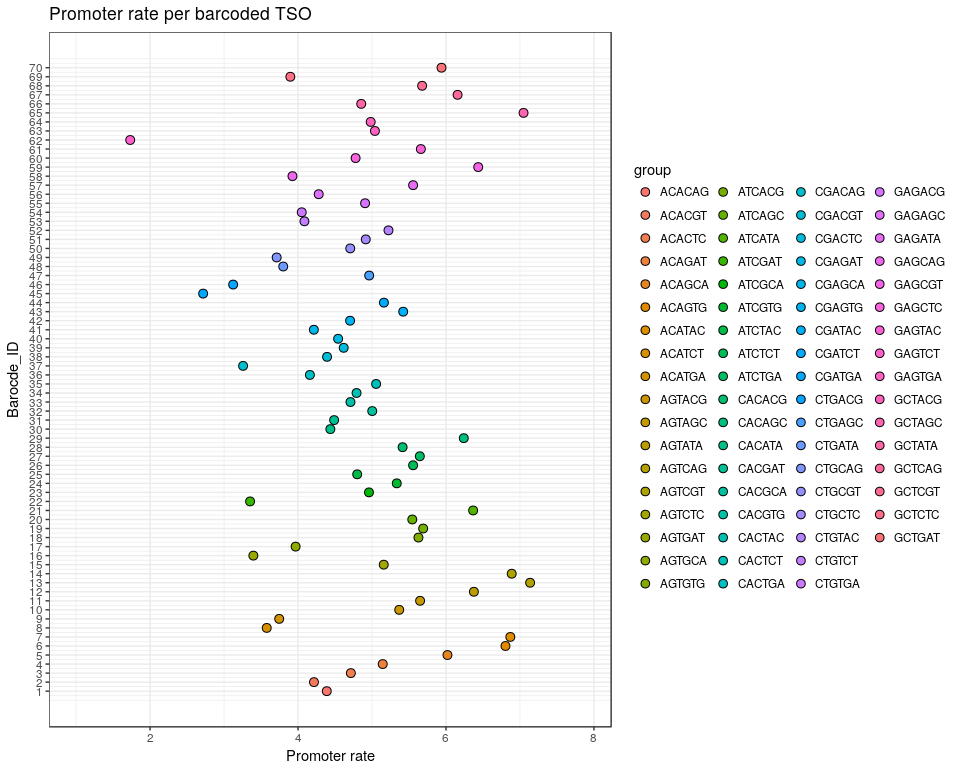<!-- -->

Save myCAGEexp file.


```r
saveRDS(myCAGEexp, "myCAGEexp.Rds")
```

QC PLOTS
========

Boxplots
--------

### Extracted reads


```r
par(mar=c(5,5,2,2), cex.main = 1, font.main = 2)
boxplot(extracted ~ barcode_ID, xlab = "Barcode ID", ylab = "Extracted reads", data = colData(myCAGEexp), cex.axis = 0.6, las = 3, main = "Number of extracted reads per sample")
```

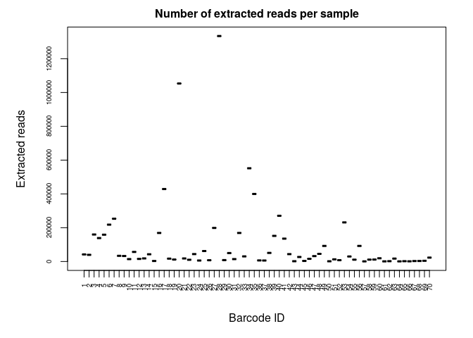<!-- -->


```r
par(mar=c(5,5,2,2), cex.main = 1, font.main = 2)
boxplot(extracted ~ RT_PRIMERS, ylab = "Extracted reads", xlab = "RT_PRIMERS concentration (uM)", data = colData(myCAGEexp), cex.axis = 0.7, las = 3, main = "Number of extracted reads for different RT_PRIMERS concentrations")
```

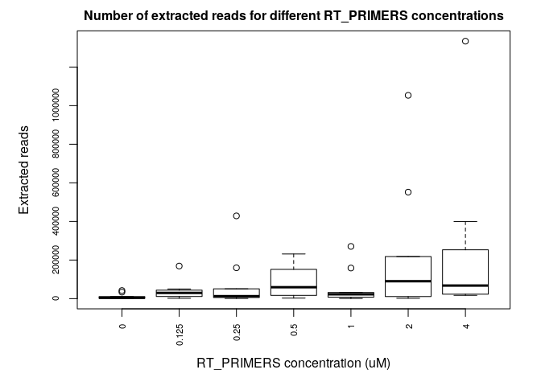<!-- -->


```r
par(mar=c(5,5,2,2), cex.main = 1, font.main = 2)
boxplot(extracted ~ TSO, ylab = "Extracted reads", xlab = "TSO concentration (uM)", data = colData(myCAGEexp), cex.axis = 0.7, las = 3, main = "Number of extracted reads for different TSO concentrations")
```

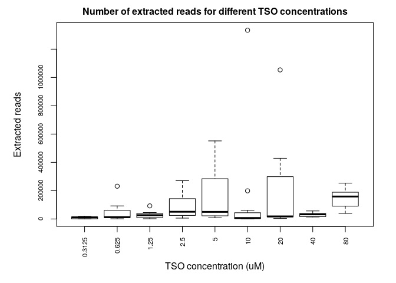<!-- -->


```r
par(mar=c(7,5,2,2), cex.main = 1, font.main = 2)
boxplot(extracted ~ PRIMERS_RATIO, ylab = "Extracted reads", xlab = "Primers ratio", data = colData(myCAGEexp), cex.axis = 0.7, las = 3, main = "Number of extracted reads for different primers ratio")
```

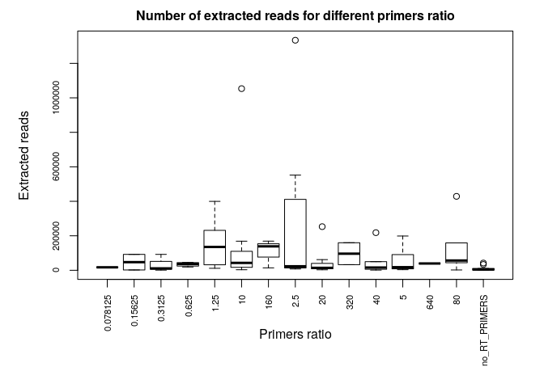<!-- -->

### Artefacts


```r
par(mar=c(5,5,2,2), cex.main = 1, font.main = 2)
boxplot(tagdust / extracted ~ barcode_ID, xlab = "Barcode ID", ylab = "Artefacts/extracted reads", data = colData(myCAGEexp), cex.axis = 0.6, las = 3, main = "Ratio artefacts/extracted per sample")
```

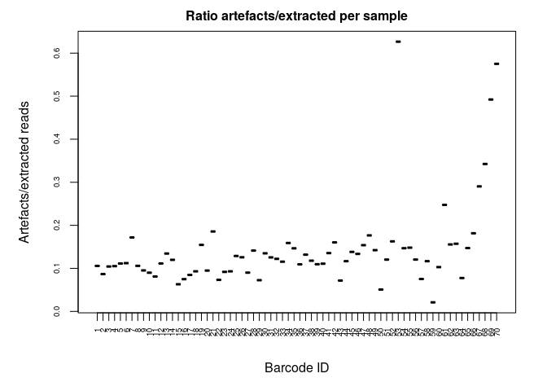<!-- -->


```r
par(mar=c(5,5,2,2), cex.main = 1, font.main = 2)
boxplot(tagdust / extracted ~ RT_PRIMERS, ylab = "Artefacts/extracted reads", xlab = "RT_PRIMERS concentration (uM)", data = colData(myCAGEexp), cex.axis = 0.7, las = 3, main = "Ratio artefacts/extracted for different RT_PRIMERS concentrations")
```

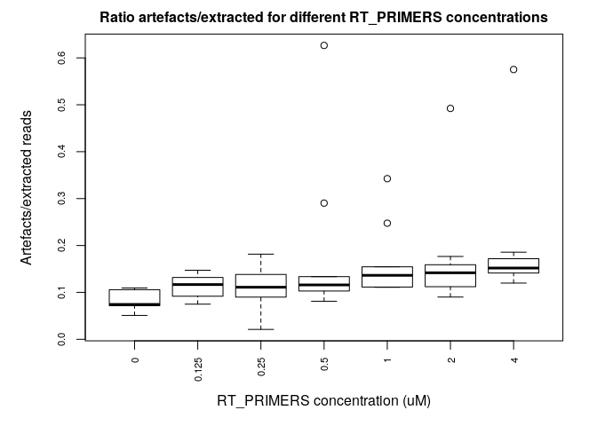<!-- -->


```r
par(mar=c(5,5,2,2), cex.main = 1, font.main = 2)
boxplot(tagdust / extracted ~ TSO, ylab = "Artefacts/extracted reads", xlab = "TSO concentration (uM)", data = colData(myCAGEexp), cex.axis = 0.7, las = 3, main = "Ratio artefacts/extracted for different TSO concentrations")
```

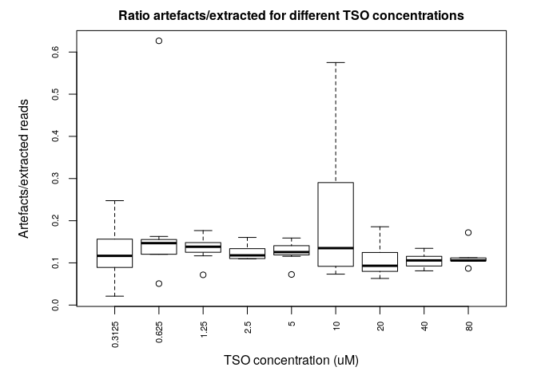<!-- -->


```r
par(mar=c(7,5,2,2), cex.main = 1, font.main = 2)
boxplot(tagdust / extracted ~ PRIMERS_RATIO, ylab = "Artefacts/extracted reads", xlab = "Primers ratio", data = colData(myCAGEexp), cex.axis = 0.7, las = 3, main = "Ratio artefacts/extracted for different primers ratio")
```

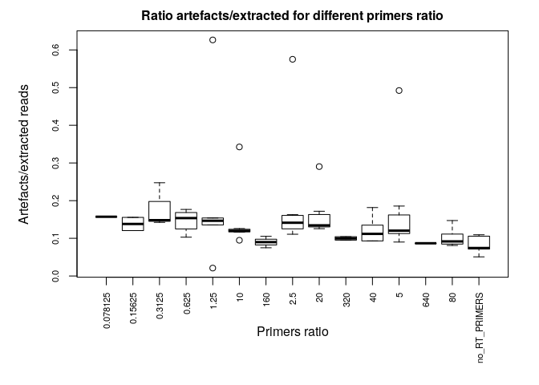<!-- -->

### Counts


```r
par(mar=c(5,5,2,2), cex.main = 1, font.main = 2)
boxplot(counts ~ barcode_ID, xlab = "Barcode ID", ylab = "Counts", data = colData(myCAGEexp), cex.axis = 0.6, las = 3, main = "Number of read counts per sample")
```

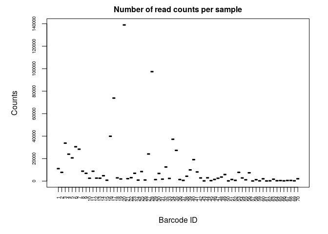<!-- -->


```r
par(mar=c(5,5,2,2), cex.main = 1, font.main = 2)
boxplot(counts ~ RT_PRIMERS, ylab = "Counts", xlab = "RT_PRIMERS concentration (uM)", data = colData(myCAGEexp), cex.axis = 0.7, las = 3, main = "Number of read counts for different RT_PRIMERS concentrations")
```

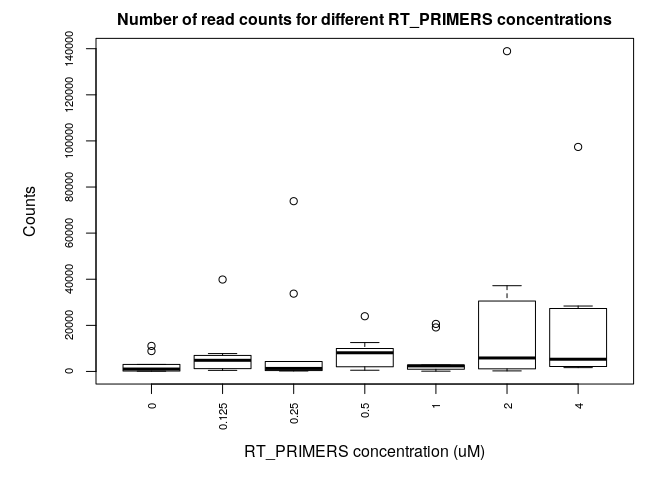<!-- -->


```r
par(mar=c(5,5,2,2), cex.main = 1, font.main = 2)
boxplot(counts ~ TSO, ylab = "Counts", xlab = "TSO concentration (uM)", data = colData(myCAGEexp), cex.axis = 0.7, las = 3, main = "Number of read counts for different TSO concentrations")
```

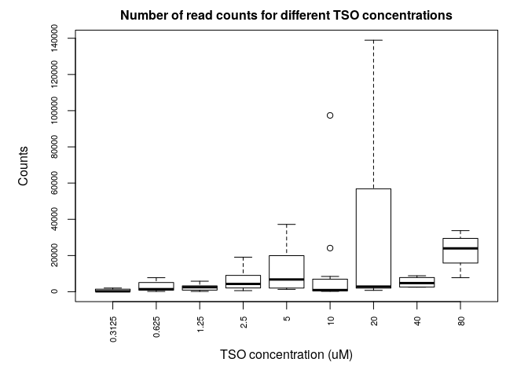<!-- -->


```r
par(mar=c(7,5,2,2), cex.main = 1, font.main = 2)
boxplot(counts ~ PRIMERS_RATIO, ylab = "Counts", xlab = "Primers ratio", data = colData(myCAGEexp), cex.axis = 0.7, las = 3, main = "Number of read counts for different primers ratio")
```

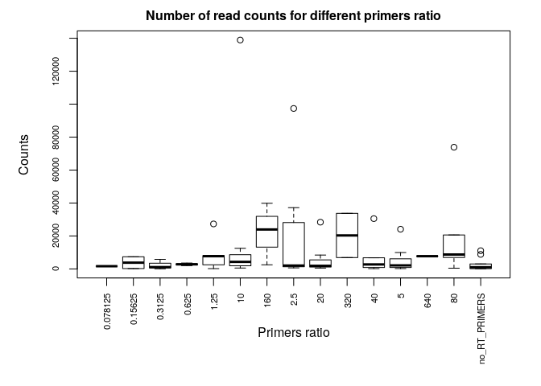<!-- -->

### Genes


```r
par(mar=c(5,5,2,2), cex.main = 1, font.main = 2)
boxplot(genes ~ barcode_ID, xlab = "Barcode ID", ylab = "Genes", data = colData(myCAGEexp), cex.axis = 0.6, las = 3, main = "Number of genes detected per sample")
```

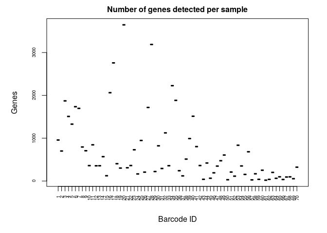<!-- -->


```r
par(mar=c(5,5,2,2), cex.main = 1, font.main = 2)
boxplot(genes ~ RT_PRIMERS, ylab = "Genes", xlab = "RT_PRIMERS concentration (uM)", data = colData(myCAGEexp), cex.axis = 0.7, las = 3, main = "Number of genes detected for different RT_PRIMERS concentrations")
```

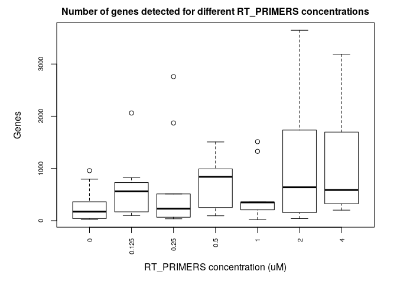<!-- -->


```r
par(mar=c(5,5,2,2), cex.main = 1, font.main = 2)
boxplot(genes ~ TSO, ylab = "Genes", xlab = "TSO concentration (uM)", data = colData(myCAGEexp), cex.axis = 0.7, las = 3, main = "Number of genes detected for different TSO concentrations")
```

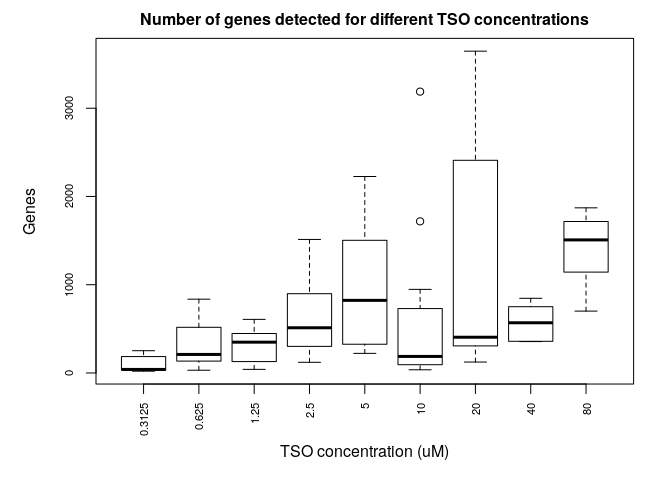<!-- -->


```r
par(mar=c(7,5,2,2), cex.main = 1, font.main = 2)
boxplot(genes ~ PRIMERS_RATIO, ylab = "Genes", xlab = "Primers ratio", data = colData(myCAGEexp), cex.axis = 0.7, las = 3, main = "Number of genes detected for different primers ratio")
```

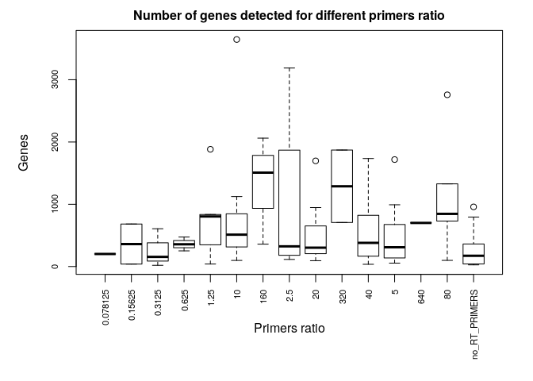<!-- -->

Dotplots
--------

### Extracted reads


```r
dotsize <- 25000
ggplot(colData(myCAGEexp) %>% data.frame, aes(x=PRIMERS_RATIO, y=extracted)) +
  stat_summary(fun.y=mean, fun.ymin=mean, fun.ymax=mean, geom="crossbar", color="gray") +
  geom_dotplot(aes(fill=group), binaxis='y', binwidth=1.5, dotsize=dotsize, stackdir='center') + theme_bw() +
  xlab("Primers ratio\n (TSO/RT_primers)") +
  labs(title = "Number of sequencing reads extracted") +
  coord_flip()
```

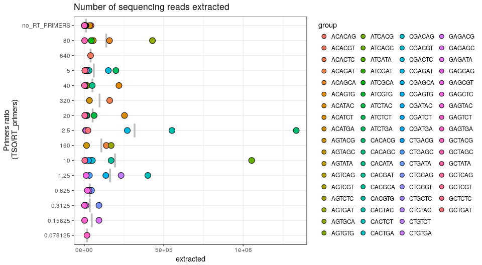<!-- -->

### Artefacts


```r
dotsize <- 5000
ggplot(colData(myCAGEexp) %>% data.frame, aes(x=PRIMERS_RATIO, y=tagdust)) +
  stat_summary(fun.y=mean, fun.ymin=mean, fun.ymax=mean, geom="crossbar", color="gray") +
  geom_dotplot(aes(fill=group), binaxis='y', binwidth=1, dotsize=dotsize, stackdir='center') + theme_bw() +
  xlab("Primers ratio\n (TSO/RT_primers)") +
  labs(title = "Artefacts reads per sample") +
  coord_flip()
```

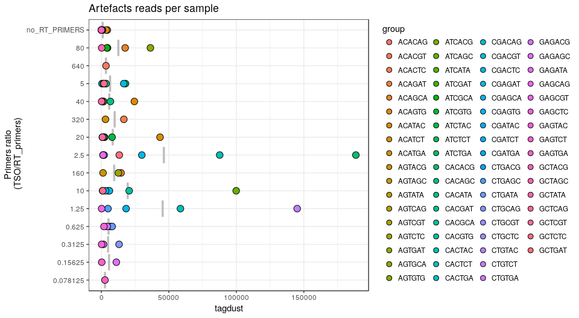<!-- -->

Counts
------

### Gene counts


```r
dotsize <- 100
ggplot(colData(myCAGEexp) %>% data.frame, aes(x=PRIMERS_RATIO, y=genes)) +
  stat_summary(fun.y=mean, fun.ymin=mean, fun.ymax=mean, geom="crossbar", color="gray") +
  geom_dotplot(aes(fill=group), binaxis='y', binwidth=1, dotsize=dotsize, stackdir='center') + theme_bw() +
  xlab("Primers ratio\n (TSO/RT_primers)") +
  labs(title = "Average number of genes detected in each group") +
  coord_flip()
```

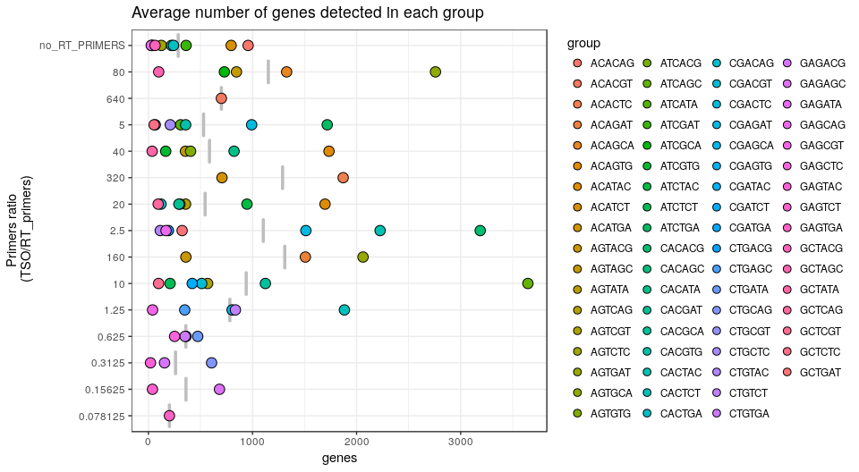<!-- -->

### Transcript counts


```r
dotsize <- 4000
ggplot(colData(myCAGEexp) %>% data.frame, aes(x=PRIMERS_RATIO, y=counts)) +
stat_summary(fun.y=mean, fun.ymin=mean, fun.ymax=mean, geom="crossbar", color="gray") +
geom_dotplot(aes(fill=group), binaxis='y', binwidth=1, dotsize=dotsize, stackdir='center') + theme_bw() +
xlab("Primers ratio\n (TSO/RT_primers)") +
labs(title = "Average number of molecules detected in each group") +
coord_flip()
```

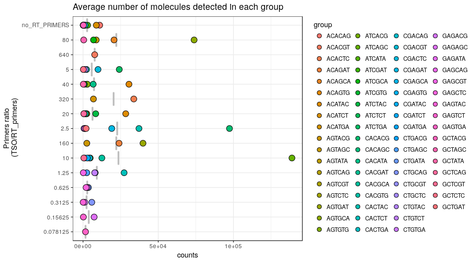<!-- -->

Barplots
--------

### Quality control by sample


```r
plotAnnot(myCAGEexp, "qc", "Quality control by sample", "barcode_ID", normalise = F)
```

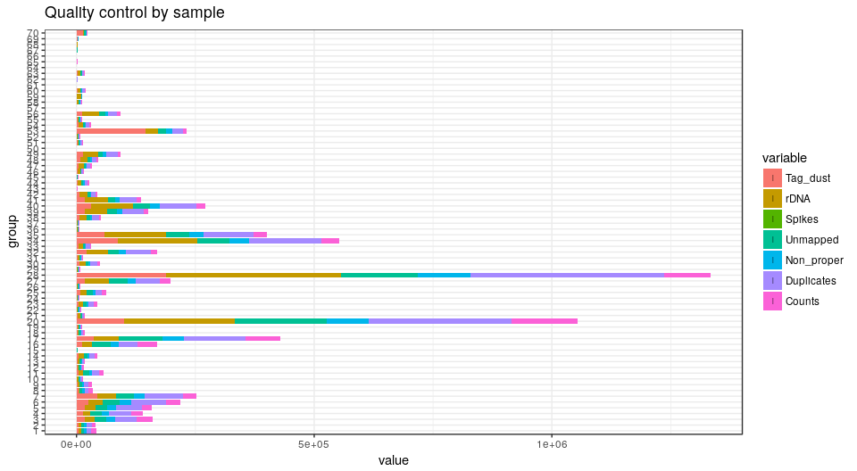<!-- -->

### Annotations by sample


```r
plotAnnot(myCAGEexp, "counts", "Annotations by sample", "barcode_ID", normalise = F)
```

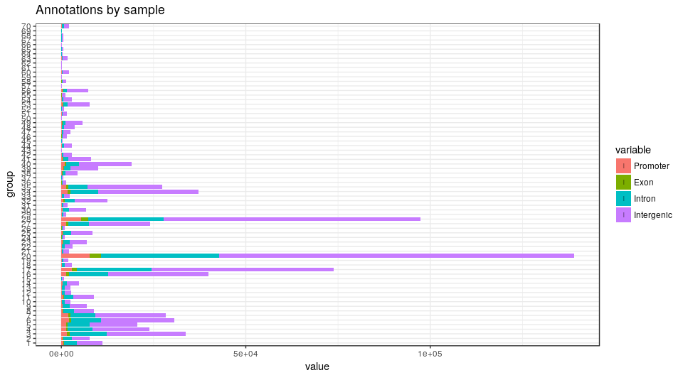<!-- -->

Rarefaction
------------


```r
rar1 <- hanabi(CTSStagCountDF(myCAGEexp), from = 0)
rarc <- hanabi(assay(consensusClustersSE(myCAGEexp)) %>% as.data.frame, from = 0)
rarg <- hanabi(assay(GeneExpSE(myCAGEexp)) %>% as.data.frame, from = 0)
save(rar1, rarg, file="rar.Rda") 
```

### Plot TSS discovery


```r
hanabiPlot(rar1, ylab='number of TSS detected', xlab='number of unique molecule counts', main=paste("TSS discovery"), group=myCAGEexp$group, legend.pos = "bottomright")
```

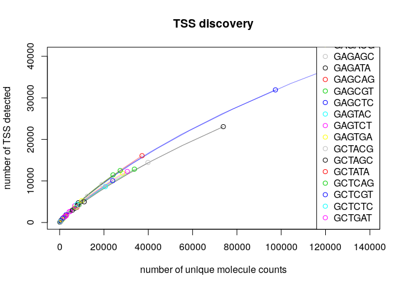<!-- -->

### Plot Cluster discovery


```r
#hanabiPlot(rarc, ylab='number of CTSS clusters detected', xlab='number of unique molecule counts', main=paste("Cluster discovery"), #group=myCAGEexp$group, legend.pos = "bottomright")
```

### Plot Gene discovery


```r
hanabiPlot(rarg, ylab='number of genes detected', xlab='number of unique molecule counts', main=paste("Gene discovery"), group=myCAGEexp$group, legend.pos = "bottomright")
```

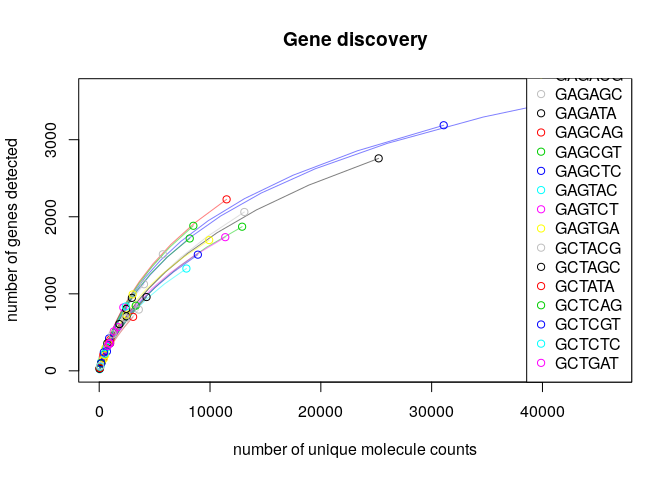<!-- -->

Correlation of CTSS clusters expression across samples (sample distance)
========================================================================

Create the correlation matrix
-----------------------------


```r
c <- assay(consensusClustersSE(myCAGEexp)) %>% as.data.frame
cor_clusters <- cor(log1p(c))
cor_clusters[cor_clusters == 1] <- NA
```

Heatmap
-------


```r
#col <- colorRampPalette( rev(brewer.pal(9, "RdBu")) )(255)
ann_col <- data.frame(row.names = rownames(colData(myCAGEexp)), TSO_conc. = myCAGEexp$TSO)
#ann_col$protocol <- sub("CONTROL", "CTL", ann_col$protocol)
ann_row <- data.frame(row.names = rownames(colData(myCAGEexp)), RT_PRIMERS_conc. = myCAGEexp$RT_PRIMERS)
#ann_row$step <- sub("0", "CTL", ann_row$step)
#colnames(cor_clusters) <- myCAGEexp$barcode_ID
pheatmap::pheatmap(cor_clusters, show_colnames = F, annotation_col = ann_col, annotation_row = ann_row, labels_row = myCAGEexp$barcode_ID, main = "Correlation of consensus clusters expression across samples\n", display_numbers = TRUE, fontsize_number = 4)
```

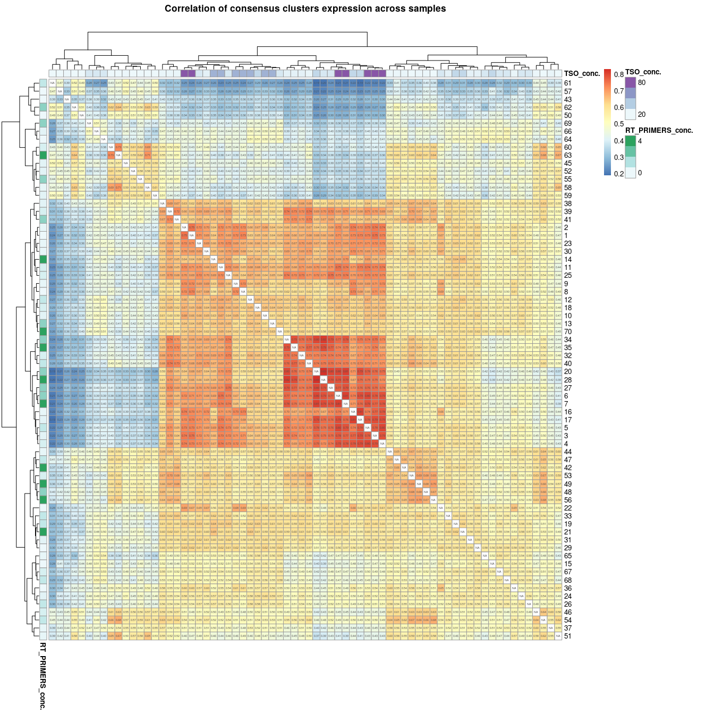<!-- -->

Principal Component Analysis (PCA)
==================================

Define PCA axis based on correlation matrix
--------------------------------------------


```r
cor_clusters <- cor(log1p(c))
PCA <- prcomp(cor_clusters, scale. = TRUE)
dfdf <- stats:::summary.prcomp(PCA)$importance[2, ]
```

List of principal components identified ranked by % of explained variability: 


```
##     PC1     PC2     PC3     PC4     PC5     PC6     PC7     PC8     PC9 
## 0.53148 0.14751 0.08617 0.02581 0.01441 0.01172 0.01027 0.00996 0.00899 
##    PC10    PC11    PC12    PC13    PC14    PC15    PC16    PC17    PC18 
## 0.00860 0.00773 0.00700 0.00656 0.00641 0.00588 0.00553 0.00527 0.00494 
##    PC19    PC20    PC21    PC22    PC23    PC24    PC25    PC26    PC27 
## 0.00473 0.00456 0.00453 0.00436 0.00410 0.00388 0.00379 0.00365 0.00357 
##    PC28    PC29    PC30    PC31    PC32    PC33    PC34    PC35    PC36 
## 0.00348 0.00325 0.00300 0.00288 0.00285 0.00274 0.00260 0.00247 0.00239 
##    PC37    PC38    PC39    PC40    PC41    PC42    PC43    PC44    PC45 
## 0.00236 0.00227 0.00219 0.00199 0.00191 0.00178 0.00175 0.00152 0.00138 
##    PC46    PC47    PC48    PC49    PC50    PC51    PC52    PC53    PC54 
## 0.00135 0.00130 0.00123 0.00113 0.00102 0.00101 0.00093 0.00082 0.00077 
##    PC55    PC56    PC57    PC58    PC59    PC60    PC61    PC62    PC63 
## 0.00076 0.00072 0.00066 0.00063 0.00057 0.00047 0.00040 0.00034 0.00031 
##    PC64    PC65    PC66    PC67    PC68    PC69    PC70 
## 0.00029 0.00028 0.00024 0.00023 0.00018 0.00016 0.00000
```

PCA Plot 1: PC1 vs. PC2 annotated by `PRIMERS_RATIO`
----------------------------------------------------


```r
ggbiplot::ggbiplot(PCA, choices=c(1,2), obs.scale = 1, var.scale = 1, groups = as.character(colData(myCAGEexp)$TSO), var.axes = FALSE, labels = colData(myCAGEexp)$genes, ellipse = T, margins = c(9,9))
```

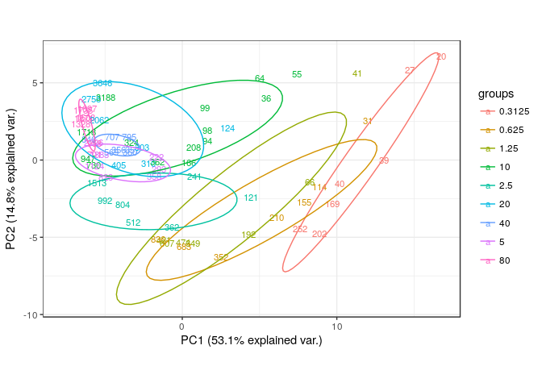<!-- -->

Plate maps
==========

Create plate object


```r
plate <- as.data.frame(colData(myCAGEexp))
```


```r
plateMap <- function(x, title) {
  platetools::raw_map(plate[[x]], well=plate$Well, plate="384") +
  ggtitle(title) +
  viridis::scale_fill_viridis(breaks = unique(plate[[x]]))
}

plateMapLog <- function(x, title) {
  platetools::raw_map(plate[[x]], well=plate$Well, plate="384") +
  ggtitle(title) +
  viridis::scale_fill_viridis(breaks = unique(plate[[x]]), trans = "log")
}
```

RT primers
----------


```r
(plot_RT <- plateMapLog("RT_PRIMERS", "RT primer concentration"))
```

```
## Warning: Invalid plate selection. The data given has more rows then number of wells.
## Are you sure argument 'plate' is correct for the number of wells in your data?
## note: Default is a 96-well plate.

## Warning: Invalid plate selection. The data given has more rows then number of wells.
## Are you sure argument 'plate' is correct for the number of wells in your data?
## note: Default is a 96-well plate.
```

```
## Warning: Transformation introduced infinite values in discrete y-axis
```

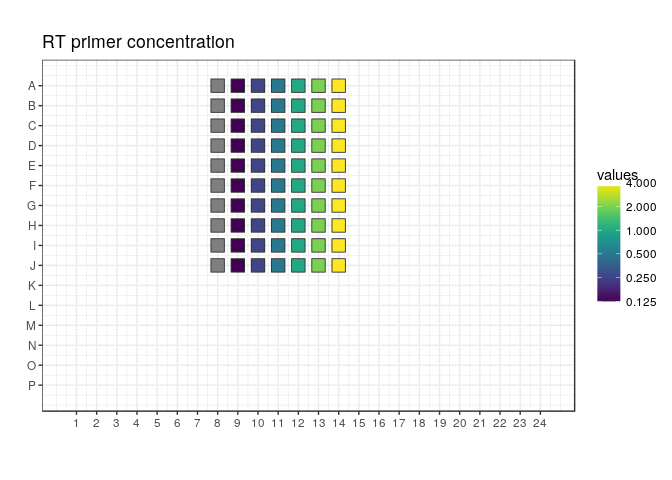<!-- -->

TSO
---


```r
(plot_TSO <- plateMapLog("TSO", "TSO concentration"))
```

```
## Warning: Invalid plate selection. The data given has more rows then number of wells.
## Are you sure argument 'plate' is correct for the number of wells in your data?
## note: Default is a 96-well plate.

## Warning: Invalid plate selection. The data given has more rows then number of wells.
## Are you sure argument 'plate' is correct for the number of wells in your data?
## note: Default is a 96-well plate.
```

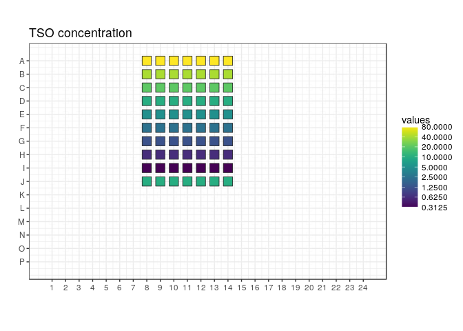<!-- -->

Ratio TSO / RT
--------------


```r
(plot_TSO_RT_ratio <- platetools::raw_map(plate$TSO / plate$RT_PRIMERS, well=plate$Well, plate="384") +
  ggtitle("TSO / RT primer concentration") +
  viridis::scale_fill_viridis(breaks = unique(plate$TSO / plate$RT_PRIMERS), trans = "log"))
```

```
## Warning: Invalid plate selection. The data given has more rows then number of wells.
## Are you sure argument 'plate' is correct for the number of wells in your data?
## note: Default is a 96-well plate.

## Warning: Invalid plate selection. The data given has more rows then number of wells.
## Are you sure argument 'plate' is correct for the number of wells in your data?
## note: Default is a 96-well plate.
```

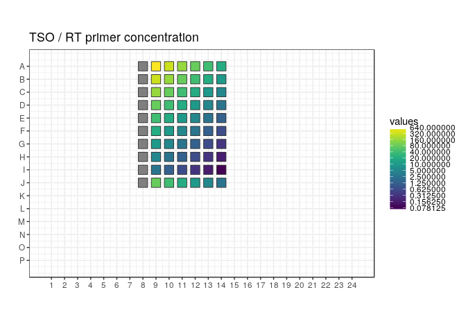<!-- -->

Extracted
----------


```r
(plot_extracted <- plateMapLog("extracted", "Extracted reads"))
```

```
## Warning: Invalid plate selection. The data given has more rows then number of wells.
## Are you sure argument 'plate' is correct for the number of wells in your data?
## note: Default is a 96-well plate.

## Warning: Invalid plate selection. The data given has more rows then number of wells.
## Are you sure argument 'plate' is correct for the number of wells in your data?
## note: Default is a 96-well plate.
```

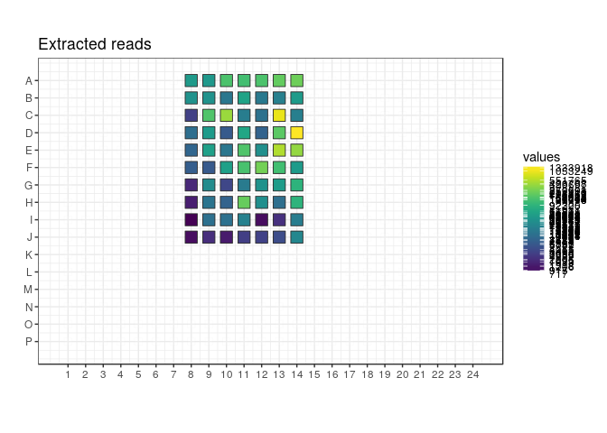<!-- -->

Artefacts
----------


```r
(plot_artefacts <- plateMapLog("tagdust", "Artefacts"))
```

```
## Warning: Invalid plate selection. The data given has more rows then number of wells.
## Are you sure argument 'plate' is correct for the number of wells in your data?
## note: Default is a 96-well plate.

## Warning: Invalid plate selection. The data given has more rows then number of wells.
## Are you sure argument 'plate' is correct for the number of wells in your data?
## note: Default is a 96-well plate.
```

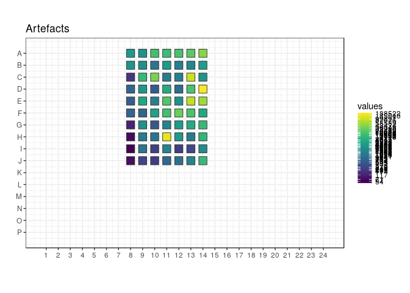<!-- -->

rDNA
----


```r
(plot_rDNA <- plateMapLog("rdna", "Reads mapping to rDNA"))
```

```
## Warning: Invalid plate selection. The data given has more rows then number of wells.
## Are you sure argument 'plate' is correct for the number of wells in your data?
## note: Default is a 96-well plate.

## Warning: Invalid plate selection. The data given has more rows then number of wells.
## Are you sure argument 'plate' is correct for the number of wells in your data?
## note: Default is a 96-well plate.
```

<!-- -->

Genes
------


```r
(plot_genes <- plateMapLog("genes", "Genes detected"))
```

```
## Warning: Invalid plate selection. The data given has more rows then number of wells.
## Are you sure argument 'plate' is correct for the number of wells in your data?
## note: Default is a 96-well plate.

## Warning: Invalid plate selection. The data given has more rows then number of wells.
## Are you sure argument 'plate' is correct for the number of wells in your data?
## note: Default is a 96-well plate.
```

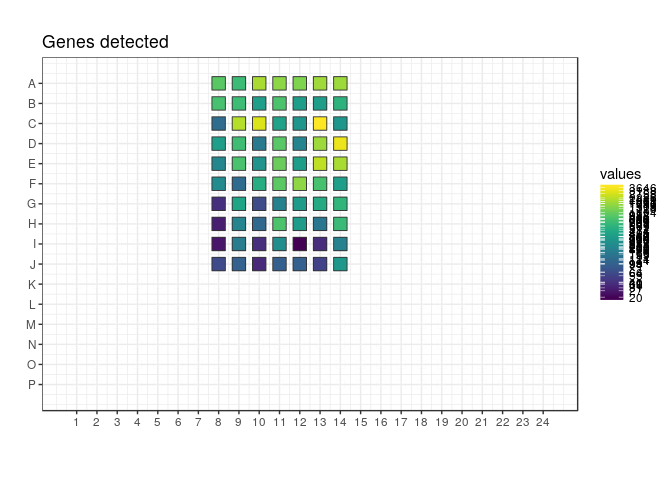<!-- -->

Counts
------


```r
(plot_counts <- plateMapLog("counts", "Molecules detected"))
```

```
## Warning: Invalid plate selection. The data given has more rows then number of wells.
## Are you sure argument 'plate' is correct for the number of wells in your data?
## note: Default is a 96-well plate.

## Warning: Invalid plate selection. The data given has more rows then number of wells.
## Are you sure argument 'plate' is correct for the number of wells in your data?
## note: Default is a 96-well plate.
```

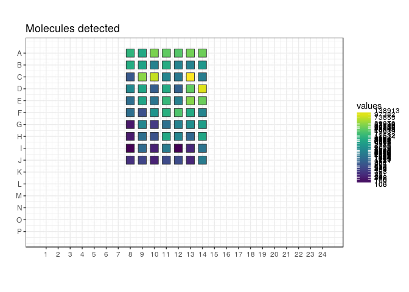<!-- -->

Promoters
---------


```r
(plot_promoters <- plateMapLog("promoter", "Promoters detected"))
```

```
## Warning: Invalid plate selection. The data given has more rows then number of wells.
## Are you sure argument 'plate' is correct for the number of wells in your data?
## note: Default is a 96-well plate.

## Warning: Invalid plate selection. The data given has more rows then number of wells.
## Are you sure argument 'plate' is correct for the number of wells in your data?
## note: Default is a 96-well plate.
```

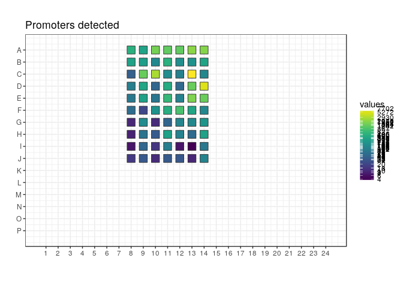<!-- -->

Grand summary plots
===================

Extracted. artefacts, rDNA
--------------------------


```r
ggpubr::ggarrange(ncol = 3, nrow = 2, plot_RT, plot_TSO, plot_TSO_RT_ratio, plot_extracted, plot_artefacts, plot_rDNA)
```

```
## Warning: Transformation introduced infinite values in discrete y-axis
```

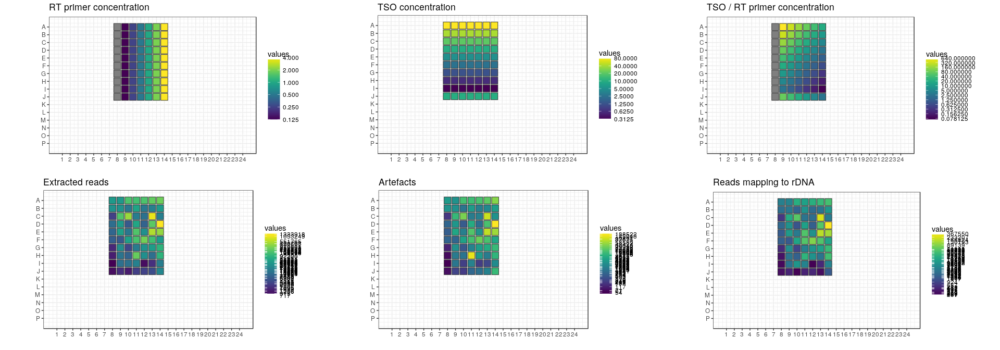<!-- -->

Molecules, genes and promoters
-------------------------------


```r
ggpubr::ggarrange(ncol = 3, nrow = 2, plot_RT, plot_TSO, plot_TSO_RT_ratio, plot_counts, plot_genes, plot_promoters)
```

```
## Warning: Transformation introduced infinite values in discrete y-axis
```

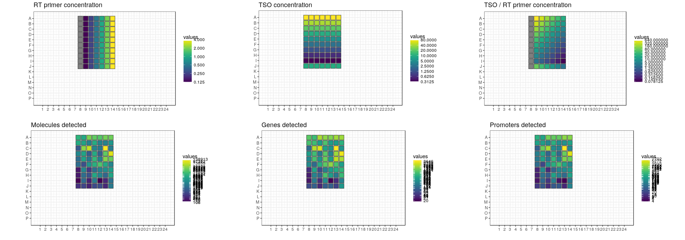<!-- -->


```r
sessionInfo()
```

```
## R version 3.4.0 (2017-04-21)
## Platform: x86_64-pc-linux-gnu (64-bit)
## Running under: Debian GNU/Linux 9 (stretch)
## 
## Matrix products: default
## BLAS: /usr/lib/libblas/libblas.so.3.7.0
## LAPACK: /usr/lib/lapack/liblapack.so.3.7.0
## 
## locale:
##  [1] LC_CTYPE=C.UTF-8       LC_NUMERIC=C           LC_TIME=C.UTF-8       
##  [4] LC_COLLATE=C.UTF-8     LC_MONETARY=C.UTF-8    LC_MESSAGES=C.UTF-8   
##  [7] LC_PAPER=C.UTF-8       LC_NAME=C              LC_ADDRESS=C          
## [10] LC_TELEPHONE=C         LC_MEASUREMENT=C.UTF-8 LC_IDENTIFICATION=C   
## 
## attached base packages:
##  [1] grid      stats4    parallel  stats     graphics  grDevices utils    
##  [8] datasets  methods   base     
## 
## other attached packages:
##  [1] bindrcpp_0.2                      scales_0.5.0                     
##  [3] vegan_2.4-4                       lattice_0.20-35                  
##  [5] permute_0.9-4                     reshape_0.8.7                    
##  [7] SummarizedExperiment_1.6.5        DelayedArray_0.2.7               
##  [9] matrixStats_0.52.2                Biobase_2.36.2                   
## [11] MultiAssayExperiment_1.2.1        plyr_1.8.4                       
## [13] magrittr_1.5                      RColorBrewer_1.1-2               
## [15] gplots_3.0.1                      ggplot2_2.2.1                    
## [17] data.table_1.10.4-1               CAGEr_1.21.4.2                   
## [19] BSgenome.Mmusculus.UCSC.mm9_1.4.0 BSgenome_1.44.2                  
## [21] rtracklayer_1.36.4                Biostrings_2.44.2                
## [23] XVector_0.16.0                    GenomicRanges_1.28.4             
## [25] GenomeInfoDb_1.12.3               IRanges_2.10.3                   
## [27] S4Vectors_0.14.5                  BiocGenerics_0.22.1              
## 
## loaded via a namespace (and not attached):
##  [1] nlme_3.1-131                  bitops_1.0-6                 
##  [3] bit64_0.9-7                   httr_1.3.1                   
##  [5] rprojroot_1.3-2               UpSetR_1.3.3                 
##  [7] ggbiplot_0.55                 tools_3.4.0                  
##  [9] backports_1.1.2               platetools_0.0.2             
## [11] R6_2.2.2                      KernSmooth_2.23-15           
## [13] DBI_0.7                       lazyeval_0.2.1               
## [15] mgcv_1.8-17                   colorspace_1.3-2             
## [17] gridExtra_2.3                 curl_3.1                     
## [19] bit_1.1-12                    compiler_3.4.0               
## [21] VennDiagram_1.6.18            labeling_0.3                 
## [23] caTools_1.17.1                stringr_1.2.0                
## [25] digest_0.6.13                 Rsamtools_1.28.0             
## [27] rmarkdown_1.8                 pkgconfig_2.0.1              
## [29] htmltools_0.3.6               rlang_0.1.2                  
## [31] RSQLite_2.0                   VGAM_1.0-4                   
## [33] BiocInstaller_1.26.1          shiny_1.0.5                  
## [35] bindr_0.1                     BiocParallel_1.10.1          
## [37] gtools_3.5.0                  dplyr_0.7.4                  
## [39] RCurl_1.95-4.9                GenomeInfoDbData_0.99.0      
## [41] futile.logger_1.4.3           smallCAGEqc_0.12.2.99999     
## [43] Matrix_1.2-10                 Rcpp_0.12.12                 
## [45] munsell_0.4.3                 viridis_0.4.0                
## [47] stringi_1.1.6                 yaml_2.1.16                  
## [49] MASS_7.3-47                   zlibbioc_1.22.0              
## [51] AnnotationHub_2.8.3           blob_1.1.0                   
## [53] gdata_2.18.0                  shinydashboard_0.6.1         
## [55] cowplot_0.9.2                 splines_3.4.0                
## [57] knitr_1.18                    beanplot_1.2                 
## [59] ggpubr_0.1.6                  reshape2_1.4.3               
## [61] codetools_0.2-15              futile.options_1.0.0         
## [63] XML_3.98-1.9                  glue_1.2.0                   
## [65] evaluate_0.10.1               lambda.r_1.2                 
## [67] httpuv_1.3.5                  gtable_0.2.0                 
## [69] purrr_0.2.4                   tidyr_0.7.1                  
## [71] assertthat_0.2.0              mime_0.5                     
## [73] xtable_1.8-2                  viridisLite_0.2.0            
## [75] pheatmap_1.0.8                tibble_1.3.4                 
## [77] som_0.3-5.1                   AnnotationDbi_1.38.2         
## [79] memoise_1.1.0                 GenomicAlignments_1.12.2     
## [81] cluster_2.0.6                 interactiveDisplayBase_1.14.0
```
