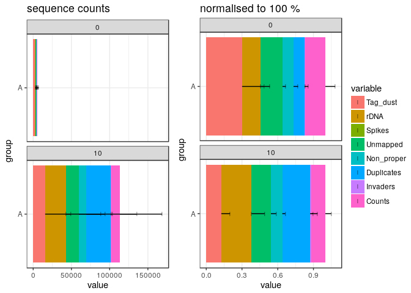

Data load and QC in R
=====================


```r
BS_GENOME    <- "BSgenome.Mmusculus.UCSC.mm9" 
library(BS_GENOME, character.only = T)
```

```
## Loading required package: BSgenome
```

```
## Loading required package: BiocGenerics
```

```
## Loading required package: parallel
```

```
## 
## Attaching package: 'BiocGenerics'
```

```
## The following objects are masked from 'package:parallel':
## 
##     clusterApply, clusterApplyLB, clusterCall, clusterEvalQ,
##     clusterExport, clusterMap, parApply, parCapply, parLapply,
##     parLapplyLB, parRapply, parSapply, parSapplyLB
```

```
## The following objects are masked from 'package:stats':
## 
##     IQR, mad, sd, var, xtabs
```

```
## The following objects are masked from 'package:base':
## 
##     anyDuplicated, append, as.data.frame, basename, cbind,
##     colMeans, colnames, colSums, dirname, do.call, duplicated,
##     eval, evalq, Filter, Find, get, grep, grepl, intersect,
##     is.unsorted, lapply, lengths, Map, mapply, match, mget, order,
##     paste, pmax, pmax.int, pmin, pmin.int, Position, rank, rbind,
##     Reduce, rowMeans, rownames, rowSums, sapply, setdiff, sort,
##     table, tapply, union, unique, unsplit, which, which.max,
##     which.min
```

```
## Loading required package: S4Vectors
```

```
## Loading required package: stats4
```

```
## 
## Attaching package: 'S4Vectors'
```

```
## The following object is masked from 'package:base':
## 
##     expand.grid
```

```
## Loading required package: IRanges
```

```
## Loading required package: GenomeInfoDb
```

```
## Loading required package: GenomicRanges
```

```
## Loading required package: Biostrings
```

```
## Loading required package: XVector
```

```
## 
## Attaching package: 'Biostrings'
```

```
## The following object is masked from 'package:base':
## 
##     strsplit
```

```
## Loading required package: rtracklayer
```

```r
library(CAGEr)
library(data.table)
```

```
## 
## Attaching package: 'data.table'
```

```
## The following object is masked from 'package:GenomicRanges':
## 
##     shift
```

```
## The following object is masked from 'package:IRanges':
## 
##     shift
```

```
## The following objects are masked from 'package:S4Vectors':
## 
##     first, second
```

```r
library(ggplot2)
library(gplots)
```

```
## 
## Attaching package: 'gplots'
```

```
## The following object is masked from 'package:rtracklayer':
## 
##     space
```

```
## The following object is masked from 'package:IRanges':
## 
##     space
```

```
## The following object is masked from 'package:S4Vectors':
## 
##     space
```

```
## The following object is masked from 'package:stats':
## 
##     lowess
```

```r
library('RColorBrewer')
library(magrittr)
library(plyr)
```

```
## 
## Attaching package: 'plyr'
```

```
## The following object is masked from 'package:XVector':
## 
##     compact
```

```
## The following object is masked from 'package:IRanges':
## 
##     desc
```

```
## The following object is masked from 'package:S4Vectors':
## 
##     rename
```

```r
library(MultiAssayExperiment)
library(SummarizedExperiment)
```

```
## Loading required package: Biobase
```

```
## Welcome to Bioconductor
## 
##     Vignettes contain introductory material; view with
##     'browseVignettes()'. To cite Bioconductor, see
##     'citation("Biobase")', and for packages 'citation("pkgname")'.
```

```
## Loading required package: DelayedArray
```

```
## Loading required package: matrixStats
```

```
## 
## Attaching package: 'matrixStats'
```

```
## The following objects are masked from 'package:Biobase':
## 
##     anyMissing, rowMedians
```

```
## The following object is masked from 'package:plyr':
## 
##     count
```

```
## 
## Attaching package: 'DelayedArray'
```

```
## The following objects are masked from 'package:matrixStats':
## 
##     colMaxs, colMins, colRanges, rowMaxs, rowMins, rowRanges
```

```
## The following object is masked from 'package:Biostrings':
## 
##     type
```

```
## The following object is masked from 'package:base':
## 
##     apply
```

```r
library(reshape)
```

```
## 
## Attaching package: 'reshape'
```

```
## The following objects are masked from 'package:plyr':
## 
##     rename, round_any
```

```
## The following object is masked from 'package:data.table':
## 
##     melt
```

```
## The following objects are masked from 'package:S4Vectors':
## 
##     expand, rename
```

```r
library(vegan)
```

```
## Loading required package: permute
```

```
## Loading required package: lattice
```

```
## This is vegan 2.4-5
```

MOIRAI shortcuts


```r
WORKFLOW       <- "OP-WORKFLOW-CAGEscan-short-reads-v2.1~rc1"
MOIRAI_PROJ    <- "project/Labcyte" 
MOIRAI_USER    <- "nanoCAGE2" 
ASSEMBLY       <- "mm9"
BASEDIR        <- "/osc-fs_home/scratch/moirai"
MOIRAI_BASE    <- file.path(BASEDIR, MOIRAI_USER)
MOIRAI_RESULTS <- file.path(MOIRAI_BASE, MOIRAI_PROJ)
```

Load CAGE libraries
===================

Load summary statistics from MOIRAI and polish the names
--------------------------------------------------------


```r
libs <- smallCAGEqc::loadMoiraiStats(
  pipeline  = "OP-WORKFLOW-CAGEscan-short-reads-v2.0",
  multiplex = file.path( MOIRAI_BASE, "input/171227_M00528_0321_000000000-B4GLP.multiplex.txt"),
  summary   = file.path( MOIRAI_RESULTS,"171227_M00528_0321_000000000-B4GLP.OP-WORKFLOW-CAGEscan-short-reads-v2.1~rc1.20180104125850/text/summary.txt"))
libs$barcode_ID <- c(1:70)
libs$inputFiles <- list.files(path = "/osc-fs_home/scratch/moirai/nanoCAGE2/project/Labcyte/171227_M00528_0321_000000000-B4GLP.OP-WORKFLOW-CAGEscan-short-reads-v2.1~rc1.20180104125850/CAGEscan_fragments")
libs$inputFiles <- paste0("/osc-fs_home/scratch/moirai/nanoCAGE2/project/Labcyte/171227_M00528_0321_000000000-B4GLP.OP-WORKFLOW-CAGEscan-short-reads-v2.1~rc1.20180104125850/CAGEscan_fragments/", libs$inputFiles)
libs$inputFilesType <- c("bed")
libs$sampleLabels <- as.character(libs$samplename)
libs
```

```
##        samplename  group barcode    index total extracted cleaned tagdust
## ACACAG     ACACAG ACACAG  ACACAG TAGGCATG     0     42054   32450    4446
## ACACGT     ACACGT ACACGT  ACACGT TAGGCATG     0     39556   30362    3435
## ACACTC     ACACTC ACACTC  ACACTC TAGGCATG     0    159844  121202   16681
## ACAGAT     ACAGAT ACAGAT  ACAGAT TAGGCATG     0    138710  109459   14604
## ACAGCA     ACAGCA ACAGCA  ACAGCA TAGGCATG     0    158662  118015   17660
## ACAGTG     ACAGTG ACAGTG  ACAGTG TAGGCATG     0    218169  162650   24469
## ACATAC     ACATAC ACATAC  ACATAC TAGGCATG     0    252993  170605   43474
## ACATCT     ACATCT ACATCT  ACATCT TAGGCATG     0     33745   27224    3571
## ACATGA     ACATGA ACATGA  ACATGA TAGGCATG     0     32474   25537    3094
## AGTACG     AGTACG AGTACG  AGTACG TAGGCATG     0     14180   10760    1275
## AGTAGC     AGTAGC AGTAGC  AGTAGC TAGGCATG     0     56598   43154    4590
## AGTATA     AGTATA AGTATA  AGTATA TAGGCATG     0     15195   10726    1692
## AGTCAG     AGTCAG AGTCAG  AGTCAG TAGGCATG     0     18231   12169    2451
## AGTCGT     AGTCGT AGTCGT  AGTCGT TAGGCATG     0     42894   27736    5143
## AGTCTC     AGTCTC AGTCTC  AGTCTC TAGGCATG     0      3059    2204     193
## AGTGAT     AGTGAT AGTGAT  AGTGAT TAGGCATG     0    168934  137231   12654
## AGTGCA     AGTGCA AGTGCA  AGTGCA TAGGCATG     0    428768  340280   36348
## AGTGTG     AGTGTG AGTGTG  AGTGTG TAGGCATG     0     16988   11880    1582
## ATCACG     ATCACG ATCACG  ATCACG TAGGCATG     0     11697    7038    1808
## ATCAGC     ATCAGC ATCAGC  ATCAGC TAGGCATG     0   1053249  719844   99891
## ATCATA     ATCATA ATCATA  ATCATA TAGGCATG     0     17945   10155    3332
## ATCGAT     ATCGAT ATCGAT  ATCGAT TAGGCATG     0     10403    7116     762
## ATCGCA     ATCGCA ATCGCA  ATCGCA TAGGCATG     0     43925   30747    4033
## ATCGTG     ATCGTG ATCGTG  ATCGTG TAGGCATG     0      5852    3888     545
## ATCTAC     ATCTAC ATCTAC  ATCTAC TAGGCATG     0     61931   39776    7975
## ATCTCT     ATCTCT ATCTCT  ATCTCT TAGGCATG     0      7558    4713     951
## ATCTGA     ATCTGA ATCTGA  ATCTGA TAGGCATG     0    198657  131168   17902
## CACACG     CACACG CACACG  CACACG TAGGCATG     0   1333918  777491  188522
## CACAGC     CACAGC CACAGC  CACAGC TAGGCATG     0      8329    6011     604
## CACATA     CACATA CACATA  CACATA TAGGCATG     0     49911   31480    6737
## CACGAT     CACGAT CACGAT  CACGAT TAGGCATG     0     14078    8046    1768
## CACGCA     CACGCA CACGCA  CACGCA TAGGCATG     0    168925  101801   20625
## CACGTG     CACGTG CACGTG  CACGTG TAGGCATG     0     30261   17471    3498
## CACTAC     CACTAC CACTAC  CACTAC TAGGCATG     0    551765  297147   87676
## CACTCT     CACTCT CACTCT  CACTCT TAGGCATG     0    399697  210815   58589
## CACTGA     CACTGA CACTGA  CACTGA TAGGCATG     0      6506    3906     712
## CGACAG     CGACAG CGACAG  CGACAG TAGGCATG     0      5787    3355     763
## CGACGT     CGACGT CGACGT  CGACGT TAGGCATG     0     50902   28765    5996
## CGACTC     CGACTC CGACTC  CGACTC TAGGCATG     0    151581   86422   16624
## CGAGAT     CGAGAT CGAGAT  CGAGAT TAGGCATG     0    270601  151394   29998
## CGAGCA     CGAGCA CGAGCA  CGAGCA TAGGCATG     0    135396   69981   18350
## CGAGTG     CGAGTG CGAGTG  CGAGTG TAGGCATG     0     43603   20443    6994
## CGATAC     CGATAC CGATAC  CGATAC TAGGCATG     0      1633    1032     117
## CGATCT     CGATCT CGATCT  CGATCT TAGGCATG     0     26817   16094    3128
## CGATGA     CGATGA CGATGA  CGATGA TAGGCATG     0      3492    2084     483
## CTGACG     CTGACG CTGACG  CTGACG TAGGCATG     0     15719    8510    2101
## CTGAGC     CTGAGC CTGAGC  CTGAGC TAGGCATG     0     31942   17171    4917
## CTGATA     CTGATA CTGATA  CTGATA TAGGCATG     0     45389   22937    8017
## CTGCAG     CTGCAG CTGCAG  CTGCAG TAGGCATG     0     92305   47128   13132
## CTGCGT     CTGCGT CTGCGT  CTGCGT TAGGCATG     0      1318     973      67
## CTGCTC     CTGCTC CTGCTC  CTGCTC TAGGCATG     0     12831    7704    1544
## CTGTAC     CTGTAC CTGTAC  CTGTAC TAGGCATG     0      7689    4464    1251
## CTGTCT     CTGTCT CTGTCT  CTGTCT TAGGCATG     0    231518   60117  145048
## CTGTGA     CTGTGA CTGTGA  CTGTGA TAGGCATG     0     29711   15875    4364
## GAGACG     GAGACG GAGACG  GAGACG TAGGCATG     0     10894    5736    1614
## GAGAGC     GAGAGC GAGAGC  GAGAGC TAGGCATG     0     92220   44459   11116
## GAGATA     GAGATA GAGATA  GAGATA TAGGCATG     0       717     435      54
## GAGCAG     GAGCAG GAGCAG  GAGCAG TAGGCATG     0     11251    6691    1313
## GAGCGT     GAGCGT GAGCGT  GAGCGT TAGGCATG     0     11654    1146     245
## GAGCTC     GAGCTC GAGCTC  GAGCTC TAGGCATG     0     19222   11463    1980
## GAGTAC     GAGTAC GAGTAC  GAGTAC TAGGCATG     0       917     492     227
## GAGTCT     GAGTCT GAGTCT  GAGTCT TAGGCATG     0      2006    1237     312
## GAGTGA     GAGTGA GAGTGA  GAGTGA TAGGCATG     0     17132    8698    2693
## GCTACG     GCTACG GCTACG  GCTACG TAGGCATG     0       915     584      71
## GCTAGC     GCTAGC GCTAGC  GCTAGC TAGGCATG     0      1895    1202     279
## GCTATA     GCTATA GCTATA  GCTATA TAGGCATG     0      1206     786     219
## GCTCAG     GCTCAG GCTCAG  GCTCAG TAGGCATG     0      2855    1629     829
## GCTCGT     GCTCGT GCTCGT  GCTCGT TAGGCATG     0      3098    1593    1061
## GCTCTC     GCTCTC GCTCTC  GCTCTC TAGGCATG     0      4055    1809    1996
## GCTGAT     GCTGAT GCTGAT  GCTGAT TAGGCATG     0     23130    8235   13303
##          rdna spikes mapped properpairs counts barcode_ID
## ACACAG   5146     12  26243       20877  11074          1
## ACACGT   5752      7  24315       19174   7757          2
## ACACTC  21910     51  97291       79126  33749          3
## ACAGAT  14608     39  86021       70039  23945          4
## ACAGCA  22924     63  93817       76382  20614          5
## ACAGTG  30957     93 126928      103827  30539          6
## ACATAC  38832     82 131967      109128  28385          7
## ACATCT   2945      5  21474       16282   8834          8
## ACATGA   3834      9  19931       16201   6915          9
## AGTACG   2142      3   7677        6221   2515         10
## AGTAGC   8832     22  30252       24577   8761         11
## AGTATA   2763     14   7293        5944   2650         12
## AGTCAG   3607      4   8717        7070   2536         13
## AGTCGT  10008      7  19690       16325   4776         14
## AGTCTC    657      5   1542        1200    756         15
## AGTGAT  18983     66  96297       79334  39870         16
## AGTGCA  51993    146 247202      203106  73855         17
## AGTGTG   3523      3   8006        6661   2843         18
## ATCACG   2847      4   4928        3893   1880         19
## ATCAGC 233207    306 526082      438141 138913         20
## ATCATA   4454      4   6651        5320   2136         21
## ATCGAT   2523      2   5221        4391   3043         22
## ATCGCA   9134     11  22802       18594   6957         23
## ATCGTG   1417      2   2848        2226    881         24
## ATCTAC  14171      9  27992       22593   8438         25
## ATCTCT   1892      2   3025        2277    954         26
## ATCTGA  49511     76  90423       74762  24103         27
## CACACG 367550    355 615543      505838  97382         28
## CACAGC   1710      4   4673        3616   1346         29
## CACATA  11680     14  25125       20627   6761         30
## CACGAT   4261      3   6151        5052   1738         31
## CACGCA  46442     57  80641       65816  12532         32
## CACGTG   9282     10  13699       11134   2336         33
## CACTAC 166824    118 230182      188588  37193         34
## CACTCT 130193    100 162843      132950  27316         35
## CACTGA   1887      1   3069        2420   1370         36
## CGACAG   1665      4   2642        2102    614         37
## CGACGT  16127     14  22543       18241   4303         38
## CGACTC  48495     40  67288       55103   9963         39
## CGAGAT  89139     70 116804       95921  19089         40
## CGAGCA  47019     45  54182       44151   8092         41
## CGAGTG  16144     10  15140       12073   2785         42
## CGATAC    483      1    581         339    166         43
## CGATCT   7592      3  12355        9934   2887         44
## CGATGA    924      1   1537        1181    368         45
## CTGACG   5100      8   6343        5141   1441         46
## CTGAGC   9841     12  13201       10507   2499         47
## CTGATA  14419     16  16897       13603   3579         48
## CTGCAG  32013     32  36642       29777   5820         49
## CTGCGT    278      0    640         396    170         50
## CTGCTC   3583      0   5979        4164   1424         51
## CTGTAC   1972      2   3451        2486    651         52
## CTGTCT  26325     28  42593       30380   7757         53
## CTGTGA   9462     10  11972        9535   2790         54
## GAGACG   3543      1   3956        3074   1121         55
## GAGAGC  36627     18  30852       25105   7384         56
## GAGATA    228      0    276         200    108         57
## GAGCAG   3239      8   4988        3427   1223         58
## GAGCGT  10262      1    787         519    202         59
## GAGCTC   5776      3   8345        6477   2030         60
## GAGTAC    197      1    316         235    106         61
## GAGTCT    457      0    786         575    231         62
## GAGTGA   5738      3   5917        4594   1647         63
## GCTACG    260      0    437         367    281         64
## GCTAGC    414      0    815         657    454         65
## GCTATA    201      0    512         371    206         66
## GCTCAG    397      0   1154         848    536         67
## GCTCGT    442      2   1001         798    546         68
## GCTCTC    249      1   1214         571    231         69
## GCTGAT   1581     11   3721        2785   2054         70
##                                                                                                                                                                             inputFiles
## ACACAG /osc-fs_home/scratch/moirai/nanoCAGE2/project/Labcyte/171227_M00528_0321_000000000-B4GLP.OP-WORKFLOW-CAGEscan-short-reads-v2.1~rc1.20180104125850/CAGEscan_fragments/ACACAG.bed
## ACACGT /osc-fs_home/scratch/moirai/nanoCAGE2/project/Labcyte/171227_M00528_0321_000000000-B4GLP.OP-WORKFLOW-CAGEscan-short-reads-v2.1~rc1.20180104125850/CAGEscan_fragments/ACACGT.bed
## ACACTC /osc-fs_home/scratch/moirai/nanoCAGE2/project/Labcyte/171227_M00528_0321_000000000-B4GLP.OP-WORKFLOW-CAGEscan-short-reads-v2.1~rc1.20180104125850/CAGEscan_fragments/ACACTC.bed
## ACAGAT /osc-fs_home/scratch/moirai/nanoCAGE2/project/Labcyte/171227_M00528_0321_000000000-B4GLP.OP-WORKFLOW-CAGEscan-short-reads-v2.1~rc1.20180104125850/CAGEscan_fragments/ACAGAT.bed
## ACAGCA /osc-fs_home/scratch/moirai/nanoCAGE2/project/Labcyte/171227_M00528_0321_000000000-B4GLP.OP-WORKFLOW-CAGEscan-short-reads-v2.1~rc1.20180104125850/CAGEscan_fragments/ACAGCA.bed
## ACAGTG /osc-fs_home/scratch/moirai/nanoCAGE2/project/Labcyte/171227_M00528_0321_000000000-B4GLP.OP-WORKFLOW-CAGEscan-short-reads-v2.1~rc1.20180104125850/CAGEscan_fragments/ACAGTG.bed
## ACATAC /osc-fs_home/scratch/moirai/nanoCAGE2/project/Labcyte/171227_M00528_0321_000000000-B4GLP.OP-WORKFLOW-CAGEscan-short-reads-v2.1~rc1.20180104125850/CAGEscan_fragments/ACATAC.bed
## ACATCT /osc-fs_home/scratch/moirai/nanoCAGE2/project/Labcyte/171227_M00528_0321_000000000-B4GLP.OP-WORKFLOW-CAGEscan-short-reads-v2.1~rc1.20180104125850/CAGEscan_fragments/ACATCT.bed
## ACATGA /osc-fs_home/scratch/moirai/nanoCAGE2/project/Labcyte/171227_M00528_0321_000000000-B4GLP.OP-WORKFLOW-CAGEscan-short-reads-v2.1~rc1.20180104125850/CAGEscan_fragments/ACATGA.bed
## AGTACG /osc-fs_home/scratch/moirai/nanoCAGE2/project/Labcyte/171227_M00528_0321_000000000-B4GLP.OP-WORKFLOW-CAGEscan-short-reads-v2.1~rc1.20180104125850/CAGEscan_fragments/AGTACG.bed
## AGTAGC /osc-fs_home/scratch/moirai/nanoCAGE2/project/Labcyte/171227_M00528_0321_000000000-B4GLP.OP-WORKFLOW-CAGEscan-short-reads-v2.1~rc1.20180104125850/CAGEscan_fragments/AGTAGC.bed
## AGTATA /osc-fs_home/scratch/moirai/nanoCAGE2/project/Labcyte/171227_M00528_0321_000000000-B4GLP.OP-WORKFLOW-CAGEscan-short-reads-v2.1~rc1.20180104125850/CAGEscan_fragments/AGTATA.bed
## AGTCAG /osc-fs_home/scratch/moirai/nanoCAGE2/project/Labcyte/171227_M00528_0321_000000000-B4GLP.OP-WORKFLOW-CAGEscan-short-reads-v2.1~rc1.20180104125850/CAGEscan_fragments/AGTCAG.bed
## AGTCGT /osc-fs_home/scratch/moirai/nanoCAGE2/project/Labcyte/171227_M00528_0321_000000000-B4GLP.OP-WORKFLOW-CAGEscan-short-reads-v2.1~rc1.20180104125850/CAGEscan_fragments/AGTCGT.bed
## AGTCTC /osc-fs_home/scratch/moirai/nanoCAGE2/project/Labcyte/171227_M00528_0321_000000000-B4GLP.OP-WORKFLOW-CAGEscan-short-reads-v2.1~rc1.20180104125850/CAGEscan_fragments/AGTCTC.bed
## AGTGAT /osc-fs_home/scratch/moirai/nanoCAGE2/project/Labcyte/171227_M00528_0321_000000000-B4GLP.OP-WORKFLOW-CAGEscan-short-reads-v2.1~rc1.20180104125850/CAGEscan_fragments/AGTGAT.bed
## AGTGCA /osc-fs_home/scratch/moirai/nanoCAGE2/project/Labcyte/171227_M00528_0321_000000000-B4GLP.OP-WORKFLOW-CAGEscan-short-reads-v2.1~rc1.20180104125850/CAGEscan_fragments/AGTGCA.bed
## AGTGTG /osc-fs_home/scratch/moirai/nanoCAGE2/project/Labcyte/171227_M00528_0321_000000000-B4GLP.OP-WORKFLOW-CAGEscan-short-reads-v2.1~rc1.20180104125850/CAGEscan_fragments/AGTGTG.bed
## ATCACG /osc-fs_home/scratch/moirai/nanoCAGE2/project/Labcyte/171227_M00528_0321_000000000-B4GLP.OP-WORKFLOW-CAGEscan-short-reads-v2.1~rc1.20180104125850/CAGEscan_fragments/ATCACG.bed
## ATCAGC /osc-fs_home/scratch/moirai/nanoCAGE2/project/Labcyte/171227_M00528_0321_000000000-B4GLP.OP-WORKFLOW-CAGEscan-short-reads-v2.1~rc1.20180104125850/CAGEscan_fragments/ATCAGC.bed
## ATCATA /osc-fs_home/scratch/moirai/nanoCAGE2/project/Labcyte/171227_M00528_0321_000000000-B4GLP.OP-WORKFLOW-CAGEscan-short-reads-v2.1~rc1.20180104125850/CAGEscan_fragments/ATCATA.bed
## ATCGAT /osc-fs_home/scratch/moirai/nanoCAGE2/project/Labcyte/171227_M00528_0321_000000000-B4GLP.OP-WORKFLOW-CAGEscan-short-reads-v2.1~rc1.20180104125850/CAGEscan_fragments/ATCGAT.bed
## ATCGCA /osc-fs_home/scratch/moirai/nanoCAGE2/project/Labcyte/171227_M00528_0321_000000000-B4GLP.OP-WORKFLOW-CAGEscan-short-reads-v2.1~rc1.20180104125850/CAGEscan_fragments/ATCGCA.bed
## ATCGTG /osc-fs_home/scratch/moirai/nanoCAGE2/project/Labcyte/171227_M00528_0321_000000000-B4GLP.OP-WORKFLOW-CAGEscan-short-reads-v2.1~rc1.20180104125850/CAGEscan_fragments/ATCGTG.bed
## ATCTAC /osc-fs_home/scratch/moirai/nanoCAGE2/project/Labcyte/171227_M00528_0321_000000000-B4GLP.OP-WORKFLOW-CAGEscan-short-reads-v2.1~rc1.20180104125850/CAGEscan_fragments/ATCTAC.bed
## ATCTCT /osc-fs_home/scratch/moirai/nanoCAGE2/project/Labcyte/171227_M00528_0321_000000000-B4GLP.OP-WORKFLOW-CAGEscan-short-reads-v2.1~rc1.20180104125850/CAGEscan_fragments/ATCTCT.bed
## ATCTGA /osc-fs_home/scratch/moirai/nanoCAGE2/project/Labcyte/171227_M00528_0321_000000000-B4GLP.OP-WORKFLOW-CAGEscan-short-reads-v2.1~rc1.20180104125850/CAGEscan_fragments/ATCTGA.bed
## CACACG /osc-fs_home/scratch/moirai/nanoCAGE2/project/Labcyte/171227_M00528_0321_000000000-B4GLP.OP-WORKFLOW-CAGEscan-short-reads-v2.1~rc1.20180104125850/CAGEscan_fragments/CACACG.bed
## CACAGC /osc-fs_home/scratch/moirai/nanoCAGE2/project/Labcyte/171227_M00528_0321_000000000-B4GLP.OP-WORKFLOW-CAGEscan-short-reads-v2.1~rc1.20180104125850/CAGEscan_fragments/CACAGC.bed
## CACATA /osc-fs_home/scratch/moirai/nanoCAGE2/project/Labcyte/171227_M00528_0321_000000000-B4GLP.OP-WORKFLOW-CAGEscan-short-reads-v2.1~rc1.20180104125850/CAGEscan_fragments/CACATA.bed
## CACGAT /osc-fs_home/scratch/moirai/nanoCAGE2/project/Labcyte/171227_M00528_0321_000000000-B4GLP.OP-WORKFLOW-CAGEscan-short-reads-v2.1~rc1.20180104125850/CAGEscan_fragments/CACGAT.bed
## CACGCA /osc-fs_home/scratch/moirai/nanoCAGE2/project/Labcyte/171227_M00528_0321_000000000-B4GLP.OP-WORKFLOW-CAGEscan-short-reads-v2.1~rc1.20180104125850/CAGEscan_fragments/CACGCA.bed
## CACGTG /osc-fs_home/scratch/moirai/nanoCAGE2/project/Labcyte/171227_M00528_0321_000000000-B4GLP.OP-WORKFLOW-CAGEscan-short-reads-v2.1~rc1.20180104125850/CAGEscan_fragments/CACGTG.bed
## CACTAC /osc-fs_home/scratch/moirai/nanoCAGE2/project/Labcyte/171227_M00528_0321_000000000-B4GLP.OP-WORKFLOW-CAGEscan-short-reads-v2.1~rc1.20180104125850/CAGEscan_fragments/CACTAC.bed
## CACTCT /osc-fs_home/scratch/moirai/nanoCAGE2/project/Labcyte/171227_M00528_0321_000000000-B4GLP.OP-WORKFLOW-CAGEscan-short-reads-v2.1~rc1.20180104125850/CAGEscan_fragments/CACTCT.bed
## CACTGA /osc-fs_home/scratch/moirai/nanoCAGE2/project/Labcyte/171227_M00528_0321_000000000-B4GLP.OP-WORKFLOW-CAGEscan-short-reads-v2.1~rc1.20180104125850/CAGEscan_fragments/CACTGA.bed
## CGACAG /osc-fs_home/scratch/moirai/nanoCAGE2/project/Labcyte/171227_M00528_0321_000000000-B4GLP.OP-WORKFLOW-CAGEscan-short-reads-v2.1~rc1.20180104125850/CAGEscan_fragments/CGACAG.bed
## CGACGT /osc-fs_home/scratch/moirai/nanoCAGE2/project/Labcyte/171227_M00528_0321_000000000-B4GLP.OP-WORKFLOW-CAGEscan-short-reads-v2.1~rc1.20180104125850/CAGEscan_fragments/CGACGT.bed
## CGACTC /osc-fs_home/scratch/moirai/nanoCAGE2/project/Labcyte/171227_M00528_0321_000000000-B4GLP.OP-WORKFLOW-CAGEscan-short-reads-v2.1~rc1.20180104125850/CAGEscan_fragments/CGACTC.bed
## CGAGAT /osc-fs_home/scratch/moirai/nanoCAGE2/project/Labcyte/171227_M00528_0321_000000000-B4GLP.OP-WORKFLOW-CAGEscan-short-reads-v2.1~rc1.20180104125850/CAGEscan_fragments/CGAGAT.bed
## CGAGCA /osc-fs_home/scratch/moirai/nanoCAGE2/project/Labcyte/171227_M00528_0321_000000000-B4GLP.OP-WORKFLOW-CAGEscan-short-reads-v2.1~rc1.20180104125850/CAGEscan_fragments/CGAGCA.bed
## CGAGTG /osc-fs_home/scratch/moirai/nanoCAGE2/project/Labcyte/171227_M00528_0321_000000000-B4GLP.OP-WORKFLOW-CAGEscan-short-reads-v2.1~rc1.20180104125850/CAGEscan_fragments/CGAGTG.bed
## CGATAC /osc-fs_home/scratch/moirai/nanoCAGE2/project/Labcyte/171227_M00528_0321_000000000-B4GLP.OP-WORKFLOW-CAGEscan-short-reads-v2.1~rc1.20180104125850/CAGEscan_fragments/CGATAC.bed
## CGATCT /osc-fs_home/scratch/moirai/nanoCAGE2/project/Labcyte/171227_M00528_0321_000000000-B4GLP.OP-WORKFLOW-CAGEscan-short-reads-v2.1~rc1.20180104125850/CAGEscan_fragments/CGATCT.bed
## CGATGA /osc-fs_home/scratch/moirai/nanoCAGE2/project/Labcyte/171227_M00528_0321_000000000-B4GLP.OP-WORKFLOW-CAGEscan-short-reads-v2.1~rc1.20180104125850/CAGEscan_fragments/CGATGA.bed
## CTGACG /osc-fs_home/scratch/moirai/nanoCAGE2/project/Labcyte/171227_M00528_0321_000000000-B4GLP.OP-WORKFLOW-CAGEscan-short-reads-v2.1~rc1.20180104125850/CAGEscan_fragments/CTGACG.bed
## CTGAGC /osc-fs_home/scratch/moirai/nanoCAGE2/project/Labcyte/171227_M00528_0321_000000000-B4GLP.OP-WORKFLOW-CAGEscan-short-reads-v2.1~rc1.20180104125850/CAGEscan_fragments/CTGAGC.bed
## CTGATA /osc-fs_home/scratch/moirai/nanoCAGE2/project/Labcyte/171227_M00528_0321_000000000-B4GLP.OP-WORKFLOW-CAGEscan-short-reads-v2.1~rc1.20180104125850/CAGEscan_fragments/CTGATA.bed
## CTGCAG /osc-fs_home/scratch/moirai/nanoCAGE2/project/Labcyte/171227_M00528_0321_000000000-B4GLP.OP-WORKFLOW-CAGEscan-short-reads-v2.1~rc1.20180104125850/CAGEscan_fragments/CTGCAG.bed
## CTGCGT /osc-fs_home/scratch/moirai/nanoCAGE2/project/Labcyte/171227_M00528_0321_000000000-B4GLP.OP-WORKFLOW-CAGEscan-short-reads-v2.1~rc1.20180104125850/CAGEscan_fragments/CTGCGT.bed
## CTGCTC /osc-fs_home/scratch/moirai/nanoCAGE2/project/Labcyte/171227_M00528_0321_000000000-B4GLP.OP-WORKFLOW-CAGEscan-short-reads-v2.1~rc1.20180104125850/CAGEscan_fragments/CTGCTC.bed
## CTGTAC /osc-fs_home/scratch/moirai/nanoCAGE2/project/Labcyte/171227_M00528_0321_000000000-B4GLP.OP-WORKFLOW-CAGEscan-short-reads-v2.1~rc1.20180104125850/CAGEscan_fragments/CTGTAC.bed
## CTGTCT /osc-fs_home/scratch/moirai/nanoCAGE2/project/Labcyte/171227_M00528_0321_000000000-B4GLP.OP-WORKFLOW-CAGEscan-short-reads-v2.1~rc1.20180104125850/CAGEscan_fragments/CTGTCT.bed
## CTGTGA /osc-fs_home/scratch/moirai/nanoCAGE2/project/Labcyte/171227_M00528_0321_000000000-B4GLP.OP-WORKFLOW-CAGEscan-short-reads-v2.1~rc1.20180104125850/CAGEscan_fragments/CTGTGA.bed
## GAGACG /osc-fs_home/scratch/moirai/nanoCAGE2/project/Labcyte/171227_M00528_0321_000000000-B4GLP.OP-WORKFLOW-CAGEscan-short-reads-v2.1~rc1.20180104125850/CAGEscan_fragments/GAGACG.bed
## GAGAGC /osc-fs_home/scratch/moirai/nanoCAGE2/project/Labcyte/171227_M00528_0321_000000000-B4GLP.OP-WORKFLOW-CAGEscan-short-reads-v2.1~rc1.20180104125850/CAGEscan_fragments/GAGAGC.bed
## GAGATA /osc-fs_home/scratch/moirai/nanoCAGE2/project/Labcyte/171227_M00528_0321_000000000-B4GLP.OP-WORKFLOW-CAGEscan-short-reads-v2.1~rc1.20180104125850/CAGEscan_fragments/GAGATA.bed
## GAGCAG /osc-fs_home/scratch/moirai/nanoCAGE2/project/Labcyte/171227_M00528_0321_000000000-B4GLP.OP-WORKFLOW-CAGEscan-short-reads-v2.1~rc1.20180104125850/CAGEscan_fragments/GAGCAG.bed
## GAGCGT /osc-fs_home/scratch/moirai/nanoCAGE2/project/Labcyte/171227_M00528_0321_000000000-B4GLP.OP-WORKFLOW-CAGEscan-short-reads-v2.1~rc1.20180104125850/CAGEscan_fragments/GAGCGT.bed
## GAGCTC /osc-fs_home/scratch/moirai/nanoCAGE2/project/Labcyte/171227_M00528_0321_000000000-B4GLP.OP-WORKFLOW-CAGEscan-short-reads-v2.1~rc1.20180104125850/CAGEscan_fragments/GAGCTC.bed
## GAGTAC /osc-fs_home/scratch/moirai/nanoCAGE2/project/Labcyte/171227_M00528_0321_000000000-B4GLP.OP-WORKFLOW-CAGEscan-short-reads-v2.1~rc1.20180104125850/CAGEscan_fragments/GAGTAC.bed
## GAGTCT /osc-fs_home/scratch/moirai/nanoCAGE2/project/Labcyte/171227_M00528_0321_000000000-B4GLP.OP-WORKFLOW-CAGEscan-short-reads-v2.1~rc1.20180104125850/CAGEscan_fragments/GAGTCT.bed
## GAGTGA /osc-fs_home/scratch/moirai/nanoCAGE2/project/Labcyte/171227_M00528_0321_000000000-B4GLP.OP-WORKFLOW-CAGEscan-short-reads-v2.1~rc1.20180104125850/CAGEscan_fragments/GAGTGA.bed
## GCTACG /osc-fs_home/scratch/moirai/nanoCAGE2/project/Labcyte/171227_M00528_0321_000000000-B4GLP.OP-WORKFLOW-CAGEscan-short-reads-v2.1~rc1.20180104125850/CAGEscan_fragments/GCTACG.bed
## GCTAGC /osc-fs_home/scratch/moirai/nanoCAGE2/project/Labcyte/171227_M00528_0321_000000000-B4GLP.OP-WORKFLOW-CAGEscan-short-reads-v2.1~rc1.20180104125850/CAGEscan_fragments/GCTAGC.bed
## GCTATA /osc-fs_home/scratch/moirai/nanoCAGE2/project/Labcyte/171227_M00528_0321_000000000-B4GLP.OP-WORKFLOW-CAGEscan-short-reads-v2.1~rc1.20180104125850/CAGEscan_fragments/GCTATA.bed
## GCTCAG /osc-fs_home/scratch/moirai/nanoCAGE2/project/Labcyte/171227_M00528_0321_000000000-B4GLP.OP-WORKFLOW-CAGEscan-short-reads-v2.1~rc1.20180104125850/CAGEscan_fragments/GCTCAG.bed
## GCTCGT /osc-fs_home/scratch/moirai/nanoCAGE2/project/Labcyte/171227_M00528_0321_000000000-B4GLP.OP-WORKFLOW-CAGEscan-short-reads-v2.1~rc1.20180104125850/CAGEscan_fragments/GCTCGT.bed
## GCTCTC /osc-fs_home/scratch/moirai/nanoCAGE2/project/Labcyte/171227_M00528_0321_000000000-B4GLP.OP-WORKFLOW-CAGEscan-short-reads-v2.1~rc1.20180104125850/CAGEscan_fragments/GCTCTC.bed
## GCTGAT /osc-fs_home/scratch/moirai/nanoCAGE2/project/Labcyte/171227_M00528_0321_000000000-B4GLP.OP-WORKFLOW-CAGEscan-short-reads-v2.1~rc1.20180104125850/CAGEscan_fragments/GCTGAT.bed
##        inputFilesType sampleLabels
## ACACAG            bed       ACACAG
## ACACGT            bed       ACACGT
## ACACTC            bed       ACACTC
## ACAGAT            bed       ACAGAT
## ACAGCA            bed       ACAGCA
## ACAGTG            bed       ACAGTG
## ACATAC            bed       ACATAC
## ACATCT            bed       ACATCT
## ACATGA            bed       ACATGA
## AGTACG            bed       AGTACG
## AGTAGC            bed       AGTAGC
## AGTATA            bed       AGTATA
## AGTCAG            bed       AGTCAG
## AGTCGT            bed       AGTCGT
## AGTCTC            bed       AGTCTC
## AGTGAT            bed       AGTGAT
## AGTGCA            bed       AGTGCA
## AGTGTG            bed       AGTGTG
## ATCACG            bed       ATCACG
## ATCAGC            bed       ATCAGC
## ATCATA            bed       ATCATA
## ATCGAT            bed       ATCGAT
## ATCGCA            bed       ATCGCA
## ATCGTG            bed       ATCGTG
## ATCTAC            bed       ATCTAC
## ATCTCT            bed       ATCTCT
## ATCTGA            bed       ATCTGA
## CACACG            bed       CACACG
## CACAGC            bed       CACAGC
## CACATA            bed       CACATA
## CACGAT            bed       CACGAT
## CACGCA            bed       CACGCA
## CACGTG            bed       CACGTG
## CACTAC            bed       CACTAC
## CACTCT            bed       CACTCT
## CACTGA            bed       CACTGA
## CGACAG            bed       CGACAG
## CGACGT            bed       CGACGT
## CGACTC            bed       CGACTC
## CGAGAT            bed       CGAGAT
## CGAGCA            bed       CGAGCA
## CGAGTG            bed       CGAGTG
## CGATAC            bed       CGATAC
## CGATCT            bed       CGATCT
## CGATGA            bed       CGATGA
## CTGACG            bed       CTGACG
## CTGAGC            bed       CTGAGC
## CTGATA            bed       CTGATA
## CTGCAG            bed       CTGCAG
## CTGCGT            bed       CTGCGT
## CTGCTC            bed       CTGCTC
## CTGTAC            bed       CTGTAC
## CTGTCT            bed       CTGTCT
## CTGTGA            bed       CTGTGA
## GAGACG            bed       GAGACG
## GAGAGC            bed       GAGAGC
## GAGATA            bed       GAGATA
## GAGCAG            bed       GAGCAG
## GAGCGT            bed       GAGCGT
## GAGCTC            bed       GAGCTC
## GAGTAC            bed       GAGTAC
## GAGTCT            bed       GAGTCT
## GAGTGA            bed       GAGTGA
## GCTACG            bed       GCTACG
## GCTAGC            bed       GCTAGC
## GCTATA            bed       GCTATA
## GCTCAG            bed       GCTCAG
## GCTCGT            bed       GCTCGT
## GCTCTC            bed       GCTCTC
## GCTGAT            bed       GCTGAT
```


```r
plate <- read.table("plate.txt", sep = "\t", header = TRUE)
plate_10ng <- subset(plate, plate$RNA == 10)
plate_10ng_no_RNA <- plate[224:230,]
plate_10ng_all <- rbind(plate_10ng, plate_10ng_no_RNA)
plate_10ng_all
```

```
##     well row col MASTER_MIX_vol     TSO TSO_vol BARCODE_ID BARCODE_SEQ
## 8    A08   A   8            350 80.0000     100          1      ACACAG
## 9    A09   A   9            350 80.0000     100          2      ACACGT
## 10   A10   A  10            350 80.0000     100          3      ACACTC
## 11   A11   A  11            350 80.0000     100          4      ACAGAT
## 12   A12   A  12            350 80.0000     100          5      ACAGCA
## 13   A13   A  13            350 80.0000     100          6      ACAGTG
## 14   A14   A  14            350 80.0000     100          7      ACATAC
## 32   B08   B   8            350 40.0000      50          8      ACATCT
## 33   B09   B   9            350 40.0000      50          9      ACATGA
## 34   B10   B  10            350 40.0000      50         10      AGTACG
## 35   B11   B  11            350 40.0000      50         11      AGTAGC
## 36   B12   B  12            350 40.0000      50         12      AGTATA
## 37   B13   B  13            350 40.0000      50         13      AGTCAG
## 38   B14   B  14            350 40.0000      50         14      AGTCGT
## 56   C08   C   8            350 20.0000      25         15      AGTCTC
## 57   C09   C   9            350 20.0000      25         16      AGTGAT
## 58   C10   C  10            350 20.0000      25         17      AGTGCA
## 59   C11   C  11            350 20.0000      25         18      AGTGTG
## 60   C12   C  12            350 20.0000      25         19      ATCACG
## 61   C13   C  13            350 20.0000      25         20      ATCAGC
## 62   C14   C  14            350 20.0000      25         21      ATCATA
## 80   D08   D   8            350 10.0000     100         22      ATCGAT
## 81   D09   D   9            350 10.0000     100         23      ATCGCA
## 82   D10   D  10            350 10.0000     100         24      ATCGTG
## 83   D11   D  11            350 10.0000     100         25      ATCTAC
## 84   D12   D  12            350 10.0000     100         26      ATCTCT
## 85   D13   D  13            350 10.0000     100         27      ATCTGA
## 86   D14   D  14            350 10.0000     100         28      CACACG
## 104  E08   E   8            350  5.0000      50         29      CACAGC
## 105  E09   E   9            350  5.0000      50         30      CACATA
## 106  E10   E  10            350  5.0000      50         31      CACGAT
## 107  E11   E  11            350  5.0000      50         32      CACGCA
## 108  E12   E  12            350  5.0000      50         33      CACGTG
## 109  E13   E  13            350  5.0000      50         34      CACTAC
## 110  E14   E  14            350  5.0000      50         35      CACTCT
## 128  F08   F   8            350  2.5000      25         36      CACTGA
## 129  F09   F   9            350  2.5000      25         37      CGACAG
## 130  F10   F  10            350  2.5000      25         38      CGACGT
## 131  F11   F  11            350  2.5000      25         39      CGACTC
## 132  F12   F  12            350  2.5000      25         40      CGAGAT
## 133  F13   F  13            350  2.5000      25         41      CGAGCA
## 134  F14   F  14            350  2.5000      25         42      CGAGTG
## 152  G08   G   8            350  1.2500     100         43      CGATAC
## 153  G09   G   9            350  1.2500     100         44      CGATCT
## 154  G10   G  10            350  1.2500     100         45      CGATGA
## 155  G11   G  11            350  1.2500     100         46      CTGACG
## 156  G12   G  12            350  1.2500     100         47      CTGAGC
## 157  G13   G  13            350  1.2500     100         48      CTGATA
## 158  G14   G  14            350  1.2500     100         49      CTGCAG
## 176  H08   H   8            350  0.6250      50         50      CTGCGT
## 177  H09   H   9            350  0.6250      50         51      CTGCTC
## 178  H10   H  10            350  0.6250      50         52      CTGTAC
## 179  H11   H  11            350  0.6250      50         53      CTGTCT
## 180  H12   H  12            350  0.6250      50         54      CTGTGA
## 181  H13   H  13            350  0.6250      50         55      GAGACG
## 182  H14   H  14            350  0.6250      50         56      GAGAGC
## 200  I08   I   8            350  0.3125      25         57      GAGATA
## 201  I09   I   9            350  0.3125      25         58      GAGCAG
## 202  I10   I  10            350  0.3125      25         59      GAGCGT
## 203  I11   I  11            350  0.3125      25         60      GAGCTC
## 204  I12   I  12            350  0.3125      25         61      GAGTAC
## 205  I13   I  13            350  0.3125      25         62      GAGTCT
## 206  I14   I  14            350  0.3125      25         63      GAGTGA
## 224  J08   J   8            350 10.0000     100         64      GCTACG
## 225  J09   J   9            350 10.0000     100         65      GCTAGC
## 226  J10   J  10            350 10.0000     100         66      GCTATA
## 227  J11   J  11            350 10.0000     100         67      GCTCAG
## 228  J12   J  12            350 10.0000     100         68      GCTCGT
## 229  J13   J  13            350 10.0000     100         69      GCTCTC
## 230  J14   J  14            350 10.0000     100         70      GCTGAT
##     RT_PRIMERS RT_PRIMERS_vol RNA RNA_vol RNA_group H2O_vol total_volume
## 8        0.000              0  10      25      10ng      25          500
## 9        0.125             25  10      25      10ng       0          500
## 10       0.250             25  10      25      10ng       0          500
## 11       0.500             25  10      25      10ng       0          500
## 12       1.000             25  10      25      10ng       0          500
## 13       2.000             25  10      25      10ng       0          500
## 14       4.000             25  10      25      10ng       0          500
## 32       0.000              0  10      25      10ng      75          500
## 33       0.125             25  10      25      10ng      50          500
## 34       0.250             25  10      25      10ng      50          500
## 35       0.500             25  10      25      10ng      50          500
## 36       1.000             25  10      25      10ng      50          500
## 37       2.000             25  10      25      10ng      50          500
## 38       4.000             25  10      25      10ng      50          500
## 56       0.000              0  10      25      10ng     100          500
## 57       0.125             25  10      25      10ng      75          500
## 58       0.250             25  10      25      10ng      75          500
## 59       0.500             25  10      25      10ng      75          500
## 60       1.000             25  10      25      10ng      75          500
## 61       2.000             25  10      25      10ng      75          500
## 62       4.000             25  10      25      10ng      75          500
## 80       0.000              0  10      25      10ng      25          500
## 81       0.125             25  10      25      10ng       0          500
## 82       0.250             25  10      25      10ng       0          500
## 83       0.500             25  10      25      10ng       0          500
## 84       1.000             25  10      25      10ng       0          500
## 85       2.000             25  10      25      10ng       0          500
## 86       4.000             25  10      25      10ng       0          500
## 104      0.000              0  10      25      10ng      75          500
## 105      0.125             25  10      25      10ng      50          500
## 106      0.250             25  10      25      10ng      50          500
## 107      0.500             25  10      25      10ng      50          500
## 108      1.000             25  10      25      10ng      50          500
## 109      2.000             25  10      25      10ng      50          500
## 110      4.000             25  10      25      10ng      50          500
## 128      0.000              0  10      25      10ng     100          500
## 129      0.125             25  10      25      10ng      75          500
## 130      0.250             25  10      25      10ng      75          500
## 131      0.500             25  10      25      10ng      75          500
## 132      1.000             25  10      25      10ng      75          500
## 133      2.000             25  10      25      10ng      75          500
## 134      4.000             25  10      25      10ng      75          500
## 152      0.000              0  10      25      10ng      25          500
## 153      0.125             25  10      25      10ng       0          500
## 154      0.250             25  10      25      10ng       0          500
## 155      0.500             25  10      25      10ng       0          500
## 156      1.000             25  10      25      10ng       0          500
## 157      2.000             25  10      25      10ng       0          500
## 158      4.000             25  10      25      10ng       0          500
## 176      0.000              0  10      25      10ng      75          500
## 177      0.125             25  10      25      10ng      50          500
## 178      0.250             25  10      25      10ng      50          500
## 179      0.500             25  10      25      10ng      50          500
## 180      1.000             25  10      25      10ng      50          500
## 181      2.000             25  10      25      10ng      50          500
## 182      4.000             25  10      25      10ng      50          500
## 200      0.000              0  10      25      10ng     100          500
## 201      0.125             25  10      25      10ng      75          500
## 202      0.250             25  10      25      10ng      75          500
## 203      0.500             25  10      25      10ng      75          500
## 204      1.000             25  10      25      10ng      75          500
## 205      2.000             25  10      25      10ng      75          500
## 206      4.000             25  10      25      10ng      75          500
## 224      0.000              0   0       0      10ng      50          500
## 225      0.125             25   0       0      10ng      25          500
## 226      0.250             25   0       0      10ng      25          500
## 227      0.500             25   0       0      10ng      25          500
## 228      1.000             25   0       0      10ng      25          500
## 229      2.000             25   0       0      10ng      25          500
## 230      4.000             25   0       0      10ng      25          500
##     PRIMERS_RATIO
## 8   no_RT_PRIMERS
## 9             640
## 10            320
## 11            160
## 12             80
## 13             40
## 14             20
## 32  no_RT_PRIMERS
## 33            320
## 34            160
## 35             80
## 36             40
## 37             20
## 38             10
## 56  no_RT_PRIMERS
## 57            160
## 58             80
## 59             40
## 60             20
## 61             10
## 62              5
## 80  no_RT_PRIMERS
## 81             80
## 82             40
## 83             20
## 84             10
## 85              5
## 86            2.5
## 104 no_RT_PRIMERS
## 105            40
## 106            20
## 107            10
## 108             5
## 109           2.5
## 110          1.25
## 128 no_RT_PRIMERS
## 129            20
## 130            10
## 131             5
## 132           2.5
## 133          1.25
## 134         0.625
## 152 no_RT_PRIMERS
## 153            10
## 154             5
## 155           2.5
## 156          1.25
## 157         0.625
## 158        0.3125
## 176 no_RT_PRIMERS
## 177             5
## 178           2.5
## 179          1.25
## 180         0.625
## 181        0.3125
## 182       0.15625
## 200 no_RT_PRIMERS
## 201           2.5
## 202          1.25
## 203         0.625
## 204        0.3125
## 205       0.15625
## 206      0.078125
## 224 no_RT_PRIMERS
## 225            80
## 226            40
## 227            20
## 228            10
## 229             5
## 230           2.5
```


```r
libs <- cbind(libs, plate_10ng_all)
libs[,24] <- NULL
#rownames(libs) <- NULL
libs$PRIMERS_RATIO <- sub("no_RT_PRIMERS", "NA", libs$PRIMERS_RATIO)
libs$PRIMERS_RATIO <- as.numeric(libs$PRIMERS_RATIO)
```

```
## Warning: NAs introduced by coercion
```

```r
libs$RNA <- as.numeric(libs$RNA)
libs <- libs[order(-libs$PRIMERS_RATIO),]
libs <- libs[order(-libs$RNA),]
libs$PRIMERS_RATIO[is.na(libs$PRIMERS_RATIO)] <- "no_RT_PRIMERS"
libs$plateID <- "A"
```

Create a CAGEexp object and load expression data
------------------------------------------------


```r
ce <- CAGEexp(colData = DataFrame(libs)
                     , metadata = list( genomeName = BS_GENOME
                                        , inputFilesType = "bed"))

getCTSS(ce, useMulticore = TRUE)
removeStrandInvaders(ce)
normalizeTagCount(ce, method = "simpleTpm")
```

Save the CAGEexp file
---------------------


```r
saveRDS(ce, "Labcyte-RT_Data_Analysis.Rds")
```

Number of sequencing reads extracted per sample
-----------------------------------------------


```r
data.frame(colData(ce)[,"extracted",drop=F])
```

```
##        extracted
## ACACGT     39556
## ACACTC    159844
## ACATGA     32474
## ACAGAT    138710
## AGTACG     14180
## AGTGAT    168934
## ACAGCA    158662
## AGTAGC     56598
## AGTGCA    428768
## ATCGCA     43925
## ACAGTG    218169
## AGTATA     15195
## AGTGTG     16988
## ATCGTG      5852
## CACATA     49911
## ACATAC    252993
## AGTCAG     18231
## ATCACG     11697
## ATCTAC     61931
## CACGAT     14078
## CGACAG      5787
## AGTCGT     42894
## ATCAGC   1053249
## ATCTCT      7558
## CACGCA    168925
## CGACGT     50902
## CGATCT     26817
## ATCATA     17945
## ATCTGA    198657
## CACGTG     30261
## CGACTC    151581
## CGATGA      3492
## CTGCTC     12831
## CACACG   1333918
## CACTAC    551765
## CGAGAT    270601
## CTGACG     15719
## CTGTAC      7689
## GAGCAG     11251
## CACTCT    399697
## CGAGCA    135396
## CTGAGC     31942
## CTGTCT    231518
## GAGCGT     11654
## CGAGTG     43603
## CTGATA     45389
## CTGTGA     29711
## GAGCTC     19222
## CTGCAG     92305
## GAGACG     10894
## GAGTAC       917
## GAGAGC     92220
## GAGTCT      2006
## GAGTGA     17132
## ACACAG     42054
## ACATCT     33745
## AGTCTC      3059
## ATCGAT     10403
## CACAGC      8329
## CACTGA      6506
## CGATAC      1633
## CTGCGT      1318
## GAGATA       717
## GCTAGC      1895
## GCTATA      1206
## GCTCAG      2855
## GCTCGT      3098
## GCTCTC      4055
## GCTGAT     23130
## GCTACG       915
```


Quality controls
================

Custom _scopes_ displaying _strand invasion_ artefacts.


```r
msScope_qcSI <- function(libs) {
  libs$Tag_dust     <- libs$extracted   - libs$rdna - libs$spikes - libs$cleaned
  libs$rDNA         <- libs$rdna
  libs$Spikes       <- libs$spikes
  libs$Unmapped     <- libs$cleaned     - libs$mapped
  libs$Non_proper   <- libs$mapped      - libs$properpairs
  libs$Duplicates   <- libs$properpairs - libs$librarySizes - libs$strandInvaders
  libs$Invaders     <- libs$strandInvaders
  libs$Counts       <- libs$librarySizes
  list( libs    = libs
      , columns = c( "Tag_dust", "rDNA", "Spikes", "Unmapped"
                   , "Non_proper", "Duplicates", "Invaders", "Counts")
      , total   = libs$extracted)
}

msScope_counts <- function(libs) {
  libs$Promoter   <- libs$promoter
  libs$Exon       <- libs$exon
  libs$Intron     <- libs$intron
  libs$Intergenic <- libs$librarySizes - libs$promoter - libs$intron - libs$exon
  libs$Invaders   <- libs$strandInvaders
  list( libs    = libs
      , columns = c("Promoter", "Exon", "Intron", "Intergenic", "Invaders")
      , total   = libs$librarySizes + libs$strandInvaders)
}
```

By RNA input
------------


```r
ggpubr::ggarrange(
  plotAnnot( ce, scope = msScope_qcSI, group = "plateID", normalise = FALSE
           , title = "sequence counts"
           , facet="RNA") +
    facet_wrap(~facet, ncol = 1),
  plotAnnot( ce, scope = msScope_qcSI, group = "plateID", normalise = TRUE
         , title = "normalised to 100 %"
         , facet="RNA") +
  facet_wrap(~facet, ncol = 1),
  legend = "right",
  common.legend = TRUE
)
```

<!-- -->


### Removal of the RNA negative controls

To ease data handling, the negative controls with no RNA are removed.


```r
ce <- ce[,ce$RNA != 0]
```

```
## harmonizing input:
##   removing 7 sampleMap rows with 'colname' not in colnames of experiments
##   removing 7 colData rownames not in sampleMap 'primary'
```


By RT primer quantity
---------------------


```r
ggpubr::ggarrange(
  plotAnnot( ce, scope = msScope_qcSI, group = "RT_PRIMERS", normalise = FALSE
           , title = "sequence counts"
           , facet="plateID") +
    facet_wrap(~facet, ncol = 1),
  plotAnnot( ce, scope = msScope_qcSI, group = "RT_PRIMERS", normalise = TRUE
         , title = "normalised to 100 %"
         , facet="plateID") +
  facet_wrap(~facet, ncol = 1),
  legend = "right",
  common.legend = TRUE
)
```

<!-- -->


### Removal of the primer-negative controls

To ease data handling (for instance when working with primer ratios), the
negative controls with no primers are removed.


```r
ce <- ce[,ce$RT_PRIMERS != 0]
```

```
## harmonizing input:
##   removing 9 sampleMap rows with 'colname' not in colnames of experiments
##   removing 9 colData rownames not in sampleMap 'primary'
```

Lets tidy the primer ratios after the null primer concentrations were removed.


```r
ce$PRIMERS_RATIO %<>% factor
levels(ce$PRIMERS_RATIO) %<>% as.numeric %>% signif(2) %>% as.character
ce$PRIMERS_RATIO %<>% factor(levels = levels(ce$PRIMERS_RATIO) %>% gtools::mixedsort())
```


```r
ggpubr::ggarrange(
  plotAnnot( ce, scope = msScope_qcSI, group = "RT_PRIMERS", normalise = FALSE
           , title = "sequence counts"
           , facet="plateID") +
    facet_wrap(~facet, ncol = 1),
  plotAnnot( ce, scope = msScope_qcSI, group = "RT_PRIMERS", normalise = TRUE
         , title = "normalised to 100 %"
         , facet="plateID") +
  facet_wrap(~facet, ncol = 1),
  legend = "right",
  common.legend = TRUE
)
```

<!-- -->


By TSO concentration
--------------------


```r
ggpubr::ggarrange(
  plotAnnot( ce, scope = msScope_qcSI, group = "TSO", normalise = FALSE
           , title = "sequence counts"
           , facet="plateID") +
    facet_wrap(~facet, ncol = 1),
  plotAnnot( ce, scope = msScope_qcSI, group = "TSO", normalise = TRUE
         , title = "normalised to 100 %"
         , facet="plateID") +
  facet_wrap(~facet, ncol = 1),
  legend = "right",
  common.legend = TRUE
)
```

<!-- -->


Create CTSS clusters
--------------------


```r
# clusterCTSS(ce, thresholdIsTpm = FALSE, useMulticore = TRUE, nrPassThreshold = 2, removeSingletons = TRUE)
# cumulativeCTSSdistribution(ce, clusters = "tagClusters")
# #, use multicore = TRUE)
# quantilePositions(ce, clusters = "tagClusters", qLow = 0.1, qUp = 0.9, useMulticore = TRUE)
```


Annotation with GENCODE
-----------------------


```r
annotateCTSS(ce, rtracklayer::import.gff("/osc-fs_home/scratch/gmtu/annotation/mus_musculus/gencode-M1/gencode.vM1.annotation.gtf.gz"))
```


```r
ggpubr::ggarrange(
  plotAnnot( ce, scope = msScope_counts, group = "TSO", normalise = FALSE
           , title = "sequence counts"
           , facet="RT_PRIMERS") +
    facet_wrap(~facet, ncol = 1),
  plotAnnot( ce, scope = msScope_counts, group = "TSO", normalise = TRUE
         , title = "normalised to 100 %"
         , facet="RT_PRIMERS") +
  facet_wrap(~facet, ncol = 1),
  legend = "right",
  common.legend = TRUE
)
```

```
## Warning: Removed 270 rows containing missing values (geom_segment).
```

```
## Warning: Removed 270 rows containing missing values (geom_point).
```

```
## Warning: Removed 270 rows containing missing values (geom_segment).
```

```
## Warning: Removed 270 rows containing missing values (geom_point).
```

```
## Warning: Removed 270 rows containing missing values (geom_segment).
```

```
## Warning: Removed 270 rows containing missing values (geom_point).
```

<!-- -->

Make a gene expression table (not really required now).


```r
CTSStoGenes(ce)
#CTSScoordinatesGR(ce)
```
