Data load and QC in R
=====================


```r
library("CAGEr")
library("ggplot2")
library("magrittr")
library("MultiAssayExperiment")
library("RColorBrewer")
library("SummarizedExperiment")
library("vegan")
```

MOIRAI shortcuts


```r
MISEQ_RUN      <- "180123_M00528_0325_000000000-B4PCK"
WORKFLOW       <- "OP-WORKFLOW-CAGEscan-short-reads-v2.1~rc1"
MOIRAI_STAMP   <- "20180124102551"
MOIRAI_PROJ    <- "project/Labcyte" 
MOIRAI_USER    <- "nanoCAGE2" 
ASSEMBLY       <- "mm9"
BASEDIR        <- "/osc-fs_home/scratch/moirai"
MOIRAI_BASE    <- file.path(BASEDIR, MOIRAI_USER)
MOIRAI_RESULTS <- file.path(MOIRAI_BASE, MOIRAI_PROJ, paste(MISEQ_RUN, WORKFLOW, MOIRAI_STAMP, sep = "."))
```

Load CAGE libraries
===================

Load summary statistics from MOIRAI and polish the names
--------------------------------------------------------


```r
ce <- smallCAGEqc::loadMoiraiStats(
  pipeline  = WORKFLOW,
  multiplex = file.path( MOIRAI_BASE, "input", paste0(MISEQ_RUN, ".multiplex.txt")),
  summary   = file.path( MOIRAI_RESULTS, "text", "summary.txt")) %>% DataFrame

ce$inputFiles <- paste0(MOIRAI_RESULTS, "/CAGEscan_fragments/", ce$samplename, ".bed")

# Discard lines for which input files do not exist.
ce <- ce[sapply(ce$inputFiles, file.exists),]

# Discard lines for which input files are empty.
ce <- ce[file.info(ce$inputFiles)$size != 0,]

ce$inputFilesType <- c("bed")
ce$sampleLabels <- as.character(ce$samplename)
ce
```

```
## DataFrame with 1011 rows and 16 columns
##                      samplename    group  barcode    index     total
##                        <factor> <factor> <factor> <factor> <numeric>
## ACACAG_GTAGAGGA ACACAG_GTAGAGGA GTAGAGGA   ACACAG GTAGAGGA         0
## ACACGT_GTAGAGGA ACACGT_GTAGAGGA GTAGAGGA   ACACGT GTAGAGGA         0
## ACACTC_GTAGAGGA ACACTC_GTAGAGGA GTAGAGGA   ACACTC GTAGAGGA         0
## ACAGAT_GTAGAGGA ACAGAT_GTAGAGGA GTAGAGGA   ACAGAT GTAGAGGA         0
## ACAGCA_GTAGAGGA ACAGCA_GTAGAGGA GTAGAGGA   ACAGCA GTAGAGGA         0
## ...                         ...      ...      ...      ...       ...
## GCTATA_TCGACGTC GCTATA_TCGACGTC TCGACGTC   GCTATA TCGACGTC         0
## GCTCAG_TCGACGTC GCTCAG_TCGACGTC TCGACGTC   GCTCAG TCGACGTC         0
## GCTCGT_TCGACGTC GCTCGT_TCGACGTC TCGACGTC   GCTCGT TCGACGTC         0
## GCTCTC_TCGACGTC GCTCTC_TCGACGTC TCGACGTC   GCTCTC TCGACGTC         0
## GCTGAT_TCGACGTC GCTGAT_TCGACGTC TCGACGTC   GCTGAT TCGACGTC         0
##                 extracted   cleaned   tagdust      rdna    spikes
##                 <numeric> <numeric> <numeric> <numeric> <numeric>
## ACACAG_GTAGAGGA      4854      4685        70        96         3
## ACACGT_GTAGAGGA      2171      1990        32       148         1
## ACACTC_GTAGAGGA      6435      5981        84       369         1
## ACAGAT_GTAGAGGA      3771      3458        45       268         0
## ACAGCA_GTAGAGGA      6938      6082       105       750         1
## ...                   ...       ...       ...       ...       ...
## GCTATA_TCGACGTC        25        18         5         2         0
## GCTCAG_TCGACGTC       109        54        52         3         0
## GCTCGT_TCGACGTC       199        98        96         5         0
## GCTCTC_TCGACGTC       226       129        94         3         0
## GCTGAT_TCGACGTC      1748       927       802        19         0
##                    mapped properpairs    counts
##                 <numeric>   <numeric> <numeric>
## ACACAG_GTAGAGGA      1789        1367         0
## ACACGT_GTAGAGGA       709         517         0
## ACACTC_GTAGAGGA      2246        1662         0
## ACAGAT_GTAGAGGA      1120         759         0
## ACAGCA_GTAGAGGA      2099        1586         0
## ...                   ...         ...       ...
## GCTATA_TCGACGTC         3           3         0
## GCTCAG_TCGACGTC        12           5         0
## GCTCGT_TCGACGTC        12           2         0
## GCTCTC_TCGACGTC        12           7         0
## GCTGAT_TCGACGTC        74          16         0
##                                                                                                                                                                                               inputFiles
##                                                                                                                                                                                              <character>
## ACACAG_GTAGAGGA /osc-fs_home/scratch/moirai/nanoCAGE2/project/Labcyte/180123_M00528_0325_000000000-B4PCK.OP-WORKFLOW-CAGEscan-short-reads-v2.1~rc1.20180124102551/CAGEscan_fragments/ACACAG_GTAGAGGA.bed
## ACACGT_GTAGAGGA /osc-fs_home/scratch/moirai/nanoCAGE2/project/Labcyte/180123_M00528_0325_000000000-B4PCK.OP-WORKFLOW-CAGEscan-short-reads-v2.1~rc1.20180124102551/CAGEscan_fragments/ACACGT_GTAGAGGA.bed
## ACACTC_GTAGAGGA /osc-fs_home/scratch/moirai/nanoCAGE2/project/Labcyte/180123_M00528_0325_000000000-B4PCK.OP-WORKFLOW-CAGEscan-short-reads-v2.1~rc1.20180124102551/CAGEscan_fragments/ACACTC_GTAGAGGA.bed
## ACAGAT_GTAGAGGA /osc-fs_home/scratch/moirai/nanoCAGE2/project/Labcyte/180123_M00528_0325_000000000-B4PCK.OP-WORKFLOW-CAGEscan-short-reads-v2.1~rc1.20180124102551/CAGEscan_fragments/ACAGAT_GTAGAGGA.bed
## ACAGCA_GTAGAGGA /osc-fs_home/scratch/moirai/nanoCAGE2/project/Labcyte/180123_M00528_0325_000000000-B4PCK.OP-WORKFLOW-CAGEscan-short-reads-v2.1~rc1.20180124102551/CAGEscan_fragments/ACAGCA_GTAGAGGA.bed
## ...                                                                                                                                                                                                  ...
## GCTATA_TCGACGTC /osc-fs_home/scratch/moirai/nanoCAGE2/project/Labcyte/180123_M00528_0325_000000000-B4PCK.OP-WORKFLOW-CAGEscan-short-reads-v2.1~rc1.20180124102551/CAGEscan_fragments/GCTATA_TCGACGTC.bed
## GCTCAG_TCGACGTC /osc-fs_home/scratch/moirai/nanoCAGE2/project/Labcyte/180123_M00528_0325_000000000-B4PCK.OP-WORKFLOW-CAGEscan-short-reads-v2.1~rc1.20180124102551/CAGEscan_fragments/GCTCAG_TCGACGTC.bed
## GCTCGT_TCGACGTC /osc-fs_home/scratch/moirai/nanoCAGE2/project/Labcyte/180123_M00528_0325_000000000-B4PCK.OP-WORKFLOW-CAGEscan-short-reads-v2.1~rc1.20180124102551/CAGEscan_fragments/GCTCGT_TCGACGTC.bed
## GCTCTC_TCGACGTC /osc-fs_home/scratch/moirai/nanoCAGE2/project/Labcyte/180123_M00528_0325_000000000-B4PCK.OP-WORKFLOW-CAGEscan-short-reads-v2.1~rc1.20180124102551/CAGEscan_fragments/GCTCTC_TCGACGTC.bed
## GCTGAT_TCGACGTC /osc-fs_home/scratch/moirai/nanoCAGE2/project/Labcyte/180123_M00528_0325_000000000-B4PCK.OP-WORKFLOW-CAGEscan-short-reads-v2.1~rc1.20180124102551/CAGEscan_fragments/GCTGAT_TCGACGTC.bed
##                 inputFilesType    sampleLabels
##                    <character>     <character>
## ACACAG_GTAGAGGA            bed ACACAG_GTAGAGGA
## ACACGT_GTAGAGGA            bed ACACGT_GTAGAGGA
## ACACTC_GTAGAGGA            bed ACACTC_GTAGAGGA
## ACAGAT_GTAGAGGA            bed ACAGAT_GTAGAGGA
## ACAGCA_GTAGAGGA            bed ACAGCA_GTAGAGGA
## ...                        ...             ...
## GCTATA_TCGACGTC            bed GCTATA_TCGACGTC
## GCTCAG_TCGACGTC            bed GCTCAG_TCGACGTC
## GCTCGT_TCGACGTC            bed GCTCGT_TCGACGTC
## GCTCTC_TCGACGTC            bed GCTCTC_TCGACGTC
## GCTGAT_TCGACGTC            bed GCTGAT_TCGACGTC
```

```r
# Replace indexes in group names by RNA amounts extracted from sample sheet.
levels(ce$group) <- system("cut -f 6,8 -d , 180123_M00528_0325_000000000-B4PCK.SampleSheet.csv | grep g_ | sort | cut -f2 -d, | cut -f1 -d_", intern = TRUE)

# Sort the levels by RNA amount
ce$group %<>% factor(levels = c("100ng", "10ng", "1ng", "100pg", "10pg"))

ce$repl <- ce$index
levels(ce$repl) <- system("cut -f 6,8 -d , 180123_M00528_0325_000000000-B4PCK.SampleSheet.csv | grep g_ | sort | cut -f 2 -d _ | sed 's/\r//'", intern = TRUE)

ce$group_repl <- paste(ce$group, ce$repl) %>%
                  factor(levels = c( paste("100ng", 1:3),   paste("10ng", 1:3)
                                   , paste("1ng",   1:3),   paste("100pg", 1:3)
                                   , paste("10pg",  1:3)))
```


```r
plate <- read.table("plate.txt", sep = "\t", header = TRUE)
plate$TSO %<>% factor
ce %<>% cbind(plate[match( paste(ce$barcode, ce$group)
                         , paste(plate$BARCODE_SEQ, plate$RNA_group)), ])
```


Create a CAGEexp object and load expression data
------------------------------------------------


```r
getCTSS(ce, useMulticore = TRUE)
```

Quality controls
----------------

### By RNA input

Negative controls with no RNA gave much less sequences than the regular
samples with RNA.


```r
plotAnnot( ce, "qc", group = "RNA", normalise = FALSE
         , title = "QC control, by ng of input RNA (sequence counts)")
```

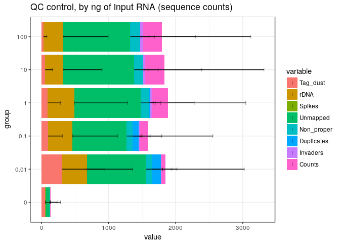<!-- -->

The normalised QC profile is not much different, therefore
the sequences might be _in silico_ or _in vitro_ contaminations.


```r
plotAnnot( ce, "qc", group = "RNA", normalise = TRUE
         , title = "QC control, by ng of input RNA (normalised to 100 %)")
```

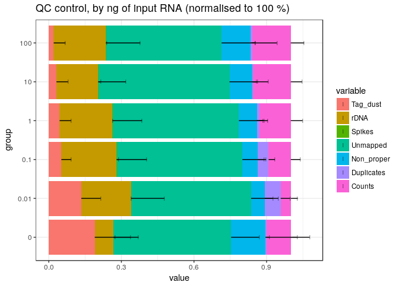<!-- -->

### Removal of the RNA negative controls

To ease data handling, the negative controls with no RNA are removed.


```r
ce <- ce[,ce$RNA != 0]
```

```
## harmonizing input:
##   removing 85 sampleMap rows with 'colname' not in colnames of experiments
##   removing 85 colData rownames not in sampleMap 'primary'
```

### By RT primer quantity

Strangely, libraries made with no RT primers have a QC profile that is not
dramatically different from other libraries.  This might again be explained
by contaminations, although the amount of sequences in the "no RT primer"
samples is a bit high for such an explanation.


```r
plotAnnot( ce, "qc", group = "RT_PRIMERS", normalise = FALSE
         , title = "QC control, by amount of RT primers (in μM)")
```

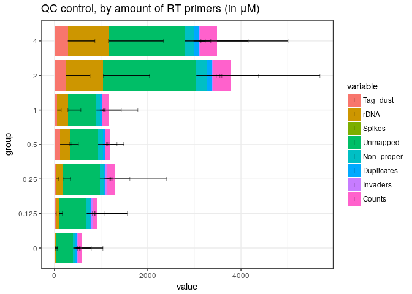<!-- -->


```r
plotAnnot( ce, "qc", group = "RT_PRIMERS", normalise = TRUE
         , title = "QC control, by amount of RT primers (normalised to 100 %)")
```

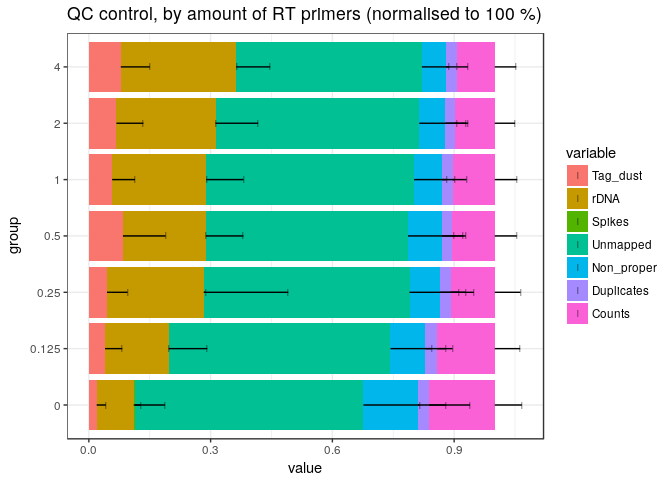<!-- -->

### Removal of the primer-negative controls

To ease data handling (for instance when working with primer ratios), the
negative controls with no primers are removed.


```r
ce <- ce[,ce$RT_PRIMERS != 0]
```

```
## harmonizing input:
##   removing 126 sampleMap rows with 'colname' not in colnames of experiments
##   removing 126 colData rownames not in sampleMap 'primary'
```

```r
ce$PRIMERS_RATIO %<>% droplevels
ce$PRIMERS_RATIO %<>%
  factor(levels = c( "0.078125", "0.15625", "0.3125", "0.625", "1.25", "2.5"
                   , "5", "10", "20", "40", "80", "160", "320", "640"))
```

### By group and replicates

In all conditions, there are a large number of unmapped sequences.  What are they ?


```r
plotAnnot(ce, "qc", group = "group_repl")
```

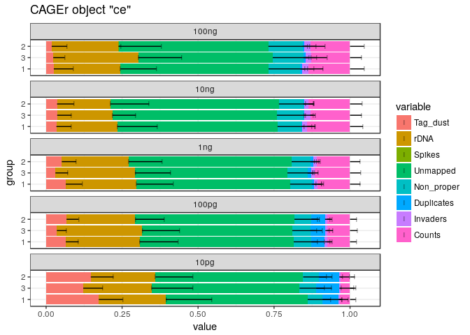<!-- -->

```r
plotAnnot(ce, "qc", group = "group_repl", normalise = FALSE)
```

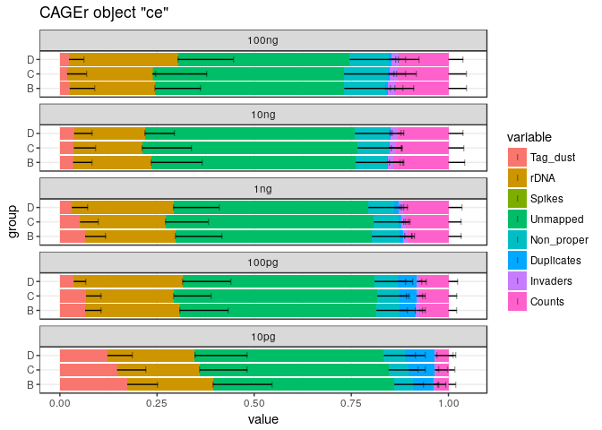<!-- -->

There is a trend decreasing sequence yield with decreasing TSO amounts.
Interestingly, the optimum seems to be lower when RNA quantity is lower.

But what is wrong with TSO == 40 ??  (and to some extent with TSO == 1.25)


```r
plotAnnot(ce, "qc", group = "TSO", normalise = FALSE, facet = "group")
```

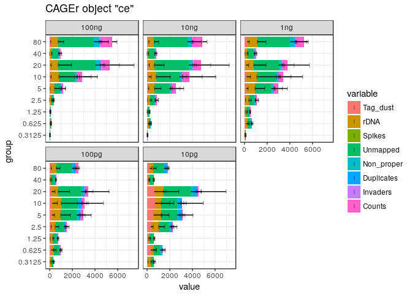<!-- -->

```r
plotAnnot(ce, "qc", group = "TSO", normalise = FALSE, facet = "RT_PRIMERS")
```

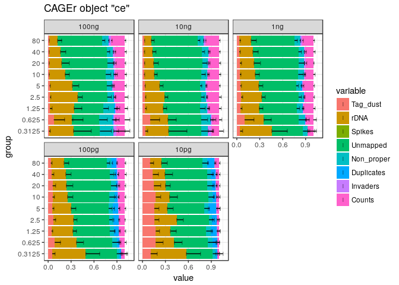<!-- -->

```r
plotAnnot(ce, "qc", group = "TSO", normalise = TRUE)
```

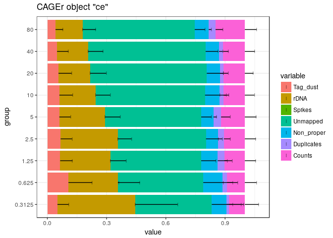<!-- -->


```r
plotAnnot(ce, "qc", group = "TSO_vol", normalise = FALSE)
```

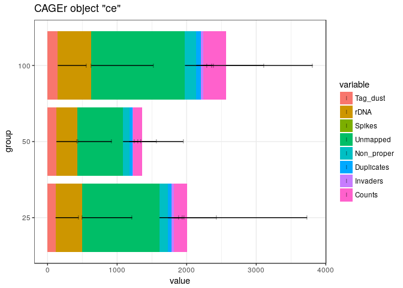<!-- -->


```r
plotAnnot(ce, "qc", group = "PRIMERS_RATIO", normalise = FALSE, facet = "group")
```

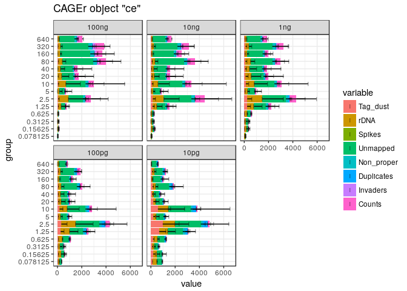<!-- -->


Annotation with GENCODE
-----------------------

Collect Gencode annotations and gene symbols via a local GENCODE file
(mm9 gencode not available in AnnotationHub)


```r
annotateCTSS(ce, rtracklayer::import.gff("/osc-fs_home/scratch/gmtu/annotation/mus_musculus/gencode-M1/gencode.vM1.annotation.gtf.gz"))

plotAnnot(ce, "counts", group = "group_repl")
```

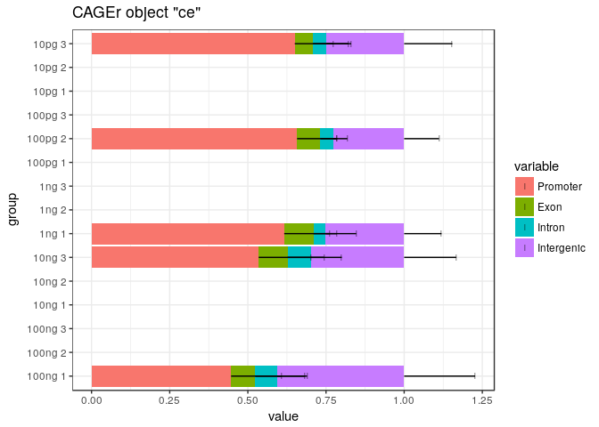<!-- -->

```r
plotAnnot(ce, "counts", group = "TSO", normalise = FALSE, facet = "group")
```

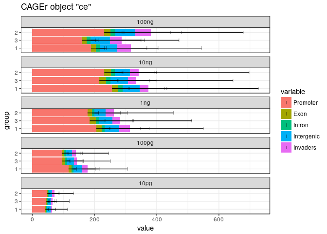<!-- -->


CTSS ANALYSIS
=============

Number of nanoCAGE tags mapping at CTSS positions in each group of samples
--------------------------------------------------------------------------
  

```r
plotReverseCumulatives(ce, onePlot = TRUE, fitInRange = NULL, legend = NULL)
```

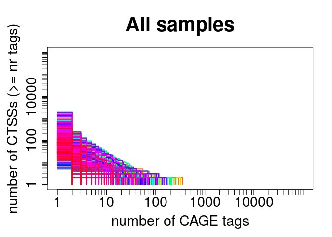<!-- -->

Number of nanoCAGE tags mapping at CTSS positions in each sample
----------------------------------------------------------------
  

```r
ce$l1 <- sapply(CTSStagCountDF(ce), function(x) sum(decode(x) > 0))
```

Gene expression analysis
========================

Make a gene expression table (not really required now).


```r
CTSStoGenes(ce)
```

Promoter rate
=============


```r
ce$promoter_rate <- ce$promoter / ce$librarySizes *100
```

Promoter rate

```r
# dotsize <- 0.08
# ggplot(colData(ce) %>% data.frame, aes(x=RNA_group, y=promoter_rate)) +
#   stat_summary(fun.y=mean, fun.ymin=mean, fun.ymax=mean, geom="crossbar", color="gray") +
#   geom_dotplot(aes(fill=TSO), binaxis='y', binwidth=1.5, dotsize=dotsize, stackdir='center') + theme_bw() +
#   xlab("RNA group") +
#   ylab("Promoter rate") +
#   scale_x_continuous(breaks = c(1:70)) +
#   labs(title = "Promoter rate per RNA gropu") +
#   coord_flip()
```

Save myCAGEexp file.


```r
#saveRDS(ce, "ce.Rds")
```

QC PLOTS
========

Boxplots
--------

### Extracted reads


```r
par(mar=c(5,5,2,2), cex.main = 1, font.main = 2)
boxplot(extracted ~ RNA_group, xlab = "RNA_group", ylab = "Extracted reads", data = colData(ce), cex.axis = 0.6, las = 3, main = "Number of extracted reads per sample")
```

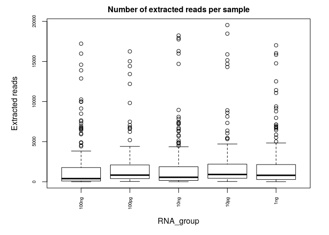<!-- -->


```r
par(mar=c(5,5,2,2), cex.main = 1, font.main = 2)
boxplot(extracted ~ RT_PRIMERS, ylab = "Extracted reads", xlab = "RT_PRIMERS concentration (uM)", data = colData(ce), cex.axis = 0.7, las = 3, main = "Number of extracted reads for different RT_PRIMERS concentrations")
```

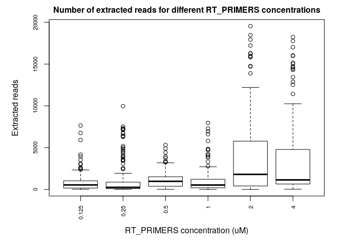<!-- -->


```r
par(mar=c(5,5,2,2), cex.main = 1, font.main = 2)
boxplot(extracted ~ TSO, ylab = "Extracted reads", xlab = "TSO concentration (uM)", data = colData(ce), cex.axis = 0.7, las = 3, main = "Number of extracted reads for different TSO concentrations")
```

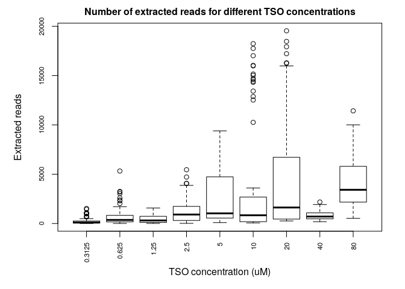<!-- -->


```r
par(mar=c(7,5,2,2), cex.main = 1, font.main = 2)
boxplot(extracted ~ PRIMERS_RATIO, ylab = "Extracted reads", xlab = "Primers ratio", data = colData(ce), cex.axis = 0.7, las = 3, main = "Number of extracted reads for different primers ratio")
```

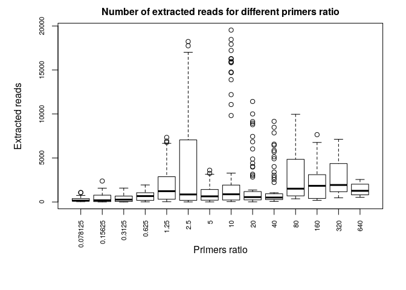<!-- -->

### Artefacts


```r
par(mar=c(5,5,2,2), cex.main = 1, font.main = 2)
boxplot(tagdust / extracted ~ RNA_group, xlab = "RNA_group", ylab = "Artefacts/extracted reads", data = colData(ce), cex.axis = 0.6, las = 3, main = "Ratio artefacts/extracted per sample")
```

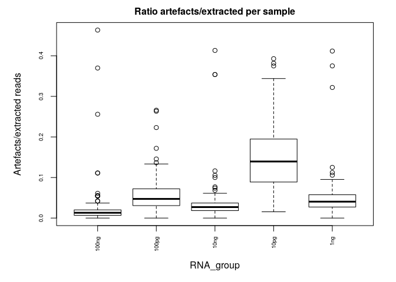<!-- -->


```r
par(mar=c(5,5,2,2), cex.main = 1, font.main = 2)
boxplot(tagdust / extracted ~ RT_PRIMERS, ylab = "Artefacts/extracted reads", xlab = "RT_PRIMERS concentration (uM)", data = colData(ce), cex.axis = 0.7, las = 3, main = "Ratio artefacts/extracted for different RT_PRIMERS concentrations")
```

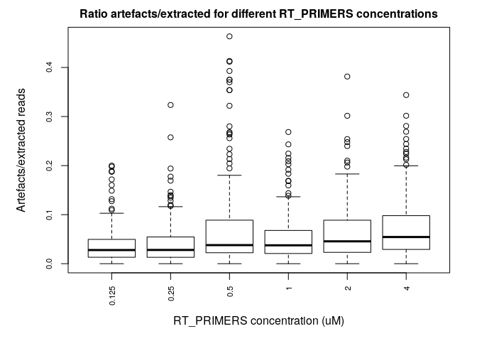<!-- -->


```r
par(mar=c(5,5,2,2), cex.main = 1, font.main = 2)
boxplot(tagdust / extracted ~ TSO, ylab = "Artefacts/extracted reads", xlab = "TSO concentration (uM)", data = colData(ce), cex.axis = 0.7, las = 3, main = "Ratio artefacts/extracted for different TSO concentrations")
```

<!-- -->


```r
par(mar=c(7,5,2,2), cex.main = 1, font.main = 2)
boxplot(tagdust / extracted ~ PRIMERS_RATIO, ylab = "Artefacts/extracted reads", xlab = "Primers ratio", data = colData(ce), cex.axis = 0.7, las = 3, main = "Ratio artefacts/extracted for different primers ratio")
```

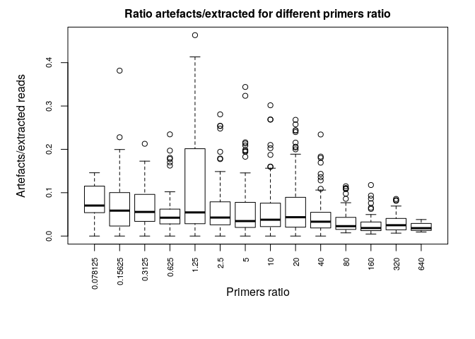<!-- -->

### Counts


```r
par(mar=c(5,5,2,2), cex.main = 1, font.main = 2)
boxplot(librarySizes ~ RNA_group, xlab = "RNgroup", ylab = "Counts", data = colData(ce), cex.axis = 0.6, las = 3, main = "Number of read counts per sample")
```

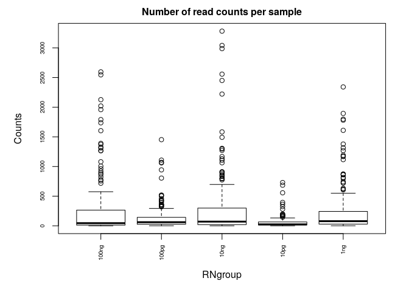<!-- -->


```r
par(mar=c(5,5,2,2), cex.main = 1, font.main = 2)
boxplot(librarySizes ~ RT_PRIMERS, ylab = "Counts", xlab = "RT_PRIMERS concentration (uM)", data = colData(ce), cex.axis = 0.7, las = 3, main = "Number of read counts for different RT_PRIMERS concentrations")
```

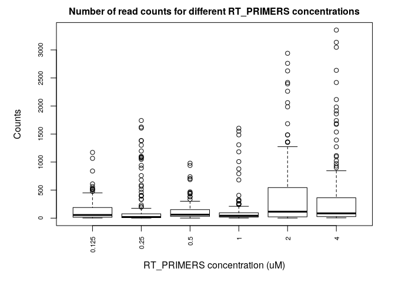<!-- -->


```r
par(mar=c(5,5,2,2), cex.main = 1, font.main = 2)
boxplot(librarySizes ~ TSO, ylab = "Counts", xlab = "TSO concentration (uM)", data = colData(ce), cex.axis = 0.7, las = 3, main = "Number of read counts for different TSO concentrations")
```

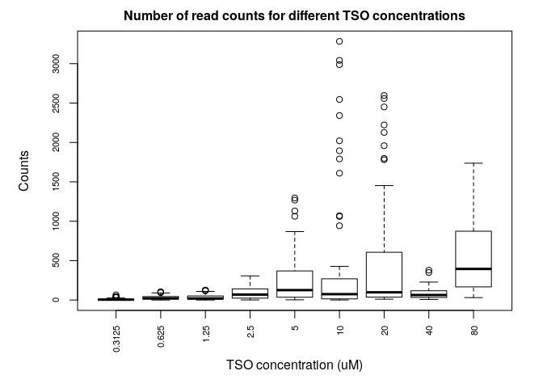<!-- -->


```r
par(mar=c(7,5,2,2), cex.main = 1, font.main = 2)
boxplot(librarySizes ~ PRIMERS_RATIO, ylab = "Counts", xlab = "Primers ratio", data = colData(ce), cex.axis = 0.7, las = 3, main = "Number of read counts for different primers ratio")
```

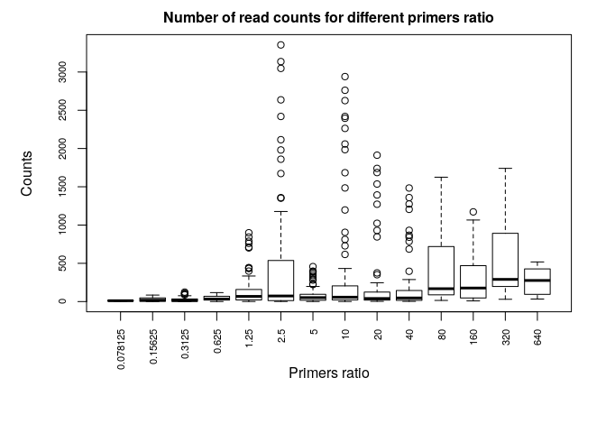<!-- -->

### Genes


```r
par(mar=c(5,5,2,2), cex.main = 1, font.main = 2)
boxplot(genes ~ RNA_group, xlab = "RNA_group", ylab = "Genes", data = colData(ce), cex.axis = 0.6, las = 3, main = "Number of genes detected per sample")
```

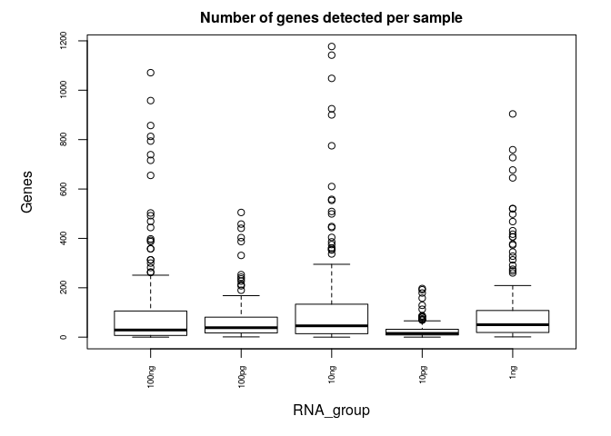<!-- -->


```r
par(mar=c(5,5,2,2), cex.main = 1, font.main = 2)
boxplot(genes ~ RT_PRIMERS, ylab = "Genes", xlab = "RT_PRIMERS concentration (uM)", data = colData(ce), cex.axis = 0.7, las = 3, main = "Number of genes detected for different RT_PRIMERS concentrations")
```

<!-- -->


```r
par(mar=c(5,5,2,2), cex.main = 1, font.main = 2)
boxplot(genes ~ TSO, ylab = "Genes", xlab = "TSO concentration (uM)", data = colData(ce), cex.axis = 0.7, las = 3, main = "Number of genes detected for different TSO concentrations")
```

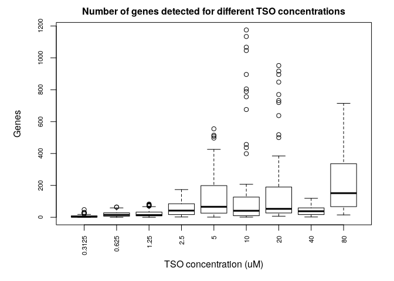<!-- -->


```r
par(mar=c(7,5,2,2), cex.main = 1, font.main = 2)
boxplot(genes ~ PRIMERS_RATIO, ylab = "Genes", xlab = "Primers ratio", data = colData(ce), cex.axis = 0.7, las = 3, main = "Number of genes detected for different primers ratio")
```

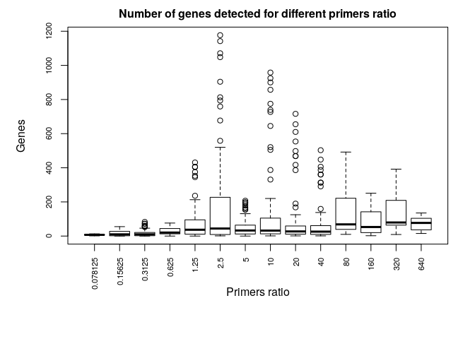<!-- -->

Rarefaction
------------


```r
rar1 <- hanabi(CTSStagCountDF(ce), from = 0)
#rarc <- hanabi(assay(consensusClustersSE(myCAGEexp)) %>% as.data.frame, from = 0)
rarg <- hanabi(assay(GeneExpSE(ce)), from = 0)
#save(rar1, rarg, file="rar.Rda") 
```

### Plot TSS discovery


```r
hanabiPlot(rar1, ylab='number of TSS detected', xlab='number of unique molecule counts', main=paste("TSS discovery"), group=ce$TSO, legend.pos = "bottomright")
```

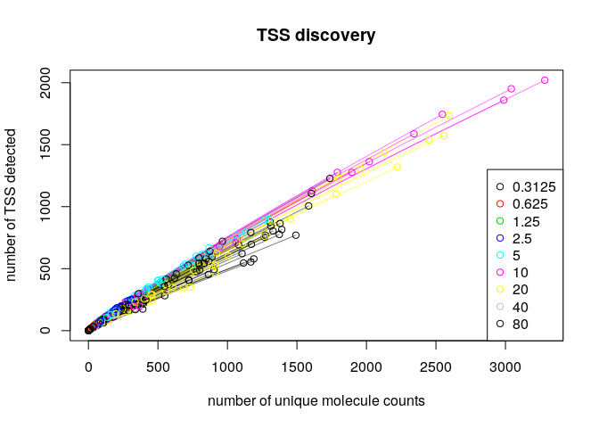<!-- -->

### Plot Cluster discovery


```r
#hanabiPlot(rarc, ylab='number of CTSS clusters detected', xlab='number of unique molecule counts', main=paste("Cluster discovery"), #group=myCAGEexp$group, legend.pos = "bottomright")
```

### Plot Gene discovery


```r
hanabiPlot(rarg, ylab='number of genes detected', xlab='number of unique molecule counts', main=paste("Gene discovery"), group=ce$TSO, legend.pos = "bottomright")
```

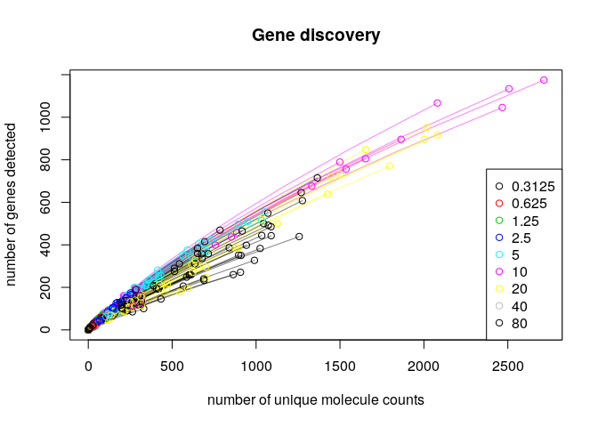<!-- -->


```r
sessionInfo()
```

```
## R version 3.4.3 (2017-11-30)
## Platform: x86_64-pc-linux-gnu (64-bit)
## Running under: Debian GNU/Linux 9 (stretch)
## 
## Matrix products: default
## BLAS: /usr/lib/libblas/libblas.so.3.7.0
## LAPACK: /usr/lib/lapack/liblapack.so.3.7.0
## 
## locale:
##  [1] LC_CTYPE=en_GB.UTF-8       LC_NUMERIC=C              
##  [3] LC_TIME=en_GB.UTF-8        LC_COLLATE=en_GB.UTF-8    
##  [5] LC_MONETARY=en_GB.UTF-8    LC_MESSAGES=en_GB.UTF-8   
##  [7] LC_PAPER=en_GB.UTF-8       LC_NAME=C                 
##  [9] LC_ADDRESS=C               LC_TELEPHONE=C            
## [11] LC_MEASUREMENT=en_GB.UTF-8 LC_IDENTIFICATION=C       
## 
## attached base packages:
## [1] parallel  stats4    stats     graphics  grDevices utils     datasets 
## [8] methods   base     
## 
## other attached packages:
##  [1] vegan_2.4-5                 lattice_0.20-35            
##  [3] permute_0.9-4               SummarizedExperiment_1.9.3 
##  [5] DelayedArray_0.4.1          matrixStats_0.52.2         
##  [7] Biobase_2.38.0              GenomicRanges_1.31.3       
##  [9] GenomeInfoDb_1.14.0         IRanges_2.13.4             
## [11] S4Vectors_0.17.12           BiocGenerics_0.24.0        
## [13] RColorBrewer_1.1-2          MultiAssayExperiment_1.5.41
## [15] magrittr_1.5                ggplot2_2.2.1              
## [17] CAGEr_1.21.4.4             
## 
## loaded via a namespace (and not attached):
##  [1] tidyr_0.7.2               VGAM_1.0-4               
##  [3] splines_3.4.3             gtools_3.5.0             
##  [5] assertthat_0.2.0          BSgenome_1.46.0          
##  [7] GenomeInfoDbData_0.99.1   Rsamtools_1.30.0         
##  [9] yaml_2.1.15               backports_1.1.1          
## [11] glue_1.2.0                digest_0.6.12            
## [13] XVector_0.19.1            platetools_0.0.2         
## [15] colorspace_1.3-2          htmltools_0.3.6          
## [17] Matrix_1.2-12             plyr_1.8.4               
## [19] pkgconfig_2.0.1           XML_3.98-1.9             
## [21] smallCAGEqc_0.12.2.999999 zlibbioc_1.24.0          
## [23] purrr_0.2.4               scales_0.5.0             
## [25] gdata_2.18.0              VennDiagram_1.6.18       
## [27] BiocParallel_1.12.0       tibble_1.3.4             
## [29] beanplot_1.2              mgcv_1.8-22              
## [31] lazyeval_0.2.1            memoise_1.1.0            
## [33] evaluate_0.10.1           nlme_3.1-131             
## [35] MASS_7.3-47               tools_3.4.3              
## [37] data.table_1.10.4-3       stringr_1.2.0            
## [39] munsell_0.4.3             cluster_2.0.6            
## [41] bindrcpp_0.2              lambda.r_1.2             
## [43] Biostrings_2.46.0         som_0.3-5.1              
## [45] compiler_3.4.3            rlang_0.1.4              
## [47] futile.logger_1.4.3       grid_3.4.3               
## [49] RCurl_1.95-4.10           labeling_0.3             
## [51] bitops_1.0-6              rmarkdown_1.8            
## [53] gtable_0.2.0              codetools_0.2-15         
## [55] reshape_0.8.7             R6_2.2.2                 
## [57] reshape2_1.4.2            GenomicAlignments_1.14.1 
## [59] dplyr_0.7.4               knitr_1.17               
## [61] rtracklayer_1.38.3        bindr_0.1                
## [63] rprojroot_1.2             futile.options_1.0.0     
## [65] KernSmooth_2.23-15        stringi_1.1.6            
## [67] Rcpp_0.12.14
```
