Data load and QC in R
=====================


```r
library("CAGEr")
library("ggplot2")
library("lattice")
library("magrittr")
library("MultiAssayExperiment")
library("RColorBrewer")
library("SummarizedExperiment")
library("vegan")
```

MOIRAI shortcuts


```r
MISEQ_RUN      <- "180123_M00528_0325_000000000-B4PCK"
WORKFLOW       <- "OP-WORKFLOW-CAGEscan-short-reads-v2.1~rc1"
MOIRAI_STAMP   <- "20180124102551"
MOIRAI_PROJ    <- "project/Labcyte" 
MOIRAI_USER    <- "nanoCAGE2" 
ASSEMBLY       <- "mm9"
BASEDIR        <- "/osc-fs_home/scratch/moirai"
MOIRAI_BASE    <- file.path(BASEDIR, MOIRAI_USER)
MOIRAI_RESULTS <- file.path(MOIRAI_BASE, MOIRAI_PROJ, paste(MISEQ_RUN, WORKFLOW, MOIRAI_STAMP, sep = "."))
```

Load CAGE libraries
===================

Load summary statistics from MOIRAI and polish the names
--------------------------------------------------------


```r
ce <- smallCAGEqc::loadMoiraiStats(
  pipeline  = WORKFLOW,
  multiplex = file.path( MOIRAI_BASE, "input", paste0(MISEQ_RUN, ".multiplex.txt")),
  summary   = file.path( MOIRAI_RESULTS, "text", "summary.txt")) %>% DataFrame

ce$inputFiles <- paste0(MOIRAI_RESULTS, "/CAGEscan_fragments/", ce$samplename, ".bed")

# Discard lines for which input files do not exist.
ce <- ce[sapply(ce$inputFiles, file.exists),]

# Discard lines for which input files are empty.
ce <- ce[file.info(ce$inputFiles)$size != 0,]

ce$inputFilesType <- c("bed")
ce$sampleLabels <- as.character(ce$samplename)
ce
```

```
## DataFrame with 1011 rows and 16 columns
##                      samplename    group  barcode    index     total
##                        <factor> <factor> <factor> <factor> <numeric>
## ACACAG_GTAGAGGA ACACAG_GTAGAGGA GTAGAGGA   ACACAG GTAGAGGA         0
## ACACGT_GTAGAGGA ACACGT_GTAGAGGA GTAGAGGA   ACACGT GTAGAGGA         0
## ACACTC_GTAGAGGA ACACTC_GTAGAGGA GTAGAGGA   ACACTC GTAGAGGA         0
## ACAGAT_GTAGAGGA ACAGAT_GTAGAGGA GTAGAGGA   ACAGAT GTAGAGGA         0
## ACAGCA_GTAGAGGA ACAGCA_GTAGAGGA GTAGAGGA   ACAGCA GTAGAGGA         0
## ...                         ...      ...      ...      ...       ...
## GCTATA_TCGACGTC GCTATA_TCGACGTC TCGACGTC   GCTATA TCGACGTC         0
## GCTCAG_TCGACGTC GCTCAG_TCGACGTC TCGACGTC   GCTCAG TCGACGTC         0
## GCTCGT_TCGACGTC GCTCGT_TCGACGTC TCGACGTC   GCTCGT TCGACGTC         0
## GCTCTC_TCGACGTC GCTCTC_TCGACGTC TCGACGTC   GCTCTC TCGACGTC         0
## GCTGAT_TCGACGTC GCTGAT_TCGACGTC TCGACGTC   GCTGAT TCGACGTC         0
##                 extracted   cleaned   tagdust      rdna    spikes
##                 <numeric> <numeric> <numeric> <numeric> <numeric>
## ACACAG_GTAGAGGA      4854      4685        70        96         3
## ACACGT_GTAGAGGA      2171      1990        32       148         1
## ACACTC_GTAGAGGA      6435      5981        84       369         1
## ACAGAT_GTAGAGGA      3771      3458        45       268         0
## ACAGCA_GTAGAGGA      6938      6082       105       750         1
## ...                   ...       ...       ...       ...       ...
## GCTATA_TCGACGTC        25        18         5         2         0
## GCTCAG_TCGACGTC       109        54        52         3         0
## GCTCGT_TCGACGTC       199        98        96         5         0
## GCTCTC_TCGACGTC       226       129        94         3         0
## GCTGAT_TCGACGTC      1748       927       802        19         0
##                    mapped properpairs    counts
##                 <numeric>   <numeric> <numeric>
## ACACAG_GTAGAGGA      1789        1367         0
## ACACGT_GTAGAGGA       709         517         0
## ACACTC_GTAGAGGA      2246        1662         0
## ACAGAT_GTAGAGGA      1120         759         0
## ACAGCA_GTAGAGGA      2099        1586         0
## ...                   ...         ...       ...
## GCTATA_TCGACGTC         3           3         0
## GCTCAG_TCGACGTC        12           5         0
## GCTCGT_TCGACGTC        12           2         0
## GCTCTC_TCGACGTC        12           7         0
## GCTGAT_TCGACGTC        74          16         0
##                                                                                                                                                                                               inputFiles
##                                                                                                                                                                                              <character>
## ACACAG_GTAGAGGA /osc-fs_home/scratch/moirai/nanoCAGE2/project/Labcyte/180123_M00528_0325_000000000-B4PCK.OP-WORKFLOW-CAGEscan-short-reads-v2.1~rc1.20180124102551/CAGEscan_fragments/ACACAG_GTAGAGGA.bed
## ACACGT_GTAGAGGA /osc-fs_home/scratch/moirai/nanoCAGE2/project/Labcyte/180123_M00528_0325_000000000-B4PCK.OP-WORKFLOW-CAGEscan-short-reads-v2.1~rc1.20180124102551/CAGEscan_fragments/ACACGT_GTAGAGGA.bed
## ACACTC_GTAGAGGA /osc-fs_home/scratch/moirai/nanoCAGE2/project/Labcyte/180123_M00528_0325_000000000-B4PCK.OP-WORKFLOW-CAGEscan-short-reads-v2.1~rc1.20180124102551/CAGEscan_fragments/ACACTC_GTAGAGGA.bed
## ACAGAT_GTAGAGGA /osc-fs_home/scratch/moirai/nanoCAGE2/project/Labcyte/180123_M00528_0325_000000000-B4PCK.OP-WORKFLOW-CAGEscan-short-reads-v2.1~rc1.20180124102551/CAGEscan_fragments/ACAGAT_GTAGAGGA.bed
## ACAGCA_GTAGAGGA /osc-fs_home/scratch/moirai/nanoCAGE2/project/Labcyte/180123_M00528_0325_000000000-B4PCK.OP-WORKFLOW-CAGEscan-short-reads-v2.1~rc1.20180124102551/CAGEscan_fragments/ACAGCA_GTAGAGGA.bed
## ...                                                                                                                                                                                                  ...
## GCTATA_TCGACGTC /osc-fs_home/scratch/moirai/nanoCAGE2/project/Labcyte/180123_M00528_0325_000000000-B4PCK.OP-WORKFLOW-CAGEscan-short-reads-v2.1~rc1.20180124102551/CAGEscan_fragments/GCTATA_TCGACGTC.bed
## GCTCAG_TCGACGTC /osc-fs_home/scratch/moirai/nanoCAGE2/project/Labcyte/180123_M00528_0325_000000000-B4PCK.OP-WORKFLOW-CAGEscan-short-reads-v2.1~rc1.20180124102551/CAGEscan_fragments/GCTCAG_TCGACGTC.bed
## GCTCGT_TCGACGTC /osc-fs_home/scratch/moirai/nanoCAGE2/project/Labcyte/180123_M00528_0325_000000000-B4PCK.OP-WORKFLOW-CAGEscan-short-reads-v2.1~rc1.20180124102551/CAGEscan_fragments/GCTCGT_TCGACGTC.bed
## GCTCTC_TCGACGTC /osc-fs_home/scratch/moirai/nanoCAGE2/project/Labcyte/180123_M00528_0325_000000000-B4PCK.OP-WORKFLOW-CAGEscan-short-reads-v2.1~rc1.20180124102551/CAGEscan_fragments/GCTCTC_TCGACGTC.bed
## GCTGAT_TCGACGTC /osc-fs_home/scratch/moirai/nanoCAGE2/project/Labcyte/180123_M00528_0325_000000000-B4PCK.OP-WORKFLOW-CAGEscan-short-reads-v2.1~rc1.20180124102551/CAGEscan_fragments/GCTGAT_TCGACGTC.bed
##                 inputFilesType    sampleLabels
##                    <character>     <character>
## ACACAG_GTAGAGGA            bed ACACAG_GTAGAGGA
## ACACGT_GTAGAGGA            bed ACACGT_GTAGAGGA
## ACACTC_GTAGAGGA            bed ACACTC_GTAGAGGA
## ACAGAT_GTAGAGGA            bed ACAGAT_GTAGAGGA
## ACAGCA_GTAGAGGA            bed ACAGCA_GTAGAGGA
## ...                        ...             ...
## GCTATA_TCGACGTC            bed GCTATA_TCGACGTC
## GCTCAG_TCGACGTC            bed GCTCAG_TCGACGTC
## GCTCGT_TCGACGTC            bed GCTCGT_TCGACGTC
## GCTCTC_TCGACGTC            bed GCTCTC_TCGACGTC
## GCTGAT_TCGACGTC            bed GCTGAT_TCGACGTC
```

```r
# Replace indexes in group names by RNA amounts extracted from sample sheet.
levels(ce$group) <- system("cut -f 6,8 -d , 180123_M00528_0325_000000000-B4PCK.SampleSheet.csv | grep g_ | sort | cut -f2 -d, | cut -f1 -d_", intern = TRUE)

# Sort the levels by RNA amount
ce$group %<>% factor(levels = c("100ng", "10ng", "1ng", "100pg", "10pg"))

ce$repl <- ce$index
levels(ce$repl) <- system("cut -f 6,8 -d , 180123_M00528_0325_000000000-B4PCK.SampleSheet.csv | grep g_ | sort | cut -f 2 -d _ | sed 's/\r//'", intern = TRUE)
ce$repl %<>% factor(levels = 1:3)

ce$plateID <- ce$repl
levels(ce$plateID) <- c("B", "C", "D")
```


```r
plate <- read.table("plate.txt", sep = "\t", header = TRUE)
ce %<>% cbind(plate[match( paste(ce$barcode, ce$group)
                         , paste(plate$BARCODE_SEQ, plate$RNA_group)), ])
rm(plate)
```


Create a CAGEexp object and load expression data
------------------------------------------------


```r
getCTSS(ce, useMulticore = TRUE)
removeStrandInvaders(ce)
```

```
## Loading required namespace: BSgenome.Mmusculus.UCSC.mm9
```

Quality controls
----------------

Custom _scopes_ displaying _strand invasion_ artefacts.


```r
msScope_qcSI <- function(libs) {
  libs$Tag_dust     <- libs$extracted   - libs$rdna - libs$spikes - libs$cleaned
  libs$rDNA         <- libs$rdna
  libs$Spikes       <- libs$spikes
  libs$Unmapped     <- libs$cleaned     - libs$mapped
  libs$Non_proper   <- libs$mapped      - libs$properpairs
  libs$Duplicates   <- libs$properpairs - libs$librarySizes - libs$strandInvaders
  libs$Invaders     <- libs$strandInvaders
  libs$Counts       <- libs$librarySizes
  list( libs    = libs
      , columns = c( "Tag_dust", "rDNA", "Spikes", "Unmapped"
                   , "Non_proper", "Duplicates", "Invaders", "Counts")
      , total   = libs$extracted)
}

msScope_counts <- function(libs) {
  libs$Promoter   <- libs$promoter
  libs$Exon       <- libs$exon
  libs$Intron     <- libs$intron
  libs$Intergenic <- libs$librarySizes - libs$promoter - libs$intron - libs$exon
  libs$Invaders   <- libs$strandInvaders
  list( libs    = libs
      , columns = c("Promoter", "Exon", "Intron", "Intergenic", "Invaders")
      , total   = libs$librarySizes + libs$strandInvaders)
}
```

### By RNA input

Negative controls with no RNA gave much less sequences than the regular
samples with RNA.

The normalised QC profile is not much different, therefore
the sequences might be _in silico_ or _in vitro_ contaminations.


```r
ggpubr::ggarrange(legend = "right", common.legend = TRUE,
  plotAnnot( ce, scope = msScope_qcSI, group = "RNA", normalise = FALSE
           , title = NULL) + ylab("Number of read pairs") + xlab(NULL),
  plotAnnot( ce, scope = msScope_qcSI, group = "RNA", normalise = TRUE
         , title = NULL) + ylab("Normalised to 100 %") + xlab(NULL)) %>%
  ggpubr::annotate_figure(top="QC control, by RNA amounts (ng)")
```

<!-- -->

### Removal of the RNA negative controls

To ease data handling, the negative controls with no RNA are removed.  By design
all of these negative controls had 10 μM TSO.


```r
colData(ce[,ce$RNA == 0]) %>% data.frame %>% summary
```

```
## harmonizing input:
##   removing 926 sampleMap rows with 'colname' not in colnames of experiments
##   removing 926 colData rownames not in sampleMap 'primary'
```

```
##            samplename   group       barcode        index        total  
##  GCTACG_ACTCGCTA: 1   100ng:14   GCTATA :14   ACTCGCTA: 7   Min.   :0  
##  GCTACG_ATCTCAGG: 1   10ng :19   GCTCAG :14   ATCTCAGG: 7   1st Qu.:0  
##  GCTACG_CCTAAGAC: 1   1ng  :20   GCTCTC :14   CCTAAGAC: 7   Median :0  
##  GCTACG_CGATCAGT: 1   100pg:16   GCTCGT :13   TACGCTGC: 7   Mean   :0  
##  GCTACG_CTCTCTAC: 1   10pg :16   GCTAGC :12   CGATCAGT: 6   3rd Qu.:0  
##  GCTACG_TACGCTGC: 1              GCTGAT :12   CGGAGCCT: 6   Max.   :0  
##  (Other)        :79              (Other): 6   (Other) :45              
##    extracted         cleaned           tagdust             rdna       
##  Min.   :   3.0   Min.   :   3.00   Min.   :   0.00   Min.   : 0.000  
##  1st Qu.:  18.0   1st Qu.:  14.00   1st Qu.:   1.00   1st Qu.: 1.000  
##  Median :  31.0   Median :  22.00   Median :   4.00   Median : 3.000  
##  Mean   : 131.9   Mean   :  72.07   Mean   :  55.27   Mean   : 4.471  
##  3rd Qu.:  87.0   3rd Qu.:  54.00   3rd Qu.:  26.00   3rd Qu.: 5.000  
##  Max.   :2442.0   Max.   :1158.00   Max.   :1255.00   Max.   :28.000  
##                                                                       
##      spikes            mapped       properpairs         counts 
##  Min.   :0.00000   Min.   : 1.00   Min.   : 1.000   Min.   :0  
##  1st Qu.:0.00000   1st Qu.: 4.00   1st Qu.: 1.000   1st Qu.:0  
##  Median :0.00000   Median : 8.00   Median : 3.000   Median :0  
##  Mean   :0.09412   Mean   :10.64   Mean   : 3.988   Mean   :0  
##  3rd Qu.:0.00000   3rd Qu.:12.00   3rd Qu.: 5.000   3rd Qu.:0  
##  Max.   :3.00000   Max.   :74.00   Max.   :21.000   Max.   :0  
##                                                                
##   inputFiles        inputFilesType     sampleLabels       repl   plateID
##  Length:85          Length:85          Length:85          1:29   B:29   
##  Class :character   Class :character   Class :character   2:28   C:28   
##  Mode  :character   Mode  :character   Mode  :character   3:28   D:28   
##                                                                         
##                                                                         
##                                                                         
##                                                                         
##       well         row          col        MASTER_MIX_vol      TSO    
##  J05    : 3   J      :53   Min.   : 1.00   Min.   :350    Min.   :10  
##  J06    : 3   N      : 9   1st Qu.:11.00   1st Qu.:350    1st Qu.:10  
##  J09    : 3   K      : 8   Median :18.00   Median :350    Median :10  
##  J10    : 3   L      : 7   Mean   :16.16   Mean   :350    Mean   :10  
##  J11    : 3   O      : 7   3rd Qu.:23.00   3rd Qu.:350    3rd Qu.:10  
##  J12    : 3   M      : 1   Max.   :24.00   Max.   :350    Max.   :10  
##  (Other):67   (Other): 0                                              
##     TSO_vol      BARCODE_ID     BARCODE_SEQ   RT_PRIMERS   
##  Min.   :100   Min.   :64.00   GCTATA :14   Min.   :0.000  
##  1st Qu.:100   1st Qu.:66.00   GCTCAG :14   1st Qu.:0.250  
##  Median :100   Median :67.00   GCTCTC :14   Median :0.500  
##  Mean   :100   Mean   :67.25   GCTCGT :13   Mean   :1.188  
##  3rd Qu.:100   3rd Qu.:69.00   GCTAGC :12   3rd Qu.:2.000  
##  Max.   :100   Max.   :70.00   GCTGAT :12   Max.   :4.000  
##                                (Other): 6                  
##  RT_PRIMERS_vol       RNA       RNA_vol  RNA_group     H2O_vol     
##  Min.   : 0.00   Min.   :0   Min.   :0   100ng:14   Min.   :25.00  
##  1st Qu.:25.00   1st Qu.:0   1st Qu.:0   100pg:16   1st Qu.:25.00  
##  Median :25.00   Median :0   Median :0   10ng :19   Median :25.00  
##  Mean   :23.24   Mean   :0   Mean   :0   10pg :16   Mean   :26.76  
##  3rd Qu.:25.00   3rd Qu.:0   3rd Qu.:0   1ng  :20   3rd Qu.:25.00  
##  Max.   :25.00   Max.   :0   Max.   :0              Max.   :50.00  
##                                                                    
##   total_volume PRIMERS_RATIO  librarySizes    strandInvaders  
##  Min.   :500   20     :14    Min.   : 0.000   Min.   :0.0000  
##  1st Qu.:500   40     :14    1st Qu.: 1.000   1st Qu.:0.0000  
##  Median :500   5      :14    Median : 2.000   Median :0.0000  
##  Mean   :500   10     :13    Mean   : 3.329   Mean   :0.4118  
##  3rd Qu.:500   2.5    :12    3rd Qu.: 4.000   3rd Qu.:1.0000  
##  Max.   :500   80     :12    Max.   :16.000   Max.   :3.0000  
##                (Other): 6
```

```r
ce <- ce[,ce$RNA != 0]
```

```
## harmonizing input:
##   removing 85 sampleMap rows with 'colname' not in colnames of experiments
##   removing 85 colData rownames not in sampleMap 'primary'
```

### By RT primer quantity

Strangely, libraries made with no RT primers have a QC profile that is not
dramatically different from other libraries.  This might again be explained
by contaminations, although the amount of sequences in the "no RT primer"
samples is a bit high for such an explanation.


```r
ggpubr::ggarrange(legend = "right", common.legend = TRUE,
  plotAnnot( ce, scope = msScope_qcSI, group = "RT_PRIMERS", normalise = FALSE
           , title = NULL) + ylab("Number of read pairs") + xlab(NULL),
  plotAnnot( ce, scope = msScope_qcSI, group = "RT_PRIMERS", normalise = TRUE
         , title = NULL) + ylab("Normalised to 100 %") + xlab(NULL)) %>%
  ggpubr::annotate_figure(top="QC control, by amount of RT primers (in μM)")
```

<!-- -->

### Removal of the primer-negative controls

To ease data handling (for instance when working with primer ratios), the
negative controls with no primers are removed.


```r
ce <- ce[,ce$RT_PRIMERS != 0]
```

```
## harmonizing input:
##   removing 126 sampleMap rows with 'colname' not in colnames of experiments
##   removing 126 colData rownames not in sampleMap 'primary'
```

```r
ce$PRIMERS_RATIO %<>% droplevels
ce$PRIMERS_RATIO %<>%
  factor(levels = c( "0.078125", "0.15625", "0.3125", "0.625", "1.25", "2.5"
                   , "5", "10", "20", "40", "80", "160", "320", "640"))
```

### By group and replicates

In all conditions, there are a large number of unmapped sequences.
Close inspection of the alignment files and pipeline reports suggest that
sequence quality was so low that a large number of reads 1 in the pairs have too
many sequence errors to be mapped.


```r
ggpubr::ggarrange(legend = "right", common.legend = TRUE,
  plotAnnot( ce, scope = msScope_qcSI, group = "plateID", facet="group"
           , normalise = FALSE, title = NULL) +
    ylab("Number of read pairs") + xlab(NULL) +
    facet_wrap(~facet, ncol = 1),
  plotAnnot( ce, scope = msScope_qcSI, group = "plateID", facet="group"
           , normalise = TRUE, title = NULL) +
    ylab("Normalised to 100 %") + xlab(NULL) +
    facet_wrap(~facet, ncol = 1)) %>%
  ggpubr::annotate_figure(top="QC control, by plate ID and amount of RNA (ng)")
```

<!-- -->

### By TSO concentration

There is a trend decreasing sequence yield with decreasing TSO amounts.
Interestingly, the optimum seems to be lower when RNA quantity is lower.

But what is wrong with TSO == 40 ??  (and to some extent with TSO == 1.25)
We are checking this by making a new experiment where the source plate was
re-prepared from scratch and concentration range has more points near 40.

rRNA rate seems to increase when TSO concentration is reduced.

Strand invation seems to depend more on RNA quantity than on TSO concentration ?!


```r
plotAnnot(ce, scope = msScope_qcSI, group = "TSO", normalise = FALSE, facet = "group")
```

<!-- -->

```r
plotAnnot(ce, scope = msScope_qcSI, group = "TSO", normalise = TRUE,  facet = "group")
```

<!-- -->

```r
plotAnnot(ce, scope = msScope_qcSI, group = "TSO", normalise = FALSE, facet = "RT_PRIMERS")
```

<!-- -->

```r
plotAnnot(ce, scope = msScope_qcSI, group = "RT_PRIMERS", normalise = FALSE, facet = "TSO")
```

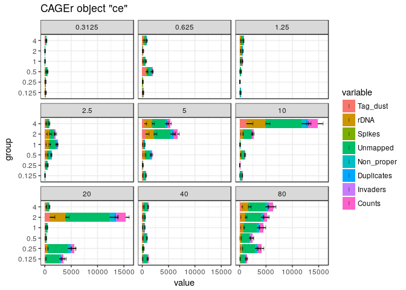<!-- -->

```r
plotAnnot(ce, scope = msScope_qcSI, group = "BARCODE_ID", normalise = FALSE, facet = "group")
```

```
## Warning: Removed 16 rows containing missing values (geom_segment).
```

```
## Warning: Removed 16 rows containing missing values (geom_point).
```

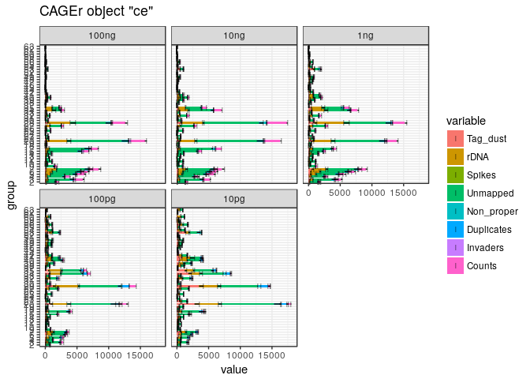<!-- -->

Barcode "CTGTCT" gave large amounts of artefacts.  This is not the case for its
nearest similar barcode "CTGCTC".

Barcodes "ATCAGC" and "CACACG" yielded a large amount of extracted reads.


```r
ggplot.CAGEexp <- function(data, ...)
  ggplot(as.data.frame(colData(data)), ...)

ggplot(ce, aes(TSO, RT_PRIMERS)) + scale_y_log10()+ scale_x_log10() + geom_raster(aes(fill = librarySizes)) + facet_wrap(~repl + group, ncol = 5) + viridis::scale_fill_viridis() + ggtitle("molecules")
```

<!-- -->

```r
ggplot(ce, aes(TSO, RT_PRIMERS)) + scale_y_log10()+ scale_x_log10() + geom_raster(aes(fill = extracted)) + facet_wrap(~repl + group, ncol = 5) + viridis::scale_fill_viridis() + ggtitle("extracted")
```

<!-- -->

```r
ggplot(ce, aes(TSO, RT_PRIMERS)) + scale_y_log10()+ scale_x_log10() + geom_raster(aes(fill = tagdust / extracted * 100)) + facet_wrap(~repl + group, ncol = 5) + viridis::scale_fill_viridis() + ggtitle("%tagdust")
```

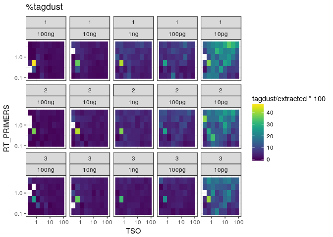<!-- -->

Reactions that received multiple droplets of TSOs did not fail (here we are averaging
very different TSO concentrations, to the point is just to show that for volumes
of 100 and 50, we have roughly the same amount of data.)


```r
plotAnnot(ce, scope = msScope_qcSI, group = "TSO_vol", normalise = FALSE)
```

<!-- -->

### By primer ratio


```r
plotAnnot(ce, scope = msScope_qcSI, group = "PRIMERS_RATIO", normalise = FALSE, facet = "group")
```

<!-- -->


Annotation with GENCODE
-----------------------

Collect Gencode annotations and gene symbols via a local GENCODE file
(mm9 gencode not available in AnnotationHub)


```r
annotateCTSS(ce, rtracklayer::import.gff("/osc-fs_home/scratch/gmtu/annotation/mus_musculus/gencode-M1/gencode.vM1.annotation.gtf.gz"))
```


```r
plotAnnot(ce, scope = msScope_counts, group = "repl", facet = "group") +
  facet_wrap("facet", nrow = 5)
```

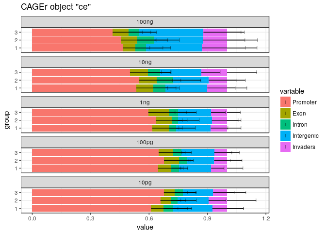<!-- -->

```r
plotAnnot(ce, scope = msScope_counts, group = "repl", facet = "group", norm = F) +
  facet_wrap("facet", nrow = 5)
```

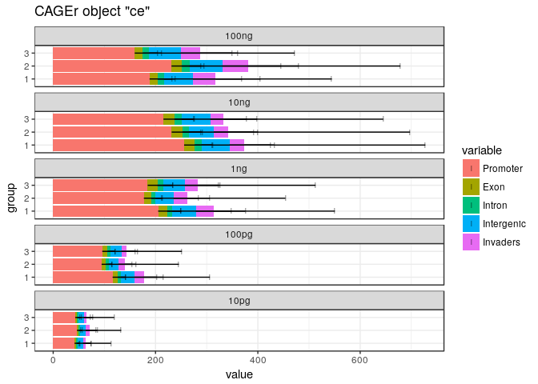<!-- -->


```r
plotAnnot(ce, scope = msScope_counts, group = "TSO", normalise = FALSE, facet = "group") +
  facet_wrap("facet", ncol = 5)
```

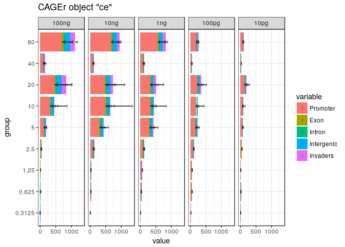<!-- -->

```r
plotAnnot(ce, scope = msScope_counts, group = "TSO", normalise = TRUE,  facet = "group") +
  facet_wrap("facet", ncol = 5)
```

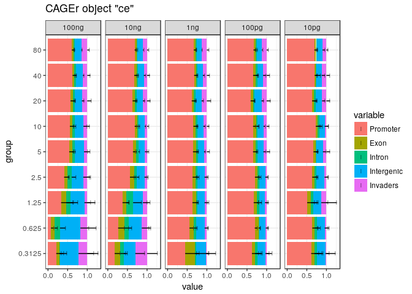<!-- -->

Count QC with TSO concentration 40 removed...


```r
ce2 <- ce
ce2 <- ce2[,ce2$TSO != 40]
```

```
## harmonizing input:
##   removing 90 sampleMap rows with 'colname' not in colnames of experiments
##   removing 90 colData rownames not in sampleMap 'primary'
```

```r
plotAnnot(ce2, scope = "counts", group = "TSO", normalise = FALSE, facet = "group") +
  facet_wrap("facet", ncol = 5) + ggtitle("")
```

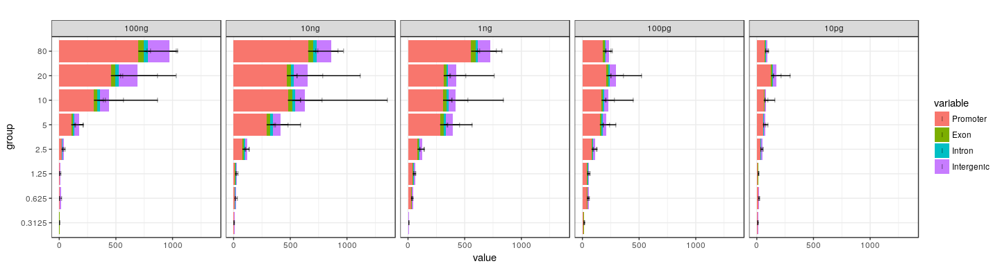<!-- -->


```r
ggplot(ce, aes(TSO, RT_PRIMERS)) + scale_y_log10()+ scale_x_log10() + geom_raster(aes(fill = promoter / librarySizes * 100)) + facet_wrap(~repl + group, ncol = 5) + viridis::scale_fill_viridis() + ggtitle("promoter rate")
```

<!-- -->

```r
ggplot(ce, aes(TSO, RT_PRIMERS)) + scale_y_log10()+ scale_x_log10() + geom_raster(aes(fill = (properpairs - librarySizes) / librarySizes)) + facet_wrap(~repl + group, ncol = 5) + viridis::scale_fill_viridis() + ggtitle("PCR duplicates %")
```

<!-- -->


```r
ggplot(ce, aes(TSO, RT_PRIMERS)) + scale_y_log10()+ scale_x_log10() + geom_raster(aes(fill = promoter / librarySizes * 100)) + facet_wrap(~group, ncol = 5) + viridis::scale_fill_viridis() + ggtitle("promoter rate")
```

<!-- -->

```r
ggplot(ce, aes(TSO, RT_PRIMERS)) + scale_y_log10()+ scale_x_log10() + geom_raster(aes(fill = (properpairs - librarySizes) / librarySizes)) + facet_wrap(~group, ncol = 5) + viridis::scale_fill_viridis() + ggtitle("PCR duplicates %")
```

<!-- -->

CTSS ANALYSIS
=============

Number of nanoCAGE tags mapping at CTSS positions in each sample
----------------------------------------------------------------
  

```r
ce$l1 <- sapply(CTSStagCountDF(ce), function(x) sum(decode(x) > 0))
```

Gene expression analysis
========================

Make a gene expression table (not really required now).


```r
CTSStoGenes(ce)
```


```r
ggplot(ce, aes(TSO, RT_PRIMERS)) + scale_y_log10()+ scale_x_log10() + geom_raster(aes(fill = genes)) + facet_wrap(~repl + group, ncol = 5) + viridis::scale_fill_viridis() + ggtitle("Gene discovery")
```

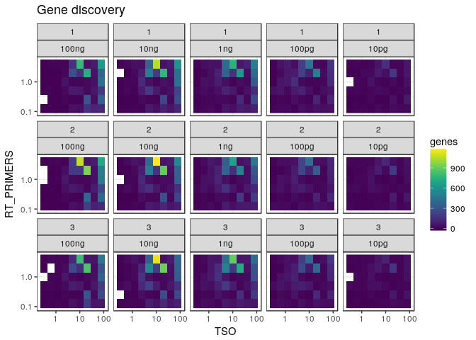<!-- -->


```r
ggplot(ce, aes(TSO, RT_PRIMERS)) + scale_y_log10()+ scale_x_log10() + geom_raster(aes(fill = genes)) + facet_wrap(~group, ncol = 5) + viridis::scale_fill_viridis() + ggtitle("Gene discovery")
```

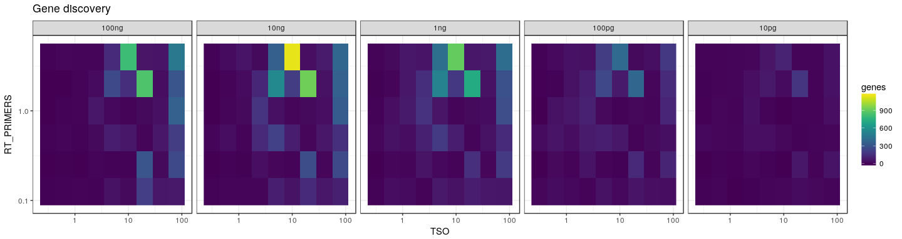<!-- -->

Rarefaction
------------


```r
ce$r100l1 <- rarefy(t(CTSStagCountDA(ce)),10)
```

```
## Warning in rarefy(t(CTSStagCountDA(ce)), 10): Requested 'sample' was larger
## than smallest site maximum (0)
```

```r
ce$r100l1[librarySizes(ce) < 10] <- NA

ggplot(ce, aes(TSO, RT_PRIMERS)) + scale_y_log10()+ scale_x_log10() + geom_raster(aes(fill = r100l1)) + facet_wrap(~group, ncol = 5) + viridis::scale_fill_viridis() + ggtitle("Richness (on a scale of 10)")
```

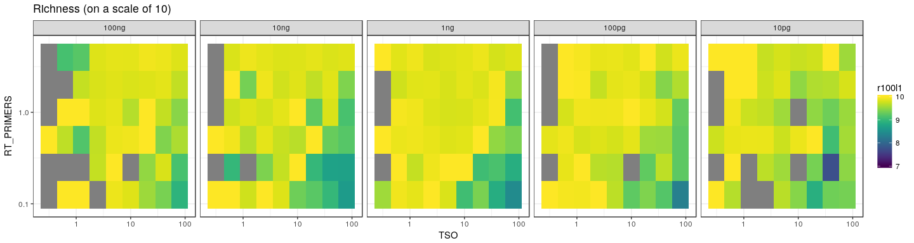<!-- -->


```r
rar1 <- hanabi(CTSStagCountDF(ce), from = 0)
#rarc <- hanabi(assay(consensusClustersSE(myCAGEexp)) %>% as.data.frame, from = 0)
rarg <- hanabi(assay(GeneExpSE(ce)), from = 0)
#save(rar1, rarg, file="rar.Rda") 
```

### Plot TSS discovery


```r
hanabiPlot(rar1, ylab='number of TSS detected', xlab='number of unique molecule counts', main=paste("TSS discovery"), group=ce$TSO, legend.pos = "bottomright")
```

<!-- -->

### Plot Cluster discovery


```r
#hanabiPlot(rarc, ylab='number of CTSS clusters detected', xlab='number of unique molecule counts', main=paste("Cluster discovery"), #group=myCAGEexp$group, legend.pos = "bottomright")
```

### Plot Gene discovery


```r
hanabiPlot(rarg, ylab='number of genes detected', xlab='number of unique molecule counts', main=paste("Gene discovery"), group=ce$TSO, legend.pos = "bottomright")
```

<!-- -->

Save the CAGEexp file.


```r
saveRDS(ce, "Labcyte-RT_Data_Analysis_2.Rds")
```


```r
sessionInfo()
```

```
## R version 3.4.3 (2017-11-30)
## Platform: x86_64-pc-linux-gnu (64-bit)
## Running under: Debian GNU/Linux 9 (stretch)
## 
## Matrix products: default
## BLAS: /usr/lib/libblas/libblas.so.3.7.0
## LAPACK: /usr/lib/lapack/liblapack.so.3.7.0
## 
## locale:
##  [1] LC_CTYPE=en_GB.UTF-8       LC_NUMERIC=C              
##  [3] LC_TIME=en_GB.UTF-8        LC_COLLATE=en_GB.UTF-8    
##  [5] LC_MONETARY=en_GB.UTF-8    LC_MESSAGES=en_GB.UTF-8   
##  [7] LC_PAPER=en_GB.UTF-8       LC_NAME=C                 
##  [9] LC_ADDRESS=C               LC_TELEPHONE=C            
## [11] LC_MEASUREMENT=en_GB.UTF-8 LC_IDENTIFICATION=C       
## 
## attached base packages:
## [1] parallel  stats4    stats     graphics  grDevices utils     datasets 
## [8] methods   base     
## 
## other attached packages:
##  [1] vegan_2.4-5                 permute_0.9-4              
##  [3] SummarizedExperiment_1.9.14 DelayedArray_0.4.1         
##  [5] matrixStats_0.52.2          Biobase_2.38.0             
##  [7] GenomicRanges_1.31.19       GenomeInfoDb_1.15.5        
##  [9] IRanges_2.13.26             S4Vectors_0.17.32          
## [11] BiocGenerics_0.25.3         RColorBrewer_1.1-2         
## [13] MultiAssayExperiment_1.5.41 magrittr_1.5               
## [15] lattice_0.20-35             ggplot2_2.2.1              
## [17] CAGEr_1.21.5.1             
## 
## loaded via a namespace (and not attached):
##  [1] nlme_3.1-131                      bitops_1.0-6                     
##  [3] rprojroot_1.3-2                   tools_3.4.3                      
##  [5] backports_1.1.2                   R6_2.2.2                         
##  [7] platetools_0.0.2                  KernSmooth_2.23-15               
##  [9] lazyeval_0.2.1                    mgcv_1.8-22                      
## [11] colorspace_1.3-2                  gridExtra_2.3                    
## [13] compiler_3.4.3                    VennDiagram_1.6.18               
## [15] rtracklayer_1.39.9                labeling_0.3                     
## [17] scales_0.5.0                      stringr_1.3.0                    
## [19] digest_0.6.15                     Rsamtools_1.31.3                 
## [21] rmarkdown_1.9                     stringdist_0.9.4.6               
## [23] XVector_0.19.8                    pkgconfig_2.0.1                  
## [25] htmltools_0.3.6                   BSgenome_1.47.5                  
## [27] rlang_0.2.0                       VGAM_1.0-4                       
## [29] bindr_0.1                         BiocParallel_1.12.0              
## [31] gtools_3.5.0                      dplyr_0.7.4                      
## [33] RCurl_1.95-4.10                   GenomeInfoDbData_0.99.1          
## [35] futile.logger_1.4.3               smallCAGEqc_0.12.2.999999        
## [37] Matrix_1.2-12                     Rcpp_0.12.16                     
## [39] munsell_0.4.3                     viridis_0.4.0                    
## [41] stringi_1.1.7                     yaml_2.1.18                      
## [43] MASS_7.3-47                       zlibbioc_1.24.0                  
## [45] plyr_1.8.4                        grid_3.4.3                       
## [47] gdata_2.18.0                      Biostrings_2.47.9                
## [49] cowplot_0.9.2                     splines_3.4.3                    
## [51] knitr_1.20                        beanplot_1.2                     
## [53] pillar_1.2.1                      ggpubr_0.1.6                     
## [55] reshape2_1.4.2                    codetools_0.2-15                 
## [57] futile.options_1.0.0              XML_3.98-1.9                     
## [59] glue_1.2.0                        evaluate_0.10.1                  
## [61] lambda.r_1.2                      data.table_1.10.4-3              
## [63] gtable_0.2.0                      BSgenome.Mmusculus.UCSC.mm9_1.4.0
## [65] purrr_0.2.4                       tidyr_0.7.2                      
## [67] reshape_0.8.7                     assertthat_0.2.0                 
## [69] viridisLite_0.2.0                 tibble_1.4.2                     
## [71] som_0.3-5.1                       GenomicAlignments_1.15.12        
## [73] memoise_1.1.0                     bindrcpp_0.2                     
## [75] cluster_2.0.6
```
