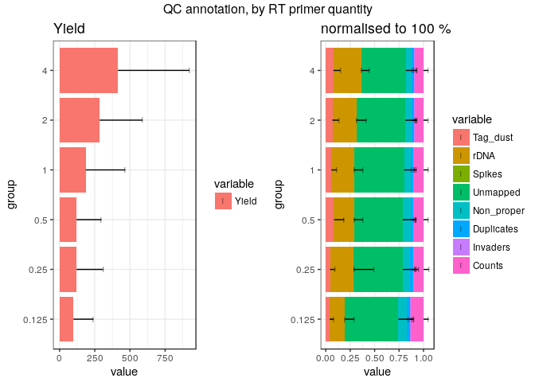
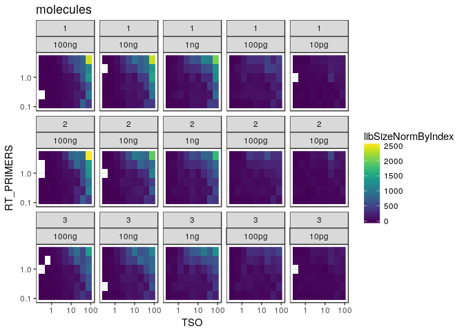

Data load and QC in R
=====================


```r
library("CAGEr")
library("ggplot2")
library("lattice")
library("magrittr")
library("MultiAssayExperiment")
library("RColorBrewer")
library("SummarizedExperiment")
library("vegan")
```

MOIRAI shortcuts


```r
MISEQ_RUN      <- "180123_M00528_0325_000000000-B4PCK"
WORKFLOW       <- "OP-WORKFLOW-CAGEscan-short-reads-v2.1~rc1"
MOIRAI_STAMP   <- "20180124102551"
MOIRAI_PROJ    <- "project/Labcyte" 
MOIRAI_USER    <- "nanoCAGE2" 
ASSEMBLY       <- "mm9"
BASEDIR        <- "/osc-fs_home/scratch/moirai"
MOIRAI_BASE    <- file.path(BASEDIR, MOIRAI_USER)
MOIRAI_RESULTS <- file.path(MOIRAI_BASE, MOIRAI_PROJ, paste(MISEQ_RUN, WORKFLOW, MOIRAI_STAMP, sep = "."))
```

Load CAGE libraries
===================

Load summary statistics from MOIRAI and polish the names
--------------------------------------------------------


```r
ce <- smallCAGEqc::loadMoiraiStats(
  pipeline  = WORKFLOW,
  multiplex = file.path( MOIRAI_BASE, "input", paste0(MISEQ_RUN, ".multiplex.txt")),
  summary   = file.path( MOIRAI_RESULTS, "text", "summary.txt")) %>% DataFrame

ce$inputFiles <- paste0(MOIRAI_RESULTS, "/CAGEscan_fragments/", ce$samplename, ".bed")

# Discard lines for which input files do not exist.
ce <- ce[sapply(ce$inputFiles, file.exists),]

# Discard lines for which input files are empty.
ce <- ce[file.info(ce$inputFiles)$size != 0,]

ce$inputFilesType <- c("bed")
ce$sampleLabels <- as.character(ce$samplename)
ce
```

```
## DataFrame with 1011 rows and 16 columns
##                      samplename    group  barcode    index     total
##                        <factor> <factor> <factor> <factor> <numeric>
## ACACAG_GTAGAGGA ACACAG_GTAGAGGA GTAGAGGA   ACACAG GTAGAGGA         0
## ACACGT_GTAGAGGA ACACGT_GTAGAGGA GTAGAGGA   ACACGT GTAGAGGA         0
## ACACTC_GTAGAGGA ACACTC_GTAGAGGA GTAGAGGA   ACACTC GTAGAGGA         0
## ACAGAT_GTAGAGGA ACAGAT_GTAGAGGA GTAGAGGA   ACAGAT GTAGAGGA         0
## ACAGCA_GTAGAGGA ACAGCA_GTAGAGGA GTAGAGGA   ACAGCA GTAGAGGA         0
## ...                         ...      ...      ...      ...       ...
## GCTATA_TCGACGTC GCTATA_TCGACGTC TCGACGTC   GCTATA TCGACGTC         0
## GCTCAG_TCGACGTC GCTCAG_TCGACGTC TCGACGTC   GCTCAG TCGACGTC         0
## GCTCGT_TCGACGTC GCTCGT_TCGACGTC TCGACGTC   GCTCGT TCGACGTC         0
## GCTCTC_TCGACGTC GCTCTC_TCGACGTC TCGACGTC   GCTCTC TCGACGTC         0
## GCTGAT_TCGACGTC GCTGAT_TCGACGTC TCGACGTC   GCTGAT TCGACGTC         0
##                 extracted   cleaned   tagdust      rdna    spikes
##                 <numeric> <numeric> <numeric> <numeric> <numeric>
## ACACAG_GTAGAGGA      4854      4685        70        96         3
## ACACGT_GTAGAGGA      2171      1990        32       148         1
## ACACTC_GTAGAGGA      6435      5981        84       369         1
## ACAGAT_GTAGAGGA      3771      3458        45       268         0
## ACAGCA_GTAGAGGA      6938      6082       105       750         1
## ...                   ...       ...       ...       ...       ...
## GCTATA_TCGACGTC        25        18         5         2         0
## GCTCAG_TCGACGTC       109        54        52         3         0
## GCTCGT_TCGACGTC       199        98        96         5         0
## GCTCTC_TCGACGTC       226       129        94         3         0
## GCTGAT_TCGACGTC      1748       927       802        19         0
##                    mapped properpairs    counts
##                 <numeric>   <numeric> <numeric>
## ACACAG_GTAGAGGA      1789        1367         0
## ACACGT_GTAGAGGA       709         517         0
## ACACTC_GTAGAGGA      2246        1662         0
## ACAGAT_GTAGAGGA      1120         759         0
## ACAGCA_GTAGAGGA      2099        1586         0
## ...                   ...         ...       ...
## GCTATA_TCGACGTC         3           3         0
## GCTCAG_TCGACGTC        12           5         0
## GCTCGT_TCGACGTC        12           2         0
## GCTCTC_TCGACGTC        12           7         0
## GCTGAT_TCGACGTC        74          16         0
##                                                                                                                                                                                               inputFiles
##                                                                                                                                                                                              <character>
## ACACAG_GTAGAGGA /osc-fs_home/scratch/moirai/nanoCAGE2/project/Labcyte/180123_M00528_0325_000000000-B4PCK.OP-WORKFLOW-CAGEscan-short-reads-v2.1~rc1.20180124102551/CAGEscan_fragments/ACACAG_GTAGAGGA.bed
## ACACGT_GTAGAGGA /osc-fs_home/scratch/moirai/nanoCAGE2/project/Labcyte/180123_M00528_0325_000000000-B4PCK.OP-WORKFLOW-CAGEscan-short-reads-v2.1~rc1.20180124102551/CAGEscan_fragments/ACACGT_GTAGAGGA.bed
## ACACTC_GTAGAGGA /osc-fs_home/scratch/moirai/nanoCAGE2/project/Labcyte/180123_M00528_0325_000000000-B4PCK.OP-WORKFLOW-CAGEscan-short-reads-v2.1~rc1.20180124102551/CAGEscan_fragments/ACACTC_GTAGAGGA.bed
## ACAGAT_GTAGAGGA /osc-fs_home/scratch/moirai/nanoCAGE2/project/Labcyte/180123_M00528_0325_000000000-B4PCK.OP-WORKFLOW-CAGEscan-short-reads-v2.1~rc1.20180124102551/CAGEscan_fragments/ACAGAT_GTAGAGGA.bed
## ACAGCA_GTAGAGGA /osc-fs_home/scratch/moirai/nanoCAGE2/project/Labcyte/180123_M00528_0325_000000000-B4PCK.OP-WORKFLOW-CAGEscan-short-reads-v2.1~rc1.20180124102551/CAGEscan_fragments/ACAGCA_GTAGAGGA.bed
## ...                                                                                                                                                                                                  ...
## GCTATA_TCGACGTC /osc-fs_home/scratch/moirai/nanoCAGE2/project/Labcyte/180123_M00528_0325_000000000-B4PCK.OP-WORKFLOW-CAGEscan-short-reads-v2.1~rc1.20180124102551/CAGEscan_fragments/GCTATA_TCGACGTC.bed
## GCTCAG_TCGACGTC /osc-fs_home/scratch/moirai/nanoCAGE2/project/Labcyte/180123_M00528_0325_000000000-B4PCK.OP-WORKFLOW-CAGEscan-short-reads-v2.1~rc1.20180124102551/CAGEscan_fragments/GCTCAG_TCGACGTC.bed
## GCTCGT_TCGACGTC /osc-fs_home/scratch/moirai/nanoCAGE2/project/Labcyte/180123_M00528_0325_000000000-B4PCK.OP-WORKFLOW-CAGEscan-short-reads-v2.1~rc1.20180124102551/CAGEscan_fragments/GCTCGT_TCGACGTC.bed
## GCTCTC_TCGACGTC /osc-fs_home/scratch/moirai/nanoCAGE2/project/Labcyte/180123_M00528_0325_000000000-B4PCK.OP-WORKFLOW-CAGEscan-short-reads-v2.1~rc1.20180124102551/CAGEscan_fragments/GCTCTC_TCGACGTC.bed
## GCTGAT_TCGACGTC /osc-fs_home/scratch/moirai/nanoCAGE2/project/Labcyte/180123_M00528_0325_000000000-B4PCK.OP-WORKFLOW-CAGEscan-short-reads-v2.1~rc1.20180124102551/CAGEscan_fragments/GCTGAT_TCGACGTC.bed
##                 inputFilesType    sampleLabels
##                    <character>     <character>
## ACACAG_GTAGAGGA            bed ACACAG_GTAGAGGA
## ACACGT_GTAGAGGA            bed ACACGT_GTAGAGGA
## ACACTC_GTAGAGGA            bed ACACTC_GTAGAGGA
## ACAGAT_GTAGAGGA            bed ACAGAT_GTAGAGGA
## ACAGCA_GTAGAGGA            bed ACAGCA_GTAGAGGA
## ...                        ...             ...
## GCTATA_TCGACGTC            bed GCTATA_TCGACGTC
## GCTCAG_TCGACGTC            bed GCTCAG_TCGACGTC
## GCTCGT_TCGACGTC            bed GCTCGT_TCGACGTC
## GCTCTC_TCGACGTC            bed GCTCTC_TCGACGTC
## GCTGAT_TCGACGTC            bed GCTGAT_TCGACGTC
```

```r
# Replace indexes in group names by RNA amounts extracted from sample sheet.
levels(ce$group) <- system("cut -f 6,8 -d , 180123_M00528_0325_000000000-B4PCK.SampleSheet.csv | grep g_ | sort | cut -f2 -d, | cut -f1 -d_", intern = TRUE)

# Sort the levels by RNA amount
ce$group %<>% factor(levels = c("100ng", "10ng", "1ng", "100pg", "10pg"))

ce$repl <- ce$index
levels(ce$repl) <- system("cut -f 6,8 -d , 180123_M00528_0325_000000000-B4PCK.SampleSheet.csv | grep g_ | sort | cut -f 2 -d _ | sed 's/\r//'", intern = TRUE)
ce$repl %<>% factor(levels = 1:3)

ce$plateID <- ce$repl
levels(ce$plateID) <- c("B", "C", "D")
```


```r
plate <- read.table("plate.txt", sep = "\t", header = TRUE)
ce %<>% cbind(plate[match( paste(ce$barcode, ce$group)
                         , paste(plate$BARCODE_SEQ, plate$RNA_group)), ])
rm(plate)
```


Create a CAGEexp object and load expression data
------------------------------------------------


```r
getCTSS(ce, useMulticore = TRUE)
removeStrandInvaders(ce)
```

```
## Loading required namespace: BSgenome.Mmusculus.UCSC.mm9
```

Save the CAGEexp file.


```r
saveRDS(ce, "Labcyte-RT_Data_Analysis_2.Rds")
```

Annotation with GENCODE
-----------------------

Collect Gencode annotations and gene symbols via a local GENCODE file
(mm9 gencode not available in AnnotationHub)


```r
annotateCTSS(ce, rtracklayer::import.gff("/osc-fs_home/scratch/gmtu/annotation/mus_musculus/gencode-M1/gencode.vM1.annotation.gtf.gz"))
```


Quality controls
================

### Barcode normalisation factors

There were considerable variations of RT efficiency solely caused by differences
in the quality of each TSOs.  Thus, normalisation is needed.  See [experiment 5](Labcyte-RT_Data_Analysis_5.md) for details.


```r
bcNormFactors <- dget("bcNormFactors.R")
```


### Custom _scopes_ displaying _strand invasion_ artefacts.


```r
source("customScopes.R")
```


### By RNA input

Negative controls with no RNA gave much less sequences than the regular
samples with RNA.

The normalised QC profile is not much different, therefore
the sequences might be _in silico_ or _in vitro_ contaminations.


```r
ggpubr::ggarrange(legend = "right", common.legend = TRUE,
  plotAnnot( ce, scope = msScope_qcSI, group = "RNA", normalise = FALSE
           , title = NULL) + ylab("Number of read pairs") + xlab(NULL),
  plotAnnot( ce, scope = msScope_qcSI, group = "RNA", normalise = TRUE
         , title = NULL) + ylab("Normalised to 100 %") + xlab(NULL)) %>%
  ggpubr::annotate_figure(top="QC control, by RNA amounts (ng)")
```

<!-- -->

```r
ggpubr::ggarrange(legend = "right", common.legend = TRUE,
  plotAnnot( ce, scope = msScope_counts, group = "RNA", normalise = FALSE
           , title = NULL) + ylab("Number of read pairs") + xlab(NULL),
  plotAnnot( ce, scope = msScope_counts, group = "RNA", normalise = TRUE
         , title = NULL) + ylab("Normalised to 100 %") + xlab(NULL)) %>%
  ggpubr::annotate_figure(top="QC annotation, by RNA amounts (ng)")
```

<!-- -->

### Removal of the RNA negative controls

To ease data handling, the negative controls with no RNA are removed.  By design
all of these negative controls had 10 μM TSO.


```r
colData(ce[,ce$RNA == 0]) %>% data.frame %>% summary
```

```
## harmonizing input:
##   removing 926 sampleMap rows with 'colname' not in colnames of experiments
##   removing 926 colData rownames not in sampleMap 'primary'
```

```
##            samplename   group       barcode        index        total  
##  GCTACG_ACTCGCTA: 1   100ng:14   GCTATA :14   ACTCGCTA: 7   Min.   :0  
##  GCTACG_ATCTCAGG: 1   10ng :19   GCTCAG :14   ATCTCAGG: 7   1st Qu.:0  
##  GCTACG_CCTAAGAC: 1   1ng  :20   GCTCTC :14   CCTAAGAC: 7   Median :0  
##  GCTACG_CGATCAGT: 1   100pg:16   GCTCGT :13   TACGCTGC: 7   Mean   :0  
##  GCTACG_CTCTCTAC: 1   10pg :16   GCTAGC :12   CGATCAGT: 6   3rd Qu.:0  
##  GCTACG_TACGCTGC: 1              GCTGAT :12   CGGAGCCT: 6   Max.   :0  
##  (Other)        :79              (Other): 6   (Other) :45              
##    extracted         cleaned           tagdust             rdna       
##  Min.   :   3.0   Min.   :   3.00   Min.   :   0.00   Min.   : 0.000  
##  1st Qu.:  18.0   1st Qu.:  14.00   1st Qu.:   1.00   1st Qu.: 1.000  
##  Median :  31.0   Median :  22.00   Median :   4.00   Median : 3.000  
##  Mean   : 131.9   Mean   :  72.07   Mean   :  55.27   Mean   : 4.471  
##  3rd Qu.:  87.0   3rd Qu.:  54.00   3rd Qu.:  26.00   3rd Qu.: 5.000  
##  Max.   :2442.0   Max.   :1158.00   Max.   :1255.00   Max.   :28.000  
##                                                                       
##      spikes            mapped       properpairs         counts 
##  Min.   :0.00000   Min.   : 1.00   Min.   : 1.000   Min.   :0  
##  1st Qu.:0.00000   1st Qu.: 4.00   1st Qu.: 1.000   1st Qu.:0  
##  Median :0.00000   Median : 8.00   Median : 3.000   Median :0  
##  Mean   :0.09412   Mean   :10.64   Mean   : 3.988   Mean   :0  
##  3rd Qu.:0.00000   3rd Qu.:12.00   3rd Qu.: 5.000   3rd Qu.:0  
##  Max.   :3.00000   Max.   :74.00   Max.   :21.000   Max.   :0  
##                                                                
##   inputFiles        inputFilesType     sampleLabels       repl   plateID
##  Length:85          Length:85          Length:85          1:29   B:29   
##  Class :character   Class :character   Class :character   2:28   C:28   
##  Mode  :character   Mode  :character   Mode  :character   3:28   D:28   
##                                                                         
##                                                                         
##                                                                         
##                                                                         
##       well         row          col        MASTER_MIX_vol      TSO    
##  J05    : 3   J      :53   Min.   : 1.00   Min.   :350    Min.   :10  
##  J06    : 3   N      : 9   1st Qu.:11.00   1st Qu.:350    1st Qu.:10  
##  J09    : 3   K      : 8   Median :18.00   Median :350    Median :10  
##  J10    : 3   L      : 7   Mean   :16.16   Mean   :350    Mean   :10  
##  J11    : 3   O      : 7   3rd Qu.:23.00   3rd Qu.:350    3rd Qu.:10  
##  J12    : 3   M      : 1   Max.   :24.00   Max.   :350    Max.   :10  
##  (Other):67   (Other): 0                                              
##     TSO_vol      BARCODE_ID     BARCODE_SEQ BARCODE_Source_Row
##  Min.   :100   Min.   :64.00   GCTATA :14   J      :85        
##  1st Qu.:100   1st Qu.:66.00   GCTCAG :14   A      : 0        
##  Median :100   Median :67.00   GCTCTC :14   B      : 0        
##  Mean   :100   Mean   :67.25   GCTCGT :13   C      : 0        
##  3rd Qu.:100   3rd Qu.:69.00   GCTAGC :12   D      : 0        
##  Max.   :100   Max.   :70.00   GCTGAT :12   E      : 0        
##                                (Other): 6   (Other): 0        
##  BARCODE_Source_Col   RT_PRIMERS    RT_PRIMERS_vol       RNA   
##  Min.   :1.000      Min.   :0.000   Min.   : 0.00   Min.   :0  
##  1st Qu.:3.000      1st Qu.:0.250   1st Qu.:25.00   1st Qu.:0  
##  Median :4.000      Median :0.500   Median :25.00   Median :0  
##  Mean   :4.247      Mean   :1.188   Mean   :23.24   Mean   :0  
##  3rd Qu.:6.000      3rd Qu.:2.000   3rd Qu.:25.00   3rd Qu.:0  
##  Max.   :7.000      Max.   :4.000   Max.   :25.00   Max.   :0  
##                                                                
##     RNA_vol  RNA_group     H2O_vol       total_volume PRIMERS_RATIO
##  Min.   :0   100ng:14   Min.   :25.00   Min.   :500   20     :14   
##  1st Qu.:0   100pg:16   1st Qu.:25.00   1st Qu.:500   40     :14   
##  Median :0   10ng :19   Median :25.00   Median :500   5      :14   
##  Mean   :0   10pg :16   Mean   :26.76   Mean   :500   10     :13   
##  3rd Qu.:0   1ng  :20   3rd Qu.:25.00   3rd Qu.:500   2.5    :12   
##  Max.   :0              Max.   :50.00   Max.   :500   80     :12   
##                                                       (Other): 6   
##   librarySizes    strandInvaders      promoter           exon       
##  Min.   : 0.000   Min.   :0.0000   Min.   : 0.000   Min.   :0.0000  
##  1st Qu.: 1.000   1st Qu.:0.0000   1st Qu.: 0.000   1st Qu.:0.0000  
##  Median : 2.000   Median :0.0000   Median : 1.000   Median :0.0000  
##  Mean   : 3.329   Mean   :0.4118   Mean   : 1.988   Mean   :0.3412  
##  3rd Qu.: 4.000   3rd Qu.:1.0000   3rd Qu.: 3.000   3rd Qu.:1.0000  
##  Max.   :16.000   Max.   :3.0000   Max.   :14.000   Max.   :2.0000  
##                                                                     
##      intron          unknown      
##  Min.   :0.0000   Min.   :0.0000  
##  1st Qu.:0.0000   1st Qu.:0.0000  
##  Median :0.0000   Median :1.0000  
##  Mean   :0.1294   Mean   :0.8706  
##  3rd Qu.:0.0000   3rd Qu.:1.0000  
##  Max.   :2.0000   Max.   :5.0000  
## 
```

```r
ce <- ce[,ce$RNA != 0]
```

```
## harmonizing input:
##   removing 85 sampleMap rows with 'colname' not in colnames of experiments
##   removing 85 colData rownames not in sampleMap 'primary'
```

### By RT primer quantity

Strangely, libraries made with no RT primers have a QC profile that is not
dramatically different from other libraries.  This might again be explained
by contaminations, although the amount of sequences in the "no RT primer"
samples is a bit high for such an explanation.


```r
ggpubr::ggarrange(legend = "right", common.legend = TRUE,
  plotAnnot( ce, scope = msScope_qcSI, group = "RT_PRIMERS", normalise = FALSE
           , title = NULL) + ylab("Number of read pairs") + xlab(NULL),
  plotAnnot( ce, scope = msScope_qcSI, group = "RT_PRIMERS", normalise = TRUE
         , title = NULL) + ylab("Normalised to 100 %") + xlab(NULL)) %>%
  ggpubr::annotate_figure(top="QC control, by amount of RT primers (in μM)")
```

<!-- -->


```r
ggpubr::ggarrange(legend = "right", common.legend = TRUE,
  plotAnnot( ce, scope = msScope_counts, group = "RT_PRIMERS", normalise = FALSE
           , title = NULL) + ylab("Number of read pairs") + xlab(NULL),
  plotAnnot( ce, scope = msScope_counts, group = "RT_PRIMERS", normalise = TRUE
         , title = NULL) + ylab("Normalised to 100 %") + xlab(NULL)) %>%
  ggpubr::annotate_figure(top="QC annotation, by amount of RT primers (in μM)")
```

<!-- -->

### Removal of the primer-negative controls

To ease data handling (for instance when working with primer ratios), the
negative controls with no primers are removed.


```r
ce <- ce[,ce$RT_PRIMERS != 0]
```

```
## harmonizing input:
##   removing 126 sampleMap rows with 'colname' not in colnames of experiments
##   removing 126 colData rownames not in sampleMap 'primary'
```

```r
ce$PRIMERS_RATIO %<>% droplevels
ce$PRIMERS_RATIO %<>%
  factor(levels = c( "0.078125", "0.15625", "0.3125", "0.625", "1.25", "2.5"
                   , "5", "10", "20", "40", "80", "160", "320", "640"))
```

#### Normalised version


```r
ce$libSizeNormByIndex <- mapply(function(n, bc) n / bcNormFactors[bc], n = ce$librarySizes, bc = ce$BARCODE_SEQ)
ggpubr::ggarrange( legend = "right",
  plotAnnot( ce, scope = msScope_libSizeNormByIndex, group = "RT_PRIMERS", normalise = FALSE
           , title = "Yield"),
  plotAnnot( ce, scope = msScope_qcSI, group = "RT_PRIMERS", normalise = TRUE
         , title = "normalised to 100 %")
) %>% ggpubr::annotate_figure(top="QC annotation, by RT primer quantity")
```

<!-- -->

### By group and replicates

In all conditions, there are a large number of unmapped sequences.
Close inspection of the alignment files and pipeline reports suggest that
sequence quality was so low that a large number of reads 1 in the pairs have too
many sequence errors to be mapped.


```r
ggpubr::ggarrange(legend = "right", common.legend = TRUE,
  plotAnnot( ce, scope = msScope_qcSI, group = "plateID", facet="group"
           , normalise = FALSE, title = NULL) +
    ylab("Number of read pairs") + xlab(NULL) +
    facet_wrap(~facet, ncol = 1),
  plotAnnot( ce, scope = msScope_qcSI, group = "plateID", facet="group"
           , normalise = TRUE, title = NULL) +
    ylab("Normalised to 100 %") + xlab(NULL) +
    facet_wrap(~facet, ncol = 1)) %>%
  ggpubr::annotate_figure(top="QC control, by plate ID and amount of RNA (ng)")
```

<!-- -->

### By TSO concentration

rRNA rate seems to increase when TSO concentration is reduced.

Strand invation seems to depend more on RNA quantity than on TSO concentration ?!


```r
ggpubr::ggarrange(legend = "right",
  plotAnnot( ce, scope = msScope_libSizeNormByIndex, group = "TSO", facet="group"
           , normalise = FALSE, title = "Yield") +
    ylab("Number of read pairs") + xlab("TSO") +
    facet_wrap(~facet, ncol = 1),
  plotAnnot( ce, scope = msScope_qcSI, group = "TSO", facet="group"
           , normalise = TRUE, title = "QC report") +
    ylab("Normalised to 100 %") + xlab(NULL) +
    facet_wrap(~facet, ncol = 1)) %>%
  ggpubr::annotate_figure(top="QC control, by TSO concentration and amount of RNA (ng)")
```

<!-- -->

Same, but not normalised.


```r
ggpubr::ggarrange(legend = "right",
  plotAnnot( ce, scope = msScope_libSizeNormByIndex, group = "TSO", facet="group"
           , normalise = FALSE, title = "Yield") +
    ylab("Number of read pairs") + xlab("TSO") +
    facet_wrap(~facet, ncol = 1),
  plotAnnot( ce, scope = msScope_qcSI, group = "TSO", facet="group"
           , normalise = FALSE, title = "QC report") +
    ylab("Number of read pairs") + xlab(NULL) +
    facet_wrap(~facet, ncol = 1)) %>%
  ggpubr::annotate_figure(top="QC control, by TSO concentration and amount of RNA (ng)")
```

<!-- -->


### TSO-RT ratios


```r
ce$libSizeNormByIndex <- mapply(function(n, bc) n / bcNormFactors[bc], n = ce$librarySizes, bc = ce$BARCODE_SEQ)

plotAnnot(ce, scope = msScope_libSizeNormByIndex, group = "RT_PRIMERS", normalise = FALSE, facet = "TSO")
```

<!-- -->

```r
plotAnnot(ce, scope = msScope_libSizeNormByIndex, group = "TSO", normalise = FALSE, facet = "RT_PRIMERS")
```

<!-- -->

```r
plotAnnot(ce, scope = msScope_libSizeNormByIndex, group = "TSO", normalise = FALSE, facet = "group") +facet_wrap(~facet, scales = "free")
```

<!-- -->

```r
plotAnnot(ce[,ce$RNA == 10], scope = msScope_libSizeNormByIndex, group = "RT_PRIMERS", normalise = FALSE, facet = "TSO") + facet_wrap(~facet, scales = "free")
```

```
## harmonizing input:
##   removing 641 sampleMap rows with 'colname' not in colnames of experiments
##   removing 641 colData rownames not in sampleMap 'primary'
```

<!-- -->


```r
ggplot.CAGEexp <- function(data, ...)
  ggplot(as.data.frame(colData(data)), ...)

ggplot(ce, aes(TSO, RT_PRIMERS)) + scale_y_log10()+ scale_x_log10() + geom_raster(aes(fill = libSizeNormByIndex)) + facet_wrap(~repl + group, ncol = 5) + viridis::scale_fill_viridis() + ggtitle("molecules")
```

<!-- -->

```r
ggplot(ce, aes(TSO, RT_PRIMERS)) + scale_y_log10()+ scale_x_log10() + geom_raster(aes(fill = tagdust / extracted * 100)) + facet_wrap(~repl + group, ncol = 5) + viridis::scale_fill_viridis() + ggtitle("%tagdust")
```

<!-- -->


```r
ggplot(ce, aes(TSO, RT_PRIMERS)) + scale_y_log10()+ scale_x_log10() + geom_raster(aes(fill = promoter / librarySizes * 100)) + facet_wrap(~repl + group, ncol = 5) + viridis::scale_fill_viridis() + ggtitle("promoter rate")
```

<!-- -->

```r
ggplot(ce, aes(TSO, RT_PRIMERS)) + scale_y_log10()+ scale_x_log10() + geom_raster(aes(fill = (properpairs - librarySizes) / librarySizes)) + facet_wrap(~repl + group, ncol = 5) + viridis::scale_fill_viridis() + ggtitle("PCR duplicates %")
```

<!-- -->


```r
ggplot(ce, aes(TSO, RT_PRIMERS)) + scale_y_log10()+ scale_x_log10() + geom_raster(aes(fill = promoter / librarySizes * 100)) + facet_wrap(~group, ncol = 5) + viridis::scale_fill_viridis() + ggtitle("promoter rate")
```

<!-- -->

```r
ggplot(ce, aes(TSO, RT_PRIMERS)) + scale_y_log10()+ scale_x_log10() + geom_raster(aes(fill = (properpairs - librarySizes) / librarySizes)) + facet_wrap(~group, ncol = 5) + viridis::scale_fill_viridis() + ggtitle("PCR duplicates %")
```

<!-- -->

Number of nanoCAGE tags mapping at CTSS positions in each sample
----------------------------------------------------------------
  

```r
ce$l1 <- sapply(CTSStagCountDF(ce), function(x) sum(decode(x) > 0))
```


Rarefaction
------------


```r
ce$r100l1 <- rarefy(t(CTSStagCountDA(ce)),10)
```

```
## Warning in rarefy(t(CTSStagCountDA(ce)), 10): Requested 'sample' was larger
## than smallest site maximum (0)
```

```r
ce$r100l1[librarySizes(ce) < 10] <- NA

ggplot(ce, aes(TSO, RT_PRIMERS)) + scale_y_log10()+ scale_x_log10() + geom_raster(aes(fill = r100l1)) + facet_wrap(~group, ncol = 5) + viridis::scale_fill_viridis() + ggtitle("Richness (on a scale of 10)")
```

<!-- -->


```r
sessionInfo()
```

```
## R version 3.4.3 (2017-11-30)
## Platform: x86_64-pc-linux-gnu (64-bit)
## Running under: Debian GNU/Linux 9 (stretch)
## 
## Matrix products: default
## BLAS: /usr/lib/libblas/libblas.so.3.7.0
## LAPACK: /usr/lib/lapack/liblapack.so.3.7.0
## 
## locale:
##  [1] LC_CTYPE=en_GB.UTF-8       LC_NUMERIC=C              
##  [3] LC_TIME=en_GB.UTF-8        LC_COLLATE=en_GB.UTF-8    
##  [5] LC_MONETARY=en_GB.UTF-8    LC_MESSAGES=en_GB.UTF-8   
##  [7] LC_PAPER=en_GB.UTF-8       LC_NAME=C                 
##  [9] LC_ADDRESS=C               LC_TELEPHONE=C            
## [11] LC_MEASUREMENT=en_GB.UTF-8 LC_IDENTIFICATION=C       
## 
## attached base packages:
## [1] stats4    parallel  stats     graphics  grDevices utils     datasets 
## [8] methods   base     
## 
## other attached packages:
##  [1] vegan_2.4-5                 permute_0.9-4              
##  [3] SummarizedExperiment_1.9.14 DelayedArray_0.4.1         
##  [5] matrixStats_0.52.2          Biobase_2.38.0             
##  [7] GenomicRanges_1.31.19       GenomeInfoDb_1.15.5        
##  [9] IRanges_2.13.26             S4Vectors_0.17.32          
## [11] BiocGenerics_0.25.3         RColorBrewer_1.1-2         
## [13] MultiAssayExperiment_1.5.41 magrittr_1.5               
## [15] lattice_0.20-35             ggplot2_2.2.1              
## [17] CAGEr_1.21.5.1             
## 
## loaded via a namespace (and not attached):
##  [1] stringdist_0.9.4.6        gtools_3.5.0             
##  [3] reshape2_1.4.2            purrr_0.2.4              
##  [5] splines_3.4.3             colorspace_1.3-2         
##  [7] htmltools_0.3.6           mgcv_1.8-22              
##  [9] beanplot_1.2              rtracklayer_1.39.9       
## [11] yaml_2.1.18               XML_3.98-1.9             
## [13] rlang_0.2.0               pillar_1.2.1             
## [15] glue_1.2.0                BiocParallel_1.12.0      
## [17] GenomeInfoDbData_0.99.1   plyr_1.8.4               
## [19] stringr_1.3.0             zlibbioc_1.24.0          
## [21] Biostrings_2.47.9         munsell_0.4.3            
## [23] gtable_0.2.0              VGAM_1.0-4               
## [25] evaluate_0.10.1           memoise_1.1.0            
## [27] knitr_1.20                Rcpp_0.12.16             
## [29] KernSmooth_2.23-15        som_0.3-5.1              
## [31] scales_0.5.0              backports_1.1.2          
## [33] BSgenome_1.47.5           XVector_0.19.8           
## [35] Rsamtools_1.31.3          digest_0.6.15            
## [37] stringi_1.1.7             grid_3.4.3               
## [39] rprojroot_1.3-2           tools_3.4.3              
## [41] bitops_1.0-6              lazyeval_0.2.1           
## [43] RCurl_1.95-4.10           tibble_1.4.2             
## [45] cluster_2.0.6             tidyr_0.7.2              
## [47] MASS_7.3-47               Matrix_1.2-12            
## [49] data.table_1.10.4-3       rmarkdown_1.9            
## [51] reshape_0.8.7             nlme_3.1-131             
## [53] GenomicAlignments_1.15.12 compiler_3.4.3
```
