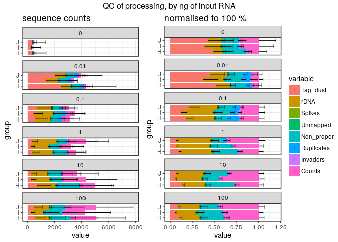
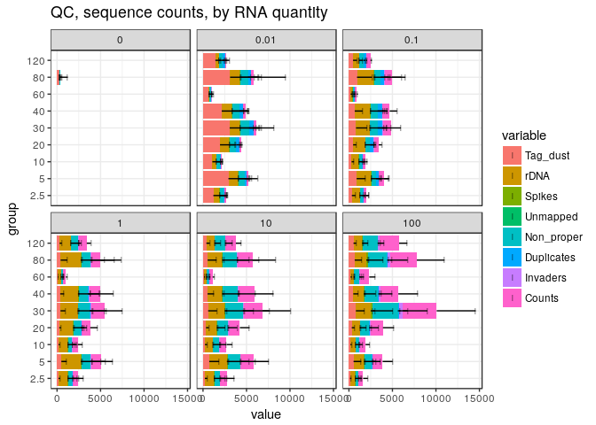
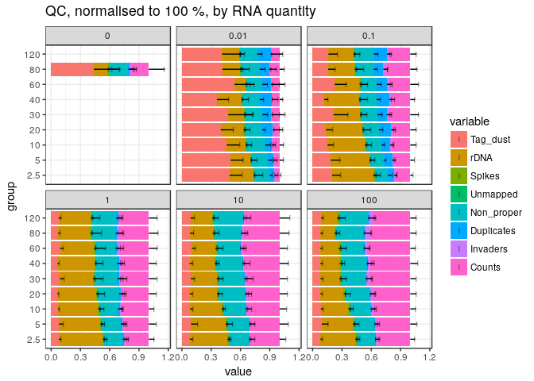
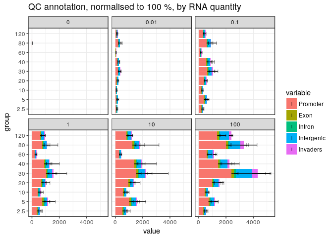
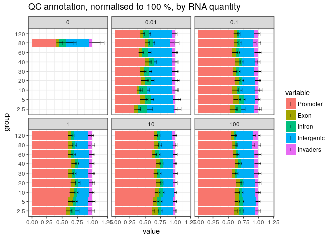

Experiment 3, plates 4, 5 and 6
===============================

The reverse-transcriptase was SuperScript IV.

Plates 1~3 and 4~6 were processed separately because the Moirai pipeline does
not handle dual indexing.

For merging multiple experiments, the following unique plate IDs `H`, `I` and
`J` are assigned to the replicates `1`, `2`, and `3` respectively.

This QC report is slim on purpose; more plots will be produced in the combined
analysis.


Load R packages
===============


```r
library("CAGEr")
library("ggplot2")
library("magrittr")
library("MultiAssayExperiment")
library("SummarizedExperiment")
```

MOIRAI shortcuts


```r
MISEQ_RUN      <- "180403_M00528_0348_000000000-B4GP8_p456"
WORKFLOW       <- "OP-WORKFLOW-CAGEscan-short-reads-v2.1~rc1"
MOIRAI_STAMP   <- "20180404163455"
MOIRAI_PROJ    <- "project/Labcyte" 
MOIRAI_USER    <- "nanoCAGE2" 
ASSEMBLY       <- "mm9"
BASEDIR        <- "/osc-fs_home/scratch/moirai"
MOIRAI_BASE    <- file.path(BASEDIR, MOIRAI_USER)
MOIRAI_RESULTS <- file.path(MOIRAI_BASE, MOIRAI_PROJ, paste(MISEQ_RUN, WORKFLOW, MOIRAI_STAMP, sep = "."))
```

Load CAGE libraries
===================

Load summary statistics from MOIRAI and polish the names
--------------------------------------------------------


```r
ce <- smallCAGEqc::loadMoiraiStats(
  pipeline  = WORKFLOW,
  multiplex = file.path( MOIRAI_BASE, "input", paste0(MISEQ_RUN, ".multiplex.txt")),
  summary   = file.path( MOIRAI_RESULTS, "text", "summary.txt")) %>% DataFrame

ce$inputFiles <- paste0(MOIRAI_RESULTS, "/CAGEscan_fragments/", ce$samplename, ".bed")

# Discard lines for which input files do not exist.
ce <- ce[sapply(ce$inputFiles, file.exists),]

# Discard lines for which input files are empty.
ce <- ce[file.info(ce$inputFiles)$size != 0,]

ce$inputFilesType <- c("bed")
ce$sampleLabels <- as.character(ce$samplename)

# Replace indexes in group names by RNA amounts extracted from sample sheet.
levels(ce$group) <- system("grep ACTGCATA 180215_M00528_0330_000000000-B4GPD.SampleSheet.csv | cut -f 6,10 -d , | grep g_ | sort | cut -f2 -d, | cut -f1 -d_", intern = TRUE)

# Sort the levels by RNA amount
ce$group %<>% factor(levels = c("100ng", "10ng", "1ng", "100pg", "10pg"))

ce$repl <- ce$index
levels(ce$repl) <- system("grep ACTGCATA 180215_M00528_0330_000000000-B4GPD.SampleSheet.csv | cut -f 6,10 -d , | grep g_ | sort | cut -f 2 -d _ | sed 's/\r//'", intern = TRUE)
ce$repl %<>% factor(levels = 4:6)
levels(ce$repl) <- 1:3

# Define plate IDs
ce$plateID <- ce$repl
levels(ce$plateID) <- c("H", "I", "J")

rownames(ce) %<>% paste(ce$plateID, sep = "_")
ce$sampleLabels <- rownames(ce)

ce
```

```
## DataFrame with 1044 rows and 18 columns
##                        samplename    group  barcode    index     total
##                          <factor> <factor> <factor> <factor> <numeric>
## ACACAG_TAAGGCGA_H ACACAG_TAAGGCGA    100ng   ACACAG TAAGGCGA         0
## ACACGT_TAAGGCGA_H ACACGT_TAAGGCGA    100ng   ACACGT TAAGGCGA         0
## ACACTC_TAAGGCGA_H ACACTC_TAAGGCGA    100ng   ACACTC TAAGGCGA         0
## ACAGAT_TAAGGCGA_H ACAGAT_TAAGGCGA    100ng   ACAGAT TAAGGCGA         0
## ACAGCA_TAAGGCGA_H ACAGCA_TAAGGCGA    100ng   ACAGCA TAAGGCGA         0
## ...                           ...      ...      ...      ...       ...
## GCTATA_TGCAGCTA_J GCTATA_TGCAGCTA     10pg   GCTATA TGCAGCTA         0
## GCTCAG_TGCAGCTA_J GCTCAG_TGCAGCTA     10pg   GCTCAG TGCAGCTA         0
## GCTCGT_TGCAGCTA_J GCTCGT_TGCAGCTA     10pg   GCTCGT TGCAGCTA         0
## GCTCTC_TGCAGCTA_J GCTCTC_TGCAGCTA     10pg   GCTCTC TGCAGCTA         0
## GCTGAT_TGCAGCTA_J GCTGAT_TGCAGCTA     10pg   GCTGAT TGCAGCTA         0
##                   extracted   cleaned   tagdust      rdna    spikes
##                   <numeric> <numeric> <numeric> <numeric> <numeric>
## ACACAG_TAAGGCGA_H      3113      2530       341       176        66
## ACACGT_TAAGGCGA_H      2993      2250       319       369        55
## ACACTC_TAAGGCGA_H      8037      6154       895       819       169
## ACAGAT_TAAGGCGA_H      6365      4804       726       700       135
## ACAGCA_TAAGGCGA_H      6944      4854       777      1160       153
## ...                     ...       ...       ...       ...       ...
## GCTATA_TGCAGCTA_J       110        32        76         1         1
## GCTCAG_TGCAGCTA_J       680       155       500        21         4
## GCTCGT_TGCAGCTA_J      1046       241       785        15         5
## GCTCTC_TGCAGCTA_J      1007       257       732        12         6
## GCTGAT_TGCAGCTA_J      7768      1737      5952        43        36
##                      mapped properpairs    counts
##                   <numeric>   <numeric> <numeric>
## ACACAG_TAAGGCGA_H      2530         995         0
## ACACGT_TAAGGCGA_H      2250        1290         0
## ACACTC_TAAGGCGA_H      6154        2677         0
## ACAGAT_TAAGGCGA_H      4804        2966         0
## ACAGCA_TAAGGCGA_H      4854        2793         0
## ...                     ...         ...       ...
## GCTATA_TGCAGCTA_J        32           5         0
## GCTCAG_TGCAGCTA_J       155          29         0
## GCTCGT_TGCAGCTA_J       241          42         0
## GCTCTC_TGCAGCTA_J       257          37         0
## GCTGAT_TGCAGCTA_J      1737         244         0
##                                                                                                                                                                                                      inputFiles
##                                                                                                                                                                                                     <character>
## ACACAG_TAAGGCGA_H /osc-fs_home/scratch/moirai/nanoCAGE2/project/Labcyte/180403_M00528_0348_000000000-B4GP8_p456.OP-WORKFLOW-CAGEscan-short-reads-v2.1~rc1.20180404163455/CAGEscan_fragments/ACACAG_TAAGGCGA.bed
## ACACGT_TAAGGCGA_H /osc-fs_home/scratch/moirai/nanoCAGE2/project/Labcyte/180403_M00528_0348_000000000-B4GP8_p456.OP-WORKFLOW-CAGEscan-short-reads-v2.1~rc1.20180404163455/CAGEscan_fragments/ACACGT_TAAGGCGA.bed
## ACACTC_TAAGGCGA_H /osc-fs_home/scratch/moirai/nanoCAGE2/project/Labcyte/180403_M00528_0348_000000000-B4GP8_p456.OP-WORKFLOW-CAGEscan-short-reads-v2.1~rc1.20180404163455/CAGEscan_fragments/ACACTC_TAAGGCGA.bed
## ACAGAT_TAAGGCGA_H /osc-fs_home/scratch/moirai/nanoCAGE2/project/Labcyte/180403_M00528_0348_000000000-B4GP8_p456.OP-WORKFLOW-CAGEscan-short-reads-v2.1~rc1.20180404163455/CAGEscan_fragments/ACAGAT_TAAGGCGA.bed
## ACAGCA_TAAGGCGA_H /osc-fs_home/scratch/moirai/nanoCAGE2/project/Labcyte/180403_M00528_0348_000000000-B4GP8_p456.OP-WORKFLOW-CAGEscan-short-reads-v2.1~rc1.20180404163455/CAGEscan_fragments/ACAGCA_TAAGGCGA.bed
## ...                                                                                                                                                                                                         ...
## GCTATA_TGCAGCTA_J /osc-fs_home/scratch/moirai/nanoCAGE2/project/Labcyte/180403_M00528_0348_000000000-B4GP8_p456.OP-WORKFLOW-CAGEscan-short-reads-v2.1~rc1.20180404163455/CAGEscan_fragments/GCTATA_TGCAGCTA.bed
## GCTCAG_TGCAGCTA_J /osc-fs_home/scratch/moirai/nanoCAGE2/project/Labcyte/180403_M00528_0348_000000000-B4GP8_p456.OP-WORKFLOW-CAGEscan-short-reads-v2.1~rc1.20180404163455/CAGEscan_fragments/GCTCAG_TGCAGCTA.bed
## GCTCGT_TGCAGCTA_J /osc-fs_home/scratch/moirai/nanoCAGE2/project/Labcyte/180403_M00528_0348_000000000-B4GP8_p456.OP-WORKFLOW-CAGEscan-short-reads-v2.1~rc1.20180404163455/CAGEscan_fragments/GCTCGT_TGCAGCTA.bed
## GCTCTC_TGCAGCTA_J /osc-fs_home/scratch/moirai/nanoCAGE2/project/Labcyte/180403_M00528_0348_000000000-B4GP8_p456.OP-WORKFLOW-CAGEscan-short-reads-v2.1~rc1.20180404163455/CAGEscan_fragments/GCTCTC_TGCAGCTA.bed
## GCTGAT_TGCAGCTA_J /osc-fs_home/scratch/moirai/nanoCAGE2/project/Labcyte/180403_M00528_0348_000000000-B4GP8_p456.OP-WORKFLOW-CAGEscan-short-reads-v2.1~rc1.20180404163455/CAGEscan_fragments/GCTGAT_TGCAGCTA.bed
##                   inputFilesType      sampleLabels     repl  plateID
##                      <character>       <character> <factor> <factor>
## ACACAG_TAAGGCGA_H            bed ACACAG_TAAGGCGA_H        1        H
## ACACGT_TAAGGCGA_H            bed ACACGT_TAAGGCGA_H        1        H
## ACACTC_TAAGGCGA_H            bed ACACTC_TAAGGCGA_H        1        H
## ACAGAT_TAAGGCGA_H            bed ACAGAT_TAAGGCGA_H        1        H
## ACAGCA_TAAGGCGA_H            bed ACAGCA_TAAGGCGA_H        1        H
## ...                          ...               ...      ...      ...
## GCTATA_TGCAGCTA_J            bed GCTATA_TGCAGCTA_J        3        J
## GCTCAG_TGCAGCTA_J            bed GCTCAG_TGCAGCTA_J        3        J
## GCTCGT_TGCAGCTA_J            bed GCTCGT_TGCAGCTA_J        3        J
## GCTCTC_TGCAGCTA_J            bed GCTCTC_TGCAGCTA_J        3        J
## GCTGAT_TGCAGCTA_J            bed GCTGAT_TGCAGCTA_J        3        J
```


Load plate design
-----------------

Using plate 2 design, see [Labcyte-RT2.md](Labcyte-RT2.md).

```r
plate <- read.table("plate2.txt", sep = "\t", header = TRUE)
ce %<>% cbind(plate[match( paste(ce$barcode, ce$group)
                         , paste(plate$BARCODE_SEQ, plate$RNA_group)), ])
rm(plate)
```


Create a CAGEexp object and load expression data
------------------------------------------------


```r
getCTSS(ce, useMulticore = TRUE)
removeStrandInvaders(ce)
```

```
## Loading required namespace: BSgenome.Mmusculus.UCSC.mm9
```


Save the CAGEexp file
---------------------


```r
saveRDS(ce, "Labcyte-RT_Data_Analysis_3b.Rds")
```


Quality controls
================

Custom _scopes_ displaying _strand invasion_ artefacts.


```r
msScope_qcSI <- function(libs) {
  libs$Tag_dust     <- libs$extracted   - libs$rdna - libs$spikes - libs$cleaned
  libs$rDNA         <- libs$rdna
  libs$Spikes       <- libs$spikes
  libs$Unmapped     <- libs$cleaned     - libs$mapped
  libs$Non_proper   <- libs$mapped      - libs$properpairs
  libs$Duplicates   <- libs$properpairs - libs$librarySizes - libs$strandInvaders
  libs$Invaders     <- libs$strandInvaders
  libs$Counts       <- libs$librarySizes
  list( libs    = libs
      , columns = c( "Tag_dust", "rDNA", "Spikes", "Unmapped"
                   , "Non_proper", "Duplicates", "Invaders", "Counts")
      , total   = libs$extracted)
}

msScope_counts <- function(libs) {
  libs$Promoter   <- libs$promoter
  libs$Exon       <- libs$exon
  libs$Intron     <- libs$intron
  libs$Intergenic <- libs$librarySizes - libs$promoter - libs$intron - libs$exon
  libs$Invaders   <- libs$strandInvaders
  list( libs    = libs
      , columns = c("Promoter", "Exon", "Intron", "Intergenic", "Invaders")
      , total   = libs$librarySizes + libs$strandInvaders)
}
```

By RNA input
------------

Negative controls with no RNA gave much less sequences than the regular
samples with RNA.


```r
ggpubr::ggarrange( legend = "right", common.legend = TRUE,
  plotAnnot( ce, scope = msScope_qcSI, group = "plateID", normalise = FALSE
           , title = "sequence counts"
           , facet="RNA") +
    facet_wrap(~facet, ncol = 1),
  plotAnnot( ce, scope = msScope_qcSI, group = "plateID", normalise = TRUE
         , title = "normalised to 100 %"
         , facet="RNA") +
  facet_wrap(~facet, ncol = 1)
) %>% ggpubr::annotate_figure(top="QC of processing, by ng of input RNA")
```

<!-- -->

The normalised QC profile is not much different, therefore
the sequences might be _in silico_ or _in vitro_ contaminations.


Annotation with GENCODE
-----------------------

Collect Gencode annotations and gene symbols via a local GENCODE file
(mm9 gencode not available in AnnotationHub)

Most pairs align in intergenic regions.  Is it because of the sequence error
combined with very short read 1s ?


```r
annotateCTSS(ce, rtracklayer::import.gff("/osc-fs_home/scratch/gmtu/annotation/mus_musculus/gencode-M1/gencode.vM1.annotation.gtf.gz"))
```


```r
ggpubr::ggarrange( legend = "right", common.legend = TRUE,
  plotAnnot( ce, scope = "counts", group = "repl"
           , title = "Sequence counts"
           , facet = "RNA", normalise = FALSE) +
    facet_wrap("facet", ncol = 1),
  plotAnnot( ce, scope = "counts", group = "repl"
           , title = "Normalised to 100%"
           , facet = "RNA", normalise = TRUE) +
    facet_wrap("facet", ncol = 1)
)  %>% ggpubr::annotate_figure(top="QC annotation, by ng of input RNA")
```

```
## Warning: Removed 4 rows containing missing values (position_stack).
```

```
## Warning: Removed 4 rows containing missing values (geom_segment).
```

```
## Warning: Removed 4 rows containing missing values (geom_point).
```

<!-- -->


By TSO concentration
--------------------

Problem with TSO == 60 ??  Mabye the stock primer had a defect.


```r
plotAnnot(ce, scope = msScope_qcSI, group = "TSO", normalise = FALSE, facet = "RNA", title = "QC, sequence counts, by RNA quantity")
```

<!-- -->


```r
plotAnnot(ce, scope = msScope_qcSI, group = "TSO", normalise = TRUE, facet = "RNA", title = "QC, normalised to 100 %, by RNA quantity")
```

<!-- -->


```r
plotAnnot(ce, scope = msScope_counts, group = "TSO", normalise = FALSE, facet = "RNA", title = "QC annotation, normalised to 100 %, by RNA quantity")
```

<!-- -->


```r
plotAnnot(ce, scope = msScope_counts, group = "TSO", normalise = TRUE, facet = "RNA", title = "QC annotation, normalised to 100 %, by RNA quantity")
```

<!-- -->


Session information
===================


```r
sessionInfo()
```

```
## R version 3.4.3 (2017-11-30)
## Platform: x86_64-pc-linux-gnu (64-bit)
## Running under: Debian GNU/Linux 9 (stretch)
## 
## Matrix products: default
## BLAS: /usr/lib/libblas/libblas.so.3.7.0
## LAPACK: /usr/lib/lapack/liblapack.so.3.7.0
## 
## locale:
##  [1] LC_CTYPE=en_GB.UTF-8       LC_NUMERIC=C              
##  [3] LC_TIME=en_GB.UTF-8        LC_COLLATE=en_GB.UTF-8    
##  [5] LC_MONETARY=en_GB.UTF-8    LC_MESSAGES=en_GB.UTF-8   
##  [7] LC_PAPER=en_GB.UTF-8       LC_NAME=C                 
##  [9] LC_ADDRESS=C               LC_TELEPHONE=C            
## [11] LC_MEASUREMENT=en_GB.UTF-8 LC_IDENTIFICATION=C       
## 
## attached base packages:
## [1] parallel  stats4    stats     graphics  grDevices utils     datasets 
## [8] methods   base     
## 
## other attached packages:
##  [1] SummarizedExperiment_1.9.14 DelayedArray_0.4.1         
##  [3] matrixStats_0.52.2          Biobase_2.38.0             
##  [5] GenomicRanges_1.31.19       GenomeInfoDb_1.15.5        
##  [7] IRanges_2.13.26             S4Vectors_0.17.32          
##  [9] BiocGenerics_0.25.3         MultiAssayExperiment_1.5.41
## [11] magrittr_1.5                ggplot2_2.2.1              
## [13] CAGEr_1.21.5.1             
## 
## loaded via a namespace (and not attached):
##  [1] nlme_3.1-131                      bitops_1.0-6                     
##  [3] RColorBrewer_1.1-2                rprojroot_1.3-2                  
##  [5] tools_3.4.3                       backports_1.1.2                  
##  [7] R6_2.2.2                          vegan_2.4-5                      
##  [9] platetools_0.0.2                  KernSmooth_2.23-15               
## [11] lazyeval_0.2.1                    mgcv_1.8-22                      
## [13] colorspace_1.3-2                  permute_0.9-4                    
## [15] gridExtra_2.3                     compiler_3.4.3                   
## [17] VennDiagram_1.6.18                rtracklayer_1.39.9               
## [19] labeling_0.3                      scales_0.5.0                     
## [21] stringr_1.3.0                     digest_0.6.15                    
## [23] Rsamtools_1.31.3                  rmarkdown_1.9                    
## [25] stringdist_0.9.4.6                XVector_0.19.8                   
## [27] pkgconfig_2.0.1                   htmltools_0.3.6                  
## [29] BSgenome_1.47.5                   rlang_0.2.0                      
## [31] VGAM_1.0-4                        bindr_0.1                        
## [33] BiocParallel_1.12.0               gtools_3.5.0                     
## [35] dplyr_0.7.4                       RCurl_1.95-4.10                  
## [37] GenomeInfoDbData_0.99.1           futile.logger_1.4.3              
## [39] smallCAGEqc_0.12.2.999999         Matrix_1.2-12                    
## [41] Rcpp_0.12.16                      munsell_0.4.3                    
## [43] stringi_1.1.7                     yaml_2.1.18                      
## [45] MASS_7.3-47                       zlibbioc_1.24.0                  
## [47] plyr_1.8.4                        grid_3.4.3                       
## [49] gdata_2.18.0                      lattice_0.20-35                  
## [51] Biostrings_2.47.9                 cowplot_0.9.2                    
## [53] splines_3.4.3                     knitr_1.20                       
## [55] beanplot_1.2                      pillar_1.2.1                     
## [57] ggpubr_0.1.6                      reshape2_1.4.2                   
## [59] codetools_0.2-15                  futile.options_1.0.0             
## [61] XML_3.98-1.9                      glue_1.2.0                       
## [63] evaluate_0.10.1                   lambda.r_1.2                     
## [65] data.table_1.10.4-3               gtable_0.2.0                     
## [67] BSgenome.Mmusculus.UCSC.mm9_1.4.0 purrr_0.2.4                      
## [69] tidyr_0.7.2                       reshape_0.8.7                    
## [71] assertthat_0.2.0                  tibble_1.4.2                     
## [73] som_0.3-5.1                       GenomicAlignments_1.15.12        
## [75] memoise_1.1.0                     bindrcpp_0.2                     
## [77] cluster_2.0.6
```
