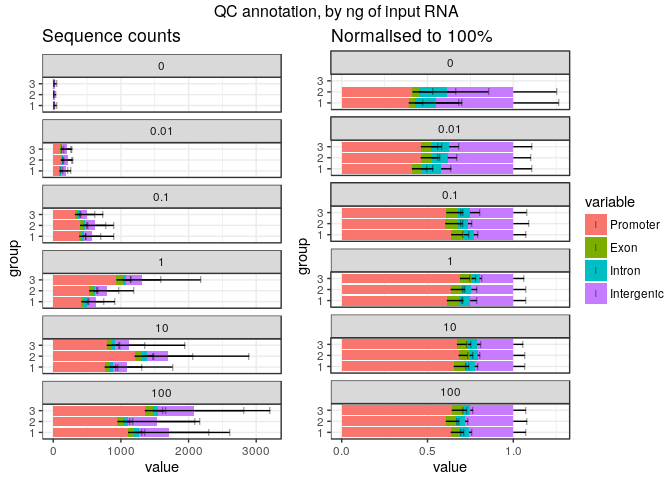

Experiment 3, plates 4, 5 and 6
===============================

The reverse-transcriptase was SuperScript IV.

Plates 1~3 and 4~6 were processed separately because the Moirai pipeline does
not handle dual indexing.

For merging multiple experiments, the following unique plate IDs `H`, `I` and
`J` are assigned to the replicates `1`, `2`, and `3` respectively.

This QC report is slim on purpose; more plots will be produced in the combined
analysis.


Load R packages
===============


```r
library("CAGEr")
library("ggplot2")
library("magrittr")
library("MultiAssayExperiment")
library("SummarizedExperiment")
```

MOIRAI shortcuts


```r
MISEQ_RUN      <- "180215_M00528_0330_000000000-B4GPD_p456"
WORKFLOW       <- "OP-WORKFLOW-CAGEscan-short-reads-v2.1~rc1"
MOIRAI_STAMP   <- "20180219140315"
MOIRAI_PROJ    <- "project/Labcyte" 
MOIRAI_USER    <- "nanoCAGE2" 
ASSEMBLY       <- "mm9"
BASEDIR        <- "/osc-fs_home/scratch/moirai"
MOIRAI_BASE    <- file.path(BASEDIR, MOIRAI_USER)
MOIRAI_RESULTS <- file.path(MOIRAI_BASE, MOIRAI_PROJ, paste(MISEQ_RUN, WORKFLOW, MOIRAI_STAMP, sep = "."))
```

Load CAGE libraries
===================

Load summary statistics from MOIRAI and polish the names
--------------------------------------------------------


```r
ce <- smallCAGEqc::loadMoiraiStats(
  pipeline  = WORKFLOW,
  multiplex = file.path( MOIRAI_BASE, "input", paste0(MISEQ_RUN, ".multiplex.txt")),
  summary   = file.path( MOIRAI_RESULTS, "text", "summary.txt")) %>% DataFrame

ce$inputFiles <- paste0(MOIRAI_RESULTS, "/CAGEscan_fragments/", ce$samplename, ".bed")

# Discard lines for which input files do not exist.
ce <- ce[sapply(ce$inputFiles, file.exists),]

# Discard lines for which input files are empty.
ce <- ce[file.info(ce$inputFiles)$size != 0,]

ce$inputFilesType <- c("bed")
ce$sampleLabels <- as.character(ce$samplename)

# Replace indexes in group names by RNA amounts extracted from sample sheet.
levels(ce$group) <- system("grep ACTGCATA 180215_M00528_0330_000000000-B4GPD.SampleSheet.csv | cut -f 6,10 -d , | grep g_ | sort | cut -f2 -d, | cut -f1 -d_", intern = TRUE)

# Sort the levels by RNA amount
ce$group %<>% factor(levels = c("100ng", "10ng", "1ng", "100pg", "10pg"))

ce$repl <- ce$index
levels(ce$repl) <- system("grep ACTGCATA 180215_M00528_0330_000000000-B4GPD.SampleSheet.csv | cut -f 6,10 -d , | grep g_ | sort | cut -f 2 -d _ | sed 's/\r//'", intern = TRUE)
ce$repl %<>% factor(levels = 4:6)
levels(ce$repl) <- 1:3

# Define plate IDs
ce$plateID <- ce$repl
levels(ce$plateID) <- c("H", "I", "J")

rownames(ce) %<>% paste(ce$plateID, sep = "_")
ce$sampleLabels <- rownames(ce)

ce
```

```
## DataFrame with 1005 rows and 18 columns
##                        samplename    group  barcode    index     total
##                          <factor> <factor> <factor> <factor> <numeric>
## ACACAG_TAAGGCGA_H ACACAG_TAAGGCGA    100ng   ACACAG TAAGGCGA         0
## ACACGT_TAAGGCGA_H ACACGT_TAAGGCGA    100ng   ACACGT TAAGGCGA         0
## ACACTC_TAAGGCGA_H ACACTC_TAAGGCGA    100ng   ACACTC TAAGGCGA         0
## ACAGAT_TAAGGCGA_H ACAGAT_TAAGGCGA    100ng   ACAGAT TAAGGCGA         0
## ACAGCA_TAAGGCGA_H ACAGCA_TAAGGCGA    100ng   ACAGCA TAAGGCGA         0
## ...                           ...      ...      ...      ...       ...
## GCTATA_TGCAGCTA_J GCTATA_TGCAGCTA     10pg   GCTATA TGCAGCTA         0
## GCTCAG_TGCAGCTA_J GCTCAG_TGCAGCTA     10pg   GCTCAG TGCAGCTA         0
## GCTCGT_TGCAGCTA_J GCTCGT_TGCAGCTA     10pg   GCTCGT TGCAGCTA         0
## GCTCTC_TGCAGCTA_J GCTCTC_TGCAGCTA     10pg   GCTCTC TGCAGCTA         0
## GCTGAT_TGCAGCTA_J GCTGAT_TGCAGCTA     10pg   GCTGAT TGCAGCTA         0
##                   extracted   cleaned   tagdust      rdna    spikes
##                   <numeric> <numeric> <numeric> <numeric> <numeric>
## ACACAG_TAAGGCGA_H       666       540         0       103        23
## ACACGT_TAAGGCGA_H       514       410         0        83        21
## ACACTC_TAAGGCGA_H      1690      1401         3       225        61
## ACAGAT_TAAGGCGA_H      1132       896         1       179        56
## ACAGCA_TAAGGCGA_H      1551      1243         8       254        46
## ...                     ...       ...       ...       ...       ...
## GCTATA_TGCAGCTA_J        11         5         4         2         0
## GCTCAG_TGCAGCTA_J        79        60        10         7         2
## GCTCGT_TGCAGCTA_J        92        62        16        11         3
## GCTCTC_TGCAGCTA_J       117        84        21        10         2
## GCTGAT_TGCAGCTA_J       579       417        84        53        25
##                      mapped properpairs    counts
##                   <numeric>   <numeric> <numeric>
## ACACAG_TAAGGCGA_H       540         151       150
## ACACGT_TAAGGCGA_H       410         100       100
## ACACTC_TAAGGCGA_H      1401         349       349
## ACAGAT_TAAGGCGA_H       896         251       250
## ACAGCA_TAAGGCGA_H      1243         319       317
## ...                     ...         ...       ...
## GCTATA_TGCAGCTA_J         5           1         1
## GCTCAG_TGCAGCTA_J        60          12        12
## GCTCGT_TGCAGCTA_J        62           7         7
## GCTCTC_TGCAGCTA_J        84          19        19
## GCTGAT_TGCAGCTA_J       417          57        57
##                                                                                                                                                                                                      inputFiles
##                                                                                                                                                                                                     <character>
## ACACAG_TAAGGCGA_H /osc-fs_home/scratch/moirai/nanoCAGE2/project/Labcyte/180215_M00528_0330_000000000-B4GPD_p456.OP-WORKFLOW-CAGEscan-short-reads-v2.1~rc1.20180219140315/CAGEscan_fragments/ACACAG_TAAGGCGA.bed
## ACACGT_TAAGGCGA_H /osc-fs_home/scratch/moirai/nanoCAGE2/project/Labcyte/180215_M00528_0330_000000000-B4GPD_p456.OP-WORKFLOW-CAGEscan-short-reads-v2.1~rc1.20180219140315/CAGEscan_fragments/ACACGT_TAAGGCGA.bed
## ACACTC_TAAGGCGA_H /osc-fs_home/scratch/moirai/nanoCAGE2/project/Labcyte/180215_M00528_0330_000000000-B4GPD_p456.OP-WORKFLOW-CAGEscan-short-reads-v2.1~rc1.20180219140315/CAGEscan_fragments/ACACTC_TAAGGCGA.bed
## ACAGAT_TAAGGCGA_H /osc-fs_home/scratch/moirai/nanoCAGE2/project/Labcyte/180215_M00528_0330_000000000-B4GPD_p456.OP-WORKFLOW-CAGEscan-short-reads-v2.1~rc1.20180219140315/CAGEscan_fragments/ACAGAT_TAAGGCGA.bed
## ACAGCA_TAAGGCGA_H /osc-fs_home/scratch/moirai/nanoCAGE2/project/Labcyte/180215_M00528_0330_000000000-B4GPD_p456.OP-WORKFLOW-CAGEscan-short-reads-v2.1~rc1.20180219140315/CAGEscan_fragments/ACAGCA_TAAGGCGA.bed
## ...                                                                                                                                                                                                         ...
## GCTATA_TGCAGCTA_J /osc-fs_home/scratch/moirai/nanoCAGE2/project/Labcyte/180215_M00528_0330_000000000-B4GPD_p456.OP-WORKFLOW-CAGEscan-short-reads-v2.1~rc1.20180219140315/CAGEscan_fragments/GCTATA_TGCAGCTA.bed
## GCTCAG_TGCAGCTA_J /osc-fs_home/scratch/moirai/nanoCAGE2/project/Labcyte/180215_M00528_0330_000000000-B4GPD_p456.OP-WORKFLOW-CAGEscan-short-reads-v2.1~rc1.20180219140315/CAGEscan_fragments/GCTCAG_TGCAGCTA.bed
## GCTCGT_TGCAGCTA_J /osc-fs_home/scratch/moirai/nanoCAGE2/project/Labcyte/180215_M00528_0330_000000000-B4GPD_p456.OP-WORKFLOW-CAGEscan-short-reads-v2.1~rc1.20180219140315/CAGEscan_fragments/GCTCGT_TGCAGCTA.bed
## GCTCTC_TGCAGCTA_J /osc-fs_home/scratch/moirai/nanoCAGE2/project/Labcyte/180215_M00528_0330_000000000-B4GPD_p456.OP-WORKFLOW-CAGEscan-short-reads-v2.1~rc1.20180219140315/CAGEscan_fragments/GCTCTC_TGCAGCTA.bed
## GCTGAT_TGCAGCTA_J /osc-fs_home/scratch/moirai/nanoCAGE2/project/Labcyte/180215_M00528_0330_000000000-B4GPD_p456.OP-WORKFLOW-CAGEscan-short-reads-v2.1~rc1.20180219140315/CAGEscan_fragments/GCTGAT_TGCAGCTA.bed
##                   inputFilesType      sampleLabels     repl  plateID
##                      <character>       <character> <factor> <factor>
## ACACAG_TAAGGCGA_H            bed ACACAG_TAAGGCGA_H        1        H
## ACACGT_TAAGGCGA_H            bed ACACGT_TAAGGCGA_H        1        H
## ACACTC_TAAGGCGA_H            bed ACACTC_TAAGGCGA_H        1        H
## ACAGAT_TAAGGCGA_H            bed ACAGAT_TAAGGCGA_H        1        H
## ACAGCA_TAAGGCGA_H            bed ACAGCA_TAAGGCGA_H        1        H
## ...                          ...               ...      ...      ...
## GCTATA_TGCAGCTA_J            bed GCTATA_TGCAGCTA_J        3        J
## GCTCAG_TGCAGCTA_J            bed GCTCAG_TGCAGCTA_J        3        J
## GCTCGT_TGCAGCTA_J            bed GCTCGT_TGCAGCTA_J        3        J
## GCTCTC_TGCAGCTA_J            bed GCTCTC_TGCAGCTA_J        3        J
## GCTGAT_TGCAGCTA_J            bed GCTGAT_TGCAGCTA_J        3        J
```


Load plate design
-----------------

Using plate 2 design, see [Labcyte-RT2.md](Labcyte-RT2.md).

```r
plate <- read.table("plate2.txt", sep = "\t", header = TRUE)
ce %<>% cbind(plate[match( paste(ce$barcode, ce$group)
                         , paste(plate$BARCODE_SEQ, plate$RNA_group)), ])
rm(plate)
```


Create a CAGEexp object and load expression data
------------------------------------------------


```r
getCTSS(ce, useMulticore = TRUE)
removeStrandInvaders(ce)
```

```
## Loading required namespace: BSgenome.Mmusculus.UCSC.mm9
```


Save the CAGEexp file
---------------------


```r
saveRDS(ce, "Labcyte-RT_Data_Analysis_3b.Rds")
```


Quality controls
================

By RNA input
------------

Negative controls with no RNA gave much less sequences than the regular
samples with RNA.


```r
plotAnnot( ce, scope = "qc", group = "repl", normalise = FALSE
         , title = "QC control, by ng of input RNA (sequence counts)"
         , facet="RNA") +
  facet_wrap(~facet, nrow = 5)
```

<!-- -->

The normalised QC profile is not much different, therefore
the sequences might be _in silico_ or _in vitro_ contaminations.


```r
plotAnnot( ce, scope = "qc", group = "repl", normalise = TRUE
         , title = "QC control, by ng of input RNA (normalised to 100 %)"
         , facet="RNA") +
  facet_wrap(~facet, nrow = 5)
```

<!-- -->


By TSO concentration
--------------------

Problem with TSO == 60 ??  Mabye the stock primer had a defect.


```r
plotAnnot(ce, scope = "qc", group = "TSO", normalise = FALSE, facet = "group")
```

<!-- -->


Annotation with GENCODE
-----------------------

Collect Gencode annotations and gene symbols via a local GENCODE file
(mm9 gencode not available in AnnotationHub)

Most pairs align in intergenic regions.  Is it because of the sequence error
combined with very short read 1s ?


```r
annotateCTSS(ce, rtracklayer::import.gff("/osc-fs_home/scratch/gmtu/annotation/mus_musculus/gencode-M1/gencode.vM1.annotation.gtf.gz"))
```


```r
plotAnnot( ce, scope = "counts", group = "repl"
         , title = "QC annotation, by ng of input RNA (sequence counts)"
         , facet = "group") +
  facet_wrap("facet", nrow = 5)
```

<!-- -->

```r
plotAnnot( ce, scope = "counts", group = "repl"
         , title = "QC annotation, by ng of input RNA (normalised to 100%)"
         , facet = "group", norm = F) +
  facet_wrap("facet", nrow = 5)
```

<!-- -->

Session information
===================


```r
sessionInfo()
```

```
## R version 3.4.3 (2017-11-30)
## Platform: x86_64-pc-linux-gnu (64-bit)
## Running under: Debian GNU/Linux 9 (stretch)
## 
## Matrix products: default
## BLAS: /usr/lib/libblas/libblas.so.3.7.0
## LAPACK: /usr/lib/lapack/liblapack.so.3.7.0
## 
## locale:
##  [1] LC_CTYPE=en_GB.UTF-8       LC_NUMERIC=C              
##  [3] LC_TIME=en_GB.UTF-8        LC_COLLATE=en_GB.UTF-8    
##  [5] LC_MONETARY=en_GB.UTF-8    LC_MESSAGES=en_GB.UTF-8   
##  [7] LC_PAPER=en_GB.UTF-8       LC_NAME=C                 
##  [9] LC_ADDRESS=C               LC_TELEPHONE=C            
## [11] LC_MEASUREMENT=en_GB.UTF-8 LC_IDENTIFICATION=C       
## 
## attached base packages:
## [1] parallel  stats4    stats     graphics  grDevices utils     datasets 
## [8] methods   base     
## 
## other attached packages:
##  [1] SummarizedExperiment_1.9.14 DelayedArray_0.4.1         
##  [3] matrixStats_0.52.2          Biobase_2.38.0             
##  [5] GenomicRanges_1.31.19       GenomeInfoDb_1.15.5        
##  [7] IRanges_2.13.26             S4Vectors_0.17.32          
##  [9] BiocGenerics_0.25.3         MultiAssayExperiment_1.5.41
## [11] magrittr_1.5                ggplot2_2.2.1              
## [13] CAGEr_1.21.5.1             
## 
## loaded via a namespace (and not attached):
##  [1] tidyr_0.7.2                       VGAM_1.0-4                       
##  [3] splines_3.4.3                     gtools_3.5.0                     
##  [5] assertthat_0.2.0                  BSgenome_1.47.5                  
##  [7] GenomeInfoDbData_0.99.1           Rsamtools_1.31.3                 
##  [9] yaml_2.1.15                       backports_1.1.1                  
## [11] lattice_0.20-35                   glue_1.2.0                       
## [13] digest_0.6.12                     RColorBrewer_1.1-2               
## [15] XVector_0.19.8                    platetools_0.0.2                 
## [17] colorspace_1.3-2                  htmltools_0.3.6                  
## [19] Matrix_1.2-12                     plyr_1.8.4                       
## [21] pkgconfig_2.0.1                   XML_3.98-1.9                     
## [23] smallCAGEqc_0.12.2.999999         zlibbioc_1.24.0                  
## [25] purrr_0.2.4                       scales_0.5.0                     
## [27] gdata_2.18.0                      stringdist_0.9.4.6               
## [29] VennDiagram_1.6.18                BiocParallel_1.12.0              
## [31] tibble_1.3.4                      beanplot_1.2                     
## [33] mgcv_1.8-22                       lazyeval_0.2.1                   
## [35] memoise_1.1.0                     evaluate_0.10.1                  
## [37] BSgenome.Mmusculus.UCSC.mm9_1.4.0 nlme_3.1-131                     
## [39] MASS_7.3-47                       vegan_2.4-5                      
## [41] tools_3.4.3                       data.table_1.10.4-3              
## [43] stringr_1.2.0                     munsell_0.4.3                    
## [45] cluster_2.0.6                     bindrcpp_0.2                     
## [47] lambda.r_1.2                      Biostrings_2.47.9                
## [49] som_0.3-5.1                       compiler_3.4.3                   
## [51] rlang_0.1.4                       futile.logger_1.4.3              
## [53] grid_3.4.3                        RCurl_1.95-4.10                  
## [55] labeling_0.3                      bitops_1.0-6                     
## [57] rmarkdown_1.8                     gtable_0.2.0                     
## [59] codetools_0.2-15                  reshape_0.8.7                    
## [61] R6_2.2.2                          reshape2_1.4.2                   
## [63] GenomicAlignments_1.15.12         dplyr_0.7.4                      
## [65] knitr_1.17                        rtracklayer_1.39.9               
## [67] bindr_0.1                         rprojroot_1.2                    
## [69] futile.options_1.0.0              KernSmooth_2.23-15               
## [71] permute_0.9-4                     stringi_1.1.6                    
## [73] Rcpp_0.12.14
```
