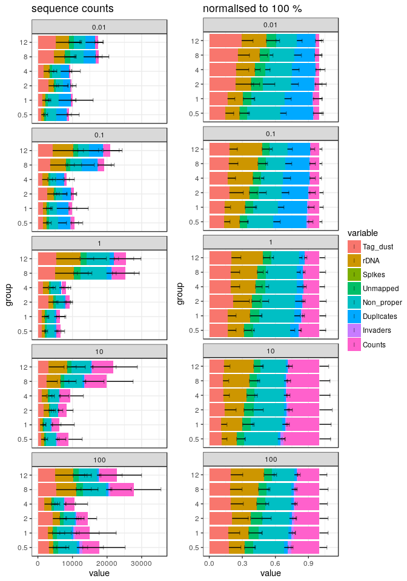

Experiment 4
============

Here, we moved or replaced the contents of row B of the TSO source plate, to
better understand why this row produces lower values regardless the
TSO concentration.

The reverse-transcriptase was SuperScript III.

Load R packages
===============


```r
library("CAGEr")
library("ggplot2")
library("magrittr")
library("MultiAssayExperiment")
library("SummarizedExperiment")
```

MOIRAI shortcuts


```r
MISEQ_RUN      <- "180326_M00528_0346_000000000-B4GJR"
WORKFLOW       <- "OP-WORKFLOW-CAGEscan-short-reads-v2.1~rc1"
MOIRAI_STAMP   <- "20180329132046"
MOIRAI_PROJ    <- "project/Labcyte" 
MOIRAI_USER    <- "nanoCAGE2" 
ASSEMBLY       <- "mm9"
BASEDIR        <- "/osc-fs_home/scratch/moirai"
MOIRAI_BASE    <- file.path(BASEDIR, MOIRAI_USER)
MOIRAI_RESULTS <- file.path(MOIRAI_BASE, MOIRAI_PROJ, paste(MISEQ_RUN, WORKFLOW, MOIRAI_STAMP, sep = "."))
```

Load CAGE libraries
===================

Load summary statistics from MOIRAI and polish the names
--------------------------------------------------------


```r
ce <- smallCAGEqc::loadMoiraiStats(
  pipeline  = WORKFLOW,
  multiplex = file.path( MOIRAI_BASE, "input", paste0(MISEQ_RUN, ".multiplex.txt")),
  summary   = file.path( MOIRAI_RESULTS, "text", "summary.txt")) %>% DataFrame

ce$inputFiles <- paste0(MOIRAI_RESULTS, "/CAGEscan_fragments/", ce$samplename, ".bed")

# Discard lines for which input files do not exist.
ce <- ce[sapply(ce$inputFiles, file.exists),]

# Discard lines for which input files are empty.
ce <- ce[file.info(ce$inputFiles)$size != 0,]

ce$inputFilesType <- c("bed")
ce$sampleLabels <- as.character(ce$samplename)

# Replace indexes in group names by RNA amounts extracted from sample sheet.
levels(ce$group) <- system("cut -f 6,8 -d , 180326_M00528_0346_000000000-B4GJR.SampleSheet.csv | grep g_ | sort | cut -f2 -d, | cut -f1 -d_", intern = TRUE)

# Sort the levels by RNA amount
ce$group %<>% factor(levels = c("100ng", "10ng", "1ng", "100pg", "10pg"))

ce$repl <- ce$index
levels(ce$repl) <- system("cut -f 6,8 -d , 180326_M00528_0346_000000000-B4GJR.SampleSheet.csv | grep g_ | sort | cut -f2 -d, | cut -f2 -d_ | cut -c1", intern = TRUE)
ce$repl %<>% factor(levels = 1:2)

# Define plate IDs
ce$plateID <- ce$repl
levels(ce$plateID) <- c("K", "L")

rownames(ce) %<>% paste(ce$plateID, sep = "_")
ce$sampleLabels <- rownames(ce)

ce
```

```
## DataFrame with 668 rows and 18 columns
##                        samplename    group  barcode    index     total
##                          <factor> <factor> <factor> <factor> <numeric>
## ACACAG_TAAGGCGA_K ACACAG_TAAGGCGA    100ng   ACACAG TAAGGCGA         0
## ACACGT_TAAGGCGA_K ACACGT_TAAGGCGA    100ng   ACACGT TAAGGCGA         0
## ACACTC_TAAGGCGA_K ACACTC_TAAGGCGA    100ng   ACACTC TAAGGCGA         0
## ACAGAT_TAAGGCGA_K ACAGAT_TAAGGCGA    100ng   ACAGAT TAAGGCGA         0
## ACAGCA_TAAGGCGA_K ACAGCA_TAAGGCGA    100ng   ACAGCA TAAGGCGA         0
## ...                           ...      ...      ...      ...       ...
## GCTATA_GTAGAGGA_L GCTATA_GTAGAGGA     10pg   GCTATA GTAGAGGA         0
## GCTCAG_GTAGAGGA_L GCTCAG_GTAGAGGA     10pg   GCTCAG GTAGAGGA         0
## GCTCGT_GTAGAGGA_L GCTCGT_GTAGAGGA     10pg   GCTCGT GTAGAGGA         0
## GCTCTC_GTAGAGGA_L GCTCTC_GTAGAGGA     10pg   GCTCTC GTAGAGGA         0
## GCTGAT_GTAGAGGA_L GCTGAT_GTAGAGGA     10pg   GCTGAT GTAGAGGA         0
##                   extracted   cleaned   tagdust      rdna    spikes
##                   <numeric> <numeric> <numeric> <numeric> <numeric>
## ACACAG_TAAGGCGA_K      4751      3221      1386       141         3
## ACACGT_TAAGGCGA_K      8872      5748      2447       674         3
## ACACTC_TAAGGCGA_K     32377     20803      9230      2340         4
## ACAGAT_TAAGGCGA_K     24688     15848      7000      1835         5
## ACAGCA_TAAGGCGA_K     32417     19252      9406      3745        14
## ...                     ...       ...       ...       ...       ...
## GCTATA_GTAGAGGA_L       173       104        66         3         0
## GCTCAG_GTAGAGGA_L       848       422       398        28         0
## GCTCGT_GTAGAGGA_L       977       390       576        11         0
## GCTCTC_GTAGAGGA_L      1143       443       686        14         0
## GCTGAT_GTAGAGGA_L      5007      1521      3388        97         1
##                      mapped properpairs    counts
##                   <numeric>   <numeric> <numeric>
## ACACAG_TAAGGCGA_K      2701        1427      1283
## ACACGT_TAAGGCGA_K      4853        2528      2298
## ACACTC_TAAGGCGA_K     17622        9218      8314
## ACAGAT_TAAGGCGA_K     13332        7099      6411
## ACAGCA_TAAGGCGA_K     16163        8386      7600
## ...                     ...         ...       ...
## GCTATA_GTAGAGGA_L        55          38        25
## GCTCAG_GTAGAGGA_L       278         123        87
## GCTCGT_GTAGAGGA_L       151          70        24
## GCTCTC_GTAGAGGA_L       189          80        26
## GCTGAT_GTAGAGGA_L       499         212       182
##                                                                                                                                                                                                 inputFiles
##                                                                                                                                                                                                <character>
## ACACAG_TAAGGCGA_K /osc-fs_home/scratch/moirai/nanoCAGE2/project/Labcyte/180326_M00528_0346_000000000-B4GJR.OP-WORKFLOW-CAGEscan-short-reads-v2.1~rc1.20180329132046/CAGEscan_fragments/ACACAG_TAAGGCGA.bed
## ACACGT_TAAGGCGA_K /osc-fs_home/scratch/moirai/nanoCAGE2/project/Labcyte/180326_M00528_0346_000000000-B4GJR.OP-WORKFLOW-CAGEscan-short-reads-v2.1~rc1.20180329132046/CAGEscan_fragments/ACACGT_TAAGGCGA.bed
## ACACTC_TAAGGCGA_K /osc-fs_home/scratch/moirai/nanoCAGE2/project/Labcyte/180326_M00528_0346_000000000-B4GJR.OP-WORKFLOW-CAGEscan-short-reads-v2.1~rc1.20180329132046/CAGEscan_fragments/ACACTC_TAAGGCGA.bed
## ACAGAT_TAAGGCGA_K /osc-fs_home/scratch/moirai/nanoCAGE2/project/Labcyte/180326_M00528_0346_000000000-B4GJR.OP-WORKFLOW-CAGEscan-short-reads-v2.1~rc1.20180329132046/CAGEscan_fragments/ACAGAT_TAAGGCGA.bed
## ACAGCA_TAAGGCGA_K /osc-fs_home/scratch/moirai/nanoCAGE2/project/Labcyte/180326_M00528_0346_000000000-B4GJR.OP-WORKFLOW-CAGEscan-short-reads-v2.1~rc1.20180329132046/CAGEscan_fragments/ACAGCA_TAAGGCGA.bed
## ...                                                                                                                                                                                                    ...
## GCTATA_GTAGAGGA_L /osc-fs_home/scratch/moirai/nanoCAGE2/project/Labcyte/180326_M00528_0346_000000000-B4GJR.OP-WORKFLOW-CAGEscan-short-reads-v2.1~rc1.20180329132046/CAGEscan_fragments/GCTATA_GTAGAGGA.bed
## GCTCAG_GTAGAGGA_L /osc-fs_home/scratch/moirai/nanoCAGE2/project/Labcyte/180326_M00528_0346_000000000-B4GJR.OP-WORKFLOW-CAGEscan-short-reads-v2.1~rc1.20180329132046/CAGEscan_fragments/GCTCAG_GTAGAGGA.bed
## GCTCGT_GTAGAGGA_L /osc-fs_home/scratch/moirai/nanoCAGE2/project/Labcyte/180326_M00528_0346_000000000-B4GJR.OP-WORKFLOW-CAGEscan-short-reads-v2.1~rc1.20180329132046/CAGEscan_fragments/GCTCGT_GTAGAGGA.bed
## GCTCTC_GTAGAGGA_L /osc-fs_home/scratch/moirai/nanoCAGE2/project/Labcyte/180326_M00528_0346_000000000-B4GJR.OP-WORKFLOW-CAGEscan-short-reads-v2.1~rc1.20180329132046/CAGEscan_fragments/GCTCTC_GTAGAGGA.bed
## GCTGAT_GTAGAGGA_L /osc-fs_home/scratch/moirai/nanoCAGE2/project/Labcyte/180326_M00528_0346_000000000-B4GJR.OP-WORKFLOW-CAGEscan-short-reads-v2.1~rc1.20180329132046/CAGEscan_fragments/GCTGAT_GTAGAGGA.bed
##                   inputFilesType      sampleLabels     repl  plateID
##                      <character>       <character> <factor> <factor>
## ACACAG_TAAGGCGA_K            bed ACACAG_TAAGGCGA_K        1        K
## ACACGT_TAAGGCGA_K            bed ACACGT_TAAGGCGA_K        1        K
## ACACTC_TAAGGCGA_K            bed ACACTC_TAAGGCGA_K        1        K
## ACAGAT_TAAGGCGA_K            bed ACAGAT_TAAGGCGA_K        1        K
## ACAGCA_TAAGGCGA_K            bed ACAGCA_TAAGGCGA_K        1        K
## ...                          ...               ...      ...      ...
## GCTATA_GTAGAGGA_L            bed GCTATA_GTAGAGGA_L        2        L
## GCTCAG_GTAGAGGA_L            bed GCTCAG_GTAGAGGA_L        2        L
## GCTCGT_GTAGAGGA_L            bed GCTCGT_GTAGAGGA_L        2        L
## GCTCTC_GTAGAGGA_L            bed GCTCTC_GTAGAGGA_L        2        L
## GCTGAT_GTAGAGGA_L            bed GCTGAT_GTAGAGGA_L        2        L
```


Load plate design
-----------------

Using plate 2 design, see [Labcyte-RT2.md](Labcyte-RT2.md).

```r
plate2 <- read.table("plate2.txt", sep = "\t", header = TRUE)
plate3 <- read.table("plate3.txt", sep = "\t", header = TRUE)
plate  <- rbind(plate2, plate3)
plate  <- plate[!duplicated(plate),]

ce %<>% cbind(plate[match( paste(ce$barcode, ce$group)
                         , paste(plate$BARCODE_SEQ, plate$RNA_group)), ])
rm(plate, plate2, plate3)
```


Create a CAGEexp object and load expression data
------------------------------------------------


```r
getCTSS(ce, useMulticore = TRUE)
removeStrandInvaders(ce)
```

```
## Loading required namespace: BSgenome.Mmusculus.UCSC.mm9
```


Save the CAGEexp file
---------------------


```r
saveRDS(ce, "Labcyte-RT_Data_Analysis_4.Rds")
```


Quality controls
================

Custom _scopes_ displaying _strand invasion_ artefacts.


```r
msScope_qcSI <- function(libs) {
  libs$Tag_dust     <- libs$extracted   - libs$rdna - libs$spikes - libs$cleaned
  libs$rDNA         <- libs$rdna
  libs$Spikes       <- libs$spikes
  libs$Unmapped     <- libs$cleaned     - libs$mapped
  libs$Non_proper   <- libs$mapped      - libs$properpairs
  libs$Duplicates   <- libs$properpairs - libs$librarySizes - libs$strandInvaders
  libs$Invaders     <- libs$strandInvaders
  libs$Counts       <- libs$librarySizes
  list( libs    = libs
      , columns = c( "Tag_dust", "rDNA", "Spikes", "Unmapped"
                   , "Non_proper", "Duplicates", "Invaders", "Counts")
      , total   = libs$extracted)
}

msScope_counts <- function(libs) {
  libs$Promoter   <- libs$promoter
  libs$Exon       <- libs$exon
  libs$Intron     <- libs$intron
  libs$Intergenic <- libs$librarySizes - libs$promoter - libs$intron - libs$exon
  libs$Invaders   <- libs$strandInvaders
  list( libs    = libs
      , columns = c("Promoter", "Exon", "Intron", "Intergenic", "Invaders")
      , total   = libs$librarySizes + libs$strandInvaders)
}
```

By RNA input
------------

 * Negative controls with no RNA gave much less sequences than the regula
   samples with RNA.
   
 * The fraction of unmapped reads is larger in RNA negative controls. This might
   suggest that they originate from low-quality sequences that are erroneously
   demultiplexed.
   
 * The amount of oligonucleotide artefacts ("tag dust") is much larger in
   plate _K_.
   
 * The fraction of PCR duplicates increases as the number of counts decreases.
   This is expected and is utilised in CAGEscan assembly.
   
 * The number of non-proper alignments is still quite large.


```r
ggpubr::ggarrange(
  plotAnnot( ce, scope = msScope_qcSI, group = "plateID", normalise = FALSE
           , title = "sequence counts"
           , facet="RNA") +
    facet_wrap(~facet, ncol = 1),
  plotAnnot( ce, scope = msScope_qcSI, group = "plateID", normalise = TRUE
         , title = "normalised to 100 %"
         , facet="RNA") +
  facet_wrap(~facet, ncol = 1),
  legend = "right",
  common.legend = TRUE
)
```

<!-- -->


### Removal of the RNA negative controls

To ease data handling, the negative controls with no RNA are removed.


```r
ce <- ce[,ce$RNA != 0]
```

```
## harmonizing input:
##   removing 70 sampleMap rows with 'colname' not in colnames of experiments
##   removing 70 colData rownames not in sampleMap 'primary'
```


```r
plotAnnot( ce, scope = msScope_qcSI, group = "plateID", normalise = FALSE
         , title = "QC control, by ng of input RNA (sequence counts)"
         , facet="RNA") +
  facet_wrap(~facet, ncol = 1)
```

<!-- -->


By RT primer quantity
---------------------

Strangely, libraries made with no RT primers have a QC profile that is in
continuation with the other libraries.  While presence of reads in negative
controls might again be explained contaminations, the amount of sequences in
the "no RT primer" samples is a bit high for such an explanation.


```r
ggpubr::ggarrange(
  plotAnnot( ce, scope = msScope_qcSI, group = "RT_PRIMERS", normalise = FALSE
           , title = "sequence counts"
           , facet="plateID") +
    facet_wrap(~facet, ncol = 1),
  plotAnnot( ce, scope = msScope_qcSI, group = "RT_PRIMERS", normalise = TRUE
         , title = "normalised to 100 %"
         , facet="plateID") +
  facet_wrap(~facet, ncol = 1),
  legend = "right",
  common.legend = TRUE
)
```

<!-- -->

Larger amounts of TSO coincides with larger amount of reads in the RT primer
negative control


```r
 plotAnnot( ce[,ce$RT_PRIMERS == 0], scope = msScope_qcSI, group = "TSO", normalise = FALSE
           , title = "sequence counts in RT primer negative controls."
           , facet="plateID") 
```

```
## harmonizing input:
##   removing 509 sampleMap rows with 'colname' not in colnames of experiments
##   removing 509 colData rownames not in sampleMap 'primary'
```

<!-- -->


### Removal of the primer-negative controls

To ease data handling (for instance when working with primer ratios), the
negative controls with no primers are removed.


```r
ce <- ce[,ce$RT_PRIMERS != 0]
```

```
## harmonizing input:
##   removing 89 sampleMap rows with 'colname' not in colnames of experiments
##   removing 89 colData rownames not in sampleMap 'primary'
```

Lets tidy the primer ratios after the null primer concentrations were removed.


```r
ce$PRIMERS_RATIO %<>% droplevels
levels(ce$PRIMERS_RATIO) %<>% as.numeric %>% signif(2) %>% as.character
ce$PRIMERS_RATIO %<>% factor(levels = levels(ce$PRIMERS_RATIO) %>% gtools::mixedsort())
```


```r
ggpubr::ggarrange(
  plotAnnot( ce, scope = msScope_qcSI, group = "RT_PRIMERS", normalise = FALSE
           , title = "sequence counts"
           , facet="plateID") +
    facet_wrap(~facet, nrow = 1),
  plotAnnot( ce, scope = msScope_qcSI, group = "RT_PRIMERS", normalise = TRUE
         , title = "normalised to 100 %"
         , facet="plateID") +
  facet_wrap(~facet, nrow = 1),
  legend = "right",
  common.legend = TRUE
)
```

<!-- -->

rRNA is reduced and non-proper alignments increase as the concentration of
RT primers is lowered.


By TSO concentration
--------------------

Replacing the TSOs in the "B" row (plate _L_) solved the problem of low yield,
compared with just moving them to a different row (plate _K_).


```r
ggpubr::ggarrange(
  plotAnnot( ce, scope = msScope_qcSI, group = "TSO", normalise = FALSE
           , title = "sequence counts"
           , facet="plateID") +
    facet_wrap(~facet, nrow = 1),
  plotAnnot( ce, scope = msScope_qcSI, group = "TSO", normalise = TRUE
         , title = "normalised to 100 %"
         , facet="plateID") +
  facet_wrap(~facet, nrow = 1),
  legend = "right",
  common.legend = TRUE
)
```

<!-- -->


Annotation with GENCODE
-----------------------

Collect Gencode annotations and gene symbols via a local GENCODE file
(mm9 gencode not available in AnnotationHub)

Most pairs align in intergenic regions.  Is it because of the sequence error
combined with very short read 1s ?


```r
annotateCTSS(ce, rtracklayer::import.gff("/osc-fs_home/scratch/gmtu/annotation/mus_musculus/gencode-M1/gencode.vM1.annotation.gtf.gz"))
```


```r
ggpubr::ggarrange(
  plotAnnot( ce, scope = msScope_counts, group = "plateID", normalise = FALSE
           , title = "sequence counts"
           , facet="group") +
    facet_wrap(~facet, ncol = 1),
  plotAnnot( ce, scope = msScope_counts, group = "plateID", normalise = TRUE
         , title = "normalised to 100 %"
         , facet="group") +
  facet_wrap(~facet, ncol = 1),
  legend = "right",
  common.legend = TRUE
)
```

<!-- -->


Other analyses
==============

RT_PRIMER concentration, facetted by RNA mass
---------------------------------------------


```r
ggpubr::ggarrange(
  plotAnnot( ce, scope = msScope_qcSI, group = "RT_PRIMERS", normalise = FALSE
           , title = "sequence counts"
           , facet="RNA") +
    facet_wrap(~facet, ncol = 1),
  plotAnnot( ce, scope = msScope_qcSI, group = "RT_PRIMERS", normalise = TRUE
         , title = "normalised to 100 %"
         , facet="RNA") +
  facet_wrap(~facet, ncol = 1),
  legend = "right",
  common.legend = TRUE
)
```

<!-- -->

TSO concentration, facetted by RNA mass
---------------------------------------------

### Plate K


```r
ggpubr::ggarrange(
  plotAnnot( ce[,ce$plateID == "K"], scope = msScope_qcSI, group = "TSO", normalise = FALSE
           , title = "sequence counts"
           , facet="RNA") +
    facet_wrap(~facet, ncol = 1),
  plotAnnot( ce[,ce$plateID == "K"], scope = msScope_qcSI, group = "TSO", normalise = TRUE
         , title = "normalised to 100 %"
         , facet="RNA") +
  facet_wrap(~facet, ncol = 1),
  legend = "right",
  common.legend = TRUE
)
```

```
## harmonizing input:
##   removing 245 sampleMap rows with 'colname' not in colnames of experiments
##   removing 245 colData rownames not in sampleMap 'primary'
## harmonizing input:
##   removing 245 sampleMap rows with 'colname' not in colnames of experiments
##   removing 245 colData rownames not in sampleMap 'primary'
```

<!-- -->

### Plate L


```r
ggpubr::ggarrange(
  plotAnnot( ce[,ce$plateID == "L"], scope = msScope_qcSI, group = "TSO", normalise = FALSE
           , title = "sequence counts"
           , facet="RNA") +
    facet_wrap(~facet, ncol = 1),
  plotAnnot( ce[,ce$plateID == "L"], scope = msScope_qcSI, group = "TSO", normalise = TRUE
         , title = "normalised to 100 %"
         , facet="RNA") +
  facet_wrap(~facet, ncol = 1),
  legend = "right",
  common.legend = TRUE
)
```

```
## harmonizing input:
##   removing 264 sampleMap rows with 'colname' not in colnames of experiments
##   removing 264 colData rownames not in sampleMap 'primary'
## harmonizing input:
##   removing 264 sampleMap rows with 'colname' not in colnames of experiments
##   removing 264 colData rownames not in sampleMap 'primary'
```

```
## Warning: Removed 40 rows containing missing values (geom_segment).
```

```
## Warning: Removed 40 rows containing missing values (geom_point).
```

```
## Warning: Removed 40 rows containing missing values (geom_segment).
```

```
## Warning: Removed 40 rows containing missing values (geom_point).
```

```
## Warning: Removed 40 rows containing missing values (geom_segment).
```

```
## Warning: Removed 40 rows containing missing values (geom_point).
```

<!-- -->

Session information
===================


```r
sessionInfo()
```

```
## R version 3.4.3 (2017-11-30)
## Platform: x86_64-pc-linux-gnu (64-bit)
## Running under: Debian GNU/Linux 9 (stretch)
## 
## Matrix products: default
## BLAS: /usr/lib/libblas/libblas.so.3.7.0
## LAPACK: /usr/lib/lapack/liblapack.so.3.7.0
## 
## locale:
##  [1] LC_CTYPE=en_GB.UTF-8       LC_NUMERIC=C              
##  [3] LC_TIME=en_GB.UTF-8        LC_COLLATE=en_GB.UTF-8    
##  [5] LC_MONETARY=en_GB.UTF-8    LC_MESSAGES=en_GB.UTF-8   
##  [7] LC_PAPER=en_GB.UTF-8       LC_NAME=C                 
##  [9] LC_ADDRESS=C               LC_TELEPHONE=C            
## [11] LC_MEASUREMENT=en_GB.UTF-8 LC_IDENTIFICATION=C       
## 
## attached base packages:
## [1] parallel  stats4    stats     graphics  grDevices utils     datasets 
## [8] methods   base     
## 
## other attached packages:
##  [1] SummarizedExperiment_1.9.14 DelayedArray_0.4.1         
##  [3] matrixStats_0.52.2          Biobase_2.38.0             
##  [5] GenomicRanges_1.31.19       GenomeInfoDb_1.15.5        
##  [7] IRanges_2.13.26             S4Vectors_0.17.32          
##  [9] BiocGenerics_0.25.3         MultiAssayExperiment_1.5.41
## [11] magrittr_1.5                ggplot2_2.2.1              
## [13] CAGEr_1.21.5.1             
## 
## loaded via a namespace (and not attached):
##  [1] nlme_3.1-131                      bitops_1.0-6                     
##  [3] RColorBrewer_1.1-2                rprojroot_1.2                    
##  [5] tools_3.4.3                       backports_1.1.1                  
##  [7] R6_2.2.2                          vegan_2.4-5                      
##  [9] platetools_0.0.2                  KernSmooth_2.23-15               
## [11] lazyeval_0.2.1                    mgcv_1.8-22                      
## [13] colorspace_1.3-2                  permute_0.9-4                    
## [15] gridExtra_2.3                     compiler_3.4.3                   
## [17] VennDiagram_1.6.18                rtracklayer_1.39.9               
## [19] labeling_0.3                      scales_0.5.0                     
## [21] stringr_1.2.0                     digest_0.6.12                    
## [23] Rsamtools_1.31.3                  rmarkdown_1.8                    
## [25] stringdist_0.9.4.6                XVector_0.19.8                   
## [27] pkgconfig_2.0.1                   htmltools_0.3.6                  
## [29] BSgenome_1.47.5                   rlang_0.1.4                      
## [31] VGAM_1.0-4                        bindr_0.1                        
## [33] BiocParallel_1.12.0               gtools_3.5.0                     
## [35] dplyr_0.7.4                       RCurl_1.95-4.10                  
## [37] GenomeInfoDbData_0.99.1           futile.logger_1.4.3              
## [39] smallCAGEqc_0.12.2.999999         Matrix_1.2-12                    
## [41] Rcpp_0.12.14                      munsell_0.4.3                    
## [43] stringi_1.1.6                     yaml_2.1.15                      
## [45] MASS_7.3-47                       zlibbioc_1.24.0                  
## [47] plyr_1.8.4                        grid_3.4.3                       
## [49] gdata_2.18.0                      lattice_0.20-35                  
## [51] Biostrings_2.47.9                 cowplot_0.9.2                    
## [53] splines_3.4.3                     knitr_1.17                       
## [55] beanplot_1.2                      ggpubr_0.1.6                     
## [57] reshape2_1.4.2                    codetools_0.2-15                 
## [59] futile.options_1.0.0              XML_3.98-1.9                     
## [61] glue_1.2.0                        evaluate_0.10.1                  
## [63] lambda.r_1.2                      data.table_1.10.4-3              
## [65] gtable_0.2.0                      BSgenome.Mmusculus.UCSC.mm9_1.4.0
## [67] purrr_0.2.4                       tidyr_0.7.2                      
## [69] reshape_0.8.7                     assertthat_0.2.0                 
## [71] tibble_1.3.4                      som_0.3-5.1                      
## [73] GenomicAlignments_1.15.12         memoise_1.1.0                    
## [75] bindrcpp_0.2                      cluster_2.0.6
```
