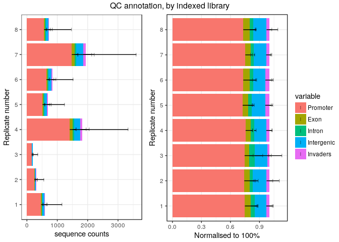

Experiment 5
============

Here, we randomised TSO positions 8 times, to see if there was a TSO-specific
bias on the reaction yields.  The bias could be caused either by the barcode
sequence or by the synthesis reaction (we have only one synthesis batch, hence
these two factors are conflated).

The reverse-transcriptase was SuperScript III.

Load R packages
===============


```r
library("CAGEr")
library("ggplot2")
library("magrittr")
library("MultiAssayExperiment")
library("SummarizedExperiment")
```

MOIRAI shortcuts


```r
MISEQ_RUN      <- "180411_M00528_0351_000000000-BN3BL"
WORKFLOW       <- "OP-WORKFLOW-CAGEscan-short-reads-v2.1.1"
MOIRAI_STAMP   <- "20180412055135"
MOIRAI_PROJ    <- "project/Labcyte" 
MOIRAI_USER    <- "nanoCAGE2" 
ASSEMBLY       <- "mm9"
BASEDIR        <- "/osc-fs_home/scratch/moirai"
MOIRAI_BASE    <- file.path(BASEDIR, MOIRAI_USER)
MOIRAI_RESULTS <- file.path(MOIRAI_BASE, MOIRAI_PROJ, paste(MISEQ_RUN, WORKFLOW, MOIRAI_STAMP, sep = "."))
```

Load CAGE libraries
===================

Load summary statistics from MOIRAI and polish the names
--------------------------------------------------------


```r
ce <- smallCAGEqc::loadMoiraiStats(
  pipeline  = WORKFLOW,
  multiplex = file.path( MOIRAI_BASE, "input", paste0(MISEQ_RUN, ".multiplex.txt")),
  summary   = file.path( MOIRAI_RESULTS, "text", "summary.txt")) %>% DataFrame

ce$inputFiles <- paste0(MOIRAI_RESULTS, "/CAGEscan_fragments/", ce$samplename, ".bed")

# Discard lines for which input files do not exist.
ce <- ce[sapply(ce$inputFiles, file.exists),]

# Discard lines for which input files are empty.
ce <- ce[file.info(ce$inputFiles)$size != 0,]

ce$inputFilesType <- c("bed")
ce$sampleLabels <- as.character(ce$samplename)

# Replace indexes in group names by RNA amounts extracted from sample sheet.
levels(ce$group) <- system("cut -f 6,8 -d , 180411_M00528_0351_000000000-BN3BL.SampleSheet.csv | grep y_ | sort | cut -f2 -d, | sed -E 's/\r//'", intern = TRUE)

ce$repl <- ce$index
levels(ce$repl) <- system("cut -f 6,8 -d , 180411_M00528_0351_000000000-BN3BL.SampleSheet.csv | grep y_ | sort | cut -f2 -d, | cut -f2 -d_ | sed -E 's/\r//'", intern = TRUE)
ce$repl %<>% factor(levels = 1:8)

# Define plate IDs
ce$plateID <- ce$repl
levels(ce$plateID) <- c(rep("M", 4), rep("N", 4))

rownames(ce) %<>% paste(ce$plateID, sep = "_")
ce$sampleLabels <- rownames(ce)

ce
```

```
## DataFrame with 758 rows and 18 columns
##                        samplename     group  barcode    index     total
##                          <factor>  <factor> <factor> <factor> <numeric>
## ACACAG_TAAGGCGA_M ACACAG_TAAGGCGA library_1   ACACAG TAAGGCGA         0
## ACACGT_TAAGGCGA_M ACACGT_TAAGGCGA library_1   ACACGT TAAGGCGA         0
## ACACTC_TAAGGCGA_M ACACTC_TAAGGCGA library_1   ACACTC TAAGGCGA         0
## ACAGAT_TAAGGCGA_M ACAGAT_TAAGGCGA library_1   ACAGAT TAAGGCGA         0
## ACAGCA_TAAGGCGA_M ACAGCA_TAAGGCGA library_1   ACAGCA TAAGGCGA         0
## ...                           ...       ...      ...      ...       ...
## TCGAGC_CGAGGCTG_N TCGAGC_CGAGGCTG library_8   TCGAGC CGAGGCTG         0
## TCGATA_CGAGGCTG_N TCGATA_CGAGGCTG library_8   TCGATA CGAGGCTG         0
## TCGCAG_CGAGGCTG_N TCGCAG_CGAGGCTG library_8   TCGCAG CGAGGCTG         0
## TCGCGT_CGAGGCTG_N TCGCGT_CGAGGCTG library_8   TCGCGT CGAGGCTG         0
## TCGCTC_CGAGGCTG_N TCGCTC_CGAGGCTG library_8   TCGCTC CGAGGCTG         0
##                   extracted   cleaned   tagdust      rdna    spikes
##                   <numeric> <numeric> <numeric> <numeric> <numeric>
## ACACAG_TAAGGCGA_M      6081      4646       154      1281         0
## ACACGT_TAAGGCGA_M      6607      4811       121      1673         2
## ACACTC_TAAGGCGA_M      7562      5706       184      1667         5
## ACAGAT_TAAGGCGA_M      6939      5202       157      1578         2
## ACAGCA_TAAGGCGA_M      7232      5656       163      1411         2
## ...                     ...       ...       ...       ...       ...
## TCGAGC_CGAGGCTG_N      3572      2523        92       955         2
## TCGATA_CGAGGCTG_N      3204      2108        89      1005         2
## TCGCAG_CGAGGCTG_N     13124      8248       386      4487         3
## TCGCGT_CGAGGCTG_N     15949     10916       376      4652         5
## TCGCTC_CGAGGCTG_N      7924      5241       203      2478         2
##                      mapped properpairs    counts
##                   <numeric>   <numeric> <numeric>
## ACACAG_TAAGGCGA_M      4448         483       424
## ACACGT_TAAGGCGA_M      4676         576       492
## ACACTC_TAAGGCGA_M      5409         619       560
## ACAGAT_TAAGGCGA_M      4956         588       509
## ACAGCA_TAAGGCGA_M      5445         604       532
## ...                     ...         ...       ...
## TCGAGC_CGAGGCTG_N      2406         250       206
## TCGATA_CGAGGCTG_N      1943         227       182
## TCGCAG_CGAGGCTG_N      7727         866       701
## TCGCGT_CGAGGCTG_N     10405        1172       937
## TCGCTC_CGAGGCTG_N      4927         524       432
##                                                                                                                                                                                               inputFiles
##                                                                                                                                                                                              <character>
## ACACAG_TAAGGCGA_M /osc-fs_home/scratch/moirai/nanoCAGE2/project/Labcyte/180411_M00528_0351_000000000-BN3BL.OP-WORKFLOW-CAGEscan-short-reads-v2.1.1.20180412055135/CAGEscan_fragments/ACACAG_TAAGGCGA.bed
## ACACGT_TAAGGCGA_M /osc-fs_home/scratch/moirai/nanoCAGE2/project/Labcyte/180411_M00528_0351_000000000-BN3BL.OP-WORKFLOW-CAGEscan-short-reads-v2.1.1.20180412055135/CAGEscan_fragments/ACACGT_TAAGGCGA.bed
## ACACTC_TAAGGCGA_M /osc-fs_home/scratch/moirai/nanoCAGE2/project/Labcyte/180411_M00528_0351_000000000-BN3BL.OP-WORKFLOW-CAGEscan-short-reads-v2.1.1.20180412055135/CAGEscan_fragments/ACACTC_TAAGGCGA.bed
## ACAGAT_TAAGGCGA_M /osc-fs_home/scratch/moirai/nanoCAGE2/project/Labcyte/180411_M00528_0351_000000000-BN3BL.OP-WORKFLOW-CAGEscan-short-reads-v2.1.1.20180412055135/CAGEscan_fragments/ACAGAT_TAAGGCGA.bed
## ACAGCA_TAAGGCGA_M /osc-fs_home/scratch/moirai/nanoCAGE2/project/Labcyte/180411_M00528_0351_000000000-BN3BL.OP-WORKFLOW-CAGEscan-short-reads-v2.1.1.20180412055135/CAGEscan_fragments/ACAGCA_TAAGGCGA.bed
## ...                                                                                                                                                                                                  ...
## TCGAGC_CGAGGCTG_N /osc-fs_home/scratch/moirai/nanoCAGE2/project/Labcyte/180411_M00528_0351_000000000-BN3BL.OP-WORKFLOW-CAGEscan-short-reads-v2.1.1.20180412055135/CAGEscan_fragments/TCGAGC_CGAGGCTG.bed
## TCGATA_CGAGGCTG_N /osc-fs_home/scratch/moirai/nanoCAGE2/project/Labcyte/180411_M00528_0351_000000000-BN3BL.OP-WORKFLOW-CAGEscan-short-reads-v2.1.1.20180412055135/CAGEscan_fragments/TCGATA_CGAGGCTG.bed
## TCGCAG_CGAGGCTG_N /osc-fs_home/scratch/moirai/nanoCAGE2/project/Labcyte/180411_M00528_0351_000000000-BN3BL.OP-WORKFLOW-CAGEscan-short-reads-v2.1.1.20180412055135/CAGEscan_fragments/TCGCAG_CGAGGCTG.bed
## TCGCGT_CGAGGCTG_N /osc-fs_home/scratch/moirai/nanoCAGE2/project/Labcyte/180411_M00528_0351_000000000-BN3BL.OP-WORKFLOW-CAGEscan-short-reads-v2.1.1.20180412055135/CAGEscan_fragments/TCGCGT_CGAGGCTG.bed
## TCGCTC_CGAGGCTG_N /osc-fs_home/scratch/moirai/nanoCAGE2/project/Labcyte/180411_M00528_0351_000000000-BN3BL.OP-WORKFLOW-CAGEscan-short-reads-v2.1.1.20180412055135/CAGEscan_fragments/TCGCTC_CGAGGCTG.bed
##                   inputFilesType      sampleLabels     repl  plateID
##                      <character>       <character> <factor> <factor>
## ACACAG_TAAGGCGA_M            bed ACACAG_TAAGGCGA_M        1        M
## ACACGT_TAAGGCGA_M            bed ACACGT_TAAGGCGA_M        1        M
## ACACTC_TAAGGCGA_M            bed ACACTC_TAAGGCGA_M        1        M
## ACAGAT_TAAGGCGA_M            bed ACAGAT_TAAGGCGA_M        1        M
## ACAGCA_TAAGGCGA_M            bed ACAGCA_TAAGGCGA_M        1        M
## ...                          ...               ...      ...      ...
## TCGAGC_CGAGGCTG_N            bed TCGAGC_CGAGGCTG_N        8        N
## TCGATA_CGAGGCTG_N            bed TCGATA_CGAGGCTG_N        8        N
## TCGCAG_CGAGGCTG_N            bed TCGCAG_CGAGGCTG_N        8        N
## TCGCGT_CGAGGCTG_N            bed TCGCGT_CGAGGCTG_N        8        N
## TCGCTC_CGAGGCTG_N            bed TCGCTC_CGAGGCTG_N        8        N
```


Load plate design
-----------------

Using plate 4 and 5 design, see [Labcyte-RT4.md](Labcyte-RT4.md) and 
[Labcyte-RT5.md](Labcyte-RT5.md).


```r
plate4 <- read.table("plate4.txt", sep = "\t", header = TRUE, stringsAsFactors = FALSE)
plate5 <- read.table("plate5.txt", sep = "\t", header = TRUE, stringsAsFactors = FALSE)
plate  <- rbind(plate4, plate5)
plate  <- plate[!duplicated(plate),]

ce %<>% cbind(plate[match( paste(ce$barcode, ce$index)
                         , paste(plate$BARCODE_SEQ, plate$INDEX)), ])
rm(plate, plate4, plate5)
```


Create a CAGEexp object and load expression data
------------------------------------------------


```r
getCTSS(ce, useMulticore = TRUE)
removeStrandInvaders(ce)
```

```
## Loading required namespace: BSgenome.Mmusculus.UCSC.mm9
```


Save the CAGEexp file
---------------------


```r
saveRDS(ce, "Labcyte-RT_Data_Analysis_4.Rds")
```


Quality controls
================

Custom _scopes_ displaying _strand invasion_ artefacts.


```r
msScope_qcSI <- function(libs) {
  libs$Tag_dust     <- libs$extracted   - libs$rdna - libs$spikes - libs$cleaned
  libs$rDNA         <- libs$rdna
  libs$Spikes       <- libs$spikes
  libs$Unmapped     <- libs$cleaned     - libs$mapped
  libs$Non_proper   <- libs$mapped      - libs$properpairs
  libs$Duplicates   <- libs$properpairs - libs$librarySizes - libs$strandInvaders
  libs$Invaders     <- libs$strandInvaders
  libs$Counts       <- libs$librarySizes
  list( libs    = libs
      , columns = c( "Tag_dust", "rDNA", "Spikes", "Unmapped"
                   , "Non_proper", "Duplicates", "Invaders", "Counts")
      , total   = libs$extracted)
}

msScope_counts <- function(libs) {
  libs$Promoter   <- libs$promoter
  libs$Exon       <- libs$exon
  libs$Intron     <- libs$intron
  libs$Intergenic <- libs$librarySizes - libs$promoter - libs$intron - libs$exon
  libs$Invaders   <- libs$strandInvaders
  list( libs    = libs
      , columns = c("Promoter", "Exon", "Intron", "Intergenic", "Invaders")
      , total   = libs$librarySizes + libs$strandInvaders)
}
```


By RNA input
------------


```r
ggpubr::ggarrange( legend = "right", common.legend = TRUE,
  plotAnnot( ce, scope = msScope_qcSI, group = "repl", normalise = FALSE
           , title = "sequence counts"),
  plotAnnot( ce, scope = msScope_qcSI, group = "repl", normalise = TRUE
         , title = "normalised to 100 %")
) %>% ggpubr::annotate_figure(top="QC of processing, by ng of input RNA")
```

<!-- -->


Annotation with GENCODE
-----------------------

Collect Gencode annotations and gene symbols via a local GENCODE file
(mm9 gencode not available in AnnotationHub)

Most pairs align in intergenic regions.  Is it because of the sequence error
combined with very short read 1s ?


```r
annotateCTSS(ce, rtracklayer::import.gff("/osc-fs_home/scratch/gmtu/annotation/mus_musculus/gencode-M1/gencode.vM1.annotation.gtf.gz"))
```


```r
ggpubr::ggarrange( legend = "right", common.legend = TRUE,
  plotAnnot( ce, scope = msScope_counts, group = "repl", normalise = FALSE
           , title = "sequence counts"),
  plotAnnot( ce, scope = msScope_counts, group = "repl", normalise = TRUE
         , title = "normalised to 100 %")
) %>% ggpubr::annotate_figure(top="QC annotation, by ng of input RNA")
```

<!-- -->


Negative controls
-----------------


```r
ce$NC <- ce$TSO_vol == 0

ggpubr::ggarrange( legend = "right", common.legend = TRUE,
  plotAnnot( ce, scope = msScope_qcSI, group = "NC"
           , title = "Sequence counts"
           , facet = "repl", normalise = FALSE) +
    facet_wrap("facet", ncol = 1),
  plotAnnot( ce, scope = msScope_qcSI, group = "NC"
           , title = "Normalised to 100%"
           , facet = "repl", normalise = TRUE) +
    facet_wrap("facet", ncol = 1)
)  %>% ggpubr::annotate_figure(top="QC report, by index and TSO input")
```

<!-- -->

```r
ggpubr::ggarrange( legend = "right", common.legend = TRUE,
  plotAnnot( ce, scope = msScope_counts, group = "NC"
           , title = "Sequence counts"
           , facet = "repl", normalise = FALSE) +
    facet_wrap("facet", ncol = 1),
  plotAnnot( ce, scope = msScope_counts, group = "NC"
           , title = "Normalised to 100%"
           , facet = "repl", normalise = TRUE) +
    facet_wrap("facet", ncol = 1)
)  %>% ggpubr::annotate_figure(top="QC annotation, by index and TSO input")
```

<!-- -->


Barcodes
========


```r
plotAnnot( ce, scope = msScope_qcSI, group = "repl"
           , title = "Sequence counts"
           , facet = "BARCODE_SEQ", normalise = FALSE)
```

```
## Warning: Removed 6064 rows containing missing values (geom_segment).
```

```
## Warning: Removed 6064 rows containing missing values (geom_point).
```

<!-- -->


```r
plotAnnot( ce, scope = msScope_qcSI, group = "repl"
           , title = "Sequence counts"
           , facet = "BARCODE_ID", normalise = FALSE)
```

```
## Warning: Removed 6064 rows containing missing values (geom_segment).
```

```
## Warning: Removed 6064 rows containing missing values (geom_point).
```

<!-- -->


```r
plotAnnot( ce[,!ce$NC], scope = msScope_qcSI, group = "BARCODE_ID"
           , title = "Sequence counts", normalise = FALSE)
```

```
## harmonizing input:
##   removing 93 sampleMap rows with 'colname' not in colnames of experiments
##   removing 93 colData rownames not in sampleMap 'primary'
```

<!-- -->

Session information
===================


```r
sessionInfo()
```

```
## R version 3.4.3 (2017-11-30)
## Platform: x86_64-pc-linux-gnu (64-bit)
## Running under: Debian GNU/Linux 9 (stretch)
## 
## Matrix products: default
## BLAS: /usr/lib/libblas/libblas.so.3.7.0
## LAPACK: /usr/lib/lapack/liblapack.so.3.7.0
## 
## locale:
##  [1] LC_CTYPE=en_GB.UTF-8       LC_NUMERIC=C              
##  [3] LC_TIME=en_GB.UTF-8        LC_COLLATE=en_GB.UTF-8    
##  [5] LC_MONETARY=en_GB.UTF-8    LC_MESSAGES=en_GB.UTF-8   
##  [7] LC_PAPER=en_GB.UTF-8       LC_NAME=C                 
##  [9] LC_ADDRESS=C               LC_TELEPHONE=C            
## [11] LC_MEASUREMENT=en_GB.UTF-8 LC_IDENTIFICATION=C       
## 
## attached base packages:
## [1] parallel  stats4    stats     graphics  grDevices utils     datasets 
## [8] methods   base     
## 
## other attached packages:
##  [1] SummarizedExperiment_1.9.14 DelayedArray_0.4.1         
##  [3] matrixStats_0.52.2          Biobase_2.38.0             
##  [5] GenomicRanges_1.31.19       GenomeInfoDb_1.15.5        
##  [7] IRanges_2.13.26             S4Vectors_0.17.32          
##  [9] BiocGenerics_0.25.3         MultiAssayExperiment_1.5.41
## [11] magrittr_1.5                ggplot2_2.2.1              
## [13] CAGEr_1.21.5.1             
## 
## loaded via a namespace (and not attached):
##  [1] nlme_3.1-131                      bitops_1.0-6                     
##  [3] RColorBrewer_1.1-2                rprojroot_1.3-2                  
##  [5] tools_3.4.3                       backports_1.1.2                  
##  [7] R6_2.2.2                          vegan_2.4-5                      
##  [9] platetools_0.0.2                  KernSmooth_2.23-15               
## [11] lazyeval_0.2.1                    mgcv_1.8-22                      
## [13] colorspace_1.3-2                  permute_0.9-4                    
## [15] gridExtra_2.3                     compiler_3.4.3                   
## [17] VennDiagram_1.6.18                rtracklayer_1.39.9               
## [19] labeling_0.3                      scales_0.5.0                     
## [21] stringr_1.3.0                     digest_0.6.15                    
## [23] Rsamtools_1.31.3                  rmarkdown_1.9                    
## [25] stringdist_0.9.4.6                XVector_0.19.8                   
## [27] pkgconfig_2.0.1                   htmltools_0.3.6                  
## [29] BSgenome_1.47.5                   rlang_0.2.0                      
## [31] VGAM_1.0-4                        bindr_0.1                        
## [33] BiocParallel_1.12.0               gtools_3.5.0                     
## [35] dplyr_0.7.4                       RCurl_1.95-4.10                  
## [37] GenomeInfoDbData_0.99.1           futile.logger_1.4.3              
## [39] smallCAGEqc_0.12.2.999999         Matrix_1.2-12                    
## [41] Rcpp_0.12.16                      munsell_0.4.3                    
## [43] stringi_1.1.7                     yaml_2.1.18                      
## [45] MASS_7.3-47                       zlibbioc_1.24.0                  
## [47] plyr_1.8.4                        grid_3.4.3                       
## [49] gdata_2.18.0                      lattice_0.20-35                  
## [51] Biostrings_2.47.9                 cowplot_0.9.2                    
## [53] splines_3.4.3                     knitr_1.20                       
## [55] beanplot_1.2                      pillar_1.2.1                     
## [57] ggpubr_0.1.6                      reshape2_1.4.2                   
## [59] codetools_0.2-15                  futile.options_1.0.0             
## [61] XML_3.98-1.9                      glue_1.2.0                       
## [63] evaluate_0.10.1                   lambda.r_1.2                     
## [65] data.table_1.10.4-3               gtable_0.2.0                     
## [67] BSgenome.Mmusculus.UCSC.mm9_1.4.0 purrr_0.2.4                      
## [69] tidyr_0.7.2                       reshape_0.8.7                    
## [71] assertthat_0.2.0                  tibble_1.4.2                     
## [73] som_0.3-5.1                       GenomicAlignments_1.15.12        
## [75] memoise_1.1.0                     bindrcpp_0.2                     
## [77] cluster_2.0.6
```
