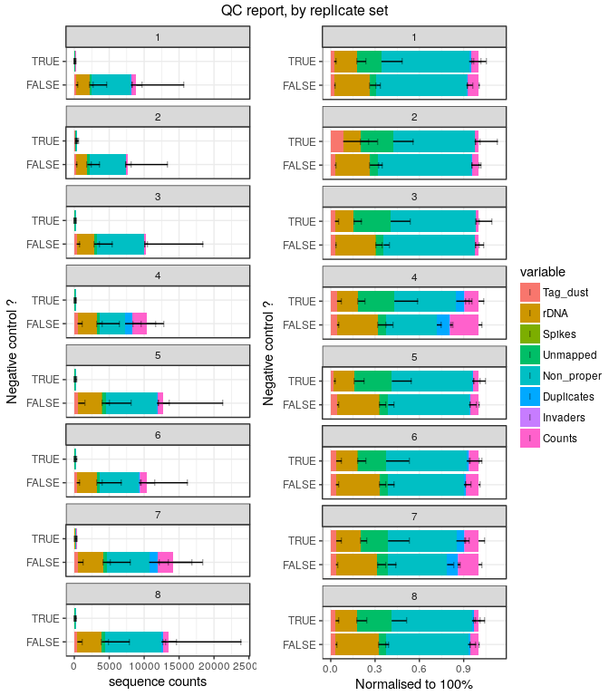
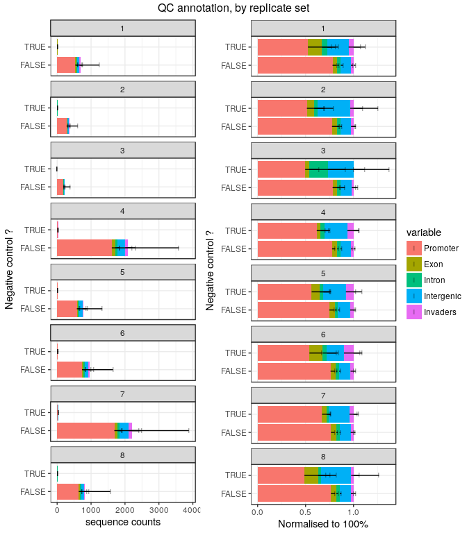
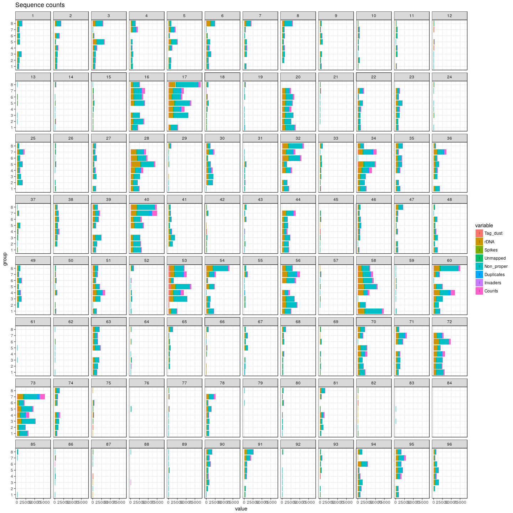

Experiment 5
============

Here, we randomised TSO positions 8 times, to see if there was a TSO-specific
bias on the reaction yields.  The bias could be caused either by the barcode
sequence or by the synthesis reaction (we have only one synthesis batch, hence
these two factors are conflated).

The reverse-transcriptase was SuperScript III.


Load R packages
===============


```r
library("CAGEr")
library("ggplot2")
library("magrittr")
library("MultiAssayExperiment")
library("SummarizedExperiment")
```

MOIRAI shortcuts


```r
MISEQ_RUN      <- "180411_M00528_0351_000000000-BN3BL"
WORKFLOW       <- "OP-WORKFLOW-CAGEscan-short-reads-v2.1.1"
MOIRAI_STAMP   <- "20180412203518"
MOIRAI_PROJ    <- "project/Labcyte" 
MOIRAI_USER    <- "nanoCAGE2" 
ASSEMBLY       <- "mm9"
BASEDIR        <- "/osc-fs_home/scratch/moirai"
MOIRAI_BASE    <- file.path(BASEDIR, MOIRAI_USER)
MOIRAI_RESULTS <- file.path(MOIRAI_BASE, MOIRAI_PROJ, paste(MISEQ_RUN, WORKFLOW, MOIRAI_STAMP, sep = "."))
```

Load CAGE libraries
===================

Load summary statistics from MOIRAI and polish the names
--------------------------------------------------------


```r
ce <- smallCAGEqc::loadMoiraiStats(
  pipeline  = WORKFLOW,
  multiplex = file.path( MOIRAI_BASE, "input", paste0(MISEQ_RUN, ".multiplex.txt")),
  summary   = file.path( MOIRAI_RESULTS, "text", "summary.txt")) %>% DataFrame

ce$inputFiles <- paste0(MOIRAI_RESULTS, "/CAGEscan_fragments/", ce$samplename, ".bed")

# Discard lines for which input files do not exist.
ce <- ce[sapply(ce$inputFiles, file.exists),]

# Discard lines for which input files are empty.
ce <- ce[file.info(ce$inputFiles)$size != 0,]

ce$inputFilesType <- c("bed")
ce$sampleLabels <- as.character(ce$samplename)

# Replace indexes in group names by RNA amounts extracted from sample sheet.
levels(ce$group) <- system("cut -f 6,8 -d , 180411_M00528_0351_000000000-BN3BL.SampleSheet.csv | grep y_ | sort | cut -f2 -d, | sed -E 's/\r//'", intern = TRUE)

ce$repl <- ce$index
levels(ce$repl) <- system("cut -f 6,8 -d , 180411_M00528_0351_000000000-BN3BL.SampleSheet.csv | grep y_ | sort | cut -f2 -d, | cut -f2 -d_ | sed -E 's/\r//'", intern = TRUE)
ce$repl %<>% factor(levels = 1:8)

# Define plate IDs
ce$plateID <- ce$repl
levels(ce$plateID) <- c(rep("M", 4), rep("N", 4))

rownames(ce) %<>% paste(ce$plateID, sep = "_")
ce$sampleLabels <- rownames(ce)

ce
```

```
## DataFrame with 766 rows and 18 columns
##                        samplename     group  barcode    index     total
##                          <factor>  <factor> <factor> <factor> <numeric>
## ACACAG_TAAGGCGA_M ACACAG_TAAGGCGA library_1   ACACAG TAAGGCGA         0
## ACACGT_TAAGGCGA_M ACACGT_TAAGGCGA library_1   ACACGT TAAGGCGA         0
## ACACTC_TAAGGCGA_M ACACTC_TAAGGCGA library_1   ACACTC TAAGGCGA         0
## ACAGAT_TAAGGCGA_M ACAGAT_TAAGGCGA library_1   ACAGAT TAAGGCGA         0
## ACAGCA_TAAGGCGA_M ACAGCA_TAAGGCGA library_1   ACAGCA TAAGGCGA         0
## ...                           ...       ...      ...      ...       ...
## TCGAGC_CGAGGCTG_N TCGAGC_CGAGGCTG library_8   TCGAGC CGAGGCTG         0
## TCGATA_CGAGGCTG_N TCGATA_CGAGGCTG library_8   TCGATA CGAGGCTG         0
## TCGCAG_CGAGGCTG_N TCGCAG_CGAGGCTG library_8   TCGCAG CGAGGCTG         0
## TCGCGT_CGAGGCTG_N TCGCGT_CGAGGCTG library_8   TCGCGT CGAGGCTG         0
## TCGCTC_CGAGGCTG_N TCGCTC_CGAGGCTG library_8   TCGCTC CGAGGCTG         0
##                   extracted   cleaned   tagdust      rdna    spikes
##                   <numeric> <numeric> <numeric> <numeric> <numeric>
## ACACAG_TAAGGCGA_M      6084      4645       155      1284         0
## ACACGT_TAAGGCGA_M      6607      4811       121      1673         2
## ACACTC_TAAGGCGA_M      7575      5719       184      1667         5
## ACAGAT_TAAGGCGA_M      6939      5202       157      1578         2
## ACAGCA_TAAGGCGA_M      7230      5651       163      1414         2
## ...                     ...       ...       ...       ...       ...
## TCGAGC_CGAGGCTG_N      3556      2509        92       953         2
## TCGATA_CGAGGCTG_N      3202      2106        89      1005         2
## TCGCAG_CGAGGCTG_N     13118      8249       386      4480         3
## TCGCGT_CGAGGCTG_N     15962     10927       376      4654         5
## TCGCTC_CGAGGCTG_N      7922      5240       203      2477         2
##                      mapped properpairs    counts
##                   <numeric>   <numeric> <numeric>
## ACACAG_TAAGGCGA_M      4447         483       424
## ACACGT_TAAGGCGA_M      4676         576       492
## ACACTC_TAAGGCGA_M      5416         619       560
## ACAGAT_TAAGGCGA_M      4956         588       509
## ACAGCA_TAAGGCGA_M      5440         603       531
## ...                     ...         ...       ...
## TCGAGC_CGAGGCTG_N      2393         248       205
## TCGATA_CGAGGCTG_N      1943         227       182
## TCGCAG_CGAGGCTG_N      7728         867       702
## TCGCGT_CGAGGCTG_N     10415        1171       935
## TCGCTC_CGAGGCTG_N      4926         524       432
##                                                                                                                                                                                               inputFiles
##                                                                                                                                                                                              <character>
## ACACAG_TAAGGCGA_M /osc-fs_home/scratch/moirai/nanoCAGE2/project/Labcyte/180411_M00528_0351_000000000-BN3BL.OP-WORKFLOW-CAGEscan-short-reads-v2.1.1.20180412203518/CAGEscan_fragments/ACACAG_TAAGGCGA.bed
## ACACGT_TAAGGCGA_M /osc-fs_home/scratch/moirai/nanoCAGE2/project/Labcyte/180411_M00528_0351_000000000-BN3BL.OP-WORKFLOW-CAGEscan-short-reads-v2.1.1.20180412203518/CAGEscan_fragments/ACACGT_TAAGGCGA.bed
## ACACTC_TAAGGCGA_M /osc-fs_home/scratch/moirai/nanoCAGE2/project/Labcyte/180411_M00528_0351_000000000-BN3BL.OP-WORKFLOW-CAGEscan-short-reads-v2.1.1.20180412203518/CAGEscan_fragments/ACACTC_TAAGGCGA.bed
## ACAGAT_TAAGGCGA_M /osc-fs_home/scratch/moirai/nanoCAGE2/project/Labcyte/180411_M00528_0351_000000000-BN3BL.OP-WORKFLOW-CAGEscan-short-reads-v2.1.1.20180412203518/CAGEscan_fragments/ACAGAT_TAAGGCGA.bed
## ACAGCA_TAAGGCGA_M /osc-fs_home/scratch/moirai/nanoCAGE2/project/Labcyte/180411_M00528_0351_000000000-BN3BL.OP-WORKFLOW-CAGEscan-short-reads-v2.1.1.20180412203518/CAGEscan_fragments/ACAGCA_TAAGGCGA.bed
## ...                                                                                                                                                                                                  ...
## TCGAGC_CGAGGCTG_N /osc-fs_home/scratch/moirai/nanoCAGE2/project/Labcyte/180411_M00528_0351_000000000-BN3BL.OP-WORKFLOW-CAGEscan-short-reads-v2.1.1.20180412203518/CAGEscan_fragments/TCGAGC_CGAGGCTG.bed
## TCGATA_CGAGGCTG_N /osc-fs_home/scratch/moirai/nanoCAGE2/project/Labcyte/180411_M00528_0351_000000000-BN3BL.OP-WORKFLOW-CAGEscan-short-reads-v2.1.1.20180412203518/CAGEscan_fragments/TCGATA_CGAGGCTG.bed
## TCGCAG_CGAGGCTG_N /osc-fs_home/scratch/moirai/nanoCAGE2/project/Labcyte/180411_M00528_0351_000000000-BN3BL.OP-WORKFLOW-CAGEscan-short-reads-v2.1.1.20180412203518/CAGEscan_fragments/TCGCAG_CGAGGCTG.bed
## TCGCGT_CGAGGCTG_N /osc-fs_home/scratch/moirai/nanoCAGE2/project/Labcyte/180411_M00528_0351_000000000-BN3BL.OP-WORKFLOW-CAGEscan-short-reads-v2.1.1.20180412203518/CAGEscan_fragments/TCGCGT_CGAGGCTG.bed
## TCGCTC_CGAGGCTG_N /osc-fs_home/scratch/moirai/nanoCAGE2/project/Labcyte/180411_M00528_0351_000000000-BN3BL.OP-WORKFLOW-CAGEscan-short-reads-v2.1.1.20180412203518/CAGEscan_fragments/TCGCTC_CGAGGCTG.bed
##                   inputFilesType      sampleLabels     repl  plateID
##                      <character>       <character> <factor> <factor>
## ACACAG_TAAGGCGA_M            bed ACACAG_TAAGGCGA_M        1        M
## ACACGT_TAAGGCGA_M            bed ACACGT_TAAGGCGA_M        1        M
## ACACTC_TAAGGCGA_M            bed ACACTC_TAAGGCGA_M        1        M
## ACAGAT_TAAGGCGA_M            bed ACAGAT_TAAGGCGA_M        1        M
## ACAGCA_TAAGGCGA_M            bed ACAGCA_TAAGGCGA_M        1        M
## ...                          ...               ...      ...      ...
## TCGAGC_CGAGGCTG_N            bed TCGAGC_CGAGGCTG_N        8        N
## TCGATA_CGAGGCTG_N            bed TCGATA_CGAGGCTG_N        8        N
## TCGCAG_CGAGGCTG_N            bed TCGCAG_CGAGGCTG_N        8        N
## TCGCGT_CGAGGCTG_N            bed TCGCGT_CGAGGCTG_N        8        N
## TCGCTC_CGAGGCTG_N            bed TCGCTC_CGAGGCTG_N        8        N
```


Load plate design
-----------------

Using plate 4 and 5 design, see [Labcyte-RT4](Labcyte-RT4.md) and 
[Labcyte-RT5](Labcyte-RT5.md).


```r
plate4 <- read.table("plate4.txt", sep = "\t", header = TRUE, stringsAsFactors = FALSE)
plate5 <- read.table("plate5.txt", sep = "\t", header = TRUE, stringsAsFactors = FALSE)
plate  <- rbind(plate4, plate5)
plate  <- plate[!duplicated(plate),]

ce %<>% cbind(plate[match( paste(ce$barcode, ce$index)
                         , paste(plate$BARCODE_SEQ, plate$INDEX)), ])
rm(plate, plate4, plate5)
```


Create a CAGEexp object and load expression data
------------------------------------------------


```r
getCTSS(ce, useMulticore = TRUE)
removeStrandInvaders(ce)
```

```
## Loading required namespace: BSgenome.Mmusculus.UCSC.mm9
```


Save the CAGEexp file
---------------------


```r
saveRDS(ce, "Labcyte-RT_Data_Analysis_5.Rds")
```


Annotation with GENCODE
-----------------------

Collect annotations and gene symbols via a local GENCODE file
(mm9 GENCODE not available in AnnotationHub)


```r
annotateCTSS(ce, rtracklayer::import.gff("/osc-fs_home/scratch/gmtu/annotation/mus_musculus/gencode-M1/gencode.vM1.annotation.gtf.gz"))
```

Quality controls
================

Custom _scopes_ displaying _strand invasion_ artefacts.


```r
source("customScopes.R", echo = TRUE)
```

```
## 
## > msScope_qcSI <- function(libs) {
## +     libs$Tag_dust <- libs$extracted - libs$rdna - libs$spikes - 
## +         libs$cleaned
## +     libs$rDNA <- libs$r .... [TRUNCATED] 
## 
## > msScope_counts <- function(libs) {
## +     libs$Promoter <- libs$promoter
## +     libs$Exon <- libs$exon
## +     libs$Intron <- libs$intron
## +     libs$Int .... [TRUNCATED] 
## 
## > msScope_libSizeNormByBarcode <- function(libs) {
## +     libs$Yield <- libs$libSizeNormByBarcode
## +     list(libs = libs, columns = c("Yield"), total = .... [TRUNCATED] 
## 
## > msScope_libSizeNormByIndex <- function(libs) {
## +     libs$Yield <- libs$libSizeNormByIndex
## +     list(libs = libs, columns = c("Yield"), total = lib .... [TRUNCATED] 
## 
## > msScope_libSize <- function(libs) {
## +     libs$Yield <- libs$librarySizes
## +     list(libs = libs, columns = c("Yield"), total = libs$Yield)
## + }
```


By replicate
------------

Replicates 4 and 7 are outliers by their lower amount of non-properly paired
reads.  (Anyway, sequencing quality of second reads was low, so there is
not much to interpret.)


```r
ggpubr::ggarrange( legend = "right", common.legend = TRUE,
  plotAnnot( ce, scope = msScope_qcSI, group = "repl", normalise = FALSE, title = NULL) +
    ylab("sequence counts") + xlab("Replicate number"),
  plotAnnot( ce, scope = msScope_qcSI, group = "repl", normalise = TRUE,  title = NULL) +
    ylab("Normalised to 100%") + xlab("Replicate number")
) %>% ggpubr::annotate_figure(top="QC of processing, by indexed library")
```

<!-- -->


```r
ggpubr::ggarrange( legend = "right", common.legend = TRUE,
  plotAnnot( ce, scope = msScope_counts, group = "repl", normalise = FALSE, title = NULL) +
    ylab("sequence counts") + xlab("Replicate number"),
  plotAnnot( ce, scope = msScope_counts, group = "repl", normalise = TRUE,  title = NULL) +
    ylab("Normalised to 100%") + xlab("Replicate number")
) %>% ggpubr::annotate_figure(top="QC annotation, by indexed library")
```

<!-- -->


Negative controls
-----------------


```r
ce$NC <- ce$TSO_vol == 0

ggpubr::ggarrange( legend = "right", common.legend = TRUE,
  plotAnnot( ce, scope = msScope_qcSI, group = "NC"
           , title = NULL, facet = "repl", normalise = FALSE) +
    facet_wrap("facet", ncol = 1) +
    ylab("sequence counts") + xlab("Negative control ?"),
  plotAnnot( ce, scope = msScope_qcSI, group = "NC"
           , title = NULL, facet = "repl", normalise = TRUE) +
    facet_wrap("facet", ncol = 1) +
    ylab("Normalised to 100%") + xlab("Negative control ?")
)  %>% ggpubr::annotate_figure(top="QC report, by replicate set")
```

<!-- -->

```r
ggpubr::ggarrange( legend = "right", common.legend = TRUE,
  plotAnnot( ce, scope = msScope_counts, group = "NC"
           , title = NULL, facet = "repl", normalise = FALSE) +
    facet_wrap("facet", ncol = 1) +
    ylab("sequence counts") + xlab("Negative control ?"),
  plotAnnot( ce, scope = msScope_counts, group = "NC"
           , title = NULL, facet = "repl", normalise = TRUE) +
    facet_wrap("facet", ncol = 1) +
    ylab("Normalised to 100%") + xlab("Negative control ?")
)  %>% ggpubr::annotate_figure(top="QC annotation, by replicate set")
```

<!-- -->


Barcodes
========


```r
plotAnnot( ce, scope = msScope_qcSI, group = "repl"
           , title = "Sequence counts"
           , facet = "BARCODE_SEQ", normalise = FALSE) +
  facet_wrap(~facet, ncol=12)
```

```
## Warning: Removed 6128 rows containing missing values (geom_segment).
```

```
## Warning: Removed 6128 rows containing missing values (geom_point).
```

<!-- -->


```r
plotAnnot( ce, scope = msScope_qcSI, group = "repl"
           , title = "Sequence counts"
           , facet = "BARCODE_ID", normalise = FALSE) +
  facet_wrap(~facet, ncol=12)
```

```
## Warning: Removed 6128 rows containing missing values (geom_segment).
```

```
## Warning: Removed 6128 rows containing missing values (geom_point).
```

<!-- -->


Normalisation
=============

Let's derive a normalisation factor for each barcode sequence, hoping that it
can correct values from previous experiments.

Not sure if the distribution of library sizes is consistent across replicates.
Maybe using the median would be more appropriate ?


```r
ggplot(colData(ce) %>% data.frame, aes(librarySizes, col = repl)) +
  geom_histogram() +
  facet_wrap(~repl, ncol = 2)
```

```
## `stat_bin()` using `bins = 30`. Pick better value with `binwidth`.
```

<!-- -->


```r
tapply(ce$librarySizes, ce$repl, sum)
```

```
##      1      2      3      4      5      6      7      8 
##  55417  28941  18055 169086  62645  77836 177747  66986
```

```r
indexMean <- tapply(ce$librarySizes, ce$index, mean)
ce$libSizeNormByIndex <- mapply(function(n, index) n / indexMean[index], n = ce$librarySizes, index = ce$index)
bcNormFactors <- tapply(ce$libSizeNormByIndex[!ce$NC], ce$BARCODE_SEQ[!ce$NC], mean)
bcNormFactors <- bcNormFactors / mean(bcNormFactors)
bcNormFactors
```

```
##     ACACAG     ACACGT     ACACTC     ACAGAT     ACAGCA     ACAGTG 
## 0.80911829 0.92197996 1.28531216 0.82585999 1.00700397 0.93871963 
##     ACATAC     ACATCT     ACATGA     AGTACG     AGTAGC     AGTATA 
## 0.68117540 0.91861504 0.48486643 0.35596835 0.35489177 0.13857951 
##     AGTCAG     AGTCGT     AGTCTC     AGTGAT     AGTGCA     AGTGTG 
## 0.11011158 0.16241402 0.23834557 3.48803477 4.92294445 0.34423919 
##     ATCACG     ATCAGC     ATCATA     ATCGAT     ATCGCA     ATCGTG 
## 0.17518324 3.04924092 0.09811387 0.97210417 1.08919552 0.10727396 
##     ATCTAC     ATCTCT     ATCTGA     CACACG     CACAGC     CACATA 
## 1.22115726 0.21427413 0.94882840 3.17756237 0.19398193 1.37294166 
##     CACGAT     CACGCA     CACGTG     CACTAC     CACTCT     CACTGA 
## 0.28957279 2.65454032 0.39137749 2.82901794 1.26529277 1.32177171 
##     CGACAG     CGACGT     CGACTC     CGAGAT     CGAGCA     CGAGTG 
## 0.33561848 0.84919497 1.38671508 4.73877048 0.81548735 0.21923123 
##     CGATAC     CGATCT     CGATGA     CTGACG     CTGAGC     CTGATA 
## 0.28171428 1.82703622 0.16017798 0.59680066 0.64502542 0.73531910 
##     CTGCAG     CTGCGT     CTGCTC     CTGTAC     CTGTCT     CTGTGA 
## 0.80972734 0.32443901 1.62026785 0.28404285 3.54890136 2.05820836 
##     GAGACG     GAGAGC     GAGATA     GAGCAG     GAGCGT     GAGCTC 
## 0.32364767 3.36364575 0.13974974 3.87573265 0.15197397 3.20310394 
##     GAGTAC     GAGTCT     GAGTGA     GCTACG     GCTAGC     GCTATA 
## 0.08287413 0.11990302 1.59131283 0.17298039 0.41426732 0.16136368 
##     GCTCAG     GCTCGT     GCTCTC     GCTGAT     GCTGCA     GCTGTG 
## 0.43522520 0.49025360 0.23629448 1.86159452 1.40386766 3.01736859 
##     GTACAG     GTACGT     GTACTC     GTAGAT     GTAGCA     GTAGTG 
## 4.05113176 1.01739439 0.19692767 0.07670759 0.13047949 1.05709836 
##     GTATAC     GTATCT     GTATGA     TATACG     TATAGC     TATATA 
## 0.09376890 0.25912213 0.76544860 0.10352249 0.06968016 0.02729476 
##     TATCAG     TATCGT     TATCTC     TATGAT     TATGCA     TATGTG 
## 0.06073982 0.12666156 0.09170274 0.06917116 0.13079617 1.10853249 
##     TCGACG     TCGAGC     TCGATA     TCGCAG     TCGCGT     TCGCTC 
## 0.98700818 0.10640405 0.30741071 1.17081409 1.46777672 0.88295834
```

```r
dput(bcNormFactors, file = "bcNormFactors.R")
```


```r
ce$libSizeNormByBarcode <- mapply(function(n, bc) n / bcNormFactors[bc], n = ce$librarySizes, bc = ce$BARCODE_SEQ)
ggpubr::ggarrange( legend = "right", common.legend = TRUE,
  plotAnnot( ce[,!ce$NC], scope = msScope_libSize, group = "BARCODE_ID"
             , title = NULL, normalise = FALSE) +
    ylab("Sequence counts") + xlab("Barcode ID"),
  plotAnnot( ce[,!ce$NC], scope = msScope_libSizeNormByBarcode, group = "BARCODE_ID"
             , title = NULL, normalise = FALSE) +
    ylab("Normalised sequence counts") + xlab("Barcode ID")
)  %>% ggpubr::annotate_figure(top="Sequence counts, before and after normalisation")
```

```
## harmonizing input:
##   removing 94 sampleMap rows with 'colname' not in colnames of experiments
##   removing 94 colData rownames not in sampleMap 'primary'
## harmonizing input:
##   removing 94 sampleMap rows with 'colname' not in colnames of experiments
##   removing 94 colData rownames not in sampleMap 'primary'
```

<!-- -->

Perhaps the TSO plate can still be used by designing experiments in which
replicates use alternatively TSOs from the lowest half and the highest half
of normalisation values ?


```r
hist(log10(bcNormFactors), br=50, col = "black")
rug(sort(log10(bcNormFactors))[1:48],      col = "red")
rug(sort(log10(bcNormFactors))[1:48 + 48], col = "blue")
```

<!-- -->

Session information
===================


```r
sessionInfo()
```

```
## R version 3.4.3 (2017-11-30)
## Platform: x86_64-pc-linux-gnu (64-bit)
## Running under: Debian GNU/Linux 9 (stretch)
## 
## Matrix products: default
## BLAS: /usr/lib/libblas/libblas.so.3.7.0
## LAPACK: /usr/lib/lapack/liblapack.so.3.7.0
## 
## locale:
##  [1] LC_CTYPE=en_GB.UTF-8       LC_NUMERIC=C              
##  [3] LC_TIME=en_GB.UTF-8        LC_COLLATE=en_GB.UTF-8    
##  [5] LC_MONETARY=en_GB.UTF-8    LC_MESSAGES=en_GB.UTF-8   
##  [7] LC_PAPER=en_GB.UTF-8       LC_NAME=C                 
##  [9] LC_ADDRESS=C               LC_TELEPHONE=C            
## [11] LC_MEASUREMENT=en_GB.UTF-8 LC_IDENTIFICATION=C       
## 
## attached base packages:
## [1] parallel  stats4    stats     graphics  grDevices utils     datasets 
## [8] methods   base     
## 
## other attached packages:
##  [1] SummarizedExperiment_1.9.14 DelayedArray_0.4.1         
##  [3] matrixStats_0.52.2          Biobase_2.38.0             
##  [5] GenomicRanges_1.31.19       GenomeInfoDb_1.15.5        
##  [7] IRanges_2.13.26             S4Vectors_0.17.32          
##  [9] BiocGenerics_0.25.3         MultiAssayExperiment_1.5.41
## [11] magrittr_1.5                ggplot2_2.2.1              
## [13] CAGEr_1.21.5.1             
## 
## loaded via a namespace (and not attached):
##  [1] nlme_3.1-131                      bitops_1.0-6                     
##  [3] RColorBrewer_1.1-2                rprojroot_1.3-2                  
##  [5] tools_3.4.3                       backports_1.1.2                  
##  [7] R6_2.2.2                          vegan_2.4-5                      
##  [9] platetools_0.0.2                  KernSmooth_2.23-15               
## [11] lazyeval_0.2.1                    mgcv_1.8-22                      
## [13] colorspace_1.3-2                  permute_0.9-4                    
## [15] gridExtra_2.3                     compiler_3.4.3                   
## [17] VennDiagram_1.6.18                rtracklayer_1.39.9               
## [19] labeling_0.3                      scales_0.5.0                     
## [21] stringr_1.3.0                     digest_0.6.15                    
## [23] Rsamtools_1.31.3                  rmarkdown_1.9                    
## [25] stringdist_0.9.4.6                XVector_0.19.8                   
## [27] pkgconfig_2.0.1                   htmltools_0.3.6                  
## [29] BSgenome_1.47.5                   rlang_0.2.0                      
## [31] VGAM_1.0-4                        bindr_0.1                        
## [33] BiocParallel_1.12.0               gtools_3.5.0                     
## [35] dplyr_0.7.4                       RCurl_1.95-4.10                  
## [37] GenomeInfoDbData_0.99.1           futile.logger_1.4.3              
## [39] smallCAGEqc_0.12.2.999999         Matrix_1.2-12                    
## [41] Rcpp_0.12.16                      munsell_0.4.3                    
## [43] stringi_1.1.7                     yaml_2.1.18                      
## [45] MASS_7.3-47                       zlibbioc_1.24.0                  
## [47] plyr_1.8.4                        grid_3.4.3                       
## [49] gdata_2.18.0                      lattice_0.20-35                  
## [51] Biostrings_2.47.9                 cowplot_0.9.2                    
## [53] splines_3.4.3                     knitr_1.20                       
## [55] beanplot_1.2                      pillar_1.2.1                     
## [57] ggpubr_0.1.6                      reshape2_1.4.2                   
## [59] codetools_0.2-15                  futile.options_1.0.0             
## [61] XML_3.98-1.9                      glue_1.2.0                       
## [63] evaluate_0.10.1                   lambda.r_1.2                     
## [65] data.table_1.10.4-3               gtable_0.2.0                     
## [67] BSgenome.Mmusculus.UCSC.mm9_1.4.0 purrr_0.2.4                      
## [69] tidyr_0.7.2                       reshape_0.8.7                    
## [71] assertthat_0.2.0                  tibble_1.4.2                     
## [73] som_0.3-5.1                       GenomicAlignments_1.15.12        
## [75] memoise_1.1.0                     bindrcpp_0.2                     
## [77] cluster_2.0.6
```
