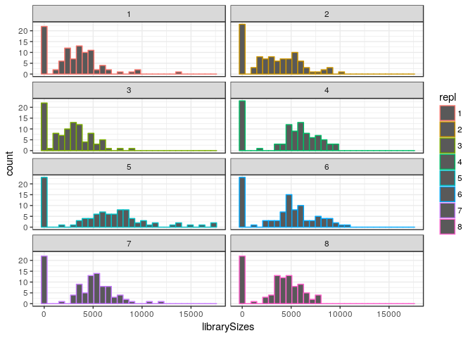

Experiment 6
============

Here, we performed the same transfers as in [experiment 5](Labcyte-RT_Data_Analysis_5.md),
but with an older master plate for the TSOs, in order to test if the problem
is related to the barcode sequence or to the batch of synthesis.

Load R packages
===============


```r
library("CAGEr")
library("ggplot2")
library("magrittr")
library("MultiAssayExperiment")
library("SummarizedExperiment")
```

MOIRAI shortcuts


```r
MISEQ_RUN      <- "180501_M00528_0359_000000000-B4PJY"
WORKFLOW       <- "OP-WORKFLOW-CAGEscan-short-reads-v2.1.2"
MOIRAI_STAMP   <- "20180502081812"
MOIRAI_PROJ    <- "project/Labcyte" 
MOIRAI_USER    <- "nanoCAGE2" 
ASSEMBLY       <- "mm9"
BASEDIR        <- "/osc-fs_home/scratch/moirai"
MOIRAI_BASE    <- file.path(BASEDIR, MOIRAI_USER)
MOIRAI_RESULTS <- file.path(MOIRAI_BASE, MOIRAI_PROJ, paste(MISEQ_RUN, WORKFLOW, MOIRAI_STAMP, sep = "."))
```

Load CAGE libraries
===================

Load summary statistics from MOIRAI and polish the names
--------------------------------------------------------


```r
ce <- smallCAGEqc::loadMoiraiStats(
  pipeline  = WORKFLOW,
  multiplex = file.path( MOIRAI_BASE, "input", paste0(MISEQ_RUN, ".multiplex.txt")),
  summary   = file.path( MOIRAI_RESULTS, "text", "summary.txt")) %>% DataFrame

ce$inputFiles <- paste0(MOIRAI_RESULTS, "/CAGEscan_fragments/", ce$samplename, ".bed")

# Discard lines for which input files do not exist.
ce <- ce[sapply(ce$inputFiles, file.exists),]

# Discard lines for which input files are empty.
ce <- ce[file.info(ce$inputFiles)$size != 0,]

ce$inputFilesType <- c("bed")
ce$sampleLabels <- as.character(ce$samplename)

# Replace indexes in group names by RNA amounts extracted from sample sheet.
levels(ce$group) <- system("cut -f 6,8 -d , 180501_M00528_0359_000000000-B4PJY.SampleSheet.csv | grep y_ | sort | cut -f2 -d, | sed -E 's/\r//'", intern = TRUE)

ce$repl <- ce$index
levels(ce$repl) <- system("cut -f 6,8 -d , 180501_M00528_0359_000000000-B4PJY.SampleSheet.csv | grep y_ | sort | cut -f2 -d, | cut -f2 -d_ | sed -E 's/\r//'", intern = TRUE)
ce$repl %<>% factor(levels = 1:8)

# Define plate IDs
ce$plateID <- ce$repl
levels(ce$plateID) <- c(rep("O", 4), rep("P", 4))

rownames(ce) %<>% paste(ce$plateID, sep = "_")
ce$sampleLabels <- rownames(ce)

ce
```

```
## DataFrame with 768 rows and 18 columns
##                        samplename     group  barcode    index     total
##                          <factor>  <factor> <factor> <factor> <numeric>
## ACACAG_TAAGGCGA_O ACACAG_TAAGGCGA library_1   ACACAG TAAGGCGA         0
## ACACGT_TAAGGCGA_O ACACGT_TAAGGCGA library_1   ACACGT TAAGGCGA         0
## ACACTC_TAAGGCGA_O ACACTC_TAAGGCGA library_1   ACACTC TAAGGCGA         0
## ACAGAT_TAAGGCGA_O ACAGAT_TAAGGCGA library_1   ACAGAT TAAGGCGA         0
## ACAGCA_TAAGGCGA_O ACAGCA_TAAGGCGA library_1   ACAGCA TAAGGCGA         0
## ...                           ...       ...      ...      ...       ...
## TCGAGC_CGAGGCTG_P TCGAGC_CGAGGCTG library_8   TCGAGC CGAGGCTG         0
## TCGATA_CGAGGCTG_P TCGATA_CGAGGCTG library_8   TCGATA CGAGGCTG         0
## TCGCAG_CGAGGCTG_P TCGCAG_CGAGGCTG library_8   TCGCAG CGAGGCTG         0
## TCGCGT_CGAGGCTG_P TCGCGT_CGAGGCTG library_8   TCGCGT CGAGGCTG         0
## TCGCTC_CGAGGCTG_P TCGCTC_CGAGGCTG library_8   TCGCTC CGAGGCTG         0
##                   extracted   cleaned   tagdust      rdna    spikes
##                   <numeric> <numeric> <numeric> <numeric> <numeric>
## ACACAG_TAAGGCGA_O     11610      8283       697      2624         6
## ACACGT_TAAGGCGA_O      9051      6469       481      2099         2
## ACACTC_TAAGGCGA_O      8436      6047       514      1872         3
## ACAGAT_TAAGGCGA_O     11145      7825       603      2709         8
## ACAGCA_TAAGGCGA_O     10686      7432       697      2552         5
## ...                     ...       ...       ...       ...       ...
## TCGAGC_CGAGGCTG_P      6705      5358       290      1056         1
## TCGATA_CGAGGCTG_P        92        82         1         9         0
## TCGCAG_CGAGGCTG_P       168       148         4        16         0
## TCGCGT_CGAGGCTG_P       228       205         7        16         0
## TCGCTC_CGAGGCTG_P       122        98         2        22         0
##                      mapped properpairs    counts
##                   <numeric>   <numeric> <numeric>
## ACACAG_TAAGGCGA_O      7880        6705      5182
## ACACGT_TAAGGCGA_O      6178        5257      3939
## ACACTC_TAAGGCGA_O      5725        4836      3840
## ACAGAT_TAAGGCGA_O      7448        6320      5161
## ACAGCA_TAAGGCGA_O      7056        6087      4535
## ...                     ...         ...       ...
## TCGAGC_CGAGGCTG_P      5150        4364      3843
## TCGATA_CGAGGCTG_P        64          41        38
## TCGCAG_CGAGGCTG_P       128         109       100
## TCGCGT_CGAGGCTG_P       179         151       130
## TCGCTC_CGAGGCTG_P        88          80        72
##                                                                                                                                                                                               inputFiles
##                                                                                                                                                                                              <character>
## ACACAG_TAAGGCGA_O /osc-fs_home/scratch/moirai/nanoCAGE2/project/Labcyte/180501_M00528_0359_000000000-B4PJY.OP-WORKFLOW-CAGEscan-short-reads-v2.1.2.20180502081812/CAGEscan_fragments/ACACAG_TAAGGCGA.bed
## ACACGT_TAAGGCGA_O /osc-fs_home/scratch/moirai/nanoCAGE2/project/Labcyte/180501_M00528_0359_000000000-B4PJY.OP-WORKFLOW-CAGEscan-short-reads-v2.1.2.20180502081812/CAGEscan_fragments/ACACGT_TAAGGCGA.bed
## ACACTC_TAAGGCGA_O /osc-fs_home/scratch/moirai/nanoCAGE2/project/Labcyte/180501_M00528_0359_000000000-B4PJY.OP-WORKFLOW-CAGEscan-short-reads-v2.1.2.20180502081812/CAGEscan_fragments/ACACTC_TAAGGCGA.bed
## ACAGAT_TAAGGCGA_O /osc-fs_home/scratch/moirai/nanoCAGE2/project/Labcyte/180501_M00528_0359_000000000-B4PJY.OP-WORKFLOW-CAGEscan-short-reads-v2.1.2.20180502081812/CAGEscan_fragments/ACAGAT_TAAGGCGA.bed
## ACAGCA_TAAGGCGA_O /osc-fs_home/scratch/moirai/nanoCAGE2/project/Labcyte/180501_M00528_0359_000000000-B4PJY.OP-WORKFLOW-CAGEscan-short-reads-v2.1.2.20180502081812/CAGEscan_fragments/ACAGCA_TAAGGCGA.bed
## ...                                                                                                                                                                                                  ...
## TCGAGC_CGAGGCTG_P /osc-fs_home/scratch/moirai/nanoCAGE2/project/Labcyte/180501_M00528_0359_000000000-B4PJY.OP-WORKFLOW-CAGEscan-short-reads-v2.1.2.20180502081812/CAGEscan_fragments/TCGAGC_CGAGGCTG.bed
## TCGATA_CGAGGCTG_P /osc-fs_home/scratch/moirai/nanoCAGE2/project/Labcyte/180501_M00528_0359_000000000-B4PJY.OP-WORKFLOW-CAGEscan-short-reads-v2.1.2.20180502081812/CAGEscan_fragments/TCGATA_CGAGGCTG.bed
## TCGCAG_CGAGGCTG_P /osc-fs_home/scratch/moirai/nanoCAGE2/project/Labcyte/180501_M00528_0359_000000000-B4PJY.OP-WORKFLOW-CAGEscan-short-reads-v2.1.2.20180502081812/CAGEscan_fragments/TCGCAG_CGAGGCTG.bed
## TCGCGT_CGAGGCTG_P /osc-fs_home/scratch/moirai/nanoCAGE2/project/Labcyte/180501_M00528_0359_000000000-B4PJY.OP-WORKFLOW-CAGEscan-short-reads-v2.1.2.20180502081812/CAGEscan_fragments/TCGCGT_CGAGGCTG.bed
## TCGCTC_CGAGGCTG_P /osc-fs_home/scratch/moirai/nanoCAGE2/project/Labcyte/180501_M00528_0359_000000000-B4PJY.OP-WORKFLOW-CAGEscan-short-reads-v2.1.2.20180502081812/CAGEscan_fragments/TCGCTC_CGAGGCTG.bed
##                   inputFilesType      sampleLabels     repl  plateID
##                      <character>       <character> <factor> <factor>
## ACACAG_TAAGGCGA_O            bed ACACAG_TAAGGCGA_O        1        O
## ACACGT_TAAGGCGA_O            bed ACACGT_TAAGGCGA_O        1        O
## ACACTC_TAAGGCGA_O            bed ACACTC_TAAGGCGA_O        1        O
## ACAGAT_TAAGGCGA_O            bed ACAGAT_TAAGGCGA_O        1        O
## ACAGCA_TAAGGCGA_O            bed ACAGCA_TAAGGCGA_O        1        O
## ...                          ...               ...      ...      ...
## TCGAGC_CGAGGCTG_P            bed TCGAGC_CGAGGCTG_P        8        P
## TCGATA_CGAGGCTG_P            bed TCGATA_CGAGGCTG_P        8        P
## TCGCAG_CGAGGCTG_P            bed TCGCAG_CGAGGCTG_P        8        P
## TCGCGT_CGAGGCTG_P            bed TCGCGT_CGAGGCTG_P        8        P
## TCGCTC_CGAGGCTG_P            bed TCGCTC_CGAGGCTG_P        8        P
```


Load plate design
-----------------

Using plate 4 and 5 design, see [Labcyte-RT4](Labcyte-RT4.md) and 
[Labcyte-RT5](Labcyte-RT5.md).


```r
plate4 <- read.table("plate4.txt", sep = "\t", header = TRUE, stringsAsFactors = FALSE)
plate5 <- read.table("plate5.txt", sep = "\t", header = TRUE, stringsAsFactors = FALSE)
plate  <- rbind(plate4, plate5)
plate  <- plate[!duplicated(plate),]

ce %<>% cbind(plate[match( paste(ce$barcode, ce$index)
                         , paste(plate$BARCODE_SEQ, plate$INDEX)), ])
rm(plate, plate4, plate5)
```


Create a CAGEexp object and load expression data
------------------------------------------------


```r
getCTSS(ce, useMulticore = TRUE)
removeStrandInvaders(ce)
```

```
## Loading required namespace: BSgenome.Mmusculus.UCSC.mm9
```


Save the CAGEexp file
---------------------


```r
saveRDS(ce, "Labcyte-RT_Data_Analysis_6.Rds")
```


Annotation with GENCODE
-----------------------

Collect annotations and gene symbols via a local GENCODE file
(mm9 GENCODE not available in AnnotationHub)


```r
annotateCTSS(ce, rtracklayer::import.gff("/osc-fs_home/scratch/gmtu/annotation/mus_musculus/gencode-M1/gencode.vM1.annotation.gtf.gz"))
```

Quality controls
================

Custom _scopes_ displaying _strand invasion_ artefacts.


```r
source("customScopes.R", echo = TRUE)
```

```
## 
## > msScope_qcSI <- function(libs) {
## +     libs$Tag_dust <- libs$extracted - libs$rdna - libs$spikes - 
## +         libs$cleaned
## +     libs$rDNA <- libs$r .... [TRUNCATED] 
## 
## > msScope_counts <- function(libs) {
## +     libs$Promoter <- libs$promoter
## +     libs$Exon <- libs$exon
## +     libs$Intron <- libs$intron
## +     libs$Int .... [TRUNCATED] 
## 
## > msScope_libSizeNormByBarcode <- function(libs) {
## +     libs$Yield <- libs$libSizeNormByBarcode
## +     list(libs = libs, columns = c("Yield"), total = .... [TRUNCATED] 
## 
## > msScope_libSizeNormByIndex <- function(libs) {
## +     libs$Yield <- libs$libSizeNormByIndex
## +     list(libs = libs, columns = c("Yield"), total = lib .... [TRUNCATED] 
## 
## > msScope_libSize <- function(libs) {
## +     libs$Yield <- libs$librarySizes
## +     list(libs = libs, columns = c("Yield"), total = libs$Yield)
## + }
```


By replicate
------------

Replicates 1, 2 and 3 are outliers by their higher amount of rDNA and lower
amount of strand-invasion artefacts.


```r
ggpubr::ggarrange( legend = "right", common.legend = TRUE,
  plotAnnot( ce, scope = msScope_qcSI, group = "repl", normalise = FALSE, title = NULL) +
    ylab("sequence counts") + xlab("Replicate number"),
  plotAnnot( ce, scope = msScope_qcSI, group = "repl", normalise = TRUE,  title = NULL) +
    ylab("Normalised to 100%") + xlab("Replicate number")
) %>% ggpubr::annotate_figure(top="QC of processing, by indexed library")
```

<!-- -->


```r
ggpubr::ggarrange( legend = "right", common.legend = TRUE,
  plotAnnot( ce, scope = msScope_counts, group = "repl", normalise = FALSE, title = NULL) +
    ylab("sequence counts") + xlab("Replicate number"),
  plotAnnot( ce, scope = msScope_counts, group = "repl", normalise = TRUE,  title = NULL) +
    ylab("Normalised to 100%") + xlab("Replicate number")
) %>% ggpubr::annotate_figure(top="QC annotation, by indexed library")
```

<!-- -->


Negative controls
-----------------


```r
ce$NC <- ce$TSO_vol == 0

ggpubr::ggarrange( legend = "right", common.legend = TRUE,
  plotAnnot( ce, scope = msScope_qcSI, group = "NC"
           , title = NULL, facet = "repl", normalise = FALSE) +
    facet_wrap("facet", ncol = 1) +
    ylab("sequence counts") + xlab("Negative control ?"),
  plotAnnot( ce, scope = msScope_qcSI, group = "NC"
           , title = NULL, facet = "repl", normalise = TRUE) +
    facet_wrap("facet", ncol = 1) +
    ylab("Normalised to 100%") + xlab("Negative control ?")
)  %>% ggpubr::annotate_figure(top="QC report, by replicate set")
```

<!-- -->

```r
ggpubr::ggarrange( legend = "right", common.legend = TRUE,
  plotAnnot( ce, scope = msScope_counts, group = "NC"
           , title = NULL, facet = "repl", normalise = FALSE) +
    facet_wrap("facet", ncol = 1) +
    ylab("sequence counts") + xlab("Negative control ?"),
  plotAnnot( ce, scope = msScope_counts, group = "NC"
           , title = NULL, facet = "repl", normalise = TRUE) +
    facet_wrap("facet", ncol = 1) +
    ylab("Normalised to 100%") + xlab("Negative control ?")
)  %>% ggpubr::annotate_figure(top="QC annotation, by replicate set")
```

<!-- -->


Barcodes
========


```r
plotAnnot( ce, scope = msScope_qcSI, group = "repl"
           , title = "Sequence counts"
           , facet = "BARCODE_SEQ", normalise = FALSE) +
  facet_wrap(~facet, ncol=12)
```

```
## Warning: Removed 6144 rows containing missing values (geom_segment).
```

```
## Warning: Removed 6144 rows containing missing values (geom_point).
```

<!-- -->


```r
plotAnnot( ce, scope = msScope_qcSI, group = "repl"
           , title = "Sequence counts"
           , facet = "BARCODE_ID", normalise = FALSE) +
  facet_wrap(~facet, ncol=12)
```

```
## Warning: Removed 6144 rows containing missing values (geom_segment).
```

```
## Warning: Removed 6144 rows containing missing values (geom_point).
```

<!-- -->


Normalisation
=============

Let's derive a normalisation factor for each barcode sequence, to compare with
the ones calculated in experiment 5.


```r
ggplot(colData(ce) %>% data.frame, aes(librarySizes, col = repl)) +
  geom_histogram() +
  facet_wrap(~repl, ncol = 2)
```

```
## `stat_bin()` using `bins = 30`. Pick better value with `binwidth`.
```

<!-- -->


```r
tapply(ce$librarySizes, ce$repl, sum)
```

```
##      1      2      3      4      5      6      7      8 
## 301337 320271 253476 455646 563092 423978 404365 354135
```

```r
indexMean <- tapply(ce$librarySizes, ce$index, mean)
ce$libSizeNormByIndex <- mapply(function(n, index) n / indexMean[index], n = ce$librarySizes, index = ce$index)
bcNormFactors <- tapply(ce$libSizeNormByIndex[!ce$NC], ce$BARCODE_SEQ[!ce$NC], mean)
bcNormFactors <- bcNormFactors / mean(bcNormFactors)
bcNormFactors
```

```
##      ACACAG      ACACGT      ACACTC      ACAGAT      ACAGCA      ACAGTG 
## 1.496317888 1.230196906 1.367626068 1.530892662 1.450495843 0.012267818 
##      ACATAC      ACATCT      ACATGA      AGTACG      AGTAGC      AGTATA 
## 1.354499832 1.336111656 1.030072252 1.269875424 1.292223765 0.023774192 
##      AGTCAG      AGTCGT      AGTCTC      AGTGAT      AGTGCA      AGTGTG 
## 1.105760857 1.022923260 1.126277337 1.288505992 1.575680347 1.594351963 
##      ATCACG      ATCAGC      ATCATA      ATCGAT      ATCGCA      ATCGTG 
## 1.222705806 1.000157971 0.894683358 0.891329733 1.040900044 1.207267267 
##      ATCTAC      ATCTCT      ATCTGA      CACACG      CACAGC      CACATA 
## 0.881469889 0.949336152 0.782046628 1.836564612 1.624897959 1.480607151 
##      CACGAT      CACGCA      CACGTG      CACTAC      CACTCT      CACTGA 
## 1.533343139 1.704064541 1.356332590 1.360269045 1.213541282 1.407283568 
##      CGACAG      CGACGT      CGACTC      CGAGAT      CGAGCA      CGAGTG 
## 1.202611104 1.238480096 1.247729704 1.611234857 1.362930738 1.402762570 
##      CGATAC      CGATCT      CGATGA      CTGACG      CTGAGC      CTGATA 
## 1.535192203 1.376544205 1.394186885 1.345353607 1.125204158 0.789719042 
##      CTGCAG      CTGCGT      CTGCTC      CTGTAC      CTGTCT      CTGTGA 
## 0.889348294 0.726703310 0.997777734 0.567217985 0.018283736 0.019820120 
##      GAGACG      GAGAGC      GAGATA      GAGCAG      GAGCGT      GAGCTC 
## 0.375074639 0.024053781 0.018697927 1.237054255 0.789594531 0.822199839 
##      GAGTAC      GAGTCT      GAGTGA      GCTACG      GCTAGC      GCTATA 
## 0.728514408 0.964218921 0.976456995 1.365279508 1.165077751 0.708646481 
##      GCTCAG      GCTCGT      GCTCTC      GCTGAT      GCTGCA      GCTGTG 
## 1.161396436 1.173073303 1.087002950 1.207812089 1.477261142 0.008479603 
##      GTACAG      GTACGT      GTACTC      GTAGAT      GTAGCA      GTAGTG 
## 1.300379669 0.984091189 1.089986509 1.011724016 1.255273318 1.553014515 
##      GTATAC      GTATCT      GTATGA      TATACG      TATAGC      TATATA 
## 0.768694944 0.870653006 1.021988361 0.939724173 0.607404069 0.020943827 
##      TATCAG      TATCGT      TATCTC      TATGAT      TATGCA      TATGTG 
## 0.773287543 0.996144119 0.838584524 0.505091349 0.848098063 0.682793506 
##      TCGACG      TCGAGC      TCGATA      TCGCAG      TCGCGT      TCGCTC 
## 1.325985777 0.901612701 0.008330787 0.016699985 0.028723076 0.015121269
```


```r
ce$libSizeNormByBarcode <- mapply(function(n, bc) n / bcNormFactors[bc], n = ce$librarySizes, bc = ce$BARCODE_SEQ)
ggpubr::ggarrange( legend = "right", common.legend = TRUE,
  plotAnnot( ce[,!ce$NC], scope = msScope_libSize, group = "BARCODE_ID"
             , title = NULL, normalise = FALSE) +
    ylab("Sequence counts") + xlab("Barcode ID"),
  plotAnnot( ce[,!ce$NC], scope = msScope_libSizeNormByBarcode, group = "BARCODE_ID"
             , title = NULL, normalise = FALSE) +
    ylab("Normalised sequence counts") + xlab("Barcode ID")
)  %>% ggpubr::annotate_figure(top="Sequence counts, before and after normalisation")
```

```
## harmonizing input:
##   removing 96 sampleMap rows with 'colname' not in colnames of experiments
##   removing 96 colData rownames not in sampleMap 'primary'
## harmonizing input:
##   removing 96 sampleMap rows with 'colname' not in colnames of experiments
##   removing 96 colData rownames not in sampleMap 'primary'
```

<!-- -->

### Comparison with experiment 5

TSOs for wich not enough stock remained gave erroneous normalisation factors,
which are removed in the plot below.  There might be a very weak correlation,
but basically the conclusion is that the old stock of primers is much less
biased than the previous one, or even not biased.


```r
bcNormFactors5 <- dget("bcNormFactors.R")
plot( bcNormFactors[bcNormFactors > 0.1]
    , bcNormFactors5[bcNormFactors > 0.1]
    , log = ""
    , xlab = "Experiment 6"
    , ylab = "Experiment 5")
```

<!-- -->

### Comparison with dilution factors

This is just to double-check that the dilutions correctly adjusted the
concentrations.  If not, they will correlate with the normalisation factors.


```r
dil <- read.table("dilution_table.txt", sep = "\t", header = TRUE)[,"dilution_factor_for_100uM", drop = T]
plot( bcNormFactors[bcNormFactors > 0.1]
    , dil[bcNormFactors > 0.1]
    , xlab = "norm factors"
    , ylab = "dilution factors")
```

<!-- -->

Session information
===================


```r
sessionInfo()
```

```
## R version 3.4.3 (2017-11-30)
## Platform: x86_64-pc-linux-gnu (64-bit)
## Running under: Debian GNU/Linux 9 (stretch)
## 
## Matrix products: default
## BLAS: /usr/lib/libblas/libblas.so.3.7.0
## LAPACK: /usr/lib/lapack/liblapack.so.3.7.0
## 
## locale:
##  [1] LC_CTYPE=en_GB.UTF-8       LC_NUMERIC=C              
##  [3] LC_TIME=en_GB.UTF-8        LC_COLLATE=en_GB.UTF-8    
##  [5] LC_MONETARY=en_GB.UTF-8    LC_MESSAGES=en_GB.UTF-8   
##  [7] LC_PAPER=en_GB.UTF-8       LC_NAME=C                 
##  [9] LC_ADDRESS=C               LC_TELEPHONE=C            
## [11] LC_MEASUREMENT=en_GB.UTF-8 LC_IDENTIFICATION=C       
## 
## attached base packages:
## [1] parallel  stats4    stats     graphics  grDevices utils     datasets 
## [8] methods   base     
## 
## other attached packages:
##  [1] SummarizedExperiment_1.9.14 DelayedArray_0.4.1         
##  [3] matrixStats_0.52.2          Biobase_2.38.0             
##  [5] GenomicRanges_1.31.19       GenomeInfoDb_1.15.5        
##  [7] IRanges_2.13.26             S4Vectors_0.17.32          
##  [9] BiocGenerics_0.25.3         MultiAssayExperiment_1.5.41
## [11] magrittr_1.5                ggplot2_2.2.1              
## [13] CAGEr_1.21.5.1             
## 
## loaded via a namespace (and not attached):
##  [1] nlme_3.1-131                      bitops_1.0-6                     
##  [3] RColorBrewer_1.1-2                rprojroot_1.3-2                  
##  [5] tools_3.4.3                       backports_1.1.2                  
##  [7] R6_2.2.2                          vegan_2.4-5                      
##  [9] platetools_0.0.2                  KernSmooth_2.23-15               
## [11] lazyeval_0.2.1                    mgcv_1.8-22                      
## [13] colorspace_1.3-2                  permute_0.9-4                    
## [15] gridExtra_2.3                     compiler_3.4.3                   
## [17] VennDiagram_1.6.18                rtracklayer_1.39.9               
## [19] labeling_0.3                      scales_0.5.0                     
## [21] stringr_1.3.0                     digest_0.6.15                    
## [23] Rsamtools_1.31.3                  rmarkdown_1.9                    
## [25] stringdist_0.9.4.6                XVector_0.19.8                   
## [27] pkgconfig_2.0.1                   htmltools_0.3.6                  
## [29] BSgenome_1.47.5                   rlang_0.2.0                      
## [31] VGAM_1.0-4                        bindr_0.1                        
## [33] BiocParallel_1.12.0               gtools_3.5.0                     
## [35] dplyr_0.7.4                       RCurl_1.95-4.10                  
## [37] GenomeInfoDbData_0.99.1           futile.logger_1.4.3              
## [39] smallCAGEqc_0.12.2.999999         Matrix_1.2-12                    
## [41] Rcpp_0.12.16                      munsell_0.4.3                    
## [43] stringi_1.1.7                     yaml_2.1.18                      
## [45] MASS_7.3-47                       zlibbioc_1.24.0                  
## [47] plyr_1.8.4                        grid_3.4.3                       
## [49] gdata_2.18.0                      lattice_0.20-35                  
## [51] Biostrings_2.47.9                 cowplot_0.9.2                    
## [53] splines_3.4.3                     knitr_1.20                       
## [55] beanplot_1.2                      pillar_1.2.1                     
## [57] ggpubr_0.1.6                      reshape2_1.4.2                   
## [59] codetools_0.2-15                  futile.options_1.0.0             
## [61] XML_3.98-1.9                      glue_1.2.0                       
## [63] evaluate_0.10.1                   lambda.r_1.2                     
## [65] data.table_1.10.4-3               gtable_0.2.0                     
## [67] BSgenome.Mmusculus.UCSC.mm9_1.4.0 purrr_0.2.4                      
## [69] tidyr_0.7.2                       reshape_0.8.7                    
## [71] assertthat_0.2.0                  tibble_1.4.2                     
## [73] som_0.3-5.1                       GenomicAlignments_1.15.12        
## [75] memoise_1.1.0                     bindrcpp_0.2                     
## [77] cluster_2.0.6
```
