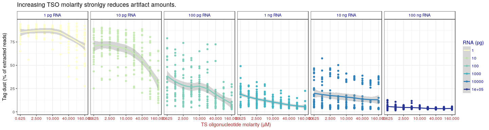
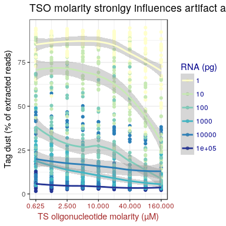
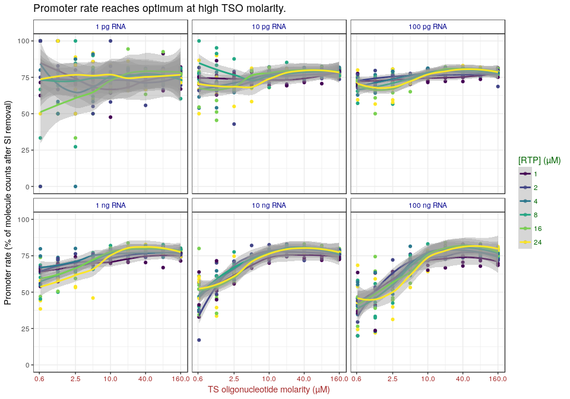
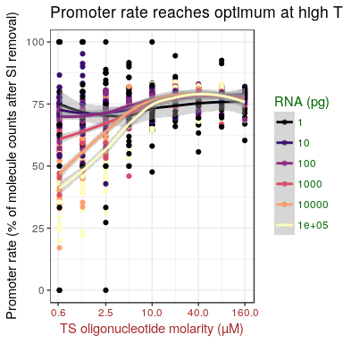
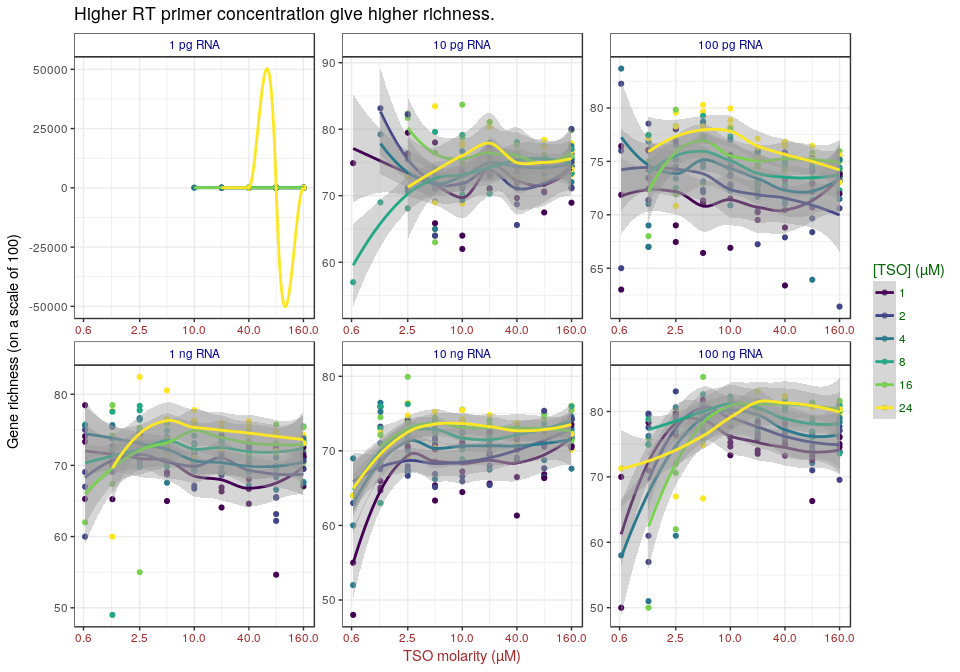
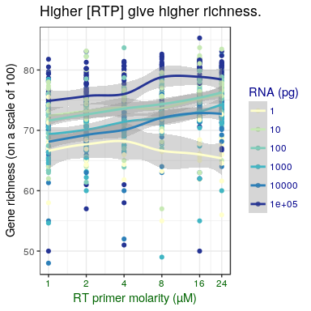

Here, we assessed again multiple combinations of TSO, RT primer and RNA amounts,
using a different stock of TSOs (PO_8268526), purchased earlier but apparently
of better quality (see [experiment 6](Labcyte-RT_Data_Analysis_6.md)), and
with a more extensive randomisation of TSO barcodes and well coordinates
(see designs [6a](Labcyte-RT6a.md), [6b](Labcyte-RT6b.md), [6c](Labcyte-RT6c.md) and [6d](Labcyte-RT6d.md)).

Load R packages
===============


```r
library("CAGEr")
library("ggplot2")
library("magrittr")
library("MultiAssayExperiment")
library("SummarizedExperiment")
library("viridis")
```


Load CAGE libraries
===================


```r
ce <- readRDS(paste0("Labcyte-RT_Data_Analysis_", expNumber, ".Rds"))
```


Remove negative controls
========================


```r
ce <- ce[, ce$RNA_vol    != 0]
```

```
## harmonizing input:
##   removing 14 sampleMap rows with 'colname' not in colnames of experiments
##   removing 14 colData rownames not in sampleMap 'primary'
```

```r
ce <- ce[, ce$RT_PRIMERS != 0]
```

```
## harmonizing input:
##   removing 215 sampleMap rows with 'colname' not in colnames of experiments
##   removing 215 colData rownames not in sampleMap 'primary'
```


Analysis
========

## Color code

In legends and axis panels:

 - RNA amounts are written in blue;
 - RT primer molarities are in green;
 - TSO molarities are in brown/red.
 
Discrepancies signal a mislabeling.


```r
theme_TSO_by_RTP_facet_RNA <- function() {
  theme( axis.text.x      = element_text(colour = "brown")
       , axis.title.x     = element_text(colour = "brown")
       , legend.title     = element_text(colour = "darkgreen")
       , legend.text      = element_text(colour = "darkgreen")
       , strip.background = element_rect(fill   = NA)
       , strip.text       = element_text(colour = "darkblue"))
}

theme_TSO_by_RNA_facet_RNA <- function() {
  theme( axis.text.x      = element_text(colour = "brown")
       , axis.title.x     = element_text(colour = "brown")
       , legend.title     = element_text(colour = "darkblue")
       , legend.text      = element_text(colour = "darkblue")
       , strip.background = element_rect(fill   = NA)
       , strip.text       = element_text(colour = "darkblue"))
}

theme_RTP_by_TSO_facet_RNA <- function() {
  theme( axis.text.x      = element_text(colour = "darkgreen")
       , axis.title.x     = element_text(colour = "darkgreen")
       , legend.title     = element_text(colour = "brown")
       , legend.text      = element_text(colour = "brown")
       , strip.background = element_rect(fill   = NA)
       , strip.text       = element_text(colour = "darkblue"))
}

theme_RTP_by_RNA_facet_RNA <- function() {
  theme( axis.text.x      = element_text(colour = "darkgreen")
       , axis.title.x     = element_text(colour = "darkgreen")
       , legend.title     = element_text(colour = "darkblue")
       , legend.text      = element_text(colour = "darkblue")
       , strip.background = element_rect(fill   = NA)
       , strip.text       = element_text(colour = "darkblue"))
}
```


## Tag dust

If not removed during library preparation, oligonucleotide artifacts strongly
dominate libraries prepared with 1 pg RNA.  In general, the amount of artefacts
increases when starting RNA amounts decrease.  Here, adding RT primers increases
artefacts.  In contrary, and somewhat surprisingly, adding TSOs seem to reduce
artefacts.

Sub panel at 10,000 pg is noisy because replicate `CGAGGCTG` is an outlier with
a large amount of artefacts.


```r
ggplot(colData(ce) %>% data.frame, aes(TSO, tagdust / extracted * 100, color=RT_PRIMERS %>% factor)) +
  geom_point() +
  geom_smooth() +
  facet_wrap(~RNA_factor, scales = "fixed") +
  scale_color_viridis(discrete = TRUE, name = "[RTP] (µM)") +
  scale_x_log10( "TS oligonucleotide molarity (µM)"
               , breaks = c(0.625, 2.500, 10.000, 40.000, 160.000)) +
  scale_y_continuous("Tag dust (% of extracted reads)") +
  ggtitle("Increasing TSO molarity stronlgy reduces artifact amounts.") +
  theme_TSO_by_RTP_facet_RNA()
```

```
## `geom_smooth()` using method = 'loess'
```

<!-- -->

Plot where all RT primer concentrations are pooled, showing influence of RNA
mass and TSO concentration:


```r
ggplot(colData(ce) %>% data.frame, aes(TSO, tagdust / extracted * 100, color=RNA %>% factor)) +
  geom_point() +
  geom_smooth() +
  facet_wrap(~RNA_factor, scales = "fixed", nrow = 1) +
  scale_color_brewer(name = "RNA (pg)", palette = "YlGnBu") +
  scale_x_log10( "TS oligonucleotide molarity (µM)"
               , breaks = c(0.625, 2.500, 10.000, 40.000, 160.000)) +
  scale_y_continuous("Tag dust (% of extracted reads)") +
  ggtitle("Increasing TSO molarity stronlgy reduces artifact amounts.") +
  theme_TSO_by_RNA_facet_RNA()
```

```
## `geom_smooth()` using method = 'loess'
```

<!-- -->

Same with all RNA amount overlayed in a single plot.


```r
ggplot(colData(ce) %>% data.frame, aes(TSO, tagdust / extracted * 100, color=RNA %>% factor)) +
  geom_point() +
  geom_smooth() +
  scale_color_brewer(name = "RNA (pg)", palette = "YlGnBu") +
  scale_x_log10( "TS oligonucleotide molarity (µM)"
               , breaks = c(0.625, 2.500, 10.000, 40.000, 160.000)) +
  scale_y_continuous("Tag dust (% of extracted reads)") +
  ggtitle("TSO molarity stronlgy influences artifact amounts.") +
  theme_TSO_by_RNA_facet_RNA()
```

```
## `geom_smooth()` using method = 'loess'
```

<!-- -->


## Ribosomal RNA

 - Too much RT primers increase rRNA rate.
 - rRNA rate is maximal at mild amounts of RNA (~1 ng).
 - Within the high TSO concentration, an minimum is reach between 20 and 40 µM,
   depending on the quantity RNA and RT primers.


```r
ce$rRNA_rate <- ce$rdna / (ce$extracted - ce$tagdust)
```


```r
ggplot(colData(ce) %>% data.frame, aes(TSO, rRNA_rate, color=RT_PRIMERS %>% factor)) +
  geom_point() +
  geom_smooth() +
  facet_wrap(~RNA_factor, scales = "fixed") +
  scale_color_viridis(discrete = TRUE, name = "[RTP] (µM)") +
  scale_x_log10( "TS oligonucleotide molarity (µM)"
               , breaks = c(0.6, 2.5, 10, 40, 160)) +
  scale_y_continuous("rRNA (% of non-tagdust extracted reads)") +
  ggtitle("TSO molarity stronlgy modulates rRNA amounts.") +
  theme_TSO_by_RTP_facet_RNA()
```

```
## `geom_smooth()` using method = 'loess'
```

<!-- -->


## Yield

Because we multiplexed reactions together, the ones with the highest yield
will give the largest amount of reads.  Higher yield gives the possibility
of reducing the number of PCR cycles.

Since multiplexing is not perfect, each library had a different number
of reads.  Therefore, to compare yields in terms of number of aligned reads,
etc, one needs to normalise per indexed library.


```r
tapply(ce$librarySizes, ce$index, sum)
```

```
## TAAGGCGA CGTACTAG AGGCAGAA TCCTGAGC GGACTCCT TAGGCATG CTCTCTAC CGAGGCTG 
##   129884   104142   115271    63777    33080     2063   228370   141531 
## AAGAGGCA GTAGAGGA GCTCATGA ATCTCAGG ACTCGCTA GGAGCTAC GCGTAGTA CGGAGCCT 
##   123337   134703    90912    20575   127701   116273   121044   123633 
## TACGCTGC ATGCGCAG TAGCGCTC ACTGAGCG CCTAAGAC CGATCAGT TGCAGCTA TCGACGTC 
##    27205     3363   127514   131305    94921    76723    27828     3490
```

```r
indexMean <- tapply(ce$librarySizes, ce$index, mean)

ce$libSizeNormByIndex <-
  mapply( FUN   = function(n, index) n / indexMean[index]
        , n     = ce$librarySizes
        , index = ce$index)
```

RT primer molarity mildly influences yield.  Higher molarities are
needed when TSO molarity is increased.  Conversely, high molarities are
detrimental for low TSO amounts.  In brief, the RT primer concentration must
be adjusted to the TSO concentration.


```r
ggplot(colData(ce) %>% data.frame, aes(RT_PRIMERS, libSizeNormByIndex, color=TSO %>% factor)) +
  geom_point() +
  geom_smooth() +
  facet_wrap(~RNA_factor, scales = "fixed") +
  scale_color_viridis(discrete = TRUE, name = "[TSO] (µM)", option = "magma") +
  scale_x_log10( "RT primer molarity (µM)"
               , breaks = ce$RT_PRIMERS %>% unique %>% sort) +
  scale_y_log10( "Normalised counts (arbitrary scale)"
               , breaks = c(0.01, 0.1, 1, 10)) +
  ggtitle("RT primer concentration mildly influences yield.") +
  theme_RTP_by_TSO_facet_RNA()
```

```
## `geom_smooth()` using method = 'loess'
```

<!-- -->

Since the trend appears true for all RNA concentrations, the following figure
pools all data.


```r
ggplot(colData(ce) %>% data.frame, aes(RT_PRIMERS, libSizeNormByIndex, color=TSO %>% factor)) +
  geom_point() +
  geom_smooth() +
#  facet_wrap(~RNA, scales = "fixed") +
  scale_color_viridis(discrete = TRUE, name = "[TSO] (µM)", option = "magma") +
  scale_x_log10( "RT primer molarity (µM)"
               , breaks = ce$RT_PRIMERS %>% unique %>% sort) +
  scale_y_log10( "Normalised counts (arbitrary scale)"
               , breaks = c(0.01, 0.1, 1, 10)) +
  ggtitle("RT primer concentration mildly influences yield.") +
  theme_RTP_by_TSO_facet_RNA()
```

```
## `geom_smooth()` using method = 'loess'
```

<!-- -->


## Mapping rate

The percent of proper pairs aligned indicate the amount of data that goes in
the analysis.  The rest is basically discarded.  Here, we do not take tag dust
artefact into account, assuming that they can be removed before sequencing.

The results are somewhat symmetric with the rRNA rate, since rRNA reads are
a large proportion of the discarded data.


```r
ce$mapping_rate <- ce$properpairs / (ce$extracted - ce$tagdust) * 100
```


```r
ggplot(colData(ce) %>% data.frame, aes(TSO, mapping_rate, color=RT_PRIMERS %>% factor)) +
  geom_point() +
  geom_smooth() +
  facet_wrap(~RNA_factor, scales = "fixed") +
  scale_color_viridis(discrete = TRUE, name = "[RTP] (µM)") +
  scale_x_log10( "TS oligonucleotide molarity (µM)"
               , breaks = c(0.6, 2.5, 10, 40, 160)) +
  scale_y_continuous("Mapping rate (% of extracted reads)") +
  ggtitle("TSO molarity stronlgy influences mapping rate.")  +
  theme_TSO_by_RTP_facet_RNA()
```

```
## `geom_smooth()` using method = 'loess'
```

<!-- -->


## Strand invasion

Strand invasion artefacts are also discarded, but at a later step.  In this
experiment, their amount was reasonably low.

Interestingly, the amount of strand invaders was minimised by high amounts
of TSOs and RT primers.  Does that mean that strand invasion happen first,
and then template-switching happens if primers remain ?


```r
ce$strand_invasion_rate <- ce$strandInvaders / (ce$counts + ce$strandInvaders) * 100
```


```r
ggplot(colData(ce) %>% data.frame, aes(TSO, strand_invasion_rate, color=RT_PRIMERS %>% factor)) +
  geom_point() +
  geom_smooth() +
  facet_wrap(~RNA_factor, scales = "fixed") +
  scale_color_viridis(discrete = TRUE, name = "[RTP] (µM)") +
  scale_x_log10( "TS oligonucleotide molarity (µM)"
               , breaks = c(0.6, 2.5, 10, 40, 160)) +
  scale_y_continuous("Strand invasion rate (% of molecule counts)") +
  ggtitle("Oligonucleotide molarity stronlgy influences strand invasion rate.") +
  theme_TSO_by_RTP_facet_RNA()
```

```
## `geom_smooth()` using method = 'loess'
```

<!-- -->


## Promoter rate

High promoter rate is THE goal of a CAGE experiment.  The molarity of RT
primer does not seem to matter much.  Promoter rate reaches optimum at TSO
molarities higher than 10 µM.


```r
ce$promoter_rate <- ce$promoter / (ce$counts) * 100
```


```r
ggplot(colData(ce) %>% data.frame, aes(TSO, promoter_rate, color=RT_PRIMERS %>% factor)) +
  geom_point() +
  geom_smooth() +
  facet_wrap(~RNA_factor, scales = "fixed") +
  scale_color_viridis(discrete = TRUE, name = "[RTP] (µM)") +
  scale_x_log10( "TS oligonucleotide molarity (µM)"
               , breaks = c(0.6, 2.5, 10, 40, 160)) +
  scale_y_continuous("Promoter rate (% of molecule counts after SI removal)") +
  ggtitle("Promoter rate reaches optimum at high TSO molarity.") +
  theme_TSO_by_RTP_facet_RNA()
```

```
## `geom_smooth()` using method = 'loess'
```

<!-- -->

Low TSO molarities are much more detrimental for promoter rate at high RNA concentrations.


```r
ggplot(colData(ce) %>% data.frame, aes(TSO, promoter_rate, color=RNA %>% factor)) +
  geom_point() +
  geom_smooth() +
#  facet_wrap(~RNA, scales = "fixed") +
  scale_color_viridis(discrete = TRUE, name = "RNA (pg)", option = "magma") +
  scale_x_log10( "TS oligonucleotide molarity (µM)"
               , breaks = c(0.6, 2.5, 10, 40, 160)) +
  scale_y_continuous("Promoter rate (% of molecule counts after SI removal)") +
  ggtitle("Promoter rate reaches optimum at high TSO molarity.") +
  theme_TSO_by_RTP_facet_RNA()
```

```
## `geom_smooth()` using method = 'loess'
```

<!-- -->


## Richness (on genes)

Using a free plotting scale as richness reaches extremely low values at 1 pg RNA.

### Richness scale of 10

Many libraries were too shallowly sequenced to allow to calculate richness
on a scale of 100.

Richness is higher when RT primer molarity is higher.


```r
CTSStoGenes(ce)
ce$r10g <- vegan::rarefy(t(assay(ce[["geneExpMatrix"]])),10)
```

```
## Warning in vegan::rarefy(t(assay(ce[["geneExpMatrix"]])), 10): Requested
## 'sample' was larger than smallest site maximum (0)
```

```r
ce$r10g[ce$counts < 10] <- NA
 
ggplot(colData(ce) %>% data.frame, aes(TSO, r10g, color=RT_PRIMERS %>% factor)) +
  geom_point() +
  geom_smooth() +
  facet_wrap(~RNA_factor, scales = "free") +
  scale_color_viridis(discrete = TRUE, name = "[RTP] (µM)") +
  scale_x_log10( "TS oligonucleotide molarity (µM)"
               , breaks = c(0.6, 2.5, 10, 40, 160)) +
  scale_y_continuous("Gene richness (on a scale of 10)") +
  ggtitle("Higher RT primer concentration give higher richness.") +
  theme_TSO_by_RTP_facet_RNA()
```

```
## `geom_smooth()` using method = 'loess'
```

```
## Warning: Removed 62 rows containing non-finite values (stat_smooth).
```

```
## Warning: Removed 62 rows containing missing values (geom_point).
```

<!-- -->

### Richness scale of 100

On a scale of 100, we see that TSO concentration needs to be matched with
RNA amounts.


```r
CTSStoGenes(ce)
ce$r100g <- vegan::rarefy(t(assay(ce[["geneExpMatrix"]])),100)
ce$r100g[ce$counts < 100] <- NA
 
ggplot(colData(ce) %>% data.frame, aes(TSO, r100g, color=RT_PRIMERS %>% factor)) +
  geom_point() +
  geom_smooth() +
  facet_wrap(~RNA_factor, scales = "free") +
  scale_color_viridis(discrete = TRUE, name = "[TSO] (µM)") +
  scale_x_log10( "TSO molarity (µM)"
               , breaks = c(0.6, 2.5, 10, 40, 160)) +
  scale_y_continuous("Gene richness (on a scale of 100)") +
  ggtitle("Higher RT primer concentration give higher richness.") +
  theme_TSO_by_RTP_facet_RNA()
```

```
## `geom_smooth()` using method = 'loess'
```

<!-- -->


```r
CTSStoGenes(ce)
ce$r100g <- vegan::rarefy(t(assay(ce[["geneExpMatrix"]])),100)
```

```
## Warning in vegan::rarefy(t(assay(ce[["geneExpMatrix"]])), 100): Requested
## 'sample' was larger than smallest site maximum (0)
```

```r
ce$r100g[ce$counts < 100] <- NA
 
ggplot(colData(ce) %>% data.frame, aes(RT_PRIMERS, r100g, color=RNA %>% factor)) +
  geom_point() +
  geom_smooth() +
  scale_color_brewer(name = "RNA (pg)", palette = "YlGnBu") +
  scale_x_log10( "RT primer molarity (µM)"
               , breaks = ce$RT_PRIMERS %>% unique %>% sort) +
  scale_y_continuous("Gene richness (on a scale of 100)") +
  ggtitle("Higher [RTP] give higher richness.") +
  theme_RTP_by_RNA_facet_RNA()
```

```
## `geom_smooth()` using method = 'loess'
```

```
## Warning: Removed 309 rows containing non-finite values (stat_smooth).
```

```
## Warning: Removed 309 rows containing missing values (geom_point).
```

<!-- -->


Session information
===================


```r
sessionInfo()
```

```
## R version 3.4.3 (2017-11-30)
## Platform: x86_64-pc-linux-gnu (64-bit)
## Running under: Debian GNU/Linux 9 (stretch)
## 
## Matrix products: default
## BLAS: /usr/lib/libblas/libblas.so.3.7.0
## LAPACK: /usr/lib/lapack/liblapack.so.3.7.0
## 
## locale:
##  [1] LC_CTYPE=en_GB.UTF-8       LC_NUMERIC=C              
##  [3] LC_TIME=en_GB.UTF-8        LC_COLLATE=en_GB.UTF-8    
##  [5] LC_MONETARY=en_GB.UTF-8    LC_MESSAGES=en_GB.UTF-8   
##  [7] LC_PAPER=en_GB.UTF-8       LC_NAME=C                 
##  [9] LC_ADDRESS=C               LC_TELEPHONE=C            
## [11] LC_MEASUREMENT=en_GB.UTF-8 LC_IDENTIFICATION=C       
## 
## attached base packages:
## [1] parallel  stats4    stats     graphics  grDevices utils     datasets 
## [8] methods   base     
## 
## other attached packages:
##  [1] viridis_0.4.0               viridisLite_0.2.0          
##  [3] SummarizedExperiment_1.9.14 DelayedArray_0.4.1         
##  [5] matrixStats_0.52.2          Biobase_2.38.0             
##  [7] GenomicRanges_1.31.19       GenomeInfoDb_1.15.5        
##  [9] IRanges_2.13.26             S4Vectors_0.17.32          
## [11] BiocGenerics_0.25.3         MultiAssayExperiment_1.5.41
## [13] magrittr_1.5                ggplot2_2.2.1              
## [15] CAGEr_1.21.5.1             
## 
## loaded via a namespace (and not attached):
##  [1] tidyr_0.7.2               VGAM_1.0-4               
##  [3] splines_3.4.3             gtools_3.5.0             
##  [5] BSgenome_1.47.5           GenomeInfoDbData_0.99.1  
##  [7] Rsamtools_1.31.3          yaml_2.1.18              
##  [9] pillar_1.2.1              backports_1.1.2          
## [11] lattice_0.20-35           glue_1.2.0               
## [13] digest_0.6.15             RColorBrewer_1.1-2       
## [15] XVector_0.19.8            colorspace_1.3-2         
## [17] htmltools_0.3.6           Matrix_1.2-12            
## [19] plyr_1.8.4                XML_3.98-1.9             
## [21] zlibbioc_1.24.0           purrr_0.2.4              
## [23] scales_0.5.0              stringdist_0.9.4.6       
## [25] BiocParallel_1.12.0       tibble_1.4.2             
## [27] beanplot_1.2              mgcv_1.8-22              
## [29] lazyeval_0.2.1            memoise_1.1.0            
## [31] evaluate_0.10.1           nlme_3.1-131             
## [33] MASS_7.3-47               vegan_2.4-5              
## [35] tools_3.4.3               data.table_1.10.4-3      
## [37] stringr_1.3.0             munsell_0.4.3            
## [39] cluster_2.0.6             Biostrings_2.47.9        
## [41] som_0.3-5.1               compiler_3.4.3           
## [43] rlang_0.2.0               grid_3.4.3               
## [45] RCurl_1.95-4.10           bitops_1.0-6             
## [47] labeling_0.3              rmarkdown_1.9            
## [49] gtable_0.2.0              codetools_0.2-15         
## [51] reshape_0.8.7             reshape2_1.4.2           
## [53] GenomicAlignments_1.15.12 gridExtra_2.3            
## [55] knitr_1.20                rtracklayer_1.39.9       
## [57] rprojroot_1.3-2           KernSmooth_2.23-15       
## [59] permute_0.9-4             stringi_1.1.7            
## [61] Rcpp_0.12.16
```
