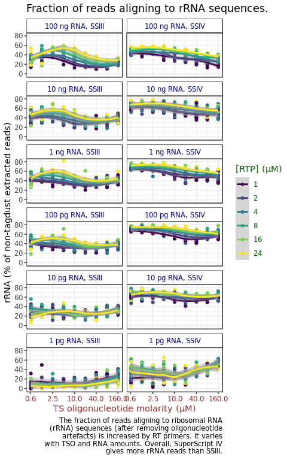
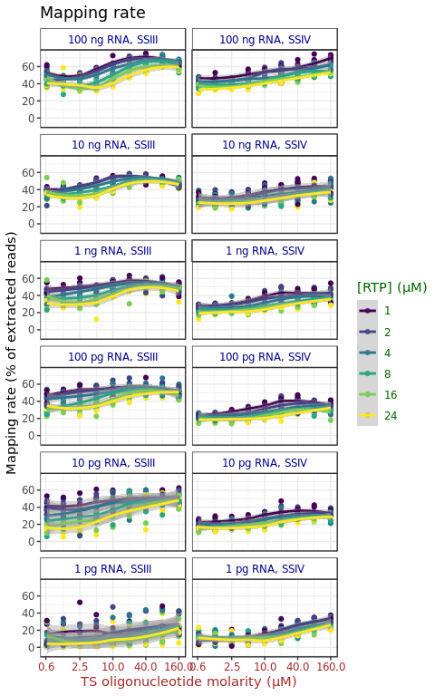
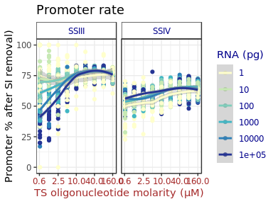
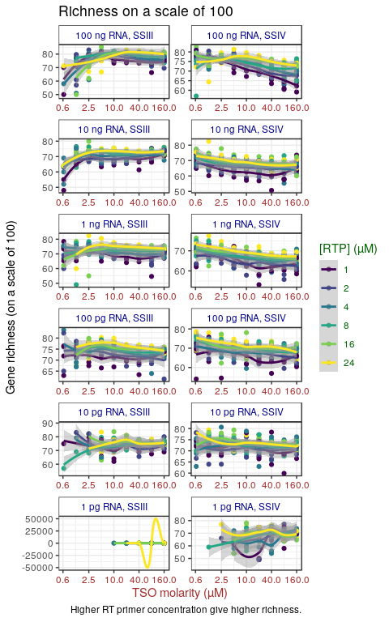

This experiment follows exactly the same design as for
[experiment 7](Labcyte-RT_Data_Analysis_7.md), except that we are using
SuperScript IV and its buffer.

Here, we assessed again multiple combinations of TSO, RT primer and RNA amounts,
using a different stock of TSOs (PO_8268526), purchased earlier but apparently
of better quality (see [experiment 6](Labcyte-RT_Data_Analysis_6.md)), and
with a more extensive randomisation of TSO barcodes and well coordinates
(see designs [6a](Labcyte-RT6a.md), [6b](Labcyte-RT6b.md), [6c](Labcyte-RT6c.md) and [6d](Labcyte-RT6d.md)).

This file presents the results for SS III and SS IV in parallel.


Load R packages
===============


```r
library("CAGEr")
library("ggplot2")
library("magrittr")
library("MultiAssayExperiment")
library("SummarizedExperiment")
library("viridis")
```


Load CAGE libraries
===================


```r
if(file.exists("Labcyte-RT_Data_Analysis_7+8.Rds")) {
  ce <- readRDS("Labcyte-RT_Data_Analysis_7+8.Rds")
} else {
  ce7 <- readRDS(paste0("Labcyte-RT_Data_Analysis_", 7, ".Rds"))
  ce8 <- readRDS(paste0("Labcyte-RT_Data_Analysis_", expNumber, ".Rds"))
  ce <- mergeCAGEsets(ce7, ce8)
  ce$enzyme <- ce$plateID
  levels(ce$enzyme) <- c(rep("SS III", 4), rep("SS IV", 4))
  ce$group <- paste0(ce$RNA_factor, ", ", ce$enzyme) %>% factor(
    c(   "1 pg RNA, SS III",   "1 pg RNA, SS IV"
     ,  "10 pg RNA, SS III",  "10 pg RNA, SS IV"
     , "100 pg RNA, SS III", "100 pg RNA, SS IV"
     ,   "1 ng RNA, SS III",   "1 ng RNA, SS IV"
     ,  "10 ng RNA, SS III",  "10 ng RNA, SS IV"
     , "100 ng RNA, SS III", "100 ng RNA, SS IV"
     ))
  ce$group_horiz <- paste0(ce$RNA_factor, ", ", ce$enzyme) %>% factor(
    c(   "1 pg RNA, SS III",  "10 pg RNA, SS III" , "100 pg RNA, SS III"
     ,   "1 ng RNA, SS III",  "10 ng RNA, SS III" , "100 ng RNA, SS III"
     ,   "1 pg RNA, SS IV" ,  "10 pg RNA, SS IV"  , "100 pg RNA, SS IV"
     ,   "1 ng RNA, SS IV" ,  "10 ng RNA, SS IV"  , "100 ng RNA, SS IV"
     ))
  annotateCTSS(ce, rtracklayer::import.gff("/osc-fs_home/scratch/gmtu/annotation/mus_musculus/gencode-M1/gencode.vM1.annotation.gtf.gz"))
  saveRDS(ce, "Labcyte-RT_Data_Analysis_7+8.Rds")
}
```


Remove negative controls
========================


```r
ce <- ce[, ce$RNA_vol    != 0]
ce <- ce[, ce$RT_PRIMERS != 0]
```


Analysis
========

## Color code

In legends and axis panels:

 - RNA amounts are written in blue;
 - RT primer molarities are in green;
 - TSO molarities are in brown/red.
 
Discrepancies signal a mislabeling.


```r
theme_TSO_by_RTP_facet_RNA <- function() {
  theme( axis.text.x      = element_text(colour = "brown")
       , axis.title.x     = element_text(colour = "brown")
       , legend.title     = element_text(colour = "darkgreen")
       , legend.text      = element_text(colour = "darkgreen")
       , strip.background = element_rect(fill   = NA)
       , strip.text       = element_text(colour = "darkblue"))
}

theme_TSO_by_RNA_facet_RNA <- function() {
  theme( axis.text.x      = element_text(colour = "brown")
       , axis.title.x     = element_text(colour = "brown")
       , legend.title     = element_text(colour = "darkblue")
       , legend.text      = element_text(colour = "darkblue")
       , strip.background = element_rect(fill   = NA)
       , strip.text       = element_text(colour = "darkblue"))
}

theme_RTP_by_TSO_facet_RNA <- function() {
  theme( axis.text.x      = element_text(colour = "darkgreen")
       , axis.title.x     = element_text(colour = "darkgreen")
       , legend.title     = element_text(colour = "brown")
       , legend.text      = element_text(colour = "brown")
       , strip.background = element_rect(fill   = NA)
       , strip.text       = element_text(colour = "darkblue"))
}

theme_RTP_by_RNA_facet_RNA <- function() {
  theme( axis.text.x      = element_text(colour = "darkgreen")
       , axis.title.x     = element_text(colour = "darkgreen")
       , legend.title     = element_text(colour = "darkblue")
       , legend.text      = element_text(colour = "darkblue")
       , strip.background = element_rect(fill   = NA)
       , strip.text       = element_text(colour = "darkblue"))
}
```


## Tag dust

If not removed during library preparation, oligonucleotide artifacts strongly
dominate libraries prepared with 1 pg RNA.  In general, the amount of artefacts
increases when starting RNA amounts decrease.  Here, increasing RT primer
molaritys increase artefacts.  In contrary, and somewhat surprisingly,
increasing TSO molarity seems to reduce artefacts.

Sub panel at 10,000 pg is noisy because replicate `CGAGGCTG` is an outlier with
a large amount of artefacts.


```r
ggplot(colData(ce) %>% data.frame, aes(TSO, tagdust / extracted * 100, color=RT_PRIMERS %>% factor)) +
  geom_point() +
  geom_smooth(method = "loess") +
  facet_wrap(~group, scales = "fixed", ncol = 2) +
  scale_color_viridis(discrete = TRUE, name = "[RTP] (µM)") +
  scale_x_log10( "TS oligonucleotide molarity (µM)"
               , breaks = c(0.6, 2.5, 10.0, 40.0, 160.0)) +
  scale_y_continuous("Tag dust (% of extracted reads)") +
  labs( title = "Amount of oligonucleotide artefacts"
      , caption = stringr::str_wrap(width = 50, "The amount of artefacts detected by TagDust is increased by RT primers and decreased by RNA and TSOs.  SuperScript IV generated less artefacts than SS III.")) +
  theme_TSO_by_RTP_facet_RNA()
```

<!-- -->

Sub panel at 10,000 pg is noisy because replicate `CGAGGCTG` is an outlier with
a large amount of artefacts.  Here is the same figure with that library removed.


```r
ggplot(colData(ce[, ! (ce$index == "CGAGGCTG" & ce$plateID == "R")]) %>% data.frame, aes(TSO, tagdust / extracted * 100, color=RT_PRIMERS %>% factor)) +
  geom_point() +
  geom_smooth(method = "loess") +
  facet_wrap(~group, scales = "fixed", ncol = 2) +
  scale_color_viridis(discrete = TRUE, name = "[RTP] (µM)") +
  scale_x_log10( "TS oligonucleotide molarity (µM)"
               , breaks = c(0.6, 2.5, 10.0, 40.0, 160.0)) +
  scale_y_continuous("Tag dust (% of extracted reads)") +
  labs( title = "Amount of oligonucleotide artefacts"
      , subtitle = '(outlier library "CGAGGCTG" of plate "R" removed)'
      , caption = stringr::str_wrap(width = 50, "The amount of artefacts detected by TagDust is increased by RT primers and decreased by RNA and TSOs.  SuperScript IV generated less artefacts than SS III.")) +
  theme_TSO_by_RTP_facet_RNA()
```

```
## harmonizing input:
##   removing 54 sampleMap rows with 'colname' not in colnames of experiments
##   removing 54 colData rownames not in sampleMap 'primary'
```

<!-- -->

Plot where all RT primer concentrations are pooled, showing influence of RNA
mass and TSO concentration:


```r
ggplot(colData(ce) %>% data.frame, aes(TSO, tagdust / extracted * 100, color=RNA %>% factor)) +
  geom_point() +
  geom_smooth(method = "loess") +
  facet_wrap(~group, scales = "fixed", ncol = 2) +
  scale_color_brewer(name = "RNA (pg)", palette = "YlGnBu") +
  scale_x_log10( "TS oligonucleotide molarity (µM)"
               , breaks = c(0.6, 2.5, 10.0, 40.0, 160.0)) +
  scale_y_continuous("Tag dust (% of extracted reads)") +
  ggtitle("Amount of oligonucleotide artefacts") +
  theme_TSO_by_RNA_facet_RNA()
```

<!-- -->

Same with all RNA amount overlayed in a single plot.


```r
ggplot(colData(ce) %>% data.frame, aes(TSO, tagdust / extracted * 100, color=RNA %>% factor)) +
  geom_point() +
  geom_smooth(method = "loess") +
  facet_wrap(~enzyme, ncol = 2) +
  scale_color_brewer(name = "RNA (pg)", palette = "YlGnBu") +
  scale_x_log10( "TS oligonucleotide molarity (µM)"
               , breaks = c(0.6, 2.5, 10.0, 40.0, 160.0)) +
  scale_y_continuous("Tag dust (% of extracted reads)") +
  ggtitle("Amount of oligonucleotide artefacts") +
  theme_TSO_by_RNA_facet_RNA()
```

<!-- -->


## Ribosomal RNA

 - RT primers molarity increases rRNA rate.
 - With SS III, rRNA rate is maximal at mild amounts of RNA (~1 ng) and at
   high TSO concentration, a minimum is reached between 20 and 40 µM,
   depending on the quantity RNA and RT primers.


```r
ce$rRNA_rate <- ce$rdna / (ce$extracted - ce$tagdust)
```


```r
ggplot(colData(ce) %>% data.frame, aes(TSO, rRNA_rate, color=RT_PRIMERS %>% factor)) +
  geom_point() +
  geom_smooth(method = "loess") +
  facet_wrap(~group, scales = "fixed", ncol = 2) +
  scale_color_viridis(discrete = TRUE, name = "[RTP] (µM)") +
  scale_x_log10( "TS oligonucleotide molarity (µM)"
               , breaks = c(0.6, 2.5, 10, 40, 160)) +
  scale_y_continuous("rRNA (% of non-tagdust extracted reads)") +
  labs( title = "Fraction of reads aligning to rRNA sequences."
      , caption = stringr::str_wrap(width = 50, "The fraction of reads aligning to ribosomal RNA (rRNA) sequences (after removing oligonucleotide artefacts) is increased by RT primers.  It varies with TSO and RNA amounts.  Overall, SuperScript IV gives more rRNA reads than SS III.")) +
  theme_TSO_by_RTP_facet_RNA()
```

<!-- -->


## Yield

Because we multiplexed reactions together, the ones with the highest yield
will give the largest amount of reads.  Higher yield gives the possibility
of reducing the number of PCR cycles.

Since multiplexing is not perfect, each library had a different number
of reads.  Therefore, to compare yields in terms of number of aligned reads,
etc, one needs to normalise per indexed library.


```r
tapply(ce$librarySizes, paste(ce$index, ce$plateID), sum)
```

```
##  AAGAGGCA R AAGAGGCA R2  ACTCGCTA S ACTCGCTA S2  ACTGAGCG T ACTGAGCG T2 
##      123337       53378      127701       73249      131305       54776 
##  AGGCAGAA Q AGGCAGAA Q2  ATCTCAGG R ATCTCAGG R2  ATGCGCAG S ATGCGCAG S2 
##      115271       54025       20575       11084        3363       10874 
##  CCTAAGAC T CCTAAGAC T2  CGAGGCTG R CGAGGCTG R2  CGATCAGT T CGATCAGT T2 
##       94921       59697      141531       77501       76723       54713 
##  CGGAGCCT S CGGAGCCT S2  CGTACTAG Q CGTACTAG Q2  CTCTCTAC R CTCTCTAC R2 
##      123633       53897      104142       72227      228370       92665 
##  GCGTAGTA S GCGTAGTA S2  GCTCATGA R GCTCATGA R2  GGACTCCT Q GGACTCCT Q2 
##      121044       80485       90912       23407       33080       35209 
##  GGAGCTAC S GGAGCTAC S2  GTAGAGGA R GTAGAGGA R2  TAAGGCGA Q TAAGGCGA Q2 
##      116273       70829      134703       56759      129884       83945 
##  TACGCTGC S TACGCTGC S2  TAGCGCTC T TAGCGCTC T2  TAGGCATG Q TAGGCATG Q2 
##       27205       28943      127514      119531        2063        9414 
##  TCCTGAGC Q TCCTGAGC Q2  TCGACGTC T TCGACGTC T2  TGCAGCTA T TGCAGCTA T2 
##       63777       40199        3490       10377       27828       21581
```

```r
libMean <- tapply(ce$librarySizes, paste(ce$index, ce$plateID), mean)

ce$libSizeNormBylib <-
  mapply( FUN   = function(n, index, plateID)
                    n / libMean[paste(index, plateID)]
        , n     = ce$librarySizes
        , index = ce$index
        , plateID = ce$plateID)
```

RT primer molarity mildly influences yield.  Higher molarities are
needed when TSO molarity is increased.  Conversely, high molarities are
detrimental for low TSO amounts.  In brief, the RT primer concentration must
be adjusted to the TSO concentration.


```r
ggplot(colData(ce) %>% data.frame, aes(RT_PRIMERS, libSizeNormBylib, color=TSO %>% factor)) +
  geom_point() +
  geom_smooth(method = "loess") +
  facet_wrap(~group, scales = "fixed", ncol = 2) +
  scale_color_viridis(discrete = TRUE, name = "[TSO] (µM)", option = "magma") +
  scale_x_log10( "RT primer molarity (µM)"
               , breaks = ce$RT_PRIMERS %>% unique %>% sort) +
  scale_y_log10( "Normalised counts (arbitrary scale)"
               , breaks = c(0.01, 0.1, 1, 10)) +
  labs( title = "Sequence yield"
      , caption = stringr::str_wrap(width = 50, "Within a library, the reactions are multiplexed by simple pooling without normalisation.  Therefore, reactions that produced more cDNAs will give more sequence reads compared to the others.  Yield increases with TSO amounts, and does not vary much with RT primer amounts, although there may be a trend showing the need to match the RT primer molarity with the TSO molarity.  Effect of RNA amounts and enzyme can not be measured because of the per-library normalisation approach, which confounds with the RNA levels.")) +
  theme_RTP_by_TSO_facet_RNA()
```

<!-- -->

Since the trend appears true for all RNA concentrations, the following figure
pools all data.


```r
ggplot(colData(ce) %>% data.frame, aes(RT_PRIMERS, libSizeNormBylib, color=TSO %>% factor)) +
  geom_point() +
  geom_smooth(method = "loess") +
  facet_wrap(~enzyme, scales = "fixed", nrow = 1) +
  scale_color_viridis(discrete = TRUE, name = "[TSO] (µM)", option = "magma") +
  scale_x_log10( "RT primer molarity (µM)"
               , breaks = ce$RT_PRIMERS %>% unique %>% sort) +
  scale_y_log10( "Normalised counts (arbitrary scale)"
               , breaks = c(0.01, 0.1, 1, 10)) +
  labs( title = "Sequence yield") +
  theme_RTP_by_TSO_facet_RNA()
```

<!-- -->


## Mapping rate

The percent of proper pairs aligned indicate the amount of data that goes in
the analysis.  The rest is basically discarded.  Here, we do not take tag dust
artefact into account, assuming that they can be removed before sequencing.

The results are somewhat symmetric with the rRNA rate, since rRNA reads are
a large proportion of the discarded data.


```r
ce$mapping_rate <- ce$properpairs / (ce$extracted - ce$tagdust) * 100
```


```r
ggplot(colData(ce) %>% data.frame, aes(TSO, mapping_rate, color=RT_PRIMERS %>% factor)) +
  geom_point() +
  geom_smooth(method = "loess") +
  facet_wrap(~group, scales = "fixed", ncol = 2) +
  scale_color_viridis(discrete = TRUE, name = "[RTP] (µM)") +
  scale_x_log10( "TS oligonucleotide molarity (µM)"
               , breaks = c(0.6, 2.5, 10, 40, 160)) +
  scale_y_continuous("Mapping rate (% of extracted reads)") +
  ggtitle("Mapping rate")  +
  theme_TSO_by_RTP_facet_RNA()
```

<!-- -->


## Strand invasion

Strand invasion artefacts are also discarded, but at a later step.  In this
experiment, their amount was reasonably low.

Interestingly, the amount of strand invaders was minimised by high amounts
of TSOs and RT primers.  Does that mean that strand invasion happen first,
and then template-switching happens if primers remain ?


```r
ce$strand_invasion_rate <- ce$strandInvaders / (ce$counts + ce$strandInvaders) * 100
```


```r
ggplot(colData(ce) %>% data.frame, aes(TSO, strand_invasion_rate, color=RT_PRIMERS %>% factor)) +
  geom_point() +
  geom_smooth(method = "loess") +
  facet_wrap(~group, scales = "fixed", ncol = 2) +
  scale_color_viridis(discrete = TRUE, name = "[RTP] (µM)") +
  scale_x_log10( "TS oligonucleotide molarity (µM)"
               , breaks = c(0.6, 2.5, 10, 40, 160)) +
  scale_y_continuous("Strand invasion rate (% of molecule counts)") +
  labs( title = "Strand invasion"
      , caption = stringr::str_wrap(width = 50, "Strand invasion artefacts are reduced by adding more RT primers.  With SuperScript III, the molarity of TSOs has to be increased at high RNA concentrations.  This does not seem to be teh case with SuperScript IV.")) +
  theme_TSO_by_RTP_facet_RNA()
```

<!-- -->

Because of 1 outlier, the scale is a bit compressed.  Here is the same plot with
the outlier removed.


```r
ggplot(colData(ce[, ce$strand_invasion_rate < 30]) %>% data.frame, aes(TSO, strand_invasion_rate, color=RT_PRIMERS %>% factor)) +
  geom_point() +
  geom_smooth(method = "loess") +
  facet_wrap(~group, scales = "fixed", ncol = 2) +
  scale_color_viridis(discrete = TRUE, name = "[RTP] (µM)") +
  scale_x_log10( "TS oligonucleotide molarity (µM)"
               , breaks = c(0.6, 2.5, 10, 40, 160)) +
  scale_y_continuous("Strand invasion rate (% of molecule counts)") +
  labs( title = "Strand invasion"
      , subtitle = "One outlier removed (1 pg RNA, SSIII, 1 µM RTP, > 30% strand invasion)."
      , caption = stringr::str_wrap(width = 50, "Strand invasion artefacts are reduced by adding more RT primers.  With SuperScript III, the molarity of TSOs has to be increased at high RNA concentrations.  This does not seem to be teh case with SuperScript IV.")) +
  theme_TSO_by_RTP_facet_RNA()
```

```
## harmonizing input:
##   removing 1 sampleMap rows with 'colname' not in colnames of experiments
##   removing 1 colData rownames not in sampleMap 'primary'
```

<!-- -->


## Promoter rate

High promoter rate is THE goal of a CAGE experiment.  The molarity of RT
primer does not seem to matter much.  Promoter rate reaches optimum at TSO
molarities higher than 10 µM.

This metric mirrors the strand invasion rate, which suggests that in some
libraries, many strand invaders might be left undetected.


```r
ce$promoter_rate <- ce$promoter / (ce$counts) * 100
```


```r
ggplot(colData(ce) %>% data.frame, aes(TSO, promoter_rate, color=RT_PRIMERS %>% factor)) +
  geom_point() +
  geom_smooth(method = "loess") +
  facet_wrap(~group, scales = "fixed", ncol = 2) +
  scale_color_viridis(discrete = TRUE, name = "[RTP] (µM)") +
  scale_x_log10( "TS oligonucleotide molarity (µM)"
               , breaks = c(0.6, 2.5, 10, 40, 160)) +
  scale_y_continuous("Promoter rate (% of molecule counts after SI removal)") +
  labs( title = "Promoter rate"
      , caption = stringr::str_wrap(width = 50, "Promoter rates increases with TSO and RT primer molarity.  It is higher with SuperScript III than with SS IV.")) +
  theme_TSO_by_RTP_facet_RNA()
```

<!-- -->

Low TSO molarities are much more detrimental for promoter rate at high RNA concentrations.


```r
ggplot(colData(ce) %>% data.frame, aes(TSO, promoter_rate, color=RNA %>% factor)) +
  geom_point() +
  geom_smooth(method = "loess") +
  facet_wrap(~enzyme, scales = "fixed", ncol = 2) +
  scale_color_brewer(name = "RNA (pg)", palette = "YlGnBu") +
  scale_x_log10( "TS oligonucleotide molarity (µM)"
               , breaks = c(0.6, 2.5, 10, 40, 160)) +
  scale_y_continuous("Promoter % after SI removal)") +
  labs(title = "Promoter rate") +
  theme_TSO_by_RNA_facet_RNA()
```

<!-- -->


## Richness (on genes)

Using a free plotting scale as richness reaches extremely low values at 1 pg RNA.

### Richness scale of 10

Many libraries were too shallowly sequenced to allow to calculate richness
on a scale of 100.

Richness is higher when RT primer molarity is higher.


```r
CTSStoGenes(ce)
ce$r10g <- vegan::rarefy(t(assay(ce[["geneExpMatrix"]])),10)
```

```
## Warning in vegan::rarefy(t(assay(ce[["geneExpMatrix"]])), 10): Requested
## 'sample' was larger than smallest site maximum (0)
```

```r
ce$r10g[ce$counts < 10] <- NA
ce$r100g <- vegan::rarefy(t(assay(ce[["geneExpMatrix"]])),100)
```

```
## Warning in vegan::rarefy(t(assay(ce[["geneExpMatrix"]])), 100): Requested
## 'sample' was larger than smallest site maximum (0)
```

```r
ce$r100g[ce$counts < 100] <- NA 
```


```r
ggplot(colData(ce) %>% data.frame, aes(TSO, r10g, color=RT_PRIMERS %>% factor)) +
  geom_point() +
  geom_smooth(method = "loess") +
  facet_wrap(~group, scales = "free", ncol = 2) +
  scale_color_viridis(discrete = TRUE, name = "[RTP] (µM)") +
  scale_x_log10( "TS oligonucleotide molarity (µM)"
               , breaks = c(0.6, 2.5, 10, 40, 160)) +
  scale_y_continuous("Gene richness (on a scale of 10)") +
  labs( title = "Richness on a scale of 10"
      , caption = stringr::str_wrap("Higher RT primer concentration give higher richness.")) +
  theme_TSO_by_RTP_facet_RNA()
```

```
## Warning: Removed 62 rows containing non-finite values (stat_smooth).
```

```
## Warning: Removed 62 rows containing missing values (geom_point).
```

<!-- -->


### Richness scale of 100

On a scale of 100, we see that TSO concentration needs to be matched with
RNA amounts.


```r
ggplot(colData(ce) %>% data.frame, aes(TSO, r100g, color=RT_PRIMERS %>% factor)) +
  geom_point() +
  geom_smooth(method = "loess") +
  facet_wrap(~group, scales = "free", ncol = 2) +
  scale_color_viridis(discrete = TRUE, name = "[RTP] (µM)") +
  scale_x_log10( "TSO molarity (µM)"
               , breaks = c(0.6, 2.5, 10, 40, 160)) +
  scale_y_continuous("Gene richness (on a scale of 100)") +
  labs( title = "Richness on a scale of 100"
      , caption = stringr::str_wrap("Higher RT primer concentration give higher richness.")) +
  theme_TSO_by_RTP_facet_RNA()
```

<!-- -->


```r
ggplot(colData(ce) %>% data.frame, aes(RT_PRIMERS, r100g, color=RNA %>% factor)) +
  geom_point() +
  geom_smooth(method = "loess") +
  facet_wrap(~enzyme, scales = "fixed", ncol = 2) +
  scale_color_brewer(name = "RNA (pg)", palette = "YlGnBu") +
  scale_x_log10( "RT primer molarity (µM)"
               , breaks = ce$RT_PRIMERS %>% unique %>% sort) +
  scale_y_continuous("Gene richness (on a scale of 100)") +
  ggtitle("Higher [RTP] give higher richness.") +
  theme_RTP_by_RNA_facet_RNA()
```

```
## Warning: Removed 421 rows containing non-finite values (stat_smooth).
```

```
## Warning: Removed 421 rows containing missing values (geom_point).
```

<!-- -->

Horizontal version of some plots
--------------------------------

### TagDust


```r
ggplot(colData(ce) %>% data.frame, aes(TSO, tagdust / extracted * 100, color=RT_PRIMERS %>% factor)) +
  geom_point() +
  geom_smooth(method = "loess") +
  facet_wrap(~group_horiz, scales = "fixed", nrow = 2) +
  scale_color_viridis(discrete = TRUE, name = "[RTP] (µM)") +
  scale_x_log10( "TS oligonucleotide molarity (µM)"
               , breaks = c(1.3, 5, 20, 80)) +
  scale_y_continuous("Tag dust (%)") +
  labs( title = "Amount of oligonucleotide artefacts (% of extracted reads)") +
  theme_TSO_by_RTP_facet_RNA()
```

<!-- -->

### rRNA


```r
ggplot(colData(ce) %>% data.frame, aes(TSO, rRNA_rate, color=RT_PRIMERS %>% factor)) +
  geom_point() +
  geom_smooth(method = "loess") +
  facet_wrap(~group_horiz, scales = "fixed", nrow = 2) +
  scale_color_viridis(discrete = TRUE, name = "[RTP] (µM)") +
  scale_x_log10( "TS oligonucleotide molarity (µM)"
               , breaks = c(1.3, 5, 20, 80)) +
  scale_y_continuous("% rRNA") +
  labs( title = "Fraction of reads aligning to rRNA sequences (% of non-tagdust extracted reads)") +
  theme_TSO_by_RTP_facet_RNA()
```

<!-- -->

### Strand invasion


```r
ggplot(colData(ce[, ce$strand_invasion_rate < 30]) %>% data.frame, aes(TSO, strand_invasion_rate, color=RT_PRIMERS %>% factor)) +
  geom_point() +
  geom_smooth(method = "loess") +
  facet_wrap(~group_horiz, scales = "fixed", nrow = 2) +
  scale_color_viridis(discrete = TRUE, name = "[RTP] (µM)") +
  scale_x_log10( "TS oligonucleotide molarity (µM)"
               , breaks = c(1.3, 5, 20, 80)) +
  scale_y_continuous("Strand invasion rate") +
  labs( title = "Strand invasion (% of molecule counts)"
      , subtitle = "One outlier removed (1 pg RNA, SSIII, 1 µM RTP, > 30% strand invasion).") +
  theme_TSO_by_RTP_facet_RNA()
```

```
## harmonizing input:
##   removing 2 sampleMap rows with 'colname' not in colnames of experiments
##   removing 1 colData rownames not in sampleMap 'primary'
```

<!-- -->

### Promoter rate


```r
ggplot(colData(ce) %>% data.frame, aes(TSO, promoter_rate, color=RT_PRIMERS %>% factor)) +
  geom_point() +
  geom_smooth(method = "loess") +
  facet_wrap(~group_horiz, scales = "fixed", nrow = 2) +
  scale_color_viridis(discrete = TRUE, name = "[RTP] (µM)") +
  scale_x_log10( "TS oligonucleotide molarity (µM)"
               , breaks = c(1.3, 5, 20, 80)) +
  scale_y_continuous("Promoter rate (%)") +
  labs( title = "Promoter rate"
      , subtitle = "(% of molecule counts after SI removal)") +
  theme_TSO_by_RTP_facet_RNA()
```

<!-- -->


Session information
===================


```r
sessionInfo()
```

```
## R version 3.4.3 (2017-11-30)
## Platform: x86_64-pc-linux-gnu (64-bit)
## Running under: Debian GNU/Linux 9 (stretch)
## 
## Matrix products: default
## BLAS: /usr/lib/libblas/libblas.so.3.7.0
## LAPACK: /usr/lib/lapack/liblapack.so.3.7.0
## 
## locale:
##  [1] LC_CTYPE=en_GB.UTF-8       LC_NUMERIC=C              
##  [3] LC_TIME=en_GB.UTF-8        LC_COLLATE=en_GB.UTF-8    
##  [5] LC_MONETARY=en_GB.UTF-8    LC_MESSAGES=en_GB.UTF-8   
##  [7] LC_PAPER=en_GB.UTF-8       LC_NAME=C                 
##  [9] LC_ADDRESS=C               LC_TELEPHONE=C            
## [11] LC_MEASUREMENT=en_GB.UTF-8 LC_IDENTIFICATION=C       
## 
## attached base packages:
## [1] parallel  stats4    stats     graphics  grDevices utils     datasets 
## [8] methods   base     
## 
## other attached packages:
##  [1] viridis_0.4.0               viridisLite_0.2.0          
##  [3] SummarizedExperiment_1.9.14 DelayedArray_0.4.1         
##  [5] matrixStats_0.52.2          Biobase_2.38.0             
##  [7] GenomicRanges_1.31.19       GenomeInfoDb_1.15.5        
##  [9] IRanges_2.13.26             S4Vectors_0.17.32          
## [11] BiocGenerics_0.25.3         MultiAssayExperiment_1.5.41
## [13] magrittr_1.5                ggplot2_2.2.1              
## [15] CAGEr_1.23.1               
## 
## loaded via a namespace (and not attached):
##  [1] tidyr_0.7.2               VGAM_1.0-4               
##  [3] splines_3.4.3             gtools_3.5.0             
##  [5] BSgenome_1.47.5           GenomeInfoDbData_0.99.1  
##  [7] Rsamtools_1.31.3          yaml_2.1.18              
##  [9] pillar_1.2.1              backports_1.1.2          
## [11] lattice_0.20-35           glue_1.2.0               
## [13] digest_0.6.15             RColorBrewer_1.1-2       
## [15] XVector_0.19.8            colorspace_1.3-2         
## [17] htmltools_0.3.6           Matrix_1.2-12            
## [19] plyr_1.8.4                XML_3.98-1.9             
## [21] zlibbioc_1.24.0           purrr_0.2.4              
## [23] scales_0.5.0              stringdist_0.9.4.6       
## [25] BiocParallel_1.12.0       tibble_1.4.2             
## [27] beanplot_1.2              mgcv_1.8-22              
## [29] lazyeval_0.2.1            memoise_1.1.0            
## [31] evaluate_0.10.1           nlme_3.1-131             
## [33] MASS_7.3-47               vegan_2.4-5              
## [35] tools_3.4.3               data.table_1.10.4-3      
## [37] stringr_1.3.0             munsell_0.4.3            
## [39] cluster_2.0.6             Biostrings_2.47.9        
## [41] som_0.3-5.1               compiler_3.4.3           
## [43] rlang_0.2.0               grid_3.4.3               
## [45] RCurl_1.95-4.10           bitops_1.0-6             
## [47] labeling_0.3              rmarkdown_1.9            
## [49] gtable_0.2.0              codetools_0.2-15         
## [51] reshape_0.8.7             reshape2_1.4.2           
## [53] GenomicAlignments_1.15.12 gridExtra_2.3            
## [55] knitr_1.20                rtracklayer_1.39.9       
## [57] rprojroot_1.3-2           KernSmooth_2.23-15       
## [59] permute_0.9-4             stringi_1.1.7            
## [61] Rcpp_0.12.16
```
