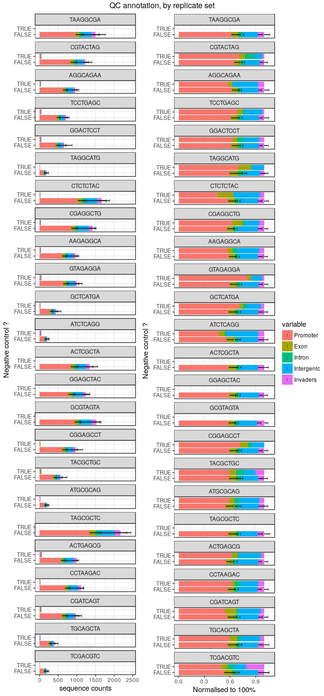

This experiment follows exactly the same design as for [experiment
7](Labcyte-RT_Data_Analysis_7_QC.md), except that we are using SuperScript IV and
its buffer.

We assessed again multiple combinations of TSO, RT primer and RNA amounts,
using a different stock of TSOs (PO_8268526), purchased earlier but apparently
of better quality (see [experiment 6](Labcyte-RT_Data_Analysis_6.md)), and
with a more extensive randomisation of TSO barcodes and well coordinates
(see designs [6a](Labcyte-RT6a.md), [6b](Labcyte-RT6b.md), [6c](Labcyte-RT6c.md) and [6d](Labcyte-RT6d.md)).

Load R packages
===============


```r
library("CAGEr")
library("ggplot2")
library("magrittr")
library("MultiAssayExperiment")
library("SummarizedExperiment")
library("viridis")
```


Load CAGE libraries
===================

Load summary statistics from MOIRAI
-----------------------------------

MOIRAI shortcuts


```r
MISEQ_RUN      <- "180606_M00528_0367_000000000-BN3FG"
WORKFLOW       <- "OP-WORKFLOW-CAGEscan-short-reads-v2.1.2"
MOIRAI_STAMP   <- "20180609170307"
MOIRAI_PROJ    <- "project/Labcyte_test_decoy" 
MOIRAI_USER    <- "nanoCAGE2" 
ASSEMBLY       <- "mm9"
BASEDIR        <- "/osc-fs_home/scratch/moirai"
MOIRAI_BASE    <- file.path(BASEDIR, MOIRAI_USER)
MOIRAI_RESULTS <- file.path(MOIRAI_BASE, MOIRAI_PROJ, paste(MISEQ_RUN, WORKFLOW, MOIRAI_STAMP, sep = "."))
```


```r
ce <- smallCAGEqc::loadMoiraiStats(
  pipeline  = WORKFLOW,
  multiplex = file.path( MOIRAI_BASE, "input", paste0(MISEQ_RUN, ".multiplex.txt")),
  summary   = file.path( MOIRAI_RESULTS, "text", "summary.txt")) %>% DataFrame

ce$inputFiles <- paste0(MOIRAI_RESULTS, "/CAGEscan_fragments/", ce$samplename, ".bed")

# Discard lines for which input files do not exist.
ce <- ce[sapply(ce$inputFiles, file.exists),]

# Discard lines for which input files are empty.
ce <- ce[file.info(ce$inputFiles)$size != 0,]

ce$inputFilesType <- c("bed")
ce$sampleLabels <- as.character(ce$samplename)

ce <- ce[ce$group != "decoy",]  # Temporary fix

ce
```

```
## DataFrame with 1531 rows and 16 columns
##                      samplename    group  barcode    index     total
##                        <factor> <factor> <factor> <factor> <numeric>
## CTGCGT_TAAGGCGA CTGCGT_TAAGGCGA TAAGGCGA   CTGCGT TAAGGCGA         0
## GCTGCA_TAAGGCGA GCTGCA_TAAGGCGA TAAGGCGA   GCTGCA TAAGGCGA         0
## CGATAC_TAAGGCGA CGATAC_TAAGGCGA TAAGGCGA   CGATAC TAAGGCGA         0
## ACAGAT_TAAGGCGA ACAGAT_TAAGGCGA TAAGGCGA   ACAGAT TAAGGCGA         0
## AGTAGC_TAAGGCGA AGTAGC_TAAGGCGA TAAGGCGA   AGTAGC TAAGGCGA         0
## ...                         ...      ...      ...      ...       ...
## GTAGAT_TCGACGTC GTAGAT_TCGACGTC TCGACGTC   GTAGAT TCGACGTC         0
## AGTCTC_TCGACGTC AGTCTC_TCGACGTC TCGACGTC   AGTCTC TCGACGTC         0
## ATCTAC_TCGACGTC ATCTAC_TCGACGTC TCGACGTC   ATCTAC TCGACGTC         0
## ACATAC_TCGACGTC ACATAC_TCGACGTC TCGACGTC   ACATAC TCGACGTC         0
## CTGCAG_TCGACGTC CTGCAG_TCGACGTC TCGACGTC   CTGCAG TCGACGTC         0
##                 extracted   cleaned   tagdust      rdna    spikes
##                 <numeric> <numeric> <numeric> <numeric> <numeric>
## CTGCGT_TAAGGCGA      3732      1497        74      2159         2
## GCTGCA_TAAGGCGA      3100      1956        68      1076         0
## CGATAC_TAAGGCGA      3170      2076        74      1019         1
## ACAGAT_TAAGGCGA      3706      1940        69      1694         3
## AGTAGC_TAAGGCGA      5899      3770       105      2022         2
## ...                   ...       ...       ...       ...       ...
## GTAGAT_TCGACGTC      2517       750      1614       153         0
## AGTCTC_TCGACGTC     15236      2419     11690      1126         1
## ATCTAC_TCGACGTC     17157      4246     12148       761         2
## ACATAC_TCGACGTC     13215      3218      9133       862         2
## CTGCAG_TCGACGTC     13139      3467      8357      1315         0
##                    mapped properpairs    counts
##                 <numeric>   <numeric> <numeric>
## CTGCGT_TAAGGCGA      1413        1223      1205
## GCTGCA_TAAGGCGA      1895        1657      1647
## CGATAC_TAAGGCGA      2015        1716      1703
## ACAGAT_TAAGGCGA      1849        1590      1584
## AGTAGC_TAAGGCGA      3637        3197      3178
## ...                   ...         ...       ...
## GTAGAT_TCGACGTC        81          47        36
## AGTCTC_TCGACGTC       715         518       369
## ATCTAC_TCGACGTC       380         207       128
## ACATAC_TCGACGTC       684         464       281
## CTGCAG_TCGACGTC       599         386       206
##                                                                                                                                                                                                        inputFiles
##                                                                                                                                                                                                       <character>
## CTGCGT_TAAGGCGA /osc-fs_home/scratch/moirai/nanoCAGE2/project/Labcyte_test_decoy/180606_M00528_0367_000000000-BN3FG.OP-WORKFLOW-CAGEscan-short-reads-v2.1.2.20180609170307/CAGEscan_fragments/CTGCGT_TAAGGCGA.bed
## GCTGCA_TAAGGCGA /osc-fs_home/scratch/moirai/nanoCAGE2/project/Labcyte_test_decoy/180606_M00528_0367_000000000-BN3FG.OP-WORKFLOW-CAGEscan-short-reads-v2.1.2.20180609170307/CAGEscan_fragments/GCTGCA_TAAGGCGA.bed
## CGATAC_TAAGGCGA /osc-fs_home/scratch/moirai/nanoCAGE2/project/Labcyte_test_decoy/180606_M00528_0367_000000000-BN3FG.OP-WORKFLOW-CAGEscan-short-reads-v2.1.2.20180609170307/CAGEscan_fragments/CGATAC_TAAGGCGA.bed
## ACAGAT_TAAGGCGA /osc-fs_home/scratch/moirai/nanoCAGE2/project/Labcyte_test_decoy/180606_M00528_0367_000000000-BN3FG.OP-WORKFLOW-CAGEscan-short-reads-v2.1.2.20180609170307/CAGEscan_fragments/ACAGAT_TAAGGCGA.bed
## AGTAGC_TAAGGCGA /osc-fs_home/scratch/moirai/nanoCAGE2/project/Labcyte_test_decoy/180606_M00528_0367_000000000-BN3FG.OP-WORKFLOW-CAGEscan-short-reads-v2.1.2.20180609170307/CAGEscan_fragments/AGTAGC_TAAGGCGA.bed
## ...                                                                                                                                                                                                           ...
## GTAGAT_TCGACGTC /osc-fs_home/scratch/moirai/nanoCAGE2/project/Labcyte_test_decoy/180606_M00528_0367_000000000-BN3FG.OP-WORKFLOW-CAGEscan-short-reads-v2.1.2.20180609170307/CAGEscan_fragments/GTAGAT_TCGACGTC.bed
## AGTCTC_TCGACGTC /osc-fs_home/scratch/moirai/nanoCAGE2/project/Labcyte_test_decoy/180606_M00528_0367_000000000-BN3FG.OP-WORKFLOW-CAGEscan-short-reads-v2.1.2.20180609170307/CAGEscan_fragments/AGTCTC_TCGACGTC.bed
## ATCTAC_TCGACGTC /osc-fs_home/scratch/moirai/nanoCAGE2/project/Labcyte_test_decoy/180606_M00528_0367_000000000-BN3FG.OP-WORKFLOW-CAGEscan-short-reads-v2.1.2.20180609170307/CAGEscan_fragments/ATCTAC_TCGACGTC.bed
## ACATAC_TCGACGTC /osc-fs_home/scratch/moirai/nanoCAGE2/project/Labcyte_test_decoy/180606_M00528_0367_000000000-BN3FG.OP-WORKFLOW-CAGEscan-short-reads-v2.1.2.20180609170307/CAGEscan_fragments/ACATAC_TCGACGTC.bed
## CTGCAG_TCGACGTC /osc-fs_home/scratch/moirai/nanoCAGE2/project/Labcyte_test_decoy/180606_M00528_0367_000000000-BN3FG.OP-WORKFLOW-CAGEscan-short-reads-v2.1.2.20180609170307/CAGEscan_fragments/CTGCAG_TCGACGTC.bed
##                 inputFilesType    sampleLabels
##                    <character>     <character>
## CTGCGT_TAAGGCGA            bed CTGCGT_TAAGGCGA
## GCTGCA_TAAGGCGA            bed GCTGCA_TAAGGCGA
## CGATAC_TAAGGCGA            bed CGATAC_TAAGGCGA
## ACAGAT_TAAGGCGA            bed ACAGAT_TAAGGCGA
## AGTAGC_TAAGGCGA            bed AGTAGC_TAAGGCGA
## ...                        ...             ...
## GTAGAT_TCGACGTC            bed GTAGAT_TCGACGTC
## AGTCTC_TCGACGTC            bed AGTCTC_TCGACGTC
## ATCTAC_TCGACGTC            bed ATCTAC_TCGACGTC
## ACATAC_TCGACGTC            bed ACATAC_TCGACGTC
## CTGCAG_TCGACGTC            bed CTGCAG_TCGACGTC
```


Load plate design
-----------------

Using transfer designs [6a](Labcyte-RT6a.md), [6b](Labcyte-RT6b.md), [6c](Labcyte-RT6c.md) and [6d](Labcyte-RT6d.md).


```r
plate <- rbind(
  cbind(read.table("plate6a.txt", sep = "\t", header=TRUE, stringsAsFactors=FALSE), repl="Q2")
, cbind(read.table("plate6b.txt", sep = "\t", header=TRUE, stringsAsFactors=FALSE), repl="R2")
, cbind(read.table("plate6c.txt", sep = "\t", header=TRUE, stringsAsFactors=FALSE), repl="S2")
, cbind(read.table("plate6d.txt", sep = "\t", header=TRUE, stringsAsFactors=FALSE), repl="T2"))

stopifnot(identical(plate, plate[!duplicated(plate),]))

ce %<>% cbind(plate[match( paste(ce$barcode, ce$index)
                         , paste(plate$BARCODE_SEQ, plate$INDEX)), ])

ce$index %<>% factor(levels = unique(plate$INDEX))  # Keep original order of indexes.
ce$plateID <- ce$repl # Define plate IDs

rownames(ce) %<>% paste(ce$plateID, sep = "_")
ce$sampleLabels <- rownames(ce)

ce$RNA_factor <- ce$RNA %>%
  factor(labels = c("no RNA", "1 pg RNA", "10 pg RNA", "100 pg RNA", "1 ng RNA", "10 ng RNA", "100 ng RNA"))

rm(plate)
```


Create a CAGEexp object and load expression data
------------------------------------------------


```r
if(file.exists(paste0("Labcyte-RT_Data_Analysis_", expNumber, ".Rds"))) {
  ce <- readRDS(paste0("Labcyte-RT_Data_Analysis_", expNumber, ".Rds"))
} else {
  getCTSS(ce, useMulticore = TRUE)
  removeStrandInvaders(ce)
}
```


Annotation with GENCODE
-----------------------

Collect annotations and gene symbols via a local GENCODE file
(mm9 GENCODE not available in AnnotationHub)


```r
if(file.exists(paste0("Labcyte-RT_Data_Analysis_", expNumber, ".Rds"))) {
  print("Annotated data loaded from file")
  } else {
  annotateCTSS(ce, rtracklayer::import.gff("/osc-fs_home/scratch/gmtu/annotation/mus_musculus/gencode-M1/gencode.vM1.annotation.gtf.gz"))
  }
```

```
## [1] "Annotated data loaded from file"
```


Save the CAGEexp file
---------------------


```r
if(!file.exists(paste0("Labcyte-RT_Data_Analysis_", expNumber, ".Rds")))
  saveRDS(ce, paste0("Labcyte-RT_Data_Analysis_", expNumber, ".Rds"))
```


Quality controls
================

Custom _scopes_ displaying _strand invasion_ artefacts.


```r
source("customScopes.R", echo = TRUE)
```

```
## 
## > msScope_qcSI <- function(libs) {
## +     libs$Tag_dust <- libs$extracted - libs$rdna - libs$spikes - 
## +         libs$cleaned
## +     libs$rDNA <- libs$r .... [TRUNCATED] 
## 
## > msScope_counts <- function(libs) {
## +     libs$Promoter <- libs$promoter
## +     libs$Exon <- libs$exon
## +     libs$Intron <- libs$intron
## +     libs$Int .... [TRUNCATED] 
## 
## > msScope_libSizeNormByBarcode <- function(libs) {
## +     libs$Yield <- libs$libSizeNormByBarcode
## +     list(libs = libs, columns = c("Yield"), total = .... [TRUNCATED] 
## 
## > msScope_libSizeNormByIndex <- function(libs) {
## +     libs$Yield <- libs$libSizeNormByIndex
## +     list(libs = libs, columns = c("Yield"), total = lib .... [TRUNCATED] 
## 
## > msScope_libSize <- function(libs) {
## +     libs$Yield <- libs$librarySizes
## +     list(libs = libs, columns = c("Yield"), total = libs$Yield)
## + }
```


Negative controls
-----------------

Some negative controls did not give any sequence and therefore are not in the
CAGEr object at all.


```r
summary(ce$RNA_vol == 0)
```

```
##    Mode   FALSE    TRUE 
## logical    1512      19
```

There is a lot of reads in negative controls of libraries made with the smallest
amounts of RNA.


```r
ce$NC <- ce$RNA_vol == 0

ggpubr::ggarrange( legend = "right", common.legend = TRUE,
  plotAnnot( ce, scope = msScope_qcSI, group = "NC"
           , title = NULL, facet = "index", normalise = FALSE) +
    facet_wrap("facet", ncol = 1) +
    ylab("sequence counts") + xlab("Negative control ?"),
  plotAnnot( ce, scope = msScope_qcSI, group = "NC"
           , title = NULL, facet = "index", normalise = TRUE) +
    facet_wrap("facet", ncol = 1) +
    ylab("Normalised to 100%") + xlab("Negative control ?")
)  %>% ggpubr::annotate_figure(top="QC report, by replicate set")
```

<!-- -->

Fortunately, the number of detected molecules is clearly lower in negative
controls, which rules out sample swap.


```r
ggpubr::ggarrange( legend = "right", common.legend = TRUE,
  plotAnnot( ce, scope = msScope_counts, group = "NC"
           , title = NULL, facet = "index", normalise = FALSE) +
    facet_wrap("facet", ncol = 1) +
    ylab("sequence counts") + xlab("Negative control ?"),
  plotAnnot( ce, scope = msScope_counts, group = "NC"
           , title = NULL, facet = "index", normalise = TRUE) +
    facet_wrap("facet", ncol = 1) +
    ylab("Normalised to 100%") + xlab("Negative control ?")
)  %>% ggpubr::annotate_figure(top="QC annotation, by replicate set")
```

<!-- -->


### Removal of the RNA-negative controls

To ease data handling, the negative controls with no RNA are removed.  By design
all of these negative controls had 10 μM TSO.


```r
colData(ce[,ce$NC]) %>% data.frame %>% summary
```

```
## harmonizing input:
##   removing 1512 sampleMap rows with 'colname' not in colnames of experiments
##   removing 1512 colData rownames not in sampleMap 'primary'
```

```
##            samplename      group       barcode       index        total  
##  ACATCT_TGCAGCTA: 1   AAGAGGCA: 1   CACGCA :4   CGTACTAG: 1   Min.   :0  
##  ATCAGC_AAGAGGCA: 1   ACTGAGCG: 1   CGATCT :4   AGGCAGAA: 1   1st Qu.:0  
##  ATCAGC_CTCTCTAC: 1   AGGCAGAA: 1   GCTCGT :3   TCCTGAGC: 1   Median :0  
##  CACGCA_CCTAAGAC: 1   ATCTCAGG: 1   GTATCT :3   GGACTCCT: 1   Mean   :0  
##  CACGCA_CGAGGCTG: 1   ATGCGCAG: 1   ATCAGC :2   TAGGCATG: 1   3rd Qu.:0  
##  CACGCA_CGTACTAG: 1   CCTAAGAC: 1   TCGAGC :2   CTCTCTAC: 1   Max.   :0  
##  (Other)        :13   (Other) :13   (Other):1   (Other) :13              
##    extracted         cleaned          tagdust            rdna       
##  Min.   : 113.0   Min.   :  55.0   Min.   :   0.0   Min.   : 16.00  
##  1st Qu.: 164.0   1st Qu.:  74.5   1st Qu.:   8.0   1st Qu.: 40.50  
##  Median : 209.0   Median :  92.0   Median :  36.0   Median : 76.00  
##  Mean   :1020.9   Mean   : 311.1   Mean   : 636.8   Mean   : 73.05  
##  3rd Qu.: 654.5   3rd Qu.: 176.0   3rd Qu.: 427.0   3rd Qu.:107.50  
##  Max.   :8001.0   Max.   :2263.0   Max.   :5709.0   Max.   :138.00  
##                                                                     
##      spikes      mapped        properpairs        counts     
##  Min.   :0   Min.   : 27.00   Min.   :17.00   Min.   :13.00  
##  1st Qu.:0   1st Qu.: 40.50   1st Qu.:23.00   1st Qu.:22.00  
##  Median :0   Median : 57.00   Median :36.00   Median :35.00  
##  Mean   :0   Mean   : 55.74   Mean   :36.21   Mean   :34.79  
##  3rd Qu.:0   3rd Qu.: 64.00   3rd Qu.:49.00   3rd Qu.:46.50  
##  Max.   :0   Max.   :101.00   Max.   :57.00   Max.   :57.00  
##                                                              
##   inputFiles        inputFilesType     sampleLabels      
##  Length:19          Length:19          Length:19         
##  Class :character   Class :character   Class :character  
##  Mode  :character   Mode  :character   Mode  :character  
##                                                          
##                                                          
##                                                          
##                                                          
##      well               row                 col            sxt           
##  Length:19          Length:19          Min.   : 1.00   Length:19         
##  Class :character   Class :character   1st Qu.:10.50   Class :character  
##  Mode  :character   Mode  :character   Median :12.00   Mode  :character  
##                                        Mean   :13.47                     
##                                        3rd Qu.:18.50                     
##                                        Max.   :24.00                     
##                                                                          
##    BARCODE_ID      TSO_source    TSO_vol        TSO         RT_PRIMERS
##  Min.   : 8.00   Min.   :25   Min.   :25   Min.   :1.25   Min.   :1   
##  1st Qu.:32.00   1st Qu.:25   1st Qu.:25   1st Qu.:1.25   1st Qu.:1   
##  Median :44.00   Median :25   Median :25   Median :1.25   Median :1   
##  Mean   :51.58   Mean   :25   Mean   :25   Mean   :1.25   Mean   :1   
##  3rd Qu.:74.00   3rd Qu.:25   3rd Qu.:25   3rd Qu.:1.25   3rd Qu.:1   
##  Max.   :92.00   Max.   :25   Max.   :25   Max.   :1.25   Max.   :1   
##                                                                       
##  RT_PRIMERS_vol MASTER_MIX_vol    INDEX                RNA       RNA_vol 
##  Min.   :25     Min.   :350    Length:19          Min.   :0   Min.   :0  
##  1st Qu.:25     1st Qu.:350    Class :character   1st Qu.:0   1st Qu.:0  
##  Median :25     Median :350    Mode  :character   Median :0   Median :0  
##  Mean   :25     Mean   :350                       Mean   :0   Mean   :0  
##  3rd Qu.:25     3rd Qu.:350                       3rd Qu.:0   3rd Qu.:0  
##  Max.   :25     Max.   :350                       Max.   :0   Max.   :0  
##                                                                          
##     H2O_vol    BARCODE_SEQ         RNA_level          RTP_level        
##  Min.   :100   Length:19          Length:19          Length:19         
##  1st Qu.:100   Class :character   Class :character   Class :character  
##  Median :100   Mode  :character   Mode  :character   Mode  :character  
##  Mean   :100                                                           
##  3rd Qu.:100                                                           
##  Max.   :100                                                           
##                                                                        
##  plateID repl        RNA_factor  librarySizes  strandInvaders 
##  Q2:5    Q2:5   no RNA    :19   Min.   :11.0   Min.   :0.000  
##  R2:6    R2:6   1 pg RNA  : 0   1st Qu.:21.0   1st Qu.:1.000  
##  S2:3    S2:3   10 pg RNA : 0   Median :33.0   Median :2.000  
##  T2:5    T2:5   100 pg RNA: 0   Mean   :33.0   Mean   :1.789  
##                 1 ng RNA  : 0   3rd Qu.:44.5   3rd Qu.:2.500  
##                 10 ng RNA : 0   Max.   :55.0   Max.   :5.000  
##                 100 ng RNA: 0                                 
##     promoter          exon           intron         unknown      
##  Min.   : 7.00   Min.   :1.000   Min.   :0.000   Min.   : 2.000  
##  1st Qu.:14.00   1st Qu.:2.000   1st Qu.:1.000   1st Qu.: 4.000  
##  Median :20.00   Median :2.000   Median :1.000   Median : 6.000  
##  Mean   :21.47   Mean   :2.684   Mean   :1.421   Mean   : 7.421  
##  3rd Qu.:30.00   3rd Qu.:3.500   3rd Qu.:1.500   3rd Qu.: 9.500  
##  Max.   :37.00   Max.   :7.000   Max.   :5.000   Max.   :16.000  
##                                                                  
##     NC         
##  Mode:logical  
##  TRUE:19       
##                
##                
##                
##                
## 
```

```r
ce.bak <- ce
ce     <- ce[, ! ce$NC]
```

```
## harmonizing input:
##   removing 19 sampleMap rows with 'colname' not in colnames of experiments
##   removing 19 colData rownames not in sampleMap 'primary'
```


By replicate
------------

Replicates are consistent with each other.  This time, there are not excesses
of artefacts in high-RNA libraries.


```r
plotAnnot( ce, scope = msScope_qcSI, group = "RT_PRIMERS", normalise = FALSE
           , title = NULL, facet = "index") + ylab("Number of read pairs") +
  xlab(NULL) + facet_wrap(~facet, ncol = 6, scale = "free")
```

<!-- -->

```r
plotAnnot( ce, scope = msScope_qcSI, group = "RT_PRIMERS", normalise = TRUE
           , title = NULL, facet = "index") + ylab("Number of read pairs") +
  xlab(NULL) + facet_wrap(~facet, ncol = 6, scale = "fixed")
```

<!-- -->

```r
plotAnnot( ce, scope = msScope_qcSI, group = "TSO", normalise = FALSE
           , title = NULL, facet = "index") + ylab("Number of read pairs") +
  xlab(NULL) + facet_wrap(~facet, ncol = 6, scale = "free")
```

<!-- -->

The multiplexing of the libraries is well balanced.


```r
plotAnnot( ce, scope = msScope_qcSI, group = "index", normalise = FALSE
           , title = NULL, facet = "plateID") + ylab("Number of read pairs") +
  xlab(NULL) + facet_wrap(~facet, ncol = 4, scale = "free")
```

<!-- -->


By barcode
----------


```r
Tier_A <- c(  3, 15, 27, 39, 51, 63, 75
           , 10, 22, 34, 46, 58, 70, 82
           , 11, 23, 35, 47, 59, 71, 83)

Tier_B <- c(  1, 13, 25, 37, 49, 61, 73
           ,  2, 14, 26, 38, 50, 62, 74
           ,  7, 19, 31, 43, 55, 67, 79)

Tier_C <- c(  4, 16, 28, 40, 52, 64, 76
           ,  5, 17, 29, 41, 65, 77, 89
           ,  6, 18, 30, 42, 66, 78, 90)

Tier_N <- c(  8, 20, 32, 44, 68, 80, 92)

ce$BN <- factor(ce$BARCODE_ID, levels = c(Tier_A, Tier_B, Tier_C, Tier_N))

plotAnnot( ce, scope = msScope_qcSI, group = "repl"
           , title = "Sequence counts"
           , facet = "BN", normalise = FALSE) +
  facet_wrap(~facet, ncol=7)
```

<!-- -->

```r
plotAnnot( ce, scope = msScope_qcSI, group = "repl"
           , title = "Sequence counts (normalised)"
           , facet = "BN", normalise = TRUE) +
  facet_wrap(~facet, ncol=7)
```

<!-- -->

```r
plotAnnot( ce, scope = msScope_counts, group = "repl"
           , title = "Annotation counts"
           , facet = "BN", normalise = FALSE) +
  facet_wrap(~facet, ncol=7)
```

<!-- -->


By RT primer quantity
---------------------

Strangely, libraries made with no RT primers have a QC profile that is not
dramatically different from other libraries.  This might again be explained
by contaminations, although the amount of sequences in the "no RT primer"
samples is a bit high for such an explanation.


```r
ggpubr::ggarrange(legend = "right", common.legend = TRUE,
  plotAnnot( ce, scope = msScope_qcSI, group = "RT_PRIMERS", normalise = FALSE
           , title = NULL) + ylab("Number of read pairs") + xlab(NULL),
  plotAnnot( ce, scope = msScope_qcSI, group = "RT_PRIMERS", normalise = TRUE
         , title = NULL) + ylab("Normalised to 100 %") + xlab(NULL)) %>%
  ggpubr::annotate_figure(top="QC control, by amount of RT primers (in μM)")
```

<!-- -->


```r
ggpubr::ggarrange(legend = "right", common.legend = TRUE,
  plotAnnot( ce, scope = msScope_counts, group = "RT_PRIMERS", normalise = FALSE
           , title = NULL) + ylab("Number of read pairs") + xlab(NULL),
  plotAnnot( ce, scope = msScope_counts, group = "RT_PRIMERS", normalise = TRUE
         , title = NULL) + ylab("Normalised to 100 %") + xlab(NULL)) %>%
  ggpubr::annotate_figure(top="QC annotation, by amount of RT primers (in μM)")
```

<!-- -->

### Removal of the primer-negative controls

To ease data handling (for instance when working with primer ratios), the
negative controls with no primers are removed.


```r
ce <- ce[,ce$RT_PRIMERS != 0]
```

```
## harmonizing input:
##   removing 216 sampleMap rows with 'colname' not in colnames of experiments
##   removing 216 colData rownames not in sampleMap 'primary'
```


## By TSO concentration


```r
ggpubr::ggarrange(legend = "right",
  plotAnnot( ce, scope = msScope_qcSI, group = "TSO", facet="RNA"
           , normalise = FALSE, title = "Yield") +
    ylab("Number of read pairs") + xlab("TSO") +
    facet_wrap(~facet, ncol = 1),
  plotAnnot( ce, scope = msScope_qcSI, group = "TSO", facet="RNA"
           , normalise = TRUE, title = "QC report") +
    ylab("Normalised to 100 %") + xlab(NULL) +
    facet_wrap(~facet, ncol = 1)) %>%
  ggpubr::annotate_figure(top="QC control, by TSO concentration and amount of RNA (ng)")
```

<!-- -->


## By RTP concentration


```r
ggpubr::ggarrange(legend = "right",
    plotAnnot( ce, scope = msScope_qcSI, group = "RT_PRIMERS", facet="RNA"
           , normalise = FALSE, title = "Yield") +
    ylab("Number of read pairs") + xlab("TSO") +
    facet_wrap(~facet, ncol = 1),
  plotAnnot( ce, scope = msScope_qcSI, group = "RT_PRIMERS", facet="RNA"
           , normalise = TRUE, title = "QC report") +
    ylab("Normalised to 100 %") + xlab(NULL) +
    facet_wrap(~facet, ncol = 1)) %>%
  ggpubr::annotate_figure(top="QC control, by RTP concentration and amount of RNA (ng)")
```

<!-- -->


Session information
===================


```r
sessionInfo()
```

```
## R version 3.4.3 (2017-11-30)
## Platform: x86_64-pc-linux-gnu (64-bit)
## Running under: Debian GNU/Linux 9 (stretch)
## 
## Matrix products: default
## BLAS: /usr/lib/libblas/libblas.so.3.7.0
## LAPACK: /usr/lib/lapack/liblapack.so.3.7.0
## 
## locale:
##  [1] LC_CTYPE=en_GB.UTF-8       LC_NUMERIC=C              
##  [3] LC_TIME=en_GB.UTF-8        LC_COLLATE=en_GB.UTF-8    
##  [5] LC_MONETARY=en_GB.UTF-8    LC_MESSAGES=en_GB.UTF-8   
##  [7] LC_PAPER=en_GB.UTF-8       LC_NAME=C                 
##  [9] LC_ADDRESS=C               LC_TELEPHONE=C            
## [11] LC_MEASUREMENT=en_GB.UTF-8 LC_IDENTIFICATION=C       
## 
## attached base packages:
## [1] parallel  stats4    stats     graphics  grDevices utils     datasets 
## [8] methods   base     
## 
## other attached packages:
##  [1] viridis_0.4.0               viridisLite_0.2.0          
##  [3] SummarizedExperiment_1.9.14 DelayedArray_0.4.1         
##  [5] matrixStats_0.52.2          Biobase_2.38.0             
##  [7] GenomicRanges_1.31.19       GenomeInfoDb_1.15.5        
##  [9] IRanges_2.13.26             S4Vectors_0.17.32          
## [11] BiocGenerics_0.25.3         MultiAssayExperiment_1.5.41
## [13] magrittr_1.5                ggplot2_2.2.1              
## [15] CAGEr_1.23.1               
## 
## loaded via a namespace (and not attached):
##  [1] nlme_3.1-131              bitops_1.0-6             
##  [3] RColorBrewer_1.1-2        rprojroot_1.3-2          
##  [5] tools_3.4.3               backports_1.1.2          
##  [7] R6_2.2.2                  vegan_2.4-5              
##  [9] platetools_0.0.2          KernSmooth_2.23-15       
## [11] lazyeval_0.2.1            mgcv_1.8-22              
## [13] colorspace_1.3-2          permute_0.9-4            
## [15] gridExtra_2.3             compiler_3.4.3           
## [17] VennDiagram_1.6.18        rtracklayer_1.39.9       
## [19] labeling_0.3              scales_0.5.0             
## [21] stringr_1.3.0             digest_0.6.15            
## [23] Rsamtools_1.31.3          rmarkdown_1.9            
## [25] stringdist_0.9.4.6        XVector_0.19.8           
## [27] pkgconfig_2.0.1           htmltools_0.3.6          
## [29] BSgenome_1.47.5           rlang_0.2.0              
## [31] VGAM_1.0-4                bindr_0.1                
## [33] BiocParallel_1.12.0       gtools_3.5.0             
## [35] dplyr_0.7.4               RCurl_1.95-4.10          
## [37] GenomeInfoDbData_0.99.1   futile.logger_1.4.3      
## [39] smallCAGEqc_0.12.2.999999 Matrix_1.2-12            
## [41] Rcpp_0.12.16              munsell_0.4.3            
## [43] stringi_1.1.7             yaml_2.1.18              
## [45] MASS_7.3-47               zlibbioc_1.24.0          
## [47] plyr_1.8.4                grid_3.4.3               
## [49] gdata_2.18.0              lattice_0.20-35          
## [51] cowplot_0.9.2             Biostrings_2.47.9        
## [53] splines_3.4.3             knitr_1.20               
## [55] beanplot_1.2              pillar_1.2.1             
## [57] ggpubr_0.1.6              reshape2_1.4.2           
## [59] codetools_0.2-15          futile.options_1.0.0     
## [61] XML_3.98-1.9              glue_1.2.0               
## [63] evaluate_0.10.1           lambda.r_1.2             
## [65] data.table_1.10.4-3       gtable_0.2.0             
## [67] purrr_0.2.4               tidyr_0.7.2              
## [69] reshape_0.8.7             assertthat_0.2.0         
## [71] tibble_1.4.2              som_0.3-5.1              
## [73] GenomicAlignments_1.15.12 memoise_1.1.0            
## [75] bindrcpp_0.2              cluster_2.0.6
```
