Here we assessed multiple combinations of dNTP and divalent cation concentrations,
using the stock of TSOs `PO_8268526` (see
[experiment 6](Labcyte-RT_Data_Analysis_6.md)), following design7 (plates
[7a](Labcyte-RT7a.md), [7b](Labcyte-RT7b.md), [7c](Labcyte-RT7c.md) and 
[7d](Labcyte-RT7d.md)).


Load R packages
===============


```r
library("CAGEr")
library("ggplot2")
library("magrittr")
library("MultiAssayExperiment")
library("SummarizedExperiment")
library("viridis")
```


Load CAGE libraries
===================

Load summary statistics from MOIRAI
-----------------------------------

MOIRAI shortcuts


```r
MISEQ_RUN      <- "180607_M00528_0368_000000000-BN9KM"
WORKFLOW       <- "OP-WORKFLOW-CAGEscan-short-reads-v2.1.2"
MOIRAI_STAMP   <- "20180611064626"
MOIRAI_PROJ    <- "project/Labcyte_test_decoy" 
MOIRAI_USER    <- "nanoCAGE2" 
ASSEMBLY       <- "mm9"
BASEDIR        <- "/osc-fs_home/scratch/moirai"
MOIRAI_BASE    <- file.path(BASEDIR, MOIRAI_USER)
MOIRAI_RESULTS <- file.path(MOIRAI_BASE, MOIRAI_PROJ, paste(MISEQ_RUN, WORKFLOW, MOIRAI_STAMP, sep = "."))
```


```r
ce <- smallCAGEqc::loadMoiraiStats(
  pipeline  = WORKFLOW,
  multiplex = file.path( MOIRAI_BASE, "input", paste0(MISEQ_RUN, ".multiplex.txt")),
  summary   = file.path( MOIRAI_RESULTS, "text", "summary.txt")) %>% DataFrame

ce$inputFiles <- paste0(MOIRAI_RESULTS, "/CAGEscan_fragments/", ce$samplename, ".bed")

# Discard lines for which input files do not exist.
ce <- ce[sapply(ce$inputFiles, file.exists),]

# Discard lines for which input files are empty.
ce <- ce[file.info(ce$inputFiles)$size != 0,]

ce$inputFilesType <- c("bed")
ce$sampleLabels <- as.character(ce$samplename)

ce <- ce[ce$group != "decoy",]  # Temporary fix

ce
```

```
## DataFrame with 1531 rows and 16 columns
##                      samplename    group  barcode    index     total
##                        <factor> <factor> <factor> <factor> <numeric>
## CACGAT_TAAGGCGA CACGAT_TAAGGCGA TAAGGCGA   CACGAT TAAGGCGA         0
## GAGCGT_TAAGGCGA GAGCGT_TAAGGCGA TAAGGCGA   GAGCGT TAAGGCGA         0
## CACTCT_TAAGGCGA CACTCT_TAAGGCGA TAAGGCGA   CACTCT TAAGGCGA         0
## ATCGTG_TAAGGCGA ATCGTG_TAAGGCGA TAAGGCGA   ATCGTG TAAGGCGA         0
## GAGCTC_TAAGGCGA GAGCTC_TAAGGCGA TAAGGCGA   GAGCTC TAAGGCGA         0
## ...                         ...      ...      ...      ...       ...
## GCTATA_TCGACGTC GCTATA_TCGACGTC TCGACGTC   GCTATA TCGACGTC         0
## CGACTC_TCGACGTC CGACTC_TCGACGTC TCGACGTC   CGACTC TCGACGTC         0
## CTGCGT_TCGACGTC CTGCGT_TCGACGTC TCGACGTC   CTGCGT TCGACGTC         0
## ATCACG_TCGACGTC ATCACG_TCGACGTC TCGACGTC   ATCACG TCGACGTC         0
## GAGTCT_TCGACGTC GAGTCT_TCGACGTC TCGACGTC   GAGTCT TCGACGTC         0
##                 extracted   cleaned   tagdust      rdna    spikes
##                 <numeric> <numeric> <numeric> <numeric> <numeric>
## CACGAT_TAAGGCGA       198       144        12        42         0
## GAGCGT_TAAGGCGA        67        49         4        14         0
## CACTCT_TAAGGCGA       169       130        16        23         0
## ATCGTG_TAAGGCGA       122        98         5        18         1
## GAGCTC_TAAGGCGA        56        42         1        13         0
## ...                   ...       ...       ...       ...       ...
## GCTATA_TCGACGTC        61        51         5         5         0
## CGACTC_TCGACGTC       257       186        19        52         0
## CTGCGT_TCGACGTC        30        26         0         4         0
## ATCACG_TCGACGTC     12416      8825       700      2888         3
## GAGTCT_TCGACGTC        36        28         4         4         0
##                    mapped properpairs    counts
##                 <numeric>   <numeric> <numeric>
## CACGAT_TAAGGCGA       137         119       110
## GAGCGT_TAAGGCGA        43          29        28
## CACTCT_TAAGGCGA       120          91        84
## ATCGTG_TAAGGCGA        94          77        71
## GAGCTC_TAAGGCGA        39          33        26
## ...                   ...         ...       ...
## GCTATA_TCGACGTC        46          39        35
## CGACTC_TCGACGTC       178         156       150
## CTGCGT_TCGACGTC        21          17        15
## ATCACG_TCGACGTC      8357        7279      6271
## GAGTCT_TCGACGTC        26          23        22
##                                                                                                                                                                                                        inputFiles
##                                                                                                                                                                                                       <character>
## CACGAT_TAAGGCGA /osc-fs_home/scratch/moirai/nanoCAGE2/project/Labcyte_test_decoy/180607_M00528_0368_000000000-BN9KM.OP-WORKFLOW-CAGEscan-short-reads-v2.1.2.20180611064626/CAGEscan_fragments/CACGAT_TAAGGCGA.bed
## GAGCGT_TAAGGCGA /osc-fs_home/scratch/moirai/nanoCAGE2/project/Labcyte_test_decoy/180607_M00528_0368_000000000-BN9KM.OP-WORKFLOW-CAGEscan-short-reads-v2.1.2.20180611064626/CAGEscan_fragments/GAGCGT_TAAGGCGA.bed
## CACTCT_TAAGGCGA /osc-fs_home/scratch/moirai/nanoCAGE2/project/Labcyte_test_decoy/180607_M00528_0368_000000000-BN9KM.OP-WORKFLOW-CAGEscan-short-reads-v2.1.2.20180611064626/CAGEscan_fragments/CACTCT_TAAGGCGA.bed
## ATCGTG_TAAGGCGA /osc-fs_home/scratch/moirai/nanoCAGE2/project/Labcyte_test_decoy/180607_M00528_0368_000000000-BN9KM.OP-WORKFLOW-CAGEscan-short-reads-v2.1.2.20180611064626/CAGEscan_fragments/ATCGTG_TAAGGCGA.bed
## GAGCTC_TAAGGCGA /osc-fs_home/scratch/moirai/nanoCAGE2/project/Labcyte_test_decoy/180607_M00528_0368_000000000-BN9KM.OP-WORKFLOW-CAGEscan-short-reads-v2.1.2.20180611064626/CAGEscan_fragments/GAGCTC_TAAGGCGA.bed
## ...                                                                                                                                                                                                           ...
## GCTATA_TCGACGTC /osc-fs_home/scratch/moirai/nanoCAGE2/project/Labcyte_test_decoy/180607_M00528_0368_000000000-BN9KM.OP-WORKFLOW-CAGEscan-short-reads-v2.1.2.20180611064626/CAGEscan_fragments/GCTATA_TCGACGTC.bed
## CGACTC_TCGACGTC /osc-fs_home/scratch/moirai/nanoCAGE2/project/Labcyte_test_decoy/180607_M00528_0368_000000000-BN9KM.OP-WORKFLOW-CAGEscan-short-reads-v2.1.2.20180611064626/CAGEscan_fragments/CGACTC_TCGACGTC.bed
## CTGCGT_TCGACGTC /osc-fs_home/scratch/moirai/nanoCAGE2/project/Labcyte_test_decoy/180607_M00528_0368_000000000-BN9KM.OP-WORKFLOW-CAGEscan-short-reads-v2.1.2.20180611064626/CAGEscan_fragments/CTGCGT_TCGACGTC.bed
## ATCACG_TCGACGTC /osc-fs_home/scratch/moirai/nanoCAGE2/project/Labcyte_test_decoy/180607_M00528_0368_000000000-BN9KM.OP-WORKFLOW-CAGEscan-short-reads-v2.1.2.20180611064626/CAGEscan_fragments/ATCACG_TCGACGTC.bed
## GAGTCT_TCGACGTC /osc-fs_home/scratch/moirai/nanoCAGE2/project/Labcyte_test_decoy/180607_M00528_0368_000000000-BN9KM.OP-WORKFLOW-CAGEscan-short-reads-v2.1.2.20180611064626/CAGEscan_fragments/GAGTCT_TCGACGTC.bed
##                 inputFilesType    sampleLabels
##                    <character>     <character>
## CACGAT_TAAGGCGA            bed CACGAT_TAAGGCGA
## GAGCGT_TAAGGCGA            bed GAGCGT_TAAGGCGA
## CACTCT_TAAGGCGA            bed CACTCT_TAAGGCGA
## ATCGTG_TAAGGCGA            bed ATCGTG_TAAGGCGA
## GAGCTC_TAAGGCGA            bed GAGCTC_TAAGGCGA
## ...                        ...             ...
## GCTATA_TCGACGTC            bed GCTATA_TCGACGTC
## CGACTC_TCGACGTC            bed CGACTC_TCGACGTC
## CTGCGT_TCGACGTC            bed CTGCGT_TCGACGTC
## ATCACG_TCGACGTC            bed ATCACG_TCGACGTC
## GAGTCT_TCGACGTC            bed GAGTCT_TCGACGTC
```


Load plate design
-----------------

Using transfer designs [6a](Labcyte-RT6a.md), [6b](Labcyte-RT6b.md), [6c](Labcyte-RT6c.md) and [6d](Labcyte-RT6d.md).


```r
plate <- rbind(
  cbind(read.table("plate7a.txt", sep = "\t", header=TRUE, stringsAsFactors=FALSE), repl="Q2")
, cbind(read.table("plate7b.txt", sep = "\t", header=TRUE, stringsAsFactors=FALSE), repl="R2")
, cbind(read.table("plate7c.txt", sep = "\t", header=TRUE, stringsAsFactors=FALSE), repl="S2")
, cbind(read.table("plate7d.txt", sep = "\t", header=TRUE, stringsAsFactors=FALSE), repl="T2"))

stopifnot(identical(plate, plate[!duplicated(plate),]))

ce %<>% cbind(plate[match( paste(ce$barcode, ce$index)
                         , paste(plate$BARCODE_SEQ, plate$INDEX)), ])

ce$index %<>% factor(levels = unique(plate$INDEX))  # Keep original order of indexes.
ce$plateID <- ce$repl # Define plate IDs

rownames(ce) %<>% paste(ce$plateID, sep = "_")
ce$sampleLabels <- rownames(ce)

rm(plate)
```


Create a CAGEexp object and load expression data
------------------------------------------------


```r
if(file.exists(paste0("Labcyte-RT_Data_Analysis_", expNumber, ".Rds"))) {
  ce <- readRDS(paste0("Labcyte-RT_Data_Analysis_", expNumber, ".Rds"))
} else {
  getCTSS(ce, useMulticore = TRUE)
  removeStrandInvaders(ce)
}
```


Annotation with GENCODE
-----------------------

Collect annotations and gene symbols via a local GENCODE file
(mm9 GENCODE not available in AnnotationHub)


```r
if(file.exists(paste0("Labcyte-RT_Data_Analysis_", expNumber, ".Rds"))) {
  print("Annotated data loaded from file")
  } else {
  annotateCTSS(ce, rtracklayer::import.gff("/osc-fs_home/scratch/gmtu/annotation/mus_musculus/gencode-M1/gencode.vM1.annotation.gtf.gz"))
  }
```

```
## [1] "Annotated data loaded from file"
```


Save the CAGEexp file
---------------------


```r
if(!file.exists(paste0("Labcyte-RT_Data_Analysis_", expNumber, ".Rds")))
  saveRDS(ce, paste0("Labcyte-RT_Data_Analysis_", expNumber, ".Rds"))
```


Quality controls
================

Custom _scopes_ displaying _strand invasion_ artefacts.


```r
source("customScopes.R", echo = TRUE)
```

```
## 
## > msScope_qcSI <- function(libs) {
## +     libs$Tag_dust <- libs$extracted - libs$rdna - libs$spikes - 
## +         libs$cleaned
## +     libs$rDNA <- libs$r .... [TRUNCATED] 
## 
## > msScope_counts <- function(libs) {
## +     libs$Promoter <- libs$promoter
## +     libs$Exon <- libs$exon
## +     libs$Intron <- libs$intron
## +     libs$Int .... [TRUNCATED] 
## 
## > msScope_libSizeNormByBarcode <- function(libs) {
## +     libs$Yield <- libs$libSizeNormByBarcode
## +     list(libs = libs, columns = c("Yield"), total = .... [TRUNCATED] 
## 
## > msScope_libSizeNormByIndex <- function(libs) {
## +     libs$Yield <- libs$libSizeNormByIndex
## +     list(libs = libs, columns = c("Yield"), total = lib .... [TRUNCATED] 
## 
## > msScope_libSize <- function(libs) {
## +     libs$Yield <- libs$librarySizes
## +     list(libs = libs, columns = c("Yield"), total = libs$Yield)
## + }
```


Negative controls
-----------------


```r
summary(ce$dNTP_vol == 0)
```

```
##    Mode   FALSE    TRUE 
## logical    1435      96
```


```r
ce$NC <- ce$dNTP_vol == 0

ggpubr::ggarrange( legend = "right", common.legend = TRUE,
  plotAnnot( ce, scope = msScope_qcSI, group = "NC"
           , title = NULL, facet = "index", normalise = FALSE) +
    facet_wrap("facet", ncol = 1) +
    ylab("sequence counts") + xlab("Negative control ?"),
  plotAnnot( ce, scope = msScope_qcSI, group = "NC"
           , title = NULL, facet = "index", normalise = TRUE) +
    facet_wrap("facet", ncol = 1) +
    ylab("Normalised to 100%") + xlab("Negative control ?")
)  %>% ggpubr::annotate_figure(top="QC report, by replicate set")
```

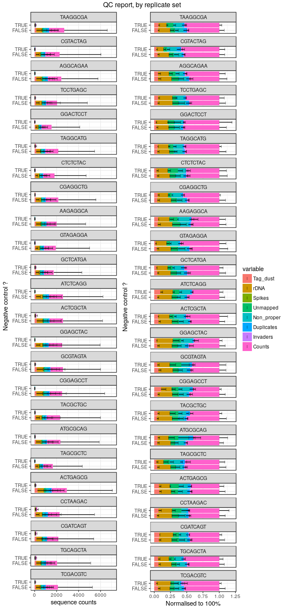<!-- -->

This looks good, but unfortunately it is misleading: only 0.5 [dTNP] produced
a large amount of reads.


```r
ggpubr::ggarrange(legend = "right", common.legend = TRUE,
  plotAnnot( ce, scope = msScope_qcSI, group = "dNTP", normalise = FALSE
           , title = NULL) + ylab("Number of read pairs") + xlab("dNTP (µM)"),
  plotAnnot( ce, scope = msScope_qcSI, group = "dNTP", normalise = TRUE
         , title = NULL) + ylab("Normalised to 100 %") + xlab(NULL)) %>%
  ggpubr::annotate_figure(top="QC control, by amount of dNTPs (in μM)")
```

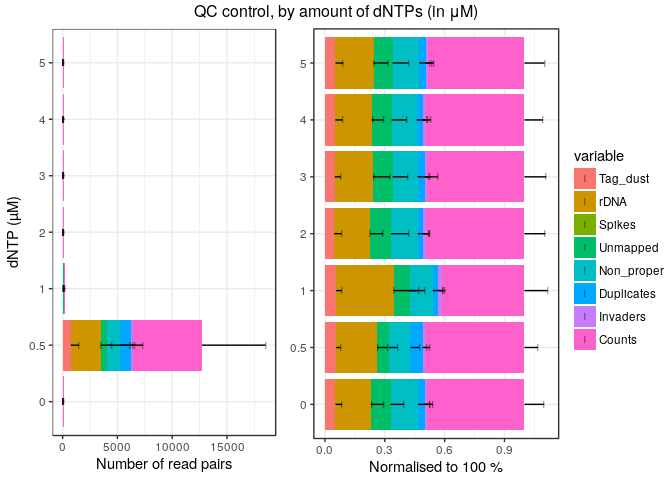<!-- -->

Once we remove the points at dNTP = 0.5, there is no difference between
controls and other data.


```r
ggpubr::ggarrange(legend = "right", common.legend = TRUE,
  plotAnnot( ce[,ce$dNTP !=0.5], scope = msScope_qcSI, group = "dNTP", normalise = FALSE
           , title = NULL) + ylab("Number of read pairs") + xlab("dNTP (µM)"),
  plotAnnot( ce[,ce$dNTP !=0.5], scope = msScope_qcSI, group = "dNTP", normalise = TRUE
         , title = NULL) + ylab("Normalised to 100 %") + xlab(NULL)) %>%
  ggpubr::annotate_figure(top="QC control, by amount of dNTPs (in μM)")
```

```
## harmonizing input:
##   removing 239 sampleMap rows with 'colname' not in colnames of experiments
##   removing 239 colData rownames not in sampleMap 'primary'
## harmonizing input:
##   removing 239 sampleMap rows with 'colname' not in colnames of experiments
##   removing 239 colData rownames not in sampleMap 'primary'
```

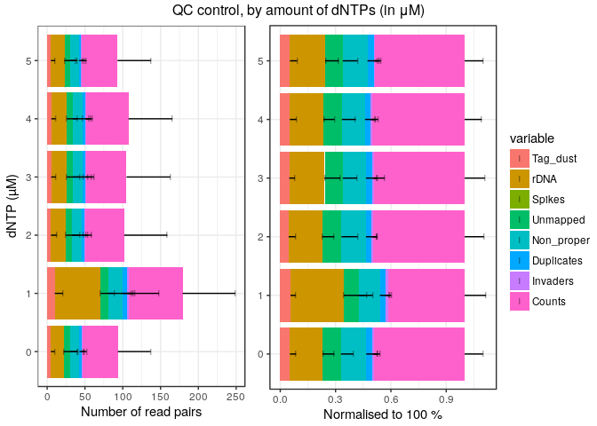<!-- -->


### Removal of the RNA-negative controls

To ease data handling, the negative controls with no RNA are removed.


```r
colData(ce[,ce$NC]) %>% data.frame %>% summary
```

```
## harmonizing input:
##   removing 1435 sampleMap rows with 'colname' not in colnames of experiments
##   removing 1435 colData rownames not in sampleMap 'primary'
```

```
##            samplename      group       barcode        index        total  
##  ACACAG_AGGCAGAA: 1   AAGAGGCA: 4   AGTGTG : 5   TAAGGCGA: 4   Min.   :0  
##  ACACAG_ATGCGCAG: 1   ACTCGCTA: 4   CGATAC : 3   CGTACTAG: 4   1st Qu.:0  
##  ACACGT_AGGCAGAA: 1   ACTGAGCG: 4   CGATGA : 3   AGGCAGAA: 4   Median :0  
##  ACACGT_GCTCATGA: 1   AGGCAGAA: 4   CTGCTC : 3   TCCTGAGC: 4   Mean   :0  
##  ACAGAT_AAGAGGCA: 1   ATCTCAGG: 4   GAGTCT : 3   GGACTCCT: 4   3rd Qu.:0  
##  ACAGAT_GCGTAGTA: 1   ATGCGCAG: 4   GTATGA : 3   TAGGCATG: 4   Max.   :0  
##  (Other)        :90   (Other) :72   (Other):76   (Other) :72              
##    extracted         cleaned          tagdust            rdna       
##  Min.   :  8.00   Min.   :  5.00   Min.   : 0.000   Min.   :  2.00  
##  1st Qu.: 47.75   1st Qu.: 37.50   1st Qu.: 2.000   1st Qu.:  6.00  
##  Median : 64.50   Median : 51.00   Median : 3.000   Median : 12.00  
##  Mean   : 93.47   Mean   : 71.44   Mean   : 4.948   Mean   : 16.99  
##  3rd Qu.:104.25   3rd Qu.: 79.25   3rd Qu.: 6.250   3rd Qu.: 20.00  
##  Max.   :589.00   Max.   :413.00   Max.   :29.000   Max.   :147.00  
##                                                                     
##      spikes            mapped        properpairs         counts      
##  Min.   :0.00000   Min.   :  5.00   Min.   :  3.00   Min.   :  3.00  
##  1st Qu.:0.00000   1st Qu.: 31.00   1st Qu.: 23.75   1st Qu.: 22.00  
##  Median :0.00000   Median : 46.00   Median : 37.50   Median : 34.00  
##  Mean   :0.09375   Mean   : 62.90   Mean   : 50.79   Mean   : 47.66  
##  3rd Qu.:0.00000   3rd Qu.: 69.75   3rd Qu.: 58.25   3rd Qu.: 56.00  
##  Max.   :2.00000   Max.   :347.00   Max.   :291.00   Max.   :288.00  
##                                                                      
##   inputFiles        inputFilesType     sampleLabels      
##  Length:96          Length:96          Length:96         
##  Class :character   Class :character   Class :character  
##  Mode  :character   Mode  :character   Mode  :character  
##                                                          
##                                                          
##                                                          
##                                                          
##      well               row                 col            sxt           
##  Length:96          Length:96          Min.   : 1.00   Length:96         
##  Class :character   Class :character   1st Qu.: 6.00   Class :character  
##  Mode  :character   Mode  :character   Median :12.00   Mode  :character  
##                                        Mean   :12.51                     
##                                        3rd Qu.:18.25                     
##                                        Max.   :24.00                     
##                                                                          
##    BARCODE_ID      TSO_source     TSO_vol        TSO       RT_PRIMERS
##  Min.   : 1.00   Min.   :200   Min.   :25   Min.   :10   Min.   :1   
##  1st Qu.:24.75   1st Qu.:200   1st Qu.:25   1st Qu.:10   1st Qu.:1   
##  Median :47.50   Median :200   Median :25   Median :10   Median :1   
##  Mean   :48.47   Mean   :200   Mean   :25   Mean   :10   Mean   :1   
##  3rd Qu.:70.00   3rd Qu.:200   3rd Qu.:25   3rd Qu.:10   3rd Qu.:1   
##  Max.   :92.00   Max.   :200   Max.   :25   Max.   :10   Max.   :1   
##                                                                      
##       RNA     RT_PRIMERS_RNA_vol     MMix           MASTER_MIX_vol
##  Min.   :10   Min.   :25         Length:96          Min.   :300   
##  1st Qu.:10   1st Qu.:25         Class :character   1st Qu.:300   
##  Median :10   Median :25         Mode  :character   Median :300   
##  Mean   :10   Mean   :25                            Mean   :300   
##  3rd Qu.:10   3rd Qu.:25                            3rd Qu.:300   
##  Max.   :10   Max.   :25                            Max.   :300   
##                                                                   
##     INDEX                 Mn          Mn_vol            Mg     
##  Length:96          Min.   :0.0   Min.   : 0.00   Min.   :0.0  
##  Class :character   1st Qu.:1.0   1st Qu.:25.00   1st Qu.:0.0  
##  Mode  :character   Median :2.5   Median :25.00   Median :1.5  
##                     Mean   :2.5   Mean   :20.83   Mean   :1.5  
##                     3rd Qu.:4.0   3rd Qu.:25.00   3rd Qu.:3.0  
##                     Max.   :5.0   Max.   :25.00   Max.   :3.0  
##                                                                
##      Mg_vol          dNTP      dNTP_vol    H2O_vol      BARCODE_SEQ       
##  Min.   : 0.0   Min.   :0   Min.   :0   Min.   :100.0   Length:96         
##  1st Qu.: 0.0   1st Qu.:0   1st Qu.:0   1st Qu.:100.0   Class :character  
##  Median :12.5   Median :0   Median :0   Median :125.0   Mode  :character  
##  Mean   :12.5   Mean   :0   Mean   :0   Mean   :116.7                     
##  3rd Qu.:25.0   3rd Qu.:0   3rd Qu.:0   3rd Qu.:125.0                     
##  Max.   :25.0   Max.   :0   Max.   :0   Max.   :150.0                     
##                                                                           
##    Mg_level           Mn_level          dNTP_level        plateID repl   
##  Length:96          Length:96          Length:96          Q2:24   Q2:24  
##  Class :character   Class :character   Class :character   R2:24   R2:24  
##  Mode  :character   Mode  :character   Mode  :character   S2:24   S2:24  
##                                                           T2:24   T2:24  
##                                                                          
##                                                                          
##                                                                          
##   librarySizes    strandInvaders    promoter           exon       
##  Min.   :  3.00   Min.   :0      Min.   :  2.00   Min.   : 0.000  
##  1st Qu.: 21.00   1st Qu.:0      1st Qu.: 16.75   1st Qu.: 1.000  
##  Median : 34.00   Median :0      Median : 27.00   Median : 2.000  
##  Mean   : 46.66   Mean   :1      Mean   : 37.83   Mean   : 2.385  
##  3rd Qu.: 55.25   3rd Qu.:1      3rd Qu.: 46.25   3rd Qu.: 3.000  
##  Max.   :285.00   Max.   :8      Max.   :231.00   Max.   :14.000  
##                                                                   
##      intron         unknown          NC         
##  Min.   :0.000   Min.   : 0.000   Mode:logical  
##  1st Qu.:0.000   1st Qu.: 2.000   TRUE:96       
##  Median :1.000   Median : 4.000                 
##  Mean   :1.458   Mean   : 4.979                 
##  3rd Qu.:2.000   3rd Qu.: 6.250                 
##  Max.   :9.000   Max.   :31.000                 
## 
```

```r
ce.bak <- ce
ce     <- ce[, ! ce$NC]
```

```
## harmonizing input:
##   removing 96 sampleMap rows with 'colname' not in colnames of experiments
##   removing 96 colData rownames not in sampleMap 'primary'
```


By replicate
------------

The multiplexing of the libraries is well balanced.


```r
plotAnnot( ce, scope = msScope_qcSI, group = "index", normalise = FALSE
           , title = NULL, facet = "plateID") + ylab("Number of read pairs") +
  xlab(NULL) + facet_wrap(~facet, ncol = 4, scale = "free")
```

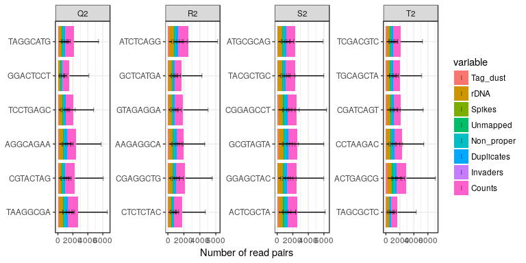<!-- -->

Replicates are consistent with each other.


```r
plotAnnot( ce, scope = msScope_qcSI, group = "dNTP", normalise = FALSE
         , title = NULL, facet = "index") + ylab("Number of read pairs") +
  xlab("dNTP") + facet_wrap(~facet, ncol = 6, scale = "free")
```

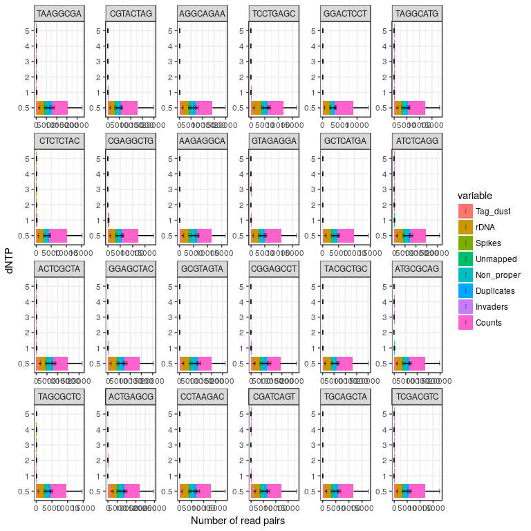<!-- -->

```r
plotAnnot( ce, scope = msScope_qcSI, group = "Mg", normalise = FALSE
         , title = NULL, facet = "index") + ylab("Number of read pairs") +
  xlab("Mg2+") + facet_wrap(~facet, ncol = 6, scale = "fixed")
```

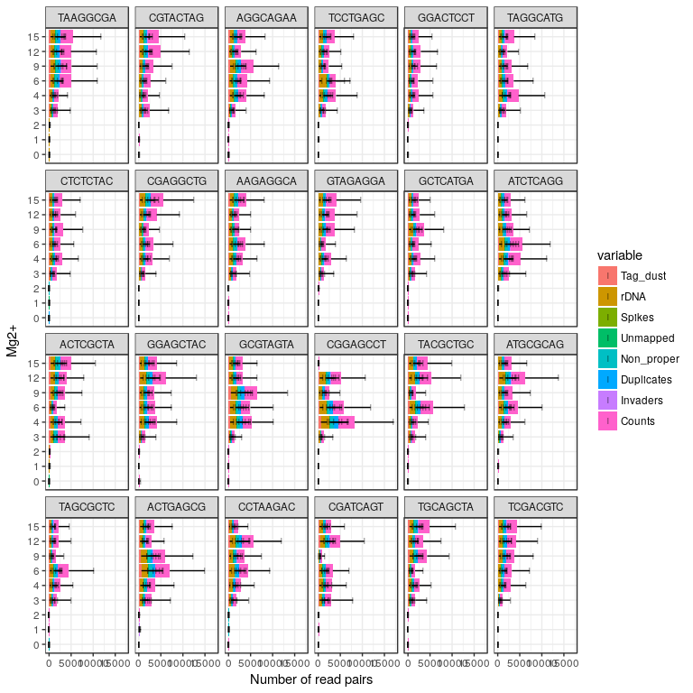<!-- -->

```r
plotAnnot( ce, scope = msScope_qcSI, group = "MMix", normalise = FALSE
         , title = NULL, facet = "index") + ylab("Number of read pairs") +
  xlab("Mastermix") + facet_wrap(~facet, ncol = 6, scale = "fixed")
```

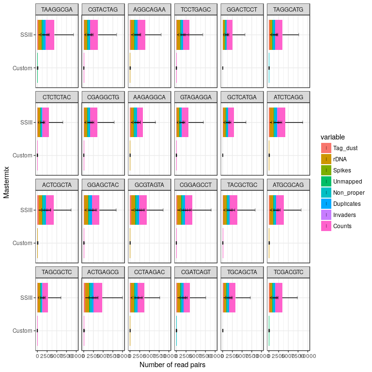<!-- -->


By barcode
----------

Barcodes are fully randomised, so the pattern below is expected.


```r
#           1   2   3   4   5   6   7
TSOs <- c(  1, 13, 25, 37, 49, 61, 73  # A
         ,  2, 14, 39, 38, 50, 62, 74  # B
         ,  4, 16, 28, 40, 64, 76, 88  # C
         ,  5, 17, 29, 41, 65, 77, 89  # D
         , 51, 18, 30, 42, 66, 78, 90  # E
         ,  7, 19, 31, 43, 67, 79, 91  # F
         ,  8, 87, 32, 44, 68, 80, 92  # G
         ,  9, 21, 33, 45, 69, 81, 24  # H 
         , 71, 23, 60, 47, 70, 83, 36  # I
         , 72, 22, 35, 46, 59, 82, 48) # J

plotAnnot( ce, scope = msScope_qcSI, group = "repl"
           , title = "Sequence counts"
           , facet = "BARCODE_SEQ", normalise = FALSE) +
  facet_wrap(~facet, ncol=8)
```

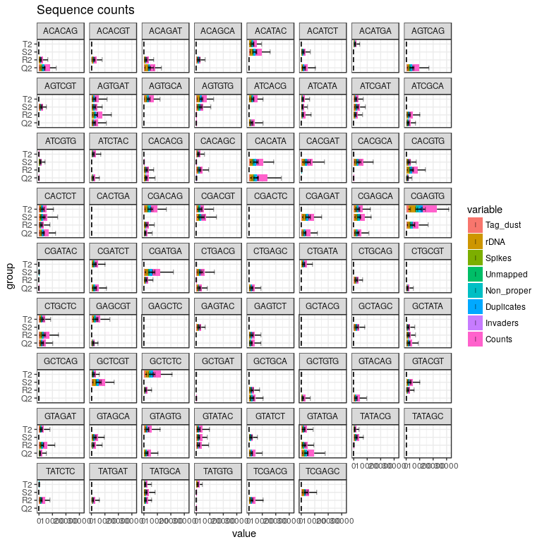<!-- -->


Focus on [dNTP] == 0.5 µM and SSIII mastermix 
---------------------------------------------


```r
ce <- ce[, ce$dNTP == 0.5 & ce$MMix == "SSIII"]
```

```
## harmonizing input:
##   removing 1291 sampleMap rows with 'colname' not in colnames of experiments
##   removing 1291 colData rownames not in sampleMap 'primary'
```

### By Mg concentration


```r
ggpubr::ggarrange(legend = "right",
  plotAnnot( ce, scope = msScope_qcSI, group = "Mg", facet="Mn"
           , normalise = FALSE, title = NULL) +
    ylab("Number of read pairs") + xlab("Mg2+") +
    facet_wrap(~facet, ncol = 1),
  plotAnnot( ce, scope = msScope_qcSI, group = "Mg", facet="Mn"
           , normalise = TRUE, title = NULL) +
    ylab("Normalised to 100 %") + xlab(NULL) +
    facet_wrap(~facet, ncol = 1)) %>%
  ggpubr::annotate_figure(top="QC control, by Mg and Mn concentrations (µM)")
```

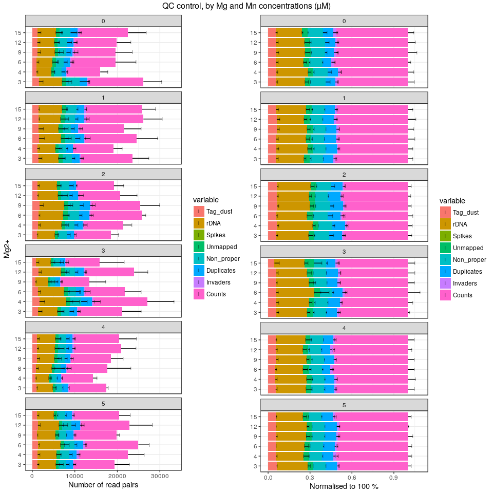<!-- -->


```r
ggpubr::ggarrange(legend = "right",
  plotAnnot( ce, scope = msScope_counts, group = "Mg", facet="Mn"
           , normalise = FALSE, title = "Yield") +
    ylab("Number of read pairs") + xlab("Mg2+") +
    facet_wrap(~facet, ncol = 1),
  plotAnnot( ce, scope = msScope_counts, group = "Mg", facet="Mn"
           , normalise = TRUE, title = "QC report") +
    ylab("Normalised to 100 %") + xlab(NULL) +
    facet_wrap(~facet, ncol = 1)) %>%
  ggpubr::annotate_figure(top="QC control, by Mg and Mn concentrations (µM)")
```

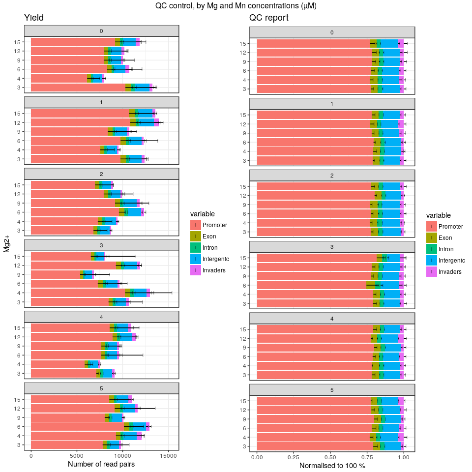<!-- -->


### By Mn concentration


```r
ggpubr::ggarrange(legend = "right",
  plotAnnot( ce, scope = msScope_qcSI, group = "Mg", facet="Mn"
           , normalise = FALSE, title = NULL) +
    ylab("Number of read pairs") + xlab("Mn2+") +
    facet_wrap(~facet, ncol = 1),
  plotAnnot( ce, scope = msScope_qcSI, group = "Mg", facet="Mn"
           , normalise = TRUE, title = NULL) +
    ylab("Normalised to 100 %") + xlab(NULL) +
    facet_wrap(~facet, ncol = 1)) %>%
  ggpubr::annotate_figure(top="QC control, by Mn and Mg concentrations (µM)")
```

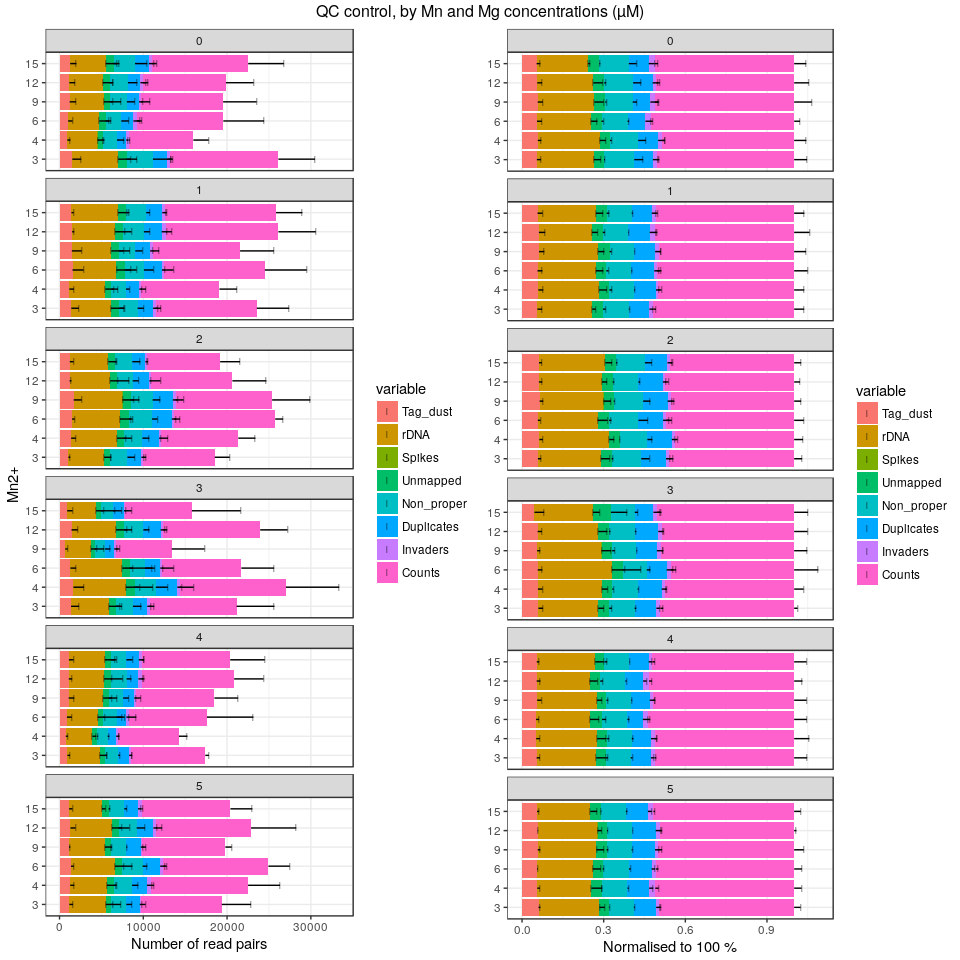<!-- -->


```r
ggpubr::ggarrange(legend = "right",
  plotAnnot( ce, scope = msScope_counts, group = "Mn", facet="Mg"
           , normalise = FALSE, title = NULL) +
    ylab("Number of read pairs") + xlab("Mn2+") +
    facet_wrap(~facet, ncol = 1),
  plotAnnot( ce, scope = msScope_counts, group = "Mn", facet="Mg"
           , normalise = TRUE, title = NULL) +
    ylab("Normalised to 100 %") + xlab(NULL) +
    facet_wrap(~facet, ncol = 1)) %>%
  ggpubr::annotate_figure(top="QC control, by Mn and Mg concentrations (µM)")
```

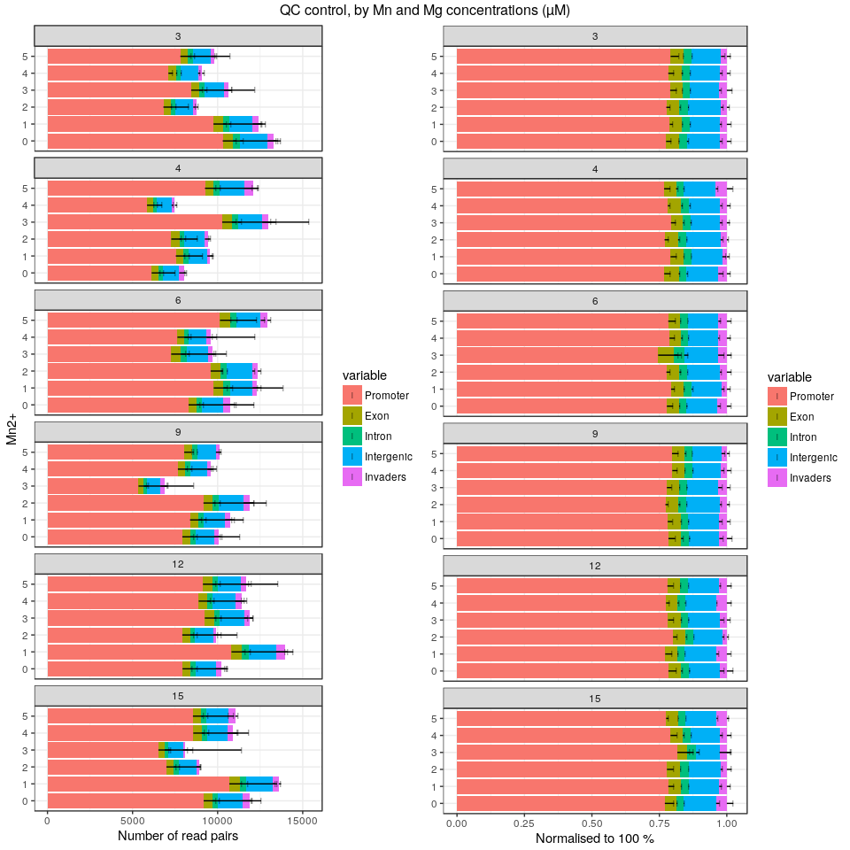<!-- -->

### Interaction between Mg and dNTP at Mn == 0 & ce$MMix == "SSIII"

I can not make sense of the data.


```r
plotAnnot( ce.bak[,ce.bak$Mn == 0 & ce.bak$MMix == "SSIII"], scope = msScope_counts, group = "Mg", facet="dNTP"
           , normalise = TRUE, title = "QC (processing)") +
    ylab("Number of read pairs") + xlab("Mg2+") +
    facet_wrap(~facet, ncol = 1, scales = "fixed")
```

```
## harmonizing input:
##   removing 1379 sampleMap rows with 'colname' not in colnames of experiments
##   removing 1379 colData rownames not in sampleMap 'primary'
```

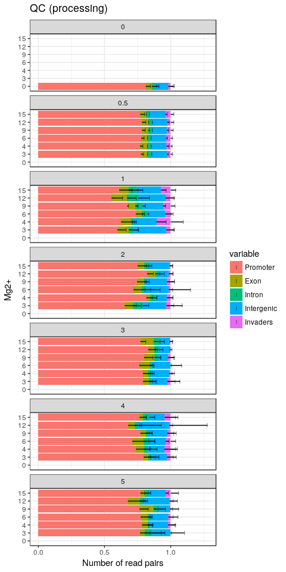<!-- -->

```r
plotAnnot( ce.bak[,ce.bak$Mn == 0 & ce.bak$MMix == "SSIII"], scope = msScope_counts, group = "Mg", facet="dNTP"
           , normalise = FALSE, title = "QC (annotation)") +
    ylab("Number of read pairs") + xlab("Mg2+") +
    facet_wrap(~facet, ncol = 1, scales = "free")
```

```
## harmonizing input:
##   removing 1379 sampleMap rows with 'colname' not in colnames of experiments
##   removing 1379 colData rownames not in sampleMap 'primary'
```

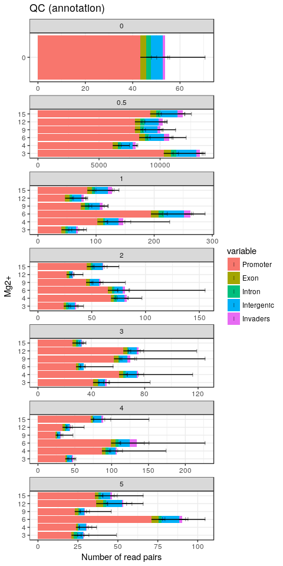<!-- -->

Session information
===================


```r
sessionInfo()
```

```
## R version 3.4.3 (2017-11-30)
## Platform: x86_64-pc-linux-gnu (64-bit)
## Running under: Debian GNU/Linux 9 (stretch)
## 
## Matrix products: default
## BLAS: /usr/lib/libblas/libblas.so.3.7.0
## LAPACK: /usr/lib/lapack/liblapack.so.3.7.0
## 
## locale:
##  [1] LC_CTYPE=en_GB.UTF-8       LC_NUMERIC=C              
##  [3] LC_TIME=en_GB.UTF-8        LC_COLLATE=en_GB.UTF-8    
##  [5] LC_MONETARY=en_GB.UTF-8    LC_MESSAGES=en_GB.UTF-8   
##  [7] LC_PAPER=en_GB.UTF-8       LC_NAME=C                 
##  [9] LC_ADDRESS=C               LC_TELEPHONE=C            
## [11] LC_MEASUREMENT=en_GB.UTF-8 LC_IDENTIFICATION=C       
## 
## attached base packages:
## [1] parallel  stats4    stats     graphics  grDevices utils     datasets 
## [8] methods   base     
## 
## other attached packages:
##  [1] viridis_0.4.0               viridisLite_0.2.0          
##  [3] SummarizedExperiment_1.9.14 DelayedArray_0.4.1         
##  [5] matrixStats_0.52.2          Biobase_2.38.0             
##  [7] GenomicRanges_1.31.19       GenomeInfoDb_1.15.5        
##  [9] IRanges_2.13.26             S4Vectors_0.17.32          
## [11] BiocGenerics_0.25.3         MultiAssayExperiment_1.5.41
## [13] magrittr_1.5                ggplot2_2.2.1              
## [15] CAGEr_1.23.1               
## 
## loaded via a namespace (and not attached):
##  [1] nlme_3.1-131              bitops_1.0-6             
##  [3] RColorBrewer_1.1-2        rprojroot_1.3-2          
##  [5] tools_3.4.3               backports_1.1.2          
##  [7] R6_2.2.2                  vegan_2.4-5              
##  [9] platetools_0.0.2          KernSmooth_2.23-15       
## [11] lazyeval_0.2.1            mgcv_1.8-22              
## [13] colorspace_1.3-2          permute_0.9-4            
## [15] gridExtra_2.3             compiler_3.4.3           
## [17] VennDiagram_1.6.18        rtracklayer_1.39.9       
## [19] labeling_0.3              scales_0.5.0             
## [21] stringr_1.3.0             digest_0.6.15            
## [23] Rsamtools_1.31.3          rmarkdown_1.9            
## [25] stringdist_0.9.4.6        XVector_0.19.8           
## [27] pkgconfig_2.0.1           htmltools_0.3.6          
## [29] BSgenome_1.47.5           rlang_0.2.0              
## [31] VGAM_1.0-4                bindr_0.1                
## [33] BiocParallel_1.12.0       gtools_3.5.0             
## [35] dplyr_0.7.4               RCurl_1.95-4.10          
## [37] GenomeInfoDbData_0.99.1   futile.logger_1.4.3      
## [39] smallCAGEqc_0.12.2.999999 Matrix_1.2-12            
## [41] Rcpp_0.12.16              munsell_0.4.3            
## [43] stringi_1.1.7             yaml_2.1.18              
## [45] MASS_7.3-47               zlibbioc_1.24.0          
## [47] plyr_1.8.4                grid_3.4.3               
## [49] gdata_2.18.0              lattice_0.20-35          
## [51] cowplot_0.9.2             Biostrings_2.47.9        
## [53] splines_3.4.3             knitr_1.20               
## [55] beanplot_1.2              pillar_1.2.1             
## [57] ggpubr_0.1.6              reshape2_1.4.2           
## [59] codetools_0.2-15          futile.options_1.0.0     
## [61] XML_3.98-1.9              glue_1.2.0               
## [63] evaluate_0.10.1           lambda.r_1.2             
## [65] data.table_1.10.4-3       gtable_0.2.0             
## [67] purrr_0.2.4               tidyr_0.7.2              
## [69] reshape_0.8.7             assertthat_0.2.0         
## [71] tibble_1.4.2              som_0.3-5.1              
## [73] GenomicAlignments_1.15.12 memoise_1.1.0            
## [75] bindrcpp_0.2              cluster_2.0.6
```
