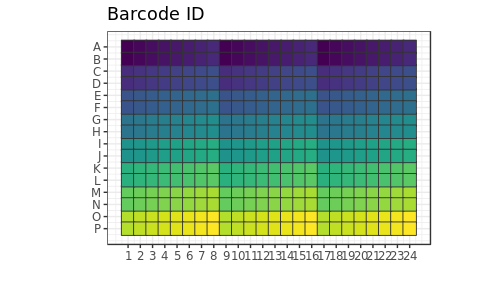
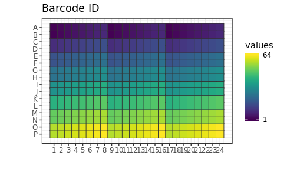
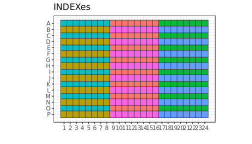
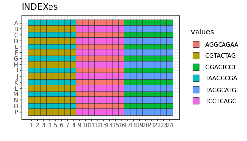

```r
variant <- "a"
newseed <- 1
indexes <- c("TAAGGCGA", "CGTACTAG", "AGGCAGAA", "TCCTGAGC", "GGACTCCT", "TAGGCATG")
plateID <- "Q"
```


Dummy version to make an explanatory figure
=================================================

This file starts as a copy of Labcyte-RT6.Rmd and may still
contain commands that are not really needed to make the figure panel,
but that I do not have time to remove.

## Load scripts and libraries.


```r
library("magrittr")   # For its diamond pipe operators
library("ggplot2")    # For plotting
library("platetools") # For defining and manipulating 384-well plates
library("plyr")
library("tibble")     # For comfortable command-line operations

# The set_block function that will become part of platetools
source("https://raw.githubusercontent.com/charles-plessy/platetools/76213accb1704d11a2d96fb1f6284d0b46117778/R/set_block.R")

# Do not load the whole smallCAGEqc package, just get the barcode data.
data("nanoCAGE2017barcodes", package = "smallCAGEqc")
```


Selected TSOs
=============


```r
Tier_N <- 1:64
```

Creation of sextants
====================


```r
createRandomisedSextant <- function(index, rna) {
    df <- data.frame ( BARCODE_ID =  Tier_N)
  tsoMaxConc <- 800
  df$TSO_source <- c( rep(tsoMaxConc /  1, 21)
                    , rep(tsoMaxConc /  8, 21)
                    , rep(tsoMaxConc /  64, 21)
                    , tsoMaxConc / 32)
  df$TSO_vol <- c(rep(c(rep(100,7), rep(50,7), rep(25,7)),3), 25)
  df$TSO <- df$TSO_source * df$TSO_vol / 500
  df$RT_PRIMERS <- c(rep(c(0, 1, 2, 4, 8, 16, 24), 9), 1)
  df$RT_PRIMERS_vol <- 25
  df[df$RT_PRIMERS == 0, "RT_PRIMERS_vol"] <- 0
  df$MASTER_MIX_vol <- 350
  df$INDEX <- index
  df$RNA <- rna
  df$RNA_vol <- 25
  df[64, "RNA_vol"] <- 0
  df$H2O_vol <- 500 - df$RNA_vol - df$RT_PRIMERS_vol - df$TSO_vol - df$MASTER_MIX_vol
  df
}
```


Sextants
========

Plate layout
------------

Create a data frame representing the contents of each well.


```r
plate           <- tibble(well = platetools::num_to_well(1:384, plate = "384"))
plate$row       <- sub("..$", "", plate$well) %>% factor
plate$col       <- sub("^.",  "", plate$well) %>% as.numeric %>% factor
```

Fill sextants
-------------


```r
indexes <- c("TAAGGCGA", "CGTACTAG", "AGGCAGAA", "TCCTGAGC", "GGACTCCT", "TAGGCATG")

plate$sxt <- paste0 (
  c(rep("A", 8), rep("B", 8), rep("C", 8)),
  ifelse (plate$row %in% LETTERS[1:8 * 2], 2, 1)
) %>% factor

plate %<>% arrange(sxt)

plate %<>% cbind( rbind( createRandomisedSextant(indexes[1], 1e5)
                       , createRandomisedSextant(indexes[2], 1e4)
                       , createRandomisedSextant(indexes[3], 1e3)
                       , createRandomisedSextant(indexes[4], 1e2)
                       , createRandomisedSextant(indexes[5], 1e1)
                       , createRandomisedSextant(indexes[6], 1e0))
      ) %>% as.tibble()

plate$BARCODE_ID
```

```
##   [1]  1  2  3  4  5  6  7  8  9 10 11 12 13 14 15 16 17 18 19 20 21 22 23 24 25 26 27 28 29 30 31
##  [32] 32 33 34 35 36 37 38 39 40 41 42 43 44 45 46 47 48 49 50 51 52 53 54 55 56 57 58 59 60 61 62
##  [63] 63 64  1  2  3  4  5  6  7  8  9 10 11 12 13 14 15 16 17 18 19 20 21 22 23 24 25 26 27 28 29
##  [94] 30 31 32 33 34 35 36 37 38 39 40 41 42 43 44 45 46 47 48 49 50 51 52 53 54 55 56 57 58 59 60
## [125] 61 62 63 64  1  2  3  4  5  6  7  8  9 10 11 12 13 14 15 16 17 18 19 20 21 22 23 24 25 26 27
## [156] 28 29 30 31 32 33 34 35 36 37 38 39 40 41 42 43 44 45 46 47 48 49 50 51 52 53 54 55 56 57 58
## [187] 59 60 61 62 63 64  1  2  3  4  5  6  7  8  9 10 11 12 13 14 15 16 17 18 19 20 21 22 23 24 25
## [218] 26 27 28 29 30 31 32 33 34 35 36 37 38 39 40 41 42 43 44 45 46 47 48 49 50 51 52 53 54 55 56
## [249] 57 58 59 60 61 62 63 64  1  2  3  4  5  6  7  8  9 10 11 12 13 14 15 16 17 18 19 20 21 22 23
## [280] 24 25 26 27 28 29 30 31 32 33 34 35 36 37 38 39 40 41 42 43 44 45 46 47 48 49 50 51 52 53 54
## [311] 55 56 57 58 59 60 61 62 63 64  1  2  3  4  5  6  7  8  9 10 11 12 13 14 15 16 17 18 19 20 21
## [342] 22 23 24 25 26 27 28 29 30 31 32 33 34 35 36 37 38 39 40 41 42 43 44 45 46 47 48 49 50 51 52
## [373] 53 54 55 56 57 58 59 60 61 62 63 64
```

```r
plate$INDEX %<>% factor
plate$BARCODE_SEQ <- nanoCAGE2017barcodes[plate$BARCODE_ID, "barcodes"]

plate$RNA_level <- plate$RNA %>% factor(labels = paste0("RNA_", LETTERS[1:6]))
plate$RTP_level <- plate$RT_PRIMERS %>% factor(labels = paste0("RTP_", LETTERS[1:7]))

plate$RNA[plate$RNA_vol == 0] <- 0
plate$plateID <- "Z"
```


Plate maps
==========


```r
plateMap <- function(x, title) {
  platetools::raw_map(plate[[x]], well=plate$well, plate="384") +
  ggtitle(title) +
  viridis::scale_fill_viridis(breaks = unique(plate[[x]]))
}

plateMapLog <- function(x, title) {
  platetools::raw_map(plate[[x]], well=plate$well, plate="384") +
  ggtitle(title) +
  viridis::scale_fill_viridis(breaks = unique(plate[[x]]), trans = "log")
}
```

TSO
---

### Without legend, to better scale with the index plot.


```r
platetools::raw_map(plate[["BARCODE_ID"]], well=plate$well, plate="384") +
  ggtitle("Barcode ID") + theme(legend.position="none") + viridis::scale_fill_viridis()
```

<!-- -->

### With legend


```r
platetools::raw_map(plate[["BARCODE_ID"]], well=plate$well, plate="384") +
  ggtitle("Barcode ID") + viridis::scale_fill_viridis(breaks = c(1, 64))
```

<!-- -->

Indexes
-------

### Without legend, to better scale with the barcode plot.


```r
platetools::raw_map(plate[["INDEX"]], well=plate$well, plate="384") + ggtitle("INDEXes") + theme(legend.position="none")
```

<!-- -->

### With legend


```r
platetools::raw_map(plate[["INDEX"]], well=plate$well, plate="384") + ggtitle("INDEXes")
```

<!-- -->

## Session information


```r
sessionInfo()
```

```
## R version 3.5.1 (2018-07-02)
## Platform: x86_64-pc-linux-gnu (64-bit)
## Running under: Debian GNU/Linux buster/sid
## 
## Matrix products: default
## BLAS: /usr/lib/x86_64-linux-gnu/blas/libblas.so.3.8.0
## LAPACK: /usr/lib/x86_64-linux-gnu/lapack/liblapack.so.3.8.0
## 
## locale:
##  [1] LC_CTYPE=en_GB.UTF-8       LC_NUMERIC=C               LC_TIME=en_GB.UTF-8       
##  [4] LC_COLLATE=en_GB.UTF-8     LC_MONETARY=en_GB.UTF-8    LC_MESSAGES=en_GB.UTF-8   
##  [7] LC_PAPER=en_GB.UTF-8       LC_NAME=C                  LC_ADDRESS=C              
## [10] LC_TELEPHONE=C             LC_MEASUREMENT=en_GB.UTF-8 LC_IDENTIFICATION=C       
## 
## attached base packages:
## [1] stats     graphics  grDevices utils     datasets  methods   base     
## 
## other attached packages:
## [1] bindrcpp_0.2.2   tibble_1.4.2     plyr_1.8.4       platetools_0.1.1 ggplot2_3.0.0   
## [6] magrittr_1.5    
## 
## loaded via a namespace (and not attached):
##  [1] Rcpp_0.12.18       pillar_1.3.0       compiler_3.5.1     RColorBrewer_1.1-2 bindr_0.1.1       
##  [6] viridis_0.5.1      tools_3.5.1        digest_0.6.18      evaluate_0.11      gtable_0.2.0      
## [11] viridisLite_0.3.0  pkgconfig_2.0.2    rlang_0.2.2        yaml_2.2.0         gridExtra_2.3     
## [16] withr_2.1.2        dplyr_0.7.6        stringr_1.3.1      knitr_1.20         rprojroot_1.3-2   
## [21] grid_3.5.1         tidyselect_0.2.4   glue_1.3.0         R6_2.2.2           rmarkdown_1.10    
## [26] purrr_0.2.5        backports_1.1.2    scales_1.0.0       htmltools_0.3.6    assertthat_0.2.0  
## [31] colorspace_1.3-2   stringi_1.2.4      lazyeval_0.2.1     munsell_0.5.0      crayon_1.3.4
```
