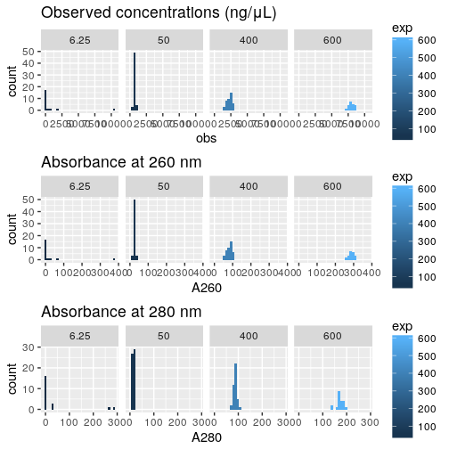
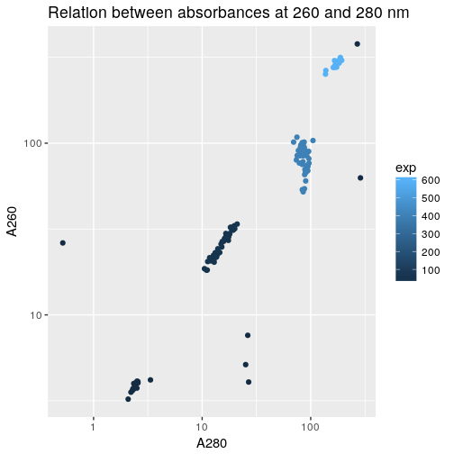
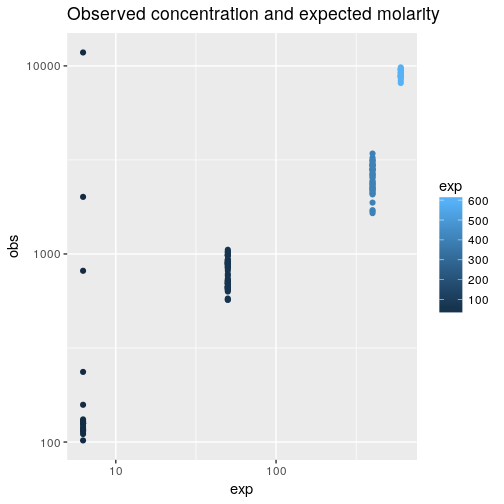
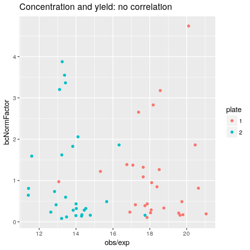

Load R packages
===============


```r
library("magrittr")
library("ggplot2")
```


Load data
=========

Concentrations of the actual TSO solutions in source plates, measured with
the NanoDrop instrument for 8-strip tubes (NanoDrop 8000 ?).

Concentration factor was _27.8_ (_A260 × 27.8 = concentration_ in ng/μL).

Original file name `180221_KATO.xlsx`.  This file has two sheets containing
raw data.  The first (`original data_180221`) is for
[source plate 2](Labcyte-RT2.md).  In this measurement, the TSOs at 600 μM were
too concentrated (out of dynamic range).


```r
plate2 <- gdata::read.xls( "Labcyte-RT2.quantification.xlsx"
                        , nrow = 140, stringsAsFactors = FALSE)
```

The second sheet (`original data_180222`) is for [source plate 1](Labcyte-RT.md),
(first 140 rows), and then for plate 2's TSOs at 600 μM, which were dilluted 5
times before being measured again.


```r
plate1 <- gdata::read.xls( "Labcyte-RT2.quantification.xlsx"
                        , nrow = 182, sheet = 2, stringsAsFactors = FALSE)

plate2[1:42,] <- plate1[141:182,]
plate1 <- plate1[-(141:182),]
plate1$X <- NA  # For column compatibility with plate2
```

Sheet 2 indicates the barcode ID for each TSO; Sheet 1 has the same layout.


```r
plate2$Sample.ID <- plate1$Sample.ID
```

Merge the tables.


```r
plate2$plate <- 2
plate1$plate <- 1
conc <- rbind(plate2, plate1)
rm(plate2); rm(plate1)

conc <- data.frame( Well  = conc$Well      
                  , ID    = conc$Sample.ID %>% factor
                  , plate = conc$plate     %>% factor
                  , obs   = conc$Conc..
                  , A260  = conc$A260.
                  , A280  = conc$A280.)

conc$Well %<>% factor(levels = levels(conc$Well) %>% gtools::mixedsort())
```

Average replicates.


```r
conc <- aggregate( conc[,c("obs", "A260", "A280")]
                 , list(Well = conc$Well, ID = conc$ID, plate = conc$plate)
                 , mean)
```


```r
conc$exp <- 50

conc[conc$plate == 1 & conc$ID %in% 01:21, "exp"] <- 400
conc[conc$plate == 1 & conc$ID %in% 43:63, "exp"] <- 6.25

conc[conc$plate == 2 & conc$ID %in% 01:21, "exp"] <- 600
conc[conc$plate == 2 & conc$ID %in% 22:42, "exp"] <- 400
```

Samples at expected 600 μM were diluted 5 times to stay in the instrument's
dynamic range.  Correcting values.


```r
conc[conc$exp == 600, c("obs", "A260", "A280")] %<>% multiply_by(5)
summary(conc)
```

```
##       Well           ID      plate       obs                A260             A280         
##  A1     :  2   1      :  2   1:70   Min.   :   89.81   Min.   :  3.23   Min.   :  0.5205  
##  A2     :  2   2      :  2   2:70   1st Qu.:  617.99   1st Qu.: 22.23   1st Qu.: 13.5344  
##  A3     :  2   3      :  2          Median :  878.38   Median : 31.59   Median : 19.8855  
##  A4     :  2   4      :  2          Mean   : 2272.31   Mean   : 81.73   Mean   : 62.6056  
##  A5     :  2   5      :  2          3rd Qu.: 2505.25   3rd Qu.: 90.11   3rd Qu.: 90.0127  
##  A6     :  2   6      :  2          Max.   :10503.00   Max.   :378.39   Max.   :287.1365  
##  (Other):128   (Other):128                                                                
##       exp        
##  Min.   :  6.25  
##  1st Qu.: 50.00  
##  Median : 50.00  
##  Mean   :230.94  
##  3rd Qu.:400.00  
##  Max.   :600.00  
## 
```


Histograms
==========


```r
hist_obs  <- ggplot(conc, aes(obs,  fill = exp)) + geom_histogram() +
  facet_wrap(~exp, nrow = 1) + ggtitle("Observed concentrations (ng/μL)")
hist_a260 <- ggplot(conc, aes(A260, fill = exp)) + geom_histogram() +
  facet_wrap(~exp, nrow = 1) + ggtitle("Absorbance at 260 nm")
hist_a280 <- ggplot(conc, aes(A280, fill = exp)) + geom_histogram() +
  facet_wrap(~exp, nrow = 1) + ggtitle("Absorbance at 280 nm")

ggpubr::ggarrange( ncol = 1, nrow = 3, hist_obs, hist_a260, hist_a280)
```

```
## `stat_bin()` using `bins = 30`. Pick better value with `binwidth`.
## `stat_bin()` using `bins = 30`. Pick better value with `binwidth`.
## `stat_bin()` using `bins = 30`. Pick better value with `binwidth`.
```

<!-- -->


Absorbances
===========


```r
ggplot(conc, aes(A280, A260, colour = exp)) + geom_point() +
    scale_x_log10() + scale_y_log10() +
  ggtitle("Relation between absorbances at 260 and 280 nm")
```

<!-- -->


Concentrations
==============


```r
ggplot(conc, aes(exp,  obs, colour = exp))  + geom_point() +
  scale_x_log10() + scale_y_log10() +
  ggtitle("Observed concentration and expected molarity")
```

<!-- -->


Comparison with normalisation factors
=====================================

In [experiment 5](Labcyte-RT_Data_Analysis_5.md), each available TSO was used
7 times in random positions.  While the reaction mixture was the same
everywhere,  the yield varied dramatically from TSO to TSO.  Normalisation
factors were calculated and saved for possible corrections.

Here, we verify whether these normalisation factors correlate with measured
concentrations.  Focusing on TSOs that were dilluted at 50 µM, because their
measured concentrations have the best accuracy (not out of dynamic range).


```r
bcNormFactors <- dget("bcNormFactors.R")

conc$bcNormFactor <- bcNormFactors[conc$ID]

ggplot(conc[conc$exp == 50,], aes(obs / exp,  bcNormFactor, colour = plate)) +
  geom_point() +
  ggtitle("Concentration and yield: no correlation")
```

<!-- -->


Session information
===================


```r
sessionInfo()
```

```
## R version 3.4.3 (2017-11-30)
## Platform: x86_64-pc-linux-gnu (64-bit)
## Running under: Debian GNU/Linux 9 (stretch)
## 
## Matrix products: default
## BLAS: /usr/lib/libblas/libblas.so.3.7.0
## LAPACK: /usr/lib/lapack/liblapack.so.3.7.0
## 
## locale:
##  [1] LC_CTYPE=en_GB.UTF-8       LC_NUMERIC=C               LC_TIME=en_GB.UTF-8       
##  [4] LC_COLLATE=en_GB.UTF-8     LC_MONETARY=en_GB.UTF-8    LC_MESSAGES=en_GB.UTF-8   
##  [7] LC_PAPER=en_GB.UTF-8       LC_NAME=C                  LC_ADDRESS=C              
## [10] LC_TELEPHONE=C             LC_MEASUREMENT=en_GB.UTF-8 LC_IDENTIFICATION=C       
## 
## attached base packages:
## [1] stats     graphics  grDevices utils     datasets  methods   base     
## 
## other attached packages:
## [1] ggplot2_2.2.1 magrittr_1.5 
## 
## loaded via a namespace (and not attached):
##  [1] Rcpp_0.12.16     bindr_0.1        knitr_1.20       ggpubr_0.1.6     cowplot_0.9.2   
##  [6] munsell_0.4.3    colorspace_1.3-2 R6_2.2.2         rlang_0.2.0      dplyr_0.7.4     
## [11] stringr_1.3.0    plyr_1.8.4       tools_3.4.3      grid_3.4.3       gtable_0.2.0    
## [16] htmltools_0.3.6  gtools_3.5.0     assertthat_0.2.0 yaml_2.1.18      lazyeval_0.2.1  
## [21] rprojroot_1.3-2  digest_0.6.15    tibble_1.4.2     bindrcpp_0.2     purrr_0.2.4     
## [26] glue_1.2.0       evaluate_0.10.1  rmarkdown_1.9    labeling_0.3     gdata_2.18.0    
## [31] stringi_1.1.7    compiler_3.4.3   pillar_1.2.1     scales_0.5.0     backports_1.1.2 
## [36] pkgconfig_2.0.1
```
