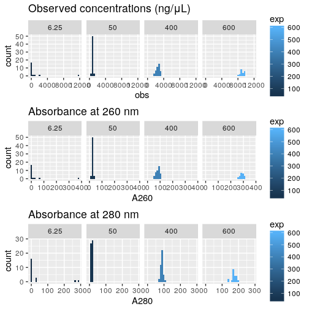

Load scripts and libraries
==========================


```r
library("magrittr")
library("ggplot2")
# Do not load the whole smallCAGEqc package, just get the barcode data.
data("nanoCAGE2017barcodes", package = "smallCAGEqc")
```


Concentration checks
====================

Data load
---------

Concentrations of the actual TSO solutions in the source plage, measured with
the NanoDrop instrument for 8-strip tubes (NanoDrop 8000 ?).

Concentration factor was _27.8_ (_A260 × 27.8 = concentration_ in ng/μL).

Original file name `180221_KATO.xlsx`.  This file has two sheets.  The first for
source plate 1, where the TSOs at 600 μM were too concentrated for the
measurement (out of dynamic range).  The second is for source plate 1, (first
140 rows), and then for plate 2's TSOs at 600 μM, which were dilluted 5 times
before being measured again.


```r
conc1 <- gdata::read.xls( "Labcyte-RT2.quantification.xlsx"
                        , nrow = 140, stringsAsFactors = FALSE)
summary(conc1)
```

```
##  Plate.ID          Well.            Sample.ID           User.ID             Date.          
##  Mode:logical   Length:140         Length:140         Length:140         Length:140        
##  NA's:140       Class :character   Class :character   Class :character   Class :character  
##                 Mode  :character   Mode  :character   Mode  :character   Mode  :character  
##                                                                                            
##                                                                                            
##                                                                                            
##     Time.               Conc..          Units.              A260.            A280.        
##  Length:140         Min.   : 411.0   Length:140         Min.   : 14.78   Min.   :  9.151  
##  Class :character   1st Qu.: 623.2   Class :character   1st Qu.: 22.42   1st Qu.: 13.425  
##  Mode  :character   Median : 982.2   Mode  :character   Median : 35.33   Median : 80.181  
##                     Mean   :1345.9                      Mean   : 48.41   Mean   : 57.038  
##                     3rd Qu.:2316.2                      3rd Qu.: 83.30   3rd Qu.: 87.474  
##                     Max.   :3044.0                      Max.   :109.48   Max.   :124.622  
##    X260.280.        X260.230.      Conc..Factor..ng.ul.  Cursor.Pos.   Cursor.abs.    
##  Min.   :0.3000   Min.   :0.2600   Min.   :27.8         Min.   :260   Min.   : 14.78  
##  1st Qu.:0.5275   1st Qu.:0.5475   1st Qu.:27.8         1st Qu.:260   1st Qu.: 22.42  
##  Median :1.1350   Median :1.3800   Median :27.8         Median :260   Median : 35.33  
##  Mean   :1.1400   Mean   :1.5060   Mean   :27.8         Mean   :260   Mean   : 48.41  
##  3rd Qu.:1.6600   3rd Qu.:2.4025   3rd Qu.:27.8         3rd Qu.:260   3rd Qu.: 83.30  
##  Max.   :1.8400   Max.   :2.5300   Max.   :27.8         Max.   :260   Max.   :109.48  
##     X340.raw          NA.Type             X          
##  Min.   :-0.02700   Length:140         Mode:logical  
##  1st Qu.: 0.01475   Class :character   NA's:140      
##  Median : 0.03750   Mode  :character                 
##  Mean   : 0.03551                                    
##  3rd Qu.: 0.05850                                    
##  Max.   : 0.10900
```

```r
conc2 <- gdata::read.xls( "Labcyte-RT2.quantification.xlsx"
                        , nrow = 182, sheet = 2, stringsAsFactors = FALSE)
summary(conc2)
```

```
##    Plate.ID            Well.             Sample.ID       User.ID             Date.          
##  Length:182         Length:182         Min.   : 1.00   Length:182         Length:182        
##  Class :character   Class :character   1st Qu.:12.00   Class :character   Class :character  
##  Mode  :character   Mode  :character   Median :25.00   Mode  :character   Mode  :character  
##                                        Mean   :29.85                                        
##                                        3rd Qu.:47.75                                        
##                                        Max.   :70.00                                        
##     Time.               Conc..            Units.              A260.             A280.        
##  Length:182         Min.   :   89.03   Length:182         Min.   :  3.202   Min.   : -1.258  
##  Class :character   1st Qu.:  746.67   Class :character   1st Qu.: 26.857   1st Qu.: 15.950  
##  Mode  :character   Median :  913.75   Mode  :character   Median : 32.867   Median : 20.631  
##                     Mean   : 1244.54                      Mean   : 44.770   Mean   : 41.119  
##                     3rd Qu.: 1670.50                      3rd Qu.: 60.090   3rd Qu.: 49.461  
##                     Max.   :20900.00                      Max.   :752.966   Max.   :571.996  
##    X260.280.         X260.230.     Conc..Factor..ng.ul.  Cursor.Pos.   Cursor.abs.     
##  Min.   :-38.740   Min.   :0.080   Min.   :27.8         Min.   :260   Min.   :  3.202  
##  1st Qu.:  1.170   1st Qu.:1.425   1st Qu.:27.8         1st Qu.:260   1st Qu.: 26.857  
##  Median :  1.620   Median :2.370   Median :27.8         Median :260   Median : 32.867  
##  Mean   :  1.208   Mean   :1.992   Mean   :27.8         Mean   :260   Mean   : 44.770  
##  3rd Qu.:  1.680   3rd Qu.:2.417   3rd Qu.:27.8         3rd Qu.:260   3rd Qu.: 60.090  
##  Max.   :  1.980   Max.   :2.550   Max.   :27.8         Max.   :260   Max.   :752.966  
##     X340.raw          NA.Type         
##  Min.   :-45.7610   Length:182        
##  1st Qu.: -0.0650   Class :character  
##  Median : -0.0410   Mode  :character  
##  Mean   : -0.9559                     
##  3rd Qu.:  0.0075                     
##  Max.   :  0.2320
```

```r
conc1[1:42,] <- conc2[141:182,]
conc2 <- conc2[-(141:182),]
conc2$X <- NA  # For column compatibility with conc1

conc1$exp <- 50
conc1[grep("[1-3]$", conc1$Well), "exp"] <- 600
conc1[grep("[4-6]$", conc1$Well), "exp"] <- 400

conc2$exp <- 50
conc2[grep("[1-3]$", conc2$Well), "exp"] <- 400
conc2[grep("[7-9]$", conc2$Well), "exp"] <- 6.25

conc1$plate <- 2
conc2$plate <- 1
conc <- rbind(conc1, conc2)
rm(conc1); rm(conc2)
```


```r
conc <- data.frame( Well  = conc$Well
                  , plate = conc$plate
                  , exp   = conc$exp
                  , obs   = conc$Conc..
                  , A260  = conc$A260.
                  , A280  = conc$A280.)

summary(conc)
```

```
##       Well         plate          exp              obs                A260        
##  A1     :  4   Min.   :1.0   Min.   :  6.25   Min.   :   89.03   Min.   :  3.202  
##  A10    :  4   1st Qu.:1.0   1st Qu.: 50.00   1st Qu.:  604.67   1st Qu.: 21.750  
##  A2     :  4   Median :1.5   Median : 50.00   Median :  876.40   Median : 31.522  
##  A3     :  4   Mean   :1.5   Mean   :230.94   Mean   : 1311.15   Mean   : 47.164  
##  A4     :  4   3rd Qu.:2.0   3rd Qu.:400.00   3rd Qu.: 1915.75   3rd Qu.: 68.912  
##  A5     :  4   Max.   :2.0   Max.   :600.00   Max.   :20900.00   Max.   :752.966  
##  (Other):256                                                                      
##       A280        
##  Min.   : -1.258  
##  1st Qu.: 13.127  
##  Median : 19.111  
##  Mean   : 41.977  
##  3rd Qu.: 80.299  
##  Max.   :571.996  
## 
```

```r
conc <- aggregate(conc[,-1], list(conc$Well, conc$plate, conc$exp), mean)
colnames(conc) <- c("Well", "discard1", "discard2", "plate", "exp", "obs", "A260", "A280")
conc <- conc[,c("Well", "discard1", "discard2", "plate", "exp", "obs", "A260", "A280")]

conc$Well %<>% factor(levels = levels(conc$Well) %>% gtools::mixedsort())
```

Samples at expected 600 μM were diluted 5 times to stay in the instrument's
dynamic range.  Correcting values.


```r
conc[conc$exp == 600, c("obs", "A260", "A280")] %<>% multiply_by(5)
```

Histograms
----------


```r
hist_obs  <- ggplot(conc, aes(obs,  fill = exp)) + geom_histogram() +
  facet_wrap(~exp, nrow = 1) + ggtitle("Observed concentrations (ng/μL)")
hist_a260 <- ggplot(conc, aes(A260, fill = exp)) + geom_histogram() +
  facet_wrap(~exp, nrow = 1) + ggtitle("Absorbance at 260 nm")
hist_a280 <- ggplot(conc, aes(A280, fill = exp)) + geom_histogram() +
  facet_wrap(~exp, nrow = 1) + ggtitle("Absorbance at 280 nm")

ggpubr::ggarrange( ncol = 1, nrow = 3, hist_obs, hist_a260, hist_a280)
```

```
## `stat_bin()` using `bins = 30`. Pick better value with `binwidth`.
## `stat_bin()` using `bins = 30`. Pick better value with `binwidth`.
## `stat_bin()` using `bins = 30`. Pick better value with `binwidth`.
```

<!-- -->

Absorbances
-----------


```r
ggplot(conc, aes(A280, A260, colour = exp)) + geom_point() +
    scale_x_log10() + scale_y_log10() +
  ggtitle("Relation between absorbances at 260 and 280 nm")
```

<!-- -->

Concentrations
--------------


```r
ggplot(conc, aes(exp,  obs, colour = exp))  + geom_point() +
  scale_x_log10() + scale_y_log10() +
  ggtitle("Observed concentration and expected molarity")
```

<!-- -->

Session information
===================


```r
sessionInfo()
```

```
## R version 3.4.3 (2017-11-30)
## Platform: x86_64-pc-linux-gnu (64-bit)
## Running under: Debian GNU/Linux 9 (stretch)
## 
## Matrix products: default
## BLAS: /usr/lib/libblas/libblas.so.3.7.0
## LAPACK: /usr/lib/lapack/liblapack.so.3.7.0
## 
## locale:
##  [1] LC_CTYPE=en_GB.UTF-8       LC_NUMERIC=C               LC_TIME=en_GB.UTF-8       
##  [4] LC_COLLATE=en_GB.UTF-8     LC_MONETARY=en_GB.UTF-8    LC_MESSAGES=en_GB.UTF-8   
##  [7] LC_PAPER=en_GB.UTF-8       LC_NAME=C                  LC_ADDRESS=C              
## [10] LC_TELEPHONE=C             LC_MEASUREMENT=en_GB.UTF-8 LC_IDENTIFICATION=C       
## 
## attached base packages:
## [1] stats     graphics  grDevices utils     datasets  methods   base     
## 
## other attached packages:
## [1] ggplot2_2.2.1 magrittr_1.5 
## 
## loaded via a namespace (and not attached):
##  [1] Rcpp_0.12.16     bindr_0.1        knitr_1.20       ggpubr_0.1.6     cowplot_0.9.2   
##  [6] munsell_0.4.3    colorspace_1.3-2 R6_2.2.2         rlang_0.2.0      dplyr_0.7.4     
## [11] stringr_1.3.0    plyr_1.8.4       tools_3.4.3      grid_3.4.3       gtable_0.2.0    
## [16] htmltools_0.3.6  gtools_3.5.0     assertthat_0.2.0 yaml_2.1.18      lazyeval_0.2.1  
## [21] rprojroot_1.3-2  digest_0.6.15    tibble_1.4.2     bindrcpp_0.2     purrr_0.2.4     
## [26] glue_1.2.0       evaluate_0.10.1  rmarkdown_1.9    labeling_0.3     gdata_2.18.0    
## [31] stringi_1.1.7    compiler_3.4.3   pillar_1.2.1     scales_0.5.0     backports_1.1.2 
## [36] pkgconfig_2.0.1
```
