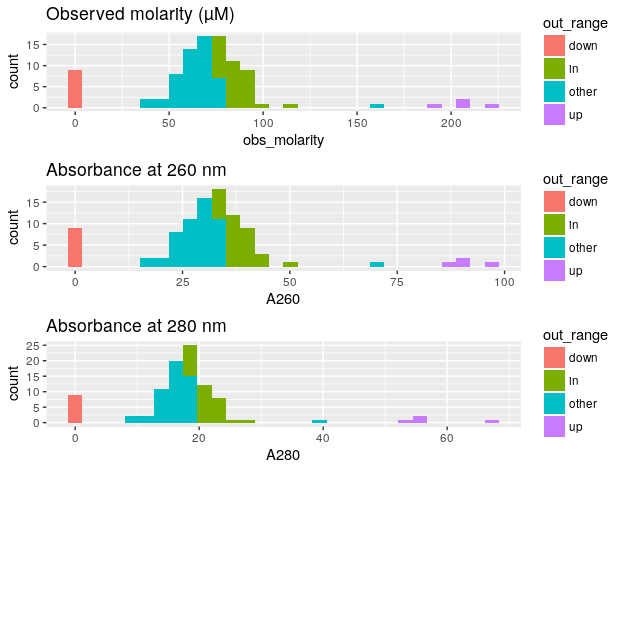
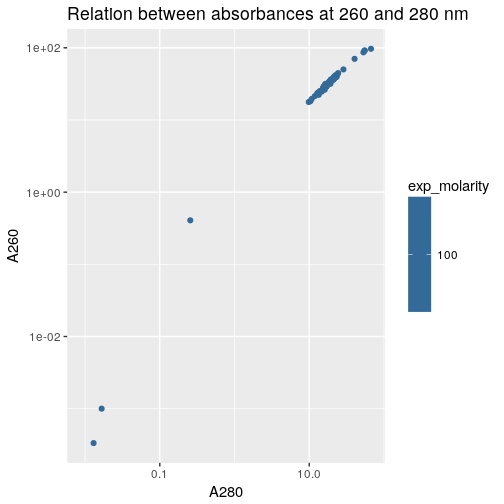
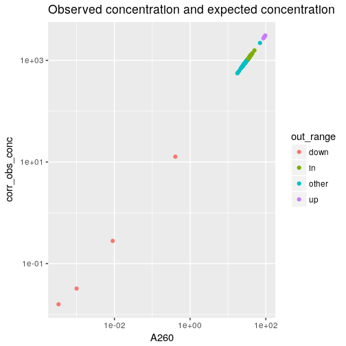

Concentrations of the actual TSO solutions in the stock plate PO_8268526, measured with
a NanoDrop 8000, that has a dynamic range of 2.5–3,700 ng/μL for dsDNA according
to the manufacturer's [website](https://www.thermofisher.com/jp/en/home/industrial/spectroscopy-elemental-isotope-analysis/molecular-spectroscopy/ultraviolet-visible-visible-spectrophotometry-uv-vis-vis/uv-vis-vis-instruments/nanodrop-microvolume-spectrophotometers/nanodrop-products-guide.html).

Load R packages
===============


```r
library("magrittr")
library("ggplot2")
```


Load data
=========

Original file name `20180419_TSOs_stf.txt`.  This file has one sheet containing
raw data of old TSOs (stock plate PO_8268526, first IDT plate ordered) diluted
10× from the original source plate (all TSOs resuspended at 1 mM) and thus at an expected concentration of 100 μM.


```r
conc <- gdata::read.xls( "20180419_TSOs_stf2.xlsx"
                        , stringsAsFactors = FALSE)
```


```r
conc <- data.frame( Well  = conc$Well
                  , A260  = conc$A260.
                  , A280  = conc$A280.
                  , obs_conc = conc$Conc..
                  , stringsAsFactors = FALSE)

conc$col <- conc$Well %>% sub(pat = ".", rep = "") %>% as.integer
conc$row <- conc$Well %>% substr(1,1)
conc$Well <- paste0(conc$row, sprintf("%02d", conc$col)) %>% factor
conc$Well %<>% factor(levels = levels(conc$Well) %>% gtools::mixedsort())
```

Average replicates.


```r
conc <- aggregate( conc[,c("obs_conc", "A260", "A280")]
                 , list(Well = conc$Well)
                 , mean)
```

Load maker's information.
 

```r
idt <- read.csv("TSO_master_plate_PO_8268526.csv", dec = ",")
idt <- idt[,c("Well.Position", "OD260", "nmoles", "µg", "Measured.Molecular.Weight", "Extinction.Coefficient.L..mole.cm.")]
idt$ug.OD <- idt$µg / idt$OD260

conc$ext <- idt[match(conc$Well, idt$Well), "Extinction.Coefficient.L..mole.cm."]
conc$obs_source_MW <- idt[match(conc$Well, idt$Well), "Measured.Molecular.Weight"]
conc$conc_corr_Fact <- idt[match(conc$Well, idt$Well), "ug.OD"]
```


Calculate concentrations 
------------------------

### Molarity using extinction coefficients


```r
conc$obs <- conc$A260 / conc$ext * 1e6
```

### Mass using µg / OD

The nanoDrop reported mass using a coefficient of 50 µg per OD.  They are
corrected here using the information provided by the maker.


```r
conc$corr_obs_conc <- conc$obs_conc / 50 * conc$conc_corr_Fact
```

The expected molarity of TSOs in this measure is 100 μM.
The average molecular weight of nanoCAGE TSOs = ~14,000 g/mol, according to IDT plate report.
Therefore the expected concentration of TSOs at 100 μM (100 μmol/L) should be:
100 μmol/L * 14000 g/mol = 1.4 g/L = 1400 ng/μL.


```r
conc$exp_molarity <- 100
conc$exp_conc <- conc$exp_molarity * conc$obs_source_MW / 1000
conc$obs_molarity <- (conc$corr_obs_conc*1000) / conc$obs_source_MW
summary(conc)
```

```
##       Well       obs_conc             A260             A280               ext        
##  A01    : 1   Min.   :  -5.394   Min.   :-0.108   Min.   :-0.05333   Min.   :433125  
##  A02    : 1   1st Qu.:1309.500   1st Qu.:26.190   1st Qu.:15.14075   1st Qu.:442088  
##  A03    : 1   Median :1589.167   Median :31.789   Median :17.84550   Median :445025  
##  A04    : 1   Mean   :1592.481   Mean   :31.850   Mean   :18.19185   Mean   :444895  
##  A05    : 1   3rd Qu.:1819.000   3rd Qu.:36.379   3rd Qu.:20.65233   3rd Qu.:448212  
##  A06    : 1   Max.   :4846.000   Max.   :96.918   Max.   :67.15867   Max.   :455375  
##  (Other):90                                                                          
##  obs_source_MW   conc_corr_Fact       obs           corr_obs_conc       exp_molarity    exp_conc   
##  Min.   :13902   Min.   :30.39   Min.   : -0.2381   Min.   :  -3.319   Min.   :100   Min.   :1390  
##  1st Qu.:13954   1st Qu.:31.17   1st Qu.: 59.8056   1st Qu.: 835.789   1st Qu.:100   1st Qu.:1395  
##  Median :13972   Median :31.35   Median : 71.6246   Median :1003.289   Median :100   Median :1397  
##  Mean   :13973   Mean   :31.42   Mean   : 71.5768   Mean   :1000.826   Mean   :100   Mean   :1397  
##  3rd Qu.:13996   3rd Qu.:31.66   3rd Qu.: 81.8313   3rd Qu.:1144.955   3rd Qu.:100   3rd Qu.:1400  
##  Max.   :14053   Max.   :32.51   Max.   :218.6909   Max.   :3090.962   Max.   :100   Max.   :1405  
##                                                                                                    
##   obs_molarity    
##  Min.   : -0.237  
##  1st Qu.: 59.809  
##  Median : 71.730  
##  Mean   : 71.616  
##  3rd Qu.: 81.922  
##  Max.   :221.414  
## 
```

```r
cor(conc$obs, conc$obs_molarity)
```

```
## [1] 0.9998622
```

The valuse calcutated using calcultated extinction coefficients or using
empirical µg / OD factors fit well.


Find outliers.
--------------


```r
conc$out_range <- "other"
conc[conc$obs_molarity < 25, "out_range"] <- "down"
conc[conc$out_range == "down",]
```

```
##    Well     obs_conc          A260         A280    ext obs_source_MW conc_corr_Fact           obs
## 12  A12 -5.394000000 -0.1080000000 -0.053333333 453575       14004.9       30.76923 -0.2381083614
## 53  E05  0.050871667  0.0010000000  0.016666667 435825       13947.7       31.70833  0.0022944989
## 54  E06 -0.033663333 -0.0006666667  0.009000000 443075       14006.4       32.05000 -0.0015046362
## 56  E08  0.026026667  0.0003333333  0.013000000 450125       14004.5       30.38889  0.0007405350
## 84  G12 -0.541333333 -0.0110000000 -0.008666667 452975       13996.7       31.08108 -0.0242839009
## 93  H09  0.449100000  0.0090000000 -0.009666667 447975       13955.1       31.13158  0.0200904068
## 94  H10 20.336666667  0.4066666667  0.256000000 442575       13971.8       31.27778  0.9188649758
## 95  H11 -0.001133333 -0.0003333333 -0.006000000 438825       13962.9       31.71795 -0.0007596042
## 96  H12 -0.321470000 -0.0063333333 -0.014333333 434725       13922.4       32.15789 -0.0145685970
##    corr_obs_conc exp_molarity exp_conc  obs_molarity out_range
## 12 -3.3193846154          100  1400.49 -2.370159e-01      down
## 53  0.0322611153          100  1394.77  2.313006e-03      down
## 54 -0.0215781967          100  1400.64 -1.540595e-03      down
## 56  0.0158184296          100  1400.45  1.129525e-03      down
## 84 -0.3365045045          100  1399.67 -2.404170e-02      down
## 93  0.2796238421          100  1395.51  2.003739e-02      down
## 94 12.7217148148          100  1397.18  9.105280e-01      down
## 95 -0.0007189402          100  1396.29 -5.148932e-05      down
## 96 -0.2067559684          100  1392.24 -1.485060e-02      down
```


```r
conc[conc$obs_molarity > 175, "out_range"] <- "up"
conc[conc$out_range == "up",]
```

```
##    Well obs_conc     A260     A280    ext obs_source_MW conc_corr_Fact      obs corr_obs_conc
## 72  F12 4555.333 91.10700 54.95200 440175       13987.9       31.91892 206.9790      2908.026
## 90  H06 4596.667 91.92967 55.43900 446175       13998.5       31.25641 206.0395      2873.506
## 91  H07 4846.000 96.91833 67.15867 443175       13960.1       31.89189 218.6909      3090.962
## 92  H08 4327.667 86.55067 53.21567 442725       13965.8       31.31818 195.4953      2710.693
##    exp_molarity exp_conc obs_molarity out_range
## 72          100  1398.79     207.8958        up
## 90          100  1399.85     205.2724        up
## 91          100  1396.01     221.4140        up
## 92          100  1396.58     194.0951        up
```

Find TSOs in the range of expected concentrations.


```r
conc$delta_molarity <- conc$exp_molarity - conc$obs_molarity
conc[abs(conc$delta_molarity) < 25, "out_range"] <- "in"
conc[conc$out_range == "in", "Well"] %>% as.character
```

```
##  [1] "A01" "A02" "A03" "A04" "A07" "A10" "B04" "B06" "B07" "B09" "B11" "C03" "D01" "D02" "D03" "D04"
## [17] "D06" "D09" "D10" "D11" "D12" "E01" "E09" "E11" "E12" "F03" "G01" "G04" "H02" "H03" "H04" "H05"
```

```r
conc$out_range %<>% factor
```


Histograms
==========


```r
hist_obs_molarity  <- ggplot(conc, aes(obs_molarity,  fill = out_range)) + geom_histogram() + ggtitle("Observed molarity (µM)")

hist_a260 <- ggplot(conc, aes(A260, fill = out_range)) + geom_histogram() +
  ggtitle("Absorbance at 260 nm")

hist_a280 <- ggplot(conc, aes(A280, fill = out_range)) + geom_histogram() +
  ggtitle("Absorbance at 280 nm")

ggpubr::ggarrange( ncol = 1, nrow = 4, hist_obs_molarity, hist_a260, hist_a280)
```

```
## `stat_bin()` using `bins = 30`. Pick better value with `binwidth`.
## `stat_bin()` using `bins = 30`. Pick better value with `binwidth`.
## `stat_bin()` using `bins = 30`. Pick better value with `binwidth`.
```

<!-- -->


Absorbances and concentration
=============================

## A260 vs A280


```r
ggplot(conc, aes(A280, A260, colour = exp_molarity)) + geom_point() +
    scale_x_log10() + scale_y_log10() +
  ggtitle("Relation between absorbances at 260 and 280 nm")
```

```
## Warning in self$trans$transform(x): NaNs produced
```

```
## Warning: Transformation introduced infinite values in continuous x-axis
```

```
## Warning in self$trans$transform(x): NaNs produced
```

```
## Warning: Transformation introduced infinite values in continuous y-axis
```

```
## Warning: Removed 6 rows containing missing values (geom_point).
```

<!-- -->

## concentration vs A260


```r
ggplot(conc, aes(A260,  corr_obs_conc, colour = out_range)) + geom_point() +
  scale_x_log10() + scale_y_log10() +
  ggtitle("Observed concentration and expected concentration")
```

```
## Warning in self$trans$transform(x): NaNs produced
```

```
## Warning: Transformation introduced infinite values in continuous x-axis
```

```
## Warning in self$trans$transform(x): NaNs produced
```

```
## Warning: Transformation introduced infinite values in continuous y-axis
```

```
## Warning: Removed 5 rows containing missing values (geom_point).
```

<!-- -->


Dilution factors of TSOs
=========================


```r
conc$source_obs_molarity <- conc$obs_molarity * 10
conc$dilution_factor_for_100uM <- conc$source_obs_molarity / 100
conc$TSO_vol_for_100uM <- 20 / conc$dilution_factor_for_100uM
conc$H20_vol_for_100uM <- 20 - conc$TSO_vol_for_100uM
conc$TSO_vol_for_100uM_2 <- 3
conc$H2O_vol_for_100uM_2 <- ((conc$TSO_vol_for_100uM_2 * conc$source_obs_molarity) / conc$exp_molarity) - conc$TSO_vol_for_100uM_2
```


Add visual comments
====================


```r
do_not_use <- subset(conc, conc$dilution_factor_for_100uM < 2) 
do_not_use
```

```
##    Well     obs_conc          A260         A280    ext obs_source_MW conc_corr_Fact           obs
## 12  A12 -5.394000000 -0.1080000000 -0.053333333 453575       14004.9       30.76923 -0.2381083614
## 53  E05  0.050871667  0.0010000000  0.016666667 435825       13947.7       31.70833  0.0022944989
## 54  E06 -0.033663333 -0.0006666667  0.009000000 443075       14006.4       32.05000 -0.0015046362
## 56  E08  0.026026667  0.0003333333  0.013000000 450125       14004.5       30.38889  0.0007405350
## 84  G12 -0.541333333 -0.0110000000 -0.008666667 452975       13996.7       31.08108 -0.0242839009
## 93  H09  0.449100000  0.0090000000 -0.009666667 447975       13955.1       31.13158  0.0200904068
## 94  H10 20.336666667  0.4066666667  0.256000000 442575       13971.8       31.27778  0.9188649758
## 95  H11 -0.001133333 -0.0003333333 -0.006000000 438825       13962.9       31.71795 -0.0007596042
## 96  H12 -0.321470000 -0.0063333333 -0.014333333 434725       13922.4       32.15789 -0.0145685970
##    corr_obs_conc exp_molarity exp_conc  obs_molarity out_range delta_molarity source_obs_molarity
## 12 -3.3193846154          100  1400.49 -2.370159e-01      down      100.23702       -2.3701594552
## 53  0.0322611153          100  1394.77  2.313006e-03      down       99.99769        0.0231300611
## 54 -0.0215781967          100  1400.64 -1.540595e-03      down      100.00154       -0.0154059549
## 56  0.0158184296          100  1400.45  1.129525e-03      down       99.99887        0.0112952477
## 84 -0.3365045045          100  1399.67 -2.404170e-02      down      100.02404       -0.2404170301
## 93  0.2796238421          100  1395.51  2.003739e-02      down       99.97996        0.2003739437
## 94 12.7217148148          100  1397.18  9.105280e-01      down       99.08947        9.1052797884
## 95 -0.0007189402          100  1396.29 -5.148932e-05      down      100.00005       -0.0005148932
## 96 -0.2067559684          100  1392.24 -1.485060e-02      down      100.01485       -0.1485059820
##    dilution_factor_for_100uM TSO_vol_for_100uM H20_vol_for_100uM TSO_vol_for_100uM_2
## 12             -2.370159e-02         -843.8251          863.8251                   3
## 53              2.313006e-04        86467.5625       -86447.5625                   3
## 54             -1.540595e-04      -129819.9309       129839.9309                   3
## 56              1.129525e-04       177065.6169      -177045.6169                   3
## 84             -2.404170e-03        -8318.8782         8338.8782                   3
## 93              2.003739e-03         9981.3377        -9961.3377                   3
## 94              9.105280e-02          219.6528         -199.6528                   3
## 95             -5.148932e-06     -3884300.9653      3884320.9653                   3
## 96             -1.485060e-03       -13467.4710        13487.4710                   3
##    H2O_vol_for_100uM_2
## 12           -3.071105
## 53           -2.999306
## 54           -3.000462
## 56           -2.999661
## 84           -3.007213
## 93           -2.993989
## 94           -2.726842
## 95           -3.000015
## 96           -3.004455
```

```r
nrow(do_not_use)
```

```
## [1] 9
```

```r
do_not_use$Well
```

```
## [1] A12 E05 E06 E08 G12 H09 H10 H11 H12
## 96 Levels: A01 A02 A03 A04 A05 A06 A07 A08 A09 A10 A11 A12 B01 B02 B03 B04 B05 B06 B07 B08 ... H12
```

Create dilution table.


```r
dilution_table <- conc[, c("Well", "source_obs_molarity", "dilution_factor_for_100uM", "TSO_vol_for_100uM", "H20_vol_for_100uM")]
```

Print tables.


```r
write.table(dilution_table, "dilution_table.txt", row.names = FALSE, col.names = TRUE, quote = FALSE, sep = "\t")
```


Session information
===================


```r
sessionInfo()
```

```
## R version 3.4.3 (2017-11-30)
## Platform: x86_64-pc-linux-gnu (64-bit)
## Running under: Debian GNU/Linux 9 (stretch)
## 
## Matrix products: default
## BLAS: /usr/lib/libblas/libblas.so.3.7.0
## LAPACK: /usr/lib/lapack/liblapack.so.3.7.0
## 
## locale:
##  [1] LC_CTYPE=en_GB.UTF-8       LC_NUMERIC=C               LC_TIME=en_GB.UTF-8       
##  [4] LC_COLLATE=en_GB.UTF-8     LC_MONETARY=en_GB.UTF-8    LC_MESSAGES=en_GB.UTF-8   
##  [7] LC_PAPER=en_GB.UTF-8       LC_NAME=C                  LC_ADDRESS=C              
## [10] LC_TELEPHONE=C             LC_MEASUREMENT=en_GB.UTF-8 LC_IDENTIFICATION=C       
## 
## attached base packages:
## [1] stats     graphics  grDevices utils     datasets  methods   base     
## 
## other attached packages:
## [1] ggplot2_2.2.1 magrittr_1.5 
## 
## loaded via a namespace (and not attached):
##  [1] Rcpp_0.12.16     bindr_0.1        knitr_1.20       ggpubr_0.1.6     cowplot_0.9.2   
##  [6] munsell_0.4.3    colorspace_1.3-2 R6_2.2.2         rlang_0.2.0      dplyr_0.7.4     
## [11] stringr_1.3.0    plyr_1.8.4       tools_3.4.3      grid_3.4.3       gtable_0.2.0    
## [16] htmltools_0.3.6  gtools_3.5.0     assertthat_0.2.0 yaml_2.1.18      lazyeval_0.2.1  
## [21] rprojroot_1.3-2  digest_0.6.15    tibble_1.4.2     bindrcpp_0.2     purrr_0.2.4     
## [26] glue_1.2.0       evaluate_0.10.1  rmarkdown_1.9    labeling_0.3     gdata_2.18.0    
## [31] stringi_1.1.7    compiler_3.4.3   pillar_1.2.1     scales_0.5.0     backports_1.1.2 
## [36] pkgconfig_2.0.1
```
