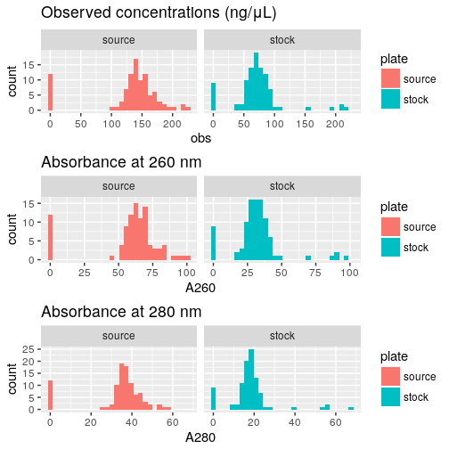
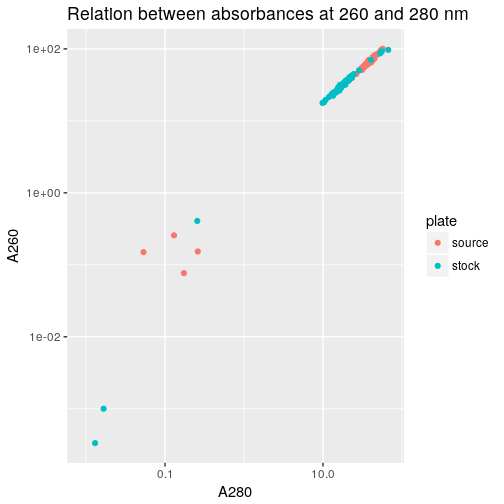
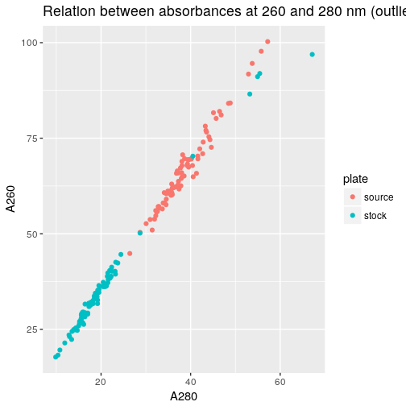
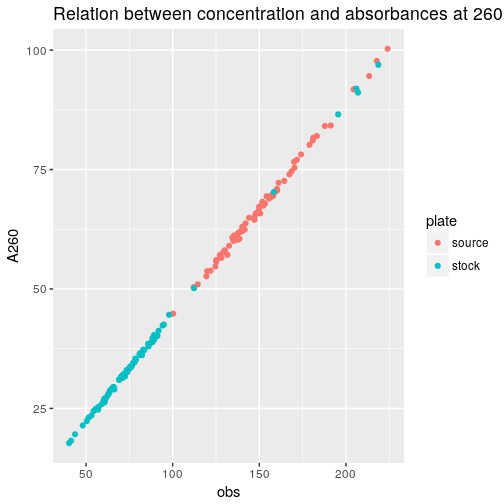
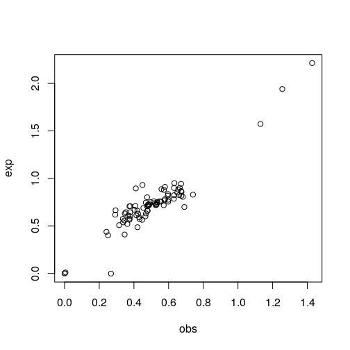

Load R packages
===============


```r
library("magrittr")
library("ggplot2")
```


Load data
=========

Concentrations of the actual TSO solutions in source plates, measured with
a NanoDrop 8000, that has a dynamic range of 2.5–3,700 ng/μL for dsDNA according
to the manufacturer's [website](https://www.thermofisher.com/jp/en/home/industrial/spectroscopy-elemental-isotope-analysis/molecular-spectroscopy/ultraviolet-visible-visible-spectrophotometry-uv-vis-vis/uv-vis-vis-instruments/nanodrop-microvolume-spectrophotometers/nanodrop-products-guide.html).


Stock plate
-----------

Original file name `20180419_TSOs_stf.txt`.  This file has one sheet containing
raw data of old TSOs (first IDT plate ordered) diluted 10× from the original
stock plate (all TSOs resuspended at 1 mM) and thus at an expected concentration
of 100 μM.


```r
stock <- gdata::read.xls( "old_TSOs_conc/20180419_TSOs_stf2.xlsx"
                        , stringsAsFactors = FALSE)
stock$Plate.ID <- "stock"
stock$X <- NA  # For rbind() later
```


Source plate
------------

Original file name `180507_kato.xlsx`.  This file is for the source plate used
in [experiment 6](Labcyte-RT_Data_Analysis_6.md)
(transfer design [6](Labcyte-RT6.md)).  Expected concentration: 100 μM.
Samples have been dilluted 10 times before measuring concentration (see sheet 4).


```r
source <- gdata::read.xls( "Labcyte-RT6.quantification.xlsx"
                         , nrow = 288, sheet = 1, stringsAsFactors = FALSE)
source$Plate.ID <- "source"
source$A260. %<>% multiply_by(10)  # Dilution factor
source$A280. %<>% multiply_by(10)  # Dilution factor
```


Combine plates
--------------


```r
conc <- rbind(stock, source)

conc <- data.frame( Well  = conc$Well      
                  , plate = conc$Plate.ID  %>% factor
                  , A260  = conc$A260.
                  , A280  = conc$A280.)

conc$Well %<>% factor(levels = levels(conc$Well) %>% gtools::mixedsort())
conc$exp <- 100
```


Load maker's information
------------------------


```r
idt <- read.csv("old_TSOs_conc/TSO_master_plate_PO_8268526.csv")
idt <- idt[,c("Well.Position", "Extinction.Coefficient.L..mole.cm.")]
idt$Well <- idt$Well.Position %>% sub(pat = "0(.)", rep = "\\1")
conc$ext <- idt[match(conc$Well, idt$Well), "Extinction.Coefficient.L..mole.cm."]
```


Calculate concentrations (in micromolars)
-----------------------------------------


```r
conc$obs <- conc$A260 / conc$ext * 1e6
```


Average replicates
------------------


```r
conc.sd <- aggregate( conc[,c("obs", "exp", "A260", "A280")]
                    , list(Well = conc$Well, plate = conc$plate)
                    , sd)

conc <-    aggregate( conc[,c("obs", "exp", "A260", "A280")]
                    , list(Well = conc$Well, plate = conc$plate)
                    , mean)

summary(conc)
```

```
##       Well        plate         obs                exp           A260               A280      
##  A1     :  2   source:96   Min.   : -0.8892   Min.   :100   Min.   : -0.4033   Min.   :-0.24  
##  A2     :  2   stock :96   1st Qu.: 65.8678   1st Qu.:100   1st Qu.: 29.2115   1st Qu.:16.33  
##  A3     :  2               Median : 89.4599   Median :100   Median : 40.1722   Median :22.40  
##  A4     :  2               Mean   :101.0500   Mean   :100   Mean   : 44.9639   Mean   :25.95  
##  A5     :  2               3rd Qu.:142.5792   3rd Qu.:100   3rd Qu.: 63.9117   3rd Qu.:37.32  
##  A6     :  2               Max.   :224.0369   Max.   :100   Max.   :100.2733   Max.   :67.16  
##  (Other):180
```


Histograms
==========


```r
hist_obs  <- ggplot(conc, aes(obs,  fill = plate)) + geom_histogram() +
  facet_wrap(~plate, nrow = 1) + ggtitle("Observed concentrations (ng/μL)")
hist_a260 <- ggplot(conc, aes(A260, fill = plate)) + geom_histogram() +
  facet_wrap(~plate, nrow = 1) + ggtitle("Absorbance at 260 nm")
hist_a280 <- ggplot(conc, aes(A280, fill = plate)) + geom_histogram() +
  facet_wrap(~plate, nrow = 1) + ggtitle("Absorbance at 280 nm")

ggpubr::ggarrange( ncol = 1, nrow = 3, hist_obs, hist_a260, hist_a280)
```

```
## `stat_bin()` using `bins = 30`. Pick better value with `binwidth`.
## `stat_bin()` using `bins = 30`. Pick better value with `binwidth`.
## `stat_bin()` using `bins = 30`. Pick better value with `binwidth`.
```

<!-- -->


Absorbances and concentration
=============================

## A260 vs A280


```r
ggplot(conc, aes(A280, A260, colour = plate)) + geom_point() +
    scale_x_log10() + scale_y_log10() +
  ggtitle("Relation between absorbances at 260 and 280 nm")
```

```
## Warning in self$trans$transform(x): NaNs produced
```

```
## Warning: Transformation introduced infinite values in continuous x-axis
```

```
## Warning in self$trans$transform(x): NaNs produced
```

```
## Warning: Transformation introduced infinite values in continuous y-axis
```

```
## Warning: Removed 14 rows containing missing values (geom_point).
```

<!-- -->

```r
ggplot(conc[conc$A260 > 1,], aes(A280, A260, colour = plate)) + geom_point() +
  ggtitle("Relation between absorbances at 260 and 280 nm (outliers removed)")
```

<!-- -->

## concentration vs A260 after the empty wells


```r
ggplot(conc[conc$obs > 10,], aes(obs, A260, colour = plate)) + geom_point() +
  ggtitle("Relation between concentration and absorbances at 260 nm")
```

<!-- -->


Comparison between source and stock
===================================

The source plate was made by adjusting concentrations of the stock primers,
based on the measurement of their concentration, see
[old_TSOs_conc/TSO_conc2](old_TSOs_conc/TSO_conc2.md) for details.

Here, we verify that the dilution factors were applied as expected.  


```r
dil <- data.frame( Well = levels(conc$Well)
                 , exp  = read.table("old_TSOs_conc/dilution_table2.txt", dec = ",", sep = "\t", header = TRUE)[,2, drop = T]
                 , obs  = conc[conc$plate == "stock", "obs"] / conc[conc$plate == "source", "obs"])

with(dil[dil$obs > 0 & dil$ obs < 100,], plot(obs, exp))
```

<!-- -->


Session information
===================


```r
sessionInfo()
```

```
## R version 3.4.3 (2017-11-30)
## Platform: x86_64-pc-linux-gnu (64-bit)
## Running under: Debian GNU/Linux 9 (stretch)
## 
## Matrix products: default
## BLAS: /usr/lib/libblas/libblas.so.3.7.0
## LAPACK: /usr/lib/lapack/liblapack.so.3.7.0
## 
## locale:
##  [1] LC_CTYPE=en_GB.UTF-8       LC_NUMERIC=C               LC_TIME=en_GB.UTF-8       
##  [4] LC_COLLATE=en_GB.UTF-8     LC_MONETARY=en_GB.UTF-8    LC_MESSAGES=en_GB.UTF-8   
##  [7] LC_PAPER=en_GB.UTF-8       LC_NAME=C                  LC_ADDRESS=C              
## [10] LC_TELEPHONE=C             LC_MEASUREMENT=en_GB.UTF-8 LC_IDENTIFICATION=C       
## 
## attached base packages:
## [1] stats     graphics  grDevices utils     datasets  methods   base     
## 
## other attached packages:
## [1] ggplot2_2.2.1 magrittr_1.5 
## 
## loaded via a namespace (and not attached):
##  [1] Rcpp_0.12.16     bindr_0.1        knitr_1.20       ggpubr_0.1.6     cowplot_0.9.2   
##  [6] munsell_0.4.3    colorspace_1.3-2 R6_2.2.2         rlang_0.2.0      dplyr_0.7.4     
## [11] stringr_1.3.0    plyr_1.8.4       tools_3.4.3      grid_3.4.3       gtable_0.2.0    
## [16] htmltools_0.3.6  gtools_3.5.0     assertthat_0.2.0 yaml_2.1.18      lazyeval_0.2.1  
## [21] rprojroot_1.3-2  digest_0.6.15    tibble_1.4.2     bindrcpp_0.2     purrr_0.2.4     
## [26] glue_1.2.0       evaluate_0.10.1  rmarkdown_1.9    labeling_0.3     gdata_2.18.0    
## [31] stringi_1.1.7    compiler_3.4.3   pillar_1.2.1     scales_0.5.0     backports_1.1.2 
## [36] pkgconfig_2.0.1
```
