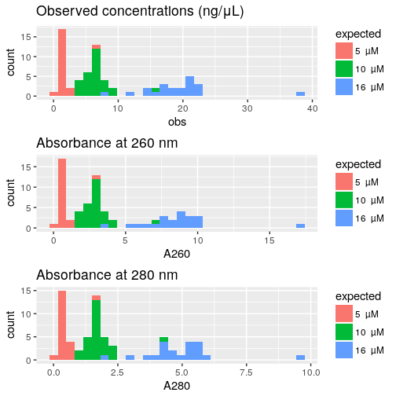

Load R packages
===============


```r
library("magrittr")
library("ggplot2")
```


Load data
=========

Concentrations of the actual TSO solutions in source plates, measured with
a NanoDrop 8000, that has a dynamic range of 2.5–3,700 ng/μL for dsDNA according
to the manufacturer's [website](https://www.thermofisher.com/jp/en/home/industrial/spectroscopy-elemental-isotope-analysis/molecular-spectroscopy/ultraviolet-visible-visible-spectrophotometry-uv-vis-vis/uv-vis-vis-instruments/nanodrop-microvolume-spectrophotometers/nanodrop-products-guide.html).


Source plate
------------

Original file name `180510_kato.xlsx`.  This file is for the source plate used
in [experiment 7](Labcyte-RT_Data_Analysis_7.md) (transfer design 6).  See
[6a](Labcyte-RT6a.md) for example and expected concentrations.


```r
source <- gdata::read.xls( "Labcyte-Exp7.quantification.xlsx"
                         , nrow = 210, sheet = 1, stringsAsFactors = FALSE)
source$Plate.ID <- "source"

source$col <- source$Well. %>% sub(pat = ".", rep = "")
source$row <- source$Well. %>% substr(1,1)
source$orig_row <- source$col %>% factor(levels = 1:10, labels = c("A", "C", "E", "G", "I", "B", "D", "F", "H", "J"))
source$orig_col <- source$row %>% factor %>% as.numeric
source$orig_well <- paste0(source$orig_row, sprintf("%02d", source$orig_col))

conc <- data.frame( Well  = source$orig_well      
                  , plate = source$Plate.ID  %>% factor
                  , A260  = source$A260.
                  , A280  = source$A280.)

conc$Well %<>% factor(levels = levels(conc$Well) %>% gtools::mixedsort())
```


Load maker's information
------------------------


```r
idt <- read.csv("TSO_master_plate_PO_8268526.csv")
idt <- idt[,c("Well.Position", "Extinction.Coefficient.L..mole.cm.")]
conc$ext <- idt[match(conc$Well, idt$Well), "Extinction.Coefficient.L..mole.cm."]
```


Calculate concentrations (in micromolars)
-----------------------------------------


```r
conc$obs <- conc$A260 / conc$ext * 1e6
```


Average replicates
------------------


```r
conc.sd <- aggregate( conc[,c("obs", "A260", "A280")]
                    , list(Well = conc$Well, plate = conc$plate)
                    , sd)

conc <-    aggregate( conc[,c("obs", "A260", "A280")]
                    , list(Well = conc$Well, plate = conc$plate)
                    , mean)

summary(conc)
```

```
##       Well       plate         obs               A260              A280       
##  A01    : 1   source:70   Min.   : 0.5724   Min.   : 0.2570   Min.   :0.1560  
##  A02    : 1               1st Qu.: 3.7050   1st Qu.: 0.8663   1st Qu.:0.5225  
##  A03    : 1               Median : 6.6869   Median : 2.7813   Median :1.6783  
##  A04    : 1               Mean   : 9.9324   Mean   : 3.9632   Mean   :2.3365  
##  A05    : 1               3rd Qu.:17.5441   3rd Qu.: 6.8615   3rd Qu.:4.1242  
##  A06    : 1               Max.   :38.7375   Max.   :17.3767   Max.   :9.7473  
##  (Other):64               NA's   :14
```


Expected concentrations
-----------------------


```r
conc[grepl("[ABC]", conc$Well),  "exp"] <- 800 / 50
conc[grepl("[DEFJ]", conc$Well), "exp"] <- 200 / 20
conc[grepl("[GHI]", conc$Well),  "exp"] <-  50 / 10
```

Histograms
==========


```r
hist_obs  <- ggplot(conc, aes(obs,  fill = exp %>% factor)) + geom_histogram() + ggtitle("Observed concentrations (ng/μL)")
hist_a260 <- ggplot(conc, aes(A260, fill = exp %>% factor)) + geom_histogram() + ggtitle("Absorbance at 260 nm")
hist_a280 <- ggplot(conc, aes(A280, fill = exp %>% factor)) + geom_histogram() + ggtitle("Absorbance at 280 nm")

ggpubr::ggarrange( ncol = 1, nrow = 3, hist_obs, hist_a260, hist_a280)
```

```
## `stat_bin()` using `bins = 30`. Pick better value with `binwidth`.
## `stat_bin()` using `bins = 30`. Pick better value with `binwidth`.
## `stat_bin()` using `bins = 30`. Pick better value with `binwidth`.
```

<!-- -->


Absorbances and concentration
=============================

## A260 vs A280


```r
ggplot(conc, aes(A280, A260, colour = exp)) + geom_point() +
    scale_x_log10() + scale_y_log10() +
  ggtitle("Relation between absorbances at 260 and 280 nm")
```

<!-- -->

```r
ggplot(conc[conc$A260 > 1,], aes(A280, A260, colour = exp)) + geom_point() +
  ggtitle("Relation between absorbances at 260 and 280 nm (outliers removed)")
```

<!-- -->

## concentration vs A260 after the empty wells


```r
ggplot(conc, aes(obs, A260, colour = exp)) + geom_point() +
  ggtitle("Relation between concentration and absorbances at 260 nm")
```

```
## Warning: Removed 14 rows containing missing values (geom_point).
```

<!-- -->


Session information
===================


```r
sessionInfo()
```

```
## R version 3.4.3 (2017-11-30)
## Platform: x86_64-pc-linux-gnu (64-bit)
## Running under: Debian GNU/Linux 9 (stretch)
## 
## Matrix products: default
## BLAS: /usr/lib/libblas/libblas.so.3.7.0
## LAPACK: /usr/lib/lapack/liblapack.so.3.7.0
## 
## locale:
##  [1] LC_CTYPE=en_GB.UTF-8       LC_NUMERIC=C               LC_TIME=en_GB.UTF-8       
##  [4] LC_COLLATE=en_GB.UTF-8     LC_MONETARY=en_GB.UTF-8    LC_MESSAGES=en_GB.UTF-8   
##  [7] LC_PAPER=en_GB.UTF-8       LC_NAME=C                  LC_ADDRESS=C              
## [10] LC_TELEPHONE=C             LC_MEASUREMENT=en_GB.UTF-8 LC_IDENTIFICATION=C       
## 
## attached base packages:
## [1] stats     graphics  grDevices utils     datasets  methods   base     
## 
## other attached packages:
## [1] ggplot2_2.2.1 magrittr_1.5 
## 
## loaded via a namespace (and not attached):
##  [1] Rcpp_0.12.16     bindr_0.1        knitr_1.20       ggpubr_0.1.6     cowplot_0.9.2   
##  [6] munsell_0.4.3    colorspace_1.3-2 R6_2.2.2         rlang_0.2.0      dplyr_0.7.4     
## [11] stringr_1.3.0    plyr_1.8.4       tools_3.4.3      grid_3.4.3       gtable_0.2.0    
## [16] htmltools_0.3.6  gtools_3.5.0     assertthat_0.2.0 yaml_2.1.18      lazyeval_0.2.1  
## [21] rprojroot_1.3-2  digest_0.6.15    tibble_1.4.2     bindrcpp_0.2     purrr_0.2.4     
## [26] glue_1.2.0       evaluate_0.10.1  rmarkdown_1.9    labeling_0.3     gdata_2.18.0    
## [31] stringi_1.1.7    compiler_3.4.3   pillar_1.2.1     scales_0.5.0     backports_1.1.2 
## [36] pkgconfig_2.0.1
```
