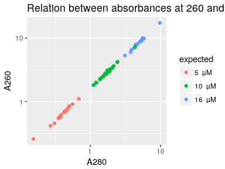

Concentrations of the actual TSO solutions in source plates, measured with
a NanoDrop 8000, that has a dynamic range of 2.5–3,700 ng/μL for dsDNA according
to the manufacturer's [website](https://www.thermofisher.com/jp/en/home/industrial/spectroscopy-elemental-isotope-analysis/molecular-spectroscopy/ultraviolet-visible-visible-spectrophotometry-uv-vis-vis/uv-vis-vis-instruments/nanodrop-microvolume-spectrophotometers/nanodrop-products-guide.html).


Load R packages
===============


```r
library("magrittr")
library("ggplot2")
```


Load data
=========

Source plate
------------

Original file name `180510_kato.xlsx`.  This file is for the source plate used
in [experiment 7](Labcyte-RT_Data_Analysis_7.md), which uses transfer design 6.
See [design 6a](Labcyte-RT6a.md) for example and expected concentrations.


```r
source <- gdata::read.xls( "Labcyte-Exp7.quantification.xlsx"
                         , nrow = 210, sheet = 1, stringsAsFactors = FALSE)
source$Plate.ID <- "exp7"

source$col <- source$Well. %>% sub(pat = ".", rep = "")
source$row <- source$Well. %>% substr(1,1)
```

TSOs were transferred from the source plate to a dillution plate, in new
coordinates documented in sheet 2.


```r
source$orig_row  <- source$col %>%
                      factor( levels = 1:10,
                              labels = c("A", "C", "E", "G", "I", "B", "D", "F", "H", "J"))
source$orig_col  <- source$row %>% factor %>% as.numeric
source$orig_well <- paste0(source$orig_row, sprintf("%02d", source$orig_col))
```


Average replicates
------------------


```r
conc <- data.frame( Well  = source$orig_well
                  , plate = source$Plate.ID
                  , A260  = source$A260.
                  , A280  = source$A280.
                  , stringsAsFactors = FALSE)

conc.sd <- aggregate( conc[,c("A260", "A280")]
                    , list(Well = conc$Well, plate = conc$plate)
                    , sd)

conc <-    aggregate( conc[,c("A260", "A280")]
                    , list(Well = conc$Well, plate = conc$plate)
                    , mean)

conc$CV <- conc.sd$A260 / conc$A260

summary(conc)
```

```
##      Well              plate                A260              A280              CV          
##  Length:70          Length:70          Min.   : 0.2570   Min.   :0.1560   Min.   :0.003053  
##  Class :character   Class :character   1st Qu.: 0.8663   1st Qu.:0.5225   1st Qu.:0.022887  
##  Mode  :character   Mode  :character   Median : 2.7813   Median :1.6783   Median :0.054860  
##                                        Mean   : 3.9632   Mean   :2.3365   Mean   :0.076452  
##                                        3rd Qu.: 6.8615   3rd Qu.:4.1242   3rd Qu.:0.104058  
##                                        Max.   :17.3767   Max.   :9.7473   Max.   :0.321727
```


Barcode IDs
-----------

See [design 6a](Labcyte-RT6a.md) for example and expected concentrations if you
would like to double-check.


```r
conc$ID <- c(  3, 15, 27, 39, 51, 63, 75
            , 10, 22, 34, 46, 58, 70, 82
            , 11, 23, 35, 47, 59, 71, 83
            ,  1, 13, 25, 37, 49, 61, 73
            ,  2, 14, 26, 38, 50, 62, 74
            ,  7, 19, 31, 43, 55, 67, 79
            ,  4, 16, 28, 40, 52, 64, 76
            ,  5, 17, 29, 41, 65, 77, 89
            ,  6, 18, 30, 42, 66, 78, 90
            ,  8, 20, 32, 44, 68, 80, 92)

conc$stock_Well <- platetools::num_to_well(1:96)[conc$ID]
```


Load maker's information
------------------------


```r
idt <- read.csv("TSO_master_plate_PO_8268526.csv")
idt <- idt[,c("Well.Position", "Extinction.Coefficient.L..mole.cm.")]
conc$ext <- idt[match(conc$stock_Well, idt$Well), "Extinction.Coefficient.L..mole.cm."]
```


Calculate concentrations (in micromolars)
-----------------------------------------


```r
conc$obs <- conc$A260 / conc$ext * 1e6
```


Expected concentrations
-----------------------

To stay in the dynamic range, a different dilution factor was applied to the
TSOs according to their expected concentrations.


```r
conc[grepl("[ABC]",  conc$Well), "expected"] <- 800 / 50
conc[grepl("[DEFJ]", conc$Well), "expected"] <- 200 / 20
conc[grepl("[GHI]",  conc$Well), "expected"] <-  50 / 10
conc$dil <- 1000 / conc$expected
conc$expected %<>% paste(" µM") %>% factor
conc$expected %<>% factor(levels = levels(.) %>% gtools::mixedsort())
```


Histograms
==========


```r
hist_obs  <- ggplot(conc, aes(obs,  fill = expected)) + geom_histogram() + ggtitle("Observed concentrations (ng/μL)")
hist_a260 <- ggplot(conc, aes(A260, fill = expected)) + geom_histogram() + ggtitle("Absorbance at 260 nm")
hist_a280 <- ggplot(conc, aes(A280, fill = expected)) + geom_histogram() + ggtitle("Absorbance at 280 nm")

ggpubr::ggarrange( ncol = 1, nrow = 3, hist_obs, hist_a260, hist_a280)
```

```
## `stat_bin()` using `bins = 30`. Pick better value with `binwidth`.
## `stat_bin()` using `bins = 30`. Pick better value with `binwidth`.
## `stat_bin()` using `bins = 30`. Pick better value with `binwidth`.
```

<!-- -->


A260 vs A280
============


```r
ggplot(conc, aes(A280, A260, colour = expected)) + geom_point() +
    scale_x_log10() + scale_y_log10() +
  ggtitle("Relation between absorbances at 260 and 280 nm")
```

<!-- -->


Comparison between source and stock
===================================

The source plate was made without concentrations of the stock primers (see
[TSO_concentration_check2](TSO_concentration_check2.md) for details).

Here, we check whether the deviations of concentrations seen in the stock are
also obsereved in the source plate.


```r
conc$stock <-
  read.table( "dilution_table.txt"
            , sep = "\t"
            , header = TRUE)[,"source_obs_molarity", drop = T][conc$ID]

conc$exp <- conc$stock / conc$dil

ggplot(conc, aes(obs, exp, colour = CV)) +
  geom_text(aes(label=Well)) +
  facet_wrap(~expected, scale = "free")
```

<!-- -->

## Save concentration values.


```r
dput(data.frame(ID = conc$ID, ratio = conc$obs / conc$exp))
```

```
## structure(list(ID = c(3, 15, 27, 39, 51, 63, 75, 10, 22, 34, 
## 46, 58, 70, 82, 11, 23, 35, 47, 59, 71, 83, 1, 13, 25, 37, 49, 
## 61, 73, 2, 14, 26, 38, 50, 62, 74, 7, 19, 31, 43, 55, 67, 79, 
## 4, 16, 28, 40, 52, 64, 76, 5, 17, 29, 41, 65, 77, 89, 6, 18, 
## 30, 42, 66, 78, 90, 8, 20, 32, 44, 68, 80, 92), ratio = c(1.5401680646872, 
## 1.84454472001273, 1.07929422346642, 1.56027975181807, 1.40991295568589, 
## 1.53739664067134, 1.69413271023218, 2.70565070788847, 1.89073258680516, 
## 1.81081351612852, 1.68745362137591, 1.8220516204132, 2.51841767691933, 
## 2.4230324978243, 2.47235245928041, 0.65076806279204, 1.51290631705344, 
## 1.24525814801536, 1.62037206548573, 1.61990488912798, 1.73962196282284, 
## 0.993776168847445, 0.825307363461054, 0.971698326778714, 0.691900691047363, 
## 0.850106013742765, 1.17593076382502, 0.774454131789602, 0.776756366251071, 
## 0.727785927674589, 1.00815521472823, 0.718784845123148, 0.952151767798449, 
## 0.98883617929997, 1.0356514898073, 1.22406910032186, 0.663293897417757, 
## 0.92461643706745, 0.720725973299332, 0.964971245676301, 0.859369504593241, 
## 0.779022625280164, 0.504208519424318, 0.348934263050581, 0.303621910400396, 
## 0.428990173012725, 0.291541519258586, 0.423096216500906, 0.483362903299064, 
## 0.467628434132292, 0.271428181959657, 0.444180415799337, 0.359322196283508, 
## 0.475717207567052, 0.450454503967695, 0.439952413408859, 0.416152006142889, 
## 0.310807137722525, 0.408824315392945, 0.414254512515641, 0.43534968077676, 
## 0.543315351175799, 0.590474091373905, 1.28416790273178, 0.958481678285734, 
## 0.778361063752032, 0.786141117616662, 0.964305983879104, 1.0698764321619, 
## 0.845293128571203)), .Names = c("ID", "ratio"), row.names = c(NA, 
## -70L), class = "data.frame")
```


Session information
===================


```r
sessionInfo()
```

```
## R version 3.4.3 (2017-11-30)
## Platform: x86_64-pc-linux-gnu (64-bit)
## Running under: Debian GNU/Linux 9 (stretch)
## 
## Matrix products: default
## BLAS: /usr/lib/libblas/libblas.so.3.7.0
## LAPACK: /usr/lib/lapack/liblapack.so.3.7.0
## 
## locale:
##  [1] LC_CTYPE=en_GB.UTF-8       LC_NUMERIC=C               LC_TIME=en_GB.UTF-8       
##  [4] LC_COLLATE=en_GB.UTF-8     LC_MONETARY=en_GB.UTF-8    LC_MESSAGES=en_GB.UTF-8   
##  [7] LC_PAPER=en_GB.UTF-8       LC_NAME=C                  LC_ADDRESS=C              
## [10] LC_TELEPHONE=C             LC_MEASUREMENT=en_GB.UTF-8 LC_IDENTIFICATION=C       
## 
## attached base packages:
## [1] stats     graphics  grDevices utils     datasets  methods   base     
## 
## other attached packages:
## [1] ggplot2_2.2.1 magrittr_1.5 
## 
## loaded via a namespace (and not attached):
##  [1] Rcpp_0.12.16       ggpubr_0.1.6       bindr_0.1          knitr_1.20         cowplot_0.9.2     
##  [6] munsell_0.4.3      colorspace_1.3-2   R6_2.2.2           rlang_0.2.0        dplyr_0.7.4       
## [11] stringr_1.3.0      plyr_1.8.4         tools_3.4.3        platetools_0.0.2   grid_3.4.3        
## [16] gtable_0.2.0       htmltools_0.3.6    gtools_3.5.0       assertthat_0.2.0   yaml_2.1.18       
## [21] lazyeval_0.2.1     rprojroot_1.3-2    digest_0.6.15      tibble_1.4.2       bindrcpp_0.2      
## [26] purrr_0.2.4        RColorBrewer_1.1-2 glue_1.2.0         evaluate_0.10.1    rmarkdown_1.9     
## [31] labeling_0.3       gdata_2.18.0       stringi_1.1.7      compiler_3.4.3     pillar_1.2.1      
## [36] scales_0.5.0       backports_1.1.2    pkgconfig_2.0.1
```
