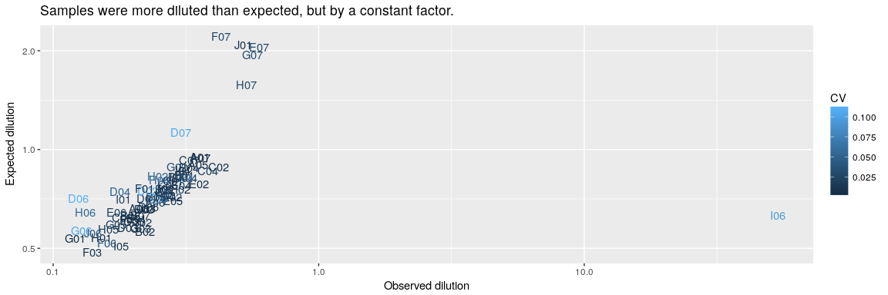

Concentrations of the actual TSO solutions in source plates, measured with
a NanoDrop 8000, that has a dynamic range of 2.5–3,700 ng/μL for dsDNA according
to the manufacturer's [website](https://www.thermofisher.com/jp/en/home/industrial/spectroscopy-elemental-isotope-analysis/molecular-spectroscopy/ultraviolet-visible-visible-spectrophotometry-uv-vis-vis/uv-vis-vis-instruments/nanodrop-microvolume-spectrophotometers/nanodrop-products-guide.html).


Load R packages
===============


```r
library("magrittr")
library("ggplot2")
```


Load data
=========

Source plate
------------

Original file name `180528_kato.xlsx`.  This file is for the source plate used
in [experiment 8](Labcyte-RT_Data_Analysis_8.md), which uses transfer [design 7](Labcyte-RT7.md).


```r
source <- gdata::read.xls( "Labcyte-Exp8.quantification.xlsx"
                         , nrow = 210, sheet = 1, stringsAsFactors = FALSE)

source$Plate.ID <- "exp8"
source$col      <- source$Well. %>% sub(pat = ".", rep = "")
source$row      <- source$Well. %>% substr(1,1)
```

TSOs were transferred from the source plate to a dillution plate, in new
coordinates documented in sheet 2.  The command below reconstructs the well
names.


```r
source$orig_well  <- apply( expand.grid( c("01", "03", "05", "07", "02", "04", "06")
                                       , unlist( lapply( LETTERS[1:10]
                                                       , rep
                                                       , 3)))
                          , MARGIN = 1
                          , function(x) paste0(x[2], x[1]))
```


Average replicates
------------------


```r
conc <- data.frame( Well  = source$orig_well
                  , plate = source$Plate.ID
                  , A260  = source$A260.
                  , A280  = source$A280.
                  , stringsAsFactors = FALSE)

conc.sd <- aggregate( conc[,c("A260", "A280")]
                    , list(Well = conc$Well, plate = conc$plate)
                    , sd)

conc <-    aggregate( conc[,c("A260", "A280")]
                    , list(Well = conc$Well, plate = conc$plate)
                    , mean)

conc$CV <- conc.sd$A260 / conc$A260

summary(conc)
```

```
##      Well              plate                A260               A280               CV           
##  Length:70          Length:70          Min.   : 0.02633   Min.   :0.01767   Min.   :0.0007188  
##  Class :character   Class :character   1st Qu.: 6.07700   1st Qu.:3.50667   1st Qu.:0.0057552  
##  Mode  :character   Mode  :character   Median : 6.47817   Median :3.80050   Median :0.0137396  
##                                        Mean   : 6.88756   Mean   :3.99223   Mean   :0.0227364  
##                                        3rd Qu.: 7.52992   3rd Qu.:4.35267   3rd Qu.:0.0259328  
##                                        Max.   :12.83600   Max.   :7.50067   Max.   :0.1112838
```


Barcode IDs
-----------

See [design 7](Labcyte-RT7.md) if you would like to double-check.


```r
#               1   2   3   4   5   6   7
conc$ID  <- c(  1, 13, 25, 37, 49, 61, 73  # A
             ,  2, 14, 39, 38, 50, 62, 74  # B
             ,  4, 16, 28, 40, 64, 76, 88  # C
             ,  5, 17, 29, 41, 65, 77, 89  # D
             , 51, 18, 30, 42, 66, 78, 90  # E
             ,  7, 19, 31, 43, 67, 79, 91  # F
             ,  8, 87, 32, 44, 68, 80, 92  # G
             ,  9, 21, 33, 45, 69, 81, 24  # H 
             , 71, 23, 60, 47, 70, 83, 36  # I
             , 72, 22, 35, 46, 59, 82, 48) # J

conc$stock_Well <- platetools::num_to_well(1:96)[conc$ID]
```


Load maker's information
------------------------


```r
idt <- read.csv("TSO_master_plate_PO_8268526.csv")
idt <- idt[,c("Well.Position", "Extinction.Coefficient.L..mole.cm.")]
conc$ext <- idt[match(conc$stock_Well, idt$Well), "Extinction.Coefficient.L..mole.cm."]
```


Calculate concentrations (in micromolars)
-----------------------------------------


```r
conc$obs <- conc$A260 / conc$ext * 1e6
```


Expected concentration
----------------------

In this experiment, all the TSOs were prepared at 200 µM and diluted 20 times
before the measurement of concentration.


```r
conc$expected <- "10 µM"
```


Histograms
==========

The outlier with absorbances and molarity close to zero is `I06/G11`
(source/stock coordinates).  Conversely, `D06/G05`, `F07/H07` and `H06/G09`
have the highest values.


```r
hist_obs  <- ggplot(conc, aes(obs,  fill = expected)) +
  geom_histogram(bins=30) + ggtitle("Observed concentrations (µM)")
hist_a260 <- ggplot(conc, aes(A260, fill = expected)) +
  geom_histogram(bins=30) + ggtitle("Absorbance at 260 nm")
hist_a280 <- ggplot(conc, aes(A280, fill = expected)) +
  geom_histogram(bins=30) + ggtitle("Absorbance at 280 nm")

ggpubr::ggarrange(ncol = 1, nrow = 3, hist_obs, hist_a260, hist_a280)
```

<!-- -->


A260 vs A280
============


```r
ggplot(conc, aes(A280, A260, colour = expected)) + geom_point() +
  ggtitle("Relation between absorbances at 260 and 280 nm")
```

<!-- -->


Comparison between source and stock
===================================

The source plate was prepared with correction of the concentrations of the stock
primers (see [TSO_concentration_check2](TSO_concentration_check2.md) for details).

Still, the observed molarity (15.5 µM ± 3.8) is significantly different from the expectation (10 µM).

To see the effectiveness of the correction, we plot the observed molarities
against the expected molarities if the concentrations were not corrected
(that is transfer 4 µL TSO in 16 µL H2O for all TSOs).


```r
t.test(conc$obs, mu=10)
```

```
## 
## 	One Sample t-test
## 
## data:  conc$obs
## t = 12.086, df = 69, p-value < 2.2e-16
## alternative hypothesis: true mean is not equal to 10
## 95 percent confidence interval:
##  14.58165 16.39315
## sample estimates:
## mean of x 
##   15.4874
```

```r
conc$stock <-
  read.table( "dilution_table.txt"
            , sep = "\t"
            , header = TRUE)[,"source_obs_molarity", drop = T][conc$ID]

conc$exp_noncor <- conc$stock / 5 / 20 # 20 × dilution before measurement.
conc$exp <- 200 / 20 # 20 × dilution before measurement.

ggplot(conc, aes(obs, exp_noncor, colour = CV)) + 
  geom_text(aes(label=Well))
```

<!-- -->

The measurements with the highest noise (coefficient of variation, CV) are
plotted in lighter tones of blue.

What we see here is that for barcodes such as `D07`, `H07`, `G07`, etc, the
concentration was quite efficiently corrected.


Session information
===================


```r
sessionInfo()
```

```
## R version 3.4.3 (2017-11-30)
## Platform: x86_64-pc-linux-gnu (64-bit)
## Running under: Debian GNU/Linux 9 (stretch)
## 
## Matrix products: default
## BLAS: /usr/lib/libblas/libblas.so.3.7.0
## LAPACK: /usr/lib/lapack/liblapack.so.3.7.0
## 
## locale:
##  [1] LC_CTYPE=en_GB.UTF-8       LC_NUMERIC=C               LC_TIME=en_GB.UTF-8       
##  [4] LC_COLLATE=en_GB.UTF-8     LC_MONETARY=en_GB.UTF-8    LC_MESSAGES=en_GB.UTF-8   
##  [7] LC_PAPER=en_GB.UTF-8       LC_NAME=C                  LC_ADDRESS=C              
## [10] LC_TELEPHONE=C             LC_MEASUREMENT=en_GB.UTF-8 LC_IDENTIFICATION=C       
## 
## attached base packages:
## [1] stats     graphics  grDevices utils     datasets  methods   base     
## 
## other attached packages:
## [1] ggplot2_2.2.1 magrittr_1.5 
## 
## loaded via a namespace (and not attached):
##  [1] Rcpp_0.12.16       ggpubr_0.1.6       bindr_0.1          knitr_1.20         cowplot_0.9.2     
##  [6] munsell_0.4.3      colorspace_1.3-2   R6_2.2.2           rlang_0.2.0        dplyr_0.7.4       
## [11] stringr_1.3.0      plyr_1.8.4         tools_3.4.3        platetools_0.0.2   grid_3.4.3        
## [16] gtable_0.2.0       htmltools_0.3.6    gtools_3.5.0       assertthat_0.2.0   yaml_2.1.18       
## [21] lazyeval_0.2.1     rprojroot_1.3-2    digest_0.6.15      tibble_1.4.2       bindrcpp_0.2      
## [26] purrr_0.2.4        RColorBrewer_1.1-2 glue_1.2.0         evaluate_0.10.1    rmarkdown_1.9     
## [31] labeling_0.3       gdata_2.18.0       stringi_1.1.7      compiler_3.4.3     pillar_1.2.1      
## [36] scales_0.5.0       backports_1.1.2    pkgconfig_2.0.1
```
