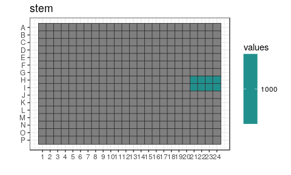
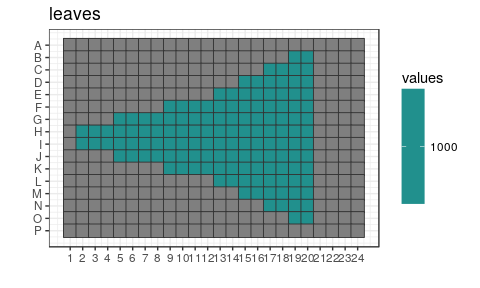
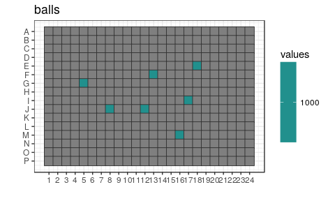
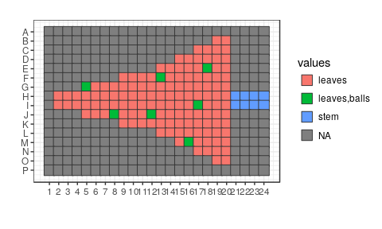
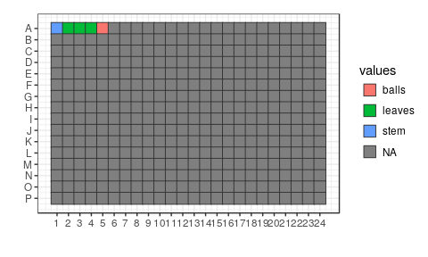

## Load scripts and libraries.


```r
library("magrittr")   # For its diamond pipe operators
library("ggplot2")    # For plotting
library("platetools") # For defining and manipulating 384-well plates
library("plyr")
library("tibble")     # For comfortable command-line operations

# The set_block function that will become part of platetools
source("https://raw.githubusercontent.com/charles-plessy/platetools/76213accb1704d11a2d96fb1f6284d0b46117778/R/set_block.R")
```

## Target plate layout

Create a data frame representing the contents of each well.


```r
plate <- tibble(well = platetools::num_to_well(1:384, plate = "384"))
plate
```

```
## # A tibble: 384 x 1
##     well
##    <chr>
##  1   A01
##  2   A02
##  3   A03
##  4   A04
##  5   A05
##  6   A06
##  7   A07
##  8   A08
##  9   A09
## 10   A10
## # ... with 374 more rows
```


```r
plate %<>% set_block("H21~I24", "stem", 1000)
```


```r
plate %<>%
  set_block("B19~O20", "leaves", 1000) %>%
  set_block("C17~N18", "leaves", 1000) %>%
  set_block("D15~M16", "leaves", 1000) %>%
  set_block("E13~L14", "leaves", 1000) %>%
  set_block("F09~K12", "leaves", 1000) %>%
  set_block("G05~J08", "leaves", 1000) %>%
  set_block("H02~I04", "leaves", 1000)
```


```r
plate %<>%
  set_block("G05", "balls", 1000) %>%
  set_block("J08", "balls", 1000) %>%
  set_block("F13", "balls", 1000) %>%
  set_block("J12", "balls", 1000) %>%
  set_block("I17", "balls", 1000) %>%
  set_block("E18", "balls", 1000) %>%
  set_block("M16", "balls", 1000)
```


```r
plateMap <- function(plate, x, title) {
  platetools::raw_map(plate[[x]], well=plate$well, plate="384") +
  ggtitle(title) +
  viridis::scale_fill_viridis(breaks = unique(plate[[x]]))
}

(plot_stem   <- plateMap(plate, "stem",   "stem"))
```

<!-- -->

```r
(plot_leaves <- plateMap(plate, "leaves", "leaves"))
```

<!-- -->

```r
(plot_balls  <- plateMap(plate, "balls",  "balls"))
```

<!-- -->

```r
x <- data.frame(lapply(colnames(plate[,-1]), function(x) ifelse(is.na(plate[,x]), "", x)))
x <- apply( x, 1
          , function(x)
              if(all(x=="")) {
                NA
              } else {
                paste(unique(x[x!=""]), collapse=",")
              })
plate$contents <- x

raw_map(plate$contents, well=plate$well, plate="384")
```

<!-- -->

## Source plate layout


```r
colSums(plate[,c("stem", "leaves", "balls")], na.rm = TRUE)
```

```
##   stem leaves  balls 
##   8000 134000   7000
```

```r
source <- tibble(well = platetools::num_to_well(1:384, plate = "384"))
source %<>%
  set_block("A01", "stem", 20000) %>%
  set_block("A02~A04", "leaves", 60000) %>%
  set_block("A05", "balls", 20000)

x <- data.frame(lapply(colnames(source[,-1]), function(x) ifelse(is.na(source[,x]), "", x)))
x <- apply( x, 1
          , function(x)
              if(all(x=="")) {
                NA
              } else {
                paste(unique(x[x!=""]), collapse=",")
              })
source$contents <- x

raw_map(source$contents, well=source$well, plate="384")
```

<!-- -->

## Plan transfer


```r
source("plates.R")
```

```
## Creating a generic function for 'colnames' from package 'base' in the global environment
```

```r
source("echo.R")
planPlate   <- Plate(plate = plate[, c("well", "stem", "leaves", "balls")])
sourcePlate <- Plate(plate = source[, c("well", "stem", "leaves", "balls")])
destPlate   <- Plate(plate = tibble::tibble(well = num_to_well(1:384, plate = "384")))

echo <- planTransfers(sourcePlate, destPlate, planPlate)
echo
```

```
## A 525 Echo machine:
##   Source plate:      A Plate with data about 384 wells (dead volume: 10000; max volume: 1e+05).
##   Destination plate: A Plate with data about 384 wells (dead volume: 10000; max volume: 1e+05).
## Transducer at the following coordinates:
##   Source:      A05 (384-well format)
##   Destination: M16 (384-well format)
## 149 elements in the log.
```

```r
transfers <- as.data.frame(echo %>% showLogs)
transfers
```

```
##     from  to  vol   what
## 1    A01 H21 1000   stem
## 2    A01 H22 1000   stem
## 3    A01 H23 1000   stem
## 4    A01 H24 1000   stem
## 5    A01 I21 1000   stem
## 6    A01 I22 1000   stem
## 7    A01 I23 1000   stem
## 8    A01 I24 1000   stem
## 9    A02 B19 1000 leaves
## 10   A02 B20 1000 leaves
## 11   A02 C17 1000 leaves
## 12   A02 C18 1000 leaves
## 13   A02 C19 1000 leaves
## 14   A02 C20 1000 leaves
## 15   A02 D15 1000 leaves
## 16   A02 D16 1000 leaves
## 17   A02 D17 1000 leaves
## 18   A02 D18 1000 leaves
## 19   A02 D19 1000 leaves
## 20   A02 D20 1000 leaves
## 21   A02 E13 1000 leaves
## 22   A02 E14 1000 leaves
## 23   A02 E15 1000 leaves
## 24   A02 E16 1000 leaves
## 25   A02 E17 1000 leaves
## 26   A02 E18 1000 leaves
## 27   A02 E19 1000 leaves
## 28   A02 E20 1000 leaves
## 29   A02 F09 1000 leaves
## 30   A02 F10 1000 leaves
## 31   A02 F11 1000 leaves
## 32   A02 F12 1000 leaves
## 33   A02 F13 1000 leaves
## 34   A02 F14 1000 leaves
## 35   A02 F15 1000 leaves
## 36   A02 F16 1000 leaves
## 37   A02 F17 1000 leaves
## 38   A02 F18 1000 leaves
## 39   A02 F19 1000 leaves
## 40   A02 F20 1000 leaves
## 41   A02 G05 1000 leaves
## 42   A02 G06 1000 leaves
## 43   A02 G07 1000 leaves
## 44   A02 G08 1000 leaves
## 45   A02 G09 1000 leaves
## 46   A02 G10 1000 leaves
## 47   A02 G11 1000 leaves
## 48   A02 G12 1000 leaves
## 49   A02 G13 1000 leaves
## 50   A02 G14 1000 leaves
## 51   A02 G15 1000 leaves
## 52   A02 G16 1000 leaves
## 53   A02 G17 1000 leaves
## 54   A02 G18 1000 leaves
## 55   A02 G19 1000 leaves
## 56   A02 G20 1000 leaves
## 57   A02 H02 1000 leaves
## 58   A03 H03 1000 leaves
## 59   A03 H04 1000 leaves
## 60   A03 H05 1000 leaves
## 61   A03 H06 1000 leaves
## 62   A03 H07 1000 leaves
## 63   A03 H08 1000 leaves
## 64   A03 H09 1000 leaves
## 65   A03 H10 1000 leaves
## 66   A03 H11 1000 leaves
## 67   A03 H12 1000 leaves
## 68   A03 H13 1000 leaves
## 69   A03 H14 1000 leaves
## 70   A03 H15 1000 leaves
## 71   A03 H16 1000 leaves
## 72   A03 H17 1000 leaves
## 73   A03 H18 1000 leaves
## 74   A03 H19 1000 leaves
## 75   A03 H20 1000 leaves
## 76   A03 I02 1000 leaves
## 77   A03 I03 1000 leaves
## 78   A03 I04 1000 leaves
## 79   A03 I05 1000 leaves
## 80   A03 I06 1000 leaves
## 81   A03 I07 1000 leaves
## 82   A03 I08 1000 leaves
## 83   A03 I09 1000 leaves
## 84   A03 I10 1000 leaves
## 85   A03 I11 1000 leaves
## 86   A03 I12 1000 leaves
## 87   A03 I13 1000 leaves
## 88   A03 I14 1000 leaves
## 89   A03 I15 1000 leaves
## 90   A03 I16 1000 leaves
## 91   A03 I17 1000 leaves
## 92   A03 I18 1000 leaves
## 93   A03 I19 1000 leaves
## 94   A03 I20 1000 leaves
## 95   A03 J05 1000 leaves
## 96   A03 J06 1000 leaves
## 97   A03 J07 1000 leaves
## 98   A03 J08 1000 leaves
## 99   A03 J09 1000 leaves
## 100  A03 J10 1000 leaves
## 101  A03 J11 1000 leaves
## 102  A03 J12 1000 leaves
## 103  A03 J13 1000 leaves
## 104  A03 J14 1000 leaves
## 105  A03 J15 1000 leaves
## 106  A03 J16 1000 leaves
## 107  A04 J17 1000 leaves
## 108  A04 J18 1000 leaves
## 109  A04 J19 1000 leaves
## 110  A04 J20 1000 leaves
## 111  A04 K09 1000 leaves
## 112  A04 K10 1000 leaves
## 113  A04 K11 1000 leaves
## 114  A04 K12 1000 leaves
## 115  A04 K13 1000 leaves
## 116  A04 K14 1000 leaves
## 117  A04 K15 1000 leaves
## 118  A04 K16 1000 leaves
## 119  A04 K17 1000 leaves
## 120  A04 K18 1000 leaves
## 121  A04 K19 1000 leaves
## 122  A04 K20 1000 leaves
## 123  A04 L13 1000 leaves
## 124  A04 L14 1000 leaves
## 125  A04 L15 1000 leaves
## 126  A04 L16 1000 leaves
## 127  A04 L17 1000 leaves
## 128  A04 L18 1000 leaves
## 129  A04 L19 1000 leaves
## 130  A04 L20 1000 leaves
## 131  A04 M15 1000 leaves
## 132  A04 M16 1000 leaves
## 133  A04 M17 1000 leaves
## 134  A04 M18 1000 leaves
## 135  A04 M19 1000 leaves
## 136  A04 M20 1000 leaves
## 137  A04 N17 1000 leaves
## 138  A04 N18 1000 leaves
## 139  A04 N19 1000 leaves
## 140  A04 N20 1000 leaves
## 141  A04 O19 1000 leaves
## 142  A04 O20 1000 leaves
## 143  A05 E18 1000  balls
## 144  A05 F13 1000  balls
## 145  A05 G05 1000  balls
## 146  A05 I17 1000  balls
## 147  A05 J08 1000  balls
## 148  A05 J12 1000  balls
## 149  A05 M16 1000  balls
```

```r
write.csv(transfers[,1:3], file = "Xmas.csv")
```

## Session information


```r
sessionInfo()
```

```
## R version 3.4.3 (2017-11-30)
## Platform: x86_64-pc-linux-gnu (64-bit)
## Running under: Debian GNU/Linux 9 (stretch)
## 
## Matrix products: default
## BLAS: /usr/lib/libblas/libblas.so.3.7.0
## LAPACK: /usr/lib/lapack/liblapack.so.3.7.0
## 
## locale:
##  [1] LC_CTYPE=en_GB.UTF-8       LC_NUMERIC=C              
##  [3] LC_TIME=en_GB.UTF-8        LC_COLLATE=en_GB.UTF-8    
##  [5] LC_MONETARY=en_GB.UTF-8    LC_MESSAGES=en_GB.UTF-8   
##  [7] LC_PAPER=en_GB.UTF-8       LC_NAME=C                 
##  [9] LC_ADDRESS=C               LC_TELEPHONE=C            
## [11] LC_MEASUREMENT=en_GB.UTF-8 LC_IDENTIFICATION=C       
## 
## attached base packages:
## [1] stats     graphics  grDevices utils     datasets  methods   base     
## 
## other attached packages:
## [1] bindrcpp_0.2     tibble_1.3.4     plyr_1.8.4       platetools_0.0.2
## [5] ggplot2_2.2.1    magrittr_1.5    
## 
## loaded via a namespace (and not attached):
##  [1] Rcpp_0.12.14       bindr_0.1          knitr_1.17        
##  [4] munsell_0.4.3      viridisLite_0.2.0  colorspace_1.3-2  
##  [7] R6_2.2.2           rlang_0.1.4        stringr_1.2.0     
## [10] dplyr_0.7.4        tools_3.4.3        grid_3.4.3        
## [13] gtable_0.2.0       htmltools_0.3.6    yaml_2.1.15       
## [16] lazyeval_0.2.1     rprojroot_1.2      digest_0.6.12     
## [19] assertthat_0.2.0   gridExtra_2.3      RColorBrewer_1.1-2
## [22] codetools_0.2-15   viridis_0.4.0      glue_1.2.0        
## [25] evaluate_0.10.1    rmarkdown_1.8      stringi_1.1.6     
## [28] compiler_3.4.3     scales_0.5.0       backports_1.1.1   
## [31] pkgconfig_2.0.1
```
