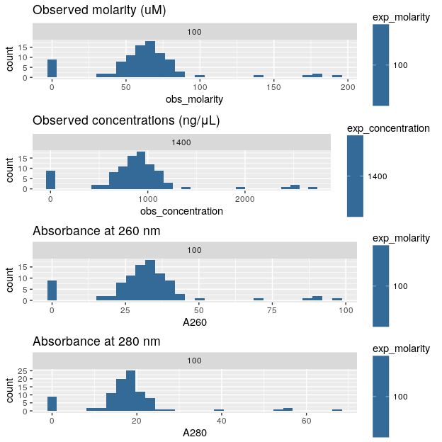
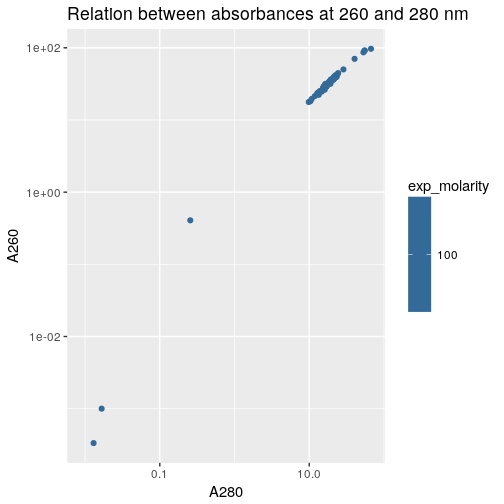
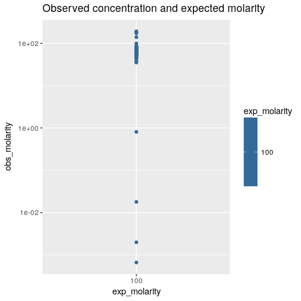

Load R packages
===============


```r
library("magrittr")
library("ggplot2")
```


Load data
=========

Concentrations of the actual TSO solutions in source plates, measured with
the NanoDrop instrument for 8-strip tubes (NanoDrop 8000 ?).

Concentration factor was _50_ (_A260 × 50 = concentration_ in ng/μL).
Concentration factor to apply for nanoCAGE TSOs (based on their sequences) = _27.8_ (_A260 × 27.8 = concentration_ in ng/μL).

Original file name `20180419_TSOs_stf.txt`.  This file has one sheet containing
raw data of old TSOs (first IDT plate ordered) diluted 10x from the original source plate (all TSOs resuspended at 1 mM) and thus at an expected concentration of 100 μM.


```r
plate1 <- gdata::read.xls( "20180419_TSOs_stf2.xlsx"
                        , stringsAsFactors = FALSE)
```

Adjust calculated concentrations based on TSOs concentration factor (_27.8_).


```r
plate1$plate <- 1
plate1$Conc..2 <- plate1$A260. * 27.8
conc <- plate1
rm(plate1)

conc <- data.frame( Well  = conc$Well      
                  , ID    = conc$Sample.ID %>% factor
                  , plate = conc$plate     %>% factor
                  , A260  = conc$A260.
                  , A280  = conc$A280.
                  , obs_concentration   = conc$Conc..2)

conc$Well %<>% factor(levels = levels(conc$Well) %>% gtools::mixedsort())
```

Average replicates.


```r
conc <- aggregate( conc[,c("obs_concentration", "A260", "A280")]
                 , list(Well = conc$Well, ID = conc$ID, plate = conc$plate)
                 , mean)
```

The expected molarity of TSOs in this measure is 100 μM.
The average molecular weight of nanoCAGE TSOs = 14,000 g/mol, according to IDT plate report.
Therefore the expected concentration of TSOs at 100 μM (100 μmol/L) should be:
100 μmol/L * 14000 g/mol = 1.4 g/L = 1400 ng/μL.


```r
conc$exp_molarity <- 100
conc$exp_concentration <-1400
conc$obs_molarity <- (conc$obs_concentration*1000) / 14000
conc <- conc[, c(1:3,5,6,8,4,7,9)]
summary(conc)
```

```
##       Well          ID     plate       A260             A280          exp_concentration
##  A1     : 1   1      : 1   1:96   Min.   :-0.108   Min.   :-0.05333   Min.   :1400     
##  A2     : 1   2      : 1          1st Qu.:26.190   1st Qu.:15.14075   1st Qu.:1400     
##  A3     : 1   3      : 1          Median :31.789   Median :17.84550   Median :1400     
##  A4     : 1   4      : 1          Mean   :31.850   Mean   :18.19185   Mean   :1400     
##  A5     : 1   5      : 1          3rd Qu.:36.379   3rd Qu.:20.65233   3rd Qu.:1400     
##  A6     : 1   6      : 1          Max.   :96.918   Max.   :67.15867   Max.   :1400     
##  (Other):90   (Other):90                                                               
##  obs_concentration   exp_molarity  obs_molarity     
##  Min.   :  -3.002   Min.   :100   Min.   : -0.2145  
##  1st Qu.: 728.073   1st Qu.:100   1st Qu.: 52.0052  
##  Median : 883.744   Median :100   Median : 63.1245  
##  Mean   : 885.417   Mean   :100   Mean   : 63.2441  
##  3rd Qu.:1011.341   3rd Qu.:100   3rd Qu.: 72.2386  
##  Max.   :2694.330   Max.   :100   Max.   :192.4521  
## 
```


```r
out_of_range_up <- subset(conc, conc$obs_concentration > 2000)
out_of_range_down <- subset(conc, conc$obs_concentration < 500)
out_of_range_down
```

```
##    Well ID plate          A260         A280 exp_concentration obs_concentration exp_molarity
## 12  A12 12     1 -0.1080000000 -0.053333333              1400      -3.002400000          100
## 52   E4 52     1 17.7353333333  9.864666667              1400     493.042266667          100
## 53   E5 53     1  0.0010000000  0.016666667              1400       0.027800000          100
## 54   E6 54     1 -0.0006666667  0.009000000              1400      -0.018533333          100
## 56   E8 56     1  0.0003333333  0.013000000              1400       0.009266667          100
## 84  G12 84     1 -0.0110000000 -0.008666667              1400      -0.305800000          100
## 93   H9 93     1  0.0090000000 -0.009666667              1400       0.250200000          100
## 94  H10 94     1  0.4066666667  0.256000000              1400      11.305333333          100
## 95  H11 95     1 -0.0003333333 -0.006000000              1400      -0.009266667          100
## 96  H12 96     1 -0.0063333333 -0.014333333              1400      -0.176066667          100
##     obs_molarity
## 12 -0.2144571429
## 52 35.2173047619
## 53  0.0019857143
## 54 -0.0013238095
## 56  0.0006619048
## 84 -0.0218428571
## 93  0.0178714286
## 94  0.8075238095
## 95 -0.0006619048
## 96 -0.0125761905
```

```r
nrow(out_of_range_down)
```

```
## [1] 10
```

```r
out_of_range_up
```

```
##    Well ID plate     A260     A280 exp_concentration obs_concentration exp_molarity obs_molarity
## 72  F12 72     1 91.10700 54.95200              1400          2532.775          100     180.9125
## 90   H6 90     1 91.92967 55.43900              1400          2555.645          100     182.5461
## 91   H7 91     1 96.91833 67.15867              1400          2694.330          100     192.4521
## 92   H8 92     1 86.55067 53.21567              1400          2406.109          100     171.8649
```

```r
nrow(out_of_range_up)
```

```
## [1] 4
```

```r
conc$delta_molarity <- conc$exp_molarity - conc$obs_molarity
in_range <- subset(conc, abs(conc$delta) < 500)
in_range
```

```
##    Well ID plate          A260         A280 exp_concentration obs_concentration exp_molarity
## 1    A1  1     1 42.5503333333 23.271333333              1400      1.182899e+03          100
## 2    A2  2     1 37.1753333333 21.520666667              1400      1.033474e+03          100
## 3    A3  3     1 40.1760000000 23.130666667              1400      1.116893e+03          100
## 4    A4  4     1 36.4546666667 19.517000000              1400      1.013440e+03          100
## 5    A5  5     1 31.8180000000 17.257666667              1400      8.845404e+02          100
## 6    A6  6     1 29.4960000000 15.895666667              1400      8.199888e+02          100
## 7    A7  7     1 34.4376666667 18.721333333              1400      9.573671e+02          100
## 8    A8  8     1 23.5090000000 12.841333333              1400      6.535502e+02          100
## 9    A9  9     1 24.4460000000 13.518000000              1400      6.795988e+02          100
## 10  A10 10     1 40.1683333333 22.434000000              1400      1.116680e+03          100
## 11  A11 11     1 19.5773333333 10.808000000              1400      5.442499e+02          100
## 12  A12 12     1 -0.1080000000 -0.053333333              1400     -3.002400e+00          100
## 13   B1 13     1 32.1476666667 17.853666667              1400      8.937051e+02          100
## 14   B2 14     1 24.9140000000 13.898666667              1400      6.926092e+02          100
## 15   B3 15     1 18.2390000000 10.383666667              1400      5.070442e+02          100
## 16   B4 16     1 39.7433333333 21.510666667              1400      1.104865e+03          100
## 17   B5 17     1 33.6950000000 18.474333333              1400      9.367210e+02          100
## 18   B6 18     1 35.2220000000 19.251666667              1400      9.791716e+02          100
## 19   B7 19     1 33.8706666667 18.974333333              1400      9.416045e+02          100
## 20   B8 20     1 32.2536666667 18.104000000              1400      8.966519e+02          100
## 21   B9 21     1 37.3016666667 20.484333333              1400      1.036986e+03          100
## 22  B10 22     1 27.0620000000 15.202000000              1400      7.523236e+02          100
## 23  B11 23     1 33.9496666667 19.046666667              1400      9.438007e+02          100
## 24  B12 24     1 70.2940000000 40.494666667              1400      1.954173e+03          100
## 25   C1 25     1 29.2390000000 17.044666667              1400      8.128442e+02          100
## 26   C2 26     1 26.7036666667 15.928666667              1400      7.423619e+02          100
## 27   C3 27     1 38.3893333333 22.031000000              1400      1.067223e+03          100
## 28   C4 28     1 27.6546666667 15.513333333              1400      7.687997e+02          100
## 29   C5 29     1 25.2880000000 14.325000000              1400      7.030064e+02          100
## 30   C6 30     1 29.4613333333 16.123666667              1400      8.190251e+02          100
## 31   C7 31     1 21.4270000000 11.901333333              1400      5.956706e+02          100
## 32   C8 32     1 25.3450000000 14.407000000              1400      7.045910e+02          100
## 33   C9 33     1 31.7040000000 18.210333333              1400      8.813712e+02          100
## 34  C10 34     1 31.7606666667 17.837333333              1400      8.829465e+02          100
## 35  C11 35     1 28.9810000000 17.041333333              1400      8.056718e+02          100
## 36  C12 36     1 32.5476666667 18.242000000              1400      9.048251e+02          100
## 37   D1 37     1 36.1796666667 20.974666667              1400      1.005795e+03          100
## 38   D2 38     1 38.8600000000 21.395000000              1400      1.080308e+03          100
## 39   D3 39     1 36.1416666667 20.577000000              1400      1.004738e+03          100
## 40   D4 40     1 38.5156666667 21.945000000              1400      1.070736e+03          100
## 41   D5 41     1 32.9890000000 18.940666667              1400      9.170942e+02          100
## 42   D6 42     1 34.7723333333 19.260000000              1400      9.666709e+02          100
## 43   D7 43     1 32.0203333333 17.722000000              1400      8.901653e+02          100
## 44   D8 44     1 31.3963333333 17.695666667              1400      8.728181e+02          100
## 45   D9 45     1 36.6336666667 20.878333333              1400      1.018416e+03          100
## 46  D10 46     1 36.2560000000 20.296666667              1400      1.007917e+03          100
## 47  D11 47     1 37.9933333333 21.590333333              1400      1.056215e+03          100
## 48  D12 48     1 36.3540000000 21.207666667              1400      1.010641e+03          100
## 49   E1 49     1 39.4290000000 23.217666667              1400      1.096126e+03          100
## 50   E2 50     1 31.7180000000 19.216666667              1400      8.817604e+02          100
## 51   E3 51     1 26.2820000000 16.128333333              1400      7.306396e+02          100
## 52   E4 52     1 17.7353333333  9.864666667              1400      4.930423e+02          100
## 53   E5 53     1  0.0010000000  0.016666667              1400      2.780000e-02          100
## 54   E6 54     1 -0.0006666667  0.009000000              1400     -1.853333e-02          100
## 55   E7 55     1 31.5883333333 16.424333333              1400      8.781557e+02          100
## 56   E8 56     1  0.0003333333  0.013000000              1400      9.266667e-03          100
## 57   E9 57     1 44.5900000000 24.432666667              1400      1.239602e+03          100
## 58  E10 58     1 33.0206666667 18.478333333              1400      9.179745e+02          100
## 59  E11 59     1 33.1696666667 18.709666667              1400      9.221167e+02          100
## 60  E12 60     1 33.5263333333 19.111333333              1400      9.320321e+02          100
## 61   F1 61     1 31.0230000000 17.362666667              1400      8.624394e+02          100
## 62   F2 62     1 27.8763333333 15.630333333              1400      7.749621e+02          100
## 63   F3 63     1 40.3740000000 21.931000000              1400      1.122397e+03          100
## 64   F4 64     1 26.5440000000 15.186000000              1400      7.379232e+02          100
## 65   F5 65     1 29.2710000000 16.529666667              1400      8.137338e+02          100
## 66   F6 66     1 30.9646666667 17.296333333              1400      8.608177e+02          100
## 67   F7 67     1 27.1906666667 15.566333333              1400      7.559005e+02          100
## 68   F8 68     1 25.9126666667 15.005000000              1400      7.203721e+02          100
## 69   F9 69     1 24.7326666667 14.695666667              1400      6.875681e+02          100
## 70  F10 70     1 22.3430000000 13.428666667              1400      6.211354e+02          100
## 71  F11 71     1 31.5233333333 17.775000000              1400      8.763487e+02          100
## 72  F12 72     1 91.1070000000 54.952000000              1400      2.532775e+03          100
## 73   G1 73     1 42.3396666667 23.740000000              1400      1.177043e+03          100
## 74   G2 74     1 28.2630000000 16.403666667              1400      7.857114e+02          100
## 75   G3 75     1 32.6433333333 19.230333333              1400      9.074847e+02          100
## 76   G4 76     1 35.4246666667 19.539000000              1400      9.848057e+02          100
## 77   G5 77     1 31.9150000000 18.086333333              1400      8.872370e+02          100
## 78   G6 78     1 29.1290000000 15.680666667              1400      8.097862e+02          100
## 79   G7 79     1 23.0760000000 12.962666667              1400      6.415128e+02          100
## 80   G8 80     1 24.8540000000 14.209666667              1400      6.909412e+02          100
## 81   G9 81     1 28.8116666667 15.592333333              1400      8.009643e+02          100
## 82  G10 82     1 24.9010000000 13.942666667              1400      6.922478e+02          100
## 83  G11 83     1 28.4840000000 15.660666667              1400      7.918552e+02          100
## 84  G12 84     1 -0.0110000000 -0.008666667              1400     -3.058000e-01          100
## 85   H1 85     1 32.0596666667 17.861666667              1400      8.912587e+02          100
## 86   H2 86     1 34.6503333333 19.529333333              1400      9.632793e+02          100
## 87   H3 87     1 38.8600000000 22.258666667              1400      1.080308e+03          100
## 88   H4 88     1 41.2490000000 22.370333333              1400      1.146722e+03          100
## 89   H5 89     1 50.1680000000 28.708666667              1400      1.394670e+03          100
## 90   H6 90     1 91.9296666667 55.439000000              1400      2.555645e+03          100
## 91   H7 91     1 96.9183333333 67.158666667              1400      2.694330e+03          100
## 92   H8 92     1 86.5506666667 53.215666667              1400      2.406109e+03          100
## 93   H9 93     1  0.0090000000 -0.009666667              1400      2.502000e-01          100
## 94  H10 94     1  0.4066666667  0.256000000              1400      1.130533e+01          100
## 95  H11 95     1 -0.0003333333 -0.006000000              1400     -9.266667e-03          100
## 96  H12 96     1 -0.0063333333 -0.014333333              1400     -1.760667e-01          100
##     obs_molarity delta_molarity
## 1   8.449280e+01     15.5071952
## 2   7.381959e+01     26.1804095
## 3   7.977806e+01     20.2219429
## 4   7.238855e+01     27.6114476
## 5   6.318146e+01     36.8185429
## 6   5.857063e+01     41.4293714
## 7   6.838337e+01     31.6166333
## 8   4.668216e+01     53.3178429
## 9   4.854277e+01     51.4572286
## 10  7.976283e+01     20.2371667
## 11  3.887499e+01     61.1250095
## 12 -2.144571e-01    100.2144571
## 13  6.383608e+01     36.1639190
## 14  4.947209e+01     50.5279143
## 15  3.621744e+01     63.7825571
## 16  7.891890e+01     21.0810952
## 17  6.690864e+01     33.0913571
## 18  6.994083e+01     30.0591714
## 19  6.725747e+01     32.7425333
## 20  6.404657e+01     35.9534333
## 21  7.407045e+01     25.9295476
## 22  5.373740e+01     46.2626000
## 23  6.741434e+01     32.5856619
## 24  1.395838e+02    -39.5838000
## 25  5.806030e+01     41.9397000
## 26  5.302585e+01     46.9741476
## 27  7.623025e+01     23.7697524
## 28  5.491427e+01     45.0857333
## 29  5.021474e+01     49.7852571
## 30  5.850179e+01     41.4982095
## 31  4.254790e+01     57.4521000
## 32  5.032793e+01     49.6720714
## 33  6.295509e+01     37.0449143
## 34  6.306761e+01     36.9323905
## 35  5.754799e+01     42.4520143
## 36  6.463037e+01     35.3696333
## 37  7.184248e+01     28.1575190
## 38  7.716486e+01     22.8351429
## 39  7.176702e+01     28.2329762
## 40  7.648111e+01     23.5188905
## 41  6.550673e+01     34.4932714
## 42  6.904792e+01     30.9520810
## 43  6.358323e+01     36.4167667
## 44  6.234415e+01     37.6558524
## 45  7.274400e+01     27.2560048
## 46  7.199406e+01     28.0059429
## 47  7.544390e+01     24.5560952
## 48  7.218866e+01     27.8113429
## 49  7.829473e+01     21.7052714
## 50  6.298289e+01     37.0171143
## 51  5.218854e+01     47.8114571
## 52  3.521730e+01     64.7826952
## 53  1.985714e-03     99.9980143
## 54 -1.323810e-03    100.0013238
## 55  6.272540e+01     37.2745952
## 56  6.619048e-04     99.9993381
## 57  8.854300e+01     11.4570000
## 58  6.556961e+01     34.4303905
## 59  6.586548e+01     34.1345190
## 60  6.657372e+01     33.4262810
## 61  6.160281e+01     38.3971857
## 62  5.535443e+01     44.6455667
## 63  8.017123e+01     19.8287714
## 64  5.270880e+01     47.2912000
## 65  5.812384e+01     41.8761571
## 66  6.148698e+01     38.5130190
## 67  5.399290e+01     46.0071048
## 68  5.145515e+01     48.5448476
## 69  4.911201e+01     50.8879905
## 70  4.436681e+01     55.6331857
## 71  6.259633e+01     37.4036667
## 72  1.809125e+02    -80.9124714
## 73  8.407448e+01     15.9255190
## 74  5.612224e+01     43.8777571
## 75  6.482033e+01     35.1796667
## 76  7.034327e+01     29.6567333
## 77  6.337407e+01     36.6259286
## 78  5.784187e+01     42.1581286
## 79  4.582234e+01     54.1776571
## 80  4.935294e+01     50.6470571
## 81  5.721174e+01     42.7882619
## 82  4.944627e+01     50.5537286
## 83  5.656109e+01     43.4389143
## 84 -2.184286e-02    100.0218429
## 85  6.366134e+01     36.3386619
## 86  6.880566e+01     31.1943381
## 87  7.716486e+01     22.8351429
## 88  8.190873e+01     18.0912714
## 89  9.961931e+01      0.3806857
## 90  1.825461e+02    -82.5460524
## 91  1.924521e+02    -92.4521190
## 92  1.718649e+02    -71.8648952
## 93  1.787143e-02     99.9821286
## 94  8.075238e-01     99.1924762
## 95 -6.619048e-04    100.0006619
## 96 -1.257619e-02    100.0125762
```

```r
nrow(in_range)
```

```
## [1] 96
```

Histograms
==========


```r
hist_obs_concentration <- ggplot(conc, aes(obs_concentration,  fill = exp_concentration)) + geom_histogram() +
  facet_wrap(~exp_concentration, nrow = 1) + ggtitle("Observed concentrations (ng/μL)")
hist_obs_molarity  <- ggplot(conc, aes(obs_molarity,  fill = exp_molarity)) + geom_histogram() +
  facet_wrap(~exp_molarity, nrow = 1) + ggtitle("Observed molarity (uM)")
hist_a260 <- ggplot(conc, aes(A260, fill = exp_molarity)) + geom_histogram() +
  facet_wrap(~exp_molarity, nrow = 1) + ggtitle("Absorbance at 260 nm")
hist_a280 <- ggplot(conc, aes(A280, fill = exp_molarity)) + geom_histogram() +
  facet_wrap(~exp_molarity, nrow = 1) + ggtitle("Absorbance at 280 nm")

ggpubr::ggarrange( ncol = 1, nrow = 4, hist_obs_molarity, hist_obs_concentration, hist_a260, hist_a280)
```

```
## `stat_bin()` using `bins = 30`. Pick better value with `binwidth`.
## `stat_bin()` using `bins = 30`. Pick better value with `binwidth`.
## `stat_bin()` using `bins = 30`. Pick better value with `binwidth`.
## `stat_bin()` using `bins = 30`. Pick better value with `binwidth`.
```

<!-- -->

Absorbances
===========


```r
ggplot(conc, aes(A280, A260, colour = exp_molarity)) + geom_point() +
    scale_x_log10() + scale_y_log10() +
  ggtitle("Relation between absorbances at 260 and 280 nm")
```

```
## Warning in self$trans$transform(x): NaNs produced
```

```
## Warning: Transformation introduced infinite values in continuous x-axis
```

```
## Warning in self$trans$transform(x): NaNs produced
```

```
## Warning: Transformation introduced infinite values in continuous y-axis
```

```
## Warning: Removed 6 rows containing missing values (geom_point).
```

<!-- -->

Concentrations
==============


```r
ggplot(conc, aes(exp_molarity,  obs_molarity, colour = exp_molarity))  + geom_point() +
  scale_x_log10() + scale_y_log10() +
  ggtitle("Observed concentration and expected molarity")
```

```
## Warning in self$trans$transform(x): NaNs produced
```

```
## Warning: Transformation introduced infinite values in continuous y-axis
```

```
## Warning: Removed 5 rows containing missing values (geom_point).
```

<!-- -->


```r
conc$source_obs_molarity <- conc$obs_molarity * 10
conc$dilution_factor_for_100uM <- conc$source_obs_molarity / 100
do_not_use <- subset(conc, conc$dilution_factor_for_100uM < 2) 
conc
```

```
##    Well ID plate          A260         A280 exp_concentration obs_concentration exp_molarity
## 1    A1  1     1 42.5503333333 23.271333333              1400      1.182899e+03          100
## 2    A2  2     1 37.1753333333 21.520666667              1400      1.033474e+03          100
## 3    A3  3     1 40.1760000000 23.130666667              1400      1.116893e+03          100
## 4    A4  4     1 36.4546666667 19.517000000              1400      1.013440e+03          100
## 5    A5  5     1 31.8180000000 17.257666667              1400      8.845404e+02          100
## 6    A6  6     1 29.4960000000 15.895666667              1400      8.199888e+02          100
## 7    A7  7     1 34.4376666667 18.721333333              1400      9.573671e+02          100
## 8    A8  8     1 23.5090000000 12.841333333              1400      6.535502e+02          100
## 9    A9  9     1 24.4460000000 13.518000000              1400      6.795988e+02          100
## 10  A10 10     1 40.1683333333 22.434000000              1400      1.116680e+03          100
## 11  A11 11     1 19.5773333333 10.808000000              1400      5.442499e+02          100
## 12  A12 12     1 -0.1080000000 -0.053333333              1400     -3.002400e+00          100
## 13   B1 13     1 32.1476666667 17.853666667              1400      8.937051e+02          100
## 14   B2 14     1 24.9140000000 13.898666667              1400      6.926092e+02          100
## 15   B3 15     1 18.2390000000 10.383666667              1400      5.070442e+02          100
## 16   B4 16     1 39.7433333333 21.510666667              1400      1.104865e+03          100
## 17   B5 17     1 33.6950000000 18.474333333              1400      9.367210e+02          100
## 18   B6 18     1 35.2220000000 19.251666667              1400      9.791716e+02          100
## 19   B7 19     1 33.8706666667 18.974333333              1400      9.416045e+02          100
## 20   B8 20     1 32.2536666667 18.104000000              1400      8.966519e+02          100
## 21   B9 21     1 37.3016666667 20.484333333              1400      1.036986e+03          100
## 22  B10 22     1 27.0620000000 15.202000000              1400      7.523236e+02          100
## 23  B11 23     1 33.9496666667 19.046666667              1400      9.438007e+02          100
## 24  B12 24     1 70.2940000000 40.494666667              1400      1.954173e+03          100
## 25   C1 25     1 29.2390000000 17.044666667              1400      8.128442e+02          100
## 26   C2 26     1 26.7036666667 15.928666667              1400      7.423619e+02          100
## 27   C3 27     1 38.3893333333 22.031000000              1400      1.067223e+03          100
## 28   C4 28     1 27.6546666667 15.513333333              1400      7.687997e+02          100
## 29   C5 29     1 25.2880000000 14.325000000              1400      7.030064e+02          100
## 30   C6 30     1 29.4613333333 16.123666667              1400      8.190251e+02          100
## 31   C7 31     1 21.4270000000 11.901333333              1400      5.956706e+02          100
## 32   C8 32     1 25.3450000000 14.407000000              1400      7.045910e+02          100
## 33   C9 33     1 31.7040000000 18.210333333              1400      8.813712e+02          100
## 34  C10 34     1 31.7606666667 17.837333333              1400      8.829465e+02          100
## 35  C11 35     1 28.9810000000 17.041333333              1400      8.056718e+02          100
## 36  C12 36     1 32.5476666667 18.242000000              1400      9.048251e+02          100
## 37   D1 37     1 36.1796666667 20.974666667              1400      1.005795e+03          100
## 38   D2 38     1 38.8600000000 21.395000000              1400      1.080308e+03          100
## 39   D3 39     1 36.1416666667 20.577000000              1400      1.004738e+03          100
## 40   D4 40     1 38.5156666667 21.945000000              1400      1.070736e+03          100
## 41   D5 41     1 32.9890000000 18.940666667              1400      9.170942e+02          100
## 42   D6 42     1 34.7723333333 19.260000000              1400      9.666709e+02          100
## 43   D7 43     1 32.0203333333 17.722000000              1400      8.901653e+02          100
## 44   D8 44     1 31.3963333333 17.695666667              1400      8.728181e+02          100
## 45   D9 45     1 36.6336666667 20.878333333              1400      1.018416e+03          100
## 46  D10 46     1 36.2560000000 20.296666667              1400      1.007917e+03          100
## 47  D11 47     1 37.9933333333 21.590333333              1400      1.056215e+03          100
## 48  D12 48     1 36.3540000000 21.207666667              1400      1.010641e+03          100
## 49   E1 49     1 39.4290000000 23.217666667              1400      1.096126e+03          100
## 50   E2 50     1 31.7180000000 19.216666667              1400      8.817604e+02          100
## 51   E3 51     1 26.2820000000 16.128333333              1400      7.306396e+02          100
## 52   E4 52     1 17.7353333333  9.864666667              1400      4.930423e+02          100
## 53   E5 53     1  0.0010000000  0.016666667              1400      2.780000e-02          100
## 54   E6 54     1 -0.0006666667  0.009000000              1400     -1.853333e-02          100
## 55   E7 55     1 31.5883333333 16.424333333              1400      8.781557e+02          100
## 56   E8 56     1  0.0003333333  0.013000000              1400      9.266667e-03          100
## 57   E9 57     1 44.5900000000 24.432666667              1400      1.239602e+03          100
## 58  E10 58     1 33.0206666667 18.478333333              1400      9.179745e+02          100
## 59  E11 59     1 33.1696666667 18.709666667              1400      9.221167e+02          100
## 60  E12 60     1 33.5263333333 19.111333333              1400      9.320321e+02          100
## 61   F1 61     1 31.0230000000 17.362666667              1400      8.624394e+02          100
## 62   F2 62     1 27.8763333333 15.630333333              1400      7.749621e+02          100
## 63   F3 63     1 40.3740000000 21.931000000              1400      1.122397e+03          100
## 64   F4 64     1 26.5440000000 15.186000000              1400      7.379232e+02          100
## 65   F5 65     1 29.2710000000 16.529666667              1400      8.137338e+02          100
## 66   F6 66     1 30.9646666667 17.296333333              1400      8.608177e+02          100
## 67   F7 67     1 27.1906666667 15.566333333              1400      7.559005e+02          100
## 68   F8 68     1 25.9126666667 15.005000000              1400      7.203721e+02          100
## 69   F9 69     1 24.7326666667 14.695666667              1400      6.875681e+02          100
## 70  F10 70     1 22.3430000000 13.428666667              1400      6.211354e+02          100
## 71  F11 71     1 31.5233333333 17.775000000              1400      8.763487e+02          100
## 72  F12 72     1 91.1070000000 54.952000000              1400      2.532775e+03          100
## 73   G1 73     1 42.3396666667 23.740000000              1400      1.177043e+03          100
## 74   G2 74     1 28.2630000000 16.403666667              1400      7.857114e+02          100
## 75   G3 75     1 32.6433333333 19.230333333              1400      9.074847e+02          100
## 76   G4 76     1 35.4246666667 19.539000000              1400      9.848057e+02          100
## 77   G5 77     1 31.9150000000 18.086333333              1400      8.872370e+02          100
## 78   G6 78     1 29.1290000000 15.680666667              1400      8.097862e+02          100
## 79   G7 79     1 23.0760000000 12.962666667              1400      6.415128e+02          100
## 80   G8 80     1 24.8540000000 14.209666667              1400      6.909412e+02          100
## 81   G9 81     1 28.8116666667 15.592333333              1400      8.009643e+02          100
## 82  G10 82     1 24.9010000000 13.942666667              1400      6.922478e+02          100
## 83  G11 83     1 28.4840000000 15.660666667              1400      7.918552e+02          100
## 84  G12 84     1 -0.0110000000 -0.008666667              1400     -3.058000e-01          100
## 85   H1 85     1 32.0596666667 17.861666667              1400      8.912587e+02          100
## 86   H2 86     1 34.6503333333 19.529333333              1400      9.632793e+02          100
## 87   H3 87     1 38.8600000000 22.258666667              1400      1.080308e+03          100
## 88   H4 88     1 41.2490000000 22.370333333              1400      1.146722e+03          100
## 89   H5 89     1 50.1680000000 28.708666667              1400      1.394670e+03          100
## 90   H6 90     1 91.9296666667 55.439000000              1400      2.555645e+03          100
## 91   H7 91     1 96.9183333333 67.158666667              1400      2.694330e+03          100
## 92   H8 92     1 86.5506666667 53.215666667              1400      2.406109e+03          100
## 93   H9 93     1  0.0090000000 -0.009666667              1400      2.502000e-01          100
## 94  H10 94     1  0.4066666667  0.256000000              1400      1.130533e+01          100
## 95  H11 95     1 -0.0003333333 -0.006000000              1400     -9.266667e-03          100
## 96  H12 96     1 -0.0063333333 -0.014333333              1400     -1.760667e-01          100
##     obs_molarity delta_molarity source_obs_molarity dilution_factor_for_100uM
## 1   8.449280e+01     15.5071952        8.449280e+02              8.449280e+00
## 2   7.381959e+01     26.1804095        7.381959e+02              7.381959e+00
## 3   7.977806e+01     20.2219429        7.977806e+02              7.977806e+00
## 4   7.238855e+01     27.6114476        7.238855e+02              7.238855e+00
## 5   6.318146e+01     36.8185429        6.318146e+02              6.318146e+00
## 6   5.857063e+01     41.4293714        5.857063e+02              5.857063e+00
## 7   6.838337e+01     31.6166333        6.838337e+02              6.838337e+00
## 8   4.668216e+01     53.3178429        4.668216e+02              4.668216e+00
## 9   4.854277e+01     51.4572286        4.854277e+02              4.854277e+00
## 10  7.976283e+01     20.2371667        7.976283e+02              7.976283e+00
## 11  3.887499e+01     61.1250095        3.887499e+02              3.887499e+00
## 12 -2.144571e-01    100.2144571       -2.144571e+00             -2.144571e-02
## 13  6.383608e+01     36.1639190        6.383608e+02              6.383608e+00
## 14  4.947209e+01     50.5279143        4.947209e+02              4.947209e+00
## 15  3.621744e+01     63.7825571        3.621744e+02              3.621744e+00
## 16  7.891890e+01     21.0810952        7.891890e+02              7.891890e+00
## 17  6.690864e+01     33.0913571        6.690864e+02              6.690864e+00
## 18  6.994083e+01     30.0591714        6.994083e+02              6.994083e+00
## 19  6.725747e+01     32.7425333        6.725747e+02              6.725747e+00
## 20  6.404657e+01     35.9534333        6.404657e+02              6.404657e+00
## 21  7.407045e+01     25.9295476        7.407045e+02              7.407045e+00
## 22  5.373740e+01     46.2626000        5.373740e+02              5.373740e+00
## 23  6.741434e+01     32.5856619        6.741434e+02              6.741434e+00
## 24  1.395838e+02    -39.5838000        1.395838e+03              1.395838e+01
## 25  5.806030e+01     41.9397000        5.806030e+02              5.806030e+00
## 26  5.302585e+01     46.9741476        5.302585e+02              5.302585e+00
## 27  7.623025e+01     23.7697524        7.623025e+02              7.623025e+00
## 28  5.491427e+01     45.0857333        5.491427e+02              5.491427e+00
## 29  5.021474e+01     49.7852571        5.021474e+02              5.021474e+00
## 30  5.850179e+01     41.4982095        5.850179e+02              5.850179e+00
## 31  4.254790e+01     57.4521000        4.254790e+02              4.254790e+00
## 32  5.032793e+01     49.6720714        5.032793e+02              5.032793e+00
## 33  6.295509e+01     37.0449143        6.295509e+02              6.295509e+00
## 34  6.306761e+01     36.9323905        6.306761e+02              6.306761e+00
## 35  5.754799e+01     42.4520143        5.754799e+02              5.754799e+00
## 36  6.463037e+01     35.3696333        6.463037e+02              6.463037e+00
## 37  7.184248e+01     28.1575190        7.184248e+02              7.184248e+00
## 38  7.716486e+01     22.8351429        7.716486e+02              7.716486e+00
## 39  7.176702e+01     28.2329762        7.176702e+02              7.176702e+00
## 40  7.648111e+01     23.5188905        7.648111e+02              7.648111e+00
## 41  6.550673e+01     34.4932714        6.550673e+02              6.550673e+00
## 42  6.904792e+01     30.9520810        6.904792e+02              6.904792e+00
## 43  6.358323e+01     36.4167667        6.358323e+02              6.358323e+00
## 44  6.234415e+01     37.6558524        6.234415e+02              6.234415e+00
## 45  7.274400e+01     27.2560048        7.274400e+02              7.274400e+00
## 46  7.199406e+01     28.0059429        7.199406e+02              7.199406e+00
## 47  7.544390e+01     24.5560952        7.544390e+02              7.544390e+00
## 48  7.218866e+01     27.8113429        7.218866e+02              7.218866e+00
## 49  7.829473e+01     21.7052714        7.829473e+02              7.829473e+00
## 50  6.298289e+01     37.0171143        6.298289e+02              6.298289e+00
## 51  5.218854e+01     47.8114571        5.218854e+02              5.218854e+00
## 52  3.521730e+01     64.7826952        3.521730e+02              3.521730e+00
## 53  1.985714e-03     99.9980143        1.985714e-02              1.985714e-04
## 54 -1.323810e-03    100.0013238       -1.323810e-02             -1.323810e-04
## 55  6.272540e+01     37.2745952        6.272540e+02              6.272540e+00
## 56  6.619048e-04     99.9993381        6.619048e-03              6.619048e-05
## 57  8.854300e+01     11.4570000        8.854300e+02              8.854300e+00
## 58  6.556961e+01     34.4303905        6.556961e+02              6.556961e+00
## 59  6.586548e+01     34.1345190        6.586548e+02              6.586548e+00
## 60  6.657372e+01     33.4262810        6.657372e+02              6.657372e+00
## 61  6.160281e+01     38.3971857        6.160281e+02              6.160281e+00
## 62  5.535443e+01     44.6455667        5.535443e+02              5.535443e+00
## 63  8.017123e+01     19.8287714        8.017123e+02              8.017123e+00
## 64  5.270880e+01     47.2912000        5.270880e+02              5.270880e+00
## 65  5.812384e+01     41.8761571        5.812384e+02              5.812384e+00
## 66  6.148698e+01     38.5130190        6.148698e+02              6.148698e+00
## 67  5.399290e+01     46.0071048        5.399290e+02              5.399290e+00
## 68  5.145515e+01     48.5448476        5.145515e+02              5.145515e+00
## 69  4.911201e+01     50.8879905        4.911201e+02              4.911201e+00
## 70  4.436681e+01     55.6331857        4.436681e+02              4.436681e+00
## 71  6.259633e+01     37.4036667        6.259633e+02              6.259633e+00
## 72  1.809125e+02    -80.9124714        1.809125e+03              1.809125e+01
## 73  8.407448e+01     15.9255190        8.407448e+02              8.407448e+00
## 74  5.612224e+01     43.8777571        5.612224e+02              5.612224e+00
## 75  6.482033e+01     35.1796667        6.482033e+02              6.482033e+00
## 76  7.034327e+01     29.6567333        7.034327e+02              7.034327e+00
## 77  6.337407e+01     36.6259286        6.337407e+02              6.337407e+00
## 78  5.784187e+01     42.1581286        5.784187e+02              5.784187e+00
## 79  4.582234e+01     54.1776571        4.582234e+02              4.582234e+00
## 80  4.935294e+01     50.6470571        4.935294e+02              4.935294e+00
## 81  5.721174e+01     42.7882619        5.721174e+02              5.721174e+00
## 82  4.944627e+01     50.5537286        4.944627e+02              4.944627e+00
## 83  5.656109e+01     43.4389143        5.656109e+02              5.656109e+00
## 84 -2.184286e-02    100.0218429       -2.184286e-01             -2.184286e-03
## 85  6.366134e+01     36.3386619        6.366134e+02              6.366134e+00
## 86  6.880566e+01     31.1943381        6.880566e+02              6.880566e+00
## 87  7.716486e+01     22.8351429        7.716486e+02              7.716486e+00
## 88  8.190873e+01     18.0912714        8.190873e+02              8.190873e+00
## 89  9.961931e+01      0.3806857        9.961931e+02              9.961931e+00
## 90  1.825461e+02    -82.5460524        1.825461e+03              1.825461e+01
## 91  1.924521e+02    -92.4521190        1.924521e+03              1.924521e+01
## 92  1.718649e+02    -71.8648952        1.718649e+03              1.718649e+01
## 93  1.787143e-02     99.9821286        1.787143e-01              1.787143e-03
## 94  8.075238e-01     99.1924762        8.075238e+00              8.075238e-02
## 95 -6.619048e-04    100.0006619       -6.619048e-03             -6.619048e-05
## 96 -1.257619e-02    100.0125762       -1.257619e-01             -1.257619e-03
```

```r
do_not_use
```

```
##    Well ID plate          A260         A280 exp_concentration obs_concentration exp_molarity
## 12  A12 12     1 -0.1080000000 -0.053333333              1400      -3.002400000          100
## 53   E5 53     1  0.0010000000  0.016666667              1400       0.027800000          100
## 54   E6 54     1 -0.0006666667  0.009000000              1400      -0.018533333          100
## 56   E8 56     1  0.0003333333  0.013000000              1400       0.009266667          100
## 84  G12 84     1 -0.0110000000 -0.008666667              1400      -0.305800000          100
## 93   H9 93     1  0.0090000000 -0.009666667              1400       0.250200000          100
## 94  H10 94     1  0.4066666667  0.256000000              1400      11.305333333          100
## 95  H11 95     1 -0.0003333333 -0.006000000              1400      -0.009266667          100
## 96  H12 96     1 -0.0063333333 -0.014333333              1400      -0.176066667          100
##     obs_molarity delta_molarity source_obs_molarity dilution_factor_for_100uM
## 12 -0.2144571429      100.21446        -2.144571429             -2.144571e-02
## 53  0.0019857143       99.99801         0.019857143              1.985714e-04
## 54 -0.0013238095      100.00132        -0.013238095             -1.323810e-04
## 56  0.0006619048       99.99934         0.006619048              6.619048e-05
## 84 -0.0218428571      100.02184        -0.218428571             -2.184286e-03
## 93  0.0178714286       99.98213         0.178714286              1.787143e-03
## 94  0.8075238095       99.19248         8.075238095              8.075238e-02
## 95 -0.0006619048      100.00066        -0.006619048             -6.619048e-05
## 96 -0.0125761905      100.01258        -0.125761905             -1.257619e-03
```

```r
nrow(do_not_use)
```

```
## [1] 9
```


```r
write.table(conc, "old_TSOs_check.txt", row.names = FALSE, col.names = TRUE, quote = FALSE, sep = "\t")
```

Session information
===================


```r
sessionInfo()
```

```
## R version 3.4.1 (2017-06-30)
## Platform: x86_64-pc-linux-gnu (64-bit)
## Running under: Debian GNU/Linux 9 (stretch)
## 
## Matrix products: default
## BLAS: /opt/local/R-3.4.1/lib/R/lib/libRblas.so
## LAPACK: /opt/local/R-3.4.1/lib/R/lib/libRlapack.so
## 
## locale:
##  [1] LC_CTYPE=en_US.UTF-8       LC_NUMERIC=C               LC_TIME=en_US.UTF-8       
##  [4] LC_COLLATE=en_US.UTF-8     LC_MONETARY=en_US.UTF-8    LC_MESSAGES=en_US.UTF-8   
##  [7] LC_PAPER=en_US.UTF-8       LC_NAME=C                  LC_ADDRESS=C              
## [10] LC_TELEPHONE=C             LC_MEASUREMENT=en_US.UTF-8 LC_IDENTIFICATION=C       
## 
## attached base packages:
## [1] stats     graphics  grDevices utils     datasets  methods   base     
## 
## other attached packages:
## [1] ggplot2_2.2.1 magrittr_1.5 
## 
## loaded via a namespace (and not attached):
##  [1] Rcpp_0.12.12     bindr_0.1.1      knitr_1.20       ggpubr_0.1.6     cowplot_0.9.2   
##  [6] munsell_0.4.3    colorspace_1.3-2 R6_2.2.2         rlang_0.1.2      stringr_1.3.0   
## [11] plyr_1.8.4       dplyr_0.7.4      tools_3.4.1      grid_3.4.1       gtable_0.2.0    
## [16] htmltools_0.3.6  gtools_3.5.0     assertthat_0.2.0 yaml_2.1.16      lazyeval_0.2.1  
## [21] rprojroot_1.3-2  digest_0.6.13    tibble_1.3.4     bindrcpp_0.2     purrr_0.2.4     
## [26] glue_1.2.0       evaluate_0.10.1  rmarkdown_1.9    labeling_0.3     gdata_2.18.0    
## [31] stringi_1.1.6    compiler_3.4.1   scales_0.5.0     backports_1.1.2  pkgconfig_2.0.1
```

