Data load and QC in R
=====================


```r
library(AnnotationHub)
BS_GENOME    <- "BSgenome.Hsapiens.plusHPV.hg38" 
library(BS_GENOME, character.only = T)
library(CAGEr)
library(data.table)
library(ggplot2)
library(magrittr)
library(plyr)
library(MultiAssayExperiment)
library(SummarizedExperiment)
library(reshape)
library(vegan)
source("loadMoiraiStats.R")
```


Load CAGE libraries
===================

Load summary statistics from MOIRAI and polish the names.
---------------------------------------------------------

### NC 33


```r
libs <- loadMoiraiStats(
  pipeline  = "OP-WORKFLOW-CAGEscan-short-reads-v2.0",
  multiplex = file.path( "multiplex_files/NC33.multiplex.txt"),
  summary   = file.path( "NC33.OP-WORKFLOW-CAGEscan-short-reads-v2.0.20170119161243/text/summary.txt"))

libs$group  <- sub("SSC3",     "SSIII", libs$group)
libs$group  <- sub("cont3", "NC SSIII", libs$group)
libs$group  <- sub("SSC4",      "SSIV", libs$group)
libs$group  <- sub("cont4",  "NC SSIV", libs$group)
libs$group2 <- libs$group
libs$group  <- paste(libs$group, "exp1")

MOIRAI_FRAGS <-
 file.path( "NC33.OP-WORKFLOW-CAGEscan-short-reads-v2.0.20170119161243/CAGEscan_fragments") %>%
    list.files(full.names = TRUE)

names(MOIRAI_FRAGS) <- sub(".bed", "", basename(MOIRAI_FRAGS))

libs <- libs[names(MOIRAI_FRAGS), ]
libs$sampleLabels   <- names(MOIRAI_FRAGS)
libs$inputFiles     <- MOIRAI_FRAGS
libs$inputFilesType <- "bed"

rm(MOIRAI_FRAGS)

libs_all <- libs
```

### NC37


```r
libs <- smallCAGEqc::loadMoiraiStats(
  pipeline  = "OP-WORKFLOW-CAGEscan-short-reads-v2.0",
  multiplex = file.path( "multiplex_files/NC37.multiplex.txt"),
  summary   = file.path( "NC37.OP-WORKFLOW-CAGEscan-short-reads-v2.0.20170119161306/text/summary.txt"))

libs$group  <- sub("SSC3",     "SSIII", libs$group)
libs$group  <- sub("cont3", "NC SSIII", libs$group)
libs$group  <- sub("SSC4",      "SSIV", libs$group)
libs$group  <- sub("cont4",  "NC SSIV", libs$group)
libs$group2 <- libs$group
libs$group  <- paste(libs$group, "exp2")

MOIRAI_FRAGS <-
 file.path( "NC37.OP-WORKFLOW-CAGEscan-short-reads-v2.0.20170119161306/CAGEscan_fragments") %>%
    list.files(full.names = TRUE)

names(MOIRAI_FRAGS) <- sub(".bed", "", basename(MOIRAI_FRAGS))

libs <- libs[names(MOIRAI_FRAGS), ]
libs$sampleLabels   <- names(MOIRAI_FRAGS)
libs$inputFiles     <- MOIRAI_FRAGS
libs$inputFilesType <- "bed"

rm(MOIRAI_FRAGS)

libs_all <- rbind(libs_all, libs)
```

### NC38


```r
libs <- smallCAGEqc::loadMoiraiStats(
  pipeline  = "OP-WORKFLOW-CAGEscan-short-reads-v2.0",
  multiplex = file.path( "multiplex_files/NC38.multiplex.txt"),
  summary   = file.path( "NC38.OP-WORKFLOW-CAGEscan-short-reads-v2.0.20170119161330/text/summary.txt"))

libs$group <- sub("non_fixed", "SSIV high TSO", libs$group)
libs$group <- sub("cont_NF", "NC SSIV high TSO", libs$group)
libs$group2 <- libs$group
libs$group  <- paste(libs$group, "exp3")

MOIRAI_FRAGS <-
 file.path( "NC38.OP-WORKFLOW-CAGEscan-short-reads-v2.0.20170119161330/CAGEscan_fragments/") %>%
    list.files(full.names = TRUE)

names(MOIRAI_FRAGS) <- sub(".bed", "", basename(MOIRAI_FRAGS))

libs <- libs[names(MOIRAI_FRAGS), ]
libs$sampleLabels   <- names(MOIRAI_FRAGS)
libs$inputFiles     <- MOIRAI_FRAGS
libs$inputFilesType <- "bed"

rm(MOIRAI_FRAGS)

libs_all <- rbind(libs_all, libs)
```

### NC39


```r
libs <- smallCAGEqc::loadMoiraiStats(
  pipeline  = "OP-WORKFLOW-CAGEscan-short-reads-v2.0",
  multiplex = file.path( "multiplex_files/NC39.multiplex.txt"),
  summary   = file.path( "NC39.OP-WORKFLOW-CAGEscan-short-reads-v2.0.20170119161348/text/summary.txt"))

libs$group <- sub("SSC4", "SSIV", libs$group)
libs$group <- sub("cont", "NC SSIV", libs$group)
libs$group2 <- libs$group
libs$group  <- paste(libs$group, "exp4?")

MOIRAI_FRAGS <-
 file.path( "NC39.OP-WORKFLOW-CAGEscan-short-reads-v2.0.20170119161348/CAGEscan_fragments/") %>%
    list.files(full.names = TRUE)

names(MOIRAI_FRAGS) <- sub(".bed", "", basename(MOIRAI_FRAGS))

libs <- libs[names(MOIRAI_FRAGS), ]
libs$sampleLabels   <- names(MOIRAI_FRAGS)
libs$inputFiles     <- MOIRAI_FRAGS
libs$inputFilesType <- "bed"

rm(MOIRAI_FRAGS)

libs_all <- rbind(libs_all, libs)
libs <- libs_all
```


### Remove empty files


```r
libs <- libs[file.info(libs$inputFiles)$size > 0,]
```

### Create a CAGEexp object and load expression data.


```r
myCAGEexp <- new( "CAGEexp"
                , colData = DataFrame(libs)
                , metadata = list( genomeName = BS_GENOME
                                 , inputFilesType = "bed"))
rm(libs)
getCTSS(myCAGEexp)
```

CTSS analysis
=============


```r
myCAGEexp$l1     <- colSums(CTSStagCountDf(myCAGEexp) > 0)
```

Annotation with GENCODE
-----------------------


```r
# ah <- AnnotationHub()
# query(ah, c("Gencode", "gff", "human"))
# gff <- ah[["AH49556"]]
# EBI's FTP server borken today, let's use ENSEMBL instead
# ftp://ftp.ensembl.org/pub/release-97/gtf/homo_sapiens/Homo_sapiens.GRCh38.97.gtf.gz
gff <- rtracklayer::import.gff("Homo_sapiens.GRCh38.97.gtf.gz")
seqlevels(gff) <- paste0("chr", seqlevels(gff))
```

Annotate the genomic ranges of the `tagCountMatrix` SummarizedExperiment.


```r
annotateCTSS(myCAGEexp, gff)
```

```
## Warning in .Seqinfo.mergexy(x, y): Each of the 2 combined objects has sequence levels not in the other:
##   - in 'x': chr1_GL383518v1_alt, chr1_GL383519v1_alt, chr1_GL383520v2_alt, chr1_KI270706v1_random, chr1_KI270707v1_random, chr1_KI270708v1_random, chr1_KI270709v1_random, chr1_KI270710v1_random, chr1_KI270711v1_random, chr1_KI270712v1_random, chr1_KI270713v1_random, chr1_KI270714v1_random, chr1_KI270759v1_alt, chr1_KI270760v1_alt, chr1_KI270761v1_alt, chr1_KI270762v1_alt, chr1_KI270763v1_alt, chr1_KI270764v1_alt, chr1_KI270765v1_alt, chr1_KI270766v1_alt, chr1_KI270892v1_alt, chr10_GL383545v1_alt, chr10_GL383546v1_alt, chr10_KI270824v1_alt, chr10_KI270825v1_alt, chr11_GL383547v1_alt, chr11_JH159136v1_alt, chr11_JH159137v1_alt, chr11_KI270721v1_random, chr11_KI270826v1_alt, chr11_KI270827v1_alt, chr11_KI270829v1_alt, chr11_KI270830v1_alt, chr11_KI270831v1_alt, chr11_KI270832v1_alt, chr11_KI270902v1_alt, chr11_KI270903v1_alt, chr11_KI270927v1_alt, chr12_GL383549v1_alt, chr12_GL383550v2_alt, chr12_GL383551v1_alt, chr12_GL383552v1_alt, chr12_GL383553v2_alt, chr12_GL877875v1_alt, chr12_GL877876v1_alt, chr12_KI270833v1_alt, chr12_KI270834v1_alt, chr12_KI270835v1_alt, chr12_KI270836v1_alt, chr12_KI270837v1_alt, chr12_KI270904v1_alt, chr13_KI270838v1_alt, chr13_KI270839v1_alt, chr13_KI270840v1_alt, chr13_KI270841v1_alt, chr13_KI270842v1_alt, chr13_KI270843v1_alt, chr14_GL000009v2_random, chr14_GL000194v1_random, chr14_GL000225v1_random, chr14_KI270722v1_random, chr14_KI270723v1_random, chr14_KI270724v1_random, chr14_KI270725v1_random, chr14_KI270726v1_random, chr14_KI270844v1_alt, chr14_KI270845v1_alt, chr14_KI270846v1_alt, chr14_KI270847v1_alt, chr15_GL383554v1_alt, chr15_GL383555v2_alt, chr15_KI270727v1_random, chr15_KI270848v1_alt, chr15_KI270849v1_alt, chr15_KI270850v1_alt, chr15_KI270851v1_alt, chr15_KI270852v1_alt, chr15_KI270905v1_alt, chr15_KI270906v1_alt, chr16_GL383556v1_alt, chr16_GL383557v1_alt, chr16_KI270728v1_random, chr16_KI270853v1_alt, chr16_KI270854v1_alt, chr16_KI270855v1_alt, chr16_KI270856v1_alt, chr17_GL000205v2_random, chr17_GL000258v2_alt, chr17_GL383563v3_alt, chr17_GL383564v2_alt, chr17_GL383565v1_alt, chr17_GL383566v1_alt, chr17_JH159146v1_alt, chr17_JH159147v1_alt, chr17_JH159148v1_alt, chr17_KI270729v1_random, chr17_KI270730v1_random, chr17_KI270857v1_alt, chr17_KI270858v1_alt, chr17_KI270859v1_alt, chr17_KI270860v1_alt, chr17_KI270861v1_alt, chr17_KI270862v1_alt, chr17_KI270907v1_alt, chr17_KI270908v1_alt, chr17_KI270909v1_alt, chr17_KI270910v1_alt, chr18_GL383567v1_alt, chr18_GL383568v1_alt, chr18_GL383569v1_alt, chr18_GL383570v1_alt, chr18_GL383571v1_alt, chr18_GL383572v1_alt, chr18_KI270863v1_alt, chr18_KI270864v1_alt, chr18_KI270911v1_alt, chr18_KI270912v1_alt, chr19_GL000209v2_alt, chr19_GL383573v1_alt, chr19_GL383574v1_alt, chr19_GL383575v2_alt, chr19_GL383576v1_alt, chr19_GL949746v1_alt, chr19_GL949747v2_alt, chr19_GL949748v2_alt, chr19_GL949749v2_alt, chr19_GL949750v2_alt, chr19_GL949751v2_alt, chr19_GL949752v1_alt, chr19_GL949753v2_alt, chr19_KI270865v1_alt, chr19_KI270866v1_alt, chr19_KI270867v1_alt, chr19_KI270868v1_alt, chr19_KI270882v1_alt, chr19_KI270883v1_alt, chr19_KI270884v1_alt, chr19_KI270885v1_alt, chr19_KI270886v1_alt, chr19_KI270887v1_alt, chr19_KI270888v1_alt, chr19_KI270889v1_alt, chr19_KI270890v1_alt, chr19_KI270891v1_alt, chr19_KI270914v1_alt, chr19_KI270915v1_alt, chr19_KI270916v1_alt, chr19_KI270917v1_alt, chr19_KI270918v1_alt, chr19_KI270919v1_alt, chr19_KI270920v1_alt, chr19_KI270921v1_alt, chr19_KI270922v1_alt, chr19_KI270923v1_alt, chr19_KI270929v1_alt, chr19_KI270930v1_alt, chr19_KI270931v1_alt, chr19_KI270932v1_alt, chr19_KI270933v1_alt, chr19_KI270938v1_alt, chr2_GL383521v1_alt, chr2_GL383522v1_alt, chr2_GL582966v2_alt, chr2_KI270715v1_random, chr2_KI270716v1_random, chr2_KI270767v1_alt, chr2_KI270768v1_alt, chr2_KI270769v1_alt, chr2_KI270770v1_alt, chr2_KI270771v1_alt, chr2_KI270772v1_alt, chr2_KI270773v1_alt, chr2_KI270774v1_alt, chr2_KI270775v1_alt, chr2_KI270776v1_alt, chr2_KI270893v1_alt, chr2_KI270894v1_alt, chr20_GL383577v2_alt, chr20_KI270869v1_alt, chr20_KI270870v1_alt, chr20_KI270871v1_alt, chr21_GL383578v2_alt, chr21_GL383579v2_alt, chr21_GL383580v2_alt, chr21_GL383581v2_alt, chr21_KI270872v1_alt, chr21_KI270873v1_alt, chr21_KI270874v1_alt, chr22_GL383582v2_alt, chr22_GL383583v2_alt, chr22_KB663609v1_alt, chr22_KI270731v1_random, chr22_KI270732v1_random, chr22_KI270733v1_random, chr22_KI270734v1_random, chr22_KI270735v1_random, chr22_KI270736v1_random, chr22_KI270737v1_random, chr22_KI270738v1_random, chr22_KI270739v1_random, chr22_KI270875v1_alt, chr22_KI270876v1_alt, chr22_KI270877v1_alt, chr22_KI270878v1_alt, chr22_KI270879v1_alt, chr22_KI270928v1_alt, chr3_GL000221v1_random, chr3_GL383526v1_alt, chr3_JH636055v2_alt, chr3_KI270777v1_alt, chr3_KI270778v1_alt, chr3_KI270779v1_alt, chr3_KI270780v1_alt, chr3_KI270781v1_alt, chr3_KI270782v1_alt, chr3_KI270783v1_alt, chr3_KI270784v1_alt, chr3_KI270895v1_alt, chr3_KI270924v1_alt, chr3_KI270934v1_alt, chr3_KI270935v1_alt, chr3_KI270936v1_alt, chr3_KI270937v1_alt, chr4_GL000008v2_random, chr4_GL000257v2_alt, chr4_GL383527v1_alt, chr4_GL383528v1_alt, chr4_KI270785v1_alt, chr4_KI270786v1_alt, chr4_KI270787v1_alt, chr4_KI270788v1_alt, chr4_KI270789v1_alt, chr4_KI270790v1_alt, chr4_KI270896v1_alt, chr4_KI270925v1_alt, chr5_GL000208v1_random, chr5_GL339449v2_alt, chr5_GL383530v1_alt, chr5_GL383531v1_alt, chr5_GL383532v1_alt, chr5_GL949742v1_alt, chr5_KI270791v1_alt, chr5_KI270792v1_alt, chr5_KI270793v1_alt, chr5_KI270794v1_alt, chr5_KI270795v1_alt, chr5_KI270796v1_alt, chr5_KI270897v1_alt, chr5_KI270898v1_alt, chr6_GL000250v2_alt, chr6_GL000251v2_alt, chr6_GL000252v2_alt, chr6_GL000253v2_alt, chr6_GL000254v2_alt, chr6_GL000255v2_alt, chr6_GL000256v2_alt, chr6_GL383533v1_alt, chr6_KB021644v2_alt, chr6_KI270758v1_alt, chr6_KI270797v1_alt, chr6_KI270798v1_alt, chr6_KI270799v1_alt, chr6_KI270800v1_alt, chr6_KI270801v1_alt, chr6_KI270802v1_alt, chr7_GL383534v2_alt, chr7_KI270803v1_alt, chr7_KI270804v1_alt, chr7_KI270805v1_alt, chr7_KI270806v1_alt, chr7_KI270807v1_alt, chr7_KI270808v1_alt, chr7_KI270809v1_alt, chr7_KI270899v1_alt, chr8_KI270810v1_alt, chr8_KI270811v1_alt, chr8_KI270812v1_alt, chr8_KI270813v1_alt, chr8_KI270814v1_alt, chr8_KI270815v1_alt, chr8_KI270816v1_alt, chr8_KI270817v1_alt, chr8_KI270818v1_alt, chr8_KI270819v1_alt, chr8_KI270820v1_alt, chr8_KI270821v1_alt, chr8_KI270822v1_alt, chr8_KI270900v1_alt, chr8_KI270901v1_alt, chr8_KI270926v1_alt, chr9_GL383539v1_alt, chr9_GL383540v1_alt, chr9_GL383541v1_alt, chr9_GL383542v1_alt, chr9_KI270717v1_random, chr9_KI270718v1_random, chr9_KI270719v1_random, chr9_KI270720v1_random, chr9_KI270823v1_alt, chrM, chrUn_GL000195v1, chrUn_GL000213v1, chrUn_GL000214v1, chrUn_GL000216v2, chrUn_GL000218v1, chrUn_GL000219v1, chrUn_GL000220v1, chrUn_GL000224v1, chrUn_GL000226v1, chrUn_KI270302v1, chrUn_KI270303v1, chrUn_KI270304v1, chrUn_KI270305v1, chrUn_KI270310v1, chrUn_KI270311v1, chrUn_KI270312v1, chrUn_KI270315v1, chrUn_KI270316v1, chrUn_KI270317v1, chrUn_KI270320v1, chrUn_KI270322v1, chrUn_KI270329v1, chrUn_KI270330v1, chrUn_KI270333v1, chrUn_KI270334v1, chrUn_KI270335v1, chrUn_KI270336v1, chrUn_KI270337v1, chrUn_KI270338v1, chrUn_KI270340v1, chrUn_KI270362v1, chrUn_KI270363v1, chrUn_KI270364v1, chrUn_KI270366v1, chrUn_KI270371v1, chrUn_KI270372v1, chrUn_KI270373v1, chrUn_KI270374v1, chrUn_KI270375v1, chrUn_KI270376v1, chrUn_KI270378v1, chrUn_KI270379v1, chrUn_KI270381v1, chrUn_KI270382v1, chrUn_KI270383v1, chrUn_KI270384v1, chrUn_KI270385v1, chrUn_KI270386v1, chrUn_KI270387v1, chrUn_KI270388v1, chrUn_KI270389v1, chrUn_KI270390v1, chrUn_KI270391v1, chrUn_KI270392v1, chrUn_KI270393v1, chrUn_KI270394v1, chrUn_KI270395v1, chrUn_KI270396v1, chrUn_KI270411v1, chrUn_KI270412v1, chrUn_KI270414v1, chrUn_KI270417v1, chrUn_KI270418v1, chrUn_KI270419v1, chrUn_KI270420v1, chrUn_KI270422v1, chrUn_KI270423v1, chrUn_KI270424v1, chrUn_KI270425v1, chrUn_KI270429v1, chrUn_KI270435v1, chrUn_KI270438v1, chrUn_KI270442v1, chrUn_KI270448v1, chrUn_KI270465v1, chrUn_KI270466v1, chrUn_KI270467v1, chrUn_KI270468v1, chrUn_KI270507v1, chrUn_KI270508v1, chrUn_KI270509v1, chrUn_KI270510v1, chrUn_KI270511v1, chrUn_KI270512v1, chrUn_KI270515v1, chr

## Warning in .Seqinfo.mergexy(x, y): Each of the 2 combined objects has sequence levels not in the other:
##   - in 'x': chr1_GL383518v1_alt, chr1_GL383519v1_alt, chr1_GL383520v2_alt, chr1_KI270706v1_random, chr1_KI270707v1_random, chr1_KI270708v1_random, chr1_KI270709v1_random, chr1_KI270710v1_random, chr1_KI270711v1_random, chr1_KI270712v1_random, chr1_KI270713v1_random, chr1_KI270714v1_random, chr1_KI270759v1_alt, chr1_KI270760v1_alt, chr1_KI270761v1_alt, chr1_KI270762v1_alt, chr1_KI270763v1_alt, chr1_KI270764v1_alt, chr1_KI270765v1_alt, chr1_KI270766v1_alt, chr1_KI270892v1_alt, chr10_GL383545v1_alt, chr10_GL383546v1_alt, chr10_KI270824v1_alt, chr10_KI270825v1_alt, chr11_GL383547v1_alt, chr11_JH159136v1_alt, chr11_JH159137v1_alt, chr11_KI270721v1_random, chr11_KI270826v1_alt, chr11_KI270827v1_alt, chr11_KI270829v1_alt, chr11_KI270830v1_alt, chr11_KI270831v1_alt, chr11_KI270832v1_alt, chr11_KI270902v1_alt, chr11_KI270903v1_alt, chr11_KI270927v1_alt, chr12_GL383549v1_alt, chr12_GL383550v2_alt, chr12_GL383551v1_alt, chr12_GL383552v1_alt, chr12_GL383553v2_alt, chr12_GL877875v1_alt, chr12_GL877876v1_alt, chr12_KI270833v1_alt, chr12_KI270834v1_alt, chr12_KI270835v1_alt, chr12_KI270836v1_alt, chr12_KI270837v1_alt, chr12_KI270904v1_alt, chr13_KI270838v1_alt, chr13_KI270839v1_alt, chr13_KI270840v1_alt, chr13_KI270841v1_alt, chr13_KI270842v1_alt, chr13_KI270843v1_alt, chr14_GL000009v2_random, chr14_GL000194v1_random, chr14_GL000225v1_random, chr14_KI270722v1_random, chr14_KI270723v1_random, chr14_KI270724v1_random, chr14_KI270725v1_random, chr14_KI270726v1_random, chr14_KI270844v1_alt, chr14_KI270845v1_alt, chr14_KI270846v1_alt, chr14_KI270847v1_alt, chr15_GL383554v1_alt, chr15_GL383555v2_alt, chr15_KI270727v1_random, chr15_KI270848v1_alt, chr15_KI270849v1_alt, chr15_KI270850v1_alt, chr15_KI270851v1_alt, chr15_KI270852v1_alt, chr15_KI270905v1_alt, chr15_KI270906v1_alt, chr16_GL383556v1_alt, chr16_GL383557v1_alt, chr16_KI270728v1_random, chr16_KI270853v1_alt, chr16_KI270854v1_alt, chr16_KI270855v1_alt, chr16_KI270856v1_alt, chr17_GL000205v2_random, chr17_GL000258v2_alt, chr17_GL383563v3_alt, chr17_GL383564v2_alt, chr17_GL383565v1_alt, chr17_GL383566v1_alt, chr17_JH159146v1_alt, chr17_JH159147v1_alt, chr17_JH159148v1_alt, chr17_KI270729v1_random, chr17_KI270730v1_random, chr17_KI270857v1_alt, chr17_KI270858v1_alt, chr17_KI270859v1_alt, chr17_KI270860v1_alt, chr17_KI270861v1_alt, chr17_KI270862v1_alt, chr17_KI270907v1_alt, chr17_KI270908v1_alt, chr17_KI270909v1_alt, chr17_KI270910v1_alt, chr18_GL383567v1_alt, chr18_GL383568v1_alt, chr18_GL383569v1_alt, chr18_GL383570v1_alt, chr18_GL383571v1_alt, chr18_GL383572v1_alt, chr18_KI270863v1_alt, chr18_KI270864v1_alt, chr18_KI270911v1_alt, chr18_KI270912v1_alt, chr19_GL000209v2_alt, chr19_GL383573v1_alt, chr19_GL383574v1_alt, chr19_GL383575v2_alt, chr19_GL383576v1_alt, chr19_GL949746v1_alt, chr19_GL949747v2_alt, chr19_GL949748v2_alt, chr19_GL949749v2_alt, chr19_GL949750v2_alt, chr19_GL949751v2_alt, chr19_GL949752v1_alt, chr19_GL949753v2_alt, chr19_KI270865v1_alt, chr19_KI270866v1_alt, chr19_KI270867v1_alt, chr19_KI270868v1_alt, chr19_KI270882v1_alt, chr19_KI270883v1_alt, chr19_KI270884v1_alt, chr19_KI270885v1_alt, chr19_KI270886v1_alt, chr19_KI270887v1_alt, chr19_KI270888v1_alt, chr19_KI270889v1_alt, chr19_KI270890v1_alt, chr19_KI270891v1_alt, chr19_KI270914v1_alt, chr19_KI270915v1_alt, chr19_KI270916v1_alt, chr19_KI270917v1_alt, chr19_KI270918v1_alt, chr19_KI270919v1_alt, chr19_KI270920v1_alt, chr19_KI270921v1_alt, chr19_KI270922v1_alt, chr19_KI270923v1_alt, chr19_KI270929v1_alt, chr19_KI270930v1_alt, chr19_KI270931v1_alt, chr19_KI270932v1_alt, chr19_KI270933v1_alt, chr19_KI270938v1_alt, chr2_GL383521v1_alt, chr2_GL383522v1_alt, chr2_GL582966v2_alt, chr2_KI270715v1_random, chr2_KI270716v1_random, chr2_KI270767v1_alt, chr2_KI270768v1_alt, chr2_KI270769v1_alt, chr2_KI270770v1_alt, chr2_KI270771v1_alt, chr2_KI270772v1_alt, chr2_KI270773v1_alt, chr2_KI270774v1_alt, chr2_KI270775v1_alt, chr2_KI270776v1_alt, chr2_KI270893v1_alt, chr2_KI270894v1_alt, chr20_GL383577v2_alt, chr20_KI270869v1_alt, chr20_KI270870v1_alt, chr20_KI270871v1_alt, chr21_GL383578v2_alt, chr21_GL383579v2_alt, chr21_GL383580v2_alt, chr21_GL383581v2_alt, chr21_KI270872v1_alt, chr21_KI270873v1_alt, chr21_KI270874v1_alt, chr22_GL383582v2_alt, chr22_GL383583v2_alt, chr22_KB663609v1_alt, chr22_KI270731v1_random, chr22_KI270732v1_random, chr22_KI270733v1_random, chr22_KI270734v1_random, chr22_KI270735v1_random, chr22_KI270736v1_random, chr22_KI270737v1_random, chr22_KI270738v1_random, chr22_KI270739v1_random, chr22_KI270875v1_alt, chr22_KI270876v1_alt, chr22_KI270877v1_alt, chr22_KI270878v1_alt, chr22_KI270879v1_alt, chr22_KI270928v1_alt, chr3_GL000221v1_random, chr3_GL383526v1_alt, chr3_JH636055v2_alt, chr3_KI270777v1_alt, chr3_KI270778v1_alt, chr3_KI270779v1_alt, chr3_KI270780v1_alt, chr3_KI270781v1_alt, chr3_KI270782v1_alt, chr3_KI270783v1_alt, chr3_KI270784v1_alt, chr3_KI270895v1_alt, chr3_KI270924v1_alt, chr3_KI270934v1_alt, chr3_KI270935v1_alt, chr3_KI270936v1_alt, chr3_KI270937v1_alt, chr4_GL000008v2_random, chr4_GL000257v2_alt, chr4_GL383527v1_alt, chr4_GL383528v1_alt, chr4_KI270785v1_alt, chr4_KI270786v1_alt, chr4_KI270787v1_alt, chr4_KI270788v1_alt, chr4_KI270789v1_alt, chr4_KI270790v1_alt, chr4_KI270896v1_alt, chr4_KI270925v1_alt, chr5_GL000208v1_random, chr5_GL339449v2_alt, chr5_GL383530v1_alt, chr5_GL383531v1_alt, chr5_GL383532v1_alt, chr5_GL949742v1_alt, chr5_KI270791v1_alt, chr5_KI270792v1_alt, chr5_KI270793v1_alt, chr5_KI270794v1_alt, chr5_KI270795v1_alt, chr5_KI270796v1_alt, chr5_KI270897v1_alt, chr5_KI270898v1_alt, chr6_GL000250v2_alt, chr6_GL000251v2_alt, chr6_GL000252v2_alt, chr6_GL000253v2_alt, chr6_GL000254v2_alt, chr6_GL000255v2_alt, chr6_GL000256v2_alt, chr6_GL383533v1_alt, chr6_KB021644v2_alt, chr6_KI270758v1_alt, chr6_KI270797v1_alt, chr6_KI270798v1_alt, chr6_KI270799v1_alt, chr6_KI270800v1_alt, chr6_KI270801v1_alt, chr6_KI270802v1_alt, chr7_GL383534v2_alt, chr7_KI270803v1_alt, chr7_KI270804v1_alt, chr7_KI270805v1_alt, chr7_KI270806v1_alt, chr7_KI270807v1_alt, chr7_KI270808v1_alt, chr7_KI270809v1_alt, chr7_KI270899v1_alt, chr8_KI270810v1_alt, chr8_KI270811v1_alt, chr8_KI270812v1_alt, chr8_KI270813v1_alt, chr8_KI270814v1_alt, chr8_KI270815v1_alt, chr8_KI270816v1_alt, chr8_KI270817v1_alt, chr8_KI270818v1_alt, chr8_KI270819v1_alt, chr8_KI270820v1_alt, chr8_KI270821v1_alt, chr8_KI270822v1_alt, chr8_KI270900v1_alt, chr8_KI270901v1_alt, chr8_KI270926v1_alt, chr9_GL383539v1_alt, chr9_GL383540v1_alt, chr9_GL383541v1_alt, chr9_GL383542v1_alt, chr9_KI270717v1_random, chr9_KI270718v1_random, chr9_KI270719v1_random, chr9_KI270720v1_random, chr9_KI270823v1_alt, chrM, chrUn_GL000195v1, chrUn_GL000213v1, chrUn_GL000214v1, chrUn_GL000216v2, chrUn_GL000218v1, chrUn_GL000219v1, chrUn_GL000220v1, chrUn_GL000224v1, chrUn_GL000226v1, chrUn_KI270302v1, chrUn_KI270303v1, chrUn_KI270304v1, chrUn_KI270305v1, chrUn_KI270310v1, chrUn_KI270311v1, chrUn_KI270312v1, chrUn_KI270315v1, chrUn_KI270316v1, chrUn_KI270317v1, chrUn_KI270320v1, chrUn_KI270322v1, chrUn_KI270329v1, chrUn_KI270330v1, chrUn_KI270333v1, chrUn_KI270334v1, chrUn_KI270335v1, chrUn_KI270336v1, chrUn_KI270337v1, chrUn_KI270338v1, chrUn_KI270340v1, chrUn_KI270362v1, chrUn_KI270363v1, chrUn_KI270364v1, chrUn_KI270366v1, chrUn_KI270371v1, chrUn_KI270372v1, chrUn_KI270373v1, chrUn_KI270374v1, chrUn_KI270375v1, chrUn_KI270376v1, chrUn_KI270378v1, chrUn_KI270379v1, chrUn_KI270381v1, chrUn_KI270382v1, chrUn_KI270383v1, chrUn_KI270384v1, chrUn_KI270385v1, chrUn_KI270386v1, chrUn_KI270387v1, chrUn_KI270388v1, chrUn_KI270389v1, chrUn_KI270390v1, chrUn_KI270391v1, chrUn_KI270392v1, chrUn_KI270393v1, chrUn_KI270394v1, chrUn_KI270395v1, chrUn_KI270396v1, chrUn_KI270411v1, chrUn_KI270412v1, chrUn_KI270414v1, chrUn_KI270417v1, chrUn_KI270418v1, chrUn_KI270419v1, chrUn_KI270420v1, chrUn_KI270422v1, chrUn_KI270423v1, chrUn_KI270424v1, chrUn_KI270425v1, chrUn_KI270429v1, chrUn_KI270435v1, chrUn_KI270438v1, chrUn_KI270442v1, chrUn_KI270448v1, chrUn_KI270465v1, chrUn_KI270466v1, chrUn_KI270467v1, chrUn_KI270468v1, chrUn_KI270507v1, chrUn_KI270508v1, chrUn_KI270509v1, chrUn_KI270510v1, chrUn_KI270511v1, chrUn_KI270512v1, chrUn_KI270515v1, chr

## Warning in .Seqinfo.mergexy(x, y): Each of the 2 combined objects has sequence levels not in the other:
##   - in 'x': chr1_GL383518v1_alt, chr1_GL383519v1_alt, chr1_GL383520v2_alt, chr1_KI270706v1_random, chr1_KI270707v1_random, chr1_KI270708v1_random, chr1_KI270709v1_random, chr1_KI270710v1_random, chr1_KI270711v1_random, chr1_KI270712v1_random, chr1_KI270713v1_random, chr1_KI270714v1_random, chr1_KI270759v1_alt, chr1_KI270760v1_alt, chr1_KI270761v1_alt, chr1_KI270762v1_alt, chr1_KI270763v1_alt, chr1_KI270764v1_alt, chr1_KI270765v1_alt, chr1_KI270766v1_alt, chr1_KI270892v1_alt, chr10_GL383545v1_alt, chr10_GL383546v1_alt, chr10_KI270824v1_alt, chr10_KI270825v1_alt, chr11_GL383547v1_alt, chr11_JH159136v1_alt, chr11_JH159137v1_alt, chr11_KI270721v1_random, chr11_KI270826v1_alt, chr11_KI270827v1_alt, chr11_KI270829v1_alt, chr11_KI270830v1_alt, chr11_KI270831v1_alt, chr11_KI270832v1_alt, chr11_KI270902v1_alt, chr11_KI270903v1_alt, chr11_KI270927v1_alt, chr12_GL383549v1_alt, chr12_GL383550v2_alt, chr12_GL383551v1_alt, chr12_GL383552v1_alt, chr12_GL383553v2_alt, chr12_GL877875v1_alt, chr12_GL877876v1_alt, chr12_KI270833v1_alt, chr12_KI270834v1_alt, chr12_KI270835v1_alt, chr12_KI270836v1_alt, chr12_KI270837v1_alt, chr12_KI270904v1_alt, chr13_KI270838v1_alt, chr13_KI270839v1_alt, chr13_KI270840v1_alt, chr13_KI270841v1_alt, chr13_KI270842v1_alt, chr13_KI270843v1_alt, chr14_GL000009v2_random, chr14_GL000194v1_random, chr14_GL000225v1_random, chr14_KI270722v1_random, chr14_KI270723v1_random, chr14_KI270724v1_random, chr14_KI270725v1_random, chr14_KI270726v1_random, chr14_KI270844v1_alt, chr14_KI270845v1_alt, chr14_KI270846v1_alt, chr14_KI270847v1_alt, chr15_GL383554v1_alt, chr15_GL383555v2_alt, chr15_KI270727v1_random, chr15_KI270848v1_alt, chr15_KI270849v1_alt, chr15_KI270850v1_alt, chr15_KI270851v1_alt, chr15_KI270852v1_alt, chr15_KI270905v1_alt, chr15_KI270906v1_alt, chr16_GL383556v1_alt, chr16_GL383557v1_alt, chr16_KI270728v1_random, chr16_KI270853v1_alt, chr16_KI270854v1_alt, chr16_KI270855v1_alt, chr16_KI270856v1_alt, chr17_GL000205v2_random, chr17_GL000258v2_alt, chr17_GL383563v3_alt, chr17_GL383564v2_alt, chr17_GL383565v1_alt, chr17_GL383566v1_alt, chr17_JH159146v1_alt, chr17_JH159147v1_alt, chr17_JH159148v1_alt, chr17_KI270729v1_random, chr17_KI270730v1_random, chr17_KI270857v1_alt, chr17_KI270858v1_alt, chr17_KI270859v1_alt, chr17_KI270860v1_alt, chr17_KI270861v1_alt, chr17_KI270862v1_alt, chr17_KI270907v1_alt, chr17_KI270908v1_alt, chr17_KI270909v1_alt, chr17_KI270910v1_alt, chr18_GL383567v1_alt, chr18_GL383568v1_alt, chr18_GL383569v1_alt, chr18_GL383570v1_alt, chr18_GL383571v1_alt, chr18_GL383572v1_alt, chr18_KI270863v1_alt, chr18_KI270864v1_alt, chr18_KI270911v1_alt, chr18_KI270912v1_alt, chr19_GL000209v2_alt, chr19_GL383573v1_alt, chr19_GL383574v1_alt, chr19_GL383575v2_alt, chr19_GL383576v1_alt, chr19_GL949746v1_alt, chr19_GL949747v2_alt, chr19_GL949748v2_alt, chr19_GL949749v2_alt, chr19_GL949750v2_alt, chr19_GL949751v2_alt, chr19_GL949752v1_alt, chr19_GL949753v2_alt, chr19_KI270865v1_alt, chr19_KI270866v1_alt, chr19_KI270867v1_alt, chr19_KI270868v1_alt, chr19_KI270882v1_alt, chr19_KI270883v1_alt, chr19_KI270884v1_alt, chr19_KI270885v1_alt, chr19_KI270886v1_alt, chr19_KI270887v1_alt, chr19_KI270888v1_alt, chr19_KI270889v1_alt, chr19_KI270890v1_alt, chr19_KI270891v1_alt, chr19_KI270914v1_alt, chr19_KI270915v1_alt, chr19_KI270916v1_alt, chr19_KI270917v1_alt, chr19_KI270918v1_alt, chr19_KI270919v1_alt, chr19_KI270920v1_alt, chr19_KI270921v1_alt, chr19_KI270922v1_alt, chr19_KI270923v1_alt, chr19_KI270929v1_alt, chr19_KI270930v1_alt, chr19_KI270931v1_alt, chr19_KI270932v1_alt, chr19_KI270933v1_alt, chr19_KI270938v1_alt, chr2_GL383521v1_alt, chr2_GL383522v1_alt, chr2_GL582966v2_alt, chr2_KI270715v1_random, chr2_KI270716v1_random, chr2_KI270767v1_alt, chr2_KI270768v1_alt, chr2_KI270769v1_alt, chr2_KI270770v1_alt, chr2_KI270771v1_alt, chr2_KI270772v1_alt, chr2_KI270773v1_alt, chr2_KI270774v1_alt, chr2_KI270775v1_alt, chr2_KI270776v1_alt, chr2_KI270893v1_alt, chr2_KI270894v1_alt, chr20_GL383577v2_alt, chr20_KI270869v1_alt, chr20_KI270870v1_alt, chr20_KI270871v1_alt, chr21_GL383578v2_alt, chr21_GL383579v2_alt, chr21_GL383580v2_alt, chr21_GL383581v2_alt, chr21_KI270872v1_alt, chr21_KI270873v1_alt, chr21_KI270874v1_alt, chr22_GL383582v2_alt, chr22_GL383583v2_alt, chr22_KB663609v1_alt, chr22_KI270731v1_random, chr22_KI270732v1_random, chr22_KI270733v1_random, chr22_KI270734v1_random, chr22_KI270735v1_random, chr22_KI270736v1_random, chr22_KI270737v1_random, chr22_KI270738v1_random, chr22_KI270739v1_random, chr22_KI270875v1_alt, chr22_KI270876v1_alt, chr22_KI270877v1_alt, chr22_KI270878v1_alt, chr22_KI270879v1_alt, chr22_KI270928v1_alt, chr3_GL000221v1_random, chr3_GL383526v1_alt, chr3_JH636055v2_alt, chr3_KI270777v1_alt, chr3_KI270778v1_alt, chr3_KI270779v1_alt, chr3_KI270780v1_alt, chr3_KI270781v1_alt, chr3_KI270782v1_alt, chr3_KI270783v1_alt, chr3_KI270784v1_alt, chr3_KI270895v1_alt, chr3_KI270924v1_alt, chr3_KI270934v1_alt, chr3_KI270935v1_alt, chr3_KI270936v1_alt, chr3_KI270937v1_alt, chr4_GL000008v2_random, chr4_GL000257v2_alt, chr4_GL383527v1_alt, chr4_GL383528v1_alt, chr4_KI270785v1_alt, chr4_KI270786v1_alt, chr4_KI270787v1_alt, chr4_KI270788v1_alt, chr4_KI270789v1_alt, chr4_KI270790v1_alt, chr4_KI270896v1_alt, chr4_KI270925v1_alt, chr5_GL000208v1_random, chr5_GL339449v2_alt, chr5_GL383530v1_alt, chr5_GL383531v1_alt, chr5_GL383532v1_alt, chr5_GL949742v1_alt, chr5_KI270791v1_alt, chr5_KI270792v1_alt, chr5_KI270793v1_alt, chr5_KI270794v1_alt, chr5_KI270795v1_alt, chr5_KI270796v1_alt, chr5_KI270897v1_alt, chr5_KI270898v1_alt, chr6_GL000250v2_alt, chr6_GL000251v2_alt, chr6_GL000252v2_alt, chr6_GL000253v2_alt, chr6_GL000254v2_alt, chr6_GL000255v2_alt, chr6_GL000256v2_alt, chr6_GL383533v1_alt, chr6_KB021644v2_alt, chr6_KI270758v1_alt, chr6_KI270797v1_alt, chr6_KI270798v1_alt, chr6_KI270799v1_alt, chr6_KI270800v1_alt, chr6_KI270801v1_alt, chr6_KI270802v1_alt, chr7_GL383534v2_alt, chr7_KI270803v1_alt, chr7_KI270804v1_alt, chr7_KI270805v1_alt, chr7_KI270806v1_alt, chr7_KI270807v1_alt, chr7_KI270808v1_alt, chr7_KI270809v1_alt, chr7_KI270899v1_alt, chr8_KI270810v1_alt, chr8_KI270811v1_alt, chr8_KI270812v1_alt, chr8_KI270813v1_alt, chr8_KI270814v1_alt, chr8_KI270815v1_alt, chr8_KI270816v1_alt, chr8_KI270817v1_alt, chr8_KI270818v1_alt, chr8_KI270819v1_alt, chr8_KI270820v1_alt, chr8_KI270821v1_alt, chr8_KI270822v1_alt, chr8_KI270900v1_alt, chr8_KI270901v1_alt, chr8_KI270926v1_alt, chr9_GL383539v1_alt, chr9_GL383540v1_alt, chr9_GL383541v1_alt, chr9_GL383542v1_alt, chr9_KI270717v1_random, chr9_KI270718v1_random, chr9_KI270719v1_random, chr9_KI270720v1_random, chr9_KI270823v1_alt, chrM, chrUn_GL000195v1, chrUn_GL000213v1, chrUn_GL000214v1, chrUn_GL000216v2, chrUn_GL000218v1, chrUn_GL000219v1, chrUn_GL000220v1, chrUn_GL000224v1, chrUn_GL000226v1, chrUn_KI270302v1, chrUn_KI270303v1, chrUn_KI270304v1, chrUn_KI270305v1, chrUn_KI270310v1, chrUn_KI270311v1, chrUn_KI270312v1, chrUn_KI270315v1, chrUn_KI270316v1, chrUn_KI270317v1, chrUn_KI270320v1, chrUn_KI270322v1, chrUn_KI270329v1, chrUn_KI270330v1, chrUn_KI270333v1, chrUn_KI270334v1, chrUn_KI270335v1, chrUn_KI270336v1, chrUn_KI270337v1, chrUn_KI270338v1, chrUn_KI270340v1, chrUn_KI270362v1, chrUn_KI270363v1, chrUn_KI270364v1, chrUn_KI270366v1, chrUn_KI270371v1, chrUn_KI270372v1, chrUn_KI270373v1, chrUn_KI270374v1, chrUn_KI270375v1, chrUn_KI270376v1, chrUn_KI270378v1, chrUn_KI270379v1, chrUn_KI270381v1, chrUn_KI270382v1, chrUn_KI270383v1, chrUn_KI270384v1, chrUn_KI270385v1, chrUn_KI270386v1, chrUn_KI270387v1, chrUn_KI270388v1, chrUn_KI270389v1, chrUn_KI270390v1, chrUn_KI270391v1, chrUn_KI270392v1, chrUn_KI270393v1, chrUn_KI270394v1, chrUn_KI270395v1, chrUn_KI270396v1, chrUn_KI270411v1, chrUn_KI270412v1, chrUn_KI270414v1, chrUn_KI270417v1, chrUn_KI270418v1, chrUn_KI270419v1, chrUn_KI270420v1, chrUn_KI270422v1, chrUn_KI270423v1, chrUn_KI270424v1, chrUn_KI270425v1, chrUn_KI270429v1, chrUn_KI270435v1, chrUn_KI270438v1, chrUn_KI270442v1, chrUn_KI270448v1, chrUn_KI270465v1, chrUn_KI270466v1, chrUn_KI270467v1, chrUn_KI270468v1, chrUn_KI270507v1, chrUn_KI270508v1, chrUn_KI270509v1, chrUn_KI270510v1, chrUn_KI270511v1, chrUn_KI270512v1, chrUn_KI270515v1, chr

## Warning in .Seqinfo.mergexy(x, y): Each of the 2 combined objects has sequence levels not in the other:
##   - in 'x': chr1_GL383518v1_alt, chr1_GL383519v1_alt, chr1_GL383520v2_alt, chr1_KI270706v1_random, chr1_KI270707v1_random, chr1_KI270708v1_random, chr1_KI270709v1_random, chr1_KI270710v1_random, chr1_KI270711v1_random, chr1_KI270712v1_random, chr1_KI270713v1_random, chr1_KI270714v1_random, chr1_KI270759v1_alt, chr1_KI270760v1_alt, chr1_KI270761v1_alt, chr1_KI270762v1_alt, chr1_KI270763v1_alt, chr1_KI270764v1_alt, chr1_KI270765v1_alt, chr1_KI270766v1_alt, chr1_KI270892v1_alt, chr10_GL383545v1_alt, chr10_GL383546v1_alt, chr10_KI270824v1_alt, chr10_KI270825v1_alt, chr11_GL383547v1_alt, chr11_JH159136v1_alt, chr11_JH159137v1_alt, chr11_KI270721v1_random, chr11_KI270826v1_alt, chr11_KI270827v1_alt, chr11_KI270829v1_alt, chr11_KI270830v1_alt, chr11_KI270831v1_alt, chr11_KI270832v1_alt, chr11_KI270902v1_alt, chr11_KI270903v1_alt, chr11_KI270927v1_alt, chr12_GL383549v1_alt, chr12_GL383550v2_alt, chr12_GL383551v1_alt, chr12_GL383552v1_alt, chr12_GL383553v2_alt, chr12_GL877875v1_alt, chr12_GL877876v1_alt, chr12_KI270833v1_alt, chr12_KI270834v1_alt, chr12_KI270835v1_alt, chr12_KI270836v1_alt, chr12_KI270837v1_alt, chr12_KI270904v1_alt, chr13_KI270838v1_alt, chr13_KI270839v1_alt, chr13_KI270840v1_alt, chr13_KI270841v1_alt, chr13_KI270842v1_alt, chr13_KI270843v1_alt, chr14_GL000009v2_random, chr14_GL000194v1_random, chr14_GL000225v1_random, chr14_KI270722v1_random, chr14_KI270723v1_random, chr14_KI270724v1_random, chr14_KI270725v1_random, chr14_KI270726v1_random, chr14_KI270844v1_alt, chr14_KI270845v1_alt, chr14_KI270846v1_alt, chr14_KI270847v1_alt, chr15_GL383554v1_alt, chr15_GL383555v2_alt, chr15_KI270727v1_random, chr15_KI270848v1_alt, chr15_KI270849v1_alt, chr15_KI270850v1_alt, chr15_KI270851v1_alt, chr15_KI270852v1_alt, chr15_KI270905v1_alt, chr15_KI270906v1_alt, chr16_GL383556v1_alt, chr16_GL383557v1_alt, chr16_KI270728v1_random, chr16_KI270853v1_alt, chr16_KI270854v1_alt, chr16_KI270855v1_alt, chr16_KI270856v1_alt, chr17_GL000205v2_random, chr17_GL000258v2_alt, chr17_GL383563v3_alt, chr17_GL383564v2_alt, chr17_GL383565v1_alt, chr17_GL383566v1_alt, chr17_JH159146v1_alt, chr17_JH159147v1_alt, chr17_JH159148v1_alt, chr17_KI270729v1_random, chr17_KI270730v1_random, chr17_KI270857v1_alt, chr17_KI270858v1_alt, chr17_KI270859v1_alt, chr17_KI270860v1_alt, chr17_KI270861v1_alt, chr17_KI270862v1_alt, chr17_KI270907v1_alt, chr17_KI270908v1_alt, chr17_KI270909v1_alt, chr17_KI270910v1_alt, chr18_GL383567v1_alt, chr18_GL383568v1_alt, chr18_GL383569v1_alt, chr18_GL383570v1_alt, chr18_GL383571v1_alt, chr18_GL383572v1_alt, chr18_KI270863v1_alt, chr18_KI270864v1_alt, chr18_KI270911v1_alt, chr18_KI270912v1_alt, chr19_GL000209v2_alt, chr19_GL383573v1_alt, chr19_GL383574v1_alt, chr19_GL383575v2_alt, chr19_GL383576v1_alt, chr19_GL949746v1_alt, chr19_GL949747v2_alt, chr19_GL949748v2_alt, chr19_GL949749v2_alt, chr19_GL949750v2_alt, chr19_GL949751v2_alt, chr19_GL949752v1_alt, chr19_GL949753v2_alt, chr19_KI270865v1_alt, chr19_KI270866v1_alt, chr19_KI270867v1_alt, chr19_KI270868v1_alt, chr19_KI270882v1_alt, chr19_KI270883v1_alt, chr19_KI270884v1_alt, chr19_KI270885v1_alt, chr19_KI270886v1_alt, chr19_KI270887v1_alt, chr19_KI270888v1_alt, chr19_KI270889v1_alt, chr19_KI270890v1_alt, chr19_KI270891v1_alt, chr19_KI270914v1_alt, chr19_KI270915v1_alt, chr19_KI270916v1_alt, chr19_KI270917v1_alt, chr19_KI270918v1_alt, chr19_KI270919v1_alt, chr19_KI270920v1_alt, chr19_KI270921v1_alt, chr19_KI270922v1_alt, chr19_KI270923v1_alt, chr19_KI270929v1_alt, chr19_KI270930v1_alt, chr19_KI270931v1_alt, chr19_KI270932v1_alt, chr19_KI270933v1_alt, chr19_KI270938v1_alt, chr2_GL383521v1_alt, chr2_GL383522v1_alt, chr2_GL582966v2_alt, chr2_KI270715v1_random, chr2_KI270716v1_random, chr2_KI270767v1_alt, chr2_KI270768v1_alt, chr2_KI270769v1_alt, chr2_KI270770v1_alt, chr2_KI270771v1_alt, chr2_KI270772v1_alt, chr2_KI270773v1_alt, chr2_KI270774v1_alt, chr2_KI270775v1_alt, chr2_KI270776v1_alt, chr2_KI270893v1_alt, chr2_KI270894v1_alt, chr20_GL383577v2_alt, chr20_KI270869v1_alt, chr20_KI270870v1_alt, chr20_KI270871v1_alt, chr21_GL383578v2_alt, chr21_GL383579v2_alt, chr21_GL383580v2_alt, chr21_GL383581v2_alt, chr21_KI270872v1_alt, chr21_KI270873v1_alt, chr21_KI270874v1_alt, chr22_GL383582v2_alt, chr22_GL383583v2_alt, chr22_KB663609v1_alt, chr22_KI270731v1_random, chr22_KI270732v1_random, chr22_KI270733v1_random, chr22_KI270734v1_random, chr22_KI270735v1_random, chr22_KI270736v1_random, chr22_KI270737v1_random, chr22_KI270738v1_random, chr22_KI270739v1_random, chr22_KI270875v1_alt, chr22_KI270876v1_alt, chr22_KI270877v1_alt, chr22_KI270878v1_alt, chr22_KI270879v1_alt, chr22_KI270928v1_alt, chr3_GL000221v1_random, chr3_GL383526v1_alt, chr3_JH636055v2_alt, chr3_KI270777v1_alt, chr3_KI270778v1_alt, chr3_KI270779v1_alt, chr3_KI270780v1_alt, chr3_KI270781v1_alt, chr3_KI270782v1_alt, chr3_KI270783v1_alt, chr3_KI270784v1_alt, chr3_KI270895v1_alt, chr3_KI270924v1_alt, chr3_KI270934v1_alt, chr3_KI270935v1_alt, chr3_KI270936v1_alt, chr3_KI270937v1_alt, chr4_GL000008v2_random, chr4_GL000257v2_alt, chr4_GL383527v1_alt, chr4_GL383528v1_alt, chr4_KI270785v1_alt, chr4_KI270786v1_alt, chr4_KI270787v1_alt, chr4_KI270788v1_alt, chr4_KI270789v1_alt, chr4_KI270790v1_alt, chr4_KI270896v1_alt, chr4_KI270925v1_alt, chr5_GL000208v1_random, chr5_GL339449v2_alt, chr5_GL383530v1_alt, chr5_GL383531v1_alt, chr5_GL383532v1_alt, chr5_GL949742v1_alt, chr5_KI270791v1_alt, chr5_KI270792v1_alt, chr5_KI270793v1_alt, chr5_KI270794v1_alt, chr5_KI270795v1_alt, chr5_KI270796v1_alt, chr5_KI270897v1_alt, chr5_KI270898v1_alt, chr6_GL000250v2_alt, chr6_GL000251v2_alt, chr6_GL000252v2_alt, chr6_GL000253v2_alt, chr6_GL000254v2_alt, chr6_GL000255v2_alt, chr6_GL000256v2_alt, chr6_GL383533v1_alt, chr6_KB021644v2_alt, chr6_KI270758v1_alt, chr6_KI270797v1_alt, chr6_KI270798v1_alt, chr6_KI270799v1_alt, chr6_KI270800v1_alt, chr6_KI270801v1_alt, chr6_KI270802v1_alt, chr7_GL383534v2_alt, chr7_KI270803v1_alt, chr7_KI270804v1_alt, chr7_KI270805v1_alt, chr7_KI270806v1_alt, chr7_KI270807v1_alt, chr7_KI270808v1_alt, chr7_KI270809v1_alt, chr7_KI270899v1_alt, chr8_KI270810v1_alt, chr8_KI270811v1_alt, chr8_KI270812v1_alt, chr8_KI270813v1_alt, chr8_KI270814v1_alt, chr8_KI270815v1_alt, chr8_KI270816v1_alt, chr8_KI270817v1_alt, chr8_KI270818v1_alt, chr8_KI270819v1_alt, chr8_KI270820v1_alt, chr8_KI270821v1_alt, chr8_KI270822v1_alt, chr8_KI270900v1_alt, chr8_KI270901v1_alt, chr8_KI270926v1_alt, chr9_GL383539v1_alt, chr9_GL383540v1_alt, chr9_GL383541v1_alt, chr9_GL383542v1_alt, chr9_KI270717v1_random, chr9_KI270718v1_random, chr9_KI270719v1_random, chr9_KI270720v1_random, chr9_KI270823v1_alt, chrM, chrUn_GL000195v1, chrUn_GL000213v1, chrUn_GL000214v1, chrUn_GL000216v2, chrUn_GL000218v1, chrUn_GL000219v1, chrUn_GL000220v1, chrUn_GL000224v1, chrUn_GL000226v1, chrUn_KI270302v1, chrUn_KI270303v1, chrUn_KI270304v1, chrUn_KI270305v1, chrUn_KI270310v1, chrUn_KI270311v1, chrUn_KI270312v1, chrUn_KI270315v1, chrUn_KI270316v1, chrUn_KI270317v1, chrUn_KI270320v1, chrUn_KI270322v1, chrUn_KI270329v1, chrUn_KI270330v1, chrUn_KI270333v1, chrUn_KI270334v1, chrUn_KI270335v1, chrUn_KI270336v1, chrUn_KI270337v1, chrUn_KI270338v1, chrUn_KI270340v1, chrUn_KI270362v1, chrUn_KI270363v1, chrUn_KI270364v1, chrUn_KI270366v1, chrUn_KI270371v1, chrUn_KI270372v1, chrUn_KI270373v1, chrUn_KI270374v1, chrUn_KI270375v1, chrUn_KI270376v1, chrUn_KI270378v1, chrUn_KI270379v1, chrUn_KI270381v1, chrUn_KI270382v1, chrUn_KI270383v1, chrUn_KI270384v1, chrUn_KI270385v1, chrUn_KI270386v1, chrUn_KI270387v1, chrUn_KI270388v1, chrUn_KI270389v1, chrUn_KI270390v1, chrUn_KI270391v1, chrUn_KI270392v1, chrUn_KI270393v1, chrUn_KI270394v1, chrUn_KI270395v1, chrUn_KI270396v1, chrUn_KI270411v1, chrUn_KI270412v1, chrUn_KI270414v1, chrUn_KI270417v1, chrUn_KI270418v1, chrUn_KI270419v1, chrUn_KI270420v1, chrUn_KI270422v1, chrUn_KI270423v1, chrUn_KI270424v1, chrUn_KI270425v1, chrUn_KI270429v1, chrUn_KI270435v1, chrUn_KI270438v1, chrUn_KI270442v1, chrUn_KI270448v1, chrUn_KI270465v1, chrUn_KI270466v1, chrUn_KI270467v1, chrUn_KI270468v1, chrUn_KI270507v1, chrUn_KI270508v1, chrUn_KI270509v1, chrUn_KI270510v1, chrUn_KI270511v1, chrUn_KI270512v1, chrUn_KI270515v1, chr
```

```r
CTSStoGenes(myCAGEexp)
```


Create of a SummarizedExperiemnt for gene expression level.


```r
myCAGEexp$genes <- colSums(assay(GeneExpSE(myCAGEexp)) %>% as.data.frame > 0)
#myCAGEexp$geneSymbols <- countSymbols(assay(GeneExpSE(myCAGEexp)) %>% as.data.frame)
```

Richness
--------


```r
myCAGEexp$r100l1 <- rarefy(t(CTSStagCountDf(myCAGEexp) %>% as.matrix),100)
```

```
## Warning in rarefy(t(CTSStagCountDf(myCAGEexp) %>% as.matrix), 100):
## requested 'sample' was larger than smallest site maximum (1)
```

```r
myCAGEexp$r100l1[myCAGEexp$counts < 100] <- NA
```


Analysis
=========

### Removing cells with less than 100 counts


```r
myCAGEexp$QCed <- myCAGEexp$counts >= 100
```

### Number of reads/single cells


```r
with(colData(myCAGEexp)[myCAGEexp$QCed,],
  data.frame( mean = tapply(extracted, group, mean)
            ,   sd = tapply(extracted, group, sd)
            ,    n = tapply(extracted, group, length)))
```

```
##                            mean         sd  n
## fixed exp3             68335.85  64240.613 53
## NC SSIII exp2           2483.00   1851.206  2
## NC SSIV exp1            2307.00         NA  1
## NC SSIV exp2            2679.20   1223.242  5
## NC SSIV high TSO exp3   2167.00   1404.732  9
## SSIII exp1            107687.16  99378.021 61
## SSIII exp2             72040.64  87396.086 75
## SSIV exp1             102366.50 106692.776 64
## SSIV exp2              80963.30  51845.233 70
## SSIV exp4?            142443.72 159881.849 50
## SSIV high TSO exp3     71501.37  26088.777 83
```

Produce libs table without negative controls to draw cleaner hanabiPlot.

Also removed fixed cells as they are not relevant in this analysis.


```r
myCAGEexp$keep <- (! grepl("^NC", myCAGEexp$group)) & (! grepl("fixed", myCAGEexp$group)) & myCAGEexp$QCed
CE <- myCAGEexp[, myCAGEexp$keep]
CD <- droplevels(colData(CE))
colData(CE) <- CD
```


### Graph

#### Gene count


```r
dotsize <- 30
ggplot(CD %>% data.frame, aes(x=group2, y=genes)) +
  stat_summary(fun.y=mean, fun.ymin=mean, fun.ymax=mean, geom="crossbar", color="gray") +
  geom_dotplot(aes(fill=group), binaxis='y', binwidth=1, dotsize=dotsize, stackdir='center') + theme_bw() +
  xlab("Enzyme") +
  coord_flip()
```

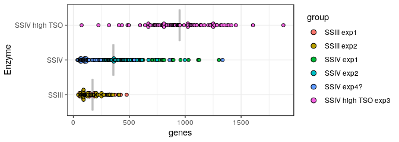<!-- -->


```r
dotsize <- 30
ggplot(CD %>% data.frame, aes(x=group, y=genes)) +
  stat_summary(fun.y=mean, fun.ymin=mean, fun.ymax=mean, geom="crossbar", color="gray") +
  geom_dotplot(aes(fill=group), binaxis='y', binwidth=1, dotsize=dotsize, stackdir='center') + theme_bw() +
  coord_flip()
```

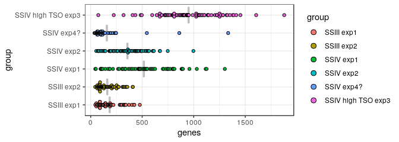<!-- -->

#### Transcripts counts


```r
dotsize <- 120
ggplot(CD %>% data.frame, aes(x=group2, y=counts)) +
  stat_summary(fun.y=mean, fun.ymin=mean, fun.ymax=mean, geom="crossbar", color="gray") +
  geom_dotplot(aes(fill=group), binaxis='y', binwidth=1, dotsize=dotsize, stackdir='center') + theme_bw() +
  xlab("Enzyme") +
  coord_flip()
```

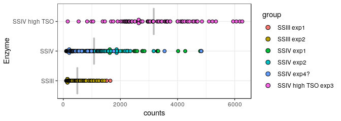<!-- -->


```r
dotsize <- 120
ggplot(CD %>% data.frame, aes(x=group, y=counts)) +
  stat_summary(fun.y=mean, fun.ymin=mean, fun.ymax=mean, geom="crossbar", color="gray") +
  geom_dotplot(aes(fill=group), binaxis='y', binwidth=1, dotsize=dotsize, stackdir='center') + theme_bw() +
  xlab("Enzyme") +
  coord_flip()
```

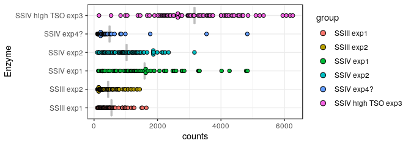<!-- -->

### PlotAnnot


```r
plotAnnot(CE, scope="counts", group="group")
```

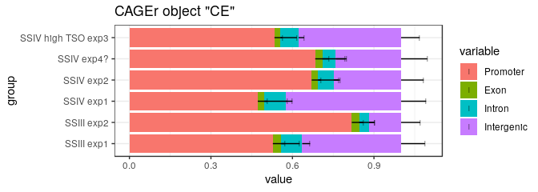<!-- -->

```r
plotAnnot(CE, scope="counts", group="group2")
```

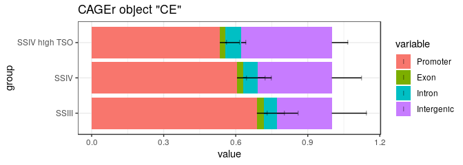<!-- -->

```r
plotAnnot(CE, scope="qc", group="group") + scale_fill_brewer(palette = "Set2")
```

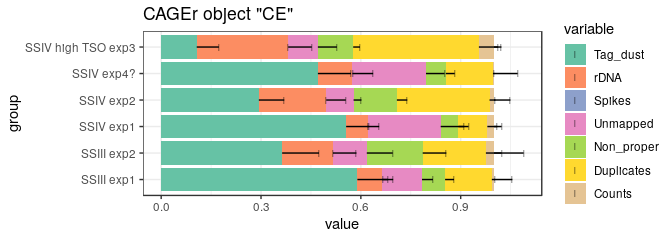<!-- -->

```r
plotAnnot(CE, scope="qc", group="group2")+ scale_fill_brewer(palette = "Set2")
```

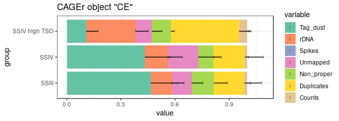<!-- -->

### Rarefaction

Raw reads per molecule (BED12 data)
-----------------------------------


```r
bed <- sapply(inputFiles(myCAGEexp), rtracklayer::import.bed)
names(bed) <- sampleLabels(myCAGEexp)
bed <- bed[myCAGEexp$keep]
```


```r
library(vegan)
# If applicable, restore the previous computation with the command below:
# load("rar.Rda")

# Rarefy at with enough sampling points to give a smooth appearance to
# the curves.  It can take time !

rar1 <- hanabi(CTSStagCountDF(CE), from = 0)
rarg <- hanabi(assay(GeneExpSE(CE)) %>% as.data.frame, from = 0)
rarU <- hanabi(bed, from = 0)

# Save the result on the hard drive.  This way, if the commands have
#been run
# through knitr, the long computations here can be skipped if needed
#again in
# an interactive session.
save(rar1, rarg, rarU, file="rar.Rda") 
```

### Graphs

#### Plot TSS discovery


```r
hanabiPlot(rar1, ylab='number of TSS detected', xlab='number of unique molecule counts', main=paste("TSS discovery"), group=CD$group2)
```

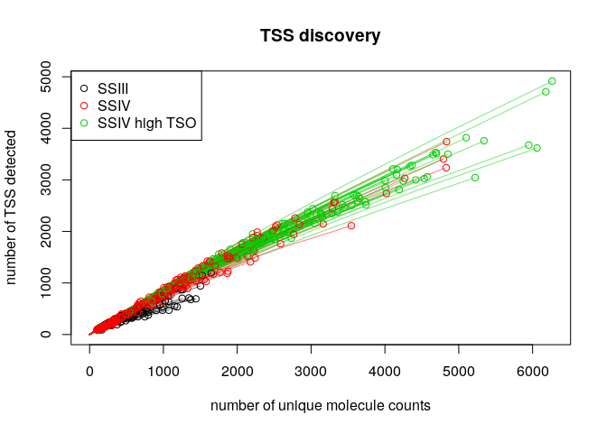<!-- -->


```r
hanabiPlot(rar1, ylab='number of TSS detected', xlab='number of unique molecule counts', main=paste("TSS discovery"), group=CD$group)
```

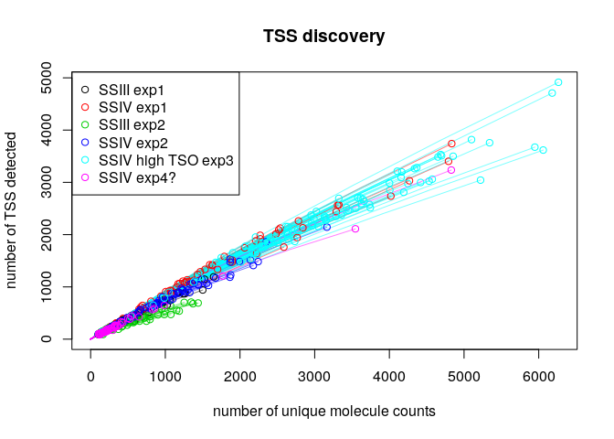<!-- -->

#### Plot Gene discovery


```r
hanabiPlot(rarg, ylab='number of genes detected', xlab='number of unique molecule counts', main=paste("Gene discovery"), group=CD$group2)
```

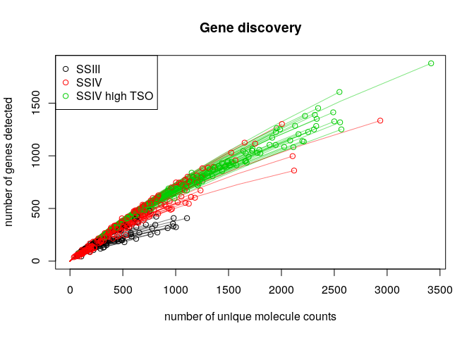<!-- -->


```r
hanabiPlot(rarg, ylab='number of genes detected', xlab='number of unique molecule counts', main=paste("Gene discovery"), group=CD$group)
```

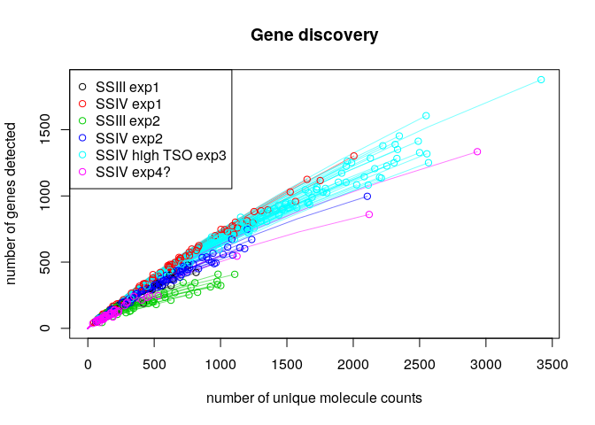<!-- -->

#### Plot Molecule discovery (with raw reads)


```r
hanabiPlot(rarU, ylab='number of molecules detected', xlab='number of properly mapped reads', main=paste("Transcript discovery "), group=CD$group2)
```

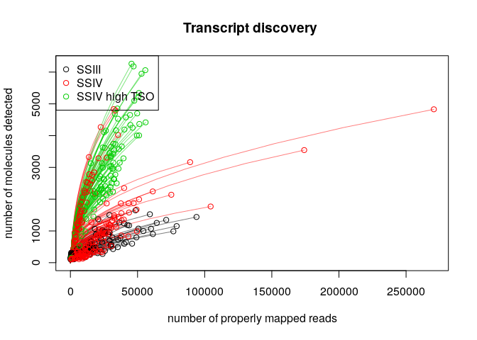<!-- -->


```r
hanabiPlot(rarU, ylab='number of molecules detected', xlab='number of properly mapped reads', main=paste("Transcript discovery"), group=CD$group, legend.pos = "topright")
```

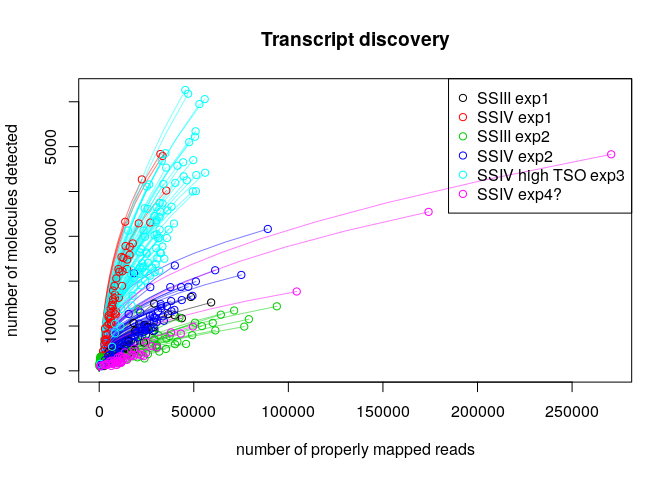<!-- -->

#### Richness


```r
qplot(data = CD %>% as.data.frame, group, r100l1, geom = c("boxplot", "jitter"))
```

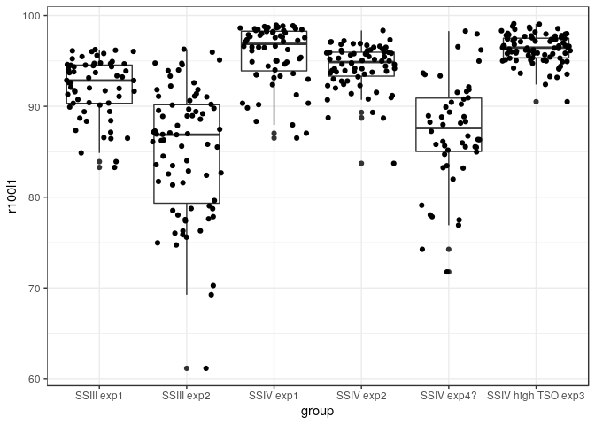<!-- -->

```r
qplot(data = CD %>% as.data.frame, group2, r100l1, geom = c("boxplot", "jitter"))
```

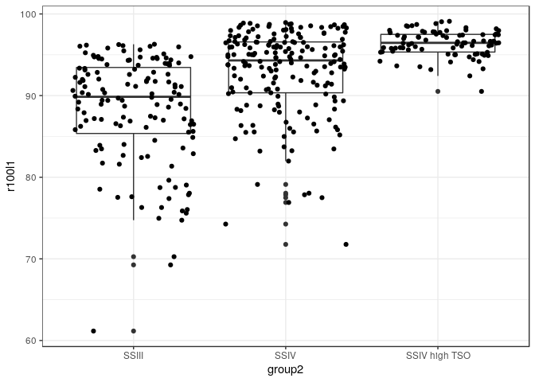<!-- -->
